[](https://developer.android.com/topic/architecture/ui-layer?hl=pt-br&utm_source=chatgpt.com)

# 036 — Flow vs LiveData

| Thuộc tính              | Nội dung                                 |
| ----------------------- | ---------------------------------------- |
| **Học phần**            | 03 — Architecture, State and Data        |
| **Module**              | Module 05 — Design and Architecture      |
| **Nhóm nội dung**       | Reactive State                           |
| **Nguồn roadmap**       | Design and Architecture / Reactive State |
| **Loại bài**            | Async / Reactive State                   |
| **Thứ tự trong module** | 036                                      |
| **Thời lượng gợi ý**    | 34 phút                                  |

---

## 1. Tóm tắt

**Flow** và **LiveData** đều có thể đưa dữ liệu thay đổi theo thời gian từ `ViewModel` tới UI, nhưng chúng thuộc hai cách tiếp cận khác nhau.

* **LiveData** là observable data holder của Android Jetpack, được thiết kế để **nhận biết lifecycle** của `Activity`/`Fragment`.
* **Flow** thuộc Kotlin Coroutines, dùng để biểu diễn **luồng dữ liệu bất đồng bộ**.
* **StateFlow** là biến thể của Flow đặc biệt phù hợp để biểu diễn **state hiện tại**.
* `Flow` bản thân **không tự lifecycle-aware**; UI Android cần thu thập nó bằng API phù hợp như `collectAsStateWithLifecycle()` hoặc `repeatOnLifecycle()`.
* Với kiến trúc Android hiện đại, Google khuyến nghị ViewModel cung cấp UI state và dùng lifecycle-aware collection; đối với ứng dụng mới, `StateFlow` là lựa chọn rất tự nhiên cho UI state. ([Android Developers][1])

Một mental model đơn giản:

```text
LiveData
    = Observable + Android Lifecycle

Flow
    = Async Stream + Coroutines

StateFlow
    = Flow + luôn có Current State
```

> **Điểm quan trọng nhất:** trong một app Android mới viết bằng Kotlin + Coroutines + Compose, câu hỏi thực tế thường không còn là **Flow hay LiveData**, mà là **Flow ở data/domain layer và StateFlow ở ViewModel/UI state**.

---

# 2. Mục tiêu học tập

Sau bài này, bạn có thể:

* Giải thích được sự khác biệt giữa `Flow`, `StateFlow` và `LiveData`.
* Hiểu vì sao `Flow` không tự động lifecycle-aware.
* Biết cách collect Flow an toàn trong **Jetpack Compose**.
* Biết cách collect Flow an toàn trong **Fragment/View system**.
* Hiểu khi nào nên giữ `LiveData` trong project cũ.
* Chuyển dần một màn hình từ `LiveData` sang `StateFlow`.
* Biết cách xử lý:

  * loading;
  * success;
  * error;
  * retry;
  * cancellation.
* Tránh mất tài nguyên khi app xuống background.
* Hiểu ảnh hưởng của rotate, lifecycle và process death tới state.
* Viết test cho reactive state.
* Có thể giải thích lựa chọn Flow/LiveData trong phỏng vấn Android.

---

# 3. Vị trí của Flow và LiveData trong kiến trúc Android

Kiến trúc UI hiện đại thường tuân theo **Unidirectional Data Flow — UDF**: event đi từ UI lên trên, state đi từ data/ViewModel xuống UI. Đây cũng là hướng kiến trúc mà tài liệu Android hiện tại khuyến nghị. ([Android Developers][1])


*Nguồn hình: Android Developers — UI Layer.*

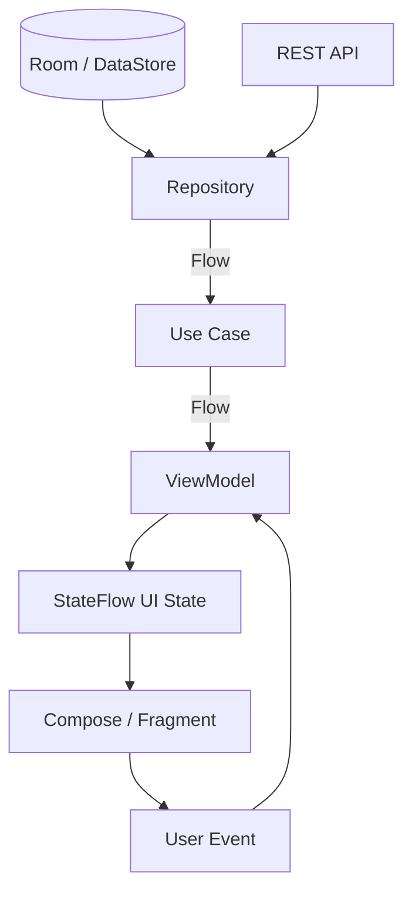

Một kiến trúc phổ biến:

```text
Room / API
     │
     │ Flow<Data>
     ▼
 Repository
     │
     │ Flow<DomainModel>
     ▼
  UseCase
     │
     ▼
 ViewModel
     │
     │ StateFlow<UiState>
     ▼
 Compose UI
```

LiveData thường xuất hiện nhiều trong kiến trúc Android View truyền thống:

```text
Repository
     │
     ▼
 ViewModel
     │
     │ LiveData<UiState>
     ▼
 Fragment
     │
 observe(viewLifecycleOwner)
     ▼
    View
```

---

# 4. LiveData là gì?

`LiveData<T>` là một **observable data holder** thuộc Android Jetpack.

Điểm đặc biệt của LiveData là nó biết lifecycle của `LifecycleOwner`. Khi Activity hoặc Fragment không còn ở trạng thái active thích hợp, observer gắn bằng lifecycle owner sẽ không tiếp tục nhận UI updates; khi owner bị destroy, subscription tương ứng được loại bỏ. ([Android Developers][2])

Ví dụ:

```kotlin
class ProfileViewModel : ViewModel() {

    private val _username = MutableLiveData<String>()

    val username: LiveData<String>
        get() = _username

    fun updateUsername(name: String) {
        _username.value = name
    }
}
```

Fragment:

```kotlin
class ProfileFragment : Fragment(R.layout.fragment_profile) {

    private val viewModel: ProfileViewModel by viewModels()

    override fun onViewCreated(
        view: View,
        savedInstanceState: Bundle?
    ) {
        viewModel.username.observe(viewLifecycleOwner) { name ->
            binding.usernameText.text = name
        }
    }
}
```

Ở đây:

```text
MutableLiveData
      │
      │ value = ...
      ▼
   LiveData
      │
      │ observe(viewLifecycleOwner)
      ▼
   Fragment
```

### Điểm mạnh lớn nhất của LiveData

Lifecycle handling tương đối đơn giản:

```kotlin
liveData.observe(viewLifecycleOwner) {
    // update UI
}
```

Developer không phải tự viết logic:

```text
onStart → subscribe
onStop → unsubscribe
```

LiveData xử lý phần lifecycle observation này cho observer. ([Android Developers][2])

---

# 5. Flow là gì?

`Flow<T>` thuộc **Kotlin Coroutines**.

Nó biểu diễn một chuỗi giá trị được phát ra theo thời gian.

Ví dụ:

```kotlin
val numbers: Flow<Int> = flow {
    emit(1)
    delay(1000)

    emit(2)
    delay(1000)

    emit(3)
}
```

Collector:

```kotlin
numbers.collect { number ->
    println(number)
}
```

Kết quả:

```text
1
2
3
```

Flow có hệ operator rất mạnh:

```text
map
filter
combine
zip
transform
debounce
distinctUntilChanged
flatMapLatest
catch
retry
retryWhen
onStart
onEach
flowOn
stateIn
shareIn
```

Điều này khiến Flow phù hợp không chỉ với UI state mà cả:

```text
Database
Network
Search
Realtime stream
DataStore
Repository
Domain logic
Reactive pipeline
```

Kotlin phân biệt các dạng Flow quan trọng. `SharedFlow` là hot flow phát dữ liệu tới nhiều subscriber, còn `StateFlow` là một dạng SharedFlow chuyên biệt luôn giữ state mới nhất. ([Kotlin][3])

---

# 6. Cold Flow và Hot Flow

Đây là khác biệt rất quan trọng.

## 6.1 Cold Flow

Một Flow được tạo như:

```kotlin
flow {
    ...
}
```

thường hoạt động theo kiểu **cold stream**.

Mỗi collector có thể làm pipeline chạy lại.

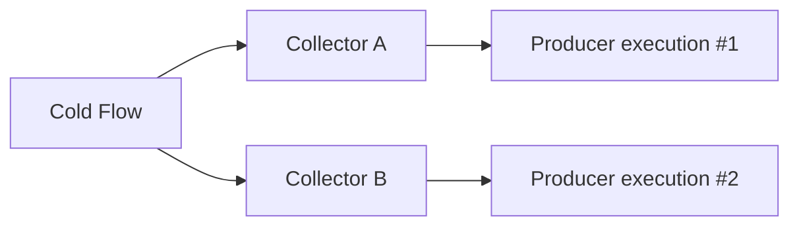

Ví dụ:

```kotlin
val products = flow {

    println("Calling server")

    emit(api.getProducts())
}
```

Hai lần collect:

```kotlin
products.collect()
products.collect()
```

có thể khiến producer chạy hai lần.

Tài liệu Kotlin lưu ý Flow interface về bản chất không bắt buộc mọi implementation đều cold; `SharedFlow` và `StateFlow` là những hot-flow implementation quan trọng. ([Kotlin][4])

---

# 7. StateFlow là gì?

`StateFlow<T>` dùng để biểu diễn:

> **State hiện tại + các thay đổi state trong tương lai.**

Ví dụ:

```kotlin
private val _uiState =
    MutableStateFlow(ProfileUiState())

val uiState: StateFlow<ProfileUiState> =
    _uiState.asStateFlow()
```

Update:

```kotlin
_uiState.update {
    it.copy(
        username = "An",
        isLoading = false
    )
}
```

StateFlow luôn chứa giá trị hiện tại:

```kotlin
val currentState = uiState.value
```

Kotlin mô tả `StateFlow` là một `SharedFlow` chuyên biệt cho trường hợp chia sẻ state và luôn giữ latest state. ([Kotlin][5])

---

# 8. LiveData vs Flow vs StateFlow

| Tiêu chí                 | LiveData                           | Flow                            | StateFlow                         |
| ------------------------ | ---------------------------------- | ------------------------------- | --------------------------------- |
| Thuộc                    | Android Jetpack                    | Kotlin Coroutines               | Kotlin Coroutines                 |
| Mục đích chính           | Observable data                    | Async stream                    | Observable state                  |
| Lifecycle-aware mặc định | ✅                                  | ❌                               | ❌                                 |
| Cần initial value        | Không bắt buộc                     | Không                           | ✅                                 |
| Có current value         | Có thể có                          | Không nhất thiết                | ✅ `value`                         |
| Cold/Hot                 | Hot observable                     | Thường cold                     | Hot                               |
| Coroutine-native         | Không hoàn toàn                    | ✅                               | ✅                                 |
| Operator phong phú       | Hạn chế hơn                        | ✅                               | ✅                                 |
| `map/filter/combine`     | Có giới hạn                        | ✅                               | ✅                                 |
| Cancellation             | Qua observer/lifecycle             | Coroutine cancellation          | Coroutine cancellation            |
| Compose                  | Có `observeAsState()`              | `collectAsStateWithLifecycle()` | `collectAsStateWithLifecycle()`   |
| Views/XML                | Rất thuận tiện                     | `repeatOnLifecycle`             | `repeatOnLifecycle`               |
| Repository               | Không nên là lựa chọn mặc định mới | ✅ Rất phù hợp                   | Có thể                            |
| UI state                 | Có thể                             | Có thể                          | **Rất phù hợp**                   |
| Java project             | Thuận tiện hơn                     | Kotlin-centric                  | Kotlin-centric                    |
| Project Android cũ       | ✅ Phổ biến                         | Có thể migration                | Có thể migration                  |
| App Kotlin mới           | Có thể                             | ✅                               | **✅ thường ưu tiên cho UI state** |

Android hiện khuyến nghị ViewModel expose UI state, lifecycle-aware collection, và trong tài liệu dành cho Views nêu cụ thể `uiState` nên là `StateFlow`. ([Android Developers][6])

---

# 9. Điểm dễ nhầm nhất: Flow không lifecycle-aware

Giả sử viết:

```kotlin
lifecycleScope.launch {
    viewModel.uiState.collect {
        render(it)
    }
}
```

Coroutine trên có lifetime của `lifecycleScope`.

Nhưng điều đó **không đồng nghĩa** với:

```text
STOPPED
→ Flow tự động ngừng collect
```

Đối với View-based UI, Android khuyến nghị sử dụng:

```kotlin
repeatOnLifecycle(Lifecycle.State.STARTED)
```

để collection được khởi động khi lifecycle đạt `STARTED`, dừng khi xuống dưới trạng thái đó và chạy lại khi UI quay trở lại. ([Android Developers][6])

---

# 10. Flow + lifecycle trong Fragment

## Không nên

```kotlin
viewLifecycleOwner.lifecycleScope.launch {

    viewModel.uiState.collect { state ->
        render(state)
    }
}
```

Collection có thể tiếp tục trong những khoảng thời gian UI không ở trạng thái muốn render.

---

## Nên dùng

```kotlin
viewLifecycleOwner.lifecycleScope.launch {

    viewLifecycleOwner.repeatOnLifecycle(
        Lifecycle.State.STARTED
    ) {

        viewModel.uiState.collect { state ->
            render(state)
        }
    }
}
```

Luồng hoạt động:

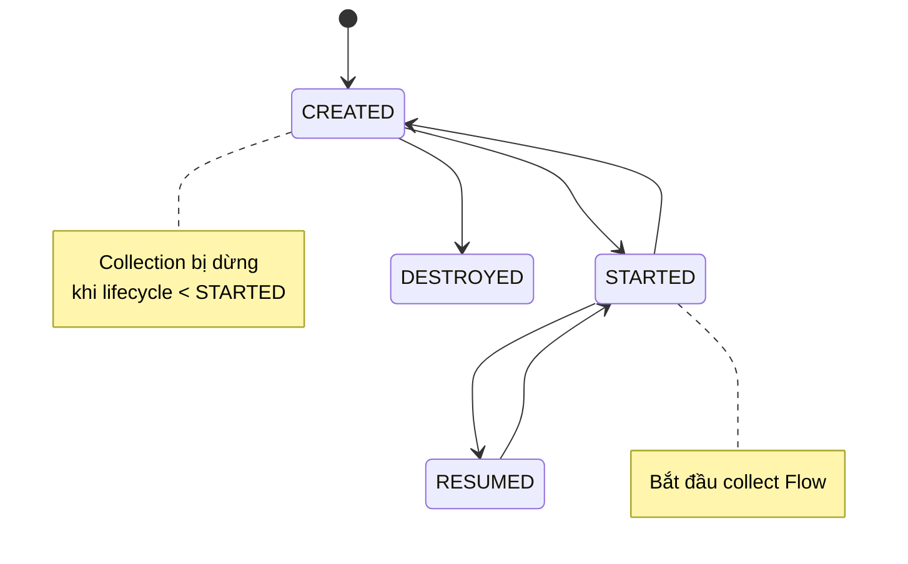

Android hiện xem `repeatOnLifecycle()` là pattern phù hợp cho lifecycle-aware collection trong View system. ([Android Developers][7])

---

# 11. StateFlow trong Jetpack Compose

Trong Compose, cách phổ biến là:

```kotlin
@Composable
fun ProfileScreen(
    viewModel: ProfileViewModel
) {

    val uiState by viewModel.uiState
        .collectAsStateWithLifecycle()

    ProfileContent(
        uiState = uiState
    )
}
```

Không cần:

```kotlin
LaunchedEffect(Unit) {
    viewModel.uiState.collect { ... }
}
```

chỉ để render screen state.

`collectAsStateWithLifecycle()` chuyển Flow thành Compose `State` và collection thay đổi theo lifecycle của host. Android hiện khuyến nghị API này để collect Flow trong Android Compose. ([Android Developers][8])

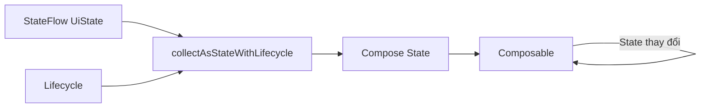

---

# 12. LiveData trong Compose

Compose vẫn hỗ trợ LiveData.

```kotlin
val user by viewModel.user.observeAsState()
```

Ví dụ:

```kotlin
@Composable
fun ProfileScreen(
    viewModel: ProfileViewModel
) {

    val user by viewModel.user.observeAsState()

    Text(
        text = user?.name ?: "Loading..."
    )
}
```

Vì vậy:

```text
LiveData + Compose
```

không sai.

Tuy nhiên với codebase Kotlin/Coroutines mới, `StateFlow` thường tích hợp tự nhiên hơn với repository/domain Flow pipeline. Compose hỗ trợ cả `LiveData.observeAsState()` và Flow thông qua lifecycle-aware state collection. ([Android Developers][9])

---

# 13. Ví dụ thực tế — màn hình Product

Ta muốn xây dựng:

```text
ProductScreen
```

gồm:

```text
Loading
   ↓
Products
   ↓
Error
   ↓
Retry
```

---

## 13.1 Định nghĩa UI State

```kotlin
data class ProductUiState(
    val isLoading: Boolean = true,
    val products: List<Product> = emptyList(),
    val errorMessage: String? = null
)
```

---

# 14. Cách cũ với LiveData

```kotlin
class ProductViewModel(
    private val repository: ProductRepository
) : ViewModel() {

    private val _uiState =
        MutableLiveData(ProductUiState())

    val uiState: LiveData<ProductUiState>
        get() = _uiState

    fun loadProducts() {

        viewModelScope.launch {

            _uiState.value =
                ProductUiState(
                    isLoading = true
                )

            try {

                val products =
                    repository.getProducts()

                _uiState.value =
                    ProductUiState(
                        isLoading = false,
                        products = products
                    )

            } catch (e: Exception) {

                _uiState.value =
                    ProductUiState(
                        isLoading = false,
                        errorMessage = e.message
                    )
            }
        }
    }
}
```

UI:

```kotlin
viewModel.uiState.observe(
    viewLifecycleOwner
) { state ->

    render(state)
}
```

Cách này vẫn hợp lệ.

Nhưng nếu Repository đã dùng Flow thì phải chuyển đổi hoặc observe qua nhiều tầng.

---

# 15. Cách hiện đại với Flow + StateFlow

Repository:

```kotlin
interface ProductRepository {

    fun observeProducts(): Flow<List<Product>>
}
```

Implementation:

```kotlin
class ProductRepositoryImpl(
    private val dao: ProductDao
) : ProductRepository {

    override fun observeProducts(): Flow<List<Product>> {
        return dao.observeProducts()
    }
}
```

ViewModel:

```kotlin
class ProductViewModel(
    repository: ProductRepository
) : ViewModel() {

    val uiState: StateFlow<ProductUiState> =
        repository
            .observeProducts()
            .map { products ->

                ProductUiState(
                    isLoading = false,
                    products = products
                )
            }
            .catch { error ->

                emit(
                    ProductUiState(
                        isLoading = false,
                        errorMessage =
                            error.message
                                ?: "Unknown error"
                    )
                )
            }
            .stateIn(
                scope = viewModelScope,
                started =
                    SharingStarted
                        .WhileSubscribed(5_000),
                initialValue =
                    ProductUiState()
            )
}
```

`stateIn()` chuyển một Flow thành `StateFlow`, chia sẻ latest value từ một upstream pipeline. ([Kotlin][10])

Android hiện cũng minh họa pattern:

```kotlin
stateIn(
    scope = viewModelScope,
    started = SharingStarted.WhileSubscribed(5_000),
    initialValue = ...
)
```

cho ViewModel state trong View-based architecture guidance. ([Android Developers][6])

---

# 16. Vì sao `WhileSubscribed(5_000)`?

Xem pipeline:

```text
Database
   │
   ▼
Flow
   │
   ▼
map()
   │
   ▼
stateIn()
   │
   ▼
StateFlow
   │
   ▼
UI
```

Nếu UI tạm thời mất subscriber do configuration change:

```text
Rotate
 ↓
Fragment cũ destroyed
 ↓
Fragment mới created
```

ta không nhất thiết muốn upstream bị:

```text
STOP
START
STOP
START
```

ngay lập tức.

Timeout ngắn có thể giữ producer tồn tại qua một số transient UI recreation.

```mermaid
sequenceDiagram

    participant UI
    participant StateFlow
    participant Repo

    UI->>StateFlow: subscribe
    StateFlow->>Repo: start upstream

    UI-->>StateFlow: unsubscribe
    Note over StateFlow: chờ timeout

    UI->>StateFlow: subscribe lại

    Note over StateFlow,Repo:
        upstream có thể tiếp tục
        thay vì restart ngay
```

---

# 17. `Flow` không phải công cụ tự động chuyển background thread

Một lỗi tư duy phổ biến:

```text
Dùng Flow
=
code tự chạy background
```

**Sai.**

Flow là abstraction cho stream.

Thread/context vẫn phụ thuộc coroutine context và implementation.

Ví dụ producer cần IO:

```kotlin
class ProductRepository(
    private val api: ProductApi,
    private val ioDispatcher: CoroutineDispatcher
) {

    fun products(): Flow<List<Product>> =
        flow {

            emit(
                api.getProducts()
            )

        }.flowOn(ioDispatcher)
}
```

```text
flowOn(IO)
      │
      ▼
upstream work
      │
      ▼
Flow
      │
      ▼
ViewModel
```

Điều cần học không phải:

> "Flow chạy background."

mà là:

> "Coroutine dispatcher quyết định nơi công việc chạy; Flow hỗ trợ xây dựng pipeline bất đồng bộ và `flowOn` có thể thay context của phần upstream."

---

# 18. Cancellation

Cancellation là một ưu điểm quan trọng khi Flow đi cùng structured concurrency.

Ví dụ search:

```kotlin
searchQuery
    .debounce(300)
    .distinctUntilChanged()
    .flatMapLatest { query ->

        repository.search(query)
    }
```

Giả sử user nhập:

```text
a
 ↓
an
 ↓
android
```

Với `flatMapLatest`:

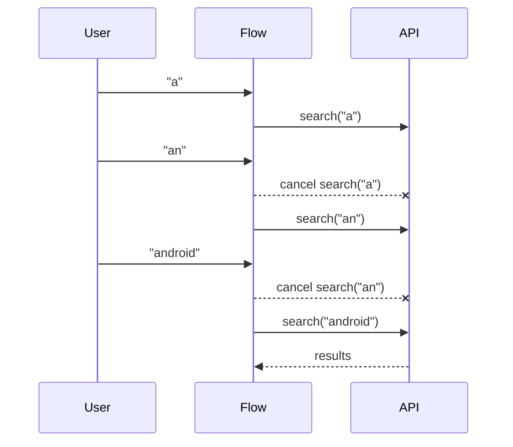

Điều này rất hữu ích cho:

* autocomplete;
* search;
* filtering;
* realtime queries.

---

# 19. `collect` vs `collectLatest`

`collect`:

```kotlin
flow.collect { value ->
    render(value)
}
```

Mỗi block phải hoàn thành trước khi xử lý tiếp.

---

`collectLatest`:

```kotlin
flow.collectLatest { value ->
    renderExpensiveContent(value)
}
```

Nếu value mới đến trước khi block cũ xong:

```text
value 1
 ↓
processing...
 ↓
value 2 đến
 ↓
cancel processing value 1
 ↓
process value 2
```

Thích hợp khi:

> kết quả mới làm kết quả cũ không còn quan trọng.

---

# 20. Error handling với Flow

Pipeline:

```kotlin
repository
    .products()
    .map { products ->
        ProductUiState.Success(products)
    }
    .catch {
        emit(
            ProductUiState.Error(
                message = it.message
            )
        )
    }
```

Sơ đồ:

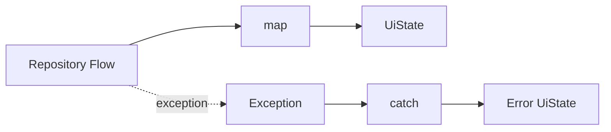

`catch` rất tiện nhưng cần nhớ nó xử lý exception của **upstream** của operator đó.

---

# 21. Retry với Flow

Ví dụ:

```kotlin
repository
    .products()
    .retryWhen { cause, attempt ->

        cause is IOException &&
            attempt < 3
    }
```

Có thể thêm delay:

```kotlin
.retryWhen { cause, attempt ->

    if (
        cause is IOException &&
        attempt < 3
    ) {

        delay(
            1_000L * (attempt + 1)
        )

        true

    } else {
        false
    }
}
```

Không nên viết:

```kotlin
.retry {
    true
}
```

với mọi lỗi.

Vì có thể tạo:

```text
request
 ↓
fail
 ↓
retry
 ↓
fail
 ↓
retry
 ↓
fail
 ↓
...
```

gây:

* tốn pin;
* spam server;
* tốn data;
* khó debug.

---

# 22. Flow rất mạnh khi combine nhiều nguồn state

Ví dụ màn hình cần:

```text
User
+
Cart
+
Network
```

Flow:

```kotlin
combine(
    userFlow,
    cartFlow,
    connectionFlow
) { user, cart, connection ->

    HomeUiState(
        user = user,
        cart = cart,
        isOnline = connection.isOnline
    )
}
```

Sơ đồ:

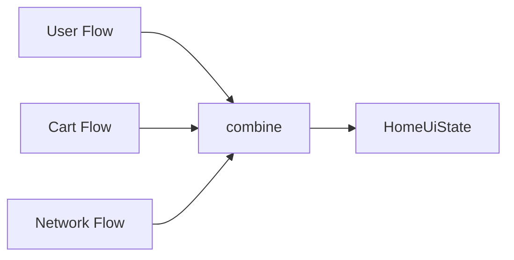

Đây là một trong những trường hợp Flow thường dễ mở rộng hơn một mạng lưới nhiều `LiveData`.

---

# 23. Data layer nên trả về Flow hay LiveData?

Đối với codebase Kotlin hiện đại, thường ưu tiên:

```kotlin
interface Repository {

    fun observeProducts():
        Flow<List<Product>>
}
```

thay vì:

```kotlin
fun observeProducts():
    LiveData<List<Product>>
```

Lý do kiến trúc:

```text
Repository
```

không nên cần biết:

```text
Activity
Fragment
Android UI Lifecycle
```

Flow thuộc coroutine/Kotlin abstraction và phù hợp để truyền stream qua data/domain layers. Android architecture guidance cũng khuyến nghị ViewModel tương tác với data/domain bằng Kotlin flows cho dữ liệu dạng stream và suspend functions cho actions. ([Android Developers][6])

---

# 24. LiveData vẫn phù hợp khi nào?

Không nên hiểu:

> Flow mới → LiveData vô dụng.

LiveData vẫn hợp lý nếu:

### Project View/XML cũ

Codebase hiện đang có:

```text
Fragment
+
Data Binding
+
LiveData
```

và hoạt động ổn định.

Không có lý do business rõ ràng để rewrite toàn bộ.

---

### Java-heavy project

Flow là Kotlin-first.

LiveData thuận tiện hơn khi codebase có nhiều Java.

---

### Migration từng bước

Ví dụ tầng cũ:

```text
Repository
 ↓
LiveData
 ↓
Fragment
```

có thể giữ nguyên trong khi những feature mới dùng:

```text
Repository Flow
 ↓
StateFlow
 ↓
Compose
```

---

# 25. Interoperability — không cần rewrite cả project

Android cung cấp interoperability giữa hai hệ.

## Flow → LiveData

```kotlin
val users: LiveData<List<User>> =
    repository
        .observeUsers()
        .asLiveData()
```

---

## LiveData → Flow

```kotlin
val usersFlow: Flow<List<User>> =
    usersLiveData.asFlow()
```

AndroidX Lifecycle có các extension liên quan tới `asFlow()` và `asLiveData()`, giúp migration dần thay vì buộc phải đổi toàn bộ code cùng lúc. ([Android Developers][11])

---

# 26. Migration pattern thực tế

Giả sử hiện tại:

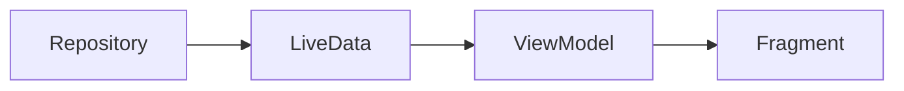

Không cần:

```text
Rewrite toàn bộ app
```

Có thể migration:

### Bước 1

Repository mới trả:

```kotlin
Flow<Data>
```

### Bước 2

ViewModel:

```kotlin
Flow
 ↓
stateIn
 ↓
StateFlow
```

### Bước 3

Fragment:

```kotlin
repeatOnLifecycle
```

### Bước 4

Sau này chuyển UI:

```text
Fragment/XML
       ↓
Compose
       ↓
collectAsStateWithLifecycle
```

---

# 27. Rotation — Flow và LiveData có mất state không?

Câu trả lời phụ thuộc **state nằm ở đâu**.

Giả sử:

```text
Activity
   │
   ▼
ViewModel
   │
   ▼
StateFlow
```

Khi rotate:

```text
Activity A
   ↓ destroyed

ViewModel
   ↓ vẫn tồn tại

Activity B
   ↓ nhận lại state
```

ViewModel được thiết kế để survive configuration changes như rotation. ([Android Developers][12])


> StateFlow hay LiveData không phải lý do chính giúp state survive rotate. **ViewModel scope** mới là phần quan trọng.

---

# 28. Nhưng ViewModel không tự giải quyết Process Death

Một hiểu nhầm nguy hiểm:

```text
ViewModel
=
state tồn tại mãi
```

Không.

Nếu Android kill process:

```text
App process
      ↓
     killed

ViewModel
      ↓
     mất
```

Đối với state cần phục hồi:

```text
SavedStateHandle
Room
DataStore
Backend
```

có thể cần tham gia.

Android documentation cũng nhấn mạnh ViewModel giữ state qua configuration recreation nhưng không phải persistent storage qua process death. ([Android Developers][13])

---

# 29. StateFlow + SavedStateHandle

Ví dụ search query:

```kotlin
class SearchViewModel(
    private val savedStateHandle: SavedStateHandle
) : ViewModel() {

    val query =
        savedStateHandle
            .getStateFlow(
                key = "query",
                initialValue = ""
            )

    fun onQueryChanged(
        query: String
    ) {

        savedStateHandle["query"] =
            query
    }
}
```

Pipeline:

```text
TextField
   ↓
ViewModel
   ↓
SavedStateHandle
   ↓
StateFlow
   ↓
UI
```

---

# 30. UI State nên immutable

Không nên:

```kotlin
data class UiState(
    val products: MutableList<Product>
)
```

Nên:

```kotlin
data class UiState(
    val products: List<Product>
)
```

Sau đó update:

```kotlin
_uiState.update { state ->

    state.copy(
        products = newProducts
    )
}
```

Mental model:

```text
Old State
   │
   │ copy(...)
   ▼
New State
   │
   ▼
UI render
```

Không mutate state ngầm:

```text
same object
   ↓
internal mutation
   ↓
UI khó xác định thay đổi
```

---

# 31. Ví dụ hoàn chỉnh với Compose

## UI State

```kotlin
sealed interface ProductUiState {

    data object Loading :
        ProductUiState

    data class Success(
        val products: List<Product>
    ) : ProductUiState

    data class Error(
        val message: String
    ) : ProductUiState
}
```

---

## Repository

```kotlin
interface ProductRepository {

    fun observeProducts():
        Flow<List<Product>>
}
```

---

## ViewModel

```kotlin
class ProductViewModel(
    repository: ProductRepository
) : ViewModel() {

    val uiState: StateFlow<ProductUiState> =
        repository
            .observeProducts()
            .map<List<Product>, ProductUiState> {
                products ->

                ProductUiState.Success(
                    products
                )
            }
            .catch { error ->

                emit(
                    ProductUiState.Error(
                        error.message
                            ?: "Unexpected error"
                    )
                )
            }
            .stateIn(
                scope = viewModelScope,

                started =
                    SharingStarted
                        .WhileSubscribed(5_000),

                initialValue =
                    ProductUiState.Loading
            )
}
```

---

## Compose

```kotlin
@Composable
fun ProductRoute(
    viewModel: ProductViewModel
) {

    val uiState by viewModel
        .uiState
        .collectAsStateWithLifecycle()

    ProductScreen(
        uiState = uiState
    )
}
```

---

## Stateless Screen

```kotlin
@Composable
fun ProductScreen(
    uiState: ProductUiState
) {

    when (uiState) {

        ProductUiState.Loading -> {
            CircularProgressIndicator()
        }

        is ProductUiState.Success -> {

            LazyColumn {

                items(
                    uiState.products
                ) { product ->

                    Text(
                        product.name
                    )
                }
            }
        }

        is ProductUiState.Error -> {

            Text(
                text = uiState.message
            )
        }
    }
}
```

---

# 32. Luồng hoàn chỉnh của ví dụ

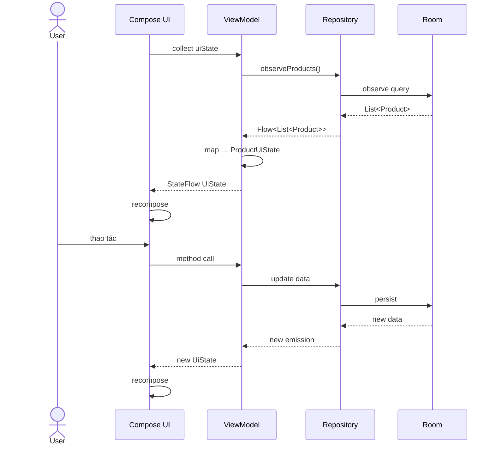

Đây chính là UDF:

```text
EVENT ↑
STATE ↓
```

---

# 33. One-off event — một điểm cần đặc biệt cẩn thận

Code cũ thường có:

```kotlin
val navigateToDetail =
    MutableLiveData<Event<Int>>()
```

hoặc:

```kotlin
MutableSharedFlow<UiEvent>()
```

để gửi:

```text
Toast
Snackbar
Navigation
```

Tuy nhiên hướng dẫn kiến trúc Android hiện tại khuyến nghị mạnh rằng ViewModel nên **xử lý event và đưa kết quả vào state**, thay vì đơn giản phát một event tạm thời sang UI rồi hy vọng collector đang hoạt động. ([Android Developers][1])

Ví dụ thay vì:

```text
Save successful
      ↓
emit NavigateEvent
```

có thể model:

```kotlin
data class EditUiState(
    val isSaving: Boolean = false,
    val savedItemId: Long? = null
)
```

UI thấy:

```text
savedItemId != null
```

thì tiến hành điều hướng theo logic của UI.

Điều này đặc biệt hữu ích khi:

```text
app background
screen rotate
collector tạm dừng
```

vì kết quả nghiệp vụ vẫn được biểu diễn bởi state.

---

# 34. Flow và performance

Flow không tự động làm app nhanh hơn.

Performance phụ thuộc:

```text
Bao nhiêu producer?
Bao nhiêu collector?
Upstream có bị restart?
Có query DB lặp không?
Có combine quá nhiều?
Có map object lớn?
Có collect khi UI background?
```

Ví dụ sai:

```kotlin
@Composable
fun Screen(
    viewModel: MyViewModel
) {

    LaunchedEffect(Unit) {

        viewModel.flow.collect {
            ...
        }
    }
}
```

cho một state lẽ ra có thể thu bằng lifecycle-aware state collection.

Thay bằng:

```kotlin
val state by viewModel
    .uiState
    .collectAsStateWithLifecycle()
```

API này dừng/restart collection theo lifecycle threshold và được Android khuyến nghị cho Compose Android. ([Android Developers][8])

---

# 35. Debug reactive state

Một kỹ thuật rất hữu ích là log **state transition**.

```kotlin
uiState
    .onEach { state ->

        Log.d(
            "ProductState",
            "state=$state"
        )
    }
```

Thay vì log:

```text
something happened
```

hãy log:

```text
Loading
→ Success(products=20)

Success(products=20)
→ Loading

Loading
→ Error(timeout)
```

---

## State transition diagram

```mermaid
stateDiagram-v2

    [*] --> Loading

    Loading --> Success :
        data received

    Loading --> Error :
        request failed

    Error --> Loading :
        retry

    Success --> Loading :
        refresh

    Success --> Success :
        data updated
```

Nếu state chuyển:

```text
Success
→ Error
→ Success
→ Error
```

liên tục, bạn có dấu hiệu để điều tra:

* network retry loop;
* duplicate collectors;
* producer restart;
* unstable repository;
* lifecycle issue.

---

# 36. Test Flow

Giả sử repository giả:

```kotlin
class FakeProductRepository :
    ProductRepository {

    override fun observeProducts():
        Flow<List<Product>> =
        flowOf(
            listOf(
                Product(
                    id = 1,
                    name = "Phone"
                )
            )
        )
}
```

Test:

```kotlin
@Test
fun products_are_exposed() = runTest {

    val repository =
        FakeProductRepository()

    val products =
        repository
            .observeProducts()
            .first()

    assertEquals(
        "Phone",
        products.first().name
    )
}
```

Flow rất thuận tiện để test bằng coroutine test APIs vì ta có thể:

```text
first()
take()
toList()
first { condition }
```

---

# 37. Test ViewModel StateFlow

Ví dụ:

```kotlin
@Test
fun uiState_contains_products() =
    runTest {

        val viewModel =
            ProductViewModel(
                FakeProductRepository()
            )

        val state =
            viewModel.uiState.first {
                it is ProductUiState.Success
            }

        assertTrue(
            state is ProductUiState.Success
        )
    }
```

Production test suite nên kiểm tra ít nhất:

```text
Initial
Loading
Success
Error
Retry
```

---

# 38. Test LiveData

Với LiveData unit test thường phải xử lý executor/lifecycle behavior.

Một pattern phổ biến trong JVM test là:

```kotlin
@get:Rule
val instantTaskExecutorRule =
    InstantTaskExecutorRule()
```

rồi observe/get value trong test.

Điều này là một lý do coroutine-based pipelines thường tạo cảm giác thống nhất hơn trong project đã dùng Kotlin Coroutines ở data/domain layers.

---

# 39. Những lỗi thường gặp

## Lỗi 1 — Exposure MutableStateFlow

Không nên:

```kotlin
val uiState =
    MutableStateFlow(...)
```

public.

UI có thể làm:

```kotlin
viewModel.uiState.value =
    ...
```

Phá ownership.

Nên:

```kotlin
private val _uiState =
    MutableStateFlow(...)

val uiState =
    _uiState.asStateFlow()
```

---

## Lỗi 2 — Repository expose MutableFlow

Không nên:

```kotlin
fun state():
    MutableStateFlow<State>
```

Nên chỉ expose:

```kotlin
StateFlow<State>
```

hoặc:

```kotlin
Flow<State>
```

---

## Lỗi 3 — Collect Flow không theo lifecycle

```kotlin
lifecycleScope.launch {
    flow.collect()
}
```

thay bằng Views:

```kotlin
repeatOnLifecycle(
    Lifecycle.State.STARTED
) {
    flow.collect()
}
```

hoặc Compose:

```kotlin
collectAsStateWithLifecycle()
```

---

## Lỗi 4 — Dùng Flow cho mọi thứ

Không phải tất cả dữ liệu đều cần stream.

Nếu action là:

```text
Save product
```

đơn giản có thể dùng:

```kotlin
suspend fun saveProduct(
    product: Product
)
```

Không nhất thiết:

```kotlin
fun saveProduct():
    Flow<SaveResult>
```

---

# 40. Stream hay suspend function?

Quy tắc mental model:

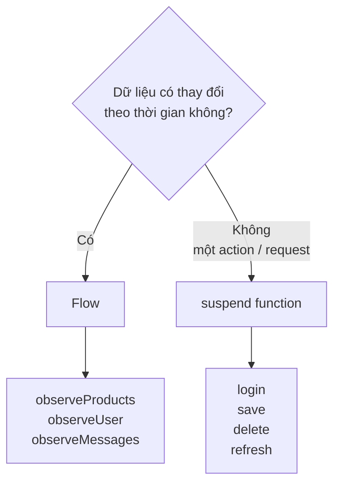

Ví dụ:

```kotlin
interface ProductRepository {

    fun observeProducts():
        Flow<List<Product>>

    suspend fun refreshProducts()

    suspend fun deleteProduct(
        id: Long
    )
}
```

Đây thường là API rõ ràng hơn.

---

# 41. Khi nào chọn gì?

```mermaid
flowchart TD

    START{Bạn đang xây gì?}

    START --> NEW[
        App Kotlin mới
    ]

    START --> OLD[
        Legacy Android
    ]

    NEW --> DATA{
        Dữ liệu thay đổi
        theo thời gian?
    }

    DATA -->|Có| FLOW[
        Repository Flow
    ]

    DATA -->|Không| SUSPEND[
        suspend function
    ]

    FLOW --> STATE[
        ViewModel StateFlow
    ]

    STATE --> COMPOSE{
        UI?
    }

    COMPOSE -->|Compose|
        CAS[collectAsStateWithLifecycle]

    COMPOSE -->|Views|
        REPEAT[repeatOnLifecycle]

    OLD --> LIVE{
        LiveData đang hoạt động tốt?
    }

    LIVE -->|Có|
        KEEP[Giữ LiveData]

    LIVE -->|Cần coroutine pipeline|
        MIGRATE[Migrate dần sang Flow]
```

---

# 42. Quy tắc chọn nhanh

### Chọn `Flow`

Khi làm:

* Room stream;
* DataStore stream;
* reactive repository;
* search;
* combine dữ liệu;
* realtime updates;
* data/domain pipelines.

---

### Chọn `StateFlow`

Khi cần biểu diễn:

```text
Current Screen State
```

ví dụ:

```text
HomeUiState
ProfileUiState
SearchUiState
CheckoutUiState
```

---

### Giữ `LiveData`

Khi:

* ứng dụng legacy;
* View/XML architecture ổn định;
* Java-heavy;
* migration chưa mang lại giá trị đủ lớn.

---

# 43. Flow vs LiveData trong một câu

## LiveData

> **Observable Android data holder có lifecycle awareness tích hợp.**

## Flow

> **Reactive asynchronous stream API của Kotlin Coroutines.**

## StateFlow

> **Hot Flow luôn giữ current state, phù hợp để expose UI state.**

---

# 44. Flow vs LiveData trong phỏng vấn

### Câu hỏi

> Tại sao StateFlow không tự thay thế LiveData hoàn toàn?

Câu trả lời tốt:

```text
StateFlow không lifecycle-aware theo cách LiveData.observe(owner) vốn có.

Khi collect StateFlow từ Android UI, tôi vẫn phải dùng
collectAsStateWithLifecycle() trong Compose hoặc
repeatOnLifecycle() trong Views.

Đổi lại, StateFlow thuộc coroutine ecosystem, dễ combine,
transform, cancel và tích hợp với Flow từ repository.
```

---

### Câu hỏi

> Tại sao không expose LiveData từ Repository?

Trả lời:

```text
LiveData gắn với Android lifecycle ecosystem.

Tôi thường muốn data/domain layer độc lập hơn với UI framework,
nên repository expose Flow.

ViewModel sau đó chuyển Flow thành StateFlow cho UI.
```

---

### Câu hỏi

> StateFlow survive rotation không?

Trả lời:

```text
Không phải bản thân StateFlow đảm bảo điều đó.

Nếu StateFlow nằm trong ViewModel thì ViewModel survive
configuration changes, vì vậy state vẫn có thể được giữ.

Process death là trường hợp khác và có thể cần SavedStateHandle
hoặc persistent storage.
```

---

# 45. So sánh kiến trúc tổng thể

## LiveData style

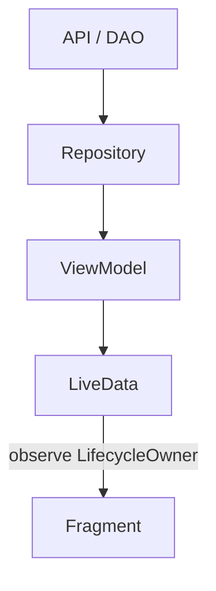

Ưu điểm:

```text
simple
lifecycle-aware
legacy-friendly
```

---

## Flow style

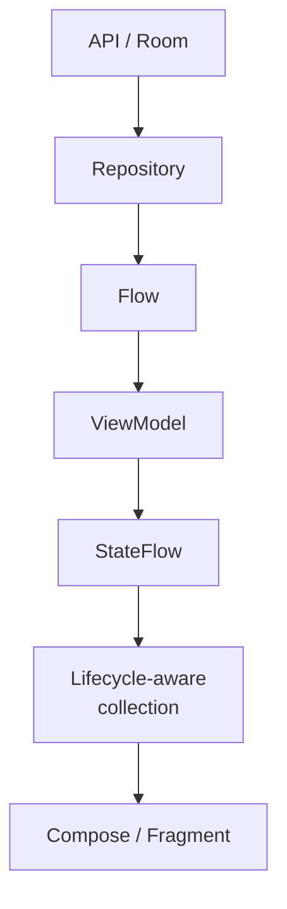

Ưu điểm:

```text
coroutines
operators
composition
cancellation
reactive pipeline
Kotlin-first
```

---

# 46. Thực hành — Reactive Product Screen

## Mục tiêu

Xây màn hình:

```text
Product List
```

có:

* Room hoặc fake repository;
* Flow ở Repository;
* StateFlow ở ViewModel;
* lifecycle-aware collection;
* loading;
* error;
* retry;
* Logcat state transitions.

---

## Bước 1 — Repository

```kotlin
interface ProductRepository {

    fun observeProducts():
        Flow<List<Product>>

    suspend fun refresh()
}
```

---

## Bước 2 — UiState

```kotlin
sealed interface ProductUiState {

    data object Loading :
        ProductUiState

    data class Success(
        val products: List<Product>
    ) : ProductUiState

    data class Error(
        val message: String
    ) : ProductUiState
}
```

---

## Bước 3 — ViewModel

Tạo:

```text
Repository Flow
     ↓
map
     ↓
catch
     ↓
stateIn
     ↓
StateFlow
```

---

## Bước 4 — UI

Compose:

```kotlin
val uiState by viewModel
    .uiState
    .collectAsStateWithLifecycle()
```

hoặc Fragment:

```kotlin
viewLifecycleOwner.lifecycleScope.launch {

    viewLifecycleOwner.repeatOnLifecycle(
        Lifecycle.State.STARTED
    ) {

        viewModel.uiState.collect {
            render(it)
        }
    }
}
```

---

# 47. Bài tập

## Bài 1 — LiveData → StateFlow

Cho:

```kotlin
private val _products =
    MutableLiveData<List<Product>>()

val products:
    LiveData<List<Product>> =
    _products
```

Chuyển thành:

```kotlin
private val _products =
    MutableStateFlow<List<Product>>(
        emptyList()
    )

val products =
    _products.asStateFlow()
```

Sau đó sửa UI để collect đúng lifecycle.

---

## Bài 2 — Combine

Cho:

```text
productsFlow
queryFlow
```

Tạo:

```text
filteredProductsFlow
```

bằng:

```kotlin
combine(...)
```

---

## Bài 3 — Search cancellation

Implement:

```text
TextField
 ↓
query StateFlow
 ↓
debounce
 ↓
distinctUntilChanged
 ↓
flatMapLatest
 ↓
search repository
```

Kiểm chứng request cũ bị hủy khi query mới tới.

---

## Bài 4 — Retry

Network trả:

```text
IOException
```

Retry tối đa:

```text
3 lần
```

với delay tăng dần.

---

# 48. Artifact cho portfolio

Tạo mini project:

```text
ReactiveProductApp/
│
├── data/
│   ├── ProductRepository.kt
│   └── FakeProductRepository.kt
│
├── ui/
│   ├── ProductUiState.kt
│   ├── ProductViewModel.kt
│   └── ProductScreen.kt
│
├── test/
│   └── ProductViewModelTest.kt
│
└── README.md
```

README nên có:

```text
1. Architecture diagram
2. Repository Flow
3. ViewModel StateFlow
4. collectAsStateWithLifecycle
5. Loading/Error/Success state
6. Cancellation
7. Retry strategy
8. Unit test
9. Screenshot
```

---

# 49. Sơ đồ nên đưa vào README

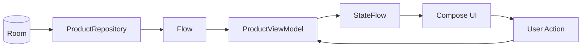

Artifact này chứng minh bạn hiểu nhiều hơn việc chỉ biết:

```kotlin
flow.collect()
```

Nó cho thấy hiểu:

```text
Architecture
Lifecycle
Reactive State
Coroutine
Testing
Error handling
Production behavior
```

---

# 50. Production checklist

Trước khi release màn hình dùng Flow/StateFlow, kiểm tra:

### Architecture

* [ ] Repository không phụ thuộc Activity/Fragment.
* [ ] Stream dữ liệu được expose bằng `Flow`.
* [ ] ViewModel sở hữu screen state.
* [ ] UI không được mutate `MutableStateFlow`.
* [ ] UI state immutable.

### Lifecycle

* [ ] Compose dùng `collectAsStateWithLifecycle()`.
* [ ] Views dùng `repeatOnLifecycle()`.
* [ ] Không collect vô hạn khi màn hình background.
* [ ] Rotation không làm mất state cần giữ.

### Process death

* [ ] Đã xác định state nào cần restore.
* [ ] State quan trọng dùng `SavedStateHandle`, Room, DataStore hoặc backend nếu phù hợp.

### Concurrency

* [ ] Công việc nặng không block Main thread.
* [ ] Cancellation hoạt động đúng.
* [ ] Không tạo duplicate upstream collectors ngoài ý muốn.

### Network

* [ ] Có loading state.
* [ ] Có error state.
* [ ] Retry có giới hạn.
* [ ] Không retry lỗi 4xx vô nghĩa.
* [ ] Không tạo request loop.

### Testing

* [ ] Initial state được test.
* [ ] Success được test.
* [ ] Error được test.
* [ ] Retry được test nếu có.
* [ ] State transition quan trọng được test.

### Debugging

* [ ] Có thể log state transition.
* [ ] Không log thông tin nhạy cảm.
* [ ] Có thể xác định producer bị restart hay không.

---

# 51. Checklist hoàn thành bài

* [ ] Giải thích được `Flow`.
* [ ] Giải thích được `LiveData`.
* [ ] Giải thích được `StateFlow`.
* [ ] Phân biệt cold và hot stream.
* [ ] Hiểu Flow không lifecycle-aware mặc định.
* [ ] Biết `collectAsStateWithLifecycle()`.
* [ ] Biết `repeatOnLifecycle()`.
* [ ] Biết `stateIn()`.
* [ ] Hiểu `SharingStarted.WhileSubscribed(...)`.
* [ ] Biết `map`, `combine`, `catch`.
* [ ] Hiểu cancellation.
* [ ] Biết `flatMapLatest`.
* [ ] Hiểu Flow không tự chạy background.
* [ ] Biết cách migrate từ LiveData.
* [ ] Hiểu rotation khác process death.
* [ ] Có một unit test Flow/StateFlow.
* [ ] Có artifact nhỏ để đưa vào portfolio.

---

# 52. Ghi chú sản xuất

Khi đưa **Flow/StateFlow/LiveData** vào production, không nên chỉ hỏi:

```text
"Code có chạy không?"
```

Hãy hỏi:

```text
UI đang collect khi nào?

Collector có dừng khi màn hình background không?

Cold Flow có bị chạy lại nhiều lần không?

Có nhiều collector dẫn đến query/API duplicate không?

State có tồn tại khi rotate không?

Process bị kill thì state nào cần khôi phục?

Retry có giới hạn không?

Cancellation có thực sự truyền xuống network/database không?

Loading/Error/Empty/Success đã được model rõ chưa?

Có test bảo vệ state transition quan trọng không?
```

Đó mới là sự khác biệt giữa:

```text
biết dùng Flow
```

và:

```text
thiết kế reactive state cho ứng dụng production.
```

---

# 53. Kết luận

Đối với Android hiện đại, có thể ghi nhớ kiến trúc sau:

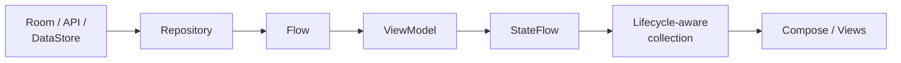

Tóm gọn:

```text
Data thay đổi theo thời gian
        ↓
       Flow

Screen cần current state
        ↓
    StateFlow

Compose
        ↓
collectAsStateWithLifecycle()

Fragment/View
        ↓
repeatOnLifecycle()

Legacy View/XML
        ↓
LiveData vẫn hoàn toàn có giá trị
```

Theo tài liệu Android hiện tại, UDF, ViewModel, lifecycle-aware state collection và `StateFlow` là những thành phần quan trọng của hướng kiến trúc hiện đại; LiveData vẫn là một lifecycle-aware observable được AndroidX hỗ trợ và không bắt buộc phải rewrite chỉ vì Flow tồn tại. ([Android Developers][1])

**Câu cần nhớ sau bài 036:**

> **LiveData mang lifecycle-awareness vào observable state; Flow mang reactive streams vào Kotlin Coroutines; còn StateFlow là lựa chọn tự nhiên để ViewModel biểu diễn UI state trong kiến trúc Android Kotlin hiện đại.** ([Kotlin][3])

[1]: https://developer.android.com/topic/architecture/recommendations?hl=en&utm_source=chatgpt.com "Recommendations for Android architecture  |  App architecture  |  Android Developers"
[2]: https://developer.android.com/topic/libraries/architecture/livedata?utm_source=chatgpt.com "LiveData overview | Views"
[3]: https://kotlinlang.org/docs/coroutines-flow.html?utm_source=chatgpt.com "Flows | Kotlin Documentation"
[4]: https://kotlinlang.org/api/kotlinx.coroutines/kotlinx-coroutines-core/kotlinx.coroutines.flow/-flow/?utm_source=chatgpt.com "Flow | kotlinx.coroutines"
[5]: https://kotlinlang.org/api/kotlinx.coroutines/kotlinx-coroutines-core/kotlinx.coroutines.flow/-state-flow/?utm_source=chatgpt.com "StateFlow | kotlinx.coroutines"
[6]: https://developer.android.com/topic/architecture/views/recommendations-views?utm_source=chatgpt.com "Recommendations for Android architecture (Views)  |  Android Developers"
[7]: https://developer.android.com/topic/libraries/architecture/views/coroutines-views?utm_source=chatgpt.com "Use Kotlin coroutines with lifecycle-aware components ..."
[8]: https://developer.android.com/reference/kotlin/androidx/lifecycle/compose/collectAsStateWithLifecycle.composable?utm_source=chatgpt.com "collectAsStateWithLifecycle  |  API reference  |  Android Developers"
[9]: https://developer.android.com/develop/ui/compose/state?utm_source=chatgpt.com "State and Jetpack Compose  |  Android Developers"
[10]: https://kotlinlang.org/api/kotlinx.coroutines/kotlinx-coroutines-core/kotlinx.coroutines.flow/state-in.html?utm_source=chatgpt.com "stateIn | kotlinx.coroutines"
[11]: https://developer.android.com/reference/kotlin/androidx/lifecycle/package-summary?utm_source=chatgpt.com "androidx.lifecycle | API reference"
[12]: https://developer.android.com/codelabs/basic-android-kotlin-compose-viewmodel-and-state?utm_source=chatgpt.com "ViewModel and State in Compose"
[13]: https://developer.android.com/topic/libraries/architecture/viewmodel/viewmodel-savedstate?utm_source=chatgpt.com "Saved State module for ViewModel | App architecture"
