# 037 - Flow vs RxJava

> **Học phần:** 03 - Architecture, State and Data
> **Module:** Module 05 - Design and Architecture
> **Nhóm nội dung:** Reactive State
> **Nguồn roadmap:** Design and Architecture / Reactive State
> **Loại bài:** Async / Reactive Programming
> **Thứ tự trong module:** 037
> **Thời lượng gợi ý:** 34 phút

---

## 1. Tóm tắt

**Kotlin Flow** và **RxJava** đều giải quyết một bài toán quan trọng trong Android:

> Làm thế nào để biểu diễn, biến đổi và quan sát một **dòng dữ liệu bất đồng bộ thay đổi theo thời gian**?

Ví dụ:

```text
Room Database
      ↓
Repository
      ↓
ViewModel
      ↓
UI State
      ↓
Compose / Fragment
```

Flow được xây dựng trên **Kotlin Coroutines** và có khả năng phát nhiều giá trị theo thời gian. Android Developers hiện sử dụng Flow rộng rãi trong hướng dẫn kiến trúc Android, đặc biệt khi truyền dữ liệu từ data layer → ViewModel → UI. ([Android Developers][1])

RxJava là implementation của ReactiveX trên JVM, cung cấp mô hình lập trình reactive với các stream như `Observable`, `Flowable`, `Single`, `Maybe` và `Completable`, cùng hệ operator rất phong phú. ([reactivex.io][2])

Trong Android Kotlin hiện đại, câu hỏi thường không còn đơn giản là:

```text
Flow có tốt hơn RxJava không?
```

Mà nên là:

```text
Ứng dụng mới hay legacy?
       ↓
Đang dùng Coroutines hay RxJava?
       ↓
Complex reactive pipeline đến mức nào?
       ↓
Có cần interoperability với code cũ?
       ↓
Chi phí migration có đáng không?
```

---

## 2. Mục tiêu học tập

Sau bài này, bạn có thể:

* giải thích sự khác nhau giữa **Flow và RxJava**;
* phân biệt `Flow`, `StateFlow`, `SharedFlow` với `Observable`, `Flowable`, `Single`, `Maybe`, `Completable`;
* hiểu cách hai công nghệ xử lý **threading**;
* hiểu cancellation của Coroutine so với `Disposable`;
* hiểu `flowOn()` so với `subscribeOn()` / `observeOn()`;
* hiểu cách xử lý error, retry và backpressure;
* thu thập stream an toàn theo Android lifecycle;
* lựa chọn Flow hoặc RxJava cho dự án thực tế;
* đọc và maintain một codebase Android đang sử dụng RxJava;
* viết một phiên bản Flow tương đương với pipeline RxJava;
* giải thích trade-off khi migration RxJava → Flow.

---

# 3. Reactive Stream là gì?

Một reactive stream có thể hình dung như một đường ống:

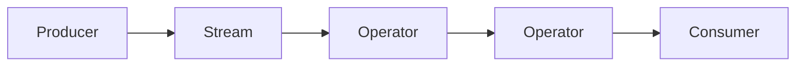

Ví dụ trong Android:

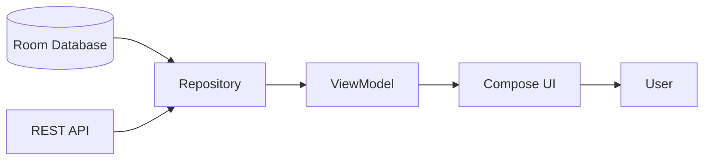

Android Developers mô tả Flow với ba thành phần cơ bản: **producer**, các **intermediary/operator** tùy chọn và **consumer**. Repository thường đóng vai trò producer trong khi UI là consumer cuối cùng. ([Android Developers][1])

### Ảnh minh họa — Producer → Flow → Intermediary → Consumer

[](https://developer.android.com/kotlin/flow?utm_source=chatgpt.com)

---

# 4. Kotlin Flow là gì?

`Flow<T>` là một asynchronous data stream trong `kotlinx.coroutines` có thể phát tuần tự nhiều giá trị rồi hoàn thành bình thường hoặc kết thúc bằng exception. Các operator trung gian như `map`, `filter`, `zip` thiết lập pipeline nhưng chưa chạy cho đến khi stream được collect. ([Kotlin][3])

Ví dụ:

```kotlin
fun observeUsers(): Flow<List<User>> = flow {
    val users = database.userDao().getUsers()
    emit(users)
}
```

Consumer:

```kotlin
viewModelScope.launch {
    repository.observeUsers()
        .collect { users ->
            println(users)
        }
}
```

Mental model:

```text
flow { ... }
     │
     │ emit()
     ▼
   Flow<T>
     │
     ├── map
     ├── filter
     ├── debounce
     ├── combine
     └── catch
     │
     ▼
  collect {}
```

---

# 5. RxJava là gì?

RxJava sử dụng mô hình **Observable sequence** để biểu diễn event/data asynchronous.

Một pipeline điển hình:

```kotlin
repository.observeUsers()
    .subscribeOn(Schedulers.io())
    .map { users ->
        users.filter { it.active }
    }
    .observeOn(AndroidSchedulers.mainThread())
    .subscribe(
        { users ->
            render(users)
        },
        { error ->
            showError(error)
        }
    )
```

ReactiveX định nghĩa Scheduler là cơ chế kiểm soát nơi Observable thực hiện công việc. `subscribeOn()` tác động đến nơi subscription/upstream chạy, trong khi `observeOn()` chuyển việc gửi notification downstream sang Scheduler được chỉ định. ([reactivex.io][4])

---

# 6. Mental model: Flow vs RxJava

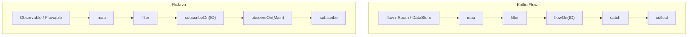

Nhìn bề ngoài hai pipeline rất giống nhau.

Khác biệt lớn nằm ở:

```text
Flow
└── Coroutine model
    ├── CoroutineScope
    ├── Job
    ├── suspend
    └── structured concurrency

RxJava
└── ReactiveX model
    ├── Observable
    ├── Observer
    ├── Scheduler
    └── Disposable
```

---

# 7. Bảng so sánh Flow vs RxJava

| Tiêu chí                        | Kotlin Flow                           | RxJava                                                 |
| ------------------------------- | ------------------------------------- | ------------------------------------------------------ |
| Nền tảng                        | Kotlin Coroutines                     | ReactiveX                                              |
| Stream cơ bản                   | `Flow<T>`                             | `Observable<T>`                                        |
| UI state                        | `StateFlow<T>`                        | thường `BehaviorSubject`, Observable hoặc wrapper khác |
| Broadcast event                 | `SharedFlow<T>`                       | `PublishSubject`, các Subject khác                     |
| Một kết quả                     | `suspend fun(): T` thường đủ          | `Single<T>`                                            |
| Có thể có hoặc không có kết quả | nullable/result hoặc Flow             | `Maybe<T>`                                             |
| Chỉ complete/error              | suspend function / `Result` tùy API   | `Completable`                                          |
| Consumer                        | `collect()`                           | `subscribe()`                                          |
| Cancellation                    | Coroutine `Job`                       | `Disposable`                                           |
| Threading                       | Coroutine Dispatcher                  | Scheduler                                              |
| Đổi upstream context            | `flowOn()`                            | `subscribeOn()`                                        |
| Đổi downstream                  | Coroutine context / scope             | `observeOn()`                                          |
| Error                           | `catch` / `try-catch`                 | `onError*`                                             |
| Retry                           | `retry`, `retryWhen`                  | `retry`, `retryWhen`                                   |
| Backpressure                    | suspension, buffer/conflate           | đặc biệt rõ với `Flowable`                             |
| Lifecycle Android               | tích hợp trực tiếp với coroutine APIs | cần quản lý subscription/disposal                      |
| Compose                         | tích hợp tự nhiên với `StateFlow`     | thường bridge sang state khác                          |
| Java codebase                   | kém tự nhiên hơn                      | rất phù hợp                                            |
| Kotlin-first project            | rất phù hợp                           | dùng được nhưng thường nhiều abstraction hơn           |
| Legacy Rx code                  | cần interoperability/migration        | rất phù hợp                                            |

RxJava có các reactive type riêng cho những semantics khác nhau, trong khi Kotlin thường kết hợp `suspend` cho one-shot operation và Flow cho nhiều giá trị. Ví dụ, RxJava `Single` chỉ phát một success value hoặc error, còn `Completable` chỉ biểu diễn complete/error. ([reactivex.io][5])

---

# 8. Cold Stream

## Flow

Một Flow tạo bằng `flow {}` thường là **cold**.

```kotlin
val flow = flow {
    println("API called")
    emit(api.getUser())
}
```

Nếu chưa:

```kotlin
flow.collect()
```

thì producer chưa cần chạy.

Mỗi collector có thể kích hoạt lại producer.

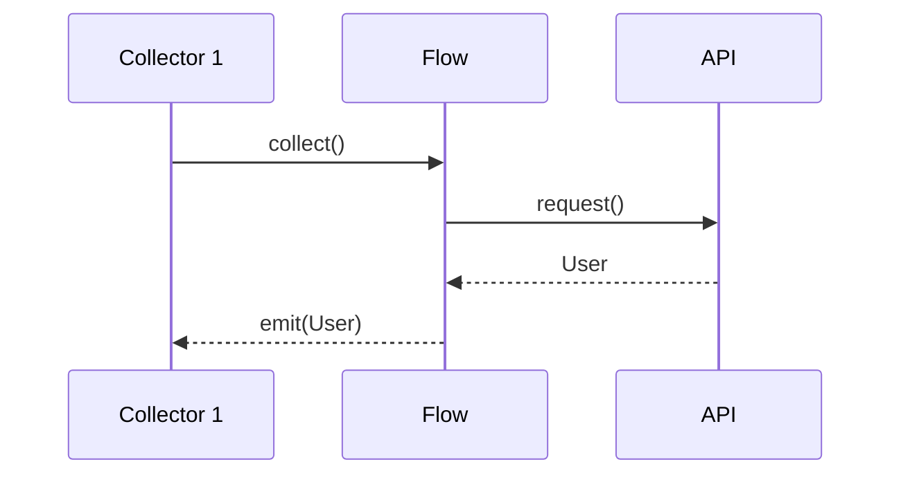

Kotlin documentation mô tả các intermediate Flow operator là cold; pipeline chỉ thiết lập computation và thực thi khi terminal operation như `collect()` diễn ra. ([Kotlin][3])

---

# 9. Hot Stream: StateFlow và SharedFlow

Không phải mọi Flow đều cold.

Hai loại đặc biệt quan trọng:

```text
Flow
├── StateFlow
└── SharedFlow
```

Android Developers mô tả `StateFlow` và `SharedFlow` là các Flow API dùng để phát state/value tới nhiều consumer. `StateFlow` đặc biệt phù hợp để đại diện cho state hiện tại. ([Android Developers][6])

Ví dụ ViewModel:

```kotlin
data class UserUiState(
    val loading: Boolean = false,
    val users: List<User> = emptyList(),
    val error: String? = null
)
```

```kotlin
class UserViewModel(
    private val repository: UserRepository
) : ViewModel() {

    private val _uiState =
        MutableStateFlow(UserUiState())

    val uiState: StateFlow<UserUiState> =
        _uiState.asStateFlow()
}
```

Kiến trúc:

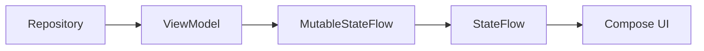

---

# 10. RxJava Reactive Types

RxJava không chỉ có một loại stream.

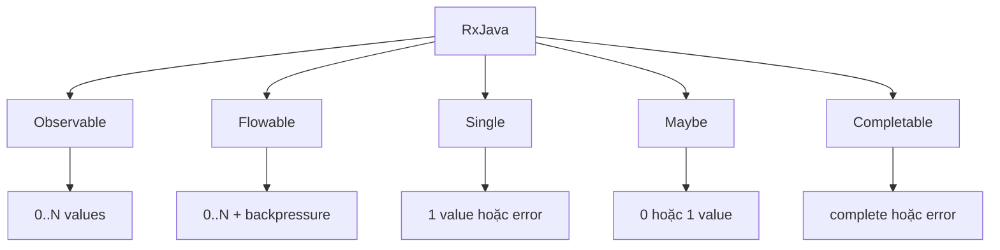

RxJava Javadoc liệt kê các base reactive class gồm `Flowable`, `Observable`, `Single`, `Maybe` và `Completable`. ([reactivex.io][2])

Điều này khiến RxJava rất biểu cảm:

```kotlin
fun login(): Single<User>

fun findUser(): Maybe<User>

fun logout(): Completable

fun observeMessages(): Observable<Message>

fun streamTelemetry(): Flowable<Event>
```

Trong Flow/coroutine style, API tương ứng thường có thể đơn giản hơn:

```kotlin
suspend fun login(): User

suspend fun findUser(): User?

suspend fun logout()

fun observeMessages(): Flow<Message>

fun streamTelemetry(): Flow<Event>
```

---

# 11. Mapping operator giữa Flow và RxJava

| Mục đích           | Flow                   | RxJava                 |
| ------------------ | ---------------------- | ---------------------- |
| biến đổi           | `map`                  | `map`                  |
| lọc                | `filter`               | `filter`               |
| bỏ giá trị đầu     | `drop`                 | `skip`                 |
| lấy N giá trị      | `take`                 | `take`                 |
| chống spam search  | `debounce`             | `debounce`             |
| bỏ duplicate       | `distinctUntilChanged` | `distinctUntilChanged` |
| ghép stream        | `combine`              | `combineLatest`        |
| ghép cặp           | `zip`                  | `zip`                  |
| latest wins        | `flatMapLatest`        | `switchMap`            |
| tuần tự            | `flatMapConcat`        | `concatMap`            |
| concurrent mapping | `flatMapMerge`         | `flatMap`              |
| xử lý lỗi          | `catch`                | `onError...`           |
| retry              | `retry`                | `retry`                |
| side effect        | `onEach`               | `doOnNext`             |
| kết thúc           | `onCompletion`         | `doOnComplete`         |
| consume            | `collect`              | `subscribe`            |

Đây là lý do developer quen RxJava thường học Flow khá nhanh: **reactive thinking vẫn gần nhau**, chỉ khác concurrency model.

---

# 12. `map`

### Flow

```kotlin
repository.observeUsers()
    .map { users ->
        users.filter(User::active)
    }
```

### RxJava

```kotlin
repository.observeUsers()
    .map { users ->
        users.filter(User::active)
    }
```

Ở trường hợp đơn giản, code gần như giống hệt nhau.

---

# 13. Search: `flatMapLatest` vs `switchMap`

Giả sử user gõ:

```text
c
ca
cat
```

Nếu request `c` chưa xong mà user đã gõ `ca`, chúng ta thường không còn quan tâm request cũ.

### Flow

```kotlin
query
    .debounce(300)
    .distinctUntilChanged()
    .flatMapLatest { query ->
        repository.search(query)
    }
```

### RxJava

```kotlin
query
    .debounce(300, TimeUnit.MILLISECONDS)
    .distinctUntilChanged()
    .switchMap { query ->
        repository.search(query)
    }
```

Mental model:

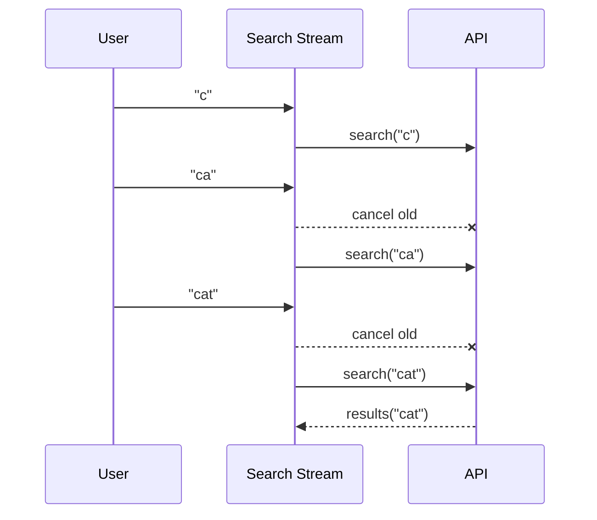

---

# 14. Threading — điểm khác biệt quan trọng

## RxJava

RxJava dùng **Scheduler**.

```kotlin
repository.loadUsers()
    .subscribeOn(Schedulers.io())
    .observeOn(AndroidSchedulers.mainThread())
    .subscribe {
        render(it)
    }
```

Mental model:

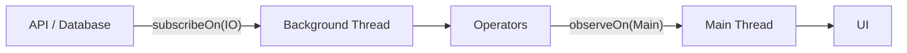

ReactiveX mô tả `subscribeOn()` là cách chỉ định Scheduler nơi Observable thực hiện công việc và `observeOn()` là cách chuyển việc phát notification cho observer sang Scheduler khác. ([reactivex.io][4])

---

# 15. Flow và Coroutine Dispatcher

Flow dùng coroutine context/Dispatcher.

Ví dụ:

```kotlin
repository.observeUsers()
    .map {
        expensiveTransformation(it)
    }
    .flowOn(Dispatchers.Default)
    .collect {
        render(it)
    }
```

`flowOn()` chỉ thay đổi execution context của phần **upstream** đứng trước nó, không làm context đó rò xuống downstream. ([Kotlin][7])

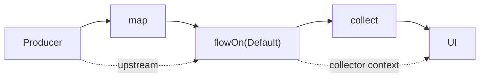

Có thể nhớ:

```text
Flow
upstream.flowOn(Dispatcher)

RxJava
upstream.subscribeOn(Scheduler)
        .observeOn(Scheduler)
```

Nhưng đây chỉ là mental mapping, **không nên coi hai API hoàn toàn tương đương về semantics**.

---

# 16. Structured Concurrency — lợi thế quan trọng của Flow

Flow sống trong hệ sinh thái Coroutine.

```kotlin
viewModelScope.launch {

    repository.observeUsers()
        .collect {
            // ...
        }
}
```

Ta có cây coroutine:

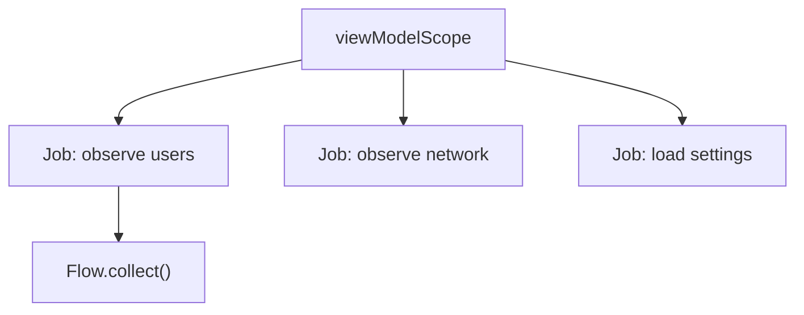

Khi `ViewModel` bị clear:

```text
viewModelScope
      ↓
cancel
      ↓
child jobs
      ↓
Flow collection
```

Coroutine scopes là phần cốt lõi để quản lý lifetime của asynchronous work trên Android. Android lifecycle components cung cấp các scope tích hợp như `viewModelScope` và lifecycle-aware coroutine APIs. ([Android Developers][8])

---

# 17. Cancellation: Flow vs RxJava

## Flow

```kotlin
val job = viewModelScope.launch {
    repository.observeUsers()
        .collect {
            // ...
        }
}

job.cancel()
```

Cancellation truyền theo coroutine hierarchy.

```text
Parent Job cancelled
        ↓
Child coroutine cancelled
        ↓
Flow collection cancelled
```

---

## RxJava

RxJava thường dùng `Disposable`.

```kotlin
val disposable =
    repository.observeUsers()
        .subscribe {
            render(it)
        }
```

Sau đó:

```kotlin
disposable.dispose()
```

Hoặc gom subscriptions:

```kotlin
private val disposables =
    CompositeDisposable()
```

```kotlin
disposables += repository.observeUsers()
    .subscribe()
```

```kotlin
override fun onCleared() {
    disposables.clear()
}
```

`Disposable` chính là cơ chế RxJava thường dùng để dừng một subscription đang chạy; tài liệu `Completable`, chẳng hạn, mô tả computation đang chạy có thể được dừng thông qua `Disposable`. ([reactivex.io][9])

---

# 18. Lifecycle trên Android

Đây là phần cực kỳ quan trọng.

Không nên đơn giản viết:

```kotlin
lifecycleScope.launch {
    flow.collect {
        render(it)
    }
}
```

nếu bạn muốn collection tự dừng khi UI không còn active.

Với Views, Android khuyến nghị lifecycle-aware collection bằng `repeatOnLifecycle`. ([Android Developers][10])

```kotlin
viewLifecycleOwner.lifecycleScope.launch {

    viewLifecycleOwner.repeatOnLifecycle(
        Lifecycle.State.STARTED
    ) {

        viewModel.uiState.collect { state ->
            render(state)
        }
    }
}
```

Lifecycle:

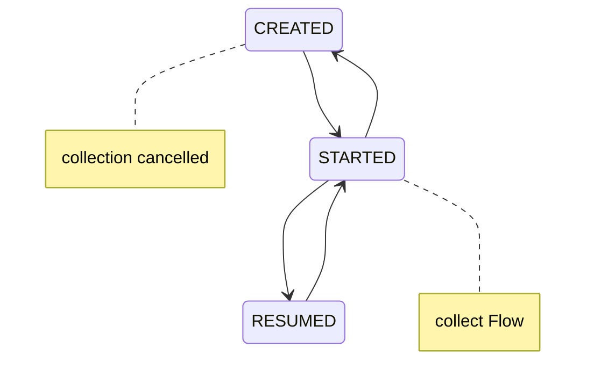

`repeatOnLifecycle` cancel block khi lifecycle rời state yêu cầu và launch lại khi lifecycle quay lại state đó. ([Android Developers][11])

---

# 19. Jetpack Compose + StateFlow

Trong Compose, pattern phổ biến là:

```kotlin
val uiState by viewModel.uiState
    .collectAsStateWithLifecycle()
```

Sau đó:

```kotlin
when {
    uiState.loading -> LoadingScreen()

    uiState.error != null ->
        ErrorScreen(uiState.error)

    else ->
        UserList(uiState.users)
}
```

`collectAsStateWithLifecycle()` chuyển giá trị mới của `Flow`/`StateFlow` thành Compose `State` và chỉ collect khi lifecycle đạt state active yêu cầu. ([Android Developers][12])

Kiến trúc:

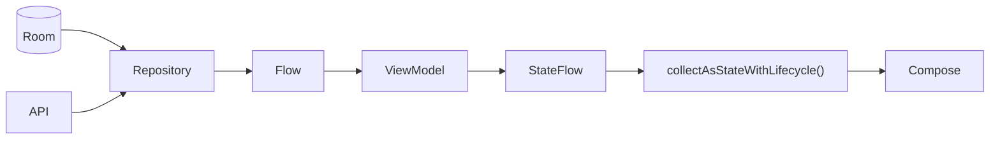

Đây là một trong những lý do Flow phù hợp rất tự nhiên với Android Kotlin hiện đại. Android architecture guidance hiện cũng khuyến nghị expose UI state từ ViewModel và collect state theo lifecycle. ([Android Developers][13])

---

# 20. Error handling

## Flow

```kotlin
repository.observeUsers()
    .catch { throwable ->
        emit(emptyList())
    }
    .collect {
        render(it)
    }
```

Hoặc:

```kotlin
try {
    repository.loadUser()
} catch (e: IOException) {
    showNetworkError()
}
```

---

## RxJava

```kotlin
repository.observeUsers()
    .onErrorReturnItem(emptyList())
    .subscribe {
        render(it)
    }
```

Hoặc:

```kotlin
.subscribe(
    { users ->
        render(users)
    },
    { error ->
        showError(error)
    }
)
```

---

# 21. Retry

### Flow

```kotlin
repository.observeUsers()
    .retry(3)
    .collect {
        render(it)
    }
```

Hoặc điều kiện:

```kotlin
.retryWhen { cause, attempt ->

    if (
        cause is IOException &&
        attempt < 3
    ) {
        delay(1_000)
        true
    } else {
        false
    }
}
```

### RxJava

```kotlin
repository.observeUsers()
    .retry(3)
    .subscribe()
```

Trong production, thường nên phân biệt:

```text
Timeout
    ↓
có thể retry

5xx
    ↓
có thể retry/backoff

401
    ↓
refresh auth / logout

400
    ↓
thường không retry

Parsing error
    ↓
bug / incompatibility
```

---

# 22. Backpressure

Backpressure xuất hiện khi:

```text
Producer
1000 events/s
      ↓
Consumer
50 events/s
```

Nếu consumer không theo kịp producer, hệ thống phải quyết định:

```text
buffer?
drop?
latest only?
slow producer?
error?
```

---

## RxJava

RxJava có `Flowable` dành cho stream cần backpressure.

ReactiveX cũng cung cấp các strategy/operator để xử lý producer phát nhanh hơn consumer. ([reactivex.io][14])

Mental model:

```text
Observable
    ↓
backpressure problem?
    ↓ yes
Flowable
```

---

## Flow

Flow dựa nhiều vào coroutine suspension.

Có thể điều chỉnh bằng:

```kotlin
buffer()
```

hoặc:

```kotlin
conflate()
```

Ví dụ:

```kotlin
sensorFlow
    .conflate()
    .collect { latestSensorValue ->
        render(latestSensorValue)
    }
```

`conflate()` cho phép emitter tiếp tục và collector nhận giá trị mới nhất khi consumer chậm, thay vì phải xử lý tất cả intermediate value. ([Kotlin][15])

Mental model:

```text
1 2 3 4 5 6 7 8 9
↓ producer nhanh

consumer:
1 ----- 5 ----- 9
```

---

# 23. `buffer()` vs `conflate()`

### Không buffer

```text
Producer emit
      ↓
Consumer process
      ↓
Producer emit
```

### `buffer()`

```text
Producer ──► [ BUFFER ] ──► Consumer
```

### `conflate()`

```text
Producer:
1 2 3 4 5 6

Latest:
1 --- 4 --- 6

Consumer:
1 --- 4 --- 6
```

`conflate()` đặc biệt hữu ích với loại state mà **giá trị mới nhất quan trọng hơn việc xử lý mọi giá trị trung gian**. Kotlin API mô tả nó là một conflated channel giữ giá trị gần nhất khi collector không theo kịp. ([Kotlin][15])

---

# 24. Ví dụ thực tế — Search User

Giả sử ta có ô search:

```text
User types
    ↓
Query
    ↓
debounce
    ↓
distinctUntilChanged
    ↓
API Search
    ↓
UiState
    ↓
Compose
```

---

## 24.1 Flow implementation

```kotlin
class SearchViewModel(
    private val repository: UserRepository
) : ViewModel() {

    private val query =
        MutableStateFlow("")

    val users: StateFlow<SearchUiState> =
        query
            .debounce(300)
            .distinctUntilChanged()
            .flatMapLatest { keyword ->

                if (keyword.isBlank()) {

                    flowOf(
                        SearchUiState.Empty
                    )

                } else {

                    repository
                        .searchUsers(keyword)
                        .map<List<User>, SearchUiState> {
                            SearchUiState.Success(it)
                        }
                        .onStart {
                            emit(SearchUiState.Loading)
                        }
                        .catch {
                            emit(
                                SearchUiState.Error(
                                    it.message ?: "Unknown error"
                                )
                            )
                        }
                }
            }
            .stateIn(
                scope = viewModelScope,
                started = SharingStarted.WhileSubscribed(5_000),
                initialValue = SearchUiState.Empty
            )

    fun setQuery(value: String) {
        query.value = value
    }
}
```

---

## 24.2 Compose

```kotlin
@Composable
fun SearchScreen(
    viewModel: SearchViewModel
) {

    val state by viewModel.users
        .collectAsStateWithLifecycle()

    when (state) {

        SearchUiState.Empty ->
            EmptyScreen()

        SearchUiState.Loading ->
            LoadingScreen()

        is SearchUiState.Success ->
            UserList(
                (state as SearchUiState.Success).users
            )

        is SearchUiState.Error ->
            ErrorScreen()
    }
}
```

---

# 25. Cùng bài toán bằng RxJava

```kotlin
class SearchViewModel(
    private val repository: UserRepository
) : ViewModel() {

    private val query =
        PublishSubject.create<String>()

    private val disposables =
        CompositeDisposable()

    init {

        query
            .debounce(
                300,
                TimeUnit.MILLISECONDS
            )
            .distinctUntilChanged()

            .switchMap { keyword ->

                repository
                    .searchUsers(keyword)
            }

            .subscribeOn(
                Schedulers.io()
            )

            .observeOn(
                AndroidSchedulers.mainThread()
            )

            .subscribe(
                { users ->
                    // update UI state
                },
                { error ->
                    // update error state
                }
            )
            .addTo(disposables)
    }

    fun setQuery(value: String) {
        query.onNext(value)
    }

    override fun onCleared() {
        disposables.clear()
    }
}
```

Cả hai đều giải quyết cùng một pipeline:

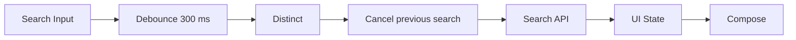

Nhưng lifecycle/cancellation model khác nhau.

---

# 26. So sánh độ phức tạp

## Flow

```text
CoroutineScope
     ↓
Flow
     ↓
Operators
     ↓
collect
```

## RxJava

```text
Observable
     ↓
Operators
     ↓
Scheduler
     ↓
Observer
     ↓
Disposable
```

Điều này không có nghĩa RxJava "xấu".

RxJava có lợi thế lớn trong những codebase đã được thiết kế sâu quanh reactive programming và có pipeline phức tạp.

Flow lại có lợi thế khi phần còn lại của codebase đã sử dụng:

```text
Kotlin
+
suspend functions
+
ViewModelScope
+
Room Flow
+
StateFlow
+
Compose
```

---

# 27. State management

Một kiến trúc Flow hiện đại thường trông như sau:

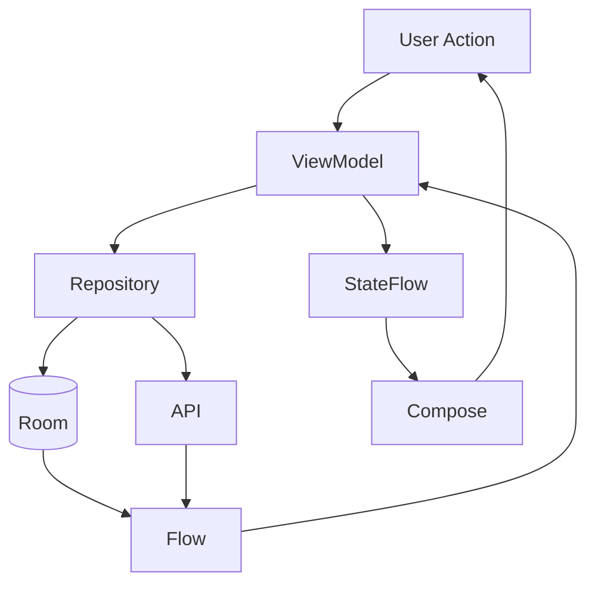

Tạo thành:

```text
Event
 ↓
ViewModel
 ↓
Data
 ↓
State
 ↓
UI
 ↓
Event
```

Đây cũng rất phù hợp với **Unidirectional Data Flow**.

---

# 28. StateFlow không phải "RxJava mới"

Một sai lầm phổ biến:

```text
StateFlow = RxJava replacement
```

Không chính xác.

Mối quan hệ đúng hơn:

```text
Kotlin Coroutines ecosystem
├── suspend
├── Flow
├── StateFlow
├── SharedFlow
├── Channel
└── CoroutineScope

ReactiveX ecosystem
├── Observable
├── Flowable
├── Single
├── Maybe
├── Completable
├── Subject
└── Scheduler
```

Đây là **hai concurrency/reactive ecosystems khác nhau**.

---

# 29. Khi nào nên chọn Flow?

Đối với một ứng dụng Android Kotlin mới, Flow thường là lựa chọn rất hợp lý khi kiến trúc đã xoay quanh coroutines, `ViewModel`, `StateFlow` và Compose. Android Developers hiện cung cấp trực tiếp hướng dẫn Flow, StateFlow, lifecycle-aware collection và Flow testing trong stack Android. ([Android Developers][1])

Flow đặc biệt phù hợp với:

```text
Kotlin-first Android
        +
Coroutines
        +
Room / DataStore
        +
ViewModel
        +
StateFlow
        +
Compose
```

---

# 30. Khi nào RxJava vẫn hợp lý?

Không nên thấy Flow rồi lập tức rewrite toàn bộ RxJava.

RxJava vẫn hợp lý nếu:

```text
Large legacy project
       ↓
Thousands of Rx chains
       ↓
Team understands Rx deeply
       ↓
Existing libraries expose Rx types
       ↓
Migration cost rất lớn
```

Hoặc hệ thống sử dụng rất nhiều composition kiểu:

```text
Observable
combineLatest
switchMap
retryWhen
zip
merge
window
buffer
backpressure
custom operators
```

Trong trường hợp đó:

> **Một migration chỉ đáng làm khi nó mang lại lợi ích kỹ thuật hoặc kinh doanh rõ ràng.**

Không nên migrate chỉ vì "Flow mới hơn".

---

# 31. Flow vs RxJava trong dự án mới

Một decision tree thực tế:

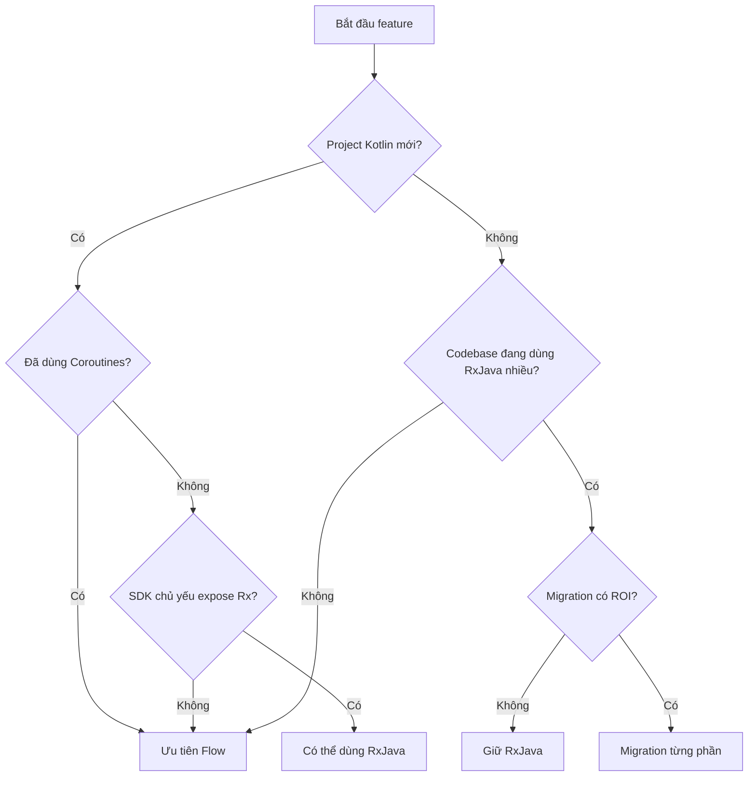

---

# 32. Migration RxJava → Flow

Không nên migration theo kiểu:

```text
Delete RxJava
    ↓
Rewrite everything
```

Thay vào đó:

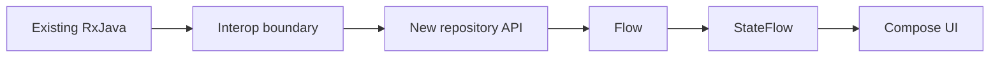

Một chiến lược thường an toàn hơn:

```text
Phase 1
New feature → Flow

Phase 2
Repository boundary → Flow

Phase 3
ViewModel → StateFlow

Phase 4
Replace isolated Rx chains

Phase 5
Remove Rx dependency
chỉ khi không còn cần
```

---

# 33. Đừng migration operator theo tên một cách máy móc

Ví dụ:

```text
switchMap
    ↓
flatMapLatest
```

thường có mental model giống nhau.

Nhưng:

```text
subscribeOn
    ↓
flowOn
```

không phải lúc nào cũng là một phép thay thế 1:1.

Khi migration cần xem:

```text
Threading
Cancellation
Error propagation
Hot/cold semantics
Backpressure
Lifecycle
Sharing
Replay
```

---

# 34. Testing Flow

Android có hướng dẫn riêng cho việc test Flow và khuyến nghị dùng fake producer khi cần kiểm soát input/output stream trong unit test. ([Android Developers][16])

Ví dụ:

```kotlin
@Test
fun `users are mapped correctly`() = runTest {

    val fakeRepository =
        FakeUserRepository(
            users = listOf(
                User("A"),
                User("B")
            )
        )

    val result =
        fakeRepository
            .observeUsers()
            .first()

    assertEquals(
        2,
        result.size
    )
}
```

---

# 35. Test state transition

Ví dụ state:

```text
Idle
 ↓
Loading
 ↓
Success
```

hoặc:

```text
Idle
 ↓
Loading
 ↓
Error
```

Test:

```kotlin
@Test
fun `load user emits loading then success`() =
    runTest {

        val states =
            viewModel.uiState
                .take(2)
                .toList()

        assertEquals(
            UiState.Loading,
            states[0]
        )

        assertTrue(
            states[1] is UiState.Success
        )
    }
```

Coroutine testing cần quan tâm scheduler/test dispatcher vì asynchronous work có thể chạy ở nhiều coroutine/thread khác nhau. Android Developers cung cấp các coroutine test utilities dành cho mục đích này. ([Android Developers][17])

---

# 36. Debugging reactive pipeline

Một pipeline dài:

```text
API
 ↓
map
 ↓
filter
 ↓
combine
 ↓
catch
 ↓
stateIn
 ↓
UI
```

Nếu UI không đúng, cần biết lỗi ở đâu.

Flow có thể log:

```kotlin
repository.observeUsers()

    .onStart {
        Log.d(TAG, "users: start")
    }

    .onEach {
        Log.d(
            TAG,
            "users: ${it.size}"
        )
    }

    .catch {
        Log.e(
            TAG,
            "users error",
            it
        )
    }

    .onCompletion {
        Log.d(
            TAG,
            "users complete"
        )
    }
```

Debug timeline:

```text
23:10:01 QUERY_CHANGED "android"

23:10:01 SEARCH_DEBOUNCE

23:10:02 SEARCH_START

23:10:02 API_REQUEST

23:10:03 API_SUCCESS 34 users

23:10:03 UI_SUCCESS
```

---

# 37. Lifecycle bug thường gặp

Ví dụ collector tồn tại lâu hơn UI mong muốn:

```text
Fragment
    ↓
collect
    ↓
Fragment STOPPED
    ↓
Flow vẫn emit
    ↓
Network/database work vẫn chạy
```

Hậu quả có thể là:

```text
CPU/network work không cần thiết
       ↓
battery usage
       ↓
duplicate collectors
       ↓
duplicate UI events
       ↓
khó debug
```

Vì vậy lifecycle-aware collection là một phần quan trọng của production Android architecture. Android guidance khuyến nghị `repeatOnLifecycle` cho Views và `collectAsStateWithLifecycle()` cho Compose state collection. ([Android Developers][18])

---

# 38. Rotate screen có làm mất StateFlow không?

Nếu state nằm trong:

```text
Activity / Fragment
```

thì dễ gắn trực tiếp vào lifecycle UI.

Nếu state nằm trong:

```text
ViewModel
    ↓
StateFlow
```

thì ViewModel có thể tiếp tục giữ UI-related state qua configuration changes theo lifecycle của ViewModel.

Architecture nên là:

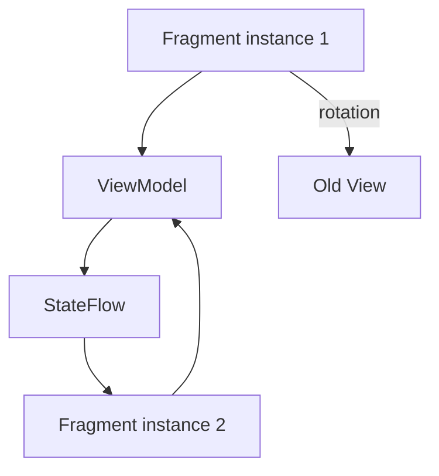

Điểm cần nhớ:

> Flow không tự động giải quyết mọi vấn đề state restoration.

Ví dụ process death vẫn là bài toán khác.

---

# 39. UX bị ảnh hưởng như thế nào?

Reactive code tưởng như chỉ là vấn đề architecture, nhưng trực tiếp ảnh hưởng UX.

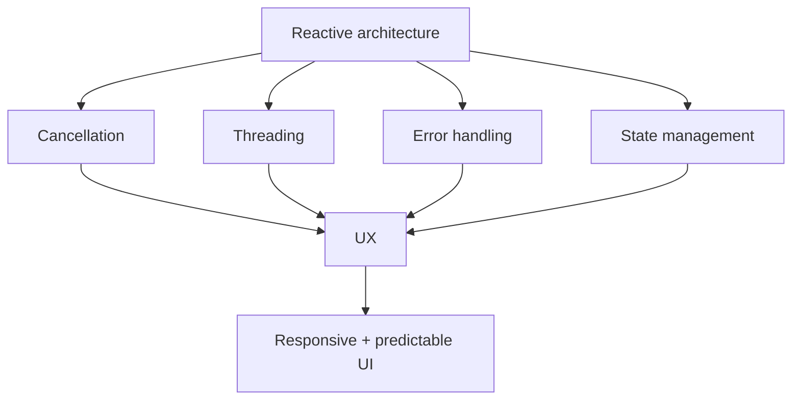

Ví dụ search không cancellation:

```text
User searches:
cat
 ↓
cats
 ↓
cats food

Request 1 chậm
Request 3 nhanh

Request 3 → UI đúng
Request 1 → trả về sau
          ↓
ghi đè UI
          ↓
kết quả sai
```

`flatMapLatest` / `switchMap` có thể giúp giải quyết lớp vấn đề này.

---

# 40. Performance

Không nên kết luận đơn giản:

```text
Flow luôn nhanh hơn RxJava
```

hoặc:

```text
RxJava luôn nhanh hơn Flow
```

Hiệu năng thực tế phụ thuộc vào:

```text
operator chain
allocation
thread switching
buffer
upstream workload
network/database
number of collectors
sharing strategy
```

Trong phần lớn Android business app, vấn đề đáng kiểm tra trước thường là:

```text
Main-thread blocking
unnecessary recomposition
duplicate network requests
too many collectors
incorrect sharing
unbounded event production
```

thay vì chọn library chỉ dựa trên một microbenchmark.

---

# 41. Main-safety

Không nên:

```kotlin
viewModelScope.launch {

    val bitmap =
        decodeHugeImage()

    _state.value =
        UiState.Success(bitmap)
}
```

nếu `decodeHugeImage()` là blocking CPU work.

Có thể:

```kotlin
val bitmap =
    withContext(
        Dispatchers.Default
    ) {
        decodeHugeImage()
    }
```

Hoặc với Flow:

```kotlin
imageRepository.observeImages()
    .map {
        processImages(it)
    }
    .flowOn(
        Dispatchers.Default
    )
```

Android documentation nhấn mạnh coroutine code vẫn cần được thiết kế **main-safe**; coroutine không đồng nghĩa mọi operation tự động rời main thread. ([Android Developers][19])

---

# 42. Một anti-pattern khác

Không nên dùng:

```kotlin
GlobalScope.launch {
    repository.observeUsers()
        .collect()
}
```

cho công việc gắn với ViewModel/UI.

Thay vào đó:

```kotlin
viewModelScope.launch {
    repository.observeUsers()
        .collect()
}
```

Lý do:

```text
UI lifetime
   ↓
ViewModel lifetime
   ↓
viewModelScope
   ↓
Coroutine
   ↓
Flow
```

Cấu trúc scope rõ ràng giúp tránh các coroutine sống ngoài lifetime mong muốn. Kotlin coroutine APIs được thiết kế quanh `CoroutineScope` và structured concurrency. ([Kotlin][20])

---

# 43. Production architecture khuyến nghị

Một cấu trúc dễ maintain:

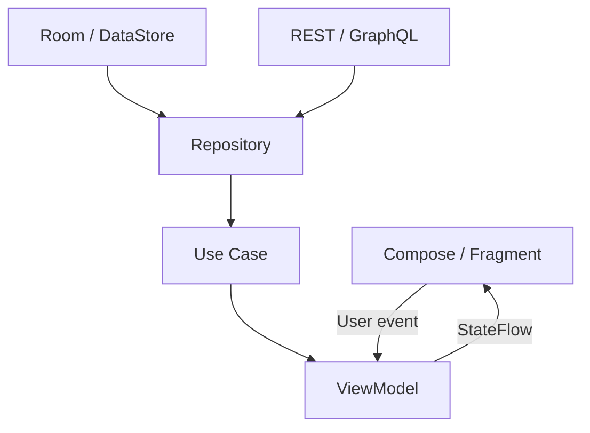

Flow thường được expose từ:

```text
DAO
 ↓
Repository
 ↓
UseCase
 ↓
ViewModel
```

và chuyển thành:

```text
StateFlow<UiState>
```

ở ViewModel.

---

# 44. Repository example

```kotlin
interface UserRepository {

    fun observeUsers():
        Flow<List<User>>

    suspend fun refreshUsers()
}
```

Implementation:

```kotlin
class UserRepositoryImpl(
    private val api: UserApi,
    private val dao: UserDao
) : UserRepository {

    override fun observeUsers():
        Flow<List<User>> {

        return dao.observeUsers()
    }

    override suspend fun refreshUsers() {

        val users =
            api.getUsers()

        dao.insertAll(users)
    }
}
```

Architecture:

```text
API
 ↓ refresh
Room
 ↓ Flow
Repository
 ↓
ViewModel
 ↓ StateFlow
UI
```

---

# 45. Đây là pattern rất mạnh

Thay vì:

```text
API → UI
```

có thể dùng:

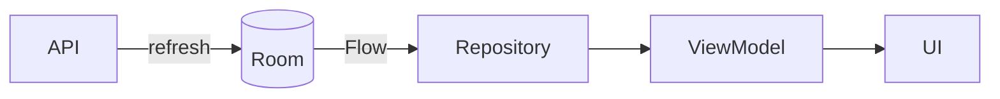

Room trở thành:

```text
Single Source of Truth
```

UI chỉ observe local state.

---

# 46. Flow vs RxJava — góc nhìn maintainability

### Flow

Một team Android Kotlin thường chỉ cần hiểu:

```text
Kotlin
Coroutines
Flow
StateFlow
ViewModel
Lifecycle
```

### RxJava

Team cần hiểu thêm các concept:

```text
Observable types
Schedulers
Disposable
Subjects
hot/cold
backpressure
operator semantics
```

Đổi lại, RxJava cung cấp một reactive abstraction rất mature và mạnh cho các pipeline event-driven phức tạp.

---

# 47. Flow vs RxJava — góc nhìn tuyển dụng

Developer Android tốt không nên trả lời:

> "Flow mới nên RxJava không cần học."

Câu trả lời tốt hơn:

> **Flow thường phù hợp với Android Kotlin hiện đại vì tích hợp trực tiếp với coroutines, lifecycle, StateFlow và Compose. Tuy nhiên RxJava vẫn xuất hiện trong nhiều codebase production, vì vậy developer cần hiểu Observable, Scheduler, Disposable, error handling và các operator phổ biến để maintain hoặc migration hệ thống cũ.**

Đây cũng phản ánh sự khác biệt giữa:

```text
"biết API"
```

và:

```text
"hiểu architecture"
```

---

# 48. Câu hỏi phỏng vấn

### Câu 1

**Flow khác Observable thế nào?**

Câu trả lời nên đề cập:

```text
Flow
→ coroutine-based
→ suspendable
→ structured concurrency
→ collect

Observable
→ ReactiveX
→ Observer
→ Scheduler
→ Disposable
→ subscribe
```

---

### Câu 2

**`flowOn` khác `withContext` thế nào?**

Mental model:

```text
flowOn
→ thay context upstream Flow

withContext
→ chuyển coroutine block
```

`flowOn()` thay execution context của upstream operators đứng trước nó và giữ downstream context riêng. ([Kotlin][7])

---

### Câu 3

**StateFlow khác Flow?**

```text
Flow
→ general asynchronous stream

StateFlow
→ hot state holder
→ luôn có current value
→ multiple collectors
```

StateFlow là một dạng SharedFlow chuyên biệt dành cho việc chia sẻ state. ([Kotlin][21])

---

### Câu 4

**Tại sao cần repeatOnLifecycle?**

```text
STARTED
→ collect

STOPPED
→ cancel collection

STARTED again
→ restart collection
```

Đây chính là behavior của API theo Android lifecycle documentation. ([Android Developers][11])

---

### Câu 5

**Flow có backpressure không?**

Không nên trả lời đơn giản là "có" hoặc "không".

Nên giải thích:

> Flow sử dụng coroutine suspension và có các operator như `buffer()` / `conflate()` để điều khiển tốc độ producer-consumer; RxJava có abstraction `Flowable` dành riêng cho backpressure. ([Kotlin][15])

---

# 49. Thực hành — 34 phút

## Phần 1 — 8 phút: RxJava

Cho API:

```kotlin
fun searchUsers(
    keyword: String
): Observable<List<User>>
```

Tạo pipeline:

```text
query
 ↓
debounce
 ↓
distinctUntilChanged
 ↓
switchMap
 ↓
IO
 ↓
Main
 ↓
UI
```

Yêu cầu dùng:

```text
debounce
distinctUntilChanged
switchMap
subscribeOn
observeOn
```

---

## Phần 2 — 8 phút: Flow

Chuyển pipeline trên thành:

```text
query
 ↓
debounce
 ↓
distinctUntilChanged
 ↓
flatMapLatest
 ↓
flowOn
 ↓
StateFlow
```

---

## Phần 3 — 8 phút: lifecycle

Expose:

```kotlin
val uiState:
    StateFlow<SearchUiState>
```

Compose:

```kotlin
val state by viewModel.uiState
    .collectAsStateWithLifecycle()
```

`collectAsStateWithLifecycle()` là API lifecycle-aware dành cho Compose state collection. ([Android Developers][12])

---

## Phần 4 — 5 phút: error + retry

Thêm:

```text
Loading
Success
Error
```

và retry tối đa ba lần với network error.

---

## Phần 5 — 5 phút: logging

Log:

```text
QUERY_CHANGE
SEARCH_START
SEARCH_CANCEL
SEARCH_SUCCESS
SEARCH_ERROR
```

---

# 50. Bài tập

Xây dựng màn hình:

```text
GitHub User Search
```

Luồng:

```mermaid
flowchart TD
    INPUT[TextField]

    INPUT --> DEBOUNCE["debounce 300 ms"]

    DEBOUNCE --> DISTINCT[distinctUntilChanged]

    DISTINCT --> SEARCH[Search API]

    SEARCH --> STATE{Result}

    STATE -->|Loading| LOAD[Loading]

    STATE -->|Success| LIST[User List]

    STATE -->|Error| ERR[Error + Retry]
```

Yêu cầu:

```text
Flow
StateFlow
ViewModel
debounce
flatMapLatest
catch
retry
collectAsStateWithLifecycle
```

Sau đó viết thêm một file:

```text
FLOW_VS_RXJAVA.md
```

giải thích cách implement tương đương bằng RxJava.

---

# 51. Artifact cho portfolio

Một artifact tốt:

```text
reactive-search-demo/
│
├── data/
│   ├── UserApi.kt
│   └── UserRepository.kt
│
├── domain/
│
├── presentation/
│   ├── SearchViewModel.kt
│   ├── SearchUiState.kt
│   └── SearchScreen.kt
│
├── test/
│   └── SearchViewModelTest.kt
│
└── README.md
```

README nên có sơ đồ:

```mermaid
flowchart LR
    USER[User Input]
        --> VM[ViewModel]

    VM
        -->|"debounce + flatMapLatest"| REPO[Repository]

    REPO
        --> API[API]

    API
        --> REPO

    REPO
        --> VM

    VM
        -->|"StateFlow"| UI[Compose]
```

---

# 52. Production checklist

* [ ] Không chạy blocking I/O trên main thread.
* [ ] Phân biệt one-shot operation với stream dữ liệu.
* [ ] Biết khi nào dùng `suspend` thay vì `Flow`.
* [ ] Hiểu cold Flow và hot Flow.
* [ ] Hiểu `StateFlow`.
* [ ] Hiểu `SharedFlow`.
* [ ] Biết `flowOn()` chỉ ảnh hưởng upstream.
* [ ] Biết RxJava `subscribeOn()` và `observeOn()`.
* [ ] Cancellation được quản lý rõ ràng.
* [ ] Không dùng `GlobalScope` tùy tiện.
* [ ] UI collection gắn đúng Lifecycle.
* [ ] Compose sử dụng lifecycle-aware state collection.
* [ ] Network error có handling.
* [ ] Retry có giới hạn.
* [ ] Không retry lỗi không recoverable một cách mù quáng.
* [ ] Search sử dụng cancellation/latest-wins khi thích hợp.
* [ ] Kiểm tra duplicate collectors.
* [ ] Kiểm tra duplicate API request.
* [ ] Biết khi nào cần `buffer()`.
* [ ] Biết khi nào cần `conflate()`.
* [ ] Có test cho success state.
* [ ] Có test cho error state.
* [ ] Có test cancellation hoặc latest-value behavior nếu quan trọng.
* [ ] Log được state transition.
* [ ] Không migrate RxJava chỉ vì muốn dùng công nghệ mới.
* [ ] Migration RxJava → Flow được thực hiện từng boundary.
* [ ] Release test rotation/background/foreground.
* [ ] Kiểm tra behavior khi network chậm hoặc mất mạng.

---

# 53. Ghi chú sản xuất

Khi đưa Flow hoặc RxJava vào production, hãy luôn nhìn vượt ra ngoài syntax:

```mermaid
flowchart TD
    STREAM["Reactive Stream"]

    STREAM --> THREAD["Threading"]
    STREAM --> LIFE["Lifecycle"]
    STREAM --> CANCEL["Cancellation"]
    STREAM --> ERROR["Error"]
    STREAM --> RETRY["Retry"]
    STREAM --> STATE["State"]
    STREAM --> TEST["Testing"]

    THREAD --> UX["User Experience"]
    LIFE --> UX
    CANCEL --> UX
    ERROR --> UX
    RETRY --> UX
    STATE --> UX

    TEST --> RELEASE["Release Safety"]
    UX --> RELEASE
```

Cần trả lời được:

```text
User rời screen
→ stream có dừng không?

Rotate
→ state có còn không?

App background
→ có tiếp tục request vô ích không?

Network timeout
→ retry thế nào?

User search nhanh
→ request cũ có cancel không?

Producer quá nhanh
→ buffer/conflate/backpressure thế nào?

Hai collector xuất hiện
→ API có bị gọi hai lần không?

Process chết
→ state nào cần restore?

Error xảy ra
→ UI đang ở Loading có thoát được không?
```

Đó mới là phần biến **Reactive Programming** thành **production Android engineering**.

---

# 54. Ghi nhớ nhanh

```text
                FLOW
                  │
        Kotlin Coroutines
                  │
       ┌──────────┼──────────┐
       │          │          │
     suspend     Flow     StateFlow
       │          │          │
       └──────────┼──────────┘
                  │
             Android UI
```

So với:

```text
               RXJAVA
                  │
              ReactiveX
                  │
      ┌───────────┼───────────┐
      │           │           │
 Observable    Flowable     Single
      │           │           │
      └───────────┼───────────┘
                  │
              Scheduler
                  │
             Disposable
```

Và mental mapping quan trọng:

| RxJava                | Flow / Coroutines                     |
| --------------------- | ------------------------------------- |
| `Observable<T>`       | `Flow<T>`                             |
| `Single<T>`           | `suspend fun(): T`                    |
| `Completable`         | `suspend fun()`                       |
| `BehaviorSubject`     | thường `StateFlow`                    |
| `PublishSubject`      | thường `SharedFlow`                   |
| `subscribe()`         | `collect()`                           |
| `switchMap()`         | `flatMapLatest()`                     |
| `subscribeOn()`       | gần với upstream context / `flowOn()` |
| `observeOn()`         | coroutine context                     |
| `Disposable`          | `Job`                                 |
| `CompositeDisposable` | `CoroutineScope` quản lý child jobs   |
| `Flowable`            | Flow + suspension/buffering strategy  |

---

## Kết luận

**Flow và RxJava không đơn giản là "cũ vs mới".** Chúng là hai mô hình reactive/concurrency khác nhau.

Trong Android Kotlin hiện đại, Flow có lợi thế rõ ràng về khả năng kết hợp với **coroutines, ViewModel, lifecycle, StateFlow và Compose**; chính Android Developers hiện cung cấp trực tiếp architecture guidance, lifecycle APIs và testing guidance xoay quanh stack này. ([Android Developers][13])

Tuy nhiên, một Android Developer thực tế vẫn nên hiểu RxJava đủ sâu để đọc và maintain các hệ thống production hiện có.

```text
Project mới + Kotlin + Coroutines
              ↓
            Flow

Legacy project dùng RxJava sâu
              ↓
      Không rewrite mù quáng

Migration cần thiết
              ↓
        Làm từng boundary
```

> **Mục tiêu không phải chọn library "thắng". Mục tiêu là tạo một data stream có lifecycle rõ ràng, cancellation đúng, threading an toàn, error recoverable, state nhất quán và dễ test.**

[1]: https://developer.android.com/kotlin/flow?utm_source=chatgpt.com "Kotlin flows on Android"
[2]: https://reactivex.io/RxJava/javadoc/?utm_source=chatgpt.com "Overview (RxJava Javadoc 2.2.21)"
[3]: https://kotlinlang.org/docs/coroutines-flow.html?utm_source=chatgpt.com "Flows | Kotlin Documentation"
[4]: https://reactivex.io/documentation/operators/subscribeon.html?utm_source=chatgpt.com "SubscribeOn operator"
[5]: https://reactivex.io/RxJava/3.x/javadoc/3.1.3/io/reactivex/rxjava3/core/Single.html?utm_source=chatgpt.com "Single (RxJava Javadoc 3.1.3)"
[6]: https://developer.android.com/kotlin/flow/stateflow-and-sharedflow?utm_source=chatgpt.com "StateFlow and SharedFlow | Kotlin"
[7]: https://kotlinlang.org/api/kotlinx.coroutines/kotlinx-coroutines-core/kotlinx.coroutines.flow/flow-on.html?utm_source=chatgpt.com "flowOn | kotlinx.coroutines"
[8]: https://developer.android.com/topic/libraries/architecture/coroutines?utm_source=chatgpt.com "Use Kotlin coroutines with lifecycle-aware components"
[9]: https://reactivex.io/RxJava/3.x/javadoc/3.0.0/io/reactivex/rxjava3/core/Completable.html?utm_source=chatgpt.com "Completable (RxJava Javadoc 3.0.0)"
[10]: https://developer.android.com/topic/libraries/architecture/views/coroutines-views?utm_source=chatgpt.com "Use Kotlin coroutines with lifecycle-aware components ..."
[11]: https://developer.android.com/jetpack/androidx/releases/lifecycle?utm_source=chatgpt.com "Lifecycle | Jetpack"
[12]: https://developer.android.com/reference/kotlin/androidx/lifecycle/compose/collectAsStateWithLifecycle.composable?utm_source=chatgpt.com "collectAsStateWithLifecycle  |  API reference  |  Android Developers"
[13]: https://developer.android.com/topic/architecture/recommendations?utm_source=chatgpt.com "Recommendations for Android architecture"
[14]: https://reactivex.io/documentation/operators/backpressure.html?utm_source=chatgpt.com "backpressure operators"
[15]: https://kotlinlang.org/api/kotlinx.coroutines/kotlinx-coroutines-core/kotlinx.coroutines.flow/conflate.html?utm_source=chatgpt.com "conflate | kotlinx.coroutines – Kotlin Programming Language"
[16]: https://developer.android.com/kotlin/flow/test?utm_source=chatgpt.com "Testing Kotlin flows on Android"
[17]: https://developer.android.com/kotlin/coroutines/test?utm_source=chatgpt.com "Testing Kotlin coroutines on Android"
[18]: https://developer.android.com/topic/architecture/views/recommendations-views?utm_source=chatgpt.com "Recommendations for Android architecture (Views)"
[19]: https://developer.android.com/kotlin/coroutines?utm_source=chatgpt.com "Kotlin coroutines on Android"
[20]: https://kotlinlang.org/docs/coroutines-basics.html?utm_source=chatgpt.com "Coroutines basics"
[21]: https://kotlinlang.org/api/kotlinx.coroutines/kotlinx-coroutines-core/kotlinx.coroutines.flow/-state-flow/?utm_source=chatgpt.com "StateFlow | kotlinx.coroutines"

---

# Bài luyện tập

## Mục tiêu


## Đề bài


## Yêu cầu hoàn thành

- [ ] 
- [ ] 
- [ ] 

## Kết quả / lời giải


## Ghi chú
