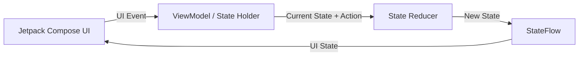
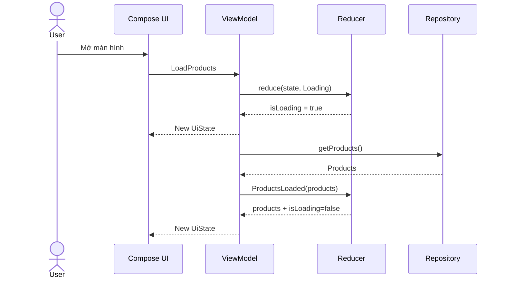
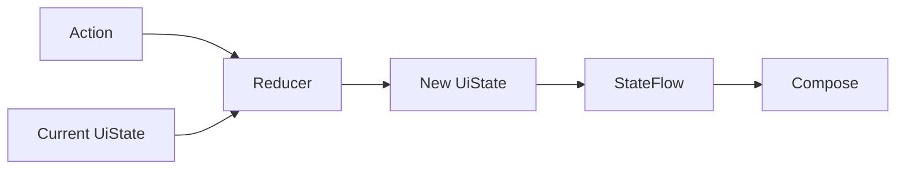
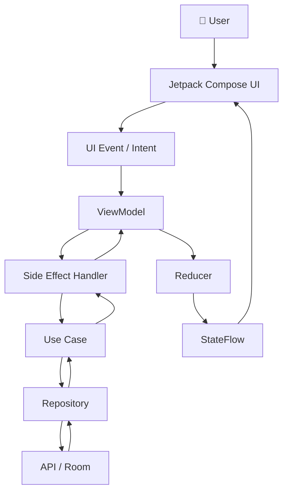
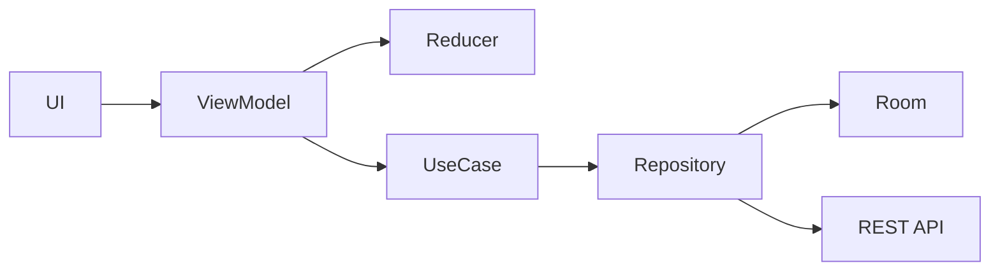
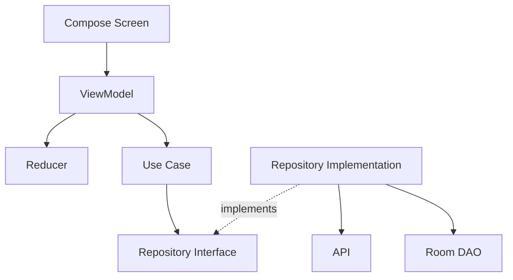

[](https://developer.android.com/topic/architecture/ui-layer?utm_source=chatgpt.com)

# 038 — STATE REDUCER

> **Học phần:** 03 — Architecture, State and Data
> **Module:** Module 05 — Design and Architecture
> **Nhóm nội dung:** Reactive State
> **Nguồn roadmap:** Design and Architecture / Reactive State
> **Loại bài:** Architecture
> **Thứ tự trong module:** 038
> **Thời lượng gợi ý:** 34 phút

---

## 1. Tóm tắt

**State Reducer** là một cách tổ chức logic cập nhật state theo công thức:

```text
Current State + Event/Action → Reducer → New State
```

Reducer nhận:

* **state hiện tại**;
* một **event/action** vừa xảy ra;

sau đó tính toán và trả về **state mới**.

Ý tưởng này đặc biệt phù hợp với:

* **Unidirectional Data Flow — UDF**;
* **MVI**;
* Redux-inspired architecture;
* `ViewModel + StateFlow`;
* Jetpack Compose;
* các màn hình có nhiều trạng thái và nhiều event tương tác.

Android hiện khuyến nghị kiến trúc hiện đại sử dụng **UDF**, state holder như `ViewModel`, Coroutines và Flow. Theo UDF, state đi từ state holder xuống UI, còn event từ UI đi ngược lên state holder. ([Android Developers][1])

> **Điểm quan trọng:** `Reducer` không phải là một Android API hay một class bắt buộc của Jetpack. Đây là **pattern tổ chức state transition** mà ta có thể chủ động áp dụng trong `ViewModel`, MVI hoặc kiến trúc tương tự.

---

## 2. Mục tiêu học tập

Sau bài này, bạn có thể:

* [ ] Giải thích được **State Reducer** bằng ngôn ngữ của mình.
* [ ] Hiểu công thức `State + Event → New State`.
* [ ] Phân biệt **State**, **Event**, **Reducer**, **Side Effect**.
* [ ] Biết reducer nằm ở đâu trong kiến trúc Android.
* [ ] Viết reducer bằng Kotlin.
* [ ] Kết hợp reducer với `ViewModel` và `StateFlow`.
* [ ] Sử dụng reducer trong Jetpack Compose.
* [ ] Tách network/database operation ra khỏi reducer.
* [ ] Unit test reducer mà không cần Android framework.
* [ ] Hiểu reducer ảnh hưởng thế nào tới UX, debugging và maintainability.
* [ ] Biết khi nào **không cần** State Reducer.

---

# 3. State Reducer là gì?

## 3.1. Công thức cơ bản

Một reducer về mặt khái niệm có dạng:

```text
reduce(currentState, action) → newState
```

Ví dụ:

```text
State:
count = 3

Action:
Increment

Reducer:
3 + Increment → 4

New State:
count = 4
```

Redux mô tả reducer là hàm nhận **state hiện tại** và **action**, sau đó trả về **state mới**:

```text
(state, action) → newState
```

Reducer lý tưởng là **pure function**: không gọi API, không sửa biến global, không thay đổi trực tiếp input và cùng input thì phải tạo cùng output. ([Redux][2])

---

## 3.2. Ví dụ rất đơn giản

```kotlin
data class CounterState(
    val count: Int = 0
)

sealed interface CounterAction {
    data object Increment : CounterAction
    data object Decrement : CounterAction
}

fun reduce(
    state: CounterState,
    action: CounterAction
): CounterState {
    return when (action) {
        CounterAction.Increment ->
            state.copy(count = state.count + 1)

        CounterAction.Decrement ->
            state.copy(count = state.count - 1)
    }
}
```

Nếu gọi:

```kotlin
val oldState = CounterState(count = 10)

val newState = reduce(
    oldState,
    CounterAction.Increment
)
```

thì:

```text
oldState.count = 10
newState.count = 11
```

Reducer không cần biết:

* `Button` nào được nhấn;
* Activity nào đang chạy;
* màn hình Compose nào đang hiển thị;
* dữ liệu đang được render thế nào.

Nó chỉ quan tâm đến:

```text
State + Action
```

---

# 4. State Reducer nằm ở đâu trong Android Architecture?

Android mô tả UI state như một snapshot bất biến chứa thông tin UI cần để render. Trong UDF, `ViewModel` thường đóng vai trò **state holder**, nhận event, áp dụng logic và tạo state mới cho UI. ([Android Developers][1])

Có thể thêm reducer vào giữa quá trình đó:



Reducer thường thuộc:

```text
Presentation / UI Layer
```

Ví dụ cấu trúc:

```text
feature/
└── products/
    ├── ProductScreen.kt
    ├── ProductViewModel.kt
    ├── ProductUiState.kt
    ├── ProductAction.kt
    └── ProductReducer.kt
```

---

# 5. Bốn thành phần cần phân biệt

## 5.1. State

State mô tả:

> **UI hiện tại đang trông như thế nào?**

Ví dụ:

```kotlin
data class ProductUiState(
    val products: List<Product> = emptyList(),
    val isLoading: Boolean = false,
    val query: String = "",
    val errorMessage: String? = null
)
```

---

## 5.2. Event / Intent

Event mô tả:

> **Điều gì vừa xảy ra?**

Ví dụ:

```kotlin
sealed interface ProductAction {

    data object LoadProducts : ProductAction

    data class SearchChanged(
        val query: String
    ) : ProductAction

    data class ProductsLoaded(
        val products: List<Product>
    ) : ProductAction

    data class LoadFailed(
        val message: String
    ) : ProductAction
}
```

Android cũng phân biệt khá rõ **event** và **state**: event là input xảy ra tại một thời điểm, trong khi state là output luôn tồn tại để UI có thể render. ([Android Developers][3])

---

## 5.3. Reducer

Reducer trả lời:

> **Event này sẽ biến state cũ thành state mới như thế nào?**

```kotlin
fun reduce(
    state: ProductUiState,
    action: ProductAction
): ProductUiState
```

---

## 5.4. Side Effect

Side effect là những tác vụ như:

```text
API request
Database write
File IO
Analytics
Location
Bluetooth
Camera
Navigation
Random
Current time
```

Những việc này **không nên thực hiện trực tiếp trong pure reducer**. Quy tắc reducer truyền thống yêu cầu reducer không thực hiện side effects và không mutate state input. ([Redux][4])

---

# 6. Luồng hoàn chỉnh của State Reducer

Ví dụ người dùng mở màn hình sản phẩm:



Điểm cần chú ý:

```text
Reducer KHÔNG gọi Repository.
```

Reducer chỉ xử lý:

```text
ProductsLoaded(products)
```

Repository/API được orchestration bởi `ViewModel`, use case hoặc effect handler.

---

# 7. Ví dụ thực tế — Product Screen

Giả sử màn hình cần:

* tải danh sách sản phẩm;
* hiển thị loading;
* tìm kiếm;
* retry khi lỗi;
* chọn sản phẩm.

---

## 7.1. Model của UI State

```kotlin
data class ProductUiState(
    val products: List<Product> = emptyList(),
    val query: String = "",
    val isLoading: Boolean = false,
    val errorMessage: String? = null
)
```

State nên được thiết kế như một **immutable snapshot** thay vì cho UI thay đổi từng thuộc tính lung tung. Đây cũng phù hợp với hướng quản lý UI state của Android. ([Android Developers][1])

---

# 8. Khai báo Action

```kotlin
sealed interface ProductAction {

    data object LoadStarted : ProductAction

    data class LoadSucceeded(
        val products: List<Product>
    ) : ProductAction

    data class LoadFailed(
        val message: String
    ) : ProductAction

    data class SearchChanged(
        val query: String
    ) : ProductAction

    data object Retry : ProductAction
}
```

Có thể đọc các action như những câu:

```text
LoadStarted
LoadSucceeded
LoadFailed
SearchChanged
Retry
```

Thay vì viết:

```text
setLoading()
updateProducts()
changeSearch()
setError()
```

ta đang mô tả:

> **Điều gì đã xảy ra?**

---

# 9. Viết ProductReducer

```kotlin
class ProductReducer {

    fun reduce(
        state: ProductUiState,
        action: ProductAction
    ): ProductUiState {

        return when (action) {

            ProductAction.LoadStarted -> {
                state.copy(
                    isLoading = true,
                    errorMessage = null
                )
            }

            is ProductAction.LoadSucceeded -> {
                state.copy(
                    products = action.products,
                    isLoading = false,
                    errorMessage = null
                )
            }

            is ProductAction.LoadFailed -> {
                state.copy(
                    isLoading = false,
                    errorMessage = action.message
                )
            }

            is ProductAction.SearchChanged -> {
                state.copy(
                    query = action.query
                )
            }

            ProductAction.Retry -> {
                state.copy(
                    isLoading = true,
                    errorMessage = null
                )
            }
        }
    }
}
```

Mỗi nhánh đều có dạng:

```text
Old State
   +
Action
   ↓
Reducer
   ↓
New State
```

---

# 10. Vì sao dùng `copy()`?

Kotlin `data class` giúp tạo state mới:

```kotlin
state.copy(
    isLoading = true
)
```

thay vì sửa object hiện tại.

Không nên thiết kế:

```kotlin
class ProductState {
    var isLoading = false
}
```

rồi trong reducer:

```kotlin
state.isLoading = true
return state
```

Pattern reducer truyền thống ưu tiên **immutability**, nghĩa là không mutate input mà tạo output mới. ([Redux][4])

---

# 11. Kết hợp Reducer với StateFlow

Android hỗ trợ `StateFlow` rất phù hợp để biểu diễn state thay đổi theo thời gian. `StateFlow` lưu giá trị state hiện tại và cung cấp state mới cho collector khi giá trị thay đổi. ([Kotlin][5])

```kotlin
class ProductViewModel(
    private val repository: ProductRepository,
    private val reducer: ProductReducer
) : ViewModel() {

    private val _uiState =
        MutableStateFlow(ProductUiState())

    val uiState: StateFlow<ProductUiState> =
        _uiState.asStateFlow()

    private fun dispatch(action: ProductAction) {

        _uiState.update { currentState ->
            reducer.reduce(
                currentState,
                action
            )
        }
    }
}
```

Pattern trở thành:



Android cũng sử dụng `MutableStateFlow.update { currentState -> currentState.copy(...) }` trong hướng dẫn chính thức về state production. ([Android Developers][3])

---

# 12. Xử lý network đúng cách

Một lỗi phổ biến là làm thế này:

```kotlin
fun reduce(
    state: ProductUiState,
    action: ProductAction
): ProductUiState {

    repository.getProducts()

    return state
}
```

Không nên.

Reducer sẽ:

* phụ thuộc network;
* không còn deterministic;
* khó unit test;
* có side effect;
* khó replay event.

---

## Cách tốt hơn

```kotlin
fun loadProducts() {

    viewModelScope.launch {

        dispatch(ProductAction.LoadStarted)

        try {

            val products =
                repository.getProducts()

            dispatch(
                ProductAction.LoadSucceeded(
                    products
                )
            )

        } catch (e: Exception) {

            dispatch(
                ProductAction.LoadFailed(
                    e.message ?: "Unknown error"
                )
            )
        }
    }
}
```

Network xử lý ở:

```text
ViewModel / UseCase / Effect Handler
```

Reducer chỉ nhận:

```text
LoadStarted
LoadSucceeded
LoadFailed
```

---

# 13. Kiến trúc đầy đủ



Android gọi class như `ViewModel` là **state holder**: nơi xử lý event, phối hợp với data/domain layer và tạo state để UI render. ([Android Developers][1])

---

# 14. Compose UI

UI chỉ cần quan sát `uiState`.

```kotlin
@Composable
fun ProductRoute(
    viewModel: ProductViewModel
) {

    val state by
        viewModel.uiState.collectAsStateWithLifecycle()

    ProductScreen(
        state = state,
        onSearchChanged = viewModel::search,
        onRetry = viewModel::retry
    )
}
```

Android hiện khuyến nghị dùng:

```kotlin
collectAsStateWithLifecycle()
```

để collect `Flow` trong Compose theo lifecycle của Android, thay vì để collector tiếp tục hoạt động không cần thiết khi UI không active. ([Android Developers][6])

---

## Stateless UI

```kotlin
@Composable
fun ProductScreen(
    state: ProductUiState,
    onSearchChanged: (String) -> Unit,
    onRetry: () -> Unit
) {

    when {

        state.isLoading -> {
            CircularProgressIndicator()
        }

        state.errorMessage != null -> {
            ErrorContent(
                message = state.errorMessage,
                onRetry = onRetry
            )
        }

        else -> {
            ProductList(
                products = state.products
            )
        }
    }
}
```

UI trở thành gần giống:

```text
UI = render(State)
```

---

# 15. Reducer và Unidirectional Data Flow

Luồng tốt:

```text
                ┌──────────────┐
                │      UI      │
                └──────┬───────┘
                       │
                     Event
                       │
                       ▼
                ┌──────────────┐
                │  ViewModel   │
                └──────┬───────┘
                       │
              State + Action
                       │
                       ▼
                ┌──────────────┐
                │   Reducer    │
                └──────┬───────┘
                       │
                    State
                       │
                       ▼
                ┌──────────────┐
                │      UI      │
                └──────────────┘
```

Đây là cách cụ thể hóa nguyên tắc UDF của Android:

```text
State ↓

Events ↑
```

Trong UDF, Android mô tả chu trình: UI gửi event lên `ViewModel`, `ViewModel` xử lý event và cập nhật state, state mới sau đó quay lại UI để render. ([Android Developers][1])

---

# 16. Pure Reducer

Reducer tốt nên gần với một hàm toán học:

$$
S_{t+1} = R(S_t, A_t)
$$

Trong đó:

* $S_t$: state hiện tại;
* $A_t$: action tại thời điểm $t$;
* $R$: reducer;
* $S_{t+1}$: state tiếp theo.

Ví dụ:

$$
R(
\text{count}=4,
\text{Increment}
)
=

\text{count}=5
$$

Nếu input giống nhau thì output phải giống nhau:

```text
reduce(S1, A1) → S2
reduce(S1, A1) → S2
reduce(S1, A1) → S2
```

Không nên có:

```kotlin
Random.nextInt()
System.currentTimeMillis()
repository.get()
database.insert()
analytics.track()
```

bên trong pure reducer. Các side effect hoặc giá trị không deterministic làm reducer khó kiểm thử và khó replay. ([Redux][4])

---

# 17. Tại sao State Reducer dễ test?

Ví dụ test:

```kotlin
@Test
fun `LoadStarted sets loading true`() {

    val reducer = ProductReducer()

    val oldState = ProductUiState(
        isLoading = false
    )

    val newState = reducer.reduce(
        oldState,
        ProductAction.LoadStarted
    )

    assertTrue(newState.isLoading)
    assertNull(newState.errorMessage)
}
```

Không cần:

```text
Android Emulator
Activity
Compose
Room
Retrofit
Network
Coroutine
Mock server
```

Ta chỉ kiểm tra:

```text
Input → Function → Output
```

---

# 18. Test error state

```kotlin
@Test
fun `LoadFailed produces error state`() {

    val reducer = ProductReducer()

    val oldState = ProductUiState(
        isLoading = true
    )

    val newState = reducer.reduce(
        oldState,
        ProductAction.LoadFailed(
            "No internet"
        )
    )

    assertFalse(newState.isLoading)

    assertEquals(
        "No internet",
        newState.errorMessage
    )
}
```

---

# 19. Test state transition table

Một reducer tốt có thể mô tả bằng bảng:

| State hiện tại | Action        | State tiếp theo    |
| -------------- | ------------- | ------------------ |
| Idle           | LoadStarted   | Loading            |
| Loading        | LoadSucceeded | Content            |
| Loading        | LoadFailed    | Error              |
| Error          | Retry         | Loading            |
| Content        | SearchChanged | Content + query    |
| Content        | Refresh       | Loading/Refreshing |

Cách nhìn này rất hữu ích khi màn hình trở nên phức tạp.

---

# 20. State Reducer và Finite State Machine

Reducer đặc biệt hữu ích khi UI có state rõ ràng:

```text
Idle
  ↓
Loading
 ↙   ↘
Error Content
  ↓
Retry
  ↓
Loading
```

Có thể model bằng:

```kotlin
sealed interface ScreenState {

    data object Idle : ScreenState

    data object Loading : ScreenState

    data class Content(
        val products: List<Product>
    ) : ScreenState

    data class Error(
        val message: String
    ) : ScreenState
}
```

Reducer:

```kotlin
fun reduce(
    state: ScreenState,
    action: ProductAction
): ScreenState
```

---

# 21. Boolean State Explosion

Một state như:

```kotlin
data class UiState(
    val isLoading: Boolean,
    val hasError: Boolean,
    val hasData: Boolean
)
```

có thể vô tình sinh ra:

```text
isLoading = true
hasError = true
hasData = false
```

hay:

```text
isLoading = true
hasError = true
hasData = true
```

Trong khi nghiệp vụ không cho phép.

Dùng sealed state có thể giảm trạng thái vô nghĩa:

```kotlin
sealed interface UiState {

    data object Loading : UiState

    data class Success(
        val data: List<Product>
    ) : UiState

    data class Error(
        val message: String
    ) : UiState
}
```

---

# 22. Reducer không thay thế ViewModel

Đây là điểm thường bị hiểu sai.

```text
Reducer ≠ ViewModel
```

### ViewModel

Có thể:

* quản lý coroutine;
* gọi UseCase;
* gọi Repository;
* phối hợp nhiều data source;
* xử lý lifecycle scope;
* expose `StateFlow`;
* dispatch actions.

### Reducer

Chỉ nên tập trung:

```text
Current State
+
Action
↓
New State
```

Android khuyến nghị `ViewModel` làm state holder cấp màn hình và tự động tồn tại qua configuration change. ([Android Developers][1])

---

# 23. Reducer không thay thế Repository



Reducer không nên:

```text
query database
call API
access SharedPreferences
open files
```

---

# 24. Lifecycle

Reducer bản thân gần như:

```text
Lifecycle-independent
```

vì reducer chỉ là function.

Tuy nhiên:

```text
UI
↓
ViewModel
↓
StateFlow
```

vẫn liên quan lifecycle.

`ViewModel` phù hợp cho screen-level UI state vì tồn tại qua configuration change, trong khi Compose có thể thu thập `Flow` bằng `collectAsStateWithLifecycle()` để việc observation phù hợp lifecycle. ([Android Developers][1])

---

# 25. Rotate màn hình có mất State không?

Nếu state chỉ nằm trong:

```kotlin
remember {
    mutableStateOf(...)
}
```

thì cần xem xét lifecycle của composable.

Nếu state ở:

```text
ViewModel
    ↓
StateFlow
```

thì configuration change như rotation thường không làm mất chính `ViewModel` screen-level. ([Android Developers][1])

Tuy nhiên cần phân biệt:

```text
Configuration Change
≠
Process Death
```

Nếu state bắt buộc phục hồi sau process death, cần cân nhắc:

* `SavedStateHandle`;
* database;
* DataStore;
* persistent domain data.

Reducer **không tự động giải quyết persistence**.

---

# 26. State Reducer và UX

State management kém có thể gây:

```text
Loading không tắt
       ↓
Spinner chạy mãi

Error state không reset
       ↓
UI vừa Success vừa hiện Error

Request cũ trả về sau request mới
       ↓
UI hiển thị dữ liệu cũ

Double-click
       ↓
Submit hai lần
```

Reducer giúp toàn bộ state transition tập trung hơn:

```text
Event
 ↓
Transition Rule
 ↓
State
 ↓
UI
```

Từ đó dễ kiểm soát:

* loading;
* success;
* error;
* retry;
* disabled state;
* empty state.

---

# 27. Reducer và Debugging

Có thể log:

```text
ACTION:
SearchChanged("pixel")

OLD STATE:
query = ""

NEW STATE:
query = "pixel"
```

Hoặc:

```text
ACTION = LoadProducts

OLD:
Idle

NEW:
Loading
```

Điều này giúp debugging theo chuỗi:

```text
Action 1
↓
State 1
↓
Action 2
↓
State 2
↓
Action 3
↓
State 3
```

Pure reducer cũng phù hợp với tư tưởng **replayable state transition**, vì cùng state/action sẽ có thể tạo lại cùng kết quả nếu reducer deterministic. Nguyên tắc này là một lý do các reducer truyền thống tránh side effects và mutation. ([Redux][4])

---

# 28. Reducer và Concurrency

Ví dụ hai thao tác cùng lúc:

```text
Search
+
Refresh
```

Nếu code rải rác:

```kotlin
_state.value = ...
_state.value = ...
_state.value = ...
```

khó theo dõi các transition.

Với:

```kotlin
MutableStateFlow.update {
    reducer.reduce(it, action)
}
```

việc tính next state được gom vào một transition rõ ràng.

Android cũng minh họa `MutableStateFlow.update` để tạo state mới từ `currentState`, thay vì rải logic cập nhật state ở UI. ([Android Developers][3])

---

# 29. Anti-pattern — UI tự sửa state

Không nên:

```kotlin
Button(
    onClick = {
        state.isLoading = true
    }
)
```

UI đang vừa:

```text
Render
+
Business logic
+
State mutation
```

Android khuyến nghị với UI state không quá đơn giản, UI nên chủ yếu **consume và display state**, còn state holder xử lý event và tạo state. ([Android Developers][1])

Tốt hơn:

```kotlin
Button(
    onClick = {
        onRetry()
    }
)
```

---

# 30. Anti-pattern — Reducer gọi API

Không nên:

```kotlin
fun reduce(
    state: UiState,
    action: Action
): UiState {

    val result =
        repository.loadProducts()

    return state.copy(
        products = result
    )
}
```

Hậu quả:

```text
Reducer
├── network dependency
├── concurrency
├── exception
├── timeout
├── cancellation
└── difficult testing
```

---

# 31. Anti-pattern — Reducer quá lớn

Ví dụ:

```text
AppReducer.kt
```

có:

```text
5000 lines
200 actions
100 state properties
```

Nên tách:

```text
SearchReducer
CartReducer
CheckoutReducer
ProfileReducer
```

Redux cũng mô tả việc chia logic reducer thành các reducer nhỏ hơn theo từng phần của state khi state tree phát triển. ([Redux][4])

---

# 32. Khi nào nên dùng State Reducer?

State Reducer đáng dùng khi màn hình có:

* nhiều event;
* nhiều UI state;
* loading / success / error;
* filter;
* pagination;
* form;
* retry;
* network;
* offline;
* undo;
* multi-step flow;
* realtime event;
* state transition phức tạp.

Ví dụ:

```text
Checkout
Chat
Search
Product Detail
Booking
Payment
Upload
Authentication
Editor
```

---

# 33. Khi nào Reducer có thể là over-engineering?

Ví dụ:

```kotlin
@Composable
fun ToggleExample() {

    var enabled by remember {
        mutableStateOf(false)
    }

    Switch(
        checked = enabled,
        onCheckedChange = {
            enabled = it
        }
    )
}
```

Không nhất thiết tạo:

```text
ToggleState
ToggleAction
ToggleIntent
ToggleReducer
ToggleEffect
ToggleStore
```

Android cũng cho phép state rất đơn giản được quản lý trực tiếp bởi UI; state holder/reducer trở nên hữu ích hơn khi logic và state phức tạp. ([Android Developers][7])

> **Architecture phải giảm complexity, không phải tạo thêm ceremony.**

---

# 34. So sánh trực tiếp

| Cách                        | State Reducer              |
| --------------------------- | -------------------------- |
| `state.value = ...` rải rác | state transition tập trung |
| Logic khó tìm               | reducer chứa rule          |
| Side effect dễ trộn         | dễ tách effect             |
| Khó replay                  | dễ theo dõi action         |
| Test ViewModel nhiều        | reducer test rất nhẹ       |
| Mutation dễ xảy ra          | ưu tiên immutable          |
| Flow khó debug              | Action → State rõ          |

---

# 35. Dependency Direction

Cho bài thực hành roadmap:



Điểm quan trọng:

```text
UI
↓
State holder
↓
Domain/Data abstractions
```

không phải:

```text
Compose → Retrofit
Compose → Room
Reducer → Retrofit
```

---

# 36. Mini Project thực hành

## Product Search Screen

Xây dựng màn hình:

```text
┌───────────────────────────────────┐
│ Search products...                │
├───────────────────────────────────┤
│                                   │
│ Pixel 10                          │
│ Galaxy S26                        │
│ Xperia ...                        │
│                                   │
└───────────────────────────────────┘
```

State:

```kotlin
data class SearchUiState(
    val query: String = "",
    val results: List<Product> = emptyList(),
    val isLoading: Boolean = false,
    val error: String? = null
)
```

Action:

```kotlin
sealed interface SearchAction {

    data class QueryChanged(
        val value: String
    ) : SearchAction

    data object SearchStarted : SearchAction

    data class SearchSuccess(
        val results: List<Product>
    ) : SearchAction

    data class SearchError(
        val message: String
    ) : SearchAction
}
```

---

# 37. Reducer bài thực hành

```kotlin
class SearchReducer {

    fun reduce(
        state: SearchUiState,
        action: SearchAction
    ): SearchUiState {

        return when (action) {

            is SearchAction.QueryChanged ->
                state.copy(
                    query = action.value
                )

            SearchAction.SearchStarted ->
                state.copy(
                    isLoading = true,
                    error = null
                )

            is SearchAction.SearchSuccess ->
                state.copy(
                    results = action.results,
                    isLoading = false,
                    error = null
                )

            is SearchAction.SearchError ->
                state.copy(
                    isLoading = false,
                    error = action.message
                )
        }
    }
}
```

---

# 38. Unit Test bắt buộc

Viết ít nhất:

```text
QueryChanged
SearchStarted
SearchSuccess
SearchError
```

Ví dụ:

```kotlin
@Test
fun `SearchSuccess stores results and stops loading`() {

    val products = listOf(
        Product(id = 1, name = "Pixel")
    )

    val state = SearchUiState(
        isLoading = true
    )

    val result = reducer.reduce(
        state,
        SearchAction.SearchSuccess(
            products
        )
    )

    assertFalse(result.isLoading)
    assertEquals(products, result.results)
    assertNull(result.error)
}
```

---

# 39. Artifact đưa vào Portfolio

Cấu trúc repository:

```text
state-reducer-demo/
│
├── README.md
│
├── app/
│
└── feature/
    └── search/
        ├── SearchScreen.kt
        ├── SearchViewModel.kt
        ├── SearchUiState.kt
        ├── SearchAction.kt
        ├── SearchReducer.kt
        └── SearchReducerTest.kt
```

README nên có:

```markdown
# Android State Reducer Demo

## Architecture

Compose
↓
ViewModel
↓
Reducer
↓
StateFlow
↓
Compose

## Concepts

- Unidirectional Data Flow
- Immutable UI State
- Pure Reducer
- StateFlow
- Side Effect Separation
- Unit Testing
```

---

# 40. Câu hỏi phỏng vấn

### Câu 1

**State Reducer là gì?**

Trả lời ngắn:

> State Reducer là một function nhận current state và action/event rồi trả về state mới. Reducer thường được thiết kế pure và immutable để state transition dễ dự đoán, test và debug.

---

### Câu 2

**Reducer có gọi API không?**

Thông thường không.

```text
API call → Side Effect

Reducer → State transformation
```

---

### Câu 3

**Reducer khác ViewModel thế nào?**

```text
ViewModel
├── lifecycle scope
├── coroutine
├── repository/use case
├── StateFlow
└── orchestration

Reducer
└── State + Action → New State
```

---

### Câu 4

**Tại sao reducer dễ unit test?**

Vì reducer có thể là pure function:

```text
Known Input
↓
Reducer
↓
Known Output
```

---

### Câu 5

**Reducer có bắt buộc trong MVVM không?**

Không.

MVVM hoàn toàn có thể dùng:

```kotlin
_uiState.update {
    it.copy(...)
}
```

Reducer được thêm vào khi cần tập trung và chuẩn hóa các state transition.

---

# 41. Mental Model cần nhớ

```text
┌─────────────┐
│    Event    │
└──────┬──────┘
       │
       ▼
┌─────────────┐
│   Reducer   │ ◄──── Current State
└──────┬──────┘
       │
       ▼
┌─────────────┐
│  New State  │
└──────┬──────┘
       │
       ▼
┌─────────────┐
│     UI      │
└─────────────┘
```

Hay chỉ cần nhớ:

$$
\boxed{
NewState = Reducer(CurrentState, Action)
}
$$

---

# 42. Checklist Production

Trước khi release một màn hình dùng reducer, kiểm tra:

### State

* [ ] Có một `UiState` rõ ràng.
* [ ] State ưu tiên immutable.
* [ ] Không có tổ hợp state vô nghĩa.
* [ ] Loading / Empty / Error / Success được xử lý.
* [ ] State cần persistence đã được xác định.

### Reducer

* [ ] Reducer không gọi API.
* [ ] Reducer không truy cập database.
* [ ] Reducer không dùng random/time trực tiếp.
* [ ] Reducer không mutate input.
* [ ] Mỗi action có transition rõ ràng.

### Lifecycle

* [ ] Screen state được đặt trong scope phù hợp.
* [ ] Configuration change được kiểm tra.
* [ ] Process death được cân nhắc.
* [ ] Flow từ UI được collect lifecycle-aware khi cần. Android khuyến nghị `collectAsStateWithLifecycle()` cho Flow trong Compose trên Android. ([Android Developers][6])

### Error

* [ ] Network timeout có state.
* [ ] Offline có state.
* [ ] Retry có event.
* [ ] Error cũ được clear đúng lúc.
* [ ] Không để loading chạy vĩnh viễn.

### Testing

* [ ] Test Loading.
* [ ] Test Success.
* [ ] Test Error.
* [ ] Test Retry.
* [ ] Test các transition quan trọng.
* [ ] Test edge cases.

### Debugging

* [ ] Có thể log Action.
* [ ] Có thể log Old State.
* [ ] Có thể log New State.
* [ ] Không log dữ liệu nhạy cảm.

---

# 43. Bài tập

## Bài 1 — Counter Reducer

Tạo:

```text
CounterState
CounterAction
CounterReducer
CounterViewModel
CounterScreen
```

Action:

```text
Increment
Decrement
Reset
```

---

## Bài 2 — Login Reducer

State:

```text
email
password
isLoading
error
isLoggedIn
```

Event:

```text
EmailChanged
PasswordChanged
LoginClicked
LoginStarted
LoginSuccess
LoginFailed
```

---

## Bài 3 — Refactor một màn hình

Chọn một màn hình đang có:

```kotlin
_state.update(...)
```

ở nhiều nơi.

Refactor thành:

```text
Action
↓
Reducer
↓
State
```

Sau đó so sánh:

* số nơi cập nhật state;
* độ dễ đọc;
* khả năng unit test;
* khả năng debug.

---

# 44. Checklist hoàn thành bài học

* [ ] Giải thích được State Reducer.
* [ ] Hiểu `State + Action → New State`.
* [ ] Phân biệt Event và State.
* [ ] Phân biệt Reducer và Side Effect.
* [ ] Viết được immutable `UiState`.
* [ ] Viết được sealed `Action`.
* [ ] Viết được reducer.
* [ ] Kết hợp reducer với `ViewModel`.
* [ ] Expose state bằng `StateFlow`.
* [ ] Consume state bằng Compose.
* [ ] Biết reducer không thay thế ViewModel.
* [ ] Biết reducer không gọi Repository trực tiếp.
* [ ] Có unit test reducer.
* [ ] Có diagram UDF.
* [ ] Có mini project hoặc artifact đưa vào portfolio.

---

# 45. Tổng kết

**State Reducer** biến state management từ kiểu:

```text
"Ở đâu đó có một đoạn code sửa state"
```

thành:

```text
Event
  ↓
Reducer(CurrentState, Event)
  ↓
NewState
  ↓
UI
```

Trong Android hiện đại, cách tiếp cận này kết hợp rất tự nhiên với:

```text
Jetpack Compose
      +
ViewModel
      +
StateFlow
      +
Unidirectional Data Flow
```

Android khuyến nghị UDF cho kiến trúc hiện đại: state đi từ state holder xuống UI, event đi từ UI lên state holder; `ViewModel` thường là state holder cấp màn hình. Reducer không phải thành phần Jetpack bắt buộc, mà là một cách rất hữu ích để **tách riêng và chuẩn hóa phép chuyển đổi state** trong mô hình đó. ([Android Developers][1])

Công thức quan trọng nhất của bài:

$$
\boxed{
S_{t+1}=Reducer(S_t,Action_t)
}
$$

và nguyên tắc:

```text
Reducer        → tính state mới
ViewModel      → điều phối
UseCase        → nghiệp vụ
Repository     → dữ liệu
StateFlow      → truyền state
Compose        → render state
```

[1]: https://developer.android.com/topic/architecture/ui-layer "UI layer  |  App architecture  |  Android Developers"
[2]: https://redux.js.org/tutorials/fundamentals/part-3-state-actions-reducers "Redux Fundamentals, Part 3: State, Actions, and Reducers | Redux"
[3]: https://developer.android.com/topic/architecture/ui-layer/state-production "UI State production  |  App architecture  |  Android Developers"
[4]: https://redux.js.org/usage/structuring-reducers/prerequisite-concepts "Prerequisite Concepts | Redux"
[5]: https://kotlinlang.org/api/kotlinx.coroutines/kotlinx-coroutines-core/kotlinx.coroutines.flow/-state-flow/ "StateFlow | kotlinx.coroutines – Kotlin Programming Language"
[6]: https://developer.android.com/develop/ui/compose/state "State and Jetpack Compose  |  Android Developers"
[7]: https://developer.android.com/topic/architecture/ui-layer/stateholders "State holders and UI state  |  App architecture  |  Android Developers"

---

# Bài luyện tập

## Mục tiêu


## Đề bài


## Yêu cầu hoàn thành

- [ ] 
- [ ] 
- [ ] 

## Kết quả / lời giải


## Ghi chú
