[](https://developer.android.com/codelabs/basic-android-kotlin-compose-viewmodel-and-state?utm_source=chatgpt.com)

# 039 - Single Source of Truth

> **Học phần:** 03 - Architecture, State and Data
> **Module:** Module 05 - Design and Architecture
> **Nhóm nội dung:** Reactive State
> **Nguồn roadmap:** Design and Architecture / Reactive State
> **Loại bài:** Architecture
> **Thứ tự trong module:** 039
> **Thời lượng gợi ý:** 34 phút

---

## 1. Tóm tắt

**Single Source of Truth — SSOT** có thể hiểu là:

> Với **mỗi loại dữ liệu**, ứng dụng phải xác định **một nơi duy nhất sở hữu trạng thái chính thức của dữ liệu đó**.

Nơi này chịu trách nhiệm:

* lưu hoặc giữ giá trị hiện tại;
* quyết định khi nào dữ liệu thay đổi;
* cung cấp dữ liệu cho các phần khác;
* nhận các yêu cầu thay đổi dữ liệu;
* tránh việc nhiều thành phần tự ý sửa cùng một trạng thái.

Theo hướng dẫn kiến trúc Android hiện tại, khi định nghĩa một loại dữ liệu mới, nên chỉ định một SSOT. SSOT là chủ sở hữu dữ liệu và chỉ nó mới được phép mutate dữ liệu đó; dữ liệu được cung cấp ra ngoài nên mang tính immutable. ([Android Developers][1])

Ví dụ trong ứng dụng Android:

```text
API
 ↓
Repository
 ↓
Room Database ← SSOT
 ↓
Flow
 ↓
ViewModel
 ↓
StateFlow<UiState>
 ↓
Compose UI
```

Nếu API trả về dữ liệu mới, UI **không nên hiển thị trực tiếp dữ liệu API rồi đồng thời đọc Room**. Repository đồng bộ API → Room, và UI tiếp tục đọc dữ liệu từ Room.

Android đặc biệt khuyến nghị local data source như database làm source of truth khi xây dựng ứng dụng **offline-first**. ([Android Developers][2])

---

# 2. Mục tiêu học tập

Sau bài này, bạn có thể:

* giải thích **Single Source of Truth** bằng ngôn ngữ của mình;
* phân biệt **source of truth**, **data source**, **Repository**, **ViewModel** và **UI state**;
* hiểu vì sao API, database và ViewModel không nên cùng là nguồn dữ liệu chính thức của một loại dữ liệu;
* thiết kế luồng:

```text
Network → Database → Repository → ViewModel → UI
```

* kết hợp SSOT với:

  * Room;
  * Repository;
  * Kotlin Flow;
  * StateFlow;
  * ViewModel;
  * Jetpack Compose;
  * UDF;
  * offline-first;
* xử lý refresh dữ liệu mà không tạo ra hai nguồn sự thật;
* viết test kiểm tra Repository và ViewModel;
* nhận biết các anti-pattern liên quan tới state;
* tạo một project nhỏ có thể đưa vào portfolio.

---

# 3. Single Source of Truth là gì?

## 3.1. Định nghĩa

Giả sử ứng dụng có đối tượng:

```kotlin
data class User(
    val id: Long,
    val name: String,
    val avatar: String
)
```

Trong app có:

```text
Network API
Room Database
Repository
ViewModel
Compose UI
```

Câu hỏi quan trọng là:

> **User hiện tại ở đâu mới là phiên bản chính thức?**

Nếu tất cả đều có quyền sửa `User`, ta sẽ gặp vấn đề:

```text
API User      = "An"
Database User = "An Khánh"
ViewModel     = "Khanh"
UI            = "An Khanh"
```

Vậy đâu là giá trị đúng?

Đây chính là vấn đề SSOT giải quyết.

Android định nghĩa SSOT là nơi sở hữu một loại dữ liệu; các thay đổi được tập trung tại đó, giúp dữ liệu khó bị các thành phần khác sửa tùy ý và khiến quá trình truy vết lỗi dễ hơn. ([Android Developers][1])

---

# 4. Tư duy quan trọng: SSOT không có nghĩa toàn app chỉ có một database

Một hiểu nhầm phổ biến:

```text
SSOT = toàn bộ ứng dụng chỉ được có một nguồn dữ liệu
```

Không đúng.

SSOT thường áp dụng theo **loại dữ liệu hoặc phạm vi state**.

Ví dụ:

| Dữ liệu                              | SSOT có thể là                 |
| ------------------------------------ | ------------------------------ |
| Danh sách bài viết                   | Room                           |
| User profile                         | Room                           |
| Authentication token                 | DataStore                      |
| Session đăng nhập tạm thời           | Repository cache               |
| Text đang nhập trên màn hình         | UI state                       |
| Search query                         | ViewModel / `SavedStateHandle` |
| Expanded/collapsed của một component | Compose state                  |

Android cũng lưu ý các Repository khác nhau có thể có source of truth khác nhau; ví dụ một Repository có thể dùng cache còn Repository khác có thể dùng network hoặc database. ([Android Developers][2])

---

# 5. Hai cấp độ SSOT thường gặp trong Android

Một app Android thường cần phân biệt:

```text
Application Data
        ↓
UI State
```

## 5.1. SSOT của Application Data

Ví dụ:

```text
Article
User
Product
Message
Todo
Transaction
```

Với ứng dụng offline-first:

```text
Room Database
```

thường là SSOT.

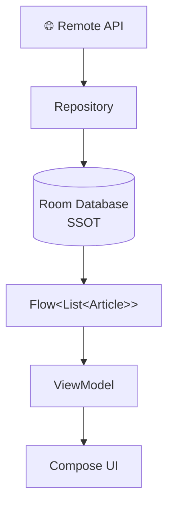

Trong kiến trúc offline-first được Android hướng dẫn, local data source là canonical source of truth và các tầng phía trên đọc dữ liệu từ local source; Repository chịu trách nhiệm giao tiếp với network rồi cập nhật local source. ([Android Developers][3])

---

## 5.2. SSOT của UI State

Một màn hình có thể cần:

```kotlin
data class ArticleUiState(
    val articles: List<Article> = emptyList(),
    val loading: Boolean = false,
    val error: String? = null
)
```

Ở đây:

```text
ViewModel
```

có thể đóng vai trò state holder tạo ra **screen-level UI state**.

Android khuyến nghị `ViewModel` làm implementation điển hình cho screen-level state holder. UI state nên được cung cấp dưới dạng immutable snapshot và UI chủ yếu đọc state rồi render. ([Android Developers][4])

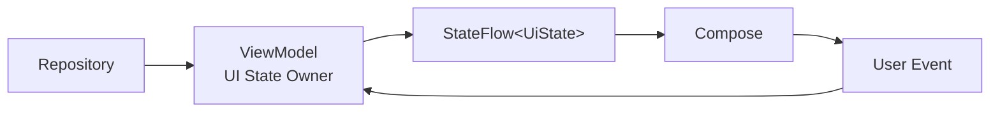

---

# 6. SSOT và Unidirectional Data Flow

SSOT thường đi cùng:

**UDF — Unidirectional Data Flow**

Android cũng đặt SSOT và UDF cạnh nhau trong các nguyên tắc kiến trúc được khuyến nghị. State thường đi xuống, còn event làm thay đổi state đi theo hướng ngược lại tới nơi sở hữu state. ([Android Developers][1])

Mô hình:

```text
             STATE
               ↓

SSOT → ViewModel → UI
 ↑                 │
 │                 │
 └──── EVENT ──────┘
```

Chi tiết hơn:

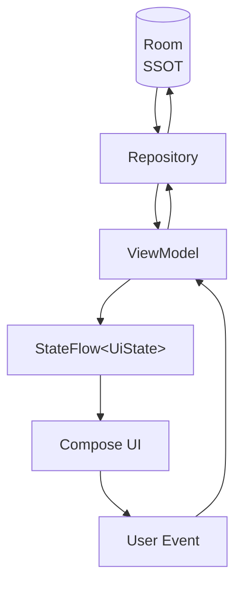

Android mô tả UDF trong UI layer theo chu trình tương tự: ViewModel expose state cho UI, UI gửi user event lên ViewModel, ViewModel xử lý event và state mới được đưa trở lại UI. ([Android Developers][4])

---

# 7. Vì sao SSOT quan trọng?

## 7.1. Data consistency

Không có SSOT:

```text
API ─────────────→ UI

Database ────────→ UI

ViewModel cache ─→ UI
```

Ba nguồn đều có thể nói:

> "Tôi có dữ liệu mới nhất."

Kết quả:

```text
Database = bookmarked
API      = not bookmarked
UI       = bookmarked
Cache    = not bookmarked
```

---

Có SSOT:

```text
API
 │
 │ sync
 ▼
Database ← Truth
 │
 ▼
UI
```

UI chỉ cần hỏi:

> Database hiện tại đang chứa gì?

SSOT và UDF giúp tăng tính nhất quán vì mutation đi qua một con đường xác định thay vì nhiều thành phần cùng tự sửa state. ([Android Developers][1])

---

# 8. Ví dụ thực tế: ứng dụng News

Giả sử app có danh sách:

```text
News
```

Server API:

```http
GET /articles
```

Local:

```text
Room
```

App cần:

* đọc News;
* refresh News;
* bookmark News;
* hoạt động khi mất mạng.

Kiến trúc:

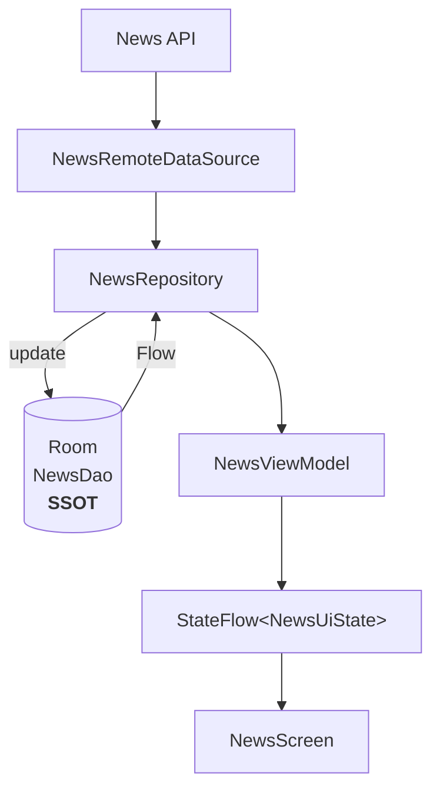

Điểm quan trọng:

```text
API → Repository → Room
```

không phải:

```text
API → UI
```

Android dùng cùng nguyên tắc này cho offline-first: network source được Repository sử dụng để cập nhật local source, trong khi các tầng domain/UI không nên truy cập network source trực tiếp. ([Android Developers][3])

---

# 9. Luồng đọc dữ liệu

Giả sử người dùng mở màn hình News.

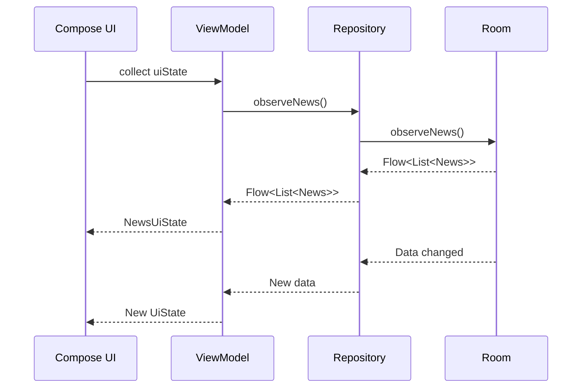

Không cần UI hỏi:

```text
"Dữ liệu có thay đổi chưa?"
```

Flow sẽ phát giá trị mới.

Android khuyến nghị expose UI state qua observable holder như `StateFlow`, để UI phản ứng với state change thay vì tự pull dữ liệu liên tục. ([Android Developers][4])

---

# 10. Luồng refresh dữ liệu

Đây là phần rất quan trọng.

## Cách sai

```text
Refresh
   ↓
API
   ↓
ViewModel
   ↓
UI
```

Trong khi UI bình thường lại đọc:

```text
Room → UI
```

Khi đó:

```text
API
 ↓
 UI ← Room
```

UI có **hai nguồn sự thật**.

---

## Cách đúng

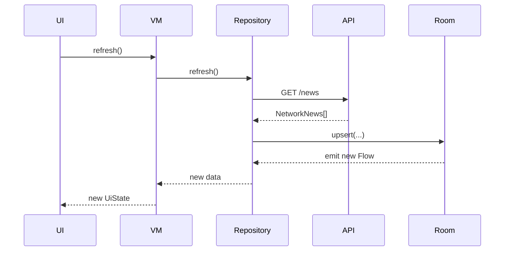

Điểm quan trọng:

```text
API response
    ↓
Database
    ↓
Flow
    ↓
UI
```

**API response không trở thành đường tắt đến UI.**

---

# 11. Code thực hành — Room làm SSOT

Ta xây dựng một app Todo.

---

## 11.1. Entity

```kotlin
@Entity(tableName = "tasks")
data class TaskEntity(
    @PrimaryKey
    val id: Long,
    val title: String,
    val completed: Boolean
)
```

---

# 12. DAO

```kotlin
@Dao
interface TaskDao {

    @Query("SELECT * FROM tasks ORDER BY id DESC")
    fun observeTasks(): Flow<List<TaskEntity>>

    @Upsert
    suspend fun upsertTasks(tasks: List<TaskEntity>)

    @Query(
        """
        UPDATE tasks
        SET completed = :completed
        WHERE id = :taskId
        """
    )
    suspend fun updateCompleted(
        taskId: Long,
        completed: Boolean
    )
}
```

Điểm đáng chú ý:

```kotlin
fun observeTasks(): Flow<List<TaskEntity>>
```

Room không chỉ:

```text
SELECT một lần
```

mà còn tạo stream để tầng trên quan sát dữ liệu.

---

# 13. Remote Data Source

```kotlin
interface TaskApi {

    @GET("tasks")
    suspend fun getTasks(): List<NetworkTask>
}
```

Model network:

```kotlin
data class NetworkTask(
    val id: Long,
    val title: String,
    val completed: Boolean
)
```

---

# 14. Không để Network Model lan ra UI

Ta convert:

```text
NetworkTask
     ↓
TaskEntity
     ↓
Task
     ↓
TaskUiModel
```

Ví dụ:

```kotlin
fun NetworkTask.toEntity(): TaskEntity {
    return TaskEntity(
        id = id,
        title = title,
        completed = completed
    )
}
```

Việc giữ network model và database model bên trong data layer giúp tầng UI/domain ít bị ảnh hưởng khi schema nguồn dữ liệu thay đổi; hướng dẫn offline-first của Android cũng minh họa việc dùng model riêng cho network, local và model mà data layer expose. ([Android Developers][3])

---

# 15. Repository

```kotlin
class TaskRepository(
    private val dao: TaskDao,
    private val api: TaskApi
) {

    val tasks: Flow<List<TaskEntity>> =
        dao.observeTasks()

    suspend fun refresh() {

        val networkTasks =
            api.getTasks()

        val entities =
            networkTasks.map {
                it.toEntity()
            }

        dao.upsertTasks(entities)
    }

    suspend fun setCompleted(
        taskId: Long,
        completed: Boolean
    ) {
        dao.updateCompleted(
            taskId,
            completed
        )
    }
}
```

Hãy chú ý `refresh()`:

```kotlin
api.getTasks()
```

không:

```kotlin
return api.getTasks()
```

mà:

```text
API
 ↓
convert
 ↓
Room
```

Sau đó:

```kotlin
dao.observeTasks()
```

mới phát dữ liệu mới.

Đây chính là implementation đơn giản của:

```text
Room = SSOT
```

Repository trong Android architecture có trách nhiệm expose dữ liệu, centralize thay đổi và phối hợp nhiều data source; mỗi Repository cần xác định source of truth của dữ liệu mà nó quản lý. ([Android Developers][2])

---

# 16. ViewModel

UI không sử dụng:

```text
TaskDao
```

hoặc:

```text
TaskApi
```

trực tiếp.

Ta có:

```kotlin
data class TaskUiState(
    val tasks: List<TaskEntity> = emptyList(),
    val isLoading: Boolean = false,
    val error: String? = null
)
```

ViewModel:

```kotlin
class TaskViewModel(
    private val repository: TaskRepository
) : ViewModel() {

    val uiState: StateFlow<TaskUiState> =
        repository.tasks
            .map { tasks ->
                TaskUiState(
                    tasks = tasks
                )
            }
            .stateIn(
                scope = viewModelScope,
                started =
                    SharingStarted.WhileSubscribed(5_000),
                initialValue = TaskUiState()
            )

    fun refresh() {

        viewModelScope.launch {

            repository.refresh()

        }
    }

    fun toggleTask(task: TaskEntity) {

        viewModelScope.launch {

            repository.setCompleted(
                task.id,
                !task.completed
            )
        }
    }
}
```

`ViewModel` phù hợp để giữ và sản xuất screen-level UI state, đồng thời tồn tại qua configuration change như xoay màn hình. ([Android Developers][5])

---

# 17. Compose UI

```kotlin
@Composable
fun TaskScreen(
    viewModel: TaskViewModel
) {

    val uiState by
        viewModel.uiState
            .collectAsStateWithLifecycle()

    LazyColumn {

        items(uiState.tasks) { task ->

            TaskItem(
                task = task,
                onCheckedChange = {
                    viewModel.toggleTask(task)
                }
            )
        }
    }
}
```

Compose chỉ:

```text
observe state
↓
render UI
↓
send event
```

UI không:

```text
UPDATE database
GET network
mutate repository cache
```

Android khuyến nghị khi consume Flow từ Compose cần xử lý lifecycle phù hợp, chẳng hạn bằng `collectAsStateWithLifecycle()`. ([Android Developers][4])

---

# 18. Toàn bộ kiến trúc

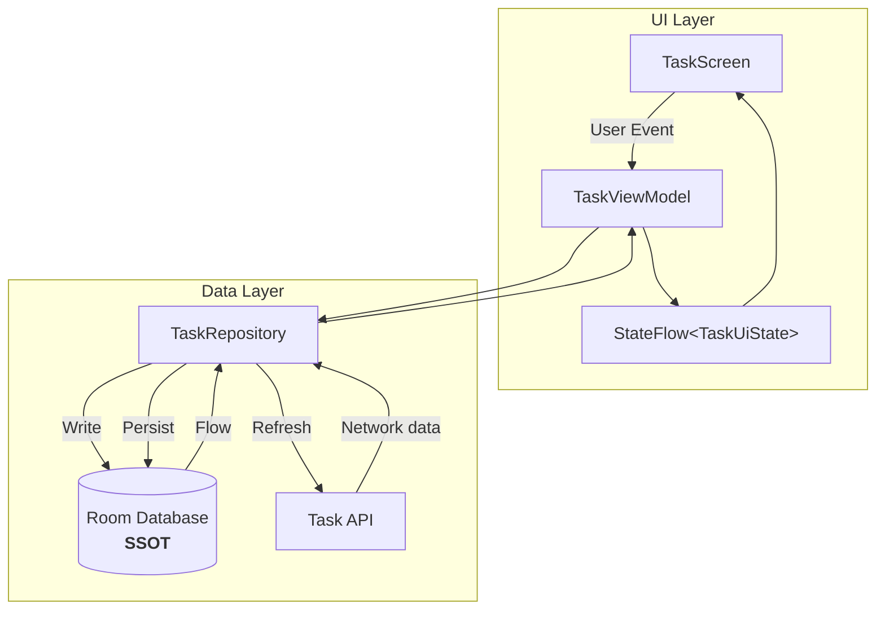

Đây là điểm cốt lõi của bài:

```text
READ

Room
 ↓
Repository
 ↓
ViewModel
 ↓
UI
```

và:

```text
WRITE

UI
 ↓
ViewModel
 ↓
Repository
 ↓
Room
```

Network:

```text
API
 ↓
Repository
 ↓
Room
```

---

# 19. Ví dụ Bookmark — tại sao UI không tự mutate state?

Giả sử:

```kotlin
data class ArticleUiModel(
    val id: Long,
    val title: String,
    val bookmarked: Boolean
)
```

Người dùng bấm:

```text
Bookmark
```

Một implementation sai có thể làm:

```kotlin
article.bookmarked = true
```

trực tiếp trong UI.

Nhưng Room vẫn chứa:

```text
false
```

Khi Flow emit lại:

```text
UI → false
```

Người dùng sẽ thấy icon bookmark:

```text
ON
↓
OFF
```

Android cũng dùng ví dụ bookmark để giải thích vì sao UI state nên immutable: nếu UI tự sửa bookmark trong khi data layer cũng là nguồn của giá trị bookmark, hai nơi sẽ cạnh tranh vai trò source of truth. ([Android Developers][4])

---

# 20. Luồng đúng của Bookmark

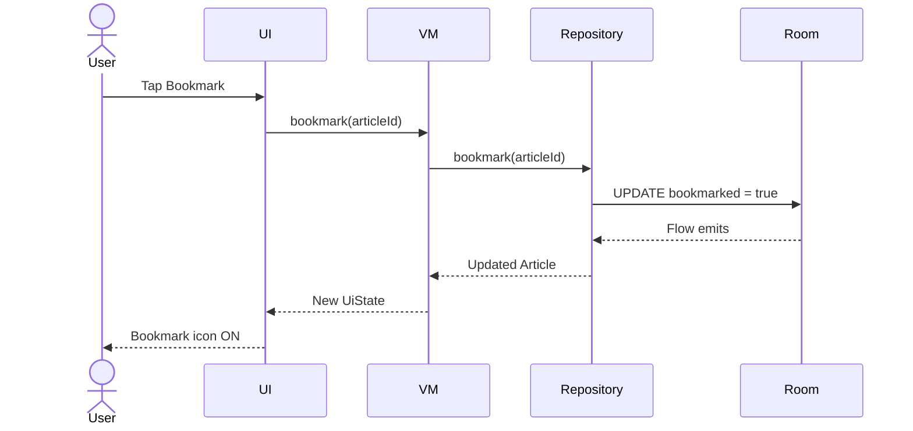

Ta không cần:

```text
UI tự sửa icon
```

UI chỉ phản ánh:

```text
state.bookmarked
```

---

# 21. Anti-pattern: Multiple Sources of Truth

Một kiến trúc dễ phát sinh bug:

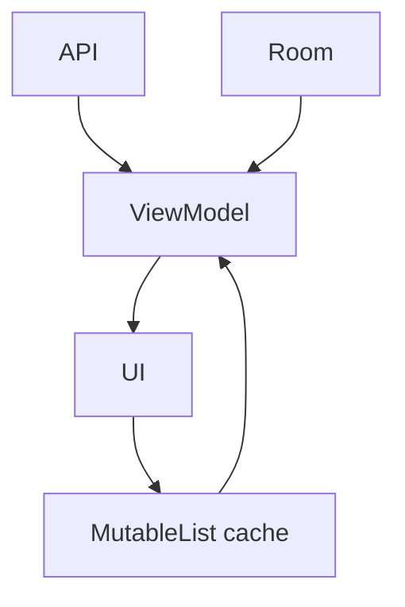

Có ba trạng thái:

```text
Network state
Database state
Memory state
```

mà cả ba cùng được xem là authoritative.

Khi đó rất khó trả lời:

> Giá trị nào đúng?

---

# 22. Dấu hiệu app đang thiếu SSOT

Ví dụ thấy code như:

```kotlin
var users = mutableListOf<User>()

val usersLiveData = MutableLiveData<List<User>>()

val usersFlow = MutableStateFlow<List<User>>(emptyList())

var cachedUsers = mutableListOf<User>()
```

Nếu cả bốn cùng đại diện cho:

```text
current users
```

hãy đặt câu hỏi:

> Cái nào mới thực sự sở hữu `users`?

Thông thường chỉ nên tồn tại một nguồn authoritative, còn các giá trị khác là:

```text
projection
cache
transformation
UI representation
```

của nguồn đó.

---

# 23. Cache không nhất thiết là SSOT

Ví dụ:

```text
Server
 ↓
Memory Cache
 ↓
UI
```

Memory cache có thể là SSOT của Repository nếu thiết kế ứng dụng quy định như vậy.

Nhưng nếu cache chỉ dùng để tăng tốc:

```text
Database = truth
Memory = derived cache
```

thì:

```text
Memory ≠ SSOT
```

Do đó không nên hỏi:

> "Database hay cache cái nào luôn là SSOT?"

Câu hỏi đúng là:

> "Kiến trúc của feature này quy định ai sở hữu dữ liệu?"

Android cho phép source of truth là database hoặc thậm chí cache bên trong Repository tùy loại dữ liệu và yêu cầu hệ thống. ([Android Developers][2])

---

# 24. Repository có phải luôn là SSOT?

Không nhất thiết.

Repository có thể đóng vai trò:

```text
Coordinator
```

giữa:

```text
Network
Database
Cache
```

Ví dụ:

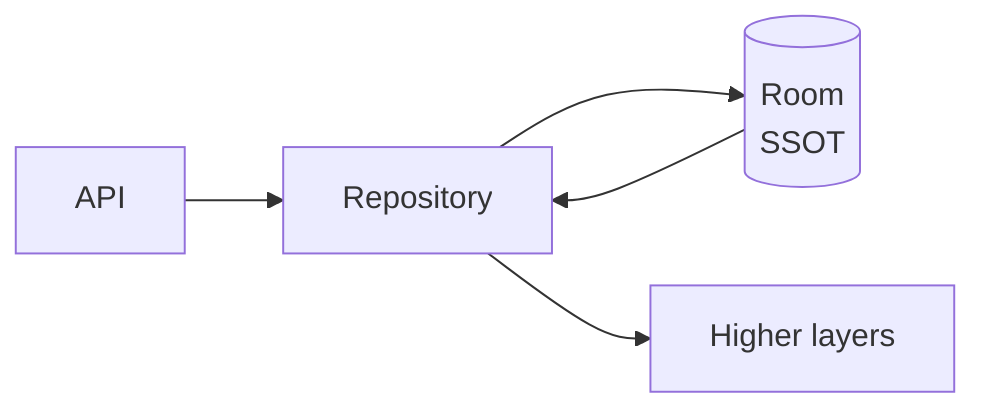

Ở đây:

```text
Repository = Gateway / Coordinator
Room       = SSOT
```

Repository cung cấp API thống nhất nhưng dữ liệu nó expose vẫn bắt nguồn từ SSOT. Đây cũng là cách Android mô tả Repository: kết hợp nhiều data source, giải quyết conflict rồi cập nhật source of truth. ([Android Developers][2])

---

# 25. Network có thể là SSOT không?

Có.

Ví dụ dữ liệu:

```text
Real-time stock price
Payment status
Server-controlled game state
```

hệ thống backend có thể là authoritative source.

Nhưng trong một mobile app offline-first, thường ta xây dựng:

```text
Server
  ↕ sync
Local DB ← canonical local SSOT
  ↓
UI
```

Android khuyến nghị local database làm source of truth cho offline-first nhằm đảm bảo dữ liệu mà UI đọc nhất quán ngay cả khi trạng thái kết nối thay đổi. ([Android Developers][3])

---

# 26. SSOT và Offline-first

Đây là use case điển hình nhất.

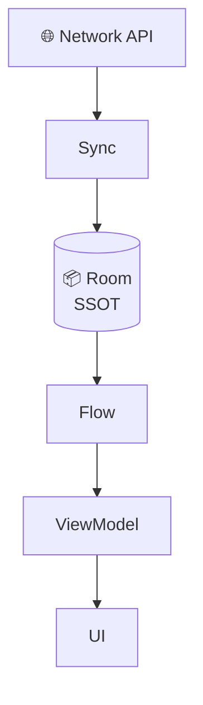

Khi mất mạng:

```text
Network ❌

Room ✅
 ↓
Flow
 ↓
UI
```

App vẫn hiển thị được dữ liệu local.

Android mô tả local source trong offline-first là nguồn mà higher layers đọc độc quyền, chính nhằm giữ consistency khi app chuyển qua lại giữa online và offline. ([Android Developers][3])

---

# 27. Khi mạng trở lại

```text
Network restored
      ↓
Synchronize
      ↓
Remote API
      ↓
Repository
      ↓
Update Room
      ↓
Flow emit
      ↓
ViewModel
      ↓
UI updates
```

UI không cần biết:

```text
Wi-Fi vừa bật
API vừa đồng bộ
database vừa update
```

Nó chỉ biết:

```text
state changed
```

---

# 28. SSOT và Reactive State

Đây chính là lý do SSOT nằm trong nhóm:

> **Reactive State**

Ta có:

```text
SSOT
 ↓
Observable Stream
 ↓
State Holder
 ↓
UI
```

Ví dụ:

```text
Room
 ↓
Flow
 ↓
Repository
 ↓
StateFlow
 ↓
Compose
```

Khi SSOT thay đổi:

```text
SSOT change
    ↓
Flow emits
    ↓
StateFlow changes
    ↓
Compose recomposes
```

UI vì thế trở thành **function của state** thay vì nơi tự duy trì nhiều bản sao dữ liệu.

---

# 29. Application State và UI State không giống nhau

Giả sử Database có:

```kotlin
Task(
    id = 1,
    title = "Learn Android",
    completed = false
)
```

Đây là:

```text
Application Data
```

UI state có thể là:

```kotlin
data class TaskScreenUiState(
    val tasks: List<Task>,
    val completedCount: Int,
    val showEmptyState: Boolean,
    val loading: Boolean
)
```

Trong đó:

```text
completedCount
showEmptyState
```

có thể được **derive** từ application data.

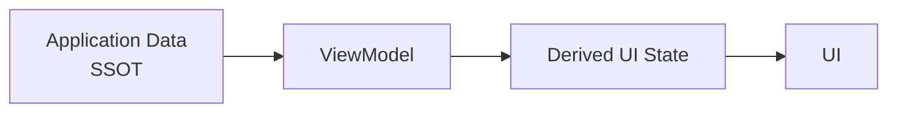

UI state không nhất thiết phải được lưu xuống database.

---

# 30. Derived State

Ví dụ có:

```kotlin
val tasks: List<Task>
```

Không cần thêm một mutable variable:

```kotlin
var completedTasks = ...
```

nếu nó có thể tính được:

```kotlin
val completedTasks =
    tasks.filter { it.completed }
```

Nguyên tắc:

```text
Nếu B luôn có thể tính từ A
→ tránh tạo B thành một source độc lập.
```

Ví dụ:

```text
tasks = SSOT
```

thì:

```text
taskCount
completedCount
progress
hasCompletedTasks
```

có thể là derived state.

---

# 31. Một ví dụ nguy hiểm

Sai:

```kotlin
var tasks: List<Task> = ...

var completedTasks: List<Task> = ...

var completedCount: Int = ...

var progress: Float = ...
```

Bốn state phải update cùng lúc.

Nếu quên:

```kotlin
completedCount
```

UI sai.

---

Đơn giản hơn:

```kotlin
data class Tasks(
    val items: List<Task>
) {

    val completedTasks
        get() = items.filter { it.completed }

    val completedCount
        get() = completedTasks.size

    val progress
        get() =
            if (items.isEmpty()) 0f
            else completedCount.toFloat() / items.size
}
```

Một nguồn:

```text
items
```

Các giá trị còn lại:

```text
derived state
```

---

# 32. Lifecycle và SSOT

Giả sử user rotate:

```text
Portrait
   ↓
Activity destroyed
   ↓
Landscape
   ↓
Activity recreated
```

Nếu dữ liệu nằm trong:

```kotlin
var list = mutableListOf(...)
```

của Activity:

```text
data lost
```

Screen-level state đặt trong `ViewModel` có thể tồn tại qua configuration change; đây là một trong những lợi ích chính mà Android nêu cho `ViewModel`. ([Android Developers][5])

```text
Activity
   ↓ destroyed

ViewModel
   ↓ remains

Activity
   ↓ recreated

collect state again
```

---

# 33. Nhưng ViewModel không phải database

Đừng nhầm:

```text
ViewModel survives rotation
```

với:

```text
ViewModel persists forever
```

Application process vẫn có thể bị OS terminate.

Với dữ liệu quan trọng:

```text
Room
DataStore
Server
```

mới phù hợp cho persistence.

`SavedStateHandle` có thể giúp giữ một số UI state qua process recreation, nhưng ViewModel không thay thế persistent data layer. Android phân biệt rõ caching qua configuration change của ViewModel và state restoration bằng `SavedStateHandle`. ([Android Developers][5])

---

# 34. Error State có phải SSOT không?

Ví dụ:

```kotlin
data class UiState(
    val tasks: List<Task>,
    val error: String?
)
```

`error` thường không phải application data.

Đây là:

```text
UI state
```

Ví dụ:

```text
Room = SSOT của Tasks

ViewModel = owner của TaskScreenUiState
```

Do đó một app có thể đồng thời có nhiều state owners ở các phạm vi khác nhau mà vẫn tuân thủ SSOT.

---

# 35. Loading State

Tương tự:

```kotlin
data class UiState(
    val tasks: List<Task>,
    val refreshing: Boolean
)
```

`refreshing` có thể thuộc ViewModel:

```text
ViewModel
   ↓
UiState.refreshing
```

Trong khi:

```text
tasks
```

vẫn có nguồn từ:

```text
Room
```

Điều quan trọng không phải:

> "Chỉ được có một state variable."

Mà là:

> "Mỗi state phải có owner rõ ràng."

---

# 36. Testing SSOT

SSOT làm testing dễ hơn vì mutation được tập trung vào những boundary rõ ràng.

Android cũng nêu testability là một lợi ích của UDF vì nguồn state được cô lập khỏi UI. ([Android Developers][4])

---

## 36.1. Repository test

Ta cần kiểm tra:

```text
API trả data
     ↓
Repository refresh
     ↓
Database update
     ↓
Flow emit
```

Pseudo-test:

```kotlin
@Test
fun refresh_updatesDatabase() = runTest {

    val api = FakeTaskApi(
        tasks = listOf(
            NetworkTask(
                id = 1,
                title = "Learn SSOT",
                completed = false
            )
        )
    )

    val dao = FakeTaskDao()

    val repository =
        TaskRepository(
            dao,
            api
        )

    repository.refresh()

    val tasks =
        repository.tasks.first()

    assertEquals(
        "Learn SSOT",
        tasks.first().title
    )
}
```

Điểm cần kiểm tra không phải:

```text
Repository trả API response đúng không?
```

mà là:

```text
Refresh có làm SSOT thay đổi đúng không?
```

---

# 37. Fake Repository cho ViewModel Test

Ta tạo seam:

```kotlin
interface TasksRepository {

    fun observeTasks(): Flow<List<Task>>

    suspend fun refresh()

    suspend fun setCompleted(
        id: Long,
        completed: Boolean
    )
}
```

Fake:

```kotlin
class FakeTasksRepository :
    TasksRepository {

    private val tasks =
        MutableStateFlow<List<Task>>(
            emptyList()
        )

    override fun observeTasks():
        Flow<List<Task>> = tasks

    override suspend fun refresh() {
    }

    override suspend fun setCompleted(
        id: Long,
        completed: Boolean
    ) {

        tasks.update { current ->

            current.map {

                if (it.id == id) {
                    it.copy(
                        completed = completed
                    )
                } else {
                    it
                }
            }
        }
    }
}
```

Test:

```text
Event
 ↓
ViewModel
 ↓
Repository
 ↓
New state
 ↓
UiState
```

---

# 38. Debugging với SSOT

Khi user báo:

> "Tôi bấm bookmark nhưng reload lại thì mất."

Nếu có SSOT rõ ràng:

```text
UI
 ↓
ViewModel
 ↓
Repository
 ↓
Room
```

ta debug lần lượt:

```text
1. UI event có gửi không?
2. ViewModel nhận event không?
3. Repository được gọi không?
4. Room UPDATE thành công không?
5. Room Flow emit không?
6. ViewModel tạo UiState mới không?
7. UI collect state không?
```

Không có SSOT:

```text
API?
cache?
Activity?
ViewModel?
singleton?
Room?
SharedPreferences?
```

Khó xác định lỗi hơn rất nhiều.

---

# 39. SSOT ảnh hưởng tới UX như thế nào?

| Vấn đề         | Không có SSOT               | Có SSOT              |
| -------------- | --------------------------- | -------------------- |
| Refresh        | UI có thể nhảy dữ liệu      | State nhất quán      |
| Offline        | dữ liệu biến mất            | có thể đọc local     |
| Bookmark       | icon dễ lệch database       | theo state thật      |
| Rotation       | có thể mất state            | state holder rõ ràng |
| Error recovery | khó biết rollback state nào | mutation tập trung   |
| Multi-screen   | dễ khác dữ liệu             | chia sẻ cùng nguồn   |
| Debugging      | khó tìm nguồn bug           | trace mutation dễ    |
| Testing        | phụ thuộc nhiều component   | boundary rõ ràng     |

Các lợi ích về consistency, traceability và testability là những lý do Android đưa SSOT/UDF vào các khuyến nghị kiến trúc chính. ([Android Developers][1])

---

# 40. Performance

SSOT không có nghĩa:

```text
Mỗi lần render UI
↓
query database lại thủ công
```

Reactive stream:

```text
Room
 ↓
Flow
```

giúp dữ liệu chỉ phát lại khi dữ liệu quan sát thay đổi.

ViewModel có thể chuyển stream thành:

```kotlin
StateFlow
```

và Compose collect nó theo lifecycle.

Pipeline:

```text
Room
 ↓
Flow
 ↓
StateFlow
 ↓
Compose
```

Android khuyến nghị observable state holder cho UI state và lifecycle-aware collection trong UI. ([Android Developers][4])

---

# 41. Một kiến trúc production tốt

Ví dụ feature:

```text
feature/news/
```

Cấu trúc:

```text
data/
├── local/
│   ├── NewsDao.kt
│   ├── NewsEntity.kt
│   └── NewsDatabase.kt
│
├── remote/
│   ├── NewsApi.kt
│   └── NetworkNews.kt
│
├── repository/
│   └── OfflineFirstNewsRepository.kt
│
└── model/
    └── News.kt

ui/
├── NewsScreen.kt
├── NewsUiState.kt
└── NewsViewModel.kt
```

Dependency:

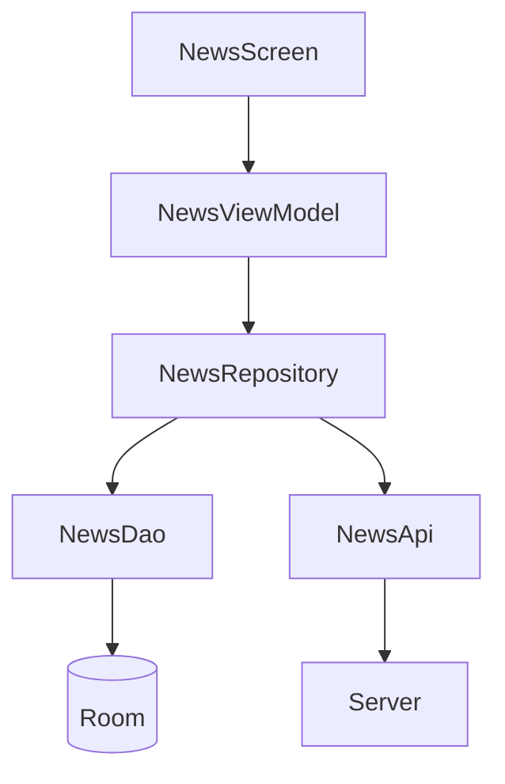

---

# 42. Các quy tắc thực hành nên nhớ

| Rule                      | Ý nghĩa                          |
| ------------------------- | -------------------------------- |
| One owner                 | Mỗi state có một owner           |
| Immutable outward         | Tầng ngoài chỉ đọc state         |
| Events inward             | Muốn sửa phải gửi event/function |
| Repository coordinates    | Repository điều phối data source |
| UI renders                | UI chủ yếu render state          |
| Database for durable data | Dữ liệu lâu dài nên persist      |
| Derive when possible      | Không duplicate state            |
| Observable state          | State thay đổi → UI phản ứng     |
| Lifecycle aware           | Không collect không cần thiết    |
| Test owner                | Test nơi state được mutate       |

---

# 43. Những lỗi thường gặp

### Lỗi 1 — UI gọi API trực tiếp

```text
Composable
 ↓
Retrofit
```

Thay vào đó:

```text
Composable
 ↓
ViewModel
 ↓
Repository
 ↓
Network
```

---

### Lỗi 2 — API và Room cùng feed UI

Sai:

```text
API ──→ UI
Room ─→ UI
```

Tốt hơn với offline-first:

```text
API
 ↓
Room
 ↓
UI
```

---

### Lỗi 3 — Activity giữ business data

```kotlin
class MainActivity {

    var users =
        mutableListOf<User>()
}
```

Rotation:

```text
Activity destroyed
↓
state disappears
```

---

### Lỗi 4 — Public MutableStateFlow

Sai:

```kotlin
val state =
    MutableStateFlow(...)
```

UI có thể:

```kotlin
viewModel.state.value = ...
```

Thay bằng:

```kotlin
private val _state =
    MutableStateFlow(...)

val state =
    _state.asStateFlow()
```

SSOT giữ quyền mutation.

---

### Lỗi 5 — Duplicate state

```kotlin
var products

var productCount

var hasProducts
```

Trong khi:

```text
productCount = products.size
hasProducts = products.isNotEmpty()
```

Hãy derive chúng từ:

```text
products
```

---

# 44. Câu hỏi thiết kế quan trọng

Khi thêm một state mới:

```text
selectedProduct
cart
user
articles
messages
```

hãy hỏi:

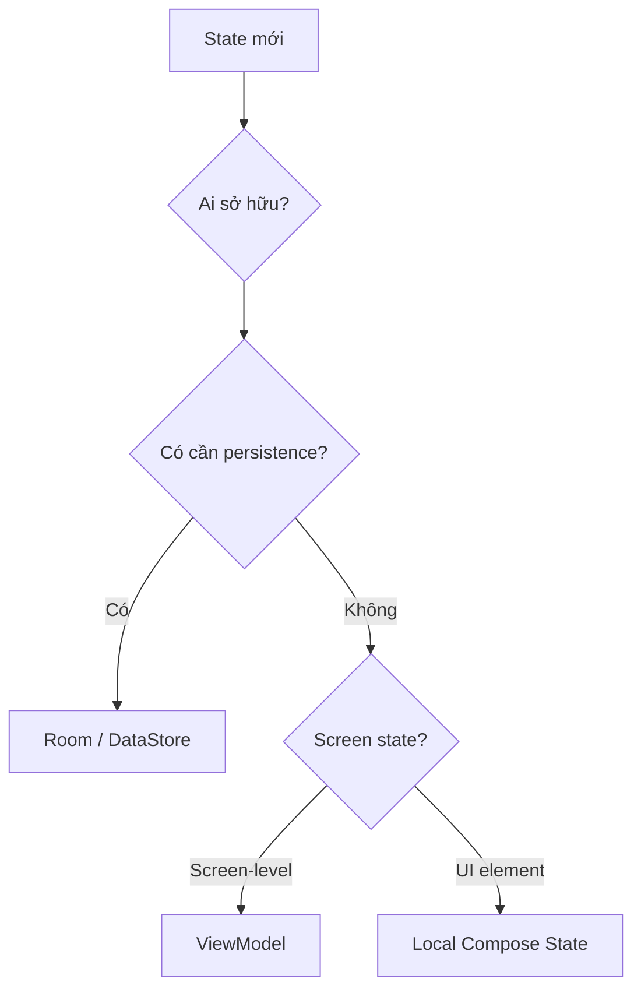

Đây là cách tư duy hữu ích hơn nhiều so với:

> "StateFlow hay LiveData?"

Vấn đề kiến trúc phải được giải quyết trước:

> **Ai sở hữu state?**

Sau đó mới chọn công cụ.

---

# 45. Bài thực hành

## Mini Project — Offline Todo

Yêu cầu:

```text
Todo App
```

Có:

```text
Room
Retrofit
Repository
ViewModel
StateFlow
Compose
```

Chức năng:

```text
Load Tasks
Add Task
Complete Task
Delete Task
Refresh
Offline Read
```

Kiến trúc mục tiêu:

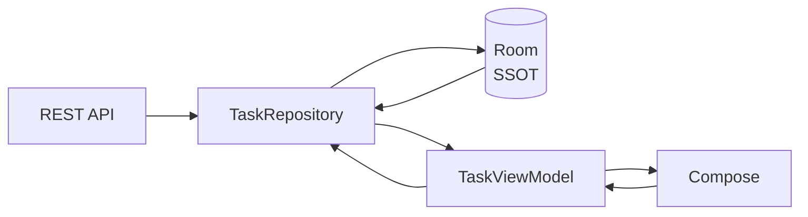

---

# 46. Bài tập refactor

Cho kiến trúc ban đầu:

```kotlin
@Composable
fun ProductScreen() {

    var products by remember {
        mutableStateOf(
            emptyList<Product>()
        )
    }

    LaunchedEffect(Unit) {

        products =
            retrofit.getProducts()
    }
}
```

Hãy refactor thành:

```text
ProductScreen
       ↓
ProductViewModel
       ↓
ProductRepository
       ↓
Room ← ProductApi
```

với:

```text
Room = SSOT
```

---

# 47. Acceptance Criteria

Project hoàn thành khi:

```text
Internet ON
 ↓
Refresh
 ↓
API
 ↓
Room
 ↓
UI updated
```

và:

```text
Internet OFF
 ↓
Open app
 ↓
Room
 ↓
UI still shows cached data
```

và:

```text
Rotate
 ↓
UI state remains valid
```

và:

```text
No UI component accesses API directly.
```

---

# 48. Artifact đưa vào Portfolio

Có thể tạo project:

```text
Android-Offline-First-SSOT-Demo
```

README:

```markdown
# Offline First Todo

## Architecture

Compose
↓
ViewModel
↓
Repository
↓
Room ← Retrofit

Room is the Single Source of Truth.

## Tech Stack

- Kotlin
- Jetpack Compose
- ViewModel
- StateFlow
- Room
- Retrofit
- Coroutines
- Flow

## Features

- Offline reads
- Network synchronization
- Reactive UI
- Single Source of Truth
- Repository pattern
- UDF
```

Artifact này thể hiện tốt:

```text
Architecture
Reactive State
Persistence
Offline-first
Testing
Repository Pattern
UDF
```

---

# 49. Câu hỏi phỏng vấn

### Câu 1

**Single Source of Truth là gì?**

Một câu trả lời tốt:

> SSOT là nguyên tắc mỗi loại dữ liệu có một owner authoritative chịu trách nhiệm thay đổi và cung cấp dữ liệu. Các thành phần khác không tự duy trì những bản sao mutable cạnh tranh với nguồn đó.

---

### Câu 2

**Repository có phải luôn là SSOT không?**

Không.

Repository có thể chỉ điều phối:

```text
Network
 ↓
Repository
 ↓
Room ← SSOT
```

---

### Câu 3

**Tại sao Room thường được chọn làm SSOT?**

Vì dữ liệu:

```text
persistent
observable
usable offline
```

và đặc biệt phù hợp với kiến trúc offline-first. Android hiện khuyến nghị local source như database làm source of truth trong trường hợp này. ([Android Developers][2])

---

### Câu 4

**ViewModel có thể là SSOT không?**

Có, đặc biệt với:

```text
screen-level UI state
```

nhưng không nên dùng nó thay persistent storage cho dữ liệu application cần tồn tại lâu dài. Android cũng ghi nhận trong một số trường hợp ViewModel có thể là source of truth. ([Android Developers][1])

---

### Câu 5

**SSOT liên quan gì đến UDF?**

```text
State
 ↓

SSOT → UI

UI → Event → SSOT
```

State đi xuống.

Event đi lên.

---

### Câu 6

**Tại sao không nên trả API response trực tiếp cho UI nếu Room là SSOT?**

Vì khi đó:

```text
API
```

và:

```text
Room
```

đều có thể trở thành nguồn dữ liệu mà UI sử dụng.

Thay vào đó:

```text
API → Room → Flow → UI
```

giữ một đường đọc nhất quán.

---

# 50. Mental Model

Hãy nhớ công thức:

```text
              ┌─────────────┐
              │    Event    │
              └──────┬──────┘
                     │
                     ▼
              ┌─────────────┐
              │    SSOT     │
              └──────┬──────┘
                     │
                   State
                     │
                     ▼
              ┌─────────────┐
              │     UI      │
              └─────────────┘
```

Hoặc ngắn hơn:

```text
Data has ONE OWNER.
```

Muốn đọc:

```text
Owner → State → Consumer
```

Muốn thay đổi:

```text
Consumer → Event → Owner
```

---

# 51. Checklist hoàn thành

* [ ] Giải thích được Single Source of Truth.
* [ ] Phân biệt SSOT và data source.
* [ ] Phân biệt Repository và SSOT.
* [ ] Phân biệt application data và UI state.
* [ ] Hiểu một app có thể có nhiều SSOT cho các loại state khác nhau.
* [ ] Hiểu vì sao UI state nên immutable.
* [ ] Biết sử dụng Room làm SSOT.
* [ ] Biết API nên sync dữ liệu vào Room.
* [ ] Biết sử dụng `Flow`.
* [ ] Biết chuyển Flow thành `StateFlow`.
* [ ] Biết sử dụng ViewModel làm screen state holder.
* [ ] Biết `collectAsStateWithLifecycle()`.
* [ ] Hiểu mối quan hệ SSOT + UDF.
* [ ] Không để UI gọi API trực tiếp.
* [ ] Không tạo nhiều mutable copy của cùng một state.
* [ ] Biết dùng derived state.
* [ ] Hiểu ảnh hưởng của configuration change.
* [ ] Hiểu ViewModel không thay database.
* [ ] Viết được Repository test.
* [ ] Viết được ViewModel test.
* [ ] Có sơ đồ architecture trong README.
* [ ] Có demo offline/online.
* [ ] Có artifact đủ tốt để đưa vào portfolio.

---

# 52. Tổng kết

**Single Source of Truth không phải một class hay library. Nó là một quyết định kiến trúc về quyền sở hữu dữ liệu.**

Trong Android hiện đại, một pipeline rất phổ biến là:

```text
                 NETWORK
                    │
                    │ synchronize
                    ▼
              ┌──────────┐
              │Repository│
              └────┬─────┘
                   │
                   ▼
            ┌─────────────┐
            │ Room / SSOT │
            └──────┬──────┘
                   │
                  Flow
                   │
                   ▼
            ┌─────────────┐
            │  ViewModel  │
            └──────┬──────┘
                   │
               StateFlow
                   │
                   ▼
            ┌─────────────┐
            │ Compose UI  │
            └──────┬──────┘
                   │
                 Event
                   │
                   └──────────────→ ViewModel
```

Hãy ghi nhớ ba nguyên tắc:

```text
1. Mỗi dữ liệu phải có OWNER rõ ràng.

2. Consumer đọc state nhưng không tự ý mutate state.

3. Mọi thay đổi quay về OWNER thông qua event/function.
```

Đó chính là nền tảng để ghép:

```text
SSOT
 +
UDF
 +
Repository
 +
Flow / StateFlow
 +
ViewModel
 +
Compose
```

thành một kiến trúc Android có **state nhất quán, dễ test, dễ debug và phù hợp cả với offline-first**. ([Android Developers][1])

[1]: https://developer.android.com/topic/architecture "Guide to app architecture  |  App architecture  |  Android Developers"
[2]: https://developer.android.com/topic/architecture/data-layer "Data layer  |  App architecture  |  Android Developers"
[3]: https://developer.android.com/topic/architecture/data-layer/offline-first "Build an offline-first app  |  App architecture  |  Android Developers"
[4]: https://developer.android.com/topic/architecture/ui-layer "UI layer  |  App architecture  |  Android Developers"
[5]: https://developer.android.com/topic/libraries/architecture/viewmodel "ViewModel overview  |  App architecture  |  Android Developers"
