# 001 — Shared Preferences

| Thuộc tính              | Nội dung                          |
| ----------------------- | --------------------------------- |
| **Học phần**            | 03 — Architecture, State and Data |
| **Module**              | Module 06 — Storage               |
| **Nhóm nội dung**       | Preferences and Files             |
| **Nguồn roadmap**       | Storage / Preferences and Files   |
| **Loại bài**            | Storage                           |
| **Thứ tự trong module** | 001                               |
| **Thời lượng gợi ý**    | 32 phút                           |
| **Ngôn ngữ**            | Kotlin                            |
| **Mức độ**              | Cơ bản → Trung cấp                |

---

## 1. Shared Preferences là gì?

**SharedPreferences** là API Android dùng để lưu một lượng nhỏ dữ liệu dưới dạng:

```text
key → value
```

Ví dụ:

```text
dark_mode       → true
language        → "vi"
font_size       → 16
onboarding_done → true
username        → "Khanh"
```

Một `SharedPreferences` object đại diện cho một tập hợp các cặp key-value mà ứng dụng có thể đọc và thay đổi. Android hỗ trợ trực tiếp các kiểu cơ bản như `Boolean`, `Float`, `Int`, `Long`, `String` và `Set<String>`. ([Android Developers][1])

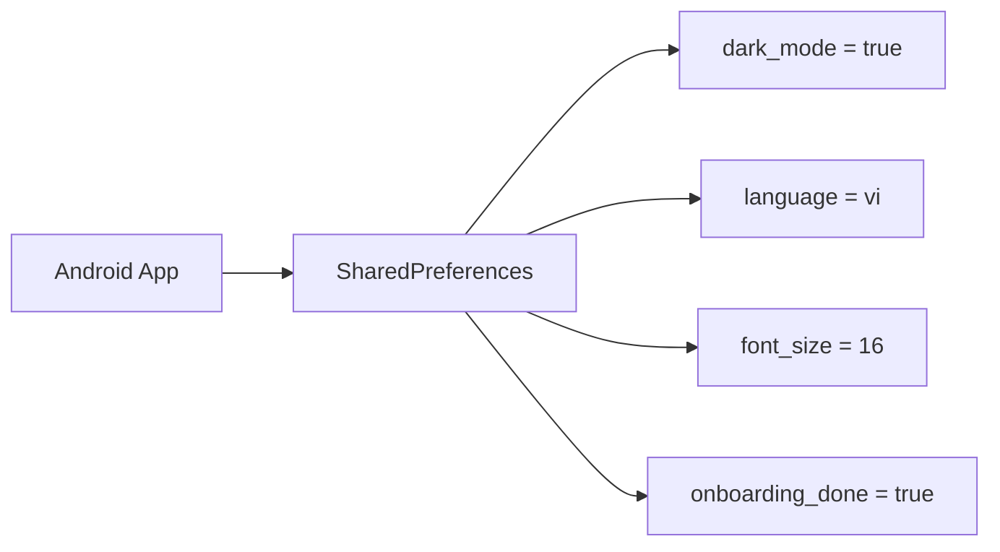

### Ví dụ thực tế

Giả sử ứng dụng có màn hình **Settings**:

```text
Settings
────────────────────

Dark Mode        [ ON ]
Notifications    [ ON ]
Language         [ VI ]
```

Các giá trị trên có thể được lưu:

```text
dark_mode = true
notifications = true
language = "vi"
```

Khi người dùng đóng app rồi mở lại, ứng dụng có thể đọc những giá trị này và khôi phục cấu hình.

---

## 2. Lưu ý quan trọng cho Android Developer Roadmap 2026

> **SharedPreferences vẫn là API Android cần biết, đặc biệt để đọc và bảo trì code cũ. Tuy nhiên, Android hiện khuyến nghị không dùng SharedPreferences cho nhu cầu lưu dữ liệu mới.**

Tài liệu Android hiện khuyến nghị:

* **DataStore** cho lượng dữ liệu nhỏ, preferences hoặc object cấu hình.
* **Room** cho dữ liệu có cấu trúc, quan hệ hoặc dataset lớn hơn. ([Android Developers][2])

Vì vậy, trong roadmap nên hiểu bài này theo hướng:

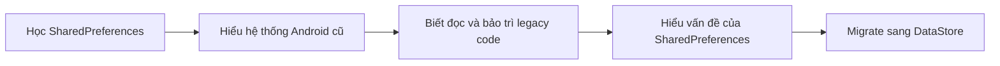

### Quy tắc thực tế

```text
Legacy project
      ↓
SharedPreferences
      ↓
Có thể tiếp tục maintain
      ↓
Migrate dần sang DataStore

New project
      ↓
Ưu tiên DataStore
```

DataStore sử dụng Kotlin coroutines và `Flow`, đồng thời cung cấp lưu trữ bất đồng bộ, nhất quán và transactional hơn SharedPreferences. ([Android Developers][3])

---

# 3. SharedPreferences nằm ở đâu trong Architecture?

SharedPreferences thuộc **Data Layer**, cụ thể là một dạng **Local Data Source**.

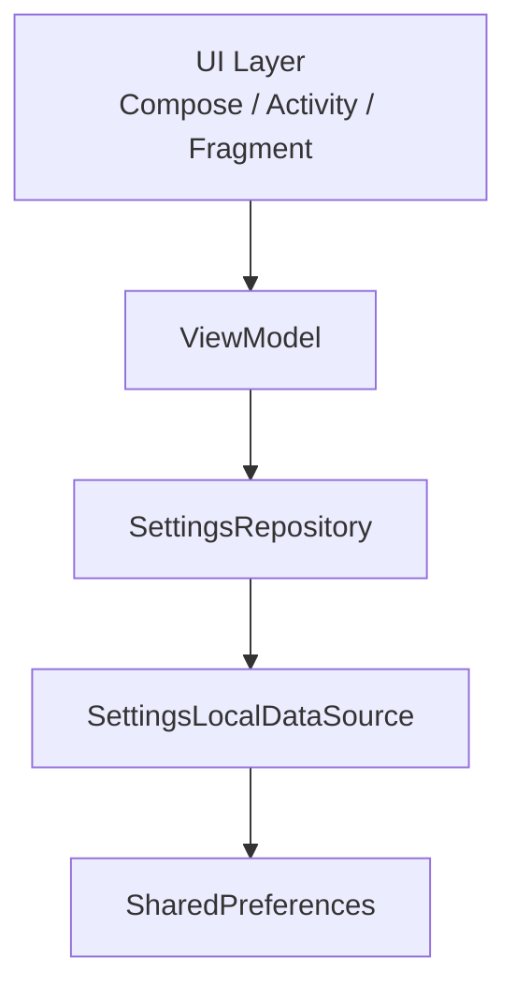

Trong kiến trúc Android tốt, UI/ViewModel không nên biết dữ liệu đang được lưu bằng SharedPreferences hay DataStore. Repository hoặc Local Data Source nên che giấu implementation này. Android cũng khuyến nghị không đặt tên abstraction theo công nghệ cụ thể nếu có khả năng thay đổi implementation sau này. ([Android Developers][4])

Ví dụ nên dùng:

```text
SettingsRepository
        ↓
SettingsLocalDataSource
```

thay vì để toàn bộ app phụ thuộc trực tiếp vào:

```text
UserSharedPreferencesDataSource
```

Nhờ đó sau này:

```text
SharedPreferences
      ↓ migrate
DataStore
```

UI gần như không phải thay đổi.

---

# 4. SharedPreferences không phải Preference UI

Hai khái niệm này dễ bị nhầm.

### SharedPreferences

Dùng để **lưu dữ liệu**:

```kotlin
prefs.getBoolean("dark_mode", false)
```

### AndroidX Preference

Dùng để xây **giao diện Settings**:

```text
Dark Mode        [Switch]
Notifications    [Switch]
Language         [List]
```

Preference library có thể sử dụng SharedPreferences ở phía dưới để lưu các giá trị của màn Settings. ([Android Developers][1])

Ví dụ màn Settings của Android:

[](https://developer.android.google.cn/develop/ui/views/components/settings?hl=en&utm_source=chatgpt.com)

Có thể hình dung:

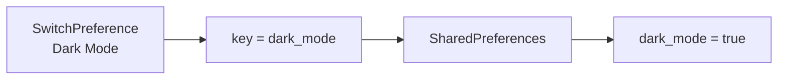

---

# 5. Những dữ liệu phù hợp với SharedPreferences

SharedPreferences phù hợp với **dữ liệu nhỏ và đơn giản**.

| Dữ liệu                 | Phù hợp? |
| ----------------------- | -------: |
| Dark Mode               |        ✅ |
| Language                |        ✅ |
| Đã xem onboarding chưa  |        ✅ |
| Bật/tắt notification    |        ✅ |
| Sort mode               |        ✅ |
| Filter preference       |        ✅ |
| Font size               |        ✅ |
| Hàng nghìn User objects |        ❌ |
| Danh sách sản phẩm lớn  |        ❌ |
| Chat history            |        ❌ |
| Quan hệ User → Orders   |        ❌ |
| Offline database lớn    |        ❌ |

Với dataset phức tạp, quan hệ hoặc cần truy vấn, Room phù hợp hơn. Với preferences mới, Android khuyến nghị DataStore. ([Android Developers][3])

---

# 6. API cơ bản

## 6.1 Lấy SharedPreferences

```kotlin
val preferences = context.getSharedPreferences(
    "app_settings",
    Context.MODE_PRIVATE
)
```

`getSharedPreferences()` cho phép ứng dụng truy cập một preference file theo tên. `MODE_PRIVATE` giới hạn quyền truy cập cho chính ứng dụng. ([Android Developers][1])

---

# 7. Ghi dữ liệu

Để thay đổi SharedPreferences:

```text
SharedPreferences
       ↓
     edit()
       ↓
SharedPreferences.Editor
       ↓
 putBoolean / putString / putInt
       ↓
     apply()
```

Ví dụ:

```kotlin
preferences
    .edit()
    .putBoolean("dark_mode", true)
    .apply()
```

Lưu nhiều giá trị:

```kotlin
preferences.edit()
    .putBoolean("dark_mode", true)
    .putString("language", "vi")
    .putInt("font_size", 16)
    .apply()
```

Android yêu cầu việc sửa giá trị đi qua `SharedPreferences.Editor`. ([Android Developers][1])

---

# 8. Đọc dữ liệu

```kotlin
val darkMode = preferences.getBoolean(
    "dark_mode",
    false
)
```

Trong đó:

```text
"dark_mode"
     │
     └── key

false
  │
  └── default value
```

Nếu key chưa tồn tại:

```text
dark_mode không tồn tại
        ↓
getBoolean("dark_mode", false)
        ↓
false
```

Default value rất quan trọng vì app phải biết trạng thái ban đầu khi người dùng chưa từng thiết lập preference. API Android hỗ trợ truyền giá trị mặc định trực tiếp khi đọc. ([Android Developers][1])

---

# 9. `apply()` và `commit()`

Có hai cách lưu thay đổi.

|                           | `apply()`        | `commit()`  |
| ------------------------- | ---------------- | ----------- |
| Cập nhật memory           | Ngay lập tức     | Có          |
| Ghi disk                  | Async            | Sync        |
| Block thread              | Ít hơn           | Có thể      |
| Return success            | Không            | `Boolean`   |
| Nên dùng trên Main Thread | Thường được dùng | ❌ Nên tránh |

Ví dụ:

```kotlin
preferences.edit()
    .putBoolean("dark_mode", true)
    .apply()
```

`apply()` cập nhật SharedPreferences trong bộ nhớ ngay nhưng thực hiện việc ghi disk bất đồng bộ. `commit()` ghi đồng bộ nên Android cảnh báo tránh gọi trên main thread vì có thể làm gián đoạn việc render UI. ([Android Developers][1])

---

# 10. Ví dụ hoàn chỉnh — SettingsLocalDataSource

Thay vì gọi SharedPreferences khắp Activity/Fragment, tạo abstraction.

```kotlin
class SettingsLocalDataSource(
    context: Context
) {

    private val preferences =
        context.getSharedPreferences(
            PREF_FILE,
            Context.MODE_PRIVATE
        )

    fun isDarkModeEnabled(): Boolean {
        return preferences.getBoolean(
            KEY_DARK_MODE,
            false
        )
    }

    fun setDarkMode(enabled: Boolean) {
        preferences.edit()
            .putBoolean(KEY_DARK_MODE, enabled)
            .apply()
    }

    fun getLanguage(): String {
        return preferences.getString(
            KEY_LANGUAGE,
            "en"
        ) ?: "en"
    }

    fun setLanguage(language: String) {
        preferences.edit()
            .putString(KEY_LANGUAGE, language)
            .apply()
    }

    companion object {
        private const val PREF_FILE = "app_settings"

        private const val KEY_DARK_MODE = "dark_mode"
        private const val KEY_LANGUAGE = "language"
    }
}
```

---

# 11. Thêm Repository

```kotlin
class SettingsRepository(
    private val localDataSource: SettingsLocalDataSource
) {

    fun isDarkModeEnabled(): Boolean {
        return localDataSource.isDarkModeEnabled()
    }

    fun setDarkMode(enabled: Boolean) {
        localDataSource.setDarkMode(enabled)
    }

    fun getLanguage(): String {
        return localDataSource.getLanguage()
    }

    fun setLanguage(language: String) {
        localDataSource.setLanguage(language)
    }
}
```

Kiến trúc:

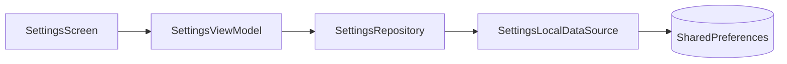

Điểm quan trọng là:

```text
UI không cần biết SharedPreferences tồn tại.
```

Sau này:

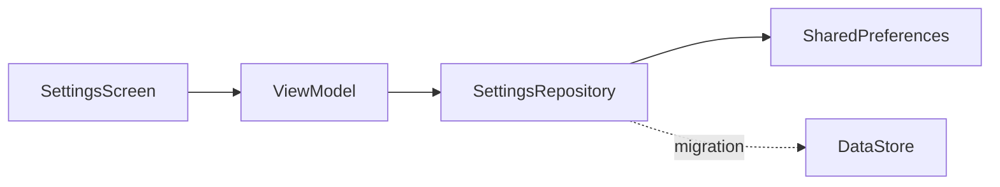

Android khuyến nghị Repository làm entry point của data layer để implementation của data source có thể thay đổi độc lập với UI/domain. ([Android Developers][4])

---

# 12. SharedPreferences và Lifecycle

SharedPreferences là **persistent state**, không phải UI state tạm thời.

Ví dụ:

```text
User bật Dark Mode
       ↓
SharedPreferences
       ↓
dark_mode = true
```

Sau đó:

```text
Rotate screen
      ↓
Activity recreated
      ↓
Preference vẫn còn
```

hoặc:

```text
App process chết
      ↓
User mở app lại
      ↓
Đọc dark_mode
      ↓
true
```

Vì vậy SharedPreferences khác với:

```kotlin
var darkMode = false
```

biến trên chỉ nằm trong memory.

Tuy nhiên SharedPreferences cũng có vấn đề lifecycle đáng chú ý: tài liệu Android hiện cảnh báo các API đồng bộ có thể gây blocking; các `apply()` đang chờ ghi có thể ảnh hưởng main thread trong một số lifecycle transition của Activity hoặc Service. Đây là một trong các lý do DataStore được khuyến nghị cho code mới. ([Android Developers][2])

---

# 13. State Flow của một Settings Screen

Một thiết kế tốt:

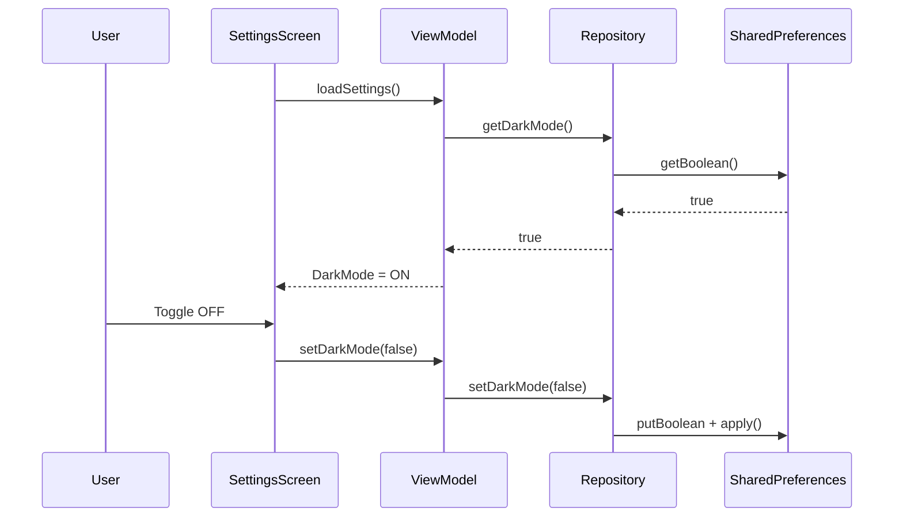

---

# 14. Local Data và Remote Data

Một câu hỏi quan trọng khi thiết kế app:

> Setting này thuộc **device**, **user account** hay **server**?

Ví dụ:

| Setting                     | Local |       Remote |
| --------------------------- | ----: | -----------: |
| Dark mode                   |     ✅ |       Có thể |
| Font size                   |     ✅ |       Có thể |
| Onboarding done             |     ✅ | Thường không |
| API feature flag            |     ❌ |            ✅ |
| Subscription status         |     ❌ |            ✅ |
| User permission trên server |     ❌ |            ✅ |
| Cached filter               |     ✅ |    Không cần |

Không nên coi local preferences là nguồn tin đáng tin cậy cho dữ liệu business quan trọng như:

```text
isPremium = true
```

nếu quyền Premium thực tế được server quản lý.

Một flow phổ biến:

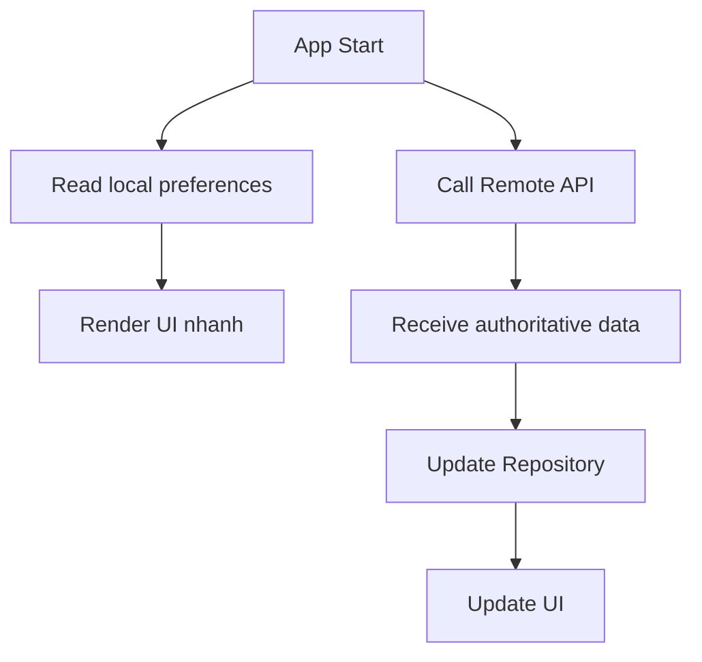

---

# 15. Default Value

Một lỗi phổ biến:

```kotlin
val notifications =
    preferences.getBoolean(
        "notifications",
        false
    )
```

Trong khi business requirement là:

```text
Notifications mặc định = ON
```

Khi đó phải là:

```kotlin
val notifications =
    preferences.getBoolean(
        "notifications",
        true
    )
```

Default value là một phần của **product behavior**, không đơn thuần là chi tiết kỹ thuật.

---

# 16. Xóa preference

Xóa một key:

```kotlin
preferences.edit()
    .remove("language")
    .apply()
```

Xóa toàn bộ:

```kotlin
preferences.edit()
    .clear()
    .apply()
```

Ví dụ khi logout:

```text
Logout
  ↓
Xóa session-specific local preferences
  ↓
Giữ lại device preferences nếu cần
```

Không phải lúc nào cũng nên:

```kotlin
clear()
```

vì có thể vô tình xóa:

```text
dark_mode
language
accessibility_settings
onboarding_state
```

---

# 17. Tại sao SharedPreferences không còn được ưu tiên?

Android hiện liệt kê nhiều hạn chế quan trọng của SharedPreferences:

```text
SharedPreferences
│
├── API đồng bộ
│   └── nguy cơ blocking / jank / ANR
│
├── apply()
│   └── khó nhận biết lỗi ghi
│
├── consistency hạn chế
│
├── transaction hạn chế
│
└── không hỗ trợ multi-process
```

Android đặc biệt cảnh báo về UI-thread blocking, error handling, durability/consistency và việc SharedPreferences không hỗ trợ sử dụng xuyên nhiều process. ([Android Developers][2])

Đây là lý do:

```text
SharedPreferences
       ↓
     Legacy
       ↓
Preferences DataStore
```

là hướng migration phổ biến.

---

# 18. SharedPreferences vs DataStore vs Room

| Tiêu chí           | SharedPreferences | DataStore | Room   |
| ------------------ | ----------------- | --------- | ------ |
| Key-value          | ✅                 | ✅         | Có thể |
| Structured objects | Hạn chế           | ✅         | ✅      |
| Flow               | ❌ Native          | ✅         | ✅      |
| Coroutine-first    | ❌                 | ✅         | ✅      |
| Transaction tốt    | Hạn chế           | ✅         | ✅      |
| Quan hệ dữ liệu    | ❌                 | ❌         | ✅      |
| Dataset lớn        | ❌                 | ❌         | ✅      |
| New app preference | ⚠️                | ✅         | ❌      |
| Legacy code        | ✅                 | —         | —      |

DataStore được thiết kế cho dataset nhỏ và không cung cấp referential integrity hoặc partial update theo kiểu database; với dữ liệu lớn/phức tạp, Android khuyến nghị Room. ([Android Developers][3])

---

# 19. Migration sang DataStore

Android cung cấp sẵn:

```kotlin
SharedPreferencesMigration
```

để migrate dữ liệu từ SharedPreferences sang DataStore. ([Android Developers][5])

Ý tưởng:

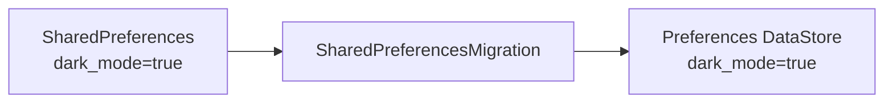

DataStore hiện được tạo ở cấp top-level/singleton cho một file; Preferences DataStore cung cấp `Flow` để đọc dữ liệu và API suspend/transactional để cập nhật. ([Android Developers][3])

Ví dụ kiến trúc sau migration:

```text
SettingsScreen
      ↓
SettingsViewModel
      ↓
SettingsRepository
      ↓
Preferences DataStore
```

thay vì:

```text
SettingsScreen
      ↓
SettingsViewModel
      ↓
SettingsRepository
      ↓
SharedPreferences
```

Đây chính là lợi ích của abstraction ở Data Layer.

---

# 20. Debug SharedPreferences

Trong quá trình development, có thể kiểm tra storage bằng Android Studio.

Một workflow debug:

```text
1. Mở app
2. Thay đổi setting
3. Kill app
4. Mở lại
5. Kiểm tra setting
6. Clear app data
7. Mở lại
8. Kiểm tra default value
```

Các case nên thử:

```text
Fresh install
     ↓
default

Change preference
     ↓
persist

Rotate
     ↓
không mất

Kill process
     ↓
không mất

Clear app data
     ↓
reset

Upgrade app
     ↓
migration đúng
```

---

# 21. Testing

## Test 1 — Default value

```kotlin
@Test
fun darkMode_defaultValue_isFalse() {
    val result = localDataSource.isDarkModeEnabled()

    assertFalse(result)
}
```

---

## Test 2 — Write rồi Read

```kotlin
@Test
fun darkMode_canBeSaved() {
    localDataSource.setDarkMode(true)

    val result =
        localDataSource.isDarkModeEnabled()

    assertTrue(result)
}
```

---

## Test 3 — Update

```text
false
 ↓
true
 ↓
false
```

Kỳ vọng:

```text
final value = false
```

---

## Test 4 — Missing key

```text
key không tồn tại
       ↓
default value
```

---

## Test 5 — Migration

```text
App version 1

dark_mode = true
       ↓
upgrade
       ↓
App version 2
       ↓
migration
       ↓
dark_mode vẫn = true
```

---

# 22. Production Risk

Một preference tưởng nhỏ nhưng có thể ảnh hưởng trực tiếp UX.

Ví dụ:

```text
notifications_enabled = false
```

Nếu migration lỗi:

```text
false
 ↓
default true
```

người dùng có thể đột nhiên nhận notification trở lại.

Hoặc:

```text
dark_mode = true

migration fail

dark_mode = false
```

→ UI thay đổi ngoài ý muốn.

Vì vậy storage preference cần được coi như một phần của:

```text
Data Contract
+
UX Contract
```

---

# 23. Thực hành — Mini Project

## Yêu cầu

Tạo:

```text
Settings Screen
```

với:

```text
Dark Mode          [Switch]
Notifications      [Switch]
Language           [VI / EN]
```

Model logic:

```text
dark_mode
notifications
language
```

---

## Bước 1 — Local Data Source

```text
SettingsLocalDataSource
```

---

## Bước 2 — Repository

```text
SettingsRepository
```

---

## Bước 3 — ViewModel

```text
SettingsViewModel
```

---

## Bước 4 — UI

```text
SettingsScreen
```

Kiến trúc hoàn chỉnh:

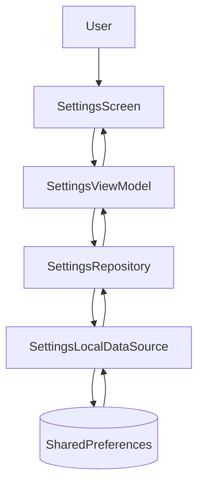

---

# 24. Bài tập

## Bài 1 — Persist Setting

Tạo setting:

```text
Use Dynamic Color
```

Key:

```text
dynamic_color_enabled
```

Default:

```text
true
```

Yêu cầu:

```text
User Toggle
   ↓
Save
   ↓
Kill App
   ↓
Open App
   ↓
Setting vẫn giữ nguyên
```

---

## Bài 2 — Migration

Version 1:

```text
theme_dark = true
```

Version 2 muốn đổi thành:

```text
dark_mode_enabled = true
```

Hãy thiết kế migration để người dùng không mất preference.

---

## Bài 3 — Offline Behavior

Viết README giải thích:

```text
Local-only settings
Remote settings
Source of truth
Default values
Offline behavior
Migration strategy
```

---

# 25. Artifact cho Portfolio

Có thể tạo project:

```text
android-settings-storage-demo/
│
├── data/
│   ├── SettingsRepository.kt
│   └── SettingsLocalDataSource.kt
│
├── ui/
│   ├── SettingsScreen.kt
│   └── SettingsViewModel.kt
│
├── test/
│   └── SettingsRepositoryTest.kt
│
└── README.md
```

README nên có:

```markdown
# Android Settings Storage Demo

## Features

- Dark Mode preference
- Notification preference
- Language preference
- Persistent local storage
- Default-value handling
- Migration strategy

## Architecture

UI
↓
ViewModel
↓
Repository
↓
Local Data Source
↓
SharedPreferences

## Production Recommendation

SharedPreferences is demonstrated for learning and
legacy-code understanding.

For new Android applications, migrate the implementation
to Jetpack DataStore.
```

---

# 26. Câu hỏi phỏng vấn thường gặp

### SharedPreferences dùng để làm gì?

Lưu một lượng nhỏ dữ liệu đơn giản dạng key-value và giữ chúng qua các lần chạy ứng dụng. ([Android Developers][1])

### `apply()` khác `commit()` thế nào?

`apply()` cập nhật memory ngay và ghi disk bất đồng bộ; `commit()` ghi đồng bộ và có thể block thread. ([Android Developers][1])

### SharedPreferences có phải database không?

Không nên coi nó là database. Nó là một API đơn giản để quản lý preferences/key-value nhỏ; dữ liệu relational hoặc lớn nên dùng Room. ([Android Developers][2])

### Năm 2026 có nên dùng SharedPreferences trong project mới?

Thông thường **không**. Android hiện khuyến nghị DataStore cho nhu cầu lưu dữ liệu nhỏ mới. SharedPreferences vẫn rất đáng học để hiểu và maintain code Android hiện có. ([Android Developers][2])

### SharedPreferences có hỗ trợ nhiều process không?

Không. API reference hiện ghi rõ SharedPreferences không hỗ trợ sử dụng xuyên nhiều process. ([Android Developers][2])

---

# 27. Mental Model cần nhớ

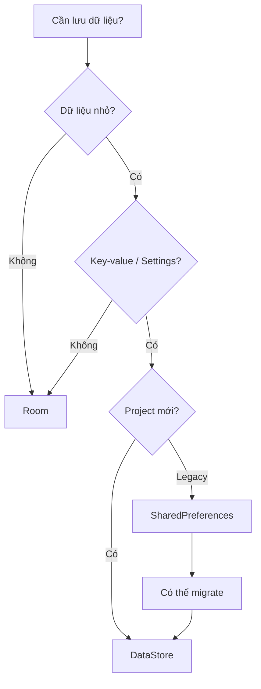

Có thể ghi nhớ bằng công thức:

```text
SharedPreferences
=
Small
+
Key-Value
+
Persistent
+
Legacy-friendly
```

Còn với Android hiện đại:

```text
New Preferences
        ↓
     DataStore
```

---

# 28. Checklist hoàn thành

* [ ] Giải thích được SharedPreferences là gì.
* [ ] Hiểu mô hình `key → value`.
* [ ] Biết `getSharedPreferences()`.
* [ ] Biết `getBoolean()`, `getString()`, `getInt()`.
* [ ] Biết `edit()`.
* [ ] Hiểu `apply()` và `commit()`.
* [ ] Biết sử dụng default value.
* [ ] Biết `remove()` và `clear()`.
* [ ] Hiểu SharedPreferences thuộc Data Layer.
* [ ] Không gọi storage trực tiếp khắp UI.
* [ ] Biết sử dụng Repository/Local Data Source.
* [ ] Hiểu local state và remote state.
* [ ] Hiểu persistence qua lifecycle/process restart.
* [ ] Có test cho default/write/read.
* [ ] Biết migration có thể ảnh hưởng UX.
* [ ] Biết `SharedPreferencesMigration`.
* [ ] Biết tại sao Android hiện khuyến nghị DataStore.
* [ ] Có mini project hoặc artifact đưa vào portfolio.

---

# 29. Tóm tắt bài học

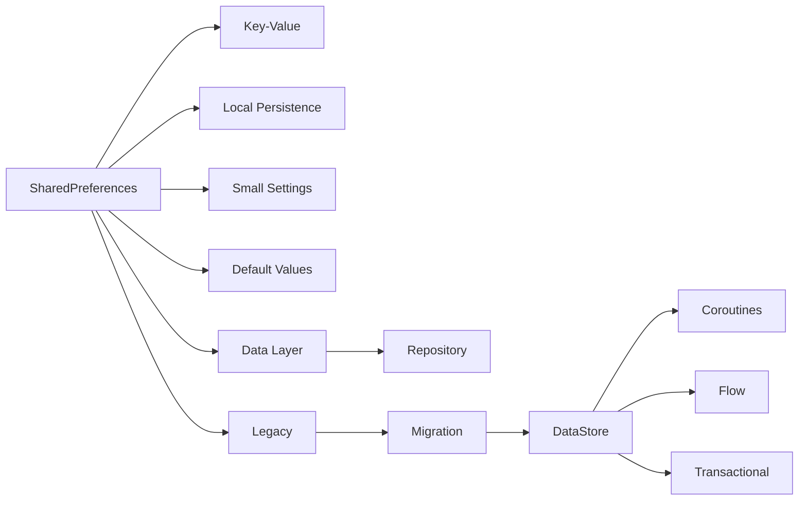

Điểm quan trọng nhất của **001 — Shared Preferences** không phải chỉ là nhớ:

```kotlin
preferences.edit()
    .putBoolean("dark_mode", true)
    .apply()
```

mà phải hiểu toàn bộ luồng:

```text
User action
    ↓
UI
    ↓
ViewModel
    ↓
Repository
    ↓
Local Data Source
    ↓
Persistent Storage
    ↓
Restore state
```

và trong Android hiện đại:

```text
SharedPreferences
    ↓
Hiểu + maintain legacy code
    ↓
Thiết kế abstraction tốt
    ↓
Migration
    ↓
DataStore
```

Đó mới là cách đặt **Shared Preferences** đúng vị trí trong **Architecture, State and Data** của Android Developer Roadmap 2026. ([Android Developers][2])

[1]: https://developer.android.com/training/data-storage/shared-preferences "Save simple data with SharedPreferences  |  App data and files  |  Android Developers"
[2]: https://developer.android.com/reference/android/content/SharedPreferences "SharedPreferences  |  API reference  |  Android Developers"
[3]: https://developer.android.com/topic/libraries/architecture/datastore "App Architecture: Data Layer - DataStore - Android Developers  |  App architecture"
[4]: https://developer.android.com/topic/architecture/data-layer "Data layer  |  App architecture  |  Android Developers"
[5]: https://developer.android.com/reference/kotlin/androidx/datastore/migrations/SharedPreferencesMigration "SharedPreferencesMigration  |  API reference  |  Android Developers"
