[](https://developer.android.com/codelabs/android-preferences-datastore?utm_source=chatgpt.com)

# 002 — DataStore

**Học phần:** 03 — Architecture, State and Data
**Module:** Module 06 — Storage
**Nhóm nội dung:** Preferences and Files
**Nguồn roadmap:** Storage / Preferences and Files
**Loại bài:** Release / Storage
**Thứ tự trong module:** 002
**Thời lượng gợi ý:** 32 phút
**Nền tảng:** Android / Kotlin / Jetpack Compose

---

## 1. Tóm tắt

**Jetpack DataStore** là giải pháp lưu trữ dữ liệu nhỏ của Android Jetpack, thường dùng để lưu:

* theme sáng/tối;
* ngôn ngữ;
* trạng thái onboarding;
* tùy chọn thông báo;
* bộ lọc;
* đơn vị đo;
* cấu hình người dùng;
* feature flag cục bộ;
* các thiết lập nhỏ cần tồn tại sau khi đóng ứng dụng.

DataStore sử dụng **Kotlin Coroutines** và **Flow**, cung cấp cơ chế đọc/ghi dữ liệu bất đồng bộ, nhất quán và theo transaction. Android hiện khuyến nghị cân nhắc chuyển từ `SharedPreferences` sang DataStore. ([Android Developers][1])

DataStore phù hợp với **dataset nhỏ**. Nếu ứng dụng cần dữ liệu lớn, truy vấn phức tạp, cập nhật từng phần hoặc quan hệ giữa nhiều entity, Android khuyến nghị sử dụng **Room** thay vì DataStore. ([Android Developers][1])

---

## 2. Mục tiêu học tập

Sau bài này, anh nên có thể:

* [ ] Giải thích DataStore là gì.
* [ ] Phân biệt `Preferences DataStore` và typed DataStore như `Proto DataStore`.
* [ ] Biết khi nào dùng DataStore và khi nào nên dùng Room.
* [ ] Đọc dữ liệu bằng `Flow`.
* [ ] Ghi dữ liệu bằng `edit()` hoặc `updateData()`.
* [ ] Kết nối DataStore với Repository, ViewModel và Compose.
* [ ] Giải thích vì sao DataStore phù hợp với kiến trúc Single Source of Truth.
* [ ] Migrate dữ liệu từ `SharedPreferences`.
* [ ] Xử lý lỗi đọc/ghi.
* [ ] Viết test cho Repository dùng DataStore.
* [ ] Nhận diện các rủi ro production và release khi thay đổi cấu trúc preference.

---

# 3. DataStore nằm ở đâu trong Android Architecture?

DataStore thuộc **Data Layer**.

Một kiến trúc phổ biến:

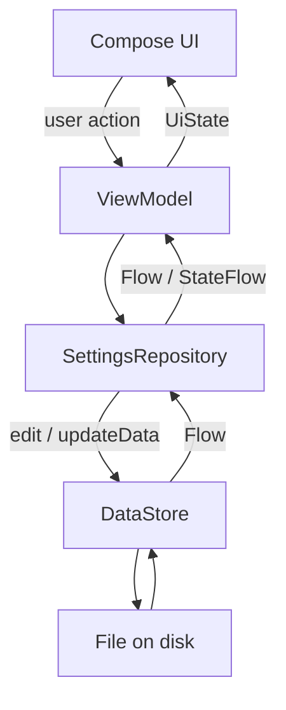

Google khuyến nghị giữ thao tác với DataStore trong **data layer**, chẳng hạn Repository, sau đó expose dữ liệu qua ViewModel. Composable không nên trực tiếp đọc hoặc ghi DataStore. ([Android Developers][1])

Một cấu trúc package có thể là:

```text
com.example.app
│
├── data
│   ├── datastore
│   │   └── AppDataStore.kt
│   │
│   └── repository
│       └── SettingsRepository.kt
│
├── ui
│   └── settings
│       ├── SettingsViewModel.kt
│       └── SettingsScreen.kt
│
└── MainActivity.kt
```

---

# 4. DataStore hoạt động như thế nào?

DataStore có hai API cốt lõi:

```kotlin
val data: Flow<T>
```

để đọc dữ liệu và:

```kotlin
suspend fun updateData(
    transform: suspend (T) -> T
)
```

để cập nhật dữ liệu. ([Android Developers][1])

Có thể hình dung:

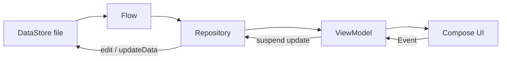

Điểm quan trọng là dữ liệu không chỉ được:

```text
load một lần
```

mà được expose thành:

```text
Flow
```

Khi preference thay đổi:

```text
DataStore
   ↓
Flow phát giá trị mới
   ↓
Repository
   ↓
ViewModel
   ↓
StateFlow
   ↓
Compose recomposition
```

---

# 5. Hai cách sử dụng DataStore

DataStore có thể được dùng theo hai nhóm chính:

```text
DataStore
│
├── Preferences DataStore
│      └── key-value
│
└── Typed DataStore
       ├── Proto
       ├── JSON
       └── custom Serializer
```

Android hiện hỗ trợ lưu custom class thông qua `Serializer`, không còn giới hạn DataStore typed chỉ ở Protocol Buffers. ([Android Developers][1])

---

## 5.1 Preferences DataStore

Có cách sử dụng khá giống `SharedPreferences`.

Ví dụ:

```text
dark_mode       → true
language        → "vi"
font_size       → 18
notifications   → false
```

Không cần định nghĩa schema trước.

Ví dụ key:

```kotlin
val DARK_MODE = booleanPreferencesKey("dark_mode")
val LANGUAGE = stringPreferencesKey("language")
```

### Ưu điểm

* đơn giản;
* dễ migrate từ SharedPreferences;
* phù hợp settings nhỏ;
* hỗ trợ Flow;
* update transactionally.

### Hạn chế

Preferences DataStore không có schema hoàn chỉnh và không cung cấp type-safety ở cấp model như Proto DataStore. ([Android Developers][1])

---

# 6. Proto DataStore

Proto DataStore dùng Protocol Buffers để lưu **typed object**.

Ví dụ:

```proto
syntax = "proto3";

message UserSettings {
    bool dark_mode = 1;
    string language = 2;
    int32 font_size = 3;
}
```

Sau compile, Android sinh ra object tương ứng.

Ví dụ về mặt ý tưởng:

```kotlin
UserSettings(
    darkMode = true,
    language = "vi",
    fontSize = 18
)
```

Proto DataStore yêu cầu schema `.proto` và một `Serializer`. ([Android Developers][1])

---

# 7. Preferences DataStore hay Proto DataStore?

| Tiêu chí              | Preferences DataStore | Proto DataStore        |
| --------------------- | --------------------- | ---------------------- |
| Kiểu dữ liệu          | Key-value             | Typed object           |
| Schema                | Không                 | Có                     |
| Setup                 | Đơn giản              | Phức tạp hơn           |
| Type safety           | Hạn chế               | Tốt                    |
| Migration             | Có                    | Có                     |
| Flow                  | Có                    | Có                     |
| Transaction           | Có                    | Có                     |
| Dùng cho settings nhỏ | Rất phù hợp           | Phù hợp                |
| Settings phức tạp     | Khó quản lý hơn       | Tốt                    |
| Team/project lớn      | Có thể                | Thường dễ maintain hơn |

Quy tắc đơn giản:

```text
3–10 preference nhỏ
        ↓
Preferences DataStore

Settings trở thành một model phức tạp
        ↓
Proto / Typed DataStore
```

---

# 8. DataStore so với SharedPreferences

DataStore được tạo ra để giải quyết nhiều điểm yếu của `SharedPreferences`. Android mô tả DataStore là API bất đồng bộ, transaction-safe và có Flow, đồng thời codelab chính thức hướng dẫn migrate từ SharedPreferences sang DataStore. ([Android Developers][2])

| Tính năng             | SharedPreferences |             DataStore |
| --------------------- | ----------------: | --------------------: |
| API bất đồng bộ chuẩn |                 ❌ |                     ✅ |
| Kotlin Flow           |                 ❌ |                     ✅ |
| Transaction           |           Hạn chế |                     ✅ |
| Error handling        |           Hạn chế |                     ✅ |
| Migration API         |                 ❌ |                     ✅ |
| Coroutine friendly    |                 ❌ |                     ✅ |
| UI reactive           |           Khó hơn |                     ✅ |
| Typed objects         |                 ❌ | ✅ với typed DataStore |

### Tư duy migration

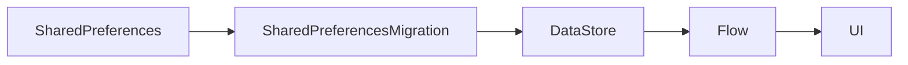

---

# 9. DataStore không phải database

Đây là điểm rất quan trọng.

Không nên biến DataStore thành:

```text
User database
Product database
Message database
Order database
Offline cache lớn
```

Android lưu ý DataStore phù hợp dataset nhỏ và không hỗ trợ tốt:

* partial update phức tạp;
* referential integrity;
* dataset lớn;
* database relation. ([Android Developers][1])

Ví dụ:

```text
Lưu theme
→ DataStore ✅

Lưu ngôn ngữ
→ DataStore ✅

Lưu 50.000 sản phẩm
→ DataStore ❌

Lưu User + Order + Product
→ Room ✅
```

---

# 10. Cài đặt DataStore

Tính đến **12/08/2026**, stable release của AndroidX DataStore là **1.2.1**; nhánh `1.3.0-alpha10` cũng đã được phát hành nhưng vẫn là alpha. ([Android Developers][3])

Trong:

```text
app/build.gradle.kts
```

thêm:

```kotlin
dependencies {
    implementation("androidx.datastore:datastore-preferences:1.2.1")
}
```

Google cũng công bố artifact:

```kotlin
implementation("androidx.datastore:datastore:1.2.1")
```

cho typed DataStore/custom data object. ([Android Developers][3])

> Với production thông thường, ưu tiên stable release thay vì chuyển sang alpha chỉ để lấy API mới.

---

# 11. Tạo Preferences DataStore

Ví dụ:

```kotlin
import android.content.Context
import androidx.datastore.core.DataStore
import androidx.datastore.preferences.core.Preferences
import androidx.datastore.preferences.preferencesDataStore

val Context.dataStore: DataStore<Preferences> by preferencesDataStore(
    name = "settings"
)
```

Property delegate nên được khai báo **một lần ở top-level**, giúp duy trì một DataStore instance cho cùng một file. ([Android Developers][1])

Ví dụ:

```text
AppDataStore.kt
```

```kotlin
package com.example.app.data.datastore

import android.content.Context
import androidx.datastore.preferences.preferencesDataStore

val Context.settingsDataStore by preferencesDataStore(
    name = "user_settings"
)
```

---

# 12. Định nghĩa các key

Giả sử app có màn hình Settings:

```text
Dark Mode
Notifications
Language
```

Ta định nghĩa:

```kotlin
object PreferencesKeys {

    val DARK_MODE =
        booleanPreferencesKey("dark_mode")

    val NOTIFICATIONS_ENABLED =
        booleanPreferencesKey("notifications_enabled")

    val LANGUAGE =
        stringPreferencesKey("language")
}
```

Một key trong DataStore về mặt ý tưởng là:

```text
key
 ↓
type
 ↓
value
```

Ví dụ:

```text
booleanPreferencesKey("dark_mode")
                    ↓
                   true
```

---

# 13. Tạo model cho Repository

Không nên đưa trực tiếp:

```text
Preferences
```

lên UI.

Ta tạo domain/data model rõ ràng hơn:

```kotlin
data class UserSettings(
    val darkMode: Boolean = false,
    val notificationsEnabled: Boolean = true,
    val language: String = "vi"
)
```

Luồng dữ liệu:

```text
DataStore<Preferences>
        ↓
      map()
        ↓
UserSettings
        ↓
Repository
        ↓
ViewModel
```

---

# 14. Đọc dữ liệu từ DataStore

DataStore cung cấp:

```kotlin
dataStore.data
```

dưới dạng `Flow<Preferences>`. ([Android Developers][1])

Ví dụ:

```kotlin
class SettingsRepository(
    private val context: Context
) {

    val settings: Flow<UserSettings> =
        context.settingsDataStore.data
            .map { preferences ->

                UserSettings(
                    darkMode =
                        preferences[PreferencesKeys.DARK_MODE]
                            ?: false,

                    notificationsEnabled =
                        preferences[
                            PreferencesKeys.NOTIFICATIONS_ENABLED
                        ] ?: true,

                    language =
                        preferences[PreferencesKeys.LANGUAGE]
                            ?: "vi"
                )
            }
}
```

---

# 15. Xử lý lỗi khi đọc

Vì DataStore đọc dữ liệu từ disk nên thao tác I/O có thể thất bại.

Codelab chính thức hướng dẫn xử lý `IOException` bằng `catch()` trước `map()`, có thể emit `emptyPreferences()`, còn exception khác nên được throw tiếp thay vì âm thầm nuốt lỗi. ([Android Developers][2])

Ví dụ:

```kotlin
val settings: Flow<UserSettings> =
    context.settingsDataStore.data
        .catch { exception ->

            if (exception is IOException) {
                emit(emptyPreferences())
            } else {
                throw exception
            }
        }
        .map { preferences ->

            UserSettings(
                darkMode =
                    preferences[PreferencesKeys.DARK_MODE]
                        ?: false,

                notificationsEnabled =
                    preferences[
                        PreferencesKeys.NOTIFICATIONS_ENABLED
                    ] ?: true,

                language =
                    preferences[PreferencesKeys.LANGUAGE]
                        ?: "vi"
            )
        }
```

---

# 16. Ghi dữ liệu với `edit()`

Preferences DataStore có:

```kotlin
dataStore.edit { preferences ->
    ...
}
```

để update dữ liệu transactionally. ([Android Developers][2])

Ví dụ:

```kotlin
suspend fun setDarkMode(enabled: Boolean) {

    context.settingsDataStore.edit { preferences ->

        preferences[PreferencesKeys.DARK_MODE] =
            enabled
    }
}
```

Tương tự:

```kotlin
suspend fun setLanguage(language: String) {

    context.settingsDataStore.edit { preferences ->

        preferences[PreferencesKeys.LANGUAGE] =
            language
    }
}
```

---

# 17. Transaction trong DataStore

Giả sử có hai thao tác cùng cập nhật:

```text
Coroutine A
        ↓
darkMode = true

Coroutine B
        ↓
language = "en"
```

Nếu tự xử lý file thủ công, dễ xảy ra race condition.

DataStore cung cấp update transactionally; `edit()` nhận trạng thái Preferences mới nhất và commit thay đổi sau khi transform hoàn tất. ([Android Developers][2])

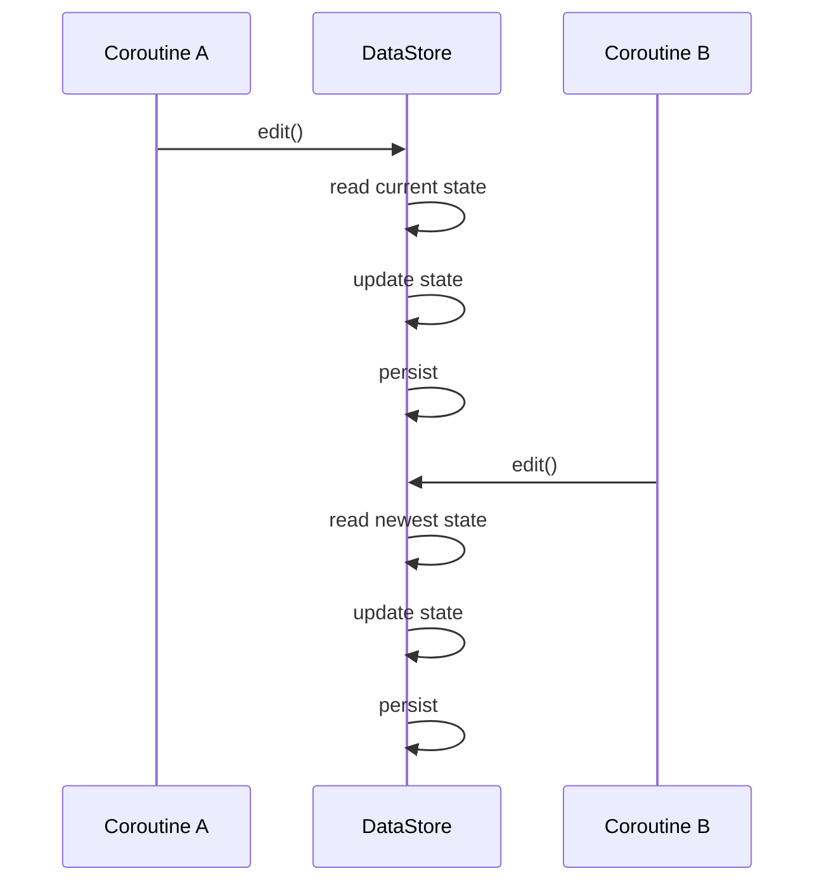

Đây là một lý do DataStore phù hợp hơn việc tự duy trì:

```kotlin
MutableStateFlow
+
SharedPreferences
```

song song.

---

# 18. Repository hoàn chỉnh

```kotlin
class SettingsRepository(
    private val context: Context
) {

    val settings: Flow<UserSettings> =
        context.settingsDataStore.data

            .catch { exception ->

                if (exception is IOException) {
                    emit(emptyPreferences())
                } else {
                    throw exception
                }
            }

            .map { preferences ->

                UserSettings(
                    darkMode =
                        preferences[
                            PreferencesKeys.DARK_MODE
                        ] ?: false,

                    notificationsEnabled =
                        preferences[
                            PreferencesKeys.NOTIFICATIONS_ENABLED
                        ] ?: true,

                    language =
                        preferences[
                            PreferencesKeys.LANGUAGE
                        ] ?: "vi"
                )
            }

    suspend fun setDarkMode(enabled: Boolean) {

        context.settingsDataStore.edit { preferences ->

            preferences[PreferencesKeys.DARK_MODE] =
                enabled
        }
    }

    suspend fun setNotificationsEnabled(enabled: Boolean) {

        context.settingsDataStore.edit { preferences ->

            preferences[
                PreferencesKeys.NOTIFICATIONS_ENABLED
            ] = enabled
        }
    }

    suspend fun setLanguage(language: String) {

        context.settingsDataStore.edit { preferences ->

            preferences[PreferencesKeys.LANGUAGE] =
                language
        }
    }
}
```

---

# 19. Kết nối DataStore với ViewModel

ViewModel không cần biết:

```text
file nằm đâu
key tên gì
DataStore implement thế nào
```

ViewModel chỉ làm việc với Repository:

```kotlin
class SettingsViewModel(
    private val repository: SettingsRepository
) : ViewModel() {

    val settings: StateFlow<UserSettings> =
        repository.settings
            .stateIn(
                scope = viewModelScope,
                started = SharingStarted.WhileSubscribed(5_000),
                initialValue = UserSettings()
            )

    fun setDarkMode(enabled: Boolean) {

        viewModelScope.launch {
            repository.setDarkMode(enabled)
        }
    }

    fun setNotificationsEnabled(enabled: Boolean) {

        viewModelScope.launch {
            repository.setNotificationsEnabled(enabled)
        }
    }
}
```

Android documentation cũng minh họa pattern Repository → ViewModel → `StateFlow` cho Compose. ([Android Developers][1])

---

# 20. Compose đọc DataStore như thế nào?

Không nên:

```text
Composable
    ↓
DataStore
```

Nên:

```text
Composable
    ↓
ViewModel
    ↓
Repository
    ↓
DataStore
```

Trong Compose:

```kotlin
@Composable
fun SettingsScreen(
    viewModel: SettingsViewModel
) {

    val settings by viewModel.settings
        .collectAsStateWithLifecycle()

    Column {

        Switch(
            checked = settings.darkMode,
            onCheckedChange = viewModel::setDarkMode
        )

        Switch(
            checked = settings.notificationsEnabled,
            onCheckedChange =
                viewModel::setNotificationsEnabled
        )
    }
}
```

Android khuyến nghị sử dụng `collectAsStateWithLifecycle()` để consume Flow/StateFlow trong Compose một cách lifecycle-aware. ([Android Developers][1])

---

# 21. Lifecycle và DataStore

DataStore **không phụ thuộc vào Activity lifecycle** giống state chỉ nằm trong RAM.

Ví dụ:

```text
Activity
  ↓
rotate
  ↓
Activity destroyed
  ↓
Activity recreated
```

DataStore vẫn còn dữ liệu.

Tương tự:

```text
App process chết
        ↓
user mở app lại
        ↓
DataStore đọc file
        ↓
settings được phục hồi
```

Vì vậy DataStore giải quyết loại state:

```text
Persistent State
```

khác với:

```text
Composable state
ViewModel state
SavedStateHandle
```

---

# 22. Phân biệt các loại state

| State                        | Công cụ phù hợp    |
| ---------------------------- | ------------------ |
| UI state tạm thời            | `remember`         |
| State qua recomposition      | `rememberSaveable` |
| Screen/business state        | `ViewModel`        |
| State cần process recreation | `SavedStateHandle` |
| Preference lâu dài           | DataStore          |
| Structured local data        | Room               |
| Remote source                | API/server         |

Ví dụ theme:

```text
User chọn Dark Mode
        ↓
ViewModel
        ↓
DataStore
        ↓
ghi disk
        ↓
app đóng
        ↓
app mở lại
        ↓
DataStore Flow
        ↓
darkMode = true
```

---

# 23. Single Source of Truth

Một lỗi architecture phổ biến:

```text
SharedPreferences
+
MutableStateFlow
+
ViewModel variable
```

tạo ba nguồn state.

Ví dụ:

```text
SharedPreferences = true
MutableStateFlow   = false
ViewModel          = true
```

Lúc đó:

> State nào mới là đúng?

Với DataStore:

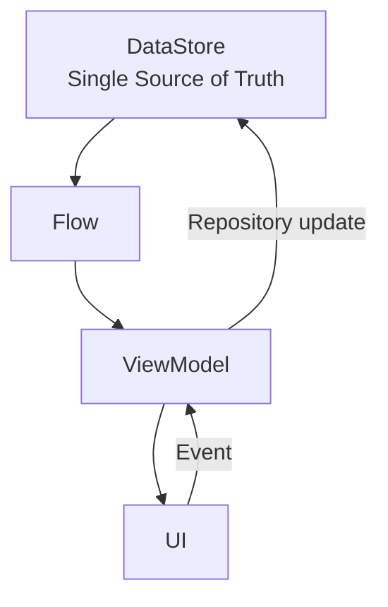

DataStore trở thành nguồn persistent state duy nhất.

---

# 24. Migration từ SharedPreferences

Một app đã production thường không thể đơn giản đổi:

```text
SharedPreferences
→
DataStore
```

và bỏ dữ liệu cũ.

Ví dụ user đã chọn:

```text
dark_mode = true
language = vi
notifications = false
```

Nếu release mới không migrate:

```text
Update app
    ↓
preferences mất
    ↓
UX regression
```

---

# 25. `SharedPreferencesMigration`

Preferences DataStore hỗ trợ migration:

```kotlin
private val Context.dataStore by preferencesDataStore(
    name = "user_preferences",

    produceMigrations = { context ->

        listOf(
            SharedPreferencesMigration(
                context,
                "user_preferences"
            )
        )
    }
)
```

Migration chạy **trước khi DataStore bắt đầu cho phép truy cập dữ liệu**, và các key chỉ nên được migrate một lần; sau migration không nên tiếp tục duy trì code ghi vào SharedPreferences cũ. ([Android Developers][2])

Luồng:

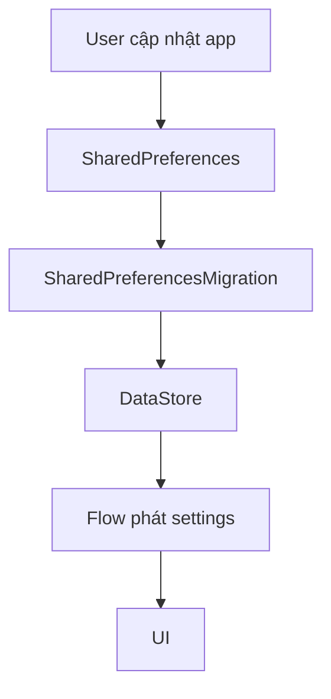

---

# 26. Migration là vấn đề release

Đây là lý do bài DataStore có thể được xếp vào loại:

> **release**

Giả sử version:

```text
1.4.0
```

dùng SharedPreferences.

Version:

```text
1.5.0
```

đổi sang DataStore.

Nếu chỉ test:

```text
fresh install 1.5.0
```

thì migration bug có thể không xuất hiện.

Phải test:

```text
Install 1.4.0
        ↓
set preferences
        ↓
update lên 1.5.0
        ↓
verify DataStore
```

---

# 27. Release matrix nên kiểm thử

| Scenario              | Kiểm tra                    |
| --------------------- | --------------------------- |
| Fresh install         | Default settings            |
| Upgrade từ version cũ | Migration                   |
| User có đủ preference | Giá trị giữ nguyên          |
| User thiếu một số key | Default fallback            |
| App killed            | Dữ liệu còn                 |
| Rotate                | UI đúng                     |
| Background/foreground | State đúng                  |
| Disk error            | Không crash không kiểm soát |
| Concurrent update     | Không mất state             |
| Corrupted data        | Có chiến lược recovery      |

---

# 28. Quy tắc quan trọng: chỉ một DataStore cho mỗi file

Android cảnh báo không được tạo nhiều DataStore instance cho cùng một file trong cùng process. Nếu có nhiều instance hoạt động trên cùng file, DataStore có thể throw `IllegalStateException`. ([Android Developers][1])

Sai:

```kotlin
class RepositoryA(context: Context) {

    val store =
        PreferenceDataStoreFactory.create { ... }
}
```

và:

```kotlin
class RepositoryB(context: Context) {

    val store =
        PreferenceDataStoreFactory.create { ... }
}
```

nếu cả hai cùng thao tác cùng file.

Tốt hơn:

```text
Application
     ↓
DataStore singleton
     ↓
Repository
     ↓
ViewModel
```

Hoặc top-level delegate:

```kotlin
val Context.dataStore by preferencesDataStore(
    name = "settings"
)
```

---

# 29. Immutability

Với:

```text
DataStore<T>
```

`T` nên immutable.

Android ghi rõ kiểu generic lưu trong DataStore phải immutable vì mutation trực tiếp có thể phá vỡ consistency guarantee. ([Android Developers][1])

Tốt:

```kotlin
data class Settings(
    val darkMode: Boolean,
    val language: String
)
```

Update:

```kotlin
settings.copy(
    darkMode = true
)
```

Không nên thiết kế object chứa mutable collection mà code bên ngoài có thể sửa ngầm.

---

# 30. Multi-process

Một số app có:

```text
Process A
Activity
```

và:

```text
Process B
Service
```

Nếu cả hai process truy cập cùng DataStore file, cần sử dụng configuration phù hợp cho multi-process.

Android cũng cảnh báo không trộn:

```text
SingleProcessDataStore
```

với:

```text
MultiProcessDataStore
```

trên cùng file. ([Android Developers][1])

Với app Android thông thường chỉ có một process, anh thường không cần quan tâm đến trường hợp này.

---

# 31. Error handling

Có ba nhóm lỗi đáng quan tâm:

```text
DataStore errors
│
├── Read errors
├── Write errors
└── Corruption
```

### Read

```kotlin
.catch { exception ->

    if (exception is IOException) {
        emit(emptyPreferences())
    } else {
        throw exception
    }
}
```

### Write

`edit()` cũng có thể throw `IOException` khi có lỗi đọc/ghi disk. ([Android Developers][2])

Ví dụ:

```kotlin
viewModelScope.launch {

    try {

        repository.setDarkMode(true)

    } catch (e: IOException) {

        _uiState.update {
            it.copy(
                error = "Không thể lưu cài đặt"
            )
        }
    }
}
```

---

# 32. UX khi write thất bại

Không nên có flow:

```text
User bật setting
     ↓
UI bật
     ↓
DataStore write fail
     ↓
UI vẫn hiển thị đã bật
```

Có thể thiết kế:

```text
User action
    ↓
ViewModel update
    ↓
Repository
    ↓
DataStore success?
   /          \
 yes           no
 ↓             ↓
State mới     Error
 ↓             ↓
UI            Snackbar
```

Ví dụ:

```text
Không thể lưu cài đặt. Vui lòng thử lại.
```

---

# 33. DataStore và performance

DataStore dùng Coroutine/Flow và được thiết kế cho asynchronous persistence thay vì synchronous disk access kiểu cũ. ([Android Developers][1])

Nhưng điều đó không có nghĩa:

```text
DataStore = database tốc độ cao
```

Không nên:

```kotlin
repeat(100_000) {
    dataStore.edit { ... }
}
```

DataStore dành cho:

```text
small persistent state
```

không phải high-frequency event logging.

---

# 34. Ví dụ thực tế — Settings App

Màn hình:

```text
┌──────────────────────────────┐
│ Settings                     │
│                              │
│ Dark mode             [ ON ] │
│                              │
│ Notifications         [ ON ] │
│                              │
│ Language              VI  >  │
│                              │
└──────────────────────────────┘
```

DataStore:

```text
dark_mode = true
notifications_enabled = true
language = "vi"
```

---

# 35. Luồng hoàn chỉnh

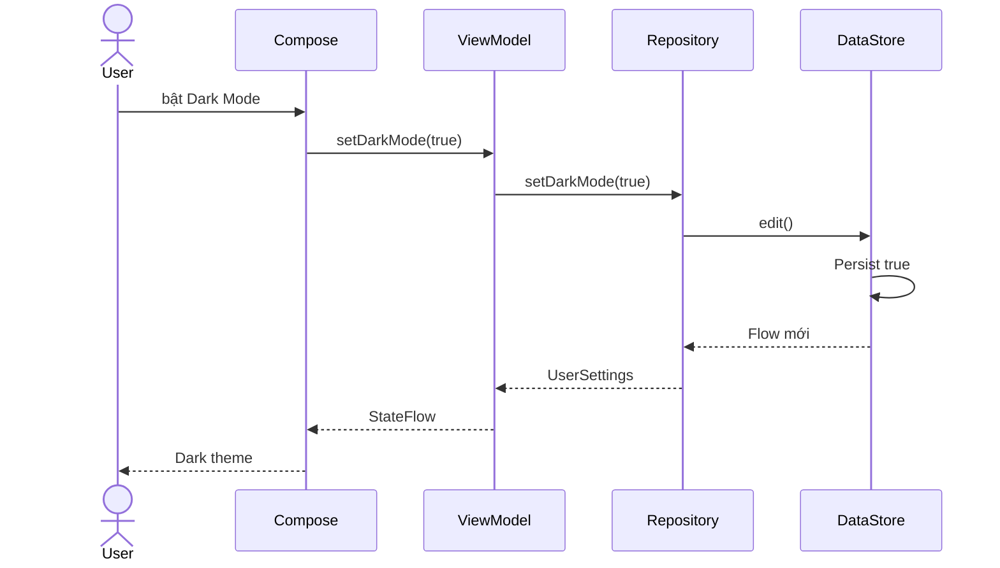

---

# 36. Không đọc DataStore trực tiếp trong Composable

Không nên:

```kotlin
@Composable
fun SettingsScreen(context: Context) {

    val data =
        context.dataStore.data
}
```

Lý do chính không phải DataStore không hoạt động, mà vì architecture trở nên:

```text
UI
↓
Storage
```

thay vì:

```text
UI
↓
ViewModel
↓
Repository
↓
Storage
```

Android guidance cũng yêu cầu giữ DataStore operation trong data layer và không đọc/ghi trực tiếp từ Composable. ([Android Developers][1])

---

# 37. Testing

Repository là vị trí tốt nhất để test behavior của DataStore.

Ví dụ yêu cầu:

```text
Given
darkMode = false

When
setDarkMode(true)

Then
settings.first().darkMode == true
```

Pseudo-test:

```kotlin
@Test
fun setDarkMode_updatesPreference() = runTest {

    repository.setDarkMode(true)

    val settings =
        repository.settings.first()

    assertTrue(settings.darkMode)
}
```

---

# 38. Các test case nên có

```text
SettingsRepositoryTest
│
├── defaultSettings_areCorrect
├── setDarkMode_updatesValue
├── setLanguage_updatesValue
├── setNotification_updatesValue
├── multipleUpdates_keepOtherValues
├── migration_preservesOldValues
└── ioFailure_hasFallback
```

Một test quan trọng:

```text
darkMode = true
language = vi

↓ setLanguage("en")

darkMode vẫn phải = true
```

---

# 39. Debugging

Khi DataStore không hoạt động như mong đợi, kiểm tra theo thứ tự:

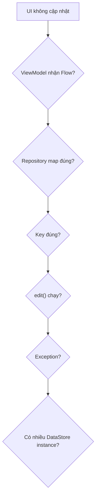

Các lỗi phổ biến:

```text
Sai key
Sai default value
Không collect Flow
Coroutine chưa launch
Repository không được dùng
Tạo nhiều DataStore instance
Migration sai SharedPreferences name
Nuốt exception
```

---

# 40. Anti-pattern thường gặp

## Anti-pattern 1 — DataStore trong UI

```kotlin
Button(
    onClick = {
        // gọi DataStore trực tiếp
    }
)
```

### Nên

```text
UI
→ ViewModel
→ Repository
→ DataStore
```

---

## Anti-pattern 2 — Lưu object lớn

```text
DataStore
↓
50 MB JSON
```

Không phù hợp.

### Nên

```text
Room / File / Database
```

---

## Anti-pattern 3 — DataStore + duplicate state

```text
DataStore
+
MutableStateFlow riêng
+
SharedPreferences
```

dẫn đến nhiều source of truth.

---

## Anti-pattern 4 — Tạo DataStore mỗi lần cần dùng

Không nên:

```kotlin
fun loadSettings() {

    val dataStore =
        PreferenceDataStoreFactory.create(...)
}
```

Android yêu cầu tránh nhiều instance cùng thao tác một file. ([Android Developers][1])

---

# 41. DataStore vs Room

| Use case              | DataStore | Room |
| --------------------- | --------: | ---: |
| Dark mode             |         ✅ |    ❌ |
| Language              |         ✅ |    ❌ |
| Onboarding completed  |         ✅ |    ❌ |
| Notification settings |         ✅ |    ❌ |
| User list             |         ❌ |    ✅ |
| 20.000 products       |         ❌ |    ✅ |
| Orders                |         ❌ |    ✅ |
| Foreign key           |         ❌ |    ✅ |
| SQL query             |         ❌ |    ✅ |
| Complex filtering     |         ❌ |    ✅ |

Cách nhớ:

> **DataStore = Settings / small state**
> **Room = Structured application data**

---

# 42. DataStore vs SavedStateHandle

Hai công cụ giải quyết hai vấn đề khác nhau.

```text
SavedStateHandle
→ screen state

DataStore
→ long-term persistent preference
```

Ví dụ:

### Search query hiện tại

```text
"android datastore"
```

có thể dùng:

```text
SavedStateHandle
```

### Dark mode

```text
true
```

nên dùng:

```text
DataStore
```

---

# 43. DataStore vs ViewModel

`ViewModel`:

```text
memory
```

DataStore:

```text
disk
```

Ví dụ:

```text
ViewModel destroyed
     ↓
data có thể mất khỏi RAM
```

nhưng:

```text
DataStore file
     ↓
vẫn tồn tại
```

Hai công cụ thường phối hợp:

```text
DataStore
    ↓
Repository Flow
    ↓
ViewModel StateFlow
    ↓
UI
```

---

# 44. DataStore và network

DataStore không thay thế network cache architecture.

Ví dụ:

```text
API Base URL
Feature preference
Last selected account
```

có thể lưu DataStore.

Nhưng:

```text
1000 API responses
```

không nên lưu bằng DataStore.

Kiến trúc có thể là:

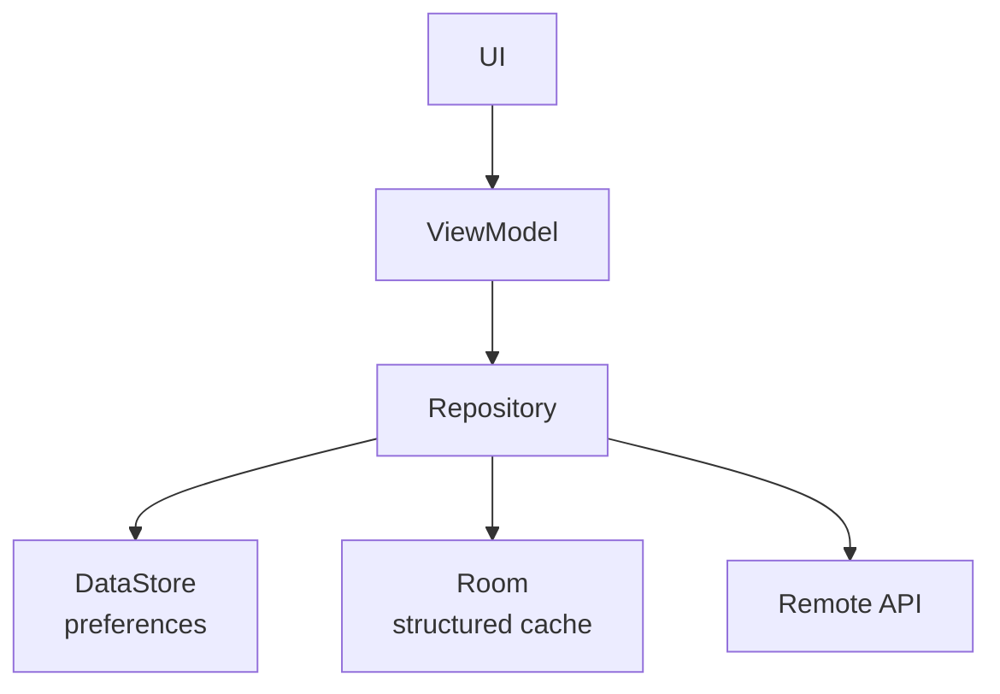

---

# 45. Production checklist

Khi đưa DataStore vào production, nên kiểm tra:

### Architecture

* [ ] DataStore nằm trong Data Layer.
* [ ] UI không truy cập trực tiếp DataStore.
* [ ] Repository expose model thay vì raw Preferences.
* [ ] Chỉ có một instance cho một DataStore file.

### Data

* [ ] Tất cả key có default hợp lý.
* [ ] Không lưu dataset lớn.
* [ ] Không lưu relational data.
* [ ] Không duplicate source of truth.

### Error handling

* [ ] Xử lý `IOException`.
* [ ] Không swallow unexpected exception.
* [ ] Có UX khi write thất bại.

### Lifecycle

* [ ] Rotate không làm sai UI.
* [ ] Background → foreground giữ đúng state.
* [ ] Kill process → reopen đọc đúng preference.

### Migration

* [ ] SharedPreferences migration có test.
* [ ] Không tiếp tục ghi vào storage cũ.
* [ ] Key mapping được review.

### Release

* [ ] Fresh install test.
* [ ] Upgrade test.
* [ ] Rollback consideration.
* [ ] Crash monitoring sau rollout.

---

# 46. Release checklist mẫu

| Item           | Giá trị                                  |
| -------------- | ---------------------------------------- |
| Artifact       | Preferences DataStore migration          |
| Owner          | Android developer                        |
| Old storage    | SharedPreferences                        |
| New storage    | DataStore                                |
| Verification   | Settings giữ nguyên sau update           |
| Automated test | Migration test                           |
| Manual test    | Upgrade production-like build            |
| Risk           | Preference reset                         |
| User impact    | Theme/language/settings bị mất           |
| Rollback       | Restore compatible read path hoặc hotfix |
| Rollout        | Staged rollout                           |
| Monitoring     | Crash + preference-related reports       |

---

# 47. Staged rollout

Đối với migration quan trọng:

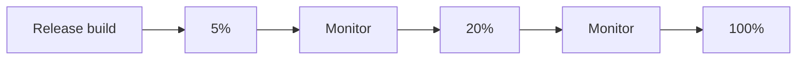

Ý tưởng:

```text
Release
↓
5% users
↓
check crashes / migration
↓
20%
↓
check metrics
↓
100%
```

Điều này đặc biệt hữu ích khi storage migration có khả năng ảnh hưởng user state.

---

# 48. Rollback consideration

Storage migration khiến rollback khó hơn code UI thông thường.

Ví dụ:

```text
v2
SharedPreferences
     ↓
upgrade
     ↓
v3
DataStore
```

Sau đó rollback:

```text
v3
↓
v2
```

Version cũ có thể không biết dữ liệu đã chuyển sang đâu.

Vì vậy trước release phải nghĩ:

```text
Forward migration?
Backward compatibility?
Old file còn không?
Version cũ có đọc được state không?
```

---

# 49. Security

Không nên xem DataStore là nơi mặc định dành cho:

```text
password
private key
API secret
long-lived sensitive token
```

chỉ vì nó ghi xuống disk.

Một storage mechanism và một security mechanism là hai vấn đề khác nhau.

Đặc biệt cần xem xét:

```text
sensitivity
backup behavior
device compromise
encryption
key management
```

DataStore 1.3 alpha trong năm 2026 đã bắt đầu giới thiệu thêm integration liên quan Tink encryption, nhưng nhánh này hiện vẫn ở alpha chứ không phải stable 1.2.1. ([Android Developers][3])

---

# 50. Thực hành — Mini Settings App

## Yêu cầu

Xây dựng app có:

```text
Settings
├── Dark Mode
├── Notifications
└── Language
```

Data model:

```kotlin
data class UserSettings(
    val darkMode: Boolean,
    val notificationsEnabled: Boolean,
    val language: String
)
```

Persistence:

```text
Preferences DataStore
```

Architecture:

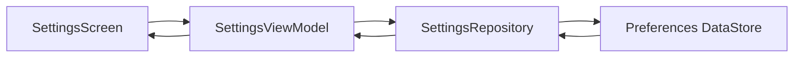

---

# 51. Yêu cầu chức năng

### Dark Mode

```text
Switch ON
↓
setDarkMode(true)
↓
DataStore
↓
app restart
↓
vẫn Dark Mode
```

### Notification

```text
Switch OFF
↓
DataStore
↓
restart
↓
vẫn OFF
```

### Language

```text
VI
↓
EN
↓
DataStore
↓
restart
↓
EN
```

---

# 52. Bài tập 1 — Basic

Tạo DataStore:

```text
settings
```

và lưu:

```text
dark_mode: Boolean
```

Yêu cầu:

* [ ] đọc bằng Flow;
* [ ] ghi bằng `edit()`;
* [ ] default `false`;
* [ ] restart app vẫn giữ dữ liệu.

---

# 53. Bài tập 2 — Intermediate

Thêm:

```text
notifications_enabled
language
font_size
```

Tạo:

```kotlin
data class UserSettings(...)
```

Repository phải expose:

```kotlin
Flow<UserSettings>
```

thay vì expose raw `Preferences`.

---

# 54. Bài tập 3 — Migration

Tạo version giả lập:

```text
v1 → SharedPreferences
v2 → DataStore
```

Trong v1:

```text
dark_mode = true
language = "vi"
```

Update lên v2.

Kết quả mong đợi:

```text
DataStore.darkMode == true
DataStore.language == "vi"
```

Android cung cấp `SharedPreferencesMigration` dành cho chính trường hợp này. ([Android Developers][2])

---

# 55. Bài tập 4 — Release checklist

Chuẩn bị artifact:

```markdown
## DataStore Migration Release Checklist

Artifact:
SharedPreferences → DataStore migration

Owner:
Android developer

Verification:
- Fresh install
- Upgrade install
- Kill process
- Relaunch app
- Verify dark mode
- Verify language

Rollback:
Verify previous app version does not corrupt settings.

Monitoring:
- Crash rate
- IOException
- Migration failure
- Settings reset reports
```

---

# 56. Portfolio artifact

Một artifact tốt để đưa vào portfolio:

```text
android-datastore-settings/
│
├── data/
│   ├── datastore/
│   │   └── AppDataStore.kt
│   │
│   └── repository/
│       └── SettingsRepository.kt
│
├── ui/
│   └── settings/
│       ├── SettingsViewModel.kt
│       └── SettingsScreen.kt
│
├── test/
│   └── SettingsRepositoryTest.kt
│
└── README.md
```

README nên có:

```markdown
# Android DataStore Settings

## Features

- Preferences DataStore
- Kotlin Flow
- Repository pattern
- StateFlow
- Jetpack Compose
- Lifecycle-aware state collection
- SharedPreferences migration
- Unit tests

## Architecture

UI
↓
ViewModel
↓
Repository
↓
DataStore

## Release considerations

- Migration verification
- Fresh install test
- Upgrade test
- Rollback analysis
```

---

# 57. Câu hỏi phỏng vấn

### 1. DataStore là gì?

> Jetpack DataStore là giải pháp persistence cho dataset nhỏ trên Android, hỗ trợ Coroutines, Flow và transactional updates.

---

### 2. Khi nào dùng Preferences DataStore?

Khi cần lưu:

```text
simple key-value settings
```

ví dụ:

```text
theme
language
notification preference
```

---

### 3. Khi nào dùng Proto DataStore?

Khi settings trở thành structured typed object và muốn schema/type safety tốt hơn.

---

### 4. DataStore có thay thế Room không?

Không.

```text
DataStore → small persistent state
Room      → structured relational data
```

Android cũng khuyến nghị Room khi cần large/complex datasets, partial updates hoặc referential integrity. ([Android Developers][1])

---

### 5. DataStore liên quan Flow như thế nào?

```text
DataStore.data
→ Flow<T>
```

Repository transform Flow và ViewModel có thể chuyển nó thành StateFlow cho UI.

---

### 6. Vì sao không dùng DataStore trực tiếp trong Compose?

Để giữ separation of concerns:

```text
Compose
→ ViewModel
→ Repository
→ DataStore
```

đồng thời giúp test và maintain dễ hơn. ([Android Developers][1])

---

### 7. DataStore xử lý concurrent update thế nào?

Các update thông qua `updateData()` hoặc `edit()` được xử lý transactionally. ([Android Developers][1])

---

### 8. Làm thế nào migrate SharedPreferences?

Dùng:

```kotlin
SharedPreferencesMigration
```

thông qua `produceMigrations`. ([Android Developers][2])

---

### 9. DataStore có survive process death không?

Có, vì dữ liệu được persist xuống storage; sau khi process mới chạy, DataStore có thể đọc lại state.

---

### 10. Tại sao chỉ nên có một DataStore instance cho một file?

Vì nhiều instance cùng sử dụng một file trong cùng process vi phạm quy tắc sử dụng DataStore và có thể dẫn đến `IllegalStateException`. ([Android Developers][1])

---

# 58. Mental model

Có thể ghi nhớ toàn bộ DataStore bằng sơ đồ sau:

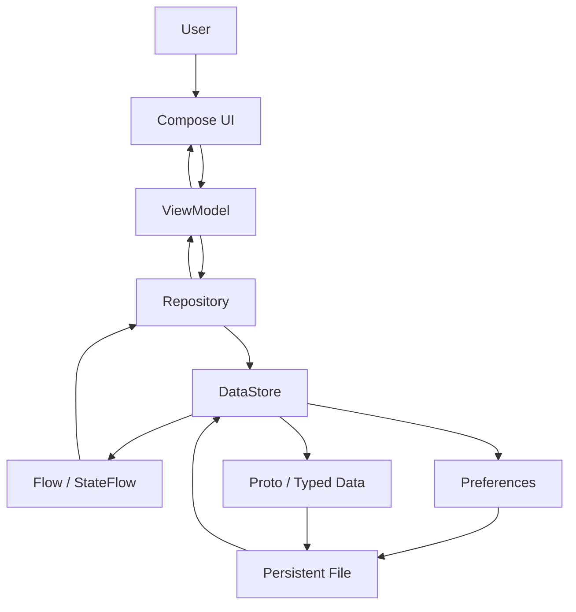

Câu cần nhớ:

> **DataStore là nguồn persistent state nhỏ trong Data Layer; Repository expose nó bằng Flow, ViewModel chuyển nó thành UI state, còn UI chỉ phát event và render state.**

---

# 59. Checklist hoàn thành

## Kiến thức

* [ ] Tôi giải thích được DataStore.
* [ ] Tôi phân biệt Preferences và Proto DataStore.
* [ ] Tôi phân biệt DataStore và Room.
* [ ] Tôi hiểu `Flow`.
* [ ] Tôi hiểu `edit()`.
* [ ] Tôi hiểu transaction.
* [ ] Tôi hiểu Single Source of Truth.

## Code

* [ ] Tôi tạo được DataStore.
* [ ] Tôi định nghĩa Preferences keys.
* [ ] Tôi tạo Repository.
* [ ] Tôi expose `Flow<UserSettings>`.
* [ ] Tôi update settings bằng suspend function.
* [ ] Tôi kết nối với ViewModel.
* [ ] Tôi dùng `collectAsStateWithLifecycle()`.

## Production

* [ ] Tôi xử lý lỗi đọc/ghi.
* [ ] Tôi không tạo nhiều DataStore instance cùng file.
* [ ] Tôi có migration strategy.
* [ ] Tôi test upgrade.
* [ ] Tôi nghĩ đến rollback.
* [ ] Tôi không dùng DataStore như database lớn.

## Portfolio

* [ ] Có mini Settings app.
* [ ] Có diagram architecture.
* [ ] Có migration.
* [ ] Có unit test.
* [ ] Có README.
* [ ] Có release checklist.

---

# 60. Tổng kết

```text
SharedPreferences
        ↓
      DataStore
        ↓
Coroutines + Flow
        ↓
Transactional updates
        ↓
Repository
        ↓
ViewModel
        ↓
StateFlow
        ↓
Compose UI
```

Ba ý quan trọng nhất của bài:

1. **DataStore phù hợp với preference và persistent state nhỏ**, không phải database lớn. ([Android Developers][1])
2. **DataStore nên nằm trong Data Layer**, được bao bởi Repository rồi expose qua ViewModel cho UI. ([Android Developers][1])
3. Trong production, **migration, error handling, singleton instance, upgrade test và rollback** quan trọng không kém việc code được `dataStore.edit()`.

**Phiên bản AndroidX tham chiếu cho bài học tại thời điểm 12/08/2026:** `androidx.datastore:datastore-preferences:1.2.1` stable; `1.3.0-alpha10` là nhánh alpha mới nhất được Android Developers liệt kê ngày 29/07/2026. ([Android Developers][3])

[1]: https://developer.android.com/topic/libraries/architecture/datastore "App Architecture: Data Layer - DataStore - Android Developers  |  App architecture"
[2]: https://developer.android.com/codelabs/android-preferences-datastore "Working with Preferences DataStore  |  Android Developers"
[3]: https://developer.android.com/jetpack/androidx/releases/datastore "DataStore  |  Jetpack  |  Android Developers"
