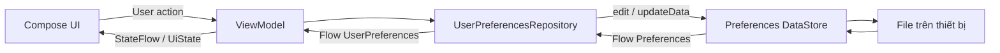
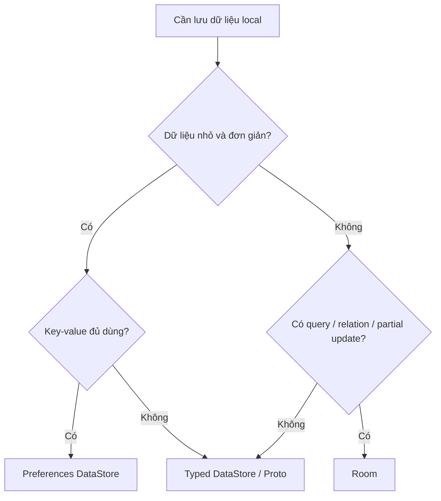
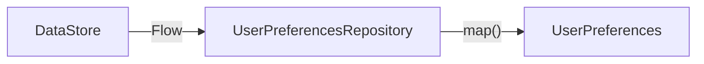
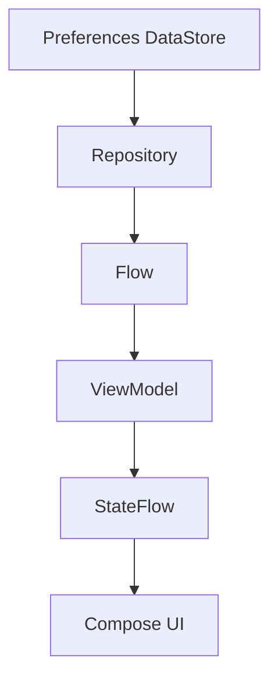
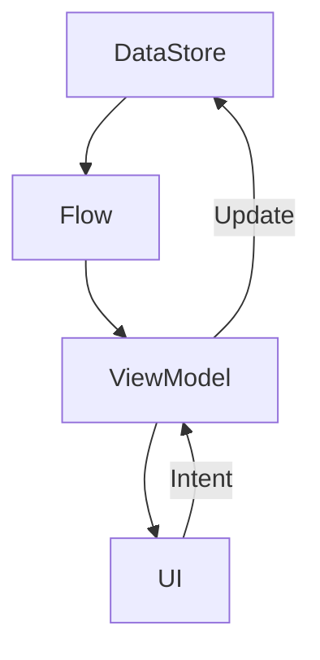
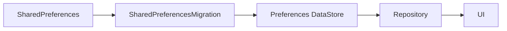
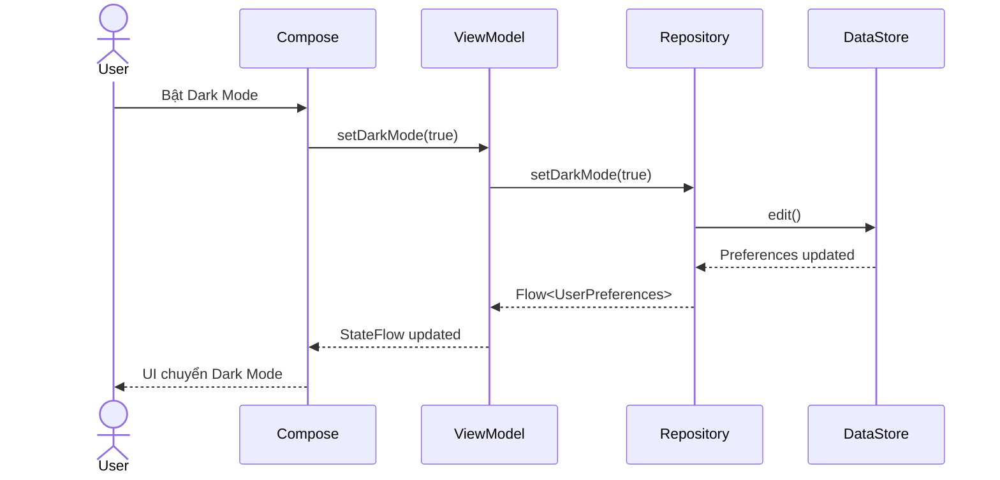
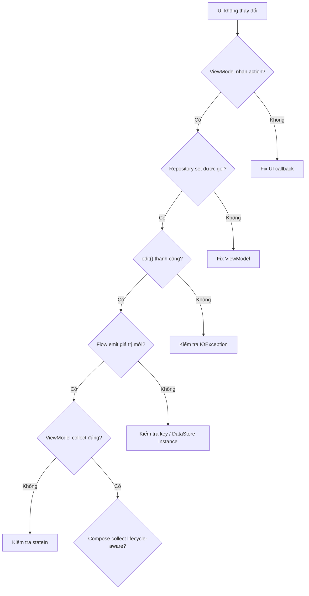
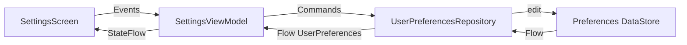

# 003 - Preferences DataStore

**Học phần:** 03 - Architecture, State and Data
**Module:** Module 06 - Storage
**Nhóm nội dung:** Preferences and Files
**Nguồn roadmap:** Storage / Preferences and Files
**Loại bài:** release
**Thứ tự trong module:** 003
**Thời lượng gợi ý:** 32 phút

> **Ghi chú:** Metadata của roadmap đánh dấu bài này là `release`, nhưng về mặt kỹ thuật, **Preferences DataStore thuộc Data Layer / Local Storage**. Release chỉ trở thành vấn đề khi ta migration dữ liệu, thay đổi key, rollout phiên bản mới hoặc cần rollback.

---

## 1. Tóm tắt

**Preferences DataStore** là giải pháp lưu trữ dữ liệu dạng **key-value** hiện đại của Jetpack, phù hợp với các dữ liệu nhỏ như:

* lựa chọn dark mode;
* ngôn ngữ;
* trạng thái onboarding;
* bộ lọc;
* kiểu sắp xếp;
* cài đặt thông báo;
* các tùy chọn của người dùng.

DataStore sử dụng **Kotlin Coroutines + Flow**, cho phép đọc và ghi dữ liệu bất đồng bộ, đồng thời hỗ trợ cập nhật transaction và migration từ `SharedPreferences`. Android hiện khuyến nghị cân nhắc DataStore thay cho `SharedPreferences` cho nhu cầu lưu dữ liệu mới. ([Android Developers][1])

Có hai hướng DataStore phổ biến:

```text
DataStore
├── Preferences DataStore
│   └── Key → Value
│
└── Typed DataStore
    ├── Proto DataStore
    └── Custom serializer như JSON
```

Preferences DataStore **không cần schema định nghĩa trước**, nhưng vì dựa vào key nên không có mức type safety của Proto DataStore. ([Android Developers][1])

---

## 2. Mục tiêu học tập

Sau bài này, anh nên có thể:

* Giải thích được Preferences DataStore là gì và khác `SharedPreferences` ở đâu.
* Biết khi nào nên dùng Preferences DataStore, Proto DataStore hoặc Room.
* Tạo một `DataStore<Preferences>`.
* Khai báo các preference key.
* Đọc dữ liệu bằng `Flow`.
* Ghi dữ liệu bằng `edit()` hoặc `updateData()`.
* Đưa DataStore vào `Repository`.
* Kết nối Repository → ViewModel → Compose.
* Hiểu DataStore liên quan đến lifecycle như thế nào.
* Migration từ `SharedPreferences`.
* Hiểu transaction và concurrent update.
* Xử lý lỗi I/O.
* Test persistence.
* Đánh giá release risk khi đổi key hoặc migration dữ liệu.

---

# 3. Preferences DataStore là gì?

Có thể nhớ bằng một câu:

> **Preferences DataStore là bộ nhớ key-value bất đồng bộ, reactive và persistent dành cho các cấu hình nhỏ của ứng dụng.**

Ví dụ một app có:

```text
dark_mode        → true
language         → "vi"
sort_order       → "NEWEST"
show_completed   → false
font_scale       → 1.1
```

Ta có thể hình dung:



Android khuyến nghị giữ các thao tác DataStore trong **data layer**, chẳng hạn Repository, rồi expose dữ liệu thông qua ViewModel thay vì đọc/ghi DataStore trực tiếp trong Composable. ([Android Developers][1])

---

# 4. Vị trí của Preferences DataStore trong kiến trúc Android

Thông thường:

```text
┌─────────────────────────────┐
│          UI Layer           │
│                             │
│ Compose / Fragment          │
│          ↓ ↑                │
│       ViewModel             │
└─────────────┬───────────────┘
              │
              │ Flow / action
              ↓
┌─────────────────────────────┐
│          Data Layer         │
│                             │
│ UserPreferencesRepository   │
│             ↓               │
│    Preferences DataStore    │
└─────────────┬───────────────┘
              │
              ↓
        Local storage
```

Điểm quan trọng là:

```text
UI không cần biết dữ liệu nằm trong file nào.
ViewModel không cần biết key tên gì.
Repository chịu trách nhiệm đọc/ghi DataStore.
```

Đây là **separation of concerns**.

---

# 5. SharedPreferences vs Preferences DataStore

Đây là lý do DataStore quan trọng.

| Tiêu chí               | SharedPreferences | Preferences DataStore |
| ---------------------- | ----------------- | --------------------- |
| Mô hình                | Key-value         | Key-value             |
| API bất đồng bộ        | Hạn chế           | ✅                     |
| Kotlin Flow            | ❌                 | ✅                     |
| Coroutines             | ❌                 | ✅                     |
| Transactional update   | ❌                 | ✅                     |
| Error handling         | Hạn chế           | ✅                     |
| Migration API          | ❌                 | ✅                     |
| Reactive               | Listener          | Flow                  |
| Schema                 | Không             | Không                 |
| Type safety toàn model | Không             | Không                 |

Android codelab chỉ ra một số vấn đề của SharedPreferences như disk I/O có thể ảnh hưởng UI thread, thiếu transactional API và cơ chế báo lỗi kém hơn; DataStore giải quyết phần lớn các hạn chế đó. ([Android Developers][2])

### Cách tư duy

Thay vì:

```text
UI
 ↓
getBoolean()
 ↓
SharedPreferences
```

ta có:

```text
UI
 ↑
StateFlow
 ↑
ViewModel
 ↑
Flow<UserPreferences>
 ↑
Repository
 ↑
Flow<Preferences>
 ↑
DataStore
```

Đây là cách tiếp cận reactive hơn.

---

# 6. Preferences DataStore, Proto DataStore hay Room?

Một rule-of-thumb hữu ích:



Preferences DataStore phù hợp với **dataset nhỏ và đơn giản**. Nếu cần partial update trên dataset phức tạp, referential integrity hoặc query dữ liệu lớn thì Room phù hợp hơn. ([Android Developers][2])

Ví dụ:

| Dữ liệu                          | Nên dùng              |
| -------------------------------- | --------------------- |
| Dark mode                        | Preferences DataStore |
| Ngôn ngữ                         | Preferences DataStore |
| Đã xem onboarding chưa           | Preferences DataStore |
| Filter sản phẩm                  | Preferences DataStore |
| Sort order                       | Preferences DataStore |
| User settings có schema phức tạp | Proto/Typed DataStore |
| 10.000 sản phẩm                  | Room                  |
| Chat history                     | Room                  |
| Danh sách bài viết               | Room                  |
| Quan hệ User → Order             | Room                  |

---

# 7. Minh họa từ Android Codelab

Android có codelab chính thức dùng một ứng dụng Tasks để minh họa việc lưu các tùy chọn như **Show completed** và **Sort order**, đồng thời migration dữ liệu từ SharedPreferences sang DataStore. ([Android Developers][2])

[](https://developer.android.com/codelabs/android-preferences-datastore?utm_source=chatgpt.com)

Đây cũng là use case rất điển hình của Preferences DataStore:

```text
Task list
    ↓
User chọn:
    ├── Show completed
    └── Sort order
            ↓
    Preferences DataStore
            ↓
Đóng app → mở lại
            ↓
Preference vẫn còn
```

---

# 8. Cài đặt Preferences DataStore

Theo tài liệu Android hiện tại, dependency Preferences DataStore được minh họa với phiên bản **1.2.1**. ([Android Developers][1])

Trong:

```text
app/build.gradle.kts
```

thêm:

```kotlin
dependencies {
    implementation("androidx.datastore:datastore-preferences:1.2.1")
}
```

> Khi làm project thực tế lâu dài, nên quản lý version qua Version Catalog thay vì hard-code dependency ở nhiều module.

---

# 9. Tạo Preferences DataStore

Android cung cấp delegate:

```kotlin
preferencesDataStore()
```

Ta có thể khai báo ở top-level:

```kotlin
import android.content.Context
import androidx.datastore.core.DataStore
import androidx.datastore.preferences.core.Preferences
import androidx.datastore.preferences.preferencesDataStore

private const val USER_PREFERENCES_NAME = "user_preferences"

val Context.userPreferencesDataStore:
    DataStore<Preferences> by preferencesDataStore(
        name = USER_PREFERENCES_NAME
    )
```

Android khuyến nghị gọi delegate ở **top level** và dùng cùng instance trong ứng dụng, giúp DataStore hoạt động giống singleton cho file tương ứng. ([Android Developers][1])

Luồng lúc này:

```text
Context
   │
   ↓
userPreferencesDataStore
   │
   ↓
DataStore<Preferences>
   │
   ↓
user_preferences
```

---

# 10. Preference Key

Preferences DataStore không có schema.

Vì vậy ta phải định nghĩa key.

Ví dụ:

```kotlin
import androidx.datastore.preferences.core.booleanPreferencesKey
import androidx.datastore.preferences.core.stringPreferencesKey

private object PreferencesKeys {

    val DARK_MODE =
        booleanPreferencesKey("dark_mode")

    val DYNAMIC_COLOR =
        booleanPreferencesKey("dynamic_color")

    val SORT_ORDER =
        stringPreferencesKey("sort_order")
}
```

Có nhiều loại key như:

```kotlin
booleanPreferencesKey(...)
intPreferencesKey(...)
longPreferencesKey(...)
floatPreferencesKey(...)
doublePreferencesKey(...)
stringPreferencesKey(...)
stringSetPreferencesKey(...)
```

Android minh họa chính mô hình này: định nghĩa key thích hợp rồi dùng `DataStore.data` để đọc `Preferences`. ([Android Developers][1])

---

# 11. Không expose Preferences trực tiếp lên UI

Không nên để UI làm việc với:

```kotlin
Flow<Preferences>
```

Thay vào đó tạo model của app:

```kotlin
enum class SortOrder {
    DEFAULT,
    NAME,
    DATE
}
```

```kotlin
data class UserPreferences(
    val darkMode: Boolean = false,
    val dynamicColor: Boolean = true,
    val sortOrder: SortOrder = SortOrder.DEFAULT
)
```

Sau đó Repository sẽ chuyển:

```text
Preferences

dark_mode = true
sort_order = "DATE"

        ↓ map

UserPreferences(
    darkMode = true,
    sortOrder = DATE
)
```

UI chỉ cần biết:

```kotlin
UserPreferences
```

chứ không cần biết:

```text
dark_mode
sort_order
```

đang được lưu bằng key gì.

---

# 12. Tạo UserPreferencesRepository

```kotlin
class UserPreferencesRepository(
    private val dataStore: DataStore<Preferences>
) {

    // Read

    // Write

}
```

Kiến trúc:



Repository trở thành **boundary** giữa storage API và phần còn lại của ứng dụng.

---

# 13. Đọc dữ liệu bằng Flow

Một trong những đặc điểm quan trọng nhất của DataStore là:

```kotlin
dataStore.data
```

trả về:

```kotlin
Flow<Preferences>
```

Android mô tả `DataStore.data` là Flow dùng để quan sát dữ liệu hiện tại và các thay đổi tiếp theo. ([Android Developers][1])

Ta map nó thành model:

```kotlin
val userPreferences: Flow<UserPreferences> =
    dataStore.data.map { preferences ->

        val darkMode =
            preferences[PreferencesKeys.DARK_MODE]
                ?: false

        val dynamicColor =
            preferences[PreferencesKeys.DYNAMIC_COLOR]
                ?: true

        val sortOrder =
            preferences[PreferencesKeys.SORT_ORDER]
                ?.let {
                    runCatching {
                        SortOrder.valueOf(it)
                    }.getOrNull()
                }
                ?: SortOrder.DEFAULT

        UserPreferences(
            darkMode = darkMode,
            dynamicColor = dynamicColor,
            sortOrder = sortOrder
        )
    }
```

Ví dụ ban đầu:

```text
DataStore

{}
```

sẽ tạo:

```kotlin
UserPreferences(
    darkMode = false,
    dynamicColor = true,
    sortOrder = DEFAULT
)
```

Sau khi user bật dark mode:

```text
{
    dark_mode = true
}
```

Flow phát giá trị mới:

```text
DataStore changed
      ↓
Flow<Preferences>
      ↓
map()
      ↓
UserPreferences
      ↓
ViewModel
      ↓
Compose recomposition
```

---

# 14. Xử lý IOException

DataStore đọc dữ liệu từ storage nên lỗi I/O vẫn có thể xảy ra.

Android codelab minh họa việc dùng `catch` trước `map()` và phát `emptyPreferences()` khi gặp `IOException`; exception khác nên được throw tiếp thay vì che giấu. ([Android Developers][2])

```kotlin
import androidx.datastore.preferences.core.emptyPreferences
import kotlinx.coroutines.flow.catch
import java.io.IOException

val userPreferences: Flow<UserPreferences> =
    dataStore.data

        .catch { exception ->

            if (exception is IOException) {
                emit(emptyPreferences())
            } else {
                throw exception
            }

        }

        .map { preferences ->

            UserPreferences(
                darkMode =
                    preferences[PreferencesKeys.DARK_MODE]
                        ?: false,

                dynamicColor =
                    preferences[
                        PreferencesKeys.DYNAMIC_COLOR
                    ] ?: true,

                sortOrder =
                    preferences[
                        PreferencesKeys.SORT_ORDER
                    ]
                        ?.let {
                            runCatching {
                                SortOrder.valueOf(it)
                            }.getOrNull()
                        }
                        ?: SortOrder.DEFAULT
            )
        }
```

Một lỗi phổ biến là:

```kotlin
.catch {
    emit(emptyPreferences())
}
```

cho **mọi exception**.

Điều này có thể che mất bug lập trình.

Tốt hơn:

```text
IOException
    ↓
fallback

Unexpected exception
    ↓
throw
```

---

# 15. Ghi dữ liệu với `edit()`

Preferences DataStore có hàm `edit()` dạng `suspend`.

Ví dụ:

```kotlin
suspend fun setDarkMode(enabled: Boolean) {

    dataStore.edit { preferences ->

        preferences[
            PreferencesKeys.DARK_MODE
        ] = enabled
    }
}
```

Android mô tả `edit()` là thao tác transaction trên `MutablePreferences`: các thay đổi trong transform được áp dụng xuống storage trước khi `edit()` hoàn tất. ([Android Developers][2])

Ví dụ:

```text
Before

dark_mode = false

        ↓

setDarkMode(true)

        ↓

DataStore.edit {}

        ↓

After

dark_mode = true
```

---

# 16. Ghi nhiều giá trị trong một transaction

Ví dụ reset một nhóm setting:

```kotlin
suspend fun setDisplayPreferences(
    darkMode: Boolean,
    dynamicColor: Boolean
) {

    dataStore.edit { preferences ->

        preferences[
            PreferencesKeys.DARK_MODE
        ] = darkMode

        preferences[
            PreferencesKeys.DYNAMIC_COLOR
        ] = dynamicColor
    }
}
```

Ta muốn:

```text
darkMode
dynamicColor
     │
     └──────┐
            ↓
        one edit
            ↓
      one transaction
```

thay vì tự xây một state cache riêng rồi cố đồng bộ bằng nhiều bước.

DataStore cung cấp transactional update và consistency guarantee cho những thay đổi như vậy. ([Android Developers][1])

---

# 17. `edit()` và `updateData()`

API DataStore tổng quát có:

```kotlin
updateData()
```

Android mô tả `updateData()` là thao tác atomic **read → modify → write** trong một transaction. Với Preferences DataStore, `edit()` vẫn là API tiện lợi để thay đổi `MutablePreferences`. ([Android Developers][1])

Ví dụ với `edit()`:

```kotlin
suspend fun increaseLaunchCount() {

    dataStore.edit { preferences ->

        val key =
            intPreferencesKey("launch_count")

        val current =
            preferences[key] ?: 0

        preferences[key] =
            current + 1
    }
}
```

Ta không nên làm kiểu:

```text
read count
     ↓
count + 1
     ↓
delay
     ↓
write
```

bằng hai operation độc lập nếu giá trị có thể bị cập nhật đồng thời.

---

# 18. Tại sao transaction quan trọng?

Giả sử:

```text
launch_count = 10
```

hai coroutine cùng tăng count:

```text
Coroutine A                 Coroutine B

read 10                     read 10
   ↓                           ↓
+1                          +1
   ↓                           ↓
write 11                    write 11
```

Kết quả sai:

```text
11
```

trong khi mong muốn:

```text
12
```

Với update được thực hiện transaction trong DataStore, logic read-modify-write có thể dựa trên state cập nhật nhất thay vì tự quản lý một cache dễ race condition. Android codelab sử dụng chính transactional behavior này để giải quyết concurrent sort-order updates. ([Android Developers][2])

---

# 19. ViewModel

Repository không nên được gọi trực tiếp từ Compose.

Ta thêm ViewModel:

```kotlin
class SettingsViewModel(
    private val repository: UserPreferencesRepository
) : ViewModel() {

    val userPreferences =
        repository.userPreferences
            .stateIn(
                scope = viewModelScope,
                started = SharingStarted.WhileSubscribed(
                    5_000
                ),
                initialValue = UserPreferences()
            )

    fun setDarkMode(enabled: Boolean) {

        viewModelScope.launch {
            repository.setDarkMode(enabled)
        }
    }
}
```

Luồng kiến trúc trở thành:



---

# 20. Compose + lifecycle

Trong Compose:

```kotlin
@Composable
fun SettingsScreen(
    viewModel: SettingsViewModel
) {

    val preferences by
        viewModel.userPreferences
            .collectAsStateWithLifecycle()

    Switch(
        checked = preferences.darkMode,
        onCheckedChange = viewModel::setDarkMode
    )
}
```

Android hiện hướng dẫn consume Flow từ ViewModel trong Compose bằng `collectAsStateWithLifecycle()`, thay vì để Composable truy cập DataStore trực tiếp. ([Android Developers][1])

---

# 21. DataStore và Lifecycle

Một nhầm lẫn thường gặp:

```text
DataStore = UI state?
```

Không.

DataStore là:

```text
Persistent application/user state
```

Ví dụ:

```text
User bật Dark Mode
      ↓
DataStore
      ↓

rotate screen
      ↓
vẫn còn

Activity recreate
      ↓
vẫn còn

app background
      ↓
vẫn còn

process bị kill
      ↓
đọc lại từ DataStore

app restart
      ↓
vẫn còn
```

Điều này khác `remember` hoặc biến ViewModel.

Có thể phân biệt:

```text
remember
   ↓
temporary Compose state

ViewModel
   ↓
screen-level runtime state

SavedStateHandle
   ↓
screen state cần phục hồi

DataStore
   ↓
persistent preference

Room
   ↓
persistent structured application data
```

---

# 22. Single Source of Truth

Không nên có:

```text
MutableStateFlow
       +
DataStore
       +
SharedPreferences
```

cùng đại diện cho một preference.

Ví dụ sai:

```kotlin
private val _darkMode =
    MutableStateFlow(false)

fun setDarkMode(enabled: Boolean) {

    _darkMode.value = enabled

    // ghi DataStore riêng
}
```

Bây giờ có hai nguồn:

```text
_darkMode
DataStore
```

và có khả năng:

```text
_darkMode = true
DataStore = false
```

Thiết kế tốt hơn:



Tức:

> **DataStore là Single Source of Truth cho các persistent preferences.**

---

# 23. Migration từ SharedPreferences

Đây là phần đặc biệt quan trọng với app production.

Giả sử app cũ:

```text
SharedPreferences

dark_mode = true
sort_order = DATE
```

Bản app mới chuyển sang:

```text
Preferences DataStore
```

Nếu không migration:

```text
App update
   ↓
DataStore rỗng
   ↓
user settings reset
```

UX sẽ rất tệ.

DataStore hỗ trợ `SharedPreferencesMigration`; migration chạy trước khi DataStore cho phép data access và mỗi key được migration một lần. ([Android Developers][2])

Ví dụ:

```kotlin
private val Context.userPreferencesDataStore
    by preferencesDataStore(

        name = "user_preferences",

        produceMigrations = { context ->

            listOf(
                SharedPreferencesMigration(
                    context,
                    "legacy_preferences"
                )
            )
        }
    )
```

Luồng:



---

# 24. Một lưu ý rất quan trọng về migration

Sau khi migration:

```text
SharedPreferences
       ↓
DataStore
```

đừng tiếp tục xem cả hai là nguồn dữ liệu song song.

Android codelab lưu ý rằng key chỉ được migration một lần và code nên ngừng sử dụng SharedPreferences cũ sau khi đã chuyển sang DataStore. ([Android Developers][2])

Sai:

```text
Screen A → DataStore

Screen B → SharedPreferences
```

Đây gần như chắc chắn dẫn đến:

```text
state divergence
```

---

# 25. Release risk khi migration

Đây là chỗ metadata **Loại bài: release** trở nên hợp lý.

Ví dụ:

```text
Version 1.5
SharedPreferences

       ↓ update

Version 2.0
DataStore Migration
```

Sau migration:

```text
User settings → DataStore
```

Nhưng nếu v2.0 gặp bug và team rollback binary về v1.5 thì cần nghĩ đến việc:

```text
v1.5 có đọc lại được preference hay không?
```

Android migration mặc định có thể cleanup các key đã migration; vì vậy rollback về code chỉ biết SharedPreferences có thể khiến một số preference quay về default. Đây là lý do migration storage phải được xem như một phần của **release design**, không đơn giản chỉ là refactor. ([Android Developers][2])

---

# 26. Đổi tên key cũng là migration

Ví dụ bản cũ:

```text
dark_mode
```

bản mới đổi thành:

```text
is_dark_theme_enabled
```

Nếu chỉ sửa:

```kotlin
booleanPreferencesKey(
    "is_dark_theme_enabled"
)
```

thì DataStore sẽ không tự hiểu:

```text
dark_mode
```

và:

```text
is_dark_theme_enabled
```

là một field.

Kết quả có thể là:

```text
old user preference
       ↓
not found
       ↓
default false
```

Do đó tên key nên được coi gần giống một phần của **persistent storage contract**.

---

# 27. Naming key

Nên dùng tên ổn định:

```kotlin
"dark_mode"
"language"
"sort_order"
"show_completed"
```

Tránh:

```kotlin
"darkMode2"
"test"
"abc"
"new_value"
```

Một convention đơn giản:

```text
feature_property
```

Ví dụ:

```text
theme_mode
notification_enabled
feed_sort_order
onboarding_completed
```

---

# 28. Default value

Preferences DataStore không bắt buộc mọi key phải tồn tại.

Do đó:

```kotlin
preferences[DARK_MODE]
```

có thể trả về:

```text
null
```

Phải định nghĩa default:

```kotlin
preferences[DARK_MODE] ?: false
```

Default value không phải chi tiết nhỏ.

Nó quyết định behavior cho:

```text
new install
migration failure fallback
new preference
missing key
```

---

# 29. Một implementation hoàn chỉnh

## `UserPreferences.kt`

```kotlin
enum class SortOrder {
    DEFAULT,
    NAME,
    DATE
}

data class UserPreferences(
    val darkMode: Boolean = false,
    val dynamicColor: Boolean = true,
    val sortOrder: SortOrder = SortOrder.DEFAULT
)
```

---

## `DataStoreExt.kt`

```kotlin
private const val USER_PREFERENCES_NAME =
    "user_preferences"

val Context.userPreferencesDataStore:
    DataStore<Preferences> by preferencesDataStore(
        name = USER_PREFERENCES_NAME
    )
```

---

## `UserPreferencesRepository.kt`

```kotlin
class UserPreferencesRepository(
    private val dataStore: DataStore<Preferences>
) {

    private object Keys {

        val DARK_MODE =
            booleanPreferencesKey("dark_mode")

        val DYNAMIC_COLOR =
            booleanPreferencesKey("dynamic_color")

        val SORT_ORDER =
            stringPreferencesKey("sort_order")
    }

    val userPreferences: Flow<UserPreferences> =
        dataStore.data

            .catch { exception ->

                if (exception is IOException) {
                    emit(emptyPreferences())
                } else {
                    throw exception
                }
            }

            .map { preferences ->

                val sortOrder =
                    preferences[Keys.SORT_ORDER]
                        ?.let { value ->
                            runCatching {
                                SortOrder.valueOf(value)
                            }.getOrNull()
                        }
                        ?: SortOrder.DEFAULT

                UserPreferences(
                    darkMode =
                        preferences[Keys.DARK_MODE]
                            ?: false,

                    dynamicColor =
                        preferences[
                            Keys.DYNAMIC_COLOR
                        ] ?: true,

                    sortOrder = sortOrder
                )
            }

    suspend fun setDarkMode(
        enabled: Boolean
    ) {

        dataStore.edit { preferences ->

            preferences[Keys.DARK_MODE] =
                enabled
        }
    }

    suspend fun setDynamicColor(
        enabled: Boolean
    ) {

        dataStore.edit { preferences ->

            preferences[
                Keys.DYNAMIC_COLOR
            ] = enabled
        }
    }

    suspend fun setSortOrder(
        sortOrder: SortOrder
    ) {

        dataStore.edit { preferences ->

            preferences[Keys.SORT_ORDER] =
                sortOrder.name
        }
    }
}
```

Cấu trúc này bám theo pattern Android khuyến nghị: DataStore ở data layer, expose `Flow`, còn UI làm việc qua ViewModel. ([Android Developers][1])

---

# 30. ViewModel hoàn chỉnh

```kotlin
class SettingsViewModel(
    private val repository:
        UserPreferencesRepository
) : ViewModel() {

    val preferences:
        StateFlow<UserPreferences> =
        repository.userPreferences
            .stateIn(
                scope = viewModelScope,
                started =
                    SharingStarted
                        .WhileSubscribed(5_000),
                initialValue =
                    UserPreferences()
            )

    fun setDarkMode(
        enabled: Boolean
    ) {

        viewModelScope.launch {

            repository.setDarkMode(
                enabled
            )
        }
    }

    fun setDynamicColor(
        enabled: Boolean
    ) {

        viewModelScope.launch {

            repository.setDynamicColor(
                enabled
            )
        }
    }

    fun setSortOrder(
        sortOrder: SortOrder
    ) {

        viewModelScope.launch {

            repository.setSortOrder(
                sortOrder
            )
        }
    }
}
```

---

# 31. Compose Screen

```kotlin
@Composable
fun SettingsScreen(
    viewModel: SettingsViewModel
) {

    val preferences by
        viewModel.preferences
            .collectAsStateWithLifecycle()

    Column {

        Text(
            text = "Dark Mode"
        )

        Switch(
            checked =
                preferences.darkMode,

            onCheckedChange =
                viewModel::setDarkMode
        )

        Text(
            text = "Dynamic Color"
        )

        Switch(
            checked =
                preferences.dynamicColor,

            onCheckedChange =
                viewModel::setDynamicColor
        )
    }
}
```

State loop:



---

# 32. Không ghi DataStore trực tiếp từ Compose

Không nên:

```kotlin
@Composable
fun SettingsScreen() {

    val context =
        LocalContext.current

    Button(
        onClick = {
            // gọi DataStore tại đây
        }
    ) {
        Text("Save")
    }
}
```

Kiến trúc tốt hơn:

```text
Composable
   ↓
ViewModel
   ↓
Repository
   ↓
DataStore
```

Đây cũng là hướng dẫn chính thức hiện tại của Android cho Compose + DataStore. ([Android Developers][1])

---

# 33. Anti-pattern: đọc một lần rồi cache thủ công

Ví dụ:

```kotlin
var darkMode = false

viewModelScope.launch {

    repository.userPreferences
        .first()
        .let {
            darkMode = it.darkMode
        }
}
```

sau đó giữ `darkMode` như state chính.

Ta đã đánh mất lợi thế reactive.

Tốt hơn:

```text
DataStore
   ↓
Flow
   ↓
StateFlow
   ↓
Compose
```

---

# 34. Testing cần kiểm tra gì?

Với Preferences DataStore, test ít nhất các behavior:

```text
Default value
    ↓
Write
    ↓
Read
    ↓
Update
    ↓
Persistence
    ↓
Invalid stored value
    ↓
Migration
```

Ví dụ các scenario:

| Test                         | Expected             |
| ---------------------------- | -------------------- |
| Chưa set dark mode           | `false`              |
| `setDarkMode(true)`          | đọc ra `true`        |
| Restart repository           | vẫn `true`           |
| Sort order không hợp lệ      | fallback `DEFAULT`   |
| SharedPreferences có old key | migration thành công |
| Key không tồn tại            | dùng default         |
| Hai update liên tiếp         | state cuối chính xác |

DataStore cũng cung cấp `PreferenceDataStoreFactory` để tạo `DataStore<Preferences>` với cấu hình tùy chỉnh, hữu ích khi xây test với storage tạm. ([Android Developers][3])

---

# 35. Debugging

Nếu preference không hoạt động, kiểm tra theo thứ tự:



---

# 36. Các lỗi thường gặp

### 36.1 Tạo nhiều DataStore cho cùng file

Không nên để nhiều nơi tự tạo instance DataStore cho cùng một storage file.

Tạo một điểm cấu hình rõ ràng:

```text
Application / DI
      ↓
DataStore singleton
      ↓
Repository
```

Android docs đặc biệt hướng dẫn tạo property delegate một lần ở top level để dễ duy trì singleton behavior. ([Android Developers][1])

### 36.2 Dùng DataStore cho dữ liệu lớn

Ví dụ:

```text
10.000 products
```

→ Room.

### 36.3 Lưu object phức tạp bằng nhiều string key

Ví dụ:

```text
user_name
user_age
user_address
user_role
user_subscription
...
```

khi model ngày càng lớn.

Lúc này nên xem xét typed DataStore hoặc Room.

### 36.4 Không có default value

Sai:

```kotlin
preferences[DARK_MODE]!!
```

Tốt hơn:

```kotlin
preferences[DARK_MODE]
    ?: false
```

### 36.5 Parse enum bằng `valueOf()` không bảo vệ

Sai:

```kotlin
SortOrder.valueOf(
    preferences[SORT_ORDER]!!
)
```

Nếu version cũ lưu:

```text
NEWEST_FIRST
```

nhưng version mới bỏ enum đó:

```text
IllegalArgumentException
```

Tốt hơn là validate/fallback.

---

# 37. UX impact

Preferences DataStore tưởng là infrastructure nhỏ nhưng tác động UX rất rõ.

Ví dụ người dùng:

```text
chọn Dark Mode
      ↓
đóng app
      ↓
mở lại
```

Nếu app quên setting:

```text
UX kém
```

Nếu DataStore hoạt động đúng:

```text
Preference persists
       ↓
App remembers user
       ↓
Consistent UX
```

Một số preference đặc biệt nhạy cảm với trải nghiệm:

```text
Theme
Language
Accessibility
Notification preferences
Filter
Sort
Onboarding state
```

---

# 38. Performance

Điểm đáng chú ý của DataStore là việc lưu trữ được thiết kế quanh coroutine/Flow và API bất đồng bộ, thay vì cung cấp synchronous getter giống SharedPreferences. ([Android Developers][1])

Do đó architecture thường là:

```text
Disk
 ↓
DataStore
 ↓
Flow
 ↓
UI
```

thay vì:

```text
UI thread
 ↓
blocking disk read
```

---

# 39. Preferences DataStore không phải UI state store

Không nên lưu mọi thứ vào DataStore.

Ví dụ:

```text
Scroll position
Animation progress
Dialog đang mở
TextField đang focus
Button đang pressed
```

không phải persistent preference thông thường.

Dùng:

```text
remember
rememberSaveable
ViewModel
SavedStateHandle
```

tùy lifecycle requirement.

Trong khi:

```text
Dark mode
Language
Sort order
Onboarding completed
```

là candidate tốt cho DataStore.

---

# 40. State decision table

| State                | Công cụ                                     |
| -------------------- | ------------------------------------------- |
| Animation state      | `remember`                                  |
| Form state           | ViewModel                                   |
| Screen restore state | `SavedStateHandle`                          |
| Dark mode            | DataStore                                   |
| Language preference  | DataStore                                   |
| Authentication token | Cần thiết kế security/storage riêng phù hợp |
| Products             | Room                                        |
| Orders               | Room                                        |
| Remote API response  | Repository/cache strategy                   |

---

# 41. Production checklist

Trước release một feature dùng Preferences DataStore:

```text
Data model
   ↓
Keys ổn định?
   ↓
Defaults đúng?
   ↓
Migration cần không?
   ↓
Concurrency an toàn?
   ↓
IOException xử lý?
   ↓
Process restart test?
   ↓
Upgrade test?
   ↓
Rollback risk?
   ↓
Release
```

---

# 42. Staged rollout consideration

Giả sử version hiện tại:

```text
v1
SharedPreferences
```

và version mới:

```text
v2
Preferences DataStore
```

Đừng chỉ test:

```text
fresh install v2
```

Cần đặc biệt test:

```text
Install v1
   ↓
thay đổi preferences
   ↓
update lên v2
   ↓
migration
   ↓
kiểm tra dữ liệu
```

Ngoài ra nên kiểm tra:

```text
v2 → app restart
v2 → process death
v2 → force stop
v2 → upgrade tiếp
```

vì migration và lifecycle thực tế thường quan trọng hơn happy-path fresh install.

---

# 43. Release checklist item

Theo yêu cầu bài tập ban đầu, có thể viết artifact:

| Trường              | Nội dung                                                 |
| ------------------- | -------------------------------------------------------- |
| **Item**            | SharedPreferences → Preferences DataStore                |
| **Artifact**        | Migration code + automated test + screenshot             |
| **Owner**           | Android Developer                                        |
| **Verification**    | Preference cũ giữ nguyên sau upgrade                     |
| **Fresh install**   | Default values đúng                                      |
| **Upgrade install** | Migration chạy thành công                                |
| **Restart**         | Preferences vẫn tồn tại                                  |
| **Rollback risk**   | Kiểm tra app cũ có còn đọc được dữ liệu cần thiết        |
| **Monitoring**      | Theo dõi crash/storage errors sau rollout                |
| **Rollout**         | Có thể staged rollout nếu migration ảnh hưởng nhiều user |

---

# 44. Bài thực hành

## Mini project — Settings DataStore

Xây một màn hình:

```text
┌──────────────────────────┐
│        Settings          │
│                          │
│ Dark Mode          [✓]   │
│ Dynamic Color      [✓]   │
│                          │
│ Sort order               │
│ ┌──────────────────────┐ │
│ │ Date               ▼ │ │
│ └──────────────────────┘ │
└──────────────────────────┘
```

Requirement:

```text
UserPreferences
├── darkMode
├── dynamicColor
└── sortOrder
```

Architecture:



Sau khi thay đổi setting:

```text
Force stop app
      ↓
Open again
      ↓
Settings phải được khôi phục
```

---

# 45. Bài tập nâng cao

Cho app cũ đang có:

```kotlin
SharedPreferences:

"night_mode" = true
"sort_type" = "DATE"
```

Hãy migration sang:

```text
Preferences DataStore
```

với model:

```kotlin
data class UserPreferences(
    val darkMode: Boolean,
    val sortOrder: SortOrder
)
```

Sau đó test:

```text
v1
 ↓
set darkMode = true
 ↓
set sortOrder = DATE
 ↓
upgrade v2
 ↓
DataStore migration
 ↓
darkMode == true
sortOrder == DATE
```

---

# 46. Artifact cho portfolio

Một artifact tốt không chỉ là:

```text
"Tôi biết DataStore."
```

Mà nên có:

```text
preferences-datastore-demo/
│
├── data/
│   ├── UserPreferences.kt
│   └── UserPreferencesRepository.kt
│
├── ui/
│   ├── SettingsViewModel.kt
│   └── SettingsScreen.kt
│
├── test/
│   └── UserPreferencesRepositoryTest.kt
│
└── README.md
```

README nên có:

```text
Preferences DataStore Demo

Features
- Dark Mode persistence
- Dynamic Color preference
- Sort Order persistence
- Kotlin Flow
- Repository pattern
- StateFlow + ViewModel
- SharedPreferences migration
- Persistence tests
```

---

# 47. Câu hỏi phỏng vấn

### Preferences DataStore là gì?

Có thể trả lời:

> Preferences DataStore là Jetpack storage solution dành cho dữ liệu key-value nhỏ. Nó sử dụng Kotlin Coroutines và Flow, cho phép thao tác dữ liệu bất đồng bộ và transaction, đồng thời hỗ trợ migration từ SharedPreferences. ([Android Developers][1])

### Khi nào dùng Preferences DataStore?

> Khi cần lưu một lượng nhỏ user/application preferences như theme, language, sort order hoặc feature settings.

### Khi nào không nên dùng?

> Khi dữ liệu lớn, có quan hệ, query phức tạp, cần referential integrity hoặc partial update theo kiểu database; trường hợp đó thường phù hợp với Room hơn. ([Android Developers][2])

### Preferences DataStore có type-safe như Proto DataStore không?

Không. Preferences DataStore vẫn dựa trên key và không có schema model mạnh như Proto DataStore. ([Android Developers][1])

### DataStore liên quan lifecycle thế nào?

DataStore là persistent storage. UI nên collect Flow theo lifecycle, thường thông qua ViewModel và `collectAsStateWithLifecycle()` trong Compose. ([Android Developers][1])

### Vì sao dùng Repository?

Để UI/ViewModel không phụ thuộc trực tiếp storage API và giữ DataStore trong data layer.

---

# 48. Mental model cần nhớ

```text
             USER
              │
              ▼
        ┌───────────┐
        │    UI     │
        └─────┬─────┘
              │ intent
              ▼
        ┌───────────┐
        │ ViewModel │
        └─────┬─────┘
              │
              ▼
      ┌────────────────┐
      │   Repository   │
      └───────┬────────┘
              │
        ┌─────▼─────┐
        │ DataStore │
        └─────┬─────┘
              │
              ▼
            DISK

Read path:

DISK
 ↓
DataStore
 ↓
Flow
 ↓
Repository
 ↓
StateFlow
 ↓
UI
```

Nếu nhớ được sơ đồ này thì gần như đã hiểu phần kiến trúc quan trọng nhất của Preferences DataStore.

---

# 49. Tóm tắt nhanh

**Preferences DataStore =**

```text
Key-value
+
Persistent
+
Coroutines
+
Flow
+
Transactional updates
+
Migration
```

Android hiện mô tả DataStore là giải pháp lưu dữ liệu bất đồng bộ, nhất quán và transaction; Preferences DataStore dành cho dữ liệu truy cập bằng key và không cần schema định nghĩa trước. ([Android Developers][1])

Công thức kiến trúc nên nhớ:

```text
Compose
   ↕
ViewModel
   ↕
Repository
   ↕
Preferences DataStore
   ↕
Disk
```

Và nguyên tắc chọn storage:

```text
Small key-value
      ↓
Preferences DataStore

Structured typed settings
      ↓
Proto / Typed DataStore

Complex relational data
      ↓
Room
```

---

# 50. Checklist hoàn thành

* [ ] Giải thích được Preferences DataStore.
* [ ] Phân biệt được DataStore và SharedPreferences.
* [ ] Phân biệt Preferences DataStore, Proto DataStore và Room.
* [ ] Thêm dependency.
* [ ] Tạo `DataStore<Preferences>`.
* [ ] Khai báo preference key.
* [ ] Đọc dữ liệu bằng `Flow`.
* [ ] Xử lý default value.
* [ ] Xử lý `IOException`.
* [ ] Ghi dữ liệu bằng `edit()`.
* [ ] Hiểu transactional update.
* [ ] Tạo `UserPreferencesRepository`.
* [ ] Expose state qua ViewModel.
* [ ] Compose dùng `collectAsStateWithLifecycle()`.
* [ ] Không gọi DataStore trực tiếp từ UI.
* [ ] Hiểu Single Source of Truth.
* [ ] Migration được từ SharedPreferences.
* [ ] Test upgrade từ phiên bản cũ.
* [ ] Test app restart/process recreation.
* [ ] Có rollback consideration.
* [ ] Có artifact nhỏ đưa vào portfolio.

---

## Ghi nhớ cuối bài

```text
Preferences DataStore
không chỉ là:

"SharedPreferences mới hơn"

mà nên hiểu là:

Persistent Preferences
        +
Reactive Flow
        +
Transactional Update
        +
Repository Architecture
        +
Lifecycle-aware UI
        +
Migration Strategy
```

Đó là cách nhìn phù hợp hơn khi đưa **Preferences DataStore** vào một ứng dụng Android production. ([Android Developers][1])

[1]: https://developer.android.com/topic/libraries/architecture/datastore "App Architecture: Data Layer - DataStore - Android Developers  |  App architecture"
[2]: https://developer.android.com/codelabs/android-preferences-datastore "Working with Preferences DataStore  |  Android Developers"
[3]: https://developer.android.com/reference/kotlin/androidx/datastore/preferences/core/PreferenceDataStoreFactory?utm_source=chatgpt.com "PreferenceDataStoreFactory | API reference"

---

# Bài luyện tập

## Mục tiêu


## Đề bài


## Yêu cầu hoàn thành

- [ ] 
- [ ] 
- [ ] 

## Kết quả / lời giải


## Ghi chú
