[](https://developer.android.com/codelabs/android-proto-datastore?utm_source=chatgpt.com)

# 004 - Proto DataStore

**Học phần:** 03 - Architecture, State and Data
**Module:** Module 06 - Storage
**Nhóm nội dung:** Preferences and Files
**Nguồn roadmap:** Storage / Preferences and Files
**Loại bài:** Release / Storage
**Thứ tự trong module:** 004
**Thời lượng gợi ý:** 32 phút

---

## 1. Tóm tắt

**Proto DataStore** là một cách lưu trữ dữ liệu có cấu trúc trong Android bằng **Jetpack DataStore + Protocol Buffers**.

Khác với `Preferences DataStore`, nơi dữ liệu được truy cập thông qua các key, Proto DataStore yêu cầu định nghĩa một **schema `.proto`** trước. Từ schema này, Protobuf sinh ra các class có kiểu dữ liệu rõ ràng để ứng dụng đọc và ghi.

DataStore cung cấp API dựa trên **Kotlin Coroutines** và **Flow**, đồng thời hỗ trợ cập nhật dữ liệu theo transaction. Android khuyến nghị cân nhắc DataStore thay cho `SharedPreferences`; với dữ liệu lớn, phức tạp hoặc có quan hệ, nên dùng Room thay vì DataStore. ([Android Developers][1])

> **Mô hình tư duy ngắn gọn**
>
> `Proto DataStore = DataStore + schema .proto + generated type + Serializer + Flow`

---

## 2. Mục tiêu học tập

Sau bài này, bạn có thể:

* Giải thích Proto DataStore bằng ngôn ngữ của mình.
* Phân biệt `SharedPreferences`, `Preferences DataStore`, `Proto DataStore` và `Room`.
* Tạo schema `.proto`.
* Sinh Kotlin/Java class từ Protobuf.
* Viết `Serializer`.
* Đọc dữ liệu dưới dạng `Flow<T>`.
* Cập nhật dữ liệu với `updateData()`.
* Đưa DataStore vào kiến trúc `Repository → ViewModel → UI`.
* Hiểu tác động của lifecycle và process death.
* Xử lý lỗi đọc file và file bị corrupt.
* Lập kế hoạch migration từ `SharedPreferences`.
* Thay đổi schema an toàn khi release.
* Tạo một artifact nhỏ để đưa vào portfolio.

---

# 3. Proto DataStore là gì?

Proto DataStore là **typed DataStore** sử dụng Protocol Buffers để lưu object có cấu trúc xuống disk. Android yêu cầu schema Proto được định nghĩa trước trong thư mục như:

```text
app/
└── src/
    └── main/
        └── proto/
            └── user_settings.proto
```

Sau khi build, compiler của Protobuf sinh các class tương ứng từ schema. `Serializer<T>` chịu trách nhiệm chuyển object thành dữ liệu trên disk và đọc dữ liệu trở lại. ([Android Developers][1])

Ví dụ thay vì lưu:

```text
"dark_mode" -> true
"notifications" -> false
"theme" -> "DARK"
```

ta có thể định nghĩa:

```protobuf
message UserSettings {
    bool notifications_enabled = 1;
    ThemeMode theme_mode = 2;
    int32 launch_count = 3;
}
```

Ứng dụng sau đó làm việc với:

```kotlin
UserSettings
```

thay vì tự quản lý nhiều string key.

---

# 4. Proto DataStore nằm ở đâu trong kiến trúc Android?

Proto DataStore nên nằm trong **Data Layer**, thường được bao bọc bởi một Repository. Android khuyến nghị không đọc hoặc ghi DataStore trực tiếp trong Composable; UI nên đi qua ViewModel và data layer. ([Android Developers][1])

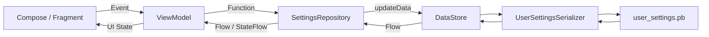

Luồng quan trọng là:

```text
Disk
 ↓
DataStore
 ↓
Flow<UserSettings>
 ↓
Repository
 ↓
ViewModel
 ↓
StateFlow
 ↓
Compose UI
```

DataStore trở thành một **nguồn dữ liệu bền vững** cho settings thay vì giữ thêm một bản sao `MutableStateFlow` thủ công trong Repository.

---

# 5. Protocol Buffers đóng vai trò gì?

Protocol Buffers là cơ chế serialization dữ liệu có schema. Bạn định nghĩa cấu trúc dữ liệu một lần trong `.proto`, sau đó compiler sinh code hỗ trợ xây dựng, đọc và serialize object. ([Android Developers][2])

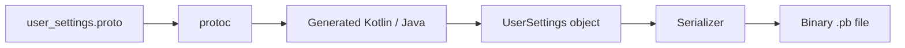

Điểm quan trọng:

```text
.proto
  ↓
protoc
  ↓
Generated source code
  ↓
Typed object
  ↓
Proto DataStore
```

Đây chính là khác biệt lớn nhất giữa Proto DataStore và Preferences DataStore.

---

# 6. So sánh các giải pháp lưu trữ

| Giải pháp             | Schema | Type-safe | API reactive | Transaction | Phù hợp               |
| --------------------- | -----: | --------: | -----------: | ----------: | --------------------- |
| `SharedPreferences`   |      ❌ |         ❌ |      Hạn chế |           ❌ | Legacy settings       |
| Preferences DataStore |      ❌ |  Một phần |       ✅ Flow |           ✅ | Settings đơn giản     |
| **Proto DataStore**   |      ✅ |         ✅ |       ✅ Flow |           ✅ | Settings có cấu trúc  |
| Room                  |      ✅ |         ✅ |            ✅ |           ✅ | Dataset lớn / quan hệ |

Proto DataStore thích hợp với **dataset nhỏ**. Android lưu ý rằng DataStore không hỗ trợ partial update hay referential integrity; nếu cần các đặc điểm đó hoặc dataset lớn/phức tạp, Room phù hợp hơn. ([Android Developers][1])

### Ví dụ phù hợp với Proto DataStore

```text
UserSettings
├── ThemeMode
├── NotificationsEnabled
├── Language
├── FontScale
├── OnboardingCompleted
└── SortOrder
```

### Không nên dùng Proto DataStore cho

```text
10,000 Products
10,000 Users
Orders
OrderItems
Messages
Relationships
Search queries
Pagination
```

Trường hợp đó nên nghĩ đến Room.

---

# 7. Setup Proto DataStore

Theo tài liệu Android Developers hiện tại, DataStore đang được minh họa với `androidx.datastore:datastore:1.2.1`; phần Protobuf sử dụng plugin `0.9.5`, `protobuf-kotlin-lite:4.32.1` và `protoc:4.32.1`. ([Android Developers][1])

## `build.gradle.kts`

```kotlin
plugins {
    id("com.google.protobuf") version "0.9.5"
}

dependencies {
    implementation("androidx.datastore:datastore:1.2.1")
    implementation("com.google.protobuf:protobuf-kotlin-lite:4.32.1")
}

protobuf {
    protoc {
        artifact = "com.google.protobuf:protoc:4.32.1"
    }

    generateProtoTasks {
        all().forEach { task ->
            task.builtins {
                create("java") {
                    option("lite")
                }

                create("kotlin")
            }
        }
    }
}
```

> Khi áp dụng vào project thực tế, nên quản lý các version này bằng **Version Catalog** thay vì rải version trực tiếp trong nhiều `build.gradle.kts`.

---

# 8. Tạo schema `.proto`

Tạo:

```text
app/src/main/proto/user_settings.proto
```

Ví dụ:

```protobuf
syntax = "proto3";

option java_package = "com.example.app.data.proto";
option java_multiple_files = true;

message UserSettings {

    bool notifications_enabled = 1;

    ThemeMode theme_mode = 2;

    int32 launch_count = 3;

    enum ThemeMode {
        THEME_MODE_UNSPECIFIED = 0;
        SYSTEM = 1;
        LIGHT = 2;
        DARK = 3;
    }
}
```

Mỗi field có một **field number/tag**:

```text
notifications_enabled = 1
theme_mode            = 2
launch_count          = 3
```

Các tag này không đơn giản chỉ là thứ tự hiển thị. Chúng là identifier của field trong binary wire format, vì vậy không được tùy tiện đổi hoặc tái sử dụng sau khi schema đã được phát hành. ([Protobuf][3])

Sau khi tạo schema:

```text
Build
↓
Rebuild Project
↓
Protobuf compiler
↓
UserSettings được sinh ra
```

Android Developers cũng lưu ý rằng object tương ứng được sinh ở compile time từ message trong `.proto`. ([Android Developers][1])

---

# 9. Serializer

DataStore cần biết:

```text
Binary file → UserSettings
UserSettings → Binary file
```

Ta cung cấp logic này bằng `Serializer<T>`.

```kotlin
object UserSettingsSerializer : Serializer<UserSettings> {

    override val defaultValue: UserSettings =
        UserSettings.newBuilder()
            .setNotificationsEnabled(true)
            .setThemeMode(UserSettings.ThemeMode.SYSTEM)
            .setLaunchCount(0)
            .build()

    override suspend fun readFrom(
        input: InputStream
    ): UserSettings {
        try {
            return UserSettings.parseFrom(input)
        } catch (exception: InvalidProtocolBufferException) {
            throw CorruptionException(
                "Cannot read UserSettings proto.",
                exception
            )
        }
    }

    override suspend fun writeTo(
        t: UserSettings,
        output: OutputStream
    ) {
        t.writeTo(output)
    }
}
```

Android yêu cầu `Serializer` cung cấp một `defaultValue`, được dùng khi chưa có dữ liệu trên disk. Lỗi Protobuf không hợp lệ có thể được chuyển thành `CorruptionException`. ([Android Developers][1])

---

# 10. Tạo DataStore

DataStore nên được tạo **một lần** cho mỗi file trong một process.

```kotlin
val Context.userSettingsDataStore: DataStore<UserSettings> by dataStore(
    fileName = "user_settings.pb",
    serializer = UserSettingsSerializer
)
```

Android cảnh báo không tạo nhiều `DataStore` instance cho cùng một file trong cùng process; điều đó có thể dẫn đến `IllegalStateException` và phá vỡ các đảm bảo consistency của DataStore. Kiểu `T` cũng phải immutable. ([Android Developers][1])

Kiến trúc:

```text
Application
    │
    └── DataStore<UserSettings>
            │
            └── user_settings.pb
```

Không nên:

```text
Activity A → DataStore #1 ┐
Activity B → DataStore #2 ├── cùng user_settings.pb ❌
Service    → DataStore #3 ┘
```

---

# 11. Repository — Single Source of Truth

Tạo Repository thay vì để UI truy cập DataStore.

```kotlin
class SettingsRepository(
    private val dataStore: DataStore<UserSettings>
) {

    val settings: Flow<UserSettings> =
        dataStore.data.catch { exception ->

            if (exception is IOException) {
                emit(UserSettingsSerializer.defaultValue)
            } else {
                throw exception
            }
        }

    suspend fun setTheme(
        theme: UserSettings.ThemeMode
    ) {
        dataStore.updateData { current ->
            current.copy {
                themeMode = theme
            }
        }
    }

    suspend fun setNotificationsEnabled(
        enabled: Boolean
    ) {
        dataStore.updateData { current ->
            current.copy {
                notificationsEnabled = enabled
            }
        }
    }

    suspend fun incrementLaunchCount() {
        dataStore.updateData { current ->
            current.copy {
                launchCount = launchCount + 1
            }
        }
    }
}
```

`dataStore.data` cung cấp `Flow<T>`. `updateData()` thực hiện read-modify-write theo transaction và atomic, giúp tránh việc hai update song song tự ghi đè trạng thái theo cách thiếu kiểm soát. ([Android Developers][1])

---

# 12. ViewModel

ViewModel chuyển `Flow` của Repository thành `StateFlow` để UI dễ quan sát.

```kotlin
class SettingsViewModel(
    private val repository: SettingsRepository
) : ViewModel() {

    val settings: StateFlow<UserSettings> =
        repository.settings.stateIn(
            scope = viewModelScope,
            started = SharingStarted.WhileSubscribed(5_000),
            initialValue = UserSettingsSerializer.defaultValue
        )

    fun setTheme(theme: UserSettings.ThemeMode) {
        viewModelScope.launch {
            repository.setTheme(theme)
        }
    }

    fun setNotifications(enabled: Boolean) {
        viewModelScope.launch {
            repository.setNotificationsEnabled(enabled)
        }
    }
}
```

Mô hình lúc này:

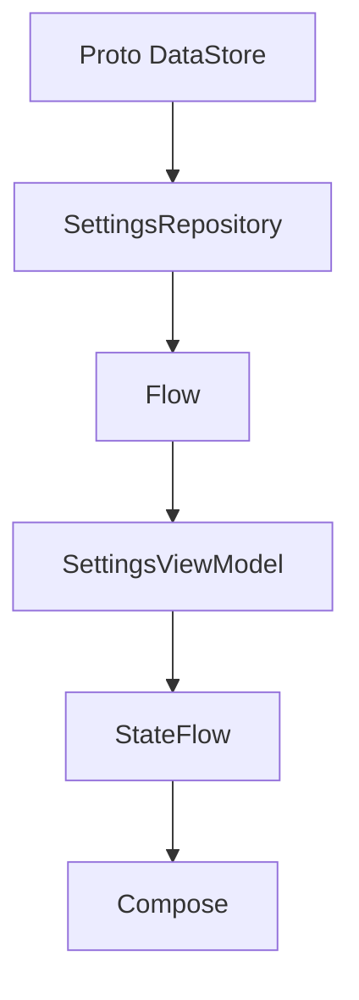

---

# 13. Sử dụng trong Jetpack Compose

```kotlin
@Composable
fun SettingsScreen(
    viewModel: SettingsViewModel
) {
    val settings by
        viewModel.settings.collectAsStateWithLifecycle()

    Column {

        Text(
            text = "Theme: ${settings.themeMode}"
        )

        Switch(
            checked = settings.notificationsEnabled,
            onCheckedChange = viewModel::setNotifications
        )

        Button(
            onClick = {
                viewModel.setTheme(
                    UserSettings.ThemeMode.DARK
                )
            }
        ) {
            Text("Dark mode")
        }
    }
}
```

Android khuyến nghị sử dụng `collectAsStateWithLifecycle()` khi đưa Flow/StateFlow vào Compose để việc collect tuân theo lifecycle của UI. DataStore operation nên nằm trong Repository và ViewModel thay vì Composable. ([Android Developers][1])

---

# 14. Lifecycle và Proto DataStore

Một nhầm lẫn phổ biến là xem DataStore giống `remember`.

Chúng giải quyết những vấn đề hoàn toàn khác nhau.

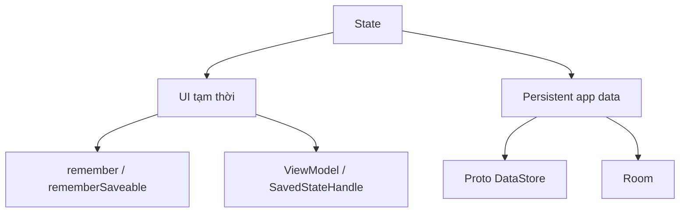

Ví dụ người dùng chọn:

```text
Theme = DARK
```

Sau đó:

```text
rotate
↓
Activity recreation
↓
theme vẫn DARK
```

hoặc:

```text
App bị kill
↓
mở lại app
↓
DataStore đọc user_settings.pb
↓
theme vẫn DARK
```

Proto DataStore là persistent storage nên không phụ thuộc vào lifecycle của riêng Activity. UI chỉ cần subscribe lại vào state khi được recreate.

### Phân biệt nhanh

```text
"Dialog đang mở?"
→ UI state

"Tab hiện tại?"
→ UI/ViewModel state

"Theme người dùng chọn?"
→ DataStore

"Đã hoàn thành onboarding?"
→ DataStore

"10.000 bản ghi sản phẩm?"
→ Room
```

---

# 15. Transactions và concurrency

Giả sử hai coroutine cùng thay đổi settings:

```text
Coroutine A
→ bật notification

Coroutine B
→ tăng launchCount
```

Không nên làm kiểu:

```text
read
modify
write

read
modify
write
```

bằng file API thủ công.

Với DataStore:

```kotlin
dataStore.updateData { current ->
    current.copy {
        launchCount = launchCount + 1
    }
}
```

`updateData()` thực hiện một atomic read-write-modify transaction. Android cũng mô tả rằng các write được serialize trong cấu hình multi-process DataStore. ([Android Developers][1])

---

# 16. Preferences DataStore vs Proto DataStore

## Preferences DataStore

```kotlin
val DARK_MODE =
    booleanPreferencesKey("dark_mode")
```

và đọc:

```kotlin
preferences[DARK_MODE]
```

---

## Proto DataStore

```protobuf
message Settings {
    bool dark_mode = 1;
}
```

và đọc:

```kotlin
settings.darkMode
```

### Khi chọn Preferences DataStore

Ưu tiên khi:

```text
settings rất nhỏ
+
schema thường xuyên thay đổi
+
không cần object phức tạp
```

### Khi chọn Proto DataStore

Ưu tiên khi:

```text
settings có cấu trúc
+
nhiều field liên quan nhau
+
muốn type safety
+
muốn schema rõ ràng
```

Android mô tả Preferences DataStore là key-value không có predefined schema/type safety, trong khi Proto DataStore sử dụng Protocol Buffers để lưu typed object. ([Android Developers][1])

---

# 17. Migration từ SharedPreferences

Đây là một tình huống production rất phổ biến:

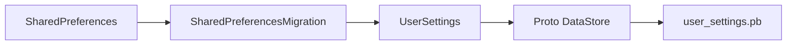

Ví dụ app cũ có:

```text
legacy_preferences

theme = "DARK"
notifications_enabled = true
```

App mới cần chuyển sang:

```protobuf
UserSettings {
    theme_mode: DARK
    notifications_enabled: true
}
```

DataStore cung cấp `SharedPreferencesMigration`; migration nhận dữ liệu SharedPreferences cũ và object Proto hiện tại để tạo object mới. ([Android Developers][2])

Logic có thể hình dung như:

```kotlin
SharedPreferencesMigration(
    context,
    "legacy_preferences"
) { sharedPrefs, currentData ->

    val oldTheme =
        sharedPrefs.getString(
            "theme",
            "SYSTEM"
        )

    currentData.toBuilder()
        .setThemeMode(
            when (oldTheme) {
                "LIGHT" ->
                    UserSettings.ThemeMode.LIGHT

                "DARK" ->
                    UserSettings.ThemeMode.DARK

                else ->
                    UserSettings.ThemeMode.SYSTEM
            }
        )
        .build()
}
```

Sau migration:

```text
Old version
    ↓
SharedPreferences

Update app
    ↓
Migration
    ↓
user_settings.pb

Future reads
    ↓
Proto DataStore
```

---

# 18. Schema evolution — phần rất quan trọng khi release

Giả sử version 1:

```protobuf
message UserSettings {
    bool notifications_enabled = 1;
    ThemeMode theme_mode = 2;
}
```

Version 2 muốn thêm:

```protobuf
int32 launch_count = 3;
```

Đây là hướng thay đổi tự nhiên:

```protobuf
message UserSettings {
    bool notifications_enabled = 1;
    ThemeMode theme_mode = 2;
    int32 launch_count = 3;
}
```

## Không được đổi tag

Không làm:

```protobuf
bool notifications_enabled = 5;
```

nếu trước đây nó là:

```protobuf
bool notifications_enabled = 1;
```

Field number xác định field trong Protobuf wire format và không được đổi sau khi type đã được sử dụng. ([Protobuf][3])

---

## Không tái sử dụng tag đã xóa

Giả sử trước đây:

```protobuf
string username = 4;
```

Sau này bỏ `username`.

Nên:

```protobuf
message UserSettings {

    reserved 4;
    reserved "username";

    bool notifications_enabled = 1;
    ThemeMode theme_mode = 2;
    int32 launch_count = 3;
}
```

Protobuf khuyến nghị reserve tag number của field đã xóa để tránh developer sau này vô tình tái sử dụng nó cho một field khác. ([Protobuf][4])

### Quy tắc cần nhớ

```text
ADD new field
    ✅ new tag

REMOVE field
    ✅ reserve old tag

RENAME field
    ⚠️ đánh giá compatibility

CHANGE field tag
    ❌

REUSE deleted tag
    ❌

CHANGE type tùy tiện
    ❌
```

---

# 19. Xử lý file corruption

File trên disk đôi khi có thể bị corrupt. Theo Android Developers, DataStore mặc định sẽ ném `CorruptionException`; có thể cấu hình corruption handler để thay file hỏng bằng một giá trị mặc định. ([Android Developers][1])

Ví dụ tư duy:

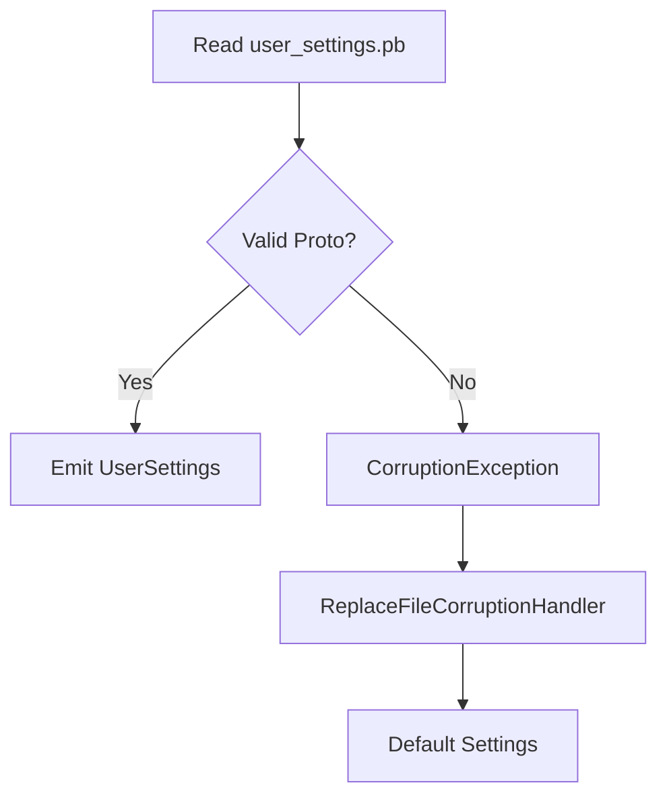

Có thể cấu hình:

```kotlin
ReplaceFileCorruptionHandler {
    UserSettingsSerializer.defaultValue
}
```

Tùy loại dữ liệu, cần quyết định:

```text
Settings corrupt
→ reset về default
```

khác với:

```text
Critical financial data corrupt
→ không nên âm thầm reset
```

---

# 20. Multi-process DataStore

Thông thường Android app chỉ cần single-process DataStore.

Nhưng nếu có:

```xml
<service
    android:name=".SyncService"
    android:process=":sync" />
```

thì Activity và Service có thể chạy ở hai process khác nhau.

Android hỗ trợ multi-process DataStore từ DataStore 1.1.0 và yêu cầu không trộn `SingleProcessDataStore` với `MultiProcessDataStore` trên cùng một file. ([Android Developers][1])

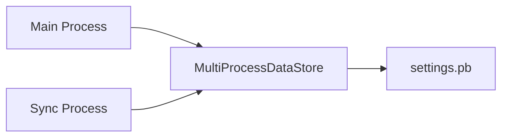

Nếu app bình thường không có component chạy process riêng, **không cần phức tạp hóa kiến trúc bằng MultiProcessDataStore**.

---

# 21. Proto DataStore tác động đến UX như thế nào?

Ví dụ người dùng:

```text
1. Bật Dark Mode
2. Đóng app
3. Mở lại app
```

Nếu chỉ lưu trong:

```kotlin
MutableStateFlow
```

thì:

```text
Dark mode
↓
process chết
↓
state mất
```

Nếu dùng Proto DataStore:

```text
Dark mode
↓
updateData()
↓
settings.pb
↓
app restart
↓
Flow<UserSettings>
↓
UI DARK
```

DataStore cũng tránh kiểu synchronous disk API của `SharedPreferences`, vì API chính được xây dựng quanh coroutines và Flow. ([Android Developers][2])

---

# 22. Proto DataStore và maintainability

Một hệ thống key-value lớn có thể dần trở thành:

```text
"dark_mode"
"darkMode"
"dark-mode"
"theme_dark"
"is_dark"
```

và mỗi module tự hiểu kiểu dữ liệu khác nhau.

Proto tạo một contract:

```protobuf
message UserSettings {
    ThemeMode theme_mode = 1;
}
```

Code sử dụng:

```kotlin
settings.themeMode
```

Nếu schema thay đổi, code generation và compiler giúp phát hiện nhiều lỗi ở compile time thay vì chờ lỗi key/type xuất hiện lúc runtime. Proto DataStore được Android giới thiệu chính để bổ sung schema và strongly typed data cho tình huống này. ([Android Developers][2])

---

# 23. Single Source of Truth

Không nên có:

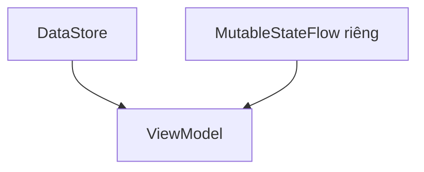

vì có hai nguồn state:

```text
DataStore = DARK
MutableStateFlow = LIGHT
```

UI sẽ không biết state nào đúng.

Thay vào đó:

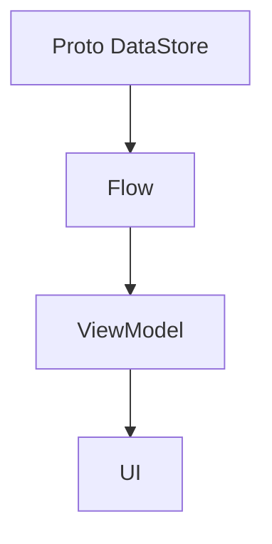

Các thay đổi cũng quay về DataStore:

```text
UI event
 ↓
ViewModel
 ↓
Repository
 ↓
updateData()
 ↓
DataStore
 ↓
Flow
 ↓
UI
```

Đây là vòng state rất phù hợp với **Unidirectional Data Flow**.

---

# 24. Testing Proto DataStore

Nên test ít nhất ba nhóm.

### Test 1 — Write → Read

```text
Given
notifications = false

When
setNotificationsEnabled(true)

Then
DataStore emits
notifications = true
```

### Test 2 — Persistence

```text
Write DARK
 ↓
dispose reader
 ↓
create reader lại với cùng test file
 ↓
read
 ↓
DARK
```

### Test 3 — Migration

```text
Legacy SharedPreferences
theme = DARK
 ↓
migration
 ↓
Proto
themeMode = DARK
```

Ngoài ra nên kiểm tra:

```text
default value
IOException
corrupted proto
concurrent update
schema upgrade
process recreation
```

---

# 25. Debugging checklist

Khi Proto DataStore không hoạt động, kiểm tra theo thứ tự:

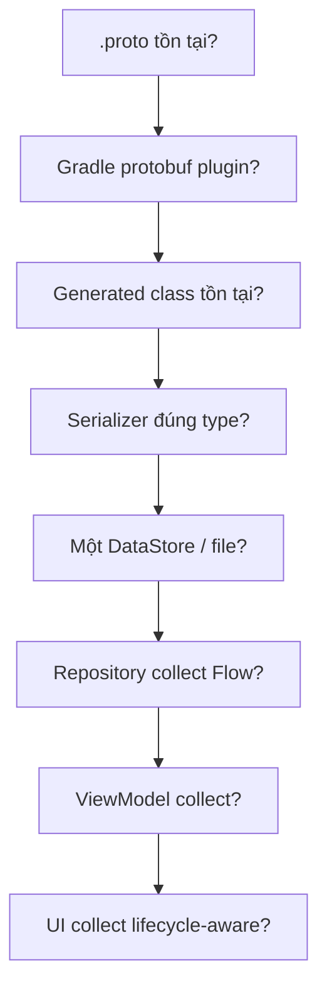

Một số lỗi phổ biến:

```text
Unresolved reference: UserSettings
→ chưa rebuild / protobuf config lỗi

CorruptionException
→ file không parse được

IllegalStateException
→ nhiều DataStore instance cùng file

UI không thay đổi
→ Flow chưa được collect hoặc UI không observe StateFlow

Setting reset khi app mở lại
→ đang giữ state trong ViewModel thay vì persist DataStore
```

---

# 26. Mini project thực hành

## Bài toán

Xây dựng màn hình **App Settings** gồm:

```text
Theme
○ System
○ Light
○ Dark

Notifications
[ ON ]

Launch count
12
```

Schema:

```protobuf
syntax = "proto3";

option java_package = "com.example.settings.proto";
option java_multiple_files = true;

message UserSettings {

    ThemeMode theme_mode = 1;

    bool notifications_enabled = 2;

    int32 launch_count = 3;

    enum ThemeMode {
        THEME_MODE_UNSPECIFIED = 0;
        SYSTEM = 1;
        LIGHT = 2;
        DARK = 3;
    }
}
```

Kiến trúc:

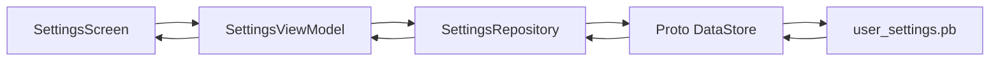

---

# 27. Thực hành trong 32 phút

|  Thời gian | Nội dung                         |
| ---------: | -------------------------------- |
|   0–5 phút | Hiểu Proto DataStore và `.proto` |
|  5–10 phút | Configure Gradle + Protobuf      |
| 10–15 phút | Tạo `UserSettings.proto`         |
| 15–20 phút | Tạo Serializer + DataStore       |
| 20–25 phút | Repository + `updateData()`      |
| 25–29 phút | ViewModel + Compose              |
| 29–32 phút | Test restart + checklist release |

Mục tiêu cuối buổi:

```text
Change setting
↓
Kill app
↓
Open app
↓
Setting vẫn còn
```

---

# 28. Bài tập

Xây dựng một `UserSettings.proto` hỗ trợ:

```text
Theme
Language
Notifications
Font Size
Onboarding Completed
```

Sau đó triển khai:

```text
.proto
  ↓
Serializer
  ↓
DataStore
  ↓
Repository
  ↓
ViewModel
  ↓
Compose
```

Yêu cầu:

* Không đọc DataStore trực tiếp trong Composable.
* Không tạo nhiều DataStore cho cùng file.
* Sử dụng `Flow`.
* Ghi bằng `updateData()`.
* Test process/app restart.
* Có ít nhất một enum.
* Có default settings.
* Viết README giải thích kiến trúc.

---

# 29. Bài tập nâng cao — Migration

App version `1.0` sử dụng:

```text
SharedPreferences

dark_mode = true
notifications = false
```

Version `2.0` chuyển sang:

```protobuf
message UserSettings {
    ThemeMode theme_mode = 1;
    bool notifications_enabled = 2;
}
```

Viết migration sao cho:

```text
dark_mode = true
↓
ThemeMode.DARK

notifications = false
↓
notifications_enabled = false
```

Sau migration:

```text
SharedPreferences
      ↓
migration
      ↓
Proto DataStore
      ↓
UI
```

---

# 30. Release checklist

Proto DataStore là local storage nên thay đổi schema cũng là một phần cần xem xét trong release.

| Hạng mục            | Owner       | Verification         | Rollback / Risk          |
| ------------------- | ----------- | -------------------- | ------------------------ |
| `.proto` schema     | Android Dev | Build generated code | Không đổi tag cũ         |
| Migration           | Android Dev | Upgrade test         | Giữ compatibility        |
| Serializer          | Android Dev | Read/write test      | Default fallback         |
| Corruption handling | Android Dev | Corrupt-file test    | Reset có kiểm soát       |
| UI state            | Android Dev | Kill/restart app     | Không mất preference     |
| Schema evolution    | Team        | Review `.proto` diff | Reserve tag đã xóa       |
| Multi-process       | Android Dev | Process test         | Không mix DataStore type |

### Trước khi release

```text
□ Có đổi `.proto` không?
□ Có đổi field number không?
□ Có xóa field không?
□ Tag đã xóa có `reserved` chưa?
□ Có migration từ version cũ không?
□ Upgrade từ production version hiện tại đã test chưa?
□ Default value có hợp lý không?
□ File corrupt sẽ xử lý thế nào?
□ App có nhiều process không?
□ Settings còn đúng sau process death không?
```

Quy tắc không tái sử dụng tag và nên reserve tag đã xóa là đặc biệt quan trọng cho schema evolution. ([Protobuf][3])

---

# 31. Artifact để đưa vào portfolio

Một artifact tốt cho bài này có thể là:

```text
proto-datastore-demo/
├── README.md
├── screenshots/
│   └── settings-screen.png
├── diagrams/
│   └── architecture.md
└── app/
    └── src/main/
        ├── proto/
        │   └── user_settings.proto
        └── java/.../
            ├── UserSettingsSerializer.kt
            ├── SettingsRepository.kt
            ├── SettingsViewModel.kt
            └── SettingsScreen.kt
```

README nên giải thích:

```text
Problem
↓
Why Proto DataStore
↓
Schema
↓
Architecture
↓
Read / Write Flow
↓
Migration strategy
↓
Testing
↓
Release risks
```

---

# 32. Câu hỏi phỏng vấn nhanh

### Proto DataStore khác Preferences DataStore ở đâu?

Preferences DataStore lưu dữ liệu theo key-value và không cần predefined schema. Proto DataStore sử dụng schema Protobuf và cung cấp typed object. ([Android Developers][1])

### Proto DataStore khác Room ở đâu?

DataStore phù hợp cho dataset nhỏ, chẳng hạn settings. Room phù hợp hơn khi dữ liệu lớn/phức tạp, cần partial update hoặc referential integrity. ([Android Developers][1])

### Đọc Proto DataStore bằng gì?

```kotlin
DataStore.data
```

trả về:

```kotlin
Flow<T>
```

([Android Developers][1])

### Ghi Proto DataStore bằng gì?

```kotlin
updateData { ... }
```

và update được thực hiện transactionally. ([Android Developers][1])

### Có nên gọi DataStore trực tiếp từ Compose không?

Không nên. Android khuyến nghị để DataStore trong data layer/Repository, expose qua ViewModel rồi collect lifecycle-aware ở UI. ([Android Developers][1])

### Có thể tạo hai DataStore cho cùng file không?

Không nên. Android yêu cầu tránh nhiều DataStore instance cùng file trong một process. ([Android Developers][1])

---

# 33. Mental model cuối bài

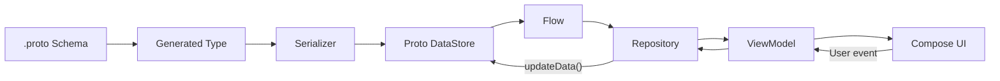

Có thể ghi nhớ Proto DataStore bằng một dòng:

```text
.proto
→ generated typed object
→ Serializer
→ DataStore
→ Flow
→ Repository
→ ViewModel
→ UI
```

---

# 34. Checklist hoàn thành

* [ ] Giải thích được Proto DataStore.
* [ ] Biết Proto DataStore khác Preferences DataStore.
* [ ] Biết khi nào nên dùng Room thay thế.
* [ ] Tạo được file `.proto`.
* [ ] Hiểu field number/tag.
* [ ] Tạo được `Serializer`.
* [ ] Tạo một `DataStore<T>`.
* [ ] Đọc dữ liệu qua `Flow`.
* [ ] Ghi dữ liệu bằng `updateData()`.
* [ ] Đặt DataStore trong Repository.
* [ ] Expose state qua ViewModel.
* [ ] Collect bằng `collectAsStateWithLifecycle()`.
* [ ] Hiểu lifecycle/process death.
* [ ] Hiểu migration từ SharedPreferences.
* [ ] Không thay đổi hoặc tái sử dụng Proto tag tùy tiện.
* [ ] Biết reserve tag khi xóa field.
* [ ] Có kế hoạch xử lý corrupted data.
* [ ] Biết lưu ý về multi-process.
* [ ] Có test write/read/restart.
* [ ] Có artifact nhỏ cho portfolio.

---

# 35. Ghi chú production

Khi đưa Proto DataStore vào production, hãy tự hỏi:

```text
Dữ liệu này thực sự là settings nhỏ
hay nên nằm trong Room?

        ↓

DataStore có phải Single Source of Truth không?

        ↓

Có migration từ version hiện tại không?

        ↓

Schema .proto có backward-compatible không?

        ↓

Có ai đổi/reuse field number không?

        ↓

Process death có làm UX thay đổi không?

        ↓

Corrupted file xử lý thế nào?

        ↓

Có nhiều process cùng truy cập file không?

        ↓

Upgrade từ production build cũ đã được test chưa?
```

Đặc biệt, **schema `.proto` nên được xem giống một persistence contract**. Một thay đổi tưởng như nhỏ về tag hoặc type có thể trở thành release risk, vì Protobuf dùng field number để xác định dữ liệu trên wire/disk. ([Protobuf][3])

---

## Kết luận

**Proto DataStore** phù hợp khi ứng dụng cần lưu một tập dữ liệu nhỏ nhưng có cấu trúc rõ ràng, chẳng hạn user settings hoặc feature configuration. Điểm mạnh chính của nó là kết hợp **schema Protobuf, type safety, Flow, coroutine và transactional update** trong data layer của Android. ([Android Developers][5])

Công thức cần nhớ:

```text
Proto DataStore
=
Small persistent data
+
Typed schema
+
Flow
+
Transactional update
+
Repository
+
Safe schema evolution
```

**Bài tiếp theo hợp lý trong Module 06:** sau `SharedPreferences → DataStore → Preferences DataStore → Proto DataStore`, nên chuyển sang nhóm **Files / Internal Storage / External Storage** để tiếp tục phần Storage.

[1]: https://developer.android.com/topic/libraries/architecture/datastore "App Architecture: Data Layer - DataStore - Android Developers  |  App architecture"
[2]: https://developer.android.com/codelabs/android-proto-datastore "Working with Proto DataStore  |  Android Developers"
[3]: https://protobuf.dev/programming-guides/proto3/?utm_source=chatgpt.com "Language Guide (proto 3) | Protocol Buffers Documentation"
[4]: https://protobuf.dev/best-practices/dos-donts/?utm_source=chatgpt.com "Proto Best Practices"
[5]: https://developer.android.com/jetpack/androidx/releases/datastore "DataStore  |  Jetpack  |  Android Developers"
