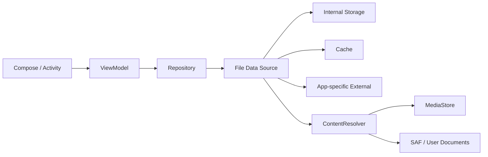
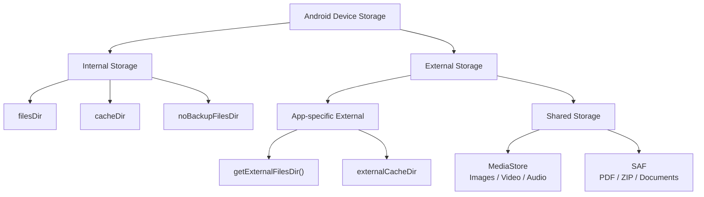
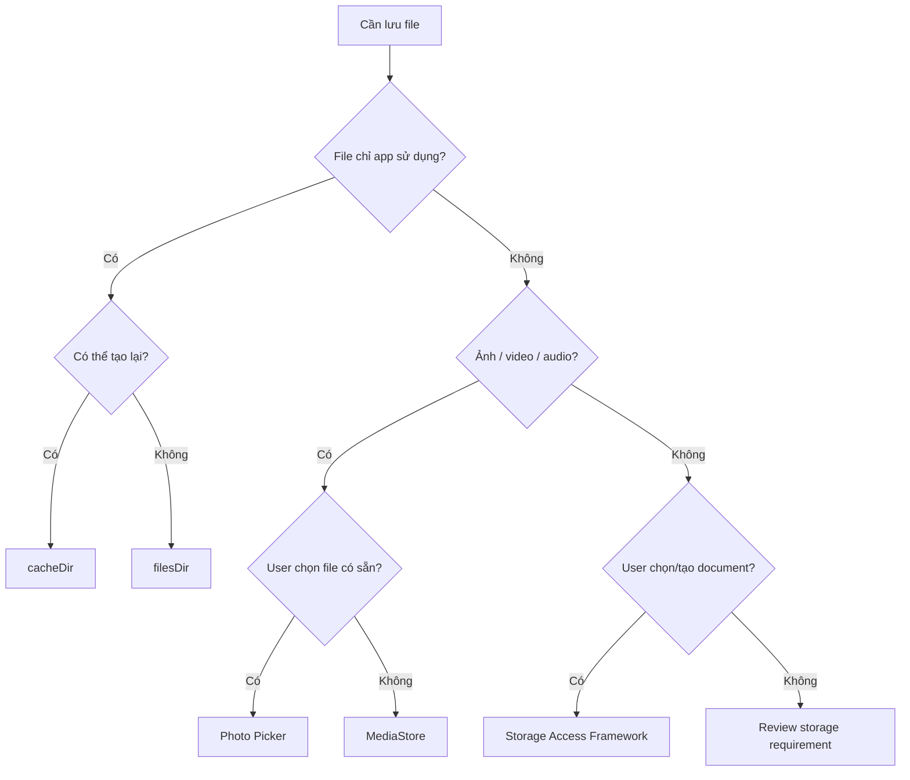
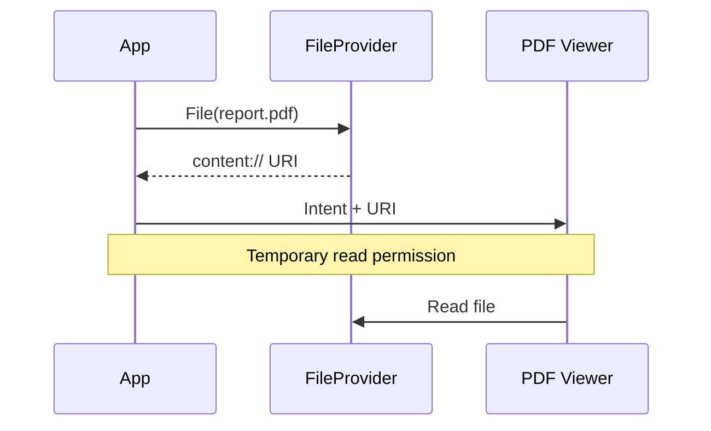
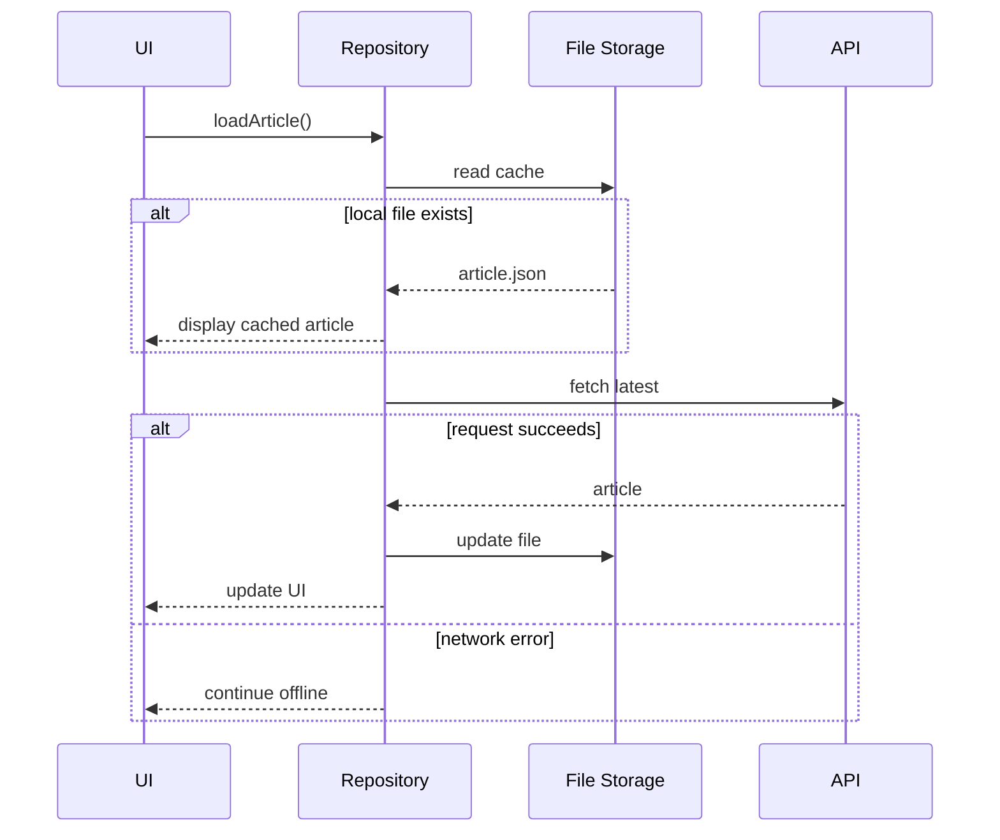
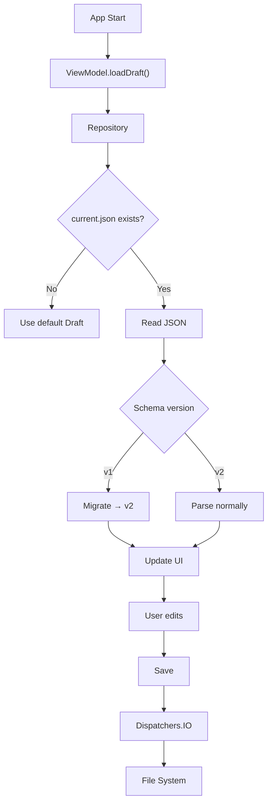

[](https://developer.datalogic.com/mobile-computers/news/scoped_storage_on_android_11?utm_source=chatgpt.com)

# 005 - File System

**Học phần:** 03 - Architecture, State and Data
**Module:** Module 06 - Storage
**Nhóm nội dung:** Preferences and Files
**Nguồn roadmap:** Storage / Preferences and Files
**Loại bài:** Storage
**Thứ tự trong module:** 005
**Thời lượng gợi ý:** 32 phút

---

## 1. Tóm tắt

Trong Android, **File System** là cách ứng dụng lưu và truy cập dữ liệu dưới dạng **file và directory** trên thiết bị.

Ví dụ:

* file JSON;
* file TXT;
* ảnh;
* video;
* PDF;
* file tải xuống;
* cache;
* file cấu hình;
* file model AI;
* file log;
* file người dùng chọn từ thiết bị.

Điểm quan trọng là Android **không cho ứng dụng tự do truy cập toàn bộ filesystem** như một ứng dụng desktop thông thường. Android chia storage thành nhiều phạm vi với quyền truy cập khác nhau. Với các ứng dụng hiện đại, **Scoped Storage** giới hạn quyền truy cập vào external/shared storage nhằm bảo vệ dữ liệu người dùng và dữ liệu của ứng dụng khác. ([Android Developers][1])

Sau bài này, anh nên trả lời được câu hỏi:

> **File của tôi thuộc về app hay thuộc về user? Có cần tồn tại sau khi uninstall không? Có cần app khác truy cập không?**

Ba câu hỏi đó gần như quyết định API storage mà ứng dụng nên sử dụng.

---

# 2. Mục tiêu học tập

Sau bài học, anh có thể:

* Giải thích được File System trong Android.
* Phân biệt:

  * Internal app-specific storage;
  * Internal cache;
  * External app-specific storage;
  * Shared storage.
* Hiểu `filesDir`, `cacheDir`, `getExternalFilesDir()`.
* Biết khi nào dùng `File`.
* Biết khi nào nên dùng `ContentResolver`.
* Hiểu vai trò của:

  * `MediaStore`;
  * Storage Access Framework;
  * Photo Picker;
  * `FileProvider`.
* Hiểu **Scoped Storage**.
* Đọc và ghi file bằng Kotlin.
* Đưa thao tác file ra khỏi Main Thread.
* Xử lý:

  * file không tồn tại;
  * file lỗi;
  * storage đầy;
  * schema file cũ.
* Biết file ảnh hưởng thế nào tới:

  * lifecycle;
  * UI state;
  * offline mode;
  * backup;
  * testing;
  * release.

---

# 3. File System nằm ở đâu trong kiến trúc Android?

Một kiến trúc phổ biến:



Điểm quan trọng:

> UI không nên trực tiếp chứa toàn bộ logic `File(...)`, đọc stream, parse JSON hoặc xử lý `IOException`.

Thay vào đó, File System thường nằm ở **Data Layer**.

Ví dụ:

```text
UI
↓
ViewModel
↓
Repository
↓
DraftFileDataSource
↓
filesDir/drafts/draft.json
```

Cách tổ chức này làm cho code dễ test và dễ thay storage implementation hơn.

---

# 4. Mental Model: Storage của Android

Có thể hình dung storage Android như sau:



Android cung cấp cả vùng **app-specific** và vùng **shared storage**. File trong app-specific storage thường bị xóa khi ứng dụng được uninstall, trong khi shared storage thích hợp cho nội dung mà người dùng kỳ vọng vẫn còn sau khi gỡ app. ([Android Developers][2])

---

# 5. Internal Storage

## 5.1 `filesDir`

Đây là nơi lưu **persistent app-specific files**.

```kotlin
val file = File(context.filesDir, "profile.json")
```

Hoặc:

```kotlin
context.openFileOutput(
    "profile.json",
    Context.MODE_PRIVATE
).use { output ->
    output.write("Hello Android".toByteArray())
}
```

File trong internal app-specific storage:

* chỉ thuộc phạm vi ứng dụng;
* không cần storage permission;
* bị xóa khi uninstall;
* phù hợp cho dữ liệu ứng dụng không cần app khác trực tiếp truy cập. ([Android Developers][2])

Ví dụ:

```text
/data/user/0/com.example.app/files/
```

Anh **không nên hard-code path này**. Hãy dùng:

```kotlin
context.filesDir
```

---

## 5.2 Khi nào dùng `filesDir`?

Ví dụ:

```text
files/
├── drafts/
│   └── current.json
├── models/
│   └── classifier.tflite
├── config/
│   └── remote_config.json
└── offline/
    └── article_102.json
```

Phù hợp với:

* file JSON offline;
* draft;
* tài nguyên download mà chỉ app sử dụng;
* file cấu hình;
* model ML;
* export trung gian;
* dữ liệu không cần user nhìn thấy trong Files app.

---

# 6. `cacheDir`

Cache khác persistent file.

```kotlin
val file = File(context.cacheDir, "thumbnail_123.jpg")
```

Ví dụ cấu trúc:

```text
cache/
├── thumbnails/
├── network/
├── temporary/
└── image_processing/
```

Cache chỉ nên chứa dữ liệu **có thể tạo lại**.

Android có thể xóa cache khi thiết bị thiếu dung lượng; ứng dụng vì vậy phải luôn xử lý trường hợp cache file biến mất. Android cũng khuyến nghị ứng dụng chủ động quản lý cache thay vì hoàn toàn dựa vào hệ điều hành dọn dẹp. ([Android Developers][2])

### Ví dụ

Sai:

```text
cache/
└── user's_only_copy_of_document.pdf
```

Nếu file mất → người dùng mất dữ liệu.

Đúng:

```text
cache/
└── thumbnail_document_123.webp
```

Mất file → generate thumbnail lại.

---

# 7. `noBackupFilesDir`

Một lựa chọn khác:

```kotlin
val file = File(
    context.noBackupFilesDir,
    "device_specific.json"
)
```

`filesDir` và `getExternalFilesDir()` nằm trong các vùng có thể được Android Auto Backup xử lý mặc định, trong khi `cacheDir` và `noBackupFilesDir` bị loại khỏi Auto Backup. ([Android Developers][3])

Vì vậy:

```text
Muốn persistent + có thể backup
             ↓
         filesDir

Muốn persistent nhưng không nên backup
             ↓
     noBackupFilesDir

Có thể tạo lại
             ↓
         cacheDir
```

---

# 8. External App-specific Storage

Android còn cung cấp một vùng external storage chỉ dành riêng cho app:

```kotlin
val directory = context.getExternalFilesDir(null)

val file = File(
    directory,
    "large_model.bin"
)
```

Hoặc:

```kotlin
val imageDirectory =
    context.getExternalFilesDir(
        Environment.DIRECTORY_PICTURES
    )
```

Trên Android 4.4/API 19 trở lên, ứng dụng không cần storage permission để truy cập app-specific external directories. Các file tại đây cũng bị xóa khi ứng dụng được uninstall. External storage có thể không luôn khả dụng, ví dụ removable volume bị tháo khỏi thiết bị. ([Android Developers][4])

---

# 9. Internal vs External App-specific Storage

| Tiêu chí          | Internal                   | App-specific External                  |
| ----------------- | -------------------------- | -------------------------------------- |
| API               | `filesDir`                 | `getExternalFilesDir()`                |
| App khác truy cập | Không                      | Bị giới hạn                            |
| Permission        | Không                      | Không với API 19+                      |
| Xóa khi uninstall | Có                         | Có                                     |
| Độ tin cậy        | Cao                        | External volume có thể không available |
| Dùng cho          | dữ liệu quan trọng của app | file app-specific lớn/media            |

([Android Developers][2])

### Quy tắc đơn giản

Nếu dữ liệu rất quan trọng với chức năng ứng dụng:

```text
Internal Storage
```

thường là lựa chọn dễ kiểm soát hơn.

---

# 10. Shared Storage

Giả sử ứng dụng camera tạo:

```text
summer_trip.jpg
```

Người dùng kỳ vọng:

> "Gỡ ứng dụng camera thì ảnh của tôi vẫn phải còn."

Đó là dấu hiệu file **không nên nằm trong app-specific storage**.

Android khuyến nghị shared storage cho dữ liệu mà người dùng cần truy cập ngoài ứng dụng hoặc muốn tồn tại độc lập sau khi uninstall. ([Android Developers][5])

Shared storage có thể chứa:

```text
Images
Videos
Audio
Downloads
PDF
Documents
...
```

Nhưng app hiện đại không nên nghĩ:

```text
File("/sdcard/anything")
```

mà nên nghĩ:

```text
Media → MediaStore

Document → Storage Access Framework

Selected photo/video → Photo Picker
```

---

# 11. Scoped Storage

Đây là một trong những phần quan trọng nhất.

Trước đây, Android app có thể xin storage permission và truy cập rất rộng vào external storage.

Android 10 đưa vào **Scoped Storage** và Android 11 tăng cường việc thực thi mô hình này. Các app target Android 11 trở lên không thể sử dụng `requestLegacyExternalStorage` để quay lại mô hình legacy. ([Android Developers][6])

Ý tưởng:

```text
App A
│
├── App A storage        ✅
├── Media mà app được phép truy cập
├── Document user chọn   ✅
│
├── App B private data   ❌
└── Toàn bộ filesystem   ❌ mặc định
```

---

# 12. Quy tắc chọn API

Đây là sơ đồ quan trọng nhất của bài.



---

# 13. MediaStore

Nếu ứng dụng tạo nội dung media người dùng sở hữu, chẳng hạn:

```text
photo.jpg
video.mp4
song.mp3
```

thì `MediaStore` là API chính để tương tác với các media collection trong shared storage. Android khuyến nghị sử dụng MediaStore thay cho việc cố truy cập tùy ý các raw filesystem path trong nhiều shared-media use case. ([Android Developers][7])

Ví dụ conceptual:

```kotlin
val values = ContentValues().apply {
    put(MediaStore.Images.Media.DISPLAY_NAME, "photo.jpg")
    put(MediaStore.Images.Media.MIME_TYPE, "image/jpeg")
}

val uri = context.contentResolver.insert(
    MediaStore.Images.Media.EXTERNAL_CONTENT_URI,
    values
)
```

Ở đây:

```text
File path
```

không còn là abstraction chính.

Thay vào đó:

```text
content://...
```

và:

```kotlin
ContentResolver
```

trở thành trung tâm.

---

# 14. Photo Picker

Nếu ứng dụng chỉ cần:

> "Cho user chọn một ảnh avatar."

đừng mặc định xin quyền đọc cả gallery.

Android cung cấp **Photo Picker**, cho phép user cấp quyền truy cập vào các ảnh/video cụ thể thay vì toàn bộ thư viện. AndroidX Activity cung cấp `PickVisualMedia` và `PickMultipleVisualMedia`; trên thiết bị không hỗ trợ Photo Picker, thư viện có thể fallback sang `ACTION_OPEN_DOCUMENT`.

Ví dụ Compose:

```kotlin
val pickMedia = rememberLauncherForActivityResult(
    contract = ActivityResultContracts.PickVisualMedia()
) { uri ->

    if (uri != null) {
        // Handle selected image
    }
}
```

Mở picker:

```kotlin
pickMedia.launch(
    PickVisualMediaRequest(
        ActivityResultContracts
            .PickVisualMedia
            .ImageOnly
    )
)
```

Flow:

```text
App
 ↓
Photo Picker
 ↓
User selects one photo
 ↓
content:// URI
 ↓
App accesses selected photo
```

---

# 15. Storage Access Framework — SAF

Không phải file nào cũng là ảnh/video.

Ví dụ app cần:

```text
Import PDF
Import ZIP
Open JSON
Export TXT
Choose backup directory
```

Storage Access Framework cho phép user chọn document hoặc storage provider thông qua UI do hệ thống cung cấp. SAF hỗ trợ cả local storage và document providers như cloud storage. ([Android Developers][8])

Ba action quan trọng:

```text
ACTION_OPEN_DOCUMENT
ACTION_CREATE_DOCUMENT
ACTION_OPEN_DOCUMENT_TREE
```

### `ACTION_OPEN_DOCUMENT`

User chọn file:

```text
App
 ↓
System file picker
 ↓
report.pdf
 ↓
content:// URI
```

### `ACTION_CREATE_DOCUMENT`

App muốn user chọn nơi lưu:

```text
Export report
       ↓
ACTION_CREATE_DOCUMENT
       ↓
User chọn folder/name
       ↓
App ghi dữ liệu
```

### `ACTION_OPEN_DOCUMENT_TREE`

User cho ứng dụng truy cập một directory được chọn. API này có từ Android 5.0/API 21. ([Android Developers][8])

---

# 16. `File` vs `Uri`

Đây là một lỗi tư duy phổ biến.

## App-specific

Anh thường có:

```kotlin
File
```

Ví dụ:

```kotlin
File(context.filesDir, "profile.json")
```

---

## Shared/user-selected content

Anh thường có:

```kotlin
Uri
```

Ví dụ:

```text
content://com.android.providers...
```

và sử dụng:

```kotlin
context.contentResolver
    .openInputStream(uri)
```

Ví dụ:

```kotlin
context.contentResolver
    .openInputStream(uri)
    ?.bufferedReader()
    ?.use { reader ->

        val text = reader.readText()
    }
```

Mental model:

```text
App-owned file
     ↓
    File

User/provider-owned file
     ↓
    Uri
     ↓
ContentResolver
```

---

# 17. FileProvider

Giả sử ứng dụng có:

```text
filesDir/report.pdf
```

và muốn mở PDF bằng app khác.

Không nên đưa trực tiếp:

```text
file:///data/user/0/.../report.pdf
```

`FileProvider` cung cấp cách chia sẻ file bằng `content://` URI và cấp quyền truy cập tạm thời cho ứng dụng nhận. Đây là cơ chế bảo mật hơn so với chia sẻ raw `file://` URI. ([Android Developers][9])

Flow:



---

# 18. Ví dụ cơ bản: ghi file

Giả sử app có tính năng **offline draft**.

Model:

```kotlin
data class Draft(
    val title: String,
    val content: String
)
```

Ta lưu:

```text
files/
└── drafts/
    └── current.txt
```

---

## 18.1 Data Source

```kotlin
class DraftFileDataSource(
    context: Context
) {

    private val directory =
        File(context.filesDir, "drafts").apply {
            mkdirs()
        }

    private val draftFile =
        File(directory, "current.txt")

    fun save(content: String) {
        draftFile.writeText(content)
    }

    fun read(): String? {
        if (!draftFile.exists()) {
            return null
        }

        return draftFile.readText()
    }

    fun delete(): Boolean {
        return draftFile.delete()
    }
}
```

Đây là implementation đơn giản nhất để hiểu concept.

---

# 19. Không thao tác file nặng trên Main Thread

File I/O có thể mất thời gian.

Repository nên chuyển I/O work sang:

```kotlin
Dispatchers.IO
```

Ví dụ:

```kotlin
class DraftRepository(
    private val dataSource: DraftFileDataSource
) {

    suspend fun saveDraft(
        content: String
    ) = withContext(Dispatchers.IO) {

        dataSource.save(content)
    }

    suspend fun loadDraft(): String? =
        withContext(Dispatchers.IO) {

            dataSource.read()
        }
}
```

Architecture:

```text
Compose
   ↓
ViewModel
   ↓ coroutine
Repository
   ↓ Dispatchers.IO
FileDataSource
   ↓
File System
```

---

# 20. Kết nối với ViewModel

```kotlin
data class EditorUiState(
    val content: String = "",
    val isLoading: Boolean = false,
    val error: String? = null
)
```

ViewModel:

```kotlin
class EditorViewModel(
    private val repository: DraftRepository
) : ViewModel() {

    private val _uiState =
        MutableStateFlow(EditorUiState())

    val uiState =
        _uiState.asStateFlow()

    fun loadDraft() {

        viewModelScope.launch {

            _uiState.update {
                it.copy(isLoading = true)
            }

            runCatching {
                repository.loadDraft()
            }.onSuccess { draft ->

                _uiState.update {
                    it.copy(
                        content = draft.orEmpty(),
                        isLoading = false
                    )
                }

            }.onFailure { error ->

                _uiState.update {
                    it.copy(
                        isLoading = false,
                        error = error.message
                    )
                }
            }
        }
    }
}
```

---

# 21. File System và Lifecycle

File trên disk và UI state là hai thứ khác nhau.

Ví dụ:

```text
File System
current.txt
     ↓
persistent storage

ViewModel
EditorUiState
     ↓
runtime state

Compose
TextField
     ↓
UI
```

Rotate màn hình không tự làm mất file.

Nhưng nếu app process bị kill:

```text
ViewModel → mất
RAM → mất
File → vẫn tồn tại
```

Khi app được mở lại:

```text
File
 ↓
Repository
 ↓
ViewModel
 ↓
UiState
 ↓
Compose
```

Vì vậy storage và lifecycle bổ trợ cho nhau chứ không thay thế nhau.

---

# 22. Xử lý file không tồn tại

Không nên:

```kotlin
file.readText()
```

rồi giả định file luôn tồn tại.

Có thể:

```kotlin
if (!file.exists()) {
    return ""
}

return file.readText()
```

Hoặc:

```kotlin
return runCatching {
    file.readText()
}.getOrDefault("")
```

Một ứng dụng thực tế cần coi:

```text
FileNotFound
```

là một state bình thường có thể xảy ra.

---

# 23. Xử lý lỗi storage

Các lỗi nên suy nghĩ tới:

```text
File không tồn tại
Storage đầy
Permission/URI grant hết hạn
External storage unavailable
File bị corrupt
Unsupported format
IOException
User xóa file
User hủy file picker
```

State tốt:

```kotlin
sealed interface FileResult {

    data class Success(
        val content: String
    ) : FileResult

    data object NotFound : FileResult

    data object Corrupted : FileResult

    data class Error(
        val throwable: Throwable
    ) : FileResult
}
```

---

# 24. Migration của file

File JSON cũng có schema.

Version 1:

```json
{
  "content": "Hello"
}
```

Version 2:

```json
{
  "version": 2,
  "title": "Draft",
  "content": "Hello"
}
```

Một migration đơn giản:

```kotlin
fun parseDraft(
    json: JSONObject
): Draft {

    val version =
        json.optInt("version", 1)

    return when (version) {

        1 -> Draft(
            title = "Untitled",
            content =
                json.optString("content")
        )

        2 -> Draft(
            title =
                json.optString("title"),
            content =
                json.optString("content")
        )

        else -> {
            throw IllegalArgumentException(
                "Unsupported file version"
            )
        }
    }
}
```

Mental model:

```text
Old file
version = 1
     ↓
Migration
     ↓
Current model
version = 2
```

Đây là lý do ngay cả File System cũng cần nghĩ về migration.

---

# 25. Khi nào dùng File System, DataStore hay Room?

Một quy tắc thực hành:

| Dữ liệu                         | Công cụ phù hợp          |
| ------------------------------- | ------------------------ |
| Theme mode                      | DataStore                |
| Language setting                | DataStore                |
| Feature preference              | DataStore                |
| Hàng nghìn entities cần query   | Room                     |
| User / Product / Message tables | Room                     |
| PDF                             | File System              |
| Image                           | File System / MediaStore |
| Video                           | File System / MediaStore |
| JSON document                   | File System              |
| Downloaded ML model             | File System              |
| Temporary thumbnail             | Cache                    |
| User-selected PDF               | SAF                      |
| Selected avatar                 | Photo Picker             |

Room là abstraction được Android khuyến nghị cho local structured database thay vì dùng SQLite API trực tiếp. ([Android Developers][10])

Một cách nhớ:

```text
Preference
   ↓
DataStore

Structured Records
   ↓
Room

Blob / Document / Media / File
   ↓
File System
```

---

# 26. File System và offline-first

Ví dụ app đọc bài viết từ server.



File System có thể là một thành phần của chiến lược offline, nhưng nếu dữ liệu cần query/filter/update phức tạp thì database thường thích hợp hơn.

---

# 27. Cache strategy

Không nên cache vô hạn.

Ví dụ:

```text
cache/
├── image_001.webp
├── image_002.webp
├── image_003.webp
├── ...
└── image_90000.webp
```

Production app nên cân nhắc:

```text
Cache max size
      +
Expiration
      +
LRU strategy
      +
Cleanup
```

Android có thể xóa cache khi thiếu internal storage, nên app phải xem cache là dữ liệu có thể tái tạo. ([Android Developers][2])

---

# 28. Kiểm tra dung lượng

Khi ghi file lớn:

```text
AI model
2 GB video
Offline maps
Large archive
```

anh phải nghĩ tới:

```text
Có đủ storage không?
```

Android cung cấp `StorageManager` APIs như `getAllocatableBytes()` để kiểm tra lượng storage app có thể phân bổ. Một chiến lược khác được tài liệu Android đề cập là thử ghi và xử lý `IOException` khi thao tác thất bại. ([Android Developers][2])

---

# 29. `MANAGE_EXTERNAL_STORAGE`

Có permission:

```xml
android.permission.MANAGE_EXTERNAL_STORAGE
```

nhưng:

> Không nên xem đây là cách "tắt Scoped Storage".

Android dành all-files access cho một số use case thực sự cần truy cập rộng như file manager, backup/restore hoặc một số loại ứng dụng tương tự. Hầu hết app thông thường nên sử dụng MediaStore, SAF hoặc app-specific storage thay vì yêu cầu quyền này. ([Android Developers][11])

Ví dụ:

```text
Avatar app
❌ MANAGE_EXTERNAL_STORAGE

Photo editor
❌ thường không cần

PDF reader
❌ thường có thể dùng SAF

File manager
✅ có thể có use case hợp lệ
```

---

# 30. Anti-patterns cần tránh

## Anti-pattern 1

```kotlin
File("/sdcard/myapp/data.json")
```

### Thay bằng

```kotlin
File(
    context.filesDir,
    "data.json"
)
```

hoặc API shared-storage phù hợp.

---

## Anti-pattern 2

Xin quyền truy cập rộng chỉ để:

```text
Chọn một avatar
```

### Thay bằng

```text
Photo Picker
```

---

## Anti-pattern 3

Lưu dữ liệu quan trọng vào:

```kotlin
cacheDir
```

---

## Anti-pattern 4

Thực hiện:

```kotlin
largeFile.readBytes()
```

trực tiếp trên Main Thread.

---

## Anti-pattern 5

UI tự gọi:

```text
File
InputStream
OutputStream
JSONObject
```

ở khắp nơi.

### Tốt hơn

```text
UI
 ↓
ViewModel
 ↓
Repository
 ↓
FileDataSource
```

---

## Anti-pattern 6

Share trực tiếp:

```text
file://...
```

### Tốt hơn

```text
FileProvider
 ↓
content://...
```

`FileProvider` hỗ trợ cấp quyền tạm thời trên content URI thay vì phải mở quyền của raw filesystem file. ([Android Developers][9])

---

# 31. Thực hành — Offline Draft

## Yêu cầu

Xây dựng:

```text
Simple Note Editor
```

UI:

```text
┌──────────────────────────────┐
│ Offline Draft                │
│                              │
│ Title                        │
│ [Android File System      ]  │
│                              │
│ Content                      │
│ [........................]   │
│ [........................]   │
│                              │
│ [ Save ]      [ Delete ]     │
└──────────────────────────────┘
```

---

## Storage

```text
files/
└── drafts/
    └── current.json
```

File:

```json
{
  "version": 2,
  "title": "Android File System",
  "content": "Learning local storage..."
}
```

---

# 32. Luồng thực hành



---

# 33. UI đọc local hay remote?

README của project nên ghi rõ:

```text
App startup
    ↓
Read local draft
    ↓
Render immediately

User edits
    ↓
Save local file

No network required
```

Nếu có cloud:

```text
Open screen
    ↓
Read local
    ↓
Render cached state
    ↓
Fetch remote
    ↓
Resolve latest version
    ↓
Save local
    ↓
Update UI
```

---

# 34. Testing

## Test 1 — Save / Read

```text
save("hello")
     ↓
read()
     ↓
"hello"
```

---

## Test 2 — File không tồn tại

```text
no file
 ↓
read
 ↓
default/null
```

Không crash.

---

## Test 3 — Corrupted JSON

```json
{
  "title":
```

Expected:

```text
Error state
```

thay vì crash.

---

## Test 4 — Migration

Input:

```json
{
  "content": "Old draft"
}
```

Expected:

```json
{
  "version": 2,
  "title": "Untitled",
  "content": "Old draft"
}
```

---

## Test 5 — Process recreation

```text
Save
 ↓
Kill app
 ↓
Restart
 ↓
Draft restored
```

---

## Test 6 — Uninstall

Với app-specific storage:

```text
Install
 ↓
Create file
 ↓
Uninstall
 ↓
App-specific file removed
```

Đây là hành vi được Android mô tả cho internal và app-specific external storage. ([Android Developers][2])

---

# 35. Debug File System bằng Android Studio

Trong quá trình phát triển, Android Studio Device Explorer có thể hữu ích để kiểm tra app data trên emulator/debuggable environment.

Anh nên kiểm tra:

```text
files/
cache/
databases/
shared_prefs/
```

Ví dụ:

```text
data/
└── data/
    └── com.example.app/
        ├── cache/
        ├── files/
        ├── databases/
        └── shared_prefs/
```

Nhưng code production vẫn phải sử dụng API như:

```kotlin
filesDir
cacheDir
getExternalFilesDir()
```

không hard-code physical path.

---

# 36. Production checklist

Trước release, hỏi:

### Ownership

* File này thuộc app hay user?
* User có cần mở bằng app khác không?
* File có cần tồn tại sau uninstall không?

### Storage

* `filesDir` hay `cacheDir`?
* App-specific external?
* MediaStore?
* SAF?
* Photo Picker?

### Reliability

* File mất thì sao?
* File corrupt thì sao?
* Storage đầy thì sao?
* External volume unavailable thì sao?

### Performance

* Có đang đọc file lớn trên Main Thread?
* Có đọc toàn bộ file vào RAM không?
* Có cần streaming?

### Lifecycle

* Process death có load lại dữ liệu đúng không?
* ViewModel có tái dựng UI từ persistent state không?

### Security

* Có lưu sensitive file trong shared storage không?
* Có đang share `file://` thay vì `FileProvider` không?
* Có xin storage permission rộng hơn nhu cầu không?

### Backup

* File này có nên backup không?
* Có nên chuyển sang:

```kotlin
noBackupFilesDir
```

không?

### Migration

* Schema file có version không?
* Version cũ còn đọc được không?

---

# 37. Artifact để đưa vào portfolio

Project:

```text
Android Offline Document Editor
```

Cấu trúc:

```text
app/
└── data/
    ├── DraftRepository.kt
    └── local/
        ├── DraftFileDataSource.kt
        └── DraftMapper.kt
```

README nên có:

```markdown
## Storage Architecture

UI
↓
ViewModel
↓
Repository
↓
FileDataSource
↓
Internal Storage
```

Và mô tả:

* dùng `filesDir`;
* I/O chạy trên `Dispatchers.IO`;
* support offline draft;
* có schema migration;
* có corrupted-file handling;
* có unit/instrumentation test;
* không yêu cầu storage permission không cần thiết.

Đây sẽ là artifact tốt hơn nhiều so với chỉ có:

```kotlin
File("a.txt").writeText(...)
```

---

# 38. Bài tập

## Bài 1 — Basic

Persist:

```text
note.txt
```

Sau đó:

1. ghi nội dung;
2. đóng app;
3. mở lại;
4. đọc nội dung.

---

## Bài 2 — JSON

Lưu:

```json
{
  "version": 1,
  "title": "My Note",
  "content": "Hello"
}
```

---

## Bài 3 — Migration

Version 2 thêm:

```json
{
  "updatedAt": 123456789
}
```

Viết migration:

```text
v1 → v2
```

---

## Bài 4 — Cache

Download một ảnh:

```text
API
 ↓
cacheDir
 ↓
Compose Image
```

Sau đó xóa cache và đảm bảo app tải lại được.

---

## Bài 5 — Document Picker

Cho user:

```text
Import JSON
```

bằng:

```text
ACTION_OPEN_DOCUMENT
```

SAF cho phép user chọn tài liệu thông qua system picker thay vì ứng dụng cần truy cập rộng vào filesystem. ([Android Developers][8])

---

# 39. Checklist hoàn thành

* [ ] Giải thích được File System.
* [ ] Phân biệt `filesDir` và `cacheDir`.
* [ ] Biết `getExternalFilesDir()`.
* [ ] Hiểu app-specific storage.
* [ ] Hiểu shared storage.
* [ ] Hiểu Scoped Storage.
* [ ] Biết khi nào dùng `File`.
* [ ] Biết khi nào dùng `Uri`.
* [ ] Biết `ContentResolver`.
* [ ] Biết MediaStore.
* [ ] Biết Storage Access Framework.
* [ ] Biết Photo Picker.
* [ ] Biết FileProvider.
* [ ] Không thực hiện file I/O nặng trên Main Thread.
* [ ] Có xử lý file không tồn tại.
* [ ] Có error handling.
* [ ] Có migration/version file.
* [ ] Có ghi chú về backup.
* [ ] Có test process restart.
* [ ] Có artifact đưa vào portfolio.

---

# 40. Ghi nhớ nhanh

```text
                    ANDROID FILE SYSTEM
                           │
          ┌────────────────┴─────────────────┐
          │                                  │
   APP-SPECIFIC                        SHARED / USER
          │                                  │
   ┌──────┴───────┐                ┌─────────┴─────────┐
   │              │                │                   │
filesDir       cacheDir         Media               Documents
   │              │                │                   │
Persistent     Temporary       MediaStore             SAF
   │                               │                   │
Uninstall → delete             Photos/videos       PDF/ZIP/etc.
                                   │
                              Photo Picker
                            for user selection
```

Quy tắc quan trọng nhất của bài:

> **Đừng bắt đầu bằng câu hỏi “path của file nằm ở đâu?”. Hãy bắt đầu bằng câu hỏi “file này thuộc về ai, ai cần truy cập nó, và nó có cần tồn tại sau khi app bị uninstall không?”.**

Từ câu trả lời đó:

```text
App private?
    → filesDir

Temporary?
    → cacheDir

User-owned media?
    → MediaStore

User selects photo/video?
    → Photo Picker

User selects document?
    → Storage Access Framework

Share private file?
    → FileProvider
```

Đó là mental model quan trọng để thiết kế File System đúng trong Android hiện đại. ([Android Developers][1])

## Tài liệu tham khảo chính

Nội dung bài dựa trên tài liệu Android Developers về **Data and file storage**, **app-specific storage**, **shared storage**, **Storage Access Framework**, **Scoped Storage**, **FileProvider** và **Auto Backup**. ([Android Developers][1])

[1]: https://developer.android.com/training/data-storage?utm_source=chatgpt.com "Data and file storage overview | App data and files"
[2]: https://developer.android.com/training/data-storage/app-specific?hl=en&utm_source=chatgpt.com "Access app-specific files  |  App data and files  |  Android Developers"
[3]: https://developer.android.com/identity/data/autobackup?utm_source=chatgpt.com "Back up user data with Auto Backup | Identity"
[4]: https://developer.android.com/training/data-storage/app-specific?utm_source=chatgpt.com "Access app-specific files | App data and files"
[5]: https://developer.android.com/training/data-storage/shared?utm_source=chatgpt.com "Overview of shared storage | App data and files"
[6]: https://developer.android.com/about/versions/11/privacy/storage?utm_source=chatgpt.com "Storage updates in Android 11"
[7]: https://developer.android.com/training/data-storage/shared/media?utm_source=chatgpt.com "Access media files from shared storage | App data and files"
[8]: https://developer.android.com/training/data-storage/shared/documents-files?utm_source=chatgpt.com "Access documents and other files from shared storage"
[9]: https://developer.android.com/reference/androidx/core/content/FileProvider?utm_source=chatgpt.com "FileProvider  |  API reference  |  Android Developers"
[10]: https://developer.android.com/training/data-storage/room?utm_source=chatgpt.com "Save data in a local database using Room"
[11]: https://developer.android.com/training/data-storage/manage-all-files?utm_source=chatgpt.com "Manage all files on a storage device | App data and files"
