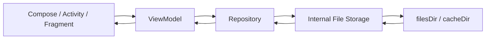
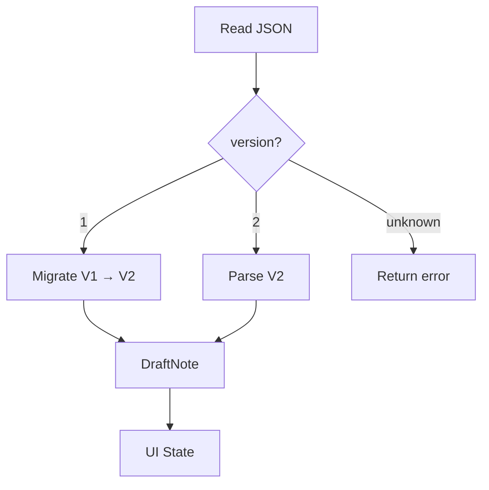
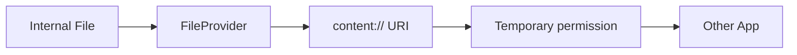
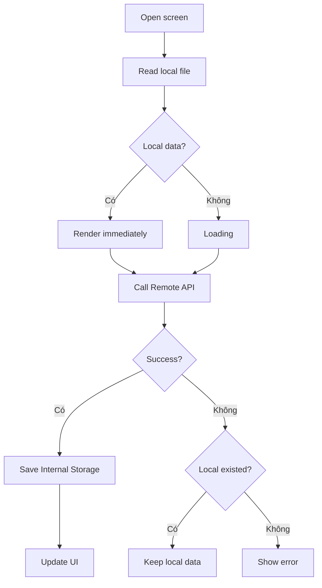
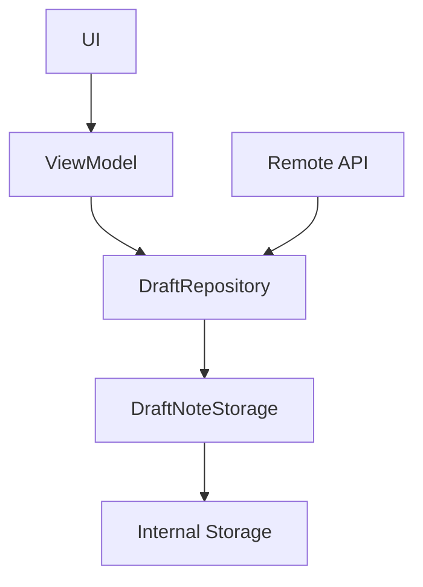
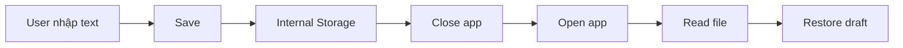

# 006 - Internal Storage

> **Học phần:** 03 - Architecture, State and Data
> **Module:** Module 06 - Storage
> **Nhóm nội dung:** Preferences and Files
> **Nguồn roadmap:** Storage / Preferences and Files
> **Loại bài:** Storage
> **Thứ tự trong module:** 006
> **Thời lượng gợi ý:** 32 phút

---

## 1. Tóm tắt

**Internal Storage** là vùng lưu trữ **riêng của ứng dụng** trên thiết bị Android. Đây là lựa chọn phù hợp khi app cần lưu những file:

* chỉ app hiện tại cần sử dụng;
* không cần người dùng quản lý trực tiếp;
* không cần chia sẻ công khai cho app khác;
* cần tồn tại sau khi Activity bị recreate hoặc process bị kill;
* nhưng có thể bị xóa khi người dùng gỡ cài đặt ứng dụng.

Android cung cấp riêng vùng lưu trữ cho **persistent files** và vùng dành cho **cache**. App không cần xin storage permission để đọc/ghi các file trong internal storage, và app khác thông thường không thể truy cập các file này. Trên Android 10/API 29 trở lên, các vị trí app-specific internal storage còn được hệ thống mã hóa. ([Android Developers][1])

> **Ý tưởng quan trọng:** Internal Storage không phải là state của Activity hay ViewModel. Nó là **persistent local data** nằm dưới UI/state layer.

---

## 2. Mục tiêu học tập

Sau bài này, anh nên có thể:

* [ ] Giải thích Internal Storage bằng ngôn ngữ của mình.
* [ ] Phân biệt `filesDir` và `cacheDir`.
* [ ] Đọc và ghi file bằng `File`, `openFileInput()` và `openFileOutput()`.
* [ ] Biết khi nào Internal Storage phù hợp và khi nào nên dùng DataStore, Room hoặc Shared Storage.
* [ ] Xử lý trường hợp file chưa tồn tại, file lỗi hoặc thay đổi format.
* [ ] Hiểu Internal Storage liên quan thế nào đến lifecycle và UI state.
* [ ] Viết một lớp storage/repository thay vì đọc file trực tiếp trong Composable.
* [ ] Có một demo nhỏ có thể đưa vào portfolio.

---

# 3. Internal Storage là gì?

Android tạo cho mỗi ứng dụng một khu vực dữ liệu riêng.

Có thể hình dung:

```text
Android device
│
├── App A
│   └── Private storage
│       ├── files/
│       └── cache/
│
├── App B
│   └── Private storage
│       ├── files/
│       └── cache/
│
└── Shared Storage
    ├── Pictures/
    ├── Movies/
    ├── Music/
    └── Download/
```

App A không nên dựa vào việc đọc trực tiếp private storage của App B.

Android khuyến nghị truy cập các vị trí này thông qua `Context` như `filesDir`, `cacheDir` thay vì hard-code các đường dẫn hệ thống. Ngay cả absolute path của `filesDir` cũng có thể thay đổi, vì vậy không nên persist absolute path làm dữ liệu nghiệp vụ. ([Android Developers][2])

### Minh họa mô hình Android Storage

[](https://developer.datalogic.com/mobile-computers/news/scoped_storage_on_android_11?utm_source=chatgpt.com)

> Hình trên nên được xem như **sơ đồ khái niệm**. Trong code production, không nên tự viết đường dẫn kiểu `/data/user/0/...`; hãy lấy directory từ Android API.

---

# 4. Internal Storage nằm ở đâu trong kiến trúc app?

Một kiến trúc hợp lý:



### Không nên

```text
Composable
    ↓
File(...)
    ↓
readText()
```

Composable không nên trực tiếp đảm nhận trách nhiệm I/O.

### Nên

```text
Composable
    ↓
ViewModel
    ↓
Repository
    ↓
FileStorage
    ↓
Internal Storage
```

Như vậy:

* UI chỉ render state.
* ViewModel quản lý UI state.
* Repository quyết định nguồn dữ liệu.
* Storage layer chịu trách nhiệm đọc/ghi file.

---

# 5. Hai vùng quan trọng nhất

## 5.1. `filesDir`

`Context.filesDir` là thư mục dành cho **persistent app-specific files**. `openFileOutput()` cũng ghi file vào khu vực này. Android không yêu cầu thêm permission khi app đọc hoặc ghi file tại đây. ([Android Developers][1])

Ví dụ:

```kotlin
val file = File(context.filesDir, "profile.json")
```

Có thể dùng để lưu:

```text
files/
├── profile.json
├── editor_draft.json
├── model_config.json
├── offline_data.json
└── game_save.json
```

Các file app-specific này bị xóa khi ứng dụng bị uninstall. Vì vậy, không nên dùng chúng cho dữ liệu mà người dùng mong muốn vẫn tồn tại độc lập sau khi xóa app. ([Android Developers][1])

---

## 5.2. `cacheDir`

`cacheDir` dành cho dữ liệu **có thể tạo lại**.

Ví dụ:

```kotlin
val file = File(context.cacheDir, "avatar.tmp")
```

Các trường hợp phù hợp:

* thumbnail;
* ảnh tải tạm;
* response đã cache;
* file trung gian;
* dữ liệu preprocessing;
* temporary export.

Android có thể xóa cache khi thiết bị cần thêm dung lượng. Vì vậy app **không được giả định rằng cache file luôn còn tồn tại**. Android cũng khuyến nghị app tự quản lý kích thước cache thay vì phụ thuộc hoàn toàn vào cơ chế cleanup của hệ thống. ([Android Developers][2])

### Quy tắc nhớ nhanh

```text
Mất file → app hỏng dữ liệu?
       │
       ├── Có  → filesDir
       │
       └── Không, tạo lại được → cacheDir
```

---

# 6. `filesDir` và `cacheDir`

| Tiêu chí               | `filesDir`          | `cacheDir`                    |
| ---------------------- | ------------------- | ----------------------------- |
| Mục đích               | Dữ liệu app cần giữ | Dữ liệu tạm                   |
| Persistent             | Có                  | Không đảm bảo                 |
| App khác truy cập      | Không trực tiếp     | Không trực tiếp               |
| Storage permission     | Không               | Không                         |
| Hệ thống có thể tự xóa | Bình thường không   | Có                            |
| Uninstall app          | Bị xóa              | Bị xóa                        |
| Ví dụ                  | game save, draft    | thumbnail, temporary response |

Android cung cấp cả hai khu vực như app-specific internal storage và không yêu cầu system storage permission. ([Android Developers][1])

---

# 7. `noBackupFilesDir` — trường hợp nâng cao

Ngoài `filesDir`, Android còn có:

```kotlin
context.noBackupFilesDir
```

Nó gần giống `filesDir`, nhưng file nằm ở đây **không được đưa vào automatic remote backup**. ([Android Developers][2])

Ví dụ phù hợp có thể là:

```text
device_specific_state
temporary_install_identifier
local_generated_runtime_file
```

Sơ đồ:

```text
App Private Storage
│
├── filesDir
│   └── persistent files
│
├── noBackupFilesDir
│   └── persistent nhưng không Auto Backup
│
└── cacheDir
    └── temporary / disposable
```

---

# 8. API quan trọng

## 8.1. Tạo `File`

```kotlin
val file = File(context.filesDir, "note.txt")
```

Đây là cách đơn giản nhất khi cần thao tác với `java.io.File`. Android chính thức hỗ trợ `File(context.filesDir, filename)` cho app-specific persistent files. ([Android Developers][1])

---

## 8.2. Ghi file bằng `openFileOutput()`

```kotlin
val filename = "note.txt"
val content = "Hello Internal Storage"

context.openFileOutput(
    filename,
    Context.MODE_PRIVATE
).use { output ->
    output.write(content.toByteArray())
}
```

`openFileOutput()` tạo `FileOutputStream` tới file trong `filesDir`. Khi dùng API này trên Android 7.0/API 24 trở lên, Android yêu cầu mode thích hợp như `Context.MODE_PRIVATE`. ([Android Developers][1])

---

## 8.3. Đọc file

```kotlin
val text = context
    .openFileInput("note.txt")
    .bufferedReader()
    .use {
        it.readText()
    }
```

`openFileInput()` là API tương ứng để lấy stream đọc file được lưu trong internal files directory. ([Android Developers][1])

---

## 8.4. Kiểm tra file tồn tại

```kotlin
val file = File(context.filesDir, "note.txt")

if (file.exists()) {
    // read
}
```

Điều này đặc biệt quan trọng với cache:

```kotlin
val cacheFile = File(context.cacheDir, "response.json")

if (cacheFile.exists()) {
    // use cache
} else {
    // fetch/rebuild
}
```

Android cảnh báo cache file có thể bị hệ thống xóa khi thiết bị thiếu dung lượng. ([Android Developers][1])

---

## 8.5. Xóa file

```kotlin
context.deleteFile("note.txt")
```

hoặc:

```kotlin
File(context.filesDir, "note.txt").delete()
```

Android hỗ trợ cả thao tác `File.delete()` lẫn `Context.deleteFile()` để dọn file app-specific. ([Android Developers][1])

---

## 8.6. Liệt kê file

```kotlin
val files: Array<String> = context.fileList()

files.forEach {
    Log.d("FILES", it)
}
```

`fileList()` trả về danh sách tên các file trực tiếp trong `filesDir`. ([Android Developers][1])

---

# 9. Thực hành — lưu một Draft Note

Giả sử app có màn hình viết ghi chú.

Người dùng đang viết:

```text
Title:
Android Storage

Content:
Internal Storage stores private application files...
```

Ta muốn:

1. User nhập nội dung.
2. User nhấn Save.
3. Draft được lưu xuống Internal Storage.
4. App bị đóng.
5. User mở lại.
6. Draft được restore.

---

## 9.1. Data model

```kotlin
data class DraftNote(
    val title: String = "",
    val body: String = "",
    val updatedAt: Long = 0L
)
```

---

# 10. Storage layer

Ví dụ sau dùng JSON đơn giản và đồng thời minh họa:

* read;
* write;
* default value;
* error;
* schema migration.

```kotlin
import android.content.Context
import kotlinx.coroutines.CoroutineDispatcher
import kotlinx.coroutines.Dispatchers
import kotlinx.coroutines.withContext
import org.json.JSONObject
import java.io.File

class DraftNoteStorage(
    private val context: Context,
    private val ioDispatcher: CoroutineDispatcher = Dispatchers.IO
) {

    companion object {
        private const val FILE_NAME = "draft_note.json"
        private const val CURRENT_VERSION = 2
    }

    suspend fun save(
        note: DraftNote
    ): Result<Unit> = withContext(ioDispatcher) {

        runCatching {

            val json = JSONObject().apply {
                put("version", CURRENT_VERSION)
                put("title", note.title)
                put("body", note.body)
                put("updatedAt", note.updatedAt)
            }

            context.openFileOutput(
                FILE_NAME,
                Context.MODE_PRIVATE
            ).bufferedWriter().use { writer ->

                writer.write(json.toString())
            }
        }
    }

    suspend fun load(): Result<DraftNote> =
        withContext(ioDispatcher) {

            runCatching {

                val file = File(
                    context.filesDir,
                    FILE_NAME
                )

                // Default value
                if (!file.exists()) {
                    return@runCatching DraftNote()
                }

                val content = context
                    .openFileInput(FILE_NAME)
                    .bufferedReader()
                    .use {
                        it.readText()
                    }

                val json = JSONObject(content)

                when (
                    json.optInt("version", 1)
                ) {

                    // Schema cũ
                    1 -> migrateFromV1(json)

                    // Schema hiện tại
                    2 -> DraftNote(
                        title = json.optString("title"),
                        body = json.optString("body"),
                        updatedAt = json.optLong("updatedAt")
                    )

                    else -> error(
                        "Unsupported file version"
                    )
                }
            }
        }

    private fun migrateFromV1(
        json: JSONObject
    ): DraftNote {

        // V1 chỉ có field "text"
        return DraftNote(
            title = "",
            body = json.optString("text", ""),
            updatedAt = json.optLong(
                "updatedAt",
                0L
            )
        )
    }

    suspend fun delete(): Boolean =
        withContext(ioDispatcher) {

            context.deleteFile(FILE_NAME)
        }
}
```

---

# 11. Migration trong ví dụ này

Giả sử phiên bản đầu tiên lưu:

```json
{
  "version": 1,
  "text": "Learn Android Storage"
}
```

Sau một release, model mới trở thành:

```json
{
  "version": 2,
  "title": "Android",
  "body": "Learn Android Storage",
  "updatedAt": 1786464000000
}
```

Nếu code mới chỉ biết V2:

```text
Old file
   ↓
New app
   ↓
Parse failed
   ↓
User mất draft
```

Thay vào đó:



Đây là một ví dụ nhỏ cho tư duy **data migration** mà sau này anh sẽ gặp nhiều hơn với:

* DataStore;
* Proto DataStore;
* Room;
* local database;
* cached API data.

---

# 12. ViewModel và UI State

Internal Storage không tự trở thành Compose state.

Cần chuyển dữ liệu:

```text
Disk
 ↓
Repository
 ↓
ViewModel
 ↓
StateFlow
 ↓
Compose
```

Ví dụ:

```kotlin
data class EditorUiState(
    val title: String = "",
    val body: String = "",
    val loading: Boolean = false,
    val error: String? = null
)
```

Một ViewModel có thể:

```kotlin
class EditorViewModel(
    private val storage: DraftNoteStorage
) : ViewModel() {

    private val _uiState =
        MutableStateFlow(EditorUiState())

    val uiState =
        _uiState.asStateFlow()

    fun loadDraft() {

        viewModelScope.launch {

            _uiState.update {
                it.copy(loading = true)
            }

            storage.load()
                .onSuccess { draft ->

                    _uiState.value =
                        EditorUiState(
                            title = draft.title,
                            body = draft.body
                        )
                }
                .onFailure { error ->

                    _uiState.value =
                        EditorUiState(
                            error = error.message
                        )
                }
        }
    }
}
```

Compose:

```kotlin
val state by viewModel.uiState.collectAsStateWithLifecycle()
```

Sau đó UI chỉ render `state`.

---

# 13. Lifecycle và Internal Storage

Đây là điểm rất dễ nhầm.

### Configuration change

Ví dụ:

```text
Rotate phone
```

Activity có thể bị recreate.

Nhưng file trong Internal Storage không phụ thuộc vào instance Activity đó.

```text
Activity A
   ↓
rotate
   ↓
Activity A destroyed
   ↓
Activity B created

Internal Storage
   │
   └──── vẫn tồn tại
```

### Process death

Tương tự:

```text
Process
  ↓
killed

File trên disk
  ↓
vẫn tồn tại
```

Khi app được mở lại:

```text
ViewModel
   ↓
Repository.load()
   ↓
Internal Storage
   ↓
restore UI
```

### Uninstall

Khác hoàn toàn:

```text
Uninstall app
     ↓
App-specific storage
     ↓
Removed
```

Android nêu rõ app-specific files được xóa khi ứng dụng bị uninstall. ([Android Developers][1])

---

# 14. Internal Storage không thay thế `SavedStateHandle`

Hai thứ giải quyết hai vấn đề khác nhau.

| Công cụ            | Mục đích                                     |
| ------------------ | -------------------------------------------- |
| Compose `remember` | UI state rất ngắn hạn                        |
| `rememberSaveable` | UI state có thể restore                      |
| `SavedStateHandle` | state cần survive recreation/process restore |
| Internal Storage   | persistent application data                  |
| DataStore          | persistent preferences / typed configuration |
| Room               | structured/queryable data                    |

Ví dụ:

```text
Search query đang nhập
→ SavedStateHandle

Draft người dùng muốn giữ nhiều ngày
→ Internal Storage / database
```

---

# 15. Khi nào nên dùng Internal Storage?

## Phù hợp

### Game save

```text
files/
└── save_game.json
```

### Offline draft

```text
files/
└── article_draft.json
```

### Private generated file

```text
files/
└── generated_report.tmpdata
```

### App configuration file phức tạp

```text
files/
└── local_model_config.json
```

### ML model riêng của app

```text
files/
└── models/
    └── classifier.tflite
```

Nếu kích thước dữ liệu lớn, cần tiếp tục cân nhắc storage space thay vì mặc định đưa mọi thứ vào internal storage; Android lưu ý internal storage có giới hạn và app nên sử dụng dung lượng có trách nhiệm. ([Android Developers][1])

---

# 16. Khi nào **không nên** dùng?

## Preference nhỏ

Ví dụ:

```text
darkMode = true
language = "vi"
notifications = false
```

Nên ưu tiên:

```text
Preferences DataStore
```

DataStore được thiết kế cho persistent application data dạng preference và cung cấp API dựa trên coroutines/Flow. ([Android Developers][3])

---

## Object cấu hình typed

Ví dụ:

```text
UserPreferences
├── theme
├── language
├── notificationEnabled
└── fontScale
```

Có thể cân nhắc:

```text
Proto DataStore
```

---

## Dữ liệu cần query

Ví dụ:

```text
10,000 Notes
10,000 Tasks
Users
Messages
Products
```

Nếu anh bắt đầu cần:

```sql
WHERE
ORDER BY
JOIN
INDEX
```

thì file JSON đơn lẻ không còn là abstraction phù hợp.

Đó là vùng bài toán phù hợp hơn với **Room** và entity/database. Android Room mô hình hóa dữ liệu thành entities tương ứng với các table trong database. ([Android Developers][4])

---

## File người dùng sở hữu

Ví dụ:

```text
photo.jpg
resume.pdf
video.mp4
report.xlsx
```

Nếu người dùng mong muốn file tồn tại ngoài vòng đời của app hoặc các ứng dụng khác cần sử dụng nó, nên cân nhắc **Shared Storage**, MediaStore hoặc Storage Access Framework thay vì app-private internal storage. Android mô tả Shared Storage là nơi dành cho dữ liệu có thể cần truy cập từ ứng dụng khác và có thể tồn tại độc lập với việc uninstall app. ([Android Developers][5])

---

# 17. Bảng chọn storage nhanh

| Requirement                       | Giải pháp nên cân nhắc |
| --------------------------------- | ---------------------- |
| Dark mode                         | Preferences DataStore  |
| User settings typed               | Proto DataStore        |
| JSON nhỏ riêng của app            | Internal Storage       |
| Draft text                        | Internal Storage       |
| Thumbnail                         | `cacheDir`             |
| Database nhiều record             | Room                   |
| Photo người dùng                  | MediaStore             |
| PDF user muốn export              | Shared Storage / SAF   |
| File cần chia sẻ tạm cho app khác | FileProvider           |
| File không muốn Auto Backup       | `noBackupFilesDir`     |

---

# 18. Chia sẻ một Internal File cho app khác

Không nên biến file private thành một đường dẫn filesystem rồi gửi đường dẫn đó cho ứng dụng khác.

Android cung cấp `FileProvider` để tạo **content URI** và cấp quyền truy cập file một cách có kiểm soát. ([Android Developers][6])

Luồng:



Ví dụ use case:

```text
App tạo PDF trong Internal Storage
        ↓
User bấm Share
        ↓
FileProvider
        ↓
content://com.example.fileprovider/...
        ↓
Gmail / Drive / Telegram
```

AndroidX `FileProvider` có thể expose một subdirectory cụ thể của `files/` thay vì làm lộ toàn bộ private storage. ([Android Developers][6])

---

# 19. Local data và Remote data

Internal Storage trở nên hữu ích hơn khi đặt vào kiến trúc có network.

Ví dụ app đọc một document:



Đây là một dạng đơn giản của:

```text
Local-first / Offline-friendly architecture
```

Điểm quan trọng không phải chỉ là biết gọi `File()` mà là xác định:

> **Source of Truth nằm ở đâu?**

---

# 20. Các lỗi thường gặp

## Lỗi 1 — Hard-code đường dẫn

Không nên:

```kotlin
File(
    "/data/user/0/com.example.app/files/data.json"
)
```

Nên:

```kotlin
File(
    context.filesDir,
    "data.json"
)
```

Android API reference lưu ý app không nên sử dụng trực tiếp data directory path, mà nên đi qua các storage APIs như `getFilesDir()` và `getCacheDir()`. ([Android Developers][2])

---

## Lỗi 2 — Dùng cache như database

```text
cacheDir/user.json
```

và giả định file luôn tồn tại.

Sai vì:

```text
Low storage
    ↓
Android clears cache
    ↓
user.json disappears
```

Cache phải **disposable/rebuildable**. ([Android Developers][2])

---

## Lỗi 3 — Đọc file trực tiếp trong Composable

Không nên:

```kotlin
@Composable
fun Screen(context: Context) {

    val data =
        File(
            context.filesDir,
            "data.json"
        ).readText()
}
```

Tốt hơn:

```text
Compose
 ↓
ViewModel
 ↓
Repository
 ↓
Storage
```

---

## Lỗi 4 — Không xử lý corrupted file

Ví dụ:

```json
{"version":
```

Nếu chỉ:

```kotlin
JSONObject(content)
```

app có thể gặp exception.

Nên có:

```kotlin
runCatching {
    ...
}
```

và policy rõ ràng:

```text
Parse error
   ↓
Log
   ↓
Fallback?
   ↓
Delete corrupted file?
   ↓
Request remote data?
```

---

## Lỗi 5 — Không có migration strategy

```text
Version 1
{
  "name": ...
}

        ↓ release

Version 2
{
  "firstName": ...
  "lastName": ...
}
```

App mới vẫn có thể gặp file cũ trên thiết bị.

Do đó:

```text
Persistent storage
        =
Persistent compatibility problem
```

---

# 21. Testing

Một storage layer tốt cần ít nhất kiểm tra ba tình huống.

## Test 1 — Save → Load

```text
save(data)
   ↓
load()
   ↓
same data
```

Ví dụ expectation:

```kotlin
assertEquals(
    expected,
    storage.load().getOrThrow()
)
```

---

## Test 2 — File chưa tồn tại

```text
No file
 ↓
load()
 ↓
default object
```

Expected:

```kotlin
DraftNote(
    title = "",
    body = ""
)
```

---

## Test 3 — Migration

Input:

```json
{
  "version": 1,
  "text": "Old draft"
}
```

Expected:

```kotlin
DraftNote(
    title = "",
    body = "Old draft"
)
```

---

## Test 4 — Corrupted file

Input:

```text
this-is-not-json
```

Expected:

```text
Result.failure(...)
```

thay vì crash toàn màn hình.

---

# 22. Debugging checklist

Khi storage có lỗi, kiểm tra theo thứ tự:

```text
File name đúng?
      ↓
Directory đúng?
      ↓
File tồn tại?
      ↓
File có dữ liệu?
      ↓
Encoding đúng?
      ↓
JSON parse được?
      ↓
Schema version đúng?
      ↓
Migration chạy?
      ↓
Repository trả Result gì?
      ↓
ViewModel map Result → UI đúng?
```

Khi debug, log **metadata** thay vì log dữ liệu nhạy cảm.

Ví dụ:

```kotlin
Log.d(
    "Storage",
    "fileExists=${file.exists()}, size=${file.length()}"
)
```

Tốt hơn việc:

```kotlin
Log.d(
    "Storage",
    "content=$passwordAndToken"
)
```

---

# 23. UX impact

Storage tưởng như là infrastructure, nhưng ảnh hưởng UX rất trực tiếp.

### Không lưu draft

```text
User viết 20 phút
    ↓
App bị kill
    ↓
Mở lại
    ↓
Draft mất
```

**UX rất tệ.**

---

### Có Internal Storage

```text
User viết
   ↓
Autosave
   ↓
filesDir
   ↓
App bị kill
   ↓
Open again
   ↓
Draft restored
```

**UX tốt hơn đáng kể.**

Vì vậy storage không chỉ là:

```text
File API
```

mà còn là:

```text
Reliability
+
Offline UX
+
Data safety
+
Recovery
```

---

# 24. Performance

Không nên coi disk I/O là thao tác UI.

Architecture nên hướng đến:

```text
Main Thread
   ↓
UI logic

IO Dispatcher
   ↓
File read/write
```

Ví dụ:

```kotlin
withContext(Dispatchers.IO) {
    file.readText()
}
```

Ngoài ra, Android khuyến nghị tránh liên tục open/close cùng một file nếu không cần thiết vì điều này có thể ảnh hưởng performance. ([Android Developers][1])

---

# 25. Production considerations

Trước release, hãy tự hỏi:

### Data ownership

```text
Dữ liệu thuộc app
hay
thuộc user?
```

Nếu user cần giữ file sau uninstall, Internal Storage có thể không phù hợp. ([Android Developers][1])

### Recovery

```text
Nếu file corrupted thì sao?
```

Cần policy:

```text
Default
Remote reload
Migration
Backup
Error UI
```

### Storage size

```text
File có thể tăng vô hạn không?
```

Internal storage không nên trở thành:

```text
data.json

10 KB
 ↓
10 MB
 ↓
500 MB
 ↓
5 GB
```

mà không có chiến lược quản lý dung lượng.

### Cache cleanup

```text
cacheDir
 ↓
max size?
 ↓
TTL?
 ↓
cleanup policy?
```

### Security

Hãy xác định:

```text
File có chứa:
password?
token?
PII?
secret?
```

App-private storage cung cấp isolation quan trọng, nhưng điều đó không có nghĩa anh nên tùy tiện serialize mọi secret vào plaintext application file.

---

# 26. Internal Storage trong Clean Architecture

Một structure hợp lý:

```text
app/
│
├── ui/
│   ├── EditorScreen.kt
│   └── EditorViewModel.kt
│
├── domain/
│   └── DraftNote.kt
│
└── data/
    ├── repository/
    │   └── DraftRepository.kt
    │
    └── local/
        └── DraftNoteStorage.kt
```

Dependency:



Repository có thể trở thành nơi quyết định:

```text
local?
remote?
cache?
refresh?
fallback?
```

---

# 27. Mini Project — Offline Draft Editor

## Requirement

Tạo app:

```text
Offline Draft Editor
```

UI:

```text
┌────────────────────────────┐
│ Draft Editor               │
├────────────────────────────┤
│ Title                      │
│ [ Android Storage       ]  │
│                            │
│ Content                    │
│ ┌────────────────────────┐ │
│ │ Internal Storage...    │ │
│ │                        │ │
│ └────────────────────────┘ │
│                            │
│ [ Save ]      [ Delete ]   │
│                            │
│ Saved locally ✓            │
└────────────────────────────┘
```

### Requirements

* Save draft vào `filesDir`.
* Restore draft khi app mở lại.
* Có default state nếu chưa có file.
* Có schema version.
* Handle corrupted file.
* Có Delete.
* UI không gọi `File` trực tiếp.
* Storage I/O nằm trong data layer.

---

# 28. Artifact để đưa vào portfolio

Repository có thể chứa:

```text
android-internal-storage-demo/
│
├── app/
│
├── screenshots/
│   ├── editor.png
│   └── restored-draft.png
│
├── docs/
│   └── architecture.md
│
└── README.md
```

README nên trình bày:

```markdown
# Android Internal Storage Demo

## Features

- Persistent local draft
- Internal app-specific storage
- JSON schema versioning
- Migration V1 → V2
- Corrupted-file handling
- ViewModel + Repository architecture
- Offline recovery

## Architecture

UI → ViewModel → Repository → Internal Storage

## Storage

Persistent files:
Context.filesDir

Temporary files:
Context.cacheDir
```

Một project nhỏ như vậy thể hiện nhiều hơn việc chỉ biết:

```kotlin
File.writeText()
```

Nó thể hiện hiểu biết về:

```text
Architecture
+
Storage
+
State
+
Error handling
+
Migration
+
Testing
```

---

# 29. Bài tập

## Bài tập chính

Persist một entity:

```kotlin
data class UserDraft(
    val id: String,
    val text: String,
    val updatedAt: Long
)
```

Flow:



Sau đó bổ sung ít nhất một trường hợp:

```text
Migration

hoặc

Default value

hoặc

Corrupted file
```

---

# 30. Câu hỏi tự kiểm tra

### Câu 1

Internal Storage có cần:

```xml
<uses-permission android:name="android.permission.WRITE_EXTERNAL_STORAGE" />
```

không?

**Không** đối với app-specific internal storage. Android cho phép app đọc/ghi các directory này mà không cần storage permission. ([Android Developers][1])

---

### Câu 2

Nên lưu image cache vào đâu?

```text
cacheDir
```

nếu ảnh có thể được tải/tạo lại.

---

### Câu 3

Có nên lưu ảnh chụp mà user muốn giữ lâu dài vào `filesDir` không?

Thông thường **không** nếu người dùng kỳ vọng ảnh vẫn còn và có thể được sử dụng bên ngoài app sau khi uninstall. Shared Storage/MediaStore phù hợp hơn cho trường hợp đó. ([Android Developers][1])

---

### Câu 4

Activity bị rotate thì Internal Storage có mất không?

Không. File persistence không gắn với instance Activity.

---

### Câu 5

Uninstall app thì sao?

App-specific files bị xóa. ([Android Developers][1])

---

### Câu 6

Cache file có chắc chắn tồn tại đến lần mở app tiếp theo không?

Không. Android có thể xóa cache khi cần thu hồi storage. ([Android Developers][2])

---

# 31. Checklist hoàn thành

## Kiến thức

* [ ] Định nghĩa được Internal Storage.
* [ ] Hiểu app-specific/private storage.
* [ ] Biết `filesDir`.
* [ ] Biết `cacheDir`.
* [ ] Biết `noBackupFilesDir`.
* [ ] Hiểu dữ liệu app-specific bị xóa khi uninstall.
* [ ] Biết không cần storage permission cho internal app-specific files.

## Code

* [ ] Tạo file.
* [ ] Ghi file.
* [ ] Đọc file.
* [ ] Kiểm tra file tồn tại.
* [ ] Xóa file.
* [ ] Handle exception.
* [ ] Có default value.
* [ ] Có migration/version nếu format cần phát triển lâu dài.

## Architecture

* [ ] Không đọc file trực tiếp trong UI.
* [ ] Có storage/data layer.
* [ ] ViewModel quản lý UI state.
* [ ] Xác định local/remote source rõ ràng.

## Quality

* [ ] Test save → load.
* [ ] Test missing file.
* [ ] Test corrupted file.
* [ ] Test migration.
* [ ] Không hard-code absolute storage path.
* [ ] Có cache cleanup policy nếu sử dụng cache.

## Portfolio

* [ ] Có repository demo.
* [ ] Có README.
* [ ] Có architecture diagram.
* [ ] Có screenshot.
* [ ] Giải thích được offline behavior.

---

# 32. Ghi nhớ nhanh

```text
INTERNAL STORAGE
       │
       ├── filesDir
       │      ↓
       │   persistent
       │
       ├── cacheDir
       │      ↓
       │   temporary
       │
       └── noBackupFilesDir
              ↓
          persistent
          no auto backup
```

Và nguyên tắc lựa chọn:

```text
Private + file + app-owned
          ↓
    Internal Storage

Temporary + rebuildable
          ↓
       cacheDir

Preference
          ↓
       DataStore

Queryable structured data
          ↓
         Room

User-owned / shareable file
          ↓
Shared Storage / MediaStore / SAF
```

---

# 33. Kết luận

**Internal Storage** là nền tảng quan trọng của local persistence trên Android nhưng điều cần học không chỉ là `File` API.

Một Android developer tốt cần nhìn được toàn bộ chuỗi:

```text
User Action
    ↓
UI State
    ↓
ViewModel
    ↓
Repository
    ↓
Internal Storage
    ↓
Read / Write / Migration
    ↓
Error Handling
    ↓
Restore
    ↓
User Experience
```

Điểm cần nhớ nhất:

> **`filesDir` dành cho app-private persistent files; `cacheDir` dành cho dữ liệu có thể bị xóa và tạo lại. Không hard-code storage path, không để UI trực tiếp làm file I/O, và luôn nghĩ đến migration, error handling, lifecycle cũng như ownership của dữ liệu.**

Android cũng quy định rằng nếu cần chia sẻ private file cho ứng dụng khác, nên sử dụng `FileProvider` với content URI thay vì expose raw filesystem path. ([Android Developers][6])

[1]: https://developer.android.com/training/data-storage/app-specific "Access app-specific files  |  App data and files  |  Android Developers"
[2]: https://developer.android.com/reference/android/content/Context "Context  |  API reference  |  Android Developers"
[3]: https://developer.android.com/codelabs/android-preferences-datastore?utm_source=chatgpt.com "Working with Preferences DataStore"
[4]: https://developer.android.com/training/data-storage/room/defining-data?utm_source=chatgpt.com "Define data using Room entities | App data and files"
[5]: https://developer.android.com/training/data-storage/shared "Overview of shared storage  |  App data and files  |  Android Developers"
[6]: https://developer.android.com/training/secure-file-sharing/setup-sharing "Setting up file sharing  |  App data and files  |  Android Developers"

---

# Bài luyện tập

## Mục tiêu


## Đề bài


## Yêu cầu hoàn thành

- [ ] 
- [ ] 
- [ ] 

## Kết quả / lời giải


## Ghi chú
