[](https://developer.android.com/training/data-storage/shared/photo-picker?utm_source=chatgpt.com)

# 007 — External Storage

**Học phần:** 03 — Architecture, State and Data
**Module:** Module 06 — Storage
**Nhóm nội dung:** Preferences and Files
**Nguồn roadmap:** Storage / Preferences and Files
**Loại bài:** Storage
**Thứ tự trong module:** 007
**Thời lượng gợi ý:** 32 phút

---

## 1. Tóm tắt

Trong Android hiện đại, **External Storage** không đơn giản có nghĩa là "thẻ SD".

External storage là vùng lưu trữ mà Android dùng cho:

* file riêng của ứng dụng nhưng đặt trên external storage;
* ảnh, video, âm thanh dùng chung;
* tài liệu người dùng;
* thư mục Downloads;
* thiết bị lưu trữ rời nếu có.

Một thiết bị thậm chí có thể cung cấp **external storage dạng emulated** nằm trên bộ nhớ tích hợp chứ không phải thẻ nhớ vật lý. Vì vậy, khi lập trình Android, nên suy nghĩ theo **phạm vi truy cập và quyền sở hữu dữ liệu**, thay vì suy nghĩ đơn giản theo "internal disk vs SD card". ([Android Developers][1])

Từ Android 10, **Scoped Storage** trở thành mô hình quan trọng để hạn chế việc một ứng dụng tự do đọc toàn bộ external storage. Với ứng dụng target Android 10 trở lên, quyền truy cập vào storage được giới hạn rõ ràng hơn theo dữ liệu của app, media và tài liệu do người dùng lựa chọn. ([Android Developers][2])

> Tư duy quan trọng của bài này:
>
> **Đừng hỏi "file này nằm ở external storage hay không?" trước tiên.
> Hãy hỏi "file này thuộc về ai và ai cần nhìn thấy nó?"**

---

# 2. Mục tiêu học tập

Sau bài này, anh nên có thể:

* Giải thích được External Storage bằng ngôn ngữ của mình.
* Phân biệt:

  * Internal Storage;
  * app-specific external storage;
  * shared storage;
  * `MediaStore`;
  * Storage Access Framework;
  * Photo Picker.
* Hiểu **Scoped Storage** giải quyết vấn đề gì.
* Chọn API lưu trữ phù hợp với từng loại file.
* Biết khi nào cần permission và khi nào không.
* Xử lý file bằng `Uri` thay vì phụ thuộc vào absolute file path.
* Xử lý trường hợp:

  * storage không khả dụng;
  * permission bị thu hồi;
  * file bị xóa;
  * `Uri` không còn quyền truy cập.
* Viết một mini-app sử dụng External Storage để đưa vào portfolio.

---

# 3. External Storage là gì?

Có thể hiểu đơn giản:

> **External Storage là không gian lưu trữ Android cung cấp cho dữ liệu có khả năng nằm ngoài vùng private internal storage của ứng dụng.**

Nhưng external storage lại chia thành nhiều kiểu.

```text
External Storage
│
├── App-specific storage
│   ├── Android/data/<package>/files/
│   └── Android/data/<package>/cache/
│
└── Shared storage
    ├── Pictures/
    ├── Movies/
    ├── Music/
    ├── Downloads/
    └── Documents/
```

Trong Android hiện đại, hai nhóm này có hành vi rất khác nhau. ([Android Developers][2])

---

# 4. External Storage không đồng nghĩa với SD Card

Đây là một hiểu nhầm khá phổ biến.

```text
External Storage
      │
      ├── Emulated storage
      │      └── nằm trên bộ nhớ trong của máy
      │
      └── Removable storage
             └── ví dụ SD card
```

Do đó:

```kotlin
context.getExternalFilesDir(null)
```

không có nghĩa là:

```text
"Hãy lưu file lên SD card."
```

Nó có nghĩa gần hơn với:

```text
"Hãy lấy thư mục external app-specific của ứng dụng."
```

Android còn có thể có nhiều storage volume khác nhau. ([Android Developers][2])

---

# 5. Bức tranh tổng thể Android Storage

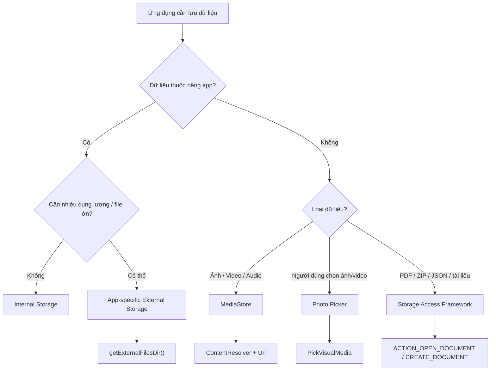

Đây là decision tree nên nhớ khi chọn storage API.

---

# 6. Ba nhóm quan trọng nhất

## 6.1. App-specific External Storage

Đây là file:

> thuộc về ứng dụng nhưng được đặt trong vùng external storage dành riêng cho ứng dụng.

Ví dụ:

```text
/storage/emulated/0/
└── Android/
    └── data/
        └── com.example.storageapp/
            └── files/
                ├── Pictures/
                ├── Movies/
                └── backup.json
```

Ứng dụng có thể truy cập thư mục của chính mình bằng:

```kotlin
context.getExternalFilesDir(null)
```

hoặc theo loại dữ liệu:

```kotlin
context.getExternalFilesDir(Environment.DIRECTORY_PICTURES)
```

Với app-specific external storage, ứng dụng không cần storage permission để truy cập thư mục riêng của mình. Các file trong vùng app-specific này cũng được Android loại bỏ khi ứng dụng bị uninstall. ([Android Developers][2])

### Ví dụ

```kotlin
val file = File(
    context.getExternalFilesDir(null),
    "profile_backup.json"
)

file.writeText(
    """
    {
      "username": "an_khanh",
      "theme": "dark"
    }
    """.trimIndent()
)
```

Đọc lại:

```kotlin
val content = file.readText()
```

---

# 7. Kiểm tra External Storage có khả dụng không

External storage có thể không luôn ở trạng thái đọc/ghi được, đặc biệt nếu liên quan đến removable volume.

Android cung cấp:

```kotlin
Environment.getExternalStorageState()
```

Hai trạng thái thường quan tâm là:

```kotlin
Environment.MEDIA_MOUNTED
```

và:

```kotlin
Environment.MEDIA_MOUNTED_READ_ONLY
```

`MEDIA_MOUNTED` cho phép đọc và ghi; `MEDIA_MOUNTED_READ_ONLY` chỉ cho phép đọc. ([Android Developers][2])

Ví dụ:

```kotlin
fun isExternalStorageWritable(): Boolean {
    return Environment.getExternalStorageState() ==
        Environment.MEDIA_MOUNTED
}
```

Có thể mở rộng:

```kotlin
fun getStorageState(): StorageState {
    return when (Environment.getExternalStorageState()) {

        Environment.MEDIA_MOUNTED ->
            StorageState.ReadWrite

        Environment.MEDIA_MOUNTED_READ_ONLY ->
            StorageState.ReadOnly

        else ->
            StorageState.Unavailable
    }
}

sealed interface StorageState {
    data object ReadWrite : StorageState
    data object ReadOnly : StorageState
    data object Unavailable : StorageState
}
```

---

# 8. Shared Storage

Không phải file nào cũng nên nằm trong thư mục riêng của app.

Ví dụ người dùng tạo:

* ảnh;
* video;
* bài hát;
* PDF;
* file export;
* tài liệu.

Người dùng có thể muốn các ứng dụng khác nhìn thấy chúng.

Khi đó ta dùng **Shared Storage**.

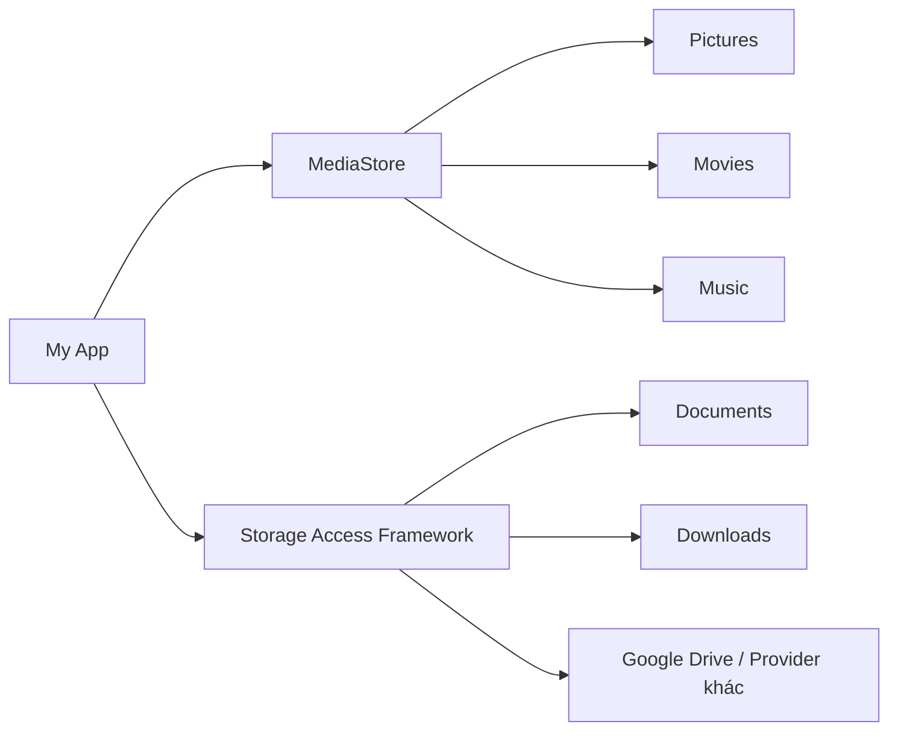

Android khuyến nghị truy cập media dùng chung thông qua `MediaStore`, còn tài liệu/file chung có thể được thao tác thông qua Storage Access Framework. ([Android Developers][3])

---

# 9. MediaStore

`MediaStore` là API quan trọng để làm việc với media trong shared storage.

Các collection phổ biến:

```text
MediaStore
├── Images
├── Video
├── Audio
└── Downloads
```

Ứng dụng thao tác với chúng thông qua:

```kotlin
ContentResolver
```

và thường nhận kết quả dưới dạng:

```kotlin
Uri
```

thay vì tự xây dựng path như:

```text
/storage/emulated/0/Pictures/photo.jpg
```

Android mô tả `MediaStore` là API để ứng dụng truy cập và quản lý các file media trên external storage volumes. ([Android Developers][3])

---

# 10. Ví dụ: lưu ảnh vào Gallery bằng MediaStore

```kotlin
suspend fun saveImage(
    context: Context,
    bitmap: Bitmap
): Uri? = withContext(Dispatchers.IO) {

    val resolver = context.contentResolver

    val values = ContentValues().apply {
        put(
            MediaStore.Images.Media.DISPLAY_NAME,
            "photo_${System.currentTimeMillis()}.jpg"
        )

        put(
            MediaStore.Images.Media.MIME_TYPE,
            "image/jpeg"
        )

        if (Build.VERSION.SDK_INT >= Build.VERSION_CODES.Q) {
            put(
                MediaStore.Images.Media.RELATIVE_PATH,
                Environment.DIRECTORY_PICTURES + "/StorageLab"
            )
        }
    }

    val uri = resolver.insert(
        MediaStore.Images.Media.EXTERNAL_CONTENT_URI,
        values
    ) ?: return@withContext null

    try {
        resolver.openOutputStream(uri)?.use { outputStream ->
            bitmap.compress(
                Bitmap.CompressFormat.JPEG,
                90,
                outputStream
            )
        }

        uri

    } catch (e: IOException) {

        resolver.delete(uri, null, null)

        null
    }
}
```

Trên Android 10 trở lên, một ứng dụng có thể thêm media do chính nó tạo vào shared storage mà không cần yêu cầu storage permission chỉ để thực hiện việc ghi đó. ([Android Developers][3])

---

# 11. Tại sao trả về `Uri` thay vì `File`?

Android storage hiện đại thường hoạt động quanh:

```kotlin
Uri
```

Ví dụ:

```text
content://media/external/images/media/1234
```

thay vì:

```text
/storage/emulated/0/DCIM/photo.jpg
```

Luồng thường là:

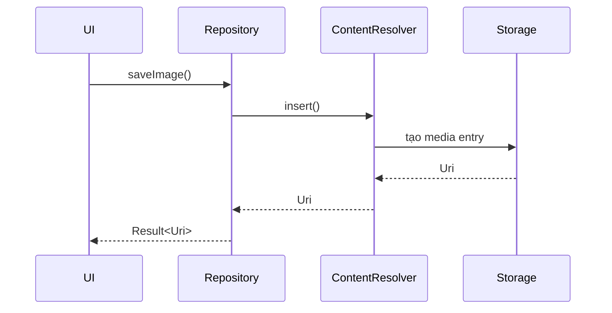

Ưu điểm là app không cần biết chính xác file nằm ở physical path nào.

---

# 12. Scoped Storage

## 12.1. Vấn đề của mô hình cũ

Trước Scoped Storage, các app có thể xin quyền storage khá rộng.

Hình dung:

```text
App A
  |
  +------> DCIM
  +------> Downloads
  +------> App B files
  +------> App C files
```

Điều đó gây các vấn đề về:

* privacy;
* bảo mật;
* quản lý file;
* dữ liệu của app khác.

---

## 12.2. Scoped Storage

Scoped Storage thay đổi tư duy thành:

```text
                     External Storage

       ┌─────────────────────────────────────┐
       │                                     │
 App A │  App A files                        │
       │      ✓                              │
       │                                     │
       │  Shared Media                       │
       │      ✓ MediaStore / permission      │
       │                                     │
       │  User-selected document             │
       │      ✓ SAF                          │
       │                                     │
       │  App B private app-specific files   │
       │      ✕                              │
       │                                     │
       └─────────────────────────────────────┘
```

Scoped Storage được áp dụng nhằm tăng quyền kiểm soát của người dùng và bảo vệ dữ liệu của các ứng dụng khác trên external storage. ([Android Developers][2])

---

# 13. Storage Access Framework — SAF

Nếu ứng dụng muốn người dùng:

> "Chọn file PDF mà bạn muốn mở."

hoặc:

> "Chọn vị trí bạn muốn lưu backup."

thì thường không nên tự duyệt toàn bộ filesystem.

Dùng:

**Storage Access Framework.**

Các action quan trọng gồm:

```text
ACTION_OPEN_DOCUMENT
ACTION_CREATE_DOCUMENT
ACTION_OPEN_DOCUMENT_TREE
```

`ACTION_OPEN_DOCUMENT` cho phép chọn file hiện có, trong khi `ACTION_CREATE_DOCUMENT` cho phép người dùng quyết định vị trí để tạo/lưu file. ([Android Developers][4])

---

# 14. Ví dụ mở PDF bằng SAF

Với Activity Result API:

```kotlin
val openPdfLauncher =
    registerForActivityResult(
        ActivityResultContracts.OpenDocument()
    ) { uri ->

        uri ?: return@registerForActivityResult

        viewModel.openPdf(uri)
    }
```

Mở picker:

```kotlin
openPdfLauncher.launch(
    arrayOf("application/pdf")
)
```

Luồng UX:

```text
User
 |
 | nhấn "Open PDF"
 v
Android system picker
 |
 | chọn file
 v
content://... Uri
 |
 v
App
 |
 v
ContentResolver
```

---

# 15. Ví dụ tạo file export

```kotlin
val createBackupLauncher =
    registerForActivityResult(
        ActivityResultContracts.CreateDocument(
            "application/json"
        )
    ) { uri ->

        uri ?: return@registerForActivityResult

        lifecycleScope.launch {
            exportBackup(uri)
        }
    }
```

Kích hoạt:

```kotlin
createBackupLauncher.launch(
    "storage_lab_backup.json"
)
```

Ghi dữ liệu:

```kotlin
private suspend fun exportBackup(
    uri: Uri
) = withContext(Dispatchers.IO) {

    contentResolver
        .openOutputStream(uri)
        ?.bufferedWriter()
        ?.use { writer ->

            writer.write(
                """
                {
                  "version": 1,
                  "darkMode": true
                }
                """.trimIndent()
            )
        }
}
```

---

# 16. Photo Picker

Nếu app chỉ cần:

> người dùng chọn một vài ảnh/video

thì không nên xin quyền đọc toàn bộ Gallery chỉ vì tiện.

Android cung cấp **Photo Picker**, cho phép người dùng chỉ chia sẻ những ảnh/video họ lựa chọn. Android Developers khuyến nghị Photo Picker vì nó cung cấp trải nghiệm chọn media riêng tư hơn mà không cần cấp quyền truy cập toàn bộ thư viện. ([Android Developers][5])

Ví dụ:

```kotlin
val pickMedia =
    registerForActivityResult(
        ActivityResultContracts.PickVisualMedia()
    ) { uri ->

        if (uri != null) {
            viewModel.onImageSelected(uri)
        }
    }
```

Mở:

```kotlin
pickMedia.launch(
    PickVisualMediaRequest(
        ActivityResultContracts
            .PickVisualMedia
            .ImageOnly
    )
)
```

---

# 17. Photo Picker hay READ_MEDIA_IMAGES?

Một quy tắc thực tế:

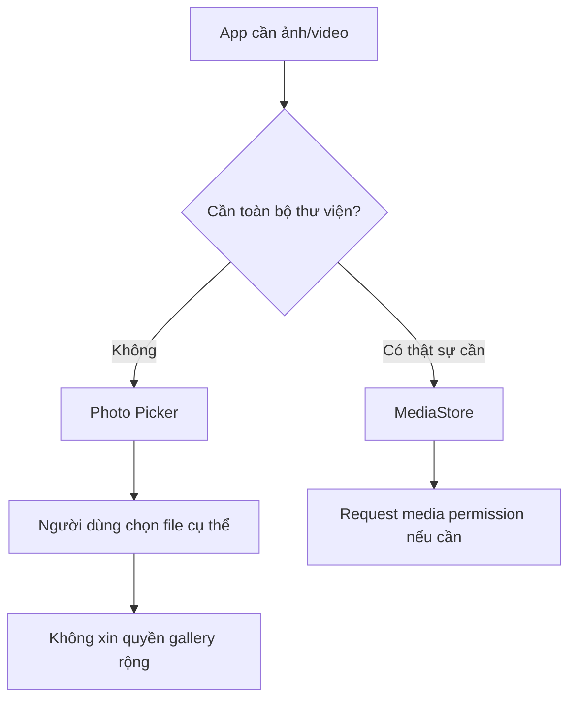

Ví dụ:

### Avatar

```text
Chọn 1 ảnh
→ Photo Picker
```

### Messenger attachment

```text
Chọn 1–10 ảnh
→ Photo Picker
```

### Gallery manager

```text
Cần hiển thị toàn bộ thư viện
→ MediaStore
→ media permission
```

---

# 18. Permission trên Android hiện đại

Từ Android 13, quyền truy cập media được tách theo từng loại thay cho một quyền đọc external storage chung:

```xml
<uses-permission
    android:name="android.permission.READ_MEDIA_IMAGES" />

<uses-permission
    android:name="android.permission.READ_MEDIA_VIDEO" />

<uses-permission
    android:name="android.permission.READ_MEDIA_AUDIO" />
```

Android 13 sử dụng các granular media permissions này để truy cập media do ứng dụng khác tạo. ([Android Developers][6])

---

# 19. Android 14 — Selected Photos Access

Android 14 thêm khả năng người dùng chỉ cho phép app truy cập:

> **một số ảnh/video được chọn**

thay vì toàn bộ Gallery. ([Android Developers][7])

Có thêm permission:

```xml
<uses-permission
    android:name=
        "android.permission.READ_MEDIA_VISUAL_USER_SELECTED" />
```

Luồng có thể trở thành:

```text
App yêu cầu ảnh
        |
        v
┌─────────────────────────┐
│ Allow all photos        │
│ Select photos & videos  │
│ Don't allow             │
└─────────────────────────┘
        |
        v
App có thể chỉ nhìn thấy
một subset của Gallery
```

Điều này có một ảnh hưởng kiến trúc quan trọng:

> **Không được giả định rằng "permission đã granted" đồng nghĩa với app luôn nhìn thấy toàn bộ thư viện.**

Android cũng khuyến nghị không lưu trạng thái permission vĩnh viễn vào `SharedPreferences` hoặc DataStore, vì quyền có thể bị người dùng hoặc hệ thống thay đổi; ứng dụng nên kiểm tra lại trạng thái thực tế.

---

# 20. Lifecycle và External Storage

Storage không hoàn toàn tách biệt khỏi lifecycle.

Ví dụ người dùng:

```text
App đang foreground
        |
        v
Settings
        |
        v
Thay đổi permission
        |
        v
Quay lại app
        |
        v
onResume()
```

Vì permission media có thể thay đổi khi người dùng rời app, Android khuyến nghị refresh lại các kết quả liên quan khi phù hợp, thay vì coi dữ liệu cache trước đó là luôn đúng.

Một UI state tốt:

```kotlin
sealed interface GalleryUiState {

    data object Loading : GalleryUiState

    data class Success(
        val images: List<MediaItem>
    ) : GalleryUiState

    data object PermissionRequired : GalleryUiState

    data object PartialAccess : GalleryUiState

    data class Error(
        val message: String
    ) : GalleryUiState
}
```

---

# 21. Architecture phù hợp

Không nên để Composable hoặc Activity trực tiếp chứa toàn bộ code file I/O.

Không tốt:

```text
Composable
   ↓
ContentResolver
   ↓
Filesystem
```

Nên tổ chức:

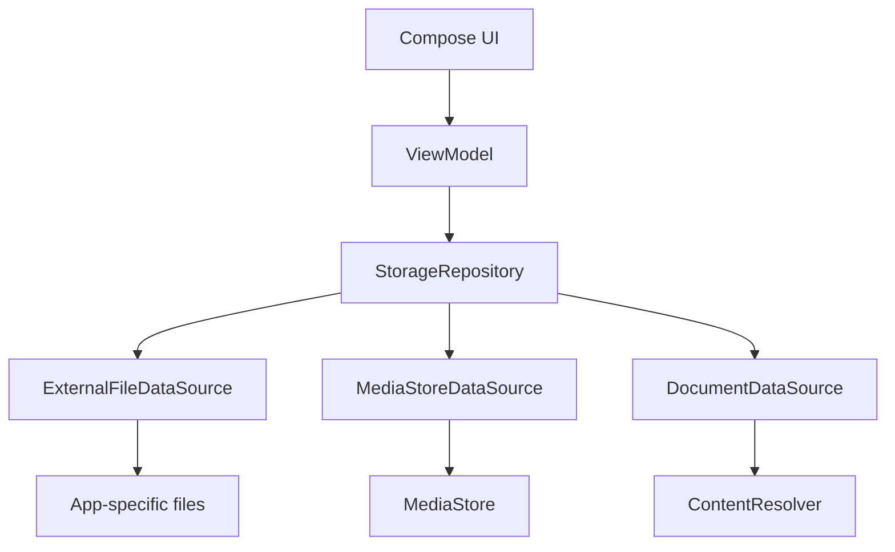

Ví dụ interface:

```kotlin
interface StorageRepository {

    suspend fun saveBackup(
        data: BackupData
    ): Result<File>

    suspend fun readBackup():
        Result<BackupData>

    suspend fun exportBackup(
        uri: Uri
    ): Result<Unit>
}
```

---

# 22. Model dữ liệu thực hành

Ta xây một app nhỏ:

# StorageLab

App lưu profile offline:

```kotlin
data class UserProfile(
    val name: String,
    val darkMode: Boolean,
    val lastUpdated: Long
)
```

Serialize:

```json
{
  "name": "Khanh",
  "darkMode": true,
  "lastUpdated": 1786470000000
}
```

---

# 23. Repository đọc/ghi External Storage

```kotlin
class ExternalProfileRepository(
    private val context: Context,
    private val json: Json
) {

    private fun profileFile(): File? {

        val directory =
            context.getExternalFilesDir(null)
                ?: return null

        return File(
            directory,
            "profile.json"
        )
    }

    suspend fun save(
        profile: UserProfile
    ): Result<Unit> =
        withContext(Dispatchers.IO) {

            runCatching {

                val file = profileFile()
                    ?: error(
                        "External storage unavailable"
                    )

                file.writeText(
                    json.encodeToString(profile)
                )
            }
        }

    suspend fun load():
        Result<UserProfile> =
        withContext(Dispatchers.IO) {

            runCatching {

                val file = profileFile()
                    ?: error(
                        "External storage unavailable"
                    )

                if (!file.exists()) {
                    return@runCatching UserProfile(
                        name = "",
                        darkMode = false,
                        lastUpdated = 0
                    )
                }

                json.decodeFromString(
                    file.readText()
                )
            }
        }
}
```

---

# 24. Error case cần xử lý

Storage code không nên giả định:

```text
write() luôn thành công
```

Các trường hợp thực tế gồm:

```text
External storage unavailable
File không tồn tại
IOException
JSON bị corrupt
Permission bị thu hồi
Uri không còn truy cập được
Disk hết dung lượng
File bị người dùng xóa
```

Luồng:

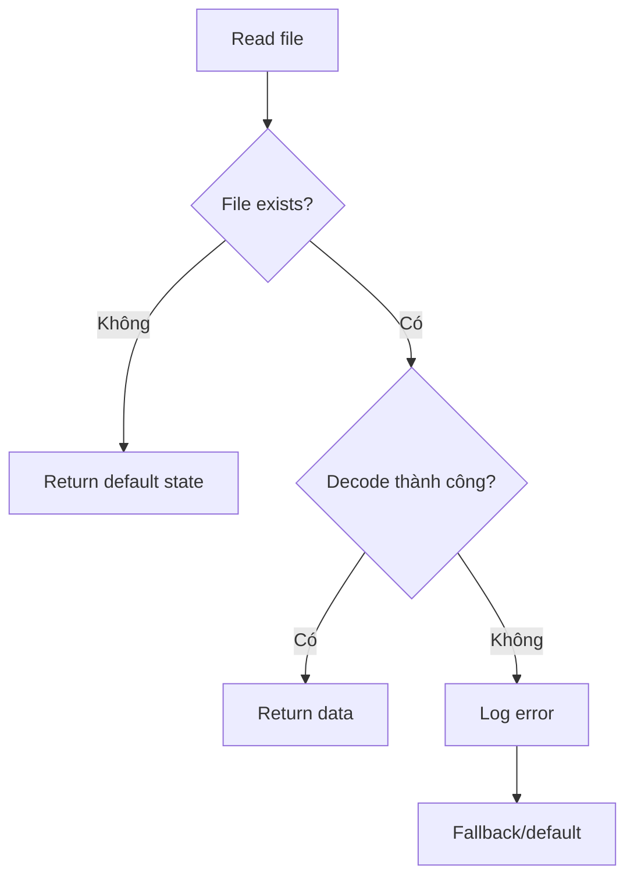

---

# 25. Migration

Giả sử phiên bản đầu:

```json
{
  "name": "Khanh"
}
```

Phiên bản mới:

```json
{
  "version": 2,
  "name": "Khanh",
  "darkMode": false
}
```

Có thể định nghĩa:

```kotlin
@Serializable
data class ProfileFile(
    val version: Int = 1,
    val name: String = "",
    val darkMode: Boolean = false
)
```

Sau khi đọc:

```kotlin
fun migrate(
    old: ProfileFile
): ProfileFile {

    return when (old.version) {

        1 -> old.copy(
            version = 2,
            darkMode = false
        )

        else -> old
    }
}
```

Đây chính là cách nối kiến thức **Storage** với:

* schema evolution;
* backward compatibility;
* release engineering.

---

# 26. Local vs Remote Data

Giả sử app có API:

```text
GET /profile
```

Đừng để UI tự quyết định:

```text
đọc file hay gọi network?
```

Repository nên chịu trách nhiệm.

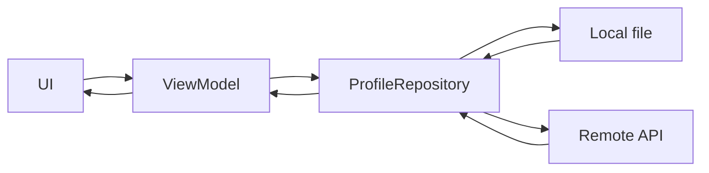

Một strategy đơn giản:

```text
Mở app
  ↓
Đọc local
  ↓
Hiển thị ngay
  ↓
Gọi API
  ↓
Có dữ liệu mới?
  ↓
Update local
  ↓
Update UI
```

Đây là pattern rất hữu ích cho offline-first UX.

---

# 27. External Storage ảnh hưởng tới UX như thế nào?

Storage không chỉ là implementation detail.

### Khi lưu thành công

```text
Export completed
Saved to Downloads
```

### Khi storage unavailable

```text
Không thể lưu file lúc này.
Vui lòng thử lại.
```

### Khi permission thiếu

Không nên:

```text
Error: SecurityException
```

Nên:

```text
Cho phép ứng dụng truy cập ảnh
để chọn ảnh từ thư viện.
```

### Khi người dùng từ chối

App không nên crash.

```text
Permission denied
      ↓
UI vẫn hoạt động
      ↓
Feature bị giới hạn
      ↓
Có nút thử lại khi cần
```

---

# 28. Không thực hiện File I/O trên Main Thread

Các thao tác:

```text
read file
write file
query MediaStore
decode bitmap
```

có thể tốn thời gian.

Android cũng khuyến nghị các query MediaStore thực hiện ngoài main thread để giữ UI responsive.

Ví dụ:

```kotlin
suspend fun readData() =
    withContext(Dispatchers.IO) {

        file.readText()

    }
```

Sai:

```kotlin
Button(
    onClick = {
        val hugeFile = file.readText()
    }
)
```

---

# 29. `File` và `Uri`

Một distinction rất quan trọng:

| Trường hợp                 | Kiểu thường dùng |
| -------------------------- | ---------------- |
| Internal app file          | `File`           |
| App-specific external file | `File`           |
| MediaStore                 | `Uri`            |
| Photo Picker               | `Uri`            |
| SAF document               | `Uri`            |

Do đó repository Android hiện đại thường phải làm việc được với cả:

```kotlin
File
```

và:

```kotlin
Uri
```

---

# 30. Quy tắc chọn API

| Nhu cầu                                    | API nên cân nhắc            |
| ------------------------------------------ | --------------------------- |
| Config nhỏ                                 | DataStore                   |
| Database                                   | Room                        |
| File private nhỏ                           | Internal Storage            |
| File riêng của app, dung lượng lớn hơn     | `getExternalFilesDir()`     |
| Ảnh/video/audio dùng chung                 | `MediaStore`                |
| Chọn một vài ảnh/video                     | Photo Picker                |
| Người dùng chọn PDF                        | SAF                         |
| Export PDF/JSON tới vị trí người dùng chọn | SAF                         |
| Chọn cả directory                          | `ACTION_OPEN_DOCUMENT_TREE` |

Các hướng MediaStore, Photo Picker và SAF tương ứng với mô hình truy cập shared media/tài liệu được Android Developers mô tả cho storage hiện đại. ([Android Developers][3])

---

# 31. Internal Storage vs External Storage

| Tiêu chí                         | Internal    | App-specific External   |
| -------------------------------- | ----------- | ----------------------- |
| Private cho app                  | Có          | Scoped cho app          |
| Storage permission               | Không       | Không                   |
| Xóa khi uninstall                | Có          | Có                      |
| Có thể phụ thuộc external volume | Không       | Có                      |
| Dùng cho file nhạy cảm           | Phù hợp hơn | Cần cân nhắc            |
| File lớn                         | Có thể      | Thường hữu ích          |
| API                              | `filesDir`  | `getExternalFilesDir()` |

Đặc biệt, Android nhấn mạnh rằng external storage có thể không luôn khả dụng, vì vậy app-specific external storage không nên được coi giống hệt internal storage. ([Android Developers][2])

---

# 32. App-specific vs Shared External Storage

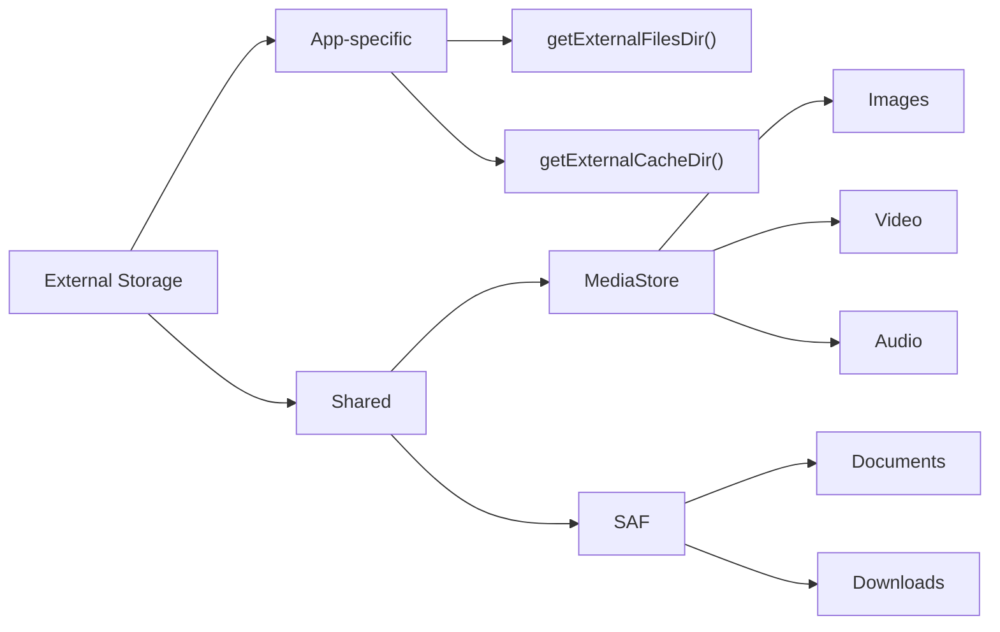

---

# 33. Những anti-pattern cần tránh

## Anti-pattern 1 — Hard-code absolute path

Không nên:

```kotlin
File(
    "/storage/emulated/0/Pictures/a.jpg"
)
```

Nên sử dụng API phù hợp như:

```text
MediaStore
SAF
getExternalFilesDir()
```

---

## Anti-pattern 2 — Xin permission rộng không cần thiết

Ví dụ app chỉ cần avatar:

```text
Xin quyền toàn bộ Gallery
```

không tốt bằng:

```text
Photo Picker
→ người dùng chọn 1 ảnh
```

Photo Picker được thiết kế để người dùng cấp quyền truy cập chỉ tới media họ lựa chọn. ([Android Developers][5])

---

## Anti-pattern 3 — Lưu permission state vào DataStore

Không nên:

```kotlin
dataStore.edit {
    it[HAS_PHOTO_PERMISSION] = true
}
```

rồi tin rằng giá trị đó mãi đúng.

Người dùng có thể thay đổi permission bên ngoài app. Android đặc biệt khuyến nghị kiểm tra permission hiện tại thay vì persist trạng thái permission như một nguồn sự thật.

---

## Anti-pattern 4 — Coi `Uri` như file path

Không nên:

```kotlin
File(uri.path!!)
```

với:

```text
content://...
```

Nên:

```kotlin
contentResolver
    .openInputStream(uri)
```

---

## Anti-pattern 5 — Đọc file lớn trên UI thread

```text
Main Thread
     ↓
đọc 500 MB
     ↓
UI freeze
```

Thay vào đó:

```text
Dispatchers.IO
     ↓
Storage
```

---

# 34. Testing

Storage feature nên được kiểm tra nhiều hơn case:

```text
"file write thành công"
```

## Test matrix

| Case                         | Expected                 |
| ---------------------------- | ------------------------ |
| File chưa tồn tại            | Default value            |
| Save thành công              | Load được đúng dữ liệu   |
| JSON lỗi                     | Không crash              |
| External storage unavailable | Error state              |
| User cancel picker           | Không crash              |
| Permission denied            | UI fallback              |
| Permission bị thay đổi       | Refresh state            |
| File bị xóa                  | Handle gracefully        |
| App restart                  | Dữ liệu vẫn đọc được     |
| Uninstall app-specific data  | App-specific data bị xóa |

---

# 35. Unit test repository

Ví dụ tách interface:

```kotlin
interface FileDataSource {

    suspend fun write(
        name: String,
        data: String
    )

    suspend fun read(
        name: String
    ): String?
}
```

Fake:

```kotlin
class FakeFileDataSource :
    FileDataSource {

    private val storage =
        mutableMapOf<String, String>()

    override suspend fun write(
        name: String,
        data: String
    ) {
        storage[name] = data
    }

    override suspend fun read(
        name: String
    ): String? {
        return storage[name]
    }
}
```

Test:

```kotlin
@Test
fun saveThenLoad_returnsSameProfile() =
    runTest {

        repository.save(
            UserProfile(
                name = "Khanh",
                darkMode = true,
                lastUpdated = 123
            )
        )

        val result =
            repository.load()

        assertEquals(
            "Khanh",
            result.getOrThrow().name
        )
    }
```

---

# 36. Debugging External Storage

Các công cụ hữu ích:

```text
Android Studio
 └── Device Explorer

Logcat

adb shell

dumpsys package

App permission settings
```

Log nên chứa:

```text
operation
file type
success/failure
exception type
```

Không nên log:

```text
nội dung private của file
access token
password
PII nhạy cảm
```

Ví dụ:

```kotlin
Log.e(
    "StorageRepository",
    "Failed to export profile",
    exception
)
```

---

# 37. Bài thực hành — StorageLab

## Yêu cầu

Tạo app có màn hình:

```text
┌─────────────────────────────┐
│ StorageLab                  │
│                             │
│ Name                        │
│ [ Khanh                 ]   │
│                             │
│ Dark Mode                   │
│ [ ON ]                      │
│                             │
│ [ Save locally ]            │
│                             │
│ [ Load ]                    │
│                             │
│ [ Export JSON ]             │
│                             │
│ [ Select profile image ]    │
└─────────────────────────────┘
```

---

## Feature 1 — Local external file

```text
Save locally
      ↓
getExternalFilesDir()
      ↓
profile.json
```

---

## Feature 2 — Export

```text
Export JSON
      ↓
CreateDocument
      ↓
System file picker
      ↓
User chọn thư mục
      ↓
Write bằng ContentResolver
```

---

## Feature 3 — Chọn avatar

```text
Select profile image
      ↓
Photo Picker
      ↓
Uri
      ↓
UI hiển thị ảnh
```

Photo Picker là lựa chọn phù hợp cho workflow chọn một media item cụ thể thay vì yêu cầu toàn quyền với thư viện. ([Android Developers][5])

---

# 38. Architecture cho StorageLab

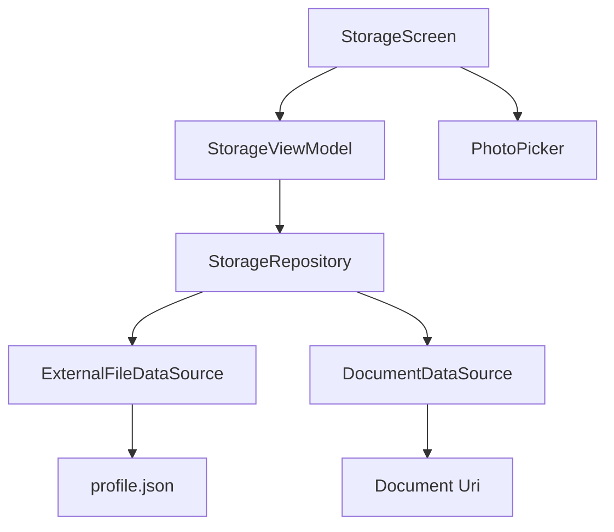

---

# 39. UI State

```kotlin
data class StorageUiState(

    val profile: UserProfile =
        UserProfile(
            name = "",
            darkMode = false,
            lastUpdated = 0
        ),

    val avatarUri: Uri? = null,

    val isSaving: Boolean = false,

    val message: String? = null,

    val error: String? = null
)
```

ViewModel:

```kotlin
class StorageViewModel(
    private val repository:
        StorageRepository
) : ViewModel() {

    private val _uiState =
        MutableStateFlow(
            StorageUiState()
        )

    val uiState =
        _uiState.asStateFlow()

    fun save() {

        viewModelScope.launch {

            _uiState.update {
                it.copy(
                    isSaving = true
                )
            }

            repository
                .saveProfile(
                    _uiState.value.profile
                )
                .onSuccess {

                    _uiState.update {
                        it.copy(
                            isSaving = false,
                            message =
                                "Saved successfully"
                        )
                    }

                }
                .onFailure { throwable ->

                    _uiState.update {
                        it.copy(
                            isSaving = false,
                            error =
                                throwable.message
                        )
                    }
                }
        }
    }
}
```

---

# 40. Luồng dữ liệu hoàn chỉnh

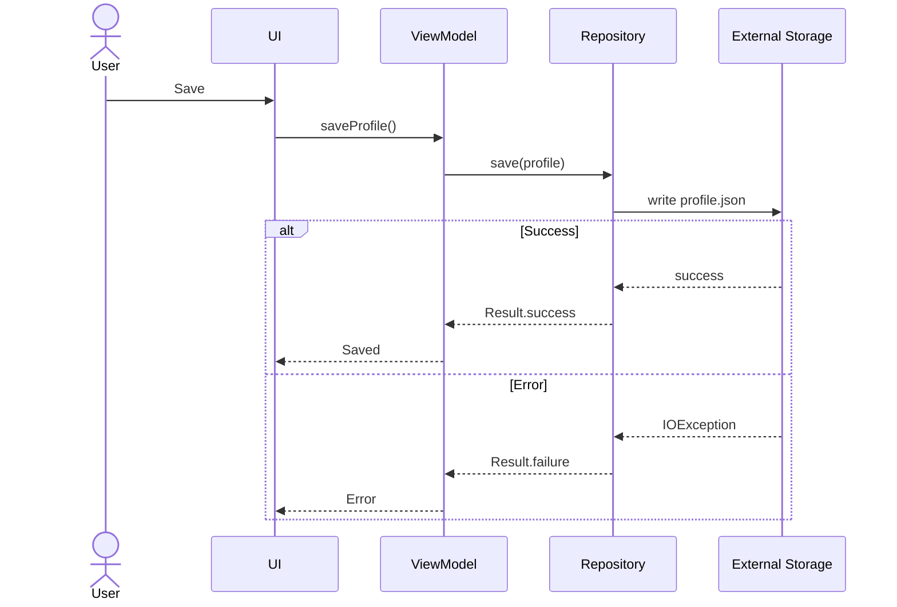

---

# 41. Bài tập

## Bài 1 — App-specific External Storage

Lưu:

```json
{
    "username": "...",
    "theme": "dark"
}
```

bằng:

```kotlin
getExternalFilesDir()
```

Sau đó đọc lại.

---

## Bài 2 — Default value

Nếu:

```text
profile.json
```

không tồn tại:

```kotlin
return DefaultProfile
```

thay vì crash.

---

## Bài 3 — Migration

Version 1:

```json
{
  "username": "Khanh"
}
```

Version 2:

```json
{
  "version": 2,
  "username": "Khanh",
  "darkMode": false
}
```

Viết migration:

```text
v1 → v2
```

---

## Bài 4 — Export

Cho phép:

```text
profile.json
```

được export thông qua:

```kotlin
CreateDocument
```

---

## Bài 5 — Photo Picker

Cho phép người dùng chọn avatar.

Lưu:

```kotlin
Uri?
```

trong UI state.

---

# 42. Câu hỏi phỏng vấn

### 1. External Storage có phải luôn là SD card không?

Không.

External storage có thể là emulated storage nằm trên bộ nhớ tích hợp hoặc removable storage. ([Android Developers][2])

---

### 2. `getExternalFilesDir()` có cần storage permission không?

Không đối với app-specific external directory của chính ứng dụng. ([Android Developers][2])

---

### 3. File trong `getExternalFilesDir()` có tồn tại sau uninstall không?

App-specific files được xóa khi app bị uninstall. ([Android Developers][2])

---

### 4. Lưu ảnh vào Gallery nên dùng gì?

Thông thường:

```text
MediaStore
```

([Android Developers][3])

---

### 5. Chọn một ảnh avatar nên dùng gì?

Thông thường:

```text
Photo Picker
```

thay vì xin quyền đọc toàn bộ thư viện. ([Android Developers][5])

---

### 6. Chọn PDF nên dùng gì?

```text
Storage Access Framework
```

với:

```text
ACTION_OPEN_DOCUMENT
```

([Android Developers][4])

---

### 7. Scoped Storage giải quyết điều gì?

Nó hạn chế quyền truy cập rộng vào external storage, bảo vệ dữ liệu app/user tốt hơn và định hướng app dùng các API phù hợp như app-specific directories, MediaStore và SAF. ([Android Developers][2])

---

### 8. Android 13 thay đổi storage permission như thế nào?

Việc đọc shared media chuyển sang các quyền cụ thể hơn:

```text
READ_MEDIA_IMAGES
READ_MEDIA_VIDEO
READ_MEDIA_AUDIO
```

([Android Developers][6])

---

### 9. Android 14 có gì liên quan đến Gallery?

Người dùng có thể cấp quyền truy cập chỉ đối với một tập ảnh/video đã chọn thay vì toàn bộ thư viện. ([Android Developers][7])

---

# 43. Mental model cần nhớ

Có thể ghi nhớ bằng 4 câu:

```text
Private app data?
        ↓
Internal Storage

Private app file nhưng cần external space?
        ↓
getExternalFilesDir()

Media dùng chung?
        ↓
MediaStore

User tự chọn file/location?
        ↓
Photo Picker / SAF
```

Hoặc decision tree đầy đủ:

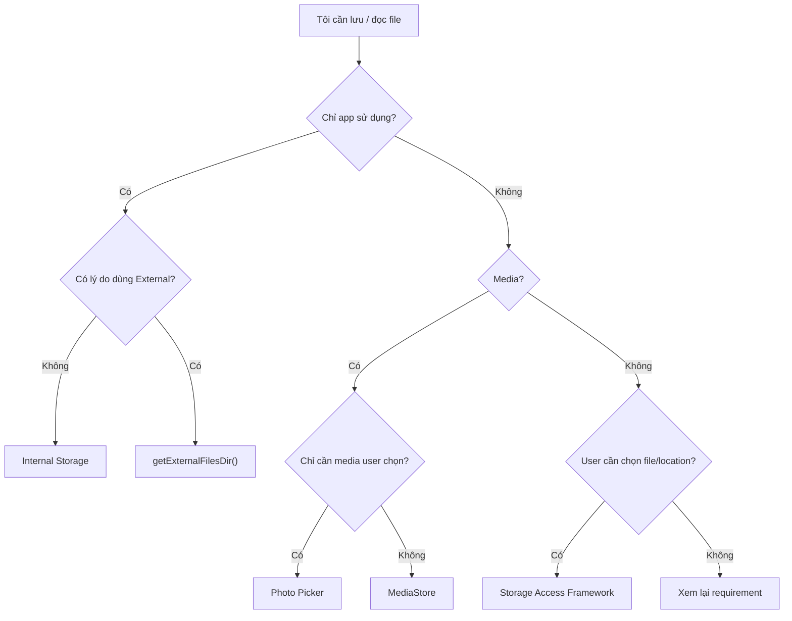

---

# 44. Checklist production

## Storage

* [ ] Không hard-code `/storage/emulated/0/...`.
* [ ] Đã chọn đúng storage API.
* [ ] App-specific data dùng `getExternalFilesDir()` khi phù hợp.
* [ ] Shared media dùng `MediaStore`.
* [ ] File/document do user chọn dùng SAF.
* [ ] Chọn ảnh/video đơn giản ưu tiên Photo Picker.

## Permission

* [ ] Không request permission khi không cần.
* [ ] Permission được request theo đúng thời điểm của user flow.
* [ ] UI xử lý trường hợp denied.
* [ ] Không persist permission state như nguồn sự thật.
* [ ] Có xử lý partial media access.

## Lifecycle

* [ ] App không giả định quyền luôn giữ nguyên.
* [ ] Có refresh dữ liệu khi quyền có thể thay đổi.
* [ ] Process recreation không làm mất state quan trọng.

## I/O

* [ ] File I/O không chạy trên Main Thread.
* [ ] Có xử lý `IOException`.
* [ ] Có xử lý file corrupt.
* [ ] Có xử lý storage unavailable.
* [ ] Có xử lý file bị xóa.

## UX

* [ ] Loading state.
* [ ] Error state.
* [ ] Permission state.
* [ ] Cancel picker không crash.
* [ ] Save/export có feedback rõ ràng.

## Testing

* [ ] Read/write test.
* [ ] Default-value test.
* [ ] Migration test.
* [ ] Permission-denied scenario.
* [ ] Missing-file scenario.
* [ ] Corrupt-file scenario.
* [ ] App restart scenario.

---

# 45. Artifact đưa vào portfolio

Một artifact tốt cho bài này:

```text
StorageLab/
│
├── README.md
├── screenshots/
│   ├── home.png
│   ├── photo-picker.png
│   └── export-document.png
│
├── storage/
│   ├── StorageRepository.kt
│   ├── ExternalFileDataSource.kt
│   └── DocumentDataSource.kt
│
├── ui/
│   ├── StorageScreen.kt
│   └── StorageViewModel.kt
│
└── test/
    └── StorageRepositoryTest.kt
```

README có thể mô tả:

```markdown
## Storage APIs

- App-specific external storage
- MediaStore
- Photo Picker
- Storage Access Framework

## Architecture

UI → ViewModel → Repository → Storage API

## Error cases

- Missing file
- Corrupted JSON
- Cancelled picker
- Permission denied
- Storage unavailable
```

Đây sẽ mạnh hơn nhiều so với một project chỉ có:

```text
File.writeText()
```

vì nó chứng minh anh hiểu cả:

```text
Storage
+ Architecture
+ Permission
+ Lifecycle
+ Error handling
+ Testing
+ UX
```

---

# 46. Checklist hoàn thành bài học

* [ ] Giải thích được External Storage.
* [ ] Biết external storage không đồng nghĩa SD card.
* [ ] Phân biệt app-specific và shared storage.
* [ ] Hiểu Scoped Storage.
* [ ] Biết `getExternalFilesDir()`.
* [ ] Biết `MediaStore`.
* [ ] Biết Storage Access Framework.
* [ ] Biết Photo Picker.
* [ ] Hiểu vai trò của `Uri`.
* [ ] Biết Android 13 dùng granular media permissions.
* [ ] Hiểu Selected Photos Access của Android 14.
* [ ] Không lưu permission state vĩnh viễn như source of truth.
* [ ] Có xử lý storage/error state.
* [ ] Có ít nhất một unit test.
* [ ] Có mini-project hoặc screenshot để đưa vào portfolio.

---

# 47. Ghi chú production

Khi sử dụng External Storage trong production, câu hỏi quan trọng nhất không phải là:

> "Làm sao ghi file xuống `/sdcard`?"

Mà là:

```text
Dữ liệu này thuộc về ai?
        ↓
Người dùng có cần nhìn thấy nó ngoài app không?
        ↓
Ứng dụng khác có cần truy cập không?
        ↓
User có nên tự chọn file/location không?
        ↓
App cần permission rộng đến mức nào?
        ↓
API Android nào cung cấp phạm vi nhỏ nhất đủ dùng?
```

Một Android developer tốt nên hướng đến nguyên tắc:

> **Cấp quyền tối thiểu, phạm vi storage tối thiểu và ownership rõ ràng.**

Với Android hiện đại, mental model nên là:

```text
Internal Storage
       │
       ├── private app data
       │
External App-Specific
       │
       ├── private app files
       │
MediaStore
       │
       ├── shared media
       │
Photo Picker
       │
       ├── selected media
       │
Storage Access Framework
       │
       └── user-selected documents
```

Đó là nền tảng để tránh các lỗi phổ biến về **permission, privacy, lifecycle, compatibility và release** trong các ứng dụng Android hiện đại.

[1]: https://developer.android.com/training/data-storage?utm_source=chatgpt.com "Data and file storage overview | App data and files"
[2]: https://developer.android.com/training/data-storage/app-specific?utm_source=chatgpt.com "Access app-specific files | App data and files"
[3]: https://developer.android.com/training/data-storage/shared/media?utm_source=chatgpt.com "Access media files from shared storage | App data and files"
[4]: https://developer.android.com/training/data-storage/shared/documents-files?utm_source=chatgpt.com "Access documents and other files from shared storage"
[5]: https://developer.android.com/training/data-storage/shared/photo-picker?utm_source=chatgpt.com "Photo picker | App data and files"
[6]: https://developer.android.com/about/versions/13/behavior-changes-13?utm_source=chatgpt.com "Behavior changes: Apps targeting Android 13 or higher"
[7]: https://developer.android.com/about/versions/14/changes/partial-photo-video-access?utm_source=chatgpt.com "Grant partial access to photos and videos"

---

# Bài luyện tập

## Mục tiêu


## Đề bài


## Yêu cầu hoàn thành

- [ ] 
- [ ] 
- [ ] 

## Kết quả / lời giải


## Ghi chú
