# 008 - Serialization

**Học phần:** 03 - Architecture, State and Data
**Module:** Module 06 - Storage
**Nhóm nội dung:** Preferences and Files
**Nguồn roadmap:** Storage / Preferences and Files
**Loại bài:** Storage
**Thứ tự trong module:** 008
**Thời lượng gợi ý:** 32 phút

> **Trọng tâm:** hiểu cách biến Kotlin object thành dữ liệu có thể lưu/truyền đi và khôi phục dữ liệu đó trở lại thành Kotlin object.

---

## 1. Tóm tắt

**Serialization** là quá trình chuyển dữ liệu đang tồn tại dưới dạng object trong chương trình thành một định dạng có thể:

* lưu xuống file;
* lưu vào DataStore;
* lưu vào database;
* đưa vào cache;
* truyền qua network/API;
* gửi cho một hệ thống khác.

**Deserialization** là quá trình ngược lại: đọc dữ liệu bên ngoài và tạo lại object mà chương trình có thể sử dụng. Kotlin cung cấp hệ sinh thái `kotlinx.serialization`; các định dạng được hỗ trợ gồm JSON và nhiều định dạng khác. ([Kotlin][1])

Ví dụ:

```text
Kotlin object
     ↓
Serialization
     ↓
JSON / Proto / Bytes
     ↓
File / DataStore / Network
```

và khi đọc:

```text
File / DataStore / Network
     ↓
JSON / Proto / Bytes
     ↓
Deserialization
     ↓
Kotlin object
```

Một ví dụ đơn giản:

```kotlin
User(
    id = 101,
    name = "An",
    premium = true
)
```

sau khi serialize thành JSON:

```json
{
  "id": 101,
  "name": "An",
  "premium": true
}
```

---

## 2. Mục tiêu học tập

Sau bài này, bạn nên có thể:

* [ ] Giải thích được **Serialization** và **Deserialization**.
* [ ] Hiểu vì sao object Kotlin không thể đơn giản được "ném" trực tiếp xuống file.
* [ ] Serialize một `data class` thành JSON.
* [ ] Deserialize JSON trở lại object.
* [ ] Sử dụng `kotlinx.serialization`.
* [ ] Hiểu `@Serializable`.
* [ ] Hiểu vai trò của `Serializer<T>` trong DataStore.
* [ ] Biết cách xử lý JSON lỗi hoặc schema thay đổi.
* [ ] Phân biệt Serialization với encryption.
* [ ] Biết khi nào nên dùng JSON, Proto DataStore, Preferences DataStore hoặc Room.
* [ ] Viết được test kiểm tra serialize → deserialize.
* [ ] Xây dựng một artifact nhỏ cho portfolio.

---

# 3. Serialization là gì?

Giả sử app có:

```kotlin
data class UserSettings(
    val darkMode: Boolean,
    val language: String,
    val fontSize: Int
)
```

Trong RAM, nó tồn tại dưới dạng một **object**:

```text
UserSettings object
├── darkMode = true
├── language = "vi"
└── fontSize = 16
```

File system không hiểu khái niệm Kotlin `data class`.

Nó chỉ có thể lưu dạng dữ liệu như:

```text
bytes
```

hoặc một representation như:

```text
JSON
Protocol Buffers
CBOR
XML
...
```

Vì vậy phải có một bước chuyển đổi.

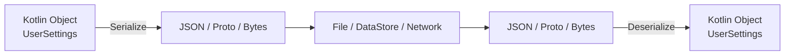

Kotlin định nghĩa serialization chính xác theo mô hình này: dữ liệu ứng dụng được chuyển thành format phù hợp để lưu hoặc truyền, rồi deserialization khôi phục format đó về runtime object. ([Kotlin][1])

---

# 4. Serialization nằm ở đâu trong kiến trúc Android?

Serialization thường nằm ở **Data Layer**, không phải UI.

Một kiến trúc đơn giản:

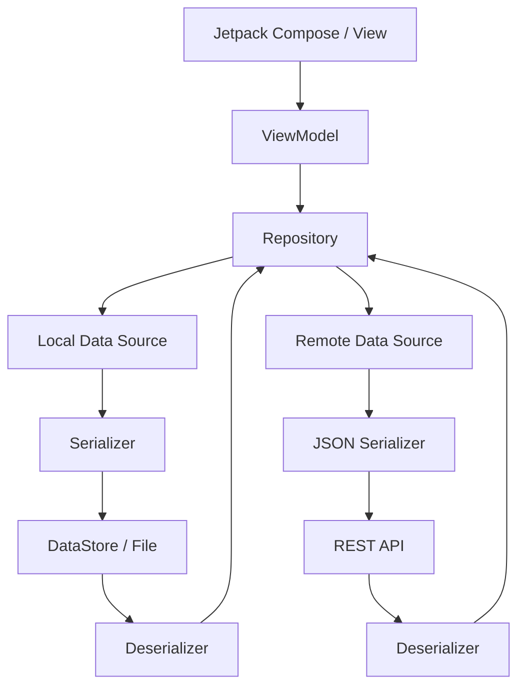

Ví dụ:

```text
UI
 ↓
ViewModel
 ↓
Repository
 ↓
SettingsDataSource
 ↓
Serializer
 ↓
settings.json
```

### Quy tắc kiến trúc

UI không nên làm:

```kotlin
Json.decodeFromString(...)
```

trực tiếp trong Composable.

Thay vào đó:

```text
Composable
    ↓
ViewModel
    ↓
Repository
    ↓
Serializer / DataSource
```

Điều này giúp serialization trở thành implementation detail của **Data Layer**.

---

# 5. Serialization và Deserialization

## 5.1 Serialization

Object:

```kotlin
User(
    id = 7,
    name = "Khanh"
)
```

↓

```json
{
  "id": 7,
  "name": "Khanh"
}
```

---

## 5.2 Deserialization

JSON:

```json
{
  "id": 7,
  "name": "Khanh"
}
```

↓

```kotlin
User(
    id = 7,
    name = "Khanh"
)
```

Kotlin `Json` cung cấp trực tiếp hai thao tác chính:

```kotlin
encodeToString()
decodeFromString()
```

để chuyển object ↔ JSON. ([Kotlin][2])

---

# 6. Vì sao cần Serialization?

## 6.1 Lưu setting

```kotlin
UserSettings(
    darkMode = true,
    language = "vi"
)
```

↓

```json
{
  "darkMode": true,
  "language": "vi"
}
```

↓

```text
settings.json
```

---

## 6.2 Lưu cache

Ví dụ app thời tiết:

```text
Weather API
     ↓
WeatherDto
     ↓
serialize
     ↓
weather_cache.json
```

Khi offline:

```text
weather_cache.json
       ↓
deserialize
       ↓
WeatherDto
       ↓
UI
```

---

## 6.3 Nhận dữ liệu API

Server trả:

```json
{
  "id": 24,
  "title": "Learn Android"
}
```

App cần biến nó thành:

```kotlin
Task(
    id = 24,
    title = "Learn Android"
)
```

Serialization vì vậy không chỉ thuộc Storage; nó còn thường nằm ở ranh giới:

```text
App ↔ Network

App ↔ File

App ↔ DataStore
```

Android cũng sử dụng `kotlinx.serialization` trong tài liệu hướng dẫn parse JSON response từ web service. ([Android Developers][3])

---

# 7. Kotlinx Serialization

Trong Kotlin hiện đại, một lựa chọn quan trọng là:

```text
kotlinx.serialization
```

Thư viện hỗ trợ JSON thông qua artifact:

```text
org.jetbrains.kotlinx:kotlinx-serialization-json
```

và Kotlin serialization sử dụng hệ thống serializer được tạo cho kiểu dữ liệu thay vì phụ thuộc vào reflection mở rộng ở runtime. Android cũng khuyến nghị cân nhắc các thư viện serialization dựa trên code generation như Kotlin Serialization thay cho các giải pháp phụ thuộc nhiều vào reflection. ([Kotlin][1])

---

# 8. Cấu hình project

Nếu project sử dụng Version Catalog, cấu hình thực tế có thể khác nhau tùy project.

Về mặt khái niệm, bạn cần:

```kotlin
plugins {
    kotlin("plugin.serialization")
}
```

và thư viện JSON:

```kotlin
dependencies {
    implementation("org.jetbrains.kotlinx:kotlinx-serialization-json:<version>")
}
```

Không nên copy một version ngẫu nhiên từ tutorial cũ vì version của Kotlin và version của `kotlinx.serialization` được quản lý riêng. ([Kotlin][1])

---

# 9. `@Serializable`

Để Kotlin Serialization biết một class có thể serialize:

```kotlin
import kotlinx.serialization.Serializable

@Serializable
data class User(
    val id: Int,
    val name: String,
    val premium: Boolean
)
```

`@Serializable` là phần rất quan trọng.

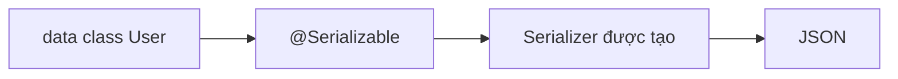

---

# 10. Serialize Object thành JSON

Ví dụ:

```kotlin
import kotlinx.serialization.Serializable
import kotlinx.serialization.encodeToString
import kotlinx.serialization.json.Json

@Serializable
data class User(
    val id: Int,
    val name: String,
    val premium: Boolean
)

fun main() {
    val user = User(
        id = 1,
        name = "An",
        premium = true
    )

    val json = Json.encodeToString(user)

    println(json)
}
```

Kết quả có dạng:

```json
{"id":1,"name":"An","premium":true}
```

Luồng:

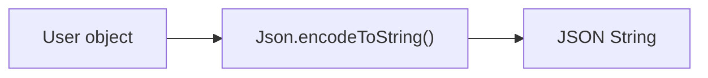

`encodeToString()` là API chuẩn để serialize object thành JSON. ([Kotlin][2])

---

# 11. Deserialize JSON thành Object

```kotlin
import kotlinx.serialization.decodeFromString

val rawJson = """
{
    "id": 1,
    "name": "An",
    "premium": true
}
""".trimIndent()

val user = Json.decodeFromString<User>(rawJson)

println(user.name)
```

Kết quả:

```text
An
```

Luồng:

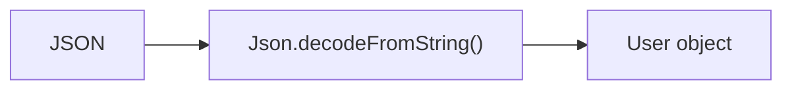

`decodeFromString()` thực hiện chiều ngược lại của `encodeToString()`. ([Kotlin][2])

---

# 12. Cấu hình `Json`

Trong app production thường nên tạo một instance riêng thay vì rải:

```kotlin
Json
```

khắp code.

Ví dụ:

```kotlin
val appJson = Json {
    ignoreUnknownKeys = true
}
```

Sau đó:

```kotlin
val user = appJson.decodeFromString<User>(json)
```

`ignoreUnknownKeys = true` cho phép parser bỏ qua những field JSON mà model hiện tại không khai báo. Đây là cấu hình được Kotlin documentation hỗ trợ trực tiếp. ([Kotlin][2])

Ví dụ server thêm:

```json
{
  "id": 1,
  "name": "An",
  "premium": true,
  "serverVersion": 15
}
```

Trong khi app chỉ có:

```kotlin
@Serializable
data class User(
    val id: Int,
    val name: String,
    val premium: Boolean
)
```

Với:

```kotlin
Json {
    ignoreUnknownKeys = true
}
```

field:

```text
serverVersion
```

có thể được bỏ qua.

---

# 13. Default value và khả năng tương thích dữ liệu

Một pattern rất hữu ích:

```kotlin
@Serializable
data class UserSettings(
    val darkMode: Boolean = false,
    val language: String = "vi",
    val fontSize: Int = 16
)
```

Giả sử version cũ từng lưu:

```json
{
  "darkMode": true,
  "language": "vi"
}
```

Sau này model được mở rộng:

```kotlin
val fontSize: Int = 16
```

Default value giúp model có một trạng thái hợp lý khi dữ liệu cũ không có giá trị mới.

Vì vậy, đối với persistent model, hãy suy nghĩ về:

```text
Schema V1
   ↓
Schema V2
   ↓
Schema V3
```

chứ không chỉ nghĩ:

```text
Object hiện tại → JSON
```

---

# 14. Ví dụ thực tế: App Settings

Ta xây một model:

```kotlin
@Serializable
data class AppSettings(
    val darkMode: Boolean = false,
    val notificationsEnabled: Boolean = true,
    val language: String = "vi"
)
```

Serialize:

```kotlin
val settings = AppSettings(
    darkMode = true,
    notificationsEnabled = false,
    language = "vi"
)

val json = Json.encodeToString(settings)
```

Kết quả:

```json
{
  "darkMode": true,
  "notificationsEnabled": false,
  "language": "vi"
}
```

Deserialize:

```kotlin
val restoredSettings =
    Json.decodeFromString<AppSettings>(json)
```

---

# 15. Serialize xuống file

Serialization không đồng nghĩa với storage.

Ta có hai bước khác nhau:

```text
Serialization
Object → JSON
```

sau đó:

```text
Storage
JSON → File
```

Ví dụ conceptual:

```kotlin
val json = Json.encodeToString(settings)

val file = File(context.filesDir, "settings.json")

file.writeText(json)
```

Đọc:

```kotlin
val json = file.readText()

val settings =
    Json.decodeFromString<AppSettings>(json)
```

Android cung cấp vùng app-specific files để ứng dụng lưu file riêng; việc lựa chọn internal/external storage còn phụ thuộc vào loại dữ liệu và lifecycle mong muốn. ([Android Developers][4])

---

# 16. Luồng lưu file đầy đủ

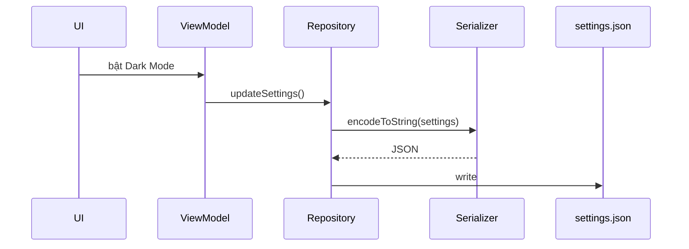

Khi app mở lại:

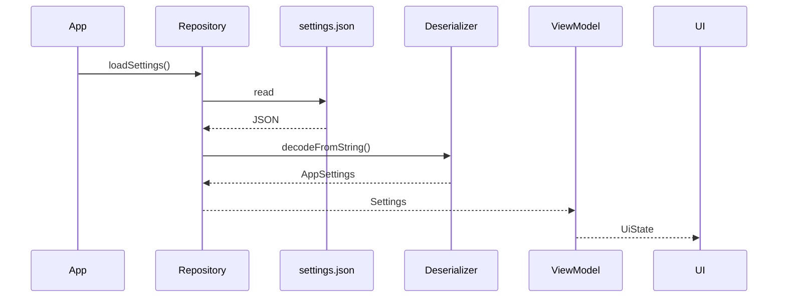

---

# 17. Serialization với DataStore

Đây là phần quan trọng nhất khi nối bài Serialization với các bài trước về **DataStore**.

DataStore có thể lưu custom class nếu bạn cung cấp:

```text
Schema/model
+
Serializer<T>
```

Android hiện hỗ trợ typed DataStore trong đó serializer quyết định cách object được chuyển thành representation lưu trên disk; JSON hoặc Protocol Buffers đều có thể được sử dụng. ([Android Developers][5])

Kiến trúc:

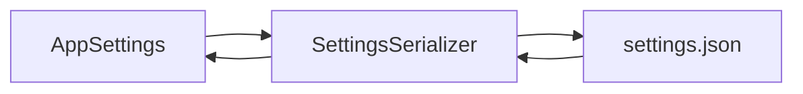

---

# 18. `Serializer<T>` trong DataStore

Ví dụ:

```kotlin
object SettingsSerializer : Serializer<AppSettings> {

    override val defaultValue: AppSettings =
        AppSettings()

    override suspend fun readFrom(
        input: InputStream
    ): AppSettings {
        // deserialize
    }

    override suspend fun writeTo(
        t: AppSettings,
        output: OutputStream
    ) {
        // serialize
    }
}
```

Ba thành phần quan trọng:

```text
defaultValue
readFrom()
writeTo()
```

Theo API DataStore:

* `readFrom()` unmarshals dữ liệu từ stream;
* `writeTo()` marshals object vào stream;
* `defaultValue` được dùng khi chưa có dữ liệu trên disk;
* kiểu `T` của DataStore serializer phải là immutable. ([Android Developers][6])

---

# 19. JSON Serializer cho DataStore

Ví dụ hoàn chỉnh:

```kotlin
@Serializable
data class AppSettings(
    val darkMode: Boolean = false,
    val language: String = "vi"
)
```

Tạo JSON configuration:

```kotlin
private val appJson = Json {
    ignoreUnknownKeys = true
}
```

Serializer:

```kotlin
object AppSettingsSerializer : Serializer<AppSettings> {

    override val defaultValue: AppSettings =
        AppSettings()

    override suspend fun readFrom(
        input: InputStream
    ): AppSettings {
        return try {
            appJson.decodeFromString(
                input.readBytes().decodeToString()
            )
        } catch (exception: SerializationException) {
            throw CorruptionException(
                "Cannot read app settings.",
                exception
            )
        }
    }

    override suspend fun writeTo(
        t: AppSettings,
        output: OutputStream
    ) {
        output.write(
            appJson
                .encodeToString(t)
                .encodeToByteArray()
        )
    }
}
```

Đây chính là pattern được Android Developers tài liệu hóa cho JSON DataStore: `@Serializable` model → `Serializer<T>` → `Json.decodeFromString()`/`encodeToString()` → file DataStore. ([Android Developers][5])

---

# 20. Tạo DataStore

```kotlin
val Context.settingsDataStore: DataStore<AppSettings>
    by dataStore(
        fileName = "settings.json",
        serializer = AppSettingsSerializer
    )
```

Android khuyến nghị khai báo DataStore delegate ở top-level để ứng dụng sử dụng cùng một instance thay vì tạo DataStore liên tục cho cùng file. ([Android Developers][5])

---

# 21. Đọc dữ liệu

DataStore expose dữ liệu dưới dạng:

```kotlin
Flow<T>
```

Ví dụ:

```kotlin
val settingsFlow: Flow<AppSettings> =
    context.settingsDataStore.data
```

Repository:

```kotlin
class SettingsRepository(
    private val context: Context
) {

    val settings: Flow<AppSettings> =
        context.settingsDataStore.data
}
```

DataStore được xây dựng trên coroutines và Flow, đồng thời cung cấp việc lưu dữ liệu bất đồng bộ và cập nhật transactionally. ([Android Developers][5])

---

# 22. Ghi dữ liệu

```kotlin
suspend fun setDarkMode(enabled: Boolean) {
    context.settingsDataStore.updateData { current ->
        current.copy(
            darkMode = enabled
        )
    }
}
```

Luồng:

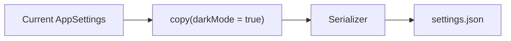

`updateData()` thực hiện atomic read-modify-write đối với DataStore. ([Android Developers][7])

---

# 23. Kết nối với ViewModel

```kotlin
class SettingsViewModel(
    private val repository: SettingsRepository
) : ViewModel() {

    val settings =
        repository.settings
            .stateIn(
                scope = viewModelScope,
                started = SharingStarted.WhileSubscribed(5_000),
                initialValue = AppSettings()
            )

    fun setDarkMode(enabled: Boolean) {
        viewModelScope.launch {
            repository.setDarkMode(enabled)
        }
    }
}
```

UI không cần biết:

```text
JSON
Serializer
File
DataStore implementation
```

UI chỉ biết:

```text
Settings
```

Đây là separation of concerns mong muốn.

---

# 24. Serialization và UI State

Một sai lầm phổ biến là serialize trực tiếp toàn bộ `UiState`.

Ví dụ:

```kotlin
data class ScreenUiState(
    val loading: Boolean,
    val dialogVisible: Boolean,
    val snackbarMessage: String?,
    val settings: AppSettings
)
```

Không phải thứ gì trong `UiState` cũng đáng lưu.

Thông thường:

```text
Persistent state
→ cần storage
```

ví dụ:

```text
darkMode
language
selectedTheme
downloaded configuration
```

Trong khi:

```text
Ephemeral UI state
→ thường không cần persistent serialization
```

ví dụ:

```text
isLoading
snackbarVisible
buttonPressed
animationProgress
```

---

# 25. Serialization không phải State Management

Cần phân biệt:

```text
Serialization
= object ↔ representation
```

với:

```text
State management
= quản lý trạng thái đang chạy
```

và:

```text
Persistence
= giữ dữ liệu sau khi process/app kết thúc
```

Quan hệ:

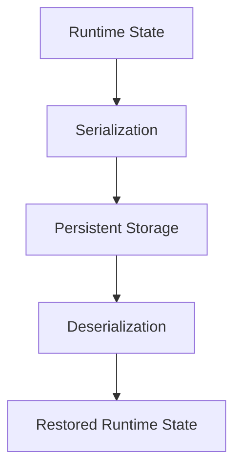

---

# 26. Serialization không phải Encryption

Đây là một distinction rất quan trọng.

JSON:

```json
{
  "email": "user@example.com",
  "token": "secret-token"
}
```

đã được **serialize**.

Nhưng nó vẫn có thể đọc được.

```text
Serialization
≠
Encryption
```

Serialization trả lời câu hỏi:

> "Làm thế nào biểu diễn object?"

Encryption trả lời câu hỏi:

> "Làm thế nào bảo vệ nội dung khỏi người không có quyền đọc?"

DataStore API hiện thậm chí có các serializer chuyên biệt hỗ trợ encryption, cho thấy serialization format và encryption là hai lớp trách nhiệm khác nhau. ([Android Developers][6])

---

# 27. JSON vs Protocol Buffers

## JSON

```json
{
  "darkMode": true,
  "language": "vi"
}
```

### Ưu điểm

* dễ đọc;
* dễ debug;
* dễ log;
* phổ biến với REST APIs;
* thuận tiện cho app nhỏ.

---

## Protocol Buffers

Dữ liệu được định nghĩa bằng schema:

```protobuf
message Settings {
    bool dark_mode = 1;
    string language = 2;
}
```

Android Proto DataStore sử dụng Protocol Buffers và typed objects, với schema `.proto` định nghĩa dữ liệu lưu trữ. ([Android Developers][5])

---

# 28. JSON DataStore vs Proto DataStore

| Tiêu chí       | JSON DataStore          | Proto DataStore                |
| -------------- | ----------------------- | ------------------------------ |
| Representation | JSON                    | Protocol Buffers               |
| Human-readable | Rất tốt                 | Không                          |
| Model          | Kotlin `data class`     | `.proto` schema                |
| Type safety    | Có                      | Có                             |
| Debug file     | Dễ                      | Khó hơn                        |
| Schema         | Kotlin model            | Proto schema                   |
| Tooling        | `kotlinx.serialization` | Protobuf                       |
| Phù hợp        | App nhỏ/vừa, dễ debug   | Structured persistent settings |

DataStore chính thức hỗ trợ cả custom serialization như JSON lẫn Proto serialization. ([Android Developers][5])

---

# 29. Preferences DataStore vs Typed Serialization

Preferences DataStore:

```text
"dark_mode" → true
"language" → "vi"
"font_size" → 16
```

Typed DataStore:

```kotlin
AppSettings(
    darkMode = true,
    language = "vi",
    fontSize = 16
)
```

Android mô tả Preferences DataStore là API key-value không yêu cầu schema định trước, trong khi custom typed DataStore sử dụng serializer để persist class. ([Android Developers][5])

---

# 30. Khi nào không nên dùng DataStore?

Nếu dữ liệu là:

```text
100,000 Products

Users

Orders

Messages

Relationships giữa nhiều table
```

thì không nên serialize toàn bộ thành:

```text
giant.json
```

DataStore được thiết kế tốt cho dataset nhỏ; Android khuyến nghị dùng **Room** khi cần dataset lớn/phức tạp, partial updates hoặc referential integrity. ([Android Developers][5])

Sơ đồ lựa chọn:

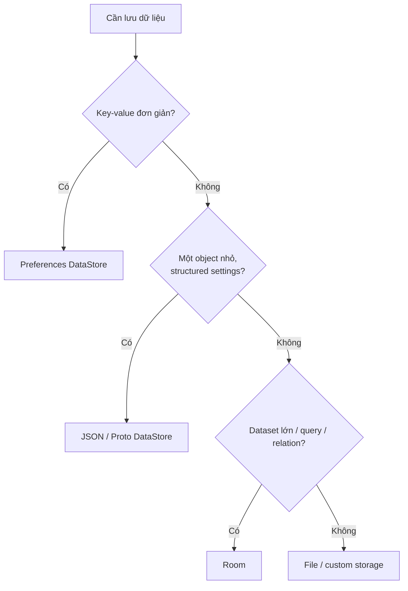

---

# 31. Parcelable có phải Serialization không?

Android còn có:

```text
Parcelable
```

Ví dụ:

```kotlin
@Parcelize
data class User(
    val id: Int,
    val name: String
) : Parcelable
```

`kotlin-parcelize` có thể tự sinh implementation của `Parcelable`. ([Android Developers][8])

Tuy nhiên nên phân biệt mục đích.

```text
kotlinx.serialization
    ↓
JSON / Proto / persistence / network
```

so với:

```text
Parcelable
    ↓
Android framework / IPC / Bundle-like transport
```

Do đó đừng mặc định coi:

```kotlin
Parcelable
```

là format lưu file lâu dài.

---

# 32. Schema Evolution

Serialization trở nên khó hơn khi app đã release.

## Version 1

```kotlin
@Serializable
data class Profile(
    val name: String
)
```

File:

```json
{
  "name": "Khanh"
}
```

---

## Version 2

Bạn thêm:

```kotlin
@Serializable
data class Profile(
    val name: String,
    val theme: String = "system"
)
```

File cũ vẫn không có:

```text
theme
```

Đây là lý do cần suy nghĩ về:

```text
default value
migration
unknown field
removed field
renamed field
corrupt data
```

ngay từ lúc thiết kế persistent model.

---

# 33. Một migration nguy hiểm

Version cũ:

```json
{
  "userName": "An"
}
```

Model mới:

```kotlin
@Serializable
data class User(
    val name: String
)
```

Bạn đã đổi:

```text
userName
→
name
```

Dữ liệu cũ không tự hiểu rằng hai field này tương đương.

Do đó thay đổi schema phải được coi như thay đổi API/database schema.

---

# 34. Error Handling

Giả sử file bị lỗi:

```json
{
  "darkMode":
```

Deserialize sẽ thất bại.

Không nên:

```kotlin
val settings =
    Json.decodeFromString<AppSettings>(text)
```

rồi mặc định cho rằng lúc nào cũng thành công.

Có thể xử lý:

```kotlin
try {
    Json.decodeFromString<AppSettings>(text)
} catch (e: SerializationException) {
    // xử lý dữ liệu không hợp lệ
}
```

Đối với DataStore serializer, dữ liệu không parse được có thể được báo dưới dạng `CorruptionException`; Android phân biệt lỗi corruption với lỗi filesystem/I/O không thể phục hồi. ([Android Developers][6])

---

# 35. Error Flow trong Production

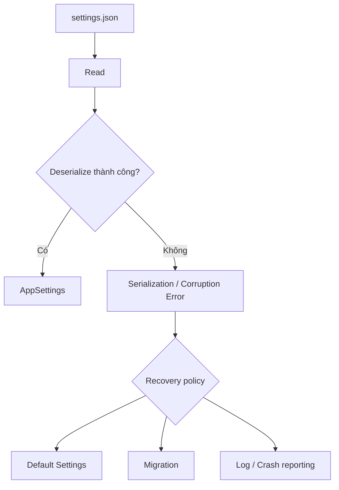

Điều quan trọng là **recovery policy phải có chủ đích**.

Không nên âm thầm:

```text
catch(Exception)
→ ignore everything
```

vì điều đó có thể che giấu bug hoặc mất dữ liệu user.

---

# 36. Testing Serialization

Serialization rất phù hợp với unit test.

## Test 1 — Round-trip

```text
Object
 ↓
Serialize
 ↓
Deserialize
 ↓
Object'
```

Yêu cầu:

```text
Object == Object'
```

Ví dụ:

```kotlin
@Test
fun serialize_then_deserialize_returns_same_settings() {
    val original = AppSettings(
        darkMode = true,
        language = "vi"
    )

    val json =
        Json.encodeToString(original)

    val restored =
        Json.decodeFromString<AppSettings>(json)

    assertEquals(original, restored)
}
```

---

# 37. Test dữ liệu cũ

```kotlin
@Test
fun old_json_can_still_be_read() {

    val oldJson = """
        {
          "darkMode": true,
          "language": "vi"
        }
    """.trimIndent()

    val result =
        appJson.decodeFromString<AppSettings>(oldJson)

    assertEquals(16, result.fontSize)
}
```

Model:

```kotlin
@Serializable
data class AppSettings(
    val darkMode: Boolean = false,
    val language: String = "vi",
    val fontSize: Int = 16
)
```

---

# 38. Test unknown field

JSON mới:

```json
{
  "darkMode": true,
  "language": "vi",
  "futureFeature": true
}
```

Test:

```kotlin
@Test
fun unknown_field_is_ignored() {

    val result =
        appJson.decodeFromString<AppSettings>(
            """
            {
              "darkMode": true,
              "language": "vi",
              "futureFeature": true
            }
            """
        )

    assertTrue(result.darkMode)
}
```

Điều này kiểm tra trực tiếp behavior của:

```kotlin
ignoreUnknownKeys = true
```

được Kotlin Serialization hỗ trợ. ([Kotlin][2])

---

# 39. Test malformed JSON

```kotlin
@Test
fun malformed_json_throws_exception() {

    val brokenJson = """
        {
            "darkMode":
        }
    """.trimIndent()

    assertFailsWith<SerializationException> {
        appJson.decodeFromString<AppSettings>(brokenJson)
    }
}
```

---

# 40. Những lỗi thường gặp

## Lỗi 1 — Quên `@Serializable`

Sai:

```kotlin
data class User(
    val id: Int
)
```

Đúng:

```kotlin
@Serializable
data class User(
    val id: Int
)
```

---

## Lỗi 2 — Serialize UI object quá lớn

Không nên:

```text
Whole UI State
↓
JSON
↓
DataStore
```

Hãy persist **domain data thực sự cần giữ**.

---

## Lỗi 3 — Dùng JSON như database

Không nên:

```text
20,000 users
↓
users.json
↓
mỗi update serialize lại toàn bộ
```

Nếu cần:

```text
query
filter
index
relation
partial update
```

hãy cân nhắc Room. Android cũng đặt chính ranh giới này trong hướng dẫn DataStore. ([Android Developers][5])

---

## Lỗi 4 — Không nghĩ đến schema migration

Hôm nay:

```kotlin
User(name)
```

Ngày mai:

```kotlin
User(fullName)
```

Có thể phá dữ liệu đã lưu từ phiên bản trước.

---

## Lỗi 5 — Serialization trên UI layer

Không nên:

```kotlin
@Composable
fun Screen() {
    Json.decodeFromString(...)
}
```

Nên:

```text
UI
↓
ViewModel
↓
Repository
↓
DataSource
↓
Serializer
```

---

## Lỗi 6 — Nghĩ serialized data đã an toàn

```text
JSON
≠
encrypted data
```

Đây là hai trách nhiệm khác nhau.

---

# 41. Performance

Serialization cũng có cost:

```text
Object
 ↓
CPU
 ↓
String / bytes
 ↓
Memory allocation
 ↓
Disk / network
```

Nếu object quá lớn:

```text
HugeObject
   ↓
Huge JSON
   ↓
Deserialize toàn bộ
   ↓
RAM tăng
```

Đừng tự động dùng serialization cho bất kỳ dataset nào.

Android đặc biệt khuyến nghị DataStore cho dữ liệu nhỏ và Room cho dataset lớn/phức tạp. Android cũng khuyến nghị xem xét code-generated serialization libraries để giảm các vấn đề liên quan đến reflection và optimization. ([Android Developers][5])

---

# 42. Debugging Serialization

Khi debug, kiểm tra tuần tự:

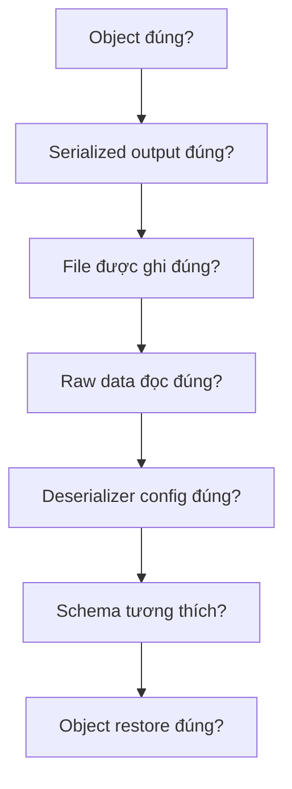

Ví dụ log trong development:

```kotlin
val json = appJson.encodeToString(settings)

Log.d(
    "SettingsRepository",
    "Serialized settings=$json"
)
```

Nhưng tránh log:

```text
password
access token
refresh token
PII nhạy cảm
```

trong production.

---

# 43. Lifecycle

Serialization bản thân không phụ thuộc trực tiếp vào:

```text
Activity lifecycle
Fragment lifecycle
Compose recomposition
```

Nhưng **thời điểm đọc/ghi dữ liệu** thì có ảnh hưởng đến UX.

Ví dụ không nên:

```text
mỗi recomposition
↓
serialize
↓
write file
```

Thay vào đó:

```text
User Action
↓
ViewModel
↓
Repository
↓
Storage
```

---

# 44. Rotate / Background / Process Death

Ta có thể phân biệt:

```text
Recomposition
    ↓
UI state
```

```text
Configuration change
    ↓
ViewModel
```

```text
Process death / app restart
    ↓
Persistent storage
```

Nếu dữ liệu cần tồn tại sau khi app bị kill:

```text
runtime variable
```

không đủ.

Bạn cần:

```text
Object
↓
Serialization
↓
Persistent Storage
```

rồi khi app chạy lại:

```text
Storage
↓
Deserialization
↓
Object
```

---

# 45. Offline Behavior

Ví dụ app có server settings:

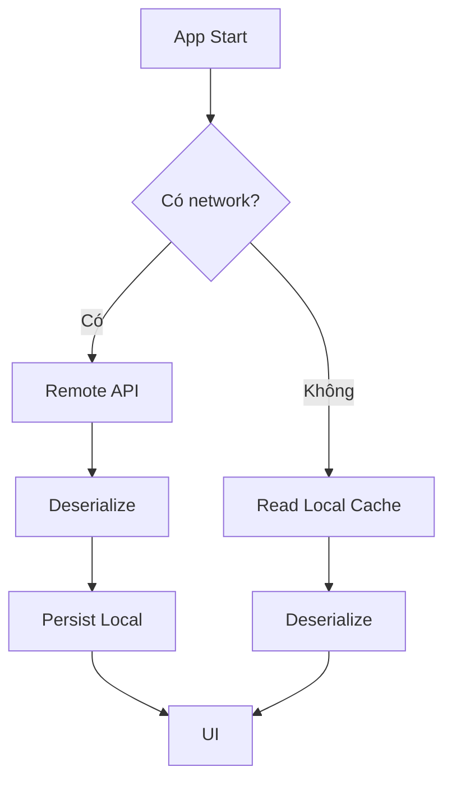

Serialization là một mắt xích quan trọng của offline-first architecture, nhưng không tự giải quyết:

```text
cache invalidation
sync
conflict resolution
network retry
```

Những phần đó thuộc chiến lược Data Layer rộng hơn.

---

# 46. Model nên serialize ở layer nào?

Một thiết kế tương đối sạch:

```text
Remote JSON
    ↓
Network DTO
    ↓
Mapper
    ↓
Domain Model
```

và:

```text
Storage JSON / Proto
    ↓
Storage Model
    ↓
Mapper
    ↓
Domain Model
```

Ví dụ:

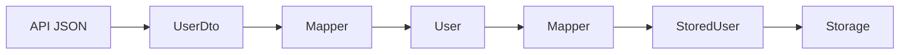

Nhờ đó:

```text
API schema
```

không nhất thiết phải đồng nhất với:

```text
Domain model
```

hay:

```text
Storage schema
```

---

# 47. Ví dụ Mini Project

## Feature

App có màn hình:

```text
Settings
├── Dark mode
├── Notification
└── Language
```

Model:

```kotlin
@Serializable
data class AppSettings(
    val darkMode: Boolean = false,
    val notificationsEnabled: Boolean = true,
    val language: String = "vi"
)
```

Architecture:

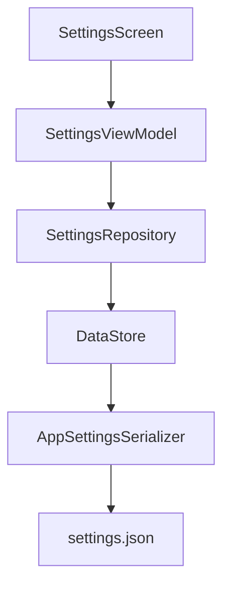

---

# 48. Repository mẫu

```kotlin
class SettingsRepository(
    private val context: Context
) {

    val settings: Flow<AppSettings> =
        context.settingsDataStore.data

    suspend fun updateDarkMode(
        enabled: Boolean
    ) {
        context.settingsDataStore.updateData {
            it.copy(
                darkMode = enabled
            )
        }
    }

    suspend fun updateLanguage(
        language: String
    ) {
        context.settingsDataStore.updateData {
            it.copy(
                language = language
            )
        }
    }
}
```

Ở đây Repository không trực tiếp xử lý JSON.

```text
Repository
    ↓
DataStore
    ↓
Serializer
    ↓
JSON
```

DataStore giữ abstraction storage rõ ràng hơn.

---

# 49. Mental Model quan trọng

Hãy nhớ chuỗi sau:

```text
Kotlin Object
      ↓
Serializer
      ↓
Representation
      ↓
Storage / Network
      ↓
Representation
      ↓
Deserializer
      ↓
Kotlin Object
```

Hoặc ngắn hơn:

```text
Object ⇄ Serializer ⇄ Bytes
```

---

# 50. Serialization trong toàn bộ Android App

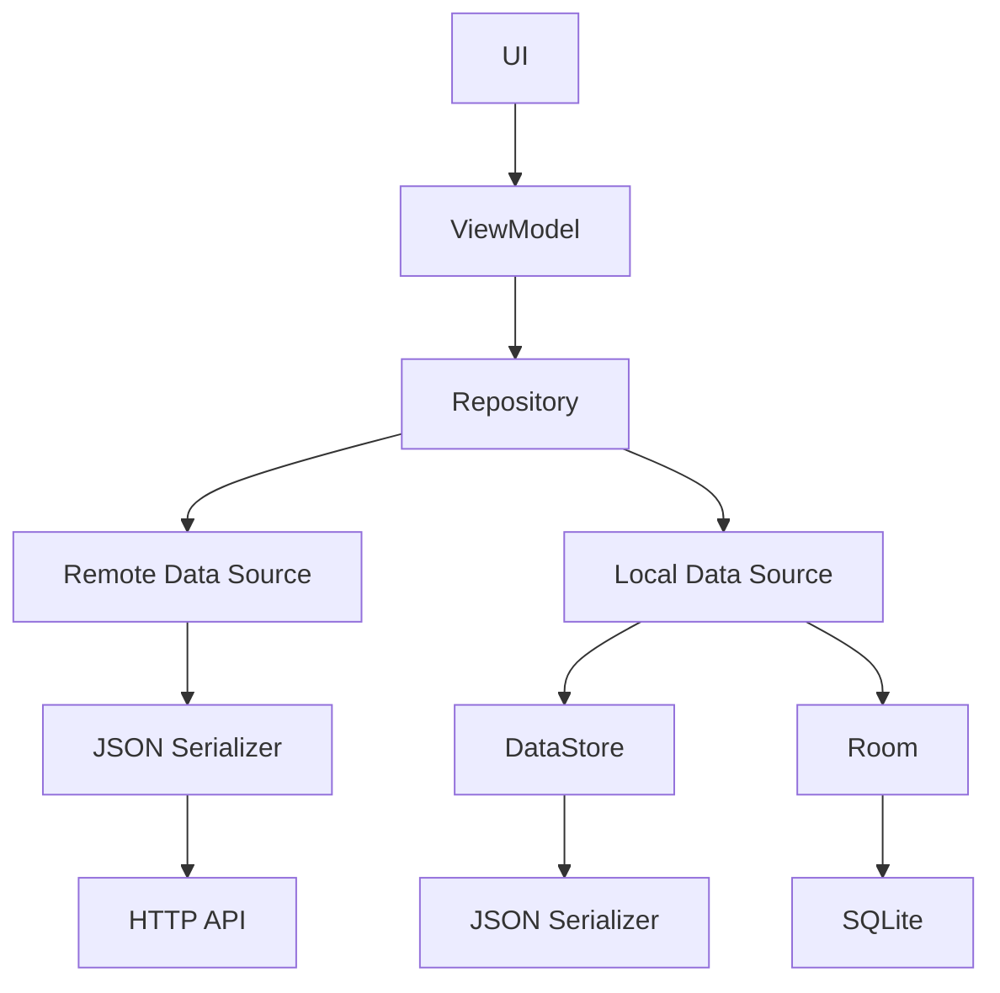

Serialization nằm gần:

```text
system boundary
```

tức nơi dữ liệu rời khỏi hoặc đi vào runtime object model của ứng dụng.

---

# 51. Bảng lựa chọn nhanh

| Nhu cầu                        | Công nghệ phù hợp     |
| ------------------------------ | --------------------- |
| Một vài preference             | Preferences DataStore |
| Structured settings            | JSON DataStore        |
| Typed settings có schema Proto | Proto DataStore       |
| JSON API                       | kotlinx.serialization |
| Dataset relational             | Room                  |
| File custom                    | File API + serializer |
| Android framework parcel       | Parcelable            |

DataStore hỗ trợ Preferences hoặc typed objects; Room phù hợp hơn khi cần dữ liệu lớn/phức tạp và relational behavior. ([Android Developers][5])

---

# 52. Thực hành — 20 phút

## Task 1 — Tạo model

```kotlin
@Serializable
data class Profile(
    val name: String,
    val age: Int,
    val darkMode: Boolean
)
```

---

## Task 2 — Serialize

```kotlin
val profile = Profile(
    name = "An",
    age = 23,
    darkMode = true
)

val json =
    Json.encodeToString(profile)
```

In JSON ra log.

---

## Task 3 — Deserialize

```kotlin
val restored =
    Json.decodeFromString<Profile>(json)
```

Kiểm tra:

```kotlin
println(restored)
```

---

## Task 4 — Persist

Lưu JSON xuống:

```text
profile.json
```

---

## Task 5 — Restore

Khi app mở lại:

```text
profile.json
↓
read
↓
deserialize
↓
Profile
↓
UI
```

---

# 53. Bài tập nâng cao

Ban đầu:

```kotlin
@Serializable
data class Profile(
    val name: String,
    val age: Int
)
```

Sau đó thay đổi thành:

```kotlin
@Serializable
data class Profile(
    val name: String,
    val age: Int,
    val avatarUrl: String? = null
)
```

Hãy kiểm tra file JSON phiên bản cũ vẫn đọc được.

Sau đó thêm một field không tồn tại trong model:

```json
{
  "name": "An",
  "age": 23,
  "serverExperiment": "B"
}
```

và cấu hình:

```kotlin
Json {
    ignoreUnknownKeys = true
}
```

---

# 54. Artifact cho Portfolio

Có thể tạo mini project:

```text
serialization-demo/
│
├── data/
│   ├── AppSettings.kt
│   ├── AppSettingsSerializer.kt
│   └── SettingsRepository.kt
│
├── ui/
│   ├── SettingsScreen.kt
│   └── SettingsViewModel.kt
│
├── test/
│   └── SerializationTest.kt
│
└── README.md
```

README nên có:

```markdown
# Android Serialization Demo

## Features

- Kotlinx Serialization
- JSON encode/decode
- Typed DataStore
- Schema evolution
- Corrupted JSON handling
- Unit tests

## Data Flow

UI
→ ViewModel
→ Repository
→ DataStore
→ Serializer
→ JSON
```

Đây là một artifact nhỏ nhưng thể hiện được nhiều kiến thức:

```text
Architecture
+
Storage
+
Serialization
+
State
+
Testing
```

---

# 55. Câu hỏi phỏng vấn

### 1. Serialization là gì?

Quá trình biến runtime object thành format có thể lưu hoặc truyền.

---

### 2. Deserialization là gì?

Quá trình biến serialized representation trở lại object.

---

### 3. Kotlin Serialization serialize JSON bằng gì?

```kotlin
Json.encodeToString()
```

và deserialize bằng:

```kotlin
Json.decodeFromString()
```

([Kotlin][2])

---

### 4. `@Serializable` dùng để làm gì?

Đánh dấu type tham gia cơ chế Kotlin Serialization.

---

### 5. Serialization có phải encryption không?

Không.

```text
Serialization → representation

Encryption → confidentiality
```

---

### 6. DataStore có thể lưu custom Kotlin class không?

Có. Bạn định nghĩa schema/model và cung cấp `Serializer<T>` để chuyển object sang format persistent; Android tài liệu hóa cả JSON và Protocol Buffers cho trường hợp này. ([Android Developers][5])

---

### 7. Khi nào nên dùng Room thay vì DataStore?

Khi cần:

```text
large datasets
complex datasets
partial updates
referential integrity
```

([Android Developers][5])

---

# 56. Checklist Production

Trước khi release feature có serialization, kiểm tra:

### Model

* [ ] Persistent model có default hợp lý.
* [ ] Không serialize field không cần thiết.
* [ ] Schema change đã được xem xét.

### JSON

* [ ] Unknown field được xử lý có chủ đích.
* [ ] Malformed JSON không làm app crash không kiểm soát.
* [ ] Không coi JSON là encryption.

### Storage

* [ ] File/DataStore được đặt ở Data Layer.
* [ ] Không ghi storage từ Composable.
* [ ] Không tạo nhiều DataStore instance cho cùng file.
* [ ] Dataset có phù hợp với DataStore hay nên dùng Room.

### Lifecycle

* [ ] Rotate không gây write liên tục.
* [ ] Background/foreground không làm mất persistent state.
* [ ] App restart có restore dữ liệu đúng.

### Testing

* [ ] Có round-trip test.
* [ ] Có test old schema.
* [ ] Có test unknown field.
* [ ] Có test corrupted input.

### Release

* [ ] Test dữ liệu được tạo từ phiên bản app cũ.
* [ ] Test upgrade app mà không uninstall.
* [ ] Test release build/R8.
* [ ] Kiểm tra serialization library tương thích optimization.

Android khuyến nghị kiểm tra optimization sau khi thêm thư viện và ưu tiên codegen khi phù hợp, đặc biệt đối với serialization libraries. ([Android Developers][9])

---

# 57. Checklist hoàn thành bài

* [ ] Tôi giải thích được Serialization.
* [ ] Tôi giải thích được Deserialization.
* [ ] Tôi hiểu Object → JSON → Object.
* [ ] Tôi dùng được `@Serializable`.
* [ ] Tôi dùng được `encodeToString()`.
* [ ] Tôi dùng được `decodeFromString()`.
* [ ] Tôi hiểu `ignoreUnknownKeys`.
* [ ] Tôi hiểu default values và schema evolution.
* [ ] Tôi hiểu `Serializer<T>` của DataStore.
* [ ] Tôi biết Serialization ≠ Encryption.
* [ ] Tôi biết DataStore ≠ Database cho dataset lớn.
* [ ] Tôi có round-trip unit test.
* [ ] Tôi có mini artifact để đưa vào portfolio.

---

# 58. Sơ đồ tổng kết

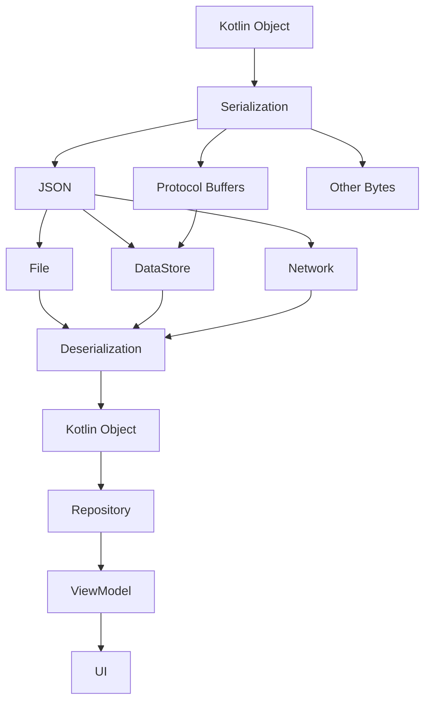

Công thức nên ghi nhớ:

```text
Object
  ↓ serialize
Representation
  ↓ persist / transfer
Storage / Network
  ↓ read
Representation
  ↓ deserialize
Object
```

> **Serialization không phải nơi dữ liệu được lưu. Serialization là cơ chế biến dữ liệu thành dạng có thể lưu hoặc truyền.**

Và trong Android Architecture:

```text
UI
↓
ViewModel
↓
Repository
↓
Data Source
↓
Serializer
↓
DataStore / File / Network
```

Đó là vị trí phù hợp nhất để hình dung **Serialization** trong một Android app hiện đại. ([Kotlin][1])

[1]: https://kotlinlang.org/docs/serialization.html "Serialization | Kotlin Documentation"
[2]: https://kotlinlang.org/docs/serialization-configure-json-serialization.html "JSON serialization overview | Kotlin Documentation"
[3]: https://developer.android.com/codelabs/basic-android-kotlin-compose-getting-data-internet?utm_source=chatgpt.com "Get data from the internet"
[4]: https://developer.android.com/training/data-storage/app-specific?utm_source=chatgpt.com "Access app-specific files | App data and files"
[5]: https://developer.android.com/topic/libraries/architecture/datastore "App Architecture: Data Layer - DataStore - Android Developers  |  App architecture"
[6]: https://developer.android.com/reference/kotlin/androidx/datastore/core/Serializer "Serializer  |  API reference  |  Android Developers"
[7]: https://developer.android.com/reference/kotlin/androidx/datastore/core/DataStore?utm_source=chatgpt.com "DataStore | API reference"
[8]: https://developer.android.com/kotlin/parcelize?utm_source=chatgpt.com "Parcelable implementation generator | Kotlin"
[9]: https://developer.android.com/topic/performance/app-optimization/choose-libraries-wisely "Choose libraries wisely  |  App quality  |  Android Developers"
