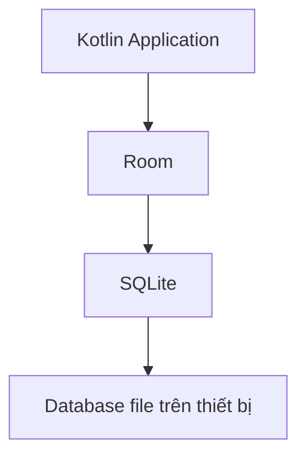
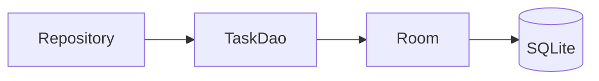
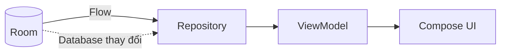
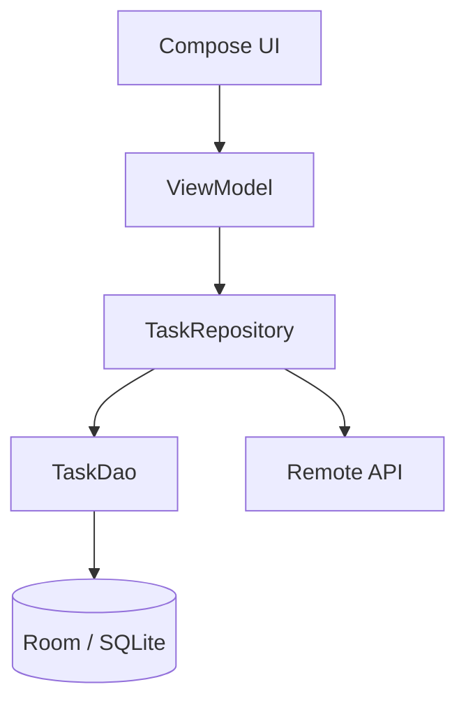
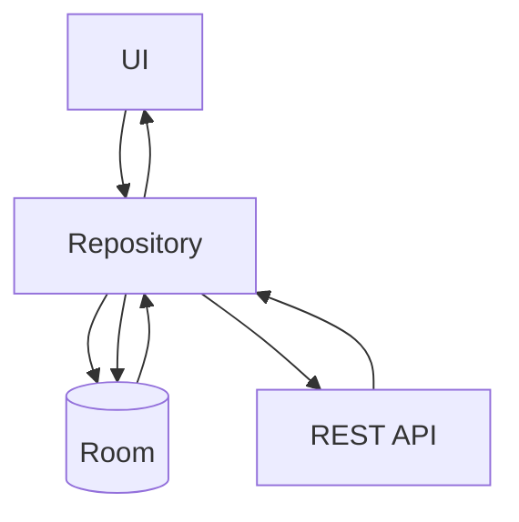
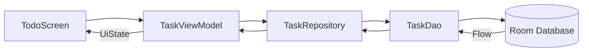
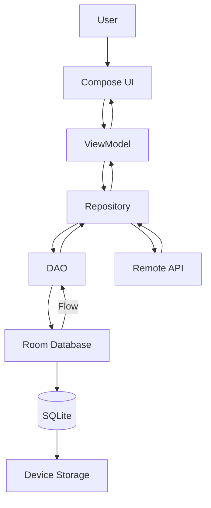

# 009 - Room Database

**Học phần:** 03 - Architecture, State and Data
**Module:** Module 06 - Storage
**Nhóm nội dung:** Room Database
**Nguồn roadmap:** Storage / Room Database
**Loại bài:** `storage`
**Thứ tự trong module:** 009
**Thời lượng gợi ý:** 32 phút

> **Cập nhật cho Android Developer Roadmap 2026:** tài liệu Android hiện tại sử dụng **Room 3**. Tại thời điểm tháng 8/2026, tài liệu chính thức minh họa `Room 3.0.1`, sử dụng namespace `androidx.room3` và **Room 3 yêu cầu KSP** cho annotation processing. Hướng dẫn Room 2.x hiện được Android đánh dấu deprecated. ([Android Developers][1])

---

## 1. Tóm tắt

**Room Database** là thư viện persistence của Android Jetpack cung cấp một lớp trừu tượng phía trên **SQLite**.

Thay vì tự quản lý `SQLiteOpenHelper`, cursor, mapping object và nhiều đoạn SQL boilerplate, ta định nghĩa:

* **Entity** → bảng.
* **DAO** → các thao tác đọc/ghi.
* **RoomDatabase** → database và điểm truy cập DAO.

Room còn kiểm tra nhiều câu SQL ở **compile time**, giúp phát hiện lỗi trước khi ứng dụng chạy. Android khuyến nghị dùng Room thay cho thao tác trực tiếp với SQLite trong phần lớn ứng dụng có dữ liệu có cấu trúc. ([Android Developers][1])

```text
Kotlin Objects
     │
     ▼
   Room
     │
     ▼
  SQLite
     │
     ▼
Device Storage
```

Một ứng dụng thực tế thường có luồng:

```text
Compose UI
   ↓
ViewModel
   ↓
Repository
   ↓
DAO
   ↓
Room Database
   ↓
SQLite
```

Room đặc biệt hữu ích cho:

* danh sách yêu thích;
* ghi chú;
* lịch sử tìm kiếm;
* cache dữ liệu API;
* bài viết đã tải;
* sản phẩm trong giỏ hàng;
* dữ liệu cần hoạt động offline;
* metadata có cấu trúc.

---

## 2. Mục tiêu học tập

Sau bài này, bạn có thể:

* [ ] Giải thích Room Database bằng ngôn ngữ của mình.
* [ ] Phân biệt **Room** và **SQLite**.
* [ ] Hiểu ba thành phần chính: `Entity`, `DAO`, `RoomDatabase`.
* [ ] Tạo một database nhỏ bằng Kotlin.
* [ ] Thực hiện `INSERT`, `SELECT`, `UPDATE`, `DELETE`.
* [ ] Dùng `Flow` để UI tự phản ứng khi database thay đổi.
* [ ] Đặt Room phía sau Repository thay vì gọi trực tiếp từ UI.
* [ ] Hiểu vì sao migration quan trọng khi phát hành phiên bản mới.
* [ ] Viết migration đơn giản.
* [ ] Biết cách test DAO/database.
* [ ] Debug database với **Database Inspector**.
* [ ] Hiểu cách Room tham gia vào kiến trúc offline-first.

---

# 3. Room Database là gì?

Room không phải một database engine mới.

Database thực sự phía dưới vẫn là SQLite.



Room đóng vai trò như một lớp abstraction giúp lập trình viên làm việc với SQLite bằng Kotlin object và annotation thuận tiện hơn.

Android nêu ba lợi ích quan trọng của Room:

1. kiểm tra SQL tại compile time;
2. giảm boilerplate bằng annotation;
3. hỗ trợ migration database có cấu trúc. ([Android Developers][1])

---

## 3.1 SQLite thuần và Room

### SQLite thuần

Lập trình viên phải tự xử lý khá nhiều thứ:

```text
SQL
↓
Cursor
↓
Đọc từng column
↓
Chuyển thành Kotlin object
↓
Quản lý version database
↓
Xử lý migration
```

### Room

```text
@Entity
   ↓
@Dao
   ↓
@Database
   ↓
Room generate code
   ↓
SQLite
```

Room không loại bỏ SQL hoàn toàn.

Ví dụ:

```kotlin
@Query("SELECT * FROM tasks ORDER BY createdAt DESC")
fun observeTasks(): Flow<List<TaskEntity>>
```

Bạn vẫn học và sử dụng SQL, nhưng Room chịu trách nhiệm mapping và kiểm tra nhiều lỗi cho bạn. DAO được Room generate implementation trong quá trình build. ([Android Developers][2])

---

# 4. Kiến trúc của Room

Room có ba thành phần chính:

```text
┌──────────────────────────────────────┐
│            RoomDatabase              │
│                                      │
│         AppDatabase                  │
└───────────────┬──────────────────────┘
                │ cung cấp
                ▼
┌──────────────────────────────────────┐
│                DAO                   │
│                                      │
│ insert / query / update / delete    │
└───────────────┬──────────────────────┘
                │ thao tác
                ▼
┌──────────────────────────────────────┐
│              Entity                  │
│                                      │
│ TaskEntity / UserEntity / Note...   │
└───────────────┬──────────────────────┘
                │ ánh xạ
                ▼
             SQLite
```

Ba thành phần này tương ứng với:

| Room           | Database             |
| -------------- | -------------------- |
| `Entity`       | Table                |
| Property       | Column               |
| Entity object  | Row                  |
| `DAO`          | Data access layer    |
| `RoomDatabase` | Database entry point |

Room chính thức định nghĩa database class, entity và DAO là ba thành phần cốt lõi của thư viện. ([Android Developers][1])

---

## 4.1 Ảnh minh họa kiến trúc Room


*Hình: kiến trúc chính thức của Room — Room Database, DAO và Entities.* 

---

# 5. Entity

## 5.1 Entity là gì?

`Entity` đại diện cho một **table** trong database.

Ví dụ app Todo cần bảng:

```text
tasks
```

với dữ liệu:

| id | title            | completed |
| -: | ---------------- | --------- |
|  1 | Học Room         | false     |
|  2 | Làm bài tập      | true      |
|  3 | Đọc Android Docs | false     |

Trong Room:

```kotlin
@Entity(tableName = "tasks")
data class TaskEntity(
    @PrimaryKey(autoGenerate = true)
    val id: Long = 0,

    val title: String,

    val completed: Boolean = false,

    val createdAt: Long = System.currentTimeMillis()
)
```

Một entity tương ứng với một table; mỗi object của entity tương ứng với một row. Mỗi entity cần một primary key để xác định duy nhất từng row. ([Android Developers][3])

---

## 5.2 Mapping Entity → SQLite

```text
TaskEntity
│
├── id: Long
├── title: String
├── completed: Boolean
└── createdAt: Long
```

tương đương ý tưởng SQL:

```sql
CREATE TABLE tasks (
    id INTEGER PRIMARY KEY,
    title TEXT NOT NULL,
    completed INTEGER NOT NULL,
    createdAt INTEGER NOT NULL
);
```

---

## 5.3 `@PrimaryKey`

Primary key giúp xác định duy nhất mỗi record.

```kotlin
@PrimaryKey(autoGenerate = true)
val id: Long = 0
```

Với:

```kotlin
autoGenerate = true
```

Room có thể tạo ID tự động cho entity. ([Android Developers][3])

---

## 5.4 `@ColumnInfo`

Nếu muốn tên property Kotlin khác với column database:

```kotlin
@ColumnInfo(name = "created_at")
val createdAt: Long
```

Database:

```text
created_at
```

Kotlin:

```text
createdAt
```

Room mặc định sử dụng tên property làm tên column, nhưng `@ColumnInfo` cho phép thay đổi tên lưu trong database. ([Android Developers][3])

---

# 6. DAO - Data Access Object

DAO là interface mô tả **cách ứng dụng truy cập database**.



DAO giúp phần còn lại của app không cần trực tiếp biết cách truy vấn SQLite. Room generate implementation của DAO trong quá trình compile. ([Android Developers][2])

---

## 6.1 DAO cơ bản

```kotlin
@Dao
interface TaskDao {

    @Insert
    suspend fun insert(task: TaskEntity)

    @Update
    suspend fun update(task: TaskEntity)

    @Delete
    suspend fun delete(task: TaskEntity)

    @Query("SELECT * FROM tasks ORDER BY createdAt DESC")
    fun observeAll(): Flow<List<TaskEntity>>

    @Query("SELECT * FROM tasks WHERE id = :id")
    suspend fun getById(id: Long): TaskEntity?
}
```

DAO có thể sử dụng các annotation tiện ích như:

```text
@Insert
@Update
@Delete
```

hoặc viết query SQL trực tiếp với:

```text
@Query
```

Đây là hai nhóm DAO function chính được Room hỗ trợ. ([Android Developers][2])

---

# 7. CRUD trong Room

CRUD là:

```text
C → Create
R → Read
U → Update
D → Delete
```

---

## 7.1 Create

```kotlin
@Insert
suspend fun insert(task: TaskEntity)
```

Sử dụng:

```kotlin
taskDao.insert(
    TaskEntity(
        title = "Học Room Database"
    )
)
```

---

## 7.2 Read

```kotlin
@Query("""
    SELECT *
    FROM tasks
    ORDER BY createdAt DESC
""")
fun observeAll(): Flow<List<TaskEntity>>
```

---

## 7.3 Update

```kotlin
@Update
suspend fun update(task: TaskEntity)
```

Ví dụ:

```kotlin
val updatedTask = task.copy(
    completed = true
)

taskDao.update(updatedTask)
```

---

## 7.4 Delete

```kotlin
@Delete
suspend fun delete(task: TaskEntity)
```

---

# 8. Flow và Room

Đây là một trong những phần quan trọng nhất khi kết hợp Room với ứng dụng Android hiện đại.

DAO:

```kotlin
@Query("SELECT * FROM tasks ORDER BY createdAt DESC")
fun observeTasks(): Flow<List<TaskEntity>>
```

Luồng:



Room hỗ trợ trực tiếp Kotlin `Flow` cho observable queries. Khi các bảng liên quan thay đổi, observable query có thể phát dữ liệu mới. Với thao tác one-shot, Room sử dụng tốt với coroutine `suspend`. ([Android Developers][4])

---

## 8.1 One-shot query

Chỉ đọc một lần:

```kotlin
@Query("SELECT * FROM tasks WHERE id = :id")
suspend fun getTask(id: Long): TaskEntity?
```

Ví dụ:

```text
Request
   ↓
SELECT
   ↓
Result
   ↓
Kết thúc
```

---

## 8.2 Observable query

Theo dõi thay đổi liên tục:

```kotlin
@Query("SELECT * FROM tasks")
fun observeTasks(): Flow<List<TaskEntity>>
```

```text
Database
   │
   ├── emit list #1
   │
INSERT
   │
   ├── emit list #2
   │
DELETE
   │
   └── emit list #3
```

Room phân biệt one-shot read/write và observable reads; `Flow` là lựa chọn native cho observable query trong Kotlin. ([Android Developers][4])

---

# 9. Tạo RoomDatabase

```kotlin
@Database(
    entities = [
        TaskEntity::class
    ],
    version = 1
)
abstract class AppDatabase : RoomDatabase() {

    abstract fun taskDao(): TaskDao
}
```

`RoomDatabase` giữ cấu hình database và cung cấp DAO cho ứng dụng. Database class cần khai báo `@Database`, extend `RoomDatabase` và cung cấp các DAO tương ứng. ([Android Developers][1])

---

# 10. Khởi tạo database

Với Room 3:

```kotlin
val database =
    Room.databaseBuilder<AppDatabase>(
        applicationContext,
        "app.db"
    )
        .setDriver(AndroidSQLiteDriver())
        .build()
```

Cách builder cùng `AndroidSQLiteDriver()` được sử dụng trong hướng dẫn Room 3 hiện tại. Với app chạy một process, Android khuyến nghị không tạo nhiều `RoomDatabase` instance không cần thiết vì instance database tương đối tốn tài nguyên. ([Android Developers][1])

---

# 11. Dependency cho Room 3

Theo tài liệu Room hiện tại:

```kotlin
dependencies {
    val roomVersion = "3.0.1"

    implementation(
        "androidx.room3:room3-runtime:$roomVersion"
    )

    ksp(
        "androidx.room3:room3-compiler:$roomVersion"
    )
}
```

Room 3 yêu cầu **KSP** cho annotation processing. Phiên bản cụ thể nên được kiểm tra lại khi tạo project mới vì dependency có thể tiếp tục thay đổi. ([Android Developers][1])

---

# 12. Room trong kiến trúc Android

Không nên thiết kế:

```text
Composable
    ↓
TaskDao
    ↓
Room
```

Thay vào đó:



Mục tiêu là để UI không phải quan tâm:

* SQL;
* cache;
* network;
* database;
* cách đồng bộ dữ liệu.

DAO cũng tạo boundary thuận tiện để tách database access khỏi phần còn lại của app và giúp việc mock/fake trong test dễ hơn. ([Android Developers][2])

---

# 13. Repository

Ví dụ:

```kotlin
class TaskRepository(
    private val taskDao: TaskDao
) {

    val tasks: Flow<List<TaskEntity>> =
        taskDao.observeAll()

    suspend fun addTask(title: String) {
        taskDao.insert(
            TaskEntity(
                title = title
            )
        )
    }

    suspend fun toggleTask(task: TaskEntity) {
        taskDao.update(
            task.copy(
                completed = !task.completed
            )
        )
    }

    suspend fun deleteTask(task: TaskEntity) {
        taskDao.delete(task)
    }
}
```

Kiến trúc:

```text
UI
│
▼
ViewModel
│
▼
Repository
│
▼
DAO
│
▼
Room
│
▼
SQLite
```

---

# 14. ViewModel

```kotlin
class TaskViewModel(
    private val repository: TaskRepository
) : ViewModel() {

    val tasks = repository.tasks

    fun addTask(title: String) {
        viewModelScope.launch {
            repository.addTask(title)
        }
    }

    fun toggleTask(task: TaskEntity) {
        viewModelScope.launch {
            repository.toggleTask(task)
        }
    }
}
```

Điểm quan trọng là database không phụ thuộc trực tiếp vào lifecycle của `Activity` hoặc `Composable`.

Ví dụ khi rotate màn hình:

```text
Activity destroyed
        ↓
Activity recreated

Room database
        ↓
vẫn chứa dữ liệu
```

Dữ liệu persisted trong database khác với UI state tạm thời.

---

# 15. Room và State

Cần phân biệt ba loại dữ liệu.

| Dữ liệu               | Nên lưu ở đâu?                                                           |
| --------------------- | ------------------------------------------------------------------------ |
| TextField đang nhập   | Compose state / ViewModel                                                |
| Tab hiện tại          | UI state                                                                 |
| Search query tạm thời | ViewModel / SavedStateHandle                                             |
| Todo                  | Room                                                                     |
| Favorite product      | Room                                                                     |
| Lịch sử tìm kiếm      | Room                                                                     |
| API cache             | Room                                                                     |
| Token đăng nhập       | Không mặc định coi Room là lựa chọn phù hợp; xem xét storage chuyên dụng |

Room dành cho **persistent structured data**, không phải thay thế tất cả các hệ thống quản lý state.

---

# 16. Offline-first với Room

Một use case cực kỳ phổ biến:



Ví dụ app đọc bài viết:

```text
1. UI mở màn hình
        ↓
2. Đọc Room ngay
        ↓
3. Hiển thị cache
        ↓
4. Gọi API
        ↓
5. Nhận dữ liệu mới
        ↓
6. Update Room
        ↓
7. Flow emit
        ↓
8. UI tự cập nhật
```

Android liệt kê caching dữ liệu cần thiết để người dùng vẫn xem được nội dung khi không có mạng là một use case điển hình của local Room database. ([Android Developers][5])

---

# 17. Local source và Remote source

Một cấu trúc project có thể là:

```text
data/
├── local/
│   ├── AppDatabase.kt
│   ├── TaskDao.kt
│   └── TaskEntity.kt
│
├── remote/
│   └── TaskApi.kt
│
└── repository/
    └── TaskRepository.kt
```

Luồng:

```text
                Repository
                /        \
               /          \
              ▼            ▼
           Local          Remote
            │              │
           Room           API
```

---

# 18. Migration

Đây là phần **bắt buộc phải hiểu trước khi đưa Room vào production**.

Giả sử version 1:

```kotlin
@Entity
data class TaskEntity(
    @PrimaryKey
    val id: Long,

    val title: String
)
```

User đã sử dụng app và có:

```text
app.db
```

Sau đó version 2 thêm:

```kotlin
val completed: Boolean
```

Database schema đã thay đổi.

```text
Version 1
tasks
├── id
└── title

       ↓ Migration

Version 2
tasks
├── id
├── title
└── completed
```

Database nằm trên thiết bị và tồn tại qua các lần update app, vì vậy thay đổi schema phải tính đến dữ liệu cũ của người dùng. Room hỗ trợ cả automatic migration và manual migration. ([Android Developers][6])

---

# 19. Automatic Migration

Một thay đổi schema đơn giản có thể dùng:

```kotlin
@Database(
    entities = [
        TaskEntity::class
    ],
    version = 2,
    autoMigrations = [
        AutoMigration(
            from = 1,
            to = 2
        )
    ]
)
abstract class AppDatabase : RoomDatabase()
```

Room hỗ trợ `@AutoMigration` cho các migration mà framework có thể suy luận được. Một số thay đổi mơ hồ như rename/delete table hoặc column cần thêm thông tin hoặc migration thủ công. ([Android Developers][6])

---

# 20. Manual Migration

Ví dụ ý tưởng:

```sql
ALTER TABLE tasks
ADD COLUMN priority INTEGER NOT NULL DEFAULT 0
```

Room 3 manual migration:

```kotlin
val MIGRATION_1_2 =
    object : Migration(1, 2) {

        override suspend fun migrate(
            connection: SQLiteConnection
        ) {
            connection.executeSQL(
                """
                ALTER TABLE tasks
                ADD COLUMN priority INTEGER
                NOT NULL DEFAULT 0
                """.trimIndent()
            )
        }
    }
```

Sau đó:

```kotlin
Room.databaseBuilder<AppDatabase>(
    applicationContext,
    "app.db"
)
    .addMigrations(
        MIGRATION_1_2
    )
    .build()
```

Room yêu cầu manual migration cho các trường hợp schema phức tạp mà automatic migration không thể xác định đúng cách. ([Android Developers][6])

---

# 21. Vì sao migration là release risk?

Tình huống:

```text
Developer
   ↓
Thêm column
   ↓
Tăng DB version
   ↓
Release app
```

Nếu migration sai:

```text
User update app
      ↓
Room mở database cũ
      ↓
Schema không hợp lệ
      ↓
Crash khi khởi động
```

Migration lỗi có thể làm app crash, vì vậy Android khuyến nghị test migration và giữ lịch sử schema để có thể kiểm chứng các version cũ. ([Android Developers][6])

---

# 22. Không dùng destructive migration tùy tiện

Một giải pháp rất dễ nhưng nguy hiểm về dữ liệu là:

```text
Schema không match
       ↓
Delete database
       ↓
Create database mới
```

Nếu dữ liệu chỉ là cache có thể tái tải thì đôi lúc việc reset database có thể chấp nhận được.

Nhưng với:

```text
Notes
Draft
Favorites
User-created data
Offline form
```

xóa database đồng nghĩa có nguy cơ xóa dữ liệu người dùng.

Vì vậy quyết định migration luôn phải dựa trên **loại dữ liệu đang lưu**.

---

# 23. Export schema

Với project production, nên lưu lịch sử database schema.

Ví dụ:

```text
schemas/
├── 1.json
├── 2.json
└── 3.json
```

Android khuyến nghị lưu các schema JSON đã export vào version control; chúng được sử dụng để tái tạo schema cũ, hỗ trợ automatic migration và migration tests. ([Android Developers][6])

---

# 24. Testing Room

Một DAO cần được kiểm tra tối thiểu:

```text
INSERT
SELECT
UPDATE
DELETE
```

Ví dụ test logic:

```text
Given
database rỗng

When
insert Task("Learn Room")

Then
SELECT trả về Task("Learn Room")
```

Android khuyến nghị database tests trên thiết bị Android có thể sử dụng database **in-memory** để test hermetic hơn; Room 3 cũng hỗ trợ JVM database testing qua Room KMP. ([Android Developers][7])

---

## 24.1 Test DAO

Pseudo test:

```kotlin
@Test
fun insertAndReadTask() = runTest {

    val task = TaskEntity(
        title = "Learn Room"
    )

    taskDao.insert(task)

    val result =
        taskDao.findByTitle("Learn Room")

    assertNotNull(result)
}
```

---

## 24.2 Test migration

Không chỉ test:

```text
1 → 2
```

Nếu ứng dụng đã tồn tại lâu, cần nghĩ tới:

```text
1 → 2
2 → 3
3 → 4

và

1 → current
2 → current
3 → current
```

Room cung cấp artifact testing riêng để kiểm tra migrations và Android đặc biệt cảnh báo migration sai có thể làm ứng dụng crash. ([Android Developers][6])

---

# 25. Debug với Database Inspector

Android Studio có **Database Inspector** cho phép xem database của app trong lúc app đang chạy.

Bạn có thể:

* xem database;
* mở table;
* xem row;
* chạy SQL query;
* chạy DAO query;
* chỉnh dữ liệu;
* theo dõi live updates;
* export database/query results. ([Android Developers][8])

---

## 25.1 Ảnh minh họa Database Inspector


*Hình: Database Inspector trong Android Studio.* 

---

## 25.2 Mở Database Inspector

```text
Run app
   ↓
View
   ↓
Tool Windows
   ↓
App Inspection
   ↓
Database Inspector
```

Database Inspector hỗ trợ database SQLite của Android trên thiết bị/emulator từ API 26 trở lên. ([Android Developers][9])

---

# 26. Compile-time SQL validation

Một lợi ích quan trọng của Room là query được kiểm tra trong quá trình build. ([Android Developers][1])

Ví dụ có table:

```text
tasks
```

nhưng viết:

```kotlin
@Query(
    "SELECT * FROM taskssss"
)
```

Room có thể báo lỗi khi compile thay vì đợi user mở màn hình rồi mới phát hiện query sai.

Mental model:

```text
Write SQL
   ↓
Compile
   ↓
Room validates query
   ├── Valid → Build
   └── Invalid → Compile error
```

---

# 27. Room không nên chạy blocking database work trên UI thread

Database operation có thể mất thời gian.

Nếu block main thread:

```text
Main Thread
│
├── Render UI
├── Handle touch
└── Database query ← blocking
```

kết quả có thể làm UI không phản hồi.

Room yêu cầu database query được thiết kế bất đồng bộ thay vì chặn main thread. Trong Kotlin, one-shot operation thường dùng `suspend`, còn observable query dùng `Flow`. ([Android Developers][4])

Ví dụ:

```kotlin
@Insert
suspend fun insert(task: TaskEntity)
```

và:

```kotlin
@Query("SELECT * FROM tasks")
fun observeTasks(): Flow<List<TaskEntity>>
```

---

# 28. Quan hệ giữa các Entity

Ứng dụng thực tế thường có nhiều table.

Ví dụ:

```text
User
│
└── Tasks
```

Một user có nhiều task:

```text
User 1
├── Task A
├── Task B
└── Task C
```

Đây là:

```text
One-to-Many
```

Room hỗ trợ các relationship như:

```text
One-to-One
One-to-Many
Many-to-Many
```

và cung cấp cơ chế truy vấn các relationship giữa entity. ([Android Developers][10])

Phần này có thể học sâu hơn ở bài riêng về **Room Relationships**.

---

# 29. Ví dụ mini project hoàn chỉnh

Ta xây:

# Offline Todo App

Chức năng:

```text
Add Task
Delete Task
Complete Task
Read Tasks
Persist sau khi restart
```

---

## 29.1 Data flow



---

## 29.2 Entity

```kotlin
@Entity(tableName = "tasks")
data class TaskEntity(

    @PrimaryKey(autoGenerate = true)
    val id: Long = 0,

    val title: String,

    val completed: Boolean = false,

    val createdAt: Long =
        System.currentTimeMillis()
)
```

---

## 29.3 DAO

```kotlin
@Dao
interface TaskDao {

    @Query("""
        SELECT *
        FROM tasks
        ORDER BY createdAt DESC
    """)
    fun observeTasks():
        Flow<List<TaskEntity>>

    @Insert
    suspend fun insert(
        task: TaskEntity
    )

    @Update
    suspend fun update(
        task: TaskEntity
    )

    @Delete
    suspend fun delete(
        task: TaskEntity
    )
}
```

---

## 29.4 Database

```kotlin
@Database(
    entities = [
        TaskEntity::class
    ],
    version = 1
)
abstract class AppDatabase :
    RoomDatabase() {

    abstract fun taskDao():
        TaskDao
}
```

---

## 29.5 Repository

```kotlin
class TaskRepository(
    private val dao: TaskDao
) {

    val tasks =
        dao.observeTasks()

    suspend fun addTask(
        title: String
    ) {
        dao.insert(
            TaskEntity(
                title = title
            )
        )
    }

    suspend fun toggle(
        task: TaskEntity
    ) {
        dao.update(
            task.copy(
                completed =
                    !task.completed
            )
        )
    }

    suspend fun delete(
        task: TaskEntity
    ) {
        dao.delete(task)
    }
}
```

---

# 30. Lifecycle

Room database nên sống ở phạm vi dài hơn màn hình.

Không nên:

```text
Composable created
     ↓
Create database

Composable recreated
     ↓
Create database again
```

Nên:

```text
Application
   ↓
AppDatabase
   ↓
Repository
   ↓
ViewModel
   ↓
UI
```

Tài liệu Room cũng lưu ý rằng với app một process, việc dùng một database instance theo kiểu singleton thường phù hợp vì tạo nhiều `RoomDatabase` instance hiếm khi cần thiết. ([Android Developers][1])

---

# 31. Room và configuration change

Ví dụ user rotate:

```text
Portrait
    ↓
Activity recreate
    ↓
Landscape
```

Dữ liệu Room:

```text
tasks table
```

không biến mất.

```text
Room
Persistent data
     ≠
Compose remember state
```

Đây là khác biệt quan trọng giữa **persistent data** và **UI state**.

---

# 32. Các lỗi phổ biến

## Lỗi 1 — gọi DAO trực tiếp từ Composable

```text
Composable
    ↓
DAO
```

Nên:

```text
Composable
    ↓
ViewModel
    ↓
Repository
    ↓
DAO
```

---

## Lỗi 2 — tạo database nhiều lần

Không nên:

```kotlin
fun loadScreen() {
    val db = Room.databaseBuilder(...)
}
```

Database nên được quản lý theo lifecycle phù hợp ở application/data layer.

---

## Lỗi 3 — quên migration

```text
version 1
   ↓
modify Entity
   ↓
version 2
   ↓
NO migration
```

Đây là lỗi production nghiêm trọng vì database của user cũ vẫn tồn tại sau app update. ([Android Developers][6])

---

## Lỗi 4 — lưu mọi thứ vào Room

Không phải mọi dữ liệu đều cần relational database.

Ví dụ một setting nhỏ:

```text
darkMode = true
```

thường phù hợp hơn với DataStore.

Trong khi:

```text
tasks
users
orders
messages
products
```

phù hợp hơn với Room.

---

## Lỗi 5 — xem Room như API cache đơn giản nhưng không có chiến lược

Nếu có cả API và Room, cần xác định rõ:

```text
Source of Truth = ?
```

Một kiến trúc phổ biến:

```text
Network
   ↓
Room
   ↓
UI
```

thay vì:

```text
Network ──→ UI
Room ─────→ UI
```

vì hai nguồn cùng điều khiển UI có thể làm state khó quản lý.

---

# 33. Khi nào nên dùng Room?

### Nên dùng

```text
✓ dữ liệu có cấu trúc
✓ nhiều record
✓ cần SQL query
✓ cần filter/sort/search
✓ cần relationship
✓ cần offline
✓ cần cache API
✓ cần persist lâu dài
```

Ví dụ:

```text
Todo App
Notes
Chat history
Products
Orders
Favorites
Download metadata
Offline articles
```

---

# 34. Khi nào Room có thể là quá mức?

Nếu chỉ lưu:

```text
darkMode = true
language = "vi"
onboardingCompleted = true
```

thì Room có thể quá nặng.

Mental model:

```text
Simple key-value
       ↓
DataStore

Structured relational data
       ↓
Room

Media/File
       ↓
File Storage
```

---

# 35. Thực hành 32 phút

## Phần 1 — 5 phút

Tạo:

```kotlin
TaskEntity
```

với:

```text
id
title
completed
```

---

## Phần 2 — 7 phút

Tạo:

```kotlin
TaskDao
```

bao gồm:

```text
INSERT
SELECT
UPDATE
DELETE
```

---

## Phần 3 — 5 phút

Tạo:

```kotlin
AppDatabase
```

---

## Phần 4 — 5 phút

Tạo:

```text
TaskRepository
```

và expose:

```kotlin
Flow<List<TaskEntity>>
```

---

## Phần 5 — 5 phút

Hiển thị dữ liệu từ Room lên Compose.

Kiểm tra:

```text
Add Task
   ↓
Room
   ↓
Flow emits
   ↓
UI update
```

---

## Phần 6 — 5 phút

Mở:

```text
App Inspection
→ Database Inspector
```

và kiểm tra table.

---

# 36. Bài tập

## Bài 1 — Todo persistence

Tạo Todo App:

```text
Add task
Complete task
Delete task
```

Sau đó:

```text
1. Thêm 3 task
2. Kill app
3. Mở app
4. Các task phải còn
```

---

## Bài 2 — Migration

Version 1:

```text
Task
├── id
└── title
```

Version 2:

```text
Task
├── id
├── title
└── priority
```

Yêu cầu:

```text
priority mặc định = 0
```

Viết migration mà không làm mất task cũ.

---

## Bài 3 — Offline behavior

Giả sử app lấy bài viết từ API.

Thiết kế:

```text
API
 ↓
Room
 ↓
UI
```

Sau đó mô tả:

> Khi không có Internet, UI vẫn hiển thị dữ liệu gần nhất được lưu trong Room.

---

# 37. Artifact portfolio đề xuất

Tạo repository:

```text
room-offline-todo/
```

Cấu trúc:

```text
app/
└── data/
    ├── local/
    │   ├── AppDatabase.kt
    │   ├── TaskDao.kt
    │   └── TaskEntity.kt
    │
    └── repository/
        └── TaskRepository.kt
```

README nên có:

```markdown
# Room Offline Todo

## Features

- Room Database
- CRUD
- Kotlin Flow
- MVVM
- Repository Pattern
- Offline persistence
- Database migration
- DAO tests

## Architecture

UI
↓
ViewModel
↓
Repository
↓
DAO
↓
Room
↓
SQLite
```

Có thể thêm screenshot:

```text
screenshots/
├── todo-screen.png
└── database-inspector.png
```

---

# 38. Checklist hoàn thành

* [ ] Giải thích được Room Database.
* [ ] Biết Room nằm trên SQLite.
* [ ] Phân biệt Entity, DAO và RoomDatabase.
* [ ] Tạo được `@Entity`.
* [ ] Tạo được `@Dao`.
* [ ] Sử dụng `@Insert`.
* [ ] Sử dụng `@Update`.
* [ ] Sử dụng `@Delete`.
* [ ] Sử dụng `@Query`.
* [ ] Biết dùng `suspend` cho one-shot operation.
* [ ] Biết dùng `Flow` cho observable query.
* [ ] Đặt DAO phía sau Repository.
* [ ] Hiểu local source và remote source.
* [ ] Biết lý do cần migration.
* [ ] Viết được migration đơn giản.
* [ ] Không xóa dữ liệu user tùy tiện khi schema thay đổi.
* [ ] Test được DAO.
* [ ] Có kế hoạch test migration.
* [ ] Biết dùng Database Inspector.
* [ ] Có artifact nhỏ để đưa vào portfolio.

---

# 39. Production checklist

Trước khi release một tính năng dùng Room, kiểm tra:

```text
Database
├── Entity đúng schema?
├── Primary key đúng?
├── Index cần thiết?
├── Query đúng?
├── Migration đầy đủ?
├── Schema đã export?
└── Migration đã test?

Architecture
├── UI không gọi DAO trực tiếp?
├── Repository quản lý data?
└── Source of Truth rõ ràng?

Concurrency
├── Không block main thread?
├── suspend đúng chỗ?
└── Flow collect theo lifecycle?

Offline
├── Không mạng thì sao?
├── Cache bao lâu?
├── Dữ liệu stale xử lý thế nào?
└── Sync lại khi online thế nào?

Release
├── User cũ upgrade được?
├── Dữ liệu cũ còn nguyên?
├── Database Inspector đã kiểm tra?
└── Migration test pass?
```

Android đặc biệt khuyến nghị test database và migrations để bảo vệ tính ổn định cũng như dữ liệu người dùng. ([Android Developers][7])

---

# 40. Sơ đồ tổng kết



Mental model quan trọng nhất:

```text
Room
=
Entity
+
DAO
+
Database
+
SQLite
+
Migration
+
Reactive data
```

Và trong kiến trúc ứng dụng:

```text
UI
↓
ViewModel
↓
Repository
↓
DAO
↓
Room
↓
SQLite
```

---

# 41. Ghi nhớ nhanh

> **Entity** = dữ liệu được lưu như thế nào.

> **DAO** = dữ liệu được đọc/ghi như thế nào.

> **RoomDatabase** = database chứa các Entity và cung cấp DAO.

> **Flow** = giúp dữ liệu Room thay đổi có thể truyền lên UI một cách reactive.

> **Migration** = giúp app phiên bản mới vẫn mở được database của user phiên bản cũ mà không làm mất dữ liệu.

> **Repository** = nơi điều phối Room, API và business/data rules.

> **Database Inspector** = công cụ quan trọng để nhìn trực tiếp dữ liệu Room khi debug.

Room vì vậy không chỉ là một thư viện để “lưu vài object”; trong Android app thực tế, nó thường trở thành một thành phần trọng tâm của **data layer, offline support và single source of truth**. Android hiện khuyến nghị Room thay cho việc sử dụng SQLite API trực tiếp đối với các trường hợp dữ liệu có cấu trúc phù hợp. ([Android Developers][1])

### Tài liệu chính thức đã dùng

* Android Developers — Room 3 / Save data in a local database. ([Android Developers][1])
* Android Developers — Room Entities. ([Android Developers][3])
* Android Developers — Room DAOs. ([Android Developers][2])
* Android Developers — Async queries, Kotlin Flow và Coroutines. ([Android Developers][4])
* Android Developers — Room migrations. ([Android Developers][6])
* Android Developers — Database testing và debugging. ([Android Developers][7])
* Android Developers — Database Inspector. ([Android Developers][8])

[1]: https://developer.android.com/training/data-storage/room "Save data in a local database using Room  |  App data and files  |  Android Developers"
[2]: https://developer.android.com/training/data-storage/room/accessing-data "Access data using Room DAOs  |  App data and files  |  Android Developers"
[3]: https://developer.android.com/training/data-storage/room/defining-data "Define data using Room entities  |  App data and files  |  Android Developers"
[4]: https://developer.android.com/training/data-storage/room/async-queries "Write asynchronous DAO queries  |  App data and files  |  Android Developers"
[5]: https://developer.android.com/training/data-storage/room?utm_source=chatgpt.com "Save data in a local database using Room"
[6]: https://developer.android.com/training/data-storage/room/migrating-db-versions "Migrate your Room database  |  App data and files  |  Android Developers"
[7]: https://developer.android.com/training/data-storage/room/testing-db "Test and debug your database  |  App data and files  |  Android Developers"
[8]: https://developer.android.com/studio/inspect/database?utm_source=chatgpt.com "Debug your database with the Database Inspector"
[9]: https://developer.android.com/studio/inspect/database "Debug your database with the Database Inspector  |  Android Studio  |  Android Developers"
[10]: https://developer.android.com/training/data-storage/room/relationships?utm_source=chatgpt.com "Choose relationship types between objects | App data and ..."

---

# Bài luyện tập

## Mục tiêu


## Đề bài


## Yêu cầu hoàn thành

- [ ] 
- [ ] 
- [ ] 

## Kết quả / lời giải


## Ghi chú
