# 010 - Entity

**Học phần:** 03 - Architecture, State and Data
**Module:** Module 06 - Storage
**Nhóm nội dung:** Room Database
**Nguồn roadmap:** Storage / Room Database
**Loại bài:** Storage
**Thứ tự trong module:** 010
**Thời lượng gợi ý:** 32 phút

---

## 1. Tóm tắt

Trong **Room Database**, `Entity` là lớp dùng để mô tả **dữ liệu cần lưu lâu dài trong cơ sở dữ liệu cục bộ**.

Một `Entity` tương ứng với **một bảng** trong database và mỗi object của Entity tương ứng với **một hàng** trong bảng. Room sử dụng các annotation như `@Entity`, `@PrimaryKey` và `@ColumnInfo` để ánh xạ Kotlin class sang schema của SQLite.

Ví dụ:

```kotlin
@Entity(tableName = "tasks")
data class TaskEntity(
    @PrimaryKey(autoGenerate = true)
    val id: Long = 0,

    val title: String,

    @ColumnInfo(name = "is_completed")
    val isCompleted: Boolean = false
)
```

Có thể hình dung:

```text
Kotlin
TaskEntity(
    id = 1,
    title = "Học Room",
    isCompleted = false
)

        ↓ Room mapping

SQLite table: tasks

+----+-----------+--------------+
| id | title     | is_completed |
+----+-----------+--------------+
| 1  | Học Room | 0            |
+----+-----------+--------------+
```

Room hiện là lớp abstraction trên SQLite, cung cấp kiểm tra SQL lúc compile, annotation giảm boilerplate và hỗ trợ migration database. Trong kiến trúc Room, ba thành phần cốt lõi là **Database**, **Entity** và **DAO**.

---

## 2. Mục tiêu học tập

Sau bài này, bạn nên có thể:

* Giải thích được `Entity` là gì và nó tương ứng với thành phần nào trong SQLite.
* Tạo một Entity bằng Kotlin và `@Entity`.
* Phân biệt Entity, DTO và Domain Model.
* Hiểu `@PrimaryKey`, `autoGenerate`, `@ColumnInfo` và `@Ignore`.
* Biết khi nào cần index hoặc unique index.
* Hiểu việc thay đổi Entity có thể yêu cầu **database migration**.
* Biết Entity nằm ở đâu trong kiến trúc Android.
* Kiểm tra dữ liệu Entity bằng DAO test và **Database Inspector**.
* Giải thích ảnh hưởng của Entity đến offline UX, performance và release risk.
* Tạo được một ví dụ Room nhỏ đủ chất lượng để đưa vào portfolio.

---

# 3. Entity nằm ở đâu trong Room?

Room gồm ba phần chính:

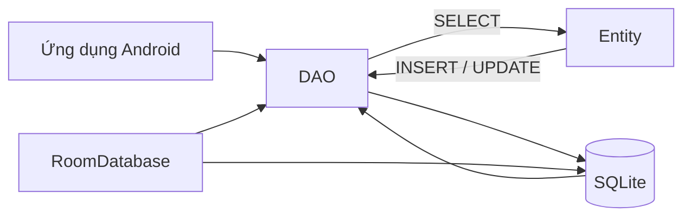

Android Developers mô tả:

* **Database class:** điểm truy cập chính vào database.
* **Entity:** đại diện cho các table.
* **DAO:** cung cấp các operation query, insert, update và delete.

Một luồng phổ biến trong ứng dụng thực tế:

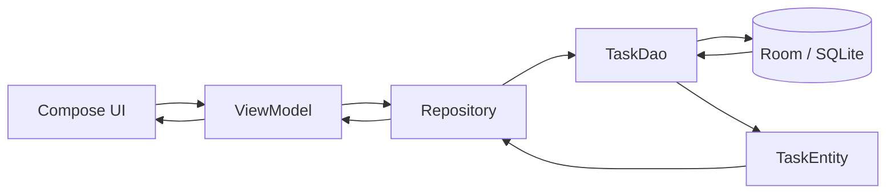

> **Điểm quan trọng:** UI thông thường không nên trực tiếp thao tác với Entity hoặc database. Entity thuộc **Data Layer**.

---

# 4. Khái niệm Entity

## 4.1 Entity = Table

Khai báo:

```kotlin
@Entity
data class User(
    @PrimaryKey val id: Int,
    val firstName: String,
    val lastName: String
)
```

tương đương về mặt khái niệm với:

```sql
CREATE TABLE User (
    id INTEGER NOT NULL PRIMARY KEY,
    firstName TEXT NOT NULL,
    lastName TEXT NOT NULL
);
```

Room định nghĩa mỗi class có `@Entity` là một Entity; mỗi Entity tương ứng với một table và mỗi instance tương ứng với một row.

---

## 4.2 Property = Column

Ví dụ:

```kotlin
data class TaskEntity(
    val id: Long,
    val title: String,
    val description: String?,
    val isCompleted: Boolean
)
```

Có thể hình dung thành:

| Property Kotlin | Column database |
| --------------- | --------------- |
| `id`            | `id`            |
| `title`         | `title`         |
| `description`   | `description`   |
| `isCompleted`   | `isCompleted`   |

Nếu không cấu hình tên khác, Room dùng tên property làm tên column. Room cũng dùng tên class làm tên table mặc định.

---

# 5. Annotation `@Entity`

Entity tối thiểu:

```kotlin
@Entity
data class NoteEntity(
    @PrimaryKey
    val id: Long,

    val content: String
)
```

Có thể đặt tên bảng rõ ràng hơn:

```kotlin
@Entity(tableName = "notes")
data class NoteEntity(
    @PrimaryKey
    val id: Long,

    val content: String
)
```

Trong project thực tế, việc đặt `tableName` rõ ràng giúp schema ít phụ thuộc vào việc đổi tên Kotlin class.

Ví dụ:

```text
NoteEntity              notes
Kotlin class            SQLite table
     │                       │
     └──── @Entity ──────────┘
```

---

# 6. `@PrimaryKey`

Mỗi Entity bình thường phải có **primary key** để phân biệt duy nhất từng row. Room cho phép dùng `@PrimaryKey` với một field hoặc composite primary key từ nhiều column.

Ví dụ:

```kotlin
@Entity(tableName = "users")
data class UserEntity(
    @PrimaryKey
    val id: Long,

    val name: String
)
```

Database:

```text
users

+----+---------+
| id | name    |
+----+---------+
| 1  | An      |
| 2  | Bình    |
| 3  | Chi     |
+----+---------+
```

`id` phải xác định duy nhất một user.

---

# 7. Primary Key tự tăng

Room có thể tự sinh khóa chính:

```kotlin
@Entity(tableName = "tasks")
data class TaskEntity(
    @PrimaryKey(autoGenerate = true)
    val id: Long = 0,

    val title: String
)
```

Khi insert:

```kotlin
TaskEntity(
    title = "Học Room"
)
```

Room/SQLite có thể tạo ID mới cho row. `autoGenerate = true` là cách Room hỗ trợ tự cấp ID cho Entity.

Ví dụ:

```text
Insert:

TaskEntity(
    id = 0,
    title = "Học Room"
)

          ↓

Database

+----+-----------+
| id | title     |
+----+-----------+
| 37 | Học Room |
+----+-----------+
```

---

# 8. Composite Primary Key

Một số table không cần ID riêng mà được xác định bởi **nhiều column kết hợp**.

Ví dụ bảng lưu user đã thích bài viết nào:

```kotlin
@Entity(
    tableName = "user_favorites",
    primaryKeys = ["userId", "articleId"]
)
data class UserFavoriteEntity(
    val userId: Long,
    val articleId: Long
)
```

Một row được xác định bởi:

$$
PrimaryKey = (userId,\ articleId)
$$

Ví dụ:

```text
user_favorites

+--------+-----------+
| userId | articleId |
+--------+-----------+
| 1      | 10        |
| 1      | 11        |
| 2      | 10        |
+--------+-----------+
```

Cặp:

```text
(1, 10)
```

không được xuất hiện hai lần.

Room hỗ trợ composite primary key thông qua `primaryKeys` của `@Entity`.

---

# 9. `@ColumnInfo`

Không nhất thiết tên Kotlin property phải giống tên column.

Ví dụ:

```kotlin
@Entity(tableName = "tasks")
data class TaskEntity(

    @PrimaryKey(autoGenerate = true)
    val id: Long = 0,

    @ColumnInfo(name = "task_title")
    val title: String,

    @ColumnInfo(name = "is_completed")
    val isCompleted: Boolean
)
```

Schema:

```text
Kotlin                     SQLite

title           ────────→ task_title

isCompleted     ────────→ is_completed
```

Room mặc định dùng tên property làm column name, nhưng `@ColumnInfo(name = "...")` cho phép thay đổi tên column.

---

# 10. Nullable và Non-null

Entity cũng thể hiện constraint của dữ liệu.

```kotlin
val title: String
```

có nghĩa application mong đợi luôn có `title`.

Trong khi:

```kotlin
val description: String?
```

cho phép:

```text
description = NULL
```

Ví dụ:

```kotlin
@Entity(tableName = "notes")
data class NoteEntity(

    @PrimaryKey(autoGenerate = true)
    val id: Long = 0,

    val title: String,

    val description: String?
)
```

Khi thiết kế Entity, cần suy nghĩ kỹ:

```text
Field này thực sự optional?

              │
       ┌──────┴──────┐
       │             │
      Có            Không
       │             │
   nullable       non-null
   String?        String
```

Không nên biến mọi field thành nullable chỉ để tránh lỗi migration hoặc validation.

---

# 11. Giá trị mặc định

Ví dụ:

```kotlin
@Entity(tableName = "tasks")
data class TaskEntity(

    @PrimaryKey(autoGenerate = true)
    val id: Long = 0,

    val title: String,

    @ColumnInfo(
        name = "is_completed",
        defaultValue = "0"
    )
    val isCompleted: Boolean = false
)
```

Default value đặc biệt quan trọng khi schema đã tồn tại và bạn thêm một column mới cho user đang có database cũ.

Room hỗ trợ khai báo default database value bằng `@ColumnInfo(defaultValue = "...")`; thay đổi Entity/schema khi ứng dụng đã phát hành cần được xem xét cùng migration.

---

# 12. `@Ignore`

Không phải property nào trong Kotlin class cũng cần lưu xuống database.

Ví dụ:

```kotlin
@Entity(tableName = "users")
data class UserEntity(

    @PrimaryKey
    val id: Long,

    val firstName: String,

    val lastName: String,

    @Ignore
    val displayName: String = "$firstName $lastName"
)
```

`displayName` chỉ phục vụ runtime và không trở thành column.

Room mặc định persist các property của Entity; `@Ignore` cho phép loại một property khỏi schema. Nếu property bị ignore nằm trong primary constructor thì cần có default value để Room vẫn có thể khởi tạo object khi đọc kết quả query.

---

# 13. Index

Giả sử ứng dụng thường xuyên chạy:

```sql
SELECT *
FROM tasks
WHERE user_id = ?
```

Nếu table có hàng trăm nghìn row, tìm kiếm không có index có thể tốn nhiều công sức hơn.

Ta có thể khai báo:

```kotlin
@Entity(
    tableName = "tasks",
    indices = [
        Index(value = ["user_id"])
    ]
)
data class TaskEntity(

    @PrimaryKey(autoGenerate = true)
    val id: Long = 0,

    @ColumnInfo(name = "user_id")
    val userId: Long,

    val title: String
)
```

Room hỗ trợ index cho một hoặc nhiều column bằng thuộc tính `indices` của `@Entity`.

### Tư duy

```text
Không index

query
  ↓
[1][2][3][4][5][6][7]...[100000]
 ↓ kiểm tra nhiều row


Có index

query
  ↓
[Index]
  ↓
row cần tìm
```

Index thường hữu ích cho các column xuất hiện nhiều trong:

```sql
WHERE
JOIN
ORDER BY
```

nhưng index cũng có chi phí về disk và thao tác ghi, vì vậy không nên index tất cả column một cách máy móc.

---

# 14. Unique Index

Ví dụ username không được trùng:

```kotlin
@Entity(
    tableName = "users",
    indices = [
        Index(
            value = ["username"],
            unique = true
        )
    ]
)
data class UserEntity(

    @PrimaryKey(autoGenerate = true)
    val id: Long = 0,

    val username: String
)
```

Room hỗ trợ `unique = true` trên `Index` để yêu cầu một column hoặc nhóm column phải có giá trị duy nhất.

Ví dụ:

```text
✅ alice
✅ bob
❌ alice
```

---

# 15. Entity không phải lúc nào cũng là Domain Model

Một lỗi kiến trúc khá phổ biến:

```text
Room Entity
    ↓
truyền thẳng khắp ứng dụng
    ↓
Domain
    ↓
UI
```

Với app nhỏ điều này có thể chấp nhận được.

Nhưng trong app lớn, nên cân nhắc:

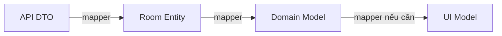

Ví dụ Entity:

```kotlin
data class TaskEntity(
    val id: Long,
    val title: String,
    val isCompleted: Boolean
)
```

Domain model:

```kotlin
data class Task(
    val id: Long,
    val title: String,
    val completed: Boolean
)
```

Mapper:

```kotlin
fun TaskEntity.toDomain(): Task {
    return Task(
        id = id,
        title = title,
        completed = isCompleted
    )
}
```

### Vì sao tách?

Database schema thường thay đổi vì:

```text
migration
index
foreign key
cache metadata
sync metadata
```

Trong khi Domain Model nên tập trung vào:

```text
business logic
```

Nhờ vậy thay đổi cách lưu dữ liệu không nhất thiết lan tới toàn bộ UI.

---

# 16. Entity và DAO

Entity mô tả **dữ liệu là gì**.

DAO mô tả **làm gì với dữ liệu đó**.

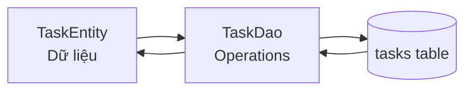

Android Developers khuyến khích truy cập database thông qua DAO; Room sinh implementation của DAO tại compile time. DAO có thể chứa convenience functions như insert/update/delete và các SQL query tùy chỉnh.

---

# 17. Ví dụ DAO hoàn chỉnh

```kotlin
@Dao
interface TaskDao {

    @Insert
    suspend fun insert(task: TaskEntity): Long

    @Update
    suspend fun update(task: TaskEntity)

    @Delete
    suspend fun delete(task: TaskEntity)

    @Query(
        """
        SELECT *
        FROM tasks
        ORDER BY created_at DESC
        """
    )
    fun observeTasks(): Flow<List<TaskEntity>>

    @Query(
        """
        SELECT *
        FROM tasks
        WHERE id = :taskId
        LIMIT 1
        """
    )
    suspend fun getTaskById(
        taskId: Long
    ): TaskEntity?
}
```

---

# 18. Ví dụ Entity thực tế hơn

Ta xây một mini **Task Manager**.

```kotlin
@Entity(
    tableName = "tasks",
    indices = [
        Index(value = ["created_at"]),
        Index(value = ["is_completed"])
    ]
)
data class TaskEntity(

    @PrimaryKey(autoGenerate = true)
    val id: Long = 0,

    val title: String,

    val description: String? = null,

    @ColumnInfo(name = "is_completed")
    val isCompleted: Boolean = false,

    @ColumnInfo(name = "created_at")
    val createdAt: Long
)
```

Schema logic:

```text
tasks
────────────────────────────────────────────────────────
id             INTEGER     PRIMARY KEY
title          TEXT        NOT NULL
description    TEXT        NULL
is_completed   INTEGER     NOT NULL
created_at     INTEGER     NOT NULL
────────────────────────────────────────────────────────
```

Một row:

```text
+----+-------------+-------------+--------------+---------------+
| id | title       | description | is_completed | created_at    |
+----+-------------+-------------+--------------+---------------+
| 12 | Học Entity | Room lesson | 0            | 1786542000000 |
+----+-------------+-------------+--------------+---------------+
```

---

# 19. Entity và `RoomDatabase`

Entity phải được đăng ký với database.

```kotlin
@Database(
    entities = [
        TaskEntity::class
    ],
    version = 1
)
abstract class AppDatabase : RoomDatabase() {

    abstract fun taskDao(): TaskDao
}
```

Luồng:

```text
TaskEntity
     │
     ▼
@Database(
    entities = [...]
)
     │
     ▼
Room schema
     │
     ▼
SQLite database
```

---

# 20. Entity và quan hệ dữ liệu

Ví dụ:

```text
User
  │
  │ 1
  │
  │ N
  ▼
Task
```

Một user có nhiều task.

Entity:

```kotlin
@Entity(tableName = "users")
data class UserEntity(

    @PrimaryKey
    val id: Long,

    val name: String
)
```

Task:

```kotlin
@Entity(tableName = "tasks")
data class TaskEntity(

    @PrimaryKey(autoGenerate = true)
    val id: Long = 0,

    val userId: Long,

    val title: String
)
```

Room hỗ trợ các mô hình quan hệ như:

```text
one-to-one
one-to-many
many-to-many
nested relationships
```

Tuy nhiên Room không hoạt động theo kiểu Entity object tùy ý giữ object reference trực tiếp tới Entity khác như một số ORM. Quan hệ thường được biểu diễn thông qua key/query và result model phù hợp.

---

# 21. Entity và Foreign Key

Có thể làm schema chặt chẽ hơn:

```kotlin
@Entity(
    tableName = "tasks",
    foreignKeys = [
        ForeignKey(
            entity = UserEntity::class,
            parentColumns = ["id"],
            childColumns = ["user_id"],
            onDelete = ForeignKey.CASCADE
        )
    ],
    indices = [
        Index("user_id")
    ]
)
data class TaskEntity(

    @PrimaryKey(autoGenerate = true)
    val id: Long = 0,

    @ColumnInfo(name = "user_id")
    val userId: Long,

    val title: String
)
```

Quan hệ:

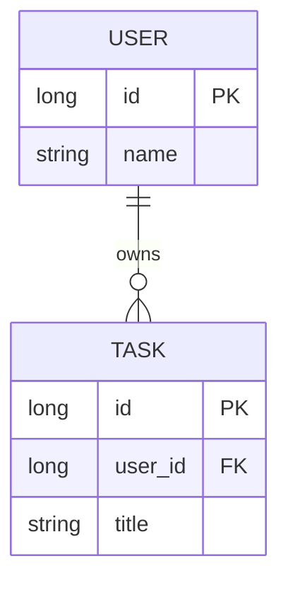

Nếu thiết kế quan hệ, nên cân nhắc:

```text
Ai là parent?
Ai là child?
Xóa parent thì child phải làm gì?

CASCADE?
RESTRICT?
SET NULL?
```

---

# 22. Entity và Offline-first

Room đặc biệt hữu ích khi ứng dụng cần hoạt động khi network yếu hoặc mất mạng. Tài liệu Android nêu một use case phổ biến của local database là cache dữ liệu cần thiết để người dùng vẫn duyệt được nội dung khi thiết bị không truy cập được mạng.

Kiến trúc có thể là:

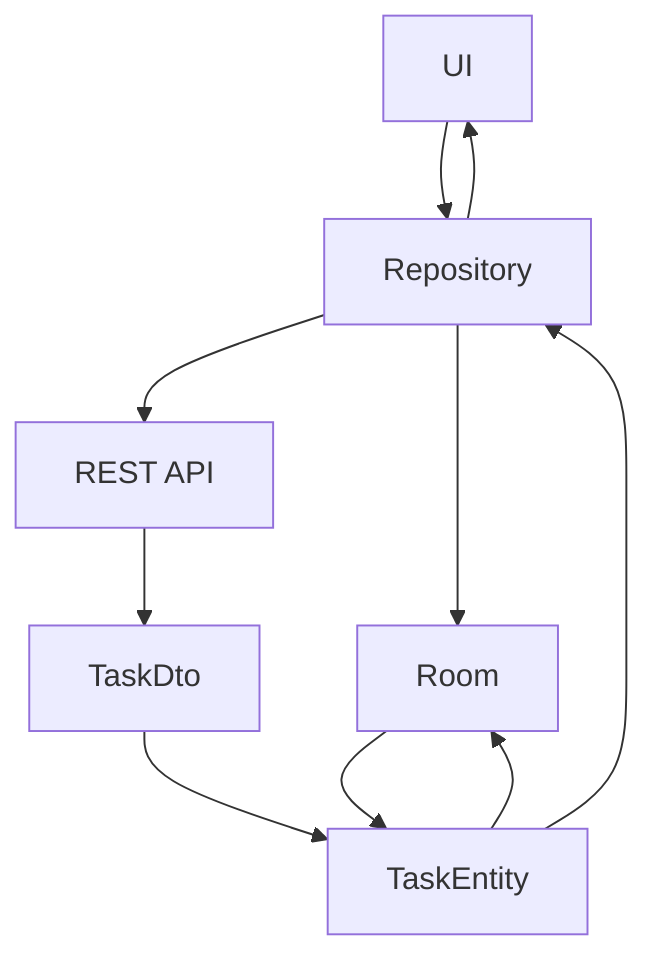

Ví dụ:

```text
Có Internet
────────────
API
 ↓
DTO
 ↓
Mapper
 ↓
TaskEntity
 ↓
Room
 ↓
UI


Mất Internet
────────────
Room
 ↓
TaskEntity
 ↓
UI
```

### UX đạt được

Người dùng vẫn có thể:

```text
mở app
xem dữ liệu đã cache
xem task
tìm kiếm dữ liệu local
```

thay vì nhận một màn hình trắng chỉ vì mất mạng.

---

# 23. Local database không đồng nghĩa với UI State

Cần phân biệt:

```text
UI State
    ≠
Room Entity
```

Ví dụ:

```kotlin
data class TaskScreenUiState(
    val isLoading: Boolean,
    val tasks: List<Task>,
    val errorMessage: String?
)
```

khác với:

```kotlin
@Entity
data class TaskEntity(...)
```

Entity đại diện cho:

```text
persistent data
```

UI State đại diện cho:

```text
trạng thái màn hình tại thời điểm hiện tại
```

Ví dụ:

```text
isLoading
showDialog
selectedTab
errorSnackbar
```

thường không nên biến thành column trong Entity chỉ vì UI cần chúng.

---

# 24. Entity và Lifecycle

Database tồn tại độc lập với:

```text
Activity recreation
Configuration change
Screen navigation
```

Ví dụ khi rotate:

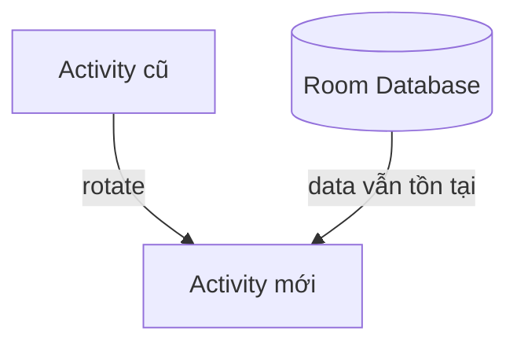

Room persistence không phải cơ chế giữ temporary UI state, nhưng dữ liệu đã ghi xuống database không mất đơn giản vì Activity bị recreate.

Kiến trúc thông thường:

```text
Room
  ↓
Repository
  ↓
ViewModel
  ↓
StateFlow
  ↓
Compose UI
```

giúp tách **persistent state** khỏi **presentation state**.

---

# 25. Entity và Migration

Đây là phần cực kỳ quan trọng đối với production.

Giả sử version 1:

```kotlin
@Entity(tableName = "tasks")
data class TaskEntity(
    @PrimaryKey
    val id: Long,

    val title: String
)
```

Người dùng đã có:

```text
tasks

+----+-----------+
| id | title     |
+----+-----------+
| 1  | Buy milk  |
| 2  | Learn SQL |
+----+-----------+
```

Sau đó developer sửa thành:

```kotlin
@Entity(tableName = "tasks")
data class TaskEntity(
    @PrimaryKey
    val id: Long,

    val title: String,

    val priority: Int
)
```

Schema đã thay đổi:

```diff
 id
 title
+priority
```

Database cũ của người dùng chưa có column `priority`.

Đây là lý do migration tồn tại.

Khi feature thay đổi làm Entity/schema thay đổi, Room cần có đường migration phù hợp để dữ liệu database đang tồn tại trên thiết bị được bảo toàn. Room hỗ trợ cả automatic migration và manual migration.

---

# 26. Ví dụ Migration

Version 1:

```text
tasks
├── id
└── title
```

Version 2:

```text
tasks
├── id
├── title
└── priority
```

Manual migration về mặt SQL có thể tương tự:

```sql
ALTER TABLE tasks
ADD COLUMN priority INTEGER NOT NULL DEFAULT 0;
```

Sơ đồ:

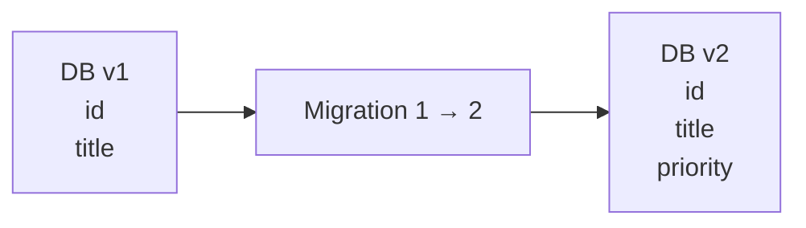

### Production rule

```text
Thay đổi Entity
      ↓
Schema có thay đổi?
      │
 ┌────┴────┐
 │         │
Không      Có
 │         │
done     tăng DB version
           ↓
       migration
           ↓
       migration test
           ↓
         release
```

Không nên dùng:

```kotlin
fallbackToDestructiveMigration()
```

một cách tùy tiện cho dữ liệu người dùng quan trọng, vì destructive migration có thể dẫn đến việc database cũ bị tạo lại thay vì bảo toàn dữ liệu.

---

# 27. Entity và API

Giả sử backend trả:

```json
{
  "task_id": 101,
  "task_name": "Learn Room",
  "done": false
}
```

DTO:

```kotlin
data class TaskDto(
    val taskId: Long,
    val taskName: String,
    val done: Boolean
)
```

Entity:

```kotlin
@Entity(tableName = "tasks")
data class TaskEntity(
    @PrimaryKey
    val id: Long,

    val title: String,

    val isCompleted: Boolean
)
```

Mapper:

```kotlin
fun TaskDto.toEntity(): TaskEntity {
    return TaskEntity(
        id = taskId,
        title = taskName,
        isCompleted = done
    )
}
```

Không cần ép database schema giống hệt API schema.

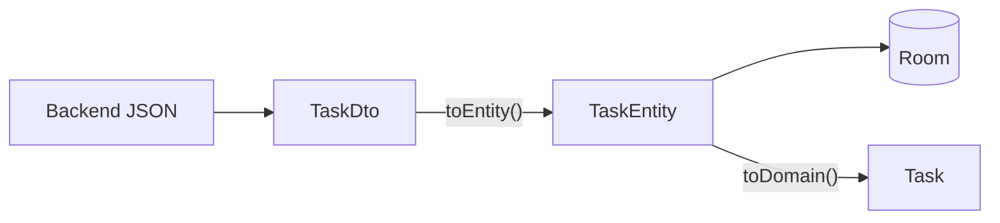

Điều này giúp app chịu được việc backend và database phát triển độc lập tốt hơn.

---

# 28. Single Source of Truth

Một kiến trúc offline-first phổ biến:

```text
Remote API
    ↓
Repository
    ↓
ghi Room
    ↓
Room Database
    ↓
Flow
    ↓
ViewModel
    ↓
UI
```

Thay vì:

```text
API ─────────→ UI
Room ────────→ UI
```

vì hai nguồn đẩy trực tiếp vào UI dễ tạo ra:

```text
race condition
stale state
data mismatch
```

Entity khi đó đóng vai trò representation của dữ liệu nằm trong **local source of truth**.

---

# 29. Performance

Entity design có thể ảnh hưởng performance.

Ví dụ các vấn đề:

### Entity quá lớn

```text
ArticleEntity
├── id
├── title
├── body 500 KB
├── imageBlob 4 MB
└── metadata...
```

Trong khi màn hình list chỉ cần:

```text
id
title
```

Nếu luôn query:

```sql
SELECT * FROM articles
```

thì database có thể đọc nhiều dữ liệu không cần thiết.

Có thể sử dụng projection:

```kotlin
data class ArticleSummary(
    val id: Long,
    val title: String
)
```

```kotlin
@Query(
    """
    SELECT id, title
    FROM articles
    """
)
fun observeArticleSummaries(): Flow<List<ArticleSummary>>
```

### Index không đúng

```text
WHERE user_id = ?
```

nhưng `user_id` không có index có thể khiến query tốn nhiều công hơn khi dữ liệu lớn.

Room hỗ trợ index và composite index trực tiếp trên Entity.

---

# 30. Những lỗi thiết kế Entity thường gặp

| Lỗi                                             | Hậu quả                                         |
| ----------------------------------------------- | ----------------------------------------------- |
| Không suy nghĩ về primary key                   | duplicate hoặc update sai row                   |
| Dùng remote ID không ổn định làm local identity | dữ liệu khó đồng bộ                             |
| Thêm field nhưng quên migration                 | crash sau update                                |
| Đổi tên column tùy tiện                         | schema migration phức tạp                       |
| Lưu UI state vào Entity                         | data layer bị nhiễm presentation logic          |
| Entity giống hệt DTO một cách máy móc           | backend thay đổi kéo database thay đổi          |
| Index mọi field                                 | tăng kích thước DB và write cost                |
| Không index query quan trọng                    | query chậm khi data lớn                         |
| Dùng destructive migration vô điều kiện         | nguy cơ mất dữ liệu                             |
| Không test migration                            | lỗi chỉ xuất hiện ở user nâng cấp từ version cũ |

---

# 31. Test Entity thông qua DAO

Không nên chỉ kiểm tra Entity compile được.

Cần kiểm tra hành vi thật:

```text
Create
Read
Update
Delete
Query
Constraint
Migration
```

Ví dụ:

```kotlin
@Test
fun insertAndReadTask() = runTest {

    val task = TaskEntity(
        title = "Learn Room",
        createdAt = 1000L
    )

    dao.insert(task)

    val result = dao.getAll()

    assertEquals(1, result.size)
    assertEquals("Learn Room", result.first().title)
}
```

DAO là abstraction chính để ứng dụng tương tác với Room và có thể được kiểm thử độc lập với phần UI.

---

# 32. Migration Test

Một migration lỗi có thể dẫn đến app crash khi user update phiên bản mới, vì vậy tài liệu Android nhấn mạnh việc test Room migration. Room cung cấp `MigrationTestHelper` để tạo database ở schema version cũ rồi chạy migration và validate schema mới.

Logic test:

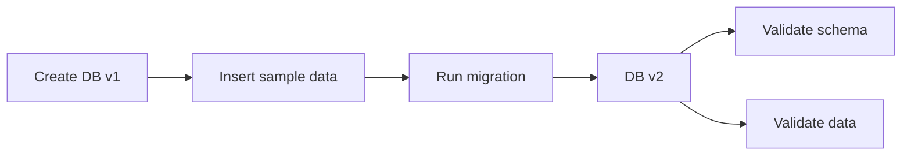

Điều quan trọng không chỉ là:

```text
schema đúng
```

mà còn:

```text
dữ liệu cũ vẫn đúng
```

---

# 33. Debug bằng Database Inspector

Android Studio có **Database Inspector** để xem database của ứng dụng đang chạy.

Có thể dùng để:

```text
xem table
xem column
xem row
chạy SQL query
chỉnh dữ liệu
theo dõi live changes
chạy DAO query
```

Database Inspector hỗ trợ kiểm tra database trong khi app đang chạy và có tích hợp đặc biệt với Room, bao gồm khả năng chạy DAO query từ gutter action và theo dõi thay đổi dữ liệu trực tiếp.

Đường dẫn thường dùng:

```text
Android Studio
    ↓
View
    ↓
Tool Windows
    ↓
App Inspection
    ↓
Database Inspector
```

Ví dụ khi debug:

```sql
SELECT *
FROM tasks;
```

Hoặc:

```sql
SELECT *
FROM tasks
WHERE is_completed = 0;
```

Đây là cách rất tốt để kiểm chứng rằng Kotlin `TaskEntity` thực sự được ánh xạ sang schema và row như bạn dự kiến.

---

# 34. Thực hành — Mini Task Database

## Bước 1 — Tạo Entity

```kotlin
@Entity(tableName = "tasks")
data class TaskEntity(

    @PrimaryKey(autoGenerate = true)
    val id: Long = 0,

    val title: String,

    @ColumnInfo(name = "is_completed")
    val isCompleted: Boolean = false,

    @ColumnInfo(name = "created_at")
    val createdAt: Long
)
```

---

## Bước 2 — Tạo DAO

```kotlin
@Dao
interface TaskDao {

    @Insert
    suspend fun insert(
        task: TaskEntity
    ): Long

    @Query(
        """
        SELECT *
        FROM tasks
        ORDER BY created_at DESC
        """
    )
    fun observeAll(): Flow<List<TaskEntity>>

    @Query(
        """
        UPDATE tasks
        SET is_completed = :completed
        WHERE id = :taskId
        """
    )
    suspend fun setCompleted(
        taskId: Long,
        completed: Boolean
    )

    @Delete
    suspend fun delete(
        task: TaskEntity
    )
}
```

---

## Bước 3 — Tạo Database

```kotlin
@Database(
    entities = [
        TaskEntity::class
    ],
    version = 1
)
abstract class AppDatabase : RoomDatabase() {

    abstract fun taskDao(): TaskDao
}
```

---

## Bước 4 — Repository

```kotlin
class TaskRepository(
    private val taskDao: TaskDao
) {

    val tasks: Flow<List<TaskEntity>> =
        taskDao.observeAll()

    suspend fun createTask(
        title: String
    ) {
        taskDao.insert(
            TaskEntity(
                title = title,
                createdAt = System.currentTimeMillis()
            )
        )
    }

    suspend fun completeTask(
        id: Long
    ) {
        taskDao.setCompleted(
            taskId = id,
            completed = true
        )
    }
}
```

---

# 35. Luồng dữ liệu của bài thực hành

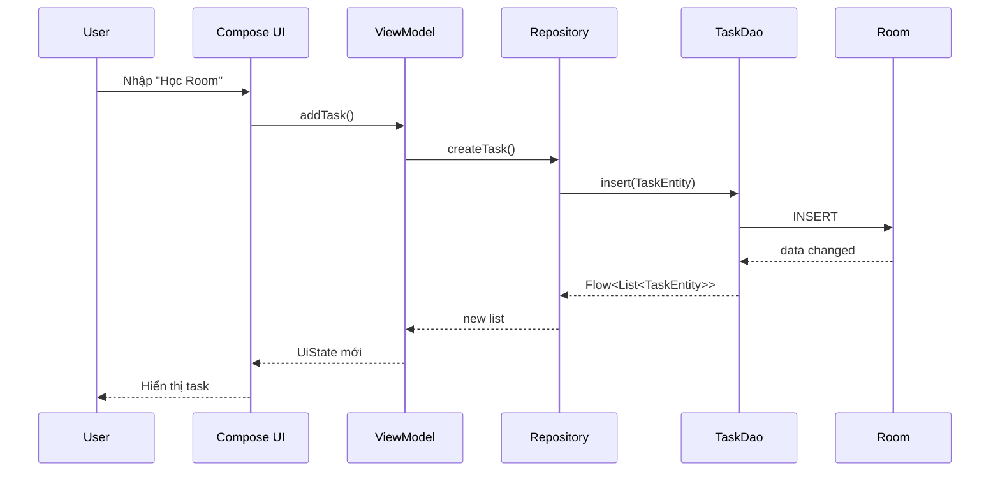

---

# 36. Local và Remote Data

Ví dụ app Task có backend:

```text
Remote API
    │
    │ GET /tasks
    ▼
TaskDto
    │
    │ mapper
    ▼
TaskEntity
    │
    ▼
Room
    │
    ▼
Repository
    │
    ▼
ViewModel
    │
    ▼
UI
```

### Khi online

```text
Network
  ↓
fetch latest data
  ↓
save to Room
  ↓
UI observes Room
```

### Khi offline

```text
Network ✕
   ↓
Room vẫn còn data
   ↓
UI vẫn hiển thị
```

Local persistence chính là một trong những use case Room được thiết kế để giải quyết.

---

# 37. Bài tập

## Bài tập chính

Xây dựng Entity:

```text
FavoriteArticleEntity
```

với schema:

```text
favorite_articles
─────────────────────────
id
title
url
saved_at
─────────────────────────
```

Yêu cầu:

```kotlin
@Entity(...)
data class FavoriteArticleEntity(...)
```

Sau đó:

1. Insert một bài viết.
2. Đọc lại bài viết.
3. Xóa bài viết.
4. Đóng và mở lại app, xác nhận dữ liệu vẫn còn.
5. Mở Database Inspector và chụp screenshot table.
6. Thêm field mới:

```text
note
```

7. Nâng database:

```text
version 1
   ↓
version 2
```

8. Tạo hoặc cấu hình migration phù hợp.
9. Kiểm tra dữ liệu từ version 1 không bị mất.
10. Ghi lại offline behavior trong README.

---

# 38. Bài tập nâng cao

Thiết kế Entity cho ứng dụng đọc tin offline:

```text
ArticleEntity
────────────────────────────
id
title
summary
content
thumbnail_url
published_at
is_bookmarked
last_synced_at
────────────────────────────
```

Sau đó giải thích:

```text
Đâu là remote ID?
Đâu là local-only field?
Field nào cần index?
Field nào nullable?
Field nào có default?
Field nào cần migration nếu thêm sau?
```

---

# 39. Artifact Portfolio

Một artifact tốt có thể có cấu trúc:

```text
room-entity-demo/
│
├── data/
│   ├── TaskEntity.kt
│   ├── TaskDao.kt
│   └── AppDatabase.kt
│
├── repository/
│   └── TaskRepository.kt
│
├── ui/
│   └── TaskScreen.kt
│
├── androidTest/
│   ├── TaskDaoTest.kt
│   └── MigrationTest.kt
│
├── screenshots/
│   ├── task_screen.png
│   └── database_inspector.png
│
└── README.md
```

README nên giải thích:

```text
Entity schema
DAO operations
Room architecture
offline behavior
migration strategy
testing strategy
screenshots
```

---

# 40. Checklist hoàn thành

* [ ] Giải thích được Entity bằng ngôn ngữ của mình.
* [ ] Biết `Entity = table`.
* [ ] Biết `Entity instance = row`.
* [ ] Biết `property = column`.
* [ ] Sử dụng được `@Entity`.
* [ ] Sử dụng được `tableName`.
* [ ] Sử dụng được `@PrimaryKey`.
* [ ] Hiểu `autoGenerate`.
* [ ] Hiểu composite primary key.
* [ ] Sử dụng được `@ColumnInfo`.
* [ ] Hiểu nullable và default value.
* [ ] Biết dùng `@Ignore`.
* [ ] Hiểu cơ bản về index.
* [ ] Hiểu unique index.
* [ ] Phân biệt Entity và DTO.
* [ ] Phân biệt Entity và Domain Model.
* [ ] Phân biệt Entity và UI State.
* [ ] Biết Entity tương tác với DAO thế nào.
* [ ] Biết Entity được đăng ký trong `RoomDatabase`.
* [ ] Hiểu Entity có thể tham gia quan hệ giữa nhiều table.
* [ ] Hiểu thay đổi Entity có thể làm thay đổi schema.
* [ ] Biết migration cần bảo vệ dữ liệu user.
* [ ] Có DAO test.
* [ ] Có migration test.
* [ ] Biết kiểm tra database bằng Database Inspector.
* [ ] Có screenshot hoặc README để đưa vào portfolio.

---

# 41. Production Notes

Khi thiết kế Entity cho production, đừng chỉ hỏi:

> “Code này compile được không?”

Cần hỏi:

```text
Entity này đại diện dữ liệu gì?
        ↓
Primary key có ổn định không?
        ↓
Nullable có đúng business rule không?
        ↓
Query nào được chạy thường xuyên?
        ↓
Có cần index không?
        ↓
Có quan hệ với table khác không?
        ↓
Schema thay đổi có cần migration?
        ↓
User cũ update app có mất data không?
        ↓
Offline có hoạt động không?
        ↓
DAO đã được test chưa?
        ↓
Migration đã được test chưa?
```

Migration là release risk thực sự: khi ứng dụng thay đổi Entity, database trên thiết bị của user cũ vẫn đang ở schema cũ và cần được nâng cấp an toàn. Android Developers khuyến nghị kiểm thử migration vì migration sai có thể khiến ứng dụng crash.

---

# 42. Entity ảnh hưởng đến những phần nào của ứng dụng?

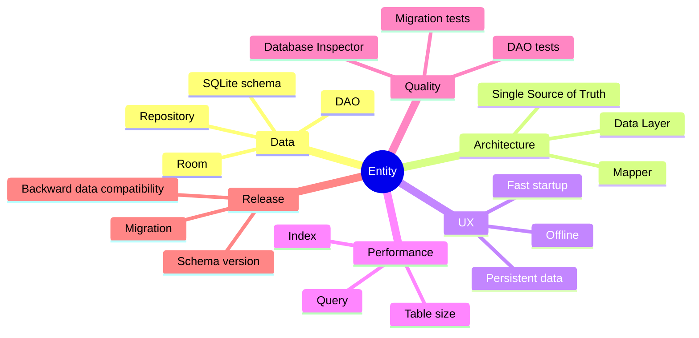

Có thể tóm tắt:

| Khía cạnh   | Entity ảnh hưởng thế nào                                        |
| ----------- | --------------------------------------------------------------- |
| UI          | Cung cấp persistent data gián tiếp qua Repository/ViewModel     |
| Lifecycle   | Data không phụ thuộc vòng đời Activity                          |
| State       | Thường đại diện persistent state, không phải transient UI state |
| Network     | Có thể cache dữ liệu remote                                     |
| Offline     | Cho phép hiển thị dữ liệu đã lưu khi mất mạng                   |
| Performance | Schema và index ảnh hưởng query                                 |
| Testing     | Cần DAO và migration test                                       |
| Debugging   | Có thể xem bằng Database Inspector                              |
| Release     | Schema change có thể yêu cầu migration                          |

---

# 43. Mental Model

Hãy nhớ chuỗi sau:

```text
Kotlin object
     ↓
@Entity
     ↓
Room schema
     ↓
SQLite table
     ↓
DAO
     ↓
Repository
     ↓
ViewModel
     ↓
UI
```

Và mapping quan trọng nhất:

```text
Entity class       = Table
Entity object      = Row
Property           = Column
@PrimaryKey        = Unique row identifier
@ColumnInfo        = Column configuration
Index              = Query optimization structure
DAO                = Data operations
Migration          = Schema upgrade path
```

---

# 44. Câu hỏi tự kiểm tra

### Câu 1

Entity trong Room tương ứng với gì?

**Đáp án:** Một table trong database.

### Câu 2

Một instance của Entity tương ứng với gì?

**Đáp án:** Một row trong table.

### Câu 3

Entity có bắt buộc phải có primary key không?

**Đáp án:** Với Room Entity thông thường, cần xác định primary key để định danh duy nhất row; có thể là một column hoặc composite primary key.

### Câu 4

`@ColumnInfo` dùng để làm gì?

**Đáp án:** Cấu hình column, ví dụ đổi tên column so với property Kotlin.

### Câu 5

Thay đổi Entity sau khi app đã release cần nghĩ tới điều gì đầu tiên?

**Đáp án:** Database schema và migration.

### Câu 6

Entity có nên chứa `isDialogVisible` không?

Thông thường **không**. Đây là UI state, không phải persistent database data.

### Câu 7

Tại sao phải test migration?

Vì migration không đúng có thể gây lỗi khi user đang có database phiên bản cũ nâng cấp sang schema mới; Room cung cấp `MigrationTestHelper` để hỗ trợ kiểm tra quá trình này.

---

# 45. Tóm tắt cuối bài

**Entity là nền móng của schema trong Room.**

```text
@Entity
   ↓
mô tả table
   ↓
@PrimaryKey
   ↓
định danh row
   ↓
@ColumnInfo
   ↓
cấu hình column
   ↓
DAO
   ↓
CRUD / Query
   ↓
Room Database
   ↓
Persistent Local Data
```

Điểm cần nhớ nhất không phải chỉ là cú pháp:

```kotlin
@Entity
```

mà là tư duy:

> **Entity là contract giữa Kotlin code và dữ liệu persistent trên thiết bị của người dùng.**

Một Entity được thiết kế tốt phải cân nhắc đồng thời:

```text
schema
identity
nullability
relationships
index
offline behavior
migration
testing
performance
release safety
```

Khi đã hiểu được chuỗi:

```text
Remote DTO
   ↓
Entity
   ↓
Room
   ↓
DAO
   ↓
Repository
   ↓
Domain / ViewModel
   ↓
UI
```

thì Entity không còn chỉ là một annotation của Room, mà trở thành một phần rõ ràng của **Data Layer và kiến trúc Android hoàn chỉnh**.
