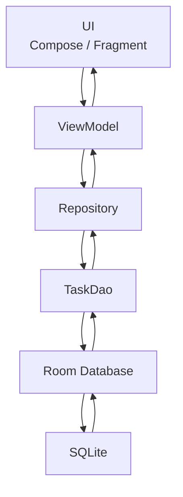
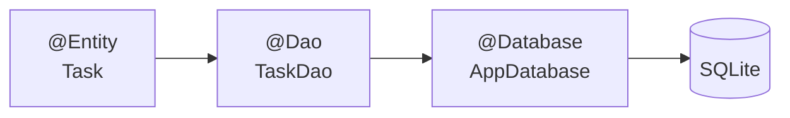
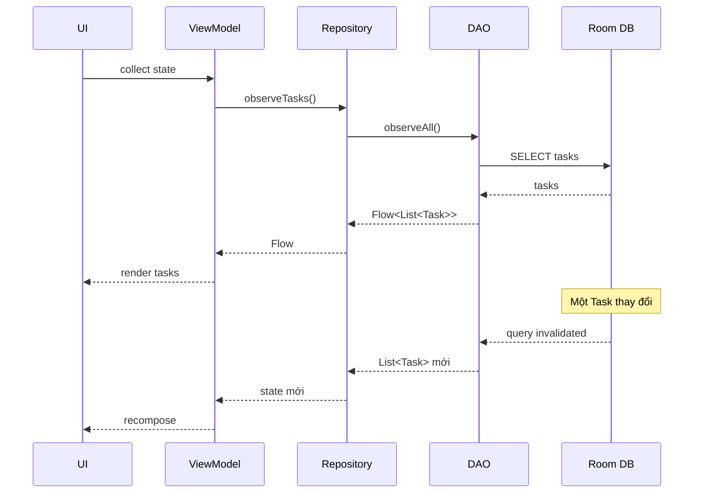
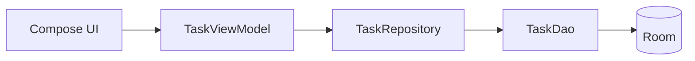
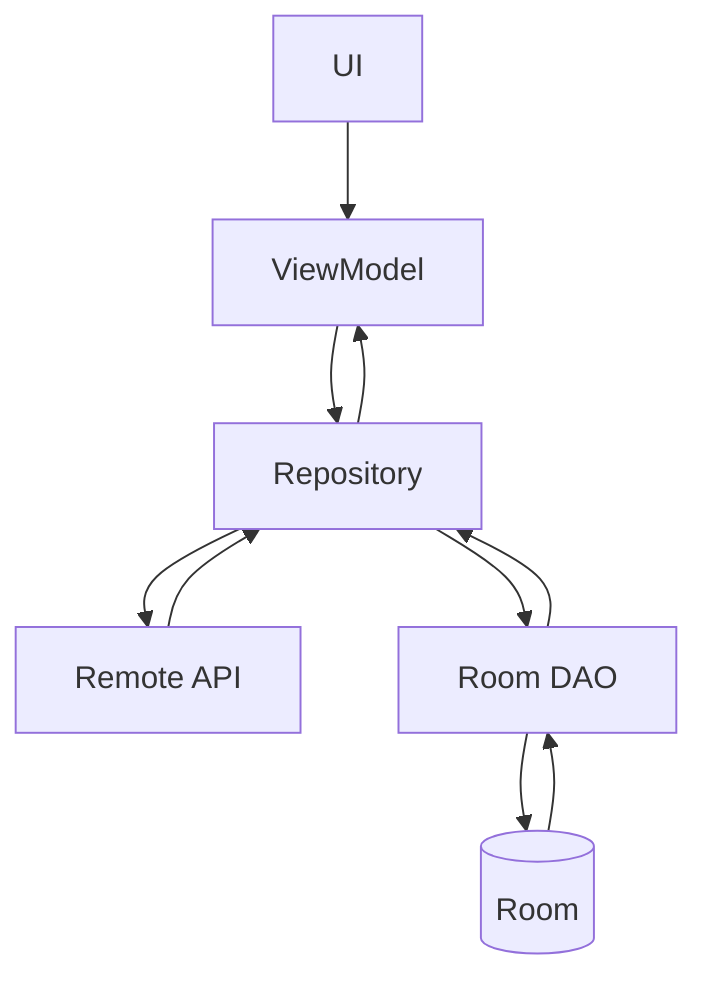
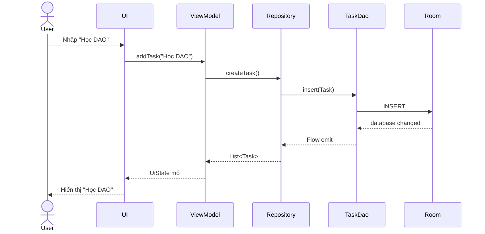
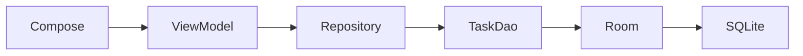

[](https://developer.android.com/codelabs/basic-android-kotlin-compose-persisting-data-room?utm_source=chatgpt.com)

# 011 - DAO

**Học phần:** 03 - Architecture, State and Data
**Module:** Module 06 - Storage
**Nhóm nội dung:** Room Database
**Nguồn roadmap:** Storage / Room Database
**Loại bài:** Storage
**Thứ tự trong module:** 011
**Thời lượng gợi ý:** 32 phút

---

## 1. Tóm tắt

**DAO — Data Access Object** là thành phần định nghĩa cách ứng dụng đọc và ghi dữ liệu trong **Room Database**.

Thay vì để `ViewModel`, `Repository` hoặc UI trực tiếp viết SQL, ta tạo một interface được đánh dấu bằng `@Dao`. Trong interface này, các thao tác database được biểu diễn thành các hàm Kotlin như:

```kotlin
insertTask(task)
updateTask(task)
deleteTask(task)
getTask(id)
observeTasks()
```

Room sẽ tự tạo implementation cho DAO trong quá trình compile. DAO nhờ đó trở thành lớp giao tiếp giữa code Kotlin và database SQLite bên dưới. ([Android Developers][1])

Một cách hiểu ngắn gọn:

> **Entity định nghĩa dữ liệu được lưu như thế nào. DAO định nghĩa chúng ta được phép làm gì với dữ liệu đó.**

Ví dụ:

```text
Task Entity
    ↓
TaskDao
    ↓
Room Database
    ↓
SQLite
```

---

## 2. Mục tiêu học tập

Sau bài này, bạn nên có thể:

* Giải thích được DAO là gì và vì sao Room cần DAO.
* Phân biệt `Entity`, `DAO`, `RoomDatabase` và `Repository`.
* Tạo DAO bằng `@Dao`.
* Sử dụng:

  * `@Insert`
  * `@Update`
  * `@Delete`
  * `@Upsert`
  * `@Query`
* Hiểu khi nào dùng `suspend`.
* Sử dụng `Flow` để quan sát dữ liệu thay đổi.
* Viết query có tham số.
* Kết nối DAO với Repository và ViewModel.
* Test các thao tác CRUD của DAO.
* Debug dữ liệu Room bằng Database Inspector.
* Nhận biết những lỗi DAO thường gặp khi đưa ứng dụng lên production.

---

# 3. DAO là gì?

DAO là viết tắt của:

```text
Data Access Object
```

DAO là một abstraction cho các thao tác truy cập database.

Ví dụ ứng dụng quản lý công việc có bảng:

```text
tasks
```

Thay vì viết SQL ở ViewModel:

```kotlin
db.execSQL(...)
```

ta tạo:

```kotlin
@Dao
interface TaskDao {

    @Query("SELECT * FROM tasks")
    suspend fun getTasks(): List<Task>
}
```

Sau đó phần còn lại của ứng dụng chỉ cần gọi:

```kotlin
taskDao.getTasks()
```

Room chịu trách nhiệm chuyển lời gọi này thành thao tác tương ứng với SQLite. Android Developers cũng mô tả DAO là lớp abstract access tới database và Room tạo implementation của DAO ở compile time. ([Android Developers][1])

---

## 3.1 DAO giải quyết vấn đề gì?

Nếu không có DAO, code database rất dễ bị rải rác:

```text
Activity
 ├── SELECT ...
 ├── INSERT ...
 │
ViewModel
 ├── UPDATE ...
 │
Service
 └── DELETE ...
```

Khi đó việc:

* thay đổi schema,
* sửa query,
* test,
* debug,
* tối ưu database

sẽ khó kiểm soát.

DAO gom các thao tác liên quan tới một nhóm dữ liệu lại:

```text
TaskDao
├── insert()
├── update()
├── delete()
├── getById()
├── observeAll()
└── search()
```

Cách tổ chức này giúp giữ **separation of concerns** và làm database access dễ mock hơn trong testing. ([Android Developers][1])

---

# 4. DAO nằm ở đâu trong kiến trúc Android?

Trong kiến trúc Android phổ biến, DAO thuộc **Data Layer**.



Android Architecture Guide khuyến nghị Data Layer chứa repository và các data source; database cục bộ là một trong những loại data source mà repository có thể sử dụng.

### Không nên

```text
Composable
    ↓
DAO
```

hoặc:

```text
Activity
    ↓
DAO
```

cho một ứng dụng có kiến trúc tương đối lớn.

Thường nên:

```text
UI
 ↓
ViewModel
 ↓
Repository
 ↓
DAO
 ↓
Room
```

---

# 5. Quan hệ giữa Entity, DAO và RoomDatabase

Đây là ba khái niệm cốt lõi của Room.



Có thể nhớ như sau:

| Thành phần     | Trách nhiệm                      |
| -------------- | -------------------------------- |
| `Entity`       | Định nghĩa cấu trúc bảng         |
| `DAO`          | Định nghĩa thao tác với dữ liệu  |
| `RoomDatabase` | Quản lý database và cung cấp DAO |
| SQLite         | Database thực tế bên dưới        |

Entity ánh xạ class thành bảng và các thuộc tính thành cột. DAO cung cấp các hàm query/insert/update/delete. Room Database là lớp truy cập database SQLite bên dưới. ([Android Developers][2])

---

# 6. Tạo Entity mẫu

Giả sử chúng ta xây dựng ứng dụng **Todo App**.

```kotlin
import androidx.room.Entity
import androidx.room.PrimaryKey

@Entity(tableName = "tasks")
data class Task(
    @PrimaryKey(autoGenerate = true)
    val id: Long = 0,

    val title: String,

    val completed: Boolean = false
)
```

Database tương ứng:

```text
tasks
┌────┬──────────────────────┬───────────┐
│ id │ title                │ completed │
├────┼──────────────────────┼───────────┤
│ 1  │ Học Room             │ false     │
│ 2  │ Viết DAO             │ true      │
│ 3  │ Test database        │ false     │
└────┴──────────────────────┴───────────┘
```

Mỗi instance `Task` tương ứng với một row trong bảng `tasks`. ([Android Developers][2])

---

# 7. Tạo DAO

DAO có thể là interface hoặc abstract class. Với trường hợp thông thường, interface là lựa chọn phổ biến và phải được đánh dấu bằng `@Dao`. ([Android Developers][1])

```kotlin
import androidx.room.Dao

@Dao
interface TaskDao {

}
```

Từ đây chúng ta thêm các database operation vào DAO.

---

# 8. Các annotation quan trọng

## 8.1 `@Insert`

Dùng để thêm Entity vào database.

```kotlin
@Insert
suspend fun insert(task: Task)
```

Ví dụ:

```kotlin
val task = Task(
    title = "Học Room DAO"
)

taskDao.insert(task)
```

Room cung cấp `@Insert` để thực hiện insert mà không cần tự viết SQL. ([Android Developers][1])

Tương đương về mặt ý tưởng:

```sql
INSERT INTO tasks (...)
VALUES (...);
```

---

## 8.2 Insert nhiều Entity

DAO có thể nhận nhiều Entity:

```kotlin
@Insert
suspend fun insertAll(tasks: List<Task>)
```

Hoặc:

```kotlin
@Insert
suspend fun insertAll(vararg tasks: Task)
```

---

# 9. Conflict Strategy

Một vấn đề thường gặp là insert một record có khóa bị conflict.

Ví dụ:

```text
id = 10
```

đã tồn tại nhưng ứng dụng lại cố insert:

```text
id = 10
```

Room hỗ trợ conflict strategy cho `@Insert`. ([Android Developers][1])

Ví dụ:

```kotlin
@Insert(
    onConflict = OnConflictStrategy.REPLACE
)
suspend fun insert(task: Task)
```

Một số strategy thường gặp:

```text
ABORT
IGNORE
REPLACE
```

Ví dụ:

```kotlin
@Insert(
    onConflict = OnConflictStrategy.IGNORE
)
suspend fun insert(task: Task)
```

Cần chọn chiến lược dựa trên semantics của dữ liệu, không nên tự động dùng `REPLACE` cho mọi trường hợp.

---

# 10. `@Update`

Dùng để update Entity.

```kotlin
@Update
suspend fun update(task: Task)
```

Ví dụ:

```kotlin
val updatedTask = task.copy(
    completed = true
)

taskDao.update(updatedTask)
```

Room sử dụng **primary key** của Entity để tìm row cần update. Nếu không có row có primary key tương ứng thì không có dữ liệu nào được thay đổi. `@Update` cũng có thể trả về `Int` là số row đã cập nhật. ([Android Developers][1])

Ví dụ:

```kotlin
@Update
suspend fun update(task: Task): Int
```

---

# 11. `@Delete`

Dùng để xóa Entity.

```kotlin
@Delete
suspend fun delete(task: Task)
```

Ví dụ:

```kotlin
taskDao.delete(task)
```

Room cũng dùng primary key của Entity để xác định row cần xóa. ([Android Developers][1])

---

# 12. `@Upsert`

Một thao tác rất hữu ích là:

```text
UPDATE nếu tồn tại
INSERT nếu chưa tồn tại
```

Đó là **upsert**.

```kotlin
@Upsert
suspend fun upsert(task: Task)
```

Ví dụ:

```kotlin
repository.saveTask(task)
```

không cần phải tự viết:

```kotlin
if (exists) {
    update()
} else {
    insert()
}
```

Room hiện hỗ trợ `@Upsert` trực tiếp cho DAO. ([Android Developers][1])

---

# 13. `@Query`

`@Query` là annotation quan trọng nhất khi cần đọc dữ liệu hoặc thực hiện SQL phức tạp.

Ví dụ:

```kotlin
@Query("SELECT * FROM tasks")
suspend fun getAll(): List<Task>
```

Room kiểm tra query SQL trong quá trình compile. Vì vậy nhiều lỗi SQL có thể được phát hiện khi build thay vì đợi tới runtime. ([Android Developers][1])

Ví dụ sai:

```kotlin
@Query("SELECT * FROM taskss")
suspend fun getAll(): List<Task>
```

Nếu bảng `taskss` không tồn tại, Room có thể báo lỗi compile.

---

# 14. Query theo ID

```kotlin
@Query(
    "SELECT * FROM tasks WHERE id = :id"
)
suspend fun getById(id: Long): Task?
```

`:id` là **bind parameter**.

Khi gọi:

```kotlin
taskDao.getById(5)
```

Room sử dụng giá trị:

```text
id = 5
```

cho:

```sql
WHERE id = :id
```

Room hỗ trợ truyền tham số của hàm DAO vào SQL theo cách này. ([Android Developers][1])

---

# 15. Query theo điều kiện

Ví dụ lấy task chưa hoàn thành:

```kotlin
@Query(
    """
    SELECT *
    FROM tasks
    WHERE completed = 0
    """
)
suspend fun getPendingTasks(): List<Task>
```

---

# 16. Query có tham số tìm kiếm

```kotlin
@Query(
    """
    SELECT *
    FROM tasks
    WHERE title LIKE '%' || :keyword || '%'
    """
)
suspend fun search(keyword: String): List<Task>
```

Ví dụ:

```kotlin
taskDao.search("Room")
```

Có thể trả về:

```text
Học Room
Room DAO
Test Room Database
```

---

# 17. Query nhiều ID

Room cũng hỗ trợ collection parameter.

```kotlin
@Query(
    "SELECT * FROM tasks WHERE id IN (:ids)"
)
suspend fun getTasks(ids: List<Long>): List<Task>
```

Room sẽ mở rộng collection tại runtime để sử dụng trong SQL. ([Android Developers][1])

---

# 18. One-shot Query và Observable Query

Đây là một khái niệm rất quan trọng.

Có hai kiểu đọc dữ liệu phổ biến.

```text
DAO Query
   │
   ├── One-shot
   │      └── suspend
   │
   └── Observable
          └── Flow
```

Android Room hỗ trợ `suspend` cho one-shot query và `Flow<T>` cho observable read query. ([Android Developers][3])

---

# 19. One-shot query với `suspend`

Nếu chỉ muốn đọc dữ liệu **một lần**:

```kotlin
@Query("SELECT * FROM tasks")
suspend fun getAllOnce(): List<Task>
```

Flow:

```text
call getAllOnce()
       ↓
query database
       ↓
List<Task>
       ↓
kết thúc
```

Nếu database thay đổi sau đó:

```text
Không tự emit lại dữ liệu
```

---

# 20. Observable query với `Flow`

Nếu UI cần tự động cập nhật khi database thay đổi:

```kotlin
@Query(
    "SELECT * FROM tasks ORDER BY id DESC"
)
fun observeAll(): Flow<List<Task>>
```

Room hỗ trợ trực tiếp Kotlin `Flow` cho observable query. Khi bảng liên quan thay đổi, query có thể được chạy lại và phát ra dữ liệu mới. ([Android Developers][3])

Luồng hoạt động:



---

# 21. Vì sao `Flow` rất phù hợp với Room?

Giả sử UI hiển thị:

```text
Todo List

☐ Học Room
☐ Test DAO
☐ Làm project
```

Người dùng hoàn thành:

```text
Học Room
```

Repository gọi:

```kotlin
taskDao.update(task.copy(completed = true))
```

Room phát hiện dữ liệu của bảng đã thay đổi.

Flow:

```text
Database update
      ↓
Room invalidation
      ↓
Query chạy lại
      ↓
Flow emit
      ↓
Repository
      ↓
ViewModel
      ↓
UI State
      ↓
Compose recomposition
```

Kết quả:

```text
☑ Học Room
☐ Test DAO
☐ Làm project
```

UI không cần tự gọi:

```kotlin
refreshTasks()
```

sau mọi thay đổi.

Một chi tiết production đáng chú ý: observable query có thể chạy lại khi bất kỳ row nào của bảng được update, kể cả row đó không nằm trong kết quả cuối cùng. Android Developers gợi ý dùng toán tử như `distinctUntilChanged()` khi cần tránh cập nhật UI không cần thiết. ([Android Developers][3])

---

# 22. DAO hoàn chỉnh

Một DAO thực tế cho ứng dụng Todo có thể như sau:

```kotlin
@Dao
interface TaskDao {

    @Insert
    suspend fun insert(task: Task): Long

    @Update
    suspend fun update(task: Task): Int

    @Delete
    suspend fun delete(task: Task): Int

    @Upsert
    suspend fun upsert(task: Task)

    @Query(
        """
        SELECT *
        FROM tasks
        ORDER BY id DESC
        """
    )
    fun observeAll(): Flow<List<Task>>

    @Query(
        """
        SELECT *
        FROM tasks
        WHERE id = :id
        LIMIT 1
        """
    )
    fun observeById(id: Long): Flow<Task?>

    @Query(
        """
        SELECT *
        FROM tasks
        WHERE completed = 0
        ORDER BY id DESC
        """
    )
    fun observePending(): Flow<List<Task>>

    @Query(
        """
        SELECT *
        FROM tasks
        WHERE title LIKE '%' || :query || '%'
        ORDER BY id DESC
        """
    )
    fun search(query: String): Flow<List<Task>>

    @Query(
        """
        DELETE FROM tasks
        WHERE completed = 1
        """
    )
    suspend fun deleteCompleted(): Int
}
```

---

# 23. Kết nối DAO với RoomDatabase

DAO chưa tự hoạt động độc lập.

Ta cần `RoomDatabase`.

```kotlin
@Database(
    entities = [
        Task::class
    ],
    version = 1
)
abstract class AppDatabase : RoomDatabase() {

    abstract fun taskDao(): TaskDao
}
```

Sơ đồ:

```text
AppDatabase
│
├── TaskDao
│
├── UserDao
│
└── NoteDao
```

Ví dụ:

```kotlin
val taskDao = database.taskDao()
```

---

# 24. Không nên đưa DAO trực tiếp lên UI

Có thể về kỹ thuật gọi DAO trực tiếp từ ViewModel, nhưng với ứng dụng có kiến trúc rõ ràng nên đặt Repository ở giữa.



Repository giúp che giấu nguồn dữ liệu thực tế khỏi UI.

Ví dụ sau này dữ liệu có:

```text
Room
+
REST API
+
Cache
```

ViewModel không cần biết dữ liệu đến từ đâu.

---

# 25. Repository sử dụng DAO

```kotlin
class TaskRepository(
    private val taskDao: TaskDao
) {

    val tasks: Flow<List<Task>> =
        taskDao.observeAll()

    suspend fun createTask(
        title: String
    ) {
        taskDao.insert(
            Task(
                title = title
            )
        )
    }

    suspend fun updateTask(
        task: Task
    ) {
        taskDao.update(task)
    }

    suspend fun deleteTask(
        task: Task
    ) {
        taskDao.delete(task)
    }
}
```

---

# 26. ViewModel sử dụng Repository

```kotlin
class TaskViewModel(
    private val repository: TaskRepository
) : ViewModel() {

    val tasks =
        repository.tasks
            .stateIn(
                scope = viewModelScope,
                started = SharingStarted.WhileSubscribed(5_000),
                initialValue = emptyList()
            )

    fun addTask(title: String) {

        viewModelScope.launch {

            repository.createTask(title)

        }
    }
}
```

---

# 27. Compose quan sát dữ liệu

```kotlin
@Composable
fun TaskScreen(
    viewModel: TaskViewModel
) {

    val tasks by
        viewModel.tasks.collectAsStateWithLifecycle()

    LazyColumn {

        items(tasks) { task ->

            Text(task.title)

        }
    }
}
```

Toàn bộ pipeline:

```text
SQLite
   ↓
Room
   ↓
TaskDao
   ↓
Flow<List<Task>>
   ↓
Repository
   ↓
ViewModel
   ↓
State
   ↓
Compose
```

---

# 28. DAO và Lifecycle

DAO bản thân nó không phải lifecycle component.

Không nên nghĩ:

```text
Activity destroyed
→ DAO destroyed
→ database mất dữ liệu
```

Database là persistent storage.

Điều quan trọng là **nơi collect Flow**.

Ví dụ:

```text
Room Flow
    ↓
ViewModel
    ↓
collectAsStateWithLifecycle()
    ↓
Compose
```

Khi Activity bị recreate do rotation:

```text
Activity destroyed
      ↓
Activity recreated
      ↓
ViewModel có thể được giữ lại
      ↓
UI collect state
      ↓
Room data vẫn còn
```

Do đó DAO giúp giải quyết **persistent data**, còn lifecycle/state cần được xử lý bởi các layer phía trên.

---

# 29. Local data và Remote data

Trong ứng dụng thực tế, DAO thường không phải nguồn duy nhất.

Ví dụ:



Một chiến lược offline-first phổ biến:

```text
API
 ↓
Repository
 ↓
Room
 ↓
DAO Flow
 ↓
UI
```

Ví dụ:

1. UI luôn quan sát Room.
2. Repository tải dữ liệu mới từ API.
3. Repository ghi dữ liệu xuống Room.
4. Room phát Flow mới.
5. UI tự cập nhật.

DAO vì thế có thể trở thành một phần quan trọng của **Single Source of Truth**.

---

# 30. DAO không xử lý migration

Một điểm dễ nhầm:

```text
DAO ≠ Migration
```

DAO:

```text
Đọc / ghi dữ liệu
```

Migration:

```text
Thay đổi schema database
```

Ví dụ database v1:

```text
tasks

id
title
```

Database v2:

```text
tasks

id
title
completed
```

Migration chịu trách nhiệm chuyển:

```text
v1 → v2
```

DAO sau migration có thể sử dụng cột mới:

```kotlin
@Query(
    """
    SELECT *
    FROM tasks
    WHERE completed = 0
    """
)
fun observePending(): Flow<List<Task>>
```

Migration sai có thể khiến ứng dụng crash sau khi người dùng update app, vì vậy Android Developers khuyến nghị kiểm thử migration và lưu schema history để phục vụ testing. ([Android Developers][4])

---

# 31. Test DAO

DAO nên được test với database thật thay vì chỉ test SQL bằng mắt.

Ví dụ:

```kotlin
@RunWith(AndroidJUnit4::class)
class TaskDaoTest {

    private lateinit var database: AppDatabase
    private lateinit var dao: TaskDao

    @Before
    fun setup() {

        val context =
            ApplicationProvider
                .getApplicationContext<Context>()

        database =
            Room.inMemoryDatabaseBuilder(
                context,
                AppDatabase::class.java
            ).build()

        dao = database.taskDao()
    }

    @After
    fun teardown() {

        database.close()
    }
}
```

Android Developers khuyến nghị dùng in-memory database trong database test để test được cô lập hơn. ([Android Developers][5])

---

# 32. Test Insert + Query

```kotlin
@Test
fun insertTask_thenReadTask() = runTest {

    val task =
        Task(
            title = "Learn DAO"
        )

    val id =
        dao.insert(task)

    val result =
        dao.getById(id)

    assertEquals(
        "Learn DAO",
        result?.title
    )
}
```

Logic:

```text
Arrange
   ↓
Task("Learn DAO")

Act
   ↓
insert()

Act
   ↓
getById()

Assert
   ↓
title == "Learn DAO"
```

---

# 33. Nên test gì trong DAO?

Một DAO tốt nên được test ít nhất các trường hợp:

```text
INSERT
├── insert một row
├── insert nhiều row
└── conflict

SELECT
├── database rỗng
├── một row
├── nhiều row
├── filter
└── sort

UPDATE
├── row tồn tại
└── row không tồn tại

DELETE
├── xóa row
└── xóa row không tồn tại

FLOW
├── initial data
└── emit sau database change
```

Các case biên cũng rất quan trọng:

```text
0 rows
1 row
N rows
duplicate values
special characters
nullable fields
very large data
```

---

# 34. Debug DAO bằng Database Inspector

Android Studio có **Database Inspector** để kiểm tra database khi app đang chạy.

Bạn có thể mở:

```text
View
 ↓
Tool Windows
 ↓
App Inspection
 ↓
Database Inspector
```

Database Inspector có thể inspect, query và chỉnh sửa database đang chạy; với Room, Android Studio còn hỗ trợ chạy query liên quan đến DAO và xem thay đổi dữ liệu trực tiếp. ([Android Developers][5])

Đây là ảnh minh họa Database Inspector từ tài liệu Android chính thức:

[](https://developer.android.com/codelabs/basic-android-kotlin-compose-sql?utm_source=chatgpt.com)

Ví dụ kiểm tra:

```text
app_database
│
├── tasks
├── users
└── room_master_table
```

Bạn có thể chạy:

```sql
SELECT *
FROM tasks;
```

để xác minh xem:

```kotlin
taskDao.insert(task)
```

đã thực sự lưu dữ liệu chưa.

---

# 35. Các lỗi DAO thường gặp

## 35.1 Query sai tên bảng

Entity:

```kotlin
@Entity(tableName = "tasks")
```

nhưng DAO:

```kotlin
@Query("SELECT * FROM task")
```

Sai:

```text
task
```

Đúng:

```text
tasks
```

Room kiểm tra nhiều lỗi query tại compile time, đây là một lợi thế lớn so với việc tự chạy SQL thuần. ([Android Developers][1])

---

## 35.2 Query quá nhiều dữ liệu

Không nên:

```kotlin
@Query("SELECT * FROM logs")
fun observeLogs(): Flow<List<Log>>
```

nếu bảng có hàng trăm nghìn record.

Có thể cần:

```sql
LIMIT
```

hoặc pagination.

Ví dụ:

```kotlin
@Query(
    """
    SELECT *
    FROM logs
    ORDER BY createdAt DESC
    LIMIT :limit
    """
)
suspend fun getRecentLogs(
    limit: Int
): List<Log>
```

---

# 36. Không dùng `SELECT *` khi không cần

Nếu UI chỉ cần:

```text
id
title
```

nhưng Entity có:

```text
id
title
description
image
metadata
createdAt
updatedAt
...
```

thì có thể tạo projection:

```kotlin
data class TaskSummary(
    val id: Long,
    val title: String
)
```

DAO:

```kotlin
@Query(
    """
    SELECT id, title
    FROM tasks
    """
)
fun observeTaskSummaries():
    Flow<List<TaskSummary>>
```

Android Developers khuyến nghị chỉ query những column thực sự cần khi có thể để giảm tài nguyên và đơn giản hóa việc thực thi query. ([Android Developers][1])

---

# 37. Transaction

Một số operation cần nhiều query nhưng phải được coi là một thao tác thống nhất.

Ví dụ:

```text
Tạo Order
+
Tạo OrderItems
```

Không muốn tình trạng:

```text
Order insert thành công
OrderItem insert thất bại
```

Có thể dùng:

```kotlin
@Transaction
suspend fun createOrder(...) {
    ...
}
```

Ý tưởng:

```text
BEGIN

insert order
insert item A
insert item B
insert item C

COMMIT
```

Nếu lỗi:

```text
ROLLBACK
```

Transaction đặc biệt quan trọng khi dữ liệu giữa nhiều bảng phải giữ tính nhất quán.

---

# 38. DAO nên có phạm vi trách nhiệm rõ ràng

Không nên tạo:

```kotlin
@Dao
interface AppDao
```

chứa:

```text
User
Task
Message
Order
Payment
Notification
Settings
```

Thay vào đó:

```text
UserDao
TaskDao
MessageDao
OrderDao
```

Ví dụ:

```text
data/local/

├── AppDatabase.kt
│
├── entity/
│   ├── TaskEntity.kt
│   └── UserEntity.kt
│
└── dao/
    ├── TaskDao.kt
    └── UserDao.kt
```

Điều này giúp mỗi DAO có responsibility rõ ràng.

---

# 39. DAO và UX

DAO nghe giống một chi tiết kỹ thuật nhưng nó ảnh hưởng trực tiếp tới trải nghiệm người dùng.

Ví dụ query chậm:

```text
User mở màn hình
       ↓
Query database
       ↓
2 giây
       ↓
UI mới hiện dữ liệu
```

UX:

```text
lag
loading lâu
scroll giật
ANR risk nếu làm sai thread
```

Query tốt:

```text
Room
 +
Flow
 +
index
 +
pagination
```

có thể giúp UI phản hồi nhanh hơn.

---

# 40. DAO và Offline UX

Một ví dụ điển hình:

```text
User mở app
    ↓
Không có Internet
    ↓
Repository không gọi API được
    ↓
Room vẫn có cached data
    ↓
DAO cung cấp dữ liệu
    ↓
UI vẫn hoạt động
```

Đây là lý do local database không chỉ là chi tiết implementation mà còn liên quan trực tiếp đến UX.

---

# 41. DAO và State

DAO không nên trả trực tiếp:

```text
Loading
Error
Success
```

đó thường là trách nhiệm của các layer trên.

Ví dụ:

```text
DAO
 ↓
Flow<List<Task>>

Repository
 ↓
Flow<List<Task>>

ViewModel
 ↓
TaskUiState

UI
```

ViewModel có thể tạo:

```kotlin
sealed interface TaskUiState {

    data object Loading : TaskUiState

    data class Success(
        val tasks: List<Task>
    ) : TaskUiState

    data class Error(
        val throwable: Throwable
    ) : TaskUiState
}
```

Như vậy:

```text
DAO = data access

ViewModel = UI state
```

---

# 42. Mental Model

Có thể ghi nhớ Room bằng chuỗi sau:

```text
@Entity
   ↓
"What is stored?"

@Dao
   ↓
"How can I access it?"

@Database
   ↓
"Where are all tables/DAOs managed?"

Repository
   ↓
"What does the app need?"

ViewModel
   ↓
"What state does the screen need?"

UI
   ↓
"What should the user see?"
```

---

# 43. Ví dụ hoàn chỉnh

## `Task.kt`

```kotlin
@Entity(tableName = "tasks")
data class Task(

    @PrimaryKey(autoGenerate = true)
    val id: Long = 0,

    val title: String,

    val completed: Boolean = false
)
```

## `TaskDao.kt`

```kotlin
@Dao
interface TaskDao {

    @Insert
    suspend fun insert(
        task: Task
    ): Long

    @Update
    suspend fun update(
        task: Task
    ): Int

    @Delete
    suspend fun delete(
        task: Task
    ): Int

    @Query(
        """
        SELECT *
        FROM tasks
        ORDER BY id DESC
        """
    )
    fun observeAll():
        Flow<List<Task>>

    @Query(
        """
        SELECT *
        FROM tasks
        WHERE id = :id
        LIMIT 1
        """
    )
    suspend fun getById(
        id: Long
    ): Task?
}
```

## `AppDatabase.kt`

```kotlin
@Database(
    entities = [Task::class],
    version = 1
)
abstract class AppDatabase :
    RoomDatabase() {

    abstract fun taskDao():
        TaskDao
}
```

## `TaskRepository.kt`

```kotlin
class TaskRepository(
    private val dao: TaskDao
) {

    val tasks =
        dao.observeAll()

    suspend fun createTask(
        title: String
    ) {

        dao.insert(
            Task(title = title)
        )
    }
}
```

---

# 44. Luồng hoàn chỉnh khi người dùng tạo Task



Đây là mental model quan trọng nhất của bài.

---

# 45. Thực hành

## Mini project: Todo Room DAO

Tạo một ứng dụng có Entity:

```text
Task

id
title
completed
```

DAO phải hỗ trợ:

```text
create task
read tasks
update task
delete task
search task
observe tasks
```

UI:

```text
┌────────────────────────────┐
│ Todo                       │
├────────────────────────────┤
│ ☐ Học Entity               │
│ ☑ Học DAO                  │
│ ☐ Test Room                │
│                            │
│ + Add Task                 │
└────────────────────────────┘
```

---

# 46. Yêu cầu thực hành

### Bước 1 — Entity

Tạo:

```text
Task
```

với:

```text
id
title
completed
```

### Bước 2 — DAO

Implement:

```kotlin
insert()
update()
delete()
observeAll()
getById()
search()
```

### Bước 3 — Repository

Tạo:

```text
TaskRepository
```

### Bước 4 — ViewModel

Expose:

```text
StateFlow<List<Task>>
```

### Bước 5 — UI

Hiển thị dữ liệu bằng Compose.

### Bước 6 — Offline

Tắt Internet.

Xác nhận:

```text
Task vẫn hiển thị
```

vì dữ liệu đang nằm trong Room.

---

# 47. Bài tập

## Bài tập chính

Xây dựng chức năng:

```text
Favorite Article
```

Entity:

```text
FavoriteArticle

id
title
url
savedAt
```

DAO:

```text
insert favorite
remove favorite
get favorite
observe favorites
```

Yêu cầu:

```text
Save article
    ↓
Kill app
    ↓
Open app
    ↓
Article vẫn tồn tại
```

Sau đó ghi trong README:

```text
UI đọc local data khi nào?

Remote data được sync khi nào?

Nếu offline thì app hoạt động ra sao?

Nếu schema thay đổi thì migration nào cần thiết?
```

---

# 48. Artifact cho portfolio

Một artifact tốt cho bài này có thể gồm:

```text
room-dao-demo/
│
├── TaskEntity.kt
├── TaskDao.kt
├── AppDatabase.kt
├── TaskRepository.kt
├── TaskViewModel.kt
│
├── TaskDaoTest.kt
│
├── screenshots/
│   ├── task-list.png
│   └── database-inspector.png
│
└── README.md
```

README nên có sơ đồ:



Điều này giúp portfolio thể hiện không chỉ rằng bạn biết viết:

```kotlin
@Dao
```

mà còn hiểu **DAO nằm ở đâu trong kiến trúc Android**.

---

# 49. Checklist hoàn thành

## Kiến thức

* [ ] Giải thích được DAO là `Data Access Object`.
* [ ] Biết DAO thuộc Data Layer.
* [ ] Phân biệt được Entity và DAO.
* [ ] Biết Room tạo implementation DAO.
* [ ] Hiểu `@Dao`.
* [ ] Hiểu `@Insert`.
* [ ] Hiểu `@Update`.
* [ ] Hiểu `@Delete`.
* [ ] Hiểu `@Upsert`.
* [ ] Hiểu `@Query`.
* [ ] Biết sử dụng query parameter như `:id`.
* [ ] Biết phân biệt one-shot query và observable query.
* [ ] Biết khi nào sử dụng `suspend`.
* [ ] Biết khi nào sử dụng `Flow`.

## Thực hành

* [ ] Tạo ít nhất một Entity.
* [ ] Tạo DAO CRUD hoàn chỉnh.
* [ ] Kết nối DAO với `RoomDatabase`.
* [ ] Tạo Repository sử dụng DAO.
* [ ] Hiển thị Room data trên UI.
* [ ] Test insert → read.
* [ ] Test update.
* [ ] Test delete.
* [ ] Test empty result.
* [ ] Kiểm tra database bằng Database Inspector.

## Production

* [ ] Không query dữ liệu khổng lồ nếu UI không cần.
* [ ] Chỉ select các column cần thiết khi phù hợp.
* [ ] Có index cho query quan trọng nếu cần.
* [ ] Có transaction cho thao tác nhiều bước cần atomicity.
* [ ] Có migration khi schema thay đổi.
* [ ] Có migration test.
* [ ] Có DAO test.
* [ ] Xử lý conflict strategy có chủ đích.
* [ ] Kiểm tra offline behavior.
* [ ] Không để UI phụ thuộc trực tiếp vào chi tiết SQLite.

---

# 50. Ghi chú sản xuất

Khi đưa DAO vào production, cần nghĩ xa hơn CRUD.

### Performance

Hãy kiểm tra:

```text
Query có scan toàn bảng không?
Có SELECT * không cần thiết không?
Có cần index không?
Có load hàng nghìn row cùng lúc không?
Có nên dùng pagination không?
```

### Data integrity

Kiểm tra:

```text
Có transaction không?
Foreign key có đúng không?
Conflict strategy có làm mất dữ liệu không?
Update có thể ghi đè dữ liệu mới hơn không?
```

### Offline

Xác định rõ:

```text
Room là cache
```

hay:

```text
Room là Single Source of Truth
```

Hai cách thiết kế này dẫn đến logic Repository khác nhau.

### Migration

Không được coi migration là việc làm sau cùng.

```text
Schema thay đổi
      ↓
Migration
      ↓
Migration Test
      ↓
Release
```

Android Developers cảnh báo migration định nghĩa sai có thể khiến app crash, do đó migration nên được kiểm thử. ([Android Developers][4])

### Debug

Khi gặp:

```text
UI không hiện dữ liệu
```

hãy kiểm tra lần lượt:

```text
API
 ↓
Repository
 ↓
DAO write
 ↓
Database Inspector
 ↓
DAO read
 ↓
Flow
 ↓
ViewModel
 ↓
UI
```

Database Inspector đặc biệt hữu ích để xác định lỗi nằm ở **database** hay ở **state/UI layer**. ([Android Developers][5])

---

# 51. Tóm tắt nhanh

```text
DAO = Data Access Object
```

DAO là:

```text
Interface giữa ứng dụng và Room Database
```

Các annotation chính:

```text
@Dao
│
├── @Insert
├── @Update
├── @Delete
├── @Upsert
└── @Query
```

Async:

```text
One-shot read/write
        ↓
     suspend

Observable read
        ↓
       Flow
```

Kiến trúc:

```text
UI
 ↓
ViewModel
 ↓
Repository
 ↓
DAO
 ↓
Room
 ↓
SQLite
```

Và nguyên tắc quan trọng nhất:

> **DAO nên mô tả cách truy cập dữ liệu, không nên chứa UI logic hay toàn bộ business logic của ứng dụng.**

Room cung cấp DAO như một abstraction cho database, tạo implementation tại compile time và kiểm tra các SQL query của `@Query` khi compile. ([Android Developers][1])

---

## 52. Tài liệu tham khảo chính

Nội dung trên được đối chiếu với tài liệu Android Developers cập nhật về **Room DAO**, asynchronous queries, database testing/debugging và migration. Tài liệu chính thức hiện mô tả `suspend` cho one-shot query và `Flow` cho observable query, đồng thời khuyến nghị kiểm thử database/migration thay vì chỉ dựa vào kiểm tra thủ công. ([Android Developers][1])

[1]: https://developer.android.com/training/data-storage/room/accessing-data "Access data using Room DAOs  |  App data and files  |  Android Developers"
[2]: https://developer.android.com/training/data-storage/room/defining-data?utm_source=chatgpt.com "Define data using Room entities | App data and files"
[3]: https://developer.android.com/training/data-storage/room/async-queries "Write asynchronous DAO queries  |  App data and files  |  Android Developers"
[4]: https://developer.android.com/training/data-storage/room/migrating-db-versions "Migrate your Room database  |  App data and files  |  Android Developers"
[5]: https://developer.android.com/training/data-storage/room/testing-db "Test and debug your database  |  App data and files  |  Android Developers"
