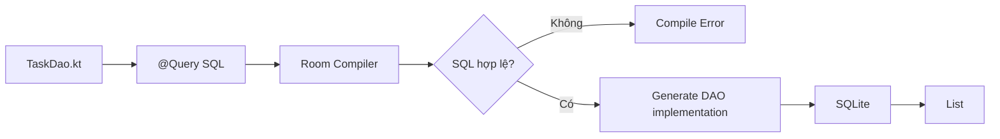
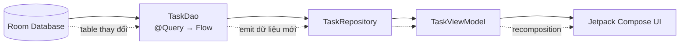
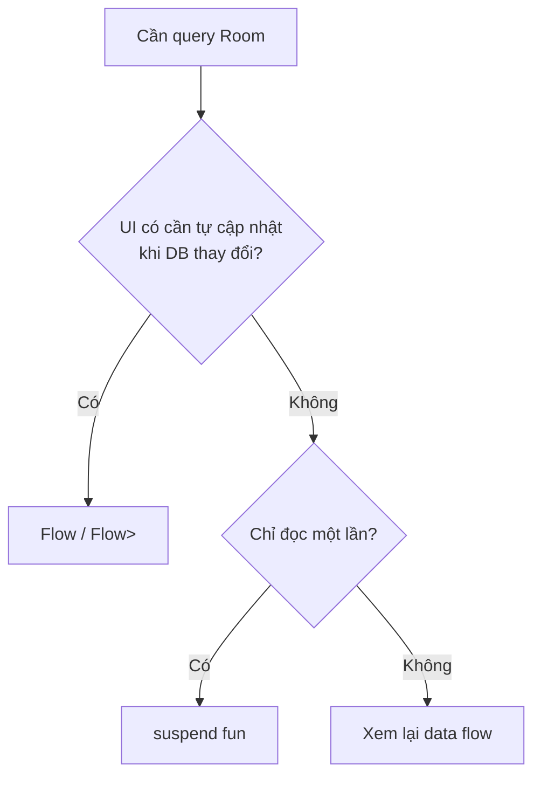
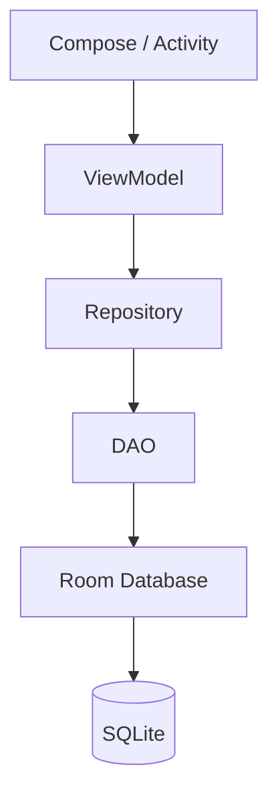
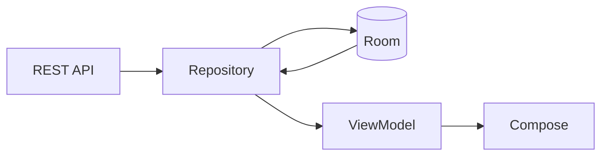
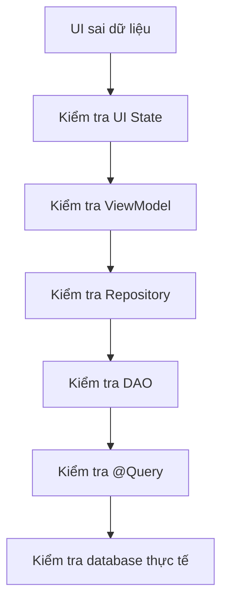

# 012 - Query Annotation

**Học phần:** 03 - Architecture, State and Data
**Module:** Module 06 - Storage
**Nhóm nội dung:** Room Database
**Nguồn roadmap:** Storage / Room Database
**Loại bài:** `storage`
**Thứ tự trong module:** 012
**Thời lượng gợi ý:** 32 phút

---

## 1. Tóm tắt

Trong Room Database, **Query Annotation** thường nói đến annotation **`@Query`** được đặt trên một hàm trong **DAO** để khai báo câu lệnh SQL mà Room cần thực thi.

Ví dụ đơn giản:

```kotlin
@Dao
interface UserDao {

    @Query("SELECT * FROM users")
    suspend fun getAllUsers(): List<User>
}
```

Điểm mạnh quan trọng của Room là câu SQL trong `@Query` được **kiểm tra tại compile time**. Nếu tên bảng, tên cột hoặc cấu trúc query không phù hợp với schema Room biết, lỗi có thể được phát hiện ngay khi build thay vì chờ đến runtime. ([Android Developers][1])

Có thể hình dung:

```text
@Query
   ↓
Kotlin DAO function
   ↓
Room kiểm tra SQL khi compile
   ↓
Room sinh implementation
   ↓
SQLite
   ↓
Entity / DTO / primitive
   ↓
Repository → ViewModel → UI
```

---

## 2. Ảnh minh họa: `@Query` nằm ở đâu trong Room?


*Nguồn: Android Developers — Room Database Architecture.* 

Room có ba thành phần cốt lõi:

* **Database:** điểm truy cập chính tới database.
* **Entity:** biểu diễn các bảng và dữ liệu được lưu.
* **DAO:** cung cấp các hàm để đọc/ghi dữ liệu.

`@Query` nằm bên trong **DAO** và là cầu nối giữa hàm Kotlin với câu SQL. Room tự sinh implementation của DAO tại compile time. ([Android Developers][2])

---

# 3. Query Annotation là gì?

Annotation cơ bản:

```kotlin
@Query("SQL_STATEMENT")
fun someFunction(...)
```

Ví dụ:

```kotlin
@Query("SELECT * FROM users WHERE id = :userId")
suspend fun getUser(userId: Long): User?
```

Trong đó:

```text
@Query(
   "SELECT * FROM users WHERE id = :userId"
)
                       │
                       └──────────────┐
                                      ↓
suspend fun getUser(userId: Long): User?
                    └──────┬───────┘
                           ↓
                       bind parameter
```

`:userId` không phải chuỗi Kotlin được nối trực tiếp vào SQL. Room nhận parameter `userId` của hàm và **bind** nó vào vị trí tương ứng trong query. Room hỗ trợ cả parameter đơn, nhiều parameter và collection như `List<String>` cho `IN (...)`. ([Android Developers][1])

---

# 4. `@Query` hoạt động như thế nào?

Giả sử có Entity:

```kotlin
@Entity(tableName = "tasks")
data class TaskEntity(
    @PrimaryKey(autoGenerate = true)
    val id: Long = 0,

    val title: String,

    val completed: Boolean = false,

    val priority: Int = 0
)
```

DAO:

```kotlin
@Dao
interface TaskDao {

    @Query("SELECT * FROM tasks")
    suspend fun getTasks(): List<TaskEntity>
}
```

Khi build:



Quá trình này là lý do Room có lợi thế đáng kể so với việc tự viết SQLite boilerplate: Room có thể kiểm tra query ngay trong quá trình compile. ([Android Developers][2])

---

# 5. Query đơn giản với `SELECT`

Ví dụ đọc toàn bộ task:

```kotlin
@Query("SELECT * FROM tasks")
suspend fun getAll(): List<TaskEntity>
```

SQL tương ứng:

```sql
SELECT *
FROM tasks;
```

Kết quả:

```text
tasks
┌────┬────────────────────┬───────────┬──────────┐
│ id │ title              │ completed │ priority │
├────┼────────────────────┼───────────┼──────────┤
│ 1  │ Học Room           │ false     │ 3        │
│ 2  │ Làm Android app    │ true      │ 2        │
│ 3  │ Viết README        │ false     │ 1        │
└────┴────────────────────┴───────────┴──────────┘
```

Room ánh xạ các row trả về thành:

```kotlin
List<TaskEntity>
```

Đối với `SELECT`, Room dựa vào kiểu trả về của DAO function để sinh logic chuyển kết quả SQL thành object Kotlin tương ứng. ([Android Developers][3])

---

# 6. Bind parameter với `:parameter`

Một trong những cú pháp quan trọng nhất phải nhớ:

```kotlin
@Query("SELECT * FROM tasks WHERE id = :taskId")
suspend fun getById(taskId: Long): TaskEntity?
```

Phần:

```sql
:taskId
```

liên kết với:

```kotlin
taskId: Long
```

---

## Ví dụ nhiều parameter

```kotlin
@Query(
    """
    SELECT *
    FROM tasks
    WHERE priority BETWEEN :minPriority AND :maxPriority
    """
)
suspend fun getByPriority(
    minPriority: Int,
    maxPriority: Int
): List<TaskEntity>
```

Room hỗ trợ bind nhiều parameter và có thể dùng một parameter nhiều lần trong cùng query. ([Android Developers][1])

---

# 7. `WHERE` — lọc dữ liệu

Ví dụ lấy task chưa hoàn thành:

```kotlin
@Query(
    """
    SELECT *
    FROM tasks
    WHERE completed = 0
    """
)
suspend fun getPendingTasks(): List<TaskEntity>
```

Hoặc truyền điều kiện từ Kotlin:

```kotlin
@Query(
    """
    SELECT *
    FROM tasks
    WHERE completed = :completed
    """
)
suspend fun getTasksByStatus(
    completed: Boolean
): List<TaskEntity>
```

Ví dụ:

```kotlin
val pendingTasks = dao.getTasksByStatus(false)
```

---

# 8. `ORDER BY`

Một query thực tế thường cần thứ tự rõ ràng.

```kotlin
@Query(
    """
    SELECT *
    FROM tasks
    ORDER BY priority DESC
    """
)
suspend fun getByPriority(): List<TaskEntity>
```

Kết quả:

```text
priority = 3
priority = 2
priority = 1
```

Có thể kết hợp nhiều điều kiện:

```kotlin
@Query(
    """
    SELECT *
    FROM tasks
    WHERE completed = 0
    ORDER BY priority DESC, id DESC
    """
)
suspend fun getPendingTasks(): List<TaskEntity>
```

---

# 9. `LIMIT`

Ví dụ lấy 10 task mới nhất:

```kotlin
@Query(
    """
    SELECT *
    FROM tasks
    ORDER BY id DESC
    LIMIT 10
    """
)
suspend fun getRecentTasks(): List<TaskEntity>
```

Đây là pattern rất phổ biến cho:

* recent searches;
* recent notifications;
* recent messages;
* lịch sử thao tác;
* top result.

---

# 10. Search với `LIKE`

Ví dụ chức năng search:

```kotlin
@Query(
    """
    SELECT *
    FROM tasks
    WHERE title LIKE '%' || :keyword || '%'
    ORDER BY id DESC
    """
)
suspend fun search(keyword: String): List<TaskEntity>
```

Giả sử:

```kotlin
dao.search("Room")
```

Có thể match:

```text
"Học Room Database"
"Room DAO Practice"
"Review Room Query"
```

Android Room hỗ trợ bind parameter trong `LIKE`, tương tự các biểu thức SQL khác. ([Android Developers][1])

---

# 11. Query với `IN`

Giả sử UI chọn nhiều trạng thái/category:

```kotlin
@Query(
    """
    SELECT *
    FROM tasks
    WHERE id IN (:ids)
    """
)
suspend fun getByIds(
    ids: List<Long>
): List<TaskEntity>
```

Gọi:

```kotlin
dao.getByIds(
    listOf(1, 3, 7)
)
```

Room tự mở rộng collection thành các bind parameter thích hợp khi query chạy. ([Android Developers][1])

Có thể hình dung:

```text
List
[1, 3, 7]
     │
     ▼
Room parameter binding
     │
     ▼
WHERE id IN (?, ?, ?)
```

---

# 12. Không nhất thiết phải trả về toàn bộ Entity

Một sai lầm thường gặp:

```kotlin
SELECT *
```

trong khi UI chỉ cần:

```text
id
title
```

Room cho phép query một phần column và map chúng sang một data class riêng. Android Developers cũng khuyến nghị chỉ lấy những field cần thiết khi có thể để giảm lượng dữ liệu phải xử lý. ([Android Developers][1])

Ví dụ:

```kotlin
data class TaskPreview(
    val id: Long,
    val title: String
)
```

DAO:

```kotlin
@Query(
    """
    SELECT id, title
    FROM tasks
    ORDER BY id DESC
    """
)
suspend fun getTaskPreviews(): List<TaskPreview>
```

Luồng:

```text
tasks table
     │
     │ SELECT id, title
     ▼
TaskPreview
     │
     ▼
UI
```

Thay vì:

```text
tasks table
     │
     │ SELECT *
     ▼
TaskEntity với tất cả column
```

---

# 13. Query trả về một object

```kotlin
@Query(
    """
    SELECT *
    FROM tasks
    WHERE id = :id
    LIMIT 1
    """
)
suspend fun getTask(id: Long): TaskEntity?
```

Nên chú ý:

```kotlin
TaskEntity?
```

thay vì luôn:

```kotlin
TaskEntity
```

vì record có thể không tồn tại.

Ví dụ:

```kotlin
val task = dao.getTask(100)

if (task == null) {
    // task không tồn tại
}
```

---

# 14. Query trả về `Flow`

Đây là phần rất quan trọng khi kết hợp Room với Compose/ViewModel.

```kotlin
@Query(
    """
    SELECT *
    FROM tasks
    ORDER BY id DESC
    """
)
fun observeTasks(): Flow<List<TaskEntity>>
```

Khác với:

```kotlin
suspend fun getTasks(): List<TaskEntity>
```

`Flow<List<T>>` là **observable query**: khi các table được query thay đổi, Room có thể chạy lại query và phát kết quả mới. Trong khi one-shot query chỉ đọc snapshot một lần. ([Android Developers][4])

---

## Sơ đồ reactive Room



Đây là một pattern rất phù hợp cho **Single Source of Truth**:

```text
Room Database
      ↓
Repository
      ↓
ViewModel
      ↓
UI State
      ↓
Compose
```

---

# 15. `suspend` hay `Flow`?

Có thể dùng quy tắc đơn giản sau:



Room yêu cầu tránh database access gây block UI; với Kotlin, one-shot asynchronous queries thường dùng coroutine `suspend`, còn observable query có thể dùng `Flow`. ([Android Developers][4])

### One-shot

```kotlin
@Query("SELECT * FROM tasks WHERE id = :id")
suspend fun getTask(id: Long): TaskEntity?
```

### Observable

```kotlin
@Query("SELECT * FROM tasks")
fun observeTasks(): Flow<List<TaskEntity>>
```

---

# 16. `Flow<T>` và `Flow<List<T>>` không giống nhau

Ví dụ:

```kotlin
fun observeTask(id: Long): Flow<TaskEntity?>
```

dùng cho **một task**.

Trong khi:

```kotlin
fun observeTasks(): Flow<List<TaskEntity>>
```

dùng cho **nhiều task**.

Android documentation lưu ý rằng `Flow<T>` đại diện cho một kết quả object, không phải việc emit từng row của một tập result. Muốn quan sát nhiều row nên dùng `Flow<List<T>>`. Empty result cũng cần chú ý tới nullability. ([Android Developers][3])

---

# 17. `@Query` không chỉ có `SELECT`

Room `@Query` hỗ trợ bốn nhóm statement:

```text
SELECT
INSERT
UPDATE
DELETE
```

theo API reference hiện tại. ([Android Developers][3])

Tuy nhiên, đối với CRUD thông thường, các annotation chuyên biệt:

```kotlin
@Insert
@Update
@Delete
@Upsert
```

thường dễ đọc hơn.

`@Query` đặc biệt hữu ích khi thao tác phức tạp hơn.

---

## UPDATE bằng `@Query`

```kotlin
@Query(
    """
    UPDATE tasks
    SET completed = :completed
    WHERE id = :id
    """
)
suspend fun updateCompleted(
    id: Long,
    completed: Boolean
): Int
```

`Int` có thể biểu diễn số row bị ảnh hưởng đối với `UPDATE`/`DELETE`. ([Android Developers][3])

Ví dụ:

```kotlin
val affectedRows =
    dao.updateCompleted(
        id = 5,
        completed = true
    )
```

---

## DELETE bằng `@Query`

Ví dụ xóa toàn bộ task hoàn thành:

```kotlin
@Query(
    """
    DELETE FROM tasks
    WHERE completed = 1
    """
)
suspend fun deleteCompletedTasks(): Int
```

Đây là trường hợp `@Query` phù hợp hơn:

```kotlin
@Delete
```

vì ta không cần tải từng Entity lên chỉ để xóa.

---

# 18. JOIN nhiều bảng

`@Query` không giới hạn ở một Entity.

Ví dụ:

```kotlin
@Entity(tableName = "categories")
data class CategoryEntity(
    @PrimaryKey
    val id: Long,

    val name: String
)
```

Task:

```kotlin
@Entity(tableName = "tasks")
data class TaskEntity(
    @PrimaryKey
    val id: Long,

    val title: String,

    val categoryId: Long?
)
```

DTO:

```kotlin
data class TaskWithCategory(
    val id: Long,
    val title: String,
    val categoryName: String?
)
```

DAO:

```kotlin
@Query(
    """
    SELECT
        tasks.id,
        tasks.title,
        categories.name AS categoryName
    FROM tasks
    LEFT JOIN categories
        ON tasks.categoryId = categories.id
    """
)
fun observeTasksWithCategory():
    Flow<List<TaskWithCategory>>
```

Room hỗ trợ query nhiều table bằng SQL `JOIN` và có thể map một tập column trả về sang data class phù hợp. ([Android Developers][1])

---

# 19. Room trong kiến trúc Android

Không nên để Activity hoặc Composable gọi SQL trực tiếp.

### Không nên

```text
Compose
   ↓
DAO
   ↓
Room
```

Trong app nhỏ có thể chạy, nhưng coupling rất cao.

### Tốt hơn



DAO giúp giữ database concern tách biệt khỏi UI và cũng giúp việc mock/test database access thuận tiện hơn. ([Android Developers][1])

---

# 20. Ví dụ hoàn chỉnh — Todo App

## Entity

```kotlin
@Entity(tableName = "tasks")
data class TaskEntity(
    @PrimaryKey(autoGenerate = true)
    val id: Long = 0,

    val title: String,

    val completed: Boolean = false,

    val priority: Int = 0
)
```

---

## DAO

```kotlin
@Dao
interface TaskDao {

    @Query(
        """
        SELECT *
        FROM tasks
        ORDER BY priority DESC, id DESC
        """
    )
    fun observeTasks(): Flow<List<TaskEntity>>

    @Query(
        """
        SELECT *
        FROM tasks
        WHERE id = :id
        LIMIT 1
        """
    )
    suspend fun getById(id: Long): TaskEntity?

    @Query(
        """
        SELECT *
        FROM tasks
        WHERE title LIKE '%' || :keyword || '%'
        ORDER BY id DESC
        """
    )
    fun search(keyword: String): Flow<List<TaskEntity>>

    @Insert
    suspend fun insert(task: TaskEntity)

    @Update
    suspend fun update(task: TaskEntity)

    @Query(
        """
        DELETE FROM tasks
        WHERE completed = 1
        """
    )
    suspend fun deleteCompleted(): Int
}
```

---

## Repository

```kotlin
class TaskRepository(
    private val taskDao: TaskDao
) {

    fun observeTasks(): Flow<List<TaskEntity>> =
        taskDao.observeTasks()

    fun searchTasks(
        keyword: String
    ): Flow<List<TaskEntity>> =
        taskDao.search(keyword)

    suspend fun getTask(
        id: Long
    ): TaskEntity? =
        taskDao.getById(id)

    suspend fun addTask(
        title: String
    ) {
        taskDao.insert(
            TaskEntity(title = title)
        )
    }

    suspend fun clearCompleted() {
        taskDao.deleteCompleted()
    }
}
```

---

# 21. ViewModel

```kotlin
class TaskViewModel(
    private val repository: TaskRepository
) : ViewModel() {

    val tasks =
        repository
            .observeTasks()
            .stateIn(
                scope = viewModelScope,
                started = SharingStarted.WhileSubscribed(5_000),
                initialValue = emptyList()
            )
}
```

---

# 22. Compose UI

```kotlin
@Composable
fun TaskScreen(
    viewModel: TaskViewModel
) {

    val tasks by viewModel.tasks
        .collectAsStateWithLifecycle()

    LazyColumn {

        items(
            items = tasks,
            key = { it.id }
        ) { task ->

            Text(
                text = task.title
            )
        }
    }
}
```

Luồng cuối cùng:

```text
SQLite
  ↓
Room
  ↓
@Query
  ↓
Flow<List<TaskEntity>>
  ↓
Repository
  ↓
ViewModel
  ↓
StateFlow
  ↓
Compose
```

---

# 23. Lifecycle và rotate màn hình

`@Query` bản thân nó không quản lý lifecycle.

Lifecycle được xử lý ở layer phía trên:

```text
Room
 ↓
Flow
 ↓
Repository
 ↓
ViewModel
 ↓
collectAsStateWithLifecycle()
 ↓
Compose
```

Nếu Activity bị rotate:

```text
Activity cũ
   ↓ destroyed

ViewModel
   ↓ thường được giữ qua configuration change

Flow / StateFlow
   ↓

Activity mới
   ↓

UI nhận state
```

Do dữ liệu chính nằm trong database và UI đọc thông qua ViewModel/state stream, rotate màn hình không đồng nghĩa với việc dữ liệu Room bị mất.

---

# 24. Local data và remote data

Trong app production, Room thường được dùng như local storage/cache.

Ví dụ:



Một chiến lược phổ biến:

```text
API
 ↓
Repository
 ↓
Room Database
 ↓
Flow
 ↓
UI
```

UI quan sát Room thay vì phụ thuộc trực tiếp vào response network.

Khi offline:

```text
Internet ✕
   │
   ▼
Room Database
   │
   ▼
UI vẫn có dữ liệu local
```

Đây cũng là lý do schema, migration và query local không chỉ là implementation detail: chúng ảnh hưởng trực tiếp tới trải nghiệm offline của user.

---

# 25. Query và Migration

Giả sử version 1:

```kotlin
@Entity
data class TaskEntity(
    @PrimaryKey val id: Long,
    val title: String
)
```

Version 2 thêm:

```kotlin
val priority: Int
```

Migration:

```sql
ALTER TABLE tasks
ADD COLUMN priority INTEGER NOT NULL DEFAULT 0;
```

Sau migration:

```kotlin
@Query(
    """
    SELECT *
    FROM tasks
    ORDER BY priority DESC
    """
)
fun observeTasks(): Flow<List<TaskEntity>>
```

Query mới phụ thuộc vào schema mới.

Vì vậy:

```text
Schema
   ↓
Migration
   ↓
DAO Query
   ↓
Repository
   ↓
UI
```

phải được xem như một chuỗi liên quan tới nhau.

Room cũng hỗ trợ các migration path và database schema là một phần cốt lõi của library. ([Android Developers][2])

---

# 26. Những lỗi phổ biến

## 26.1 Sai tên column

Entity:

```kotlin
@ColumnInfo(name = "task_title")
val title: String
```

Nhưng query:

```kotlin
@Query(
    "SELECT title FROM tasks"
)
```

Có thể không đúng schema.

Phải dùng:

```kotlin
@Query(
    "SELECT task_title FROM tasks"
)
```

Một trong những lợi ích chính của Room là query được validation lúc compile, giúp nhiều lỗi dạng này xuất hiện sớm. ([Android Developers][1])

---

## 26.2 Dùng `SELECT *` mọi nơi

Không tối ưu:

```sql
SELECT *
FROM tasks
```

nếu màn hình chỉ cần:

```text
title
priority
```

Có thể dùng:

```sql
SELECT title, priority
FROM tasks
```

Android documentation cũng đề cập việc chỉ query subset của column khi UI không cần toàn bộ object. ([Android Developers][1])

---

## 26.3 Không có `ORDER BY`

Query:

```kotlin
@Query("SELECT * FROM tasks")
```

Nếu UI yêu cầu:

> task mới nhất trước

thì nên thể hiện yêu cầu đó trong SQL:

```kotlin
@Query(
    """
    SELECT *
    FROM tasks
    ORDER BY id DESC
    """
)
```

Không nên dựa vào thứ tự "có vẻ đúng" hiện tại của database.

---

## 26.4 Return type không phản ánh trường hợp không có dữ liệu

Có khả năng không tìm thấy:

```kotlin
TaskEntity?
```

thường hợp lý hơn:

```kotlin
TaskEntity
```

Ví dụ:

```kotlin
@Query(
    "SELECT * FROM tasks WHERE id = :id"
)
suspend fun findById(id: Long): TaskEntity?
```

Nullability cũng đặc biệt quan trọng với observable queries. ([Android Developers][3])

---

## 26.5 Query DB trực tiếp từ UI

Không nên:

```kotlin
@Composable
fun Screen() {
    dao.getTasks()
}
```

Tốt hơn:

```text
UI
 ↓
ViewModel
 ↓
Repository
 ↓
DAO
```

DAO giúp duy trì separation of concerns thay vì để database logic lan vào UI layer. ([Android Developers][1])

---

# 27. Performance

Ví dụ:

```sql
SELECT *
FROM tasks
WHERE userId = ?
ORDER BY createdAt DESC
```

Nếu database lớn, nên xem xét index cho các column thường dùng trong:

```text
WHERE
JOIN
ORDER BY
```

Ví dụ Entity:

```kotlin
@Entity(
    tableName = "tasks",
    indices = [
        Index(value = ["userId"]),
        Index(value = ["createdAt"])
    ]
)
data class TaskEntity(...)
```

Ngoài index, một query production tốt cũng thường cần cân nhắc:

```text
Không lấy column không dùng
        +
LIMIT khi phù hợp
        +
Pagination cho tập dữ liệu lớn
        +
Index đúng chỗ
        +
Không query DB trên main thread
```

Room chủ động ngăn database access đồng bộ trên main thread trong cấu hình bình thường vì thao tác database có thể block UI; asynchronous DAO APIs là hướng được khuyến nghị. ([Android Developers][4])

---

# 28. Testing DAO Query

Đây là phần rất quan trọng của Room.

Query:

```kotlin
@Query(
    """
    SELECT *
    FROM tasks
    WHERE completed = 0
    ORDER BY priority DESC
    """
)
suspend fun getPendingTasks(): List<TaskEntity>
```

Test cần kiểm tra:

```text
Input
─────────────────────

Task A
completed = false
priority = 1

Task B
completed = true
priority = 3

Task C
completed = false
priority = 2


Expected
─────────────────────

Task C
Task A
```

---

## Ví dụ test

```kotlin
@Test
fun getPendingTasks_returnsOnlyPendingTasks() = runTest {

    dao.insert(
        TaskEntity(
            id = 1,
            title = "Task A",
            completed = false,
            priority = 1
        )
    )

    dao.insert(
        TaskEntity(
            id = 2,
            title = "Task B",
            completed = true,
            priority = 3
        )
    )

    dao.insert(
        TaskEntity(
            id = 3,
            title = "Task C",
            completed = false,
            priority = 2
        )
    )

    val result =
        dao.getPendingTasks()

    assertEquals(
        listOf("Task C", "Task A"),
        result.map { it.title }
    )
}
```

DAO cũng tạo ra một boundary rõ ràng khiến database layer dễ test hoặc thay thế/mocking hơn so với việc phân tán SQL trực tiếp khắp app. ([Android Developers][1])

---

# 29. Các case nên test

| Case          | Điều cần kiểm tra            |
| ------------- | ---------------------------- |
| Database rỗng | Query trả kết quả đúng       |
| Một row       | Mapping đúng                 |
| Nhiều row     | Không mất dữ liệu            |
| `WHERE`       | Filter đúng                  |
| `ORDER BY`    | Thứ tự đúng                  |
| `LIKE`        | Search đúng                  |
| `IN`          | Collection được bind đúng    |
| `JOIN`        | Mapping nhiều bảng đúng      |
| Null          | Không crash                  |
| Migration     | Query mới chạy trên DB cũ    |
| Flow          | DB thay đổi → emit state mới |

---

# 30. Debug Query

Nếu dữ liệu UI không đúng, debug theo chuỗi:



Các câu hỏi hữu ích:

```text
Query có WHERE sai không?

ORDER BY đúng chưa?

Parameter truyền vào đúng chưa?

Entity mapping đúng không?

Database thực tế có record không?

Migration đã chạy chưa?

Flow có đang được collect không?
```

---

# 31. `@Query` vs các annotation khác

| Annotation | Công dụng          |
| ---------- | ------------------ |
| `@Query`   | SQL tùy chỉnh      |
| `@Insert`  | Insert Entity      |
| `@Update`  | Update Entity      |
| `@Delete`  | Delete Entity      |
| `@Upsert`  | Insert hoặc update |

Ví dụ:

```kotlin
@Insert
suspend fun insert(task: TaskEntity)
```

thường tốt hơn:

```kotlin
@Query(
    """
    INSERT INTO tasks(...)
    VALUES(...)
    """
)
```

cho CRUD đơn giản.

Nhưng:

```kotlin
@Query(
    """
    DELETE FROM tasks
    WHERE completed = 1
    """
)
suspend fun clearCompleted()
```

lại rất tự nhiên vì đây là thao tác theo **điều kiện**, không phải theo một Entity được truyền vào.

Room documentation phân biệt rõ convenience DAO functions (`@Insert`, `@Update`, `@Delete`, `@Upsert`) với query functions dùng SQL tùy chỉnh. ([Android Developers][1])

---

# 32. Mental model cần nhớ

```text
Entity
   │
   │ định nghĩa schema
   ▼
Room Database
   │
   ▼
DAO
   │
   ├── @Insert
   ├── @Update
   ├── @Delete
   └── @Query
          │
          ▼
         SQL
          │
          ▼
   List / Object / Flow
          │
          ▼
      Repository
          │
          ▼
      ViewModel
          │
          ▼
          UI
```

Hãy nhớ câu:

> **`@Query` biến một câu SQL thành một API Kotlin có type rõ ràng bên trong DAO và được Room kiểm tra trong quá trình compile.**

---

# 33. Thực hành

## Mini project: Offline Task Manager

### Yêu cầu 1 — Entity

```kotlin
TaskEntity(
    id,
    title,
    completed,
    priority
)
```

### Yêu cầu 2 — Query toàn bộ

```kotlin
fun observeTasks():
    Flow<List<TaskEntity>>
```

### Yêu cầu 3 — Query pending

```kotlin
fun observePendingTasks():
    Flow<List<TaskEntity>>
```

### Yêu cầu 4 — Search

```kotlin
fun search(
    keyword: String
): Flow<List<TaskEntity>>
```

### Yêu cầu 5 — Find by ID

```kotlin
suspend fun getById(
    id: Long
): TaskEntity?
```

### Yêu cầu 6 — Clear completed

```kotlin
suspend fun clearCompleted()
```

---

# 34. Bài tập

Xây dựng DAO sau:

```kotlin
@Dao
interface TaskDao {

    // TODO 1
    // Lấy tất cả task theo priority giảm dần.

    // TODO 2
    // Lấy task theo id.

    // TODO 3
    // Search title.

    // TODO 4
    // Observe tất cả task chưa hoàn thành.

    // TODO 5
    // Xóa tất cả task đã hoàn thành.
}
```

### Bonus

Thêm:

```text
CategoryEntity
```

sau đó viết query:

```text
Task
+
Category
   ↓
JOIN
   ↓
TaskWithCategory
```

---

# 35. Artifact cho portfolio

Một artifact nhỏ nhưng tốt có thể là:

```text
room-query-demo/
│
├── data/
│   ├── TaskEntity.kt
│   ├── TaskDao.kt
│   ├── AppDatabase.kt
│   └── TaskRepository.kt
│
├── ui/
│   ├── TaskViewModel.kt
│   └── TaskScreen.kt
│
├── test/
│   └── TaskDaoTest.kt
│
└── README.md
```

README nên giải thích:

```text
Room
 ↓
DAO
 ↓
@Query
 ↓
Repository
 ↓
ViewModel
 ↓
Compose
```

và có ít nhất:

* một query parameter;
* một `Flow`;
* một search query;
* một update/delete query;
* một DAO test;
* một ghi chú về migration/offline behavior.

---

# 36. Checklist hoàn thành

* [ ] Giải thích được `@Query` là gì.
* [ ] Biết `@Query` nằm trong DAO.
* [ ] Viết được `SELECT`.
* [ ] Dùng được `WHERE`.
* [ ] Dùng được `ORDER BY`.
* [ ] Dùng được `LIMIT`.
* [ ] Bind parameter bằng `:parameter`.
* [ ] Dùng được collection với `IN`.
* [ ] Viết được search với `LIKE`.
* [ ] Trả về `Entity`.
* [ ] Trả về custom DTO/projection.
* [ ] Phân biệt `suspend` và `Flow`.
* [ ] Biết `Flow<List<T>>` dùng cho danh sách reactive.
* [ ] Viết được `UPDATE`/`DELETE` bằng `@Query`.
* [ ] Biết khi nào dùng `@Insert`, `@Update`, `@Delete`, `@Upsert`.
* [ ] Biết query nhiều bảng bằng `JOIN`.
* [ ] Không query database trực tiếp từ UI.
* [ ] Có DAO test với dữ liệu thực tế.
* [ ] Kiểm tra query sau migration.
* [ ] Có artifact nhỏ để đưa vào portfolio.

---

# 37. Ghi chú production

Khi đưa một Room query vào production, đừng chỉ hỏi:

```text
"Query có chạy không?"
```

Mà nên hỏi:

```text
Query có trả đúng dữ liệu?
        ↓
Return type có đúng nullability?
        ↓
Có lấy thừa column?
        ↓
Có cần index?
        ↓
Có chạy bất đồng bộ?
        ↓
Flow có emit đúng?
        ↓
Migration có phá query?
        ↓
Offline có hoạt động?
        ↓
DAO test đã cover edge case?
        ↓
UI có xử lý empty/error/loading state?
```

Một query ngắn như:

```kotlin
@Query(
    """
    SELECT *
    FROM tasks
    WHERE completed = 0
    """
)
```

có thể ảnh hưởng trực tiếp tới:

```text
Database correctness
      +
Performance
      +
Offline UX
      +
UI state
      +
Testing
      +
Migration
      +
Release stability
```

Đó là lý do **Query Annotation không đơn thuần là học cú pháp `@Query`**, mà là học cách thiết kế boundary truy cập dữ liệu local có thể kiểm tra, maintain và mở rộng được.

---

## 38. Tóm tắt nhanh

```text
@Query
   ↓
viết SQL trong DAO
   ↓
Room kiểm tra khi compile
   ↓
bind Kotlin parameters
   ↓
SQLite thực thi
   ↓
Room map kết quả
   ↓
Entity / DTO / Flow
   ↓
Repository
   ↓
ViewModel
   ↓
UI
```

### 5 điều quan trọng nhất

1. **`@Query` thuộc DAO.**
2. **Room kiểm tra SQL ở compile time.** ([Android Developers][1])
3. **Dùng `:parameter` để bind argument vào SQL.** ([Android Developers][1])
4. **One-shot query thường dùng `suspend`; observable query có thể dùng `Flow`.** ([Android Developers][4])
5. **Query production phải được xem cùng performance, migration, testing và UI state.**

### Tài liệu chính

Nội dung trên bám theo tài liệu Room/DAO chính thức của Android Developers, trong đó Room hiện cung cấp compile-time SQL verification, DAO query functions, parameter binding, projection, `JOIN`, coroutine và `Flow` cho asynchronous/observable queries. ([Android Developers][2])

[1]: https://developer.android.com/training/data-storage/room/accessing-data "Access data using Room DAOs  |  App data and files  |  Android Developers"
[2]: https://developer.android.com/training/data-storage/room "Save data in a local database using Room  |  App data and files  |  Android Developers"
[3]: https://developer.android.com/reference/kotlin/androidx/room/Query "Query  |  API reference  |  Android Developers"
[4]: https://developer.android.com/training/data-storage/room/async-queries "Write asynchronous DAO queries  |  App data and files  |  Android Developers"
