[](https://developer.android.com/codelabs/basic-android-kotlin-compose-persisting-data-room?utm_source=chatgpt.com)

# 013 - Insert, Update, Delete trong Room Database

**Học phần:** 03 - Architecture, State and Data
**Module:** Module 06 - Storage
**Nhóm nội dung:** Room Database
**Nguồn roadmap:** Storage / Room Database
**Loại bài:** Storage
**Thứ tự trong module:** 013
**Thời lượng gợi ý:** 32 phút

---

## 1. Tóm tắt

Trong Room Database, ba thao tác **Insert, Update và Delete** dùng để thay đổi dữ liệu đang được lưu trong SQLite:

* `INSERT` → thêm dữ liệu mới.
* `UPDATE` → sửa dữ liệu đã tồn tại.
* `DELETE` → xóa dữ liệu.
* `SELECT` → đọc dữ liệu.

Bốn thao tác này thường được gọi chung là **CRUD**:

```text
C = Create  → Insert
R = Read    → Query / Select
U = Update  → Update
D = Delete  → Delete
```

Room cung cấp trực tiếp các annotation:

```kotlin
@Insert
@Update
@Delete
```

để khai báo các thao tác ghi dữ liệu trong DAO mà không cần tự viết câu SQL cho những trường hợp CRUD cơ bản. Room tạo implementation của DAO trong quá trình build. ([Android Developers][1])

---

## 2. Mục tiêu học tập

Sau bài này, anh nên có thể:

* Giải thích `@Insert`, `@Update`, `@Delete` trong Room.
* Xây dựng DAO có đầy đủ CRUD.
* Hiểu vai trò của `PrimaryKey` khi update/delete.
* Sử dụng `suspend` cho thao tác ghi database.
* Hiểu `OnConflictStrategy`.
* Kết nối Room với Repository và ViewModel.
* Cho UI tự cập nhật khi database thay đổi bằng `Flow`.
* Xử lý lỗi khi ghi dữ liệu.
* Kiểm tra dữ liệu với Android Studio Database Inspector.
* Viết test cho Insert / Update / Delete.
* Nhận biết các vấn đề production như migration, concurrency và mất dữ liệu.

---

# 3. Insert, Update, Delete nằm ở đâu trong kiến trúc Android?

Room thuộc **Data Layer** của ứng dụng.

Một kiến trúc điển hình:

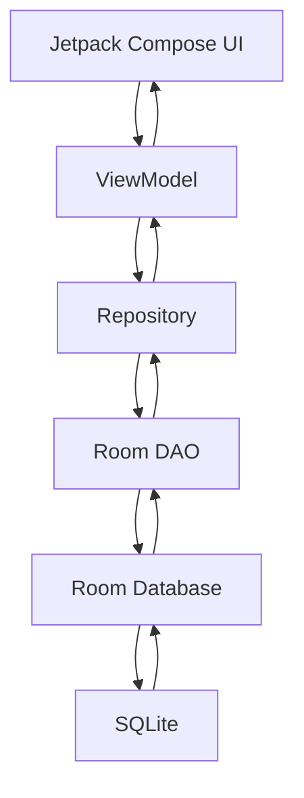

Room DAO đóng vai trò là API truy cập database. Android documentation mô tả DAO là nơi ứng dụng định nghĩa các phương thức truy xuất và thay đổi dữ liệu; Room sinh phần implementation tại compile time. ([Android Developers][1])

### Luồng khi người dùng thêm dữ liệu

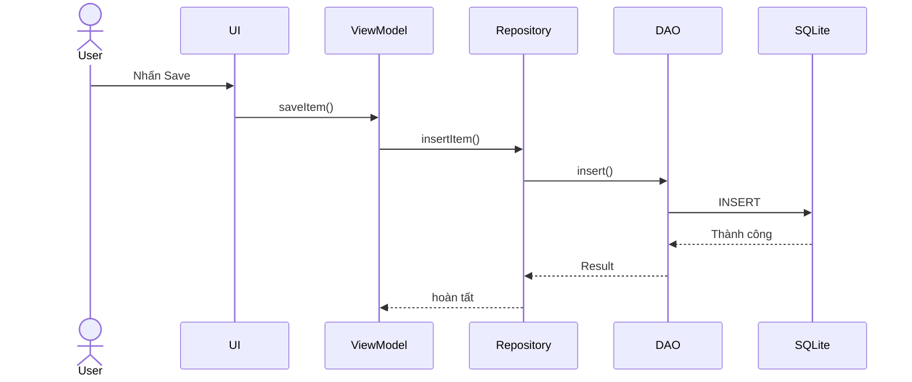

---

# 4. Entity mẫu

Giả sử xây dựng ứng dụng quản lý công việc.

```kotlin
import androidx.room.Entity
import androidx.room.PrimaryKey

@Entity(tableName = "tasks")
data class TaskEntity(
    @PrimaryKey(autoGenerate = true)
    val id: Long = 0,

    val title: String,

    val completed: Boolean = false,

    val createdAt: Long
)
```

Một object:

```kotlin
TaskEntity(
    id = 1,
    title = "Học Room Database",
    completed = false,
    createdAt = System.currentTimeMillis()
)
```

tương ứng với một dòng:

| id | title             | completed |     createdAt |
| -: | ----------------- | --------- | ------------: |
|  1 | Học Room Database | false     | 1786550000000 |

Trong Room, một `Entity` đại diện cho một table và mỗi instance của entity tương ứng với một row của table. ([Android Developers][2])

---

# 5. DAO CRUD hoàn chỉnh

```kotlin
import androidx.room.Dao
import androidx.room.Delete
import androidx.room.Insert
import androidx.room.OnConflictStrategy
import androidx.room.Query
import androidx.room.Update
import kotlinx.coroutines.flow.Flow

@Dao
interface TaskDao {

    @Insert(onConflict = OnConflictStrategy.ABORT)
    suspend fun insert(task: TaskEntity): Long

    @Update
    suspend fun update(task: TaskEntity): Int

    @Delete
    suspend fun delete(task: TaskEntity): Int

    @Query("SELECT * FROM tasks ORDER BY createdAt DESC")
    fun observeTasks(): Flow<List<TaskEntity>>

    @Query("SELECT * FROM tasks WHERE id = :id LIMIT 1")
    suspend fun getTask(id: Long): TaskEntity?
}
```

Có thể nhìn DAO theo bảng sau:

| Hàm         | Room      | SQL tương đương |
| ----------- | --------- | --------------- |
| `insert()`  | `@Insert` | `INSERT`        |
| `update()`  | `@Update` | `UPDATE`        |
| `delete()`  | `@Delete` | `DELETE`        |
| `getTask()` | `@Query`  | `SELECT`        |

---

# 6. `@Insert` — Thêm dữ liệu

## 6.1 Khái niệm

`@Insert` đánh dấu một DAO function dùng để thêm Entity vào database.

```kotlin
@Insert
suspend fun insert(task: TaskEntity)
```

Room sẽ tạo code tương ứng với thao tác SQL kiểu:

```sql
INSERT INTO tasks (...)
VALUES (...);
```

Android Room documentation hỗ trợ trực tiếp `@Insert` cho các insert đơn giản mà không yêu cầu lập trình viên tự viết SQL. ([Android Developers][3])

---

## 6.2 Insert một Entity

```kotlin
val task = TaskEntity(
    title = "Học @Insert",
    createdAt = System.currentTimeMillis()
)

taskDao.insert(task)
```

Dữ liệu:

```text
Before

tasks
┌────┬────────────────────┐
│ id │ title              │
├────┼────────────────────┤
│ 1  │ Học Entity         │
└────┴────────────────────┘
```

Sau insert:

```text
After

tasks
┌────┬────────────────────┐
│ id │ title              │
├────┼────────────────────┤
│ 1  │ Học Entity         │
│ 2  │ Học @Insert        │
└────┴────────────────────┘
```

---

# 7. Lấy ID sau khi Insert

Một kỹ thuật rất hữu ích là để DAO trả về `Long`.

```kotlin
@Insert
suspend fun insert(task: TaskEntity): Long
```

Sử dụng:

```kotlin
val id = taskDao.insert(
    TaskEntity(
        title = "Học Room",
        createdAt = System.currentTimeMillis()
    )
)

println(id)
```

ID trả về có thể được dùng để:

```text
Insert Task
    │
    ▼
nhận taskId
    │
    ├── mở Detail Screen
    ├── liên kết bảng khác
    └── gửi analytics
```

---

# 8. Insert nhiều Entity

Room cũng cho phép DAO nhận collection.

```kotlin
@Insert
suspend fun insertAll(tasks: List<TaskEntity>)
```

Ví dụ:

```kotlin
taskDao.insertAll(
    listOf(
        TaskEntity(
            title = "Học Entity",
            createdAt = System.currentTimeMillis()
        ),
        TaskEntity(
            title = "Học DAO",
            createdAt = System.currentTimeMillis()
        ),
        TaskEntity(
            title = "Học Query",
            createdAt = System.currentTimeMillis()
        )
    )
)
```

Thường phù hợp khi:

* import dữ liệu;
* seed database;
* đồng bộ dữ liệu server;
* cache danh sách;
* xử lý batch.

---

# 9. Primary Key và Insert

Entity thường có:

```kotlin
@PrimaryKey(autoGenerate = true)
val id: Long = 0
```

Ví dụ:

```text
INSERT
TaskEntity(
    id = 0,
    title = "Room"
)

             │
             ▼

Database tự sinh

id = 17
```

Primary key còn đặc biệt quan trọng với:

```text
UPDATE
DELETE
```

vì Room cần xác định **dòng nào phải thay đổi**.

---

# 10. Conflict khi Insert

Ví dụ table đã có:

```text
id = 10
```

nhưng ứng dụng cố insert:

```kotlin
TaskEntity(
    id = 10,
    title = "Duplicate"
)
```

sẽ xảy ra conflict primary key.

Room hỗ trợ `OnConflictStrategy`; mặc định của `@Insert` là `ABORT`. Các chiến lược phổ biến gồm `ABORT`, `IGNORE` và `REPLACE`. ([Android Developers][3])

---

## 10.1 ABORT

```kotlin
@Insert(
    onConflict = OnConflictStrategy.ABORT
)
suspend fun insert(task: TaskEntity)
```

Nếu conflict:

```text
INSERT
   │
   ▼
Conflict?
   │
  YES
   │
   ▼
Abort operation
```

Đây cũng là mặc định.

---

## 10.2 IGNORE

```kotlin
@Insert(
    onConflict = OnConflictStrategy.IGNORE
)
suspend fun insert(task: TaskEntity)
```

```text
Conflict
   │
   ▼
Không insert row mới
   │
   ▼
Row cũ được giữ lại
```

---

## 10.3 REPLACE

```kotlin
@Insert(
    onConflict = OnConflictStrategy.REPLACE
)
suspend fun insert(task: TaskEntity)
```

Ý tưởng:

```text
Existing row
      │
      │ conflict
      ▼
Incoming row
      │
      ▼
Replace
```

`REPLACE` cần được sử dụng có chủ đích vì ý nghĩa của nó không đơn giản là "update mọi thứ" trong mọi mô hình dữ liệu.

---

# 11. Chọn conflict strategy như thế nào?

Một cách tư duy đơn giản:

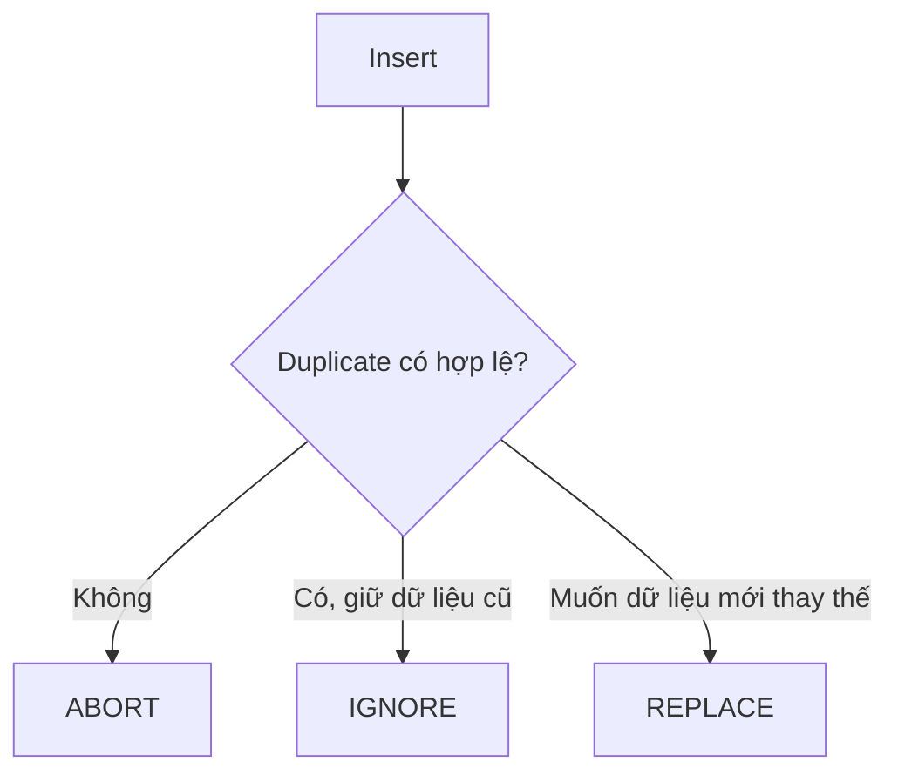

Không nên đặt:

```kotlin
OnConflictStrategy.REPLACE
```

ở mọi nơi chỉ để "không crash".

Conflict đôi khi chính là dấu hiệu ứng dụng đang có bug logic.

---

# 12. `@Update` — Cập nhật dữ liệu

## 12.1 Khái niệm

`@Update` dùng để cập nhật Entity đã tồn tại.

```kotlin
@Update
suspend fun update(task: TaskEntity)
```

Room dựa vào primary key để tìm entity cần cập nhật. Documentation của `@Update` cũng hỗ trợ partial entity trong những trường hợp nâng cao. ([Android Developers][4])

---

## 12.2 Ví dụ

Database:

```text
id = 4
title = "Học Room"
completed = false
```

Người dùng nhấn:

```text
Mark completed
```

Ta tạo:

```kotlin
val updatedTask = task.copy(
    completed = true
)

taskDao.update(updatedTask)
```

Database trở thành:

```text
id = 4
title = "Học Room"
completed = true
```

---

# 13. Vì sao Primary Key quan trọng với Update?

Giả sử:

```kotlin
TaskEntity(
    id = 4,
    title = "Room nâng cao",
    completed = true
)
```

Room hiểu:

```text
Primary Key
     │
     ▼
   id = 4
     │
     ▼
Tìm row id = 4
     │
     ▼
Update row đó
```

Nếu ID không tồn tại:

```text
id = 999
```

thì Room không tự tạo row mới chỉ vì function có `@Update`.

---

# 14. Lấy số dòng đã Update

Có thể khai báo:

```kotlin
@Update
suspend fun update(task: TaskEntity): Int
```

Sau đó:

```kotlin
val affectedRows = taskDao.update(task)

if (affectedRows == 0) {
    // Không tìm thấy entity
}
```

Điều này hữu ích để phát hiện:

```text
UI giữ dữ liệu cũ
       +
Entity đã bị xóa ở nơi khác
       ↓

UPDATE trả về 0 row
```

---

# 15. Update một phần dữ liệu

Giả sử chỉ cần thay đổi:

```text
completed
```

Thay vì load toàn bộ entity rồi update, đôi khi query rõ ràng sẽ phù hợp hơn:

```kotlin
@Query(
    """
    UPDATE tasks
    SET completed = :completed
    WHERE id = :taskId
    """
)
suspend fun setCompleted(
    taskId: Long,
    completed: Boolean
): Int
```

Sử dụng:

```kotlin
taskDao.setCompleted(
    taskId = 10,
    completed = true
)
```

### Khi nào nên dùng `@Update`?

```text
Đã có Entity hoàn chỉnh
        ↓
     @Update
```

### Khi nào `@Query UPDATE` hữu ích?

```text
Chỉ cần sửa 1–2 field
        ↓
   @Query UPDATE
```

Room cho phép sử dụng `@Query` khi thao tác ghi phức tạp hơn các convenience annotation. ([Android Developers][1])

---

# 16. `@Delete` — Xóa dữ liệu

## 16.1 Cách cơ bản

```kotlin
@Delete
suspend fun delete(task: TaskEntity)
```

Sử dụng:

```kotlin
taskDao.delete(task)
```

Room dùng thông tin Entity để xác định row cần xóa. ([Android Developers][5])

---

# 17. Delete hoạt động như thế nào?

Database:

```text
┌────┬─────────────────────┐
│ id │ title               │
├────┼─────────────────────┤
│ 1  │ Entity              │
│ 2  │ DAO                 │
│ 3  │ Insert Update Delete│
└────┴─────────────────────┘
```

Gọi:

```kotlin
taskDao.delete(
    TaskEntity(
        id = 2,
        title = "DAO",
        createdAt = ...
    )
)
```

Sau đó:

```text
┌────┬─────────────────────┐
│ id │ title               │
├────┼─────────────────────┤
│ 1  │ Entity              │
│ 3  │ Insert Update Delete│
└────┴─────────────────────┘
```

---

# 18. Delete theo ID

Trong ứng dụng thực tế, đôi khi ta chỉ có `id`.

Thay vì tạo Entity giả để dùng `@Delete`, nên viết:

```kotlin
@Query(
    "DELETE FROM tasks WHERE id = :taskId"
)
suspend fun deleteById(taskId: Long): Int
```

Sử dụng:

```kotlin
taskDao.deleteById(17)
```

Cách này rất rõ nghĩa:

```text
Delete
taskId = 17
     │
     ▼
DELETE FROM tasks
WHERE id = 17
```

---

# 19. Delete tất cả

```kotlin
@Query("DELETE FROM tasks")
suspend fun deleteAll(): Int
```

Đặc biệt cẩn thận với thao tác này.

Không nên để UI gọi trực tiếp:

```text
Delete All
```

mà không có:

* confirmation;
* backup nếu cần;
* khả năng undo nếu UX yêu cầu;
* test.

---

# 20. `suspend` và thao tác ghi database

Thông thường DAO write operation được khai báo:

```kotlin
suspend fun insert(...)
suspend fun update(...)
suspend fun delete(...)
```

Các thao tác one-shot insert/update/delete thuộc nhóm asynchronous DAO write operations của Room. ([Android Developers][6])

Ví dụ:

```kotlin
@Insert
suspend fun insert(task: TaskEntity)
```

Không nên để UI tự quản lý thread database.

Thay vào đó:

```text
UI
 ↓
ViewModel
 ↓
viewModelScope
 ↓
Repository
 ↓
Room
```

---

# 21. Repository

Không nên gọi:

```kotlin
taskDao.insert(...)
```

khắp toàn bộ app.

Tạo abstraction:

```kotlin
interface TaskRepository {

    fun observeTasks(): Flow<List<TaskEntity>>

    suspend fun insert(task: TaskEntity)

    suspend fun update(task: TaskEntity)

    suspend fun delete(task: TaskEntity)
}
```

Implementation:

```kotlin
class OfflineTaskRepository(
    private val taskDao: TaskDao
) : TaskRepository {

    override fun observeTasks(): Flow<List<TaskEntity>> =
        taskDao.observeTasks()

    override suspend fun insert(task: TaskEntity) {
        taskDao.insert(task)
    }

    override suspend fun update(task: TaskEntity) {
        taskDao.update(task)
    }

    override suspend fun delete(task: TaskEntity) {
        taskDao.delete(task)
    }
}
```

---

# 22. Vì sao cần Repository?

Nếu UI gọi DAO trực tiếp:

```text
Compose
   ↓
Room DAO
```

UI sẽ biết quá nhiều về Data Layer.

Tốt hơn:

```text
Compose
   ↓
ViewModel
   ↓
Repository
   ↓
DAO
   ↓
Room
```

Mai sau có thể thay đổi:

```text
Repository
 ├── Room
 ├── REST API
 ├── Firebase
 └── Cache
```

mà UI ít bị ảnh hưởng.

---

# 23. ViewModel gọi Insert

```kotlin
class TaskViewModel(
    private val repository: TaskRepository
) : ViewModel() {

    fun addTask(title: String) {

        viewModelScope.launch {

            repository.insert(
                TaskEntity(
                    title = title,
                    createdAt =
                        System.currentTimeMillis()
                )
            )
        }
    }
}
```

UI:

```kotlin
Button(
    onClick = {
        viewModel.addTask(title)
    }
) {
    Text("Lưu")
}
```

Luồng:

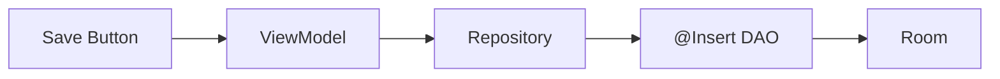

---

# 24. ViewModel gọi Update

```kotlin
fun toggleCompleted(task: TaskEntity) {

    viewModelScope.launch {

        repository.update(
            task.copy(
                completed = !task.completed
            )
        )
    }
}
```

UI:

```kotlin
Checkbox(
    checked = task.completed,
    onCheckedChange = {
        viewModel.toggleCompleted(task)
    }
)
```

---

# 25. ViewModel gọi Delete

```kotlin
fun deleteTask(task: TaskEntity) {

    viewModelScope.launch {
        repository.delete(task)
    }
}
```

UI:

```kotlin
IconButton(
    onClick = {
        viewModel.deleteTask(task)
    }
) {
    Icon(
        imageVector = Icons.Default.Delete,
        contentDescription = "Xóa"
    )
}
```

---

# 26. Room + Flow: UI tự cập nhật

DAO:

```kotlin
@Query(
    "SELECT * FROM tasks ORDER BY createdAt DESC"
)
fun observeTasks(): Flow<List<TaskEntity>>
```

Room có thể cung cấp observable query; khi các table liên quan thay đổi, observable query có thể phát ra giá trị mới. ([Android Developers][6])

Luồng:

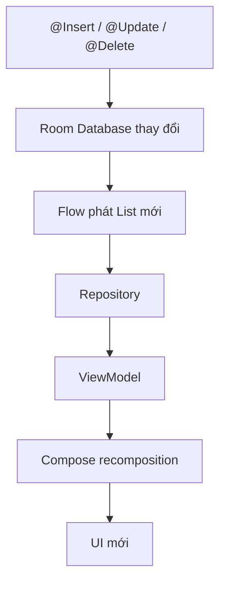

Đây là một điểm rất quan trọng.

Ta **không nhất thiết phải tự thêm/xóa item trong UI list**.

Database có thể là **Single Source of Truth**.

---

# 27. Ví dụ StateFlow trong ViewModel

```kotlin
val tasks: StateFlow<List<TaskEntity>> =
    repository
        .observeTasks()
        .stateIn(
            scope = viewModelScope,
            started = SharingStarted.WhileSubscribed(5_000),
            initialValue = emptyList()
        )
```

Compose:

```kotlin
val tasks by viewModel.tasks.collectAsStateWithLifecycle()
```

Khi:

```text
@Insert
```

xảy ra:

```text
Database
   ↓
Flow<List<Task>>
   ↓
StateFlow
   ↓
Compose
   ↓
List cập nhật
```

---

# 28. UI và database state

Một tư duy tốt:

```text
Database state
      │
      ▼
 Repository
      │
      ▼
 ViewModel
      │
      ▼
   UI state
      │
      ▼
   Compose
```

Không nên có hai nguồn dữ liệu riêng:

```text
MutableList trong UI
        +
Room Database

→ dễ lệch state
```

---

# 29. Insert + Flow

Giả sử ban đầu:

```text
Database

Task A
Task B
```

UI:

```text
Task A
Task B
```

Người dùng thêm:

```text
Task C
```

Luồng:

```text
INSERT Task C
     ↓
Room
     ↓
tasks table changed
     ↓
Flow emits

[A, B, C]
     ↓
Compose renders

Task A
Task B
Task C
```

---

# 30. Update + Flow

```text
Before

[ ] Học Room
```

Người dùng tick checkbox:

```text
UPDATE completed = true
```

Room thay đổi:

```text
Flow
 ↓
ViewModel
 ↓
UI
```

Kết quả:

```text
[x] Học Room
```

---

# 31. Delete + Flow

```text
Task A
Task B
Task C
```

Người dùng:

```text
Delete Task B
```

Database:

```text
Task A
Task C
```

Flow emit:

```text
[Task A, Task C]
```

UI tự render lại:

```text
Task A
Task C
```

---

# 32. UX cho thao tác Delete

Delete thường nguy hiểm hơn Insert/Update.

Một UX an toàn:

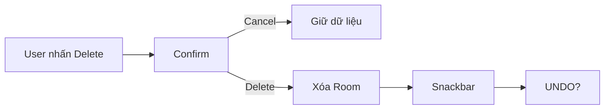

Ví dụ:

```text
Task deleted                       UNDO
```

Có thể dùng `Snackbar`.

---

# 33. Không nên xóa ngay khi user vô tình chạm

Kém:

```text
Tap 🗑
 ↓
DELETE
 ↓
Gone forever
```

Tốt hơn:

```text
Tap 🗑
 ↓
Confirm / Snackbar
 ↓
DELETE
 ↓
Undo opportunity
```

Tất nhiên điều này phụ thuộc mức độ quan trọng của dữ liệu.

---

# 34. Transaction

Nếu một nghiệp vụ gồm nhiều thao tác phụ thuộc nhau:

```text
Insert Order
+
Insert OrderItems
+
Update Inventory
```

thì cần cân nhắc transaction.

Ví dụ:

```kotlin
@Transaction
suspend fun createOrder(...) {
    ...
}
```

Mục tiêu:

```text
Tất cả thành công

hoặc

Không thay đổi gì
```

Các DAO `Insert`, `Update` và `Delete` bản thân đã được Room chạy trong transaction; `@Transaction` đặc biệt quan trọng khi cần gom nhiều operation thành một đơn vị nghiệp vụ. ([Android Developers][7])

---

# 35. Race condition

Giả sử:

```text
Coroutine A
     ↓
Update quantity = 4

Coroutine B
     ↓
Update quantity = 3
```

Cần suy nghĩ:

```text
Ai chạy trước?
Ai chạy sau?
Giá trị cuối là gì?
```

Với dữ liệu quan trọng như:

* tồn kho;
* tiền;
* counter;
* quota;
* trạng thái giao dịch;

không nên chỉ:

```text
READ
+
tính trong Kotlin
+
UPDATE
```

mà không suy nghĩ về concurrency.

---

# 36. Local + Remote data

Ứng dụng thực tế có thể có:

```text
API
 │
 ▼
Repository
 │
 ├───────────► Room
 │               │
 │               ▼
 └────────────► UI
```

Một pattern phổ biến:

```text
Remote API
    ↓
Room cache
    ↓
Flow
    ↓
UI
```

Room trở thành local source of truth.

---

# 37. Offline-first

Room đặc biệt hữu ích với offline behavior:

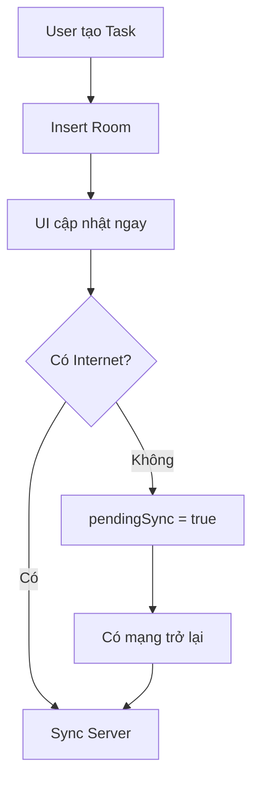

Một Entity thực tế có thể có:

```kotlin
@Entity
data class TaskEntity(
    @PrimaryKey
    val id: String,

    val title: String,

    val completed: Boolean,

    val syncStatus: SyncStatus
)
```

---

# 38. Insert không có nghĩa là sync server thành công

Ví dụ:

```text
Room Insert ✅
API POST ❌
```

Nếu app không xử lý:

```text
Local có Task
Server không có Task
```

Đây là vấn đề consistency.

Một thiết kế tốt cần xác định rõ:

```text
local-first?
remote-first?
optimistic update?
retry?
sync worker?
```

---

# 39. Error handling

Không nên:

```kotlin
viewModelScope.launch {
    repository.insert(task)
}
```

rồi giả định luôn thành công.

Có thể:

```kotlin
viewModelScope.launch {

    runCatching {
        repository.insert(task)
    }
        .onSuccess {
            // success
        }
        .onFailure {
            // update UI state
        }
}
```

UI state:

```kotlin
data class TaskUiState(
    val isSaving: Boolean = false,
    val errorMessage: String? = null
)
```

---

# 40. Chống double click Save

Một bug khá phổ biến:

```text
User double tap Save

 ↓          ↓

INSERT     INSERT

 ↓          ↓

Task       Task
```

Có thể disable button:

```kotlin
Button(
    enabled = !uiState.isSaving,
    onClick = {
        viewModel.save()
    }
)
```

Flow:

```text
Save
 ↓
isSaving = true
 ↓
Button disabled
 ↓
Insert
 ↓
Success
 ↓
Navigate back
```

---

# 41. Validation trước Insert

Không nên insert:

```text
title = ""
```

nếu business rule không cho phép.

```kotlin
fun saveTask(title: String) {

    if (title.isBlank()) {
        return
    }

    ...
}
```

Pipeline tốt:

```text
User Input
    ↓
Validate
    ↓
Map UI Model
    ↓
Entity
    ↓
Insert
```

---

# 42. Mapping UI model và Entity

Ở app lớn, không nhất thiết để UI sử dụng `TaskEntity` trực tiếp.

Có thể có:

```text
TaskUiModel
    ↓
Mapper
    ↓
Task
    ↓
Mapper
    ↓
TaskEntity
```

Ví dụ:

```kotlin
data class Task(
    val id: Long,
    val title: String,
    val completed: Boolean
)
```

Entity:

```kotlin
@Entity
data class TaskEntity(
    @PrimaryKey(autoGenerate = true)
    val id: Long,

    val title: String,

    val completed: Boolean,

    val createdAt: Long
)
```

---

# 43. Lifecycle và rotate màn hình

Các thao tác database không nên gắn trực tiếp vào lifecycle của Composable.

Không nên:

```kotlin
@Composable
fun Screen() {
    taskDao.insert(...)
}
```

Vì recomposition có thể xảy ra nhiều lần.

Tệ:

```text
Compose recomposition
       ↓
    Insert
       ↓
Compose recomposition
       ↓
    Insert
```

Kết quả:

```text
duplicate data
```

---

# 44. Event phải kích hoạt write

Đúng hơn:

```text
User Event
   ↓
ViewModel
   ↓
Repository
   ↓
DAO
```

Ví dụ:

```kotlin
Button(
    onClick = {
        viewModel.save()
    }
)
```

Không phải:

```kotlin
@Composable
fun TaskScreen() {
    viewModel.save()
}
```

---

# 45. Rotation có làm mất Room data không?

Không.

Room lưu data vào SQLite trên thiết bị.

```text
Rotate
 ↓
Activity recreate
 ↓
ViewModel/UI có thể recreate
 ↓
Room database vẫn tồn tại
```

Nhưng có thể mất:

```text
text đang nhập nhưng chưa Save
```

Ví dụ:

```text
TextField
"Room Datab..."
```

Đó là UI state, không phải persisted database state.

Cần phân biệt:

```text
Persisted State      Ephemeral UI State
--------------       ------------------
Room database        TextField
User preference      Dialog open
Saved task           Scroll position
```

---

# 46. Migration ảnh hưởng Insert/Update/Delete thế nào?

Giả sử version 1:

```text
tasks
├── id
└── title
```

Version 2:

```text
tasks
├── id
├── title
└── priority
```

Nếu thêm:

```kotlin
val priority: Int
```

nhưng migration sai, application có thể không mở database đúng cách.

Android khuyến nghị bảo toàn dữ liệu hiện có khi schema Room thay đổi và kiểm thử migration vì migration sai có thể gây crash hoặc vấn đề dữ liệu. ([Android Developers][8])

---

# 47. Default value trong migration

Ví dụ:

```sql
ALTER TABLE tasks
ADD COLUMN priority INTEGER NOT NULL DEFAULT 0
```

Dữ liệu cũ:

```text
Task A
Task B
```

sau migration:

```text
Task A → priority = 0
Task B → priority = 0
```

Sau đó Insert mới có thể:

```text
Task C → priority = 2
```

---

# 48. Room 3.0 lưu ý cho roadmap 2026

Ở thời điểm 2026, Android Developers đã có hướng dẫn migration từ Room 2.x sang **Room 3.0**. Room 3.0 chuyển một số nền tảng database sang SQLite Driver APIs; migration API cũng có thay đổi so với Room 2.x. Vì vậy khi dự án đang dùng Room 2.x, không nên copy migration code của Room 3.0 mà không kiểm tra phiên bản dependency. ([Android Developers][9])

Điểm quan trọng của bài này vẫn giữ nguyên:

```text
Entity
DAO
@Insert
@Update
@Delete
@Query
Flow
Repository
```

---

# 49. Debug bằng Database Inspector

Android Studio có **Database Inspector** để:

* xem database đang chạy;
* xem table;
* kiểm tra dữ liệu;
* chạy query SQL;
* sửa dữ liệu để debug;
* quan sát thay đổi database.

Database Inspector hỗ trợ Room và SQLite; với SQLite hệ thống, tài liệu hiện tại yêu cầu emulator/device API 26 trở lên. ([Android Developers][10])

### Ảnh minh họa

Ảnh thứ ba trong bộ ảnh đầu bài là giao diện **Database Inspector** chính thức của Android Studio.

---

## 49.1 Mở Database Inspector

Trong Android Studio:

```text
Run App
   ↓
View
   ↓
Tool Windows
   ↓
App Inspection
   ↓
Database Inspector
```

Sau đó:

```text
App Database
 └── tasks
     ├── id
     ├── title
     ├── completed
     └── createdAt
```

---

# 50. Debug Insert

Thực hiện:

```text
1. Mở app
2. Add Task
3. Nhấn Save
4. Mở Database Inspector
5. Kiểm tra tasks
```

Mong đợi:

```text
Before Save:

0 rows
```

Sau Save:

```text
1 row

id     title
1      Học Room
```

---

# 51. Debug Update

```text
Before:

id = 1
completed = 0
```

Tick checkbox.

Kiểm tra Inspector:

```text
After:

id = 1
completed = 1
```

---

# 52. Debug Delete

```text
Before

id 1
id 2
id 3
```

Delete ID 2.

Inspector:

```text
After

id 1
id 3
```

---

# 53. Có thể chạy SQL trực tiếp khi debug

Database Inspector cũng cho phép chạy modifier statements như:

```sql
INSERT
```

```sql
UPDATE
```

hoặc:

```sql
DELETE
```

để kiểm tra behavior của ứng dụng. ([Android Developers][10])

Ví dụ:

```sql
UPDATE tasks
SET completed = 1
WHERE id = 1;
```

Nếu UI đang observe Room thông qua `Flow` hoặc `LiveData`, thay đổi database có thể được phản ánh trực tiếp lên UI.

---

# 54. Test DAO

DAO là phần rất đáng test.

Ví dụ:

```text
Insert
 ↓
Query
 ↓
Assert
```

```text
Update
 ↓
Query
 ↓
Assert
```

```text
Delete
 ↓
Query
 ↓
Assert
```

---

# 55. Test Insert

Ví dụ conceptual:

```kotlin
@Test
fun insertTask_thenReadItBack() = runTest {

    val task = TaskEntity(
        title = "Room",
        createdAt = 100
    )

    val id = dao.insert(task)

    val saved = dao.getTask(id)

    assertEquals(
        "Room",
        saved?.title
    )
}
```

Test này bảo vệ:

```text
Entity
+
DAO
+
Insert
+
Mapping
+
Query
```

---

# 56. Test Update

```kotlin
@Test
fun updateTask_changesStoredValue() = runTest {

    val id = dao.insert(
        TaskEntity(
            title = "Room",
            completed = false,
            createdAt = 100
        )
    )

    dao.update(
        TaskEntity(
            id = id,
            title = "Room",
            completed = true,
            createdAt = 100
        )
    )

    val task = dao.getTask(id)

    assertTrue(task!!.completed)
}
```

---

# 57. Test Delete

```kotlin
@Test
fun deleteTask_removesTask() = runTest {

    val id = dao.insert(
        TaskEntity(
            title = "Delete me",
            createdAt = 100
        )
    )

    val task = dao.getTask(id)!!

    dao.delete(task)

    val result = dao.getTask(id)

    assertNull(result)
}
```

---

# 58. Test migration

Ngoài DAO test, production Room app nên có test migration.

Android cung cấp công cụ test migration và khuyến nghị kiểm tra migration paths vì lỗi migration có thể làm database không mở được hoặc làm app crash. ([Android Developers][11])

Test logic:

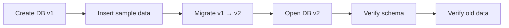

---

# 59. Các lỗi thường gặp

## Lỗi 1 — Insert trong Composable body

```kotlin
@Composable
fun Screen() {
    dao.insert(...)
}
```

### Vấn đề

Recomposition có thể tạo nhiều insert.

### Sửa

```text
User event
 ↓
ViewModel
 ↓
Repository
 ↓
DAO
```

---

## Lỗi 2 — Dùng REPLACE cho mọi Insert

```kotlin
@Insert(
    onConflict = OnConflictStrategy.REPLACE
)
```

mà không hiểu conflict.

### Vấn đề

Có thể che mất bug identity/data model.

---

## Lỗi 3 — Update với ID sai

```kotlin
TaskEntity(
    id = 0,
    ...
)
```

sau đó:

```kotlin
dao.update(task)
```

Trong khi row thực tế:

```text
id = 17
```

Room không biết entity 17 cần được update.

---

## Lỗi 4 — Delete toàn bộ mà không xác nhận

```kotlin
@Query("DELETE FROM tasks")
```

được gọi ngay khi tap.

Production UX nên cân nhắc confirmation hoặc undo.

---

## Lỗi 5 — UI tự sửa list song song với Room

```text
mutableList.remove(task)
       +
dao.delete(task)
```

Có hai nguồn state.

Tốt hơn:

```text
DAO Delete
   ↓
Room
   ↓
Flow
   ↓
UI
```

---

## Lỗi 6 — Không test migration

Dev database mới có thể chạy bình thường:

```text
Fresh install ✅
```

nhưng người dùng update từ version cũ:

```text
v1 → v3 ❌
```

Đây là lý do migration test rất quan trọng.

---

# 60. Ví dụ mini app hoàn chỉnh

## Entity

```kotlin
@Entity(tableName = "notes")
data class NoteEntity(

    @PrimaryKey(autoGenerate = true)
    val id: Long = 0,

    val content: String,

    val createdAt: Long
)
```

---

## DAO

```kotlin
@Dao
interface NoteDao {

    @Insert
    suspend fun insert(
        note: NoteEntity
    ): Long

    @Update
    suspend fun update(
        note: NoteEntity
    ): Int

    @Delete
    suspend fun delete(
        note: NoteEntity
    ): Int

    @Query(
        "SELECT * FROM notes ORDER BY createdAt DESC"
    )
    fun observeAll(): Flow<List<NoteEntity>>
}
```

---

## Repository

```kotlin
class NoteRepository(
    private val dao: NoteDao
) {

    val notes =
        dao.observeAll()

    suspend fun add(
        content: String
    ) {

        dao.insert(
            NoteEntity(
                content = content,
                createdAt =
                    System.currentTimeMillis()
            )
        )
    }

    suspend fun update(
        note: NoteEntity
    ) {
        dao.update(note)
    }

    suspend fun delete(
        note: NoteEntity
    ) {
        dao.delete(note)
    }
}
```

---

## ViewModel

```kotlin
class NoteViewModel(
    private val repository: NoteRepository
) : ViewModel() {

    val notes =
        repository.notes.stateIn(
            viewModelScope,
            SharingStarted.WhileSubscribed(5_000),
            emptyList()
        )

    fun add(content: String) {

        viewModelScope.launch {
            repository.add(content)
        }
    }

    fun delete(note: NoteEntity) {

        viewModelScope.launch {
            repository.delete(note)
        }
    }
}
```

---

# 61. Toàn bộ luồng mini app

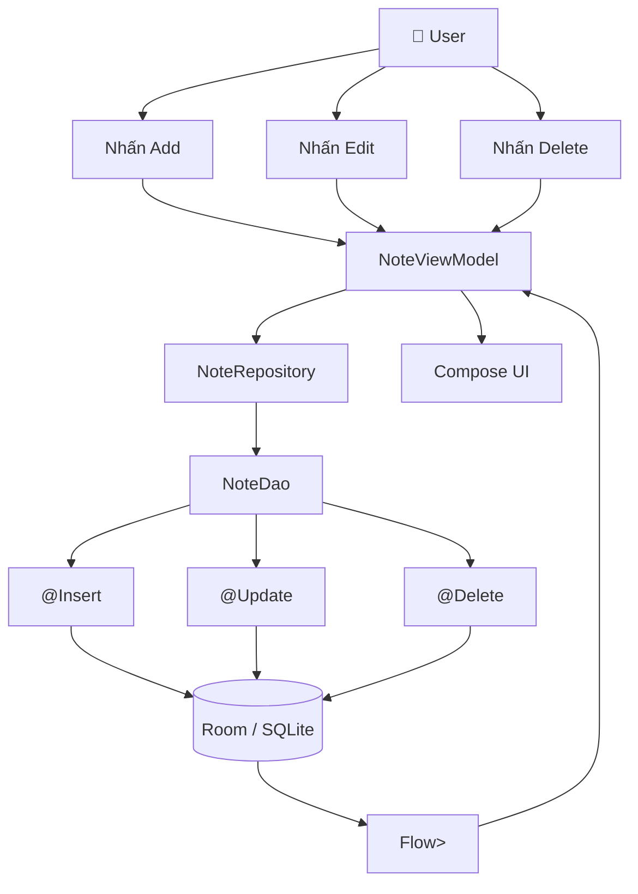

---

# 62. So sánh ba annotation

| Annotation | Mục đích    | Dựa vào PK | Thay đổi DB |
| ---------- | ----------- | ---------: | ----------: |
| `@Insert`  | Tạo row mới |     Có thể |           ✅ |
| `@Update`  | Sửa row     |          ✅ |           ✅ |
| `@Delete`  | Xóa row     |          ✅ |           ✅ |

Có thể nhớ:

```text
        Room DAO
           │
     ┌─────┼─────┐
     ▼     ▼     ▼
 INSERT UPDATE DELETE
     │     │     │
     └─────┼─────┘
           ▼
         SQLite
```

---

# 63. `@Insert/@Update/@Delete` hay `@Query`?

## Convenience annotations

```kotlin
@Insert
@Update
@Delete
```

Ưu điểm:

* ngắn;
* dễ đọc;
* type-safe theo Entity;
* Room sinh SQL.

Dùng tốt cho CRUD cơ bản.

---

## `@Query`

Ví dụ:

```kotlin
@Query(
    """
    UPDATE tasks
    SET completed = 1
    WHERE id = :id
    """
)
suspend fun complete(id: Long)
```

Ưu điểm:

* kiểm soát rõ SQL;
* update một phần;
* delete theo condition;
* bulk operation.

---

## Quy tắc nhanh

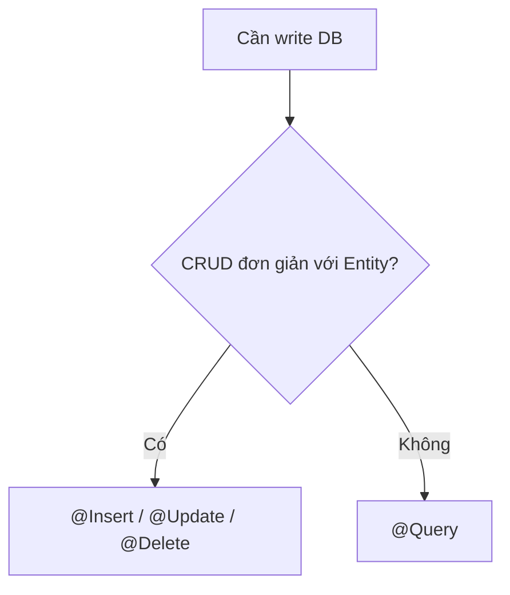

---

# 64. Ảnh minh họa nên ghi nhớ

Bộ ảnh phía đầu bài minh họa khá đúng toàn bộ flow:

1. **Room DAO ↔ SQLite**: DAO cung cấp các thao tác Insert, Update, Delete và Query.
2. **Edit Item UI**: một form thực tế của app Inventory dùng Room.
3. **Database Inspector**: kiểm tra trực tiếp dữ liệu trong Android Studio.
4. **Delete UI**: ví dụ app Room cho phép người dùng xóa dữ liệu.

Android có một Inventory codelab chính thức trong đó người dùng có thể thêm, sửa và xóa item trong Room Database. ([Android Developers][12])

---

# 65. Thực hành 32 phút

## 0–5 phút — Entity

Tạo:

```kotlin
@Entity
data class TaskEntity(...)
```

Có:

```text
id
title
completed
```

---

## 5–12 phút — DAO

Viết:

```kotlin
@Insert
@Update
@Delete
@Query
```

---

## 12–18 phút — Repository

Tạo:

```text
TaskRepository
```

và không để UI gọi DAO trực tiếp.

---

## 18–24 phút — ViewModel

Thêm:

```text
addTask()
toggleTask()
deleteTask()
```

---

## 24–28 phút — UI

Xây dựng:

```text
TextField
Add Button
Checkbox
Delete Icon
LazyColumn
```

---

## 28–32 phút — Debug

Dùng:

```text
Database Inspector
```

kiểm tra:

```text
Insert ✅
Update ✅
Delete ✅
```

---

# 66. Bài tập

Xây dựng một **Todo Room App** có flow:

```text
Add Task
   ↓
Room Insert
   ↓
List

Checkbox
   ↓
Room Update
   ↓
List

Delete
   ↓
Room Delete
   ↓
List
```

Yêu cầu:

```text
Task
├── id
├── title
├── completed
└── createdAt
```

DAO phải có:

```kotlin
@Insert
@Update
@Delete
@Query
```

UI observe database bằng:

```kotlin
Flow<List<TaskEntity>>
```

---

# 67. Bài tập nâng cao

Thêm:

```text
Todo App
│
├── Add task
├── Edit title
├── Complete task
├── Delete task
├── Delete all completed
├── Undo delete
└── Database Inspector screenshot
```

Query:

```kotlin
@Query(
    """
    DELETE FROM tasks
    WHERE completed = 1
    """
)
suspend fun deleteCompleted()
```

---

# 68. Artifact portfolio

Một artifact tốt cho bài này có thể là:

```text
room-crud-demo/
│
├── data/
│   ├── TaskEntity.kt
│   ├── TaskDao.kt
│   ├── TaskDatabase.kt
│   └── TaskRepository.kt
│
├── ui/
│   ├── TaskScreen.kt
│   └── TaskViewModel.kt
│
├── test/
│   └── TaskDaoTest.kt
│
└── README.md
```

README nên có:

```markdown
# Room CRUD Demo

## Features

- Insert task
- Update task
- Delete task
- Observe tasks using Flow

## Architecture

UI → ViewModel → Repository → DAO → Room

## Testing

- Insert test
- Update test
- Delete test

## Debugging

Verified using Android Studio Database Inspector.
```

---

# 69. Screenshot nên đưa vào portfolio

Ít nhất nên có:

```text
01_home.png
02_add_task.png
03_task_inserted.png
04_task_updated.png
05_delete_confirmation.png
06_database_inspector.png
```

Đặc biệt:

```text
App UI
   +
Database Inspector
```

giúp chứng minh rằng UI và dữ liệu persisted thực sự hoạt động cùng nhau.

---

# 70. Checklist hoàn thành

* [ ] Giải thích được CRUD.
* [ ] Biết `@Insert` dùng để làm gì.
* [ ] Biết `@Update` dùng để làm gì.
* [ ] Biết `@Delete` dùng để làm gì.
* [ ] Hiểu vai trò của primary key.
* [ ] Biết dùng `OnConflictStrategy`.
* [ ] Biết vì sao DAO write operation thường là `suspend`.
* [ ] Có Repository nằm giữa ViewModel và DAO.
* [ ] Không gọi Insert trực tiếp từ Composable body.
* [ ] UI observe database bằng `Flow`.
* [ ] Insert làm UI cập nhật.
* [ ] Update làm UI cập nhật.
* [ ] Delete làm UI cập nhật.
* [ ] Có validation trước khi lưu.
* [ ] Có xử lý lỗi.
* [ ] Có chống double submit nếu cần.
* [ ] Có confirm/undo cho dữ liệu quan trọng.
* [ ] Đã kiểm tra bằng Database Inspector.
* [ ] Có test Insert.
* [ ] Có test Update.
* [ ] Có test Delete.
* [ ] Có kế hoạch migration khi schema thay đổi.
* [ ] Có artifact nhỏ để đưa vào portfolio.

---

# 71. Ghi chú production

Trước khi release một tính năng sử dụng Insert/Update/Delete, nên tự hỏi:

| Câu hỏi                                       | Ý nghĩa                   |
| --------------------------------------------- | ------------------------- |
| Dữ liệu nào là source of truth?               | Tránh state không đồng bộ |
| Insert có thể bị gọi hai lần không?           | Tránh duplicate           |
| Conflict strategy có đúng không?              | Tránh mất/ghi đè data     |
| Update dùng đúng ID chưa?                     | Tránh update 0 row        |
| Delete có thể undo không?                     | Cải thiện UX              |
| App offline thì sao?                          | Đảm bảo consistency       |
| Local và server sync thế nào?                 | Tránh divergence          |
| Migration đã test chưa?                       | Tránh crash khi upgrade   |
| Có transaction cho nghiệp vụ nhiều bước chưa? | Bảo toàn tính toàn vẹn    |
| Có DAO test chưa?                             | Bảo vệ persistence layer  |
| Database Inspector đã kiểm tra chưa?          | Debug dữ liệu thực        |

---

# 72. Sơ đồ tổng kết

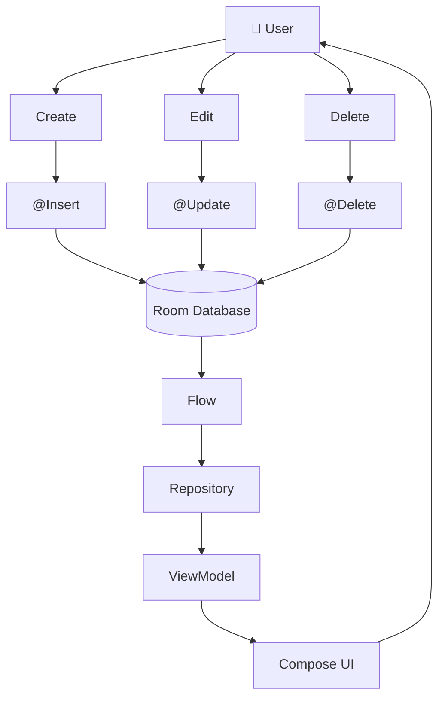

Có thể ghi nhớ cả bài bằng một dòng:

```text
User Event
→ ViewModel
→ Repository
→ DAO
→ Insert / Update / Delete
→ Room
→ Flow
→ UI tự cập nhật
```

---

# 73. Điểm cần nhớ

> **`@Insert`, `@Update` và `@Delete` không chỉ là ba annotation của Room. Chúng là ranh giới nơi hành động của người dùng trở thành thay đổi dữ liệu persisted.**

Một implementation tốt không dừng ở:

```kotlin
@Insert
suspend fun insert(...)
```

mà còn cần suy nghĩ tới:

```text
Validation
+
UI State
+
Coroutines
+
Repository
+
Flow
+
Conflict
+
Transaction
+
Offline
+
Migration
+
Testing
+
Debugging
```

Đó là khác biệt giữa **"biết dùng Room"** và **"có thể đưa Room vào production"**.

[1]: https://developer.android.com/training/data-storage/room/accessing-data?utm_source=chatgpt.com "Accessing data using Room DAOs | App data and files"
[2]: https://developer.android.com/training/data-storage/room/defining-data?utm_source=chatgpt.com "Define data using Room entities | App data and files"
[3]: https://developer.android.com/reference/androidx/room/Insert?utm_source=chatgpt.com "Insert | API reference"
[4]: https://developer.android.com/reference/androidx/room/Update?utm_source=chatgpt.com "Update | API reference | Android Developers"
[5]: https://developer.android.com/reference/androidx/room/Delete?utm_source=chatgpt.com "Delete | API reference"
[6]: https://developer.android.com/training/data-storage/room/async-queries?utm_source=chatgpt.com "Write asynchronous DAO queries | App data and files"
[7]: https://developer.android.com/reference/android/arch/persistence/room/Transaction?utm_source=chatgpt.com "Transaction | API reference"
[8]: https://developer.android.com/training/data-storage/room/migrating-db-versions?utm_source=chatgpt.com "Migrate your Room database | App data and files"
[9]: https://developer.android.com/blog/posts/modernizing-the-room?utm_source=chatgpt.com "Room 3.0 - Modernizing the Room"
[10]: https://developer.android.com/studio/inspect/database?utm_source=chatgpt.com "Debug your database with the Database Inspector"
[11]: https://developer.android.com/training/data-storage/room/testing-db?utm_source=chatgpt.com "Test and debug your database | App data and files"
[12]: https://developer.android.com/codelabs/basic-android-kotlin-compose-update-data-room?utm_source=chatgpt.com "Read and update data with Room"
