[](https://developer.android.com/training/data-storage/room/relationships?utm_source=chatgpt.com)

# 014 - Relations

**Học phần:** 03 - Architecture, State and Data
**Module:** Module 06 - Storage
**Nhóm nội dung:** Room Database
**Nguồn roadmap:** Storage / Room Database
**Loại bài:** Storage
**Thứ tự trong module:** 014
**Thời lượng gợi ý:** 32 phút

> **Cập nhật 2026:** phần code trong bài ưu tiên cú pháp **Room 3.x** với package `androidx.room3`. Room 3 chuyển sang Kotlin-first, dùng KSP và ưu tiên coroutine; tài liệu Room 2.x hiện đã được Android Developers đánh dấu deprecated. ([Android Developers][1])

---

## 1. Tóm tắt

**Relations** trong Room mô tả cách các bảng dữ liệu liên hệ với nhau.

Ví dụ:

* một `User` có một `Profile`;
* một `User` có nhiều `Note`;
* một `Note` có nhiều `Tag`, đồng thời một `Tag` có thể thuộc nhiều `Note`.

Room hỗ trợ các kiểu quan hệ phổ biến gồm **one-to-one**, **one-to-many**, **many-to-many** và các quan hệ lồng nhau. Room không thiết kế `Entity` theo kiểu object trực tiếp chứa object entity khác; thay vào đó, ta thường tạo một **data class trung gian** rồi sử dụng `@Embedded`, `@Relation` và khi cần thì `@Junction`. ([Android Developers][2])

```text
Database
│
├── User
│    ├── Profile
│    └── Note
│          └── Tag
│
└── Các quan hệ giúp Room ghép dữ liệu
     thành object mà UI cần.
```

Relations quan trọng vì mô hình dữ liệu sai có thể dẫn đến:

* dữ liệu trùng lặp;
* query phức tạp;
* tải quá nhiều dữ liệu;
* migration khó;
* dữ liệu orphan;
* UI hiển thị dữ liệu không nhất quán.

---

## 2. Mục tiêu học tập

Sau bài này, bạn nên có thể:

* [ ] Giải thích được Relations trong Room.
* [ ] Phân biệt one-to-one, one-to-many và many-to-many.
* [ ] Sử dụng `@Embedded`.
* [ ] Sử dụng `@Relation`.
* [ ] Sử dụng `@Junction` cho many-to-many.
* [ ] Hiểu khi nào cần `@Transaction`.
* [ ] Phân biệt `@Relation` với SQL `JOIN`.
* [ ] Thiết kế dữ liệu local phù hợp với Repository/ViewModel/UI.
* [ ] Test relation bằng database thật hoặc in-memory database.
* [ ] Nhận biết relation nào có thể gây vấn đề performance hoặc migration.

---

# 3. Relations nằm ở đâu trong kiến trúc Android?

Relations thuộc **Data Layer**, cụ thể là lớp persistence/local database.

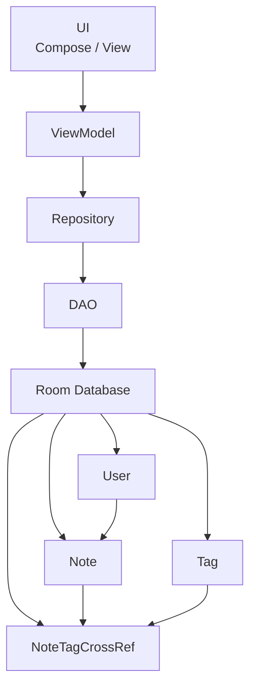

UI không nên tự ghép các bảng bằng cách gọi nhiều DAO độc lập rồi xử lý thủ công. Thường Repository sẽ nhận một object đã được DAO/Room dựng từ relation rồi chuyển thành model mà UI cần.

Ví dụ:

```text
Compose
   ↓
NotesViewModel
   ↓
NotesRepository
   ↓
NoteDao
   ↓
Room
   ↓
NoteWithTags
```

Room có thể ánh xạ kết quả query sang các data object chứa relation, giúp Data Layer giữ logic persistence tách khỏi UI. ([Android Developers][3])

---

# 4. Khái niệm cốt lõi

## 4.1 Entity không phải object graph

Giả sử có:

```kotlin
@Entity
data class User(
    @PrimaryKey val userId: Long,
    val name: String
)
```

và:

```kotlin
@Entity
data class Note(
    @PrimaryKey val noteId: Long,
    val ownerId: Long,
    val title: String
)
```

Không nên thiết kế:

```kotlin
@Entity
data class User(
    ...
    val notes: List<Note>
)
```

Thay vào đó, tạo **data object riêng**:

```kotlin
data class UserWithNotes(
    @Embedded
    val user: User,

    @Relation(
        parentColumns = ["userId"],
        entityColumns = ["ownerId"]
    )
    val notes: List<Note>
)
```

Trong Room 3, `@Relation` được dùng trên **data object**, không đặt trực tiếp relation trong `Entity`. Room tự tải relation khi object đó được trả về từ query. ([Android Developers][3])

---

# 5. Ba loại Relations quan trọng

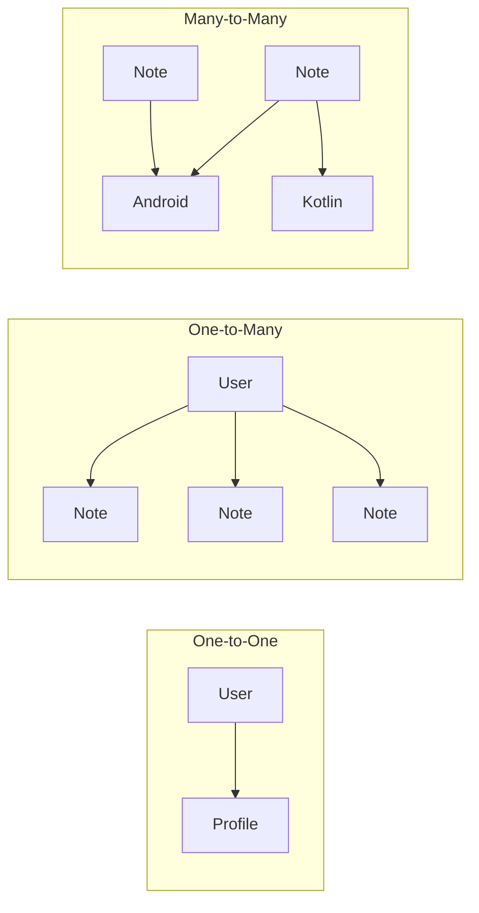

Room chính thức hỗ trợ các mô hình one-to-one, one-to-many và many-to-many; many-to-many thường sử dụng một **junction table**. ([Android Developers][2])

---

# 6. One-to-One

## 6.1 Ví dụ

Một user có đúng một profile.

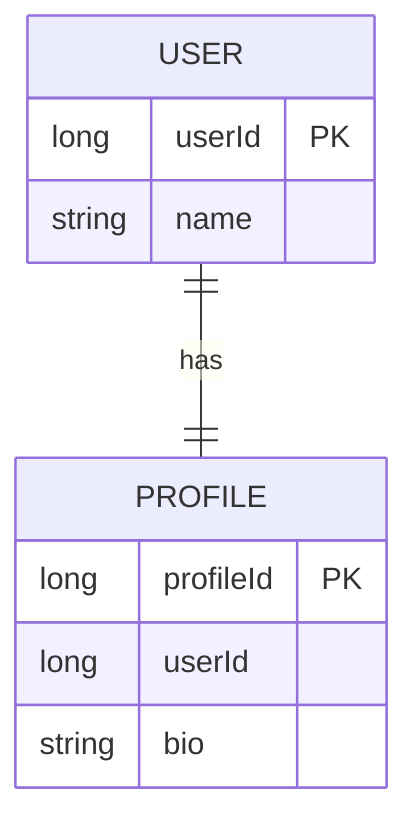

Entity:

```kotlin
@Entity
data class User(
    @PrimaryKey
    val userId: Long,

    val name: String
)
```

```kotlin
@Entity
data class Profile(
    @PrimaryKey
    val profileId: Long,

    val userId: Long,

    val bio: String
)
```

Object trả về cho app:

```kotlin
data class UserWithProfile(
    @Embedded
    val user: User,

    @Relation(
        parentColumns = ["userId"],
        entityColumns = ["userId"]
    )
    val profile: Profile?
)
```

DAO:

```kotlin
@Dao
interface UserDao {

    @Transaction
    @Query("SELECT * FROM User WHERE userId = :userId")
    suspend fun getUserWithProfile(
        userId: Long
    ): UserWithProfile?
}
```

Với query relation kiểu này, Room có thể phải thực hiện nhiều query để dựng object hoàn chỉnh; `@Transaction` giúp các query nhìn thấy một trạng thái dữ liệu nhất quán. ([Android Developers][4])

---

# 7. One-to-Many

Đây là loại relation rất phổ biến trong ứng dụng Android.

Ví dụ:

> Một user có nhiều note.

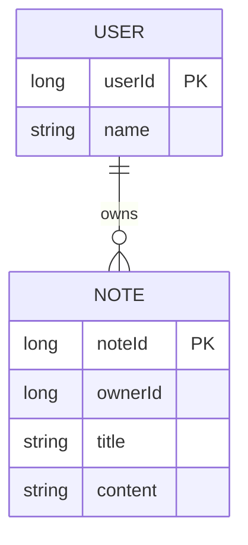

## 7.1 Entity

```kotlin
@Entity
data class User(
    @PrimaryKey
    val userId: Long,

    val name: String
)
```

```kotlin
@Entity
data class Note(
    @PrimaryKey
    val noteId: Long,

    val ownerId: Long,

    val title: String,

    val content: String
)
```

## 7.2 Relation object

```kotlin
data class UserWithNotes(
    @Embedded
    val user: User,

    @Relation(
        parentColumns = ["userId"],
        entityColumns = ["ownerId"]
    )
    val notes: List<Note>
)
```

Ý nghĩa:

```text
User.userId
     │
     │ match
     ▼
Note.ownerId
```

Room 3 cho phép `@Relation` xác định các cột ở object cha thông qua `parentColumns` và các cột tương ứng ở entity con thông qua `entityColumns`. Với one-to-many, property relation thường là `List` hoặc `Set`. ([Android Developers][3])

---

## 7.3 DAO

```kotlin
@Dao
interface UserDao {

    @Transaction
    @Query("SELECT * FROM User WHERE userId = :userId")
    suspend fun getUserWithNotes(
        userId: Long
    ): UserWithNotes?
}
```

Luồng thực thi có thể hình dung như sau:

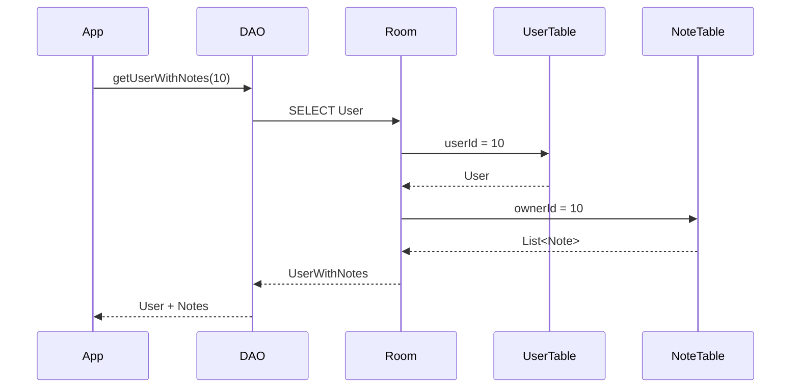

Android Developers khuyến nghị sử dụng `@Transaction` với những query relation cần Room thực hiện nhiều query để đảm bảo toàn bộ thao tác đọc diễn ra nhất quán. ([Android Developers][5])

---

# 8. `@Embedded`

`@Embedded` có nghĩa:

> Các field của object được nhúng được Room xem như một phần của object bên ngoài khi ánh xạ dữ liệu.

Ví dụ:

```kotlin
data class UserWithNotes(
    @Embedded
    val user: User,

    @Relation(...)
    val notes: List<Note>
)
```

Ở đây:

```text
UserWithNotes
│
├── user
│    ├── userId
│    └── name
│
└── notes[]
```

`@Embedded` không giống `@Relation`.

| Annotation     | Mục đích                                |
| -------------- | --------------------------------------- |
| `@Embedded`    | Nhúng field của object                  |
| `@Relation`    | Tìm entity liên quan                    |
| `@Junction`    | Ghép relation thông qua bảng trung gian |
| `@Transaction` | Giữ các thao tác trong cùng transaction |

Room 3 cũng hỗ trợ `prefix` cho `@Embedded` khi các embedded object có column trùng tên. ([Android Developers][6])

Ví dụ:

```kotlin
@Embedded(prefix = "shipping_")
val shippingAddress: Address
```

có thể tạo các tên như:

```text
shipping_city
shipping_street
shipping_postCode
```

---

# 9. Many-to-Many

Ví dụ tốt nhất là:

> Một Note có nhiều Tag.
> Một Tag cũng có thể thuộc nhiều Note.

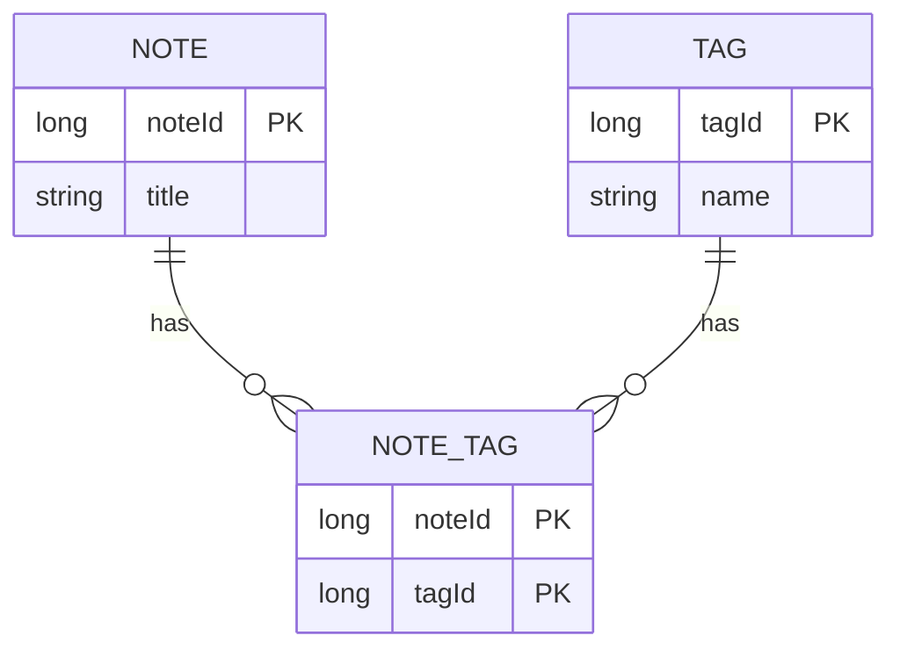

Không thể chỉ đặt:

```text
Note.tagId
```

vì một note có thể có nhiều tag.

Cũng không thể chỉ đặt:

```text
Tag.noteId
```

vì một tag có thể được nhiều note dùng.

Ta cần:

```text
Note
  │
  ▼
NoteTagCrossRef
  ▲
  │
Tag
```

Đó chính là **junction/cross-reference table**. Đây là mô hình Room sử dụng cho many-to-many. ([Android Developers][7])

---

# 10. Tạo bảng Junction

```kotlin
@Entity
data class Note(
    @PrimaryKey
    val noteId: Long,

    val title: String
)
```

```kotlin
@Entity
data class Tag(
    @PrimaryKey
    val tagId: Long,

    val name: String
)
```

Bảng trung gian:

```kotlin
@Entity(
    primaryKeys = ["noteId", "tagId"]
)
data class NoteTagCrossRef(
    val noteId: Long,
    val tagId: Long
)
```

Ví dụ dữ liệu:

### Note

| noteId | title       |
| -----: | ----------- |
|      1 | Học Room    |
|      2 | Học Compose |

### Tag

| tagId | name     |
| ----: | -------- |
|    10 | Android  |
|    11 | Database |
|    12 | Compose  |

### NoteTagCrossRef

| noteId | tagId |
| -----: | ----: |
|      1 |    10 |
|      1 |    11 |
|      2 |    10 |
|      2 |    12 |

Có thể suy ra:

```text
Học Room
├── Android
└── Database

Học Compose
├── Android
└── Compose
```

---

# 11. `@Junction`

Tạo object:

```kotlin
data class NoteWithTags(
    @Embedded
    val note: Note,

    @Relation(
        parentColumns = ["noteId"],
        entityColumns = ["tagId"],
        associateBy = Junction(
            value = NoteTagCrossRef::class,
            parentColumns = ["noteId"],
            entityColumns = ["tagId"]
        )
    )
    val tags: List<Tag>
)
```

Luồng mapping:

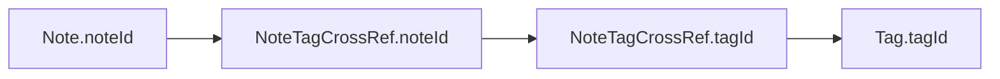

`Junction` của Room 3 dùng một entity hoặc database view làm associative table và cho phép khai báo riêng cột phía parent và phía entity. ([Android Developers][7])

---

# 12. DAO cho Many-to-Many

```kotlin
@Dao
interface NoteDao {

    @Transaction
    @Query("SELECT * FROM Note WHERE noteId = :noteId")
    suspend fun getNoteWithTags(
        noteId: Long
    ): NoteWithTags?
}
```

Hoặc tất cả:

```kotlin
@Transaction
@Query("SELECT * FROM Note")
suspend fun getNotesWithTags(): List<NoteWithTags>
```

Các relation many-to-many có thể yêu cầu Room thực hiện nhiều query, vì vậy tài liệu Android cũng khuyến nghị đặt query kiểu này trong `@Transaction`. ([Android Developers][8])

---

# 13. `@Transaction` quan trọng như thế nào?

Giả sử Room thực hiện:

```text
Query 1
SELECT * FROM User

                 ← database bị update tại đây

Query 2
SELECT * FROM Note
```

Ta có nguy cơ nhận:

```text
User ở trạng thái A

+

Notes ở trạng thái B
```

Thay vào đó:

```text
BEGIN TRANSACTION

    SELECT User

    SELECT Notes

END TRANSACTION
```

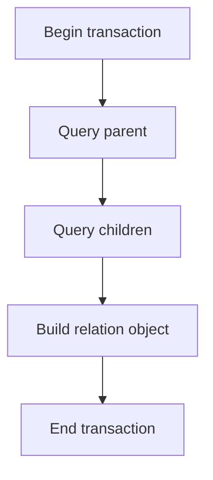

Theo API Room 3, `@Transaction` đặc biệt hữu ích khi kết quả query chứa `@Relation`, vì các relation có thể được query riêng; transaction giữ kết quả nhất quán giữa các lần đọc. Với `Flow`, transaction được xử lý khi query thực sự chạy chứ không phải lúc gọi function. ([Android Developers][9])

---

# 14. `@Relation` và `ForeignKey` không phải cùng một thứ

Đây là một nhầm lẫn phổ biến.

## `@Relation`

Giúp Room:

```text
LẤY dữ liệu liên quan
```

Ví dụ:

```kotlin
@Relation(
    parentColumns = ["userId"],
    entityColumns = ["ownerId"]
)
```

## `ForeignKey`

Giúp database:

```text
BẢO VỆ tính toàn vẹn dữ liệu
```

Ví dụ về ý nghĩa logic:

```text
Note.ownerId
     │
     └──────────> User.userId
```

Nếu một `Note` trỏ đến user không tồn tại thì database có thể dùng foreign-key constraint để ngăn hoặc xử lý trường hợp đó tùy cấu hình. Room 3 có `ForeignKey` riêng để định nghĩa ràng buộc giữa entity cha và entity con. ([Android Developers][10])

Nói ngắn gọn:

```text
@Relation   = cách đọc / ánh xạ relation
ForeignKey  = ràng buộc dữ liệu trong database
```

---

# 15. `@Relation` hay SQL `JOIN`?

Đây là phần rất quan trọng trong Room hiện đại.

Android Developers hiện mô tả hai hướng chính:

```text
1. Intermediate data class
   @Embedded + @Relation

2. SQL relational query
   JOIN + multimap return type
```

Nếu không có lý do cụ thể cần data class trung gian, tài liệu hiện tại khuyến nghị cân nhắc **multimap**; cách này đẩy nhiều công việc hơn sang SQL và giảm số lượng data class cần tạo. ([Android Developers][2])

---

## 15.1 Cách 1 — `@Relation`

```kotlin
data class UserWithNotes(
    @Embedded
    val user: User,

    @Relation(
        parentColumns = ["userId"],
        entityColumns = ["ownerId"]
    )
    val notes: List<Note>
)
```

Ưu điểm:

```text
+ Dễ đọc
+ Mapping rõ ràng
+ Phù hợp object graph nhỏ
+ Ít SQL JOIN thủ công
```

Nhược điểm:

```text
- Có thể cần nhiều query
- Nhiều data class trung gian
- Nested relation lớn có thể khó kiểm soát
```

---

# 16. Cách 2 — SQL JOIN + Multimap

Ví dụ:

```kotlin
@Query(
    """
    SELECT *
    FROM User
    JOIN Note
        ON User.userId = Note.ownerId
    """
)
suspend fun getUsersWithNotes(): Map<User, List<Note>>
```

Luồng:

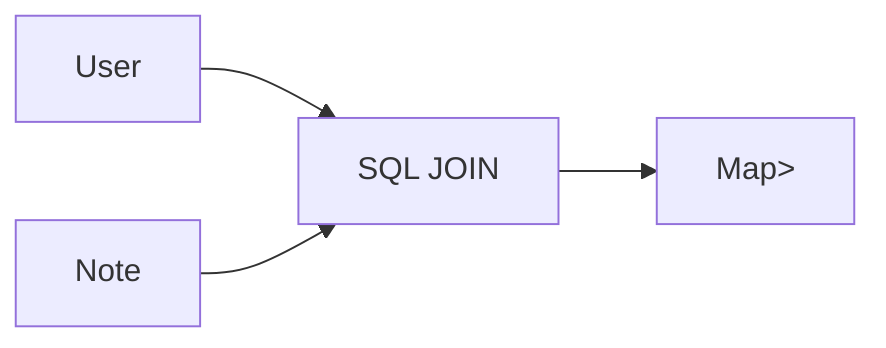

Room hỗ trợ trả trực tiếp multimap từ relational query; tài liệu hiện tại coi đây là một lựa chọn tốt nếu không cần intermediate relation data classes. ([Android Developers][2])

---

# 17. Relation lồng nhau

Có thể xuất hiện dữ liệu:

```text
User
└── Notes
     └── Tags
```

Ví dụ:

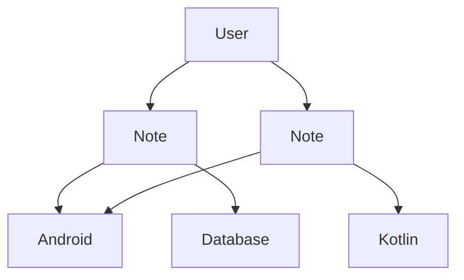

Room hỗ trợ nested relationships nhưng việc dựng object càng sâu thì số query và lượng dữ liệu cần xử lý càng đáng lưu ý. Các nested relation sử dụng cùng cơ chế embedded/relation và thường cần transaction khi Room thực hiện nhiều query. ([Android Developers][11])

Không nên mặc định tải:

```text
User
 └── Projects
      └── Notes
           └── Tags
                └── Attachments
                     └── Comments
```

chỉ để hiển thị một màn hình:

```text
Tên User
+
10 note mới nhất
```

Hãy query đúng dữ liệu UI thực sự cần.

---

# 18. Relations và Reactive State

Một pattern thường gặp:

```text
Room
 ↓
Flow
 ↓
Repository
 ↓
ViewModel
 ↓
StateFlow / UI State
 ↓
Compose
```

Ví dụ DAO:

```kotlin
@Transaction
@Query("SELECT * FROM Note")
fun observeNotesWithTags(): Flow<List<NoteWithTags>>
```

Khi database thay đổi:

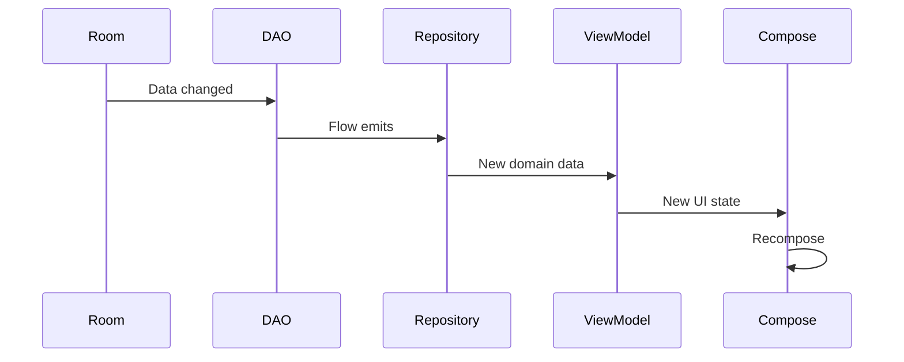

Room 3 chuyển mạnh sang coroutine-first; DAO one-shot thường sử dụng `suspend`, còn observable query có thể trả về reactive type như `Flow`. `@Transaction` cũng hỗ trợ asynchronous query như `Flow`. ([Android Developers][12])

---

# 19. Relations trong Offline-first App

Ví dụ app Notes có server:

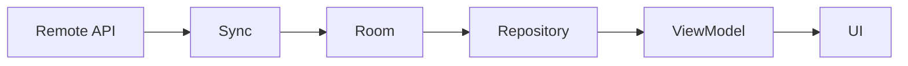

Thay vì:

```text
UI
├── đọc User từ server
├── đọc Notes từ Room
└── tự ghép dữ liệu
```

nên cố gắng đưa việc tổ chức dữ liệu vào Data Layer:

```text
Remote
   ↓
Repository / Sync
   ↓
Room
   ↓
DAO relation/query
   ↓
UI model
```

Khi relation thay đổi, Repository có thể chỉ cần nhận lại một object mới như:

```kotlin
NoteWithTags
```

thay vì UI tự quản lý nhiều nguồn dữ liệu rời rạc.

---

# 20. Quan hệ và Migration

Giả sử version 1:

```text
Note
├── id
└── title
```

Version 2 thêm:

```text
Tag

NoteTagCrossRef
```

Schema thay đổi:

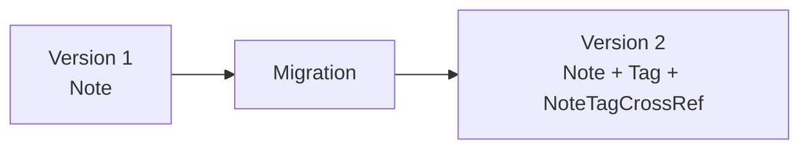

Nếu ứng dụng đang có dữ liệu thật, việc thêm hoặc thay đổi relation phải đi kèm migration phù hợp. Room hỗ trợ auto migration cho nhiều thay đổi cơ bản và manual migration cho những biến đổi phức tạp; schema history nên được export và migration nên được test. ([Android Developers][13])

Không nên dùng:

```kotlin
fallbackToDestructiveMigration()
```

một cách tùy tiện trong production vì khi không có migration path phù hợp, lựa chọn destructive migration có thể xóa dữ liệu local để dựng lại database. ([Android Developers][13])

---

# 21. Performance

Relations tiện lợi nhưng không miễn phí.

Giả sử:

```text
100 Users
   │
   ├── mỗi user 100 Notes
   │
   └── mỗi note 10 Tags
```

Object graph có thể chứa:

$$
100 \times 100 \times 10 = 100,000
$$

liên kết dữ liệu.

Nếu UI chỉ hiển thị:

```text
20 Notes
```

thì không nên tải toàn bộ graph.

Một số cách giảm chi phí:

```text
Query đúng màn hình
        ↓
Projection
        ↓
Pagination
        ↓
JOIN khi phù hợp
        ↓
Index trên column thường JOIN / filter
```

Room 3 còn hỗ trợ `projection` trong `@Relation` để chỉ lấy các column cần thiết từ entity con. ([Android Developers][3])

Ví dụ:

```kotlin
data class AlbumAndSongNames(
    @Embedded
    val album: Album,

    @Relation(
        parentColumns = ["id"],
        entityColumns = ["albumId"],
        entity = Song::class,
        projection = ["name"]
    )
    val songNames: List<String>
)
```

Thay vì tải:

```text
Song
├── id
├── name
├── description
├── path
├── createdAt
├── metadata
└── ...
```

ta chỉ cần:

```text
name
```

---

# 22. Sai lầm thường gặp

## Sai 1 — Nhét relation trực tiếp vào Entity

```kotlin
@Entity
data class User(
    val notes: List<Note>
)
```

### Nên dùng

```kotlin
data class UserWithNotes(
    @Embedded
    val user: User,

    @Relation(...)
    val notes: List<Note>
)
```

Room quy định `@Relation` dành cho data object chứ không phải trực tiếp tạo relation property trong `Entity`. ([Android Developers][3])

---

## Sai 2 — Nhầm `@Embedded` với `@Relation`

```text
@Embedded
    ↓
các field thuộc cùng object mapping

@Relation
    ↓
tìm record liên quan ở entity khác
```

([Android Developers][6])

---

## Sai 3 — Many-to-many nhưng không có Junction

Sai:

```text
Note
└── tagId
```

khi một note có nhiều tag.

Đúng:

```text
Note
   \
    NoteTagCrossRef
   /
Tag
```

Many-to-many sử dụng associative/junction table là pattern được Room hỗ trợ trực tiếp qua `Junction`. ([Android Developers][7])

---

## Sai 4 — Quên `@Transaction`

```kotlin
@Query("SELECT * FROM User")
fun getUsersWithNotes(): List<UserWithNotes>
```

Với query relation cần nhiều lần đọc, nên:

```kotlin
@Transaction
@Query("SELECT * FROM User")
suspend fun getUsersWithNotes(): List<UserWithNotes>
```

để bảo vệ tính nhất quán giữa các query relation. ([Android Developers][9])

---

# 23. Bài thực hành mini — Notes + Tags

## Yêu cầu

Xây dựng:

```text
Note
├── id
├── title
└── content

Tag
├── id
└── name

NoteTagCrossRef
├── noteId
└── tagId
```

Quan hệ:

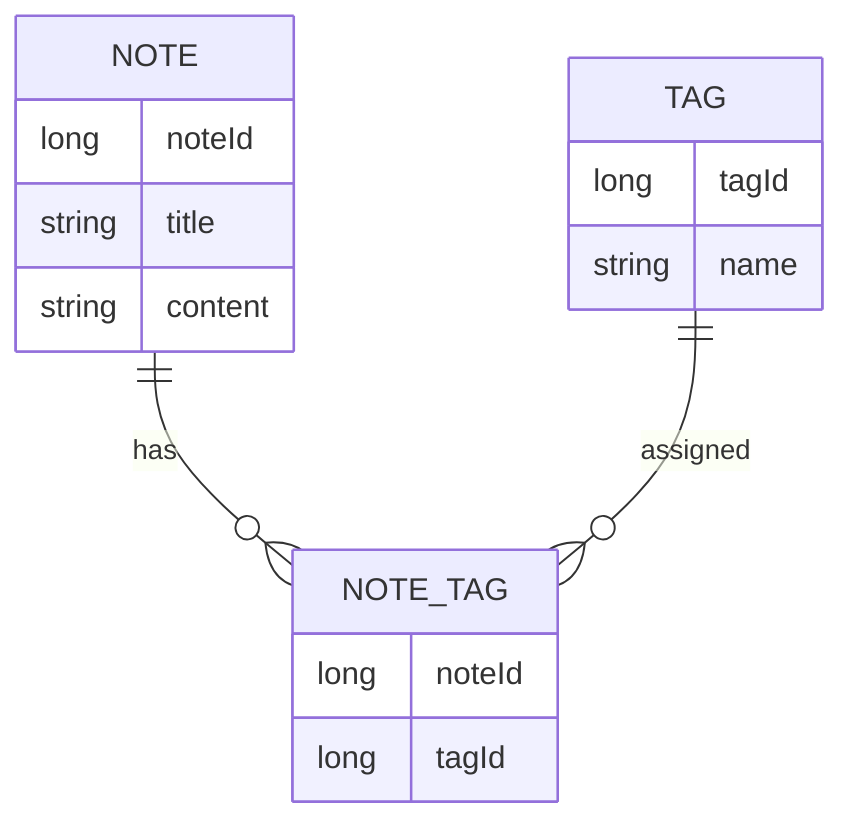

---

## Bước 1 — Tạo Entity

```kotlin
@Entity
data class Note(
    @PrimaryKey(autoGenerate = true)
    val noteId: Long = 0,

    val title: String,

    val content: String
)
```

```kotlin
@Entity
data class Tag(
    @PrimaryKey(autoGenerate = true)
    val tagId: Long = 0,

    val name: String
)
```

---

## Bước 2 — Tạo CrossRef

```kotlin
@Entity(
    primaryKeys = ["noteId", "tagId"]
)
data class NoteTagCrossRef(
    val noteId: Long,
    val tagId: Long
)
```

---

## Bước 3 — Tạo Relation

```kotlin
data class NoteWithTags(
    @Embedded
    val note: Note,

    @Relation(
        parentColumns = ["noteId"],
        entityColumns = ["tagId"],
        associateBy = Junction(
            value = NoteTagCrossRef::class,
            parentColumns = ["noteId"],
            entityColumns = ["tagId"]
        )
    )
    val tags: List<Tag>
)
```

Cấu trúc này bám theo API `Relation` và `Junction` của Room 3 hiện tại. ([Android Developers][3])

---

## Bước 4 — DAO

```kotlin
@Dao
interface NoteDao {

    @Insert
    suspend fun insertNote(note: Note): Long

    @Insert
    suspend fun insertTag(tag: Tag): Long

    @Insert
    suspend fun insertCrossRef(
        crossRef: NoteTagCrossRef
    )

    @Transaction
    @Query("SELECT * FROM Note")
    fun observeNotesWithTags(): Flow<List<NoteWithTags>>
}
```

---

# 24. Testing Relations

Một test relation tốt không chỉ kiểm tra:

```text
Note insert thành công
```

mà phải kiểm tra:

```text
Note
+
Tag
+
CrossRef
+
Relation query
```

Ví dụ scenario:

```text
Given
    Note A
    Tag Android
    Tag Room

When
    tạo 2 NoteTagCrossRef

Then
    NoteWithTags.tags.size == 2
```

Android Developers khuyến nghị kiểm thử database bằng database cô lập/in-memory khi phù hợp; tài liệu Room hiện tại cũng hỗ trợ test trên Android và host JVM với Room KMP. Migration cũng nên có test riêng vì migration sai có thể làm ứng dụng lỗi hoặc làm hỏng đường nâng cấp dữ liệu. ([Android Developers][14])

---

# 25. Debug bằng Database Inspector

Khi relation sai, hãy kiểm tra dữ liệu thật:

```text
Note
Tag
NoteTagCrossRef
```

Ví dụ:

```text
Note
id = 5

CrossRef
noteId = 6
tagId  = 2
```

Relation sẽ không tìm được tag cho note `5`.

Có thể sử dụng **Database Inspector** trong Android Studio để xem bảng, chạy query và quan sát dữ liệu database khi app đang chạy. ([Android Developers][14])

Luồng debug:

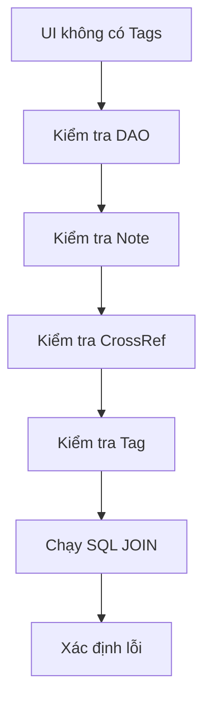

---

# 26. Checklist Production

### Schema

* [ ] Primary key đúng.
* [ ] Foreign key đúng nếu cần referential integrity.
* [ ] Index các column thường JOIN/filter.
* [ ] Cross-reference table có composite primary key phù hợp.
* [ ] Không lưu dữ liệu trùng lặp không cần thiết.

### Relations

* [ ] Phân biệt đúng one-to-one / one-to-many / many-to-many.
* [ ] `parentColumns` và `entityColumns` match đúng.
* [ ] Many-to-many dùng `Junction`.
* [ ] Relation query nhiều bước có `@Transaction`.
* [ ] Không tạo object graph lớn hơn nhu cầu UI.

### State

* [ ] UI nhận dữ liệu thông qua ViewModel/Repository.
* [ ] Không để Compose tự ghép nhiều bảng.
* [ ] Reactive state phản ánh thay đổi database đúng.
* [ ] Không giữ Entity như UI state nếu domain/UI model khác đáng kể.

### Migration

* [ ] Tăng database version khi schema thay đổi.
* [ ] Có migration path.
* [ ] Test migration với dữ liệu cũ.
* [ ] Export schema.
* [ ] Tránh destructive migration nếu dữ liệu user cần được giữ.

Room cung cấp cả automated/manual migrations và `room3-testing` để kiểm tra migration; Android Developers cũng khuyến nghị lưu schema history để có thể kiểm thử các đường nâng cấp database. ([Android Developers][13])

---

# 27. Bài tập

## Bài 1 — One-to-Many

Tạo:

```text
Category
└── Task[]
```

Yêu cầu:

```kotlin
CategoryWithTasks
```

---

## Bài 2 — Many-to-Many

Tạo:

```text
Student
Course
StudentCourseCrossRef
```

Kết quả:

```text
StudentWithCourses
```

---

## Bài 3 — SQL JOIN

Viết cùng tính năng bằng:

```text
@Relation
```

và:

```sql
JOIN
```

Sau đó so sánh:

```text
Số lượng data class
SQL complexity
Readability
Performance
Maintainability
```

Room hiện hỗ trợ cả intermediate data class và relational query với multimap; tài liệu Android khuyến nghị cân nhắc multimap khi không có nhu cầu đặc biệt phải tạo intermediate relation object. ([Android Developers][2])

---

# 28. Artifact cho Portfolio

Một artifact tốt cho bài này có thể là:

```text
room-relations-demo/
│
├── data/
│   ├── entity/
│   │   ├── Note.kt
│   │   ├── Tag.kt
│   │   └── NoteTagCrossRef.kt
│   │
│   ├── relation/
│   │   └── NoteWithTags.kt
│   │
│   ├── dao/
│   │   └── NoteDao.kt
│   │
│   └── AppDatabase.kt
│
├── repository/
│   └── NoteRepository.kt
│
├── ui/
│   └── NotesScreen.kt
│
├── test/
│   └── NoteRelationTest.kt
│
└── README.md
```

README nên có sơ đồ:

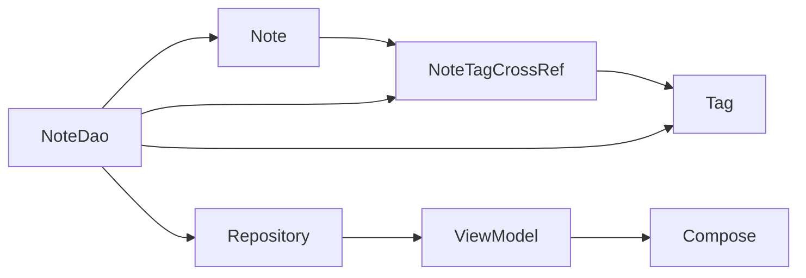

---

# 29. Checklist hoàn thành bài 014

* [ ] Tôi giải thích được Room Relation.
* [ ] Tôi hiểu `@Embedded`.
* [ ] Tôi hiểu `@Relation`.
* [ ] Tôi hiểu `parentColumns`.
* [ ] Tôi hiểu `entityColumns`.
* [ ] Tôi phân biệt one-to-one và one-to-many.
* [ ] Tôi thiết kế được many-to-many.
* [ ] Tôi biết mục đích của `@Junction`.
* [ ] Tôi biết khi nào cần `@Transaction`.
* [ ] Tôi phân biệt `@Relation` và ForeignKey.
* [ ] Tôi phân biệt `@Relation` và SQL `JOIN`.
* [ ] Tôi biết tránh load object graph quá lớn.
* [ ] Tôi test được relation query.
* [ ] Tôi biết relation thay đổi có thể yêu cầu migration.
* [ ] Tôi có một mini project hoặc README để đưa vào portfolio.

---

# 30. Ghi nhớ nhanh

```text
                  ROOM RELATIONS

              ┌──── One-to-One
              │
Entity ───────┼──── One-to-Many
              │
              └──── Many-to-Many
                        │
                        ▼
                     Junction


@Embedded
    ↓
Nhúng object

@Relation
    ↓
Tìm dữ liệu liên quan

@Junction
    ↓
Bảng trung gian N ↔ N

@Transaction
    ↓
Giữ kết quả nhiều query nhất quán
```

Công thức ghi nhớ:

```text
1 ─ 1
User ─ Profile

1 ─ N
User ─ Notes

N ─ N
Note ─ CrossRef ─ Tag
```

Và khi thiết kế production:

```text
Đừng bắt đầu từ:
"Tôi dùng @Relation thế nào?"

Hãy bắt đầu từ:
"Dữ liệu thực tế liên hệ với nhau thế nào?"
            ↓
Thiết kế schema
            ↓
Constraint / Index
            ↓
DAO query
            ↓
Relation hoặc JOIN
            ↓
Repository
            ↓
UI State
```

Đó mới là cách nhìn đúng về **Relations trong Room Database**. ([Android Developers][2])

[1]: https://developer.android.com/jetpack/androidx/releases/room3?utm_source=chatgpt.com "Room 3.0 | Jetpack"
[2]: https://developer.android.com/training/data-storage/room/relationships?utm_source=chatgpt.com "Choose relationship types between objects | App data and ..."
[3]: https://developer.android.com/reference/kotlin/androidx/room3/Relation "Relation  |  API reference  |  Android Developers"
[4]: https://developer.android.com/training/data-storage/room/relationships/one-to-one?utm_source=chatgpt.com "Define and query one-to-one relationships | App data and ..."
[5]: https://developer.android.com/training/data-storage/room/relationships/one-to-many?utm_source=chatgpt.com "Define and query one-to-many relationships"
[6]: https://developer.android.com/reference/kotlin/androidx/room3/Embedded "Embedded  |  API reference  |  Android Developers"
[7]: https://developer.android.com/reference/kotlin/androidx/room3/Junction "Junction  |  API reference  |  Android Developers"
[8]: https://developer.android.com/training/data-storage/room/relationships/many-to-many?utm_source=chatgpt.com "Define and query many-to-many relationships | App data ..."
[9]: https://developer.android.com/reference/kotlin/androidx/room3/Transaction "Transaction  |  API reference  |  Android Developers"
[10]: https://developer.android.com/reference/kotlin/androidx/room3/ForeignKey "ForeignKey  |  API reference  |  Android Developers"
[11]: https://developer.android.com/training/data-storage/room/relationships/nested?utm_source=chatgpt.com "Define and query nested relationships | App data and files"
[12]: https://developer.android.com/training/data-storage/room/migration-2-to-3?utm_source=chatgpt.com "Migrate from Room 2.x to Room 3.0 | App data and files"
[13]: https://developer.android.com/training/data-storage/room/migrating-db-versions?utm_source=chatgpt.com "Migrate your Room database | App data and files"
[14]: https://developer.android.com/training/data-storage/room/testing-db?utm_source=chatgpt.com "Test and debug your database | App data and files"

---

# Bài luyện tập

## Mục tiêu


## Đề bài


## Yêu cầu hoàn thành

- [ ] 
- [ ] 
- [ ] 

## Kết quả / lời giải


## Ghi chú
