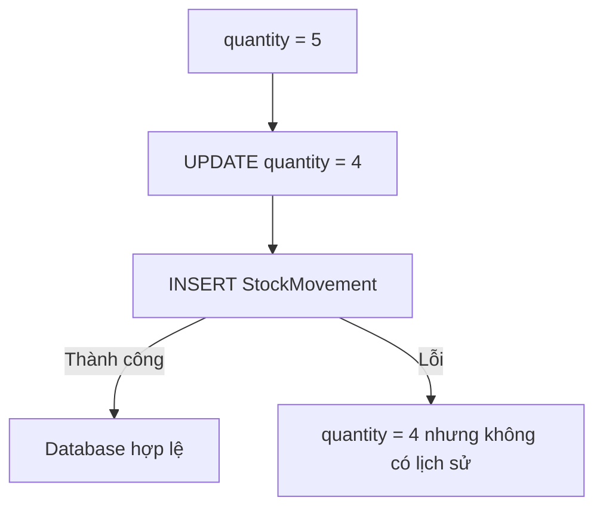
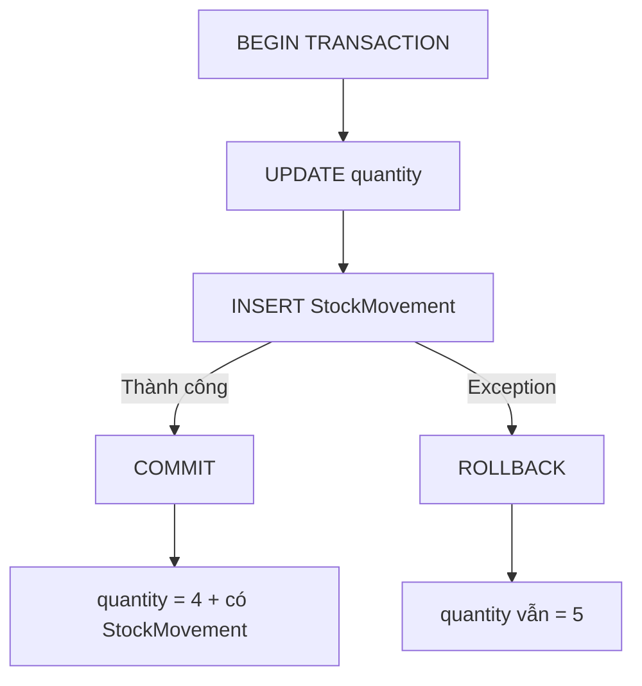
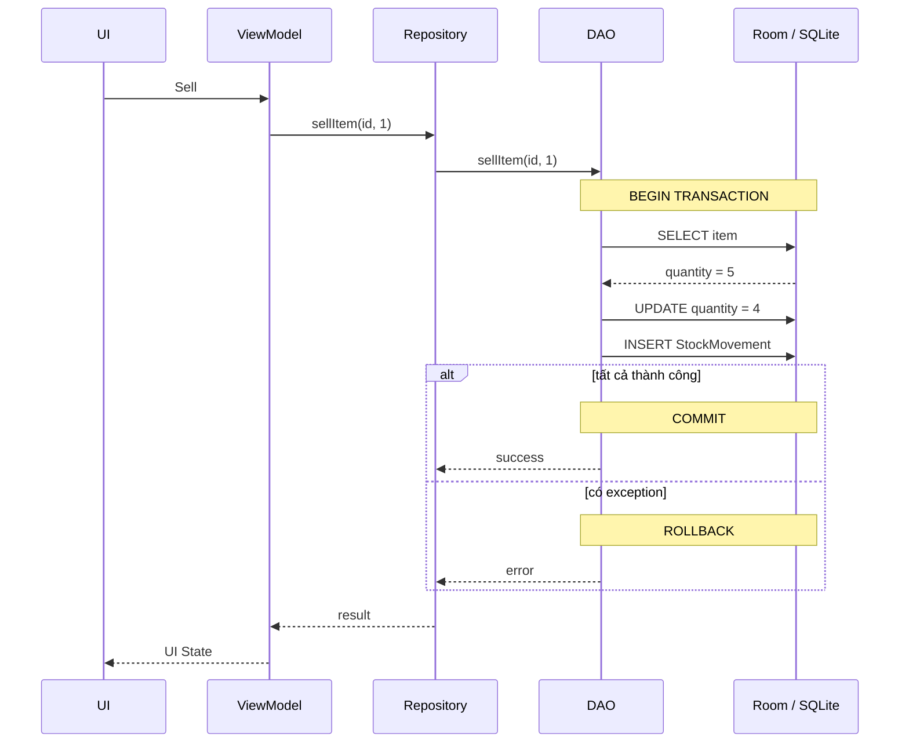
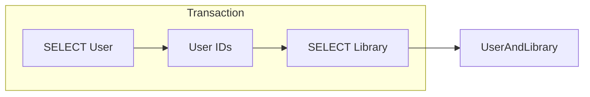
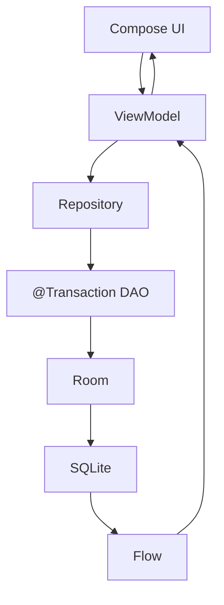
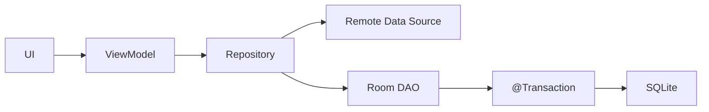
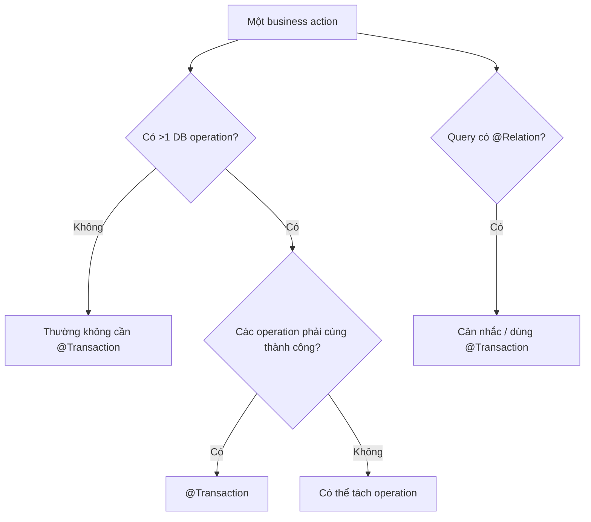
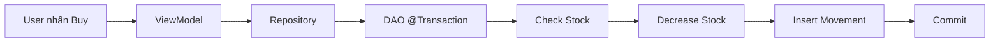
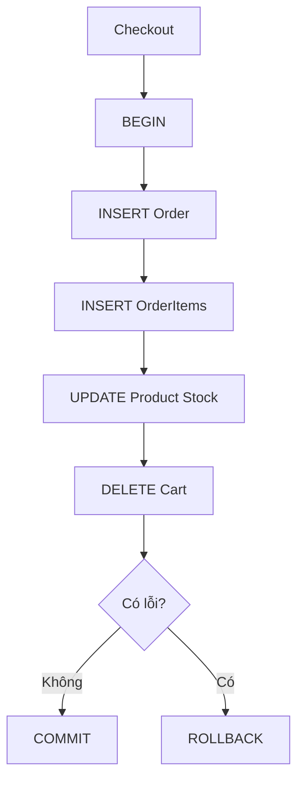

[](https://developer.android.com/codelabs/basic-android-kotlin-compose-persisting-data-room?utm_source=chatgpt.com)

# 015 - Transactions

**Học phần:** 03 - Architecture, State and Data
**Module:** Module 06 - Storage
**Nhóm nội dung:** Room Database
**Nguồn roadmap:** Storage / Room Database
**Loại bài:** Storage
**Thứ tự trong module:** 015
**Thời lượng gợi ý:** 32 phút

---

## 1. Tóm tắt

**Transaction** trong Room là cách gom nhiều thao tác với database thành **một đơn vị công việc duy nhất**. Ý tưởng quan trọng nhất là:

> Hoặc toàn bộ thao tác thành công, hoặc database không nên bị để lại ở trạng thái cập nhật dở dang.

SQLite hỗ trợ **atomic commit**: các thay đổi trong một transaction hoặc cùng được áp dụng, hoặc không thay đổi nào được áp dụng. Room xây dựng trên SQLite và cung cấp `@Transaction` để khai báo các thao tác DAO cần chạy trong cùng transaction. ([SQLite][1])

Ví dụ, khi người dùng mua một sản phẩm:

```text
1. Kiểm tra số lượng còn lại
2. Giảm tồn kho
3. Tạo lịch sử giao dịch
```

Nếu bước 3 thất bại nhưng bước 2 đã được lưu, database sẽ không còn nhất quán. Transaction giúp tránh kiểu **partial update** này.

---

## 2. Mục tiêu học tập

Sau bài này, bạn nên có thể:

* Giải thích transaction và mục đích của transaction.
* Hiểu `COMMIT` và `ROLLBACK`.
* Sử dụng `@Transaction` trong Room DAO.
* Phân biệt một DAO operation với một nhóm operation cần transaction.
* Biết tại sao `@Relation` thường đi cùng `@Transaction`.
* Xử lý transaction với Kotlin Coroutines.
* Test trường hợp transaction thành công và thất bại.
* Nhận biết transaction quá dài có thể ảnh hưởng performance.
* Debug dữ liệu bằng Android Studio Database Inspector.
* Tạo một ví dụ transaction đủ tốt để đưa vào portfolio.

---

# 3. Transaction nằm ở đâu trong kiến trúc Android?

Room thuộc **Data Layer**. UI không nên trực tiếp quản lý transaction. Thông thường luồng dữ liệu sẽ là:

```text
Compose UI
    ↓
ViewModel
    ↓
Repository
    ↓
DAO
    ↓
Room
    ↓
SQLite
```

Android Developers mô tả Room như một data source ở Data Layer; DAO cung cấp lớp truy cập trừu tượng tới database và Room sinh implementation của DAO tại compile time. ([Android Developers][2])


*Nguồn minh họa: Android Developers — Room nằm trong Data Layer.* 

### Ví dụ

```kotlin
Composable
    ↓
InventoryViewModel.sellItem()
    ↓
InventoryRepository.sellItem()
    ↓
InventoryDao.sellItem()
    ↓
@Transaction
    ↓
SQLite
```

Transaction nên nằm gần **persistence boundary**, thường là DAO hoặc database layer, thay vì để Composable tự gọi nhiều thao tác database liên tiếp.

---

# 4. Tại sao cần Transaction?

Giả sử app bán một món hàng.

Database ban đầu:

```text
Item
--------------------------
id       = 1
name     = "Keyboard"
quantity = 5
```

Khi bán một sản phẩm, app cần:

```text
UPDATE Item
quantity: 5 → 4

INSERT StockMovement
type = SALE
amount = 1
```

Nếu không dùng transaction:



Trạng thái cuối ở nhánh lỗi không mong muốn:

```text
Item.quantity = 4

StockMovement:
không tồn tại
```

Với transaction:



Đây chính là tính **atomic** của transaction. SQLite mô tả atomic commit là việc tất cả thay đổi trong transaction cùng xảy ra hoặc không thay đổi nào xảy ra. ([SQLite][1])

---

# 5. ACID

Transaction thường được giải thích bằng bốn thuộc tính **ACID**. SQLite là transactional database và được thiết kế để cung cấp các đặc tính Atomic, Consistent, Isolated và Durable. ([SQLite][3])

| Thuộc tính          | Ý nghĩa                                                                                 | Ví dụ                                                          |
| ------------------- | --------------------------------------------------------------------------------------- | -------------------------------------------------------------- |
| **A — Atomicity**   | Tất cả hoặc không gì cả                                                                 | Giảm stock và ghi history phải cùng thành công                 |
| **C — Consistency** | Database không bị đưa vào trạng thái logic sai                                          | Không được có quantity âm                                      |
| **I — Isolation**   | Transaction đang chạy không nên tạo trạng thái trung gian bất nhất cho transaction khác | Hai thao tác bán hàng không nhìn thấy dữ liệu cập nhật dở dang |
| **D — Durability**  | Sau khi commit, dữ liệu được xem là đã được lưu                                         | App mở lại vẫn thấy dữ liệu đã commit                          |

Trong thực tế Android, phần bạn thường quan tâm nhất khi sử dụng Room là:

```text
Atomicity
+
Consistency của dữ liệu ứng dụng
```

---

# 6. `@Transaction` trong Room

Room cung cấp annotation:

```kotlin
import androidx.room.Transaction
```

`@Transaction` đánh dấu một method của DAO là transaction method. Với method có implementation trong một abstract DAO, Room thực thi phần thân method đó trong một database transaction. Transaction được đánh dấu thành công nếu method hoàn thành mà không có exception. ([Android Developers][4])

Ví dụ cơ bản:

```kotlin
@Dao
abstract class SongDao {

    @Insert
    abstract suspend fun insert(song: Song)

    @Delete
    abstract suspend fun delete(song: Song)

    @Transaction
    open suspend fun replaceSong(
        oldSong: Song,
        newSong: Song
    ) {
        delete(oldSong)
        insert(newSong)
    }
}
```

Logic cần đạt:

```text
DELETE oldSong
        +
INSERT newSong
        ↓
một transaction
```

Nếu toàn bộ hoàn tất:

```text
COMMIT
```

Nếu một thao tác ném exception:

```text
transaction không được đánh dấu thành công
→ rollback
```

Cơ chế `@Transaction` cho method kết hợp nhiều operation được mô tả trực tiếp trong API reference của Room. ([Android Developers][4])

---

# 7. Ví dụ thực tế: bán sản phẩm

Ta xây dựng một mini Inventory App.

## 7.1 Entity `Item`

```kotlin
@Entity(tableName = "items")
data class Item(
    @PrimaryKey(autoGenerate = true)
    val id: Long = 0,

    val name: String,

    val quantity: Int
)
```

---

## 7.2 Entity lịch sử kho

```kotlin
@Entity(tableName = "stock_movements")
data class StockMovement(
    @PrimaryKey(autoGenerate = true)
    val id: Long = 0,

    val itemId: Long,

    val amount: Int,

    val type: String
)
```

Ví dụ dữ liệu:

```text
stock_movements

id | itemId | amount | type
--------------------------------
1  | 15     | 1      | SALE
2  | 15     | 10     | IMPORT
```

---

# 8. DAO

DAO là interface giữa phần còn lại của ứng dụng và database. Room sinh implementation DAO tự động ở compile time. ([Android Developers][5])


*Nguồn minh họa: Android Developers.* 

DAO của ví dụ:

```kotlin
@Dao
abstract class InventoryDao {

    @Query(
        """
        SELECT * 
        FROM items
        WHERE id = :itemId
        """
    )
    abstract suspend fun getItem(
        itemId: Long
    ): Item?

    @Query(
        """
        UPDATE items
        SET quantity = :quantity
        WHERE id = :itemId
        """
    )
    abstract suspend fun updateQuantity(
        itemId: Long,
        quantity: Int
    )

    @Insert
    abstract suspend fun insertMovement(
        movement: StockMovement
    )
}
```

---

# 9. Gom nhiều operation bằng `@Transaction`

Bây giờ tạo operation:

```kotlin
@Transaction
open suspend fun sellItem(
    itemId: Long,
    amount: Int
) {

    val item = getItem(itemId)
        ?: throw IllegalArgumentException(
            "Item không tồn tại"
        )

    if (item.quantity < amount) {
        throw IllegalStateException(
            "Không đủ hàng"
        )
    }

    val newQuantity =
        item.quantity - amount

    updateQuantity(
        itemId = itemId,
        quantity = newQuantity
    )

    insertMovement(
        StockMovement(
            itemId = itemId,
            amount = amount,
            type = "SALE"
        )
    )
}
```

Luồng transaction:



---

# 10. Điều gì xảy ra nếu `insertMovement()` lỗi?

Giả sử:

```text
quantity ban đầu = 5
```

Transaction chạy:

```text
UPDATE quantity = 4
```

Sau đó:

```text
INSERT StockMovement
```

bị lỗi.

Vì các operation nằm trong cùng transaction, transaction không được đánh dấu thành công khi exception thoát khỏi method. Kết quả mong muốn là thay đổi database không bị giữ lại một phần. ([Android Developers][4])

```text
Sau rollback:

quantity = 5
StockMovement = không được thêm
```

Đây chính là lý do transaction cực kỳ quan trọng với:

```text
Order
Payment state
Inventory
Wallet
Sync state
Game save
User progress
Offline cache metadata
```

---

# 11. Không phải lúc nào cũng cần tự thêm `@Transaction`

Một chi tiết rất quan trọng của Room:

```kotlin
@Insert
suspend fun insert(item: Item)

@Update
suspend fun update(item: Item)

@Delete
suspend fun delete(item: Item)
```

Các `@Insert`, `@Update` và `@Delete` đã được Room thực thi trong transaction của chính operation đó. Vì vậy thêm `@Transaction` trực tiếp lên một method `@Insert`, `@Update` hoặc `@Delete` không mang lại tác dụng bổ sung. Các `@Query` thực hiện `INSERT`, `UPDATE` hoặc `DELETE` cũng được transaction hóa tự động. ([Android Developers][4])

### Không cần

```kotlin
@Transaction
@Insert
suspend fun insert(item: Item)
```

### Cần khi gom nhiều operation

```kotlin
@Transaction
open suspend fun sellItem(...) {
    updateQuantity(...)
    insertMovement(...)
}
```

Tư duy:

```text
1 SQL write
→ Room đã xử lý

nhiều operation tạo thành một business action
→ cân nhắc @Transaction
```

---

# 12. Transaction với `@Relation`

Đây là một use case rất quan trọng.

Ví dụ:

```kotlin
data class UserAndLibrary(

    @Embedded
    val user: User,

    @Relation(
        parentColumn = "userId",
        entityColumn = "userOwnerId"
    )
    val library: Library
)
```

DAO:

```kotlin
@Dao
interface UserDao {

    @Transaction
    @Query(
        """
        SELECT *
        FROM User
        """
    )
    suspend fun getUsersAndLibraries():
        List<UserAndLibrary>
}
```

Room khuyến nghị `@Transaction` trong trường hợp này vì việc resolve một object chứa `@Relation` có thể yêu cầu nhiều query. Transaction giúp các query đó nhìn thấy một trạng thái database nhất quán. ([Android Developers][6])

Luồng có thể hình dung:



Nếu database bị thay đổi giữa các query, kết quả relationship có thể không còn phản ánh cùng một snapshot logic.

---

# 13. Transaction và Kotlin Coroutines

Room không cho phép các database query thông thường chạy trực tiếp trên main thread; với Kotlin, one-shot DAO operations có thể dùng `suspend`, còn observable query có thể dùng `Flow`. ([Android Developers][7])

DAO:

```kotlin
@Transaction
open suspend fun sellItem(
    itemId: Long,
    amount: Int
) {
    // ...
}
```

Repository:

```kotlin
class InventoryRepository(
    private val dao: InventoryDao
) {

    suspend fun sellItem(
        itemId: Long,
        amount: Int
    ) {
        dao.sellItem(
            itemId,
            amount
        )
    }
}
```

ViewModel:

```kotlin
class InventoryViewModel(
    private val repository: InventoryRepository
) : ViewModel() {

    fun sellItem(
        id: Long
    ) {

        viewModelScope.launch {

            repository.sellItem(
                itemId = id,
                amount = 1
            )
        }
    }
}
```

Kiến trúc:



---

# 14. Transaction và UI State

Giả sử UI đang hiển thị:

```text
Keyboard
Stock: 5
```

Người dùng nhấn:

```text
BUY
```

ViewModel không nên tự giả định:

```kotlin
quantity--
```

rồi coi đó là trạng thái thật của database.

Một thiết kế tốt hơn:

```text
UI
 ↓
ViewModel
 ↓
Repository
 ↓
Room transaction
 ↓
Database
 ↓
Flow
 ↓
UI state mới
```

Room hỗ trợ `Flow` cho observable queries; khi bảng được quan sát thay đổi, query có thể phát lại dữ liệu để UI nhận trạng thái mới. ([Android Developers][7])

Ví dụ:

```kotlin
@Query(
    """
    SELECT *
    FROM items
    ORDER BY name
    """
)
abstract fun observeItems():
    Flow<List<Item>>
```

ViewModel:

```kotlin
val items =
    repository.observeItems()
        .stateIn(
            viewModelScope,
            SharingStarted.WhileSubscribed(5_000),
            emptyList()
        )
```

---

# 15. Transaction và Lifecycle

Transaction là vấn đề của **data consistency**, không phải lifecycle state.

Ví dụ người dùng:

```text
nhấn BUY
    ↓
ViewModel gọi Repository
    ↓
Room transaction
```

Nếu Activity bị rotate, UI có thể được tạo lại, nhưng logic database không nên nằm trực tiếp trong Composable.

Không nên:

```kotlin
Button(
    onClick = {
        dao.updateQuantity(...)
        dao.insertMovement(...)
    }
)
```

Nên:

```kotlin
Button(
    onClick = {
        viewModel.sellItem(item.id)
    }
)
```

Sau đó:

```text
ViewModel
→ Repository
→ DAO transaction
```

---

# 16. Catch exception sai cách

Có một lỗi rất dễ gặp.

```kotlin
@Transaction
open suspend fun sellItem(...) {

    updateQuantity(...)

    try {

        insertMovement(...)

    } catch (e: Exception) {

        Log.e(
            "DB",
            "Insert failed",
            e
        )
    }
}
```

API contract của `@Transaction` nói transaction được đánh dấu thành công nếu method kết thúc mà không có exception. Vì vậy, từ contract này có thể suy ra rằng **catch rồi nuốt exception** có thể khiến Room thấy method kết thúc bình thường và commit những thao tác đã chạy trước đó. ([Android Developers][4])

Nếu failure phải rollback toàn bộ transaction, nên để exception propagate hoặc rethrow:

```kotlin
catch (e: Exception) {

    Log.e(
        "DB",
        "Transaction failed",
        e
    )

    throw e
}
```

---

# 17. Không gọi network bên trong transaction dài

Ví dụ không tốt:

```kotlin
@Transaction
open suspend fun syncUser() {

    updateLocalUser()

    val response =
        api.getUser()

    insertRemoteResult(response)
}
```

Room chỉ thực thi tối đa một Room transaction tại một thời điểm; transaction bổ sung được xếp hàng. Vì vậy, có thể suy ra rằng giữ transaction mở trong lúc chờ một network request chậm sẽ làm transaction database kéo dài không cần thiết và có thể trì hoãn công việc database khác. ([Android Developers][4])

Thiết kế hợp lý hơn:

```text
Network
   ↓
parse / validate
   ↓
@Transaction {
    deleteOldCache()
    insertNewCache()
    updateSyncMetadata()
}
```

Ví dụ:

```kotlin
val response =
    api.fetchProducts()

repository.saveProducts(
    response
)
```

Trong repository:

```kotlin
suspend fun saveProducts(
    products: List<Product>
) {
    dao.replaceProducts(
        products
    )
}
```

DAO:

```kotlin
@Transaction
open suspend fun replaceProducts(
    products: List<Product>
) {

    deleteAll()

    insertAll(products)
}
```

---

# 18. Transaction và Offline-First

Transaction đặc biệt hữu ích khi một API response cần cập nhật nhiều bảng local.

Ví dụ server trả:

```json
{
  "user": {},
  "orders": [],
  "notifications": []
}
```

App cần:

```text
UPDATE User
DELETE old Orders
INSERT Orders
DELETE old Notifications
INSERT Notifications
UPDATE SyncMetadata
```

Nếu app crash giữa quá trình này mà không dùng transaction:

```text
User        = mới
Orders      = mới
Notifications = cũ
SyncMetadata  = cũ
```

Với transaction, ta có thể tổ chức phần ghi local thành một atomic local update:

```kotlin
@Transaction
open suspend fun replaceDashboard(
    user: User,
    orders: List<Order>,
    notifications: List<Notification>
) {

    updateUser(user)

    deleteOrders()
    insertOrders(orders)

    deleteNotifications()
    insertNotifications(
        notifications
    )
}
```

---

# 19. Transaction và Repository

Sơ đồ nên hướng đến:



Repository quyết định:

```text
cần lấy dữ liệu ở đâu
```

DAO quyết định:

```text
cách thao tác với local database
```

Transaction quyết định:

```text
những database operation nào
phải được xem như một đơn vị nguyên tử
```

DAO giúp duy trì separation of concerns và cũng giúp việc thay thế/mock database access trong test dễ hơn. ([Android Developers][5])

---

# 20. So sánh có và không có Transaction

| Tình huống                    | Không Transaction                    | Có Transaction                        |
| ----------------------------- | ------------------------------------ | ------------------------------------- |
| Một operation lỗi             | Có thể còn partial state             | Có thể rollback cả business operation |
| Nhiều bảng liên quan          | Dễ mất consistency                   | Dễ giữ consistency hơn                |
| `@Relation` nhiều query       | Có thể đọc ở các thời điểm khác nhau | Đọc trong cùng transaction            |
| Business operation nhiều bước | Khó đảm bảo atomic                   | Phù hợp                               |
| Debug                         | Có thể gặp dữ liệu dở dang           | Luồng dữ liệu dễ suy luận hơn         |
| Test failure                  | Khó xác định state hợp lệ            | Có thể assert rollback                |

---

# 21. Test Transaction

Một transaction quan trọng nên có ít nhất hai nhóm test:

```text
SUCCESS
→ tất cả thay đổi được lưu

FAILURE
→ không để lại partial update
```

## Test database

```kotlin
private lateinit var db: AppDatabase
private lateinit var dao: InventoryDao

@Before
fun setup() {

    db = Room.inMemoryDatabaseBuilder(
        context,
        AppDatabase::class.java
    ).build()

    dao = db.inventoryDao()
}
```

---

## Test transaction thành công

```kotlin
@Test
fun sellItem_updatesStockAndCreatesMovement() =
    runTest {

        val itemId =
            dao.insertItem(
                Item(
                    name = "Keyboard",
                    quantity = 5
                )
            )

        dao.sellItem(
            itemId = itemId,
            amount = 1
        )

        val item =
            dao.getItem(itemId)

        val movements =
            dao.getMovements(itemId)

        assertEquals(
            4,
            item?.quantity
        )

        assertEquals(
            1,
            movements.size
        )
    }
```

---

# 22. Test Rollback

Ta có thể cố tình tạo lỗi ở operation thứ hai.

Pseudo-flow:

```text
BEGIN

UPDATE quantity
      ↓
INSERT movement
      ↓
exception
      ↓
ROLLBACK
```

Test:

```kotlin
@Test
fun sellItem_whenMovementFails_rollsBack() =
    runTest {

        val itemId =
            dao.insertItem(
                Item(
                    name = "Keyboard",
                    quantity = 5
                )
            )

        try {

            dao.sellItemWithForcedError(
                itemId,
                1
            )

        } catch (_: Exception) {
        }

        val item =
            dao.getItem(itemId)

        assertEquals(
            5,
            item?.quantity
        )
    }
```

Điều quan trọng của test không phải exception có xảy ra hay không, mà là:

```text
Database sau failure
vẫn phải hợp lệ.
```

---

# 23. Test business rule

Ví dụ:

```text
Stock = 2

User muốn mua = 5
```

Test:

```kotlin
@Test
fun sellMoreThanStock_doesNotChangeDatabase() =
    runTest {

        // arrange

        // act

        // assert
    }
```

Kỳ vọng:

```text
quantity = 2
StockMovement count = 0
```

---

# 24. Debug bằng Database Inspector

Android Studio cung cấp **Database Inspector** để xem database, tables, chạy query và chạy DAO query khi app đang hoạt động. ([Android Developers][8])


*Nguồn minh họa: Android Developers.* 

Mở:

```text
Android Studio

View
 ↓
Tool Windows
 ↓
App Inspection
 ↓
Database Inspector
```

Các bước mở Database Inspector trên app đang chạy được Android Developers hướng dẫn trực tiếp trong App Inspection. ([Android Developers][8])

Có thể kiểm tra:

```text
items
stock_movements
users
orders
sync_metadata
```

---

# 25. Debug transaction thực tế

Đặt breakpoint:

```kotlin
@Transaction
open suspend fun sellItem(...) {

    // breakpoint
    val item =
        getItem(itemId)

    // breakpoint
    updateQuantity(...)

    // breakpoint
    insertMovement(...)
}
```

Kết hợp:

```text
Debugger
+
Database Inspector
+
Logcat
```

để kiểm tra:

```text
Input
↓
DAO operation
↓
exception
↓
database state
```

---

# 26. Các lỗi thường gặp

### Lỗi 1 — Chia một business operation thành nhiều call riêng

```kotlin
repository.updateQuantity()

repository.createHistory()
```

Nếu hai operation bắt buộc cùng thành công, việc để chúng độc lập có thể tạo partial state.

### Lỗi 2 — `@Transaction` ở sai layer

Không nên:

```text
Composable
→ tự điều phối nhiều DAO calls
```

Nên:

```text
UI
→ ViewModel
→ Repository
→ DAO @Transaction
```

### Lỗi 3 — Nuốt exception

```kotlin
try {
    insertSomething()
} catch (...) {
    // nothing
}
```

Nếu exception không thoát khỏi transaction method, logic rollback mong muốn có thể không xảy ra như developer nghĩ dựa trên contract của `@Transaction`. ([Android Developers][4])

### Lỗi 4 — Đặt `@Transaction` lên mọi method

```kotlin
@Transaction
@Insert
```

không cần thiết vì Room đã transaction hóa `@Insert`, `@Update` và `@Delete`. ([Android Developers][4])

### Lỗi 5 — Transaction quá dài

```text
BEGIN
↓
network
↓
delay
↓
heavy computation
↓
database
↓
COMMIT
```

Không nên giữ database transaction lâu hơn phạm vi database work cần thiết, đặc biệt vì Room xếp các transaction bổ sung vào hàng đợi. ([Android Developers][4])

---

# 27. Khi nào nên dùng `@Transaction`?

Có thể dùng quy tắc suy nghĩ:



Đặc biệt phù hợp với:

```text
update + insert history

delete old cache + insert new cache

order + order items

playlist + songs relationship

inventory + stock movement

game save + progress + inventory

local sync nhiều bảng
```

---

# 28. Khi nào không cần?

Ví dụ:

```kotlin
@Query(
    "SELECT * FROM items WHERE id = :id"
)
suspend fun getItem(
    id: Long
): Item?
```

Một query đơn giản thường không cần bạn tự bọc thêm `@Transaction`.

Tương tự:

```kotlin
@Insert
suspend fun insert(
    item: Item
)
```

Room đã thực thi các convenience write operations như `@Insert`, `@Update`, `@Delete` trong transaction. ([Android Developers][4])

---

# 29. Performance

Room API reference cho biết Room thực thi tối đa **một transaction tại một thời điểm**, còn transaction bổ sung sẽ được queue. ([Android Developers][4])

Vì vậy:

```text
Transaction càng dài
       ↓
transaction sau phải chờ lâu hơn
```

Nên tránh:

```kotlin
@Transaction
open suspend fun badTransaction() {

    delay(10_000)

    expensiveCalculation()

    callNetwork()

    updateDatabase()
}
```

Ưu tiên:

```text
prepare data
↓
validate
↓
@Transaction {
    DB write
    DB write
    DB write
}
```

---

# 30. Mental Model

Có thể nhớ Room Transaction bằng hình này:

```text
             TRANSACTION
                 │
        ┌────────┴────────┐
        │                 │
     SUCCESS            ERROR
        │                 │
      COMMIT           ROLLBACK
        │                 │
        ▼                 ▼
  Giữ mọi thay đổi    Không giữ
                      partial state
```

Hoặc ngắn hơn:

```text
@Transaction
=
ALL OR NOTHING
```

---

# 31. Thực hành 32 phút

|  Thời gian | Công việc                            |
| ---------: | ------------------------------------ |
|   0–4 phút | Hiểu Transaction và Atomicity        |
|   4–8 phút | Tạo `Item` và `StockMovement`        |
|  8–13 phút | Tạo các DAO operation                |
| 13–18 phút | Viết `sellItem()` với `@Transaction` |
| 18–22 phút | Kết nối Repository                   |
| 22–25 phút | Gọi từ ViewModel                     |
| 25–28 phút | Test success                         |
| 28–30 phút | Test rollback                        |
| 30–32 phút | Kiểm tra bằng Database Inspector     |

---

# 32. Bài tập

## Mini Project — Inventory Transaction

Tạo:

```text
Item
+
StockMovement
```

Flow:



Yêu cầu:

```text
Stock ban đầu = 10
```

User mua:

```text
3
```

Kết quả:

```text
Stock = 7
```

và:

```text
StockMovement

itemId = ...
amount = 3
type = SALE
```

Sau đó cố tình làm:

```text
insertMovement()
```

ném exception.

Kiểm tra:

```text
Stock phải quay lại 10
```

---

# 33. Bài tập nâng cao

Xây một transaction cho:

```text
Place Order
```

Database:

```text
Order
OrderItem
Product
```

Khi user checkout:

```text
INSERT Order

FOR EACH cart item
    INSERT OrderItem
    UPDATE Product.stock

CLEAR Cart
```

Tất cả nên được xem như:

```text
ONE BUSINESS TRANSACTION
```

Sơ đồ:



---

# 34. Artifact cho Portfolio

Một artifact tốt có thể có cấu trúc:

```text
room-transaction-demo/
│
├── Item.kt
├── StockMovement.kt
├── InventoryDao.kt
├── InventoryDatabase.kt
├── InventoryRepository.kt
├── InventoryViewModel.kt
│
├── InventoryDaoTest.kt
│
├── screenshots/
│   └── database-inspector.png
│
└── README.md
```

README nên giải thích:

```text
Problem
↓
Without Transaction
↓
Partial Update Risk
↓
Room @Transaction
↓
Rollback Test
↓
Database Inspector Screenshot
```

Đây sẽ mạnh hơn portfolio chỉ có:

```text
"I know Room Database."
```

vì bạn chứng minh được:

```text
Room
+
Data consistency
+
Coroutines
+
Repository
+
Testing
+
Debugging
```

---

# 35. Checklist hoàn thành

* [ ] Giải thích được transaction bằng lời của mình.
* [ ] Hiểu `COMMIT`.
* [ ] Hiểu `ROLLBACK`.
* [ ] Hiểu nguyên tắc all-or-nothing.
* [ ] Biết ý nghĩa cơ bản của ACID.
* [ ] Biết sử dụng `@Transaction`.
* [ ] Biết khi nào không cần `@Transaction`.
* [ ] Biết `@Insert`, `@Update`, `@Delete` đã có transaction riêng trong Room.
* [ ] Biết dùng transaction cho nhiều DAO operation liên quan.
* [ ] Biết sử dụng `@Transaction` với `@Relation`.
* [ ] Transaction nằm ở Data Layer.
* [ ] Không điều phối transaction trực tiếp trong Composable.
* [ ] DAO sử dụng `suspend` khi phù hợp.
* [ ] Có Repository.
* [ ] Có ViewModel.
* [ ] Có test success.
* [ ] Có test rollback.
* [ ] Có test business rule.
* [ ] Không nuốt exception nếu failure phải rollback.
* [ ] Không thực hiện network request dài trong transaction.
* [ ] Biết sử dụng Database Inspector.
* [ ] Có diagram transaction.
* [ ] Có README hoặc screenshot để đưa vào portfolio.

---

# 36. Ghi chú Production

Khi transaction đi vào production, hãy tự hỏi:

```text
Business action này gồm bao nhiêu DB operation?
```

```text
Nếu operation thứ 2 lỗi,
operation thứ 1 có được phép tồn tại không?
```

```text
Nếu câu trả lời là "không"
→ đây có thể là một transaction.
```

Tiếp tục kiểm tra:

```text
Exception có bị catch và nuốt không?

Transaction có chứa network call không?

Transaction có chạy quá lâu không?

Có relation query nhiều bước không?

Có test rollback không?

UI có lấy database làm source of truth không?

Có thể reproduce failure bằng Database Inspector không?
```

Room hỗ trợ async DAO bằng coroutines/Flow để tránh block UI; Database Inspector có thể xem và query database trong lúc app chạy, còn `@Transaction` cho phép nhóm các database operation cần tính nguyên tử. ([Android Developers][7])

---

# 37. Tóm tắt ghi nhớ

```text
Room Transaction
      ↓
@Transaction
      ↓
gom nhiều DB operation
      ↓
ALL OR NOTHING
      ↓
SUCCESS → COMMIT
ERROR   → ROLLBACK
```

Ba trường hợp quan trọng cần nhớ:

```kotlin
// 1. Một Insert
@Insert
suspend fun insert(...)
```

```text
→ không cần tự thêm @Transaction
```

```kotlin
// 2. Nhiều operation
@Transaction
open suspend fun checkout(...) {
    insertOrder()
    insertItems()
    updateStock()
}
```

```text
→ cần transaction nếu phải cùng thành công
```

```kotlin
// 3. Relation
@Transaction
@Query("SELECT * FROM User")
suspend fun getUsersWithData(): List<UserWithData>
```

```text
→ transaction giúp các query liên quan
được thực thi nhất quán
```

Room documentation xác nhận `@Transaction` đặc biệt hữu ích cho method chứa nhiều database operations và cho query trả về object có `@Relation`; đồng thời `@Insert`, `@Update` và `@Delete` vốn đã chạy trong transaction. ([Android Developers][4])

**Câu cần nhớ nhất:**

> **Một hành động nghiệp vụ không được phép lưu dở dang → hãy nghĩ đến Transaction.**

[1]: https://www.sqlite.org/atomiccommit.html?utm_source=chatgpt.com "Atomic Commit In SQLite"
[2]: https://developer.android.com/codelabs/basic-android-kotlin-compose-persisting-data-room "Persist data with Room  |  Android Developers"
[3]: https://sqlite.org/search?q=transaction&utm_source=chatgpt.com "Search SQLite Documentation"
[4]: https://developer.android.com/reference/androidx/room/Transaction "Transaction  |  API reference  |  Android Developers"
[5]: https://developer.android.com/training/data-storage/room/accessing-data "Access data using Room DAOs  |  App data and files  |  Android Developers"
[6]: https://developer.android.com/training/data-storage/room/relationships/one-to-one "Define and query one-to-one relationships  |  App data and files  |  Android Developers"
[7]: https://developer.android.com/training/data-storage/room/async-queries "Write asynchronous DAO queries  |  App data and files  |  Android Developers"
[8]: https://developer.android.com/studio/inspect/database "Debug your database with the Database Inspector  |  Android Studio  |  Android Developers"

---

# Bài luyện tập

## Mục tiêu


## Đề bài


## Yêu cầu hoàn thành

- [ ] 
- [ ] 
- [ ] 

## Kết quả / lời giải


## Ghi chú
