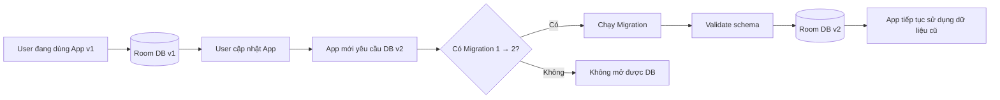
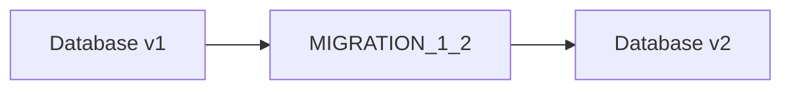
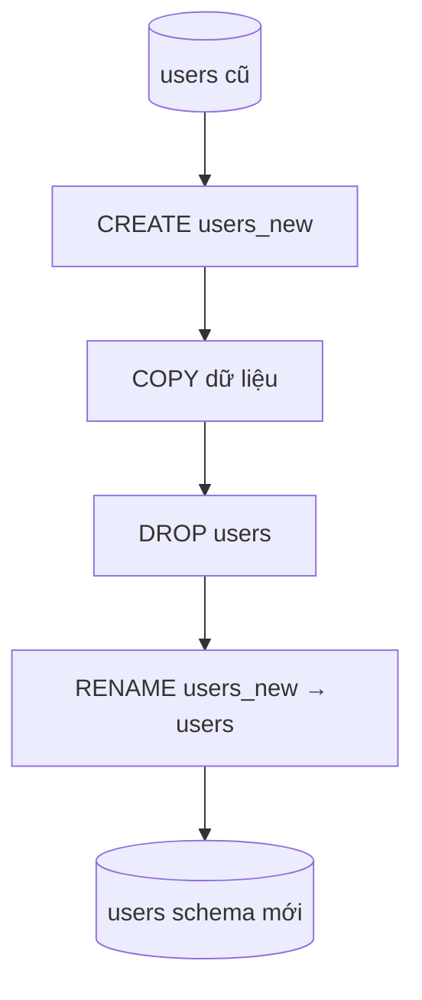
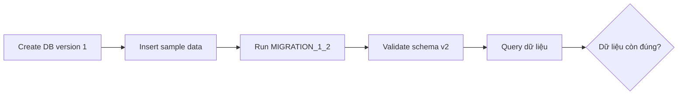
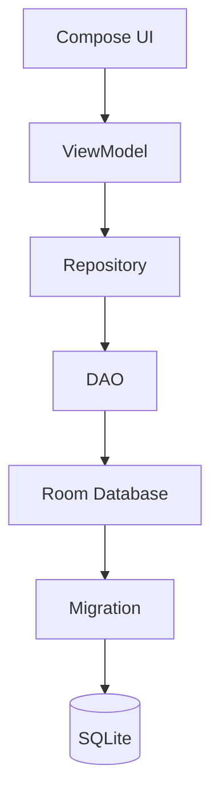

# 016 - Migration

**Học phần:** 03 - Architecture, State and Data
**Module:** Module 06 - Storage
**Nhóm nội dung:** Room Database
**Nguồn roadmap:** Storage / Room Database
**Loại bài:** Storage
**Thứ tự trong module:** 016
**Thời lượng gợi ý:** 32 phút

---

## 1. Tóm tắt

**Migration** trong Room Database là quá trình **chuyển đổi database đang tồn tại trên thiết bị từ một schema version cũ sang schema version mới mà vẫn cố gắng giữ lại dữ liệu của người dùng**.

Ví dụ:

```text
App v1
Database version = 1
User(id, name)

        ↓ cập nhật ứng dụng

App v2
Database version = 2
User(id, name, email)
```

Người dùng có thể đã lưu hàng nghìn bản ghi ở database version 1. Khi họ cập nhật ứng dụng, ta không thể đơn giản xóa database rồi tạo lại nếu dữ liệu đó quan trọng.

Room hỗ trợ cả **automatic migration** và **manual migration**. Automatic migration phù hợp với nhiều thay đổi schema đơn giản; với các thay đổi phức tạp, developer cần định nghĩa migration thủ công.

> **Ý tưởng quan trọng:** Migration không chỉ là chuyện của SQLite. Đây là vấn đề về **khả năng nâng cấp ứng dụng mà không làm mất dữ liệu người dùng**.

**Ảnh minh họa:** Bộ ảnh phía trên cho thấy Room/DAO làm lớp trung gian với SQLite và cách Android Studio Database Inspector hiển thị database thực tế trong ứng dụng.

---

## 2. Mục tiêu học tập

Sau bài này, bạn có thể:

* Giải thích được **Migration** trong Room Database.
* Hiểu vì sao cần tăng `version` của `@Database`.
* Phân biệt:

  * Manual Migration
  * Auto Migration
  * Destructive Migration
* Viết migration đơn giản từ version `1 → 2`.
* Đăng ký migration bằng `addMigrations()`.
* Hiểu migration path như:

```text
1 → 2 → 3 → 4
```

* Biết khi nào Room có thể tự tạo migration.
* Biết cách bảo vệ dữ liệu cũ.
* Test migration bằng `MigrationTestHelper`.
* Kiểm tra database bằng Android Studio Database Inspector.
* Hiểu ảnh hưởng của migration tới:

  * UX
  * offline data
  * repository
  * Flow
  * testing
  * release risk.

---

# 3. Migration là gì?

Giả sử phiên bản đầu tiên của ứng dụng có Entity:

```kotlin
@Entity(tableName = "users")
data class UserEntity(
    @PrimaryKey(autoGenerate = true)
    val id: Long = 0,

    val name: String
)
```

Database:

```kotlin
@Database(
    entities = [UserEntity::class],
    version = 1
)
abstract class AppDatabase : RoomDatabase() {

    abstract fun userDao(): UserDao
}
```

Schema lúc này có thể hình dung:

```text
users
┌────┬──────────┐
│ id │ name     │
├────┼──────────┤
│ 1  │ An       │
│ 2  │ Bình     │
│ 3  │ Khánh    │
└────┴──────────┘
```

Sau một thời gian, ứng dụng cần lưu email.

Entity được sửa thành:

```kotlin
@Entity(tableName = "users")
data class UserEntity(
    @PrimaryKey(autoGenerate = true)
    val id: Long = 0,

    val name: String,

    val email: String
)
```

Schema mong muốn:

```text
users
┌────┬──────────┬────────────────────┐
│ id │ name     │ email              │
├────┼──────────┼────────────────────┤
│ 1  │ An       │                    │
│ 2  │ Bình     │                    │
│ 3  │ Khánh    │                    │
└────┴──────────┴────────────────────┘
```

Đây chính là lúc cần **Migration**.

---

## 4. Tại sao không thể chỉ thay đổi Entity?

Database của người dùng **đã tồn tại trên thiết bị**.

Room cần biết:

```text
Schema cũ
      ↓
Phải biến đổi như thế nào?
      ↓
Schema mới
```

Nếu developer chỉ thay Entity rồi tăng:

```kotlin
version = 2
```

nhưng không cung cấp migration path phù hợp, Room có thể không mở được database.

Migration chính là lời giải cho câu hỏi:

> Làm thế nào biến database version 1 thành database version 2?

Room biểu diễn mỗi manual migration bằng `startVersion` và `endVersion`. Một migration thậm chí có thể đi qua nhiều version, ví dụ `3 → 5`.

---

# 5. Luồng Migration



Điểm quan trọng:

```text
Migration không tạo dữ liệu mới từ đầu.

Migration biến đổi dữ liệu/schema đã tồn tại.
```

---

# 6. Manual Migration

Manual Migration được sử dụng khi developer muốn tự kiểm soát SQL biến đổi database.

Ví dụ:

```text
Version 1

users
- id
- name
```

sang:

```text
Version 2

users
- id
- name
- email
```

Room hỗ trợ khai báo migration thủ công bằng lớp `Migration` và đăng ký các migration đó với database builder thông qua `addMigrations()`.

---

## 6.1. Tăng database version

```kotlin
@Database(
    entities = [UserEntity::class],
    version = 2,
    exportSchema = true
)
abstract class AppDatabase : RoomDatabase() {

    abstract fun userDao(): UserDao
}
```

Điểm thay đổi:

```diff
- version = 1
+ version = 2
```

---

## 6.2. Viết `MIGRATION_1_2`

Một cách tương thích phổ biến với Room khi dùng `SupportSQLiteDatabase`:

```kotlin
val MIGRATION_1_2 = object : Migration(1, 2) {

    override fun migrate(db: SupportSQLiteDatabase) {

        db.execSQL(
            """
            ALTER TABLE users
            ADD COLUMN email TEXT NOT NULL DEFAULT ''
            """.trimIndent()
        )
    }
}
```

Ý nghĩa:

```sql
ALTER TABLE users
ADD COLUMN email TEXT NOT NULL DEFAULT '';
```

Database:

```text
TRƯỚC

users
├── id
└── name


SAU MIGRATION

users
├── id
├── name
└── email
```

`DEFAULT ''` đặc biệt quan trọng vì các row cũ chưa có giá trị `email`.

API Room hiện nay cũng hỗ trợ migration thông qua `SQLiteConnection`; khi cấu hình database bằng `setDriver()`, Room gọi phiên bản `migrate(SQLiteConnection)`.

---

# 7. Đăng ký Migration

Migration phải được đưa vào Room builder.

```kotlin
val database = Room.databaseBuilder(
    context,
    AppDatabase::class.java,
    "app_database"
)
    .addMigrations(MIGRATION_1_2)
    .build()
```

Luồng:



Nếu database hiện tại là version `1` và ứng dụng yêu cầu version `2`, Room tìm migration path thích hợp rồi thực thi nó. `addMigrations()` có thể nhận nhiều migration và Room sẽ sử dụng chúng để đưa database tới version mới nhất.

---

# 8. Nhiều Migration liên tiếp

Ứng dụng thực tế thường tồn tại nhiều năm:

```text
v1 → v2 → v3 → v4 → v5
```

Ví dụ:

```kotlin
val MIGRATION_1_2 = object : Migration(1, 2) {
    override fun migrate(db: SupportSQLiteDatabase) {
        db.execSQL(
            "ALTER TABLE users ADD COLUMN email TEXT NOT NULL DEFAULT ''"
        )
    }
}
```

```kotlin
val MIGRATION_2_3 = object : Migration(2, 3) {
    override fun migrate(db: SupportSQLiteDatabase) {
        db.execSQL(
            "ALTER TABLE users ADD COLUMN avatarUrl TEXT"
        )
    }
}
```

```kotlin
val database = Room.databaseBuilder(
    context,
    AppDatabase::class.java,
    "app_database"
)
    .addMigrations(
        MIGRATION_1_2,
        MIGRATION_2_3
    )
    .build()
```

Nếu user đang ở version 1 và cập nhật thẳng lên version 3:

```text
v1
 ↓
MIGRATION_1_2
 ↓
v2
 ↓
MIGRATION_2_3
 ↓
v3
```

Room có khả năng tìm migration path từ các migration đã đăng ký. Room cũng cho phép một migration đi trực tiếp qua nhiều version, chẳng hạn `3 → 5`.

---

# 9. Auto Migration

Với các thay đổi schema đơn giản, Room có thể sinh migration tự động.

Ví dụ:

```kotlin
@Database(
    entities = [UserEntity::class],
    version = 2,
    autoMigrations = [
        AutoMigration(
            from = 1,
            to = 2
        )
    ]
)
abstract class AppDatabase : RoomDatabase()
```

Room hỗ trợ khai báo automatic migration thông qua thuộc tính `autoMigrations` của `@Database`.

---

## 9.1. Auto Migration hoạt động như thế nào?

Room so sánh:

```text
Schema v1
   ↓
Schema v2
   ↓
Diff
   ↓
Sinh migration code
```

Ví dụ:

```text
v1

User
├── id
└── name


v2

User
├── id
├── name
└── email
```

Nếu Room xác định được chính xác thay đổi cần thực hiện, nó có thể sinh migration.

Automatic migration phụ thuộc vào schema đã export của cả version cũ và version mới. Nếu schema không được export hoặc version mới chưa từng được compile để tạo schema, auto migration có thể thất bại.

---

# 10. AutoMigrationSpec

Có những trường hợp Room không thể tự biết developer muốn gì.

Ví dụ:

```text
v1:

username


v2:

displayName
```

Room không thể chắc chắn:

```text
username bị xóa và displayName được tạo mới?

hay

username được đổi tên thành displayName?
```

Room yêu cầu thêm thông tin.

```kotlin
@RenameColumn(
    tableName = "users",
    fromColumnName = "username",
    toColumnName = "displayName"
)
class Migration1To2Spec : AutoMigrationSpec
```

Sau đó:

```kotlin
@Database(
    entities = [UserEntity::class],
    version = 2,
    autoMigrations = [
        AutoMigration(
            from = 1,
            to = 2,
            spec = Migration1To2Spec::class
        )
    ]
)
abstract class AppDatabase : RoomDatabase()
```

Các trường hợp Room có thể cần `AutoMigrationSpec` gồm:

* rename table
* delete table
* rename column
* delete column.

Room cung cấp các annotation tương ứng như `@RenameTable`, `@DeleteTable`, `@RenameColumn` và `@DeleteColumn`.

---

# 11. Manual Migration hay Auto Migration?

| Tình huống                     | Lựa chọn                   |
| ------------------------------ | -------------------------- |
| Thêm column đơn giản           | Auto hoặc Manual           |
| Rename column                  | Auto + `AutoMigrationSpec` |
| Rename table                   | Auto + `AutoMigrationSpec` |
| Delete column                  | Auto + `AutoMigrationSpec` |
| Chuyển dữ liệu phức tạp        | Manual                     |
| Tách một table thành hai table | Manual                     |
| Gộp nhiều table                | Manual                     |
| Transform dữ liệu              | Manual                     |
| Logic SQL đặc biệt             | Manual                     |

Ví dụ việc chia dữ liệu của một table thành hai table là trường hợp Room không thể tự suy ra đầy đủ và thường cần manual migration.

Nếu bạn định nghĩa cả manual migration và auto migration cho cùng một cặp version, Room ưu tiên manual migration.

---

# 12. Migration phức tạp: tạo bảng mới rồi copy dữ liệu

SQLite không phải lúc nào cũng cho phép thay đổi table trực tiếp theo cách ta muốn.

Một chiến lược phổ biến là:

```text
Old Table
    ↓
Create New Table
    ↓
Copy Data
    ↓
Drop Old Table
    ↓
Rename New Table
```

Ví dụ:

```kotlin
val MIGRATION_2_3 = object : Migration(2, 3) {

    override fun migrate(db: SupportSQLiteDatabase) {

        db.execSQL(
            """
            CREATE TABLE users_new (
                id INTEGER PRIMARY KEY AUTOINCREMENT NOT NULL,
                name TEXT NOT NULL,
                email TEXT NOT NULL
            )
            """.trimIndent()
        )

        db.execSQL(
            """
            INSERT INTO users_new(id, name, email)
            SELECT id, name, email
            FROM users
            """.trimIndent()
        )

        db.execSQL("DROP TABLE users")

        db.execSQL(
            "ALTER TABLE users_new RENAME TO users"
        )
    }
}
```

Sơ đồ:



---

# 13. Export Schema

Đây là phần rất quan trọng khi làm Room Migration.

Room có thể export thông tin schema thành các file JSON khi compile. Các file này tạo thành lịch sử schema và rất hữu ích cho cả auto migration lẫn migration testing. Android Developers khuyến nghị lưu chúng trong version control.

Ví dụ:

```text
schemas/
└── com.example.AppDatabase/
    ├── 1.json
    ├── 2.json
    └── 3.json
```

Có thể hình dung:

```text
1.json
  ↓
2.json
  ↓
3.json
```

chính là:

```text
Lịch sử tiến hóa của database.
```

---

## 13.1. Vì sao nên commit schema?

Không nên:

```gitignore
schemas/
```

Nên:

```text
Git Repository

app/
schemas/
    1.json
    2.json
    3.json
```

Vì các schema cũ cần thiết để:

```text
Tạo DB version cũ
        ↓
Chạy migration
        ↓
So sánh với schema version mới
```

Room sử dụng exported schema cho migration testing và automatic migration generation.

---

# 14. Test Migration

Migration là code chạy trên **database thật của người dùng sau khi họ cập nhật app**.

Vì vậy nó cần được test giống production code.

Room cung cấp `MigrationTestHelper` để tạo database theo schema version cũ rồi chạy và kiểm tra migration.

Luồng test:



---

## 14.1. Logic test nên kiểm tra gì?

Ví dụ trước migration:

```text
users

id = 1
name = "An"
```

Sau migration mong đợi:

```text
id = 1
name = "An"
email = ""
```

Test không nên chỉ kiểm tra:

```text
Migration không crash
```

Mà còn phải kiểm tra:

```text
✓ Schema đúng
✓ Row vẫn tồn tại
✓ Primary key đúng
✓ Foreign key đúng
✓ Default value đúng
✓ Dữ liệu cũ không bị biến đổi sai
```

`MigrationTestHelper` có thể kiểm tra schema sau migration, nhưng tài liệu Android cũng nhấn mạnh developer vẫn cần tự xác nhận dữ liệu đã được chuyển đúng.

---

# 15. Test toàn bộ Migration Path

Giả sử production đã có:

```text
1 → 2 → 3 → 4
```

Không chỉ test:

```text
3 → 4
```

mà nên test cả đường:

```text
1 → 2 → 3 → 4
```

Vì vẫn có người dùng lâu ngày chưa cập nhật ứng dụng.

Android Developers khuyến nghị có test bao phủ toàn bộ các migration đã định nghĩa để tránh khác biệt giữa database mới tạo và database đã đi qua nhiều phiên bản migration.

---

# 16. Database Inspector

Android Studio cung cấp **Database Inspector** để developer trực tiếp xem và query database của ứng dụng đang chạy. Công cụ này hỗ trợ cả SQLite và Room.

**Ảnh minh họa:** xem các ảnh Database Inspector ở đầu bài.

Mở:

```text
Android Studio
    ↓
View
    ↓
Tool Windows
    ↓
App Inspection
    ↓
Database Inspector
```

Sau migration bạn nên kiểm tra:

```text
users
├── id
├── name
└── email
```

và chạy:

```sql
SELECT * FROM users;
```

Database Inspector có thể xem table, chạy custom SQL và chạy DAO query trong ứng dụng Room.

---

# 17. Destructive Migration

Có một lựa chọn khác:

```kotlin
Room.databaseBuilder(
    context,
    AppDatabase::class.java,
    "app_database"
)
    .fallbackToDestructiveMigration(true)
    .build()
```

Tư duy của nó là:

```text
Không tìm thấy migration
        ↓
Xóa database/table cũ
        ↓
Tạo schema mới
```

Đây **không phải phương án mặc định phù hợp cho dữ liệu quan trọng**.

Khi destructive migration được cho phép và Room không tìm thấy migration path phù hợp, Room có thể recreate database và dữ liệu trong các table bị xóa. Tài liệu Android cảnh báo rõ việc này có thể làm mất vĩnh viễn dữ liệu local của người dùng.

---

## Khi nào destructive migration có thể chấp nhận?

Ví dụ dữ liệu chỉ là cache:

```text
API
 ↓
Room cache
 ↓
UI
```

Nếu Room bị xóa:

```text
Room cache mất
      ↓
App gọi API lại
      ↓
Cache được tạo lại
```

Có thể chấp nhận.

Nhưng với:

```text
Offline notes
Draft
Todo
Expense
Diary
User-created data
```

thì việc xóa database có thể gây hậu quả nghiêm trọng cho UX.

---

# 18. Migration và Architecture

Migration nằm sâu trong **Data Layer**.



UI không cần biết:

```text
"database đang migrate từ version 4 lên 5"
```

Nó chỉ nên làm việc với:

```text
ViewModel
    ↓
Repository
    ↓
Room
```

Đây là lý do Migration thuộc trách nhiệm của persistence/data layer.

---

# 19. Migration và Lifecycle

Migration không phải state UI.

Ví dụ rotate:

```text
Activity recreation
      ↓
Compose recreate
      ↓
ViewModel tồn tại
```

không đồng nghĩa database lại migrate.

Migration gắn với quá trình Room mở database có version cũ và cần đưa nó tới schema version hiện tại.

Do đó:

```text
Migration
≠ Activity lifecycle
≠ Compose recomposition
≠ Screen rotation
```

Nhưng migration thất bại có thể khiến Repository không truy cập được database, từ đó ảnh hưởng toàn bộ UI phụ thuộc vào local data.

---

# 20. Migration và StateFlow

Giả sử DAO:

```kotlin
@Query("SELECT * FROM users")
fun observeUsers(): Flow<List<UserEntity>>
```

Repository:

```kotlin
class UserRepository(
    private val dao: UserDao
) {

    fun observeUsers(): Flow<List<UserEntity>> {
        return dao.observeUsers()
    }
}
```

ViewModel:

```kotlin
val users = repository
    .observeUsers()
    .stateIn(
        viewModelScope,
        SharingStarted.WhileSubscribed(5_000),
        emptyList()
    )
```

Luồng:

```text
SQLite
   ↓
Room
   ↓
DAO Flow
   ↓
Repository
   ↓
StateFlow
   ↓
Compose
```

Migration nằm ở đáy chuỗi.

Nếu database không mở được:

```text
Migration fail
      ↓
Room fail
      ↓
DAO unavailable
      ↓
Repository fail
      ↓
UI không có dữ liệu
```

---

# 21. Migration và Offline-first

Migration đặc biệt quan trọng với ứng dụng offline-first.

Ví dụ user có:

```text
500 notes offline
```

Sau update:

```text
App v1 → App v2
```

Migration tốt:

```text
500 notes
    ↓
Migration
    ↓
500 notes vẫn tồn tại
```

Migration sai:

```text
500 notes
    ↓
Schema error / destructive migration
    ↓
0 notes
```

Do đó migration có ảnh hưởng trực tiếp tới **data integrity và user trust**.

---

# 22. Các lỗi Migration thường gặp

## 22.1. Quên tăng version

```kotlin
@Database(
    version = 1
)
```

Entity đã đổi nhưng version vẫn giữ nguyên.

### Cách tránh

Mỗi thay đổi schema phải đặt câu hỏi:

```text
Schema có thay đổi không?

YES
 ↓
Database version có cần tăng không?
```

---

## 22.2. Tăng version nhưng quên migration

```diff
- version = 2
+ version = 3
```

nhưng chỉ có:

```text
MIGRATION_1_2
```

Không có:

```text
MIGRATION_2_3
```

---

## 22.3. Migration path bị đứt

Có:

```text
1 → 2

3 → 4
```

Nhưng thiếu:

```text
2 → 3
```

User đang ở v1:

```text
1 → 2 → ?
```

không thể đến v4.

---

## 22.4. Mất dữ liệu khi đổi table

Sai tư duy:

```text
DROP TABLE users
CREATE TABLE users
```

Nếu không copy dữ liệu:

```text
User data → mất
```

Đúng hơn:

```text
Old
 ↓
New
 ↓
Copy
 ↓
Drop Old
 ↓
Rename New
```

---

# 23. Debug Migration

Khi gặp lỗi migration:

```text
Expected:
TableInfo {...}

Found:
TableInfo {...}
```

hãy so sánh:

```text
Expected schema
vs
Actual schema
```

Kiểm tra lần lượt:

```text
Column name
Type
Nullable
Default value
Primary key
Foreign key
Index
```

Sau đó dùng Database Inspector để xem trực tiếp database đang tồn tại trên emulator/device. Database Inspector có thể inspect và query database Room trong khi app chạy.

---

# 24. Thực hành

## Mini Project: Todo Database Migration

### Version 1

```kotlin
@Entity(tableName = "tasks")
data class TaskEntity(
    @PrimaryKey(autoGenerate = true)
    val id: Long = 0,

    val title: String,

    val completed: Boolean = false
)
```

Database:

```kotlin
@Database(
    entities = [TaskEntity::class],
    version = 1
)
abstract class TaskDatabase : RoomDatabase()
```

---

## Version 2

Yêu cầu:

```text
Thêm thuộc tính priority.
```

Entity:

```kotlin
@Entity(tableName = "tasks")
data class TaskEntity(
    @PrimaryKey(autoGenerate = true)
    val id: Long = 0,

    val title: String,

    val completed: Boolean = false,

    val priority: Int = 0
)
```

Database:

```kotlin
@Database(
    entities = [TaskEntity::class],
    version = 2,
    exportSchema = true
)
abstract class TaskDatabase : RoomDatabase()
```

---

## Migration

```kotlin
val MIGRATION_1_2 = object : Migration(1, 2) {

    override fun migrate(db: SupportSQLiteDatabase) {

        db.execSQL(
            """
            ALTER TABLE tasks
            ADD COLUMN priority INTEGER NOT NULL DEFAULT 0
            """.trimIndent()
        )
    }
}
```

---

## Đăng ký

```kotlin
Room.databaseBuilder(
    context,
    TaskDatabase::class.java,
    "task_database"
)
    .addMigrations(MIGRATION_1_2)
    .build()
```

---

# 25. Test scenario

Trước update:

```text
Task #1
title = "Học Room"
completed = false
```

Sau update:

```text
Task #1
title = "Học Room"
completed = false
priority = 0
```

Điều cần chứng minh:

```text
✓ Task cũ vẫn tồn tại
✓ title không đổi
✓ completed không đổi
✓ priority nhận default = 0
✓ database schema đạt version 2
```

---

# 26. Bài tập

## Yêu cầu

Tạo một app nhỏ lưu ghi chú.

Version 1:

```text
Note
├── id
└── content
```

Version 2:

```text
Note
├── id
├── content
└── pinned
```

Thực hiện:

1. Tạo database version 1.
2. Insert ít nhất 5 ghi chú.
3. Chạy app để database thật được tạo.
4. Sửa Entity.
5. Tăng database lên version 2.
6. Viết `MIGRATION_1_2`.
7. Thêm:

```text
pinned INTEGER NOT NULL DEFAULT 0
```

8. Đăng ký migration.
9. Update app mà **không uninstall**.
10. Kiểm tra 5 ghi chú cũ vẫn tồn tại.
11. Kiểm tra bằng Database Inspector.
12. Viết migration test.

---

# 27. Artifact cho Portfolio

Có thể tạo:

```text
room-migration-demo/
├── data/
│   ├── NoteEntity.kt
│   ├── NoteDao.kt
│   ├── AppDatabase.kt
│   └── DatabaseMigrations.kt
│
├── androidTest/
│   └── MigrationTest.kt
│
├── schemas/
│   ├── 1.json
│   └── 2.json
│
└── README.md
```

README nên mô tả:

```text
Schema v1
    ↓
MIGRATION_1_2
    ↓
Schema v2
```

kèm screenshot Database Inspector trước và sau migration.

---

# 28. Checklist hoàn thành

* [ ] Giải thích được Migration là gì.
* [ ] Hiểu database schema version.
* [ ] Biết khi nào cần tăng `version`.
* [ ] Viết được `Migration(1, 2)`.
* [ ] Biết sử dụng `addMigrations()`.
* [ ] Hiểu migration path.
* [ ] Phân biệt Auto Migration và Manual Migration.
* [ ] Biết `AutoMigrationSpec`.
* [ ] Biết nguy cơ của destructive migration.
* [ ] Export database schema.
* [ ] Commit schema JSON vào Git.
* [ ] Test migration với dữ liệu mẫu.
* [ ] Test dữ liệu chứ không chỉ test schema.
* [ ] Test đường migration từ version cũ tới latest.
* [ ] Debug được database bằng Database Inspector.
* [ ] Hiểu migration nằm trong Data Layer.
* [ ] Hiểu ảnh hưởng của migration đối với offline data.

---

# 29. Ghi chú Production

Khi đưa Room Migration vào production, hãy tự hỏi:

```text
1. User nào đang sử dụng database version cũ?

2. Có migration path từ tất cả version production
   tới latest version hay chưa?

3. Dữ liệu nào tuyệt đối không được mất?

4. Default value của column mới có hợp lý không?

5. Foreign key/index có được giữ đúng không?

6. Migration có transform dữ liệu không?

7. Schema JSON đã được commit chưa?

8. Có test:
   oldest version → latest version
   hay chưa?

9. Có test với dữ liệu gần giống production chưa?

10. Có đang vô tình bật destructive migration không?
```

Đặc biệt, không nên xem:

```kotlin
fallbackToDestructiveMigration(...)
```

là cách sửa nhanh cho lỗi migration nếu database chứa dữ liệu quan trọng. Room có thể recreate database khi không tìm thấy migration path, đồng nghĩa dữ liệu local có thể bị xóa.

---

# 30. Mental Model

Hãy nhớ Migration bằng mô hình:

```text
                 APP UPDATE
                     │
                     ▼
             Database version mới
                     │
                     ▼
              Schema thay đổi
                     │
                     ▼
                MIGRATION
                     │
          ┌──────────┴──────────┐
          ▼                     ▼
      Schema mới            Data cũ
          │                     │
          └──────────┬──────────┘
                     ▼
             Database hợp lệ
                     │
                     ▼
                  Room
                     │
                     ▼
                   DAO
                     │
                     ▼
               Repository
                     │
                     ▼
                ViewModel
                     │
                     ▼
                 UI State
```

Câu ghi nhớ:

> **Migration = thay đổi cấu trúc database qua các phiên bản mà không làm mất dữ liệu cần giữ của người dùng.**

---

## 31. Tài liệu tham khảo chính

* Android Developers — **Migrate your Room database**: tài liệu chính thức về Auto Migration, Manual Migration, exported schemas và migration testing.
* AndroidX Room API — `Migration` và `RoomDatabase.Builder.addMigrations()`.
* Android Studio — **Database Inspector** để inspect, query và debug database Room.
* Ở nhánh Room AndroidX ổn định hiện được Android Developers liệt kê, bản stable là **2.8.4**; Kotlin projects được hướng dẫn sử dụng KSP cho `room-compiler`.

---

# Bài luyện tập

## Mục tiêu


## Đề bài


## Yêu cầu hoàn thành

- [ ] 
- [ ] 
- [ ] 

## Kết quả / lời giải


## Ghi chú
