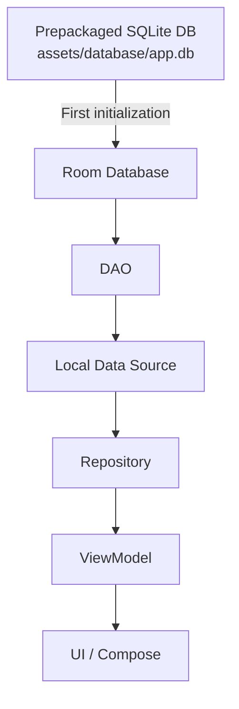
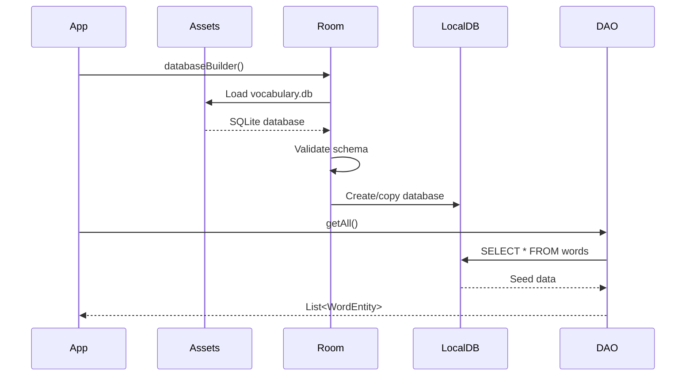
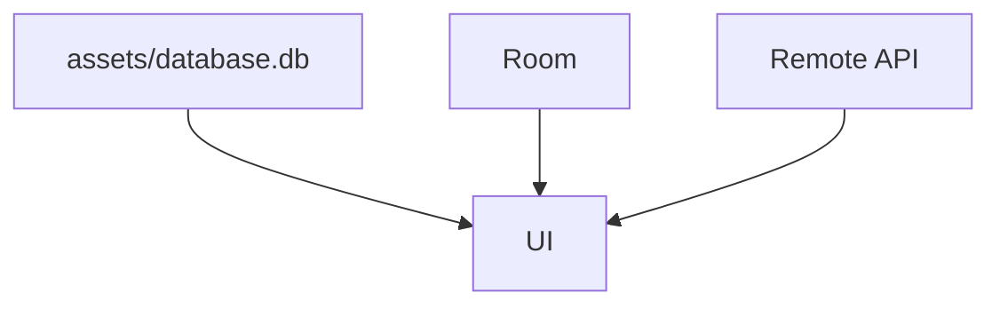
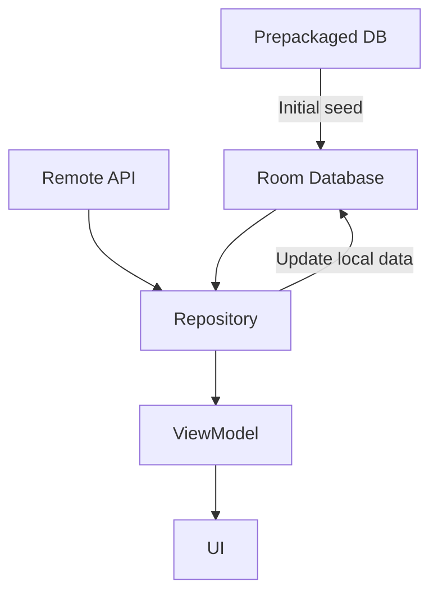
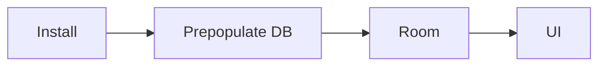
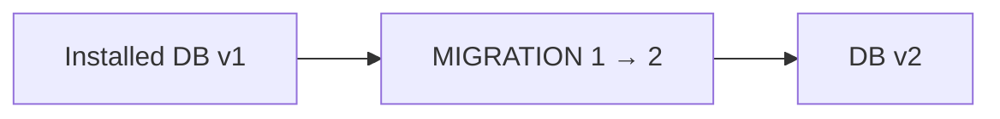
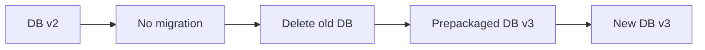
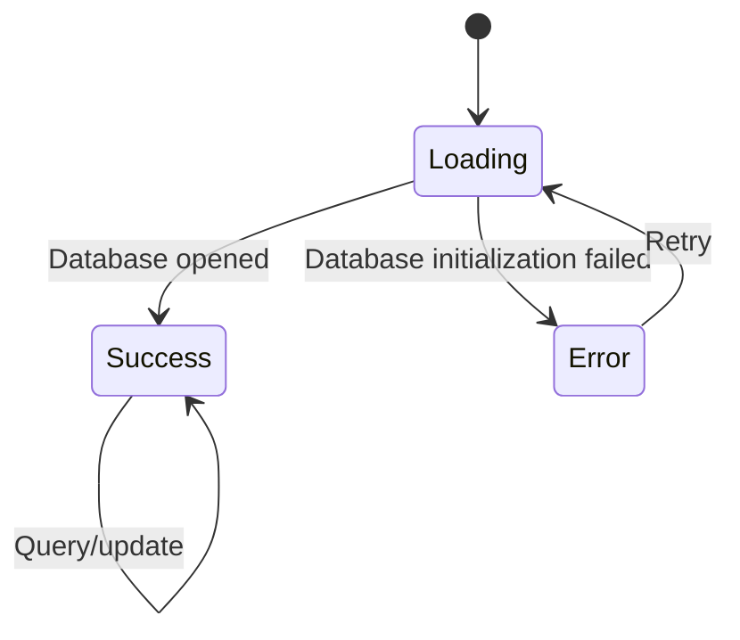
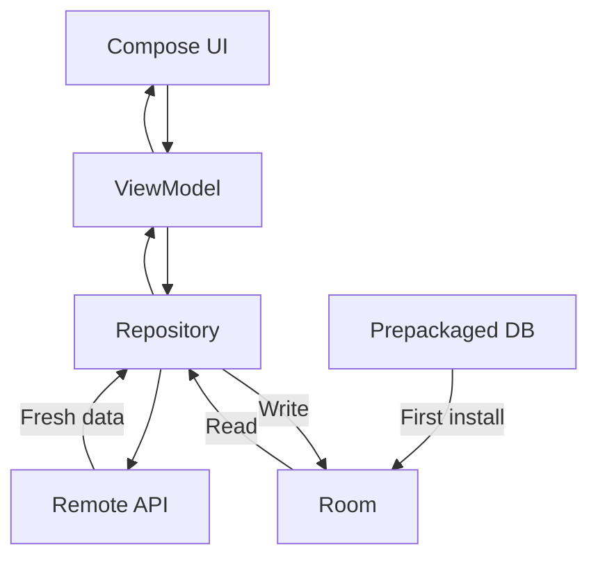
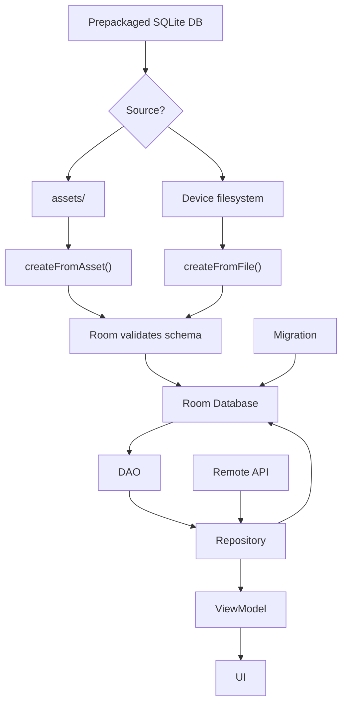

[](https://developer.android.com/training/data-storage/?utm_source=chatgpt.com)

# 017 - Prepopulate Database

**Học phần:** 03 - Architecture, State and Data
**Module:** Module 06 - Storage
**Nhóm nội dung:** Room Database
**Nguồn roadmap:** Storage / Room Database
**Loại bài:** Storage
**Thứ tự trong module:** 017
**Thời lượng gợi ý:** 32 phút

---

## 1. Tóm tắt

**Prepopulate Database** là kỹ thuật tạo Room Database với **một tập dữ liệu ban đầu đã có sẵn**, thay vì để database hoàn toàn rỗng khi người dùng cài ứng dụng lần đầu.

Ví dụ:

* App từ điển có sẵn 5.000 từ.
* App học ngoại ngữ có sẵn danh sách bài học.
* App bản đồ offline có sẵn danh mục địa điểm.
* App bán hàng có sẵn danh mục loại sản phẩm.
* Game có sẵn danh sách item, level hoặc thông số cấu hình.

Room hỗ trợ khởi tạo database từ một file SQLite được đóng gói sẵn trong `assets/` bằng `createFromAsset()`, hoặc từ một file trên filesystem bằng `createFromFile()`. Room sẽ kiểm tra schema của database đóng gói để đảm bảo nó tương thích với schema mà ứng dụng khai báo. ([Android Developers][1])

---

## 2. Mục tiêu học tập

Sau bài này, bạn nên có thể:

* Giải thích được **Prepopulate Database** là gì.
* Phân biệt prepopulate với việc `INSERT` dữ liệu bình thường.
* Biết khi nào nên sử dụng `createFromAsset()`.
* Biết khi nào nên sử dụng `createFromFile()`.
* Hiểu mối quan hệ giữa prepopulate và **Migration**.
* Hiểu dữ liệu local nên nằm ở đâu trong kiến trúc Repository/ViewModel/UI.
* Biết cách kiểm tra dữ liệu seed bằng **Database Inspector**.
* Viết được một Room Database nhỏ có dữ liệu mặc định.
* Biết các rủi ro production như schema mismatch, database quá lớn và destructive migration.

---

# 3. Prepopulate Database là gì?

Thông thường, khi Room tạo database lần đầu:

```text
Install app
    ↓
Create empty database
    ↓
Create tables
    ↓
Database ban đầu rỗng
```

Nếu sử dụng **prepopulate**:

```text
Install app
    ↓
App chứa sẵn SQLite database
    ↓
Room copy database
    ↓
Validate schema
    ↓
App có dữ liệu ngay
```

Android định nghĩa prepopulation là trường hợp ứng dụng bắt đầu với một database đã được nạp sẵn một tập dữ liệu cụ thể. `createFromAsset()` và `createFromFile()` được gọi trên `RoomDatabase.Builder` trước `build()`. Database Room chạy hoàn toàn trong memory không hỗ trợ hai API prepopulate này. ([Android Developers][1])

---

## 4. Prepopulate nằm ở đâu trong kiến trúc Android?

Room bao gồm ba thành phần chính:

1. **Database class**
2. **Entity**
3. **DAO**

DAO là lớp mà phần còn lại của ứng dụng sử dụng để đọc và ghi dữ liệu, trong khi database class là điểm truy cập vào database. ([Android Developers][2])

### Ảnh minh họa: kiến trúc Room


*Hình: Kiến trúc Room chính thức từ Android Developers.* 

Trong kiến trúc ứng dụng hoàn chỉnh, prepopulate chỉ là **nguồn tạo dữ liệu ban đầu**.



Điểm quan trọng:

> UI không nên đọc trực tiếp file database nằm trong `assets/`.

Sau khi Room khởi tạo database, UI chỉ cần làm việc qua luồng thông thường:

```text
UI
 ↓
ViewModel
 ↓
Repository
 ↓
DAO
 ↓
Room
```

---

# 5. Ví dụ thực tế

Giả sử xây dựng app:

> **Vocabulary Offline**

Ngay sau khi cài, người dùng phải thấy các từ:

| ID | Word     | Meaning       |
| -: | -------- | ------------- |
|  1 | apple    | quả táo       |
|  2 | banana   | quả chuối     |
|  3 | computer | máy tính      |
|  4 | database | cơ sở dữ liệu |

Nếu không prepopulate:

```text
Database ban đầu
└── words
    └── EMPTY
```

App sẽ phải tải dữ liệu từ server hoặc tự `INSERT`.

Nếu prepopulate:

```text
assets/database/vocabulary.db
            ↓
          Room
            ↓
          words
        ├── apple
        ├── banana
        ├── computer
        └── database
```

Ứng dụng có thể cung cấp nội dung cơ bản ngay cả khi thiết bị không có mạng. Room nói chung phù hợp cho việc lưu dữ liệu có cấu trúc local và cache dữ liệu để người dùng vẫn có thể truy cập nội dung khi offline. ([Android Developers][2])

---

# 6. Cấu trúc project

Một cấu trúc đơn giản:

```text
app/
└── src/
    └── main/
        ├── assets/
        │   └── database/
        │       └── vocabulary.db
        │
        └── java/com/example/vocabulary/
            └── data/
                ├── local/
                │   ├── WordEntity.kt
                │   ├── WordDao.kt
                │   └── AppDatabase.kt
                │
                └── repository/
                    └── WordRepository.kt
```

File quan trọng nhất:

```text
app/src/main/assets/database/vocabulary.db
```

Đây phải là **SQLite database thật**, không phải:

```text
words.json
```

hoặc:

```text
words.sql
```

khi sử dụng trực tiếp với `createFromAsset()`.

---

# 7. Tạo Entity

```kotlin
@Entity(tableName = "words")
data class WordEntity(
    @PrimaryKey
    val id: Int,

    val word: String,

    val meaning: String
)
```

Schema SQLite tương ứng về mặt ý tưởng:

```sql
CREATE TABLE words (
    id INTEGER NOT NULL,
    word TEXT NOT NULL,
    meaning TEXT NOT NULL,
    PRIMARY KEY(id)
);
```

Điều rất quan trọng là schema của file SQLite đóng gói phải phù hợp với schema Room mong đợi. Khi sử dụng `createFromAsset()` hoặc `createFromFile()`, Room thực hiện validation schema. Android Developers khuyến nghị export Room schema để dùng làm tham chiếu khi tạo database đóng gói. ([Android Developers][1])

---

# 8. Tạo DAO

```kotlin
@Dao
interface WordDao {

    @Query("SELECT * FROM words ORDER BY word ASC")
    suspend fun getAll(): List<WordEntity>

    @Query("SELECT * FROM words WHERE id = :id")
    suspend fun findById(id: Int): WordEntity?

    @Query(
        """
        SELECT * FROM words
        WHERE word LIKE '%' || :query || '%'
        ORDER BY word ASC
        """
    )
    suspend fun search(query: String): List<WordEntity>
}
```

DAO là API mà phần còn lại của ứng dụng sử dụng để query, insert, update và delete dữ liệu Room. ([Android Developers][2])

Ngoài ra, Room không cho phép database access thông thường chặn main thread; DAO nên sử dụng các API bất đồng bộ như coroutine `suspend` hoặc các observable phù hợp. ([Android Developers][3])

---

# 9. Tạo Room Database

```kotlin
@Database(
    entities = [
        WordEntity::class
    ],
    version = 1,
    exportSchema = true
)
abstract class AppDatabase : RoomDatabase() {

    abstract fun wordDao(): WordDao
}
```

Nên bật:

```kotlin
exportSchema = true
```

đặc biệt khi project bắt đầu có:

```text
Prepopulate
+
Migration
+
Production releases
```

Schema export giúp kiểm tra database đóng gói và hỗ trợ việc test migration. Room migration testing dựa trên các schema đã export. ([Android Developers][4])

---

# 10. Prepopulate bằng `createFromAsset()`

Đây là cách thường gặp nhất.

Giả sử:

```text
assets/
└── database/
    └── vocabulary.db
```

Khởi tạo:

```kotlin
val database = Room.databaseBuilder<AppDatabase>(
    context,
    "vocabulary.db"
)
    .createFromAsset(
        "database/vocabulary.db"
    )
    .build()
```

`createFromAsset()` nhận **đường dẫn tương đối tính từ thư mục `assets/`**. Room sử dụng database đóng gói này khi khởi tạo database. ([Android Developers][1])

Ví dụ:

```text
assets/database/vocabulary.db
```

thì:

```kotlin
.createFromAsset(
    "database/vocabulary.db"
)
```

Không phải:

```kotlin
.createFromAsset(
    "assets/database/vocabulary.db"
)
```

---

## Luồng hoạt động



---

# 11. `createFromAsset()` không chạy lại mỗi lần mở app

Một lỗi tư duy khá phổ biến là tưởng rằng:

```text
Launch app
↓
copy asset database

Launch app
↓
copy lại database

Launch app
↓
copy lại database
```

Không phải.

Prepopulate được sử dụng để **khởi tạo database**. Sau đó ứng dụng làm việc với database local đã được tạo. ([Android Developers][1])

Ví dụ:

### Lần đầu

```text
assets DB

apple
banana
computer

        ↓

local Room DB

apple
banana
computer
```

Người dùng thêm:

```text
developer
```

Database local:

```text
apple
banana
computer
developer
```

### Mở app lần sau

Không nên quay về:

```text
apple
banana
computer
```

mà vẫn là:

```text
apple
banana
computer
developer
```

Đây là lý do không nên viết logic seed kiểu:

```kotlin
fun onAppLaunch() {
    dao.insert(defaultWords)
}
```

nếu logic đó không được thiết kế idempotent.

---

# 12. Prepopulate bằng `createFromFile()`

Không phải database lúc nào cũng được đóng sẵn trong APK.

Ví dụ:

```text
Server
   ↓
download
   ↓
/files/data/vocabulary.db
   ↓
Room
```

Có thể sử dụng:

```kotlin
val prepackagedFile =
    File(context.filesDir, "vocabulary.db")

val database = Room.databaseBuilder<AppDatabase>(
    context,
    "vocabulary.db"
)
    .createFromFile(prepackagedFile)
    .build()
```

Android Developers ghi rõ rằng với `createFromFile()`, Room tạo **một bản sao** của file chỉ định thay vì mở trực tiếp file đó; ứng dụng vì vậy cần có quyền đọc file nguồn. ([Android Developers][1])

---

# 13. `createFromAsset()` vs `createFromFile()`

| Đặc điểm          | `createFromAsset()`           | `createFromFile()`            |
| ----------------- | ----------------------------- | ----------------------------- |
| Nguồn             | APK / App Bundle              | Filesystem                    |
| File              | Đóng gói cùng app             | Có sẵn trên thiết bị          |
| Use case          | Dữ liệu mặc định              | Database import/download      |
| Internet          | Không cần                     | Có thể cần nếu download trước |
| Schema validation | Có                            | Có                            |
| Thích hợp         | Từ điển, catalog, game config | Import DB, dataset tải ngoài  |

Cả hai phương pháp đều được Room hỗ trợ cho prepackaged databases và đều thực hiện kiểm tra schema. ([Android Developers][1])

---

# 14. Prepopulate bằng code

Không phải lúc nào cũng cần đóng gói nguyên một SQLite database.

Nếu chỉ có:

```text
3
10
20
```

record mặc định, có thể thiết kế logic insert dữ liệu khi database được tạo.

Ví dụ về mặt ý tưởng:

```text
Database created
      ↓
onCreate callback
      ↓
INSERT default data
```

Trong Room hiện đại, database callback vẫn là một cơ chế lifecycle của database. Với hướng Room 3.x, callback và migration đã chuyển sang API dựa trên `SQLiteConnection`; callback trong Room 3 cũng trở thành `suspend`. ([Android Developers][5])

### Nên dùng cách nào?

```text
Dữ liệu rất nhỏ
        ↓
Seed bằng code

Dữ liệu hàng nghìn record
        ↓
Prepackaged database
        ↓
createFromAsset()
```

Ví dụ 5 category:

```text
Work
Study
Personal
Travel
Other
```

seed bằng code có thể dễ quản lý.

Nhưng:

```text
50.000 từ tiếng Anh
```

thì prepackaged SQLite DB thường hợp lý hơn.

---

# 15. Prepopulate và Single Source of Truth

Một kiến trúc không tốt:



UI đang nhận dữ liệu từ ba nguồn khác nhau.

Điều này dễ tạo:

```text
Asset nói A
Room nói B
API nói C
```

---

## Kiến trúc tốt hơn



Sau bước khởi tạo:

> **Room trở thành nguồn dữ liệu local mà app đọc.**

File asset chỉ nên được xem như:

```text
INITIAL SEED
```

chứ không phải:

```text
SECOND DATA SOURCE
```

---

# 16. Offline-first

Một use case rất mạnh của prepopulation là offline.

Ví dụ ứng dụng từ điển:



Ngay cả khi:

```text
Wi-Fi = OFF
Mobile data = OFF
```

người dùng vẫn có:

```text
Dictionary
Lesson catalog
Reference data
Static content
```

Room nói chung phù hợp để cache các phần dữ liệu cần thiết để người dùng vẫn có thể duyệt nội dung khi thiết bị không có kết nối mạng. ([Android Developers][2])

---

# 17. Prepopulate và Migration

Đây là phần quan trọng nhất khi đưa tính năng này lên production.

Giả sử:

```text
App v1
Room DB version = 1
```

Sau đó release:

```text
App v2
Room DB version = 2
```

Thiết bị người dùng đang có database:

```text
Version 1
```

trong khi app mới yêu cầu:

```text
Version 2
```

Lúc này **Migration** mới là thứ quyết định dữ liệu người dùng được xử lý thế nào.

---

## Trường hợp có migration



Ví dụ:

```kotlin
Room.databaseBuilder<AppDatabase>(
    context,
    "vocabulary.db"
)
    .createFromAsset("database/vocabulary.db")
    .addMigrations(MIGRATION_1_2)
    .build()
```

Nếu Room tìm thấy migration path hợp lệ, Room chạy migration trên database hiện có và **giữ dữ liệu người dùng**; prepackaged database không thay thế database hiện có trong trường hợp migration bình thường này. ([Android Developers][1])

---

# 18. Destructive migration + Prepopulate

Giả sử:

```text
Installed DB = version 2

Target DB = version 3

No MIGRATION_2_3
```

và app dùng:

```kotlin
.fallbackToDestructiveMigration()
```

Room có thể:



Android Developers mô tả rằng nếu destructive fallback xảy ra và có prepackaged database phù hợp với target version, Room có thể tái tạo database bằng nội dung từ prepackaged database đó thay vì tạo database rỗng. ([Android Developers][1])

Điều này rất tiện nhưng cũng rất nguy hiểm với dữ liệu người dùng.

Ví dụ:

```text
User saved:

favorite = true
notes = "Quan trọng"
progress = 85%

         ↓ destructive migration

DỮ LIỆU CÓ THỂ MẤT
```

Vì vậy:

> Không nên xem `fallbackToDestructiveMigration()` là cách thay thế cho migration production đối với dữ liệu quan trọng.

---

# 19. Tình huống multi-step migration

Ví dụ:

```text
Installed database
v2

↓

No migration 2 → 3

↓

Prepackaged database
v3

↓

Migration
3 → 4

↓

Target database
v4
```

Room có thể kết hợp prepackaged database và migration trong chuỗi nhiều bước như trên khi configuration phù hợp. Android Developers đưa ra chính tình huống v2 → prepackaged v3 → migration v4 trong tài liệu chính thức. ([Android Developers][1])

---

# 20. Prepopulate không phải UI State

Không nên nhầm:

```text
Prepopulate DB
```

với:

```text
Compose remember
SavedStateHandle
ViewModel state
```

Database là **persistent data**.

Ví dụ:

```text
Room
    ↓
Repository
    ↓
ViewModel
    ↓
UiState
    ↓
Compose
```

Nếu Activity bị rotate:

```text
Portrait
   ↓
Activity recreation
   ↓
Landscape
```

Room database không cần được prepopulate lại.

Tương tự:

```text
Process killed
↓
Open app again
↓
Existing Room DB
```

Database persisted trên thiết bị tiếp tục tồn tại cho tới khi bị xóa, app bị uninstall hoặc logic database thay đổi.

---

# 21. Không seed database trong UI

### Không nên

```kotlin
@Composable
fun HomeScreen() {

    // Không làm thế này
    repository.insertDefaultWords()

}
```

Composable có thể được gọi lại nhiều lần.

Kết quả:

```text
apple
banana

Recomposition

apple
banana
apple
banana
```

---

## Nên

Database initialization thuộc:

```text
Data Layer
```

không phải:

```text
UI Layer
```

Luồng phù hợp:

```text
Application / DI
       ↓
Database Provider
       ↓
Room
       ↓
Repository
       ↓
ViewModel
       ↓
Compose
```

---

# 22. Threading

Database operations có thể tốn thời gian.

Không nên nghĩ:

```text
Main Thread
    ↓
Copy huge database
    ↓
Query 100k rows
    ↓
Render UI
```

DAO queries cần sử dụng cơ chế bất đồng bộ thích hợp; tài liệu Room nêu rõ database access không nên block UI thread và Room có tích hợp cho asynchronous query execution. ([Android Developers][3])

Ví dụ:

```kotlin
suspend fun getWords(): List<WordEntity> {
    return wordDao.getAll()
}
```

Trong ViewModel:

```kotlin
viewModelScope.launch {

    val words =
        repository.getWords()

    // update UI state
}
```

---

# 23. Xử lý Loading / Error

Prepopulate không có nghĩa UI sẽ luôn instant.

Có thể thiết kế:

```kotlin
sealed interface WordUiState {

    data object Loading : WordUiState

    data class Success(
        val words: List<WordEntity>
    ) : WordUiState

    data class Error(
        val message: String
    ) : WordUiState
}
```

Luồng:



Những lỗi cần nghĩ đến gồm:

```text
Asset không tồn tại
Schema không tương thích
Database bị corrupt
Migration thiếu
Disk/storage issue
```

Đặc biệt, schema mismatch cần được phát hiện trước khi release vì Room validate prepackaged schema. ([Android Developers][1])

---

# 24. Ví dụ Repository

```kotlin
class WordRepository(
    private val wordDao: WordDao
) {

    suspend fun getWords(): List<WordEntity> {
        return wordDao.getAll()
    }

    suspend fun search(
        query: String
    ): List<WordEntity> {
        return wordDao.search(query)
    }
}
```

Prepopulation hoàn toàn bị ẩn khỏi Repository.

Repository không cần biết rằng database ban đầu được tạo từ:

```text
assets/database/vocabulary.db
```

Nó chỉ biết:

```text
WordDao
```

Đây chính là lợi ích của separation of concerns.

---

# 25. UI đọc local hay remote?

Một kiến trúc offline-first thường có dạng:



Một nguyên tắc dễ nhớ:

```text
Remote API
   ↓
Repository
   ↓
Room
   ↓
UI
```

thay vì:

```text
Remote API ─────→ UI
Room ───────────→ UI
Asset ──────────→ UI
```

---

# 26. Version note cho Android/Room 2026

Tài liệu Android hiện tại đã có **Room 3.x**. Hướng dẫn setup hiện liệt kê Room `3.0.1`, sử dụng artifact `androidx.room3:*` và KSP. Room 3 cũng chuyển core API sang SQLite Driver/`SQLiteConnection` và thay đổi callback/migration APIs. ([Android Developers][2])

Vì vậy khi đọc code trên Internet cần để ý:

### Room 2.x

```text
androidx.room.*
SupportSQLiteDatabase
```

### Room 3.x

```text
androidx.room3.*
SQLiteConnection
```

Nhưng ý tưởng:

```kotlin
.createFromAsset(...)
```

và:

```kotlin
.createFromFile(...)
```

vẫn là các API cốt lõi để làm việc với prepackaged database trong hướng dẫn prepopulate hiện hành. ([Android Developers][1])

---

# 27. Debug bằng Database Inspector

Một trong những cách nhanh nhất để kiểm tra prepopulate là:

```text
Run app
↓
Android Studio
↓
View
↓
Tool Windows
↓
App Inspection
↓
Database Inspector
```

Database Inspector có thể inspect, query và chỉnh sửa SQLite/Room database trong lúc app đang chạy. ([Android Developers][6])

### Ảnh minh họa


*Hình: Database Inspector trong Android Studio.* 

Bạn có thể kiểm tra:

```sql
SELECT *
FROM words;
```

Mong đợi:

```text
1 | apple    | quả táo
2 | banana   | quả chuối
3 | computer | máy tính
4 | database | cơ sở dữ liệu
```

Database Inspector cũng cho phép chạy custom SQL và các DAO query hỗ trợ trực tiếp trong IDE. ([Android Developers][6])

---

# 28. Test Prepopulate Database

Không nên chỉ test:

> “App mở được.”

Cần test chính database.

---

## Test 1 — First install

```text
Given:
App chưa có database

When:
Database được mở

Then:
Seed data tồn tại
```

Pseudo test:

```kotlin
@Test
fun database_shouldContainInitialWords() =
    runTest {

        val words =
            database
                .wordDao()
                .getAll()

        assertTrue(
            words.isNotEmpty()
        )
    }
```

---

## Test 2 — Verify known record

```kotlin
@Test
fun database_shouldContainApple() =
    runTest {

        val word =
            database
                .wordDao()
                .findById(1)

        assertEquals(
            "apple",
            word?.word
        )
    }
```

---

# 29. Test migration

Một production test quan trọng:

```text
Create DB version 1
        ↓
Insert realistic user data
        ↓
Upgrade version 2
        ↓
Run migration
        ↓
Verify schema
        ↓
Verify user data
```

Room cung cấp tooling riêng cho migration tests; tài liệu chính thức cảnh báo migration sai có thể làm app crash và khuyến nghị test migration trước khi release. ([Android Developers][7])

---

# 30. Test schema mismatch

Ví dụ Entity:

```kotlin
val meaning: String
```

nhưng database asset lại có:

```sql
meaning INTEGER
```

hoặc:

```text
Room expects:

meaning TEXT NOT NULL

Asset contains:

meaning TEXT NULL
```

Đây là loại lỗi mà schema validation phải phát hiện. Room thực hiện schema validation khi prepopulate từ asset hoặc file. ([Android Developers][1])

Do đó cần test:

```text
APK release candidate
+
production database asset
+
actual Room schema
```

chứ không chỉ test Entity riêng lẻ.

---

# 31. Test offline

Một test rất phù hợp với prepopulation:

```text
Install fresh app

↓

Disable Wi-Fi

↓

Disable mobile network

↓

Launch app

↓

Open dictionary

↓

Seed data vẫn hiển thị
```

Nếu tính năng này là mục tiêu của thiết kế offline-first, UI không nên phụ thuộc vào network chỉ để hiển thị dữ liệu đã tồn tại trong Room.

---

# 32. Các lỗi phổ biến

## 32.1 Sai đường dẫn asset

Sai:

```kotlin
.createFromAsset(
    "assets/database/vocabulary.db"
)
```

Đúng:

```kotlin
.createFromAsset(
    "database/vocabulary.db"
)
```

Đường dẫn được tính tương đối từ `assets/`. ([Android Developers][1])

---

## 32.2 Schema không giống Room

```text
Entity

id INTEGER NOT NULL
```

nhưng:

```text
Prepackaged DB

id TEXT
```

Có thể làm database initialization thất bại vì validation.

---

## 32.3 Quên update database version

Ví dụ:

```kotlin
@Database(
    version = 2
)
```

nhưng database asset:

```text
user_version = 1
```

Version và migration strategy cần được quản lý thống nhất.

---

## 32.4 Tưởng prepopulate là migration

Sai:

```text
Prepopulate = Migration
```

Đúng:

```text
Prepopulate
=
Initial data

Migration
=
Transform an existing database version
```

Hai khái niệm có thể kết hợp nhưng không giống nhau.

---

## 32.5 Seed lại mỗi lần mở app

Sai:

```text
Activity.onCreate
    ↓
insertDefaultData()
```

Có thể gây duplicate data.

---

# 33. Performance

Ví dụ database asset:

```text
1 MB
```

thường khác hoàn toàn với:

```text
1 GB
```

Vì prepackaged database trở thành một phần dữ liệu phải được phân phối và khởi tạo cho ứng dụng, database càng lớn thì càng cần quan tâm tới:

```text
App/package size
Storage
Initial database creation
Startup UX
Memory/query strategy
Indexes
```

Với dataset cực lớn, cần cân nhắc chiến lược khác như tải theo nhu cầu hoặc chia dataset thay vì bundling toàn bộ dữ liệu.

---

# 34. Security

Không nên nghĩ:

```text
assets/
=
secret storage
```

Ví dụ không nên đóng gói:

```text
API key
Private encryption key
Database password
Sensitive server credentials
```

vào prepackaged SQLite database chỉ vì người dùng bình thường không nhìn thấy trực tiếp file.

Prepopulation phù hợp hơn cho:

```text
Public catalog
Static reference data
Dictionary
Game configuration
Offline content
```

---

# 35. Production checklist

Trước release nên kiểm tra:

* [ ] File prepackaged database có tồn tại.
* [ ] Đường dẫn `createFromAsset()` chính xác.
* [ ] Schema của asset khớp với Room Entity.
* [ ] Database version chính xác.
* [ ] Đã export Room schema.
* [ ] Migration path đã được test.
* [ ] Không vô tình dùng destructive migration cho dữ liệu quan trọng.
* [ ] First-install flow đã test.
* [ ] Upgrade-existing-user flow đã test.
* [ ] Offline mode đã test.
* [ ] Dữ liệu seed không bị duplicate.
* [ ] DAO query không block UI thread.
* [ ] Database không được tạo lại khi rotate.
* [ ] UI không truy cập trực tiếp asset.
* [ ] Repository/Room giữ vai trò source of truth phù hợp.
* [ ] Database asset không chứa secret.
* [ ] Kiểm tra kích thước database trước khi release.

---

# 36. Thực hành — Mini Project

## Yêu cầu

Xây dựng:

> **Offline Vocabulary App**

Có sẵn:

```text
20 từ tiếng Anh
```

trong:

```text
assets/database/vocabulary.db
```

---

## Bước 1 — Entity

```kotlin
@Entity(tableName = "words")
data class WordEntity(
    @PrimaryKey
    val id: Int,
    val word: String,
    val meaning: String
)
```

---

## Bước 2 — DAO

```kotlin
@Dao
interface WordDao {

    @Query(
        "SELECT * FROM words ORDER BY word"
    )
    suspend fun getWords(): List<WordEntity>
}
```

---

## Bước 3 — Database

```kotlin
@Database(
    entities = [
        WordEntity::class
    ],
    version = 1,
    exportSchema = true
)
abstract class AppDatabase :
    RoomDatabase() {

    abstract fun wordDao(): WordDao
}
```

---

## Bước 4 — Prepopulate

```kotlin
val db =
    Room.databaseBuilder<AppDatabase>(
        applicationContext,
        "vocabulary.db"
    )
        .createFromAsset(
            "database/vocabulary.db"
        )
        .build()
```

---

## Bước 5 — Read

```kotlin
val words =
    db.wordDao()
        .getWords()
```

---

## Bước 6 — UI

```text
Vocabulary
────────────────────────

apple
quả táo

banana
quả chuối

computer
máy tính

database
cơ sở dữ liệu
```

---

# 37. Bài tập

### Bài tập chính

Tạo ứng dụng có một entity:

```text
Category
```

Database được đóng gói sẵn với:

```text
1 | Work
2 | Study
3 | Personal
4 | Travel
```

Sau đó:

1. Prepopulate database bằng `createFromAsset()`.
2. Query toàn bộ category.
3. Hiển thị bằng Compose `LazyColumn`.
4. Tắt Internet và xác nhận app vẫn hoạt động.
5. Thêm category mới:

   ```text
   Fitness
   ```
6. Đóng app rồi mở lại.
7. Xác nhận `Fitness` vẫn tồn tại.
8. Dùng Database Inspector kiểm tra table.
9. Nâng database từ version `1` → `2`.
10. Thêm column:

    ```text
    icon TEXT
    ```
11. Viết migration.
12. Xác nhận dữ liệu cũ không mất.

---

# 38. Artifact đưa vào portfolio

Có thể tạo một project nhỏ:

```text
room-prepopulate-demo/
```

README:

```markdown
# Room Prepopulate Demo

## Features

- Room Database
- Prepackaged SQLite database
- createFromAsset()
- DAO
- Repository
- Offline data
- Migration
- Migration tests
- Database Inspector verification

## Architecture

UI
↓
ViewModel
↓
Repository
↓
DAO
↓
Room
↑
Prepackaged database
```

Screenshot portfolio nên có:

```text
1. App UI hiển thị seed data
2. Database Inspector
3. assets/database/app.db
4. Entity
5. DAO
6. createFromAsset()
7. Migration test
```

---

# 39. Sơ đồ tổng kết



---

# 40. Mental model

Hãy nhớ công thức:

```text
Prepopulate
=
Give Room initial data
```

không phải:

```text
Prepopulate
=
Insert defaults every app launch
```

Và:

```text
Prepackaged DB
        ↓
      Room
        ↓
      DAO
        ↓
   Repository
        ↓
    ViewModel
        ↓
       UI
```

Khi database version thay đổi:

```text
Existing Room DB
       ↓
    Migration
       ↓
New Room DB version
```

---

# 41. Checklist hoàn thành

* [ ] Giải thích được Prepopulate Database.
* [ ] Phân biệt prepopulate và normal insert.
* [ ] Biết sử dụng `createFromAsset()`.
* [ ] Biết mục đích của `createFromFile()`.
* [ ] Hiểu prepackaged SQLite database.
* [ ] Biết schema của asset phải tương thích với Room.
* [ ] Hiểu prepopulate chỉ chủ yếu liên quan tới initialization.
* [ ] Không seed dữ liệu từ UI.
* [ ] Hiểu mối quan hệ với Repository.
* [ ] Hiểu Single Source of Truth.
* [ ] Hiểu offline use case.
* [ ] Hiểu interaction với Migration.
* [ ] Biết rủi ro destructive migration.
* [ ] Test first install.
* [ ] Test upgrade.
* [ ] Test offline.
* [ ] Kiểm tra database bằng Database Inspector.
* [ ] Có mini project đưa vào portfolio.

---

# 42. Ghi chú sản xuất

Khi đưa **Prepopulate Database** vào production, bốn câu hỏi quan trọng nhất là:

```text
1. Database mới cài có đúng dữ liệu không?

2. Người dùng cũ upgrade app có mất dữ liệu không?

3. Schema asset có khớp schema Room không?

4. Room có thực sự là source of truth
   hay UI đang đọc nhiều nguồn dữ liệu khác nhau?
```

Nếu trả lời rõ được bốn câu trên và có test bảo vệ chúng, prepopulation sẽ trở thành một phần rất hữu ích của kiến trúc local/offline thay vì chỉ là cách “nhét dữ liệu mẫu” vào app. Room hỗ trợ kiểm thử migration và Android Studio cung cấp Database Inspector để kiểm tra/query database đang chạy, nên cả hai nên nằm trong workflow kiểm thử trước release. ([Android Developers][7])

[1]: https://developer.android.com/training/data-storage/room/prepopulate "Prepopulate your Room database  |  App data and files  |  Android Developers"
[2]: https://developer.android.com/training/data-storage/room "Save data in a local database using Room  |  App data and files  |  Android Developers"
[3]: https://developer.android.com/training/data-storage/room/async-queries?utm_source=chatgpt.com "Write asynchronous DAO queries | App data and files"
[4]: https://developer.android.com/training/data-storage/room/migrating-db-versions?utm_source=chatgpt.com "Migrate your Room database | App data and files"
[5]: https://developer.android.com/training/data-storage/room/migration-2-to-3 "Migrate from Room 2.x to Room 3.0  |  App data and files  |  Android Developers"
[6]: https://developer.android.com/studio/inspect/database "Debug your database with the Database Inspector  |  Android Studio  |  Android Developers"
[7]: https://developer.android.com/training/data-storage/room/testing-db "Test and debug your database  |  App data and files  |  Android Developers"
