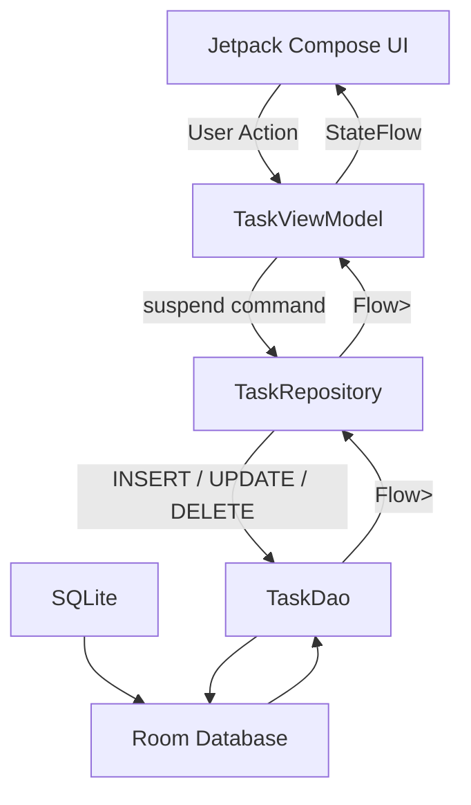
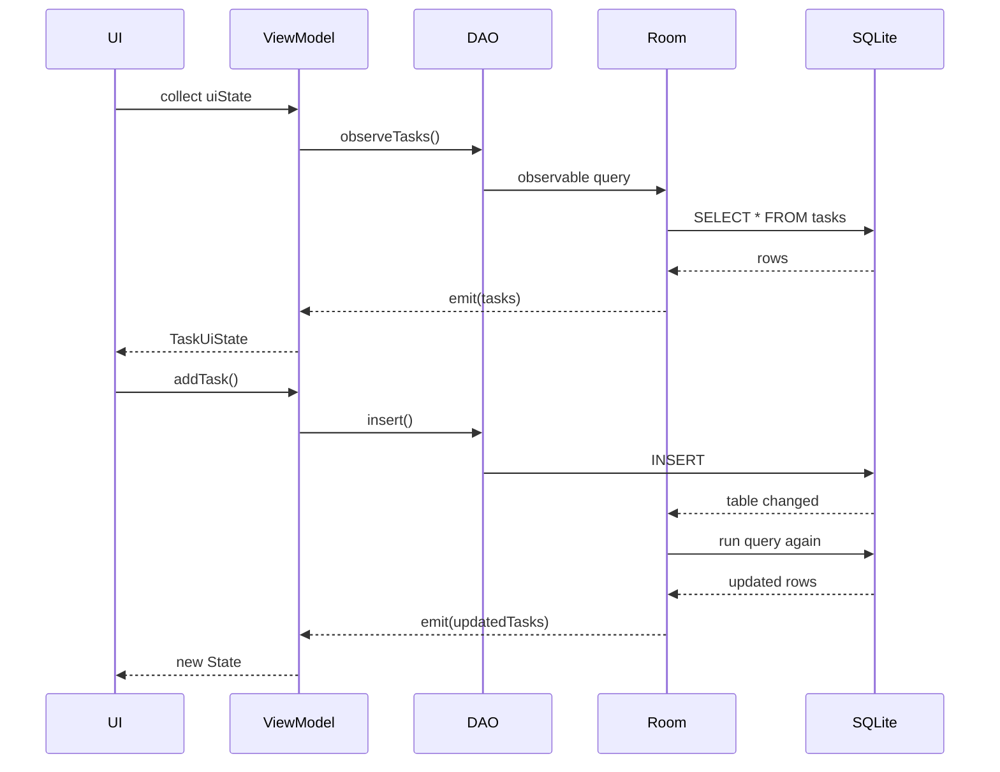
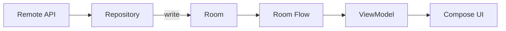
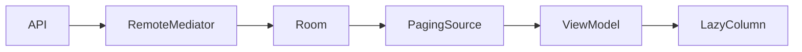
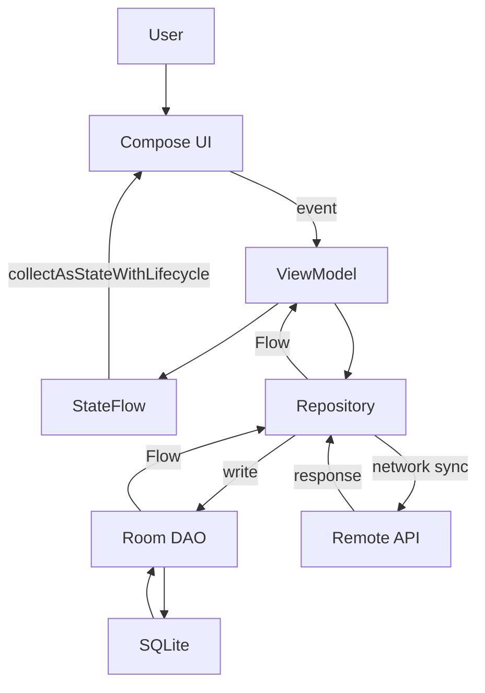

[](https://developer.android.com/training/data-storage/room/?utm_source=chatgpt.com)

# 018 - Room with Flow

**Học phần:** 03 - Architecture, State and Data
**Module:** Module 06 - Storage
**Nhóm nội dung:** Room Database
**Nguồn roadmap:** Storage / Room Database
**Loại bài:** async
**Thứ tự trong module:** 018
**Thời lượng gợi ý:** 34 phút

---

## 1. Tóm tắt

**Room with Flow** là cách kết hợp **Room Database** với **Kotlin Flow** để biến dữ liệu cục bộ thành một **luồng dữ liệu có thể quan sát**.

Thay vì UI phải liên tục hỏi:

> "Database có dữ liệu mới chưa?"

Room có thể trả về:

```kotlin
Flow<List<TaskEntity>>
```

Khi bảng liên quan thay đổi, Room có thể thực thi lại observable query và Flow phát ra kết quả mới. UI đang collect Flow sẽ nhận dữ liệu mới và cập nhật giao diện. Android Developers hiện mô tả trực tiếp Flow là kiểu dùng cho **observable DAO queries**, còn các truy vấn chỉ chạy một lần nên dùng `suspend`. ([Android Developers][1])

Luồng điển hình:

```text
SQLite
  ↓
Room DAO
  ↓
Flow
  ↓
Repository
  ↓
StateFlow
  ↓
ViewModel
  ↓
Compose
```

Điều này đặc biệt phù hợp với kiến trúc:

* Single Source of Truth
* Repository Pattern
* MVVM / UDF
* Offline-first
* Reactive UI

Trong kiến trúc offline-first được Android khuyến nghị, local data source có thể đóng vai trò nguồn đọc chính; ViewModel chuyển `Flow` thành `StateFlow`, còn Compose thu thập state bằng `collectAsStateWithLifecycle()`. ([Android Developers][2])

---

## 2. Ghi chú quan trọng cho Android 2026

Tài liệu Android Developers hiện tại đã chuyển phần hướng dẫn chính sang **Room 3.0**. Tại thời điểm tháng 8/2026, ví dụ setup chính thức sử dụng **Room 3.0.1**, package mới là:

```text
androidx.room3
```

Room 3.0 là Kotlin-first, yêu cầu KSP và đưa coroutine/Flow trực tiếp vào runtime cốt lõi. Room 2.x vẫn tồn tại cho các dự án cũ; tài liệu migration đề xuất chuẩn bị từ Room 2.8.x trước khi chuyển sang Room 3.0. ([Android Developers][3])

> Bài này dùng **Room 3.x** cho phần code chính để phù hợp roadmap Android 2026. Nếu dự án đang dùng `androidx.room` 2.x thì tư duy Room + Flow gần như tương tự, nhưng package và một số API setup khác nhau.

---

# 3. Room with Flow giải quyết vấn đề gì?

Giả sử app Todo có màn hình:

```text
┌─────────────────────────────┐
│       MY TASKS              │
├─────────────────────────────┤
│ ○ Học Kotlin Flow           │
│ ✓ Làm bài Room              │
│ ○ Push source lên GitHub    │
└─────────────────────────────┘
```

Nếu không dùng observable data, ta có thể phải:

```text
User mở màn hình
       ↓
SELECT * FROM tasks
       ↓
Hiển thị

User thêm Task
       ↓
INSERT
       ↓
SELECT lại
       ↓
Hiển thị lại

User xóa Task
       ↓
DELETE
       ↓
SELECT lại
       ↓
Hiển thị lại
```

Code dễ xuất hiện những lệnh kiểu:

```kotlin
refreshTasks()
```

ở rất nhiều nơi.

Với Room + Flow:

```text
               ┌─────────────┐
               │    UI       │
               └──────▲──────┘
                      │
                  StateFlow
                      │
               ┌──────┴──────┐
               │  ViewModel  │
               └──────▲──────┘
                      │
                    Flow
                      │
               ┌──────┴──────┐
               │ Repository  │
               └──────▲──────┘
                      │
                    Flow
                      │
               ┌──────┴──────┐
               │     DAO     │
               └──────▲──────┘
                      │
                  SELECT
                      │
               ┌──────┴──────┐
               │    Room     │
               └──────▲──────┘
                      │
                  SQLite
```

Khi dữ liệu trong bảng được theo dõi thay đổi:

```text
INSERT / UPDATE / DELETE
           ↓
Room phát hiện invalidation
           ↓
Observable query chạy lại
           ↓
Flow emit()
           ↓
Repository
           ↓
StateFlow
           ↓
Compose recomposition
           ↓
UI mới
```

Room chính thức hỗ trợ observable query bằng `Flow`; query có thể phát kết quả mới khi bảng mà query theo dõi bị thay đổi. ([Android Developers][1])

---

# 4. `suspend` và `Flow` khác nhau như thế nào?

Đây là phần quan trọng nhất của bài.

## 4.1 One-shot query → `suspend`

Query chỉ cần kết quả **một lần**:

```kotlin
@Query("SELECT * FROM tasks WHERE id = :id")
suspend fun getTask(id: Long): TaskEntity?
```

Luồng:

```text
Call
 ↓
Query
 ↓
Result
 ↓
Kết thúc
```

Ví dụ:

```kotlin
val task = taskDao.getTask(1)
```

Android Developers phân loại đây là **one-shot asynchronous query** và Room 3 yêu cầu những DAO operation kiểu này sử dụng coroutine/`suspend`. ([Android Developers][1])

---

## 4.2 Observable query → `Flow`

Nếu màn hình phải tự động thay đổi theo database:

```kotlin
@Query("SELECT * FROM tasks ORDER BY createdAt DESC")
fun observeTasks(): Flow<List<TaskEntity>>
```

Luồng có thể giống:

```text
Database

[]
 ↓
Flow emits []

INSERT Task A
 ↓
Flow emits [A]

INSERT Task B
 ↓
Flow emits [B, A]

UPDATE Task A
 ↓
Flow emits [B, A']

DELETE Task B
 ↓
Flow emits [A']
```

Không cần viết:

```kotlin
refresh()
```

sau từng thao tác.

---

# 5. Kiến trúc tổng thể

Một cách tổ chức phù hợp:



Room bản thân vẫn gồm ba thành phần cốt lõi:

```text
Database
Entity
DAO
```

và Room cung cấp lớp abstraction trên SQLite cũng như kiểm tra SQL query tại compile time. ([Android Developers][3])

---

# 6. Ví dụ hoàn chỉnh: Todo App

Ta xây dựng:

```text
Todo App

Room
 └─ TaskEntity

DAO
 ├─ observeTasks()
 ├─ insert()
 ├─ update()
 └─ delete()

Repository
 └─ TaskRepository

ViewModel
 └─ TaskUiState

Compose
 └─ TaskScreen
```

---

# 7. Thêm dependency

Với Room 3.0.1:

```kotlin
dependencies {

    val roomVersion = "3.0.1"

    implementation(
        "androidx.room3:room3-runtime:$roomVersion"
    )

    ksp(
        "androidx.room3:room3-compiler:$roomVersion"
    )
}
```

Room 3.0 yêu cầu KSP; Flow và coroutine support nằm trực tiếp trong core Room runtime, không còn cần một artifact coroutine riêng chỉ để sử dụng Flow. ([Android Developers][3])

Với Compose lifecycle collection, dự án cũng cần Lifecycle Compose:

```kotlin
implementation(
    "androidx.lifecycle:lifecycle-runtime-compose:<version>"
)
```

---

# 8. Tạo Entity

```kotlin
import androidx.room3.Entity
import androidx.room3.PrimaryKey

@Entity(tableName = "tasks")
data class TaskEntity(

    @PrimaryKey(autoGenerate = true)
    val id: Long = 0,

    val title: String,

    val completed: Boolean = false,

    val createdAt: Long
)
```

Database tương ứng:

```text
tasks
─────────────────────────────────────
id        INTEGER PRIMARY KEY
title     TEXT
completed INTEGER
createdAt INTEGER
```

---

# 9. DAO sử dụng Flow

```kotlin
import androidx.room3.Dao
import androidx.room3.Delete
import androidx.room3.Insert
import androidx.room3.Query
import androidx.room3.Update
import kotlinx.coroutines.flow.Flow

@Dao
interface TaskDao {

    @Query(
        """
        SELECT *
        FROM tasks
        ORDER BY createdAt DESC
        """
    )
    fun observeTasks(): Flow<List<TaskEntity>>

    @Query(
        """
        SELECT *
        FROM tasks
        WHERE id = :id
        """
    )
    fun observeTask(id: Long): Flow<TaskEntity?>

    @Insert
    suspend fun insert(task: TaskEntity)

    @Update
    suspend fun update(task: TaskEntity)

    @Delete
    suspend fun delete(task: TaskEntity)
}
```

Chú ý sự khác biệt:

```text
READ liên tục
────────────────────────
observeTasks()
        ↓
Flow<List<TaskEntity>>


WRITE một lần
────────────────────────
insert()
update()
delete()
        ↓
suspend
```

Room trực tiếp hỗ trợ `Flow` cho observable queries và `suspend` cho asynchronous one-shot queries. ([Android Developers][1])

---

# 10. Room theo dõi Flow như thế nào?

Ví dụ DAO:

```kotlin
@Query("SELECT * FROM tasks")
fun observeTasks(): Flow<List<TaskEntity>>
```

Ban đầu:

```text
tasks

1 | Learn Room
2 | Learn Flow
```

Flow phát:

```kotlin
[
    TaskEntity(1, "Learn Room"),
    TaskEntity(2, "Learn Flow")
]
```

Sau đó:

```sql
INSERT INTO tasks ...
```

Room phát hiện bảng `tasks` bị thay đổi.



Một chi tiết cần nhớ: Room có thể chạy lại observable query khi **bất kỳ row nào trong table liên quan thay đổi**, ngay cả khi row đó không làm kết quả query thực tế khác đi. Android Developers đề xuất có thể dùng `distinctUntilChanged()` nếu chỉ muốn downstream nhận những kết quả thực sự khác nhau. ([Android Developers][1])

---

# 11. Repository

Không nên cho UI gọi DAO trực tiếp.

```text
UI
 ↓
ViewModel
 ↓
Repository
 ↓
DAO
```

Ví dụ:

```kotlin
import kotlinx.coroutines.flow.Flow
import kotlinx.coroutines.flow.distinctUntilChanged

class TaskRepository(
    private val taskDao: TaskDao
) {

    fun observeTasks(): Flow<List<TaskEntity>> {
        return taskDao
            .observeTasks()
            .distinctUntilChanged()
    }

    suspend fun addTask(title: String) {

        val task = TaskEntity(
            title = title,
            createdAt = System.currentTimeMillis()
        )

        taskDao.insert(task)
    }

    suspend fun toggleTask(
        task: TaskEntity
    ) {
        taskDao.update(
            task.copy(
                completed = !task.completed
            )
        )
    }

    suspend fun deleteTask(
        task: TaskEntity
    ) {
        taskDao.delete(task)
    }
}
```

Repository giúp tách persistence implementation khỏi ViewModel và đặc biệt hữu ích khi sau này local Room phải phối hợp với network API.

---

# 12. Flow → StateFlow trong ViewModel

DAO trả:

```text
Flow<List<TaskEntity>>
```

Nhưng UI thường cần một trạng thái rõ ràng hơn:

```kotlin
data class TaskUiState(
    val loading: Boolean = true,
    val tasks: List<TaskEntity> = emptyList(),
    val error: String? = null
)
```

ViewModel:

```kotlin
import androidx.lifecycle.ViewModel
import androidx.lifecycle.viewModelScope
import kotlinx.coroutines.flow.SharingStarted
import kotlinx.coroutines.flow.StateFlow
import kotlinx.coroutines.flow.catch
import kotlinx.coroutines.flow.map
import kotlinx.coroutines.flow.stateIn
import kotlinx.coroutines.launch

class TaskViewModel(
    private val repository: TaskRepository
) : ViewModel() {

    val uiState: StateFlow<TaskUiState> =
        repository
            .observeTasks()
            .map { tasks ->
                TaskUiState(
                    loading = false,
                    tasks = tasks
                )
            }
            .catch { error ->
                emit(
                    TaskUiState(
                        loading = false,
                        error = error.message
                    )
                )
            }
            .stateIn(
                scope = viewModelScope,
                started = SharingStarted
                    .WhileSubscribed(5_000),
                initialValue = TaskUiState()
            )

    fun addTask(title: String) {

        viewModelScope.launch {
            repository.addTask(title)
        }
    }

    fun toggleTask(task: TaskEntity) {

        viewModelScope.launch {
            repository.toggleTask(task)
        }
    }

    fun deleteTask(task: TaskEntity) {

        viewModelScope.launch {
            repository.deleteTask(task)
        }
    }
}
```

Android Developers sử dụng chính pattern:

```text
Repository Flow
      ↓
stateIn(viewModelScope)
      ↓
StateFlow
      ↓
collectAsStateWithLifecycle()
```

cho kiến trúc Android hiện đại và offline-first. ([Android Developers][2])

---

# 13. Vì sao dùng `StateFlow` ở ViewModel?

DAO:

```kotlin
Flow<List<TaskEntity>>
```

là **data stream**.

Trong khi:

```kotlin
StateFlow<TaskUiState>
```

đại diện cho **state hiện tại của màn hình**.

Có thể hình dung:

```text
DATABASE
   │
   ▼
Flow<List<Task>>
   │
   │ map()
   ▼
TaskUiState
   │
   │ stateIn()
   ▼
StateFlow<TaskUiState>
   │
   ▼
UI
```

Điều này tạo boundary rõ ràng:

```text
Database model ≠ UI state
```

---

# 14. Thu thập Flow trong Jetpack Compose

Không nên collect database Flow một cách tùy tiện trong Activity/Composable.

Android khuyến nghị:

```kotlin
collectAsStateWithLifecycle()
```

Ví dụ:

```kotlin
@Composable
fun TaskRoute(
    viewModel: TaskViewModel
) {

    val uiState by viewModel
        .uiState
        .collectAsStateWithLifecycle()

    TaskScreen(
        state = uiState,
        onAddTask = viewModel::addTask,
        onToggleTask = viewModel::toggleTask,
        onDeleteTask = viewModel::deleteTask
    )
}
```

`collectAsStateWithLifecycle()` tự quản lý subscription theo Android lifecycle; mặc định việc collect bắt đầu khi lifecycle đạt `STARTED` và dừng khi xuống `STOPPED`. ([Android Developers][4])

---

# 15. Lifecycle khi rotate màn hình

Giả sử:

```text
Portrait
   │
   │ rotate
   ▼
Landscape
```

Activity có thể được recreate.

Nhưng:

```text
Room
 │
 └── Flow
       │
       ▼
   ViewModel
       │
       └── StateFlow
              │
              ▼
         New Compose UI
```

`ViewModel` được thiết kế làm screen-level state holder, và coroutine chạy trong `viewModelScope` sẽ chỉ bị cancel khi ViewModel thực sự bị clear. ([Android Developers][4])

Vì vậy một configuration change bình thường không có nghĩa bạn phải:

```kotlin
SELECT lại bằng code thủ công
```

hoặc lưu toàn bộ list vào:

```kotlin
savedInstanceState
```

Room vẫn giữ persistent data, ViewModel quản lý screen state và UI subscription được nối lại theo lifecycle.

---

# 16. Lifecycle khi app xuống background

Ví dụ:

```text
App visible

Lifecycle STARTED
      ↓
Collect Flow
      ↓
UI updates


User Home
      ↓

Lifecycle STOPPED
      ↓
Stop collecting UI Flow


User quay lại
      ↓

Lifecycle STARTED
      ↓
Collect lại
      ↓
Nhận state mới
```

Đó là lý do:

```kotlin
collectAsStateWithLifecycle()
```

tốt hơn việc tự:

```kotlin
scope.launch {
    flow.collect { ... }
}
```

trong UI nếu không kiểm soát lifecycle. Android khuyến nghị API lifecycle-aware để tránh tiếp tục thu thập không cần thiết khi UI đã background. ([Android Developers][4])

---

# 17. Cancellation

Một nguyên tắc quan trọng của bài async:

> Async operation phải có owner.

Ví dụ:

```kotlin
viewModelScope.launch {
    repository.addTask("Learn Flow")
}
```

Owner ở đây:

```text
TaskViewModel
```

Nếu ViewModel bị clear:

```text
ViewModel cleared
       ↓
viewModelScope cancelled
       ↓
child coroutines cancelled
```

Đây là behavior chính thức của `viewModelScope`. ([Android Developers][4])

Không nên:

```kotlin
GlobalScope.launch {
    ...
}
```

cho business operation gắn với màn hình.

---

# 18. Error handling

Flow có thể thêm:

```kotlin
.catch { exception ->

    emit(
        TaskUiState(
            loading = false,
            error = exception.message
        )
    )
}
```

Luồng:

```text
Flow
 │
 ├── success → emit data
 │
 └── exception
         ↓
       catch
         ↓
     error state
         ↓
        UI
```

Trong kiến trúc offline-first, Android cũng đề cập `catch` để bảo vệ consumer khỏi lỗi local Flow. Tuy nhiên, sau exception, backing Flow đã kết thúc; nếu muốn tiếp tục thử lại thì có thể xem xét `retry`. ([Android Developers][2])

---

# 19. Có nên `retry()` Room query không?

Không nên áp dụng một cách máy móc:

```kotlin
.retry {
    true
}
```

Nếu lỗi là:

```text
Migration sai
Schema sai
SQL sai
Database corrupt
Programming bug
```

thì retry 100 lần cũng không giải quyết vấn đề.

Retry phù hợp hơn với lỗi thực sự có khả năng **tạm thời**.

Ví dụ:

```kotlin
.retry(2) { throwable ->
    throwable is SomeTemporaryStorageException
}
```

Trong app offline-first:

```text
Network fail
    ↓
WorkManager retry
    ↓
Network success
    ↓
Save Room
    ↓
Room Flow
    ↓
UI updated
```

là pattern thực tế hơn việc biến mọi exception của Room thành vòng lặp retry.

---

# 20. Logging state transition

Yêu cầu thực hành của bài:

> Log các state transition để debug Flow.

Có thể thêm:

```kotlin
repository
    .observeTasks()
    .onStart {
        Log.d(
            "TaskFlow",
            "Started collecting tasks"
        )
    }
    .onEach { tasks ->
        Log.d(
            "TaskFlow",
            "Received ${tasks.size} tasks"
        )
    }
    .catch { error ->
        Log.e(
            "TaskFlow",
            "Flow failed",
            error
        )
    }
    .onCompletion {
        Log.d(
            "TaskFlow",
            "Collection completed"
        )
    }
```

Log ví dụ:

```text
TaskFlow: Started collecting tasks

TaskFlow: Received 0 tasks

TaskFlow: Received 1 tasks

TaskFlow: Received 2 tasks
```

Khi user xóa:

```text
TaskFlow: Received 1 tasks
```

Đây là cách rất tốt để xác minh:

```text
Database mutation
        ↓
Room invalidation
        ↓
Flow emission
        ↓
ViewModel state
        ↓
UI
```

---

# 21. `distinctUntilChanged()`

Giả sử query:

```kotlin
@Query(
    """
    SELECT *
    FROM tasks
    WHERE completed = 0
    """
)
fun observeTodoTasks():
    Flow<List<TaskEntity>>
```

Database:

```text
Task A completed = false
Task B completed = true
```

Nếu Task B thay đổi title:

```text
Task B
```

không nằm trong kết quả query.

Tuy nhiên bảng `tasks` đã thay đổi nên observable query có thể vẫn bị invalidated và chạy lại. Đây là giới hạn được tài liệu Room nêu rõ. ([Android Developers][1])

Có thể:

```kotlin
taskDao
    .observeTodoTasks()
    .distinctUntilChanged()
```

để tránh đẩy một kết quả giống hệt xuống tầng UI.

---

# 22. Flow operators hữu ích

Room Flow trở nên mạnh khi kết hợp operator.

## `map`

```kotlin
dao.observeTasks()
    .map { entities ->

        entities.map { entity ->
            entity.toDomain()
        }
    }
```

---

## `filter`

```kotlin
dao.observeTasks()
    .map { tasks ->
        tasks.filter {
            !it.completed
        }
    }
```

Tuy nhiên nếu filter có thể thực hiện hiệu quả bằng SQL thì thường nên đưa điều kiện xuống DAO:

```sql
WHERE completed = 0
```

để database xử lý thay vì load toàn bộ rows lên rồi mới lọc.

---

## `combine`

Ví dụ app có:

```text
Tasks Flow
     +
User Settings Flow
```

Có thể:

```kotlin
combine(
    taskRepository.observeTasks(),
    settingsRepository.observeSettings()
) { tasks, settings ->

    ...
}
```

Luồng:

```text
Room Tasks ───────┐
                  ├── combine → UI State
DataStore ────────┘
```

---

# 23. Single Source of Truth

Room + Flow đặc biệt phù hợp với nguyên tắc:

> **Single Source of Truth**

Ví dụ app có API.

Không nên:

```text
API ───────────────► UI

Room ──────────────► UI
```

vì UI có hai nguồn sự thật.

Một kiến trúc offline-first phổ biến là:



UI chỉ đọc:

```text
Room
```

API:

```text
API
 ↓
Repository
 ↓
Room
 ↓
Flow
 ↓
UI
```

Android Developers cũng mô tả kiến trúc offline-first trong đó read operations của repository đọc local data source, còn dữ liệu cập nhật được ghi vào local source để observable consumers nhận thay đổi. ([Android Developers][2])

---

# 24. Ví dụ offline-first thực tế

News App:

```text
User mở app
      ↓
Room đã có bài cũ
      ↓
Flow emit
      ↓
UI hiển thị ngay
      ↓
Repository fetch API
      ↓
API trả dữ liệu mới
      ↓
INSERT / UPDATE Room
      ↓
Room Flow emit
      ↓
UI tự cập nhật
```

UX:

```text
Không phải:

Loading...
Loading...
Loading...
Network response
Content
```

mà có thể trở thành:

```text
Cached Content
      ↓
background sync
      ↓
Fresh Content
```

Đây là một lợi ích lớn của Room + Flow trong ứng dụng cần offline behavior.

---

# 25. Flow không có nghĩa là mọi thứ chạy mãi mãi

Một hiểu nhầm phổ biến:

```text
Flow == background task chạy mãi
```

Không đúng.

Ta nên nghĩ:

```text
Flow
 =
mô hình stream dữ liệu

Collector
 =
consumer của stream
```

Lifecycle của việc collect được quản lý bởi nơi collect nó.

Ví dụ:

```text
Compose visible
      ↓
collector active

Compose background
      ↓
collector inactive
```

khi sử dụng collection lifecycle-aware. ([Android Developers][4])

---

# 26. Flow vs `suspend`

| Tình huống                       | Nên dùng  |
| -------------------------------- | --------- |
| Lấy user một lần                 | `suspend` |
| Đọc config một lần               | `suspend` |
| Kiểm tra row tồn tại             | `suspend` |
| Hiển thị danh sách luôn cập nhật | `Flow`    |
| Quan sát cart                    | `Flow`    |
| Quan sát unread count            | `Flow`    |
| Quan sát Todo list               | `Flow`    |
| Insert                           | `suspend` |
| Update                           | `suspend` |
| Delete                           | `suspend` |

Nguyên tắc nhớ nhanh:

```text
COMMAND
    ↓
suspend

OBSERVATION
    ↓
Flow
```

Đây cũng tương ứng với cách Room phân biệt one-shot query và observable query. ([Android Developers][1])

---

# 27. Không cần tự chuyển query sang `Dispatchers.IO`

Một lỗi dễ gặp:

```kotlin
withContext(Dispatchers.IO) {
    dao.observeTasks()
}
```

hoặc cố dùng:

```kotlin
flowOn(Dispatchers.IO)
```

chỉ vì nghĩ rằng:

> "Database thì bắt buộc mình phải tự chuyển thread."

Với asynchronous DAO APIs của Room, Room/coroutine integration đã chịu trách nhiệm thực hiện database operation bất đồng bộ; tài liệu Room yêu cầu async queries để tránh block UI và trực tiếp hỗ trợ Flow/coroutine. ([Android Developers][1])

Bạn vẫn cần dispatcher riêng cho **CPU-heavy work của chính mình**, ví dụ:

```text
Resize 500 ảnh
Machine Learning inference
JSON processing cực lớn
Compression
```

nhưng đó là vấn đề khác với Room observable query.

---

# 28. Testing Room Flow

Database là nơi cần test bằng dữ liệu thật thay vì chỉ mock.

Android Developers khuyến nghị khi test Room database trên Android có thể sử dụng **in-memory database** để test được cô lập hơn. ([Android Developers][5])

Ví dụ:

```kotlin
@RunWith(AndroidJUnit4::class)
class TaskDaoTest {

    private lateinit var database: AppDatabase
    private lateinit var dao: TaskDao

    @Before
    fun setup() {

        val context =
            ApplicationProvider
                .getApplicationContext<Context>()

        database =
            Room.inMemoryDatabaseBuilder<AppDatabase>(
                context
            )
                .setDriver(
                    BundledSQLiteDriver()
                )
                .build()

        dao = database.taskDao()
    }

    @After
    fun tearDown() {
        database.close()
    }
}
```

---

# 29. Test query

```kotlin
@Test
fun insertTask_thenQueryReturnsTask() =
    runTest {

        dao.insert(
            TaskEntity(
                title = "Learn Room Flow",
                createdAt = 1
            )
        )

        val tasks =
            dao.observeTasks().first()

        assertEquals(
            1,
            tasks.size
        )

        assertEquals(
            "Learn Room Flow",
            tasks.first().title
        )
    }
```

---

# 30. Test Flow cập nhật

Một bài test quan trọng hơn:

```text
Collect
 ↓
[]
 ↓
INSERT
 ↓
[Task]
```

Ví dụ ý tưởng:

```kotlin
@Test
fun insertTask_flowEmitsUpdatedList() =
    runTest {

        val emissions =
            mutableListOf<List<TaskEntity>>()

        val job = launch {
            dao.observeTasks()
                .take(2)
                .toList(emissions)
        }

        yield()

        dao.insert(
            TaskEntity(
                title = "Room Flow",
                createdAt = 1
            )
        )

        job.join()

        assertTrue(
            emissions[0].isEmpty()
        )

        assertEquals(
            "Room Flow",
            emissions[1]
                .first()
                .title
        )
    }
```

Mục tiêu test:

```text
Không chỉ kiểm tra:

INSERT thành công


Mà còn:

INSERT
 ↓
Room invalidation
 ↓
Flow emission mới
```

---

# 31. Test những trường hợp nào?

### DAO

```text
Insert
Update
Delete
Query
Sorting
Filtering
Empty database
Nullable row
Constraint
```

### Flow

```text
Initial emission

Insert
   ↓
new emission

Update
   ↓
new emission

Delete
   ↓
new emission
```

### ViewModel

```text
Loading

Data

Empty

Error
```

### Migration

```text
v1
 ↓
v2
 ↓
v3
```

Android Developers đặc biệt khuyến nghị test migration vì migration sai có thể làm app crash hoặc ảnh hưởng dữ liệu người dùng. ([Android Developers][5])

---

# 32. Debug bằng Database Inspector

Android Studio có **Database Inspector** để:

* xem table;
* chạy SQL;
* chạy DAO query;
* sửa dữ liệu;
* xem database thay đổi khi app đang chạy.

Nếu UI đang observe Room bằng `Flow`, việc sửa dữ liệu trong Database Inspector có thể lập tức được phản ánh ở UI đang chạy. ([Android Developers][6])

Workflow debug rất hữu ích:

```text
Run App
  ↓
App Inspection
  ↓
Database Inspector
  ↓
tasks table
  ↓
INSERT / UPDATE row
  ↓
Room Flow
  ↓
UI thay đổi
```

Đây cũng là một demo portfolio rất tốt.

---

# 33. Các lỗi thường gặp

## Lỗi 1 — DAO trả `List` thay vì `Flow`

```kotlin
@Query("SELECT * FROM tasks")
suspend fun getTasks(): List<TaskEntity>
```

Không sai, nhưng đây chỉ là snapshot.

```text
Query
 ↓
List
 ↓
finish
```

Nếu cần reactive UI:

```kotlin
fun observeTasks():
    Flow<List<TaskEntity>>
```

---

## Lỗi 2 — Refresh thủ công sau mọi write

```kotlin
dao.insert(task)

refreshTasks()
```

Nếu UI đã quan sát:

```kotlin
Flow<List<Task>>
```

thì thường nên để data change tự lan truyền qua Room Flow.

---

## Lỗi 3 — UI gọi DAO trực tiếp

```text
Composable
   ↓
TaskDao
```

Dễ khiến UI phụ thuộc persistence layer.

Nên:

```text
Composable
   ↓
ViewModel
   ↓
Repository
   ↓
DAO
```

---

## Lỗi 4 — Expose mutable state

Không nên:

```kotlin
val tasks =
    MutableStateFlow<List<Task>>(
        emptyList()
    )
```

cho mọi layer tùy ý sửa.

Nên để source data đi theo:

```text
Room Flow
   ↓
transform
   ↓
StateFlow
   ↓
UI
```

---

## Lỗi 5 — Collect không theo lifecycle

```kotlin
scope.launch {
    flow.collect()
}
```

không có lifecycle strategy rõ ràng.

Trong Compose:

```kotlin
collectAsStateWithLifecycle()
```

là lựa chọn được Android khuyến nghị. ([Android Developers][4])

---

## Lỗi 6 — Không xử lý empty state

Database rỗng không đồng nghĩa error.

Nên phân biệt:

```text
Loading

Empty

Content

Error
```

Ví dụ:

```kotlin
data class TaskUiState(
    val loading: Boolean,
    val tasks: List<Task>,
    val error: String?
)
```

---

# 34. Performance

Room Flow rất tiện nhưng không có nghĩa query nào cũng miễn phí.

Ví dụ:

```sql
SELECT *
FROM transactions
ORDER BY createdAt DESC
```

với:

```text
1,000,000 rows
```

mỗi lần invalidation xảy ra có thể khiến một query lớn chạy lại.

Nên cân nhắc:

```text
Index
Pagination
WHERE condition
LIMIT
Projection
Paging 3
distinctUntilChanged()
```

Đặc biệt cần nhớ giới hạn observable query của Room: thay đổi ở table có thể làm query chạy lại kể cả khi row thay đổi không thuộc result set. ([Android Developers][1])

---

# 35. Room + Flow + Paging

Khi dữ liệu lớn:

```text
Room

10 rows
100 rows
1,000 rows
100,000 rows
```

không nên luôn:

```kotlin
Flow<List<Entity>>
```

cho toàn bộ table.

Có thể chuyển sang:

```text
Room
 ↓
PagingSource
 ↓
Pager
 ↓
PagingData
 ↓
LazyColumn
```

Với network + database:



Android cũng mô tả pattern Room làm local cache / source of truth khi kết hợp Paging và `RemoteMediator`.

---

# 36. Production flow hoàn chỉnh

Một implementation tốt có thể có:



Đây là lúc Room + Flow không còn đơn thuần là:

```kotlin
fun getData(): Flow<...>
```

mà trở thành xương sống của data architecture.

---

# 37. Ảnh hưởng đến UX

## Không dùng reactive database

```text
User update data
      ↓
Database changed

UI
???
```

Developer phải nhớ:

```kotlin
refresh()
```

Nếu quên:

```text
database đúng
UI sai
```

---

## Room + Flow

```text
User action
    ↓
Database update
    ↓
Flow
    ↓
UiState
    ↓
UI
```

Kết quả mong muốn:

* UI nhất quán hơn;
* giảm refresh thủ công;
* offline UX tốt hơn;
* dễ xây Single Source of Truth;
* lifecycle management rõ hơn.

---

# 38. Ảnh hưởng đến maintainability

Không tốt:

```text
Screen A ───────┐
Screen B ───────┼──► SQLite
Screen C ───────┘
```

Tốt hơn:

```text
Screens
   │
   ▼
ViewModels
   │
   ▼
Repository
   │
   ▼
Room DAO
   │
   ▼
SQLite
```

Room + Flow tạo một data pipeline rõ:

```text
Storage
 ↓
Stream
 ↓
State
 ↓
UI
```

---

# 39. Bài thực hành

## Mục tiêu

Xây dựng một **Task Tracker**:

```text
┌──────────────────────────────┐
│ Tasks                        │
├──────────────────────────────┤
│ [ ] Learn Room               │
│ [✓] Learn Flow               │
│ [ ] Build portfolio app      │
│                              │
│              [+ Add Task]    │
└──────────────────────────────┘
```

Yêu cầu:

1. `TaskEntity`.
2. `TaskDao`.
3. `RoomDatabase`.
4. `TaskRepository`.
5. `TaskViewModel`.
6. DAO trả `Flow<List<TaskEntity>>`.
7. ViewModel chuyển thành `StateFlow`.
8. Compose dùng `collectAsStateWithLifecycle()`.
9. Insert Task.
10. Toggle completed.
11. Delete Task.
12. Không gọi `refreshTasks()`.
13. Viết ít nhất một DAO test.
14. Debug bằng Database Inspector.
15. Log Flow emission.

---

# 40. Bài tập chính

> **Move a long-running task off the main thread and explain cancellation or retry behavior.**

Trong bài này có thể chuyển thành:

### Task

Thêm nút:

```text
Generate 10,000 demo tasks
```

Không làm:

```kotlin
fun generate() {

    repeat(10_000) {
        // heavy preparation
    }
}
```

trên UI thread.

Thay vào đó:

```kotlin
fun generateTasks() {

    viewModelScope.launch {

        repository.generateTasks()
    }
}
```

Sau đó giải thích:

```text
viewModelScope
      ↓
owned by ViewModel

ViewModel cleared
      ↓
coroutine cancelled
```

Behavior cancellation của `viewModelScope` được Lifecycle library cung cấp trực tiếp. ([Android Developers][4])

---

# 41. Artifact cho portfolio

Có thể tạo repo:

```text
room-flow-demo/
│
├── data/
│   ├── TaskEntity.kt
│   ├── TaskDao.kt
│   ├── AppDatabase.kt
│   └── TaskRepository.kt
│
├── ui/
│   ├── TaskViewModel.kt
│   └── TaskScreen.kt
│
├── androidTest/
│   └── TaskDaoTest.kt
│
├── screenshots/
│   ├── task-screen.png
│   └── database-inspector.png
│
└── README.md
```

README có thể giải thích:

```text
Room
 ↓
Flow
 ↓
Repository
 ↓
StateFlow
 ↓
Compose
```

---

# 42. Screenshot nên đưa vào portfolio

## Screenshot 1

Task screen:

```text
┌────────────────────────────┐
│ Room Flow Demo             │
├────────────────────────────┤
│ ✓ Learn Room               │
│ ○ Learn Flow               │
│ ○ Learn StateFlow          │
│                            │
│                    +       │
└────────────────────────────┘
```

## Screenshot 2

Database Inspector:

```text
tasks
────────────────────────────
id | title          | done
1  | Learn Room     | 1
2  | Learn Flow     | 0
3  | Learn StateFlow| 0
```

## Screenshot 3

Logcat:

```text
TaskFlow: emitted 0 tasks
TaskFlow: emitted 1 tasks
TaskFlow: emitted 2 tasks
TaskFlow: emitted 3 tasks
```

Database Inspector chính thức hỗ trợ inspect, query và thay đổi database khi app đang chạy; nếu UI observe bằng Flow, thay đổi có thể xuất hiện trực tiếp trên UI. ([Android Developers][6])

---

# 43. Checklist hoàn thành

* [ ] Giải thích được Room with Flow.
* [ ] Phân biệt `suspend` và `Flow`.
* [ ] Biết observable query là gì.
* [ ] DAO trả `Flow<List<Entity>>`.
* [ ] Biết Room invalidation dẫn đến query chạy lại.
* [ ] Biết dùng `distinctUntilChanged()` khi phù hợp.
* [ ] Có Repository.
* [ ] Biết chuyển `Flow` → `StateFlow`.
* [ ] Biết dùng `stateIn()`.
* [ ] Biết dùng `viewModelScope`.
* [ ] Compose dùng `collectAsStateWithLifecycle()`.
* [ ] Không refresh UI thủ công sau mỗi database write.
* [ ] Có loading state.
* [ ] Có empty state.
* [ ] Có error state.
* [ ] Hiểu cancellation.
* [ ] Retry chỉ dùng khi lỗi thực sự phù hợp.
* [ ] Có DAO test.
* [ ] Test Flow emission.
* [ ] Debug bằng Database Inspector.
* [ ] Có screenshot hoặc README làm portfolio artifact.

---

# 44. Production checklist

Trước khi release hãy kiểm tra:

```text
Architecture
├── Room có phải source of truth không?
├── UI có gọi DAO trực tiếp không?
└── Repository boundary có rõ không?

Flow
├── Query nào thực sự cần observable?
├── Có query quá lớn không?
├── Có cần distinctUntilChanged()?
└── Có collector trùng lặp không?

Lifecycle
├── Compose dùng collectAsStateWithLifecycle()?
├── Coroutine có owner?
└── Có dùng GlobalScope sai chỗ không?

State
├── Loading
├── Empty
├── Data
└── Error

Database
├── Index
├── Transaction
├── Migration
├── Schema
└── Constraints

Testing
├── Insert
├── Update
├── Delete
├── Query
├── Flow emission
└── Migration

Debug
├── Log Flow
├── Database Inspector
└── Reproduce offline / background case
```

---

# 45. Ghi nhớ nhanh

```text
Room
  =
persistent local database

Flow
  =
observable data stream

Room + Flow
  =
reactive local database
```

Công thức kiến trúc:

```text
ROOM
  ↓
DAO
  ↓
Flow
  ↓
Repository
  ↓
StateFlow
  ↓
ViewModel
  ↓
collectAsStateWithLifecycle()
  ↓
Compose UI
```

Công thức chọn API:

```text
READ ONE TIME
    ↓
suspend

OBSERVE CHANGES
    ↓
Flow

WRITE
    ↓
suspend
```

Và ý quan trọng nhất:

> **UI không cần hỏi database liên tục. UI quan sát state, state quan sát Flow, còn Room chịu trách nhiệm phát hiện thay đổi của dữ liệu.**

Đó là giá trị cốt lõi của **Room with Flow** trong kiến trúc Android hiện đại. ([Android Developers][1])

---

## 46. Nguồn học chính thức

Nội dung trên được đối chiếu với tài liệu Android Developers cập nhật trong năm 2026, gồm hướng dẫn Room 3.0, asynchronous DAO queries, lifecycle-aware coroutine/Flow collection, offline-first architecture, Room testing và Database Inspector. Room 3.0 hiện sử dụng package `androidx.room3`, trong khi các dự án Room 2.x có hướng dẫn migration riêng. ([Android Developers][3])

[1]: https://developer.android.com/training/data-storage/room/async-queries "Write asynchronous DAO queries  |  App data and files  |  Android Developers"
[2]: https://developer.android.com/topic/architecture/data-layer/offline-first "Build an offline-first app  |  App architecture  |  Android Developers"
[3]: https://developer.android.com/training/data-storage/room?utm_source=chatgpt.com "Save data in a local database using Room"
[4]: https://developer.android.com/topic/libraries/architecture/coroutines "Use Kotlin coroutines with lifecycle-aware components  |  App architecture  |  Android Developers"
[5]: https://developer.android.com/training/data-storage/room/testing-db "Test and debug your database  |  App data and files  |  Android Developers"
[6]: https://developer.android.com/studio/inspect/database "Debug your database with the Database Inspector  |  Android Studio  |  Android Developers"

---

# Bài luyện tập

## Mục tiêu


## Đề bài


## Yêu cầu hoàn thành

- [ ] 
- [ ] 
- [ ] 

## Kết quả / lời giải


## Ghi chú
