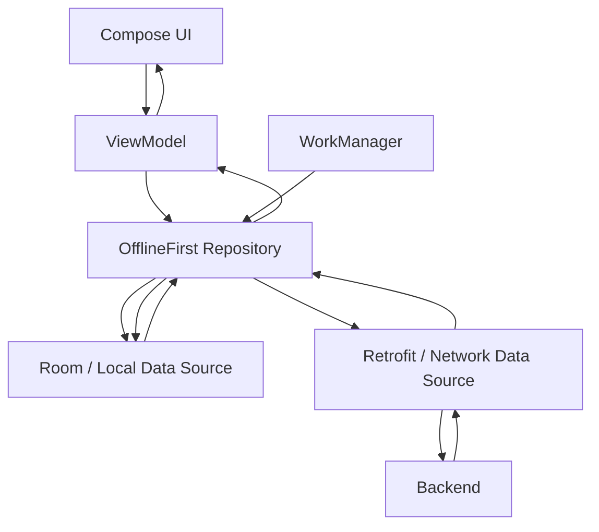
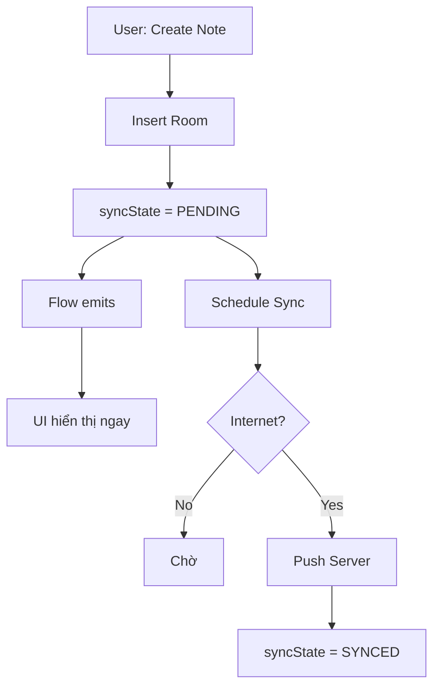
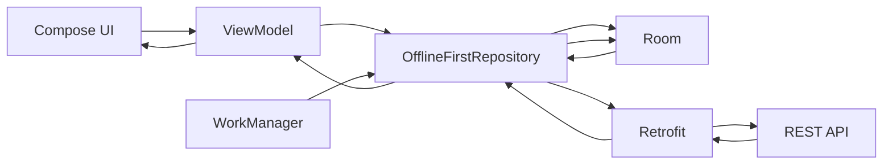
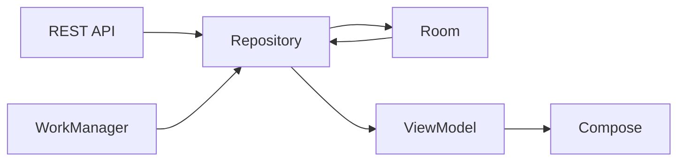
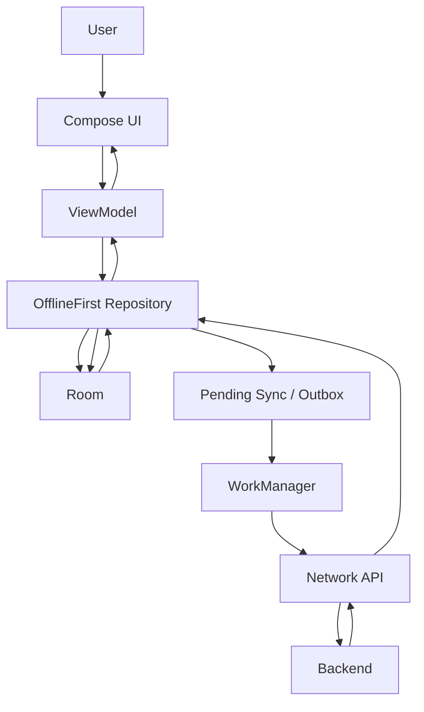

[](https://developer.android.com/topic/architecture/data-layer/offline-first?utm_source=chatgpt.com)

# 019 - Offline First

**Học phần:** 03 - Architecture, State and Data
**Module:** Module 06 - Storage
**Nhóm nội dung:** Offline Design
**Nguồn roadmap:** Storage / Offline Design
**Loại bài:** Storage / Architecture
**Thứ tự trong module:** 019
**Thời lượng gợi ý:** 32 phút

---

## 1. Tóm tắt

**Offline First** là cách thiết kế ứng dụng trong đó trải nghiệm quan trọng của người dùng không phụ thuộc hoàn toàn vào việc thiết bị đang có Internet.

Thay vì:

```text
UI → API → nhận dữ liệu → hiển thị
```

ứng dụng được thiết kế theo hướng:

```text
UI → Local Database
        ↑
        │ sync
        ↓
      Network
```

Trong kiến trúc offline-first của Android, `Repository` thường quản lý ít nhất hai nguồn dữ liệu:

* **Local Data Source:** Room, DataStore hoặc file.
* **Network Data Source:** REST API, GraphQL, Firebase hoặc backend khác.

Điểm quan trọng nhất là **UI đọc dữ liệu từ local source**, còn network chủ yếu có nhiệm vụ đồng bộ local source. Android Developers gọi local data source là nguồn dữ liệu chuẩn để các layer phía trên đọc, giúp trải nghiệm nhất quán khi chuyển giữa online và offline. Ở mức tối thiểu, một ứng dụng được coi là offline-first khi các thao tác đọc quan trọng vẫn thực hiện được mà không cần Internet. ([Android Developers][1])

---

## 2. Mục tiêu học tập

Sau bài này, bạn có thể:

* Giải thích được **Offline First**.
* Phân biệt:

  * Offline First.
  * Cache.
  * Network First.
* Hiểu vai trò của:

  * Room.
  * Repository.
  * Retrofit/API.
  * Flow.
  * ViewModel.
  * WorkManager.
* Thiết kế luồng:

```text
Network → Local Database → Repository → ViewModel → UI
```

* Thực hiện thao tác ghi khi mất mạng.
* Xây dựng hàng đợi đồng bộ.
* Xử lý conflict giữa local và server.
* Test các trường hợp:

  * mất Internet;
  * app bị kill;
  * mạng trở lại;
  * request thất bại;
  * dữ liệu local và server khác nhau.
* Tạo một mini project Offline First cho portfolio.

---

# 3. Khái niệm chính

## 3.1. Offline First là gì?

Một ứng dụng **Offline First** coi việc mất Internet là một trạng thái hoạt động bình thường, thay vì coi nó là lỗi đặc biệt.

Ví dụ ứng dụng ghi chú.

Người dùng đang trên tàu và mất mạng.

### App phụ thuộc network

```text
User mở Notes
       ↓
Gọi API
       ↓
Không có mạng
       ↓
Error
       ↓
Không xem được ghi chú
```

### Offline First

```text
User mở Notes
       ↓
Đọc Room
       ↓
Hiển thị ngay dữ liệu local
       ↓
Có mạng?
  ┌────┴────┐
 Không      Có
  │          │
  ↓          ↓
Giữ local   Sync server
             ↓
          Update Room
             ↓
          UI tự cập nhật
```

Android khuyến nghị bắt đầu thiết kế offline-first từ **data layer**, với Repository đứng giữa local source và network source. ([Android Developers][1])

---

## 3.2. Offline First không chỉ là cache

Đây là điểm rất dễ nhầm.

### Cache thông thường

Cache thường được xem như:

```text
Network = nguồn chính
Cache   = bản sao tạm
```

Ví dụ:

```text
API
 ↓
Cache
 ↓
UI
```

Nếu cache hết hạn:

```text
Cache miss
   ↓
Call API
```

---

### Offline First

Offline-first thường theo tư duy:

```text
           ┌──────────────┐
           │ Remote Server│
           └──────┬───────┘
                  │
                 Sync
                  │
                  ↓
          ┌──────────────┐
          │ Local Storage│ ← Source of Truth cho UI
          └──────┬───────┘
                 │ Flow
                 ↓
             Repository
                 ↓
              ViewModel
                 ↓
                 UI
```

Local storage không chỉ là cache tạm thời mà trở thành phần quan trọng của kiến trúc dữ liệu.

Android Developers khuyến nghị các read operation của offline-first Repository đọc trực tiếp từ local source; dữ liệu lấy từ network được ghi vào local source trước để các observer nhận được thay đổi. ([Android Developers][1])

---

# 4. Offline First nằm ở đâu trong Architecture?

Kiến trúc điển hình:



Android hiện khuyến nghị data layer rõ ràng, Repository làm gateway để UI/ViewModel không truy cập trực tiếp database hay network source; Coroutines và Flow cũng là lựa chọn được khuyến nghị để giao tiếp giữa các layer. ([Android Developers][2])

### Ảnh minh họa — Offline-first Repository


*Hình: Repository quản lý LocalDataSource và NetworkDataSource.* 

---

# 5. Source of Truth

Một nguyên tắc quan trọng của Offline First là:

> **UI không nên hỏi server: “Dữ liệu hiện tại là gì?”
> UI nên quan sát dữ liệu local.**

Ví dụ:

```text
Không nên

Compose
   ↓
ViewModel
   ↓
Retrofit
   ↓
API
```

Thay vào đó:

```text
Compose
   ↑
StateFlow
   ↑
ViewModel
   ↑
Repository
   ↑
Room
```

Network chạy theo nhánh khác:

```text
API
 ↓
Repository
 ↓
Room
 ↓
Flow phát giá trị mới
 ↓
ViewModel
 ↓
Compose recomposition
```

Đây chính là lý do Room + Flow rất phù hợp với Offline First. Room hỗ trợ trực tiếp observable query bằng Kotlin `Flow`. ([Android Developers][3])

---

# 6. Read Flow — đọc dữ liệu

Giả sử có ứng dụng tin tức.

Khi user mở màn hình:

```text
Open Screen
    ↓
ViewModel subscribe Flow
    ↓
Repository
    ↓
Room
    ↓
Có dữ liệu local
    ↓
UI hiện ngay
```

Trong khi đó:

```text
            Internet available
                   ↓
              Call API
                   ↓
            Receive response
                   ↓
              Update Room
                   ↓
          Room invalidates query
                   ↓
              Flow emits
                   ↓
              ViewModel
                   ↓
              UI update
```

Điểm quan trọng:

**UI không cần đợi API hoàn thành mới hiển thị dữ liệu cũ.**

Android Developers mô tả Repository offline-first bằng observable read APIs như `Flow`; khi network cập nhật local database thì Flow tiếp tục phát dữ liệu mới đến consumer. ([Android Developers][1])

---

# 7. Write Flow — ghi dữ liệu

Ghi dữ liệu khó hơn đọc vì có thể xuất hiện:

```text
Local version ≠ Server version
```

Android đưa ra ba chiến lược chính cho write trong Offline First. ([Android Developers][1])

| Strategy          | Cách hoạt động           | Ví dụ       |
| ----------------- | ------------------------ | ----------- |
| Online-only write | Gửi server trước         | Chuyển tiền |
| Queued write      | Đưa operation vào queue  | Analytics   |
| Lazy write        | Ghi local trước rồi sync | Note, Todo  |

---

## 7.1. Online-only write

```text
User Action
    ↓
Call Server
    ↓
Success?
 ┌──┴──┐
No    Yes
│      │
Error  Update Local DB
```

Phù hợp với các operation mà server phải xác nhận ngay.

Ví dụ:

```text
Chuyển khoản
Thanh toán
Đặt vé có giới hạn số lượng
```

Nếu request không thể thực hiện offline, UI cần thông báo hoặc ngăn thao tác phù hợp. Android dùng giao dịch tài chính như một ví dụ điển hình của online-only writes. ([Android Developers][1])

---

# 7.2. Queued Write

User thực hiện operation:

```text
Action
  ↓
Save operation vào Queue
  ↓
User tiếp tục dùng app
```

Sau này:

```text
Internet restored
       ↓
WorkManager
       ↓
Read Queue
       ↓
Send Server
       ↓
Success
       ↓
Remove Queue Item
```

Android gợi ý persistent write queue có thể được xử lý bằng WorkManager và retry/backoff khi kết nối trở lại. ([Android Developers][1])

Ví dụ phù hợp:

```text
Analytics
Logging
Telemetry
Background event
```

---

# 7.3. Lazy Write

Đây là pattern rất phổ biến cho:

* Todo.
* Note.
* Bookmark.
* Favorite.
* Draft.
* Profile data.

Flow:

```text
User sửa Note
     ↓
UPDATE Room ngay
     ↓
UI thấy thay đổi ngay
     ↓
Mark PENDING_SYNC
     ↓
WorkManager
     ↓
Upload Server
     ↓
Success
     ↓
Mark SYNCED
```

Android mô tả Lazy Write là ghi local trước rồi đưa việc cập nhật network vào hàng đợi; cách này phù hợp với dữ liệu quan trọng cần được giữ lại ngay cả khi user đang offline. ([Android Developers][1])

### Ảnh minh họa — Lazy Write


*Hình: cập nhật local trước → enqueue network write → xử lý conflict.* 

---

# 8. Ví dụ hoàn chỉnh: Offline Notes App

Ta xây dựng một app:

```text
Offline Notes
```

Yêu cầu:

```text
✓ Xem note không cần Internet
✓ Tạo note không cần Internet
✓ Sửa note không cần Internet
✓ Xóa note không cần Internet
✓ Có mạng thì tự sync
✓ App bị kill vẫn không mất queue
```

---

# 9. Data Model

Ta thêm trạng thái synchronization vào entity.

```kotlin
@Entity(tableName = "notes")
data class NoteEntity(
    @PrimaryKey
    val id: String,

    val title: String,

    val content: String,

    val updatedAt: Long,

    val syncState: SyncState
)

enum class SyncState {
    SYNCED,
    PENDING,
    FAILED
}
```

Ví dụ database:

```text
notes
──────────────────────────────────────────────────
id    title          syncState       updatedAt
──────────────────────────────────────────────────
1     Learn Room     SYNCED          1001
2     Buy milk       PENDING         1005
3     Android Road   FAILED          1009
```

---

# 10. DAO

```kotlin
@Dao
interface NoteDao {

    @Query("""
        SELECT *
        FROM notes
        ORDER BY updatedAt DESC
    """)
    fun observeNotes(): Flow<List<NoteEntity>>

    @Query("""
        SELECT *
        FROM notes
        WHERE syncState != 'SYNCED'
    """)
    suspend fun getPendingNotes(): List<NoteEntity>

    @Upsert
    suspend fun upsert(note: NoteEntity)

    @Upsert
    suspend fun upsertAll(
        notes: List<NoteEntity>
    )

    @Query("""
        UPDATE notes
        SET syncState = :state
        WHERE id = :id
    """)
    suspend fun updateSyncState(
        id: String,
        state: SyncState
    )
}
```

Room có thể cung cấp observable query dưới dạng `Flow`, trong khi các one-shot asynchronous query được triển khai bằng coroutine/suspending APIs. ([Android Developers][3])

---

## Lưu ý Android/Room 2026

Tài liệu Android hiện tại đang dùng **Room 3.0.x**; trang setup chính thức hiện hiển thị Room `3.0.1`. Room 3 chuyển sang package:

```text
androidx.room3
```

và yêu cầu KSP cho annotation processing. Room 3 cũng theo hướng Kotlin/coroutine-first. ([Android Developers][4])

### Ảnh kiến trúc Room


*Hình: Database → DAO → Entity → phần còn lại của ứng dụng.* 

---

# 11. Repository

Repository là nơi kết hợp:

```text
NoteDao
+
NoteApi
+
Sync logic
```

```kotlin
class OfflineFirstNoteRepository(
    private val dao: NoteDao,
    private val api: NoteApi,
    private val syncScheduler: SyncScheduler
) {

    fun observeNotes(): Flow<List<Note>> {
        return dao.observeNotes()
            .map { entities ->
                entities.map(NoteEntity::toDomain)
            }
    }
}
```

Điểm đáng chú ý:

```text
observeNotes()

không gọi:

api.getNotes()
```

Nó đọc:

```text
Room
```

Đó chính là phần quan trọng của Offline First. Android khuyến nghị Repository read trực tiếp từ local source trong kiến trúc này. ([Android Developers][1])

---

# 12. Tạo Note khi đang Offline

```kotlin
suspend fun createNote(
    title: String,
    content: String
) {

    val note = NoteEntity(
        id = UUID.randomUUID().toString(),
        title = title,
        content = content,
        updatedAt = System.currentTimeMillis(),
        syncState = SyncState.PENDING
    )

    dao.upsert(note)

    syncScheduler.schedule()
}
```

Luồng:



User không cần chờ:

```text
Spinner → API → Success
```

mới thấy dữ liệu của mình.

---

# 13. Refresh từ Server

```kotlin
suspend fun refresh() {

    val remoteNotes = api.getNotes()

    val entities = remoteNotes.map {
        it.toEntity(
            syncState = SyncState.SYNCED
        )
    }

    dao.upsertAll(entities)
}
```

Flow:

```text
Server
   ↓
Retrofit
   ↓
Repository
   ↓
Room
   ↓
Flow
   ↓
ViewModel
   ↓
UI
```

Không nên:

```text
Server
   ↓
ViewModel
   ↓
UI

và đồng thời

Server
   ↓
Room
```

vì khi đó ta tạo hai đường cung cấp dữ liệu cho UI.

---

# 14. WorkManager

Việc sync không nên phụ thuộc vào việc màn hình còn mở.

Ví dụ:

```text
User tạo Note
      ↓
App đóng
      ↓
20 giây sau có Wi-Fi
      ↓
Sync vẫn cần chạy
```

Đây là một use case điển hình của persistent background work.

WorkManager được Android khuyến nghị cho công việc cần tiếp tục ngay cả khi app rời trạng thái visible; công việc đã schedule được lưu bền vững và có thể được reschedule qua app/device restart. ([Android Developers][5])

---

## 14.1. Network Constraint

```kotlin
val syncConstraints =
    Constraints.Builder()
        .setRequiredNetworkType(
            NetworkType.CONNECTED
        )
        .build()
```

```text
No Internet
    ↓
Worker không chạy

Internet restored
    ↓
Constraints satisfied
    ↓
Worker có thể chạy
```

WorkManager hỗ trợ constraint theo network, battery, charging, idle và storage state. ([Android Developers][6])

---

# 15. SyncWorker

```kotlin
class NoteSyncWorker(
    appContext: Context,
    workerParams: WorkerParameters,
    private val repository: NoteRepository
) : CoroutineWorker(
    appContext,
    workerParams
) {

    override suspend fun doWork(): Result {

        return try {

            repository.syncPendingNotes()

            Result.success()

        } catch (e: IOException) {

            Result.retry()

        } catch (e: Exception) {

            Result.failure()
        }
    }
}
```

---

# 16. Sync Pending Notes

```kotlin
suspend fun syncPendingNotes() {

    val pendingNotes =
        dao.getPendingNotes()

    pendingNotes.forEach { note ->

        try {

            api.upsertNote(
                note.toNetworkModel()
            )

            dao.updateSyncState(
                note.id,
                SyncState.SYNCED
            )

        } catch (e: IOException) {

            throw e
        }
    }
}
```

---

# 17. Toàn bộ Sync Pipeline



Một mẫu production chính thức của Google là **Now in Android**: WorkManager kích hoạt synchronization, Repository gọi network, dữ liệu remote được insert/update/delete trong Room, rồi DAO phát dữ liệu thay đổi qua Flow cho phần còn lại của app. ([GitHub][7])

### Ảnh luồng sync của Now in Android


*Hình: WorkManager → OfflineFirstNewsRepository → Retrofit → REST API → Room DAO.* 

---

# 18. Unique Work

Không kiểm soát sync có thể gây:

```text
SyncWorker
SyncWorker
SyncWorker
SyncWorker
```

cùng chạy.

Ví dụ:

```kotlin
workManager.enqueueUniqueWork(
    "note-sync",
    ExistingWorkPolicy.KEEP,
    syncRequest
)
```

Có thể hiểu:

```text
Sync đang tồn tại?
       ↓
      Yes
       ↓
Không tạo thêm
```

Now in Android cũng sử dụng unique work với `ExistingWorkPolicy.KEEP` cho startup synchronization. ([Android Developers][1])

---

# 19. Retry và Exponential Backoff

Không nên:

```text
Request fail
↓
retry
↓
retry
↓
retry
↓
retry
↓
retry...
```

Có thể dùng:

```text
attempt 1
   ↓
wait
   ↓
attempt 2
   ↓
wait lâu hơn
   ↓
attempt 3
```

Ví dụ logic:

```text
1s
2s
4s
8s
16s
...
```

Android lưu ý network read trong Offline First cần chiến lược retry phù hợp; những lỗi do mất kết nối có thể retry, trong khi các lỗi như thiếu authorization không nên được retry vô hạn trước khi credentials được sửa. ([Android Developers][1])

---

# 20. Synchronization

Khi Internet trở lại:

```text
LOCAL
  ↓
Synchronize
  ↑
SERVER
```

Android phân loại hai hướng synchronization chính:

```text
Pull
Push
```

và trên thực tế có thể kết hợp thành hybrid tùy loại dữ liệu. ([Android Developers][1])

---

# 21. Pull-based Sync

Ứng dụng chủ động hỏi server:

```text
User mở Feed
      ↓
Repository refresh()
      ↓
GET /feed
      ↓
Update Room
```

Ví dụ:

```text
Pull to refresh
Screen navigation
Pagination
App startup
```

Android lưu ý Paging có thể kết hợp local database và network thông qua `RemoteMediator`; UI vẫn có thể được drive bởi local database. ([Android Developers][1])

---

# 22. Push-based Sync

Server báo:

```text
"Data changed"
```

sau đó app fetch phần dữ liệu cần cập nhật.

```text
Server
  ↓ notification
Device
  ↓
Repository.sync()
  ↓
API
  ↓
Room
```

Push sync có thể giảm lượng dữ liệu fetch vì chỉ những phần đã thay đổi mới cần cập nhật, nhưng yêu cầu backend hỗ trợ cơ chế synchronization/versioning phù hợp. ([Android Developers][1])

---

# 23. Hybrid Sync

Ứng dụng thực tế thường không cần chọn tuyệt đối một loại.

Ví dụ social app:

```text
Feed
 ↓
Pull Sync

User profile
 ↓
Push Sync

Draft
 ↓
Lazy Write
```

Android cũng đưa ra social app như một trường hợp mà feed có thể dùng pull trong khi dữ liệu user dùng push. ([Android Developers][1])

---

# 24. Conflict Resolution

Một vấn đề quan trọng:

```text
Device A Offline

title = "Android"
```

Trong lúc đó:

```text
Device B Online

title = "Android 2026"
```

Device A tiếp tục sửa:

```text
title = "Learn Android"
```

Khi A online trở lại:

```text
Server      = Android 2026

Device A    = Learn Android

???
```

Phải có conflict strategy.

Android lưu ý conflict resolution thường đòi hỏi metadata/versioning để biết dữ liệu được sửa khi nào và server thường phải đưa ra quyết định cuối cùng. ([Android Developers][1])

---

# 25. Last Write Wins

Một giải pháp đơn giản:

```text
updatedAt
```

Ví dụ:

```text
Server:

updatedAt = 20:00

Device:

updatedAt = 20:05
```

→ Device thắng.

```text
20:05 > 20:00
```

Android mô tả **Last Write Wins** là một chiến lược phổ biến trên mobile, nơi metadata timestamp được dùng để xác định phiên bản ghi mới hơn. ([Android Developers][1])

---

## Nhưng Last Write Wins không phải lúc nào cũng phù hợp

Ví dụ:

```text
User A sửa:

title

User B sửa:

description
```

Nếu ghi đè toàn bộ object:

```text
một thay đổi có thể biến mất
```

Có thể cần:

```text
Field-level merge
```

hoặc:

```text
Version number

version = 41
version = 42
```

hoặc domain-specific conflict resolution.

---

# 26. Sync State tốt hơn Boolean

Không nên chỉ có:

```kotlin
isSynced: Boolean
```

vì chỉ có:

```text
true
false
```

Khó phân biệt:

```text
chưa sync
đang sync
sync lỗi
conflict
```

Có thể dùng:

```kotlin
enum class SyncState {
    SYNCED,
    PENDING,
    SYNCING,
    FAILED,
    CONFLICT
}
```

UI:

```text
Note A                    ✓
Note B                    ↑
Note C                    !
```

---

# 27. Outbox Pattern

Với app lớn, thay vì nhét toàn bộ sync state vào entity:

```text
notes
```

ta có thể tạo:

```text
sync_operations
```

Ví dụ:

```text
sync_operations
──────────────────────────────────────────
id       entityId     type       retryCount
──────────────────────────────────────────
101      note_1       CREATE     0
102      note_4       UPDATE     2
103      note_8       DELETE     1
```

Luồng:

```text
User action
    ↓
DB Transaction
 ┌─────────────┐
 │ Update Note │
 │ Add Outbox  │
 └─────────────┘
       ↓
UI update

Internet restored
       ↓
WorkManager
       ↓
Drain Outbox
```

Pattern này đặc biệt hữu ích khi cần đảm bảo thứ tự operation hoặc cần persistent queue chắc chắn hơn. Android cũng lưu ý rằng với queue cần bảo đảm thứ tự mạnh hơn, có thể persist queue bằng Room/DataStore rồi dùng Worker để drain tuần tự. ([Android Developers][1])

---

# 28. Lifecycle

Một kiến trúc Offline First tốt không nên phụ thuộc vào lifecycle của Activity.

Không nên:

```text
Activity.onStart()
      ↓
start sync

Activity destroyed
      ↓
sync mất
```

Nên phân biệt:

```text
UI observation
      ↓
Lifecycle-aware

Persistent synchronization
      ↓
WorkManager
```

Trong Compose, Android khuyến nghị ViewModel chuyển repository `Flow` thành `StateFlow`, còn Composable collect bằng `collectAsStateWithLifecycle()`. ([Android Developers][1])

---

# 29. State

Một UI state hữu ích:

```kotlin
data class NotesUiState(
    val notes: List<Note>,
    val isRefreshing: Boolean,
    val isOffline: Boolean,
    val pendingSyncCount: Int,
    val error: String?
)
```

UI có thể hiển thị:

```text
┌─────────────────────────────┐
│ Notes                  ↻    │
│                             │
│ ⚠ Offline                   │
│                             │
│ Learn Room             ✓    │
│ Offline First          ↑    │
│ Buy Milk               ↑    │
│                             │
│ 2 changes waiting to sync   │
└─────────────────────────────┘
```

Quan trọng là:

```text
Offline != Error Screen
```

Nếu local data còn sử dụng được, app vẫn có thể tiếp tục cung cấp chức năng thay vì thay toàn bộ màn hình bằng lỗi network.

---

# 30. Error Handling

Có ít nhất hai nhóm lỗi.

## Local error

```text
Room
 ↓
Disk error
Migration error
Corrupt data
```

Android đề cập việc dùng Flow error handling như `catch`, `retry` hoặc mô hình UI state kiểu Loading/Content/Error tùy yêu cầu. ([Android Developers][1])

---

## Network error

```text
Timeout
No network
500
401
429
```

Không phải lỗi nào cũng:

```text
retry()
```

Ví dụ:

```text
IOException
→ retry

HTTP 500
→ có thể retry

HTTP 401
→ cần authentication

Validation 400
→ không retry vô hạn
```

---

# 31. Migration cũng là vấn đề Offline First

Giả sử version 1:

```kotlin
Note(
    id,
    title
)
```

version 2:

```kotlin
Note(
    id,
    title,
    syncState
)
```

Migration cần đặt default:

```text
syncState = SYNCED
```

Nếu migration hỏng:

```text
Room không mở được
       ↓
Offline First mất toàn bộ lợi thế
```

Do đó migration database là một phần quan trọng của reliability.

Room cung cấp migration mechanism chính thức và tài liệu Room 3 hiện cũng thay đổi migration API sang `SQLiteConnection`. ([Android Developers][4])

---

# 32. Offline First và UX

Offline First không chỉ là bài toán database.

Nó trực tiếp ảnh hưởng UX.

## UX kém

```text
No Internet

┌─────────────────────┐
│                     │
│ Something went wrong│
│                     │
│       RETRY         │
│                     │
└─────────────────────┘
```

---

## UX tốt

```text
No Internet

┌────────────────────────────┐
│ Notes                ⚠     │
│                            │
│ Android Architecture      │
│ Room Database             │
│ Offline First             │
│                            │
│ Offline — showing saved    │
│ data                       │
└────────────────────────────┘
```

Dữ liệu local xuất hiện ngay là một trong những lợi ích mà Android nêu cho offline-first: user không cần chờ network call đầu tiên hoàn thành hoặc thất bại mới nhìn thấy nội dung đã có. ([Android Developers][1])

---

# 33. Đừng spam thông báo "No Internet"

Không cần mỗi request fail đều:

```text
Snackbar:
No Internet

Snackbar:
No Internet

Snackbar:
No Internet
```

Một pattern tốt hơn:

```text
Offline badge
```

hoặc:

```text
Changes will sync when you're online
```

Người dùng chỉ cần biết trạng thái khi nó ảnh hưởng đến hành động của họ.

---

# 34. Testing Offline First

Offline First cần được test khác với CRUD thông thường.

| Test                      | Mong đợi                |
| ------------------------- | ----------------------- |
| Không Internet khi mở app | Local data vẫn hiện     |
| Tạo note offline          | Note xuất hiện ngay     |
| Kill app sau khi tạo      | Note vẫn tồn tại        |
| Mở app lại vẫn offline    | Note vẫn tồn tại        |
| Internet trở lại          | Sync tự chạy            |
| API fail                  | Dữ liệu local không mất |
| API thành công            | `PENDING → SYNCED`      |
| Sync Worker chạy hai lần  | Không tạo duplicate     |
| Server + local cùng sửa   | Conflict được xử lý     |
| Rotate screen             | State không mất         |
| Process death             | Persistent data vẫn còn |
| Migration                 | Data cũ được giữ        |
| Network chập chờn         | Không retry vô hạn      |

Android Architecture Recommendations hiện vẫn nhấn mạnh việc test ứng dụng không tầm thường và tách layer để tăng khả năng kiểm thử. ([Android Developers][2])

---

# 35. Debugging

Khi debug Offline First, kiểm tra lần lượt:

```text
1. UI
 ↓
2. ViewModel
 ↓
3. Repository
 ↓
4. DAO
 ↓
5. Room Database
 ↓
6. Pending Queue
 ↓
7. WorkManager
 ↓
8. Retrofit
 ↓
9. Backend
```

Đừng bắt đầu ngay bằng:

```text
API có lỗi không?
```

vì lỗi có thể nằm ở:

```text
API success

nhưng

API → Room mapping sai
```

hoặc:

```text
Room update đúng

nhưng

Flow query không observe dữ liệu đó
```

---

# 36. Một Mental Model dễ nhớ

Có thể nhớ Offline First bằng công thức:

```text
READ  → LOCAL
WRITE → LOCAL FIRST
SYNC  → BACKGROUND
UI    → OBSERVE LOCAL
```

Hoặc:

```text
        Network
           ↕
          Sync
           ↕
Room ← Repository
 ↑
Flow
 ↑
ViewModel
 ↑
UI
```

---

# 37. Thực hành — Mini Project

## Bài thực hành: Offline Todo

### Entity

```text
Todo

id
title
completed
updatedAt
syncState
```

### Chức năng

```text
[ ] Xem Todo offline
[ ] Tạo Todo offline
[ ] Complete Todo offline
[ ] Xóa Todo offline
[ ] Sync khi online
```

---

## Bước 1 — Local Model

```kotlin
@Entity
data class TodoEntity(
    @PrimaryKey
    val id: String,

    val title: String,

    val completed: Boolean,

    val updatedAt: Long,

    val syncState: SyncState
)
```

---

## Bước 2 — Observe Local Data

```kotlin
@Query("""
    SELECT *
    FROM TodoEntity
    ORDER BY updatedAt DESC
""")
fun observeTodos(): Flow<List<TodoEntity>>
```

---

## Bước 3 — Local-first Write

```kotlin
suspend fun addTodo(
    title: String
) {

    dao.upsert(
        TodoEntity(
            id = UUID.randomUUID().toString(),
            title = title,
            completed = false,
            updatedAt = System.currentTimeMillis(),
            syncState = SyncState.PENDING
        )
    )

    scheduleSync()
}
```

---

## Bước 4 — Worker

```text
WorkManager
    ↓
network CONNECTED
    ↓
getPendingTodos()
    ↓
upload
    ↓
mark SYNCED
```

---

## Bước 5 — Test Offline

Android Studio / Emulator:

```text
Disable Wi-Fi
Disable mobile data
```

Sau đó:

```text
Create Todo
Kill App
Open App
```

Todo vẫn phải tồn tại.

---

# 38. Bài tập

## Bài tập chính

Xây dựng một mini app:

```text
Offline Bookmark App
```

Cho phép:

* [ ] Lưu bookmark.
* [ ] Xóa bookmark.
* [ ] Xem bookmark offline.
* [ ] Đánh dấu item `PENDING`.
* [ ] Có network thì sync.
* [ ] API fail không mất dữ liệu local.
* [ ] App restart vẫn giữ pending operation.

---

## Bài nâng cao

Thêm:

```text
updatedAt
```

sau đó mô phỏng:

```text
Local updatedAt = 100

Remote updatedAt = 150
```

và implement:

```text
Last Write Wins
```

Kết quả:

```text
Remote thắng
```

---

# 39. Artifact cho Portfolio

Một artifact khá đẹp cho portfolio:

```text
offline-first-notes/
│
├── data/
│   ├── local/
│   │   ├── NoteEntity.kt
│   │   ├── NoteDao.kt
│   │   └── AppDatabase.kt
│   │
│   ├── network/
│   │   ├── NoteApi.kt
│   │   └── NetworkNote.kt
│   │
│   └── repository/
│       └── OfflineFirstNoteRepository.kt
│
├── sync/
│   └── NoteSyncWorker.kt
│
├── ui/
│   ├── NotesViewModel.kt
│   └── NotesScreen.kt
│
└── README.md
```

README nên có sơ đồ:



Và GIF/video demo:

```text
1. bật mạng
2. tải dữ liệu
3. tắt mạng
4. tạo note
5. kill app
6. mở lại
7. note vẫn còn
8. bật mạng
9. note tự sync
```

Demo này thể hiện Offline First rõ hơn nhiều so với chỉ chụp một màn hình CRUD.

---

# 40. Các lỗi thiết kế thường gặp

### ❌ UI gọi API trực tiếp

```text
Compose → Retrofit
```

### ✅ Qua Repository

```text
Compose
 ↓
ViewModel
 ↓
Repository
```

---

### ❌ Network response đưa thẳng vào UI

```text
API → UI
```

### ✅ Network cập nhật local

```text
API
 ↓
Room
 ↓
Flow
 ↓
UI
```

---

### ❌ Chỉ lưu cache trong RAM

```text
MutableList
```

App chết:

```text
data gone
```

### ✅ Persistent storage

```text
Room
DataStore
File
```

Android nêu Room cho structured data và DataStore cho các dạng local persisted data phù hợp trong offline-first architecture. ([Android Developers][1])

---

### ❌ Sync phụ thuộc Activity

```text
Activity destroyed
→ sync stopped
```

### ✅ Persistent Worker

```text
WorkManager
```

---

### ❌ Retry mọi lỗi

```text
401
↓
retry
↓
401
↓
retry...
```

### ✅ Phân loại lỗi

```text
Connectivity → retry

Server temporary error → backoff

Authentication → login/refresh token

Validation → failure
```

---

# 41. Checklist hoàn thành

* [ ] Giải thích được Offline First bằng ngôn ngữ của mình.
* [ ] Phân biệt được Offline First và cache.
* [ ] Biết vì sao local database nên là nguồn dữ liệu UI quan sát.
* [ ] Có `LocalDataSource`.
* [ ] Có `NetworkDataSource`.
* [ ] Có Repository.
* [ ] UI không gọi Retrofit trực tiếp.
* [ ] DAO expose `Flow`.
* [ ] ViewModel expose `StateFlow`.
* [ ] Compose collect state lifecycle-aware.
* [ ] Có local-first read.
* [ ] Có chiến lược write rõ ràng.
* [ ] Biết Online-only Write.
* [ ] Biết Queued Write.
* [ ] Biết Lazy Write.
* [ ] Có pending sync state hoặc outbox.
* [ ] Có WorkManager.
* [ ] Có network constraint.
* [ ] Có retry/backoff.
* [ ] Không tạo nhiều SyncWorker trùng nhau.
* [ ] Có conflict strategy.
* [ ] Có `updatedAt` hoặc version nếu cần.
* [ ] Test mất mạng.
* [ ] Test kill app.
* [ ] Test restore Internet.
* [ ] Test migration.
* [ ] Có README/sơ đồ architecture.
* [ ] Có demo Offline → Online Sync.

---

# 42. Ghi chú Production

Khi đưa Offline First vào production, nên tự hỏi:

### Data

```text
Nguồn dữ liệu nào là Source of Truth?
```

### Read

```text
User có xem được dữ liệu khi offline không?
```

### Write

```text
User tạo dữ liệu offline thì dữ liệu nằm ở đâu?
```

### Sync

```text
Ai chịu trách nhiệm sync?
```

### Process Death

```text
App bị kill thì queue có mất không?
```

### Conflict

```text
Hai device sửa cùng một object thì ai thắng?
```

### Retry

```text
Lỗi nào retry?
Lỗi nào không?
```

### Battery

```text
Có thực sự cần sync ngay không?
```

WorkManager cho phép khai báo điều kiện như network, charging, battery và storage để background work chỉ chạy khi phù hợp. ([Android Developers][6])

### UX

```text
User có biết dữ liệu đang:
SYNCED
PENDING
FAILED
không?
```

### Migration

```text
Update app có làm mất dữ liệu offline không?
```

### Observability

Nên theo dõi những metric như:

```text
sync_success
sync_failure
pending_queue_size
sync_duration
retry_count
conflict_count
last_successful_sync
```

---

# 43. Câu hỏi phỏng vấn thường gặp

### Offline First là gì?

> Kiến trúc trong đó ứng dụng ưu tiên nguồn dữ liệu local để cung cấp các chức năng quan trọng ngay cả khi không có Internet, sau đó đồng bộ local data với remote data source khi điều kiện cho phép.

### UI nên đọc API hay Room?

Trong một Offline First architecture điển hình:

```text
UI → Repository → Room
```

Network cập nhật Room thông qua Repository. ([Android Developers][1])

### Tại sao cần WorkManager?

Vì synchronization thường là persistent background work không nên phụ thuộc vào lifecycle của màn hình. ([Android Developers][5])

### Làm sao xử lý write offline?

Có thể dùng:

```text
Local-first write
+
Pending state
+
Persistent queue
+
WorkManager
```

### Làm sao xử lý conflict?

Có thể sử dụng:

```text
Last Write Wins
Versioning
Field-level Merge
Server-authoritative rules
```

Android dùng Last Write Wins làm một ví dụ phổ biến cho mobile offline synchronization. ([Android Developers][1])

---

# 44. Tổng kết

Có thể gói toàn bộ **Offline First** vào sơ đồ cuối cùng:



Mental model cần nhớ:

```text
┌─────────────────────────────────┐
│          OFFLINE FIRST          │
├─────────────────────────────────┤
│ READ       → LOCAL              │
│ WRITE      → LOCAL FIRST        │
│ OBSERVE    → FLOW               │
│ UI STATE   → VIEWMODEL          │
│ SYNC       → WORKMANAGER        │
│ REMOTE     → UPDATE LOCAL       │
│ CONFLICT   → VERSION / POLICY   │
└─────────────────────────────────┘
```

**Offline First không đơn giản là “lưu cache khi mất mạng”.** Nó là một quyết định kiến trúc: local persistence, reactive state, Repository, synchronization, retry, conflict resolution và background work được thiết kế cùng nhau để app vẫn hữu dụng khi network không đáng tin cậy. Đây cũng chính là hướng kiến trúc được minh họa trong tài liệu Offline First và sample **Now in Android** của Android Developers. ([Android Developers][1])

[1]: https://developer.android.com/topic/architecture/data-layer/offline-first "Build an offline-first app  |  App architecture  |  Android Developers"
[2]: https://developer.android.com/topic/architecture/recommendations "Recommendations for Android architecture  |  App architecture  |  Android Developers"
[3]: https://developer.android.com/training/data-storage/room/async-queries?utm_source=chatgpt.com "Write asynchronous DAO queries | App data and files"
[4]: https://developer.android.com/training/data-storage/room "Save data in a local database using Room  |  App data and files  |  Android Developers"
[5]: https://developer.android.com/develop/background-work/background-tasks/persistent?utm_source=chatgpt.com "Task scheduling | Background work"
[6]: https://developer.android.com/develop/background-work/background-tasks/persistent/getting-started/define-work "Define work requests  |  Background work  |  Android Developers"
[7]: https://github.com/android/nowinandroid/blob/main/docs/ArchitectureLearningJourney.md "nowinandroid/docs/ArchitectureLearningJourney.md at main · android/nowinandroid · GitHub"
