[](https://developer.android.com/topic/architecture/data-layer/offline-first?utm_source=chatgpt.com)

# 020 - Cache Policy

**Học phần:** 03 - Architecture, State and Data
**Module:** Module 06 - Storage
**Nhóm nội dung:** Offline Design
**Nguồn roadmap:** Storage / Offline Design
**Loại bài:** Storage
**Thứ tự trong module:** 020
**Thời lượng gợi ý:** 32 phút

> **Ảnh minh họa phía trên:** kiến trúc Repository với Local/Network Data Source, luồng retry khi đọc mạng, lazy write trong offline-first và mô hình ViewModel → Repository → Room/Remote Data Source từ tài liệu Android Developers. ([Android Developers][1])

---

## 1. Tóm tắt

**Cache Policy** là tập hợp các quy tắc quyết định:

* Dữ liệu nào được cache.
* Cache nằm ở đâu.
* Cache được coi là còn mới trong bao lâu.
* Khi nào cần gọi API để refresh.
* Khi nào cần xóa hoặc invalidate cache.
* Khi mất mạng thì UI sử dụng dữ liệu nào.
* Khi cache và server khác nhau thì nguồn nào được xem là đúng.

Cache Policy đặc biệt quan trọng trong kiến trúc **Offline First**.

Theo hướng dẫn kiến trúc offline-first của Android, repository sử dụng network thường có ít nhất hai nguồn dữ liệu:

```text
Local Data Source
      +
Network Data Source
      ↓
   Repository
```

và local data source có thể đóng vai trò **canonical source of truth** mà các tầng phía trên đọc dữ liệu từ đó. Repository chịu trách nhiệm gọi network rồi cập nhật local storage. ([Android Developers][1])

---

## 2. Mục tiêu học tập

Sau bài này, bạn có thể:

* Giải thích Cache Policy bằng ngôn ngữ của mình.
* Phân biệt cache với persistence thông thường.
* Hiểu `fresh`, `stale`, `expired`.
* Hiểu TTL và cache invalidation.
* Phân biệt:

  * Cache Only
  * Network Only
  * Cache First
  * Network First
  * Stale While Revalidate
  * Offline-first Local Source of Truth
* Thiết kế cache bằng Room.
* Kết hợp:

  * Room
  * Repository
  * Retrofit/API
  * Flow
  * ViewModel
  * WorkManager
* Xử lý cache khi mất mạng.
* Viết test cho TTL và refresh.
* Đưa một implementation cache nhỏ vào portfolio.

Room được Android định hướng cho dữ liệu có cấu trúc cần lưu cục bộ; một use case phổ biến chính là cache dữ liệu để nội dung vẫn có thể được xem khi thiết bị không truy cập được mạng. ([Android Developers][2])

---

# 3. Cache là gì?

Giả sử app có màn hình:

```text
Tin tức
```

Server trả về:

```json
[
  {
    "id": 1,
    "title": "Android 17 Released"
  }
]
```

Nếu mỗi lần mở màn hình đều gọi API:

```text
User mở màn hình
      ↓
GET /articles
      ↓
Server
      ↓
UI
```

thì khi mất Internet:

```text
GET /articles
      ↓
Network Error
      ↓
Không có dữ liệu
```

Trong khi đó, nếu app cache dữ liệu:

```text
API
 ↓
Room Database
 ↓
UI
```

thì ngay cả khi network không tồn tại:

```text
Room Database
      ↓
     UI
```

UI vẫn có dữ liệu cũ để hiển thị.

Đây là một trong những nền tảng của thiết kế offline-first trên Android. ([Android Developers][1])

---

# 4. Cache Policy khác Cache Implementation

Hai khái niệm này thường bị nhầm.

## Cache Implementation

Trả lời câu hỏi:

> Cache được lưu bằng gì?

Ví dụ:

```text
Room
DataStore
File
Memory
HTTP Cache
```

## Cache Policy

Trả lời câu hỏi:

> Cache được sử dụng như thế nào?

Ví dụ:

```text
Cache tồn tại dưới 5 phút
        ↓
Dùng cache

Cache > 5 phút
        ↓
Refresh API

API lỗi
        ↓
Tiếp tục dùng cache cũ
```

Do đó:

```text
Room = Storage mechanism

TTL 5 phút
+ stale fallback
+ refresh rule
+ invalidation rule
        =
Cache Policy
```

---

# 5. Một Cache Policy cần trả lời 5 câu hỏi

Một thiết kế cache tốt tối thiểu nên xác định:

| Câu hỏi             | Ví dụ                                 |
| ------------------- | ------------------------------------- |
| Cache cái gì?       | Danh sách bài viết                    |
| Cache ở đâu?        | Room                                  |
| Cache sống bao lâu? | 10 phút                               |
| Khi nào refresh?    | Cache stale hoặc user pull-to-refresh |
| Khi refresh lỗi?    | Hiển thị cache stale                  |

Ví dụ policy:

```text
Articles Cache Policy

Storage:
Room

TTL:
10 phút

Read:
Luôn đọc Room

Refresh:
Nếu cache > 10 phút

Failure:
Giữ dữ liệu Room

Manual refresh:
Luôn gọi API
```

Policy rõ ràng giúp Repository có hành vi dự đoán được thay vì rải những điều kiện kiểu:

```kotlin
if (...) {
    ...
}
```

ở nhiều nơi trong codebase.

---

# 6. Những chiến lược Cache Policy phổ biến

## 6.1 Cache Only

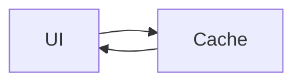

Không gọi network.

Ví dụ phù hợp:

```text
Settings
Downloaded playlist
Favorite offline
Draft
```

### Ưu điểm

* Cực nhanh.
* Không phụ thuộc network.
* Không tốn bandwidth.

### Nhược điểm

Dữ liệu có thể không cập nhật.

---

# 6.2 Network Only

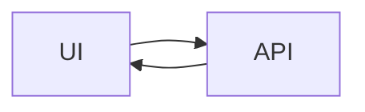

Không sử dụng cache.

Ví dụ:

```text
OTP verification
Thanh toán
Kiểm tra một trạng thái cần realtime cao
```

Không phù hợp với nội dung muốn hoạt động offline.

---

# 6.3 Cache First

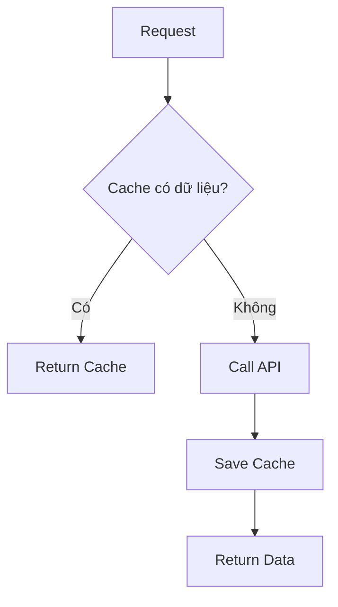

Pseudo code:

```kotlin
if (cache.exists()) {
    return cache
}

val remote = api.fetch()
cache.save(remote)

return remote
```

### Vấn đề

Nếu cache tồn tại mãi:

```text
Cache exists
     ↓
Không bao giờ gọi API
     ↓
Dữ liệu ngày càng cũ
```

Vì vậy thường phải kết hợp TTL.

---

# 6.4 Network First

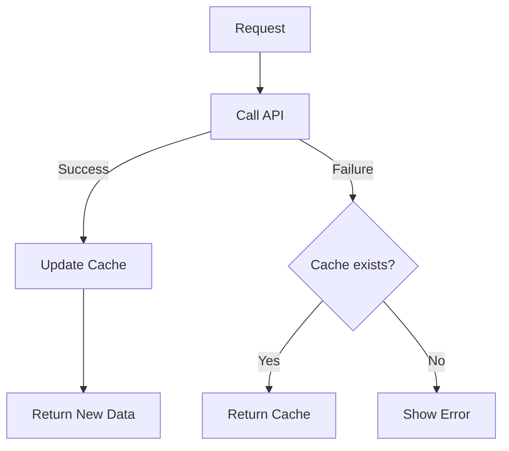

Phù hợp khi:

```text
Data freshness
     >
Offline speed
```

Ví dụ:

```text
Tỷ giá
Availability
Inventory
```

---

# 6.5 Stale While Revalidate

Một chiến lược UX rất hữu ích:

```text
Hiển thị cache ngay
       +
Refresh API ngầm
```

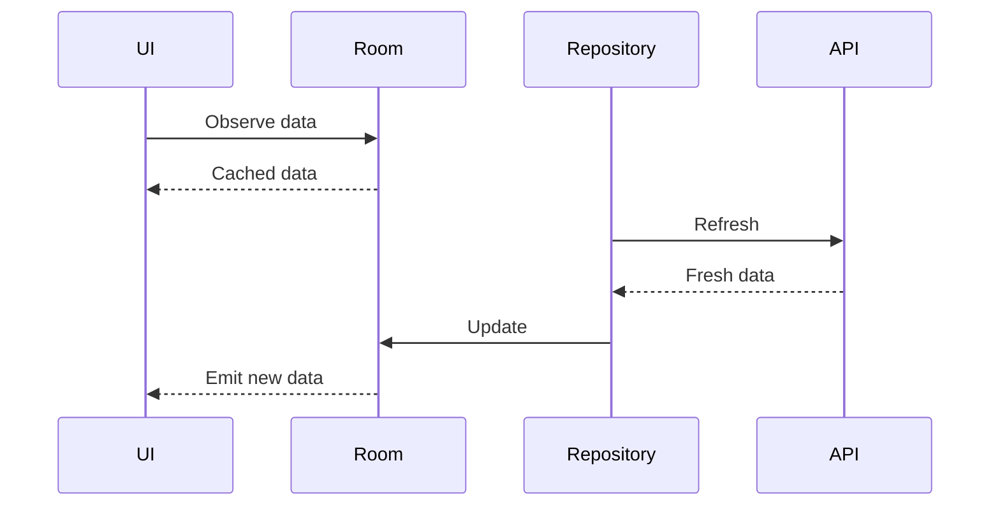

Kết quả:

```text
0 ms:
Cache xuất hiện

500 ms:
API trả dữ liệu mới

510 ms:
Room update

520 ms:
Flow emit

UI update
```

UI không phải đứng chờ network.

---

# 6.6 Offline-first Local Source of Truth

Đây là mô hình đặc biệt phù hợp với kiến trúc Android hiện đại:

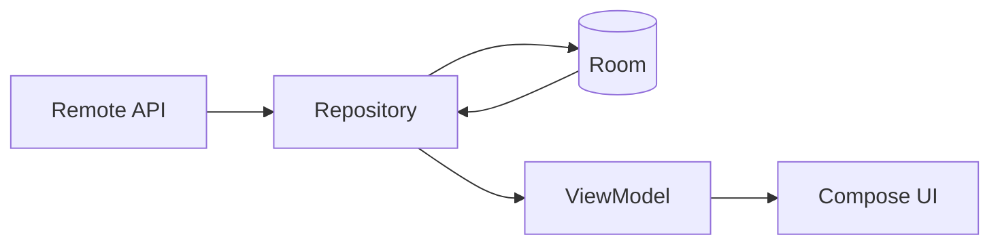

Điểm quan trọng:

```text
UI
 ↓
ViewModel
 ↓
Repository
 ↓
ROOM
```

thay vì:

```text
UI
 ↓
API
```

Network được Repository sử dụng để **đồng bộ/cập nhật local source**, trong khi higher layers tiếp tục quan sát local data. Đây chính là mô hình mà tài liệu offline-first của Android mô tả cho local source of truth. ([Android Developers][1])

---

# 7. Fresh, Stale và Expired

Một cache thường có metadata:

```text
lastUpdated
```

Ví dụ:

```text
Cache tạo lúc:
10:00

Hiện tại:
10:03

TTL:
5 phút
```

Ta có:

$$
Age = CurrentTime - CachedTime
$$

Cache còn fresh khi:

$$
Age < TTL
$$

Ví dụ:

```text
3 phút < 5 phút
```

→ `FRESH`.

Nếu:

```text
10:08
```

thì:

$$
8 > 5
$$

→ `STALE`.

---

## Trạng thái cache

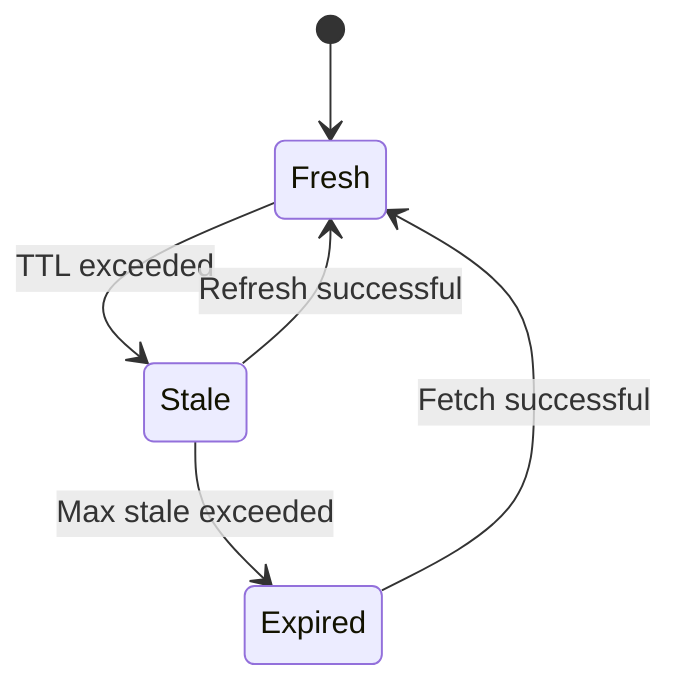

Có thể định nghĩa:

```kotlin
enum class CacheState {
    FRESH,
    STALE,
    EXPIRED
}
```

---

# 8. TTL - Time To Live

**TTL** quyết định một dữ liệu được coi là fresh bao lâu.

Ví dụ:

```kotlin
val ttl = 10.minutes
```

Không phải dữ liệu nào cũng nên có cùng TTL.

Ví dụ thiết kế:

| Loại dữ liệu         |              TTL minh họa |
| -------------------- | ------------------------: |
| Profile              |                   30 phút |
| News Feed            |                    5 phút |
| App configuration    |                    24 giờ |
| Product catalog      |                   15 phút |
| Static country list  |                  vài ngày |
| Stock/price realtime | rất ngắn hoặc không cache |

Các con số trên chỉ là ví dụ thiết kế, không phải chuẩn bắt buộc của Android. TTL phải xuất phát từ yêu cầu sản phẩm.

---

# 9. Cache Invalidation

Một trong những câu nổi tiếng trong software engineering là cache invalidation rất khó.

Giả sử user sửa:

```text
Username

Khánh
   ↓
An Khánh
```

nhưng cache vẫn là:

```text
Khánh
```

UI có thể hiển thị dữ liệu cũ.

Cache cần được invalidate hoặc update.

---

## Các trigger invalidate thường gặp

```text
User Logout
        ↓
Clear user cache
```

```text
User Update Profile
        ↓
Update local cache
```

```text
Pull To Refresh
        ↓
Force network refresh
```

```text
TTL expired
        ↓
Background refresh
```

```text
Server data changed
        ↓
Sync
```

---

# 10. Ví dụ Android hoàn chỉnh

Giả sử xây dựng:

```text
News App
```

Yêu cầu:

```text
- Đọc được khi offline.
- Hiện cache ngay khi mở.
- Cache fresh trong 10 phút.
- Quá 10 phút → refresh.
- Nếu refresh fail → vẫn giữ cache.
- Pull-to-refresh → bỏ qua TTL.
```

---

# 11. Entity

```kotlin
@Entity(tableName = "articles")
data class ArticleEntity(
    @PrimaryKey
    val id: Long,

    val title: String,

    val description: String
)
```

---

# 12. Cache Metadata

Không nhất thiết phải nhét metadata cache vào từng `Article`.

Có thể tạo riêng:

```kotlin
@Entity(tableName = "cache_metadata")
data class CacheMetadataEntity(

    @PrimaryKey
    val cacheKey: String,

    val lastSuccessfulSyncAt: Long
)
```

Ví dụ:

```text
cacheKey = articles
lastSuccessfulSyncAt = 1786554000000
```

---

# 13. DAO

```kotlin
@Dao
interface ArticleDao {

    @Query("SELECT * FROM articles ORDER BY id DESC")
    fun observeArticles(): Flow<List<ArticleEntity>>

    @Insert(onConflict = OnConflictStrategy.REPLACE)
    suspend fun insertAll(
        articles: List<ArticleEntity>
    )

    @Query("DELETE FROM articles")
    suspend fun clear()
}
```

Metadata DAO:

```kotlin
@Dao
interface CacheMetadataDao {

    @Query("""
        SELECT * 
        FROM cache_metadata
        WHERE cacheKey = :key
    """)
    suspend fun get(
        key: String
    ): CacheMetadataEntity?

    @Insert(onConflict = OnConflictStrategy.REPLACE)
    suspend fun upsert(
        metadata: CacheMetadataEntity
    )
}
```

Room hỗ trợ database cục bộ trên SQLite và đặc biệt phù hợp với lượng dữ liệu có cấu trúc đáng kể; Android cũng nêu caching nội dung để hỗ trợ truy cập offline là một use case phổ biến. ([Android Developers][2])

---

# 14. Định nghĩa CachePolicy

Không nên hard-code:

```kotlin
if (age > 600000)
```

khắp project.

Có thể đóng gói:

```kotlin
data class CachePolicy(
    val ttlMillis: Long
) {

    fun isFresh(
        lastUpdated: Long,
        now: Long
    ): Boolean {

        return now - lastUpdated < ttlMillis
    }
}
```

Khởi tạo:

```kotlin
val articleCachePolicy = CachePolicy(
    ttlMillis = 10 * 60 * 1000L
)
```

---

# 15. Remote API

Ví dụ:

```kotlin
interface ArticleApi {

    @GET("articles")
    suspend fun getArticles(): List<ArticleDto>
}
```

Mapper:

```kotlin
fun ArticleDto.toEntity(): ArticleEntity {

    return ArticleEntity(
        id = id,
        title = title,
        description = description
    )
}
```

---

# 16. Repository

Repository là nơi hợp lý để phối hợp:

```text
Room
+
API
+
Cache Policy
```

Android architecture guidance đặt repository trong data layer và repository có thể quản lý nhiều data source; offline-first guidance giao cho repository trách nhiệm phối hợp network với local data source. ([Android Developers][1])

```kotlin
class ArticleRepository(
    private val api: ArticleApi,
    private val articleDao: ArticleDao,
    private val metadataDao: CacheMetadataDao,
    private val cachePolicy: CachePolicy,
    private val now: () -> Long = {
        System.currentTimeMillis()
    }
) {

    fun observeArticles(): Flow<List<ArticleEntity>> {
        return articleDao.observeArticles()
    }

    suspend fun refreshIfNeeded(
        force: Boolean = false
    ) {

        val metadata =
            metadataDao.get("articles")

        val fresh =
            metadata != null &&
            cachePolicy.isFresh(
                lastUpdated =
                    metadata.lastSuccessfulSyncAt,
                now = now()
            )

        if (!force && fresh) {
            return
        }

        refresh()
    }

    private suspend fun refresh() {

        val remote =
            api.getArticles()

        articleDao.clear()

        articleDao.insertAll(
            remote.map {
                it.toEntity()
            }
        )

        metadataDao.upsert(
            CacheMetadataEntity(
                cacheKey = "articles",
                lastSuccessfulSyncAt = now()
            )
        )
    }
}
```

---

# 17. Luồng hoạt động

Khi user mở màn hình:

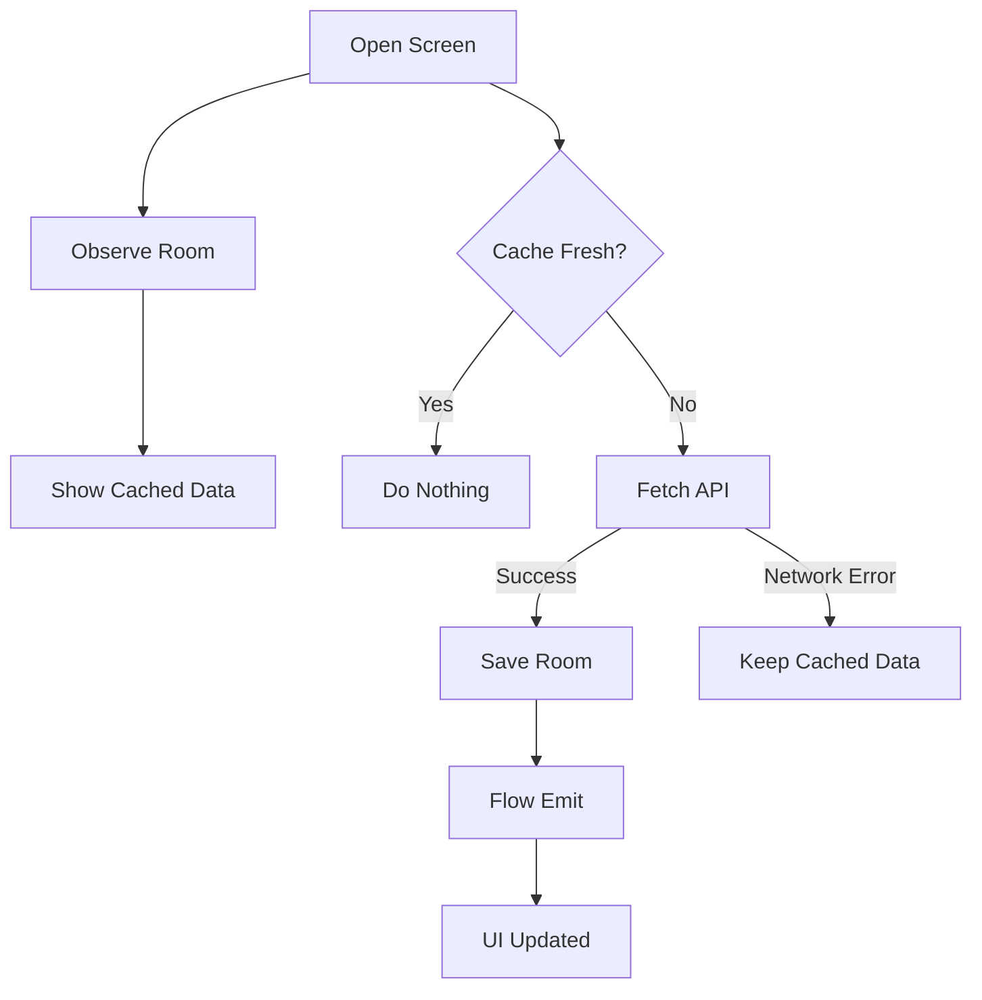

Đây là điểm khác biệt lớn:

### Không tốt

```text
API → UI
```

### Tốt cho offline-first

```text
API
 ↓
Room
 ↓
Flow
 ↓
UI
```

---

# 18. Xử lý lỗi Network

Không nên:

```kotlin
catch (e: Exception) {
    articleDao.clear()
}
```

Nếu network lỗi mà xóa cache:

```text
Có cache
  ↓
Network fail
  ↓
Clear DB
  ↓
User mất luôn dữ liệu offline
```

Không hợp lý.

Có thể:

```kotlin
suspend fun refresh(): Result<Unit> {

    return try {

        val remote =
            api.getArticles()

        articleDao.insertAll(
            remote.map {
                it.toEntity()
            }
        )

        Result.success(Unit)

    } catch (e: IOException) {

        Result.failure(e)
    }
}
```

Cache cũ vẫn nằm trong Room.

---

# 19. Stale cache không đồng nghĩa với bad cache

Điểm rất quan trọng:

```text
STALE
≠
DELETE
```

`STALE` chỉ có nghĩa:

> Dữ liệu nên được refresh.

Ví dụ:

```text
Cache age:
15 phút

TTL:
10 phút

Network:
Offline
```

Policy có thể quyết định:

```text
Display stale cache
+
show "Offline"
```

thay vì:

```text
Empty Screen
```

---

# 20. UI State

Có thể biểu diễn trạng thái:

```kotlin
data class ArticleUiState(
    val articles: List<ArticleEntity> =
        emptyList(),

    val isRefreshing: Boolean =
        false,

    val isOffline: Boolean =
        false,

    val error: String? =
        null
)
```

---

# 21. ViewModel

```kotlin
class ArticleViewModel(
    private val repository: ArticleRepository
) : ViewModel() {

    val articles =
        repository
            .observeArticles()
            .stateIn(
                scope = viewModelScope,
                started =
                    SharingStarted
                        .WhileSubscribed(5_000),
                initialValue = emptyList()
            )

    init {

        viewModelScope.launch {

            runCatching {
                repository.refreshIfNeeded()
            }
        }
    }

    fun refresh() {

        viewModelScope.launch {

            runCatching {
                repository.refreshIfNeeded(
                    force = true
                )
            }
        }
    }
}
```

`ViewModel` phù hợp với business UI state vì nó tồn tại qua quá trình `Activity` recreation/configuration changes, trong khi dữ liệu lâu dài vẫn nên được khôi phục từ data layer khi cần. ([Android Developers][3])

---

# 22. Compose UI

```kotlin
@Composable
fun ArticleScreen(
    viewModel: ArticleViewModel
) {

    val articles by
        viewModel
            .articles
            .collectAsStateWithLifecycle()

    LazyColumn {

        items(
            articles,
            key = {
                it.id
            }
        ) { article ->

            Text(
                text = article.title
            )
        }
    }
}
```

Android hiện khuyến nghị `collectAsStateWithLifecycle()` khi collect `Flow` trong Compose trên Android vì collection được thực hiện theo lifecycle của UI. ([Android Developers][4])

---

# 23. Lifecycle ảnh hưởng Cache Policy như thế nào?

Giả sử:

```text
Open App
 ↓
Fetch API
 ↓
Rotate Device
```

Nếu refresh nằm trực tiếp trong composable:

```kotlin
@Composable
fun Screen() {
    // gọi API không kiểm soát
}
```

có nguy cơ tạo lại logic không cần thiết.

Thiết kế tốt hơn:

```text
Compose
   ↓
ViewModel
   ↓
Repository
   ↓
Cache Policy
```

Repository quyết định:

```text
Cache fresh?
   ↓
YES
   ↓
Không gọi API
```

Nhờ đó rotate không tự động đồng nghĩa với:

```text
New network request
```

và dữ liệu Room vẫn là nguồn dữ liệu bền vững hơn vòng đời của UI. `ViewModel` cũng được thiết kế để giữ business state qua `Activity` recreation. ([Android Developers][3])

---

# 24. Pull To Refresh

User kéo refresh:

```text
Pull
 ↓
force = true
 ↓
Ignore TTL
 ↓
Call API
```

```kotlin
fun refresh() {

    viewModelScope.launch {

        repository.refreshIfNeeded(
            force = true
        )
    }
}
```

Tức là:

```text
Automatic refresh
       ↓
Respect TTL

Manual refresh
       ↓
Ignore TTL
```

---

# 25. Background Refresh

Không phải cache nào cũng cần background sync.

Nhưng với dữ liệu cần cập nhật ngay cả khi user rời màn hình, có thể cân nhắc **WorkManager**.

Android mô tả WorkManager là giải pháp cho deferred/reliable background work cần tiếp tục đáng tin cậy ngay cả khi user rời màn hình, app thoát hoặc thiết bị reboot; periodic application-data synchronization là một ví dụ điển hình. ([Android Developers][5])

---

## Network Constraint

```kotlin
val constraints =
    Constraints.Builder()
        .setRequiredNetworkType(
            NetworkType.CONNECTED
        )
        .build()

val work =
    OneTimeWorkRequestBuilder<
        ArticleSyncWorker
    >()
        .setConstraints(
            constraints
        )
        .build()

WorkManager
    .getInstance(context)
    .enqueue(work)
```

WorkManager hỗ trợ constraints như trạng thái network, battery, charging và storage; nếu constraint không đáp ứng thì công việc có thể được trì hoãn tới khi phù hợp. ([Android Developers][6])

---

# 26. Retry Policy

Một request mạng có thể lỗi:

```text
Server unavailable
Connection timeout
Temporary network failure
```

WorkManager hỗ trợ:

```text
Result.retry()
```

cùng:

```text
LINEAR

hoặc

EXPONENTIAL
```

backoff. ([Android Developers][6])

Ví dụ:

```kotlin
return try {

    repository.sync()

    Result.success()

} catch (e: IOException) {

    Result.retry()
}
```

---

# 27. Không retry mọi lỗi

Policy không nên coi mọi error giống nhau.

Ví dụ:

```text
IOException
Timeout
HTTP 503
```

→ có thể retry.

Trong khi:

```text
401 Unauthorized
```

không nên retry liên tục trước khi có credentials hợp lệ. Hướng dẫn offline-first của Android cũng phân biệt lỗi mạng có thể retry với lỗi authorization cần được giải quyết trước. ([Android Developers][1])

---

# 28. Cache Policy cho Write

Cache policy không chỉ dành cho read.

Ví dụ app Todo:

```text
User Add Todo
```

Nếu offline:

```text
Không thể đợi API
```

Một chiến lược là:

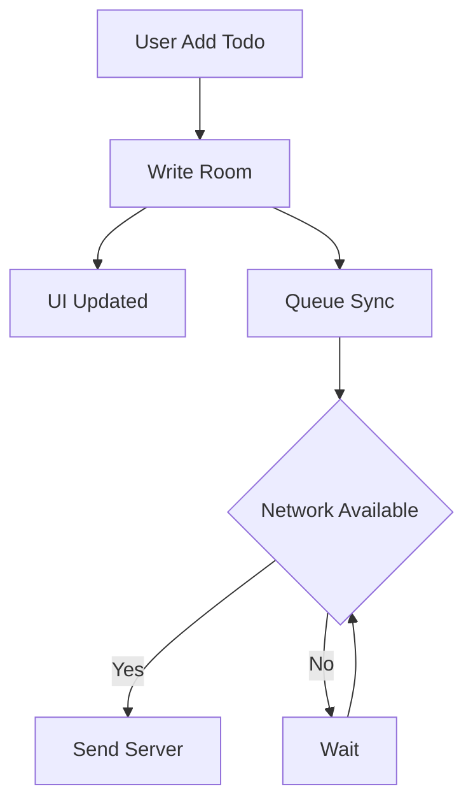

Đây gần với chiến lược **lazy write**: ghi local trước và đưa network write vào hàng đợi để xử lý khi có cơ hội. Android lưu ý chiến lược này hữu ích với dữ liệu quan trọng nhưng cần giải quyết xung đột khi local và server tái đồng bộ. ([Android Developers][1])

---

# 29. Cache và Synchronization

Cache:

```text
Remote
 ↓
Local
```

Synchronization có thể hai chiều:

```text
Remote
 ↕
Local
```

Ví dụ Todo:

```text
Offline:

Local:
Task A = completed

Server:
Task A = incomplete
```

Khi mạng trở lại:

```text
Conflict
```

Lúc này cache policy có thể cần kết hợp với:

```text
Conflict Resolution Policy
```

Ví dụ:

```text
Last Write Wins
Server Wins
Client Wins
Version based
Merge
```

Offline-first guidance của Android phân biệt pull/push synchronization và lưu ý cần reconcile local với remote khi kết nối trở lại. ([Android Developers][1])

---

# 30. Cache Metadata tốt hơn một Boolean

Không nên chỉ lưu:

```kotlin
isCached = true
```

Tốt hơn:

```kotlin
data class CacheMetadata(
    val lastSuccessfulSyncAt: Long,
    val version: Long?,
    val etag: String?
)
```

Sau đó policy có thể hỏi:

```text
Có cache?
Cache bao nhiêu tuổi?
Server version?
Lần sync cuối thành công?
```

---

# 31. Migration khi thêm Cache Metadata

Giả sử database `version = 1` chưa có:

```text
cache_metadata
```

Version 2 cần thêm bảng.

```kotlin
val MIGRATION_1_2 =
    object : Migration(1, 2) {

        override fun migrate(
            db: SupportSQLiteDatabase
        ) {

            db.execSQL(
                """
                CREATE TABLE IF NOT EXISTS
                cache_metadata (
                    cacheKey TEXT NOT NULL,
                    lastSuccessfulSyncAt INTEGER NOT NULL,
                    PRIMARY KEY(cacheKey)
                )
                """.trimIndent()
            )
        }
    }
```

Room hỗ trợ cả automatic migration và manual migration; những thay đổi schema phức tạp hơn có thể cần migration path do developer định nghĩa. ([Android Developers][7])

---

# 32. Những trường hợp lỗi quan trọng

## Trường hợp 1 — Không cache + mất mạng

```text
Room:
Empty

Network:
Offline
```

UI:

```text
Không có dữ liệu offline.
Thử lại khi có kết nối.
```

---

## Trường hợp 2 — Có cache stale + mất mạng

```text
Room:
Has data

TTL:
Expired

Network:
Offline
```

UI:

```text
Display cached data
+
Offline indicator
```

---

## Trường hợp 3 — Có cache + API 500

```text
Display cache
+
Refresh failed
```

Không cần phá bỏ dữ liệu đang dùng được.

---

## Trường hợp 4 — API trả dữ liệu mới

```text
API
 ↓
Room update
 ↓
Flow emit
 ↓
UI recompose
```

---

# 33. Một policy thực tế

Ví dụ app đọc tin:

```yaml
cache:
  storage: room

  ttl:
    articles: 10_minutes

  read:
    source_of_truth: local

  refresh:
    on_screen_open: if_stale
    pull_to_refresh: always
    background: optional

  network_failure:
    stale_cache: display
    empty_cache: show_error

  invalidation:
    logout: clear_user_data
```

Đây là kiểu tài liệu rất đáng đặt trong README của portfolio.

---

# 34. Testing Cache Policy

Cache logic nên test bằng **fake clock**, thay vì dùng thời gian thật.

Ví dụ:

```kotlin
@Test
fun freshCache_doesNotRefresh() =
    runTest {

        val now =
            1_000_000L

        val policy =
            CachePolicy(
                ttlMillis =
                    10 * 60 * 1000
            )

        val updatedAt =
            now - 5 * 60 * 1000

        assertTrue(
            policy.isFresh(
                updatedAt,
                now
            )
        )
    }
```

---

## Test stale

```kotlin
@Test
fun expiredTtl_cacheIsStale() {

    val now =
        1_000_000L

    val policy =
        CachePolicy(
            ttlMillis =
                10 * 60 * 1000
        )

    val updatedAt =
        now - 20 * 60 * 1000

    assertFalse(
        policy.isFresh(
            updatedAt,
            now
        )
    )
}
```

---

# 35. Test Matrix

| Cache          | Network     | Expected                 |
| -------------- | ----------- | ------------------------ |
| Fresh          | Online      | Show cache, không fetch  |
| Fresh          | Offline     | Show cache               |
| Stale          | Online      | Show cache → refresh     |
| Stale          | Offline     | Show stale cache         |
| Empty          | Online      | Fetch → cache → show     |
| Empty          | Offline     | Error/empty state        |
| Stale          | HTTP 500    | Keep stale cache         |
| Stale          | API success | Update Room              |
| Manual refresh | Online      | Force API                |
| Rotate         | Any         | Không mất persisted data |

---

# 36. Debug Cache Policy

Khi debug nên log:

```text
CACHE_READ

CACHE_HIT

CACHE_MISS

CACHE_STALE

REFRESH_START

REFRESH_SUCCESS

REFRESH_FAILURE
```

Ví dụ:

```kotlin
Log.d(
    "ArticleCache",
    "CACHE_STALE age=${age}ms"
)
```

Rất hữu ích để tìm lỗi:

```text
"Tại sao API không được gọi?"
```

hoặc:

```text
"Tại sao app liên tục gọi API?"
```

---

# 37. Anti-pattern: gọi API mỗi lần Compose recomposition

Không làm:

```kotlin
@Composable
fun ArticleScreen() {

    viewModel.loadArticles()

}
```

Vì composable có thể recompose nhiều lần.

Kiến trúc nên là:

```text
Composable
    ↓
observe state

ViewModel
    ↓
business events

Repository
    ↓
Cache policy
```

Android khuyến nghị Compose consume observable state bằng các state holder thích hợp, và `collectAsStateWithLifecycle()` là API được khuyến nghị cho Android `Flow`. ([Android Developers][4])

---

# 38. Anti-pattern: UI tự quyết định cache

Không nên:

```kotlin
if (System.currentTimeMillis() - lastUpdate > ...) {
    api.getArticles()
}
```

trong composable.

UI không nên biết:

```text
TTL
Cache database
Endpoint
Retry
Sync
```

Nên:

```text
UI
 ↓
ViewModel
 ↓
Repository
 ↓
Cache Policy
```

---

# 39. Anti-pattern: Network là Source of Truth nhưng vẫn gọi là Offline First

Nếu code:

```text
UI
 ↓
API
```

và chỉ khi API lỗi mới:

```text
Room
```

thì UX vẫn phụ thuộc mạnh vào network.

Mô hình offline-first mạnh hơn là:

```text
UI
 ↓
Room

API
 ↓
Repository
 ↓
Room
```

Android offline-first guidance nêu local data source nên là canonical source mà higher layers đọc từ đó, còn repository phụ trách network và cập nhật local data. ([Android Developers][1])

---

# 40. Cache Policy theo loại dữ liệu

Không nên áp dụng một policy cho toàn app.

Ví dụ:

```text
Repository
├── UserRepository
│    └── ProfileCachePolicy
│
├── ArticleRepository
│    └── NewsCachePolicy
│
└── ProductRepository
     └── ProductCachePolicy
```

Ví dụ:

```kotlin
object CachePolicies {

    val NEWS =
        CachePolicy(
            ttlMillis =
                5 * 60 * 1000
        )

    val PROFILE =
        CachePolicy(
            ttlMillis =
                30 * 60 * 1000
        )
}
```

Các TTL ở đây là lựa chọn product-specific.

---

# 41. Cache Policy và UX

Cache không chỉ là tối ưu performance.

Nó ảnh hưởng trực tiếp đến UX:

```text
Không cache:

Open screen
 ↓
Loading
 ↓
API
 ↓
Content
```

với cache:

```text
Open screen
 ↓
Cached Content
 ↓
Background Refresh
 ↓
Fresh Content
```

Do đó có thể cải thiện:

```text
Perceived startup speed
Offline usability
Network resilience
```

đồng thời giảm số request không cần thiết.

---

# 42. Cache Policy và Release Risk

Một thay đổi nhỏ:

```text
TTL:

5 phút
 ↓
24 giờ
```

có thể khiến user nhìn thấy dữ liệu cũ quá lâu.

Ngược lại:

```text
24 giờ
 ↓
1 giây
```

có thể biến cache gần như vô nghĩa và tạo lượng request lớn.

Vì vậy Cache Policy nên được xem như:

```text
Product decision
+
Architecture decision
+
Performance decision
```

chứ không chỉ là implementation detail.

---

# 43. Thực hành mini project

## Bài toán

Tạo:

```text
Offline Article App
```

Kiến trúc:

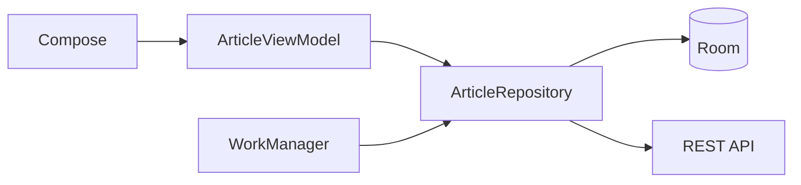

---

## Yêu cầu

### Local model

```text
ArticleEntity
```

### Remote model

```text
ArticleDto
```

### Cache metadata

```text
lastSuccessfulSyncAt
```

### Policy

```text
TTL = 10 phút
```

### Behavior

```text
Fresh cache
→ không API

Stale cache
→ show cache
→ refresh API

No cache
→ fetch API

Offline + cache
→ show cache

Offline + no cache
→ error

Pull refresh
→ force API
```

---

# 44. Bài tập

Triển khai một repository với hành vi:

```text
Screen opened
      ↓
Read Room
      ↓
Display cache
      ↓
Check TTL
      ↓
Fresh?
```

Nếu:

```text
YES
```

→ kết thúc.

Nếu:

```text
NO
```

→ gọi API.

Nếu API:

```text
SUCCESS
```

→ update Room.

Nếu API:

```text
FAIL
```

→ giữ cache cũ.

---

# 45. Bài tập nâng cao

Thêm trạng thái:

```kotlin
sealed interface DataFreshness {

    data object Fresh :
        DataFreshness

    data object Stale :
        DataFreshness

    data object Offline :
        DataFreshness
}
```

UI có thể hiển thị:

```text
Latest

Cached

Offline
```

để user hiểu trạng thái dữ liệu.

---

# 46. Artifact cho Portfolio

Có thể tạo project:

```text
android-offline-cache-demo/
```

Cấu trúc:

```text
data/
├── local/
│   ├── ArticleEntity.kt
│   ├── ArticleDao.kt
│   └── AppDatabase.kt
│
├── remote/
│   ├── ArticleApi.kt
│   └── ArticleDto.kt
│
├── repository/
│   └── ArticleRepository.kt
│
└── cache/
    └── CachePolicy.kt

ui/
├── ArticleViewModel.kt
└── ArticleScreen.kt

worker/
└── ArticleSyncWorker.kt
```

README nên chứa sơ đồ:

```text
              Network
                 │
                 ▼
              API
                 │
                 ▼
UI ◄── Flow ◄── Room ◄── Repository
                           ▲
                           │
                      WorkManager
```

---

# 47. Nội dung README đề xuất

```markdown
# Offline First Cache Demo

## Features

- Room local cache
- Retrofit remote API
- Cache TTL
- Stale-while-revalidate
- Offline fallback
- Pull-to-refresh
- Flow reactive updates
- WorkManager background sync

## Cache Policy

TTL: 10 minutes

Read source:
Room

Refresh:
Remote API

Failure:
Keep stale local cache
```

---

# 48. Checklist hoàn thành

* [ ] Giải thích được Cache Policy.
* [ ] Phân biệt cache implementation và cache policy.
* [ ] Hiểu Cache Only.
* [ ] Hiểu Network Only.
* [ ] Hiểu Cache First.
* [ ] Hiểu Network First.
* [ ] Hiểu Stale While Revalidate.
* [ ] Hiểu Local Source of Truth.
* [ ] Biết TTL là gì.
* [ ] Phân biệt fresh và stale.
* [ ] Có chiến lược cache invalidation.
* [ ] Cache dữ liệu bằng Room.
* [ ] Repository điều phối local và remote.
* [ ] UI không gọi API trực tiếp.
* [ ] Flow phát dữ liệu Room tới UI.
* [ ] Compose collect Flow theo lifecycle.
* [ ] Có fallback khi offline.
* [ ] Không xóa cache chỉ vì network error.
* [ ] Pull-to-refresh có thể force refresh.
* [ ] Test cache fresh.
* [ ] Test cache stale.
* [ ] Test offline + cache.
* [ ] Test offline + empty cache.
* [ ] Có migration nếu thay đổi schema.
* [ ] Biết khi nào cần WorkManager.
* [ ] Có README mô tả policy.
* [ ] Có artifact nhỏ cho portfolio.

---

# 49. Câu hỏi phỏng vấn

### Cache Policy là gì?

Một câu trả lời tốt:

> Cache Policy là tập hợp quy tắc xác định khi nào ứng dụng sử dụng dữ liệu cache, khi nào cache được xem là stale, khi nào cần refresh từ remote và ứng dụng xử lý thế nào khi network thất bại.

---

### TTL dùng để làm gì?

> TTL xác định khoảng thời gian cache được xem là fresh. Khi vượt quá TTL, dữ liệu có thể vẫn được sử dụng nhưng thường nên trigger một quá trình refresh.

---

### Stale cache có phải xóa ngay không?

Không.

```text
Stale
```

thường có nghĩa:

```text
Nên refresh
```

chứ không nhất thiết là:

```text
Không được sử dụng.
```

---

### Offline-first nên đọc từ đâu?

Một pattern được Android hướng dẫn là:

```text
UI
 ↓
Repository
 ↓
Local Source of Truth
```

Network được repository dùng để đồng bộ và cập nhật local source. ([Android Developers][1])

---

### Room đóng vai trò gì?

Room có thể làm:

```text
Persistent Local Cache
+
Offline Database
+
Local Source of Truth
```

cho structured data. ([Android Developers][2])

---

### Khi nào dùng WorkManager?

Khi công việc sync là **deferrable nhưng cần thực thi đáng tin cậy**, kể cả khi user rời màn hình, app thoát hoặc thiết bị restart. Android liệt kê periodic application-data synchronization là một ví dụ phù hợp. ([Android Developers][5])

---

# 50. Sơ đồ tổng kết

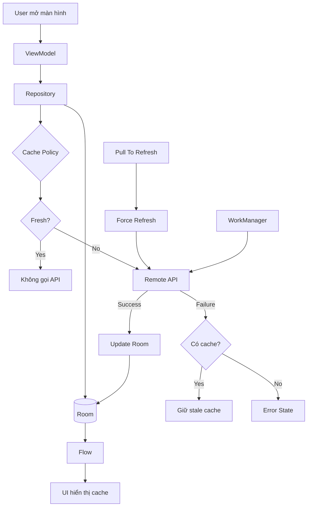

---

# 51. Mental Model cần nhớ

Hãy nhớ Cache Policy bằng công thức:

```text
Cache Policy
    =
Where
+
When
+
Freshness
+
Fallback
+
Invalidation
+
Synchronization
```

Và trong một Android app offline-first:

```text
             Refresh
                │
                ▼
Remote API → Repository
                │
                ▼
              Room
                │
               Flow
                │
                ▼
            ViewModel
                │
                ▼
            Compose UI
```

**Quy tắc quan trọng nhất của bài:**

```text
UI không cần hỏi:

"Internet có hoạt động không?"

UI chỉ cần:

"Hiện tại tôi có state gì để hiển thị?"
```

Repository + Cache Policy chịu trách nhiệm quyết định dữ liệu phải đến từ đâu và khi nào cần refresh. Đây là cách tách data handling khỏi UI và phù hợp với mô hình data layer/offline-first mà Android hướng dẫn. ([Android Developers][1])

### Tài liệu chính thức tham khảo

* **Build an offline-first app — Android Developers:** mô hình local/network data source, source of truth, retry, synchronization và lazy writes. ([Android Developers][1])
* **Data layer — Android Developers:** vai trò Repository và source of truth. ([Android Developers][8])
* **Room — Android Developers:** database cục bộ và caching cho offline usage. ([Android Developers][2])
* **WorkManager — Android Developers:** reliable background synchronization, constraints và retry/backoff. ([Android Developers][6])
* **State and Jetpack Compose:** lifecycle-aware Flow collection với `collectAsStateWithLifecycle()`. ([Android Developers][4])

[1]: https://developer.android.com/topic/architecture/data-layer/offline-first?utm_source=chatgpt.com "Build an offline-first app | App architecture"
[2]: https://developer.android.com/training/data-storage/room?utm_source=chatgpt.com "Save data in a local database using Room"
[3]: https://developer.android.com/topic/architecture/ui-layer/stateholders?utm_source=chatgpt.com "State holders and UI state | App architecture"
[4]: https://developer.android.com/develop/ui/compose/state?utm_source=chatgpt.com "State and Jetpack Compose"
[5]: https://developer.android.com/develop/background-work/background-tasks/persistent?utm_source=chatgpt.com "Task scheduling | Background work"
[6]: https://developer.android.com/develop/background-work/background-tasks/persistent/getting-started/define-work?utm_source=chatgpt.com "Define work requests | Background work"
[7]: https://developer.android.com/training/data-storage/room/migrating-db-versions?utm_source=chatgpt.com "Migrate your Room database | App data and files"
[8]: https://developer.android.com/topic/architecture/data-layer?utm_source=chatgpt.com "Data layer | App architecture"

---

# Bài luyện tập

## Mục tiêu


## Đề bài


## Yêu cầu hoàn thành

- [ ] 
- [ ] 
- [ ] 

## Kết quả / lời giải


## Ghi chú
