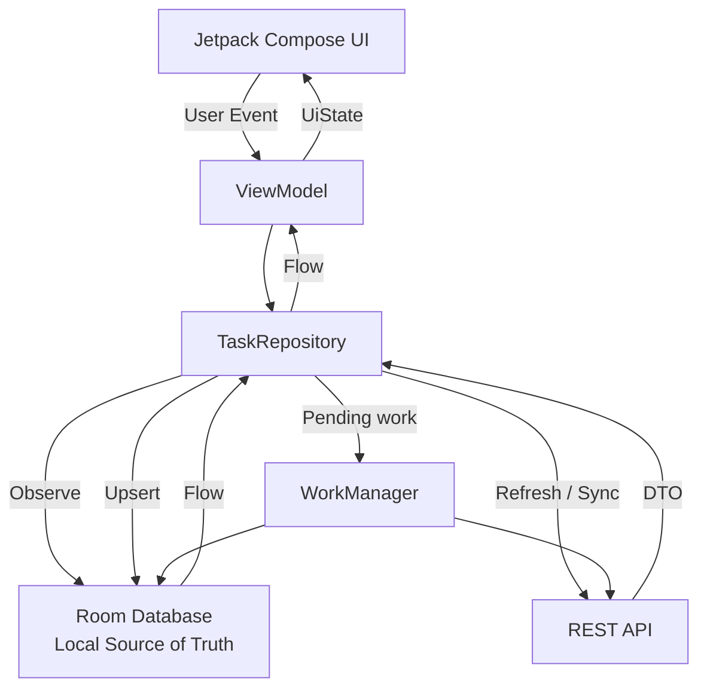
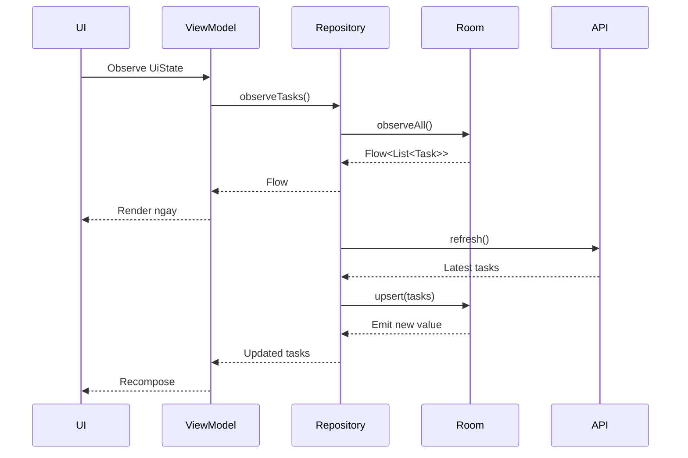
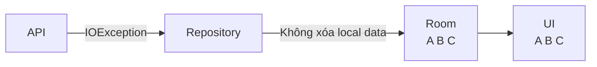
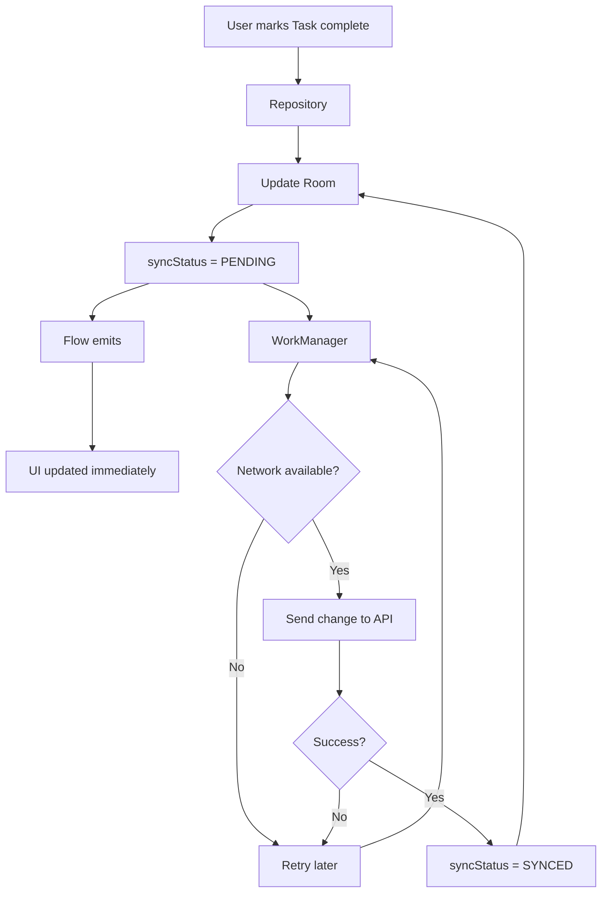
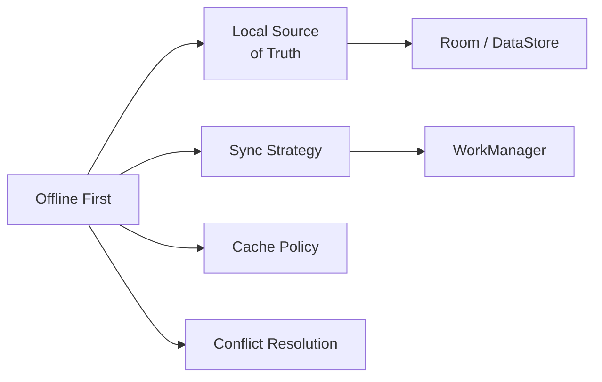
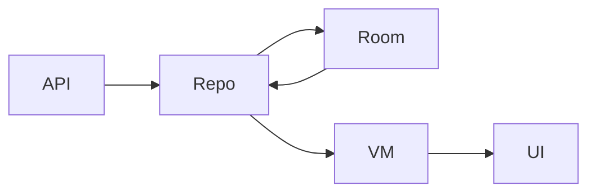
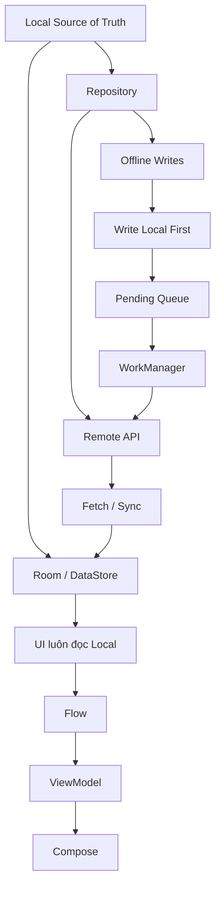

[](https://developer.android.com/topic/architecture/data-layer/offline-first?utm_source=chatgpt.com)

# 021 - Local Source of Truth

**Học phần:** 03 - Architecture, State and Data
**Module:** Module 06 - Storage
**Nhóm nội dung:** Offline Design
**Nguồn roadmap:** Storage / Offline Design
**Loại bài:** `storage`
**Thứ tự trong module:** 021
**Thời lượng gợi ý:** 32 phút

---

## 1. Tóm tắt

**Local Source of Truth** là cách thiết kế trong đó dữ liệu cục bộ trên thiết bị — thường là **Room Database** hoặc DataStore — trở thành nguồn dữ liệu chuẩn mà các tầng phía trên của ứng dụng đọc.

Trong kiến trúc **offline-first**, Android khuyến nghị local data source là **canonical source of truth** và là nguồn độc quyền mà UI/domain đọc dữ liệu. Network không nên đưa dữ liệu trực tiếp lên UI; thay vào đó:

```text
API
 ↓
Repository
 ↓
Local Database
 ↓
Flow
 ↓
ViewModel
 ↓
UI
```

Khi API trả dữ liệu mới, Repository cập nhật database. Database thay đổi → `Flow` phát giá trị mới → ViewModel nhận → UI render lại. Nhờ vậy, app có cùng một luồng dữ liệu dù đang online hay offline. ([Android Developers][1])

> **Ý quan trọng nhất:**
> UI không hỏi: *"Có mạng không? Nếu có thì đọc API, không thì đọc DB."*
> UI chỉ đọc **local source of truth**.

---

## 2. Mục tiêu học tập

Sau bài này, bạn nên có thể:

* Giải thích được **Local Source of Truth** bằng ngôn ngữ của mình.
* Phân biệt **Source of Truth**, **Local Source of Truth** và **Cache**.
* Hiểu vai trò của:

  * Room
  * Repository
  * API
  * Flow
  * ViewModel
  * WorkManager
* Thiết kế luồng đọc dữ liệu offline-first.
* Thiết kế luồng ghi dữ liệu khi mất mạng.
* Hiểu vấn đề stale data và conflict.
* Viết được một Repository trong đó UI chỉ quan sát local database.
* Test được DAO, Repository và migration.
* Biến ví dụ thành một artifact nhỏ cho portfolio.

---

# 3. Local Source of Truth là gì?

Android định nghĩa **Single Source of Truth — SSOT** là nơi sở hữu một loại dữ liệu cụ thể. Những thành phần khác không tự ý sửa dữ liệu đó mà phải gửi event hoặc gọi API của chủ sở hữu dữ liệu. Pattern này giúp tập trung thay đổi dữ liệu, dễ truy vết và giảm trạng thái mâu thuẫn. ([Android Developers][2])

Trong một Repository thông thường, SSOT có thể là:

* database,
* memory cache,
* network,
* hoặc nguồn khác.

Nhưng nếu cần **offline-first**, Android khuyến nghị dùng local data source, chẳng hạn database, làm source of truth. ([Android Developers][3])

### Định nghĩa ngắn

> **Local Source of Truth là dữ liệu cục bộ được ứng dụng xem như trạng thái chuẩn để đọc và hiển thị; dữ liệu từ network phải được đồng bộ vào local source trước khi UI sử dụng.**

---

# 4. Source of Truth, Local Source of Truth và Cache

Ba khái niệm này rất dễ bị nhầm.

| Khái niệm                 | Ý nghĩa                                  |
| ------------------------- | ---------------------------------------- |
| **Source of Truth**       | Nguồn dữ liệu được ứng dụng xem là chuẩn |
| **Local Source of Truth** | Source of Truth nằm trên thiết bị        |
| **Cache**                 | Bản sao dữ liệu có thể bị xóa và tải lại |

Ví dụ:

```text
Server
Article #10 = "Android Offline First"

Local DB
Article #10 = "Android Offline First"

UI
Hiển thị dữ liệu từ Local DB
```

Local DB không đơn thuần là:

```text
"Nếu API chết thì lấy cache ra dùng."
```

Mà là:

```text
UI luôn đọc Local DB.

API chỉ có nhiệm vụ làm Local DB mới hơn.
```

Đây là khác biệt rất quan trọng giữa **cache fallback** và kiến trúc **local source of truth**.

---

# 5. Vị trí trong Android Architecture

Theo kiến trúc Android hiện đại, application thường có ít nhất:

```text
UI Layer
   ↓
Data Layer
```

và có thể thêm Domain Layer khi business logic phức tạp. Android cũng khuyến nghị UI/ViewModel không giao tiếp trực tiếp với database hoặc network data source mà sử dụng Repository làm ranh giới data layer. ([Android Developers][4])



Điểm cần nhớ:

```text
API ─────X────→ UI

API → Repository → Local DB → Flow → UI
```

Android mô tả local data source trong offline-first app là canonical source of truth và khuyến nghị domain/UI không giao tiếp trực tiếp với network layer. ([Android Developers][1])

---

# 6. Luồng đọc dữ liệu

Giả sử xây dựng ứng dụng **Todo**.

## Trường hợp 1: App vừa mở, có dữ liệu local



Kết quả UX:

```text
0 ms        → đọc dữ liệu local
vài trăm ms → UI đã có nội dung

sau đó       → network refresh
API hoàn tất → database thay đổi
             → UI tự cập nhật
```

Không cần chờ API mới hiển thị screen.

Android đặc biệt khuyến nghị app offline-first hiển thị local data ngay thay vì chờ network request hoàn thành hoặc thất bại. ([Android Developers][1])

---

# 7. Trường hợp mất mạng

Giả sử Room đang có:

```text
Task A
Task B
Task C
```

Network request thất bại.



UI vẫn có:

```text
Task A
Task B
Task C
```

Có thể bổ sung thông báo:

```text
Offline
Hiển thị dữ liệu được đồng bộ gần nhất.
```

Điều không nên làm:

```kotlin
catch (e: IOException) {
    dao.deleteAll()
}
```

Network lỗi **không có nghĩa dữ liệu local không còn hợp lệ**.

---

# 8. Ví dụ thực hành với Room

Ví dụ sử dụng một entity `Task`.

> **Ghi chú 2026:** Room 3.0 đã chuyển sang package `androidx.room3`, dùng KSP và hướng coroutine-first. Các DAO one-shot bất đồng bộ dùng `suspend`, còn observable query có thể dùng `Flow`. ([Android Developers][5])

## 8.1 Entity

```kotlin
@Entity(tableName = "tasks")
data class TaskEntity(
    @PrimaryKey
    val id: String,

    val title: String,

    val completed: Boolean,

    val updatedAt: Long,

    val syncStatus: String = "SYNCED"
)
```

Ví dụ dữ liệu:

```text
tasks
──────────────────────────────────────────
id   title          completed   syncStatus
1    Learn Room     false       SYNCED
2    Learn Flow     true        SYNCED
3    Learn Offline  false       PENDING
```

---

# 9. DAO — Local Data Source

Room DAO là lớp abstraction để truy vấn và thay đổi database. Android khuyến nghị sử dụng DAO thay vì để các lớp khác thực hiện database query trực tiếp. ([Android Developers][6])

```kotlin
@Dao
interface TaskDao {

    @Query("""
        SELECT *
        FROM tasks
        ORDER BY updatedAt DESC
    """)
    fun observeTasks(): Flow<List<TaskEntity>>

    @Query("""
        SELECT *
        FROM tasks
        WHERE id = :id
    """)
    suspend fun getTask(id: String): TaskEntity?

    @Upsert
    suspend fun upsert(task: TaskEntity)

    @Upsert
    suspend fun upsertAll(tasks: List<TaskEntity>)

    @Query("""
        SELECT *
        FROM tasks
        WHERE syncStatus = 'PENDING'
    """)
    suspend fun getPendingTasks(): List<TaskEntity>
}
```

Observable Room queries có thể trả về `Flow`; khi table liên quan thay đổi, query có thể phát giá trị mới để các tầng trên cập nhật UI. ([Android Developers][7])

---

# 10. Network Data Source

Remote model không nhất thiết giống database model.

```kotlin
data class TaskDto(
    val id: String,
    val title: String,
    val completed: Boolean,
    val updatedAt: Long
)
```

Mapper:

```kotlin
fun TaskDto.toEntity(): TaskEntity {
    return TaskEntity(
        id = id,
        title = title,
        completed = completed,
        updatedAt = updatedAt,
        syncStatus = "SYNCED"
    )
}
```

Android cũng minh họa pattern tách riêng network model, database entity và model exposed cho tầng ngoài data layer để giảm coupling. ([Android Developers][1])

---

# 11. Repository — phần quan trọng nhất

```kotlin
class TaskRepository(
    private val taskDao: TaskDao,
    private val api: TaskApi
) {

    fun observeTasks(): Flow<List<TaskEntity>> {
        return taskDao.observeTasks()
    }

    suspend fun refresh() {
        val remoteTasks = api.getTasks()

        taskDao.upsertAll(
            remoteTasks.map { it.toEntity() }
        )
    }
}
```

Điểm quan trọng:

```kotlin
fun observeTasks(): Flow<List<TaskEntity>> {
    return taskDao.observeTasks()
}
```

Không phải:

```kotlin
fun observeTasks(): Flow<List<TaskDto>> {
    return api.observeTasks()
}
```

### Quy tắc

```text
READ
UI ← ViewModel ← Repository ← Room

SYNC
API → Repository → Room
```

Network không phải con đường đọc của UI.

---

# 12. ViewModel

```kotlin
class TaskViewModel(
    private val repository: TaskRepository
) : ViewModel() {

    val tasks = repository
        .observeTasks()
        .stateIn(
            scope = viewModelScope,
            started = SharingStarted.WhileSubscribed(5_000),
            initialValue = emptyList()
        )

    fun refresh() {
        viewModelScope.launch {
            runCatching {
                repository.refresh()
            }
        }
    }
}
```

Android hướng dẫn chuyển repository `Flow` thành `StateFlow` trong ViewModel, sau đó Compose thu thập state theo lifecycle. ([Android Developers][1])

---

# 13. Compose UI

```kotlin
@Composable
fun TaskScreen(
    viewModel: TaskViewModel
) {

    val tasks by viewModel.tasks
        .collectAsStateWithLifecycle()

    LazyColumn {
        items(tasks) { task ->
            Text(task.title)
        }
    }
}
```

UI không biết:

```text
Room
Retrofit
REST
SQLite
WorkManager
```

Nó chỉ biết:

```text
UiState
```

Đây là separation of concerns.

---

# 14. Ghi dữ liệu theo Local Source of Truth

Đọc dữ liệu offline khá đơn giản.

**Ghi dữ liệu offline phức tạp hơn.**

Android chia chiến lược write offline-first thành ba nhóm:

1. Online-only writes.
2. Queued writes.
3. Lazy writes.

Với dữ liệu quan trọng như Todo, Android mô tả **lazy write** là lưu local trước rồi queue việc gửi lên server. ([Android Developers][1])

---

## Ví dụ: đánh dấu Task hoàn thành

User nhấn:

```text
☑ Learn Offline First
```

### Không nên

```text
User
 ↓
API
 ↓ chờ server
Local DB
 ↓
UI
```

Nếu mất mạng:

```text
API FAILED
↓
User tưởng thao tác bị mất
```

### Local-first write

```text
User
 ↓
Update Room
 ↓
UI thay đổi ngay
 ↓
Queue sync
 ↓
API
```

---

# 15. Code Lazy Write

```kotlin
suspend fun setCompleted(
    taskId: String,
    completed: Boolean
) {

    val current = taskDao.getTask(taskId)
        ?: return

    val updated = current.copy(
        completed = completed,
        updatedAt = System.currentTimeMillis(),
        syncStatus = "PENDING"
    )

    taskDao.upsert(updated)

    scheduleSync()
}
```

UI phản ứng gần như ngay lập tức vì:

```text
Room changed
 ↓
Flow emit
 ↓
StateFlow
 ↓
Compose recomposition
```

Network có thể sync vài giây hoặc vài phút sau.

---

# 16. Pending Sync Queue

Một kiến trúc production có thể lưu trạng thái:

```text
SYNCED
PENDING
FAILED
```

Ví dụ:

```text
TaskEntity
    │
    ├── SYNCED
    │
    ├── PENDING
    │
    └── FAILED
```

Background worker:

```kotlin
suspend fun synchronizePendingTasks() {

    val tasks = taskDao.getPendingTasks()

    tasks.forEach { task ->

        api.updateTask(
            id = task.id,
            completed = task.completed
        )

        taskDao.upsert(
            task.copy(
                syncStatus = "SYNCED"
            )
        )
    }
}
```

Android gợi ý các queue cần sống lâu qua process restart có thể được lưu trong Room và drain bằng persistent work như WorkManager. ([Android Developers][1])

---

# 17. Sơ đồ write hoàn chỉnh



---

# 18. Vấn đề stale data

Local Source of Truth không có nghĩa local data lúc nào cũng mới nhất.

Có thể xảy ra:

```text
Server
Task title = "Learn Room 3"

Local
Task title = "Learn Room"
```

Local vẫn là:

```text
source of truth của app hiện tại
```

nhưng đang:

```text
STALE
```

Android lưu ý local và network có thể tạm thời đi sau nhau và Repository chịu trách nhiệm đồng bộ hai nguồn. ([Android Developers][1])

---

# 19. Staleness Policy

Có thể lưu:

```kotlin
data class SyncMetadata(
    val lastSyncAt: Long
)
```

Và áp dụng policy:

```text
App open
   ↓
Read local immediately
   ↓
Check lastSyncAt
   ↓
Older than threshold?
   ├─ No  → stop
   └─ Yes → refresh API
                ↓
             update Room
```

Ví dụ UI:

```text
My Tasks

✓ Learn Kotlin
✓ Learn Room
○ Learn Offline First

Last updated 12 minutes ago
```

Thay vì loading toàn màn hình chỉ vì đang refresh.

---

# 20. Local Source of Truth và Cache Policy

Hai bài liên quan nhưng khác nhau.

```text
Cache Policy
        │
        ├── cache bao lâu?
        ├── khi nào stale?
        └── khi nào refresh?

Local Source of Truth
        │
        ├── UI tin nguồn nào?
        ├── ai sở hữu dữ liệu?
        └── network update nguồn nào?
```

Ví dụ:

```text
Local Source of Truth = Room

Cache Policy:
TTL = 15 phút
```

Khi app mở:

```text
Room → UI ngay

if age > 15 phút:
    API → Room
```

---

# 21. Local Source of Truth và Offline First

Quan hệ:



**Local Source of Truth chỉ là một phần của Offline First.**

Offline-first còn phải giải quyết:

* stale data,
* network retry,
* sync queue,
* conflict,
* pagination,
* authentication expiry,
* process death,
* migration.

---

# 22. Conflict Resolution

Giả sử:

```text
12:00 Local
Task = Completed

12:01 Server
Task = Not Completed
```

Khi sync:

```text
Local ≠ Remote
```

Repository cần biết ai thắng.

Một số policy phổ biến:

```text
Last Write Wins

Local Wins

Server Wins

Merge

Version-based resolution
```

Ví dụ Last Write Wins:

```kotlin
if (local.updatedAt > remote.updatedAt) {
    upload(local)
} else {
    saveLocal(remote)
}
```

Android lưu ý conflict resolution là một trong những phần khó của lazy writes và synchronization. ([Android Developers][1])

---

# 23. Lifecycle

Local Source of Truth có lợi thế lớn so với lưu dữ liệu screen đơn thuần trong Activity.

```text
Rotation
   ↓
Activity recreated
   ↓
ViewModel / Repository
   ↓
Room
   ↓
Flow
   ↓
UI restored
```

Nếu process bị Android kill:

```text
Process killed
      ↓
RAM state mất

Room database
      ↓
vẫn tồn tại trên disk

Process restarted
      ↓
Room → Flow → UI
```

Android khuyến nghị persistent data models vì chúng không phụ thuộc UI lifecycle và giúp tránh mất dữ liệu khi process bị giải phóng hoặc khi network không ổn định. ([Android Developers][2])

---

# 24. State nên chia như thế nào?

Không nên chỉ có:

```kotlin
Loading
Success
Error
```

Vì offline-first có thể:

```text
Có data local
+
đang refresh
+
network lỗi
```

Một model tốt hơn:

```kotlin
data class TaskUiState(
    val tasks: List<Task> = emptyList(),
    val refreshing: Boolean = false,
    val offline: Boolean = false,
    val error: String? = null
)
```

Ví dụ:

```text
tasks = [A, B, C]
refreshing = false
offline = true
error = null
```

UI:

```text
┌─────────────────────────┐
│ Offline                 │
├─────────────────────────┤
│ ✓ Task A                │
│ ○ Task B                │
│ ○ Task C                │
└─────────────────────────┘
```

Thay vì:

```text
NETWORK ERROR
```

và làm biến mất dữ liệu đang có.

---

# 25. Migration

Giả sử version 1:

```text
tasks
id
title
completed
updatedAt
```

Version 2 thêm:

```text
syncStatus
```

Với Room 3:

```kotlin
val MIGRATION_1_2 =
    object : Migration(1, 2) {

        override suspend fun migrate(
            connection: SQLiteConnection
        ) {
            connection.executeSQL(
                """
                ALTER TABLE tasks
                ADD COLUMN syncStatus TEXT
                NOT NULL DEFAULT 'SYNCED'
                """.trimIndent()
            )
        }
    }
```

Room hỗ trợ auto migration và manual migration; với thay đổi schema phức tạp có thể triển khai `Migration` riêng. Android nhấn mạnh migration lỗi có thể khiến app crash nên migration cần được test. ([Android Developers][8])

---

# 26. Default value

Phần này rất quan trọng:

```sql
DEFAULT 'SYNCED'
```

Nếu user đang có:

```text
1000 Task
```

trước khi update app, migration phải biết giá trị cho column mới.

Nếu không:

```text
old database
     +
new NOT NULL column
     ↓
migration failure
```

---

# 27. Error handling

## Local error

Ví dụ Room Flow throw exception:

```kotlin
repository.observeTasks()
    .catch {
        emit(emptyList())
    }
```

Android cũng minh họa `catch` trên Flow để bảo vệ consumer khỏi lỗi đọc local data source. ([Android Developers][1])

Tuy nhiên production cần cân nhắc:

```text
Database corruption
```

khác hoàn toàn:

```text
Không có task
```

Không nên biến mọi database error thành:

```text
emptyList()
```

mà không log.

---

# 28. Network error

```kotlin
suspend fun refresh(): Result<Unit> {
    return runCatching {

        val tasks = api.getTasks()

        taskDao.upsertAll(
            tasks.map(TaskDto::toEntity)
        )
    }
}
```

Network failure:

```text
API failed
 ↓
Room không đổi
 ↓
UI tiếp tục hiển thị local data
```

Đây là hành vi mong muốn.

---

# 29. Điều tuyệt đối nên tránh

## ❌ UI gọi API trực tiếp

```text
Composable
 ↓
Retrofit
```

---

## ❌ ViewModel tự quyết định nguồn

```kotlin
if (online) {
    api.getData()
} else {
    dao.getData()
}
```

Điều này tạo:

```text
2 đường dữ liệu
2 loại behavior
2 nguồn state
```

---

## ❌ API result đi thẳng lên UI

```text
API
 ↓
Repository
 ↓
UI

Room nằm bên cạnh
```

Khi đó Room không còn là source of truth.

---

## ✅ Đúng hơn

```text
API
 ↓
Repository
 ↓
Room
 ↓
Flow
 ↓
ViewModel
 ↓
UI
```

---

# 30. Testing

## Test 1 — DAO

```text
Insert Task
 ↓
Read Task
 ↓
Expected = Actual
```

Room khuyến nghị database test có thể sử dụng in-memory database để cô lập test. ([Android Developers][9])

Ví dụ ý tưởng:

```kotlin
@Test
fun insertTask_thenObserveTask() = runTest {

    dao.upsert(
        TaskEntity(
            id = "1",
            title = "Learn Room",
            completed = false,
            updatedAt = 1L
        )
    )

    val result = dao
        .observeTasks()
        .first()

    assertEquals(
        "Learn Room",
        result.first().title
    )
}
```

---

# 31. Test Repository offline

Scenario:

```text
Room:
Task A

API:
IOException
```

Expected:

```text
Repository Flow:
Task A
```

Không phải:

```text
empty
```

---

# 32. Test refresh

Setup:

```text
Local:
Task A old

Remote:
Task A new
```

Action:

```text
repository.refresh()
```

Expected:

```text
Room:
Task A new

Flow:
Task A new
```

---

# 33. Test lazy write

```text
Given:
API offline

When:
User completes task

Then:
Room.completed = true
Room.syncStatus = PENDING
UI.completed = true
```

Sau đó:

```text
Given:
network restored

When:
Worker syncs

Then:
API.completed = true
Room.syncStatus = SYNCED
```

---

# 34. Test migration

Các migration nên được test cả:

```text
1 → 2
```

và khi hệ thống lớn hơn:

```text
1 → 2 → 3 → 4 → current
```

Android khuyến nghị có test bao phủ toàn bộ migration path, không chỉ từng migration riêng lẻ. ([Android Developers][10])

---

# 35. Debug với Database Inspector

Trong Android Studio có thể sử dụng **Database Inspector** để:

* xem table,
* xem row,
* chạy SQL,
* kiểm tra dữ liệu sau sync,
* quan sát database thay đổi khi app đang chạy.

Room integration còn cho phép quan sát thay đổi trực tiếp trong inspector và chạy DAO query từ gutter. ([Android Developers][9])

Ví dụ cần kiểm tra:

```text
tasks
────────────────────────────────
id
title
completed
updatedAt
syncStatus
```

Sau khi tắt mạng:

```text
syncStatus = PENDING
```

Sau khi bật mạng:

```text
syncStatus = SYNCED
```

Đây là một bài demo portfolio rất tốt.

---

# 36. Thực hành 32 phút

## Phần 1 — 5 phút

Tạo:

```kotlin
TaskEntity
```

với:

```text
id
title
completed
updatedAt
syncStatus
```

---

## Phần 2 — 5 phút

Tạo:

```kotlin
TaskDao
```

có:

```text
observeTasks()
getTask()
upsert()
getPendingTasks()
```

---

## Phần 3 — 7 phút

Tạo:

```text
TaskRepository
```

theo quy tắc:

```text
UI READ
Room → Repository → ViewModel → UI

REMOTE REFRESH
API → Repository → Room
```

---

## Phần 4 — 5 phút

Tắt internet.

Kiểm tra:

```text
App vẫn mở
Task vẫn hiển thị
```

---

## Phần 5 — 5 phút

Thêm:

```text
syncStatus
```

và mô phỏng:

```text
PENDING → SYNCED
```

---

## Phần 6 — 5 phút

Chụp screenshot:

```text
App offline

+

Database Inspector
```

và thêm vào README.

---

# 37. Bài tập

## Bài tập chính

Xây dựng ứng dụng Todo nhỏ.

### Yêu cầu

```text
Room = Local Source of Truth
```

App phải:

* lưu Task vào Room,
* đọc Task bằng Flow,
* UI chỉ quan sát Room,
* giả lập API refresh,
* khi API lỗi vẫn hiển thị dữ liệu,
* có `syncStatus`,
* thêm một migration.

### Test bắt buộc

```text
1. Insert → Read
2. Offline → local data vẫn còn
3. Refresh → Room update
4. Migration giữ dữ liệu
```

---

# 38. README cho portfolio

Có thể trình bày:

```markdown
## Architecture

The application follows an offline-first architecture.

Room is used as the local source of truth.

UI
↓
ViewModel
↓
Repository
↓
Room

Remote API updates Room through the Repository.
The UI never reads remote data directly.
```

Thêm diagram:



Và screenshot:

```text
screenshots/
├── tasks-online.png
├── tasks-offline.png
└── database-inspector.png
```

---

# 39. Câu hỏi phỏng vấn thường gặp

### Local Source of Truth là gì?

> Là local data source được ứng dụng xem là nguồn chuẩn để các tầng phía trên đọc dữ liệu.

### Tại sao không cho UI đọc trực tiếp API?

Vì khi đó UI có nhiều nguồn dữ liệu và behavior online/offline khác nhau, dễ xuất hiện inconsistent state.

### API đóng vai trò gì?

```text
API → đồng bộ Local Source of Truth
```

thay vì:

```text
API → cung cấp state trực tiếp cho UI
```

### Room có phải lúc nào cũng là Source of Truth không?

Không. Một Repository có thể dùng network hoặc memory cache làm source of truth tùy loại dữ liệu. Nhưng với offline-first, local database thường là lựa chọn phù hợp và được Android khuyến nghị. ([Android Developers][3])

### Local Source of Truth khác cache thế nào?

Cache thường là bản sao có thể bỏ và tải lại. Local Source of Truth là nguồn mà application đang dùng để xác định state hiện tại của mình.

---

# 40. Production checklist

* [ ] Xác định rõ source of truth cho từng loại dữ liệu.
* [ ] UI không đọc network trực tiếp.
* [ ] ViewModel không tự chọn `API vs DB`.
* [ ] Repository quản lý local và remote.
* [ ] Observable reads dùng `Flow`.
* [ ] App có thể đọc dữ liệu quan trọng khi offline.
* [ ] Network refresh cập nhật local database.
* [ ] Network error không xóa dữ liệu local.
* [ ] Có stale-data policy.
* [ ] Có `lastSyncAt` nếu cần.
* [ ] Có sync queue nếu hỗ trợ offline write.
* [ ] Có retry policy.
* [ ] Có conflict-resolution policy.
* [ ] Pending write sống được qua process death.
* [ ] Database migration giữ lại dữ liệu user.
* [ ] Migration được test.
* [ ] DAO được test.
* [ ] Repository offline behavior được test.
* [ ] Kiểm tra database bằng Database Inspector.
* [ ] UI thể hiện rõ offline/syncing nếu UX yêu cầu.
* [ ] Không biến network failure thành full-screen error nếu local data vẫn dùng được.

---

# 41. Sơ đồ ghi nhớ



---

# 42. Tóm tắt cuối bài

Hãy nhớ công thức:

```text
             ┌───────────┐
             │    API    │
             └─────┬─────┘
                   │
                 Sync
                   │
                   ▼
             ┌───────────┐
             │Repository │
             └─────┬─────┘
                   │
              update/read
                   │
                   ▼
        ┌──────────────────────┐
        │ Room / Local Storage │
        │ LOCAL SOURCE OF TRUTH│
        └──────────┬───────────┘
                   │
                  Flow
                   ▼
             ┌───────────┐
             │ ViewModel │
             └─────┬─────┘
                   │
                UiState
                   ▼
             ┌───────────┐
             │    UI     │
             └───────────┘
```

> **Quy tắc cốt lõi của bài 021:**
> **Remote data không đi thẳng lên UI. Remote data cập nhật Local Source of Truth; UI quan sát Local Source of Truth.**

Khi nắm được nguyên tắc này, các chủ đề **Offline First → Cache Policy → Local Source of Truth → Synchronization → Conflict Resolution → WorkManager** sẽ kết nối thành một kiến trúc thống nhất thay vì những kỹ thuật storage riêng lẻ. ([Android Developers][1])

[1]: https://developer.android.com/topic/architecture/data-layer/offline-first "Build an offline-first app  |  App architecture  |  Android Developers"
[2]: https://developer.android.com/topic/architecture "Guide to app architecture  |  App architecture  |  Android Developers"
[3]: https://developer.android.com/topic/architecture/data-layer "Data layer  |  App architecture  |  Android Developers"
[4]: https://developer.android.com/topic/architecture/recommendations "Recommendations for Android architecture  |  App architecture  |  Android Developers"
[5]: https://developer.android.com/training/data-storage/room/migration-2-to-3 "Migrate from Room 2.x to Room 3.0  |  App data and files  |  Android Developers"
[6]: https://developer.android.com/training/data-storage/room/accessing-data?utm_source=chatgpt.com "Access data using Room DAOs | App data and files"
[7]: https://developer.android.com/training/data-storage/room/async-queries?utm_source=chatgpt.com "Write asynchronous DAO queries | App data and files"
[8]: https://developer.android.com/training/data-storage/room/migrating-db-versions "Migrate your Room database  |  App data and files  |  Android Developers"
[9]: https://developer.android.com/training/data-storage/room/testing-db "Test and debug your database  |  App data and files  |  Android Developers"
[10]: https://developer.android.com/training/data-storage/room/migrating-db-versions?utm_source=chatgpt.com "Migrate your Room database | App data and files"

---

# Bài luyện tập

## Mục tiêu


## Đề bài


## Yêu cầu hoàn thành

- [ ] 
- [ ] 
- [ ] 

## Kết quả / lời giải


## Ghi chú
