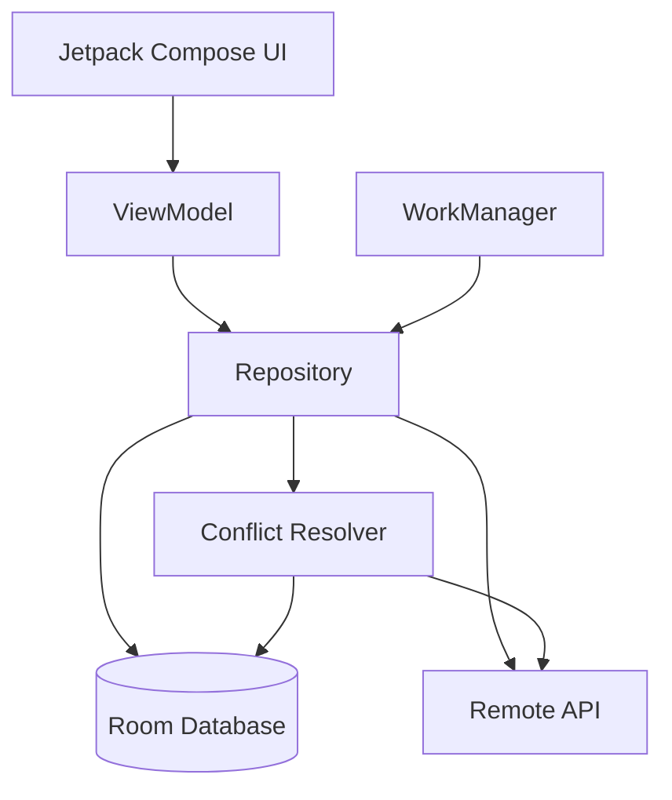
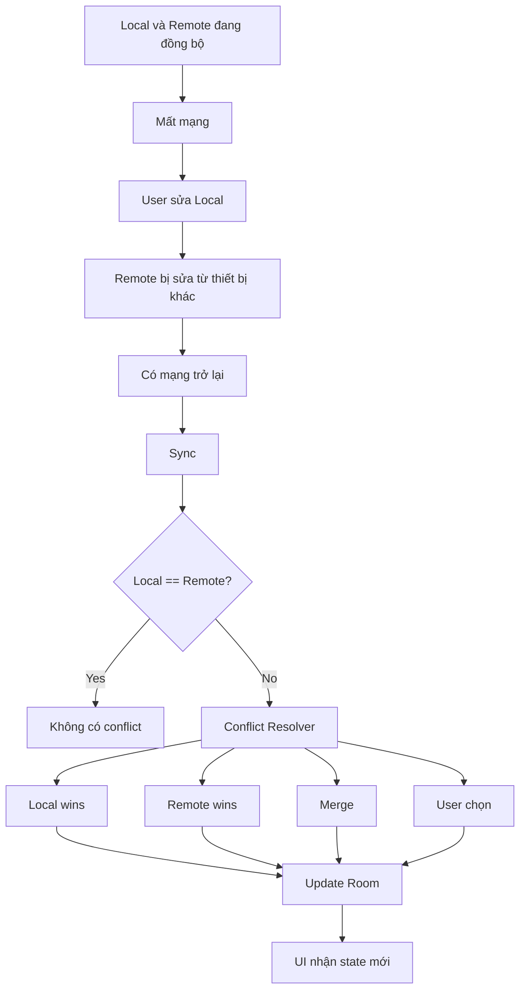
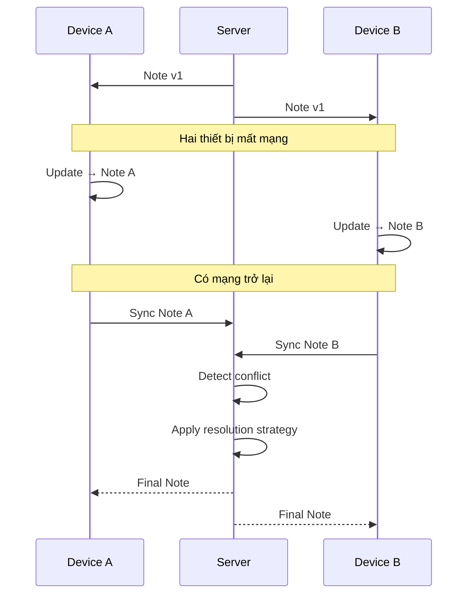
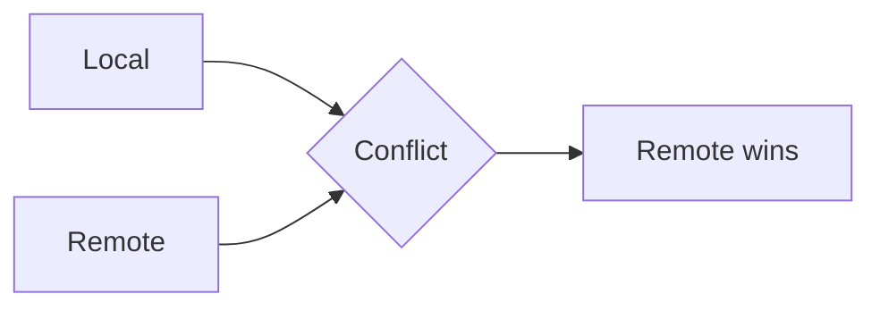
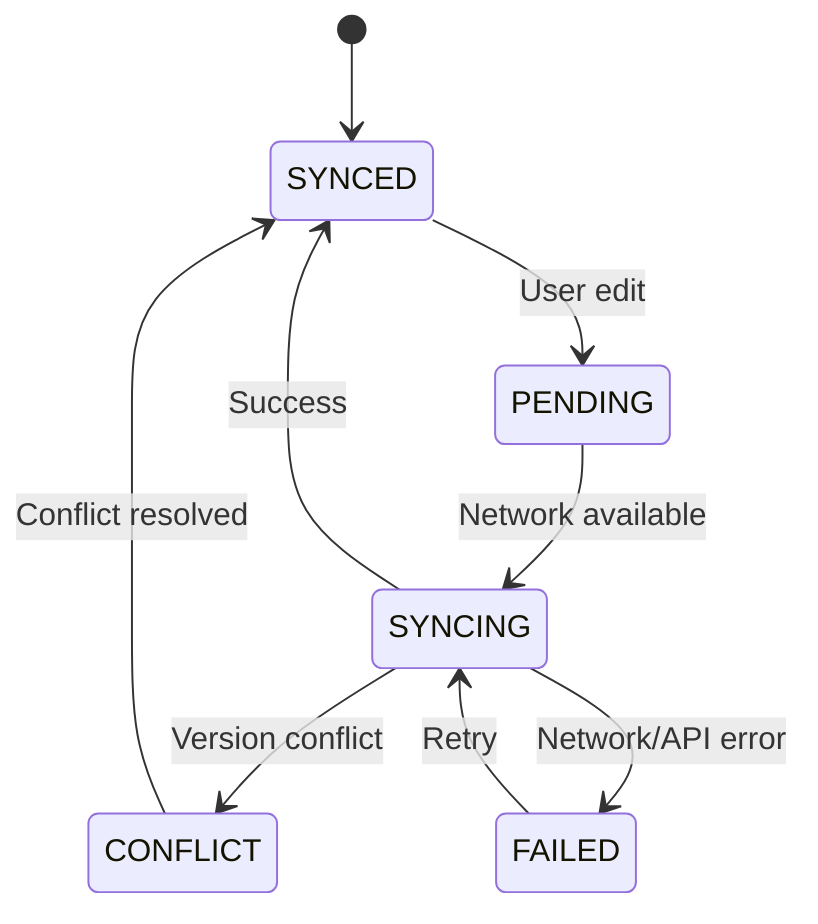
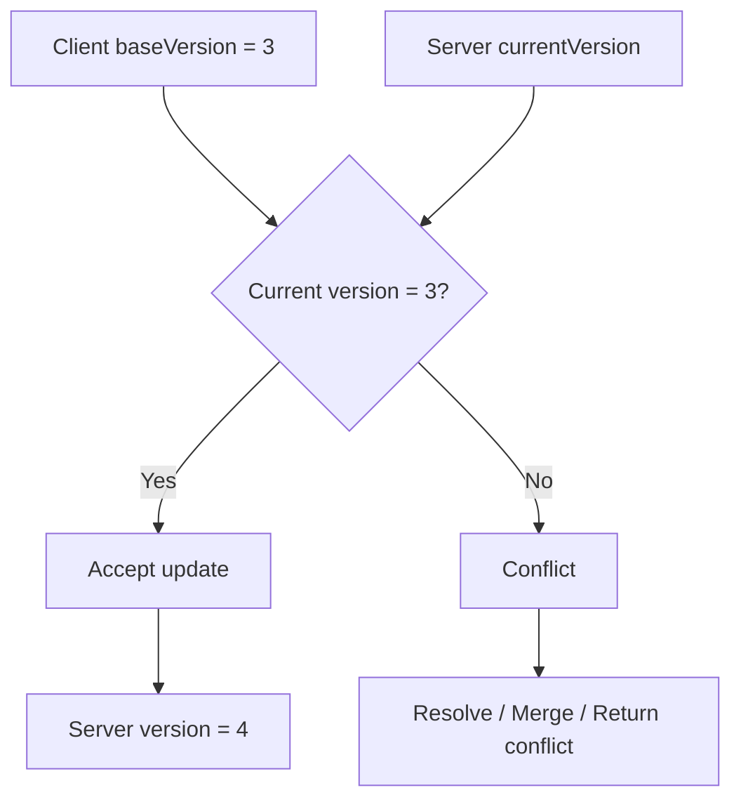
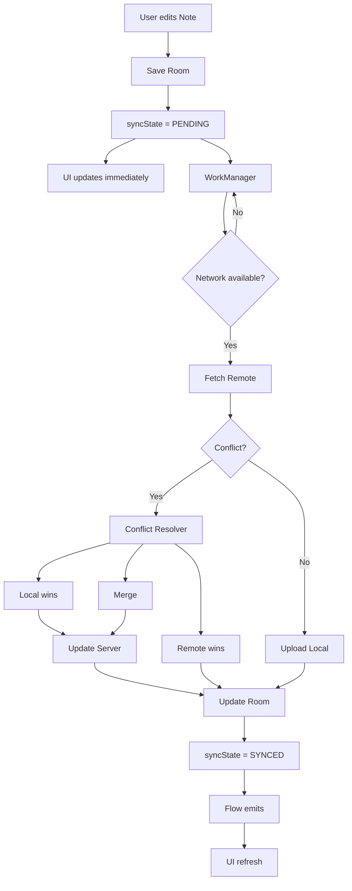
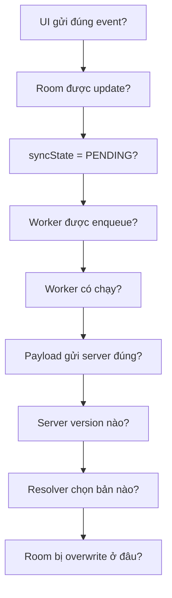
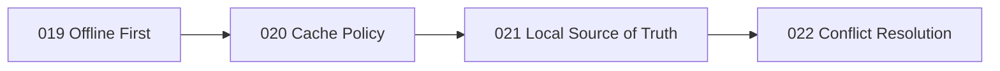
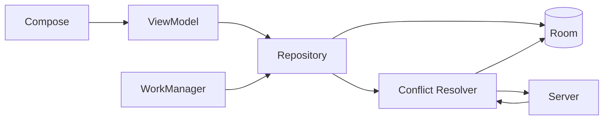

[](https://developer.android.com/topic/architecture/data-layer/offline-first?utm_source=chatgpt.com)

# 022 - Conflict Resolution

**Học phần:** 03 - Architecture, State and Data
**Module:** Module 06 - Storage
**Nhóm nội dung:** Offline Design
**Nguồn roadmap:** Storage / Offline Design
**Loại bài:** Storage / Offline-first
**Thứ tự trong module:** 022
**Thời lượng gợi ý:** 32 phút

---

## 1. Tóm tắt

**Conflict Resolution** — xử lý xung đột dữ liệu — là quá trình quyết định **phiên bản dữ liệu nào sẽ được giữ lại hoặc cách các phiên bản được hợp nhất** khi dữ liệu local và dữ liệu trên server không còn giống nhau.

Tình huống này đặc biệt phổ biến trong ứng dụng **offline-first**:

1. App tải dữ liệu từ server.
2. Người dùng mất mạng.
3. Người dùng chỉnh sửa dữ liệu local.
4. Trong lúc đó dữ liệu trên server cũng bị thay đổi từ thiết bị khác.
5. Thiết bị kết nối mạng trở lại.
6. App phải quyết định dữ liệu cuối cùng là gì.

Theo hướng dẫn Android về offline-first, local data source thường đóng vai trò **canonical source of truth đối với các layer phía trên**, còn `Repository` chịu trách nhiệm giao tiếp với network và đồng bộ lại local database. Khi local và remote không khớp, conflict phải được giải quyết trước hoặc trong quá trình synchronization. ([Android Developers][1])

> **Ý tưởng cốt lõi:**
> Conflict Resolution không đơn giản là "`UPDATE` hay `INSERT`". Nó là **business rule quyết định dữ liệu đúng khi nhiều nơi cùng thay đổi một record**.

---

# 2. Mục tiêu học tập

Sau bài này, anh nên có thể:

* Giải thích được Conflict Resolution bằng ngôn ngữ của mình.
* Phân biệt **database conflict** và **sync conflict**.
* Hiểu vì sao offline-first dễ tạo conflict.
* Nhận biết conflict giữa:

  * local ↔ server;
  * device A ↔ device B;
  * user edit ↔ server update.
* Biết các chiến lược:

  * Last Write Wins;
  * Server Wins;
  * Client Wins;
  * Field-level Merge;
  * Manual Merge.
* Thiết kế metadata như:

  * `updatedAt`;
  * `version`;
  * `syncState`.
* Kết hợp:

  * Room;
  * Repository;
  * Flow;
  * WorkManager;
  * Remote API.
* Viết unit test cho thuật toán xử lý conflict.
* Biết cách debug conflict bằng Database Inspector.
* Có một mini-project đủ tốt để đưa vào portfolio.

---

# 3. Conflict Resolution nằm ở đâu trong kiến trúc Android?

Trong kiến trúc Android hiện đại, UI không nên tự truy cập Room hoặc network API. Android khuyến nghị có **data layer rõ ràng**, expose dữ liệu thông qua `Repository`, đồng thời sử dụng coroutine/Flow để truyền dữ liệu giữa các layer. ([Android Developers][2])



Trong mô hình offline-first:

```text
UI
 ↓
ViewModel
 ↓
Repository
 ↓
Room ←→ Conflict Resolver ←→ Remote API
                    ↑
               WorkManager
```

### Vai trò từng thành phần

| Thành phần        | Trách nhiệm                  |
| ----------------- | ---------------------------- |
| UI                | Hiển thị dữ liệu             |
| ViewModel         | Quản lý UI state             |
| Repository        | Điều phối local + remote     |
| Room              | Local source of truth        |
| Remote API        | Trạng thái dữ liệu server    |
| Conflict Resolver | Quyết định dữ liệu nào thắng |
| WorkManager       | Thực hiện sync bền vững      |

Android hướng dẫn rằng trong offline-first, higher layers nên đọc từ local data source; khi network trả dữ liệu mới, repository cập nhật local source trước để các observer nhận thay đổi. ([Android Developers][1])

---

# 4. Khi nào conflict xảy ra?

Giả sử app ghi chú có record:

```text
id = 100
title = "Học Android"
```

Server và điện thoại đang giống nhau:

```text
SERVER
"Học Android"

DEVICE A
"Học Android"
```

Sau đó điện thoại A offline.

Người dùng sửa:

```text
DEVICE A
"Học Android Offline First"
```

Trong lúc đó trên laptop hoặc Device B, người dùng sửa:

```text
SERVER
"Học Android Architecture"
```

Khi Device A online trở lại:

```text
LOCAL:
"Học Android Offline First"

REMOTE:
"Học Android Architecture"
```

Cả hai đều hợp lệ.

**App phải chọn cái nào.**

Đó chính là **conflict**.

---

# 5. Sơ đồ vòng đời của conflict



---

# 6. Ví dụ hai thiết bị cùng chỉnh sửa



Android mô tả đây chính là vấn đề phải xử lý khi dữ liệu local được ghi trong lúc offline nhưng không còn khớp với network data source khi thiết bị online lại. ([Android Developers][1])

---

# 7. Các chiến lược Conflict Resolution

## 7.1. Last Write Wins — LWW

Đây là chiến lược phổ biến và dễ triển khai nhất.

Quy tắc:

```text
record có updatedAt mới nhất → thắng
```

Ví dụ:

```text
LOCAL
title = "Android Offline"
updatedAt = 20:05

REMOTE
title = "Android Architecture"
updatedAt = 20:03
```

Kết quả:

```text
LOCAL wins
```

Android Developers cũng sử dụng **Last Write Wins** làm ví dụ conflict-resolution phổ biến cho mobile: thiết bị gửi timestamp cùng dữ liệu, server giữ bản ghi mới hơn và bỏ bản ghi cũ hơn. ([Android Developers][1])

### Công thức

$$
winner =
\begin{cases}
local, & local.updatedAt > remote.updatedAt \
remote, & remote.updatedAt > local.updatedAt
\end{cases}
$$

### Ưu điểm

* đơn giản;
* dễ implement;
* sync nhanh;
* không cần UI conflict phức tạp.

### Nhược điểm

Có thể làm mất dữ liệu.

Ví dụ:

```text
Device A:
title = "Android"
description = "Offline First"

Device B:
title = "Android Architecture"
description = ""
```

Nếu Device B ghi sau:

```text
Device B wins
```

thì `description` của Device A có thể bị mất.

---

# 8. Server Wins

Quy tắc:

```text
Có conflict → luôn lấy server
```



Phù hợp với những dữ liệu mà server có quyền quyết định cuối cùng, chẳng hạn:

```text
inventory
permission
subscription state
order status
server configuration
```

Không thích hợp với những nội dung người dùng đã nhập dài nhưng chưa sync, vì có thể gây mất thay đổi local.

---

# 9. Client Wins

Ngược lại:

```text
Có conflict → local thắng
```

Ví dụ:

```text
Local:
darkMode = true

Remote:
darkMode = false
```

Nếu business rule quy định thiết bị hiện tại có quyền ghi setting cuối cùng:

```text
darkMode = true
```

Sau đó đẩy giá trị này lên server.

Client Wins khá dễ triển khai nhưng nguy hiểm nếu nhiều thiết bị cùng cập nhật dữ liệu quan trọng.

---

# 10. Field-level Merge

Thay vì chọn toàn bộ object A hoặc B, ta merge từng field.

Ví dụ:

### Local

```json
{
  "name": "An",
  "avatar": "local-avatar.jpg",
  "bio": "Android Developer"
}
```

### Remote

```json
{
  "name": "An Khánh",
  "avatar": "old-avatar.jpg",
  "bio": "Android Developer"
}
```

Có thể merge thành:

```json
{
  "name": "An Khánh",
  "avatar": "local-avatar.jpg",
  "bio": "Android Developer"
}
```

Ý tưởng:

```text
name        → Remote mới hơn
avatar      → Local mới hơn
bio         → giống nhau
```

### Ưu điểm

Ít mất dữ liệu.

### Nhược điểm

Phức tạp hơn nhiều vì cần biết:

```text
field nào bị sửa?
field nào sửa trước?
field nào có thể merge?
```

Có thể cần metadata dạng:

```kotlin
titleUpdatedAt
descriptionUpdatedAt
avatarUpdatedAt
```

hoặc server phải hỗ trợ patch/versioning.

---

# 11. Manual Conflict Resolution

Một số dữ liệu quá quan trọng để app tự lựa chọn.

Ví dụ:

```text
LOCAL

Meeting notes:
"Release vào thứ sáu"

REMOTE

Meeting notes:
"Release vào thứ hai"
```

App có thể hiển thị:

```text
┌─────────────────────────────────┐
│ Có hai phiên bản khác nhau      │
│                                 │
│ Phiên bản trên thiết bị         │
│ Release vào thứ sáu             │
│                                 │
│ Phiên bản trên server           │
│ Release vào thứ hai             │
│                                 │
│ [Giữ Local] [Giữ Server]        │
└─────────────────────────────────┘
```

Phương pháp này thích hợp với:

* tài liệu;
* ghi chú;
* nội dung do user tạo;
* dữ liệu cộng tác;
* dữ liệu khó tự merge.

Đổi lại UX trở nên phức tạp hơn.

---

# 12. So sánh các chiến lược

| Strategy        | Độ khó |  Nguy cơ mất data | Phù hợp                   |
| --------------- | -----: | ----------------: | ------------------------- |
| Last Write Wins |   Thấp |        Trung bình | Todo, settings            |
| Server Wins     |   Thấp |  Local có thể mất | Server-authoritative data |
| Client Wins     |   Thấp | Remote có thể mất | Local preference          |
| Field Merge     |    Cao |          Thấp hơn | Profile, document         |
| Manual Merge    |    Cao |          Rất thấp | Dữ liệu quan trọng        |

Một app thực tế không nhất thiết chỉ dùng **một strategy duy nhất**.

Ví dụ:

```text
User Profile
├── username        → Server Wins
├── bio             → Last Write Wins
├── avatar          → Last Write Wins
├── permissions     → Server Wins
└── document        → Manual Merge
```

---

# 13. Metadata cần thiết cho Conflict Resolution

Một entity offline-first thường cần nhiều hơn dữ liệu business.

Ví dụ:

```kotlin
@Entity(tableName = "notes")
data class NoteEntity(
    @PrimaryKey
    val id: String,

    val title: String,

    val content: String,

    val updatedAt: Long,

    val serverVersion: Long,

    val syncState: String
)
```

Trong đó:

```text
updatedAt
    ↓
thời điểm sửa record

serverVersion
    ↓
revision của server

syncState
    ↓
SYNCED
PENDING
CONFLICT
```

---

# 14. Sync state

Một mô hình đơn giản:

```kotlin
enum class SyncState {
    SYNCED,
    PENDING,
    SYNCING,
    CONFLICT,
    FAILED
}
```

Luồng:



Nhờ vậy UI có thể hiển thị:

```text
✓ Đã đồng bộ
↑ Đang đồng bộ
○ Chờ mạng
! Có xung đột
↻ Đồng bộ thất bại
```

---

# 15. Room DAO

Room hỗ trợ `@Upsert`: nếu chưa có entity với primary key tương ứng thì insert, còn nếu đã tồn tại thì update. ([Android Developers][3])

```kotlin
@Dao
interface NoteDao {

    @Query("SELECT * FROM notes WHERE id = :id")
    fun observeNote(id: String): Flow<NoteEntity?>

    @Query("SELECT * FROM notes WHERE id = :id")
    suspend fun getNote(id: String): NoteEntity?

    @Upsert
    suspend fun upsert(note: NoteEntity)
}
```

---

# 16. Cẩn thận: `Room OnConflictStrategy` ≠ Offline Conflict Resolution

Đây là điểm rất dễ nhầm.

Ví dụ:

```kotlin
@Insert(onConflict = OnConflictStrategy.REPLACE)
suspend fun insert(note: NoteEntity)
```

`OnConflictStrategy.REPLACE` xử lý conflict **bên trong SQLite/Room**, chẳng hạn hai row vi phạm cùng primary key hoặc unique constraint. Room cũng có các chiến lược như `ABORT`, `IGNORE`, `REPLACE`. ([Android Developers][4])

Nó **không tự giải quyết** tình huống:

```text
Room:
title = "A"

Server:
title = "B"

Cả hai đều đã được user chỉnh sửa.
```

Đây là hai vấn đề khác nhau:

```text
Database Conflict
        ≠
Distributed Data Conflict
```

### Database conflict

```text
INSERT id=1
nhưng id=1 đã tồn tại
```

### Sync conflict

```text
Local version = 3

Remote version = 4

Cả hai cùng thay đổi từ version = 2
```

Conflict Resolution của bài này chủ yếu nói về trường hợp thứ hai.

---

# 17. Repository: Local First Write

Giả sử user sửa note khi offline.

```kotlin
class NoteRepository(
    private val noteDao: NoteDao,
    private val syncScheduler: SyncScheduler
) {

    fun observeNote(id: String): Flow<NoteEntity?> {
        return noteDao.observeNote(id)
    }

    suspend fun updateNote(
        id: String,
        title: String,
        content: String
    ) {
        val old = noteDao.getNote(id)
            ?: return

        val updated = old.copy(
            title = title,
            content = content,
            updatedAt = System.currentTimeMillis(),
            syncState = "PENDING"
        )

        // 1. Update local immediately
        noteDao.upsert(updated)

        // 2. Schedule background sync
        syncScheduler.schedule()
    }
}
```

UI không cần chờ network.

```text
User Edit
   ↓
Room
   ↓
Flow
   ↓
ViewModel
   ↓
UI cập nhật ngay
   ↓
Background sync
```

Android gọi kiểu write local trước rồi queue network update này là **lazy write**; nó rất hữu ích cho dữ liệu quan trọng cần giữ lại khi offline, nhưng chính nó làm xuất hiện nhu cầu conflict resolution khi kết nối trở lại. ([Android Developers][1])

---

# 18. Tách Conflict Resolver khỏi Repository

Đừng nhét toàn bộ logic conflict vào Worker hoặc ViewModel.

Tạo một component riêng:

```kotlin
object NoteConflictResolver {

    fun resolve(
        local: NoteEntity,
        remote: NoteEntity
    ): NoteEntity {

        return if (local.updatedAt >= remote.updatedAt) {
            local
        } else {
            remote
        }
    }
}
```

Repository:

```kotlin
val resolved = NoteConflictResolver.resolve(
    local = localNote,
    remote = remoteNote
)

noteDao.upsert(resolved)
```

Điều này giúp logic trở nên:

```text
deterministic
+
testable
+
không phụ thuộc Android Framework
```

---

# 19. Last Write Wins hoàn chỉnh hơn

Có thể định nghĩa:

```kotlin
sealed interface ConflictResult {

    data class UseLocal(
        val note: NoteEntity
    ) : ConflictResult

    data class UseRemote(
        val note: NoteEntity
    ) : ConflictResult

    data class NoConflict(
        val note: NoteEntity
    ) : ConflictResult
}
```

Resolver:

```kotlin
object ConflictResolver {

    fun resolve(
        local: NoteEntity,
        remote: NoteEntity
    ): ConflictResult {

        if (
            local.serverVersion == remote.serverVersion &&
            local.title == remote.title &&
            local.content == remote.content
        ) {
            return ConflictResult.NoConflict(local)
        }

        return if (local.updatedAt > remote.updatedAt) {

            ConflictResult.UseLocal(local)

        } else {

            ConflictResult.UseRemote(remote)
        }
    }
}
```

---

# 20. Tại sao cần `version`?

Timestamp rất dễ hiểu:

```text
updatedAt = 1720000000
```

Nhưng trong production, chỉ phụ thuộc vào clock trên điện thoại có thể gây vấn đề:

```text
Device A clock: 20:30
Device B clock: 20:25
Real time:       20:20
```

Do đó backend thường nên có cơ chế version/revision nếu hệ thống cần độ chính xác cao:

```text
version 1
   ↓
version 2
   ↓
version 3
```

Ví dụ client gửi:

```json
{
  "id": "note-1",
  "title": "Android",
  "baseVersion": 3
}
```

Server hiện đang:

```text
version = 3
```

→ có thể update.

Nhưng nếu server đã:

```text
version = 4
```

client vẫn gửi:

```text
baseVersion = 3
```

→ server biết ngay client đang sửa từ dữ liệu cũ.



---

# 21. WorkManager và background sync

Sync thường phải tiếp tục hoạt động kể cả khi user rời màn hình hoặc app process bị kết thúc. Android khuyến nghị **WorkManager** cho persistent work cần chạy đáng tin cậy qua app restart hoặc device reboot. WorkManager cũng hỗ trợ network constraints và exponential backoff. ([Android Developers][5])

Ví dụ:

```kotlin
val constraints = Constraints.Builder()
    .setRequiredNetworkType(NetworkType.CONNECTED)
    .build()

val request =
    OneTimeWorkRequestBuilder<NoteSyncWorker>()
        .setConstraints(constraints)
        .build()

WorkManager
    .getInstance(context)
    .enqueueUniqueWork(
        "note-sync",
        ExistingWorkPolicy.KEEP,
        request
    )
```

Android cũng sử dụng `enqueueUniqueWork()` trong hướng dẫn offline-first để tránh nhiều sync worker tương đương chạy đồng thời. ([Android Developers][1])

---

# 22. Sync Worker

Một phiên bản đơn giản:

```kotlin
class NoteSyncWorker(
    appContext: Context,
    workerParams: WorkerParameters,
    private val repository: NoteRepository
) : CoroutineWorker(
    appContext,
    workerParams
) {

    override suspend fun doWork(): Result {
        return try {

            repository.sync()

            Result.success()

        } catch (e: IOException) {

            Result.retry()

        } catch (e: Exception) {

            Result.failure()
        }
    }
}
```

Android hướng dẫn rằng khi synchronization thất bại, Worker có thể trả `Result.retry()` và WorkManager sẽ retry theo backoff policy. ([Android Developers][1])

---

# 23. Luồng sync đầy đủ



Đây là mô hình khá sát hướng dẫn Android: queue các thao tác, chờ connectivity, sync với network, ghi kết quả vào local source rồi expose dữ liệu local cho các layer khác. ([Android Developers][1])

---

# 24. ViewModel

```kotlin
class NoteViewModel(
    repository: NoteRepository
) : ViewModel() {

    val note =
        repository.observeNote("note-1")
            .stateIn(
                scope = viewModelScope,
                started = SharingStarted.WhileSubscribed(5_000),
                initialValue = null
            )
}
```

Với Compose, Android khuyến nghị bridge từ data layer qua `ViewModel`, chuyển `Flow` thành `StateFlow`, sau đó UI collect theo lifecycle. ([Android Developers][1])

---

# 25. Lifecycle có ảnh hưởng thế nào?

Một lỗi kiến trúc thường gặp là:

```text
Composable xuất hiện
       ↓
Composable tự gọi sync
       ↓
rotate
       ↓
Composable xuất hiện lại
       ↓
sync lần nữa
```

Thay vì để synchronization phụ thuộc hoàn toàn vào lifecycle của Activity/Composable:

```text
UI lifecycle
      X
Sync lifetime
```

nên để:

```text
Repository
+
WorkManager
```

chịu trách nhiệm.

WorkManager được thiết kế cho công việc cần chạy đáng tin cậy kể cả khi user rời screen, app thoát hoặc thiết bị restart. ([Android Developers][5])

---

# 26. UI nên thể hiện trạng thái sync

Không phải lúc nào cũng cần popup.

Một UX tốt hơn có thể là:

```text
My Note

Android Offline First

○ Chưa đồng bộ
```

Khi đang sync:

```text
↑ Đang đồng bộ...
```

Thành công:

```text
✓ Đã đồng bộ
```

Conflict cần user xử lý:

```text
⚠ Có phiên bản mới trên thiết bị khác
```

### UI state

```kotlin
data class NoteUiState(
    val title: String = "",
    val content: String = "",
    val syncState: SyncState = SyncState.SYNCED
)
```

---

# 27. Unit test Conflict Resolver

Conflict Resolver là business logic thuần Kotlin nên có thể test bằng local unit test; Android khuyến nghị local JVM tests cho logic có thể tách khỏi Android Framework vì chúng chạy nhanh trên máy phát triển. ([Android Developers][6])

### Local mới hơn

```kotlin
@Test
fun localNewer_localWins() {

    val local = note(
        title = "Local",
        updatedAt = 200
    )

    val remote = note(
        title = "Remote",
        updatedAt = 100
    )

    val result =
        ConflictResolver.resolve(
            local,
            remote
        )

    assertTrue(
        result is ConflictResult.UseLocal
    )
}
```

### Remote mới hơn

```kotlin
@Test
fun remoteNewer_remoteWins() {

    val local = note(
        title = "Local",
        updatedAt = 100
    )

    val remote = note(
        title = "Remote",
        updatedAt = 200
    )

    val result =
        ConflictResolver.resolve(
            local,
            remote
        )

    assertTrue(
        result is ConflictResult.UseRemote
    )
}
```

---

# 28. Các case bắt buộc nên test

```text
Case 1
Local mới hơn
→ Local wins

Case 2
Remote mới hơn
→ Remote wins

Case 3
Local == Remote
→ No conflict

Case 4
Network mất giữa lúc sync
→ Retry

Case 5
App bị kill
→ Pending operation vẫn tồn tại

Case 6
Sync chạy lại
→ Không tạo duplicate

Case 7
Device A + Device B cùng sửa
→ Rule cho kết quả deterministic

Case 8
Server từ chối version cũ
→ Conflict được detect

Case 9
User rotate screen
→ Không mất local edit
```

---

# 29. Idempotency

Sync nên được thiết kế sao cho chạy lại nhiều lần không gây hậu quả sai.

Ví dụ không tốt:

```text
sync #1
→ tạo Note mới

network timeout

sync retry
→ lại tạo Note mới
```

Kết quả:

```text
Note
Note
```

Tốt hơn:

```text
clientGeneratedId = UUID

PUT /notes/{id}
```

Retry:

```text
same ID
       ↓
same logical operation
```

Điều này đặc biệt quan trọng vì background worker có thể retry khi network failure xảy ra.

---

# 30. Delete cũng có conflict

Conflict không chỉ xuất hiện khi update.

Ví dụ:

```text
Device A offline:
DELETE Note 1

Device B:
UPDATE Note 1
```

Khi sync:

```text
Delete wins?

hay

Update wins?
```

Nếu chỉ xóa row khỏi Room:

```sql
DELETE FROM notes
```

app có thể mất thông tin rằng:

> "record này cần được xóa khỏi server."

Một chiến lược phổ biến là giữ **tombstone**:

```kotlin
data class NoteEntity(
    val id: String,
    val title: String,

    val deleted: Boolean,

    val updatedAt: Long,
    val syncState: String
)
```

Offline delete:

```text
deleted = true
syncState = PENDING
```

Sau khi server xác nhận:

```text
DELETE server
       ↓
remove local tombstone
```

---

# 31. Debug bằng Database Inspector

Android Studio Database Inspector có thể xem, query và sửa database SQLite/Room khi app đang chạy. Nếu UI đang observe Room bằng `Flow` hoặc `LiveData`, thay đổi trong database có thể được phản ánh ngay trên UI. ([Android Developers][7])

Anh có thể kiểm tra:

```sql
SELECT
    id,
    title,
    updatedAt,
    serverVersion,
    syncState
FROM notes;
```

Kết quả:

| id | title   | version | state    |
| -- | ------- | ------: | -------- |
| 1  | Android |       4 | SYNCED   |
| 2  | Room    |       3 | PENDING  |
| 3  | Offline |       7 | CONFLICT |

Database Inspector hiện tại hỗ trợ SQLite/Room trên thiết bị phù hợp và cho phép chạy DAO query hoặc custom SQL trực tiếp trong Android Studio. ([Android Developers][7])

---

# 32. Debug flow đề xuất

Khi gặp bug:

```text
"User sửa dữ liệu nhưng sau khi online dữ liệu quay về bản cũ"
```

hãy kiểm tra theo thứ tự:



Đừng chỉ log:

```text
sync failed
```

Nên log metadata:

```text
noteId
localVersion
remoteVersion
localUpdatedAt
remoteUpdatedAt
resolutionStrategy
resolutionResult
```

Nhưng tránh log dữ liệu cá nhân hoặc nội dung nhạy cảm của user.

---

# 33. Sai lầm thường gặp

## Sai lầm 1 — Network là thứ UI đọc trực tiếp

```text
UI → API
UI → Room
```

Hai nguồn có thể trả hai state khác nhau.

Nên:

```text
UI
 ↓
Repository
 ↓
Room ← sync → API
```

Android hướng dẫn local data source nên là nguồn mà higher layers đọc trong kiến trúc offline-first. ([Android Developers][1])

---

## Sai lầm 2 — Nghĩ `REPLACE` của Room đã giải quyết conflict

```kotlin
OnConflictStrategy.REPLACE
```

chỉ giải quyết conflict ở database level, không hiểu:

```text
ai sửa?
sửa lúc nào?
field nào quan trọng?
business rule là gì?
```

---

## Sai lầm 3 — Luôn Server Wins

Dễ code:

```text
server → Room
```

nhưng có thể xóa toàn bộ công việc user vừa làm offline.

---

## Sai lầm 4 — Không lưu sync metadata

Entity chỉ có:

```kotlin
id
title
content
```

sẽ rất khó biết:

```text
record đã sync chưa?
local có thay đổi không?
version hiện tại là bao nhiêu?
```

---

## Sai lầm 5 — Chỉ giữ queue trong RAM

```kotlin
val pendingUpdates = mutableListOf<Note>()
```

Process chết:

```text
queue mất
```

Với operation cần tồn tại qua process death, nên dùng persistent storage/WorkManager. Android mô tả queues và network monitoring là các ví dụ điển hình của persistent work phù hợp với WorkManager. ([Android Developers][1])

---

# 34. Liên hệ với các bài trước

Conflict Resolution không đứng riêng.



### Offline First

```text
App vẫn hoạt động khi mất mạng.
```

### Cache Policy

```text
Khi nào data stale?
Khi nào refresh?
```

### Local Source of Truth

```text
UI nên đọc từ đâu?
```

### Conflict Resolution

```text
Nếu Local và Remote đều thay đổi thì phiên bản nào đúng?
```

Bốn phần tạo thành một chuỗi:

```text
Offline
   ↓
Local storage
   ↓
Source of Truth
   ↓
Synchronization
   ↓
Conflict Resolution
```

---

# 35. Ví dụ thực tế: Todo App

Giả sử entity:

```kotlin
@Entity
data class TodoEntity(

    @PrimaryKey
    val id: String,

    val title: String,

    val completed: Boolean,

    val updatedAt: Long,

    val version: Long,

    val syncState: String
)
```

User offline:

```text
Buy milk
completed = true

syncState = PENDING
```

Trong khi Device B:

```text
Buy milk
title = Buy oat milk
```

Khi online:

```text
LOCAL
completed = true

REMOTE
title = Buy oat milk
```

Nếu dùng object-level LWW:

```text
một trong hai thay đổi có thể mất.
```

Nếu dùng field merge:

```text
title     → Buy oat milk
completed → true
```

Kết quả tốt hơn:

```json
{
  "title": "Buy oat milk",
  "completed": true
}
```

Đây là ví dụ cho thấy conflict strategy phải phụ thuộc **business semantics**, không chỉ phụ thuộc công nghệ database.

---

# 36. Production checklist

Trước khi release feature offline sync, nên trả lời được:

### Data

* [ ] Local source of truth là gì?
* [ ] Remote source là gì?
* [ ] Entity có stable ID không?
* [ ] Có `updatedAt` hoặc `version` không?
* [ ] Có `syncState` không?
* [ ] Delete có cần tombstone không?

### Conflict

* [ ] Có thể xảy ra concurrent edit không?
* [ ] Strategy là Last Write Wins hay strategy khác?
* [ ] Có trường hợp cần manual merge không?
* [ ] Có khả năng mất dữ liệu user không?
* [ ] Conflict rule có deterministic không?

### Synchronization

* [ ] Sync có retry được không?
* [ ] Retry có idempotent không?
* [ ] Network mất giữa operation có an toàn không?
* [ ] Pending write có tồn tại qua process death không?
* [ ] Có tránh nhiều worker trùng nhau không?

### UI/UX

* [ ] UI đọc từ local source?
* [ ] User có thấy trạng thái pending không?
* [ ] Có hiển thị sync failure nếu cần?
* [ ] Có UX cho manual conflict không?

### Testing

* [ ] Test Local Wins.
* [ ] Test Remote Wins.
* [ ] Test version conflict.
* [ ] Test offline → online.
* [ ] Test process death.
* [ ] Test retry.
* [ ] Test duplicate sync.
* [ ] Test multi-device conflict.

---

# 37. Bài thực hành

## Mini-project: Offline Notes

Xây dựng màn hình:

```text
┌───────────────────────────────┐
│ My Note                       │
│                               │
│ Android Offline First         │
│                               │
│ Conflict resolution is...     │
│                               │
│ ○ Waiting for sync            │
│                               │
│                [ Save ]       │
└───────────────────────────────┘
```

### Yêu cầu

#### Bước 1 — Entity

Tạo:

```text
NoteEntity
```

gồm:

```text
id
title
content
updatedAt
serverVersion
syncState
```

#### Bước 2 — DAO

Có:

```text
observeNote()
getNote()
upsert()
```

#### Bước 3 — Repository

Implement:

```text
observeNote()
updateNote()
sync()
```

#### Bước 4 — Offline write

Khi user Save:

```text
Room update
   ↓
PENDING
   ↓
UI update
```

không cần chờ network.

#### Bước 5 — Sync

Khi có network:

```text
WorkManager
   ↓
Fetch server
   ↓
Compare version
   ↓
Resolve conflict
   ↓
Update server
   ↓
Update Room
```

#### Bước 6 — Test

Giả lập:

```text
Local:
title = Local
updatedAt = 200

Remote:
title = Remote
updatedAt = 100
```

Kiểm tra:

```text
Local wins.
```

Đổi timestamp và kiểm tra:

```text
Remote wins.
```

---

# 38. Artifact cho portfolio

Có thể tạo folder:

```text
offline-conflict-demo/
├── data/
│   ├── local/
│   │   ├── NoteEntity.kt
│   │   └── NoteDao.kt
│   │
│   ├── remote/
│   │   └── NoteApi.kt
│   │
│   └── repository/
│       └── NoteRepository.kt
│
├── sync/
│   ├── NoteSyncWorker.kt
│   └── ConflictResolver.kt
│
├── ui/
│   ├── NoteScreen.kt
│   └── NoteViewModel.kt
│
├── test/
│   └── ConflictResolverTest.kt
│
└── README.md
```

README nên có sơ đồ:

```text
Compose
   ↓
ViewModel
   ↓
Repository
   ↓
Room ←→ Conflict Resolver ←→ REST API
                ↑
           WorkManager
```

và mô tả:

```text
Offline edit
→ persist locally
→ mark PENDING
→ schedule sync
→ detect version conflict
→ resolve conflict
→ persist final state
```

Đây là artifact khá tốt vì thể hiện đồng thời:

```text
Room
Repository Pattern
Flow
Offline First
Single Source of Truth
WorkManager
Conflict Resolution
Unit Testing
```

---

# 39. Bài tập

## Bài 1 — Last Write Wins

Implement:

```kotlin
fun resolve(
    local: NoteEntity,
    remote: NoteEntity
): NoteEntity
```

Rule:

```text
updatedAt lớn hơn → thắng
```

---

## Bài 2 — Server Wins

Thêm strategy:

```kotlin
enum class ConflictStrategy {
    LAST_WRITE_WINS,
    SERVER_WINS,
    CLIENT_WINS
}
```

Sau đó:

```kotlin
resolve(
    local,
    remote,
    ConflictStrategy.SERVER_WINS
)
```

---

## Bài 3 — Field Merge

Entity:

```text
Profile

name
bio
avatar
```

Giả lập:

```text
Local thay avatar

Remote thay bio
```

Merge để giữ cả hai thay đổi.

---

## Bài 4 — Offline scenario

Thử:

```text
1. Bật app.
2. Load note.
3. Tắt mạng.
4. Sửa note.
5. Đóng app.
6. Mở app lại.
7. Note vẫn tồn tại.
8. Bật mạng.
9. Sync tự chạy.
10. Kiểm tra server/local giống nhau.
```

---

# 40. Checklist hoàn thành bài học

* [ ] Giải thích được Conflict Resolution.
* [ ] Phân biệt được local conflict và Room database conflict.
* [ ] Hiểu nguyên nhân conflict trong offline-first.
* [ ] Hiểu Last Write Wins.
* [ ] Biết Server Wins.
* [ ] Biết Client Wins.
* [ ] Biết Field Merge.
* [ ] Biết khi nào cần Manual Merge.
* [ ] Entity có metadata cho synchronization.
* [ ] Repository chịu trách nhiệm local + remote.
* [ ] UI đọc dữ liệu từ local source.
* [ ] Pending operation tồn tại khi app bị đóng.
* [ ] WorkManager xử lý background sync.
* [ ] Conflict Resolver tách khỏi UI.
* [ ] Có unit test cho resolver.
* [ ] Test được offline → online.
* [ ] Kiểm tra được database bằng Database Inspector.
* [ ] Có README hoặc diagram cho portfolio.

---

# 41. Ghi nhớ nhanh

```text
Conflict Resolution
        │
        ├── Khi nào?
        │     Local != Remote
        │
        ├── Phát hiện bằng gì?
        │     Version / Timestamp
        │
        ├── Giải quyết thế nào?
        │     ├── Last Write Wins
        │     ├── Server Wins
        │     ├── Client Wins
        │     ├── Field Merge
        │     └── Manual Merge
        │
        ├── Ai xử lý?
        │     Repository
        │     +
        │     Conflict Resolver
        │
        ├── Lưu ở đâu?
        │     Room
        │
        └── Sync bằng gì?
              WorkManager
```

## Công thức tư duy

```text
Offline-first
+
Local Source of Truth
+
Persistent Write Queue
+
Version Metadata
+
Deterministic Conflict Rule
+
Reliable Background Sync
=
Robust Offline Data Architecture
```

---

# 42. Kết luận

**Conflict Resolution là phần nối giữa Offline First và Synchronization.**

Nếu app cho phép user thay đổi dữ liệu khi offline, developer phải xác định rõ:

```text
Nếu local và server cùng thay đổi,
ai thắng?
```

Không tồn tại một chiến lược tốt cho mọi loại dữ liệu. Với Todo đơn giản, **Last Write Wins** có thể đủ; với profile có nhiều field, **field-level merge** hợp lý hơn; với tài liệu quan trọng, đôi khi cần cho chính user lựa chọn.

Trong kiến trúc Android offline-first hiện đại, một thiết kế dễ bảo trì thường có dạng:



Android Developers hiện hướng dẫn local data source làm nguồn đọc chính cho các layer bên trên, Repository thực hiện synchronization, và WorkManager đảm nhiệm những công việc sync bền vững cần tồn tại ngoài lifecycle của màn hình. Conflict resolution nằm chính giữa quá trình đó. ([Android Developers][1])

[1]: https://developer.android.com/topic/architecture/data-layer/offline-first "Build an offline-first app  |  App architecture  |  Android Developers"
[2]: https://developer.android.com/topic/architecture/recommendations "Recommendations for Android architecture  |  App architecture  |  Android Developers"
[3]: https://developer.android.com/training/data-storage/room/accessing-data?utm_source=chatgpt.com "Access data using Room DAOs | App data and files"
[4]: https://developer.android.com/reference/androidx/room/OnConflictStrategy?utm_source=chatgpt.com "OnConflictStrategy | API reference"
[5]: https://developer.android.com/develop/background-work/background-tasks/persistent "Task scheduling  |  Background work  |  Android Developers"
[6]: https://developer.android.com/training/testing/local-tests?utm_source=chatgpt.com "Build local unit tests | Test your app on Android"
[7]: https://developer.android.com/studio/inspect/database "Debug your database with the Database Inspector  |  Android Studio  |  Android Developers"
