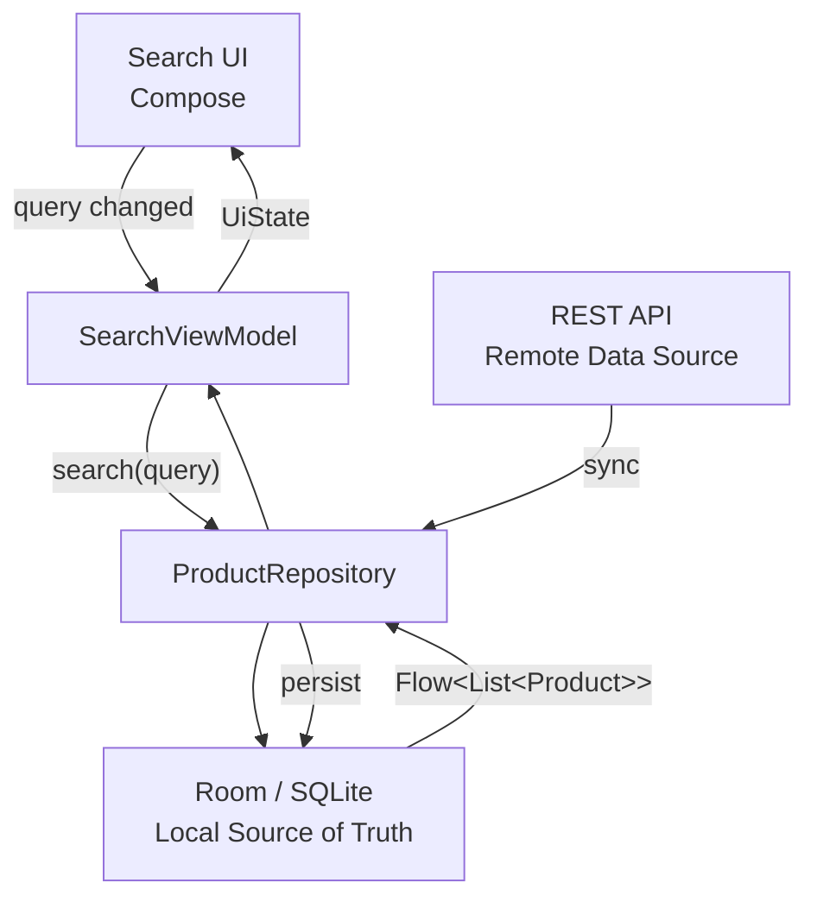
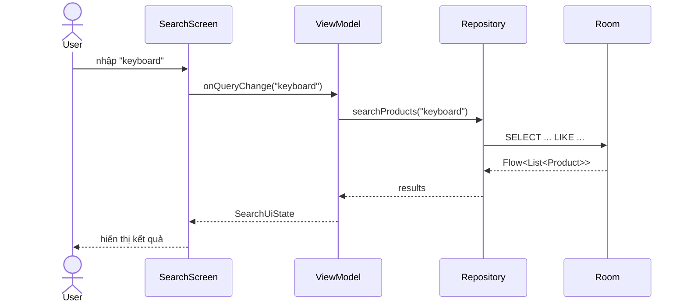
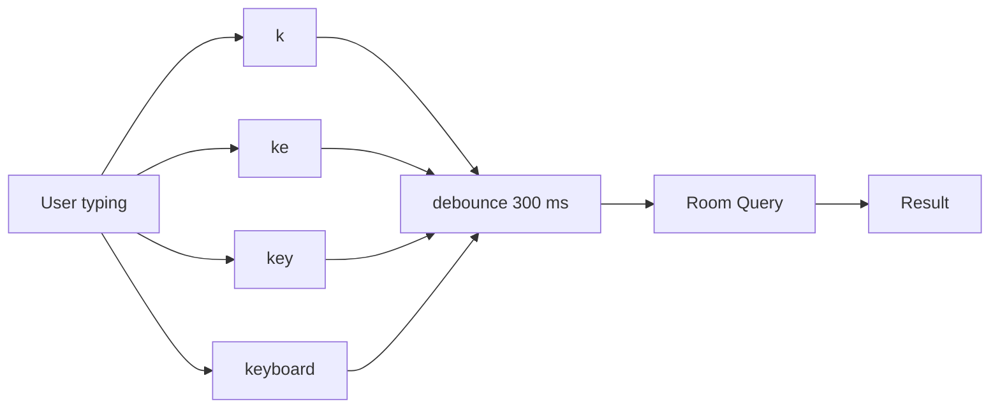
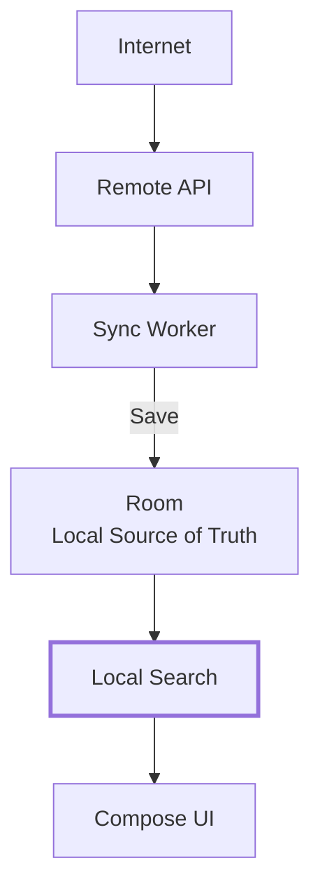
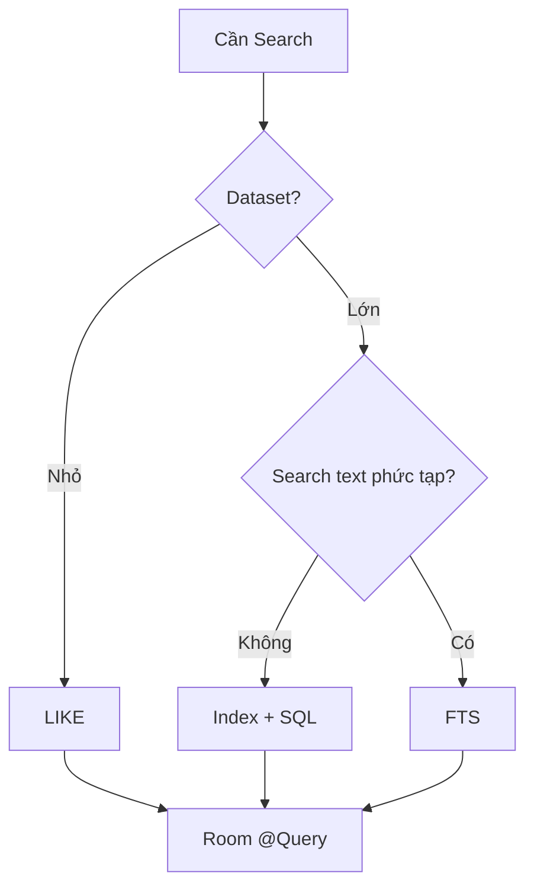
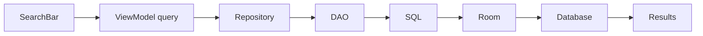
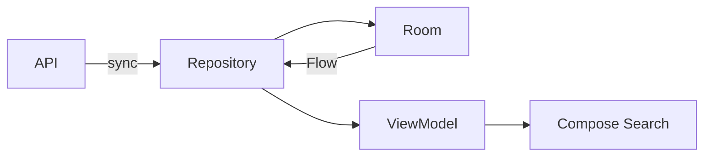
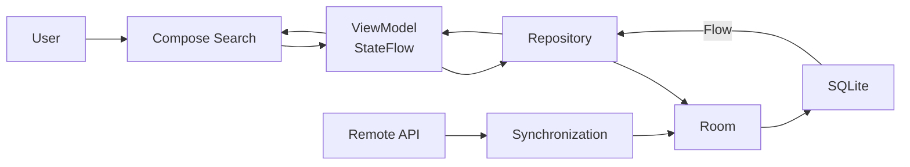

[](https://developer.android.com/topic/architecture/data-layer/offline-first?utm_source=chatgpt.com)

# 023 - Search Local Data

| Thuộc tính              | Nội dung                                       |
| ----------------------- | ---------------------------------------------- |
| **Học phần**            | 03 - Architecture, State and Data              |
| **Module**              | Module 06 - Storage                            |
| **Nhóm nội dung**       | Offline Design                                 |
| **Nguồn roadmap**       | Storage / Offline Design                       |
| **Loại bài**            | Storage                                        |
| **Thứ tự trong module** | 023                                            |
| **Thời lượng gợi ý**    | 32 phút                                        |
| **Mức độ**              | Intermediate                                   |
| **Công nghệ chính**     | Room, SQLite, Flow, StateFlow, Jetpack Compose |

> **Ý tưởng cốt lõi:** với kiến trúc offline-first, người dùng nên có thể tìm kiếm dữ liệu đã lưu trên thiết bị mà **không cần chờ API và không cần Internet**.

---

## 1. Tóm tắt

**Search Local Data** là kỹ thuật tìm kiếm, lọc hoặc truy vấn dữ liệu đã được lưu trên thiết bị, thường thông qua **Room/SQLite**, thay vì gửi một request lên server cho mỗi thao tác tìm kiếm.

Ví dụ ứng dụng đã đồng bộ 5.000 sản phẩm từ server vào Room. Khi người dùng nhập:

```text
"keyboard"
```

thay vì:

```text
SearchBar
    ↓
GET /products?q=keyboard
    ↓
Internet
    ↓
Server
```

ta có thể:

```text
SearchBar
    ↓
Room query
    ↓
SQLite trên thiết bị
    ↓
Kết quả
```

Trong kiến trúc offline-first của Android, local data source thường đóng vai trò **canonical source of truth** cho dữ liệu mà các tầng phía trên đọc. Repository chịu trách nhiệm đồng bộ network → local, còn UI đọc dữ liệu từ local. Nhờ vậy việc đọc và tìm kiếm vẫn hoạt động khi mất mạng. ([Android Developers][1])

---

## 2. Mục tiêu học tập

Sau bài này, anh nên có thể:

* Giải thích được **Search Local Data** và vị trí của nó trong kiến trúc Android.
* Viết truy vấn tìm kiếm bằng Room `@Query`.
* Phân biệt `LIKE`, index và Full-Text Search.
* Kết hợp Room với `Flow`.
* Quản lý search query bằng `StateFlow`.
* Thêm `debounce` để tránh query database liên tục.
* Giữ tìm kiếm hoạt động khi thiết bị offline.
* Hiểu khi nào nên search local và khi nào nên search remote.
* Debug query bằng Android Studio Database Inspector.
* Viết test cho DAO, Repository và ViewModel.

---

# 3. Search Local Data nằm ở đâu trong kiến trúc?

Một cấu trúc phổ biến:



Android khuyến nghị tách data layer rõ ràng và sử dụng Repository để cung cấp dữ liệu cho phần còn lại của ứng dụng. Với offline-first, local data source phải đủ khả năng phục vụ các thao tác đọc quan trọng mà không cần network. ([Android Developers][1])

Điểm rất quan trọng là:

```text
UI không cần biết dữ liệu đến từ SQLite hay Internet.
```

UI chỉ biết:

```kotlin
repository.searchProducts(query)
```

Repository quyết định dữ liệu đến từ đâu.

---

# 4. Local Search khác Remote Search thế nào?

| Tiêu chí            | Local Search                          | Remote Search          |
| ------------------- | ------------------------------------- | ---------------------- |
| Internet            | Không cần                             | Thường cần             |
| Latency             | Rất thấp                              | Phụ thuộc network      |
| Offline             | Hoạt động                             | Không hoạt động        |
| Dataset             | Dữ liệu đã lưu                        | Toàn bộ dữ liệu server |
| Chi phí server      | Gần như không                         | Có                     |
| SQL/filter phức tạp | Linh hoạt                             | Phụ thuộc API          |
| Dữ liệu mới nhất    | Có thể chưa sync                      | Thường mới hơn         |
| Phù hợp             | Notes, messages cache, products cache | Search toàn hệ thống   |

Không nhất thiết phải chọn một trong hai.

Ứng dụng thực tế thường dùng:

```text
Local search
    +
Background synchronization
    +
Remote search khi cần
```

---

# 5. Ví dụ thực tế

Giả sử anh xây dựng ứng dụng cửa hàng:

```text
Product
├── id
├── name
├── description
├── category
├── price
└── updatedAt
```

Ứng dụng đã đồng bộ dữ liệu từ API:

```text
Server
   ↓
Repository
   ↓
Room
```

Người dùng tìm:

```text
"mechanical keyboard"
```

Query sẽ chạy trực tiếp trên Room.

---

# 6. Room trong Android 2026

Tại thời điểm hiện tại, tài liệu Android chính thức đã phát hành **Room 3.0.1**. Room 3.x chuyển package sang `androidx.room3`, yêu cầu **KSP**, ưu tiên coroutine và bổ sung hỗ trợ FTS5. ([Android Developers][2])

Ví dụ dependency:

```kotlin
dependencies {

    val roomVersion = "3.0.1"

    implementation(
        "androidx.room3:room3-runtime:$roomVersion"
    )

    ksp(
        "androidx.room3:room3-compiler:$roomVersion"
    )
}
```

> Nếu project hiện tại vẫn dùng Room 2.x với package `androidx.room`, nguyên lý của bài này vẫn giống nhau. Việc chuyển Room 2.x → 3.x là một migration riêng. ([Android Developers][3])

---

# 7. Bước 1 — Tạo Entity

```kotlin
@Entity(tableName = "products")
data class ProductEntity(

    @PrimaryKey
    val id: Long,

    val name: String,

    val description: String,

    val category: String,

    val price: Double,

    val updatedAt: Long
)
```

Database tương ứng:

```text
products
────────────────────────────────────
id
name
description
category
price
updatedAt
────────────────────────────────────
```

---

# 8. Bước 2 — Search bằng `LIKE`

Với dataset nhỏ hoặc search đơn giản, `LIKE` là giải pháp dễ triển khai.

```kotlin
@Dao
interface ProductDao {

    @Query(
        """
        SELECT *
        FROM products
        WHERE name LIKE '%' || :query || '%'
        ORDER BY name ASC
        """
    )
    fun search(query: String): Flow<List<ProductEntity>>
}
```

Ví dụ database:

```text
1 | Mechanical Keyboard
2 | Gaming Mouse
3 | Wireless Keyboard
4 | USB Hub
```

Query:

```text
keyboard
```

Kết quả:

```text
Mechanical Keyboard
Wireless Keyboard
```

Room cho phép DAO chứa SQL query thông qua `@Query`; Room cũng hỗ trợ `Flow` cho observable read query để dữ liệu có thể được phát lại khi bảng liên quan thay đổi. ([Android Developers][4])

---

# 9. Search nhiều field

Người dùng thường không chỉ muốn tìm theo `name`.

Có thể search:

```text
name
description
category
```

DAO:

```kotlin
@Query(
    """
    SELECT *
    FROM products
    WHERE name LIKE '%' || :query || '%'
       OR description LIKE '%' || :query || '%'
       OR category LIKE '%' || :query || '%'
    ORDER BY name ASC
    """
)
fun search(query: String): Flow<List<ProductEntity>>
```

Ví dụ:

```text
query = "gaming"
```

có thể match:

```text
Gaming Mouse
Mechanical Keyboard - description: "Designed for gaming"
Gaming Accessories - category
```

---

# 10. Luồng dữ liệu reactive

Khi DAO trả về:

```kotlin
Flow<List<ProductEntity>>
```

luồng dữ liệu trở thành:



Room phân biệt one-shot queries với observable queries. Observable DAO query có thể dùng `Flow<T>` để nhận dữ liệu mới khi bảng cơ sở thay đổi. ([Android Developers][5])

---

# 11. Repository

Không nên gọi DAO trực tiếp từ Composable.

Tạo:

```kotlin
class ProductRepository(
    private val productDao: ProductDao
) {

    fun searchProducts(
        query: String
    ): Flow<List<ProductEntity>> {

        return productDao.search(query)
    }
}
```

Kiến trúc:

```text
Compose
   ↓
ViewModel
   ↓
Repository
   ↓
DAO
   ↓
Room
   ↓
SQLite
```

Việc đặt database access phía sau DAO và Repository giúp tách trách nhiệm giữa UI và data layer, đồng thời thuận lợi hơn cho test. ([Android Developers][4])

---

# 12. ViewModel + Search State

Search query là **UI state**.

Có thể dùng:

```kotlin
private val searchQuery =
    MutableStateFlow("")
```

Sau đó:

```kotlin
class SearchViewModel(
    private val repository: ProductRepository
) : ViewModel() {

    private val searchQuery =
        MutableStateFlow("")

    val products =
        searchQuery
            .flatMapLatest { query ->

                repository.searchProducts(
                    query.trim()
                )
            }
            .stateIn(
                scope = viewModelScope,
                started =
                    SharingStarted.WhileSubscribed(5_000),
                initialValue = emptyList()
            )

    fun onQueryChange(query: String) {
        searchQuery.value = query
    }
}
```

Android hiện khuyến nghị ViewModel expose UI state qua `StateFlow` trong các trường hợp phù hợp và sử dụng lifecycle-aware state collection ở UI. ([Android Developers][6])

---

# 13. Vấn đề: query database mỗi ký tự

Người dùng nhập:

```text
keyboard
```

có thể tạo ra:

```text
k
ke
key
keyb
keybo
keyboa
keyboar
keyboard
```

Tức là:

```text
8 lần query
```

Nếu database lớn, đây là việc không cần thiết.

---

# 14. Giải pháp — Debounce

```kotlin
val products =
    searchQuery

        .debounce(300)

        .map {
            it.trim()
        }

        .distinctUntilChanged()

        .flatMapLatest { query ->

            repository.searchProducts(query)
        }

        .stateIn(
            scope = viewModelScope,
            started =
                SharingStarted.WhileSubscribed(5_000),
            initialValue = emptyList()
        )
```

Luồng:



Trong trường hợp này chỉ query khi người dùng ngừng gõ trong khoảng ngắn.

---

# 15. Compose Search UI

Ví dụ đơn giản:

```kotlin
@Composable
fun ProductSearchScreen(
    viewModel: SearchViewModel
) {

    val products by
        viewModel.products.collectAsStateWithLifecycle()

    var query by remember {
        mutableStateOf("")
    }

    Column {

        OutlinedTextField(
            value = query,
            onValueChange = {
                query = it
                viewModel.onQueryChange(it)
            },
            label = {
                Text("Tìm sản phẩm")
            }
        )

        LazyColumn {

            items(
                items = products,
                key = { it.id }
            ) { product ->

                Text(product.name)
            }
        }
    }
}
```

`collectAsStateWithLifecycle()` là cách Android khuyến nghị để Compose collect UI state theo lifecycle thay vì giữ Flow được collect không cần thiết khi UI không ở trạng thái phù hợp. ([Android Developers][6])

---

# 16. Search khi query rỗng

Một lỗi thiết kế phổ biến:

```text
query = ""
```

sau đó chạy:

```sql
LIKE '%%'
```

kết quả:

```text
toàn bộ database
```

Điều này đôi khi đúng, đôi khi không.

Có thể kiểm soát trong Repository:

```kotlin
fun searchProducts(
    query: String
): Flow<List<ProductEntity>> {

    if (query.isBlank()) {
        return productDao.getAll()
    }

    return productDao.search(query)
}
```

DAO:

```kotlin
@Query(
    """
    SELECT *
    FROM products
    ORDER BY name
    """
)
fun getAll(): Flow<List<ProductEntity>>
```

---

# 17. Search Local Data trong Offline-First

Đây là phần quan trọng nhất của bài.



Khi Internet biến mất:

```text
Internet ❌

Room ✅
Search ✅
UI ✅
```

Trong kiến trúc offline-first của Android, repository có network resource nên có local và network data source. Các read operation nên đọc từ local source; network cập nhật local source rồi local phát thay đổi cho consumers. ([Android Developers][1])

Đó chính là lý do **Search Local Data** thuộc nhóm **Offline Design**, chứ không chỉ là một bài SQL.

---

# 18. Local Source of Truth

Có thể hình dung:

```text
               Network
                  │
                  │ sync
                  ▼
             Repository
                  │
                  ▼
             ┌─────────┐
             │  ROOM   │
             └─────────┘
                  │
           source of truth
                  │
        ┌─────────┼──────────┐
        ▼         ▼          ▼
      Feed      Search     Detail
```

Search không cần:

```text
Search → Retrofit
```

mà nên là:

```text
Search → Repository → Room
```

nếu dữ liệu cần tìm đã được đồng bộ xuống thiết bị. Android mô tả local source trong offline-first như canonical source mà các tầng phía trên đọc để giữ dữ liệu nhất quán giữa các trạng thái kết nối. ([Android Developers][1])

---

# 19. Khi `LIKE` bắt đầu không đủ tốt

Với database:

```text
100 rows
1.000 rows
5.000 rows
```

`LIKE` có thể hoàn toàn đủ cho ứng dụng nhỏ.

Nhưng với dữ liệu text lớn:

```text
50.000 notes
100.000 messages
200.000 documents
```

anh nên bắt đầu xem xét:

```text
Full-Text Search
```

Room hỗ trợ các entity backed by SQLite full-text-search virtual tables; tài liệu hiện tại hỗ trợ `@Fts3`, `@Fts4` và `@Fts5`. ([Android Developers][7])

---

# 20. Full-Text Search với FTS5

Room 3.0 bổ sung hỗ trợ FTS5 thông qua `@Fts5`. ([Android Developers][2])

Concept:

```text
LIKE
│
│ scan/search text
▼

name LIKE "%android%"
```

so với:

```text
FTS index
│
▼

MATCH "android"
```

Ví dụ entity:

```kotlin
@Fts5
@Entity(tableName = "product_search")
data class ProductSearchEntity(

    @PrimaryKey
    @ColumnInfo(name = "rowid")
    val id: Long,

    val name: String,

    val description: String
)
```

Search:

```kotlin
@Dao
interface ProductSearchDao {

    @Query(
        """
        SELECT *
        FROM product_search
        WHERE product_search MATCH :query
        """
    )
    fun search(
        query: String
    ): Flow<List<ProductSearchEntity>>
}
```

SQLite FTS5 sử dụng `MATCH` cho full-text query và có thể hỗ trợ ranking kết quả bằng `ORDER BY rank`. ([SQLite][8])

> Với FTS thực tế, cần thiết kế cách đồng bộ FTS table với entity chính một cách rõ ràng; không nên tạo một bảng search thứ hai rồi quên cập nhật khi dữ liệu chính thay đổi.

---

# 21. LIKE hay FTS?



Quy tắc thực hành:

| Trường hợp                   | Giải pháp      |
| ---------------------------- | -------------- |
| 100 sản phẩm                 | `LIKE`         |
| 2.000 contacts               | `LIKE` / index |
| Filter theo category         | SQL `WHERE`    |
| Sort giá                     | `ORDER BY`     |
| Search hàng chục nghìn notes | FTS            |
| Search document text dài     | FTS            |
| Search toàn server           | Remote Search  |

---

# 22. Search + Filter + Sort

Search thực tế thường không chỉ có text.

Ví dụ:

```text
query = "keyboard"

category = "Gaming"

price < 2.000.000

sort = PRICE_ASC
```

SQL:

```kotlin
@Query(
    """
    SELECT *
    FROM products
    WHERE
        name LIKE '%' || :query || '%'
        AND category = :category
        AND price <= :maxPrice
    ORDER BY price ASC
    """
)
fun searchProducts(
    query: String,
    category: String,
    maxPrice: Double
): Flow<List<ProductEntity>>
```

Như vậy **Search Local Data** thực chất có thể trở thành:

```text
Search
+
Filter
+
Sort
+
Pagination
```

---

# 23. Search với Paging

Nếu có:

```text
200.000 records
```

không nên:

```kotlin
Flow<List<Product>>
```

và đưa tất cả dữ liệu lên RAM cùng lúc.

Mô hình tốt hơn:

```text
Search Query
     ↓
Room
     ↓
PagingSource
     ↓
Pager
     ↓
PagingData
     ↓
LazyColumn
```

Android có tài liệu riêng cho kiến trúc Paging kết hợp database và network, trong đó Room có thể đóng vai trò local cache của dữ liệu phân trang. ([Android Developers][9])

---

# 24. Lifecycle

Search có liên quan trực tiếp đến lifecycle.

Ví dụ:

```text
Search screen
    ↓
Home
    ↓
Search screen
```

Ta cần quyết định:

```text
query còn tồn tại?
results còn tồn tại?
hay reset?
```

ViewModel phù hợp để giữ screen-level state:

```text
SearchScreen
    ↓
SearchViewModel
        ├── searchQuery
        └── searchResults
```

Android khuyến nghị ViewModel cung cấp UI state, sử dụng Flow/coroutine để tương tác với data layer và UI collect state theo lifecycle. ([Android Developers][6])

---

# 25. Rotate màn hình

Ví dụ:

```text
query = "keyboard"

        ↓ rotate

Activity recreated
```

Không nên để:

```text
keyboard
        ↓
""
```

nếu UX yêu cầu giữ nội dung search.

Nếu query được quản lý trong:

```text
ViewModel
```

thì việc recreate UI không nhất thiết khiến search state mất ngay.

Với yêu cầu phục hồi sau process death, có thể cân nhắc thêm:

```text
SavedStateHandle
```

tùy tính chất của state.

---

# 26. Performance

Một search implementation tốt không chỉ cần:

```text
"trả đúng kết quả"
```

mà còn cần:

```text
Query nhanh
Không giật UI
Không query dư
Không load quá nhiều record
```

Room không cho phép database access trực tiếp trên main thread và cung cấp coroutine/Flow APIs cho asynchronous queries. ([Android Developers][5])

Các kỹ thuật thường gặp:

```text
debounce
distinctUntilChanged
index
FTS
LIMIT
Paging
background synchronization
```

---

# 27. UX của Local Search

Một search screen tốt nên phân biệt ít nhất:

```text
Initial
Searching
Results
Empty
Error
```

Ví dụ UI state:

```kotlin
data class SearchUiState(

    val query: String = "",

    val products: List<ProductEntity> =
        emptyList(),

    val isLoading: Boolean = false,

    val error: String? = null
)
```

Không nên hiển thị:

```text
[]
```

mà nên biến nó thành UX:

```text
Không tìm thấy sản phẩm phù hợp với "keyboard".
```

---

# 28. Không nên hiển thị Loading cho mọi local search

Remote search thường:

```text
Typing

↓ network

Loading...

↓ response

Results
```

Local search thường rất nhanh:

```text
Typing

↓

SQLite

↓

Results
```

Nếu query local mất vài millisecond, spinner chớp liên tục có thể làm UX tệ hơn.

Vì vậy loading indicator cần dựa vào trải nghiệm thực tế chứ không phải cứ có repository call là bật spinner.

---

# 29. Debug với Database Inspector

Android Studio cung cấp **Database Inspector**, cho phép:

```text
View database
View table
Run DAO query
Run custom SQL
Modify records
Observe live changes
```

Database Inspector hỗ trợ SQLite và Room; khi UI đang observe Room bằng `Flow` hoặc `LiveData`, thay đổi database có thể được phản ánh trực tiếp trong ứng dụng. ([Android Developers][10])

Ví dụ thử query:

```sql
SELECT *
FROM products
WHERE name LIKE '%keyboard%';
```

Ảnh Database Inspector chính thức nằm trong carousel phía trên.

---

# 30. Debug checklist

Khi search không trả kết quả, kiểm tra theo đường đi:



Kiểm tra lần lượt:

```text
Input đúng chưa?

↓

ViewModel nhận query chưa?

↓

Repository nhận query chưa?

↓

SQL đúng chưa?

↓

Database có dữ liệu không?

↓

Flow có emit không?

↓

UI có collect không?
```

---

# 31. Test DAO

Ví dụ dữ liệu:

```text
Mechanical Keyboard
Gaming Mouse
Wireless Keyboard
```

Test expectation:

```text
query = keyboard
```

phải trả:

```text
Mechanical Keyboard
Wireless Keyboard
```

Pseudo test:

```kotlin
@Test
fun search_keyboard_returnsMatchingProducts() =
    runTest {

        dao.insert(
            ProductEntity(
                id = 1,
                name = "Mechanical Keyboard",
                description = "",
                category = "Gaming",
                price = 100.0,
                updatedAt = 0
            )
        )

        val result =
            dao.search("Keyboard").first()

        assertEquals(
            1,
            result.size
        )
    }
```

Android hiện khuyến nghị test ViewModel/Flow và các data-layer components như repository/data source đối với ứng dụng không còn ở mức "hello world". ([Android Developers][6])

---

# 32. Những test case nên có

```text
""
"keyboard"
"KEYBOARD"
" keyboard "
"không tồn tại"
"bàn phím"
"100%"
"_" 
```

Đặc biệt lưu ý:

```text
%
_
```

là wildcard trong SQL `LIKE`.

Nếu ứng dụng yêu cầu `%` hoặc `_` được hiểu là ký tự thông thường, cần có chiến lược escaping thích hợp thay vì đưa thẳng logic wildcard vào trải nghiệm tìm kiếm.

---

# 33. Test Offline

Một test quan trọng:

```text
1. Online
2. Sync products
3. Verify Room có data
4. Tắt Internet
5. Mở Search
6. Search "keyboard"
7. Results vẫn xuất hiện
```

Expected:

```text
Network = OFF

Search = WORKING
```

Đây chính là bằng chứng feature thực sự tuân theo offline-first. Android xác định khả năng đọc dữ liệu không phụ thuộc network là yêu cầu nền tảng của offline-first. ([Android Developers][1])

---

# 34. Search trong lúc sync

Một tình huống thú vị:

```text
User search
"keyboard"

        │
        │
        ▼

Room results = 5

        │
        │ background sync
        ▼

Server sends new keyboard

        │
        ▼

Room = 6 products

        │
        ▼

Flow emits again

        │
        ▼

UI = 6 results
```

Đây là lợi thế lớn của:

```text
Room + Flow + Offline First
```

Repository cập nhật local source, còn observable readers nhận dữ liệu mới từ local source sau khi database thay đổi. ([Android Developers][1])

---

# 35. Những lỗi kiến trúc thường gặp

### ❌ Gọi API mỗi ký tự

```text
k → API
ke → API
key → API
keyb → API
```

Nếu dữ liệu đã tồn tại local thì đây thường là công việc thừa.

### ❌ UI gọi DAO

```kotlin
@Composable
fun Screen(
    dao: ProductDao
)
```

UI bị gắn trực tiếp vào database.

Nên:

```text
UI
↓
ViewModel
↓
Repository
↓
DAO
```

### ❌ Load toàn database rồi filter bằng Kotlin

Không tốt:

```kotlin
dao.getAll()
    .filter {
        it.name.contains(query)
    }
```

nếu database lớn.

Tốt hơn là đẩy filtering xuống SQL:

```sql
WHERE name LIKE ...
```

### ❌ Query mỗi keystroke

Giải pháp:

```text
debounce
```

### ❌ Search local nhưng dữ liệu chưa bao giờ sync

```text
Local DB = empty

Search = empty
```

Đây không phải lỗi search mà là lỗi của chiến lược synchronization/bootstrap dữ liệu.

---

# 36. Mental Model

Hãy nhớ công thức:

```text
             Remote
               │
               │ sync
               ▼
          Local Database
               │
       ┌───────┼────────┐
       │       │        │
       ▼       ▼        ▼
      Feed   Search   Detail
```

Không phải:

```text
Feed   → API
Search → API
Detail → API
```

mọi lúc.

---

# 37. Thực hành — Mini Project

## App: Offline Product Search

Yêu cầu:

```text
Room Database
│
├── ProductEntity
│
├── ProductDao
│
├── ProductRepository
│
└── SearchViewModel
       │
       ▼
SearchScreen
```

Dataset:

```text
Mechanical Keyboard
Wireless Keyboard
Gaming Mouse
USB-C Hub
Laptop Stand
Webcam
Monitor
Mouse Pad
```

Search:

```text
keyboard
```

Expected:

```text
Mechanical Keyboard
Wireless Keyboard
```

Sau đó bật:

```text
Airplane Mode
```

và kiểm tra search vẫn hoạt động.

---

# 38. Bài tập mở rộng

### Level 1

Implement:

```sql
LIKE
```

cho:

```text
name
```

### Level 2

Search:

```text
name
OR
description
OR
category
```

### Level 3

Thêm:

```text
debounce
distinctUntilChanged
```

### Level 4

Thêm filter:

```text
category
price
```

### Level 5

Chuyển dataset text lớn sang:

```text
FTS5
```

### Level 6

Kết hợp:

```text
Room
+
Paging
+
Remote Sync
```

---

# 39. Artifact cho Portfolio

Một artifact tốt có thể có cấu trúc:

```text
offline-search-demo/
│
├── data/
│   ├── ProductEntity.kt
│   ├── ProductDao.kt
│   └── ProductRepository.kt
│
├── ui/
│   ├── SearchViewModel.kt
│   └── SearchScreen.kt
│
├── test/
│   └── ProductDaoTest.kt
│
└── README.md
```

README nên có sơ đồ:



và screenshot:

```text
Online Search
Offline Search
Database Inspector
Search Empty State
```

---

# 40. Checklist hoàn thành

* [ ] Giải thích được Search Local Data.
* [ ] Phân biệt local search và remote search.
* [ ] Có `ProductEntity`.
* [ ] Có Room DAO.
* [ ] Viết được query `LIKE`.
* [ ] Search được nhiều column.
* [ ] DAO trả `Flow`.
* [ ] Có Repository.
* [ ] Có SearchViewModel.
* [ ] Query được lưu dưới dạng state.
* [ ] Có `debounce`.
* [ ] Có `distinctUntilChanged`.
* [ ] Compose collect state theo lifecycle.
* [ ] Search vẫn hoạt động offline.
* [ ] Hiểu khi nào nên dùng FTS.
* [ ] Biết FTS5 và `MATCH`.
* [ ] Biết mở Database Inspector.
* [ ] Có DAO test.
* [ ] Có offline test.
* [ ] Có empty state.
* [ ] Có artifact để đưa vào portfolio.

---

# 41. Production checklist

Trước release nên kiểm tra:

```text
Search có chạy khi offline?
        ↓
Search có query quá thường xuyên?
        ↓
Dataset có quá lớn cho LIKE?
        ↓
Có cần FTS/index?
        ↓
Query rỗng xử lý thế nào?
        ↓
Special characters có lỗi?
        ↓
State có tồn tại khi rotate?
        ↓
Flow có được collect lifecycle-aware?
        ↓
Sync có làm kết quả search tự cập nhật?
        ↓
Có DAO / Repository / ViewModel tests?
```

---

# 42. Tổng kết

**Search Local Data** không đơn thuần là:

```sql
SELECT *
FROM products
WHERE name LIKE '%abc%'
```

Trong Android hiện đại, nó nằm trong một kiến trúc lớn hơn:



Điểm cần nhớ là:

> **Search UI → ViewModel → Repository → Local Source of Truth → Room/SQLite.**

Network chủ yếu chịu trách nhiệm **đồng bộ dữ liệu**, còn search dữ liệu đã cache có thể thực hiện trực tiếp trên thiết bị. Kiến trúc này giúp ứng dụng phản hồi nhanh hơn, giảm phụ thuộc vào network và vẫn cung cấp chức năng đọc/tìm kiếm khi offline — đúng với hướng offline-first mà Android khuyến nghị. ([Android Developers][1])

### Công thức ghi nhớ

```text
Search Local Data
=
Room Query
+ Flow
+ Search State
+ Debounce
+ Local Source of Truth
+ Offline First
```

Với dữ liệu nhỏ:

```text
Room + LIKE
```

Với dữ liệu text lớn:

```text
Room + FTS
```

Với dữ liệu cực lớn:

```text
Room + FTS/Paging + Synchronization
```

Đây là bước nối trực tiếp từ các bài **Offline First → Cache Policy → Local Source of Truth → Conflict Resolution** sang khả năng thực tế mà người dùng nhìn thấy: **mất mạng nhưng vẫn tìm kiếm và sử dụng dữ liệu bình thường**. ([Android Developers][1])

[1]: https://developer.android.com/topic/architecture/data-layer/offline-first "Build an offline-first app  |  App architecture  |  Android Developers"
[2]: https://developer.android.com/jetpack/androidx/releases/room3?utm_source=chatgpt.com "Room 3.0 | Jetpack"
[3]: https://developer.android.com/training/data-storage/room/migration-2-to-3?utm_source=chatgpt.com "Migrate from Room 2.x to Room 3.0 | App data and files"
[4]: https://developer.android.com/training/data-storage/room/accessing-data "Access data using Room DAOs  |  App data and files  |  Android Developers"
[5]: https://developer.android.com/training/data-storage/room/async-queries "Write asynchronous DAO queries  |  App data and files  |  Android Developers"
[6]: https://developer.android.com/topic/architecture/recommendations "Recommendations for Android architecture  |  App architecture  |  Android Developers"
[7]: https://developer.android.com/training/data-storage/room/defining-data "Define data using Room entities  |  App data and files  |  Android Developers"
[8]: https://www.sqlite.org/fts5.html?utm_source=chatgpt.com "SQLite FTS5 Extension"
[9]: https://developer.android.com/topic/libraries/architecture/paging/v3-network-db?utm_source=chatgpt.com "Page from network and database | App architecture"
[10]: https://developer.android.com/studio/inspect/database "Debug your database with the Database Inspector  |  Android Studio  |  Android Developers"
