[](https://developer.android.com/topic/architecture/data-layer/offline-first?utm_source=chatgpt.com)

# 024 - Sort Local Data

**Học phần:** 03 - Architecture, State and Data
**Module:** Module 06 - Storage
**Nhóm nội dung:** Offline Design
**Nguồn roadmap:** Storage / Offline Design
**Loại bài:** `storage`
**Thứ tự trong module:** 024
**Thời lượng gợi ý:** 32 phút

---

## 1. Tóm tắt

**Sort Local Data** là quá trình **sắp xếp dữ liệu đang được lưu trên thiết bị** trước khi hiển thị cho người dùng.

Ví dụ, một ứng dụng Todo có thể cho phép sắp xếp task theo:

* Mới cập nhật nhất.
* Cũ nhất.
* Tên A → Z.
* Độ ưu tiên.
* Deadline.
* Trạng thái hoàn thành.

Trong Android hiện đại, dữ liệu có cấu trúc thường được lưu bằng **Room**, và việc sắp xếp thường được thực hiện ngay trong câu SQL bằng `ORDER BY`. Room là abstraction layer trên SQLite và kiểm tra câu SQL tại compile time. ([Android Developers][1])

Điểm quan trọng của bài không chỉ là biết:

```sql
ORDER BY updatedAt DESC
```

mà còn phải hiểu **sort nằm ở layer nào, sort state được lưu ở đâu và offline có làm thay đổi thứ tự dữ liệu hay không**.

---

## 2. Mục tiêu học tập

Sau bài này, bạn có thể:

* [ ] Giải thích được **Sort Local Data**.
* [ ] Sử dụng `ORDER BY` trong Room DAO.
* [ ] Phân biệt `ASC` và `DESC`.
* [ ] Biết khi nào nên sort trong database và khi nào có thể sort bằng Kotlin.
* [ ] Thiết kế nhiều chế độ sort trong Repository.
* [ ] Kết hợp Room với `Flow`.
* [ ] Giữ lựa chọn sort khi rotate/recreate màn hình.
* [ ] Hiểu ảnh hưởng của index tới sorting.
* [ ] Viết test kiểm tra thứ tự dữ liệu.
* [ ] Debug sort bằng Database Inspector.
* [ ] Xử lý sorting trong kiến trúc offline-first.

---

# 3. Sort Local Data là gì?

Giả sử Room đang chứa:

| id | title        | priority | updatedAt |
| -: | ------------ | -------: | --------: |
|  1 | Học Room     |        2 |       100 |
|  2 | Làm bài tập  |        3 |       300 |
|  3 | Đọc tài liệu |        1 |       200 |

Nếu query:

```sql
SELECT * FROM tasks
```

thì **không nên dựa vào thứ tự tự nhiên của kết quả**. SQLite quy định rằng nếu `SELECT` có nhiều row nhưng không có `ORDER BY`, thứ tự trả về không được đảm bảo. ([SQLite][2])

Muốn mới nhất trước:

```sql
SELECT *
FROM tasks
ORDER BY updatedAt DESC
```

Kết quả:

```text
Làm bài tập
Đọc tài liệu
Học Room
```

Muốn cũ nhất trước:

```sql
ORDER BY updatedAt ASC
```

---

## 4. `ASC` và `DESC`

### `ASC`

Ascending — tăng dần.

```sql
ORDER BY priority ASC
```

Ví dụ:

```text
1
2
3
4
5
```

Với text:

```sql
ORDER BY title ASC
```

có thể tương ứng với:

```text
Apple
Book
Fish
Room
Todo
```

---

### `DESC`

Descending — giảm dần.

```sql
ORDER BY priority DESC
```

Kết quả:

```text
5
4
3
2
1
```

Ví dụ phổ biến:

```sql
ORDER BY createdAt DESC
```

→ item mới nhất xuất hiện đầu danh sách.

---

# 5. Sort nằm ở đâu trong kiến trúc Android?

Trong một kiến trúc Android dùng Room:

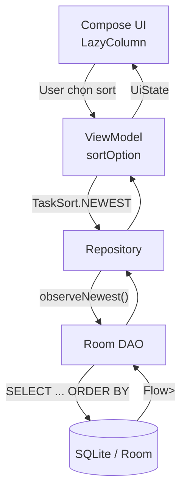

Android khuyến nghị tách app ít nhất thành **UI layer** và **Data layer**, trong đó repository quản lý các data source. Với ứng dụng offline-first, database thường đóng vai trò source of truth cho application data. ([Android Developers][3])

Do đó:

> UI không cần tự truy cập database và tự quyết định cách query.

Một luồng tốt hơn là:

```text
UI
 ↓
ViewModel
 ↓
Repository
 ↓
DAO
 ↓
Room
```

---

# 6. Ví dụ thực tế: Todo App

Ta xây dựng một Todo App có chức năng:

```text
Sort by:

○ Newest
○ Oldest
○ Name A-Z
○ Priority
```

---

## 6.1 Entity

```kotlin
@Entity(
    tableName = "tasks",
    indices = [
        Index(value = ["updatedAt"]),
        Index(value = ["title"]),
        Index(value = ["priority"])
    ]
)
data class TaskEntity(
    @PrimaryKey(autoGenerate = true)
    val id: Long = 0,

    val title: String,

    val priority: Int,

    val completed: Boolean = false,

    val createdAt: Long,

    val updatedAt: Long
)
```

Room sử dụng `Entity` để ánh xạ object thành table/row trong database. ([Android Developers][4])

---

# 7. Sort trực tiếp bằng Room

Đây thường là cách nên ưu tiên khi danh sách thực sự đến từ database.

## Mới nhất

```kotlin
@Query(
    """
    SELECT *
    FROM tasks
    ORDER BY updatedAt DESC, id ASC
    """
)
fun observeNewest(): Flow<List<TaskEntity>>
```

---

## Cũ nhất

```kotlin
@Query(
    """
    SELECT *
    FROM tasks
    ORDER BY updatedAt ASC, id ASC
    """
)
fun observeOldest(): Flow<List<TaskEntity>>
```

---

## Tên A → Z

```kotlin
@Query(
    """
    SELECT *
    FROM tasks
    ORDER BY title COLLATE NOCASE ASC, id ASC
    """
)
fun observeTitleAscending(): Flow<List<TaskEntity>>
```

---

## Priority cao nhất trước

```kotlin
@Query(
    """
    SELECT *
    FROM tasks
    ORDER BY priority DESC, updatedAt DESC, id ASC
    """
)
fun observeHighestPriority(): Flow<List<TaskEntity>>
```

DAO là lớp abstract hóa việc truy cập database; Room tự generate implementation của DAO. ([Android Developers][5])

---

# 8. Vì sao có thêm `id ASC`?

Query:

```sql
ORDER BY priority DESC
```

có thể gặp:

```text
Task A priority = 3
Task B priority = 3
Task C priority = 3
```

Ba task có cùng sort key.

Ta nên thêm **tie-breaker**:

```sql
ORDER BY priority DESC, id ASC
```

Khi đó có một quy tắc thứ hai:

```text
priority ↓
   │
   └── nếu bằng nhau
          ↓
         id ↑
```

Điều này làm thứ tự hiển thị dễ dự đoán hơn.

---

# 9. Multi-column sorting

SQL có thể sort bằng nhiều trường.

Ví dụ:

> Ưu tiên task chưa hoàn thành trước, sau đó priority cao trước, sau đó mới nhất.

```sql
SELECT *
FROM tasks
ORDER BY
    completed ASC,
    priority DESC,
    updatedAt DESC,
    id ASC
```

Ý nghĩa:

```text
1. completed = false
      ↓
2. priority cao
      ↓
3. updatedAt mới
      ↓
4. id nhỏ hơn
```

---

# 10. Room + Flow

Đối với danh sách thường xuyên thay đổi, DAO có thể trả về:

```kotlin
Flow<List<TaskEntity>>
```

Room hỗ trợ observable read query thông qua `Flow`. Khi bảng được query thay đổi, Room có thể phát emission mới cho observer. ([Android Developers][6])

Ví dụ:

```kotlin
@Dao
interface TaskDao {

    @Query(
        """
        SELECT *
        FROM tasks
        ORDER BY updatedAt DESC
        """
    )
    fun observeTasks(): Flow<List<TaskEntity>>

}
```

Luồng:

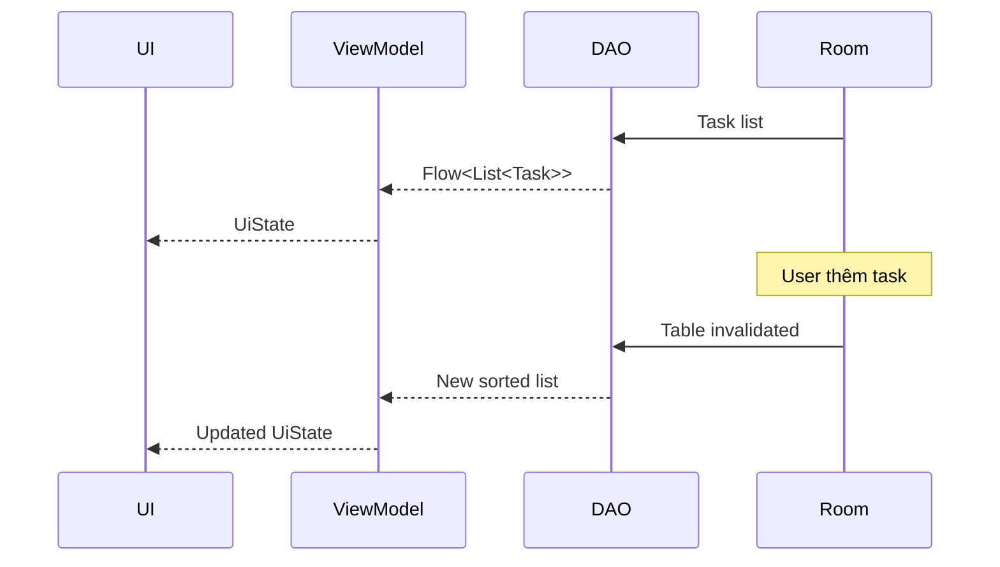

UI không cần:

```kotlin
refresh()
```

sau mỗi thay đổi nếu toàn bộ pipeline đang quan sát `Flow`.

---

# 11. Dynamic Sort

Một lỗi thiết kế phổ biến là cố truyền tên column trực tiếp kiểu:

```kotlin
@Query(
    """
    SELECT * FROM tasks
    ORDER BY :sortColumn
    """
)
fun observeTasks(sortColumn: String): Flow<List<TaskEntity>>
```

`sortColumn` ở đây không nên được coi như cách thay thế trực tiếp identifier SQL để tạo `ORDER BY title`, `ORDER BY updatedAt` tùy ý.

Một giải pháp rõ ràng và type-safe hơn là định nghĩa các query đã biết trước.

---

## 11.1 Tạo enum

```kotlin
enum class TaskSort {
    NEWEST,
    OLDEST,
    TITLE_AZ,
    PRIORITY
}
```

---

## 11.2 DAO

```kotlin
@Dao
interface TaskDao {

    @Query(
        """
        SELECT *
        FROM tasks
        ORDER BY updatedAt DESC, id ASC
        """
    )
    fun observeNewest(): Flow<List<TaskEntity>>

    @Query(
        """
        SELECT *
        FROM tasks
        ORDER BY updatedAt ASC, id ASC
        """
    )
    fun observeOldest(): Flow<List<TaskEntity>>

    @Query(
        """
        SELECT *
        FROM tasks
        ORDER BY title COLLATE NOCASE ASC, id ASC
        """
    )
    fun observeTitleAZ(): Flow<List<TaskEntity>>

    @Query(
        """
        SELECT *
        FROM tasks
        ORDER BY priority DESC, updatedAt DESC, id ASC
        """
    )
    fun observePriority(): Flow<List<TaskEntity>>
}
```

Một lợi ích của Room là SQL trong DAO được kiểm tra lúc compile thay vì phải đợi tới runtime mới phát hiện nhiều loại lỗi query. ([Android Developers][1])

---

# 12. Repository quyết định query

```kotlin
class TaskRepository(
    private val dao: TaskDao
) {

    fun observeTasks(
        sort: TaskSort
    ): Flow<List<TaskEntity>> {

        return when (sort) {

            TaskSort.NEWEST ->
                dao.observeNewest()

            TaskSort.OLDEST ->
                dao.observeOldest()

            TaskSort.TITLE_AZ ->
                dao.observeTitleAZ()

            TaskSort.PRIORITY ->
                dao.observePriority()
        }
    }
}
```

Kiến trúc:

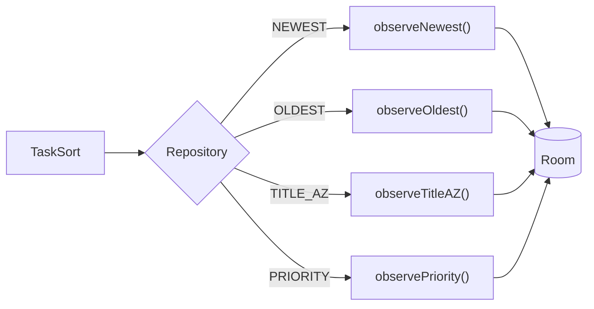

Repository trở thành nơi UI yêu cầu:

```text
"Tôi muốn danh sách theo NEWEST"
```

thay vì UI biết:

```text
SELECT * FROM tasks ORDER BY updatedAt DESC
```

---

# 13. ViewModel quản lý Sort State

Sort option là một phần của **UI state**.

Ví dụ:

```kotlin
data class TaskUiState(
    val tasks: List<TaskEntity> = emptyList(),
    val sort: TaskSort = TaskSort.NEWEST
)
```

Có thể sử dụng `SavedStateHandle` để giữ một lượng nhỏ state cần thiết nhằm tái tạo UI sau configuration/process recreation. ([Android Developers][7])

```kotlin
class TaskViewModel(
    private val repository: TaskRepository,
    private val savedStateHandle: SavedStateHandle
) : ViewModel() {

    private val sort =
        savedStateHandle
            .getStateFlow(
                "task_sort",
                TaskSort.NEWEST.name
            )
            .map { saved ->
                runCatching {
                    TaskSort.valueOf(saved)
                }.getOrDefault(TaskSort.NEWEST)
            }

    val tasks =
        sort.flatMapLatest { sortType ->
            repository.observeTasks(sortType)
        }

    fun changeSort(sort: TaskSort) {
        savedStateHandle["task_sort"] = sort.name
    }
}
```

Điểm quan trọng nằm ở:

```kotlin
flatMapLatest
```

Khi:

```text
NEWEST
```

đổi thành:

```text
PRIORITY
```

Flow cũ được thay bằng Flow tương ứng với query mới.

---

# 14. UI Compose

```kotlin
@Composable
fun TaskScreen(
    viewModel: TaskViewModel
) {

    val tasks by viewModel.tasks.collectAsStateWithLifecycle(
        initialValue = emptyList()
    )

    LazyColumn {

        items(
            items = tasks,
            key = { it.id }
        ) { task ->

            Text(
                text = task.title
            )
        }
    }
}
```

UI chỉ biết:

```text
List<Task>
```

Nó không cần biết dữ liệu đã được sort bởi:

```sql
ORDER BY ...
```

ở bên dưới.

---

# 15. User đổi cách sort

Ví dụ UI:

```text
┌────────────────────────────────────┐
│ Tasks                     Sort ▼   │
├────────────────────────────────────┤
│ 🔴 Finish assignment               │
│ 🟡 Study Room                      │
│ 🟢 Read book                       │
└────────────────────────────────────┘
```

Nhấn:

```text
Sort ▼

✓ Newest
  Oldest
  Name A-Z
  Priority
```

Event:

```kotlin
viewModel.changeSort(
    TaskSort.PRIORITY
)
```

Luồng:

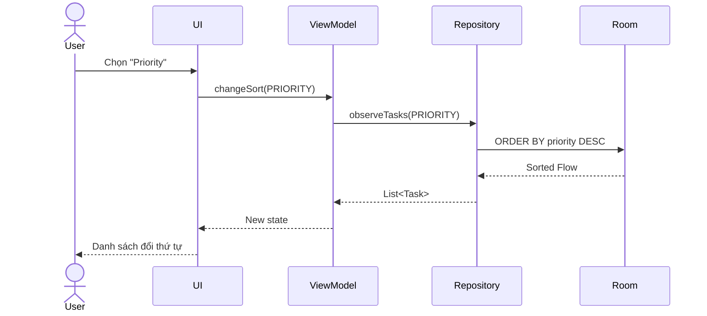

---

# 16. Sort trong SQL hay Kotlin?

Có hai cách chính.

### Cách A — Database sorting

```sql
ORDER BY updatedAt DESC
```

### Cách B — In-memory sorting

```kotlin
tasks.sortedByDescending {
    it.updatedAt
}
```

Không có nghĩa một cách luôn đúng cho mọi trường hợp.

| Trường hợp                             | Nên ưu tiên            |
| -------------------------------------- | ---------------------- |
| Database có hàng nghìn row             | SQL                    |
| Paging                                 | SQL                    |
| Sort là quy tắc của query              | SQL                    |
| Cần index                              | SQL                    |
| Dataset chỉ vài item                   | Kotlin có thể đủ       |
| Dữ liệu đã nằm hoàn toàn trong RAM     | Kotlin                 |
| Sort chỉ phục vụ presentation tạm thời | Kotlin có thể hợp lý   |
| Sort cần quy tắc ngôn ngữ rất đặc biệt | Có thể cần xử lý riêng |

---

# 17. Vì sao thường nên sort ở database?

Ví dụ database có:

```text
100,000 tasks
```

Không nên mặc định nghĩ:

```text
Room
 ↓
load 100,000 rows
 ↓
Kotlin
 ↓
sortedBy()
```

nếu query/paging có thể để database xử lý ngay.

SQLite query planner có thể sử dụng index trên column liên quan đến `ORDER BY` để hỗ trợ việc trả kết quả theo thứ tự phù hợp. ([SQLite][8])

Ví dụ:

```sql
CREATE INDEX index_tasks_updatedAt
ON tasks(updatedAt);
```

Room:

```kotlin
@Entity(
    indices = [
        Index(value = ["updatedAt"])
    ]
)
data class TaskEntity(...)
```

---

# 18. Nhưng đừng tạo index cho mọi column

Không nên biến:

```text
title
priority
completed
createdAt
updatedAt
description
category
...
```

thành index một cách máy móc.

Index giúp một số kiểu đọc/query, nhưng cũng cần storage và phải được cập nhật khi dữ liệu thay đổi.

Vì vậy hãy ưu tiên index cho những query quan trọng và sau đó **đo performance/query plan**, thay vì thêm index theo cảm tính. SQLite cung cấp `EXPLAIN QUERY PLAN` để kiểm tra chiến lược query và việc sử dụng index. ([SQLite][9])

---

# 19. Sort + Search Local Data

Bài trước có **Search Local Data**.

Hai chức năng thường kết hợp:

```text
Search
+
Filter
+
Sort
```

Ví dụ:

```sql
SELECT *
FROM tasks
WHERE title LIKE '%' || :query || '%'
ORDER BY updatedAt DESC
```

Luồng:

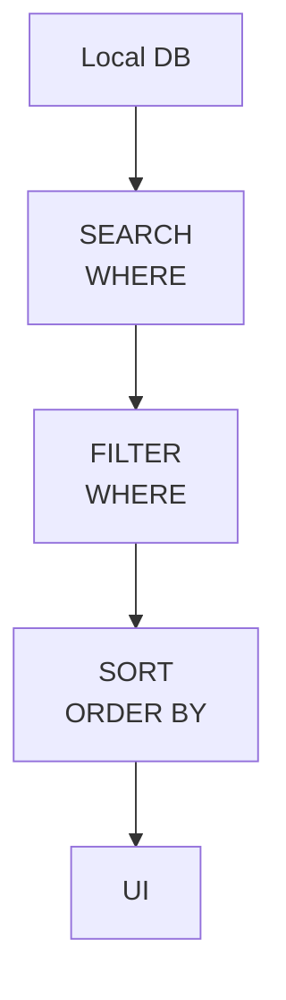

Ví dụ user:

```text
Search: "Android"
Filter: chưa hoàn thành
Sort: mới nhất
```

Query:

```sql
SELECT *
FROM tasks
WHERE
    title LIKE '%' || :query || '%'
    AND completed = 0
ORDER BY
    updatedAt DESC,
    id ASC
```

---

# 20. Sort trong Offline-First

Đây là lý do bài nằm trong:

```text
Storage
└── Offline Design
    ├── Offline First
    ├── Cache Policy
    ├── Local Source of Truth
    ├── Conflict Resolution
    ├── Search Local Data
    └── Sort Local Data ←
```

Android hướng dẫn rằng với offline-first repository có network, app có local data source và network data source; local data source là nguồn mà higher layers đọc dữ liệu, còn repository chịu trách nhiệm đồng bộ network về local. ([Android Developers][10])

Điều này tạo ra pattern:

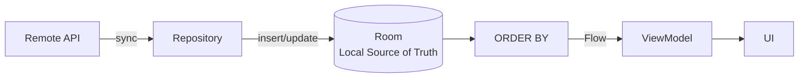

### Khi online

```text
API
 ↓
Repository
 ↓
Room
 ↓
ORDER BY
 ↓
UI
```

### Khi offline

```text
Room
 ↓
ORDER BY
 ↓
UI
```

Như vậy sorting local không nhất thiết phụ thuộc network.

---

# 21. Ví dụ offline thực tế

Giả sử user có:

```text
Task A updatedAt = 10
Task B updatedAt = 20
Task C updatedAt = 30
```

UI:

```text
C
B
A
```

User mất mạng.

Sau đó tạo:

```text
Task D updatedAt = 40
```

Room:

```text
D
C
B
A
```

Nếu app thiết kế local-first hợp lý, UX vẫn có thể tiếp tục:

```text
Create
Search
Filter
Sort
Read
```

mà không phải chờ server.

Khi connectivity quay lại:

```text
Room
 ↑
Sync
 ↑
Server
```

Sau khi database thay đổi, observable Room query có thể phát danh sách mới. Offline-first documentation cũng mô tả repository trả observable data và reader nhận thay đổi sau khi local data được cập nhật. ([Android Developers][10])

---

# 22. Sort preference nên lưu ở đâu?

Có hai trường hợp khác nhau.

## Chỉ cần giữ trong screen/session

Ví dụ user đang ở Task Screen và chọn:

```text
Priority
```

Có thể giữ bằng:

```text
ViewModel
+
SavedStateHandle
```

`SavedStateHandle` phù hợp với lượng nhỏ dữ liệu cần thiết để khôi phục UI state. ([Android Developers][7])

---

## Muốn nhớ preference lâu dài

Ví dụ:

> Mỗi lần mở app, tôi vẫn muốn sort theo Priority.

Đây là **user preference**.

Có thể persist:

```text
DataStore
```

Android mô tả DataStore là lựa chọn phù hợp cho các key-value setting của người dùng. ([Android Developers][11])

Ví dụ:

```text
DataStore

task_sort = "PRIORITY"
```

Kiến trúc:

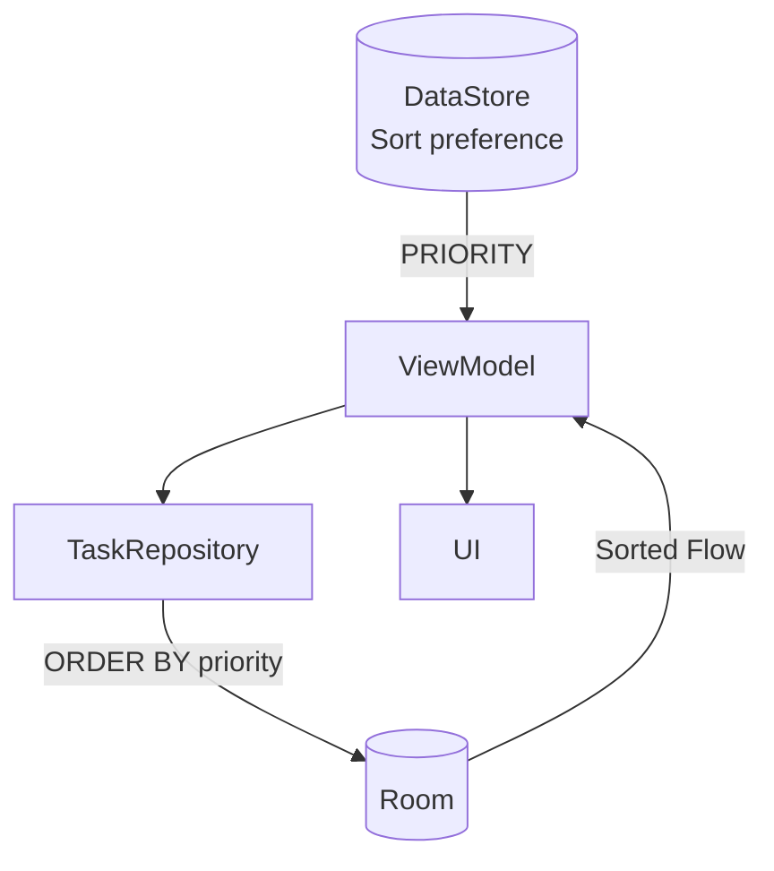

---

# 23. Text sorting và `COLLATE`

Ví dụ:

```text
android
Android
ANDROID
Room
```

Có thể dùng:

```sql
ORDER BY title COLLATE NOCASE ASC
```

SQLite có các built-in collating sequences như `BINARY`, `NOCASE` và `RTRIM`. ([SQLite][12])

Tuy nhiên cần lưu ý:

> `NOCASE` mặc định của SQLite không phải là hệ thống locale-aware sorting đầy đủ cho mọi Unicode/ngôn ngữ.

Điều này đáng chú ý với tiếng Việt như:

```text
Áo
An
Âm
Ấn
Ăn
```

Nếu app yêu cầu **linguistic sorting chính xác theo locale**, cần thiết kế chiến lược riêng thay vì mặc định coi `COLLATE NOCASE` là bộ sắp xếp tiếng Việt hoàn chỉnh. SQLite cũng lưu ý built-in case handling của nó có giới hạn Unicode và có các cơ chế mở rộng như ICU/custom functions ở cấp SQLite. ([SQLite][13])

---

# 24. Sai lầm thường gặp

## ❌ 1. Không có `ORDER BY`

```kotlin
@Query("SELECT * FROM tasks")
fun getTasks(): Flow<List<TaskEntity>>
```

Sau đó giả định:

> Record mới nhất luôn nằm cuối.

Không có đảm bảo như vậy. ([SQLite][2])

### ✅

```sql
ORDER BY updatedAt DESC
```

---

## ❌ 2. Sort mọi thứ trong Compose

```kotlin
LazyColumn {
    items(
        tasks.sortedByDescending {
            it.updatedAt
        }
    ) {
        ...
    }
}
```

UI đang vừa:

```text
render
+
business/presentation transformation
```

và việc sort có thể được tính lại nhiều lần không cần thiết.

### ✅

Đưa logic lên:

```text
DAO
Repository
ViewModel
```

tùy bản chất sorting.

---

## ❌ 3. UI gọi DAO trực tiếp

```text
Composable
   ↓
TaskDao
```

### ✅

```text
Composable
 ↓
ViewModel
 ↓
Repository
 ↓
DAO
```

Phù hợp hơn với separation of concerns mà Android architecture và Room DAO hướng tới. ([Android Developers][5])

---

## ❌ 4. Sort bị reset sau rotate

```text
Priority
 ↓
rotate
 ↓
Newest
```

UX không tốt.

### ✅

Giữ sort state ở state holder phù hợp:

```text
ViewModel
+
SavedStateHandle
```

---

## ❌ 5. Tạo index vô tội vạ

```text
10 columns
→
10 indexes
```

### ✅

Index theo query thực tế và kiểm tra query plan.

---

# 25. Testing

Sorting rất dễ unit/instrumentation test.

Ví dụ DAO test:

```kotlin
@Test
fun observeNewest_returnsNewestFirst() = runTest {

    dao.insert(
        TaskEntity(
            title = "Old",
            priority = 1,
            createdAt = 100,
            updatedAt = 100
        )
    )

    dao.insert(
        TaskEntity(
            title = "Newest",
            priority = 1,
            createdAt = 300,
            updatedAt = 300
        )
    )

    dao.insert(
        TaskEntity(
            title = "Middle",
            priority = 1,
            createdAt = 200,
            updatedAt = 200
        )
    )

    val result =
        dao.observeNewest().first()

    assertEquals(
        listOf(
            "Newest",
            "Middle",
            "Old"
        ),
        result.map { it.title }
    )
}
```

---

## Test Priority

```kotlin
@Test
fun observePriority_returnsHighestPriorityFirst() = runTest {

    // Arrange
    insertTask("Low", priority = 1)
    insertTask("High", priority = 3)
    insertTask("Medium", priority = 2)

    // Act
    val tasks =
        dao.observePriority().first()

    // Assert
    assertEquals(
        listOf(
            "High",
            "Medium",
            "Low"
        ),
        tasks.map { it.title }
    )
}
```

---

# 26. Các edge case nên test

```text
┌──────────────────────────────┐
│ Sort tests                   │
├──────────────────────────────┤
│ ✓ Empty database             │
│ ✓ One item                   │
│ ✓ Same priority              │
│ ✓ Same timestamp             │
│ ✓ Upper/lowercase names      │
│ ✓ Special characters         │
│ ✓ Large dataset              │
│ ✓ Change sort while running  │
│ ✓ Insert while offline       │
└──────────────────────────────┘
```

Đặc biệt:

```text
same priority
+
same updatedAt
```

là lý do một tie-breaker như:

```sql
id ASC
```

thường hữu ích.

---

# 27. Debug bằng Database Inspector

Android Studio có **Database Inspector** để xem, query và chỉnh sửa SQLite/Room database trong lúc app đang chạy. Với Room, IDE cũng có thể chạy DAO query trực tiếp; custom SQL cũng có thể được thực thi trong Inspector. ([Android Developers][14])

Ví dụ chạy:

```sql
SELECT *
FROM tasks
ORDER BY priority DESC;
```

Sau đó so sánh với UI.

---

## Debug flow

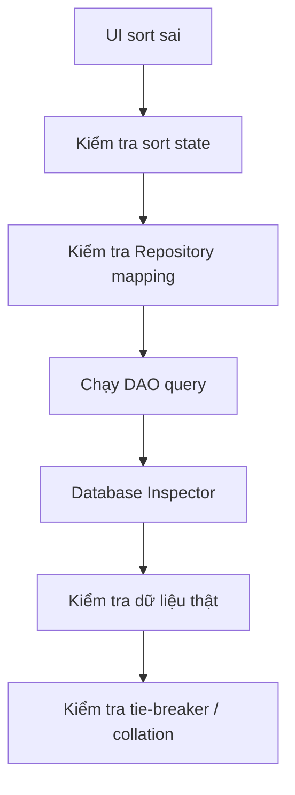

Database Inspector còn cho phép click header trong giao diện Inspector để sort dữ liệu khi kiểm tra bảng, nhưng đừng nhầm thao tác sort của Inspector với `ORDER BY` mà production query của ứng dụng đang dùng. ([Android Developers][14])

---

# 28. Performance

Có thể hình dung:

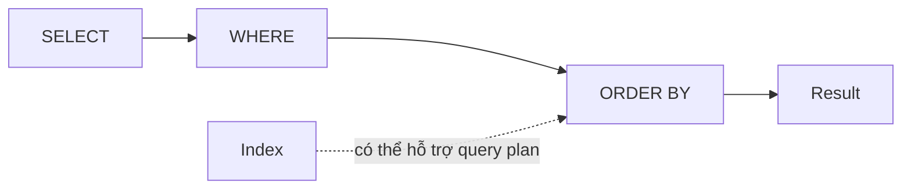

Các câu hỏi cần đặt ra:

```text
Bao nhiêu row?
      ↓
Có paging không?
      ↓
Sort column có query thường xuyên không?
      ↓
Có index phù hợp không?
      ↓
Query plan thế nào?
      ↓
UI có bị lag không?
```

SQLite query planner chịu trách nhiệm lựa chọn chiến lược thực thi nhằm giảm chi phí I/O/CPU, và index có thể hỗ trợ cả lookup lẫn một số trường hợp sorting. ([SQLite][8])

---

# 29. Lifecycle

Database không nên phụ thuộc lifecycle của:

```text
Activity
Fragment
Composable
```

Android architecture khuyến nghị UI được drive từ persistent data models thay vì giữ application data trực tiếp trong UI component, bởi UI component có thể bị Android destroy/recreate. ([Android Developers][3])

Ví dụ:

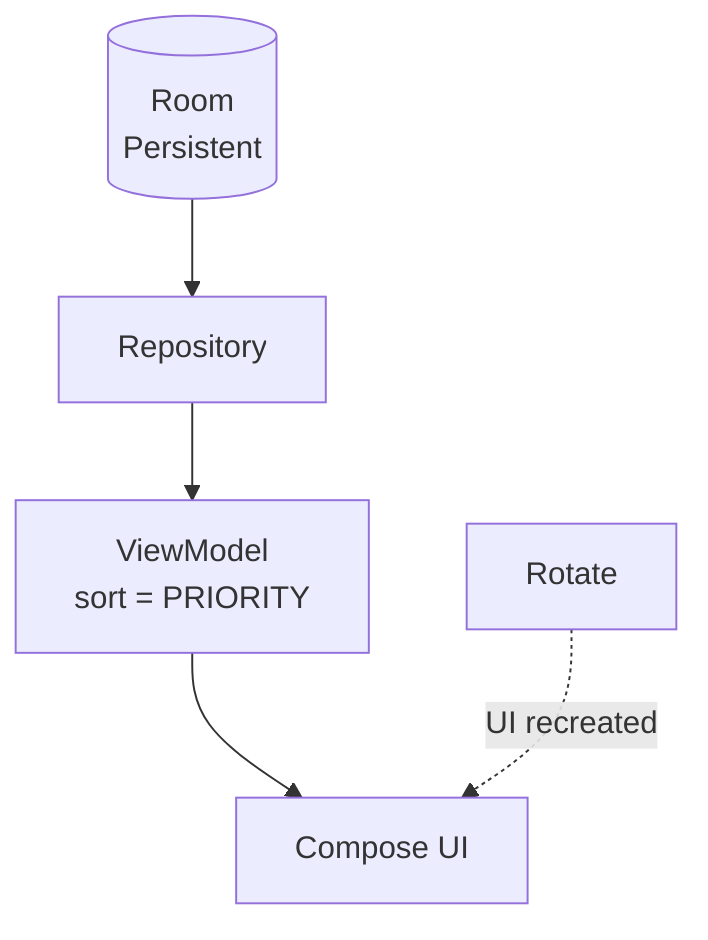

Không nên:

```text
Rotate
 ↓
reload network
 ↓
lose sort
 ↓
reset screen
```

---

# 30. Mini Project

## Offline Todo Sort

### Requirement

App có thể:

```text
✓ Thêm task
✓ Lưu bằng Room
✓ Hiển thị bằng Flow
✓ Chạy khi mất mạng
✓ Sort theo Newest
✓ Sort theo Oldest
✓ Sort theo A-Z
✓ Sort theo Priority
✓ Giữ sort selection
```

---

## Kiến trúc

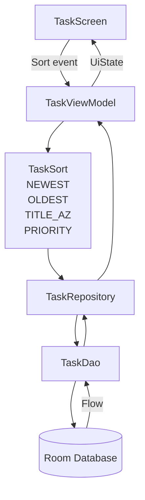

---

# 31. Cấu trúc project gợi ý

```text
data/
├── local/
│   ├── TaskEntity.kt
│   ├── TaskDao.kt
│   └── AppDatabase.kt
│
├── repository/
│   └── TaskRepository.kt
│
domain/
├── Task.kt
└── TaskSort.kt
│
ui/
└── tasks/
    ├── TaskScreen.kt
    ├── TaskUiState.kt
    └── TaskViewModel.kt
```

Với offline-first phức tạp hơn:

```text
data/
├── local/
│   ├── dao/
│   └── entity/
│
├── remote/
│   ├── api/
│   └── dto/
│
├── mapper/
│
└── repository/
```

Đây phù hợp với mô hình local/network data source + repository được Android mô tả cho offline-first. ([Android Developers][10])

---

# 32. Bài thực hành 32 phút

## 0–5 phút — Entity

Tạo:

```kotlin
TaskEntity
```

với:

```text
id
title
priority
completed
updatedAt
```

---

## 5–12 phút — DAO

Viết:

```kotlin
observeNewest()
observeOldest()
observeTitleAZ()
observePriority()
```

---

## 12–18 phút — Repository

Tạo:

```kotlin
enum class TaskSort
```

và:

```kotlin
fun observeTasks(
    sort: TaskSort
)
```

---

## 18–25 phút — ViewModel + UI

Cho user đổi:

```text
Newest
Oldest
A-Z
Priority
```

---

## 25–29 phút — Test

Test:

```text
Newest
Priority
Tie
Empty DB
```

---

## 29–32 phút — Offline

Bật airplane mode.

Thử:

```text
open list
sort
add local item
sort lại
```

UI vẫn phải hoạt động với local source.

---

# 33. Artifact cho portfolio

Một artifact nhỏ nhưng khá đẹp cho GitHub:

```text
Offline Todo
├── Room
├── Flow
├── Repository
├── Offline-first
├── Search
├── Filter
├── Dynamic sorting
└── DAO tests
```

README có thể thêm sơ đồ:

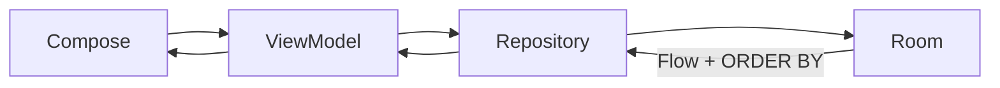

Screenshot nên thể hiện:

```text
┌───────────────────────────────┐
│ My Tasks              Sort ▼ │
├───────────────────────────────┤
│ 🔴 Android Assignment        │
│ 🟡 Learn Room                │
│ 🟢 Read Kotlin               │
└───────────────────────────────┘
```

và menu:

```text
Sort by
────────────
✓ Newest
  Oldest
  Name A-Z
  Priority
```

---

# 34. Checklist production

## Data

* [ ] Query có `ORDER BY` rõ ràng.
* [ ] Có tie-breaker nếu cần.
* [ ] Không phụ thuộc "natural database order".
* [ ] Sort hoạt động khi offline.

## Architecture

* [ ] UI không gọi Room trực tiếp.
* [ ] DAO chịu trách nhiệm database query.
* [ ] Repository expose data cho upper layers.
* [ ] Sort state nằm ở state holder phù hợp.

## Lifecycle

* [ ] Rotate không làm mất sort selection.
* [ ] Process recreation có chiến lược restore.
* [ ] Không lưu một `List<Task>` lớn trong saved state.

## Performance

* [ ] Không load dataset khổng lồ chỉ để sort bằng Kotlin nếu database có thể xử lý.
* [ ] Index được thêm dựa trên query thực tế.
* [ ] Kiểm tra query plan nếu performance quan trọng.
* [ ] Test với dữ liệu lớn hơn dữ liệu demo.

## UX

* [ ] User nhìn được mode sort hiện tại.
* [ ] Sort thay đổi ngay.
* [ ] Không nhảy thứ tự bất thường khi các item bằng nhau.
* [ ] Sort kết hợp đúng với search/filter.

## Testing

* [ ] Test `ASC`.
* [ ] Test `DESC`.
* [ ] Test empty list.
* [ ] Test duplicate sort keys.
* [ ] Test search + sort.
* [ ] Test offline.
* [ ] Test insert/update khi Flow đang được collect.

## Debug

* [ ] Có thể kiểm tra DB bằng Database Inspector.
* [ ] Có thể chạy DAO query riêng.
* [ ] Có thể chạy custom SQL để so sánh kết quả.

---

# 35. Những câu hỏi phỏng vấn có thể gặp

### Sort local data trong Room thế nào?

Sử dụng SQL `ORDER BY` trong `@Query`.

```kotlin
@Query(
    "SELECT * FROM tasks ORDER BY updatedAt DESC"
)
fun observeTasks(): Flow<List<TaskEntity>>
```

---

### `ASC` khác `DESC` thế nào?

```text
ASC  = tăng dần
DESC = giảm dần
```

---

### Không viết `ORDER BY` thì sao?

Không nên giả định database sẽ trả row theo một thứ tự ổn định; SQLite định nghĩa thứ tự là không xác định khi không có `ORDER BY`. ([SQLite][2])

---

### Sort bằng SQL hay Kotlin?

Nếu dữ liệu nằm trong database, dataset lớn, có paging hoặc cần tận dụng index:

```text
SQL
```

thường hợp lý hơn.

Với dataset nhỏ đã nằm trong RAM và sorting chỉ là presentation transformation:

```text
Kotlin sorting
```

có thể đủ.

---

### Sort state nên nằm ở Room?

Không nhất thiết.

```text
Room
→ application data

ViewModel / SavedStateHandle
→ screen sorting state

DataStore
→ persistent user sort preference
```

DataStore đặc biệt phù hợp với key-value user settings. ([Android Developers][15])

---

# 36. Mental Model

Hãy nhớ công thức:

```text
Local Data
    ↓
WHERE
    ↓
FILTER
    ↓
ORDER BY
    ↓
Flow
    ↓
Repository
    ↓
ViewModel
    ↓
UI
```

Với offline-first:

```text
Remote
   ↓ sync
Local Database
   ↓
Search / Filter / Sort
   ↓
UI
```

---

# 37. Kết luận

**Sort Local Data không chỉ là `sortedBy()` hay `ORDER BY`.**

Trong một Android app được thiết kế tốt:

```text
Room
  ↓
DAO query
  ↓
ORDER BY
  ↓
Flow
  ↓
Repository
  ↓
ViewModel
  ↓
Compose
```

Ba nguyên tắc quan trọng nhất:

> **1. Không dựa vào thứ tự mặc định của database.**

> **2. Với dữ liệu database, ưu tiên để database thực hiện sorting khi phù hợp.**

> **3. Trong offline-first, UI tiếp tục đọc và sort từ local source of truth ngay cả khi network không khả dụng.**

Room cung cấp abstraction trên SQLite, compile-time verification cho query và hỗ trợ các query bất đồng bộ/observable như `Flow`; Android architecture đồng thời khuyến nghị persistent data models và local source of truth cho các thiết kế offline-first. ([Android Developers][1])

---

## 38. Checklist hoàn thành bài

* [ ] Tôi giải thích được Sort Local Data bằng ngôn ngữ của mình.
* [ ] Tôi hiểu `ORDER BY`.
* [ ] Tôi hiểu `ASC` / `DESC`.
* [ ] Tôi biết multi-column sorting.
* [ ] Tôi biết tại sao cần tie-breaker.
* [ ] Tôi đã viết Room DAO có sorting.
* [ ] Tôi đã kết hợp Room với `Flow`.
* [ ] Tôi có `TaskSort` enum.
* [ ] Tôi biết quản lý sort state trong ViewModel.
* [ ] Tôi hiểu SavedStateHandle và persistent preference khác nhau.
* [ ] Tôi hiểu cơ bản về index.
* [ ] Tôi đã test sorting.
* [ ] Tôi đã thử Database Inspector.
* [ ] Tôi kiểm tra tính năng khi offline.
* [ ] Tôi có artifact có thể đưa vào portfolio.

### Nguồn tham khảo chính

Tài liệu chính được đối chiếu từ **Android Developers** về Room DAO, asynchronous Room queries, Flow, Android architecture, offline-first, SavedStateHandle, DataStore và Database Inspector; phần hành vi `ORDER BY`, collation và query planner được đối chiếu từ tài liệu chính thức của SQLite. ([Android Developers][5])

[1]: https://developer.android.com/training/data-storage/room "Save data in a local database using Room  |  App data and files  |  Android Developers"
[2]: https://sqlite.org/lang_select.html?utm_source=chatgpt.com "SELECT"
[3]: https://developer.android.com/topic/architecture "Guide to app architecture  |  App architecture  |  Android Developers"
[4]: https://developer.android.com/training/data-storage/room/defining-data?utm_source=chatgpt.com "Define data using Room entities | App data and files"
[5]: https://developer.android.com/training/data-storage/room/accessing-data "Access data using Room DAOs  |  App data and files  |  Android Developers"
[6]: https://developer.android.com/training/data-storage/room/async-queries "Write asynchronous DAO queries  |  App data and files  |  Android Developers"
[7]: https://developer.android.com/topic/libraries/architecture/viewmodel/viewmodel-savedstate?utm_source=chatgpt.com "Saved State module for ViewModel | App architecture"
[8]: https://sqlite.org/queryplanner.html?utm_source=chatgpt.com "Query Planning"
[9]: https://www.sqlite.org/eqp.html?utm_source=chatgpt.com "EXPLAIN QUERY PLAN"
[10]: https://developer.android.com/topic/architecture/data-layer/offline-first "Build an offline-first app  |  App architecture  |  Android Developers"
[11]: https://developer.android.com/topic/libraries/architecture/datastore?utm_source=chatgpt.com "App Architecture: Data Layer - DataStore"
[12]: https://www.sqlite.org/datatype3.html?utm_source=chatgpt.com "Datatypes In SQLite"
[13]: https://sqlite.org/faq.html?utm_source=chatgpt.com "Frequently Asked Questions"
[14]: https://developer.android.com/studio/inspect/database "Debug your database with the Database Inspector  |  Android Studio  |  Android Developers"
[15]: https://developer.android.com/topic/architecture/data-layer?utm_source=chatgpt.com "Data layer | App architecture"

---

# Bài luyện tập

## Mục tiêu


## Đề bài


## Yêu cầu hoàn thành

- [ ] 
- [ ] 
- [ ] 

## Kết quả / lời giải


## Ghi chú
