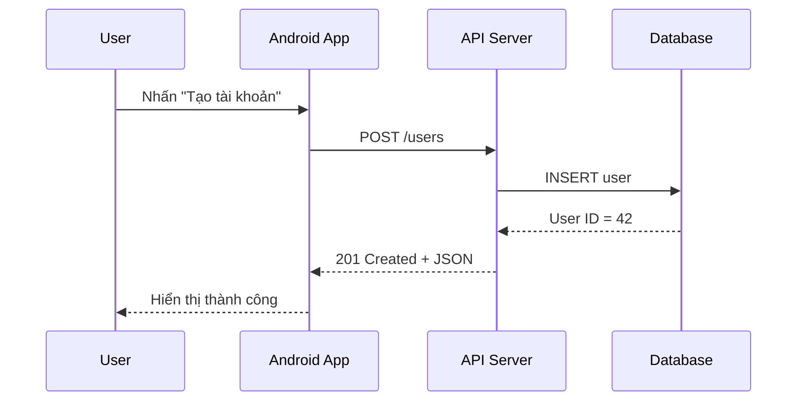
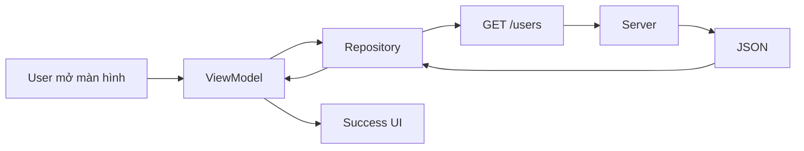
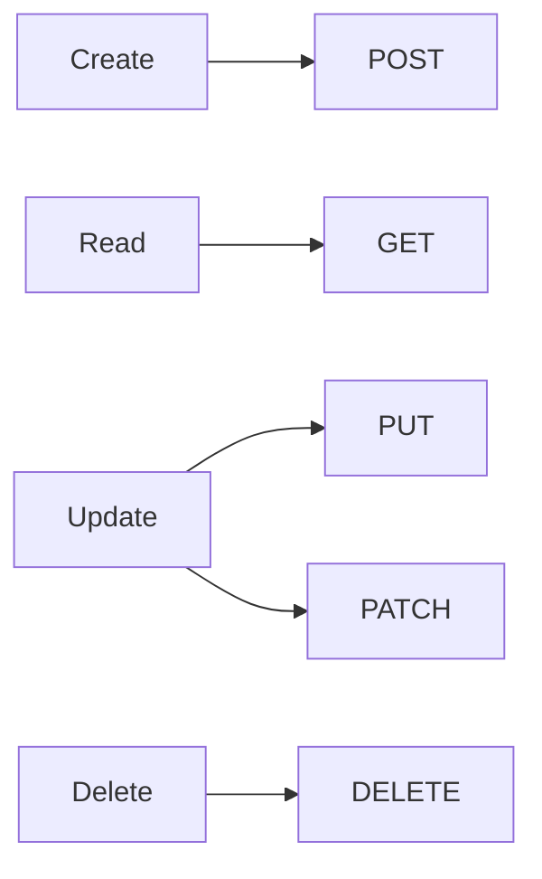
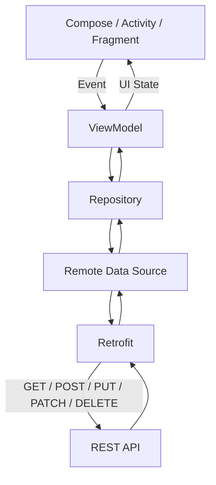
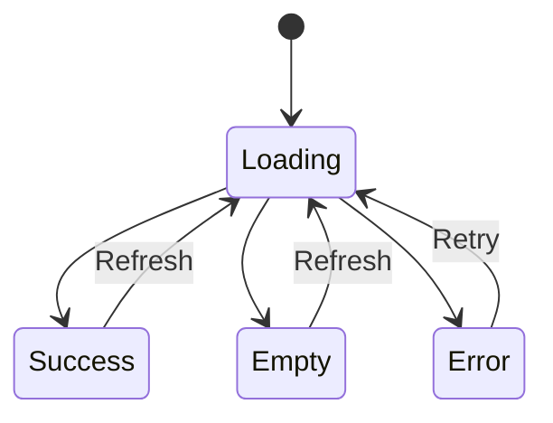
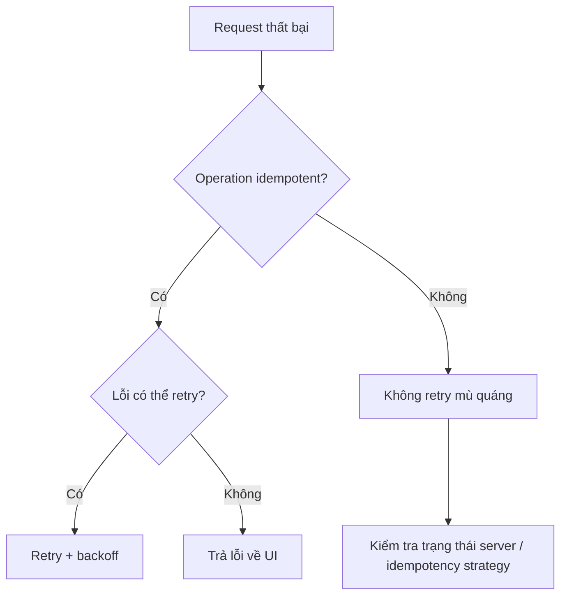
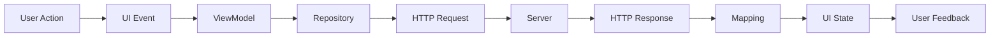

# 001 - HTTP Methods

[](https://dev.to/rohit_giri/backend-without-http-how-would-the-web-work-e26?utm_source=chatgpt.com)

| Thuộc tính              | Nội dung                          |
| ----------------------- | --------------------------------- |
| **Học phần**            | 04 - Network, Async and Services  |
| **Module**              | Module 07 - Network               |
| **Nhóm nội dung**       | HTTP Fundamentals                 |
| **Nguồn roadmap**       | Network / HTTP Fundamentals       |
| **Loại bài**            | Network                           |
| **Thứ tự trong module** | 001                               |
| **Thời lượng gợi ý**    | 32 phút                           |
| **Mức độ**              | Cơ bản                            |
| **Artifact portfolio**  | Mini REST API Client trên Android |

---

## 1. Tóm tắt

**HTTP Methods** hay **HTTP Request Methods** là các phương thức cho biết client muốn server thực hiện hành động gì đối với một resource.

Ví dụ với resource:

```text
/users/42
```

ta có thể thực hiện:

```http
GET    /users/42
POST   /users
PUT    /users/42
PATCH  /users/42
DELETE /users/42
```

HTTP được thiết kế theo mô hình request/response. Ý nghĩa của hành động nằm chủ yếu ở **HTTP method**, trong khi URI xác định resource mà request hướng tới. ([RFC Editor][1])

Trong Android, HTTP Methods thường xuất hiện ở:

```text
UI
 ↓
ViewModel
 ↓
Repository
 ↓
Remote Data Source
 ↓
Retrofit / OkHttp
 ↓
HTTP API
 ↓
Server
```

Android khuyến nghị data layer chịu trách nhiệm làm việc với các nguồn dữ liệu như network, trong khi `ViewModel` quản lý screen-level UI state và giao tiếp với data layer. ([Android Developers][2])

---

# 2. Mục tiêu học tập

Sau bài này, bạn nên có thể:

* Giải thích HTTP Method là gì.
* Phân biệt:

  * `GET`
  * `POST`
  * `PUT`
  * `PATCH`
  * `DELETE`
  * `HEAD`
  * `OPTIONS`
* Biết HTTP Method nào thường tương ứng với CRUD.
* Hiểu:

  * **Safe method**
  * **Idempotent method**
* Biết tại sao `POST` không nên được retry một cách mù quáng.
* Khai báo HTTP Methods bằng Retrofit.
* Kết nối network request với:

  * Repository
  * ViewModel
  * UI State
* Hiển thị:

  * Loading
  * Success
  * Empty
  * Error
  * Retry
* Debug request bằng Android Studio Network Inspector.
* Viết một mini API client có thể đưa vào portfolio.

---

# 3. HTTP Request hoạt động như thế nào?

Một HTTP request thường chứa:

```text
HTTP Request
├── Method
├── URL
├── Headers
├── Query Parameters
└── Body
```

Ví dụ:

```http
POST /users
Content-Type: application/json
Authorization: Bearer token...

{
    "name": "Khanh",
    "email": "khanh@example.com"
}
```

Server xử lý request rồi trả về HTTP response:

```http
HTTP/1.1 201 Created
Content-Type: application/json

{
    "id": 42,
    "name": "Khanh",
    "email": "khanh@example.com"
}
```

Có thể hình dung:



---

# 4. Các HTTP Methods quan trọng

Theo HTTP semantics, các method chuẩn như `GET`, `HEAD`, `POST`, `PUT`, `DELETE`, `OPTIONS` có semantics riêng; `PATCH` được định nghĩa riêng để hỗ trợ chỉnh sửa một phần resource. ([RFC Editor][3])

| Method    | Mục đích thường gặp                                  | CRUD   | Safe | Idempotent    |
| --------- | ---------------------------------------------------- | ------ | ---- | ------------- |
| `GET`     | Lấy dữ liệu                                          | Read   | ✅    | ✅             |
| `POST`    | Tạo/thực thi hành động                               | Create | ❌    | ❌             |
| `PUT`     | Thay thế/cập nhật toàn bộ                            | Update | ❌    | ✅             |
| `PATCH`   | Cập nhật một phần                                    | Update | ❌    | Không đảm bảo |
| `DELETE`  | Xóa resource                                         | Delete | ❌    | ✅             |
| `HEAD`    | Lấy metadata giống GET nhưng không cần response body | Read   | ✅    | ✅             |
| `OPTIONS` | Hỏi server hỗ trợ khả năng/method nào                | —      | ✅    | ✅             |

> **CRUD và HTTP Method không phải là một khái niệm.** CRUD là mô hình thao tác dữ liệu; HTTP Methods định nghĩa semantics của HTTP request.

---

# 5. GET — lấy dữ liệu

`GET` dùng để yêu cầu representation của một resource. Đây là một **safe** và **idempotent method** theo HTTP semantics. ([RFC Editor][3])

Ví dụ:

```http
GET /users
```

hoặc:

```http
GET /users/42
```

hoặc tìm kiếm:

```http
GET /products?category=laptop&page=2
```

### Ví dụ Android

```kotlin
@GET("users/{id}")
suspend fun getUser(
    @Path("id") id: Long
): UserDto
```

Retrofit sử dụng annotation trên interface method để mô tả HTTP method và relative URL của request. ([Square Open Source][4])

### Luồng



### Trường hợp sử dụng

```text
GET /articles
GET /profile
GET /products/12
GET /messages?page=3
```

---

# 6. POST — tạo resource hoặc thực hiện hành động

`POST` yêu cầu server xử lý nội dung request theo semantics của resource. Trong REST API, nó thường được dùng để tạo resource mới. `POST` không được HTTP định nghĩa là idempotent. ([RFC Editor][1])

Ví dụ:

```http
POST /users
```

Body:

```json
{
  "name": "An",
  "email": "an@example.com"
}
```

Server có thể trả:

```http
201 Created
```

### Retrofit

```kotlin
@POST("users")
suspend fun createUser(
    @Body request: CreateUserRequest
): UserDto
```

### Điểm đặc biệt

Giả sử:

```http
POST /orders
```

được gửi hai lần:

```text
Request 1 → Order #100
Request 2 → Order #101
```

Có thể vô tình tạo **hai đơn hàng**.

Vì vậy:

```text
POST + Retry tự động
        ↓
Cần thận trọng
```

Đây là khác biệt quan trọng với các idempotent method. HTTP/3 cũng nêu rằng client không nên tự động retry một request không idempotent trừ khi có cách xác định rằng việc retry là an toàn. ([RFC Editor][5])

---

# 7. PUT — cập nhật toàn bộ resource

`PUT` thường biểu diễn việc tạo hoặc **thay thế trạng thái của target resource** bằng representation được gửi lên. Nó là một idempotent method. ([RFC Editor][3])

Ví dụ resource hiện tại:

```json
{
  "id": 42,
  "name": "An",
  "email": "old@example.com"
}
```

Request:

```http
PUT /users/42
```

```json
{
  "name": "An Khanh",
  "email": "new@example.com"
}
```

### Retrofit

```kotlin
@PUT("users/{id}")
suspend fun updateUser(
    @Path("id") id: Long,
    @Body request: UpdateUserRequest
): UserDto
```

---

# 8. PATCH — cập nhật một phần resource

`PATCH` được thiết kế để thực hiện **partial modification** thay vì thay thế toàn bộ resource như `PUT`. ([RFC Editor][6])

Ví dụ chỉ muốn thay email:

```http
PATCH /users/42
```

```json
{
  "email": "new@example.com"
}
```

Các trường khác không nhất thiết phải gửi lại.

### Retrofit

```kotlin
@PATCH("users/{id}")
suspend fun updateEmail(
    @Path("id") id: Long,
    @Body request: UpdateEmailRequest
): UserDto
```

Có những chuẩn cụ thể để mô tả PATCH document, chẳng hạn **JSON Patch** và **JSON Merge Patch**. ([RFC Editor][7])

---

# 9. PUT và PATCH khác nhau thế nào?

Đây là câu hỏi phỏng vấn rất phổ biến.

Giả sử server có:

```json
{
  "id": 42,
  "name": "Khanh",
  "email": "khanh@example.com",
  "age": 23
}
```

### PUT

```http
PUT /users/42
```

```json
{
  "name": "An Khanh",
  "email": "new@example.com",
  "age": 23
}
```

Ý tưởng:

```text
Resource cũ
     ↓
thay thế representation
     ↓
Resource mới
```

### PATCH

```http
PATCH /users/42
```

```json
{
  "email": "new@example.com"
}
```

Ý tưởng:

```text
Resource cũ
     ↓
chỉnh một phần
     ↓
Resource mới
```

RFC PATCH ra đời chính vì `PUT` về semantics là thao tác đối với toàn bộ representation, trong khi nhiều ứng dụng cần thay đổi một phần resource. ([RFC Editor][6])

---

# 10. DELETE — xóa resource

Ví dụ:

```http
DELETE /users/42
```

### Retrofit

```kotlin
@DELETE("users/{id}")
suspend fun deleteUser(
    @Path("id") id: Long
)
```

`DELETE` là **idempotent** theo HTTP semantics. ([RFC Editor][3])

Điều đó không có nghĩa response của mọi lần gọi phải giống nhau.

Ví dụ:

```text
DELETE lần 1
/users/42 tồn tại
        ↓
resource bị xóa

DELETE lần 2
/users/42 không còn
        ↓
resource vẫn ở trạng thái bị xóa
```

Idempotency nói về **intended effect trên server**, không phải việc mọi response phải giống hệt nhau. ([RFC Editor][8])

---

# 11. HEAD

`HEAD` có semantics tương tự `GET`, nhưng server không gửi representation content trong response. Nó hữu ích khi client chủ yếu quan tâm metadata. ([RFC Editor][3])

Ví dụ:

```http
HEAD /images/avatar.jpg
```

Có thể dùng để kiểm tra các metadata như:

```text
Content-Type
Content-Length
ETag
Last-Modified
```

mà không cần tải toàn bộ resource.

---

# 12. OPTIONS

`OPTIONS` dùng để yêu cầu thông tin về các communication options khả dụng cho target resource/server. Nó thuộc nhóm safe methods. ([RFC Editor][3])

Ví dụ:

```http
OPTIONS /users
```

Response có thể cho biết:

```http
Allow: GET, POST, OPTIONS
```

Trong phát triển web, bạn cũng thường gặp `OPTIONS` khi trình duyệt thực hiện CORS preflight.

---

# 13. Safe Method là gì?

**Safe** nghĩa là client không yêu cầu thay đổi trạng thái của target resource như mục đích chính của request. HTTP định nghĩa `GET`, `HEAD`, `OPTIONS` và `TRACE` là safe methods. ([RFC Editor][9])

```text
Safe
├── GET
├── HEAD
├── OPTIONS
└── TRACE
```

Ví dụ:

```http
GET /products
```

không nên có semantics kiểu:

```text
GET /deleteUser?id=42
```

Dùng `GET` để thực hiện hành động phá hủy dữ liệu sẽ đi ngược semantics của method.

---

# 14. Idempotent là gì?

Một request method được xem là **idempotent** nếu việc gửi nhiều request giống nhau có intended effect tương đương gửi một lần. Theo HTTP semantics, safe methods cùng `PUT` và `DELETE` là idempotent. ([RFC Editor][3])

## Ví dụ PUT

```http
PUT /settings/theme

{
  "theme": "dark"
}
```

Gửi:

```text
1 lần
```

hay:

```text
10 lần
```

trạng thái cuối vẫn có thể là:

```text
theme = dark
```

---

# 15. Tại sao Idempotency quan trọng với Android?

Mobile network không ổn định.

Ví dụ:

```text
Android
   │
   │ POST /payment
   ▼
Server
   │
   ├── Payment đã thành công
   │
   X Response bị mất vì mạng rớt
```

App chỉ nhìn thấy:

```text
Timeout
```

Nếu app tự gửi lại:

```http
POST /payment
```

thì backend thiết kế kém có thể tạo giao dịch thứ hai.

Vì vậy, retry policy phải xét đến semantics của operation. Các protocol HTTP hiện đại cũng đặc biệt coi idempotency là yếu tố quan trọng khi quyết định request nào có thể tự động retry sau lỗi kết nối. ([RFC Editor][10])

---

# 16. HTTP Methods và CRUD

Một mapping thường gặp:



Hoặc:

| CRUD            | HTTP Method phổ biến |
| --------------- | -------------------- |
| Create          | `POST`               |
| Read            | `GET`                |
| Update toàn bộ  | `PUT`                |
| Update một phần | `PATCH`              |
| Delete          | `DELETE`             |

Đây là **quy ước API design phổ biến**, không phải quy tắc rằng mọi HTTP API bắt buộc phải ánh xạ CRUD theo đúng bảng này.

---

# 17. Retrofit trên Android

Retrofit hỗ trợ các HTTP annotations như `GET`, `POST`, `PUT`, `PATCH`, `DELETE`, `HEAD` và `OPTIONS`. ([Square Open Source][4])

Ví dụ một service:

```kotlin
interface UserApi {

    @GET("users")
    suspend fun getUsers(): List<UserDto>

    @GET("users/{id}")
    suspend fun getUser(
        @Path("id") id: Long
    ): UserDto

    @POST("users")
    suspend fun createUser(
        @Body request: CreateUserRequest
    ): UserDto

    @PUT("users/{id}")
    suspend fun replaceUser(
        @Path("id") id: Long,
        @Body request: UpdateUserRequest
    ): UserDto

    @PATCH("users/{id}")
    suspend fun patchUser(
        @Path("id") id: Long,
        @Body request: PatchUserRequest
    ): UserDto

    @DELETE("users/{id}")
    suspend fun deleteUser(
        @Path("id") id: Long
    )
}
```

---

# 18. HTTP Method nên nằm ở đâu trong kiến trúc Android?

Không nên viết trực tiếp network logic vào Composable hoặc Activity.

Một kiến trúc dễ quản lý hơn:



Android architecture guidance hiện tại khuyến nghị `ViewModel` làm screen-level state holder, nhận events từ UI và làm việc với repository/use case để lấy hoặc thay đổi application data. ([Android Developers][11])

---

# 19. Repository

Ví dụ:

```kotlin
class UserRepository(
    private val api: UserApi
) {

    suspend fun getUsers(): List<User> {
        return api
            .getUsers()
            .map { it.toDomain() }
    }
}
```

Điểm quan trọng:

```text
UI
không cần biết
GET /users
```

UI chỉ cần biết:

```text
repository.getUsers()
```

Nhờ vậy chi tiết network được giữ trong data layer, phù hợp với cách Android architecture phân tách trách nhiệm giữa UI và data layer. ([Android Developers][2])

---

# 20. Model UI State trước khi viết UI

Một network screen tối thiểu nên nghĩ tới:

```text
Idle
 ↓
Loading
 ↓
├── Success
├── Empty
└── Error
      ↓
     Retry
```

Ví dụ:

```kotlin
sealed interface UsersUiState {

    data object Loading : UsersUiState

    data class Success(
        val users: List<User>
    ) : UsersUiState

    data object Empty : UsersUiState

    data class Error(
        val message: String
    ) : UsersUiState
}
```

Android khuyến nghị UI được điều khiển bởi observable UI state; `StateFlow` hoặc Compose State có thể được sử dụng để khiến UI cập nhật khi state thay đổi. ([Android Developers][12])

---

# 21. ViewModel

```kotlin
class UsersViewModel(
    private val repository: UserRepository
) : ViewModel() {

    private val _uiState =
        MutableStateFlow<UsersUiState>(UsersUiState.Loading)

    val uiState: StateFlow<UsersUiState> =
        _uiState.asStateFlow()

    fun loadUsers() {
        viewModelScope.launch {

            _uiState.value = UsersUiState.Loading

            try {
                val users = repository.getUsers()

                _uiState.value =
                    if (users.isEmpty()) {
                        UsersUiState.Empty
                    } else {
                        UsersUiState.Success(users)
                    }

            } catch (e: Exception) {

                _uiState.value =
                    UsersUiState.Error(
                        e.message ?: "Unknown error"
                    )
            }
        }
    }
}
```

Android guidance mô tả `ViewModel` như state holder cho screen và cho phép coroutine được launch trong `viewModelScope` khi xử lý asynchronous work. ([Android Developers][13])

---

# 22. UI

Pseudo Compose:

```kotlin
when (val state = uiState) {

    UsersUiState.Loading -> {
        CircularProgressIndicator()
    }

    UsersUiState.Empty -> {
        Text("Không có dữ liệu")
    }

    is UsersUiState.Success -> {
        UsersList(state.users)
    }

    is UsersUiState.Error -> {
        ErrorScreen(
            message = state.message,
            onRetry = viewModel::loadUsers
        )
    }
}
```

Luồng đầy đủ:



---

# 23. Lifecycle và configuration change

Một lỗi thiết kế phổ biến:

```text
Activity
  ↓
gọi API
  ↓
rotate device
  ↓
Activity bị recreate
  ↓
gọi API lại
```

`ViewModel` tồn tại qua configuration changes và có thể giữ screen-level state, giúp tránh việc UI phụ thuộc trực tiếp vào lifecycle của Activity/Fragment. ([Android Developers][11])

Kiến trúc nên hướng tới:

```text
Activity / Compose
        ↓
     ViewModel
        ↓
    Repository
        ↓
       API
```

thay vì:

```text
Activity
   ↓
Retrofit
```

---

# 24. Không chạy network trên Main Thread

Network request không nên được thực hiện trực tiếp trên main UI thread. Android nêu rõ network operation trên main thread có thể dẫn đến `NetworkOnMainThreadException` và làm UI không phản hồi. ([Android Developers][14])

Mental model:

```text
Main Thread
    │
    ├── Render UI
    ├── User interaction
    │
    └── ❌ Blocking network
```

Thay vào đó:

```text
Coroutine / async network
          ↓
        API
          ↓
       Result
          ↓
      UI State
```

---

# 25. Internet permission

Ứng dụng thực hiện network operation cần khai báo permission thích hợp trong manifest. Android documentation liệt kê `INTERNET` và, khi cần kiểm tra network state, `ACCESS_NETWORK_STATE`. ([Android Developers][14])

Ví dụ:

```xml
<uses-permission android:name="android.permission.INTERNET" />

<uses-permission
    android:name="android.permission.ACCESS_NETWORK_STATE" />
```

---

# 26. Error handling

Không nên chỉ chia:

```text
Success
Error
```

Mà nên suy nghĩ:

```text
Network Result
│
├── Success
│
│   ├── Data
│   └── Empty
│
└── Failure
    │
    ├── No Internet
    ├── Timeout
    ├── HTTP 4xx
    ├── HTTP 5xx
    ├── Authentication
    └── Parsing
```

UI có thể xử lý khác nhau.

Ví dụ:

```text
401
 ↓
Session hết hạn
 ↓
Yêu cầu đăng nhập lại
```

```text
404
 ↓
Resource không tồn tại
```

```text
500
 ↓
Server error
 ↓
Retry / thông báo
```

---

# 27. Retry không phải method nào cũng giống nhau

Một retry policy kiểu:

```kotlin
repeat(5) {
    api.createOrder()
}
```

có thể rất nguy hiểm nếu endpoint dùng:

```http
POST /orders
```

Mental model tốt hơn:



HTTP specifications đặc biệt cho phép việc retry an toàn hơn đối với idempotent operations, trong khi non-idempotent requests cần được xử lý cẩn thận để tránh tạo side effect hai lần. ([RFC Editor][10])

---

# 28. Debug HTTP Request trên Android

Android Studio cung cấp **Network Inspector** để quan sát traffic mà ứng dụng gửi và nhận, hữu ích khi debug network behavior. ([Android Developers][15])

Bạn nên kiểm tra:

```text
Request
├── Method
├── URL
├── Query
├── Headers
└── Body

Response
├── Status Code
├── Headers
├── Body
└── Duration
```

Ví dụ lỗi:

```text
Expected:
POST /users

Actual:
GET /users
```

hoặc:

```text
Expected:
PATCH /profile/42

Actual:
PUT /profile/42
```

Network Inspector giúp phát hiện những sai lệch kiểu này dễ hơn.

---

# 29. Những lỗi thường gặp

### Lỗi 1 — Dùng POST cho mọi thứ

```http
POST /getProducts
POST /deleteUser
POST /updateUser
```

Không phải API nào như vậy cũng "không chạy", nhưng semantics trở nên khó hiểu và mất nhiều lợi ích của HTTP.

Tốt hơn thường là:

```http
GET    /products
DELETE /users/42
PATCH  /users/42
```

---

### Lỗi 2 — Nhầm PUT và PATCH

Không nên mặc định:

```text
PUT = update
PATCH = update
```

mà bỏ qua semantics:

```text
PUT
≈ representation replacement

PATCH
≈ partial modification
```

([RFC Editor][6])

---

### Lỗi 3 — Retry POST liên tục

```text
Timeout
 ↓
POST
 ↓
Timeout
 ↓
POST
 ↓
POST
```

Có thể dẫn đến duplicate side effects nếu backend không có cơ chế bảo vệ.

---

### Lỗi 4 — Gọi API trực tiếp trong UI

```kotlin
@Composable
fun UserScreen() {

    // Không nên để networking architecture
    // nằm trực tiếp ở đây.
}
```

Nên tách:

```text
UI
 ↓
ViewModel
 ↓
Repository
 ↓
API
```

phù hợp với hướng dẫn architecture của Android. ([Android Developers][16])

---

# 30. Thực hành

## Bài thực hành: User API Client

Giả lập API:

```text
GET    /users
GET    /users/{id}
POST   /users
PATCH  /users/{id}
DELETE /users/{id}
```

### Yêu cầu

App có màn hình:

```text
UsersScreen
│
├── Loading
│
├── User List
│
├── Empty State
│
└── Error
     └── Retry
```

Cho phép:

```text
Load Users
    ↓
Create User
    ↓
Edit User
    ↓
Delete User
```

---

# 31. Test case

Tối thiểu nên kiểm tra:

```text
GET /users
├── 200 + data
├── 200 + empty
├── timeout
├── 401
└── 500

POST /users
├── success
├── validation error
├── timeout
└── duplicate submission

PATCH /users/42
├── success
├── 404
└── 500

DELETE /users/42
├── success
├── already deleted
└── server failure
```

Nếu test ở network layer, có thể sử dụng fake server/mock HTTP responses; hệ sinh thái OkHttp cũng cung cấp `MockWebServer` cho mục đích test HTTP client behavior. ([Square Open Source][17])

---

# 32. Mini challenge

Cho API:

```text
/users
```

Hãy chọn HTTP Method phù hợp.

### 1. Lấy tất cả user

```http
GET /users
```

### 2. Lấy user ID 15

```http
GET /users/15
```

### 3. Tạo user mới

```http
POST /users
```

### 4. Thay thế thông tin user

```http
PUT /users/15
```

### 5. Chỉ đổi avatar

```http
PATCH /users/15
```

### 6. Xóa user

```http
DELETE /users/15
```

---

# 33. Bài tập

Xây dựng hoặc mock một API call trong Android.

## Level 1

Implement:

```http
GET /users
```

UI:

```text
Loading
 ↓
Success / Empty / Error
```

---

## Level 2

Thêm:

```http
POST /users
```

và màn hình:

```text
Create User
```

---

## Level 3

Thêm:

```http
PATCH /users/{id}
DELETE /users/{id}
```

---

## Level 4

Xử lý:

```text
Loading
Success
Empty
No Internet
Timeout
4xx
5xx
Retry
```

---

# 34. Artifact để đưa vào portfolio

Bạn có thể tạo project:

```text
Android REST Client
```

Cấu trúc:

```text
app/
│
├── data/
│   ├── remote/
│   │   ├── UserApi.kt
│   │   └── UserDto.kt
│   │
│   └── repository/
│       └── UserRepository.kt
│
├── ui/
│   └── users/
│       ├── UsersScreen.kt
│       ├── UsersViewModel.kt
│       └── UsersUiState.kt
│
└── MainActivity.kt
```

README có thể ghi:

```text
Features
- GET users
- POST user
- PATCH user
- DELETE user
- Loading state
- Empty state
- Error handling
- Retry
- Repository pattern
- ViewModel + StateFlow
```

Artifact này thể hiện không chỉ rằng bạn biết Retrofit mà còn cho thấy bạn hiểu luồng:

```text
HTTP
   ↓
Data Layer
   ↓
ViewModel
   ↓
UI State
   ↓
User Experience
```

---

# 35. Checklist hoàn thành

* [ ] Giải thích được HTTP Method là gì.
* [ ] Biết mục đích của `GET`.
* [ ] Biết mục đích của `POST`.
* [ ] Phân biệt được `PUT` và `PATCH`.
* [ ] Biết mục đích của `DELETE`.
* [ ] Biết cơ bản về `HEAD` và `OPTIONS`.
* [ ] Hiểu Safe Method.
* [ ] Hiểu Idempotent Method.
* [ ] Biết vì sao retry `POST` có thể nguy hiểm.
* [ ] Khai báo được Retrofit interface.
* [ ] Đặt network operation trong data layer.
* [ ] Dùng ViewModel quản lý screen state.
* [ ] Có Loading state.
* [ ] Có Success state.
* [ ] Có Empty state.
* [ ] Có Error state.
* [ ] Có Retry.
* [ ] Không chạy blocking network operation trên main thread.
* [ ] Biết kiểm tra request bằng Network Inspector.
* [ ] Có README hoặc screenshot để đưa vào portfolio.

---

# 36. Ghi nhớ nhanh

```text
GET
→ đọc

POST
→ tạo / thực thi

PUT
→ thay thế

PATCH
→ sửa một phần

DELETE
→ xóa
```

Và:

```text
Safe
GET
HEAD
OPTIONS
TRACE
```

```text
Idempotent
GET
HEAD
OPTIONS
TRACE
PUT
DELETE
```

`PATCH` và `POST` **không mặc định được đảm bảo idempotent** theo semantics chung của HTTP. ([RFC Editor][3])

---

# 37. Ghi chú production

Khi đưa HTTP networking vào ứng dụng thật, đừng chỉ hỏi:

> "API có trả JSON đúng không?"

Hãy kiểm tra toàn bộ pipeline:



Đặc biệt cần nghĩ tới:

```text
Lifecycle
Retry
Timeout
Authentication
Offline
Duplicate requests
Loading
Error
Empty
Caching
Testing
Debugging
```

Android documentation nhấn mạnh việc giữ network work ngoài main UI thread, đặt data access trong data layer, và điều khiển UI thông qua state holder như `ViewModel`/observable UI state để ứng dụng dễ bảo trì và ổn định hơn. ([Android Developers][14])

---

## Kết luận

**HTTP Methods là nền tảng của toàn bộ networking trên Android.**

Bạn không chỉ cần nhớ:

```text
GET
POST
PUT
PATCH
DELETE
```

mà cần hiểu chuỗi hoàn chỉnh:

```text
HTTP Method
     ↓
API semantics
     ↓
Repository
     ↓
ViewModel
     ↓
UI State
     ↓
Loading / Data / Error / Retry
     ↓
User Experience
```

Khi nắm chắc phần này, các chủ đề tiếp theo như **HTTP Status Codes, Headers, Query Parameters, REST API, Retrofit, OkHttp, Authentication, Retry, Caching và Offline-first** sẽ dễ hiểu hơn rất nhiều.

[1]: https://www.rfc-editor.org/info/rfc9110/?utm_source=chatgpt.com "RFC 9110: HTTP Semantics | RFC ..."
[2]: https://developer.android.com/topic/architecture/data-layer?utm_source=chatgpt.com "Data layer | App architecture"
[3]: https://www.rfc-editor.org/rfc/rfc9110.html?utm_source=chatgpt.com "RFC 9110: HTTP Semantics"
[4]: https://square.github.io/retrofit/declarations/?utm_source=chatgpt.com "Declarations | Retrofit"
[5]: https://www.rfc-editor.org/info/rfc9114/?utm_source=chatgpt.com "RFC 9114: HTTP/3"
[6]: https://www.rfc-editor.org/info/rfc5789/?utm_source=chatgpt.com "RFC 5789: PATCH Method for HTTP"
[7]: https://www.rfc-editor.org/info/rfc6902/?utm_source=chatgpt.com "RFC 6902: JavaScript Object Notation (JSON) Patch"
[8]: https://www.rfc-editor.org/rfc/rfc9110.xml?utm_source=chatgpt.com "rfc9110.xml"
[9]: https://www.rfc-editor.org/info/rfc7231/?utm_source=chatgpt.com "RFC 7231: Hypertext Transfer Protocol (HTTP/1.1)"
[10]: https://www.rfc-editor.org/info/rfc9112/?utm_source=chatgpt.com "RFC 9112: HTTP/1.1"
[11]: https://developer.android.com/topic/libraries/architecture/viewmodel?utm_source=chatgpt.com "ViewModel overview | App architecture"
[12]: https://developer.android.com/topic/architecture/ui-layer/state-production?utm_source=chatgpt.com "UI State production | App architecture"
[13]: https://developer.android.com/topic/architecture/views/ui-layer?utm_source=chatgpt.com "UI layer (Views)"
[14]: https://developer.android.com/develop/connectivity/network-ops/connecting?utm_source=chatgpt.com "Connect to the network"
[15]: https://developer.android.com/studio/debug/network-profiler?utm_source=chatgpt.com "Inspect network traffic with the Network Inspector"
[16]: https://developer.android.com/topic/architecture/ui-layer?utm_source=chatgpt.com "UI layer | App architecture"
[17]: https://square.github.io/okhttp/3.x/mockwebserver/index.html?okhttp3%2Fmockwebserver%2FQueueDispatcher.html=&utm_source=chatgpt.com "MockWebServer 3.14.0 API"
