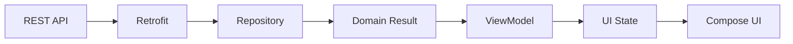
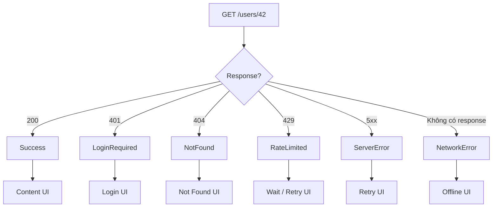
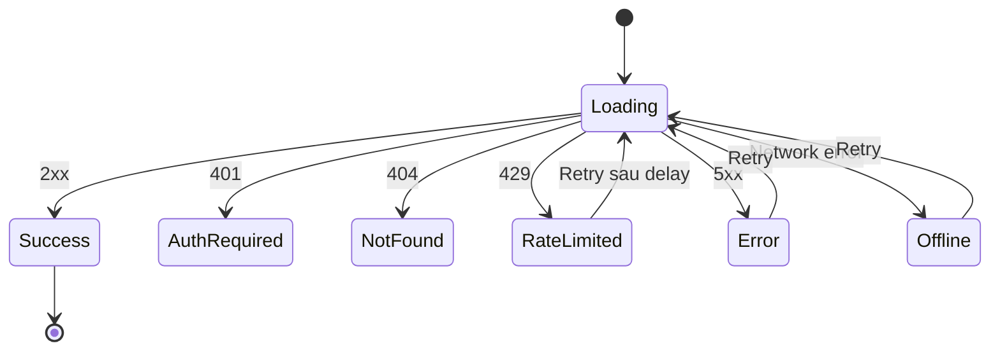
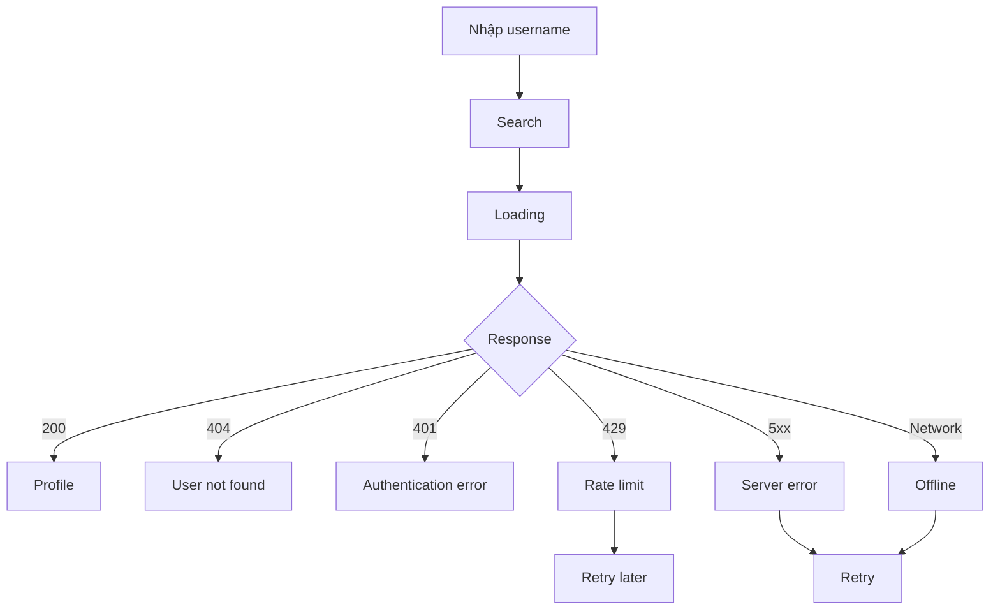

# 002 - Status Codes

[](https://shop.trustico.com/blogs/stories/understanding-http-status-codes-a-complete-guide?utm_source=chatgpt.com)

| Thuộc tính              | Nội dung                         |
| ----------------------- | -------------------------------- |
| **Học phần**            | 04 - Network, Async and Services |
| **Module**              | Module 07 - Network              |
| **Nhóm nội dung**       | HTTP Fundamentals                |
| **Nguồn roadmap**       | Network / HTTP Fundamentals      |
| **Loại bài**            | Network                          |
| **Thứ tự trong module** | 002                              |
| **Thời lượng gợi ý**    | 32 phút                          |

---

## 1. Tóm tắt

**HTTP Status Code** là mã gồm **3 chữ số** mà server trả về để cho client biết kết quả xử lý HTTP request. Theo HTTP Semantics, các status code hợp lệ nằm trong khoảng `100–599`. ([RFC Editor][1])

Trong Android, status code không nên chỉ được hiểu đơn giản là:

```text
200 → Thành công
Khác 200 → Lỗi
```

Một ứng dụng thực tế thường cần chuyển:

```text
HTTP Response
      ↓
Status Code
      ↓
Data/Repository Layer
      ↓
Domain Result
      ↓
ViewModel
      ↓
UI State
```

Ví dụ:

```text
200 → Content
204 → Empty/Success
401 → LoginRequired
403 → PermissionDenied
404 → NotFound
409 → Conflict
429 → RateLimited
500 → ServerError
No HTTP response → NetworkError
```

Android khuyến nghị data layer chịu trách nhiệm làm việc với nguồn dữ liệu và có thể xử lý các loại lỗi khác nhau trước khi đưa kết quả lên các layer phía trên. ([Android Developers][2])

---

# 2. Mục tiêu học tập

Sau bài này, bạn nên có thể:

* [ ] Giải thích HTTP Status Code là gì.
* [ ] Phân biệt năm nhóm `1xx`, `2xx`, `3xx`, `4xx`, `5xx`.
* [ ] Hiểu các status code phổ biến khi phát triển Android.
* [ ] Phân biệt **HTTP error** với **network error**.
* [ ] Ánh xạ HTTP response thành domain state.
* [ ] Ánh xạ domain state thành UI state.
* [ ] Biết status code nào nên hoặc không nên retry.
* [ ] Xử lý `401`, `403`, `404`, `409`, `429`, `5xx`.
* [ ] Viết test cho nhiều response khác nhau.
* [ ] Xử lý state đúng khi rotate hoặc app chuyển background.
* [ ] Tạo được một demo nhỏ đưa vào portfolio.

---

# 3. Status Code nằm ở đâu trong HTTP?

Một HTTP response đơn giản có thể hình dung như sau:

```http
HTTP/1.1 404 Not Found
Content-Type: application/json

{
  "message": "User not found"
}
```

Trong đó:

```text
HTTP/1.1        → Protocol
404             → Status Code
Not Found       → Reason/ý nghĩa
Content-Type    → Response Header
{ ... }         → Response Body
```

Server dùng status code để cho client biết request đã được xử lý như thế nào và client có thể dựa vào response để quyết định hành động tiếp theo. ([RFC Editor][1])

---

# 4. Năm nhóm HTTP Status Code

Status code được phân thành năm lớp chính.

| Nhóm  | Ý nghĩa       | Ví dụ                             |
| ----- | ------------- | --------------------------------- |
| `1xx` | Informational | `100`                             |
| `2xx` | Success       | `200`, `201`, `204`               |
| `3xx` | Redirection   | `301`, `302`, `304`, `307`, `308` |
| `4xx` | Client Error  | `400`, `401`, `403`, `404`, `429` |
| `5xx` | Server Error  | `500`, `502`, `503`, `504`        |

Cách nhớ nhanh:

```text
1xx → Đang xử lý / thông tin

2xx → OK
      ↓
     😊

3xx → Đi nơi khác / cache / redirect
      ↓
     ↪

4xx → Request phía client có vấn đề
      ↓
     ⚠️

5xx → Server/upstream có vấn đề
      ↓
     🔥
```

HTTP định nghĩa lớp của response theo chữ số đầu tiên của status code. ([RFC Editor][1])

---

# 5. `1xx` — Informational

Các response `1xx` mang tính trung gian.

Ví dụ:

```text
100 Continue
```

Client có thể tiếp tục gửi request body.

Trong Android REST API thông thường, lập trình viên ít phải trực tiếp xử lý `1xx` vì HTTP client thường xử lý phần giao thức này.

```text
Android App
    │
    │ Request
    ▼
HTTP Client
    │
    │ 100 Continue
    │ ...
    │ 200 OK
    ▼
Repository
```

> Khi học Android API, nên ưu tiên hiểu sâu `2xx–5xx` trước.

---

# 6. `2xx` — Success

Đây là nhóm response cho biết request đã được xử lý thành công.

## 6.1 `200 OK`

Status phổ biến nhất.

```http
GET /users/123

200 OK
```

Ví dụ body:

```json
{
  "id": 123,
  "name": "An"
}
```

Android:

```text
200
 ↓
Parse JSON
 ↓
Domain Model
 ↓
Content UI
```

---

## 6.2 `201 Created`

Thường gặp khi tạo resource mới.

Ví dụ:

```http
POST /posts

201 Created
```

Android UI có thể:

```text
User nhấn "Đăng bài"
        ↓
POST /posts
        ↓
201 Created
        ↓
Hiển thị bài viết mới
```

---

## 6.3 `202 Accepted`

Server đã nhận request nhưng công việc có thể chưa hoàn thành.

Ví dụ:

```text
POST /video-processing

202 Accepted
```

UI không nhất thiết nên hiện:

```text
✓ Hoàn tất
```

mà có thể là:

```text
Đang xử lý...
```

Đây là ví dụ điển hình cho việc **không nên suy luận business state chỉ bằng `response.isSuccessful`**.

---

## 6.4 `204 No Content`

Request thành công nhưng không có response body.

Ví dụ:

```http
DELETE /notifications/123

204 No Content
```

Sai:

```kotlin
val result = response.body()!!
```

vì body có thể không tồn tại.

Đúng hơn:

```kotlin
if (response.code() == 204) {
    // Thành công nhưng không có dữ liệu để parse.
}
```

---

# 7. `3xx` — Redirection

`3xx` liên quan đến redirect hoặc trạng thái của representation/cache.

Một số mã thường gặp:

| Code  | Ý nghĩa            |
| ----- | ------------------ |
| `301` | Moved Permanently  |
| `302` | Found              |
| `304` | Not Modified       |
| `307` | Temporary Redirect |
| `308` | Permanent Redirect |

`308 Permanent Redirect` được chuẩn hóa riêng và hiện thuộc hệ thống HTTP status code tiêu chuẩn. ([RFC Editor][3])

Ví dụ:

```text
GET /old-api
      ↓
301
      ↓
/new-api
```

Trong Android, HTTP client thường xử lý redirect thông thường nên ứng dụng không phải tự viết:

```kotlin
if (code == 301) {
   ...
}
```

cho mọi request.

### `304 Not Modified`

`304` đặc biệt hữu ích với HTTP caching:

```text
Client có dữ liệu cache
        ↓
Conditional Request
        ↓
Server: dữ liệu chưa thay đổi
        ↓
304 Not Modified
        ↓
Dùng lại dữ liệu cache
```

HTTP caching được định nghĩa riêng trong RFC 9111. ([RFC Editor][4])

---

# 8. `4xx` — Client Error

`4xx` có nghĩa server cho rằng có vấn đề liên quan đến request của client.

Nhưng:

> Không nên hiển thị trực tiếp `"HTTP 400"` hay `"HTTP 403"` cho người dùng.

Ứng dụng nên chuyển chúng thành **business/domain error dễ hiểu**.

---

## 8.1 `400 Bad Request`

Request không hợp lệ.

Ví dụ:

```json
{
  "email": "abc",
  "age": -10
}
```

Server:

```text
400 Bad Request
```

Android nên hiển thị:

```text
Email không hợp lệ.
```

thay vì:

```text
Error 400.
```

---

# 9. `401` và `403` — cực kỳ dễ nhầm

## `401 Unauthorized`

Thông thường có nghĩa client cần cung cấp thông tin xác thực hợp lệ.

Ví dụ:

```text
Access Token hết hạn
        ↓
GET /profile
        ↓
401
```

Android có thể:

```text
401
 ↓
Thử refresh token
 ↓
┌───────────────┐
│ Refresh OK?   │
└──────┬────────┘
       │
   ┌───┴───┐
  Yes      No
   │        │
Retry     Logout
request    ↓
           Login
```

---

## `403 Forbidden`

Server hiểu request nhưng tài khoản hiện tại không được phép thực hiện hành động.

Ví dụ:

```text
User thường
    ↓
DELETE /admin/users/10
    ↓
403 Forbidden
```

UI:

```text
Bạn không có quyền thực hiện thao tác này.
```

### Cách nhớ

```text
401
"Bạn là ai?"
       ↓
Authentication

403
"Tôi biết bạn là ai,
nhưng bạn không được phép."
       ↓
Authorization
```

---

# 10. `404 Not Found`

```text
404 Not Found
```

Resource không được tìm thấy.

Ví dụ:

```http
GET /products/99999
```

Android UI có thể hiển thị:

```text
Không tìm thấy sản phẩm.
```

### Nhưng `404` không luôn có nghĩa giống nhau

Ví dụ:

```text
GET /users/999
404
→ User không tồn tại
```

khác với:

```text
GET /feed
404
→ Có thể API contract/backend đang có vấn đề
```

Do đó mapping nên dựa trên **endpoint + domain**, không chỉ status code.

---

# 11. `409 Conflict`

`409` thường biểu diễn request xung đột với trạng thái hiện tại của resource.

Ví dụ:

```text
Device A                    Server
   │
   │ edit profile
   ▼
version = 10

Device B
   │
   │ update profile
   ▼
 version = 11

Device A
   │
   │ save version 10
   ▼
409 Conflict
```

UI có thể:

```text
Dữ liệu đã thay đổi trên thiết bị khác.

[Tải lại] [Xem thay đổi]
```

`409` đặc biệt quan trọng trong:

* offline-first app;
* đồng bộ dữ liệu;
* optimistic updates;
* collaborative apps.

---

# 12. `422` — Validation không xử lý được

Một API có thể dùng `422` khi request đúng cấu trúc nhưng dữ liệu không thể được xử lý theo yêu cầu.

Ví dụ:

```json
{
  "username": "an"
}
```

Server có thể trả về:

```json
{
  "errors": {
    "username": "Username already exists"
  }
}
```

Android:

```text
422
 ↓
Parse field errors
 ↓
usernameError
 ↓
TextField supportingText
```

---

# 13. `429 Too Many Requests`

Một status code rất quan trọng với ứng dụng production.

```text
Client
 │
 ├── Request
 ├── Request
 ├── Request
 ├── Request
 ├── Request
 ▼
Server Rate Limit
 │
 ▼
429 Too Many Requests
```

`429` biểu thị client đã gửi quá nhiều request trong một khoảng thời gian. Server cũng có thể gửi header `Retry-After` để cho biết nên đợi bao lâu trước khi thử lại. ([RFC Editor][5])

Ví dụ:

```http
HTTP/1.1 429 Too Many Requests
Retry-After: 30
```

Không nên:

```kotlin
while (true) {
    api.retry()
}
```

Nên:

```text
429
 ↓
Đọc Retry-After
 ↓
Chờ
 ↓
Retry
```

UI:

```text
Bạn thao tác quá nhanh.
Vui lòng thử lại sau.
```

---

# 14. `5xx` — Server Error

`5xx` cho biết server hoặc hệ thống phía upstream gặp vấn đề khi xử lý request.

Các mã quan trọng:

| Code  | Ý nghĩa               |
| ----- | --------------------- |
| `500` | Internal Server Error |
| `502` | Bad Gateway           |
| `503` | Service Unavailable   |
| `504` | Gateway Timeout       |

---

## 14.1 `500 Internal Server Error`

```text
Android App
     ↓
API Server
     ↓
Unhandled Exception
     ↓
500
```

UI:

```text
Đã xảy ra lỗi phía máy chủ.

[Thử lại]
```

---

## 14.2 `502 Bad Gateway`

Ví dụ kiến trúc:

```text
Android
   ↓
API Gateway
   ↓
Backend Service ✕
```

Gateway không nhận được response hợp lệ từ upstream:

```text
502
```

---

## 14.3 `503 Service Unavailable`

Server tạm thời không phục vụ được.

Ví dụ:

```text
Maintenance
Overload
Service restart
```

Có thể đi cùng `Retry-After`, vì HTTP định nghĩa header này để server cho client biết khoảng thời gian nên chờ trước request tiếp theo. ([RFC Editor][6])

---

## 14.4 `504 Gateway Timeout`

```text
Android
   ↓
Gateway
   ↓
Backend
   ...
   ...
   timeout
   ↓
504
```

---

# 15. HTTP Error khác Network Error

Đây là một trong những phần quan trọng nhất.

## HTTP Error

Server thực sự trả về response:

```text
Android
   ↓
Server
   ↓
404
```

Ta có:

```kotlin
response.code() == 404
```

---

## Network Error

Có thể chưa bao giờ nhận được HTTP response.

Ví dụ:

```text
Android
   ↓
Wi-Fi mất
   ✕
Server
```

Hoặc:

```text
DNS failure
Connection refused
Socket timeout
TLS failure
```

Trong những trường hợp đó:

```text
Không có status code.
```

Vì status code thuộc HTTP **response**; nếu không nhận được response thì không có mã HTTP để đọc. ([RFC Editor][1])

Do đó đây là thiết kế sai:

```text
Mất mạng
 ↓
convert thành HTTP 500
```

`500` là response từ server, không phải mã chung cho mọi lỗi network.

---

# 16. Retrofit và Status Code

Retrofit cung cấp `Response<T>`.

Ví dụ:

```kotlin
interface UserApi {

    @GET("users/{id}")
    suspend fun getUser(
        @Path("id") id: Long
    ): Response<UserDto>
}
```

Có thể đọc:

```kotlin
response.code()
response.body()
response.errorBody()
response.isSuccessful
```

Trong Retrofit, `isSuccessful()` là `true` khi status code nằm trong nhóm thành công `2xx`. ([Square Open Source][7])

Ví dụ:

```kotlin
if (response.isSuccessful) {
    // 2xx
} else {
    // HTTP error response
}
```

Nhưng production code thường cần mapping chi tiết hơn.

---

# 17. Không đưa `Response<T>` thẳng lên UI

Không nên:

```text
Composable
    ↓
Response<UserDto>
```

UI không nên phải biết:

```text
401 là gì?
429 là gì?
Retrofit Response là gì?
```

Android khuyến nghị tách UI layer khỏi data layer, trong đó data layer xử lý nguồn dữ liệu và UI nhận state thích hợp để hiển thị. ([Android Developers][8])

Thiết kế tốt hơn:



---

# 18. Tạo Domain Result

Ví dụ:

```kotlin
sealed interface UserResult {

    data class Success(
        val user: User
    ) : UserResult

    data object NotFound : UserResult

    data object LoginRequired : UserResult

    data object Forbidden : UserResult

    data object RateLimited : UserResult

    data object ServerError : UserResult

    data object NetworkError : UserResult

    data class UnknownError(
        val statusCode: Int?
    ) : UserResult
}
```

Repository:

```kotlin
class UserRepository(
    private val api: UserApi
) {

    suspend fun getUser(id: Long): UserResult {
        return try {

            val response = api.getUser(id)

            when {
                response.isSuccessful -> {
                    val body = response.body()

                    if (body != null) {
                        UserResult.Success(
                            user = body.toDomain()
                        )
                    } else {
                        UserResult.UnknownError(
                            statusCode = response.code()
                        )
                    }
                }

                response.code() == 401 ->
                    UserResult.LoginRequired

                response.code() == 403 ->
                    UserResult.Forbidden

                response.code() == 404 ->
                    UserResult.NotFound

                response.code() == 429 ->
                    UserResult.RateLimited

                response.code() in 500..599 ->
                    UserResult.ServerError

                else ->
                    UserResult.UnknownError(
                        statusCode = response.code()
                    )
            }

        } catch (e: IOException) {
            UserResult.NetworkError
        }
    }
}
```

Điểm quan trọng:

```text
HTTP status
     ↓
Repository
     ↓
Domain meaning
```

thay vì:

```text
HTTP status
     ↓
UI tự đoán
```

---

# 19. Mapping sang UI State

Có thể định nghĩa:

```kotlin
sealed interface UserUiState {

    data object Loading : UserUiState

    data class Success(
        val name: String,
        val avatarUrl: String
    ) : UserUiState

    data object NotFound : UserUiState

    data object LoginRequired : UserUiState

    data class Error(
        val message: String,
        val canRetry: Boolean
    ) : UserUiState
}
```

Pipeline:



---

# 20. ViewModel

```kotlin
class UserViewModel(
    private val repository: UserRepository
) : ViewModel() {

    private val _uiState =
        MutableStateFlow<UserUiState>(
            UserUiState.Loading
        )

    val uiState =
        _uiState.asStateFlow()

    fun loadUser(id: Long) {

        viewModelScope.launch {

            _uiState.value =
                UserUiState.Loading

            _uiState.value =
                when (
                    val result =
                        repository.getUser(id)
                ) {

                    is UserResult.Success ->
                        UserUiState.Success(
                            name = result.user.name,
                            avatarUrl = result.user.avatarUrl
                        )

                    UserResult.NotFound ->
                        UserUiState.NotFound

                    UserResult.LoginRequired ->
                        UserUiState.LoginRequired

                    UserResult.Forbidden ->
                        UserUiState.Error(
                            message = "Bạn không có quyền truy cập.",
                            canRetry = false
                        )

                    UserResult.RateLimited ->
                        UserUiState.Error(
                            message = "Bạn thao tác quá nhanh.",
                            canRetry = true
                        )

                    UserResult.ServerError ->
                        UserUiState.Error(
                            message = "Máy chủ đang gặp sự cố.",
                            canRetry = true
                        )

                    UserResult.NetworkError ->
                        UserUiState.Error(
                            message = "Không có kết nối mạng.",
                            canRetry = true
                        )

                    is UserResult.UnknownError ->
                        UserUiState.Error(
                            message = "Đã xảy ra lỗi.",
                            canRetry = false
                        )
                }
        }
    }
}
```

---

# 21. Compose UI

```kotlin
@Composable
fun UserScreen(
    viewModel: UserViewModel
) {

    val state by viewModel.uiState
        .collectAsStateWithLifecycle()

    when (val current = state) {

        UserUiState.Loading -> {
            CircularProgressIndicator()
        }

        is UserUiState.Success -> {
            UserContent(
                name = current.name
            )
        }

        UserUiState.NotFound -> {
            Text("Không tìm thấy người dùng.")
        }

        UserUiState.LoginRequired -> {
            Text("Vui lòng đăng nhập lại.")
        }

        is UserUiState.Error -> {

            Column {

                Text(current.message)

                if (current.canRetry) {
                    Button(
                        onClick = {
                            viewModel.loadUser(42)
                        }
                    ) {
                        Text("Thử lại")
                    }
                }
            }
        }
    }
}
```

`collectAsStateWithLifecycle()` là API Android khuyến nghị để collect `Flow` theo lifecycle khi dùng Compose. ([Android Developers][9])

---

# 22. Status Code và Lifecycle Android

Giả sử:

```text
Screen mở
 ↓
Loading
 ↓
API request
 ↓
User xoay màn hình
```

Không nên để việc rotate tạo ra chuỗi:

```text
GET
rotate
GET
rotate
GET
```

không cần thiết.

`ViewModel` được thiết kế để giữ screen-level state và tồn tại qua configuration changes như rotation. ([Android Developers][10])

Kiến trúc hợp lý:

```text
Activity / Compose
        │
        │ collect
        ▼
    ViewModel
        │
        │ load
        ▼
    Repository
        │
        ▼
       API
```

thay vì gọi API trực tiếp trong phần render của Composable.

---

# 23. Retry không phải status nào cũng giống nhau

Một lỗi phổ biến:

```kotlin
if (!response.isSuccessful) {
    retry()
}
```

Điều này có thể gây:

```text
401 → retry vô hạn
403 → retry vô hạn
404 → retry vô hạn
429 → spam API hơn nữa
```

Nên có retry policy rõ ràng.

| Lỗi      |                 Retry? | Gợi ý                                   |
| -------- | ---------------------: | --------------------------------------- |
| `400`    |                      ❌ | Sửa request                             |
| `401`    |                     ⚠️ | Refresh auth rồi thử tối đa theo policy |
| `403`    |                      ❌ | User không có quyền                     |
| `404`    |               Thường ❌ | Resource không tồn tại                  |
| `408`    |                 Có thể | Với request an toàn                     |
| `409`    |                     ⚠️ | Giải quyết conflict trước               |
| `429`    |                      ✅ | Chờ `Retry-After`                       |
| `500`    |          ✅ Có giới hạn | Backoff                                 |
| `502`    |          ✅ Có giới hạn | Backoff                                 |
| `503`    |          ✅ Có giới hạn | Có thể dùng `Retry-After`               |
| `504`    |          ✅ Có giới hạn | Backoff                                 |
| Mất mạng | ✅ Sau khi mạng trở lại | Không spam request                      |

---

# 24. Idempotency và Retry

Không phải request nào cũng nên retry tự động.

Ví dụ:

```http
GET /products
```

thực hiện nhiều lần thường không tạo thêm sản phẩm.

Nhưng:

```http
POST /payment
```

retry thiếu kiểm soát có thể dẫn đến:

```text
POST payment
     ↓
Server xử lý thành công
     ↓
Response bị mất
     ↓
App tưởng thất bại
     ↓
Retry
     ↓
Thanh toán lần 2
```

HTTP coi các safe methods cùng `PUT` và `DELETE` là idempotent theo semantics tiêu chuẩn; tính idempotent là lý do chúng an toàn hơn cho một số trường hợp tự động retry. ([RFC Editor][11])

Vì vậy:

```text
Retry POST?

Chỉ khi API contract đảm bảo an toàn,
ví dụ có cơ chế idempotency phù hợp.
```

---

# 25. Exponential Backoff

Thay vì:

```text
retry sau 1s
retry sau 1s
retry sau 1s
retry sau 1s
```

có thể:

```text
Request thất bại
      ↓
1 giây
      ↓
Retry
      ↓
2 giây
      ↓
Retry
      ↓
4 giây
      ↓
Retry
      ↓
8 giây
```

Còn nếu server trả:

```http
Retry-After: 30
```

thì nên ưu tiên policy dựa trên thông tin server cung cấp, đặc biệt với rate limiting `429`. RFC 6585 cho phép `429` chứa `Retry-After`. ([RFC Editor][5])

---

# 26. Error Body cũng quan trọng

Status code chỉ nói **nhóm vấn đề**.

Server có thể trả thêm:

```json
{
  "code": "USERNAME_EXISTS",
  "message": "Username already exists",
  "field": "username"
}
```

Client có thể biến:

```text
HTTP 422
+
USERNAME_EXISTS
        ↓
Domain error
        ↓
UsernameAlreadyExists
        ↓
TextField error
```

Có một chuẩn HTTP riêng là **Problem Details for HTTP APIs** nhằm cung cấp thông tin lỗi machine-readable trong response body. RFC 9457 hiện định nghĩa format này. ([RFC Editor][12])

Một response có thể tương tự:

```json
{
  "type": "https://example.com/problems/out-of-credit",
  "title": "Not enough credit",
  "status": 403,
  "detail": "Your current balance is insufficient."
}
```

---

# 27. Một nguyên tắc kiến trúc quan trọng

Không nên viết ở Composable:

```kotlin
when (response.code()) {
    401 -> ...
    404 -> ...
    500 -> ...
}
```

Nên:

```text
Retrofit Response
       ↓
Repository
       ↓
Domain Result
       ↓
ViewModel
       ↓
UI State
       ↓
Compose
```

Android hướng tới mô hình trong đó `ViewModel` sản xuất/expose UI state còn UI render state đó và gửi user events ngược lại. ([Android Developers][13])

---

# 28. Loading, Success, Error và Retry

Một state machine tối thiểu:



Điều này tốt hơn một biến:

```kotlin
var isLoading: Boolean
```

vì thực tế screen có nhiều trạng thái loại trừ nhau.

---

# 29. Ví dụ UI thực tế

## Loading

```text
┌──────────────────────────┐
│                          │
│            ◯             │
│       Đang tải...        │
│                          │
└──────────────────────────┘
```

## Success

```text
┌──────────────────────────┐
│ Nguyễn Văn An            │
│ Android Developer        │
│                          │
└──────────────────────────┘
```

## 404

```text
┌──────────────────────────┐
│ 🔍                       │
│ Không tìm thấy dữ liệu   │
│                          │
│      [Quay lại]          │
└──────────────────────────┘
```

## Network Error

```text
┌──────────────────────────┐
│ 📡                       │
│ Không có kết nối mạng    │
│                          │
│       [Thử lại]          │
└──────────────────────────┘
```

## 500

```text
┌──────────────────────────┐
│ ⚠️                       │
│ Máy chủ đang gặp sự cố   │
│                          │
│       [Thử lại]          │
└──────────────────────────┘
```

---

# 30. Testing Status Codes

Status code là phần rất phù hợp để test tự động.

Có thể dùng **MockWebServer** của OkHttp để tạo một HTTP server giả và queue các response mong muốn; thư viện cung cấp `MockWebServer` và `MockResponse` phục vụ đúng mục đích này. ([Square Open Source][14])

## Test matrix

| Test               | Response       | Kết quả mong đợi              |
| ------------------ | -------------- | ----------------------------- |
| Success            | `200`          | `Success`                     |
| Created            | `201`          | Success                       |
| Empty              | `204`          | Không crash vì `body == null` |
| Unauthorized       | `401`          | `LoginRequired`               |
| Forbidden          | `403`          | `Forbidden`                   |
| Not Found          | `404`          | `NotFound`                    |
| Conflict           | `409`          | `Conflict`                    |
| Rate Limit         | `429`          | `RateLimited`                 |
| Server Error       | `500`          | `ServerError`                 |
| Maintenance        | `503`          | Retry được                    |
| Network disconnect | Không response | `NetworkError`                |

---

# 31. Debugging

Khi API lỗi, đừng chỉ nhìn:

```text
Something went wrong
```

Hãy kiểm tra:

```text
Request Method
Request URL
       ↓
Request Headers
       ↓
Request Body
       ↓
HTTP Status Code
       ↓
Response Headers
       ↓
Error Body
       ↓
Exception
```

Ví dụ debug:

```text
GET /api/profile
Status: 401
```

thì câu hỏi tiếp theo là:

```text
Authorization header có gửi không?

Token hết hạn?

Refresh token chạy chưa?

Request retry có dùng token mới không?
```

---

# 32. Logging production an toàn

Có thể log:

```text
endpoint
HTTP method
status code
request duration
request/correlation ID
error category
```

Ví dụ:

```text
GET /profile
status=503
duration=820ms
```

Tránh log:

```text
Authorization: Bearer eyJ...
password
refresh token
credit card
private user data
```

---

# 33. Status Code → UX

Một Android developer tốt không chỉ hỏi:

> Server trả code gì?

mà còn hỏi:

> Người dùng nên thấy gì?

Ví dụ:

| Status     | UX hợp lý                 |
| ---------- | ------------------------- |
| `200`      | Hiển thị nội dung         |
| `201`      | Thông báo tạo thành công  |
| `204`      | Success/empty state       |
| `400`      | Highlight input sai       |
| `401`      | Refresh session/login     |
| `403`      | Giải thích thiếu quyền    |
| `404`      | Not-found state           |
| `409`      | Conflict resolution       |
| `429`      | Disable tạm + retry later |
| `500`      | Error + retry             |
| No network | Offline UI                |

Đây chính là cầu nối:

```text
Networking
   ↓
State
   ↓
UX
```

---

# 34. Bài thực hành

## Yêu cầu

Tạo hoặc mock endpoint:

```http
GET /users/42
```

Hỗ trợ các trường hợp:

```text
200
401
404
429
500
network failure
```

Kiến trúc:

```text
UserScreen
    ↓
UserViewModel
    ↓
UserRepository
    ↓
UserApi
```

UI phải có:

```text
Loading
Success
NotFound
LoginRequired
RateLimited
Error
Offline
```

và nút:

```text
[Thử lại]
```

ở những trường hợp phù hợp.

---

# 35. Bài tập nâng cao

Xây dựng app nhỏ:

```text
GitHub-style User Search
```

Flow:



### Điểm cộng

Thêm:

```text
StateFlow
Repository
Retrofit
MockWebServer
Retry policy
Error mapping
Unit tests
README
Architecture diagram
```

---

# 36. Artifact cho portfolio

Một repository portfolio nhỏ có thể có:

```text
status-code-demo/
│
├── data/
│   ├── UserApi.kt
│   └── UserRepository.kt
│
├── domain/
│   └── UserResult.kt
│
├── ui/
│   ├── UserUiState.kt
│   ├── UserViewModel.kt
│   └── UserScreen.kt
│
├── test/
│   └── UserRepositoryTest.kt
│
└── README.md
```

README nên có sơ đồ:

```text
API
 ↓
Retrofit
 ↓
Repository
 ↓
Domain Result
 ↓
ViewModel
 ↓
StateFlow
 ↓
Compose
```

và bảng:

| Response    | Domain       | UI            |
| ----------- | ------------ | ------------- |
| 200         | Success      | Content       |
| 401         | AuthRequired | Login         |
| 404         | NotFound     | Empty/404     |
| 429         | RateLimited  | Retry later   |
| 5xx         | ServerError  | Error + Retry |
| IOException | NetworkError | Offline       |

---

# 37. Những lỗi phổ biến

### ❌ Chỉ kiểm tra `200`

```kotlin
if (response.code() == 200)
```

Bỏ sót:

```text
201
202
204
```

---

### ❌ `404 = mất Internet`

Sai:

```text
404 → Server đã trả HTTP response.
```

Mất Internet có thể:

```text
không có HTTP response.
```

---

### ❌ `500 = mọi loại lỗi`

Sai.

```text
500
=
Internal Server Error
```

không phải:

```text
No Internet
Timeout
JSON parse error
UI error
```

---

### ❌ Retry mọi lỗi

Có thể tạo:

```text
Retry loop
API spam
rate limit
duplicate requests
duplicate payment/order
battery drain
```

---

### ❌ UI biết quá nhiều HTTP

Không nên:

```kotlin
when (httpCode) {
    401 -> ...
    403 -> ...
    404 -> ...
}
```

ở từng Composable.

Nên tập trung mapping ở data/domain layer.

---

# 38. Checklist production

* [ ] Phân biệt HTTP error và network error.
* [ ] Xử lý toàn bộ nhóm `2xx`, không chỉ `200`.
* [ ] Không parse body bắt buộc với `204`.
* [ ] Có policy riêng cho `401`.
* [ ] Phân biệt `401` và `403`.
* [ ] Mapping `404` theo ngữ cảnh domain.
* [ ] Có xử lý `409` nếu app đồng bộ dữ liệu.
* [ ] Có xử lý `429`.
* [ ] Đọc `Retry-After` nếu API sử dụng.
* [ ] Không retry vô hạn.
* [ ] Cẩn thận retry các request không idempotent.
* [ ] Có state riêng cho mất mạng.
* [ ] ViewModel giữ screen state.
* [ ] Compose collect state theo lifecycle.
* [ ] Không trigger API lại vì recomposition.
* [ ] Có test `200`, `204`, `401`, `404`, `429`, `5xx`.
* [ ] Có test network failure.
* [ ] Không log token hoặc dữ liệu nhạy cảm.
* [ ] Có loading, empty, error và retry UX.

---

# 39. Tóm tắt để ghi nhớ

```text
HTTP STATUS CODES
│
├── 1xx → Information
│
├── 2xx → Success
│   ├── 200 OK
│   ├── 201 Created
│   └── 204 No Content
│
├── 3xx → Redirect / Cache
│   ├── 301
│   ├── 304
│   └── 308
│
├── 4xx → Client / Request
│   ├── 400 Bad Request
│   ├── 401 Authentication
│   ├── 403 Permission
│   ├── 404 Not Found
│   ├── 409 Conflict
│   └── 429 Rate Limit
│
└── 5xx → Server / Upstream
    ├── 500 Internal Error
    ├── 502 Bad Gateway
    ├── 503 Unavailable
    └── 504 Gateway Timeout
```

Và trong Android:

```text
HTTP Status Code
       ↓
Repository
       ↓
Domain Error
       ↓
ViewModel
       ↓
UI State
       ↓
User Experience
```

> **Điểm quan trọng nhất của bài:** đừng để UI phải hiểu `401`, `404` hay `500`. Hãy biến response của network layer thành **domain state có ý nghĩa**, sau đó để `ViewModel` chuyển nó thành **UI state rõ ràng, test được và phù hợp với lifecycle Android**. Android hiện khuyến nghị ViewModel làm screen-level state holder và UI thu thập state theo lifecycle. ([Android Developers][10])

[1]: https://www.rfc-editor.org/rfc/rfc9110.html?utm_source=chatgpt.com "RFC 9110: HTTP Semantics"
[2]: https://developer.android.com/topic/architecture/data-layer?utm_source=chatgpt.com "Data layer | App architecture"
[3]: https://www.rfc-editor.org/info/rfc7538/?utm_source=chatgpt.com "RFC 7538: The Hypertext Transfer Protocol Status Code ..."
[4]: https://www.rfc-editor.org/info/rfc9111/?utm_source=chatgpt.com "RFC 9111: HTTP Caching"
[5]: https://www.rfc-editor.org/rfc/rfc6585?utm_source=chatgpt.com "RFC 6585: Additional HTTP Status Codes"
[6]: https://www.rfc-editor.org/info/rfc9725/?utm_source=chatgpt.com "RFC 9725: WebRTC-HTTP Ingestion Protocol (WHIP)"
[7]: https://square.github.io/retrofit/2.x/retrofit/retrofit2/Response.html?utm_source=chatgpt.com "Response (retrofit API)"
[8]: https://developer.android.com/topic/architecture?utm_source=chatgpt.com "Guide to app architecture"
[9]: https://developer.android.com/develop/ui/compose/state?utm_source=chatgpt.com "State and Jetpack Compose"
[10]: https://developer.android.com/topic/libraries/architecture/viewmodel?utm_source=chatgpt.com "ViewModel overview | App architecture"
[11]: https://www.rfc-editor.org/info/rfc7231/?utm_source=chatgpt.com "RFC 7231: Hypertext Transfer Protocol (HTTP/1.1)"
[12]: https://www.rfc-editor.org/info/rfc9457/?utm_source=chatgpt.com "RFC 9457: Problem Details for HTTP APIs"
[13]: https://developer.android.com/topic/architecture/ui-layer?utm_source=chatgpt.com "UI layer | App architecture"
[14]: https://square.github.io/okhttp/5.x/mockwebserver/okhttp3.mockwebserver/-mock-response/index.html?utm_source=chatgpt.com "MockResponse"

---

# Bài luyện tập

## Mục tiêu


## Đề bài


## Yêu cầu hoàn thành

- [ ] 
- [ ] 
- [ ] 

## Kết quả / lời giải


## Ghi chú
