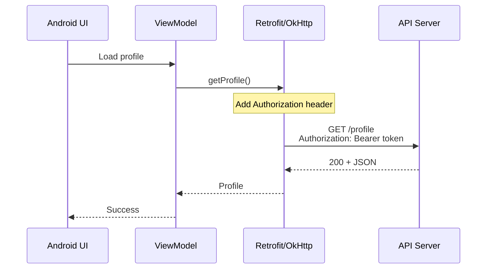
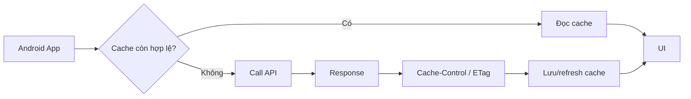
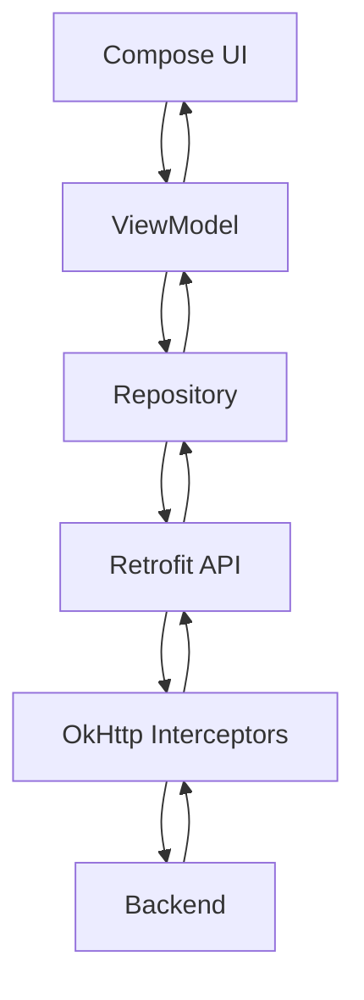
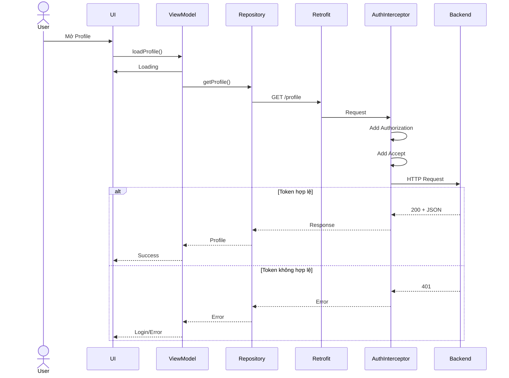
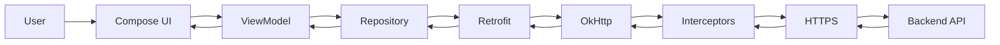

[](https://docs.trafficserver.apache.org/en/7.1.x/developer-guide/plugins/http-headers/index.en.html?utm_source=chatgpt.com)

# 003 - Headers

**Học phần:** 04 - Network, Async and Services
**Module:** Module 07 - Network
**Nhóm nội dung:** HTTP Fundamentals
**Nguồn roadmap:** Network / HTTP Fundamentals
**Loại bài:** Network
**Thứ tự trong module:** 003
**Thời lượng gợi ý:** 32 phút

---

## 1. Tóm tắt

**HTTP Headers** là các cặp `tên: giá trị` đi kèm HTTP request hoặc HTTP response để truyền **metadata** và các chỉ thị điều khiển giữa client và server.

Theo HTTP Semantics, phần header của một HTTP message là một chuỗi các header field; chúng có thể thay đổi hoặc mở rộng ý nghĩa của message, mô tả sender, representation, authentication, caching và nhiều thông tin khác. ([RFC Editor][1])

Ví dụ:

```http
GET /api/profile HTTP/1.1
Host: api.example.com
Authorization: Bearer eyJ...
Accept: application/json
Accept-Language: vi-VN
```

Server có thể trả về:

```http
HTTP/1.1 200 OK
Content-Type: application/json
Cache-Control: max-age=300
ETag: "profile-v12"

{
  "id": 42,
  "name": "An"
}
```

Trong Android, headers thường xuất hiện khi:

* gửi access token;
* khai báo kiểu dữ liệu JSON;
* thương lượng định dạng response;
* quản lý cache;
* gửi version của ứng dụng;
* gửi locale/ngôn ngữ;
* đọc thông tin rate limit;
* xử lý `ETag`;
* đọc `Location`;
* xử lý `Retry-After`;
* debug network request.

Android Developers hiện giới thiệu Retrofit là HTTP client dạng khai báo được xây trên OkHttp và phù hợp cho việc gọi API trong ứng dụng Android. ([Android Developers][2])

---

# 2. Mục tiêu học tập

Sau bài này, bạn nên có thể:

* [ ] Giải thích HTTP Header là gì.
* [ ] Phân biệt **request headers** và **response headers**.
* [ ] Phân biệt `Content-Type` với `Accept`.
* [ ] Biết mục đích của `Authorization`.
* [ ] Hiểu các header liên quan tới caching như `Cache-Control` và `ETag`.
* [ ] Thêm header bằng Retrofit.
* [ ] Thêm header toàn cục bằng OkHttp Interceptor.
* [ ] Đọc response header.
* [ ] Không log token hoặc dữ liệu nhạy cảm trong production.
* [ ] Test header bằng MockWebServer.
* [ ] Biết header ảnh hưởng thế nào đến UX, state và networking architecture.

---

# 3. Header nằm ở đâu trong HTTP?

Một HTTP message có thể hình dung như sau:

```text
HTTP Request
┌────────────────────────────────────────────┐
│ Request line                               │
│ GET /users/42 HTTP/1.1                     │
├────────────────────────────────────────────┤
│ Headers                                    │
│ Host: api.example.com                      │
│ Authorization: Bearer xxx                  │
│ Accept: application/json                   │
│ Content-Type: application/json             │
├────────────────────────────────────────────┤
│ Body                                       │
│ { ... }                                    │
└────────────────────────────────────────────┘
                    │
                    ▼
                 SERVER
                    │
                    ▼
HTTP Response
┌────────────────────────────────────────────┐
│ Status line                                │
│ HTTP/1.1 200 OK                            │
├────────────────────────────────────────────┤
│ Headers                                    │
│ Content-Type: application/json             │
│ Cache-Control: max-age=300                 │
│ ETag: "abc123"                             │
├────────────────────────────────────────────┤
│ Body                                       │
│ { "id": 42, "name": "An" }                 │
└────────────────────────────────────────────┘
```

Có thể nhớ đơn giản:

> **Body chứa dữ liệu chính; Header mô tả dữ liệu và cách request/response nên được xử lý.**

---

# 4. Cấu trúc của một Header

Cấu trúc phổ biến:

```http
Header-Name: Header-Value
```

Ví dụ:

```http
Content-Type: application/json
```

```http
Authorization: Bearer abc123
```

```http
Accept-Language: vi-VN
```

```http
Cache-Control: max-age=600
```

Một HTTP message có thể chứa rất nhiều header fields. OkHttp biểu diễn tập hợp này bằng `Headers`, tương ứng với các header fields của một HTTP message. ([Square Open Source][3])

---

# 5. Request Header và Response Header

## 5.1 Request Headers

Được **client → server** gửi đi.

Ví dụ:

```http
GET /products HTTP/1.1

Authorization: Bearer token123
Accept: application/json
Accept-Language: vi-VN
User-Agent: MyAndroidApp/1.5
```

Client đang nói:

```text
"Tôi muốn lấy /products"
"Tôi có token này"
"Tôi muốn JSON"
"Tôi ưu tiên tiếng Việt"
"Tôi đang dùng phiên bản app này"
```

---

## 5.2 Response Headers

Được **server → client** gửi về.

```http
HTTP/1.1 200 OK

Content-Type: application/json
Cache-Control: max-age=300
ETag: "products-v8"
Content-Length: 2048
```

Server đang nói:

```text
"Dữ liệu tôi trả là JSON"
"Có thể cache trong 300 giây"
"Phiên bản dữ liệu hiện tại là products-v8"
"Body có kích thước này"
```

---

# 6. Những Header Android Developer cần biết

## 6.1 `Content-Type`

Cho biết **kiểu dữ liệu của body đang được gửi**.

Ví dụ JSON:

```http
Content-Type: application/json
```

Form:

```http
Content-Type: application/x-www-form-urlencoded
```

Ảnh JPEG:

```http
Content-Type: image/jpeg
```

Ví dụ:

```http
POST /users

Content-Type: application/json

{
  "name": "An"
}
```

---

# 7. `Accept`

`Accept` cho server biết:

> Client muốn nhận dữ liệu ở định dạng nào?

```http
Accept: application/json
```

### Phân biệt rất quan trọng

| Header         | Ý nghĩa                           |
| -------------- | --------------------------------- |
| `Content-Type` | Body **đang gửi** có định dạng gì |
| `Accept`       | Client **muốn nhận** định dạng gì |

Ví dụ:

```http
POST /users HTTP/1.1

Content-Type: application/json
Accept: application/json
```

Có thể hiểu:

```text
Content-Type
      ↓
Tôi đang gửi JSON

Accept
      ↓
Tôi cũng muốn server trả JSON
```

---

# 8. `Authorization`

Đây là một trong những header phổ biến nhất trong ứng dụng mobile.

Ví dụ Bearer Token:

```http
Authorization: Bearer eyJhbGciOi...
```

Flow điển hình:



Một Interceptor của OkHttp có thể quan sát hoặc thay đổi request/response; thêm, xóa hoặc biến đổi headers là một use case điển hình của interceptor. ([Square Open Source][4])

---

# 9. `User-Agent`

Cho server biết loại client đang gửi request.

Ví dụ:

```http
User-Agent: MyFishApp/2.3.0 Android
```

Một app có thể dùng custom header riêng để truyền version:

```http
X-App-Version: 2.3.0
```

```http
X-Platform: Android
```

Điều này có thể hữu ích khi backend cần:

```text
App version
      ↓
Backend
      ↓
Version quá cũ?
   ├── No  → API bình thường
   └── Yes → yêu cầu update app
```

Không nên biến các custom headers này thành nơi chứa dữ liệu người dùng nhạy cảm không cần thiết.

---

# 10. `Accept-Language`

Có thể được dùng để thông báo locale mong muốn:

```http
Accept-Language: vi-VN
```

Backend có thể dựa vào đó để trả:

```json
{
  "message": "Đăng nhập thành công"
}
```

thay vì:

```json
{
  "message": "Login successful"
}
```

Tuy nhiên, với ứng dụng lớn, thường nên dùng **error code ổn định** và để Android map error code → localized string thay vì phụ thuộc hoàn toàn vào message từ backend.

---

# 11. Cache Headers

Headers đóng vai trò lớn trong HTTP caching.

Hai header quan trọng:

```http
Cache-Control
ETag
```

---

## 11.1 `Cache-Control`

Ví dụ:

```http
Cache-Control: max-age=300
```

Có nghĩa response có thể được xem là fresh trong một khoảng thời gian nhất định theo quy tắc cache.

Flow khái niệm:



Điều này có thể cải thiện:

* thời gian tải;
* lượng dữ liệu mạng;
* trải nghiệm khi mạng không ổn định;
* lượng request tới server.

---

# 12. `ETag`

Server có thể trả:

```http
ETag: "user-42-v5"
```

Android lần sau gửi:

```http
If-None-Match: "user-42-v5"
```

Nếu dữ liệu chưa thay đổi, server có thể trả:

```http
304 Not Modified
```

thay vì gửi lại toàn bộ representation.

```text
Request #1
Android ───────── GET /user/42 ────────► Server

Android ◄── 200 + Body + ETag:"v5" ─── Server


Request #2
Android ─ GET /user/42 ───────────────► Server
         If-None-Match: "v5"

Android ◄────── 304 Not Modified ───── Server
```

HTTP Semantics định nghĩa metadata và conditional requests như một phần của cơ chế HTTP giúp tránh truyền lại representation không cần thiết. ([RFC Editor][1])

---

# 13. Một số Headers quan trọng khác

| Header             | Hướng    | Công dụng                  |
| ------------------ | -------- | -------------------------- |
| `Authorization`    | Request  | Authentication             |
| `Accept`           | Request  | Format muốn nhận           |
| `Accept-Language`  | Request  | Ngôn ngữ                   |
| `Content-Type`     | Cả hai   | Kiểu content               |
| `Content-Length`   | Cả hai   | Kích thước body            |
| `Content-Encoding` | Cả hai   | Encoding/compression       |
| `Cache-Control`    | Cả hai   | Cache policy               |
| `ETag`             | Response | Resource version           |
| `If-None-Match`    | Request  | Conditional request        |
| `Location`         | Response | Vị trí resource/redirect   |
| `Retry-After`      | Response | Thời điểm/khoảng chờ retry |
| `Cookie`           | Request  | Cookie                     |
| `Set-Cookie`       | Response | Tạo/update cookie          |

---

# 14. Headers trong Retrofit

Retrofit hỗ trợ khai báo headers trực tiếp ở API interface; tài liệu Retrofit cung cấp `@Headers`, `@Header` và `@HeaderMap` cho các trường hợp static hoặc dynamic. ([Square Open Source][5])

---

## 14.1 Header cố định với `@Headers`

```kotlin
interface ProductApi {

    @Headers(
        "Accept: application/json",
        "X-Platform: Android"
    )
    @GET("products")
    suspend fun getProducts(): List<ProductDto>
}
```

Phù hợp khi giá trị không đổi.

---

# 15. Header động với `@Header`

Ví dụ token thay đổi theo user:

```kotlin
interface UserApi {

    @GET("profile")
    suspend fun getProfile(
        @Header("Authorization")
        authorization: String
    ): ProfileDto
}
```

Call:

```kotlin
api.getProfile(
    authorization = "Bearer $accessToken"
)
```

Retrofit định nghĩa `@Header` cho header động và `@HeaderMap` khi cần thêm tập hợp nhiều header. ([Square Open Source][6])

---

# 16. `@HeaderMap`

Ví dụ:

```kotlin
interface ProductApi {

    @GET("products")
    suspend fun getProducts(
        @HeaderMap headers: Map<String, String>
    ): List<ProductDto>
}
```

Call:

```kotlin
val headers = mapOf(
    "Authorization" to "Bearer $token",
    "X-App-Version" to "2.0.0",
    "Accept-Language" to "vi-VN"
)

api.getProducts(headers)
```

Cách này linh hoạt nhưng không nên dùng một `Map<String, String>` khổng lồ cho mọi endpoint nếu kiến trúc bắt đầu trở nên khó kiểm soát.

---

# 17. Vấn đề khi truyền token thủ công

Giả sử có 30 endpoints:

```kotlin
@GET("profile")
suspend fun profile(
    @Header("Authorization") auth: String
)

@GET("orders")
suspend fun orders(
    @Header("Authorization") auth: String
)

@GET("notifications")
suspend fun notifications(
    @Header("Authorization") auth: String
)
```

Bạn đang lặp:

```text
Authorization
Authorization
Authorization
Authorization
...
```

Đây là dấu hiệu nên cân nhắc **OkHttp Interceptor**.

---

# 18. Global Header bằng OkHttp Interceptor

```kotlin
class AuthInterceptor(
    private val tokenProvider: TokenProvider
) : Interceptor {

    override fun intercept(
        chain: Interceptor.Chain
    ): Response {

        val token = tokenProvider.getAccessToken()

        val request = chain.request()
            .newBuilder()
            .apply {
                if (!token.isNullOrBlank()) {
                    header(
                        "Authorization",
                        "Bearer $token"
                    )
                }

                header(
                    "Accept",
                    "application/json"
                )
            }
            .build()

        return chain.proceed(request)
    }
}
```

Gắn vào OkHttp:

```kotlin
val okHttpClient =
    OkHttpClient.Builder()
        .addInterceptor(
            AuthInterceptor(tokenProvider)
        )
        .build()
```

Sau đó:

```text
Retrofit API
     │
     ▼
┌────────────────────┐
│ AuthInterceptor    │
│                    │
│ + Authorization   │
│ + Accept          │
└─────────┬──────────┘
          │
          ▼
      OkHttp
          │
          ▼
       Internet
```

OkHttp chính thức mô tả interceptor là thành phần có thể quan sát, chỉnh sửa hoặc thậm chí short-circuit request; thay đổi headers là một trong các trường hợp sử dụng trực tiếp. ([Square Open Source][4])

---

# 19. `header()` và `addHeader()` khác nhau thế nào?

Điểm này rất dễ gây bug.

### `header()`

Thường dùng khi bạn muốn một giá trị duy nhất:

```kotlin
requestBuilder.header(
    "Authorization",
    "Bearer $token"
)
```

---

### `addHeader()`

Thêm thêm một giá trị:

```kotlin
requestBuilder.addHeader(
    "Cookie",
    "session=abc"
)
```

OkHttp khuyến nghị `addHeader()` cho các header có thể có nhiều giá trị như `Cookie`. ([Square Open Source][7])

Có thể nhớ:

```text
header(...)
     ↓
"hãy coi đây là giá trị của header này"

addHeader(...)
     ↓
"thêm một giá trị nữa"
```

---

# 20. Đọc Response Headers

Đôi khi dữ liệu quan trọng không nằm trong JSON body.

Ví dụ server:

```http
HTTP/1.1 200 OK

X-RateLimit-Remaining: 12
X-RateLimit-Limit: 100
```

Retrofit:

```kotlin
@GET("products")
suspend fun getProducts(): Response<List<ProductDto>>
```

Đọc:

```kotlin
val response = api.getProducts()

val remaining =
    response.headers()
        ["X-RateLimit-Remaining"]
```

Hoặc:

```kotlin
val etag =
    response.headers()["ETag"]
```

---

# 21. Headers và Android Architecture

Không nên để Composable trực tiếp xử lý:

```text
Authorization
ETag
Cache-Control
HTTP Response
Retry
```

Kiến trúc tốt hơn:



### Trách nhiệm

```text
UI
└── Hiển thị state

ViewModel
└── Điều phối UI state

Repository
├── API
├── cache
└── map DTO → domain

Retrofit
└── Endpoint

OkHttp
├── Headers
├── Authentication
├── Logging
└── Network configuration
```

Android Developers hiện liệt kê Retrofit và Ktor như các lựa chọn để thực hiện network operations trong ứng dụng Android. ([Android Developers][2])

---

# 22. Headers và UI State

HTTP headers không nên xuất hiện trực tiếp trên UI, nhưng chúng có thể **thay đổi kết quả cuối cùng của UI**.

Ví dụ:

```text
Authorization hết hạn
        │
        ▼
       401
        │
        ▼
Refresh token / logout
        │
        ▼
Update app state
        │
        ▼
Login Screen
```

Hoặc:

```text
Retry-After
      │
      ▼
Không retry ngay
      │
      ▼
UI hiển thị:
"Vui lòng thử lại sau"
```

Header là network metadata, nhưng hậu quả cuối cùng có thể là một thay đổi UX rất rõ ràng.

---

# 23. Ví dụ hoàn chỉnh: Load Profile

## API

```kotlin
interface ProfileApi {

    @GET("profile")
    suspend fun getProfile(): ProfileDto
}
```

---

## Interceptor

```kotlin
class AuthInterceptor(
    private val tokenProvider: TokenProvider
) : Interceptor {

    override fun intercept(
        chain: Interceptor.Chain
    ): Response {

        val original = chain.request()

        val builder = original.newBuilder()
            .header(
                "Accept",
                "application/json"
            )

        tokenProvider
            .getAccessToken()
            ?.takeIf { it.isNotBlank() }
            ?.let { token ->

                builder.header(
                    "Authorization",
                    "Bearer $token"
                )
            }

        return chain.proceed(
            builder.build()
        )
    }
}
```

---

## Repository

```kotlin
class ProfileRepository(
    private val api: ProfileApi
) {

    suspend fun getProfile(): Profile {
        return api
            .getProfile()
            .toDomain()
    }
}
```

---

## UI State

```kotlin
sealed interface ProfileUiState {

    data object Loading : ProfileUiState

    data class Success(
        val profile: Profile
    ) : ProfileUiState

    data class Error(
        val message: String
    ) : ProfileUiState
}
```

---

## ViewModel

```kotlin
class ProfileViewModel(
    private val repository: ProfileRepository
) : ViewModel() {

    private val _uiState =
        MutableStateFlow<ProfileUiState>(
            ProfileUiState.Loading
        )

    val uiState =
        _uiState.asStateFlow()

    fun loadProfile() {

        viewModelScope.launch {

            _uiState.value =
                ProfileUiState.Loading

            _uiState.value =
                runCatching {
                    repository.getProfile()
                }.fold(
                    onSuccess = {
                        ProfileUiState.Success(it)
                    },
                    onFailure = {
                        ProfileUiState.Error(
                            it.message
                                ?: "Network error"
                        )
                    }
                )
        }
    }
}
```

---

# 24. Luồng hoàn chỉnh



---

# 25. Header và lifecycle

HTTP Header bản thân nó không liên quan trực tiếp đến lifecycle.

Nhưng **request sử dụng header** lại liên quan rất nhiều.

Sai:

```text
Activity
   │
   ├── Call API
   │
Rotate
   │
Activity destroyed
   │
   └── State mất
```

Tốt hơn:

```text
Compose UI
    │
    ▼
ViewModel
    │
    ▼
Repository
    │
    ▼
Retrofit
```

Token/access state nên được quản lý bởi lớp phù hợp thay vì gắn vào một `Activity`.

---

# 26. Security — tuyệt đối cẩn thận với Authorization

Ví dụ token:

```http
Authorization: Bearer eyJhbGciOiJI...
```

Không nên:

```kotlin
Log.d(
    "API",
    "Token = $token"
)
```

Đặc biệt không nên để logging production in toàn bộ:

```text
Authorization
Cookie
Set-Cookie
API-Key
refresh_token
session id
```

OkHttp Logging Interceptor hỗ trợ log request/response headers và cũng cung cấp chức năng redact header để che header nhạy cảm. ([Square Open Source][8])

Ví dụ:

```kotlin
val logging =
    HttpLoggingInterceptor().apply {

        level =
            HttpLoggingInterceptor.Level.BODY

        redactHeader("Authorization")
        redactHeader("Cookie")
    }
```

---

# 27. HTTPS vẫn rất quan trọng

Header:

```http
Authorization: Bearer ...
```

không tự bảo vệ token.

Thông tin này phải đi qua kết nối mạng được bảo vệ phù hợp.

Android cung cấp **Network Security Configuration** để cấu hình các chính sách network security theo domain bằng XML thay vì hard-code toàn bộ trong source. ([Android Developers][9])

Ví dụ:

```xml
<?xml version="1.0" encoding="utf-8"?>
<network-security-config>

    <base-config
        cleartextTrafficPermitted="false" />

</network-security-config>
```

---

# 28. Debug Headers

Khi API lỗi, trước khi kết luận:

> "Backend hỏng rồi."

hãy kiểm tra request thực tế.

Checklist:

```text
Request
│
├── URL đúng?
│
├── Method đúng?
│
├── Authorization có chưa?
│
├── "Bearer " có thiếu không?
│
├── Content-Type đúng?
│
├── Accept đúng?
│
├── Token còn hạn?
│
└── App có gửi header hai lần?
```

Một lỗi rất phổ biến:

```http
Authorization: eyJ...
```

trong khi server cần:

```http
Authorization: Bearer eyJ...
```

Chỉ thiếu:

```text
Bearer
```

nhưng kết quả có thể là:

```text
401 Unauthorized
```

---

# 29. Debug Response Header

Không chỉ nhìn body.

Hãy nhìn:

```text
Status
Headers
Body
```

Ví dụ:

```http
HTTP/1.1 429 Too Many Requests

Retry-After: 30
```

Nếu chỉ nhìn JSON:

```json
{
  "error": "Too many requests"
}
```

developer có thể bỏ mất thông tin giúp quyết định khi nào nên retry.

---

# 30. Test Headers bằng MockWebServer

OkHttp cung cấp MockWebServer và `MockResponse` cho phép cấu hình response headers phục vụ việc test network behavior. ([Square Open Source][10])

Ví dụ test ý tưởng:

```kotlin
@Test
fun `request contains authorization header`() {

    mockWebServer.enqueue(
        MockResponse()
            .setResponseCode(200)
            .setBody("{}")
    )

    runBlocking {
        api.getProfile()
    }

    val request =
        mockWebServer.takeRequest()

    assertEquals(
        "Bearer test-token",
        request.getHeader(
            "Authorization"
        )
    )
}
```

Test này bảo vệ một yêu cầu rất quan trọng:

```text
App có thực sự gửi token không?
```

---

# 31. Test Response Header

Có thể mock:

```kotlin
MockResponse()
    .setResponseCode(200)
    .addHeader(
        "ETag",
        "\"version-12\""
    )
    .setBody("{}")
```

Sau đó xác minh repository xử lý đúng header.

---

# 32. Các lỗi phổ biến

## Lỗi 1 — Hard-code token

```kotlin
@Headers(
    "Authorization: Bearer abc123"
)
```

Không nên.

---

## Lỗi 2 — Truyền token ở mọi endpoint

```kotlin
getProfile(token)
getOrders(token)
getMessages(token)
getFriends(token)
```

Nếu hầu hết API đều cần token, interceptor thường phù hợp hơn.

---

## Lỗi 3 — Log Authorization

```text
Authorization:
Bearer eyJhbGciOiJIUzI1Ni...
```

Rủi ro security.

---

## Lỗi 4 — Nhầm `Accept` và `Content-Type`

Sai tư duy:

```text
Accept = tôi gửi gì
```

Đúng:

```text
Content-Type = tôi đang gửi gì

Accept = tôi muốn nhận gì
```

---

## Lỗi 5 — Retry vô hạn khi token hết hạn

```text
Request
 ↓
401
 ↓
Refresh
 ↓
Request
 ↓
401
 ↓
Refresh
 ↓
...
```

Có thể tạo infinite retry loop.

---

# 33. Anti-pattern kiến trúc

Không nên:

```kotlin
Button(
    onClick = {

        val token =
            preferences.getString(
                "token",
                ""
            )

        val client =
            OkHttpClient()

        // build raw request...

    }
)
```

UI không nên chịu trách nhiệm cho:

```text
Token storage
HTTP headers
HTTP client
API implementation
Retry
Cache
```

Thay vào đó:

```text
UI
 ↓
ViewModel
 ↓
Repository
 ↓
Retrofit
 ↓
OkHttp
 ↓
Server
```

---

# 34. Header ảnh hưởng đến UX như thế nào?

HTTP Headers nghe có vẻ chỉ là networking detail, nhưng chúng có thể ảnh hưởng trực tiếp đến user.

### Authorization sai

```text
Authorization sai
       ↓
401
       ↓
Profile không tải
       ↓
User thấy Error Screen
```

---

### Cache tốt

```text
Cache-Control / ETag
       ↓
Giảm request không cần thiết
       ↓
Data xuất hiện nhanh hơn
       ↓
UX tốt hơn
```

---

### Retry sai

```text
Không đọc Retry-After
       ↓
App spam API
       ↓
Tiếp tục 429
       ↓
User không dùng được app
```

---

# 35. Header trong toàn bộ Android Network Stack



Headers thường được xử lý ở vùng:

```text
Retrofit
   +
OkHttp
   +
Repository
```

chứ không phải UI.

---

# 36. Thực hành — Mini Project

## Yêu cầu

Tạo:

```text
ProfileScreen
```

gọi:

```http
GET /profile
```

Request cần:

```http
Authorization: Bearer <token>
Accept: application/json
X-App-Version: 1.0
```

---

## State

```kotlin
sealed interface UiState {

    data object Loading : UiState

    data class Success(
        val name: String
    ) : UiState

    data class Error(
        val message: String
    ) : UiState
}
```

UI:

```text
Loading
   ↓
┌────────────────┐
│      ◌         │
│ Loading...     │
└────────────────┘
```

Success:

```text
┌────────────────────────┐
│ Welcome, An            │
│                        │
│ Profile loaded ✓       │
└────────────────────────┘
```

Error:

```text
┌────────────────────────┐
│ Something went wrong   │
│                        │
│       [ Retry ]        │
└────────────────────────┘
```

---

# 37. Bài tập

## Bài 1 — Basic

Tạo API:

```kotlin
@GET("posts")
suspend fun getPosts(
    @Header("Accept-Language")
    language: String
): List<PostDto>
```

Gọi bằng:

```text
vi-VN
```

---

## Bài 2 — Interceptor

Tạo:

```text
AppHeaderInterceptor
```

tự động thêm:

```http
Accept: application/json
X-Platform: Android
X-App-Version: 1.0
```

---

## Bài 3 — Authentication

Tạo:

```text
AuthInterceptor
```

thêm:

```http
Authorization: Bearer <token>
```

---

## Bài 4 — Response Header

Backend mock trả:

```http
X-Request-ID: abc-123
```

Đọc giá trị này từ response.

---

## Bài 5 — Test

Dùng MockWebServer kiểm tra:

```text
Authorization header
```

được gửi chính xác.

---

# 38. Artifact cho Portfolio

Có thể tạo project:

```text
android-http-headers-demo/
│
├── data/
│   ├── remote/
│   │   ├── ProfileApi.kt
│   │   └── AuthInterceptor.kt
│   │
│   └── repository/
│       └── ProfileRepository.kt
│
├── ui/
│   └── profile/
│       ├── ProfileScreen.kt
│       ├── ProfileViewModel.kt
│       └── ProfileUiState.kt
│
└── test/
    └── AuthInterceptorTest.kt
```

README có thể mô tả:

```markdown
## Concepts demonstrated

- Retrofit headers
- Dynamic Authorization header
- OkHttp Interceptor
- Response headers
- MockWebServer
- Loading / Success / Error states
- Retry
- Token redaction
```

Đây là artifact tốt hơn rất nhiều so với chỉ viết:

```text
"I know HTTP Headers."
```

---

# 39. Production Checklist

## HTTP

* [ ] `Content-Type` đúng.
* [ ] `Accept` đúng.
* [ ] Authorization đúng format.
* [ ] Không duplicate headers ngoài ý muốn.
* [ ] Response headers quan trọng được xử lý.

## Security

* [ ] Dùng HTTPS.
* [ ] Không hard-code access token.
* [ ] Không log Authorization.
* [ ] Không log Cookie/session.
* [ ] Redact dữ liệu nhạy cảm trong logging.

## Architecture

* [ ] Header logic không nằm trong UI.
* [ ] Global headers nằm ở network layer phù hợp.
* [ ] Repository xử lý network result.
* [ ] ViewModel quản lý UI state.

## Lifecycle

* [ ] Rotate màn hình không làm mất state quan trọng.
* [ ] Request không gắn không cần thiết với Activity.
* [ ] Background/foreground được xử lý phù hợp.

## Testing

* [ ] Test Authorization header.
* [ ] Test missing token.
* [ ] Test `401`.
* [ ] Test response headers.
* [ ] Test retry/error state.

## Release

* [ ] Logging nhạy cảm bị tắt/redact.
* [ ] Production base URL đúng.
* [ ] Network Security Configuration đúng.
* [ ] Không cho cleartext traffic ngoài ý muốn.

---

# 40. Câu hỏi tự kiểm tra

### Câu 1

Header dùng để làm gì?

**Đáp án:** chứa metadata và các chỉ thị liên quan đến HTTP request/response.

---

### Câu 2

Khác biệt giữa:

```http
Content-Type
```

và:

```http
Accept
```

là gì?

**Đáp án:**

```text
Content-Type
→ định dạng body đang gửi.

Accept
→ định dạng client muốn nhận.
```

---

### Câu 3

Token thường được gửi bằng header nào?

```http
Authorization
```

Ví dụ:

```http
Authorization: Bearer <token>
```

---

### Câu 4

Muốn thêm Authorization cho gần như mọi API nên cân nhắc gì?

**Đáp án:**

```text
OkHttp Interceptor
```

---

### Câu 5

Header nào thường liên quan đến cache validation?

```text
ETag
If-None-Match
```

---

# 41. Mindmap ghi nhớ

```text
HTTP HEADERS
│
├── Request
│   ├── Authorization
│   ├── Accept
│   ├── Content-Type
│   ├── Accept-Language
│   ├── User-Agent
│   └── If-None-Match
│
├── Response
│   ├── Content-Type
│   ├── Cache-Control
│   ├── ETag
│   ├── Location
│   └── Retry-After
│
├── Android
│   ├── Retrofit
│   │   ├── @Headers
│   │   ├── @Header
│   │   └── @HeaderMap
│   │
│   └── OkHttp
│       ├── Interceptor
│       ├── Headers
│       └── Logging
│
├── Security
│   ├── HTTPS
│   ├── Protect Token
│   └── Redact Logs
│
└── Testing
    ├── MockWebServer
    ├── Request Header
    └── Response Header
```

---

# 42. Gợi ý phân bổ 32 phút

|  Thời gian | Nội dung                                     |
| ---------: | -------------------------------------------- |
|   0–5 phút | Header là gì, request vs response            |
|  5–10 phút | `Content-Type`, `Accept`, `Authorization`    |
| 10–15 phút | Cache headers, `ETag`                        |
| 15–22 phút | Retrofit `@Header`, `@Headers`, `@HeaderMap` |
| 22–27 phút | OkHttp Interceptor                           |
| 27–30 phút | Security + debugging                         |
| 30–32 phút | MockWebServer + checklist                    |

---

# 43. Ghi nhớ cốt lõi

```text
HTTP Header
    =
Metadata + instructions
```

Trong Android:

```text
UI
 ↓
ViewModel
 ↓
Repository
 ↓
Retrofit
 ↓
OkHttp
 ↓
Headers
 ↓
HTTPS
 ↓
Backend
```

Ba header nên nhớ đầu tiên:

```http
Authorization: Bearer <token>

Content-Type: application/json

Accept: application/json
```

Và nguyên tắc production quan trọng nhất:

> **Authentication header thuộc network layer, không thuộc UI; không hard-code token và không để Authorization xuất hiện nguyên văn trong production logs.**

Retrofit hỗ trợ khai báo header ở endpoint, còn OkHttp Interceptor thích hợp để xử lý các concern chung ở request/response pipeline. ([Square Open Source][5])

Android cũng cung cấp Network Security Configuration để kiểm soát chính sách network theo domain, đặc biệt hữu ích khi đưa ứng dụng từ môi trường development lên production. ([Android Developers][9])

[1]: https://www.rfc-editor.org/info/rfc9110/?utm_source=chatgpt.com "RFC 9110: HTTP Semantics | RFC ..."
[2]: https://developer.android.com/develop/connectivity/network-ops/connecting?utm_source=chatgpt.com "Connect to the network"
[3]: https://square.github.io/okhttp/3.x/okhttp/index.html?okhttp3%2FHeaders.html=&utm_source=chatgpt.com "Headers (OkHttp 3.14.0 API)"
[4]: https://square.github.io/okhttp/3.x/okhttp/okhttp3/Interceptor.html?utm_source=chatgpt.com "Interceptor (OkHttp 3.14.0 API)"
[5]: https://square.github.io/retrofit/2.x/retrofit/index.html?retrofit2%2Fhttp%2FHeaders.html=&utm_source=chatgpt.com "Headers (retrofit API)"
[6]: https://square.github.io/retrofit/2.x/retrofit/index.html?retrofit2%2Fhttp%2Fpackage-summary.html=&utm_source=chatgpt.com "retrofit2.http (retrofit API)"
[7]: https://square.github.io/okhttp/5.x/okhttp/okhttp3/-request/-builder/add-header.html?utm_source=chatgpt.com "addHeader"
[8]: https://square.github.io/okhttp/5.x/logging-interceptor/okhttp3.logging/-http-logging-interceptor/-level/-h-e-a-d-e-r-s/index.html?utm_source=chatgpt.com "HEADERS"
[9]: https://developer.android.com/privacy-and-security/security-config?utm_source=chatgpt.com "Network security configuration"
[10]: https://square.github.io/okhttp/5.x/mockwebserver/okhttp3.mockwebserver/-mock-response/index.html?utm_source=chatgpt.com "MockResponse"

---

# Bài luyện tập

## Mục tiêu


## Đề bài


## Yêu cầu hoàn thành

- [ ] 
- [ ] 
- [ ] 

## Kết quả / lời giải


## Ghi chú
