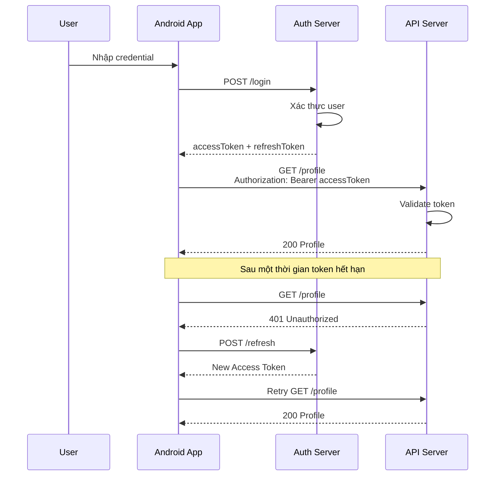
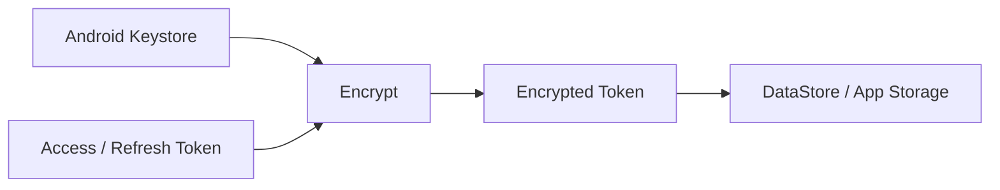
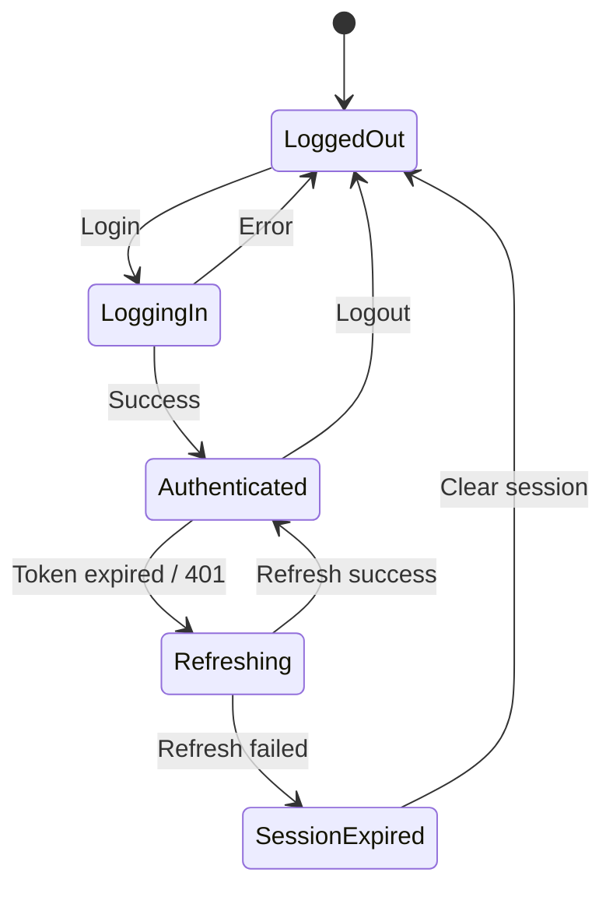
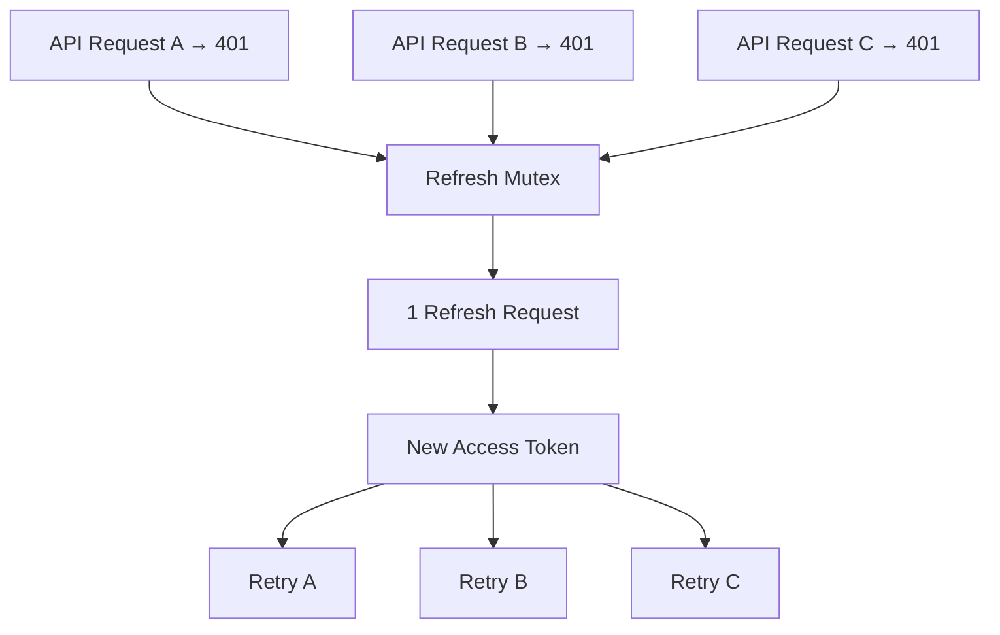
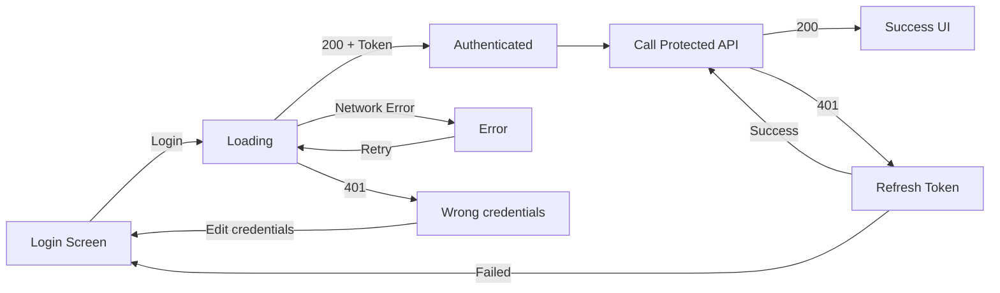
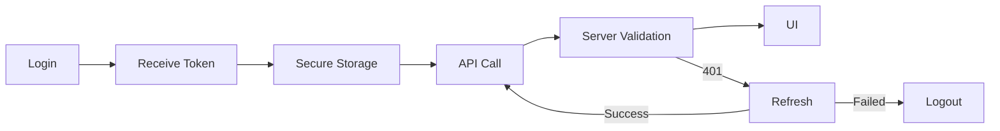

[](https://developer.android.com/training/wearables/apps/auth-wear?utm_source=chatgpt.com)

*Ảnh minh họa từ Android Developers về một luồng xác thực kiểu OAuth: ứng dụng nhận mã/token từ nhà cung cấp xác thực rồi sử dụng credential đó để truy cập tài nguyên được bảo vệ.*

# 004 - Authentication Token

**Học phần:** 04 - Network, Async and Services
**Module:** Module 07 - Network
**Nhóm nội dung:** HTTP Fundamentals
**Nguồn roadmap:** Network / HTTP Fundamentals
**Loại bài:** Network
**Thứ tự trong module:** 004
**Thời lượng gợi ý:** 32 phút

---

## 1. Tóm tắt

**Authentication Token** là một credential dạng chuỗi mà ứng dụng có thể nhận sau quá trình đăng nhập/xác thực, sau đó gửi kèm các request tới API để chứng minh phiên làm việc hoặc quyền truy cập.

Trong OAuth 2.0, **access token** là credential dùng để truy cập protected resource. Với Bearer Token, bên nào sở hữu token hợp lệ có thể sử dụng token đó, vì vậy token phải được bảo vệ cả khi truyền qua mạng lẫn khi lưu trữ. ([RFC Editor][1])

Một request Android rất thường gặp:

```http
GET /api/profile HTTP/1.1
Host: api.example.com
Authorization: Bearer eyJhbGciOi...
```

Token liên quan trực tiếp tới:

* Authentication.
* Authorization.
* HTTP Headers.
* Login/logout.
* Session management.
* Retrofit/OkHttp.
* `401 Unauthorized`.
* Refresh token.
* Local persistence.
* Security.
* App lifecycle.
* UI state.

> **Ý tưởng quan trọng:** Token không đơn giản là "người dùng đã đăng nhập". Nó là một credential mà app phải quản lý đúng vòng đời.

---

# 2. Mục tiêu học tập

Sau bài này, bạn nên có thể:

* Giải thích Authentication Token bằng ngôn ngữ của mình.
* Phân biệt:

  * Access Token.
  * Refresh Token.
  * ID Token.
  * JWT.
* Hiểu cách token được gửi thông qua HTTP.
* Hiểu `Authorization: Bearer ...`.
* Biết xử lý token hết hạn.
* Xử lý `401`.
* Biết vị trí thích hợp để quản lý token trong Android Architecture.
* Không để token nằm trực tiếp trong UI.
* Không hardcode hoặc log token.
* Biết cách bảo vệ token cục bộ.
* Thiết kế UI:

  * Loading.
  * Authenticated.
  * Unauthorized.
  * Session expired.
  * Error.
* Viết test cho luồng authentication.
* Xây dựng được một mini project để đưa vào portfolio.

---

# 3. Authentication Token là gì?

Giả sử ứng dụng có endpoint:

```text
POST /auth/login
```

Người dùng nhập:

```text
email
password
```

Server xác thực thành công và trả:

```json
{
  "accessToken": "eyJhbGciOi...",
  "refreshToken": "rt_7QjH...",
  "expiresIn": 3600
}
```

App không cần gửi password cho mỗi request.

Thay vào đó:

```text
Login
  ↓
Server xác thực
  ↓
Nhận Access Token
  ↓
App giữ token
  ↓
Gọi API
  ↓
Authorization: Bearer <token>
```

Bearer Token được chuẩn hóa cho OAuth 2.0 và thường được truyền bằng HTTP `Authorization` header. ([RFC Editor][1])

---

# 4. Authentication và Authorization không giống nhau

Hai khái niệm rất dễ bị nhầm.

| Khái niệm      | Câu hỏi               |
| -------------- | --------------------- |
| Authentication | Bạn là ai?            |
| Authorization  | Bạn được phép làm gì? |

Ví dụ:

```text
Email + Password
      ↓
Authentication
      ↓
User = khanh@example.com
      ↓
Access Token
      ↓
GET /admin/users
      ↓
Authorization
      ↓
Có role ADMIN?
```

Một user có thể:

```text
Authenticated = true
```

nhưng:

```text
CanDeleteUser = false
```

---

# 5. Ba loại token thường gặp

## 5.1. Access Token

Access Token dùng để truy cập API/protected resource trong OAuth 2.0. ([RFC Editor][2])

Ví dụ:

```http
GET /api/me
Authorization: Bearer ACCESS_TOKEN
```

Thông thường access token có vòng đời giới hạn.

```text
Access Token
│
├── dùng để gọi API
├── thường sống tương đối ngắn
└── hết hạn → cần token mới
```

---

## 5.2. Refresh Token

Refresh Token cho phép client yêu cầu Authorization Server cấp một access token mới mà không bắt người dùng thực hiện lại toàn bộ quá trình đăng nhập. OAuth 2.0 định nghĩa refresh token là một credential riêng biệt với access token. ([RFC Editor][2])

Luồng:

```text
Access Token hết hạn
        ↓
Refresh Token
        ↓
POST /auth/refresh
        ↓
Server kiểm tra
        ↓
Access Token mới
```

Ví dụ:

```json
{
  "refreshToken": "rt_8ba73..."
}
```

Request:

```http
POST /auth/refresh
Content-Type: application/json

{
  "refreshToken": "rt_8ba73..."
}
```

Response:

```json
{
  "accessToken": "new_access_token",
  "expiresIn": 3600
}
```

Refresh token thường cần được bảo vệ đặc biệt vì khả năng tạo thêm access token khiến việc bị lộ nó có hậu quả lớn hơn. Với một số kiến trúc OAuth có backend riêng, Android Developers khuyến nghị giữ refresh token dài hạn an toàn ở server thay vì phân phối không cần thiết xuống client. ([Android Developers][3])

---

## 5.3. ID Token

ID Token thuộc **OpenID Connect**, không phải API token chung.

Nó chứa các claim liên quan đến quá trình authentication của người dùng. OpenID Connect định nghĩa ID Token dưới dạng JWT. ([OpenID Foundation][4])

Ví dụ payload đã decode:

```json
{
  "sub": "123456",
  "name": "An Khanh",
  "email": "khanh@example.com",
  "iss": "https://identity.example.com",
  "exp": 1780000000
}
```

Một cách ghi nhớ:

```text
Access Token
→ Tôi được phép truy cập API nào?

ID Token
→ Tôi vừa xác thực là ai?
```

Không nên lấy ID Token rồi mặc định sử dụng nó thay access token cho mọi API.

---

# 6. Token có phải JWT không?

**Không.**

Đây là một nhầm lẫn phổ biến.

```text
Token
├── Opaque Token
│   └── "x7k3m91ad..."
│
└── JWT
    └── "xxxxx.yyyyy.zzzzz"
```

OAuth định nghĩa access token về cơ bản là một chuỗi credential; nó không bắt buộc mọi access token phải là JWT. ([RFC Editor][2])

JWT thường nhìn như:

```text
xxxxx.yyyyy.zzzzz
```

với cấu trúc:

```text
Header.Payload.Signature
```

Ví dụ:

```text
eyJhbGciOiJIUzI1NiJ9
.
eyJzdWIiOiIxMjM0NTY3ODkwIn0
.
signature
```

> Việc Android app decode một JWT không có nghĩa app đã chứng minh token hợp lệ. Quyết định authorization quan trọng vẫn phải do hệ thống/server tin cậy thực hiện.

---

# 7. Bearer Token trong HTTP

Cách phổ biến:

```http
Authorization: Bearer <access_token>
```

RFC 6750 định nghĩa Bearer Token cho việc truy cập tài nguyên được bảo vệ bằng OAuth 2.0. Bản chất "bearer" có nghĩa bên sở hữu token có thể sử dụng credential đó, vì vậy việc để lộ token có thể cho phép bên khác sử dụng token trong phạm vi quyền mà nó mang theo. ([RFC Editor][1])

Ví dụ:

```http
GET /users/me HTTP/1.1
Host: api.example.com
Authorization: Bearer abc123
```

Server:

```text
Request
   ↓
Extract Authorization
   ↓
Bearer abc123
   ↓
Validate Token
   ↓
Valid?
 ┌───────┴────────┐
Yes               No
 ↓                 ↓
200              401
```

---

# 8. Luồng Authentication hoàn chỉnh



Bearer Token được thiết kế để được bảo vệ trong quá trình truyền; Android cũng khuyến nghị sử dụng HTTPS cho dữ liệu nhạy cảm và cung cấp Network Security Configuration để kiểm soát chính sách mạng của ứng dụng. ([RFC Editor][1])

---

# 9. Authentication Token nằm ở đâu trong Android Architecture?

Không nên viết:

```text
LoginScreen
    ↓
token
    ↓
ProfileScreen
    ↓
token
    ↓
SettingsScreen
```

Token không phải UI state đơn thuần.

Kiến trúc tốt hơn:

```text
┌────────────────────────────┐
│ UI / Jetpack Compose       │
│ LoginScreen / HomeScreen   │
└──────────────┬─────────────┘
               │
               ▼
┌────────────────────────────┐
│ ViewModel                  │
│ AuthUiState                │
└──────────────┬─────────────┘
               │
               ▼
┌────────────────────────────┐
│ AuthRepository             │
└────────┬───────────┬───────┘
         │           │
         ▼           ▼
┌──────────────┐ ┌───────────────┐
│ AuthApi      │ │ TokenStore    │
│ Retrofit     │ │ Secure Store  │
└──────────────┘ └───────────────┘
```

Android hiện khuyến nghị kiến trúc phân lớp rõ ràng với UI layer và data layer để tăng khả năng maintain/test. ([Android Developers][5])

---

# 10. Login API bằng Retrofit

## DTO

```kotlin
data class LoginRequest(
    val email: String,
    val password: String
)

data class TokenResponse(
    val accessToken: String,
    val refreshToken: String,
    val expiresIn: Long
)
```

API:

```kotlin
interface AuthApi {

    @POST("auth/login")
    suspend fun login(
        @Body request: LoginRequest
    ): TokenResponse

    @POST("auth/refresh")
    suspend fun refresh(
        @Body request: RefreshRequest
    ): TokenResponse
}
```

```kotlin
data class RefreshRequest(
    val refreshToken: String
)
```

---

# 11. Gửi token bằng Authorization Header

Cách dễ hiểu nhất khi mới học:

```kotlin
interface UserApi {

    @GET("users/me")
    suspend fun getCurrentUser(
        @Header("Authorization")
        authorization: String
    ): UserDto
}
```

Gọi:

```kotlin
val user = api.getCurrentUser(
    authorization = "Bearer $accessToken"
)
```

HTTP tạo ra:

```http
Authorization: Bearer eyJhbGciOi...
```

---

# 12. Dùng OkHttp Interceptor

Trong ứng dụng thực tế, không nên viết:

```kotlin
"Bearer $token"
```

ở hàng chục Repository.

Có thể tập trung việc thêm header vào một Interceptor:

```kotlin
class AuthInterceptor(
    private val sessionManager: SessionManager
) : Interceptor {

    override fun intercept(
        chain: Interceptor.Chain
    ): Response {

        val token = sessionManager.accessToken

        val request = chain.request()
            .newBuilder()
            .apply {
                if (token != null) {
                    header(
                        "Authorization",
                        "Bearer $token"
                    )
                }
            }
            .build()

        return chain.proceed(request)
    }
}
```

Sau đó:

```kotlin
val client = OkHttpClient.Builder()
    .addInterceptor(
        AuthInterceptor(sessionManager)
    )
    .build()
```

Kết quả:

```text
Repository
    ↓
Retrofit
    ↓
AuthInterceptor
    ↓
Authorization Header
    ↓
HTTP Request
```

### Ưu điểm

```text
Một nơi duy nhất quản lý Authorization
```

thay vì:

```text
Repository A → Bearer token
Repository B → Bearer token
Repository C → Bearer token
Repository D → Bearer token
```

---

# 13. Token Store

Một abstraction đơn giản:

```kotlin
interface TokenStore {

    suspend fun save(
        accessToken: String,
        refreshToken: String
    )

    suspend fun getAccessToken(): String?

    suspend fun getRefreshToken(): String?

    suspend fun clear()
}
```

Repository không cần biết token nằm trong:

```text
DataStore
Encrypted file
Keystore-backed storage
Memory
Fake store khi test
```

---

# 14. DataStore có phải secure storage không?

Không nên hiểu:

```text
DataStore = encrypted token storage
```

DataStore là giải pháp lưu dữ liệu bất đồng bộ, nhất quán và transactional của Android; nó cung cấp Preferences DataStore và Proto DataStore. Tuy nhiên, bản thân việc dùng DataStore không đồng nghĩa dữ liệu token đã được mã hóa bằng khóa bảo mật. ([Android Developers][6])

Có thể tư duy:

```text
Token
  ↓
Encrypt
  ↓
Ciphertext
  ↓
DataStore
```

Khóa:

```text
Encryption Key
      ↓
Android Keystore
```

---

# 15. Android Keystore

Android Keystore được thiết kế để bảo vệ **cryptographic keys** và làm cho key material khó bị trích xuất khỏi thiết bị; một số thiết bị có thể ràng buộc key với phần cứng bảo mật như TEE hoặc Secure Element. ([Android Developers][7])

Kiến trúc:



Điểm cần nhớ:

> **Keystore chủ yếu lưu cryptographic key, không phải nơi đơn giản để nhét nguyên chuỗi access token vào.**

---

# 16. Lưu ý Android 2026: EncryptedSharedPreferences

Trong các tutorial Android cũ bạn sẽ thường gặp:

```kotlin
EncryptedSharedPreferences
```

Tuy nhiên, AndroidX Security Crypto đã deprecated toàn bộ API của thư viện này trong phiên bản stable `1.1.0`, và tài liệu hiện hướng developer về platform APIs/direct use of Android Keystore. ([Android Developers][8])

Vì vậy khi học roadmap 2026, đừng xây kiến thức mới quanh giả định:

```text
EncryptedSharedPreferences
= giải pháp mặc định hiện đại
```

Nên hiểu nền tảng:

```text
Android Keystore
      +
Cryptography
      +
App-private persistence
```

---

# 17. Credential Manager và Authentication Token

Một điểm cần phân biệt:

```text
Credential Manager
        ≠
Access Token Store
```

Credential Manager là API Jetpack được Android khuyến nghị cho việc trao đổi credential trong các luồng đăng nhập, hỗ trợ password, passkey và federated identity. ([Android Developers][9])

Ví dụ:

```text
Passkey
   ↓
Credential Manager
   ↓
Backend Authentication
   ↓
Backend Session
   ↓
Access Token
   ↓
API Requests
```

Vì vậy Authentication Token vẫn là một phần quan trọng ngay cả khi UX login hiện đại sử dụng Credential Manager.

---

# 18. Token hết hạn

Giả sử:

```text
Access token lifetime = 1 giờ
```

Sau khi hết hạn:

```text
Android App
   ↓
GET /profile
   ↓
Authorization: Bearer old-token
   ↓
Server
   ↓
401
```

App có thể:

```text
401
 ↓
Có refresh token?
 ├── Không
 │     ↓
 │   Logout
 │
 └── Có
       ↓
    Refresh
       ↓
  Thành công?
   ├── Yes → Retry request
   └── No  → Session expired
```

---

# 19. State machine cho Authentication



Đây là cách tư duy tốt hơn:

```text
Boolean isLoggedIn
```

bởi vì authentication thực tế có nhiều state trung gian.

---

# 20. UI State

Có thể khai báo:

```kotlin
sealed interface AuthUiState {

    data object Loading : AuthUiState

    data object LoggedOut : AuthUiState

    data class Authenticated(
        val user: UserUiModel
    ) : AuthUiState

    data class Error(
        val message: String
    ) : AuthUiState
}
```

ViewModel:

```kotlin
class AuthViewModel(
    private val repository: AuthRepository
) : ViewModel() {

    private val _uiState =
        MutableStateFlow<AuthUiState>(
            AuthUiState.Loading
        )

    val uiState: StateFlow<AuthUiState> =
        _uiState.asStateFlow()

    fun login(
        email: String,
        password: String
    ) {
        viewModelScope.launch {

            _uiState.value =
                AuthUiState.Loading

            runCatching {
                repository.login(
                    email,
                    password
                )
            }.onSuccess { user ->

                _uiState.value =
                    AuthUiState.Authenticated(user)

            }.onFailure {

                _uiState.value =
                    AuthUiState.Error(
                        "Đăng nhập thất bại"
                    )
            }
        }
    }
}
```

---

# 21. Compose UI

```kotlin
@Composable
fun LoginRoute(
    state: AuthUiState
) {

    when (state) {

        AuthUiState.Loading -> {
            CircularProgressIndicator()
        }

        AuthUiState.LoggedOut -> {
            LoginScreen()
        }

        is AuthUiState.Authenticated -> {
            HomeScreen(
                user = state.user
            )
        }

        is AuthUiState.Error -> {
            ErrorScreen(
                message = state.message
            )
        }
    }
}
```

Điểm quan trọng:

```text
UI không cần biết token.
```

UI chỉ cần biết:

```text
LoggedOut
Loading
Authenticated
Error
```

---

# 22. Lifecycle và Authentication Token

## Rotate màn hình

Không nên:

```text
Activity
  └── token
```

Nếu Activity bị recreate:

```text
token?
```

Thay vào đó:

```text
Activity / Compose
       ↓
ViewModel
       ↓
Repository
       ↓
TokenStore
```

---

## Process death

Sau khi process bị Android kill:

```text
App Process
   X
```

Khi mở lại:

```text
Persistent Token Store
        ↓
AuthRepository
        ↓
Restore Session
        ↓
ViewModel
        ↓
UI
```

Dữ liệu session bền vững nên thuộc data/session layer thay vì phụ thuộc vào một `Activity` cụ thể, phù hợp với kiến trúc Android phân lớp. ([Android Developers][5])

---

# 23. Không refresh token ở mọi `onResume()`

Một anti-pattern:

```kotlin
override fun onResume() {
    refreshToken()
}
```

Người dùng:

```text
Mở dialog
↓
Quay app
↓
Refresh

Mở browser
↓
Quay app
↓
Refresh

Mở permission screen
↓
Quay app
↓
Refresh
```

Tốt hơn là dựa vào:

```text
Token expiration
```

hoặc:

```text
401
```

và chiến lược session do data layer kiểm soát.

---

# 24. Xử lý nhiều request cùng bị `401`

Đây là lỗi production khá thú vị.

Giả sử 10 API chạy đồng thời:

```text
Request 1 → 401
Request 2 → 401
Request 3 → 401
...
Request 10 → 401
```

Không nên:

```text
10 request
   ↓
10 refresh requests
```

Nên:

```text
10 × 401
   ↓
Refresh Coordinator
   ↓
1 × refresh request
   ↓
New Access Token
   ↓
Retry requests
```

Có thể dùng:

```kotlin
Mutex
```

để serialize quá trình refresh.

Mô hình:



---

# 25. `401` và `403`

Trong Bearer Token usage, một access token không hợp lệ/hết hạn có thể dẫn đến `401`, trong khi trường hợp token không có đủ scope có thể dẫn tới `403`. RFC 6750 định nghĩa các error như `invalid_token` và `insufficient_scope` cho những tình huống này. ([RFC Editor][1])

Có thể xử lý UX như:

```text
401
↓
Refresh hoặc yêu cầu đăng nhập lại
```

so với:

```text
403
↓
User vẫn đăng nhập
↓
Nhưng không có quyền thực hiện hành động
```

---

# 26. Security

## 26.1. Luôn sử dụng HTTPS

Không gửi:

```text
Authorization: Bearer ...
```

qua HTTP cleartext.

Android cảnh báo rằng cleartext network traffic có thể bị quan sát hoặc chỉnh sửa bởi bên theo dõi mạng; tài liệu security khuyến nghị HTTPS cho dữ liệu nhạy cảm. ([Android Developers][10])

---

## 26.2. Không log token

Sai:

```kotlin
Log.d(
    "Auth",
    "Access token = $accessToken"
)
```

Hoặc:

```text
--> GET /profile
Authorization: Bearer eyJ...
```

trong production log.

Token là credential, vì vậy disclosure phải được coi là sự cố bảo mật. ([RFC Editor][11])

---

## 26.3. Không hardcode token

Sai:

```kotlin
const val TOKEN =
    "eyJhbGciOiJIUzI1Ni..."
```

Cũng không nên cho secret tĩnh vào:

```text
strings.xml
BuildConfig
Git repository
assets/
```

Android Security đặc biệt cảnh báo về việc hardcode cryptographic secrets trong source hoặc assets. ([Android Developers][12])

---

# 27. Một lỗi rất nguy hiểm

```text
App
 ↓
Decode JWT
 ↓
role = ADMIN
 ↓
Cho phép xóa user
```

Nếu **server không kiểm tra authorization**, hệ thống đang sai.

Android UI có thể dùng claim để điều chỉnh trải nghiệm:

```text
ẩn/hiện button
```

nhưng server vẫn phải là nơi quyết định:

```text
Request có thực sự được phép không?
```

---

# 28. Login Repository mẫu

```kotlin
class AuthRepository(
    private val authApi: AuthApi,
    private val tokenStore: TokenStore
) {

    suspend fun login(
        email: String,
        password: String
    ) {
        val response = authApi.login(
            LoginRequest(
                email = email,
                password = password
            )
        )

        tokenStore.save(
            accessToken = response.accessToken,
            refreshToken = response.refreshToken
        )
    }

    suspend fun logout() {
        tokenStore.clear()
    }
}
```

Kiến trúc:

```text
ViewModel
   ↓
AuthRepository
   ├── AuthApi
   └── TokenStore
```

---

# 29. Loading → Success → Error → Retry

Đây là phần bài thực hành ban đầu nhưng giờ có thể biến thành luồng hoàn chỉnh:



---

# 30. Offline thì sao?

Authentication và offline mode cần phân biệt.

Ví dụ user đã login:

```text
Access Token có
Internet không có
```

Không nên lập tức kết luận:

```text
User bị logout
```

Có thể UI hiển thị:

```text
Profile
────────────

An Khanh

⚠ Đang offline.
Dữ liệu có thể chưa được cập nhật.
```

Repository:

```text
Network unavailable
        ↓
Không xóa token
        ↓
Hiển thị cached/local data nếu có
```

---

# 31. Logout đúng nghĩa

Logout không chỉ:

```kotlin
navigate("login")
```

Nên nghĩ tới:

```text
Logout
  ↓
Revoke server session nếu API hỗ trợ
  ↓
Clear Access Token
  ↓
Clear Refresh Token
  ↓
Clear dữ liệu user-sensitive cần thiết
  ↓
Reset authenticated state
  ↓
Navigate Login
```

Nếu chỉ đổi màn hình nhưng token vẫn tồn tại:

```text
Login Screen
     ↓
Token vẫn hợp lệ
```

thì session chưa thực sự được giải phóng ở phía client.

---

# 32. Testing

Authentication là một khu vực rất đáng viết test.

## Test 1 — Login thành công

```text
Given
API trả token

When
login()

Then
TokenStore.save() được gọi
UI = Authenticated
```

---

## Test 2 — Sai mật khẩu

```text
Given
Login API → 401

When
login()

Then
Không lưu token
UI = Error
```

---

## Test 3 — Gắn Authorization header

```text
Given
accessToken = "abc"

When
GET /profile

Then
Header:
Authorization: Bearer abc
```

---

## Test 4 — Token hết hạn

```text
Given
/profile → 401
/refresh → newToken

When
Load profile

Then
Refresh token
Retry profile
Return success
```

---

## Test 5 — Refresh thất bại

```text
/profile → 401
       ↓
/refresh → 401
       ↓
clear token
       ↓
LoggedOut
```

---

## Test 6 — Không có mạng

```text
Given
Offline

Then
Không tự logout user
Hiển thị network error/offline state
```

---

## Test 7 — Concurrent refresh

```text
5 requests → 401
```

Kỳ vọng:

```text
refresh API calls = 1
```

không phải:

```text
refresh API calls = 5
```

---

# 33. Debugging checklist

Khi gặp:

```text
401 Unauthorized
```

kiểm tra theo thứ tự:

```text
Token có tồn tại?
      ↓
Authorization header có được thêm?
      ↓
Có đúng "Bearer " không?
      ↓
Token có expired?
      ↓
Token có đúng environment?
      ↓
Token có đúng audience/scope?
      ↓
Refresh có hoạt động?
      ↓
Server có revoke session?
```

Đặc biệt kiểm tra:

```http
Authorization: Bearer TOKEN
```

chứ không phải:

```http
Authentication: TOKEN
```

hoặc:

```http
Authorization: TOKEN
```

Với OAuth Bearer, scheme và header chuẩn là `Authorization: Bearer ...`. ([RFC Editor][1])

---

# 34. Những lỗi phổ biến

| Sai lầm                            | Hậu quả                           |
| ---------------------------------- | --------------------------------- |
| Hardcode token                     | Lộ credential                     |
| Log token                          | Có thể lộ session                 |
| Truyền token qua HTTP              | Có nguy cơ bị quan sát/manipulate |
| Token nằm trực tiếp trong Activity | Coupling + lifecycle khó quản lý  |
| Refresh mỗi `onResume()`           | Request thừa                      |
| Mỗi `401` refresh riêng            | Refresh storm                     |
| Xem JWT decode là authorization    | Security bug                      |
| Logout nhưng không clear token     | Session client vẫn tồn tại        |
| Dùng ID Token như Access Token     | Sai mục đích                      |
| Cho rằng mọi token đều là JWT      | Sai khái niệm                     |
| Cho rằng DataStore tự mã hóa       | Sai security assumption           |

HTTPS và quản lý cryptographic keys bằng Android Keystore là hai lớp bảo vệ quan trọng trong mô hình này. ([Android Developers][13])

---

# 35. Mini Project thực hành

## `TokenAuthDemo`

Xây dựng app gồm:

```text
LoginScreen
     ↓
POST /login
     ↓
Access Token
     ↓
HomeScreen
     ↓
GET /profile
     ↓
ProfileScreen
```

Và hỗ trợ:

```text
Loading
Success
Error
Retry
401
Refresh
Logout
Offline
```

---

## Cấu trúc project

```text
com.example.tokenauth
│
├── data
│   ├── remote
│   │   ├── AuthApi.kt
│   │   └── UserApi.kt
│   │
│   ├── auth
│   │   ├── TokenStore.kt
│   │   └── AuthInterceptor.kt
│   │
│   └── repository
│       └── AuthRepository.kt
│
├── domain
│   └── model
│       └── User.kt
│
└── ui
    ├── login
    │   ├── LoginScreen.kt
    │   └── LoginViewModel.kt
    │
    └── profile
        ├── ProfileScreen.kt
        └── ProfileViewModel.kt
```

Cách chia UI/data layer này phù hợp với định hướng kiến trúc Android hiện tại. ([Android Developers][5])

---

# 36. Artifact portfolio

Một repository nhỏ có thể trở thành artifact khá tốt nếu README trình bày:

```markdown
# Android Authentication Token Demo

## Features

- Login API
- Bearer Token authentication
- Token persistence
- Automatic authorization header
- Token refresh
- 401 handling
- Loading / Error / Retry
- Logout
- Offline handling

## Architecture

UI
↓
ViewModel
↓
Repository
↓
Retrofit / TokenStore

## Security

- HTTPS only
- No token logging
- No hardcoded credentials
- Keystore-backed encryption strategy

## Tests

- Login success
- Login failure
- Authorization header
- Token refresh
- Refresh failure
- Concurrent 401
```

Đây sẽ chứng minh bạn không chỉ biết:

```text
Retrofit GET
```

mà hiểu:

```text
API
+
HTTP
+
Authentication
+
State
+
Lifecycle
+
Architecture
+
Security
+
Testing
```

---

# 37. Bài tập

### Yêu cầu

Xây dựng hoặc mock:

```text
POST /login
GET /profile
POST /refresh
```

Luồng:

```text
Login
 ↓
Loading
 ↓
Success
 ↓
Store token
 ↓
Profile
 ↓
Token expired
 ↓
401
 ↓
Refresh
 ↓
Retry
```

UI phải có:

```text
Loading
Success
Error
Retry
Session Expired
Offline
```

### Bonus

Giả lập:

```text
5 API request
```

cùng trả:

```text
401
```

nhưng app chỉ được gọi:

```text
POST /refresh
```

**một lần**.

---

# 38. Checklist hoàn thành

* [ ] Giải thích được Authentication Token.
* [ ] Phân biệt Authentication và Authorization.
* [ ] Phân biệt Access Token và Refresh Token.
* [ ] Biết ID Token dùng để làm gì.
* [ ] Biết token không nhất thiết là JWT.
* [ ] Biết format `Authorization: Bearer <token>`.
* [ ] Implement login API.
* [ ] Lưu session thông qua TokenStore.
* [ ] Không giữ token trực tiếp trong UI.
* [ ] Tự động thêm Authorization header.
* [ ] Xử lý `401`.
* [ ] Có refresh flow.
* [ ] Không refresh vô hạn.
* [ ] Không tạo refresh storm.
* [ ] Có loading state.
* [ ] Có error state.
* [ ] Có retry.
* [ ] Có session-expired state.
* [ ] Có offline behavior.
* [ ] Logout clear session.
* [ ] Không hardcode token.
* [ ] Không log token.
* [ ] Sử dụng HTTPS.
* [ ] Hiểu vai trò Android Keystore.
* [ ] Có unit test cho authentication flow.
* [ ] Có README/diagram để đưa vào portfolio.

---

# 39. Ghi chú production

Trước khi release tính năng authentication, nên kiểm tra toàn bộ chuỗi:



Đặc biệt:

```text
Token có bị log không?
Token có bị hardcode không?
HTTPS có được enforce không?
Refresh có race condition không?
401 có loop vô hạn không?
Logout có clear session không?
Process death có restore đúng không?
Offline có làm logout nhầm không?
Debug build có vô tình in Authorization header không?
Server có thực sự kiểm tra authorization không?
```

Android cung cấp Network Security Configuration để thiết lập chính sách bảo mật mạng và Android Keystore để bảo vệ cryptographic keys; tài liệu Android hiện cũng đã chuyển Security Crypto cũ sang hướng dùng platform APIs/Keystore trực tiếp. ([Android Developers][14])

---

# 40. Tóm tắt nhanh

```text
Authentication
     ↓
Server cấp Token
     ↓
Android giữ session
     ↓
Authorization: Bearer AccessToken
     ↓
Protected API
     ↓
200
```

Khi token hết hạn:

```text
API
 ↓
401
 ↓
Refresh Token
 ↓
Access Token mới
 ↓
Retry
```

Kiến trúc Android:

```text
Compose
   ↓
ViewModel
   ↓
AuthRepository
   ├── AuthApi
   └── TokenStore
          ↓
     Keystore-backed
     protection
```

Công thức cần nhớ của bài:

> **Authentication Token = credential + lifecycle + HTTP header + secure storage + refresh strategy + UI state + server-side authorization.**

Trong Android 2026, Credential Manager là API được khuyến nghị cho các luồng credential/sign-in hiện đại, trong khi Android Keystore là primitive quan trọng để bảo vệ cryptographic keys; DataStore có thể đảm nhiệm persistence nhưng không nên bị nhầm với một cơ chế mã hóa token tự động. ([Android Developers][9])

[1]: https://www.rfc-editor.org/rfc/rfc6750?utm_source=chatgpt.com "RFC 6750: The OAuth 2.0 Authorization Framework"
[2]: https://www.rfc-editor.org/rfc/rfc6749?utm_source=chatgpt.com "RFC 6749: The OAuth 2.0 Authorization Framework"
[3]: https://developer.android.com/identity/authorization?utm_source=chatgpt.com "Authorize access to Google user data | Identity"
[4]: https://openid.net/specs/openid-connect-core-1_0.html?utm_source=chatgpt.com "OpenID Connect Core 1.0 incorporating errata set 2"
[5]: https://developer.android.com/topic/architecture?utm_source=chatgpt.com "Guide to app architecture"
[6]: https://developer.android.com/jetpack/androidx/releases/datastore?utm_source=chatgpt.com "DataStore | Jetpack"
[7]: https://developer.android.com/privacy-and-security/keystore?utm_source=chatgpt.com "Android Keystore system | Security"
[8]: https://developer.android.com/jetpack/androidx/releases/security?utm_source=chatgpt.com "Security | Jetpack"
[9]: https://developer.android.com/identity/credential-manager?utm_source=chatgpt.com "About Credential Manager | Identity"
[10]: https://developer.android.com/privacy-and-security/risks/cleartext-communications?utm_source=chatgpt.com "Cleartext communications | Security"
[11]: https://www.rfc-editor.org/info/rfc6750/?utm_source=chatgpt.com "RFC 6750: The OAuth 2.0 Authorization Framework"
[12]: https://developer.android.com/privacy-and-security/risks/hardcoded-cryptographic-secrets?utm_source=chatgpt.com "Hardcoded Cryptographic Secrets | Security"
[13]: https://developer.android.com/privacy-and-security/security-tips?utm_source=chatgpt.com "Security checklist"
[14]: https://developer.android.com/privacy-and-security/security-config?utm_source=chatgpt.com "Network security configuration"

---

# Bài luyện tập

## Mục tiêu


## Đề bài


## Yêu cầu hoàn thành

- [ ] 
- [ ] 
- [ ] 

## Kết quả / lời giải


## Ghi chú
