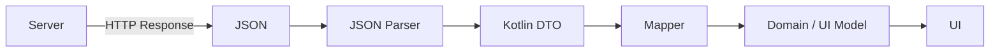
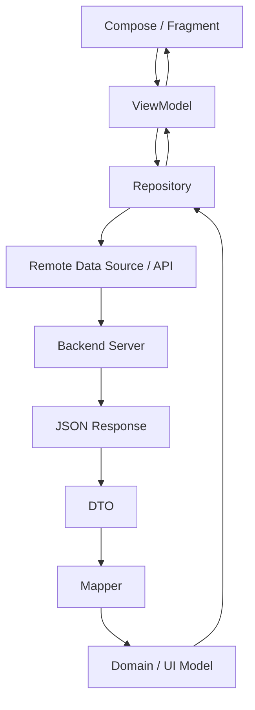
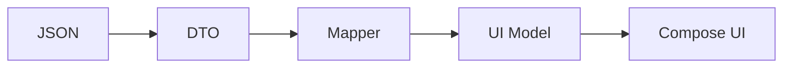
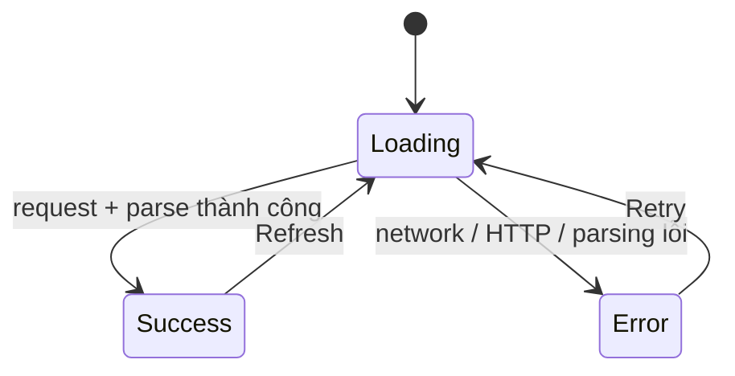
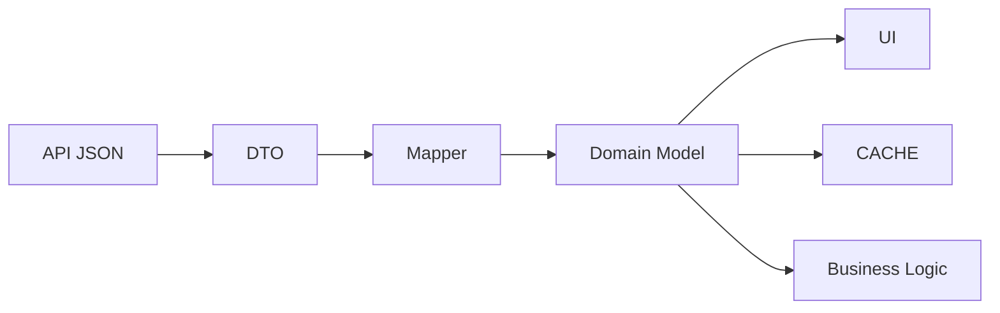
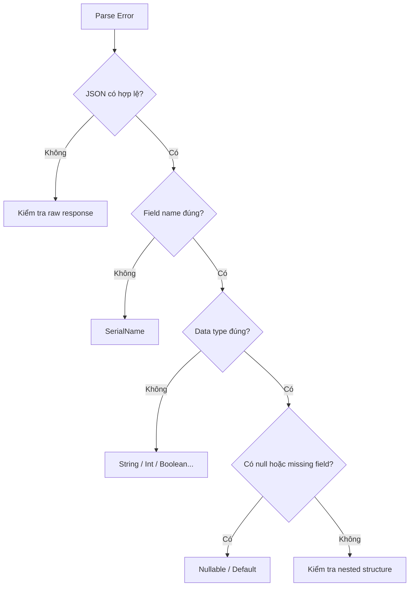
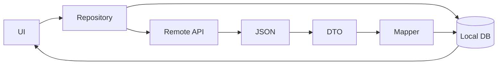
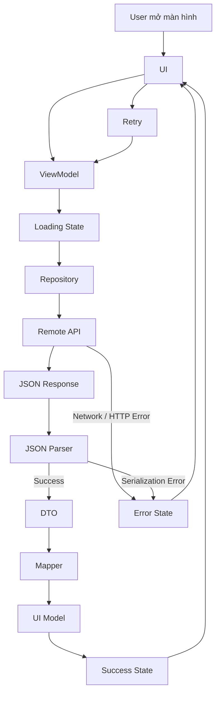
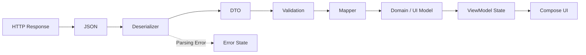

# 005 - JSON Parsing

**Học phần:** 04 - Network, Async and Services
**Module:** Module 07 - Network
**Nhóm nội dung:** HTTP Fundamentals
**Nguồn roadmap:** Network / HTTP Fundamentals
**Loại bài:** Network
**Thứ tự trong module:** 005
**Thời lượng gợi ý:** 32 phút

---

## 1. Tóm tắt

**JSON Parsing** là quá trình chuyển dữ liệu JSON nhận được từ API thành các object mà ứng dụng Android có thể sử dụng, chẳng hạn như Kotlin `data class`.

Ví dụ server trả về:

```json
{
  "id": 101,
  "full_name": "Nguyen Van An",
  "email": "an@example.com",
  "active": true
}
```

Ứng dụng không nên thao tác trực tiếp với chuỗi JSON này trong UI. Thay vào đó, dữ liệu thường được chuyển thành một DTO:

```kotlin
@Serializable
data class UserDto(
    val id: Int,

    @SerialName("full_name")
    val fullName: String,

    val email: String,
    val active: Boolean
)
```

Có thể hình dung:

```text
JSON String
    ↓
JSON Parser
    ↓
UserDto
    ↓
Mapper
    ↓
User / UserUiModel
    ↓
UI
```

Trong tài liệu Android Developers, một luồng Network điển hình sử dụng HTTP client như Retrofit để lấy dữ liệu, parser/converter để biến JSON thành Kotlin object, sau đó dữ liệu được đưa vào UI state.

---

## 2. Mục tiêu học tập

Sau bài này, bạn nên:

* Giải thích được **JSON Parsing** là gì.
* Phân biệt:

  * JSON;
  * Kotlin object;
  * DTO;
  * Domain Model;
  * UI Model.
* Đọc được JSON object, array, nested object và nullable field.
* Chuyển JSON thành Kotlin `data class`.
* Sử dụng `kotlinx.serialization`.
* Hiểu vai trò của `@Serializable`.
* Hiểu `@SerialName`.
* Biết xử lý field mới, field thiếu và `null`.
* Phân biệt lỗi network với lỗi parsing.
* Biết JSON Parsing nằm ở đâu trong kiến trúc Android.
* Biết cách test parser.
* Xây dựng được một ví dụ nhỏ có:

  * Loading;
  * Success;
  * Error;
  * Retry.
* Có một artifact nhỏ để đưa vào portfolio.

---

# 3. JSON là gì?

**JSON — JavaScript Object Notation** là định dạng văn bản dùng rất phổ biến để truyền dữ liệu giữa client và server.

Ví dụ:

```json
{
  "id": 1,
  "name": "Khanh",
  "age": 23,
  "premium": true
}
```

JSON chủ yếu bao gồm:

| Kiểu    | Ví dụ         |
| ------- | ------------- |
| String  | `"Khanh"`     |
| Number  | `23`          |
| Boolean | `true`        |
| Null    | `null`        |
| Object  | `{ "id": 1 }` |
| Array   | `[1, 2, 3]`   |

Android Developers mô tả JSON response dưới dạng dữ liệu có cấu trúc gồm các cặp key-value và JSON array có thể chứa nhiều JSON object.

---

# 4. JSON Object

Ví dụ:

```json
{
  "id": 100,
  "name": "Android"
}
```

Có hai key:

```text
id
name
```

và hai value:

```text
100
"Android"
```

Có thể ánh xạ sang Kotlin:

```kotlin
@Serializable
data class CourseDto(
    val id: Int,
    val name: String
)
```

---

# 5. JSON Array

API thường không chỉ trả một object mà trả danh sách object.

```json
[
  {
    "id": 1,
    "name": "Kotlin"
  },
  {
    "id": 2,
    "name": "Jetpack Compose"
  }
]
```

Kotlin tương ứng:

```kotlin
List<CourseDto>
```

Parse bằng:

```kotlin
val courses =
    json.decodeFromString<List<CourseDto>>(jsonString)
```

---

# 6. Nested JSON

JSON có thể lồng nhau.

```json
{
  "id": 1,
  "name": "Khanh",
  "profile": {
    "avatar": "avatar.jpg",
    "level": 12
  }
}
```

Ta nên tạo class tương ứng với cấu trúc:

```kotlin
@Serializable
data class UserDto(
    val id: Int,
    val name: String,
    val profile: ProfileDto
)

@Serializable
data class ProfileDto(
    val avatar: String,
    val level: Int
)
```

Không nên cố gộp mọi thứ vào một class khổng lồ nếu response có cấu trúc rõ ràng.

---

# 7. JSON Parsing là gì?

Parsing có thể hiểu đơn giản là:

> **Đọc JSON và biến nó thành cấu trúc dữ liệu mà chương trình có thể hiểu và sử dụng.**

Luồng cơ bản:



Ví dụ:

```json
{
  "id": 5,
  "title": "Learn Android"
}
```

sẽ được chuyển thành:

```kotlin
TaskDto(
    id = 5,
    title = "Learn Android"
)
```

Kotlin Serialization cung cấp `Json.decodeFromString()` để deserialize JSON thành Kotlin object. `@Serializable` yêu cầu compiler sinh code cần thiết phục vụ serialization/deserialization.

---

# 8. Serialization và Deserialization

Hai thuật ngữ rất dễ nhầm.

## Serialization

Object → JSON.

```text
Kotlin Object
      ↓
    JSON
```

Ví dụ:

```kotlin
val user = UserDto(
    id = 1,
    name = "Khanh"
)

val jsonString = Json.encodeToString(user)
```

Kết quả:

```json
{
  "id": 1,
  "name": "Khanh"
}
```

---

## Deserialization

JSON → Object.

```text
JSON
 ↓
Kotlin Object
```

Ví dụ:

```kotlin
val user =
    Json.decodeFromString<UserDto>(jsonString)
```

Trong bài học Network, **JSON Parsing thường chủ yếu nói đến deserialization** vì ứng dụng đang nhận JSON response từ server.

---

# 9. Vì sao không nên tự parse bằng String?

Có thể bạn từng nghĩ đến:

```kotlin
val id = json.substring(...)
```

hoặc:

```kotlin
val name = json.split(...)
```

Đây là cách rất dễ lỗi.

Ví dụ backend chỉ cần đổi:

```json
{
  "name": "Khanh",
  "id": 1
}
```

thành:

```json
{
  "id": 1,
  "name": "Khanh"
}
```

logic dựa trên vị trí chuỗi có thể bị phá vỡ.

Parser chuyên dụng có khả năng hiểu:

```text
Object
Array
String
Number
Boolean
Null
Nested Object
```

và ánh xạ chúng sang type tương ứng.

---

# 10. JSON Parsing trong kiến trúc Android

Một luồng phổ biến:



Điểm quan trọng:

> UI không nên biết JSON response trông như thế nào.

UI chỉ nên nhận dữ liệu mà nó cần.

Ví dụ:

```kotlin
data class UserUiModel(
    val displayName: String,
    val avatarUrl: String?
)
```

---

# 11. DTO là gì?

DTO = **Data Transfer Object**.

Nó đại diện dữ liệu được gửi/nhận từ API.

Ví dụ backend:

```json
{
  "user_id": 10,
  "full_name": "Nguyen Van An",
  "avatar_url": null
}
```

DTO:

```kotlin
@Serializable
data class UserDto(

    @SerialName("user_id")
    val userId: Long,

    @SerialName("full_name")
    val fullName: String,

    @SerialName("avatar_url")
    val avatarUrl: String?
)
```

DTO không nhất thiết phải giống model UI.

---

# 12. DTO không phải UI Model

Một lỗi kiến trúc phổ biến:

```text
API DTO
   ↓
đưa trực tiếp lên UI
```

Với app nhỏ, cách này có thể hoạt động.

Nhưng app lớn hơn nên:

```text
JSON
 ↓
DTO
 ↓
Domain Model
 ↓
UI Model
```

Ví dụ DTO:

```kotlin
@Serializable
data class UserDto(
    val firstName: String,
    val lastName: String,
    val avatar: String?
)
```

UI chỉ cần:

```kotlin
data class UserUiModel(
    val name: String,
    val avatarUrl: String?
)
```

Mapper:

```kotlin
fun UserDto.toUiModel(): UserUiModel {
    return UserUiModel(
        name = "$firstName $lastName",
        avatarUrl = avatar
    )
}
```

Lợi ích:

* UI không phụ thuộc trực tiếp vào API.
* Backend đổi field ít ảnh hưởng UI hơn.
* Dễ test.
* Dễ maintain.
* Dễ thay API.
* Giảm coupling.

---

# 13. Kotlinx Serialization

Một lựa chọn phù hợp với Kotlin là:

```text
kotlinx.serialization
```

Kotlin documentation mô tả đây là hệ thống serialization hỗ trợ JSON cùng nhiều định dạng khác.

Android Developers cũng sử dụng Kotlin Serialization trong tài liệu Network để chuyển JSON response thành Kotlin object.

Ví dụ tối thiểu:

```kotlin
import kotlinx.serialization.Serializable
import kotlinx.serialization.json.Json

@Serializable
data class UserDto(
    val id: Int,
    val name: String
)
```

JSON:

```kotlin
val response = """
{
    "id": 1,
    "name": "Khanh"
}
""".trimIndent()
```

Parse:

```kotlin
val user =
    Json.decodeFromString<UserDto>(response)
```

Sau đó:

```kotlin
println(user.name)
```

kết quả:

```text
Khanh
```

---

# 14. `@Serializable`

Class cần được đánh dấu:

```kotlin
@Serializable
data class UserDto(
    val id: Int,
    val name: String
)
```

`@Serializable` cho phép compiler sinh serializer tương ứng với class.

Nếu quên annotation, parser có thể không biết cách deserialize class đó.

---

# 15. Khi tên JSON khác tên Kotlin

Backend thường dùng snake_case:

```json
{
  "full_name": "An Khanh"
}
```

Trong Kotlin, convention thường là camelCase:

```text
fullName
```

Ta dùng:

```kotlin
@SerialName("full_name")
val fullName: String
```

Ví dụ đầy đủ:

```kotlin
@Serializable
data class UserDto(

    val id: Int,

    @SerialName("full_name")
    val fullName: String
)
```

Android Developers cũng chỉ ra rằng `@SerialName` có thể dùng khi tên property Kotlin khác key trong JSON.

---

# 16. Unknown Fields

Giả sử app hiện chỉ biết:

```json
{
  "id": 1,
  "name": "Khanh"
}
```

Sau này backend thêm:

```json
{
  "id": 1,
  "name": "Khanh",
  "rank": "gold"
}
```

Nếu app không cần `rank`, có thể cấu hình:

```kotlin
val json = Json {
    ignoreUnknownKeys = true
}
```

Sau đó:

```kotlin
val user =
    json.decodeFromString<UserDto>(response)
```

Điều này giúp client chịu được trường hợp server thêm field mà client cũ chưa biết.

Tuy nhiên, không nên bật các chế độ "bỏ qua lỗi" một cách vô thức vì chúng có thể che giấu API contract bị sai.

---

# 17. Nullable Field

Server có thể trả:

```json
{
  "id": 1,
  "avatar": null
}
```

Kotlin phải phản ánh khả năng đó:

```kotlin
@Serializable
data class UserDto(
    val id: Int,
    val avatar: String?
)
```

Không nên viết:

```kotlin
val avatar: String
```

nếu API thực sự cho phép `null`.

---

# 18. Missing Field khác Null Field

Hai response này không hoàn toàn giống nhau:

### Có field nhưng giá trị null

```json
{
  "avatar": null
}
```

### Không có field

```json
{
}
```

Nếu backend có thể bỏ field, bạn có thể dùng default value:

```kotlin
@Serializable
data class UserDto(
    val avatar: String? = null
)
```

Khi field thiếu:

```text
avatar = null
```

---

# 19. Default Value

Ví dụ API:

```json
{
  "id": 1
}
```

Model:

```kotlin
@Serializable
data class UserDto(
    val id: Int,
    val active: Boolean = false
)
```

Khi `active` không xuất hiện:

```text
active = false
```

Default value đặc biệt hữu ích trong việc giữ compatibility giữa các version API.

---

# 20. Nested Array

Ví dụ:

```json
{
  "id": 1,
  "name": "Android",
  "tags": [
    "Kotlin",
    "Compose",
    "Mobile"
  ]
}
```

DTO:

```kotlin
@Serializable
data class CourseDto(
    val id: Int,
    val name: String,
    val tags: List<String>
)
```

---

# 21. Nested Object phức tạp

Response:

```json
{
  "user": {
    "id": 1,
    "name": "Khanh"
  },
  "meta": {
    "page": 1,
    "total": 30
  }
}
```

DTO:

```kotlin
@Serializable
data class UserResponseDto(
    val user: UserDto,
    val meta: MetaDto
)

@Serializable
data class UserDto(
    val id: Int,
    val name: String
)

@Serializable
data class MetaDto(
    val page: Int,
    val total: Int
)
```

Nên mô hình hóa cấu trúc thay vì đưa tất cả thành:

```kotlin
Map<String, Any>
```

Type rõ ràng giúp compiler và IDE hỗ trợ tốt hơn.

---

# 22. `Json` Configuration thực tế

Một cấu hình thường thấy:

```kotlin
val json = Json {
    ignoreUnknownKeys = true
    explicitNulls = false
    coerceInputValues = true
}
```

Không nhất thiết dự án nào cũng cần toàn bộ các option trên.

Điều quan trọng là:

> Cấu hình parser phải phản ánh API contract của backend.

Ví dụ chỉ cần:

```kotlin
val json = Json {
    ignoreUnknownKeys = true
}
```

đã đủ cho nhiều API.

Kotlin cung cấp `Json` làm API trung tâm cho việc encode/decode JSON cũng như làm việc trực tiếp với `JsonElement`.

---

# 23. Ví dụ hoàn chỉnh: Parse API response

Giả sử server trả:

```json
[
  {
    "id": 1,
    "full_name": "Nguyen Van An",
    "avatar_url": "https://example.com/avatar1.jpg"
  },
  {
    "id": 2,
    "full_name": "Tran An Khanh",
    "avatar_url": null
  }
]
```

DTO:

```kotlin
import kotlinx.serialization.SerialName
import kotlinx.serialization.Serializable

@Serializable
data class UserDto(

    val id: Long,

    @SerialName("full_name")
    val fullName: String,

    @SerialName("avatar_url")
    val avatarUrl: String? = null
)
```

Parser:

```kotlin
import kotlinx.serialization.json.Json

private val json = Json {
    ignoreUnknownKeys = true
}
```

Deserialize:

```kotlin
fun parseUsers(response: String): List<UserDto> {
    return json.decodeFromString(response)
}
```

Sử dụng:

```kotlin
val users = parseUsers(response)

users.forEach {
    println(it.fullName)
}
```

---

# 24. Mapping DTO → UI Model

Tạo model UI:

```kotlin
data class UserUiModel(
    val id: Long,
    val name: String,
    val avatarUrl: String?
)
```

Mapper:

```kotlin
fun UserDto.toUiModel(): UserUiModel {
    return UserUiModel(
        id = id,
        name = fullName,
        avatarUrl = avatarUrl
    )
}
```

Danh sách:

```kotlin
val uiUsers =
    users.map(UserDto::toUiModel)
```

Luồng:



---

# 25. Repository

Repository có thể chịu trách nhiệm điều phối nguồn dữ liệu:

```kotlin
class UserRepository(
    private val api: UserApi
) {

    suspend fun getUsers(): List<UserUiModel> {
        return api.getUsers()
            .map(UserDto::toUiModel)
    }
}
```

UI không cần biết:

```text
JSON
Retrofit
Serialization
DTO
```

UI chỉ biết:

```text
List<UserUiModel>
```

---

# 26. Loading, Success và Error

Network UI gần như luôn cần ít nhất ba trạng thái:

```kotlin
sealed interface UserUiState {

    data object Loading : UserUiState

    data class Success(
        val users: List<UserUiModel>
    ) : UserUiState

    data class Error(
        val message: String
    ) : UserUiState
}
```

State machine:



---

# 27. ViewModel

Ví dụ:

```kotlin
class UserViewModel(
    private val repository: UserRepository
) : ViewModel() {

    private val _uiState =
        MutableStateFlow<UserUiState>(
            UserUiState.Loading
        )

    val uiState =
        _uiState.asStateFlow()

    init {
        loadUsers()
    }

    fun loadUsers() {

        viewModelScope.launch {

            _uiState.value =
                UserUiState.Loading

            _uiState.value =
                try {

                    val users =
                        repository.getUsers()

                    UserUiState.Success(users)

                } catch (e: Exception) {

                    UserUiState.Error(
                        message = "Không thể tải dữ liệu."
                    )
                }
        }
    }
}
```

Trong production nên phân loại exception thay vì `catch (Exception)` cho mọi lỗi.

---

# 28. Compose UI

Ví dụ:

```kotlin
@Composable
fun UserScreen(
    state: UserUiState,
    onRetry: () -> Unit
) {

    when (state) {

        UserUiState.Loading -> {
            CircularProgressIndicator()
        }

        is UserUiState.Success -> {

            LazyColumn {

                items(state.users) { user ->

                    Text(
                        text = user.name
                    )
                }
            }
        }

        is UserUiState.Error -> {

            Column {

                Text(state.message)

                Button(
                    onClick = onRetry
                ) {
                    Text("Thử lại")
                }
            }
        }
    }
}
```

Từ góc nhìn UX:

```text
Request
  │
  ├── thành công
  │      ↓
  │   hiển thị data
  │
  └── thất bại
         ↓
      Error UI
         ↓
       Retry
```

---

# 29. Không được coi mọi lỗi là "mất mạng"

Đây là một điểm cực kỳ quan trọng.

Có ít nhất bốn nhóm lỗi:

```text
Request
   │
   ├─ Network Error
   │
   ├─ HTTP Error
   │
   ├─ Parsing Error
   │
   └─ Business Error
```

## Network Error

Ví dụ:

```text
Không có Internet
Timeout
DNS failure
Connection reset
```

---

## HTTP Error

Ví dụ:

```text
401
403
404
429
500
503
```

Server đã trả response nhưng HTTP status không thành công.

---

## Parsing Error

Ví dụ app chờ:

```json
{
  "id": 100
}
```

nhưng server trả:

```json
{
  "id": "ABC"
}
```

Trong Kotlin:

```kotlin
val id: Int
```

không phù hợp với:

```text
"ABC"
```

Parser có thể throw exception.

---

## Business Error

JSON hợp lệ:

```json
{
  "balance": -1000000
}
```

nhưng logic nghiệp vụ có thể cho rằng giá trị đó không hợp lệ.

---

# 30. Parsing Error là tín hiệu rất quan trọng

Ví dụ backend đổi API:

```text
Trước:

id: Int
```

sang:

```text
Sau:

id: String
```

Nếu app vẫn dùng:

```kotlin
val id: Int
```

app có thể:

```text
HTTP 200
  ↓
download thành công
  ↓
JSON nhận được
  ↓
parse thất bại
  ↓
UI Error
```

Đây không phải lỗi Internet.

Do đó log nên phân biệt rõ:

```text
NetworkException
HttpException
SerializationException
BusinessException
```

---

# 31. Lifecycle

JSON Parsing thường diễn ra trong data layer hoặc repository, không nên gắn trực tiếp vào lifecycle của `Activity`.

Ví dụ không nên:

```kotlin
class MainActivity : Activity() {

    fun downloadAndParseEverything() {
        ...
    }
}
```

Tốt hơn:

```text
Activity / Compose
      ↓
ViewModel
      ↓
Repository
      ↓
API + Parser
```

---

# 32. Rotate màn hình thì sao?

Nếu network state nằm trong ViewModel:

```text
Activity bị recreate
        ↓
ViewModel vẫn tồn tại
        ↓
UI collect lại state
```

Nhờ vậy UI không nhất thiết phải gọi API lại chỉ vì rotate màn hình.

Tuy nhiên:

> ViewModel không phải persistent storage.

Nếu process Android bị kill:

```text
ViewModel
   ↓
mất
```

Dữ liệu quan trọng nên được:

* reload;
* cache;
* hoặc lưu trong database.

`SavedStateHandle` phù hợp hơn với state nhỏ cần phục hồi, không phải nơi chứa toàn bộ JSON response lớn.

---

# 33. Performance

JSON nhỏ:

```text
20 KB
```

thường không phải vấn đề đáng kể.

Nhưng response:

```text
5 MB
20 MB
100 MB
```

có thể ảnh hưởng:

* CPU;
* memory;
* garbage collection;
* startup;
* scrolling;
* pin thiết bị.

Không nên parse payload lớn trên main thread nếu parser/network layer có thể làm công việc đó ở background.

Android Developers khuyến nghị cân nhắc các serialization library dùng **code generation** thay vì reflection khi có thể; tài liệu performance nêu Kotlin Serialization và Moshi codegen là các ví dụ.

---

# 34. Kotlin Serialization vs Moshi vs Gson

Ba cái tên thường gặp:

| Library              | Đặc điểm                                |
| -------------------- | --------------------------------------- |
| Kotlin Serialization | Kotlin-native, compiler/code generation |
| Moshi                | Phổ biến trong Android/Java/Kotlin      |
| Gson                 | Rất phổ biến trong nhiều codebase cũ    |

Moshi là JSON library do Square phát triển cho Java và Kotlin và hỗ trợ Kotlin codegen.

Android performance guidance hiện khuyến nghị ưu tiên serialization sử dụng code generation hơn các giải pháp reflection như Gson khi phù hợp.

Điều quan trọng hơn việc thuộc lòng library:

```text
API Contract
     ↓
Parser
     ↓
DTO
     ↓
Validation
     ↓
Mapper
     ↓
App Model
```

---

# 35. Những lỗi JSON thường gặp

## 35.1 Sai kiểu dữ liệu

Server:

```json
{
  "age": "23"
}
```

App:

```kotlin
val age: Int
```

---

## 35.2 Field thiếu

Server:

```json
{
  "id": 1
}
```

App:

```kotlin
data class UserDto(
    val id: Int,
    val name: String
)
```

Không có `name`.

---

## 35.3 Null không mong đợi

Server:

```json
{
  "avatar": null
}
```

App:

```kotlin
val avatar: String
```

---

## 35.4 Sai tên field

Server:

```json
{
  "full_name": "Khanh"
}
```

App:

```kotlin
val fullName: String
```

nhưng quên:

```kotlin
@SerialName("full_name")
```

---

## 35.5 JSON malformed

```json
{
  "id": 1,
  "name": "Khanh",
}
```

Có thể không hợp lệ tùy parser/configuration.

---

# 36. Anti-pattern: dùng DTO trực tiếp khắp ứng dụng

Không nên để:

```text
Screen A
Screen B
Database
Business Logic
Analytics
```

tất cả đều phụ thuộc:

```text
UserApiResponseDto
```

Vì nếu backend thay đổi:

```text
UserApiResponseDto
```

toàn app bị ảnh hưởng.

Tốt hơn:



---

# 37. Anti-pattern: `Map<String, Any>`

Ví dụ:

```kotlin
Map<String, Any>
```

có vẻ linh hoạt nhưng làm mất nhiều lợi ích của Kotlin:

```text
Compile-time type checking
IDE autocomplete
Refactoring
Null safety
Readable models
```

Ưu tiên:

```kotlin
data class UserDto(...)
```

nếu schema API tương đối rõ.

---

# 38. Anti-pattern: bắt mọi lỗi rồi bỏ qua

Không nên:

```kotlin
try {

    parseJson()

} catch (e: Exception) {

}
```

Parser lỗi mà app tiếp tục chạy với dữ liệu giả có thể gây bug khó phát hiện.

Tốt hơn:

```text
Exception
   ↓
log kỹ thuật
   ↓
map sang app error
   ↓
UI state phù hợp
```

---

# 39. Test JSON Parsing

JSON parser là phần rất thích hợp cho **unit test** vì không cần emulator.

Một bộ test tốt nên gồm:

```text
Valid JSON
Missing field
Nullable field
Unknown field
Wrong type
Malformed JSON
Empty array
Nested object
```

---

# 40. Test happy path

```kotlin
@Test
fun `parse valid user json`() {

    val response = """
        {
            "id": 1,
            "name": "Khanh"
        }
    """.trimIndent()

    val user =
        Json.decodeFromString<UserDto>(
            response
        )

    assertEquals(
        1,
        user.id
    )

    assertEquals(
        "Khanh",
        user.name
    )
}
```

---

# 41. Test unknown field

JSON:

```json
{
  "id": 1,
  "name": "Khanh",
  "new_server_field": true
}
```

Parser:

```kotlin
val json = Json {
    ignoreUnknownKeys = true
}
```

Test:

```kotlin
@Test
fun `unknown field does not break parsing`() {

    val response = """
        {
            "id": 1,
            "name": "Khanh",
            "new_server_field": true
        }
    """.trimIndent()

    val user =
        json.decodeFromString<UserDto>(
            response
        )

    assertEquals(
        "Khanh",
        user.name
    )
}
```

---

# 42. Test invalid JSON

```kotlin
@Test
fun `invalid json throws parsing error`() {

    val response = """
        {
            "id": "NOT_A_NUMBER",
            "name": "Khanh"
        }
    """.trimIndent()

    assertFails {
        Json.decodeFromString<UserDto>(
            response
        )
    }
}
```

Mục tiêu:

> Backend thay schema thì CI nên phát hiện càng sớm càng tốt.

---

# 43. Mock API

Khi học JSON Parsing, bạn không nhất thiết cần backend thật.

Có thể tạo:

```kotlin
const val MOCK_USERS_JSON = """
[
    {
        "id": 1,
        "full_name": "Android Developer",
        "avatar_url": null
    },
    {
        "id": 2,
        "full_name": "Kotlin Developer",
        "avatar_url": null
    }
]
"""
```

Sau đó:

```kotlin
val users =
    json.decodeFromString<List<UserDto>>(
        MOCK_USERS_JSON
    )
```

Điều này cho phép tập trung vào:

```text
JSON
 ↓
Parsing
 ↓
DTO
 ↓
Mapper
 ↓
UI
```

mà chưa cần server.

---

# 44. Debug JSON Parsing

Khi parser crash, kiểm tra theo thứ tự:



---

# 45. Log dữ liệu cẩn thận

Trong development, bạn có thể muốn log response.

Nhưng production JSON có thể chứa:

```text
access_token
refresh_token
email
phone
address
password
session
payment information
```

Không nên:

```kotlin
Log.d(
    "API",
    fullJsonResponse
)
```

nếu response có dữ liệu nhạy cảm.

Ưu tiên log:

```text
endpoint
HTTP status
request id
error category
parser field/path
```

và redact dữ liệu nhạy cảm.

---

# 46. JSON Parsing và Security

Parser không chỉ liên quan đến syntax.

Cần chú ý dữ liệu server có thể:

```text
quá dài
thiếu field
sai kiểu
null bất ngờ
giá trị ngoài giới hạn
```

Do đó sau parsing vẫn có thể cần validation.

Ví dụ:

```kotlin
require(dto.age in 0..150)
```

hoặc tốt hơn:

```kotlin
fun UserDto.toDomain(): User {

    require(age in 0..150)

    return User(
        id = id,
        age = age
    )
}
```

---

# 47. API Contract

Hãy xem JSON schema như một contract:

```text
Backend
  ⇅
API Contract
  ⇅
Android
```

Nếu backend hứa:

```text
id      = integer
name    = string
avatar  = nullable string
```

Android model nên phản ánh chính xác điều đó.

Parsing error thường là dấu hiệu:

```text
Client expectation
        ≠
Server reality
```

---

# 48. Retry

Không phải lỗi nào cũng nên retry.

## Có thể retry

```text
Timeout
Temporary network failure
503 Service Unavailable
```

## Không nên retry vô hạn

```text
401 Unauthorized
Invalid JSON
Parsing schema mismatch
400 Bad Request
```

Nếu parser liên tục lỗi:

```text
Retry
 ↓
same JSON
 ↓
Parse Error
 ↓
Retry
 ↓
same error
```

Retry không giải quyết nguyên nhân.

---

# 49. Offline

JSON Parsing và offline liên quan qua cache.

Luồng có thể là:



Nếu network lỗi:

```text
API unavailable
      ↓
Repository
      ↓
local cache
      ↓
UI
```

JSON parser chỉ xử lý dữ liệu từ remote; local database có thể trở thành nguồn dữ liệu ổn định cho UI.

---

# 50. Production Flow hoàn chỉnh



---

# 51. Thực hành 32 phút

## Phần 1 — 5 phút

Tạo JSON mock:

```json
[
  {
    "id": 1,
    "title": "Learn Kotlin",
    "completed": true
  },
  {
    "id": 2,
    "title": "Learn JSON Parsing",
    "completed": false
  }
]
```

---

## Phần 2 — 5 phút

Tạo DTO:

```kotlin
@Serializable
data class TaskDto(
    val id: Long,
    val title: String,
    val completed: Boolean
)
```

---

## Phần 3 — 5 phút

Parse:

```kotlin
val tasks =
    Json.decodeFromString<List<TaskDto>>(
        response
    )
```

---

## Phần 4 — 5 phút

Tạo UI model:

```kotlin
data class TaskUiModel(
    val title: String,
    val status: String
)
```

Mapper:

```kotlin
fun TaskDto.toUiModel() =
    TaskUiModel(
        title = title,
        status =
            if (completed)
                "Hoàn thành"
            else
                "Chưa hoàn thành"
    )
```

---

## Phần 5 — 7 phút

Thêm state:

```text
Loading
Success
Error
```

và nút:

```text
Thử lại
```

---

## Phần 6 — 5 phút

Test:

```text
Valid JSON
Unknown field
Invalid type
Missing field
```

---

# 52. Bài tập

## Yêu cầu

Build hoặc mock endpoint:

```text
GET /users
```

Response:

```json
[
  {
    "id": 1,
    "full_name": "Alice",
    "avatar_url": null
  },
  {
    "id": 2,
    "full_name": "Bob",
    "avatar_url": "https://example.com/bob.jpg"
  }
]
```

Ứng dụng phải:

```text
Launch
  ↓
Loading
  ↓
Fetch / Mock JSON
  ↓
Parse
  ↓
Map DTO
  ↓
Success
```

Nếu lỗi:

```text
Error
  ↓
Retry button
```

---

# 53. Bài tập nâng cao

Hãy thử từng response sau.

### Case A — Field mới

```json
{
  "id": 1,
  "full_name": "Alice",
  "rank": "gold"
}
```

App có còn parse được không?

---

### Case B — Null

```json
{
  "id": 1,
  "full_name": null
}
```

App nên:

```text
Crash?
Error?
Fallback?
```

Giải thích quyết định của bạn.

---

### Case C — Wrong Type

```json
{
  "id": "ABC",
  "full_name": "Alice"
}
```

Hãy đảm bảo app hiện:

```text
Không thể tải dữ liệu
```

thay vì crash.

---

# 54. Artifact đưa vào portfolio

Một artifact nhỏ nhưng tốt có thể có cấu trúc:

```text
json-parsing-demo/
│
├── network/
│   ├── UserApi.kt
│   └── UserDto.kt
│
├── data/
│   └── UserRepository.kt
│
├── mapper/
│   └── UserMapper.kt
│
├── ui/
│   ├── UserViewModel.kt
│   ├── UserUiState.kt
│   └── UserScreen.kt
│
├── test/
│   └── UserParsingTest.kt
│
└── README.md
```

README nên có:

```text
JSON Response
      ↓
DTO
      ↓
Mapper
      ↓
UI Model
      ↓
Compose
```

và screenshot các state:

```text
Loading

Success

Error

Retry
```

---

# 55. README portfolio mẫu

Có thể mô tả:

> Demo Android minh họa việc nhận JSON từ một REST API, deserialize response thành Kotlin DTO, map sang UI Model và hiển thị bằng state-driven UI. Project xử lý loading, success, network error, parsing error và retry, đồng thời có unit test cho API contract.

Artifact như vậy thể hiện nhiều kỹ năng hơn việc chỉ viết:

```kotlin
Json.decodeFromString(...)
```

---

# 56. Câu hỏi phỏng vấn

## JSON Parsing là gì?

Một câu trả lời tốt:

> JSON Parsing là quá trình chuyển dữ liệu JSON từ API thành object mà ứng dụng có thể sử dụng. Trong Android/Kotlin, tôi thường deserialize JSON thành DTO bằng một serialization library, sau đó map DTO sang domain hoặc UI model thay vì để UI phụ thuộc trực tiếp vào response của backend.

---

## Tại sao cần DTO?

> DTO giúp cô lập API contract khỏi domain và UI model, nhờ đó backend thay đổi ít ảnh hưởng đến phần còn lại của ứng dụng hơn.

---

## Nếu API thêm field mới thì sao?

Có thể sử dụng parser configuration như:

```kotlin
ignoreUnknownKeys = true
```

nếu API contract cho phép.

---

## Network thành công nhưng parser lỗi thì sao?

```text
HTTP request success
       ≠
Feature success
```

App vẫn phải chuyển sang Error state và ghi nhận đó là parsing/contract error chứ không nên hiển thị sai thành "Không có Internet".

---

# 57. Những điều cần nhớ

```text
JSON
 ↓
Parser
 ↓
DTO
 ↓
Mapper
 ↓
Domain / UI Model
 ↓
State
 ↓
UI
```

Ba điểm quan trọng nhất:

### 1. API response không phải UI model

Không nên để backend quyết định trực tiếp cấu trúc UI.

### 2. Parsing có thể thất bại dù HTTP = 200

HTTP thành công không đảm bảo JSON đúng schema.

### 3. Parser phải được test

Một vài JSON fixture nhỏ có thể bắt được rất nhiều lỗi API contract.

---

# 58. Production Checklist

## API Contract

* [ ] Kiểu dữ liệu Kotlin có khớp API không?
* [ ] Field nào bắt buộc?
* [ ] Field nào nullable?
* [ ] Field nào có thể thiếu?
* [ ] Backend có thể thêm field mới không?
* [ ] Nested response đã được model đúng chưa?

## Parsing

* [ ] DTO có `@Serializable` nếu dùng Kotlin Serialization?
* [ ] `@SerialName` có đúng với JSON key không?
* [ ] Unknown field policy đã rõ ràng chưa?
* [ ] Null policy đã rõ chưa?
* [ ] Có phân biệt parsing error với network error không?

## Architecture

* [ ] UI có đang phụ thuộc trực tiếp DTO không?
* [ ] Có cần mapper không?
* [ ] Repository có che giấu chi tiết network khỏi UI không?
* [ ] ViewModel quản lý UI state chưa?

## UX

* [ ] Có Loading state?
* [ ] Có Success state?
* [ ] Có Error state?
* [ ] Có Retry?
* [ ] Empty list có UI riêng không?
* [ ] Offline có fallback không?

## Lifecycle

* [ ] Rotate màn hình có làm gọi API vô ích không?
* [ ] State có được giữ trong ViewModel không?
* [ ] Process death xảy ra thì dữ liệu được reload/cache như thế nào?

## Testing

* [ ] Test valid JSON?
* [ ] Test missing field?
* [ ] Test nullable field?
* [ ] Test unknown field?
* [ ] Test wrong type?
* [ ] Test malformed JSON?
* [ ] Test empty array?
* [ ] Test nested structure?

## Security & Debugging

* [ ] Không log token?
* [ ] Không log password?
* [ ] Không log toàn bộ dữ liệu cá nhân?
* [ ] Error log có đủ thông tin để debug?
* [ ] Parsing error có analytics/crash monitoring phù hợp?

## Release

* [ ] Release build có parse được như debug build?
* [ ] R8/minification không phá serializer?
* [ ] API staging và production có cùng schema?
* [ ] Backward compatibility đã được kiểm tra?
* [ ] Có test contract quan trọng trước release?

---

# 59. Checklist hoàn thành bài

* [ ] Tôi giải thích được JSON Parsing bằng ngôn ngữ của mình.
* [ ] Tôi phân biệt được serialization và deserialization.
* [ ] Tôi đọc được JSON object.
* [ ] Tôi đọc được JSON array.
* [ ] Tôi đọc được nested JSON.
* [ ] Tôi biết `@Serializable`.
* [ ] Tôi biết `@SerialName`.
* [ ] Tôi biết xử lý nullable field.
* [ ] Tôi biết xử lý unknown field.
* [ ] Tôi có thể deserialize JSON thành Kotlin object.
* [ ] Tôi hiểu DTO không nhất thiết là UI Model.
* [ ] Tôi viết được DTO → UI Model mapper.
* [ ] Tôi có Loading / Success / Error state.
* [ ] Tôi có Retry.
* [ ] Tôi phân biệt được network error và parsing error.
* [ ] Tôi đã test ít nhất một malformed JSON.
* [ ] Tôi có một artifact nhỏ để đưa vào portfolio.

---

# 60. Sơ đồ ghi nhớ cuối bài



Công thức ghi nhớ:

```text
HTTP 200
   ↓
JSON
   ↓
Parse thành công?
   ├── Không → Parsing Error
   │
   └── Có
       ↓
      DTO
       ↓
     Mapper
       ↓
    UI Model
       ↓
      UI
```

> **JSON Parsing không đơn thuần là biến chuỗi thành object. Trong một ứng dụng Android production, nó là ranh giới giữa API contract của backend và mô hình dữ liệu an toàn, có type rõ ràng mà phần còn lại của ứng dụng có thể sử dụng.**

---

# Bài luyện tập

## Mục tiêu


## Đề bài


## Yêu cầu hoàn thành

- [ ] 
- [ ] 
- [ ] 

## Kết quả / lời giải


## Ghi chú
