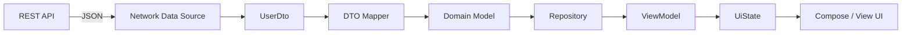
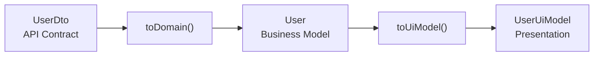
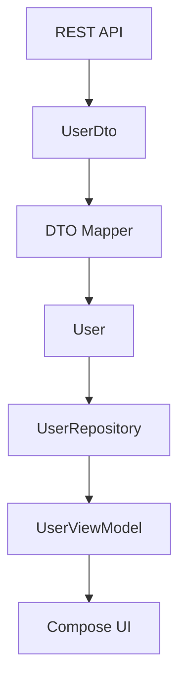
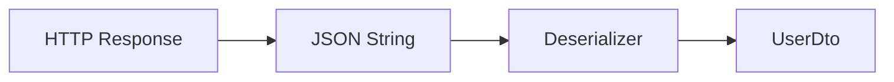
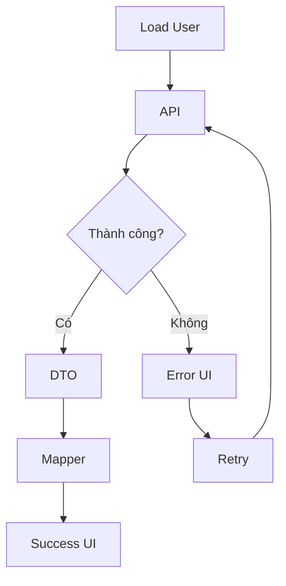
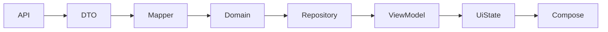

# 006 - DTO — Data Transfer Object

| Thuộc tính              | Nội dung                         |
| ----------------------- | -------------------------------- |
| **Học phần**            | 04 - Network, Async and Services |
| **Module**              | Module 07 - Network              |
| **Nhóm nội dung**       | HTTP Fundamentals                |
| **Nguồn roadmap**       | Network / HTTP Fundamentals      |
| **Loại bài**            | Network                          |
| **Thứ tự trong module** | 006                              |
| **Thời lượng gợi ý**    | 32 phút                          |

---

## 1. Tóm tắt

**DTO — Data Transfer Object** là object được thiết kế để **nhận hoặc gửi dữ liệu qua một ranh giới**, chẳng hạn giữa Android app và REST API.

Ví dụ server trả về:

```json
{
  "id": 42,
  "full_name": "An Khanh",
  "avatar_url": "https://example.com/avatar.jpg",
  "is_active": true
}
```

Thay vì sử dụng JSON trực tiếp trong toàn bộ ứng dụng, ta có thể parse nó thành:

```kotlin
@Serializable
data class UserDto(
    val id: Long,
    @SerialName("full_name")
    val fullName: String,
    @SerialName("avatar_url")
    val avatarUrl: String?,
    @SerialName("is_active")
    val isActive: Boolean
)
```

`UserDto` phản ánh **contract của API**, không nhất thiết phải là model mà UI hoặc business logic sử dụng.

Kotlin Serialization hỗ trợ chuyển đổi giữa Kotlin object và JSON; `@Serializable` đánh dấu class có thể serialize/deserialize, còn `@SerialName` cho phép ánh xạ tên property Kotlin với tên field bên dữ liệu ngoài.

---

# 2. DTO nằm ở đâu trong Android app?

Một kiến trúc phổ biến có thể hình dung như sau:



Ở kiến trúc Android phân lớp, `Repository` là điểm truy cập chính vào Data Layer và có thể làm việc với nhiều Data Source như network, file hoặc database. UI hoặc Domain Layer không nên phụ thuộc trực tiếp vào Network Data Source.

Có thể ghi nhớ ngắn gọn:

```text
JSON
 ↓
DTO
 ↓
Mapper
 ↓
Domain Model
 ↓
UI Model / UiState
 ↓
UI
```

> **DTO đứng gần API. Domain Model đứng gần business logic. UI Model đứng gần màn hình.**

---

# 3. DTO là gì?

DTO là viết tắt của:

```text
Data Transfer Object
```

Nó có nhiệm vụ mô tả **dữ liệu được truyền giữa hai thành phần hoặc hai hệ thống**.

Trong Android networking:

```text
Server
   ↓ JSON
UserDto
   ↓
Android App
```

hoặc chiều ngược lại:

```text
Android App
   ↓ LoginRequestDto
JSON
   ↓
Server
```

DTO có thể được sử dụng cho cả:

* Response từ server.
* Request gửi lên server.
* Nested object trong response.
* Pagination metadata.
* Error response.
* Request body.

---

# 4. Vì sao không dùng DTO trực tiếp ở UI?

Giả sử API trả:

```json
{
  "user_id": 15,
  "first_name": "An",
  "last_name": "Khanh",
  "avatar": null,
  "status": "ACTIVE"
}
```

Ta tạo:

```kotlin
@Serializable
data class UserDto(
    @SerialName("user_id")
    val userId: Long,

    @SerialName("first_name")
    val firstName: String,

    @SerialName("last_name")
    val lastName: String,

    val avatar: String?,

    val status: String
)
```

Nếu UI dùng thẳng `UserDto`:

```kotlin
Text(
    text = "${userDto.firstName} ${userDto.lastName}"
)
```

UI bắt đầu phụ thuộc vào cấu trúc API.

Giả sử backend đổi thành:

```json
{
  "id": 15,
  "display_name": "An Khanh"
}
```

Thay đổi API có thể lan từ Network Layer đến:

```text
API
 ↓
Repository
 ↓
ViewModel
 ↓
Compose
 ↓
Tests
```

Một cách tốt hơn là đặt mapper giữa DTO và model bên trong ứng dụng:



---

# 5. DTO vs Domain Model vs UI Model

Đây là phần rất dễ nhầm khi mới học Android Architecture.

| Model         | Đại diện cho              | Phụ thuộc vào        |
| ------------- | ------------------------- | -------------------- |
| `UserDto`     | Response của API          | Backend/API contract |
| `User`        | User trong business logic | Quy tắc nghiệp vụ    |
| `UserEntity`  | User trong database       | Schema Room/database |
| `UserUiModel` | Dữ liệu màn hình cần      | UI/UX                |

Ví dụ:

### DTO

```kotlin
@Serializable
data class UserDto(
    val id: Long,

    @SerialName("first_name")
    val firstName: String,

    @SerialName("last_name")
    val lastName: String,

    @SerialName("avatar_url")
    val avatarUrl: String?,

    val status: String
)
```

### Domain Model

```kotlin
data class User(
    val id: Long,
    val displayName: String,
    val avatarUrl: String?,
    val isActive: Boolean
)
```

### UI Model

```kotlin
data class UserUiModel(
    val name: String,
    val avatarUrl: String?,
    val statusText: String
)
```

Như vậy API có thể chứa:

```text
first_name
last_name
status = "ACTIVE"
```

nhưng business layer chỉ cần:

```text
displayName
isActive
```

và UI chỉ cần:

```text
name
statusText
```

---

# 6. DTO Mapper

Mapper chuyển model từ representation này sang representation khác.

```kotlin
fun UserDto.toDomain(): User {
    return User(
        id = id,
        displayName = "$firstName $lastName",
        avatarUrl = avatarUrl,
        isActive = status == "ACTIVE"
    )
}
```

Luồng xử lý:

```text
UserDto
{
    firstName = "An",
    lastName = "Khanh",
    status = "ACTIVE"
}
        │
        │ toDomain()
        ▼
User
{
    displayName = "An Khanh",
    isActive = true
}
```

Mapper giúp cô lập các chi tiết như:

```text
snake_case
nullable fields
API enum
timestamp
nested JSON
legacy fields
```

khỏi business logic và UI.

---

# 7. Ví dụ hoàn chỉnh: lấy User từ API

Giả sử endpoint:

```http
GET /users/42
```

Response:

```json
{
  "id": 42,
  "first_name": "An",
  "last_name": "Khanh",
  "avatar_url": null,
  "status": "ACTIVE"
}
```

---

## 7.1 DTO

```kotlin
@Serializable
data class UserDto(
    val id: Long,

    @SerialName("first_name")
    val firstName: String,

    @SerialName("last_name")
    val lastName: String,

    @SerialName("avatar_url")
    val avatarUrl: String? = null,

    val status: String
)
```

`@SerialName` hữu ích khi tên property Kotlin khác tên field JSON.

---

## 7.2 API Service

Ví dụ với Retrofit:

```kotlin
interface UserApi {

    @GET("users/{id}")
    suspend fun getUser(
        @Path("id") id: Long
    ): UserDto
}
```

Retrofit có converter chính thức cho `kotlinx.serialization`, cho phép phần network chuyển response sang các Kotlin object serializable.

Luồng hiện tại:

```text
GET /users/42
      ↓
HTTP Response
      ↓
JSON
      ↓
UserDto
```

---

# 8. Repository

Không nên để ViewModel gọi `UserApi` trực tiếp.

Android Developers khuyến nghị dùng repository làm entry point vào Data Layer và để repository điều phối data source.

```kotlin
class UserRepository(
    private val api: UserApi
) {

    suspend fun getUser(id: Long): User {
        return api
            .getUser(id)
            .toDomain()
    }
}
```

Luồng trở thành:



Điểm quan trọng là:

```text
ViewModel không biết UserDto tồn tại.
```

ViewModel chỉ biết:

```kotlin
User
```

---

# 9. ViewModel và UI State

Ta định nghĩa state:

```kotlin
sealed interface UserUiState {

    data object Loading : UserUiState

    data class Success(
        val user: UserUiModel
    ) : UserUiState

    data class Error(
        val message: String
    ) : UserUiState
}
```

ViewModel:

```kotlin
class UserViewModel(
    private val repository: UserRepository
) : ViewModel() {

    private val _uiState =
        MutableStateFlow<UserUiState>(UserUiState.Loading)

    val uiState: StateFlow<UserUiState> =
        _uiState.asStateFlow()

    fun loadUser(id: Long) {
        viewModelScope.launch {

            _uiState.value = UserUiState.Loading

            try {

                val user = repository.getUser(id)

                _uiState.value = UserUiState.Success(
                    user = UserUiModel(
                        name = user.displayName,
                        avatarUrl = user.avatarUrl,
                        statusText =
                            if (user.isActive)
                                "Đang hoạt động"
                            else
                                "Không hoạt động"
                    )
                )

            } catch (e: Exception) {

                _uiState.value = UserUiState.Error(
                    message = "Không thể tải người dùng"
                )
            }
        }
    }
}
```

Trong hướng dẫn kiến trúc Android, ViewModel/state holder chịu trách nhiệm tạo và cung cấp UI state để UI render; UI sau đó gửi user event trở lại ViewModel.

---

# 10. Compose UI

```kotlin
@Composable
fun UserScreen(
    state: UserUiState,
    onRetry: () -> Unit
) {

    when (state) {

        UserUiState.Loading -> {
            CircularProgressIndicator()
        }

        is UserUiState.Success -> {
            Text(
                text = state.user.name
            )
        }

        is UserUiState.Error -> {
            Column {
                Text(state.message)

                Button(
                    onClick = onRetry
                ) {
                    Text("Thử lại")
                }
            }
        }
    }
}
```

Từ góc nhìn user:

```text
              API Request
                   │
                   ▼
             ┌───────────┐
             │  Loading  │
             └─────┬─────┘
                   │
            ┌──────┴──────┐
            │             │
            ▼             ▼
       ┌─────────┐   ┌─────────┐
       │ Success │   │  Error  │
       └─────────┘   └────┬────┘
                          │
                          ▼
                       Retry
                          │
                          └──────→ Loading
```

---

# 11. Request DTO

DTO không chỉ dùng cho response.

Ví dụ đăng nhập:

```json
{
  "email": "user@example.com",
  "password": "secret"
}
```

Ta có thể tạo:

```kotlin
@Serializable
data class LoginRequestDto(
    val email: String,
    val password: String
)
```

API:

```kotlin
interface AuthApi {

    @POST("auth/login")
    suspend fun login(
        @Body body: LoginRequestDto
    ): LoginResponseDto
}
```

Response:

```kotlin
@Serializable
data class LoginResponseDto(
    @SerialName("access_token")
    val accessToken: String,

    @SerialName("expires_in")
    val expiresIn: Long
)
```

Luồng hai chiều:

```text
LoginRequestDto
      ↓
     JSON
      ↓
    SERVER
      ↓
     JSON
      ↓
LoginResponseDto
```

---

# 12. Nested DTO

API thực tế thường trả dữ liệu lồng nhau:

```json
{
  "id": 42,
  "name": "An Khanh",
  "address": {
    "city": "Ha Noi",
    "country": "Vietnam"
  }
}
```

Ta có thể tách DTO:

```kotlin
@Serializable
data class AddressDto(
    val city: String,
    val country: String
)

@Serializable
data class UserDto(
    val id: Long,
    val name: String,
    val address: AddressDto
)
```

Mapper:

```kotlin
fun UserDto.toDomain(): User {
    return User(
        id = id,
        displayName = name,
        location = "${address.city}, ${address.country}"
    )
}
```

---

# 13. Nullable field và giá trị mặc định

API bên ngoài không phải lúc nào cũng trả dữ liệu hoàn hảo.

Ví dụ:

```json
{
  "id": 42,
  "name": "An Khanh",
  "avatar_url": null
}
```

DTO nên phản ánh đúng khả năng đó:

```kotlin
@Serializable
data class UserDto(
    val id: Long,
    val name: String,

    @SerialName("avatar_url")
    val avatarUrl: String?
)
```

Sau đó mapper quyết định fallback:

```kotlin
fun UserDto.toDomain(): User {
    return User(
        id = id,
        name = name,
        avatarUrl = avatarUrl
            ?: DEFAULT_AVATAR_URL
    )
}
```

Tư duy quan trọng:

```text
DTO:
"Server có thể gửi gì?"

Domain:
"Ứng dụng muốn biểu diễn dữ liệu như thế nào?"
```

---

# 14. DTO và JSON Parsing

Bài trước nói về JSON Parsing.

DTO chính là **đích đến thường gặp của quá trình parsing**:



Kotlin Serialization mô tả serialization là việc chuyển dữ liệu ứng dụng sang dạng có thể truyền qua network hoặc lưu trữ, và deserialization là quá trình chuyển dữ liệu ngoài trở lại runtime object.

Ví dụ:

```kotlin
val json = """
{
    "id": 42,
    "first_name": "An",
    "last_name": "Khanh",
    "status": "ACTIVE"
}
"""

val dto =
    Json.decodeFromString<UserDto>(json)
```

---

# 15. Xử lý field lạ từ backend

Một tình huống rất phổ biến:

App đang biết:

```json
{
  "id": 42,
  "name": "An"
}
```

Backend bổ sung:

```json
{
  "id": 42,
  "name": "An",
  "new_feature": true
}
```

Với Kotlin Serialization, có thể cấu hình parser:

```kotlin
val json = Json {
    ignoreUnknownKeys = true
}
```

Ý tưởng là ứng dụng chỉ đọc những field nó quan tâm thay vì buộc model phải mô tả mọi field server gửi.

---

# 16. Không đưa logic nghiệp vụ vào DTO

Không nên:

```kotlin
@Serializable
data class ProductDto(
    val price: Double,
    val discount: Double
) {

    fun calculateCheckoutPrice(): Double {
        // business logic lớn
        ...
    }
}
```

DTO nên chủ yếu mô tả **representation của dữ liệu truyền tải**.

Logic kiểu:

```text
tính thuế
tính khuyến mãi
xác định quyền truy cập
xác định subscription
validate business rule
```

nên được đặt ở nơi phù hợp hơn như:

```text
Domain Model
UseCase
Repository
Domain Service
```

tùy kiến trúc ứng dụng.

---

# 17. Không để DTO lọt lên UI

Một dấu hiệu kiến trúc chưa tốt:

```kotlin
@Composable
fun ProfileScreen(
    userDto: UserDto
)
```

Tốt hơn:

```kotlin
@Composable
fun ProfileScreen(
    state: ProfileUiState
)
```

Có thể hình dung dependency:

```text
❌ Không tốt

API DTO
   │
   ├─────────────→ ViewModel
   │
   └─────────────→ UI


✅ Tách biệt

API
 ↓
DTO
 ↓
Mapper
 ↓
Domain
 ↓
ViewModel
 ↓
UiState
 ↓
UI
```

Android Architecture cũng hướng đến việc UI nhận dữ liệu đã được chuyển thành UI state thay vì tự truy cập trực tiếp nguồn dữ liệu.

---

# 18. DTO và Room Entity có giống nhau không?

Không nhất thiết.

Ví dụ network:

```kotlin
data class UserDto(
    val id: Long,
    val name: String,
    val avatar: String?
)
```

Database:

```kotlin
@Entity("users")
data class UserEntity(
    @PrimaryKey
    val id: Long,

    val name: String,

    val avatarUrl: String?,

    val cachedAt: Long
)
```

Ta có:

```text
REST API
   ↓
UserDto
   ↓
Mapper
   ↓
UserEntity
   ↓
Room
```

và khi đọc:

```text
Room
 ↓
UserEntity
 ↓
Mapper
 ↓
User
 ↓
UI
```

Trong mô hình offline-first của Android, repository có thể phối hợp giữa network source và local source; tài liệu Android khuyến nghị local data source đóng vai trò nguồn dữ liệu mà các layer phía trên đọc trong kiến trúc offline-first.

---

# 19. Lifecycle có liên quan gì đến DTO?

DTO bản thân không quản lý lifecycle.

Lifecycle liên quan đến **nơi và thời điểm DTO được sử dụng**.

Không nên:

```text
Activity
   ↓
HTTP call
   ↓
DTO
```

rồi để Activity trực tiếp quản lý toàn bộ network state.

Nên:

```text
Activity / Compose
        ↓
    ViewModel
        ↓
   Repository
        ↓
Network Data Source
        ↓
       DTO
```

Khi UI được tạo lại, UI có thể tiếp tục render state do ViewModel/state holder cung cấp thay vì gắn toàn bộ quá trình networking vào từng View instance. Android Architecture đặt việc quản lý UI state và xử lý business action ở ViewModel/state holder.

---

# 20. Error handling

DTO parsing chỉ là một phần của network flow.

Có nhiều loại lỗi:

```text
Network Request
     │
     ├── No Internet
     │
     ├── Timeout
     │
     ├── HTTP 401
     │
     ├── HTTP 404
     │
     ├── HTTP 500
     │
     ├── Invalid JSON
     │
     ├── Missing Field
     │
     └── Mapping Error
```

Ứng dụng không nên biến tất cả thành:

```text
"Something went wrong"
```

một cách mù quáng.

Repository có thể chuyển lỗi kỹ thuật thành application error:

```kotlin
sealed interface AppError {

    data object Network : AppError

    data object Unauthorized : AppError

    data object Server : AppError

    data object InvalidData : AppError
}
```

Sau đó ViewModel chuyển thành UI state phù hợp.

---

# 21. Retry

Luồng retry cơ bản:



Không phải lỗi nào cũng nên retry giống nhau. Ví dụ tài liệu Android về offline-first phân biệt lỗi kết nối có thể retry với lỗi authorization cần credential hợp lệ trước khi thử lại.

---

# 22. Testing DTO

## Test 1 — JSON → DTO

```kotlin
@Test
fun parseUserDto() {

    val jsonString = """
        {
            "id": 42,
            "first_name": "An",
            "last_name": "Khanh",
            "status": "ACTIVE"
        }
    """

    val dto =
        json.decodeFromString<UserDto>(
            jsonString
        )

    assertEquals(42, dto.id)
    assertEquals("An", dto.firstName)
}
```

---

## Test 2 — DTO → Domain

```kotlin
@Test
fun userDto_mapsToDomain() {

    val dto = UserDto(
        id = 42,
        firstName = "An",
        lastName = "Khanh",
        avatarUrl = null,
        status = "ACTIVE"
    )

    val user = dto.toDomain()

    assertEquals(
        "An Khanh",
        user.displayName
    )

    assertTrue(user.isActive)
}
```

---

## Test 3 — Nullable field

```kotlin
@Test
fun nullAvatar_isHandled() {

    val dto = UserDto(
        id = 42,
        firstName = "An",
        lastName = "Khanh",
        avatarUrl = null,
        status = "ACTIVE"
    )

    val user = dto.toDomain()

    assertNotNull(user)
}
```

Mapper test đặc biệt hữu ích vì đây là nơi API representation được chuyển thành representation mà ứng dụng sử dụng.

---

# 23. Debug DTO như thế nào?

Khi gặp:

```text
SerializationException
JsonDataException
MalformedJsonException
```

hãy kiểm tra theo pipeline:

```text
1. HTTP response có thành công?
           ↓
2. Body thực tế server trả gì?
           ↓
3. JSON hợp lệ?
           ↓
4. Tên field đúng?
           ↓
5. Kiểu dữ liệu đúng?
           ↓
6. Nullable đúng?
           ↓
7. DTO có field bắt buộc bị thiếu?
           ↓
8. Mapper có lỗi?
```

Ví dụ server trả:

```json
{
  "id": "42"
}
```

nhưng DTO khai báo:

```kotlin
val id: Long
```

Contract giữa client và server đang không khớp.

---

# 24. Anti-pattern thường gặp

### ❌ Một model dùng cho mọi layer

```text
UserModel
 ├── Retrofit
 ├── Room
 ├── Domain
 └── UI
```

Ứng dụng nhỏ có thể thấy tiện ban đầu nhưng các layer trở nên liên kết chặt.

---

### ❌ UI biết tên field API

```kotlin
Text(user.first_name)
```

---

### ❌ DTO chứa Android UI type

```kotlin
data class UserDto(
    val context: Context,
    val color: Color
)
```

DTO nên tập trung vào dữ liệu truyền tải.

---

### ❌ Mapper nằm rải rác trong UI

```kotlin
Text(
    "${dto.firstName} ${dto.lastName}"
)
```

lặp lại ở nhiều màn hình.

Tốt hơn:

```kotlin
dto.toDomain()
```

---

# 25. Folder structure gợi ý

Một project có thể tổ chức:

```text
data/
├── remote/
│   ├── api/
│   │   └── UserApi.kt
│   │
│   └── dto/
│       ├── UserDto.kt
│       └── LoginResponseDto.kt
│
├── mapper/
│   └── UserMapper.kt
│
└── repository/
    └── UserRepositoryImpl.kt

domain/
├── model/
│   └── User.kt
│
└── repository/
    └── UserRepository.kt

ui/
└── profile/
    ├── ProfileViewModel.kt
    ├── ProfileUiState.kt
    └── ProfileScreen.kt
```

Không có một folder structure bắt buộc cho mọi app; điều quan trọng hơn là dependency giữa các layer rõ ràng.

---

# 26. Bài thực hành — User Profile API

## Yêu cầu

Mock endpoint:

```http
GET /users/1
```

Response:

```json
{
  "id": 1,
  "first_name": "An",
  "last_name": "Khanh",
  "avatar_url": null,
  "status": "ACTIVE"
}
```

Xây pipeline:

```text
Mock API
   ↓
UserDto
   ↓
toDomain()
   ↓
User
   ↓
Repository
   ↓
ViewModel
   ↓
ProfileUiState
   ↓
ProfileScreen
```

Màn hình phải có:

```text
Loading
   ↓
Success
```

hoặc:

```text
Loading
   ↓
Error
   ↓
Retry
   ↓
Loading
```

---

# 27. Artifact để đưa vào portfolio

Một mini-project tốt có thể chứng minh toàn bộ flow:

```text
Android Network DTO Demo
│
├── REST API / MockWebServer
│
├── UserDto
│
├── DTO Mapper
│
├── Domain Model
│
├── Repository
│
├── ViewModel
│
├── StateFlow
│
├── Compose UI
│
└── Unit Tests
```

README có thể trình bày kiến trúc:



Đây là artifact nhỏ nhưng thể hiện rõ khả năng làm việc với:

```text
HTTP
JSON
DTO
Architecture
State
Error Handling
Testing
```

---

# 28. Câu hỏi phỏng vấn thường gặp

### DTO là gì?

> DTO là object biểu diễn dữ liệu được truyền giữa các hệ thống hoặc layer. Trong Android networking, DTO thường phản ánh request/response contract của API.

### DTO và Domain Model khác nhau thế nào?

> DTO phụ thuộc vào cấu trúc dữ liệu bên ngoài, còn Domain Model biểu diễn khái niệm và quy tắc của ứng dụng.

### Tại sao cần mapper?

> Mapper cô lập API representation khỏi phần còn lại của app, giúp hạn chế ảnh hưởng khi API thay đổi.

### DTO và Entity có phải một không?

> Không bắt buộc. DTO mô tả dữ liệu truyền qua network, còn Entity mô tả cách dữ liệu được lưu trong database.

### Có luôn cần tách DTO và Domain Model không?

> Không. Với prototype rất nhỏ, việc dùng chung model có thể giảm boilerplate. Khi ứng dụng có business logic, local cache, nhiều API hoặc cần bảo trì lâu dài, tách representation thường đem lại ranh giới kiến trúc rõ hơn.

---

# 29. Mental Model

Hãy nhớ công thức:

```text
DTO = ngôn ngữ của API

Domain Model = ngôn ngữ của ứng dụng

UI Model = ngôn ngữ của màn hình
```

Và pipeline:

```text
            NETWORK
               │
               ▼
          ┌─────────┐
          │   DTO   │
          └────┬────┘
               │ Mapper
               ▼
        ┌──────────────┐
        │ Domain Model │
        └──────┬───────┘
               │
               ▼
          Repository
               │
               ▼
           ViewModel
               │
               ▼
            UiState
               │
               ▼
               UI
```

DTO chính là **lớp chống sốc giữa contract bên ngoài và model bên trong app**.

---

# 30. Checklist hoàn thành

* [ ] Giải thích được DTO là viết tắt của **Data Transfer Object**.
* [ ] Hiểu DTO thường nằm gần Network/Data Source.
* [ ] Phân biệt được DTO, Domain Model, Entity và UI Model.
* [ ] Parse JSON thành DTO.
* [ ] Sử dụng `@Serializable`.
* [ ] Biết dùng `@SerialName` khi tên JSON và Kotlin khác nhau.
* [ ] Xử lý nullable field.
* [ ] Viết được `Dto.toDomain()`.
* [ ] Không truyền DTO trực tiếp lên Compose nếu đã chọn kiến trúc phân lớp.
* [ ] Repository che giấu Network Data Source khỏi ViewModel.
* [ ] Có `Loading`, `Success`, `Error`.
* [ ] Có Retry.
* [ ] Test JSON parsing.
* [ ] Test DTO Mapper.
* [ ] Kiểm tra malformed hoặc unexpected API response.
* [ ] Có diagram kiến trúc trong README.
* [ ] Có mini-project hoặc screenshot để đưa vào portfolio.

---

# 31. Ghi chú production

Khi DTO được đưa vào ứng dụng production, hãy kiểm tra cả chuỗi thay vì chỉ hỏi JSON có parse được hay không:

```text
API contract có thay đổi?
        ↓
DTO có tương thích?
        ↓
Nullable/default value an toàn?
        ↓
Mapper có xử lý edge case?
        ↓
Repository có xử lý lỗi?
        ↓
ViewModel tạo đúng UiState?
        ↓
Rotate/background có gây request dư?
        ↓
Offline có cần cache?
        ↓
Retry có hợp lý?
        ↓
Unit test có bảo vệ contract?
```

Với ứng dụng offline-first, repository thường phải phối hợp Network Data Source và Local Data Source thay vì để UI tự quyết định đọc nguồn nào.

---

# 32. Tổng kết

DTO giải quyết một vấn đề rất cụ thể:

```text
"Dữ liệu bên ngoài đi vào ứng dụng dưới hình dạng nào?"
```

Một kiến trúc rõ ràng thường đi theo:

```text
HTTP
 ↓
JSON
 ↓
DTO
 ↓
Mapper
 ↓
Domain Model
 ↓
Repository / Use Case
 ↓
ViewModel
 ↓
UiState
 ↓
UI
```

Nếu chỉ nhớ một nguyên tắc sau bài này, hãy nhớ:

> **DTO nên phản ánh contract của nguồn dữ liệu; đừng để contract đó lan không kiểm soát vào business logic và UI.**

DTO nhỏ, nhưng việc đặt nó đúng ranh giới giúp network code dễ thay đổi, dễ test và dễ bảo trì hơn khi ứng dụng phát triển.

---

# Bài luyện tập

## Mục tiêu


## Đề bài


## Yêu cầu hoàn thành

- [ ] 
- [ ] 
- [ ] 

## Kết quả / lời giải


## Ghi chú
