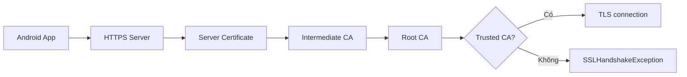
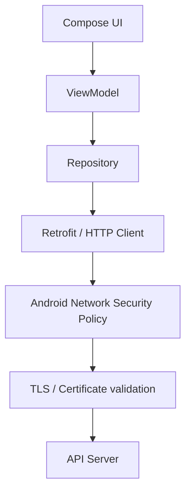
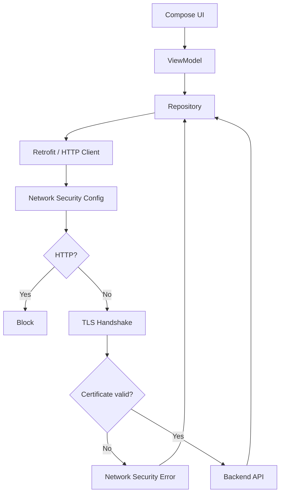

[](https://www.airdroid.com/android-certificate-management/security-and-compliance/?utm_source=chatgpt.com)

# 007 - Network Security Config

**Học phần:** 04 - Network, Async and Services
**Module:** Module 07 - Network
**Nhóm nội dung:** HTTP Fundamentals
**Nguồn roadmap:** Network / HTTP Fundamentals
**Loại bài:** Network
**Thứ tự trong module:** 007
**Thời lượng gợi ý:** 32 phút

---

## 1. Tóm tắt

**Network Security Config** là cơ chế của Android cho phép ứng dụng khai báo **chính sách bảo mật mạng bằng XML** thay vì phải tự viết logic TLS/SSL trong Kotlin hoặc Java. Nó xuất hiện từ **Android 7.0 — API level 24**. ([Android Developers][1])

Một file Network Security Config có thể kiểm soát:

* Có cho phép kết nối **HTTP không mã hóa** hay không.
* Domain nào được áp dụng chính sách riêng.
* Ứng dụng tin tưởng Certificate Authority — CA nào.
* Certificate dùng riêng trong môi trường debug.
* Certificate Transparency.
* Certificate pinning trong những trường hợp đặc biệt. ([Android Developers][1])

Ví dụ tư duy đơn giản:

```text
App Android
    │
    │ request
    ▼
https://api.example.com
    │
    ▼
Network Security Config
    │
    ├── HTTP được phép? ─────────────── No
    ├── Certificate hợp lệ? ────────── Yes
    ├── CA đáng tin cậy? ───────────── Yes
    └── Domain có policy riêng? ────── Yes
                │
                ▼
          Cho phép kết nối
```

Network Security Config không thay thế Retrofit, OkHttp hay repository. Nó nằm ở **lớp chính sách bảo mật thấp hơn network client** và quyết định một kết nối có được phép thiết lập hay không.

---

# 2. Mục tiêu học tập

Sau bài này, bạn nên có thể:

* [ ] Giải thích Network Security Config bằng ngôn ngữ của mình.
* [ ] Biết vị trí của `network_security_config.xml`.
* [ ] Liên kết file này với `AndroidManifest.xml`.
* [ ] Phân biệt HTTP và HTTPS.
* [ ] Chặn cleartext traffic trong production.
* [ ] Cho phép ngoại lệ theo domain khi thực sự cần.
* [ ] Hiểu `base-config` và `domain-config`.
* [ ] Biết cách cấu hình CA riêng.
* [ ] Biết mục đích của `debug-overrides`.
* [ ] Nhận biết lỗi TLS/certificate trong Logcat.
* [ ] Hiểu ảnh hưởng của lỗi bảo mật mạng tới UI state.
* [ ] Có một demo nhỏ để đưa vào portfolio.

---

# 3. Network Security Config là gì?

Android định nghĩa Network Security Configuration là một cơ chế cho phép tùy chỉnh các thiết lập bảo mật mạng thông qua **file cấu hình khai báo** mà không cần sửa logic của ứng dụng. Chính sách có thể áp dụng cho toàn app hoặc riêng từng domain. ([Android Developers][1])

Thông thường file nằm tại:

```text
app/
└── src/
    └── main/
        ├── AndroidManifest.xml
        └── res/
            └── xml/
                └── network_security_config.xml
```

Sau đó `AndroidManifest.xml` trỏ tới file này:

```xml
<application
    android:networkSecurityConfig="@xml/network_security_config"
    ...>
</application>
```

Đây cũng là cách cấu hình được Android Developers hướng dẫn chính thức. ([Android Developers][1])

---

# 4. Vì sao cần Network Security Config?

Giả sử ứng dụng gọi:

```text
http://api.example.com/login
```

thay vì:

```text
https://api.example.com/login
```

Với HTTP, dữ liệu không có những bảo đảm an toàn mà TLS cung cấp. Android cảnh báo rằng cleartext traffic có thể bị quan sát hoặc sửa đổi bởi kẻ đang kiểm soát đường truyền; việc này không chỉ nguy hiểm với password/token mà ngay cả dữ liệu bình thường cũng có thể bị thay đổi để tác động tới hành vi của ứng dụng. ([Android Developers][2])

Ví dụ:

```text
Android App
     │
     │ HTTP
     ▼
 Wi-Fi công cộng
     │
     ├──────────────► Attacker
     │                  │
     │                  └─ đọc/sửa response
     ▼
 API Server
```

Trong khi với HTTPS:

```text
Android App
     │
     │ TLS / HTTPS
     ▼
Certificate Validation
     │
     ▼
Encrypted Connection
     │
     ▼
API Server
```

Network Security Config giúp biến yêu cầu:

> "Production chỉ được sử dụng HTTPS."

thành một **policy được Android thực thi**, thay vì chỉ dựa vào việc lập trình viên nhớ dùng đúng URL.

---

# 5. `base-config`

`base-config` là cấu hình mặc định cho những kết nối không được một `domain-config` cụ thể ghi đè. ([Android Developers][1])

Ví dụ an toàn cho production:

```xml
<?xml version="1.0" encoding="utf-8"?>
<network-security-config>

    <base-config
        cleartextTrafficPermitted="false" />

</network-security-config>
```

Ý nghĩa:

```text
Tất cả domain
      │
      ▼
base-config
      │
      ▼
HTTP?
 ├── Yes → BLOCK
 └── No  → tiếp tục TLS validation
```

### `cleartextTrafficPermitted`

```xml
cleartextTrafficPermitted="false"
```

nghĩa là không cho phép cleartext HTTP.

Đối với app target **Android 9 / API 28 trở lên**, cleartext mặc định đã bị tắt. Với app target API 24–27, mặc định trước đây là cho phép cleartext. Khai báo policy rõ ràng vẫn có lợi vì ý định bảo mật được thể hiện trực tiếp trong project. ([Android Developers][1])

---

# 6. `domain-config`

Đôi khi bạn muốn một domain có policy khác với toàn ứng dụng.

Ví dụ:

```xml
<?xml version="1.0" encoding="utf-8"?>
<network-security-config>

    <base-config
        cleartextTrafficPermitted="false" />

    <domain-config
        cleartextTrafficPermitted="true">

        <domain includeSubdomains="true">
            localhost
        </domain>

    </domain-config>

</network-security-config>
```

Luồng:

```text
Request
   │
   ▼
Domain = localhost?
   │
   ├── Yes
   │     │
   │     ▼
   │  domain-config
   │  HTTP allowed
   │
   └── No
         │
         ▼
      base-config
      HTTP blocked
```

Android Developers khuyến nghị **không bật cleartext cho toàn ứng dụng chỉ vì một server cần HTTP**. Tốt hơn là mặc định tắt HTTP và chỉ tạo ngoại lệ cho đúng domain cần thiết. ([Android Developers][3])

---

# 7. `includeSubdomains`

Ví dụ:

```xml
<domain includeSubdomains="true">
    example.com
</domain>
```

Policy sẽ áp dụng cho:

```text
example.com
api.example.com
cdn.example.com
images.example.com
v2.api.example.com
```

Nếu:

```xml
includeSubdomains="false"
```

thì chỉ domain khớp chính xác mới được áp dụng.

Android cũng cho phép nhiều `domain-config`; nếu nhiều rule cùng khớp một destination thì rule có domain phù hợp cụ thể nhất sẽ được dùng. ([Android Developers][1])

---

# 8. Cấu hình khuyến nghị cơ bản

Một project thông thường sử dụng API HTTPS có thể bắt đầu đơn giản như sau.

### `res/xml/network_security_config.xml`

```xml
<?xml version="1.0" encoding="utf-8"?>

<network-security-config>

    <base-config
        cleartextTrafficPermitted="false">

        <trust-anchors>
            <certificates src="system" />
        </trust-anchors>

    </base-config>

</network-security-config>
```

### `AndroidManifest.xml`

```xml
<manifest
    xmlns:android="http://schemas.android.com/apk/res/android">

    <uses-permission android:name="android.permission.INTERNET" />

    <application
        android:networkSecurityConfig="@xml/network_security_config"
        ...>

        ...

    </application>

</manifest>
```

`src="system"` nghĩa là sử dụng tập CA được hệ thống Android tin tưởng. Đây cũng là trust-anchor mặc định của những app Android hiện đại. ([Android Developers][1])

---

# 9. Trust Anchor là gì?

Trong HTTPS, server gửi certificate:

```text
Server Certificate
       │
       ▼
Intermediate CA
       │
       ▼
Root CA
       │
       ▼
Trusted?
```

Android cần xác minh chuỗi certificate có dẫn tới một CA mà ứng dụng tin tưởng hay không.

Có thể hình dung:



Network Security Config cho phép thay đổi tập trust anchor này cho từng ứng dụng hoặc từng domain. ([Android Developers][1])

---

# 10. Custom CA

Trường hợp doanh nghiệp có server nội bộ:

```text
https://internal.company.local
```

và certificate được ký bởi:

```text
Company Internal CA
```

thay vì một CA công cộng.

Ta có thể đưa certificate vào:

```text
res/
└── raw/
    └── company_ca.crt
```

Sau đó:

```xml
<network-security-config>

    <domain-config>

        <domain includeSubdomains="true">
            internal.example.com
        </domain>

        <trust-anchors>

            <certificates src="system" />

            <certificates src="@raw/company_ca" />

        </trust-anchors>

    </domain-config>

</network-security-config>
```

Network Security Config hỗ trợ certificate X.509 từ system store, user store hoặc raw resource của ứng dụng. ([Android Developers][1])

---

# 11. Không được "bypass SSL"

Một lỗi nguy hiểm là gặp:

```text
SSLHandshakeException
```

rồi xử lý bằng cách tạo TrustManager kiểu:

```kotlin
// KHÔNG LÀM
override fun checkServerTrusted(
    chain: Array<X509Certificate>,
    authType: String
) {
    // accept everything
}
```

hoặc hostname verifier:

```kotlin
// KHÔNG LÀM
HostnameVerifier { _, _ ->
    true
}
```

Tư duy:

```text
Certificate error
       │
       ├── Sai: tắt certificate validation
       │
       ▼
       │   App chạy nhưng mất bảo mật
       │
       └── Đúng
            │
            ├── kiểm tra certificate chain
            ├── kiểm tra hostname
            ├── sửa cấu hình server
            └── cấu hình trusted CA phù hợp
```

Android khuyến cáo TLS checker không được chấp nhận mọi certificate; với `SSLSocket`, hostname verification còn phải được thực hiện đúng cách. ([Android Developers][4])

---

# 12. `debug-overrides`

Đây là một trong những tính năng hữu ích nhất của Network Security Config.

Trong lúc phát triển, developer có thể muốn:

```text
Android App
     │
     ▼
Charles / Burp / Reqable
     │
     ▼
Development API
```

Proxy debugging thường sử dụng một CA được cài trên thiết bị.

Bạn **không muốn production app tin CA đó**.

Có thể cấu hình:

```xml
<network-security-config>

    <base-config
        cleartextTrafficPermitted="false" />

    <debug-overrides>

        <trust-anchors>
            <certificates src="user" />
        </trust-anchors>

    </debug-overrides>

</network-security-config>
```

`debug-overrides` chỉ được áp dụng khi ứng dụng có:

```text
android:debuggable = true
```

và bị bỏ qua đối với build không debuggable. Đây là lý do nó an toàn hơn việc viết `if (BuildConfig.DEBUG)` để tự thay TrustManager. ([Android Developers][1])

---

# 13. Debug và Release nên khác nhau như thế nào?

```text
                    ┌──────────────┐
                    │ Android App  │
                    └───────┬──────┘
                            │
                 ┌──────────┴──────────┐
                 ▼                     ▼
             DEBUG BUILD           RELEASE BUILD
                 │                     │
                 ▼                     ▼
          debug-overrides        debug-overrides
             active                 ignored
                 │                     │
                 ▼                     ▼
       Dev CA / User CA          System CA only
                 │                     │
                 ▼                     ▼
           Dev server          Production HTTPS
```

Mục tiêu quan trọng là:

> Công cụ debug không được làm yếu chính sách bảo mật của bản release.

---

# 14. Certificate Pinning

Network Security Config cũng hỗ trợ `<pin-set>`.

Ví dụ:

```xml
<domain-config>

    <domain includeSubdomains="true">
        api.example.com
    </domain>

    <pin-set>

        <pin digest="SHA-256">
            BASE64_PUBLIC_KEY_HASH
        </pin>

        <pin digest="SHA-256">
            BACKUP_PUBLIC_KEY_HASH
        </pin>

    </pin-set>

</domain-config>
```

Pin được tính từ public key của certificate (`SubjectPublicKeyInfo`). Chuỗi certificate chỉ hợp lệ khi có public key phù hợp với một trong các pin. Android yêu cầu khi dùng pinning phải chuẩn bị backup key để tránh mất kết nối khi certificate/key cần thay đổi. ([Android Developers][1])

Tuy nhiên, tài liệu bảo mật Android hiện tại **không khuyến nghị certificate pinning cho app Android nói chung**, bởi thay đổi CA/certificate phía server có thể khiến các phiên bản app đã cài không còn kết nối được nếu không được cập nhật. ([Android Developers][5])

Vì vậy:

```text
HTTPS + CA validation bình thường
              │
              ▼
      Thường là đủ
              │
              ▼
Pinning chỉ khi threat model
thực sự yêu cầu và team có
quy trình rotation/backup rõ ràng
```

---

# 15. Network Security Config và Retrofit

Giả sử API:

```kotlin
interface UserApi {

    @GET("users/me")
    suspend fun getProfile(): UserDto
}
```

Repository:

```kotlin
class UserRepository(
    private val api: UserApi
) {

    suspend fun getProfile(): Result<UserDto> {
        return runCatching {
            api.getProfile()
        }
    }
}
```

Network Security Config không nằm trong:

```text
Retrofit interface
Repository
ViewModel
Composable
```

mà là chính sách ở tầng network/platform:



Do đó UI có thể hoàn toàn đúng nhưng request vẫn thất bại vì policy bảo mật.

---

# 16. Liên hệ với UI State

Network Security Config không quản lý UI state, nhưng lỗi do policy sinh ra phải được chuyển thành state có ý nghĩa.

Không nên:

```text
SSL Exception
     ↓
Crash app
```

Nên:

```text
Network Request
      │
      ▼
   Loading
      │
      ▼
Network/TLS error?
   │         │
   No        Yes
   │         │
   ▼         ▼
Success    Failure
             │
             ▼
        Error UI
             │
             ▼
           Retry
```

Ví dụ:

```kotlin
sealed interface ProfileUiState {

    data object Loading : ProfileUiState

    data class Success(
        val profile: UserUiModel
    ) : ProfileUiState

    data class Error(
        val message: String
    ) : ProfileUiState
}
```

Không nên hiển thị trực tiếp:

```text
javax.net.ssl.SSLHandshakeException...
```

cho người dùng.

UI chỉ cần thông báo:

```text
Không thể kết nối an toàn đến máy chủ.
Vui lòng thử lại.
```

Trong khi nguyên nhân kỹ thuật được giữ ở log/telemetry phù hợp.

---

# 17. Ví dụ lỗi HTTP bị chặn

Giả sử:

```xml
<base-config
    cleartextTrafficPermitted="false" />
```

nhưng code gọi:

```kotlin
const val BASE_URL =
    "http://api.example.com/"
```

Request:

```text
GET http://api.example.com/users
```

sẽ bị policy chặn.

Android Developers minh họa lỗi Logcat dạng:

```text
Cleartext HTTP traffic to ... not permitted
```

trong codelab chính thức. ([Android Developers][3])

Luồng debug:

```text
Request failed
     │
     ▼
Check Logcat
     │
     ▼
Cleartext traffic not permitted
     │
     ▼
Check BASE_URL
     │
     ├── http://
     │
     ▼
Replace / fix backend
     │
     ▼
https://
```

Đừng giải quyết bằng:

```xml
cleartextTrafficPermitted="true"
```

chỉ để "app chạy được" nếu production server thực sự hỗ trợ HTTPS.

---

# 18. Một lỗi thực tế khó phát hiện

API chính:

```text
https://api.example.com/posts
```

trả:

```json
{
  "id": 1,
  "imageUrl": "http://cdn.example.com/image.jpg"
}
```

Request đầu tiên:

```text
HTTPS API → OK
```

nhưng request tải ảnh:

```text
HTTP CDN → BLOCKED
```

Kết quả UI:

```text
┌─────────────────────────┐
│ Alice                   │
│ Hello Android!          │
│                         │
│       [image error]     │
└─────────────────────────┘
```

Đây chính là một tình huống mà codelab Android sử dụng để minh họa: backend có thể vô tình đưa URL HTTP vào dữ liệu, và Network Security Config ngăn ứng dụng sử dụng kết nối không an toàn đó. ([Android Developers][3])

---

# 19. Lifecycle có liên quan không?

Network Security Config bản thân không phải lifecycle component.

```text
Activity recreated
       │
       ▼
Network Security Config
       │
       └── không thay đổi
```

Nhưng request thất bại do network security vẫn tạo ra state mà UI phải xử lý:

```text
Repository
    ↓
ViewModel
    ↓
StateFlow
    ↓
Compose
```

Ví dụ người dùng xoay màn hình khi đang thấy error:

```text
Error
  ↓
rotation
  ↓
ViewModel vẫn giữ UiState
  ↓
Error UI được render lại
```

Vì vậy bài học này kết nối được với kiến thức trước đó về:

* ViewModel.
* StateFlow.
* UI State.
* Repository.
* Result Wrapper.

---

# 20. Certificate Transparency — cập nhật Android 2026

Một điểm đáng chú ý với roadmap 2026 là Network Security Config hiện còn hỗ trợ **Certificate Transparency (CT)**.

Theo tài liệu Android hiện tại:

* Android 16 / API 36: hỗ trợ CT nhưng mặc định chưa bật.
* Android 17 / API 37: CT được bật mặc định.
* API 35 trở xuống: Network Security Config chưa hỗ trợ tính năng CT này. ([Android Developers][1])

Ví dụ cấu hình:

```xml
<domain-config>

    <domain includeSubdomains="true">
        api.example.com
    </domain>

    <certificateTransparency
        enabled="true" />

</domain-config>
```

CT bổ sung khả năng kiểm tra việc certificate đã được ghi nhận trong các Certificate Transparency log. ([Android Developers][1])

> **Mức học bài #007:** chỉ cần biết CT tồn tại. Chưa cần tự triển khai sâu.

---

# 21. Encrypted Client Hello — kiến thức nâng cao 2026

Android 17 / API 37 còn bổ sung cấu hình **Encrypted Client Hello — ECH** trong Network Security Configuration.

ECH giúp mã hóa những phần nhạy cảm của quá trình TLS handshake, đặc biệt là thông tin SNI. Tính năng chỉ có hiệu lực nếu networking library được sử dụng cũng hỗ trợ ECH. ([Android Developers][1])

Đây là kiến thức nâng cao:

```text
Network Security Config
│
├── HTTP / HTTPS          ← phải biết
├── Domain policy         ← phải biết
├── Trust anchors         ← nên biết
├── Debug overrides       ← nên biết
├── Certificate pinning   ← biết khái niệm
├── Certificate Transparency
│                         ← nâng cao
└── ECH                   ← nâng cao 2026
```

---

# 22. Thực hành

## Mini project: Secure Profile App

### Yêu cầu

App tải:

```text
GET https://api.example.com/profile
```

và có 4 trạng thái:

```text
Loading
Success
Error
Retry
```

### Bước 1 — Tạo Network Security Config

```xml
<?xml version="1.0" encoding="utf-8"?>

<network-security-config>

    <base-config
        cleartextTrafficPermitted="false">

        <trust-anchors>
            <certificates src="system" />
        </trust-anchors>

    </base-config>

</network-security-config>
```

### Bước 2 — Khai báo trong Manifest

```xml
<application
    android:networkSecurityConfig="@xml/network_security_config"
    ...>
```

### Bước 3 — Test HTTPS

```text
https://api.example.com
```

Expected:

```text
Loading
   ↓
Success
```

### Bước 4 — Cố tình dùng HTTP

```text
http://api.example.com
```

Expected:

```text
Loading
   ↓
Network Error
   ↓
Retry
```

Kiểm tra Logcat để xác nhận nguyên nhân là cleartext traffic bị chặn.

---

# 23. Test `debug-overrides`

Tạo:

```xml
<debug-overrides>

    <trust-anchors>
        <certificates src="user" />
    </trust-anchors>

</debug-overrides>
```

Test:

```text
Debug build
     │
     ▼
User/debug CA
     │
     ▼
Accepted
```

Sau đó build release:

```text
Release build
     │
     ▼
debug-overrides ignored
     │
     ▼
Debug CA rejected
```

Cách hoạt động này được Network Security Config thiết kế riêng để việc kiểm thử HTTPS không làm yếu bản release. ([Android Developers][1])

---

# 24. Test matrix

| Case | Request                      | Expected                  |
| ---- | ---------------------------- | ------------------------- |
| 1    | HTTPS production API         | ✅ Success                 |
| 2    | HTTP production API          | ❌ Block                   |
| 3    | HTTPS với certificate hợp lệ | ✅ Success                 |
| 4    | Certificate không đáng tin   | ❌ TLS error               |
| 5    | Debug CA + debug build       | ✅ nếu được cấu hình       |
| 6    | Debug CA + release build     | ❌ Reject                  |
| 7    | Backend trả HTTP image URL   | ❌ Image request bị chặn   |
| 8    | Retry sau network failure    | UI không crash            |
| 9    | Rotate khi error             | State được render lại     |
| 10   | Offline                      | Hiển thị offline/error UI |

---

# 25. Debugging checklist

Khi request không hoạt động, kiểm tra theo thứ tự:

```text
Request fails
    │
    ▼
URL đúng?
    │
    ▼
HTTP hay HTTPS?
    │
    ▼
Logcat
    │
    ├── Cleartext not permitted
    │
    ├── SSLHandshakeException
    │
    ├── Unknown CA
    │
    └── Hostname mismatch
    │
    ▼
Check certificate/server
    │
    ▼
Check network_security_config.xml
    │
    ▼
Check debug vs release
```

Với lỗi certificate chain, sửa cấu hình certificate phía server thường là giải pháp đúng hơn việc làm client bỏ qua verification. Android cũng chỉ ra rằng server thiếu intermediate CA có thể khiến kết nối Android thất bại. ([Android Developers][5])

---

# 26. Những sai lầm phổ biến

### ❌ Sai 1 — Cho phép HTTP toàn app

```xml
<base-config
    cleartextTrafficPermitted="true" />
```

chỉ vì local API đang chạy HTTP.

### ✅ Tốt hơn

```text
Production → HTTPS only

Development
     ↓
domain-specific exception
hoặc
debug-only configuration
```

Android cũng khuyến nghị chỉ tạo ngoại lệ cleartext cho những destination thực sự cần thay vì mở toàn ứng dụng. ([Android Developers][3])

---

### ❌ Sai 2 — Trust tất cả certificate

```text
TrustManager
    ↓
accept everything
```

### ✅ Đúng

```text
System CA
hoặc
Custom CA rõ ràng
```

([Android Developers][4])

---

### ❌ Sai 3 — Bật debug CA cho production

```text
Production
    ↓
trust user certificates
```

Điều này có thể làm tăng phạm vi certificate được ứng dụng tin tưởng.

### ✅ Đúng

```xml
<debug-overrides>
    ...
</debug-overrides>
```

([Android Developers][1])

---

### ❌ Sai 4 — Pin certificate nhưng không có backup

```text
Current key changed
       ↓
Old installed app
       ↓
Cannot connect
```

Nếu threat model bắt buộc phải pin, Android yêu cầu chuẩn bị backup key; tuy nhiên pinning nhìn chung không được Android khuyến nghị cho app thông thường. ([Android Developers][1])

---

# 27. Production Architecture

Một kiến trúc dễ hiểu:



Điểm quan trọng:

```text
UI
↓
State
↓
Repository
↓
HTTP Client
↓
Security Policy
↓
TLS
↓
Server
```

Network Security Config thuộc phần **security boundary của network layer**, không phải presentation layer.

---

# 28. Ghi chú production

Trước release, nên kiểm tra:

* [ ] Production API sử dụng HTTPS.
* [ ] `cleartextTrafficPermitted` không bị mở toàn app ngoài ý muốn.
* [ ] Không còn URL `http://` production.
* [ ] Không có TrustManager chấp nhận mọi certificate.
* [ ] Không có HostnameVerifier luôn trả `true`.
* [ ] Debug CA chỉ tồn tại trong `debug-overrides`.
* [ ] Certificate chain phía server đầy đủ.
* [ ] Domain/subdomain rule được cấu hình đúng.
* [ ] Error TLS/network không làm app crash.
* [ ] Người dùng nhận được error state dễ hiểu.
* [ ] Retry hoạt động.
* [ ] Backend không trả về URL HTTP ngoài ý muốn.
* [ ] Release build được kiểm thử riêng.
* [ ] Nếu dùng pinning, đã có backup key và chiến lược rotation.
* [ ] Logging không để lộ token, credential hoặc dữ liệu nhạy cảm.

---

# 29. Artifact cho portfolio

Có thể tạo project:

```text
SecureNetworkDemo/
│
├── app/
│   └── src/main/
│       ├── AndroidManifest.xml
│       │
│       ├── java/
│       │   ├── ProfileApi.kt
│       │   ├── ProfileRepository.kt
│       │   ├── ProfileViewModel.kt
│       │   └── ProfileScreen.kt
│       │
│       └── res/
│           └── xml/
│               └── network_security_config.xml
│
└── README.md
```

README có thể minh họa:

```text
HTTPS
  ↓
Loading
  ↓
Success

HTTP
  ↓
Blocked by Network Security Config
  ↓
Error UI
  ↓
Retry
```

### Screenshot nên có

```text
01_https_success.png
02_http_blocked.png
03_logcat_cleartext_error.png
04_error_retry_ui.png
```

Đây là artifact nhỏ nhưng thể hiện được cả:

```text
Android
+
Networking
+
Security
+
Architecture
+
State handling
+
Debugging
```

---

# 30. Bài tập

## Secure API Challenge

Xây một app gọi một endpoint và đáp ứng các yêu cầu:

1. Dùng Retrofit hoặc networking library tương đương.
2. Production API sử dụng HTTPS.
3. Tạo `network_security_config.xml`.
4. Chặn cleartext traffic mặc định.
5. Thử đổi API sang HTTP và xác nhận request bị chặn.
6. Hiển thị:

   * Loading.
   * Success.
   * Error.
   * Retry.
7. Kiểm tra lỗi trong Logcat.
8. Thêm `debug-overrides`.
9. Giải thích vì sao debug configuration không được ảnh hưởng release.
10. Ghi lại kết quả trong README.

---

# 31. Câu hỏi tự kiểm tra

### Câu 1

Network Security Config dùng để làm gì?

**Đáp án:** Khai báo policy bảo mật mạng của ứng dụng, chẳng hạn cleartext traffic, trusted CA, domain-specific configuration và debug certificate.

---

### Câu 2

File thường nằm ở đâu?

```text
res/xml/network_security_config.xml
```

---

### Câu 3

Làm thế nào để Android biết file này?

```xml
android:networkSecurityConfig="@xml/network_security_config"
```

---

### Câu 4

Production nên đặt:

```xml
cleartextTrafficPermitted="true"
```

hay:

```xml
cleartextTrafficPermitted="false"
```

**Thông thường:**

```xml
false
```

HTTPS nên được ưu tiên; Android cũng mặc định chặn cleartext cho app target API 28+. ([Android Developers][1])

---

### Câu 5

`debug-overrides` dùng để làm gì?

Cho phép cấu hình trust anchor riêng cho debug/test mà không áp dụng chúng cho build không debuggable. ([Android Developers][1])

---

### Câu 6

Có nên giải quyết SSL error bằng:

```text
Trust all certificates
```

không?

**Không.** TLS verification không nên bị vô hiệu hóa để né lỗi certificate. ([Android Developers][4])

---

# 32. Checklist hoàn thành bài

* [ ] Tôi giải thích được Network Security Config.
* [ ] Tôi hiểu cleartext traffic.
* [ ] Tôi phân biệt HTTP và HTTPS.
* [ ] Tôi biết `base-config`.
* [ ] Tôi biết `domain-config`.
* [ ] Tôi hiểu `includeSubdomains`.
* [ ] Tôi biết Network Security Config liên kết với Manifest như thế nào.
* [ ] Tôi hiểu trust anchor.
* [ ] Tôi biết custom CA dùng khi nào.
* [ ] Tôi hiểu `debug-overrides`.
* [ ] Tôi không bypass certificate verification.
* [ ] Tôi biết cách tìm lỗi cleartext trong Logcat.
* [ ] Tôi biết certificate pinning tồn tại nhưng không sử dụng một cách tùy tiện.
* [ ] Tôi hiểu lỗi network security phải được map thành UI error state.
* [ ] Tôi đã test HTTP bị block và HTTPS hoạt động.
* [ ] Tôi có demo hoặc README để đưa vào portfolio.

---

# 33. Ghi nhớ nhanh

```text
NETWORK SECURITY CONFIG
        │
        ├── XML declarative policy
        │
        ├── base-config
        │      └── default policy
        │
        ├── domain-config
        │      └── per-domain policy
        │
        ├── cleartextTrafficPermitted
        │      └── HTTP allowed / blocked
        │
        ├── trust-anchors
        │      └── trusted CA
        │
        ├── debug-overrides
        │      └── debug-only CA
        │
        ├── certificateTransparency
        │      └── advanced security
        │
        └── pin-set
               └── advanced / use cautiously
```

> **Nguyên tắc quan trọng nhất:** ưu tiên **HTTPS**, chặn cleartext mặc định, không vô hiệu hóa certificate validation để "chữa" lỗi SSL và tách rõ cấu hình debug khỏi production. Network Security Configuration tồn tại để biến những nguyên tắc đó thành policy mà Android có thể thực thi. ([Android Developers][1])

[1]: https://developer.android.com/privacy-and-security/security-config "Network security configuration  |  Security  |  Android Developers"
[2]: https://developer.android.com/privacy-and-security/risks/cleartext-communications "Cleartext communications  |  Security  |  Android Developers"
[3]: https://developer.android.com/codelabs/android-network-security-config?hl=vi "Lớp học lập trình về cấu hình bảo mật mạng trên Android  |  Android Developers"
[4]: https://developer.android.com/privacy-and-security/security-best-practices "Improve your app's security  |  Security  |  Android Developers"
[5]: https://developer.android.com/privacy-and-security/security-ssl "Security with network protocols  |  Android Developers"
