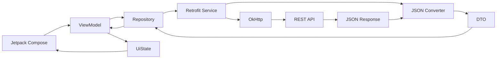
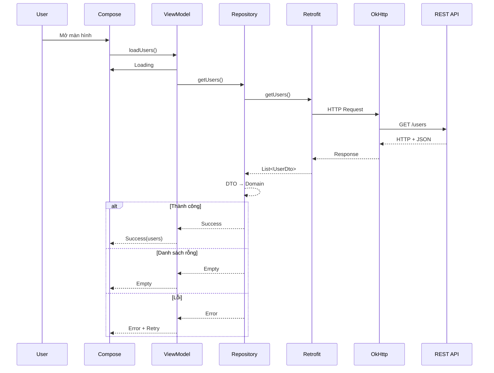
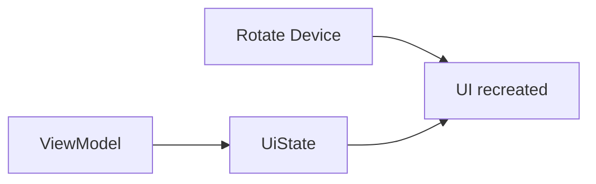

[](https://developer.android.com/codelabs/basic-android-kotlin-compose-getting-data-internet?hl=pt-br&utm_source=chatgpt.com)

# 008 - Retrofit

**Học phần:** 04 - Network, Async and Services
**Module:** Module 07 - Network
**Nhóm nội dung:** REST with Retrofit
**Nguồn roadmap:** Network / REST with Retrofit
**Loại bài:** Network
**Thứ tự trong module:** 008
**Thời lượng gợi ý:** 32 phút

---

## 1. Tóm tắt

**Retrofit** là thư viện giúp Android app giao tiếp với REST API bằng cách mô tả các endpoint dưới dạng **Kotlin interface** thay vì tự xây dựng HTTP request thủ công. Retrofit chịu trách nhiệm biến các annotation như `@GET`, `@POST`, `@Path`, `@Query`, `@Body` thành request và kết hợp với converter để chuyển JSON thành Kotlin object. ([Square Open Source][1])

Trong kiến trúc Android hiện đại, Retrofit thường nằm trong **data layer**:

```text
Compose / Fragment
        ↓
     ViewModel
        ↓
    Repository
        ↓
 Retrofit Service
        ↓
      OkHttp
        ↓
    REST API
        ↓
       JSON
```

Android khuyến nghị các phần khác của ứng dụng truy cập dữ liệu thông qua **Repository**, thay vì để ViewModel/UI phụ thuộc trực tiếp vào network data source. Repository có thể phối hợp cả API, Room, DataStore hoặc các data source khác. ([Android Developers][2])

> **Hiểu ngắn gọn:** Retrofit biến REST API thành các hàm Kotlin mà app có thể gọi gần giống như gọi một function bình thường.

---

## 2. Mục tiêu học tập

Sau bài này, bạn nên có thể:

* Giải thích Retrofit làm nhiệm vụ gì trong Android app.
* Phân biệt vai trò của **Retrofit, OkHttp, Converter, Repository và ViewModel**.
* Khai báo REST endpoint bằng Kotlin interface.
* Sử dụng `suspend fun` để gọi API với Coroutine.
* Parse JSON thành DTO.
* Map DTO thành model dùng cho UI.
* Biểu diễn rõ các trạng thái:

  * Loading
  * Success
  * Empty
  * Error
* Thêm nút Retry.
* Biết Retrofit nên nằm ở đâu trong Clean Architecture/MVVM.
* Biết cách mock HTTP response để test.

---

# 3. Retrofit là gì?

Retrofit cung cấp một lớp abstraction phía trên HTTP client.

Ví dụ backend có endpoint:

```http
GET https://api.example.com/users
```

Thay vì tự:

```text
build URL
↓
create request
↓
open connection
↓
send request
↓
read body
↓
parse JSON
↓
handle error
```

ta có thể khai báo:

```kotlin
interface UserApi {

    @GET("users")
    suspend fun getUsers(): List<UserDto>
}
```

Retrofit có hỗ trợ trực tiếp Kotlin `suspend` từ lâu; với `suspend fun`, lời gọi HTTP được thực hiện bất đồng bộ thông qua cơ chế HTTP call của Retrofit thay vì bắt bạn tự quản lý callback. ([GitHub][3])

---

# 4. Retrofit, OkHttp và Converter khác nhau thế nào?

Đây là phần rất dễ nhầm.

| Thành phần | Vai trò                                            |
| ---------- | -------------------------------------------------- |
| Retrofit   | Biến Kotlin interface thành HTTP API client        |
| OkHttp     | Thực hiện HTTP connection/request/response thực tế |
| Converter  | Chuyển JSON ↔ Kotlin object                        |
| Coroutine  | Quản lý asynchronous code                          |
| Repository | Che giấu nguồn dữ liệu khỏi UI/domain              |
| ViewModel  | Tạo và giữ UI state                                |
| Compose    | Render UI từ state                                 |

OkHttp là HTTP client bên dưới Retrofit. Interceptor của OkHttp có thể quan sát, sửa request/response hoặc thực hiện các hành vi chung như gắn authentication header. ([Square Open Source][4])

### Sơ đồ



---

# 5. Retrofit trong Android Architecture

Một cấu trúc phổ biến:

```text
com.example.app
│
├── data
│   ├── remote
│   │   ├── UserApi.kt
│   │   ├── UserDto.kt
│   │   └── RetrofitProvider.kt
│   │
│   ├── mapper
│   │   └── UserMapper.kt
│   │
│   └── repository
│       └── UserRepositoryImpl.kt
│
├── domain
│   ├── model
│   │   └── User.kt
│   └── repository
│       └── UserRepository.kt
│
└── ui
    └── users
        ├── UserViewModel.kt
        ├── UserUiState.kt
        └── UserScreen.kt
```

Data source nên chỉ làm việc với **một nguồn dữ liệu cụ thể**, trong khi Repository là entry point của data layer. Đây cũng là lý do không nên đưa `UserApi` trực tiếp vào Composable. ([Android Developers][2])

---

# 6. Cài đặt Retrofit

Tại thời điểm bài viết này, repository chính thức của Retrofit công bố **Retrofit 3.0.0**; nhánh 3.x nâng OkHttp cơ sở lên 4.12 và vẫn duy trì khả năng tương thích nhị phân tiến về phía trước với thư viện xây dựng trên Retrofit 2.x. ([GitHub][5])

Có thể dùng Retrofit BOM:

```kotlin
dependencies {

    implementation(
        platform("com.squareup.retrofit2:retrofit-bom:3.0.0")
    )

    implementation("com.squareup.retrofit2:retrofit")

    implementation(
        "com.squareup.retrofit2:converter-kotlinx-serialization"
    )

    implementation(
        "org.jetbrains.kotlinx:kotlinx-serialization-json:<compatible-version>"
    )
}
```

Retrofit đã có converter chính thức cho `kotlinx.serialization` từ Retrofit 2.10.0 với artifact:

```text
com.squareup.retrofit2:converter-kotlinx-serialization
```

([GitHub][3])

> Version `kotlinx-serialization-json` nên đồng bộ với phiên bản Kotlin đang dùng trong project thay vì copy cứng một version cũ từ tutorial.

---

# 7. Cho phép app truy cập Internet

Trong:

```text
AndroidManifest.xml
```

thêm:

```xml
<uses-permission android:name="android.permission.INTERNET" />
```

Không có permission này thì app Android không thể thực hiện network request.

---

# 8. DTO

Giả sử API trả:

```json
[
  {
    "id": 1,
    "name": "An",
    "avatar_url": "https://example.com/avatar/1.jpg"
  }
]
```

Ta định nghĩa DTO:

```kotlin
import kotlinx.serialization.SerialName
import kotlinx.serialization.Serializable

@Serializable
data class UserDto(
    val id: Long,
    val name: String,

    @SerialName("avatar_url")
    val avatarUrl: String?
)
```

`@SerialName` dùng khi tên field JSON không giống naming convention Kotlin. Android cũng minh họa cách map field JSON dạng `img_src` sang property Kotlin camelCase bằng `@SerialName`. ([Android Developers][6])

---

# 9. Khai báo Retrofit API interface

```kotlin
import retrofit2.Response
import retrofit2.http.GET

interface UserApi {

    @GET("users")
    suspend fun getUsers(): Response<List<UserDto>>
}
```

Ở đây:

```text
@GET
```

cho Retrofit biết đây là HTTP `GET`.

```text
"users"
```

là endpoint tương đối.

Nếu:

```text
BASE_URL
https://api.example.com/
```

thì request thực tế sẽ là:

```text
https://api.example.com/users
```

Android Developers cũng sử dụng chính mô hình interface + `@GET` + `suspend fun` trong hướng dẫn Retrofit chính thức. ([Android Developers][6])

---

# 10. Các annotation Retrofit quan trọng

| Annotation | Ví dụ                      | Công dụng       |
| ---------- | -------------------------- | --------------- |
| `@GET`     | `@GET("users")`            | Lấy resource    |
| `@POST`    | `@POST("users")`           | Tạo resource    |
| `@PUT`     | `@PUT("users/{id}")`       | Thay thế/update |
| `@PATCH`   | `@PATCH("users/{id}")`     | Update một phần |
| `@DELETE`  | `@DELETE("users/{id}")`    | Xóa             |
| `@Path`    | `@Path("id")`              | Biến trong URL  |
| `@Query`   | `@Query("page")`           | Query string    |
| `@Body`    | `@Body request`            | Request body    |
| `@Header`  | `@Header("Authorization")` | Header động     |

Ví dụ:

```kotlin
@GET("users/{id}")
suspend fun getUser(
    @Path("id") id: Long
): Response<UserDto>
```

Request:

```text
GET /users/42
```

---

## Query

```kotlin
@GET("users")
suspend fun searchUsers(
    @Query("page") page: Int,
    @Query("limit") limit: Int
): Response<List<UserDto>>
```

Có thể tạo:

```text
GET /users?page=2&limit=20
```

---

## POST + Body

```kotlin
@Serializable
data class CreateUserRequest(
    val name: String
)
```

```kotlin
@POST("users")
suspend fun createUser(
    @Body body: CreateUserRequest
): Response<UserDto>
```

---

# 11. Tạo Retrofit instance

```kotlin
import kotlinx.serialization.json.Json
import okhttp3.MediaType.Companion.toMediaType
import retrofit2.Retrofit
import retrofit2.converter.kotlinx.serialization.asConverterFactory

private const val BASE_URL =
    "https://api.example.com/"

private val json = Json {
    ignoreUnknownKeys = true
}

val retrofit: Retrofit =
    Retrofit.Builder()
        .baseUrl(BASE_URL)
        .addConverterFactory(
            json.asConverterFactory(
                "application/json".toMediaType()
            )
        )
        .build()
```

Sau đó:

```kotlin
val userApi: UserApi =
    retrofit.create(UserApi::class.java)
```

Retrofit Builder cần biết base URL và converter để tạo implementation cho service interface. ([Android Developers][6])

### Lưu ý

`BASE_URL` nên kết thúc bằng:

```text
/
```

Ví dụ:

```text
https://api.example.com/
```

không phải:

```text
https://api.example.com
```

---

# 12. DTO không nên đi thẳng tới UI

Không nên:

```text
Retrofit
   ↓
UserDto
   ↓
Compose
```

Tốt hơn:

```text
Retrofit
   ↓
UserDto
   ↓
Mapper
   ↓
User
   ↓
UserUiModel
   ↓
Compose
```

Ví dụ:

```kotlin
data class User(
    val id: Long,
    val displayName: String,
    val avatarUrl: String?
)
```

Mapper:

```kotlin
fun UserDto.toDomain(): User {
    return User(
        id = id,
        displayName = name.trim(),
        avatarUrl = avatarUrl
    )
}
```

Lợi ích là backend có thể thay đổi field JSON mà không buộc toàn bộ UI phụ thuộc trực tiếp vào schema của server.

---

# 13. Repository

Interface:

```kotlin
interface UserRepository {

    suspend fun getUsers():
        NetworkResult<List<User>>
}
```

Result wrapper:

```kotlin
sealed interface NetworkResult<out T> {

    data class Success<T>(
        val data: T
    ) : NetworkResult<T>

    data object Empty :
        NetworkResult<Nothing>

    data class Error(
        val message: String,
        val code: Int? = null
    ) : NetworkResult<Nothing>
}
```

Implementation:

```kotlin
import java.io.IOException
import kotlinx.serialization.SerializationException

class UserRepositoryImpl(
    private val api: UserApi
) : UserRepository {

    override suspend fun getUsers():
        NetworkResult<List<User>> {

        return try {

            val response = api.getUsers()

            if (!response.isSuccessful) {
                return NetworkResult.Error(
                    message = "HTTP error",
                    code = response.code()
                )
            }

            val users =
                response.body()
                    .orEmpty()
                    .map { it.toDomain() }

            if (users.isEmpty()) {
                NetworkResult.Empty
            } else {
                NetworkResult.Success(users)
            }

        } catch (e: IOException) {

            NetworkResult.Error(
                "Không thể kết nối tới máy chủ"
            )

        } catch (e: SerializationException) {

            NetworkResult.Error(
                "Dữ liệu server không hợp lệ"
            )
        }
    }
}
```

---

# 14. Vì sao phải tách `Loading / Success / Empty / Error`?

Nếu chỉ có:

```kotlin
List<User>
```

thì:

```text
[]
```

có thể mang rất nhiều nghĩa:

```text
đang tải?
hay server trả rỗng?
hay request lỗi?
hay chưa từng request?
```

Do đó state cần explicit.

```kotlin
sealed interface UserUiState {

    data object Loading : UserUiState

    data class Success(
        val users: List<User>
    ) : UserUiState

    data object Empty : UserUiState

    data class Error(
        val message: String
    ) : UserUiState
}
```

Android architecture hướng tới việc để state holder như ViewModel sản xuất **screen UI state**, sau đó UI chỉ render state đó. ([Android Developers][7])

---

# 15. ViewModel

```kotlin
class UserViewModel(
    private val repository: UserRepository
) : ViewModel() {

    private val _uiState =
        MutableStateFlow<UserUiState>(
            UserUiState.Loading
        )

    val uiState =
        _uiState.asStateFlow()

    init {
        loadUsers()
    }

    fun loadUsers() {

        viewModelScope.launch {

            _uiState.value =
                UserUiState.Loading

            when (
                val result =
                    repository.getUsers()
            ) {

                is NetworkResult.Success -> {
                    _uiState.value =
                        UserUiState.Success(
                            result.data
                        )
                }

                NetworkResult.Empty -> {
                    _uiState.value =
                        UserUiState.Empty
                }

                is NetworkResult.Error -> {
                    _uiState.value =
                        UserUiState.Error(
                            result.message
                        )
                }
            }
        }
    }

    fun retry() {
        loadUsers()
    }
}
```

`viewModelScope` tự bị cancel khi ViewModel bị clear. ViewModel cũng giúp giữ screen state qua các configuration change như rotate màn hình. ([Android Developers][8])

### Một điểm quan trọng

Với Retrofit `suspend fun`, thông thường **không cần**:

```kotlin
withContext(Dispatchers.IO) {
    api.getUsers()
}
```

chỉ để thực hiện HTTP request. Retrofit triển khai `suspend` dựa trên asynchronous `Call.enqueue()`. ([GitHub][3])

---

# 16. Jetpack Compose UI

```kotlin
@Composable
fun UserScreen(
    viewModel: UserViewModel
) {

    val state by
        viewModel.uiState
            .collectAsStateWithLifecycle()

    when (val value = state) {

        UserUiState.Loading -> {
            CircularProgressIndicator()
        }

        UserUiState.Empty -> {
            Text("Không có người dùng.")
        }

        is UserUiState.Success -> {

            LazyColumn {

                items(value.users) { user ->

                    Text(
                        text = user.displayName
                    )
                }
            }
        }

        is UserUiState.Error -> {

            Column {

                Text(value.message)

                Button(
                    onClick =
                        viewModel::retry
                ) {
                    Text("Thử lại")
                }
            }
        }
    }
}
```

Android hiện khuyến nghị `collectAsStateWithLifecycle()` để collect Flow/StateFlow trong Compose theo lifecycle; collection tự dừng khi lifecycle không còn đạt trạng thái cần thiết. ([Android Developers][9])

---

# 17. Toàn bộ request flow



---

# 18. Retrofit + OkHttp Interceptor

Ví dụ API yêu cầu:

```http
Authorization: Bearer TOKEN
```

Thay vì viết token ở mọi endpoint:

```kotlin
val authInterceptor =
    Interceptor { chain ->

        val request =
            chain.request()
                .newBuilder()
                .header(
                    "Authorization",
                    "Bearer $token"
                )
                .build()

        chain.proceed(request)
    }
```

```kotlin
val okHttpClient =
    OkHttpClient.Builder()
        .addInterceptor(authInterceptor)
        .build()
```

```kotlin
val retrofit =
    Retrofit.Builder()
        .baseUrl(BASE_URL)
        .client(okHttpClient)
        .addConverterFactory(
            json.asConverterFactory(
                "application/json".toMediaType()
            )
        )
        .build()
```

OkHttp định nghĩa interceptor như một cơ chế có thể quan sát, rewrite hoặc xử lý call trước/sau HTTP request. ([Square Open Source][4])

---

# 19. Debug request

Trong development, Logging Interceptor rất hữu ích để xem:

```text
GET /users
Authorization: ...
HTTP 200
Response time
JSON body
```

Nhưng production cần đặc biệt cẩn thận với:

```text
Authorization
Cookie
API Key
refresh_token
access_token
email
phone
password
```

Không nên log body/header nhạy cảm vào production log.

---

# 20. Phân loại lỗi network

Không nên gom mọi thứ thành:

```text
Something went wrong.
```

Có thể chia:

| Loại             | Ví dụ           | UI                  |
| ---------------- | --------------- | ------------------- |
| Không có kết nối | `IOException`   | Kiểm tra Internet   |
| Unauthorized     | `401`           | Đăng nhập lại       |
| Forbidden        | `403`           | Không có quyền      |
| Not found        | `404`           | Không tìm thấy      |
| Rate limited     | `429`           | Thử lại sau         |
| Server error     | `5xx`           | Server đang gặp lỗi |
| Parse error      | JSON sai schema | Có lỗi dữ liệu      |

---

# 21. Retry

UI:

```text
┌─────────────────────────┐
│ Không thể tải dữ liệu   │
│                         │
│       [ Thử lại ]       │
└─────────────────────────┘
```

Retry không nhất thiết phải tạo lại:

```text
Activity
Fragment
ViewModel
Retrofit
```

thường chỉ cần gọi lại:

```kotlin
viewModel.retry()
```

---

# 22. Offline-first

Retrofit chỉ giải quyết network.

Nếu muốn offline:

```text
              ┌── Retrofit ── REST API
              │
Repository ───┤
              │
              └── Room ───── Local Database
```

Có thể sử dụng flow:

```text
API
 ↓
Repository
 ↓
Room
 ↓
Flow
 ↓
ViewModel
 ↓
Compose
```

Android data-layer guidance cho phép Repository phối hợp nhiều data source như network và local database, đồng thời giữ các nguồn dữ liệu này ẩn khỏi phần còn lại của app. ([Android Developers][2])

---

# 23. Lifecycle và rotate màn hình

Một anti-pattern:

```text
Composable
 ↓
call Retrofit mỗi lần recomposition
```

Điều này có thể dẫn tới request lặp.

Nên:

```text
Composable
 ↓
ViewModel
 ↓
Repository
 ↓
Retrofit
```

ViewModel giữ state qua configuration change như rotate và phù hợp để làm screen-level state holder. ([Android Developers][8])



Không có nghĩa ViewModel tồn tại sau **process death**. Những state tối thiểu cần phục hồi sau process death có thể cần `SavedStateHandle` hoặc load lại từ persistent data source. ([Android Developers][7])

---

# 24. Testing Retrofit

Một công cụ rất phù hợp là **MockWebServer** của OkHttp.

Nó cho phép:

```text
enqueue fake HTTP response
        ↓
Retrofit gửi request
        ↓
MockWebServer trả response
        ↓
assert kết quả
```

MockWebServer được thiết kế để test HTTP client bằng cách script response và kiểm tra request app đã gửi. Có thể mô phỏng cả `500`, response chậm và nhiều tình huống khó tái tạo với server thật. ([GitHub][10])

Ví dụ test logic:

```text
Given:
HTTP 200
[
  {"id":1,"name":"An"}
]

Expect:
NetworkResult.Success
```

Test thứ hai:

```text
Given:
HTTP 500

Expect:
NetworkResult.Error
```

Test thứ ba:

```text
Given:
HTTP 200
[]

Expect:
NetworkResult.Empty
```

---

# 25. Sai lầm thường gặp

### ❌ Gọi Retrofit trực tiếp từ Composable

```kotlin
@Composable
fun Screen() {
    api.getUsers()
}
```

### ✅ Qua ViewModel + Repository

```text
UI → ViewModel → Repository → Retrofit
```

---

### ❌ Trả DTO thẳng tới UI

```text
UserDto → Compose
```

### ✅ Mapping

```text
UserDto
 ↓
Domain Model
 ↓
UiModel
```

---

### ❌ Chỉ có success/error

Nên nghĩ cả:

```text
Loading
Success
Empty
Error
```

---

### ❌ Hard-code token

```kotlin
"Bearer eyJ..."
```

trong source code.

---

### ❌ Log token production

```text
Authorization: Bearer ...
```

---

### ❌ Retry vô hạn

```text
request
 ↓ error
retry
 ↓ error
retry
 ↓ error
...
```

Cần giới hạn retry và cân nhắc backoff.

---

# 26. Production checklist

Trước khi release một network feature sử dụng Retrofit, nên kiểm tra:

* [ ] API dùng HTTPS.
* [ ] `INTERNET` permission đã khai báo.
* [ ] Base URL đúng môi trường production.
* [ ] Token/API key không hard-code trong source.
* [ ] Không log dữ liệu nhạy cảm ở release build.
* [ ] Có timeout hợp lý.
* [ ] Có Loading state.
* [ ] Có Success state.
* [ ] Có Empty state.
* [ ] Có Error state.
* [ ] Có Retry nếu user có thể phục hồi.
* [ ] `401`, `403`, `404`, `429`, `5xx` được xử lý phù hợp.
* [ ] JSON parse error không làm crash app.
* [ ] DTO không phụ thuộc trực tiếp vào UI.
* [ ] Network call nằm sau Repository.
* [ ] State nằm trong ViewModel/state holder phù hợp.
* [ ] Flow trong Compose được collect theo lifecycle.
* [ ] Có test cho `200`.
* [ ] Có test cho response rỗng.
* [ ] Có test cho HTTP error.
* [ ] Có test cho network error.
* [ ] Release build với R8/minify đã được chạy thử.

Retrofit hiện đóng gói sẵn các R8 shrinking/obfuscation rule cho trường hợp thông thường; repo chính thức cũng lưu ý rằng ProGuard truyền thống có thể cần rule thủ công. ([GitHub][11])

---

# 27. Thực hành mini project

## Bài toán: User Explorer

API:

```text
GET /users
```

App cần có bốn trạng thái.

### Loading

```text
┌───────────────────────┐
│                       │
│          ◯            │
│      Đang tải...      │
│                       │
└───────────────────────┘
```

### Success

```text
┌───────────────────────┐
│ Users                 │
│                       │
│ 👤 An                 │
│ 👤 Minh               │
│ 👤 Lan                │
│                       │
└───────────────────────┘
```

### Empty

```text
┌───────────────────────┐
│                       │
│ Không có người dùng   │
│                       │
└───────────────────────┘
```

### Error

```text
┌───────────────────────┐
│                       │
│ Không thể tải dữ liệu │
│                       │
│      [ Thử lại ]      │
│                       │
└───────────────────────┘
```

---

# 28. Lộ trình thực hành 32 phút

|  Thời gian | Công việc                             |
| ---------: | ------------------------------------- |
|   0–4 phút | Hiểu Retrofit/OkHttp/Converter        |
|   4–8 phút | Thêm dependency + Internet permission |
|  8–12 phút | Tạo DTO                               |
| 12–16 phút | Tạo `UserApi`                         |
| 16–20 phút | Tạo Retrofit instance                 |
| 20–24 phút | Repository + mapping                  |
| 24–28 phút | ViewModel + UiState                   |
| 28–30 phút | Error + Retry                         |
| 30–32 phút | Screenshot + README                   |

---

# 29. Artifact cho portfolio

Một artifact nhỏ nhưng khá đầy đủ:

```text
retrofit-user-demo/
│
├── data/
│   ├── UserApi.kt
│   ├── UserDto.kt
│   └── UserRepository.kt
│
├── ui/
│   ├── UserUiState.kt
│   ├── UserViewModel.kt
│   └── UserScreen.kt
│
├── screenshots/
│   ├── loading.png
│   ├── success.png
│   └── error.png
│
└── README.md
```

README có thể mô tả:

```markdown
# Retrofit User Demo

Android demo demonstrating:

- Retrofit REST API
- Kotlin Coroutines
- kotlinx.serialization
- Repository Pattern
- StateFlow
- Jetpack Compose
- Loading / Success / Empty / Error
- Retry
- Mock HTTP testing
```

---

# 30. Câu hỏi tự kiểm tra

**1. Retrofit có phải HTTP engine không?**

Không hoàn toàn. Retrofit cung cấp abstraction/service interface; HTTP request thực tế được thực hiện thông qua OkHttp.

**2. Retrofit có tự parse JSON không?**

Retrofit dùng `ConverterFactory`, chẳng hạn `kotlinx.serialization`, Moshi hoặc Gson.

**3. Có nên gọi Retrofit từ Compose không?**

Không nên. Thông thường:

```text
Compose
 ↓
ViewModel
 ↓
Repository
 ↓
Retrofit
```

**4. `suspend fun` có cần callback không?**

Không.

```kotlin
suspend fun getUsers()
```

cho phép sử dụng coroutine trực tiếp. Retrofit hỗ trợ mô hình này chính thức. ([GitHub][3])

**5. Rotate màn hình có nên request lại ngay lập tức không?**

Không nhất thiết. ViewModel có thể giữ screen state qua configuration change. ([Android Developers][8])

---

# 31. Checklist hoàn thành bài

* [ ] Giải thích được Retrofit bằng lời của mình.
* [ ] Phân biệt được Retrofit và OkHttp.
* [ ] Biết Converter làm gì.
* [ ] Tạo được Retrofit instance.
* [ ] Tạo được API interface.
* [ ] Sử dụng được `@GET`.
* [ ] Sử dụng được `@Path`.
* [ ] Sử dụng được `@Query`.
* [ ] Sử dụng được `@Body`.
* [ ] Sử dụng được `suspend fun`.
* [ ] JSON được map thành DTO.
* [ ] DTO được map sang model app.
* [ ] Có Repository.
* [ ] Có ViewModel.
* [ ] Có `Loading`.
* [ ] Có `Success`.
* [ ] Có `Empty`.
* [ ] Có `Error`.
* [ ] Có Retry.
* [ ] Biết cách mock HTTP response.
* [ ] Có screenshot hoặc README để đưa vào portfolio.

---

# 32. Ghi nhớ nhanh

```text
Retrofit
   │
   │ định nghĩa API bằng interface
   ▼
OkHttp
   │
   │ HTTP request
   ▼
Server
   │
   │ JSON response
   ▼
Converter
   │
   ▼
DTO
   │
   ▼
Repository
   │
   ▼
Domain / UI Model
   │
   ▼
ViewModel
   │
   ▼
UiState
   │
   ▼
Compose
```

### Công thức cần nhớ

```text
REST API
+ Retrofit
+ OkHttp
+ Converter
+ Coroutine
+ Repository
+ StateFlow
+ UiState
= Network layer Android dễ maintain
```

**Điểm quan trọng nhất của bài:** học Retrofit không chỉ là biết viết `@GET`. Trong app production, phần quan trọng hơn là đưa Retrofit đúng vào **data layer**, chuyển network response thành model phù hợp và biến mọi trạng thái mạng thành **UI state rõ ràng, có thể test và phục hồi được**. Android hiện cũng khuyến nghị Repository làm entry point của data layer, ViewModel làm screen-level state holder và lifecycle-aware collection cho Flow trong Compose. ([Android Developers][2])

[1]: https://square.github.io/retrofit/?utm_source=chatgpt.com "Introduction | Retrofit"
[2]: https://developer.android.com/topic/architecture/data-layer "Data layer  |  App architecture  |  Android Developers"
[3]: https://github.com/square/retrofit/blob/master/CHANGELOG.md?utm_source=chatgpt.com "retrofit/CHANGELOG.md at trunk · lysine-dev/retrofit"
[4]: https://square.github.io/okhttp/features/interceptors/?utm_source=chatgpt.com "Interceptors - OkHttp"
[5]: https://github.com/square/retrofit/blob/trunk/CHANGELOG.md?utm_source=chatgpt.com "retrofit/CHANGELOG.md at trunk · lysine-dev/retrofit"
[6]: https://developer.android.com/codelabs/basic-android-kotlin-compose-getting-data-internet "Get data from the internet  |  Android Developers"
[7]: https://developer.android.com/topic/architecture/ui-layer/stateholders?utm_source=chatgpt.com "State holders and UI state | App architecture"
[8]: https://developer.android.com/topic/libraries/architecture/viewmodel?utm_source=chatgpt.com "ViewModel overview | App architecture"
[9]: https://developer.android.com/topic/libraries/architecture/coroutines?utm_source=chatgpt.com "Use Kotlin coroutines with lifecycle-aware components"
[10]: https://github.com/square/okhttp/blob/master/mockwebserver/README.md?utm_source=chatgpt.com "okhttp/mockwebserver/README.md at main"
[11]: https://github.com/square/retrofit?client_id=466047879.1778716802&session_id=1778716802&utm_source=chatgpt.com "square/retrofit: A type-safe HTTP client for Android and the JVM"
