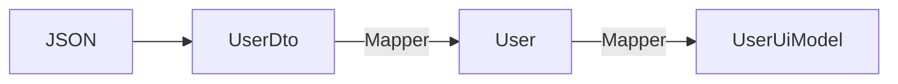
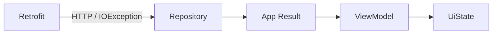
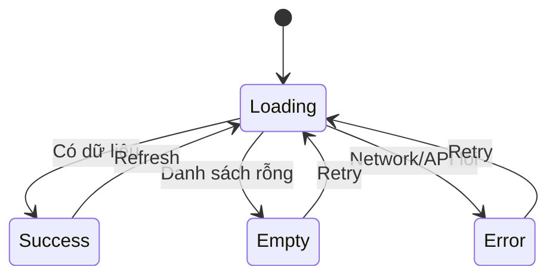
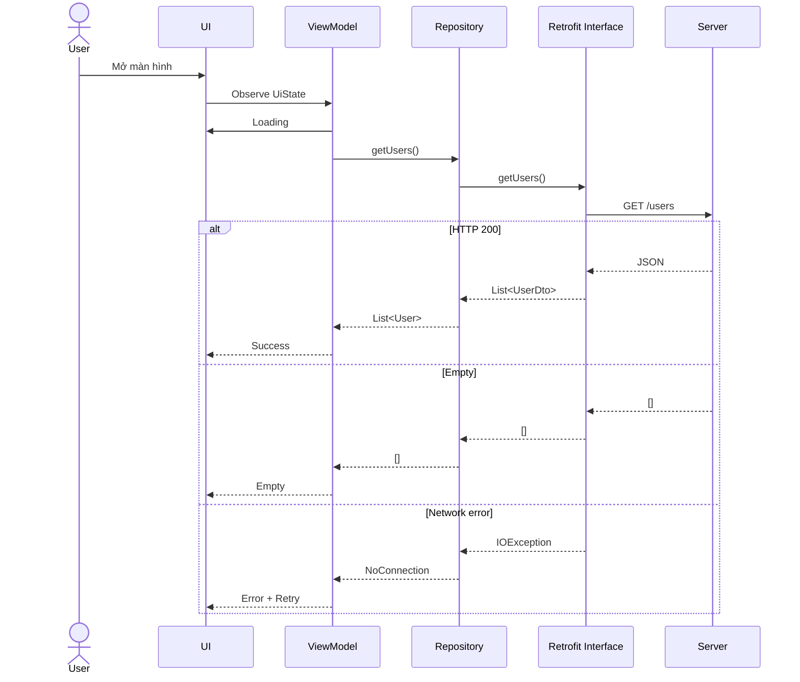
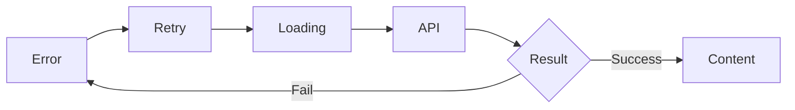
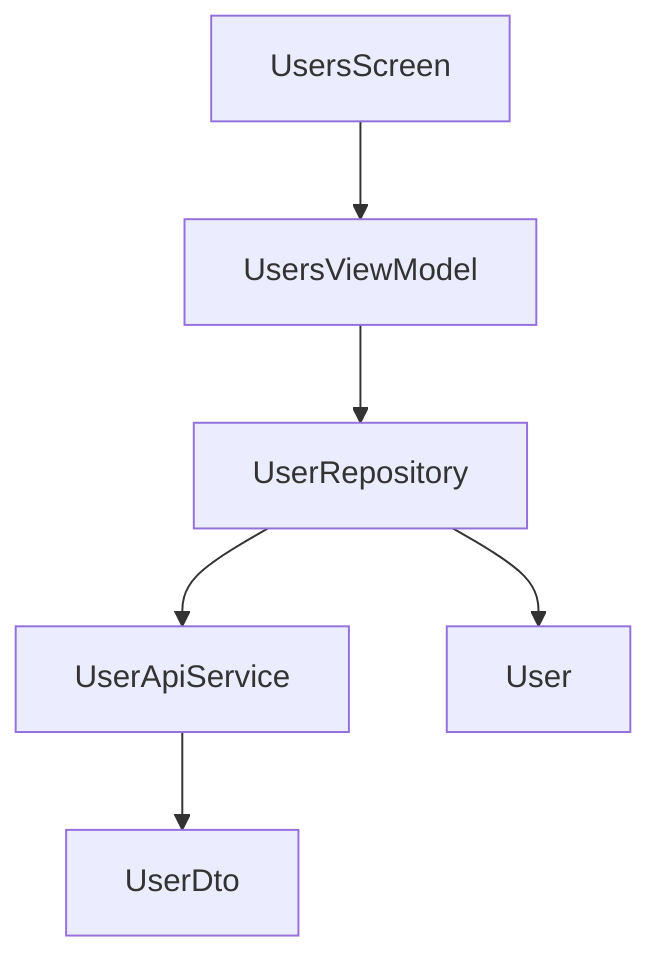

[](https://medium.com/%40dimasoktanugraha47/android-consuming-api-with-basic-of-retrofit-for-android-compose-cd7e909cc5b2?utm_source=chatgpt.com)

# 009 - Retrofit Interface

**Học phần:** 04 - Network, Async and Services
**Module:** Module 07 - Network
**Nhóm nội dung:** REST with Retrofit
**Nguồn roadmap:** Network / REST with Retrofit
**Loại bài:** Network
**Thứ tự trong module:** 009
**Thời lượng gợi ý:** 32 phút

---

## 1. Tóm tắt

**Retrofit Interface** là nơi ứng dụng Android mô tả các endpoint của REST API dưới dạng **Kotlin interface**.

Thay vì tự tạo HTTP request, nối URL, thêm query parameter rồi parse response thủ công, ta khai báo một contract như:

```kotlin
interface UserApiService {

    @GET("users")
    suspend fun getUsers(): List<UserDto>

    @GET("users/{id}")
    suspend fun getUser(
        @Path("id") id: Long
    ): UserDto
}
```

Retrofit đọc các annotation như `@GET`, `@POST`, `@Path`, `@Query`, `@Body`... và tạo implementation của interface để thực hiện HTTP request. Đây chính là ý tưởng cốt lõi của Retrofit: **biến HTTP API thành một Java/Kotlin interface type-safe**. ([Square Open Source][1])

Trong kiến trúc Android hiện đại, Retrofit Interface nên nằm trong **data/network layer**, phía sau `Repository`, thay vì được gọi trực tiếp từ Compose, Fragment hay Activity. Android Architecture hiện cũng khuyến nghị UI/ViewModel truy cập dữ liệu thông qua repository thay vì phụ thuộc trực tiếp vào network data source. ([Android Developers][2])

---

## 2. Mục tiêu học tập

Sau bài này, anh nên có thể:

* Giải thích được **Retrofit Interface là gì**.
* Khai báo endpoint bằng `@GET`, `@POST`, `@PUT`, `@PATCH`, `@DELETE`.
* Sử dụng `@Path`, `@Query`, `@Body`, `@Header`.
* Hiểu sự khác nhau giữa:

```kotlin
suspend fun getUser(): UserDto
```

và:

```kotlin
suspend fun getUser(): Response<UserDto>
```

* Tách `DTO` khỏi domain/UI model.
* Đưa Retrofit Interface vào đúng vị trí trong kiến trúc.
* Chuyển network response thành:

  * Loading
  * Success
  * Empty
  * Error
  * Retry
* Biết cách mock API để test Repository/ViewModel.
* Có một mini artifact đủ tốt để đưa vào portfolio.

---

# 3. Retrofit Interface là gì?

Một Retrofit Interface có thể được hiểu đơn giản là:

> **Bản hợp đồng giữa ứng dụng Android và REST API.**

Ví dụ backend có endpoint:

```text
GET https://api.example.com/users/10
```

Ta mô tả nó bằng Kotlin:

```kotlin
interface UserApiService {

    @GET("users/{id}")
    suspend fun getUser(
        @Path("id") id: Long
    ): UserDto
}
```

Retrofit chịu trách nhiệm biến lời gọi:

```kotlin
api.getUser(10)
```

thành HTTP request tương ứng.

---

# 4. Retrofit Interface nằm ở đâu trong app?

Một cấu trúc nên hướng tới:

```mermaid
flowchart LR
    UI["Compose / Fragment"]
    VM["ViewModel"]
    REPO["Repository"]
    REMOTE["Remote Data Source"]
    API["Retrofit Interface"]
    RETROFIT["Retrofit + Converter"]
    HTTP["OkHttp"]
    SERVER["REST API"]

    UI -->|User Event| VM
    VM --> REPO
    REPO --> REMOTE
    REMOTE --> API
    API --> RETROFIT
    RETROFIT --> HTTP
    HTTP --> SERVER

    SERVER --> HTTP
    HTTP --> RETROFIT
    RETROFIT --> API
    API --> REMOTE
    REMOTE --> REPO
    REPO --> VM
    VM -->|UiState| UI
```



Android Architecture mô tả data layer gồm các repository và data source; repository là entry point để những layer khác truy cập dữ liệu. Với ứng dụng đủ lớn, network API nên được xem như một remote data source nằm phía sau repository. ([Android Developers][2])

### Không nên

```text
Composable
    ↓
Retrofit
    ↓
API
```

### Nên

```text
Composable
    ↓
ViewModel
    ↓
Repository
    ↓
Retrofit Interface
    ↓
REST API
```

---

# 5. Cấu tạo của một Retrofit Interface

Ví dụ:

```kotlin
interface ProductApiService {

    @GET("products/{id}")
    suspend fun getProduct(
        @Path("id") productId: Long,
        @Query("currency") currency: String
    ): Response<ProductDto>
}
```

Có thể chia thành bốn thành phần:

```text
@GET
 ↓
HTTP Method

"products/{id}"
 ↓
Endpoint

@Path / @Query
 ↓
Request Parameters

Response<ProductDto>
 ↓
Response Type
```

---

# 6. Các annotation quan trọng

| Annotation  | Công dụng                | Ví dụ             |
| ----------- | ------------------------ | ----------------- |
| `@GET`      | Đọc dữ liệu              | `GET /users`      |
| `@POST`     | Tạo dữ liệu              | `POST /users`     |
| `@PUT`      | Thay thế/update resource | `PUT /users/1`    |
| `@PATCH`    | Update một phần          | `PATCH /users/1`  |
| `@DELETE`   | Xóa                      | `DELETE /users/1` |
| `@Path`     | Thay biến trong URL      | `/users/{id}`     |
| `@Query`    | Query string             | `?page=2`         |
| `@QueryMap` | Nhiều query              | filter/sort       |
| `@Body`     | Request body             | JSON              |
| `@Header`   | Header động              | Authorization     |
| `@Headers`  | Header cố định           | Content-Type      |
| `@Url`      | URL động                 | URL runtime       |
| `@Field`    | Form field               | Form submit       |
| `@Part`     | Multipart                | Upload file       |

Retrofit sử dụng các annotation trên method và parameter để tạo request tương ứng. ([Square Open Source][3])

---

# 7. `@GET`

Giả sử server:

```http
GET /users
```

Interface:

```kotlin
interface UserApiService {

    @GET("users")
    suspend fun getUsers(): List<UserDto>
}
```

Sử dụng:

```kotlin
val users = api.getUsers()
```

Retrofit thực hiện request bất đồng bộ khi sử dụng Kotlin `suspend`. Coroutine support đã được tích hợp trực tiếp vào Retrofit service interface; Retrofit thực hiện call bất đồng bộ phía sau thay vì yêu cầu developer tự gọi `enqueue()`. ([GitHub][4])

---

# 8. `@Path`

Server:

```http
GET /users/42
```

Interface:

```kotlin
@GET("users/{id}")
suspend fun getUser(
    @Path("id") id: Long
): UserDto
```

Gọi:

```kotlin
api.getUser(42)
```

Kết quả:

```text
/users/42
```

Có thể hình dung:

```text
"users/{id}"
        │
        ▼
@Path("id") id = 42
        │
        ▼
"users/42"
```

---

# 9. `@Query`

Ví dụ API:

```http
GET /users?page=2&limit=20
```

Retrofit:

```kotlin
@GET("users")
suspend fun getUsers(
    @Query("page") page: Int,
    @Query("limit") limit: Int
): List<UserDto>
```

Gọi:

```kotlin
api.getUsers(
    page = 2,
    limit = 20
)
```

---

# 10. `@Body`

Ví dụ tạo user:

```http
POST /users
```

Body:

```json
{
  "name": "An",
  "email": "an@example.com"
}
```

DTO:

```kotlin
data class CreateUserRequestDto(
    val name: String,
    val email: String
)
```

Retrofit Interface:

```kotlin
@POST("users")
suspend fun createUser(
    @Body request: CreateUserRequestDto
): Response<UserDto>
```

Gọi:

```kotlin
api.createUser(
    CreateUserRequestDto(
        name = "An",
        email = "an@example.com"
    )
)
```

---

# 11. `@Header`

Một API cần Bearer Token thường nhận header:

```http
Authorization: Bearer eyJ...
```

Retrofit:

```kotlin
@GET("profile")
suspend fun getProfile(
    @Header("Authorization") authorization: String
): ProfileDto
```

Gọi:

```kotlin
api.getProfile(
    authorization = "Bearer $token"
)
```

Trong production, nếu gần như mọi request đều dùng cùng token, thường nên để authentication handling ở network layer/interceptor thay vì truyền token bằng tay ở hàng chục method.

---

# 12. Một Retrofit Interface hoàn chỉnh

```kotlin
interface UserApiService {

    @GET("users")
    suspend fun getUsers(
        @Query("page") page: Int = 1,
        @Query("limit") limit: Int = 20
    ): Response<List<UserDto>>

    @GET("users/{id}")
    suspend fun getUser(
        @Path("id") id: Long
    ): Response<UserDto>

    @POST("users")
    suspend fun createUser(
        @Body request: CreateUserRequestDto
    ): Response<UserDto>

    @PATCH("users/{id}")
    suspend fun updateUser(
        @Path("id") id: Long,
        @Body request: UpdateUserRequestDto
    ): Response<UserDto>

    @DELETE("users/{id}")
    suspend fun deleteUser(
        @Path("id") id: Long
    ): Response<Unit>
}
```

Đây gần như chính là **bản mô tả API client** của ứng dụng.

---

# 13. Retrofit tạo implementation của interface như thế nào?

Ta không viết:

```kotlin
class UserApiServiceImpl : UserApiService
```

Retrofit tạo implementation:

```kotlin
val retrofit = Retrofit.Builder()
    .baseUrl("https://api.example.com/")
    .addConverterFactory(
        GsonConverterFactory.create()
    )
    .build()

val userApi = retrofit.create(
    UserApiService::class.java
)
```

Sau đó:

```kotlin
userApi.getUsers()
```

Retrofit đọc metadata của `UserApiService`, tạo HTTP request và dùng converter để biến response body thành object Kotlin/Java. Đó cũng là flow được Android Developers sử dụng khi hướng dẫn Retrofit trong data layer. ([Android Developers][5])

---

# 14. DTO không nên là UI Model

Đây là một nguyên tắc rất quan trọng.

Giả sử server trả:

```json
{
  "id": 10,
  "firstName": "An",
  "lastName": "Khanh",
  "avatarUrl": null
}
```

DTO:

```kotlin
data class UserDto(
    val id: Long,
    val firstName: String,
    val lastName: String,
    val avatarUrl: String?
)
```

Không nên đưa trực tiếp:

```text
UserDto → UI
```

Nên:



Domain model:

```kotlin
data class User(
    val id: Long,
    val fullName: String,
    val avatar: String?
)
```

Mapper:

```kotlin
fun UserDto.toDomain(): User {
    return User(
        id = id,
        fullName = "$firstName $lastName",
        avatar = avatarUrl
    )
}
```

Android Architecture cũng khuyến nghị cân nhắc model riêng cho từng layer ở những ứng dụng phức tạp, ví dụ network model được map thành model đơn giản hơn mà app thực sự cần. ([Android Developers][6])

### Lợi ích

Nếu backend đổi:

```text
firstName + lastName
```

thành:

```text
displayName
```

ta chủ yếu sửa:

```text
DTO
+
Mapper
```

thay vì sửa toàn bộ:

```text
API
Repository
ViewModel
Compose
Navigation
Tests
```

---

# 15. `UserDto` hay `Response<UserDto>`?

Retrofit hỗ trợ Kotlin `suspend` theo hai kiểu phổ biến. ([GitHub][7])

## Kiểu 1 — trả body trực tiếp

```kotlin
@GET("users/{id}")
suspend fun getUser(
    @Path("id") id: Long
): UserDto
```

Code rất gọn:

```kotlin
val user = api.getUser(10)
```

Nếu HTTP response không thành công, Retrofit có thể đưa lỗi ra dạng `HttpException`; lỗi transport/network cũng được truyền thành exception. ([GitHub][7])

---

## Kiểu 2 — trả `Response<T>`

```kotlin
@GET("users/{id}")
suspend fun getUser(
    @Path("id") id: Long
): Response<UserDto>
```

Repository có thể kiểm tra:

```kotlin
val response = api.getUser(10)

if (response.isSuccessful) {
    val user = response.body()
} else {
    val code = response.code()
}
```

### So sánh

| Kiểu                | Ưu điểm                          | Nhược điểm                      |
| ------------------- | -------------------------------- | ------------------------------- |
| `UserDto`           | Code gọn                         | HTTP error đi qua exception     |
| `Response<UserDto>` | Truy cập status code/header/body | Repository phải xử lý nhiều hơn |

Không có một lựa chọn bắt buộc cho mọi dự án. Điều quan trọng hơn là **Repository phải biến chúng thành failure model nhất quán**, thay vì để UI hiểu Retrofit.

---

# 16. Không để exception Retrofit tràn vào UI

Không nên:

```text
Compose
   ↓
HttpException
IOException
SocketTimeoutException
```

UI không nên cần biết:

```kotlin
retrofit2.HttpException
```

hay:

```kotlin
java.io.IOException
```

Thay vào đó:



Android data-layer guidance cũng cho phép mô hình hóa kết quả bằng `Result<T>` hoặc bằng error abstraction của ứng dụng để các failure đã biết được thể hiện rõ ràng. ([Android Developers][2])

---

# 17. Tạo `NetworkResult`

Ví dụ:

```kotlin
sealed interface NetworkResult<out T> {

    data class Success<T>(
        val data: T
    ) : NetworkResult<T>

    data class Error(
        val message: String,
        val code: Int? = null
    ) : NetworkResult<Nothing>

    data object NoConnection :
        NetworkResult<Nothing>
}
```

Repository:

```kotlin
class UserRepository(
    private val api: UserApiService
) {

    suspend fun getUsers(): NetworkResult<List<User>> {
        return try {

            val response = api.getUsers()

            if (response.isSuccessful) {

                val body = response.body().orEmpty()

                NetworkResult.Success(
                    body.map { it.toDomain() }
                )

            } else {

                NetworkResult.Error(
                    code = response.code(),
                    message = "Không thể tải người dùng"
                )
            }

        } catch (e: IOException) {

            NetworkResult.NoConnection
        }
    }
}
```

Bây giờ ViewModel không cần biết Retrofit tồn tại.

---

# 18. Từ network result sang UI State

UI nên được thiết kế state trước khi viết màn hình.

```kotlin
sealed interface UsersUiState {

    data object Loading :
        UsersUiState

    data class Success(
        val users: List<User>
    ) : UsersUiState

    data object Empty :
        UsersUiState

    data class Error(
        val message: String,
        val canRetry: Boolean = true
    ) : UsersUiState
}
```

Luồng:



Android khuyến nghị UI state là snapshot mô tả chính xác những gì UI phải render và ViewModel/state holder chịu trách nhiệm tạo state đó. UDF giúp state đi xuống UI và event đi ngược lên ViewModel. ([Android Developers][8])

---

# 19. ViewModel

```kotlin
class UsersViewModel(
    private val repository: UserRepository
) : ViewModel() {

    private val _uiState =
        MutableStateFlow<UsersUiState>(
            UsersUiState.Loading
        )

    val uiState =
        _uiState.asStateFlow()

    init {
        loadUsers()
    }

    fun retry() {
        loadUsers()
    }

    private fun loadUsers() {

        viewModelScope.launch {

            _uiState.value =
                UsersUiState.Loading

            when (
                val result =
                    repository.getUsers()
            ) {

                is NetworkResult.Success -> {

                    _uiState.value =
                        if (result.data.isEmpty()) {
                            UsersUiState.Empty
                        } else {
                            UsersUiState.Success(
                                result.data
                            )
                        }
                }

                is NetworkResult.Error -> {

                    _uiState.value =
                        UsersUiState.Error(
                            result.message
                        )
                }

                NetworkResult.NoConnection -> {

                    _uiState.value =
                        UsersUiState.Error(
                            message =
                                "Không có kết nối mạng"
                        )
                }
            }
        }
    }
}
```

---

# 20. Compose UI

```kotlin
@Composable
fun UsersScreen(
    viewModel: UsersViewModel
) {

    val state by viewModel.uiState
        .collectAsStateWithLifecycle()

    when (val current = state) {

        UsersUiState.Loading -> {
            CircularProgressIndicator()
        }

        UsersUiState.Empty -> {
            Text("Không có người dùng")
        }

        is UsersUiState.Success -> {
            UsersList(
                users = current.users
            )
        }

        is UsersUiState.Error -> {
            ErrorContent(
                message = current.message,
                onRetry = viewModel::retry
            )
        }
    }
}
```

Android Architecture hiện khuyến nghị lifecycle-aware state collection như `collectAsStateWithLifecycle()` cho Compose UI. ([Android Developers][6])

---

# 21. Luồng hoàn chỉnh khi người dùng mở màn hình



---

# 22. Retrofit Interface và Lifecycle

Một lỗi kiến trúc phổ biến là gọi API trực tiếp từ Composable:

```kotlin
@Composable
fun UsersScreen() {

    api.getUsers() // ❌
}
```

Composable có thể recompose nhiều lần.

Ta không muốn:

```text
Recomposition
    ↓
GET /users

Recomposition
    ↓
GET /users

Recomposition
    ↓
GET /users
```

Thay vào đó:

```text
Composable
    ↓
ViewModel
    ↓
Repository
    ↓
Retrofit
```

`ViewModel` phù hợp để giữ screen-level state và tự sống qua configuration changes như rotation khi navigation destination vẫn còn tồn tại. ([Android Developers][8])

---

# 23. Khi xoay màn hình

Kiến trúc tốt:

```text
        Rotate Device
             │
             ▼
       UI recreated
             │
             ▼
       ViewModel remains
             │
             ▼
      UiState vẫn còn
```

Thay vì:

```text
Rotate
 ↓
Call API
 ↓
Rotate
 ↓
Call API
 ↓
Rotate
 ↓
Call API
```

Đây là một trong các lý do không nên đặt network logic trực tiếp trong Activity/Fragment/Composable.

---

# 24. Retry

Retry là một phần của UX chứ không chỉ là network implementation.

```kotlin
fun retry() {
    loadUsers()
}
```

UI:

```text
┌───────────────────────────┐
│     Không có kết nối      │
│                           │
│      [ Thử lại ]          │
└───────────────────────────┘
```

Flow:



---

# 25. Offline note

Nếu ứng dụng cần offline-first, Retrofit không nên trở thành source of truth duy nhất.

Ví dụ:

```text
             Repository
            /          \
           /            \
          ▼              ▼
      Room DB        Retrofit API
          │              │
          └──────┬───────┘
                 ▼
          Single Source
           of Truth
```

Android Architecture nhấn mạnh repository nên xác định một **single source of truth** cho dữ liệu; trong ứng dụng offline-first, database thường có thể đảm nhận vai trò đó trong khi network cập nhật dữ liệu phía sau. ([Android Developers][2])

---

# 26. Testing Retrofit Interface

Có ba mức test đáng chú ý.

## Mức 1 — Fake API

Retrofit Interface thực chất là Kotlin interface nên ta có thể tạo fake.

```kotlin
class FakeUserApiService :
    UserApiService {

    override suspend fun getUsers(
        page: Int,
        limit: Int
    ): Response<List<UserDto>> {

        return Response.success(
            listOf(
                UserDto(
                    id = 1,
                    firstName = "An",
                    lastName = "Khanh",
                    avatarUrl = null
                )
            )
        )
    }

    // Các method còn lại...
}
```

Test Repository:

```kotlin
@Test
fun getUsers_returnsSuccess() = runTest {

    val repository =
        UserRepository(
            FakeUserApiService()
        )

    val result =
        repository.getUsers()

    assertTrue(
        result is NetworkResult.Success
    )
}
```

Android Architecture khuyến nghị test ít nhất ViewModel và data layer, đồng thời ưu tiên fake khi thích hợp. ([Android Developers][6])

---

## Mức 2 — Mock HTTP server

Dùng mock server để kiểm tra:

```text
Retrofit
   ↓
GET /users?page=1
   ↓
Mock Server
   ↓
200 JSON
```

Ta có thể kiểm tra interface có tạo đúng:

```http
GET /users?page=1&limit=20
```

hay không.

---

## Mức 3 — ViewModel test

Kiểm tra state:

```text
Loading
   ↓
Success
```

hoặc:

```text
Loading
   ↓
Error
   ↓
Retry
   ↓
Loading
   ↓
Success
```

---

# 27. Những lỗi thường gặp

### 1. Gọi Retrofit trực tiếp từ UI

```kotlin
api.getUsers()
```

trong Composable.

**Vấn đề:** UI bị coupling với data source.

---

### 2. Cho DTO chạy xuyên toàn app

```text
API
 ↓
UserDto
 ↓
Repository
 ↓
ViewModel
 ↓
Compose
```

Nên:

```text
API
 ↓
UserDto
 ↓
Mapper
 ↓
User
 ↓
ViewModel
```

---

### 3. Không có Error State

Chỉ thiết kế:

```text
Loading → Success
```

nhưng thực tế còn:

```text
Loading
 ├── Success
 ├── Empty
 ├── Timeout
 ├── Offline
 ├── Unauthorized
 ├── Server Error
 └── Invalid Response
```

---

### 4. Không có Retry

```text
Error
 ↓
Dead end
```

sẽ tạo UX kém.

Nên:

```text
Error
 ↓
Retry
 ↓
Loading
```

---

### 5. Để exception technical lên UI

Không nên:

```text
java.net.SocketTimeoutException
```

hiển thị trực tiếp cho người dùng.

Nên map thành:

```text
"Không thể kết nối máy chủ.
Vui lòng thử lại."
```

---

### 6. Nhầm `suspend` và `Call<T>`

Nếu dùng coroutine style, thông thường interface sẽ là:

```kotlin
suspend fun getUsers(): List<UserDto>
```

hoặc:

```kotlin
suspend fun getUsers():
    Response<List<UserDto>>
```

Không cần thiết kế theo kiểu:

```kotlin
suspend fun getUsers():
    Call<List<UserDto>>
```

Retrofit coroutine integration vốn đã biến `suspend` service method thành call bất đồng bộ phía sau. ([GitHub][4])

---

# 28. Ảnh hưởng đến production

| Khía cạnh           | Retrofit Interface ảnh hưởng thế nào?              |
| ------------------- | -------------------------------------------------- |
| **UX**              | Request lỗi phải dẫn tới Error/Retry rõ ràng       |
| **Stability**       | Timeout, offline, invalid response phải được xử lý |
| **Maintainability** | API contract tập trung một chỗ                     |
| **Testing**         | Interface dễ fake/mock                             |
| **Security**        | Token/header cần được quản lý đúng                 |
| **Performance**     | Tránh request lặp do lifecycle/recomposition       |
| **Release risk**    | Backend đổi endpoint/JSON có thể phá DTO/interface |

Điểm quan trọng là Retrofit Interface không phải chỉ là:

```text
@GET + suspend
```

mà là biên giới giữa:

```text
Backend contract
       │
       ▼
Android data layer
```

---

# 29. Cấu trúc package gợi ý

```text
com.example.app
│
├── data
│   │
│   ├── remote
│   │   ├── UserApiService.kt
│   │   │
│   │   └── dto
│   │       ├── UserDto.kt
│   │       └── CreateUserRequestDto.kt
│   │
│   ├── mapper
│   │   └── UserMapper.kt
│   │
│   └── repository
│       └── UserRepository.kt
│
├── domain
│   └── model
│       └── User.kt
│
└── ui
    └── users
        ├── UsersViewModel.kt
        ├── UsersUiState.kt
        └── UsersScreen.kt
```

Quan hệ dependency:



---

# 30. Thực hành — Mini Users App

## Yêu cầu

Tạo một màn hình:

```text
Users
────────────────────

👤 Nguyễn Văn A
👤 Trần Văn B
👤 Lê Văn C
```

API giả:

```http
GET /users
```

Response:

```json
[
  {
    "id": 1,
    "firstName": "Nguyen",
    "lastName": "A"
  },
  {
    "id": 2,
    "firstName": "Tran",
    "lastName": "B"
  }
]
```

---

## Bước 1 — DTO

```kotlin
data class UserDto(
    val id: Long,
    val firstName: String,
    val lastName: String
)
```

---

## Bước 2 — Retrofit Interface

```kotlin
interface UserApiService {

    @GET("users")
    suspend fun getUsers():
        Response<List<UserDto>>
}
```

---

## Bước 3 — Domain model

```kotlin
data class User(
    val id: Long,
    val name: String
)
```

---

## Bước 4 — Mapper

```kotlin
fun UserDto.toDomain(): User =
    User(
        id = id,
        name = "$firstName $lastName"
    )
```

---

## Bước 5 — Repository

```text
Retrofit
   ↓
UserDto
   ↓
Mapper
   ↓
User
```

Repository phải xử lý:

```text
200      → Success
[]       → Empty
4xx/5xx  → Error
Offline  → Error
```

---

## Bước 6 — ViewModel

State:

```text
Loading
Success
Empty
Error
```

---

## Bước 7 — Compose

```text
          UsersScreen
              │
      ┌───────┼────────┐
      ▼       ▼        ▼
   Loading  Success   Error
              │         │
              ▼         ▼
            List      Retry
```

---

# 31. Bài tập

Xây dựng hoặc mock endpoint:

```http
GET /posts
```

Interface tối thiểu:

```kotlin
interface PostApiService {

    @GET("posts")
    suspend fun getPosts():
        Response<List<PostDto>>
}
```

Ứng dụng phải thể hiện được đầy đủ:

```text
          ┌─────────┐
          │ Loading │
          └────┬────┘
               │
        ┌──────┼─────────┐
        ▼      ▼         ▼
    Success   Empty     Error
                         │
                         ▼
                       Retry
                         │
                         └────→ Loading
```

---

# 32. Artifact đưa vào Portfolio

Một repository nhỏ có thể là:

```text
retrofit-users-demo/
│
├── README.md
├── screenshots/
│   ├── loading.png
│   ├── success.png
│   └── error-retry.png
│
└── app/
    └── src/main/java/...
```

README nên thể hiện rõ:

```text
Compose
   ↓
ViewModel
   ↓
Repository
   ↓
Retrofit Interface
   ↓
REST API
```

và có:

* Retrofit Interface.
* DTO → Domain mapper.
* `UiState`.
* Error handling.
* Retry.
* Fake hoặc test.
* Screenshot Loading/Success/Error.

Artifact này thể hiện nhiều năng lực hơn việc chỉ viết một hàm `@GET`.

---

# 33. Kế hoạch học trong 32 phút

|  Thời gian | Nội dung                          |
| ---------: | --------------------------------- |
|   0–5 phút | Retrofit Interface là gì          |
|  5–10 phút | `@GET`, `@Path`, `@Query`         |
| 10–15 phút | `@POST`, `@Body`, `Response<T>`   |
| 15–20 phút | DTO → Domain mapping              |
| 20–25 phút | Repository + Error handling       |
| 25–29 phút | Loading/Success/Empty/Error/Retry |
| 29–32 phút | Test và review kiến trúc          |

---

# 34. Checklist hoàn thành

* [ ] Giải thích được Retrofit Interface bằng ngôn ngữ của mình.
* [ ] Biết dùng `@GET`.
* [ ] Biết dùng `@POST`.
* [ ] Biết `@Path`.
* [ ] Biết `@Query`.
* [ ] Biết `@Body`.
* [ ] Biết `@Header`.
* [ ] Hiểu `T` và `Response<T>`.
* [ ] Có DTO riêng cho network.
* [ ] Có mapper DTO → domain.
* [ ] UI không truy cập Retrofit trực tiếp.
* [ ] Retrofit nằm phía sau Repository.
* [ ] Có Loading State.
* [ ] Có Success State.
* [ ] Có Empty State.
* [ ] Có Error State.
* [ ] Có Retry.
* [ ] Xử lý trường hợp mất mạng.
* [ ] Không để technical exception xuất hiện trực tiếp trên UI.
* [ ] Không gọi API lại vô ích khi recomposition/rotation.
* [ ] Có fake hoặc test data layer.
* [ ] Có screenshot/README để đưa vào portfolio.

---

# 35. Ghi nhớ nhanh

```text
Retrofit Interface
      │
      │ mô tả
      ▼
REST Endpoint
      │
      ▼
   UserDto
      │
    Mapper
      ▼
     User
      │
      ▼
 Repository
      │
      ▼
 ViewModel
      │
      ▼
   UiState
      │
      ▼
Compose UI
```

Công thức quan trọng nhất của bài:

```text
HTTP API
   ↓
Retrofit Interface
   ↓
DTO
   ↓
Repository + Mapper
   ↓
Domain Model
   ↓
ViewModel
   ↓
Loading / Success / Empty / Error
   ↓
UI
```

**Retrofit Interface chỉ nên biết cách nói chuyện với server.** Nó không nên quyết định UI hiển thị gì, không nên chứa logic màn hình và cũng không nên trở thành model được truyền xuyên toàn bộ ứng dụng. Với kiến trúc Android hiện đại, việc giữ network data source phía sau Repository, quản lý screen state trong ViewModel và để UI chỉ render `UiState` giúp separation of concerns, testability và maintainability tốt hơn. ([Android Developers][2])

[1]: https://square.github.io/retrofit/?utm_source=chatgpt.com "Introduction | Retrofit"
[2]: https://developer.android.com/topic/architecture/data-layer "Data layer  |  App architecture  |  Android Developers"
[3]: https://square.github.io/retrofit/declarations/?utm_source=chatgpt.com "Declarations | Retrofit"
[4]: https://github.com/square/retrofit/blob/master/CHANGELOG.md?utm_source=chatgpt.com "retrofit/CHANGELOG.md at trunk · lysine-dev/retrofit"
[5]: https://developer.android.com/codelabs/basic-android-kotlin-compose-getting-data-internet?utm_source=chatgpt.com "Get data from the internet"
[6]: https://developer.android.com/topic/architecture/recommendations "Recommendations for Android architecture  |  App architecture  |  Android Developers"
[7]: https://github.com/square/retrofit/blob/master/retrofit/src/main/java/retrofit2/KotlinExtensions.kt?utm_source=chatgpt.com "retrofit/retrofit/src/main/java/retrofit2/KotlinExtensions.kt ..."
[8]: https://developer.android.com/topic/architecture/ui-layer "UI layer  |  App architecture  |  Android Developers"
