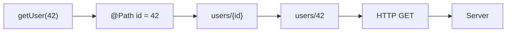
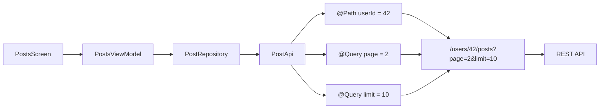
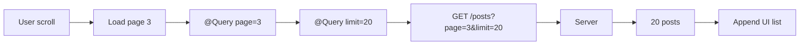
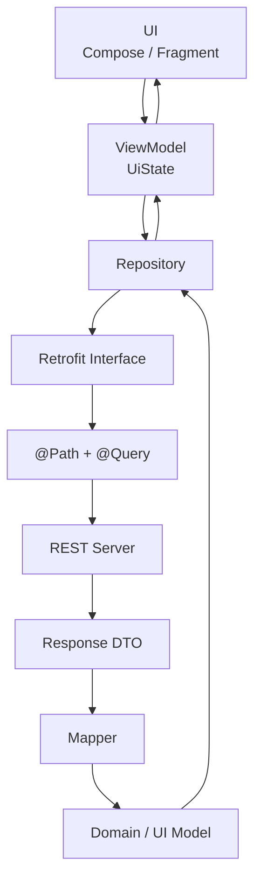

[](https://medium.com/%40biz.vishalbarot/retrofit-in-android-a-journey-of-seamless-network-calls-564944aae104?utm_source=chatgpt.com)

# 010 - Path and Query Parameters

**Học phần:** 04 - Network, Async and Services
**Module:** Module 07 - Network
**Nhóm nội dung:** REST with Retrofit
**Nguồn roadmap:** Network / REST with Retrofit
**Loại bài:** Network
**Thứ tự trong module:** 010
**Thời lượng gợi ý:** 32 phút

---

## 1. Tóm tắt

Trong REST API, dữ liệu cần gửi lên server không phải lúc nào cũng nằm trong `Body`. Rất nhiều API truyền thông tin trực tiếp thông qua URL.

Hai dạng quan trọng nhất là:

* **Path Parameter**: tham số nằm bên trong đường dẫn URL.
* **Query Parameter**: tham số nằm sau dấu `?` của URL.

Ví dụ:

```text
GET https://api.example.com/users/42/posts?page=2&limit=20
                                  ↑       ↑      ↑
                               @Path   @Query  @Query
```

Trong Retrofit:

```kotlin
@GET("users/{userId}/posts")
suspend fun getPosts(
    @Path("userId") userId: Long,
    @Query("page") page: Int,
    @Query("limit") limit: Int
): List<PostDto>
```

Retrofit dùng annotation trên interface để biến lời gọi hàm Kotlin thành HTTP request; `@Path` thay thế một đoạn trong URL, còn `@Query` thêm query parameter vào cuối URL. ([Square Open Source][1])

---

## 2. Mục tiêu học tập

Sau bài này, bạn nên có thể:

* Giải thích được sự khác nhau giữa **Path Parameter** và **Query Parameter**.
* Sử dụng đúng `@Path` và `@Query` trong Retrofit.
* Kết hợp nhiều `@Path` và `@Query` trong cùng endpoint.
* Hiểu cách Retrofit encode dữ liệu URL.
* Biết xử lý query parameter tùy chọn.
* Không để DTO/network logic rò rỉ trực tiếp vào UI.
* Thiết kế loading, success, empty và error state.
* Viết test kiểm tra URL Retrofit tạo ra.
* Biết các lỗi thường gặp khi triển khai API thật.

---

# 3. Path Parameter là gì?

## 3.1. Khái niệm

**Path Parameter** là một giá trị động nằm trực tiếp trong đường dẫn của URL.

Ví dụ:

```text
GET /users/42
```

Ở đây:

```text
42
```

là ID của user.

API có thể được mô tả dưới dạng:

```text
/users/{userId}
```

Khi:

```text
userId = 42
```

request thực tế trở thành:

```text
/users/42
```

Trong Retrofit, `@Path` là một **named replacement** của một segment trong URL. Giá trị được chuyển thành chuỗi và URL-encode mặc định. `@Path` cũng không chấp nhận giá trị `null`. 

---

## 3.2. Retrofit `@Path`

```kotlin
interface UserApi {

    @GET("users/{id}")
    suspend fun getUser(
        @Path("id") id: Long
    ): UserDto
}
```

Gọi:

```kotlin
api.getUser(42)
```

Retrofit tạo request tương đương:

```http
GET /users/42
```

### Sơ đồ



---

# 4. Nhiều Path Parameter

Một URL có thể chứa nhiều path động.

Ví dụ:

```text
/users/42/posts/123
```

Retrofit:

```kotlin
@GET("users/{userId}/posts/{postId}")
suspend fun getPost(
    @Path("userId") userId: Long,
    @Path("postId") postId: Long
): PostDto
```

Gọi:

```kotlin
api.getPost(
    userId = 42,
    postId = 123
)
```

Request:

```text
GET /users/42/posts/123
```

### Mapping

```text
users/{userId}/posts/{postId}
       │               │
       │               └── 123
       │
       └── 42

                ↓

users/42/posts/123
```

Tên trong annotation phải tương ứng với placeholder:

```kotlin
@Path("userId")
```

↕️

```text
{userId}
```

---

# 5. Query Parameter là gì?

## 5.1. Khái niệm

Query parameter nằm ở cuối URL, thường bắt đầu bằng:

```text
?
```

Nhiều parameter được nối với:

```text
&
```

Ví dụ:

```text
/products?page=2&limit=20
```

Trong đó:

```text
page=2
limit=20
```

là hai query parameters.

---

## 5.2. Retrofit `@Query`

```kotlin
interface ProductApi {

    @GET("products")
    suspend fun getProducts(
        @Query("page") page: Int,
        @Query("limit") limit: Int
    ): List<ProductDto>
}
```

Gọi:

```kotlin
api.getProducts(
    page = 2,
    limit = 20
)
```

Request:

```http
GET /products?page=2&limit=20
```

Theo Retrofit, `@Query` được append vào URL; nếu giá trị query là `null`, parameter đó sẽ bị bỏ qua. List hoặc array cũng có thể sinh ra nhiều parameter cùng tên. 

---

# 6. Path và Query khác nhau thế nào?

| Tiêu chí            | `@Path`                       | `@Query`                            |
| ------------------- | ----------------------------- | ----------------------------------- |
| Vị trí              | Trong URL path                | Sau `?`                             |
| Retrofit annotation | `@Path`                       | `@Query`                            |
| Ví dụ               | `/users/42`                   | `/users?page=2`                     |
| Thường dùng         | Chọn một resource/path cụ thể | Filter, search, sort, pagination... |
| Có placeholder `{}` | Có                            | Không                               |
| `null`              | Không được                    | Có thể bỏ parameter                 |
| URL encoding        | Mặc định                      | Mặc định                            |

Ví dụ dễ nhớ:

```text
/users/42/posts?page=3
       ↑          ↑
      Path       Query
```

> Cách dùng cụ thể cuối cùng vẫn phụ thuộc vào contract của API. Không nên tự đổi một path parameter thành query parameter chỉ vì thấy thuận tiện hơn.

---

# 7. Một ví dụ thực tế

Giả sử ứng dụng có API:

```text
GET /users/42/posts?page=2&limit=10
```

Ta có:

```text
users
  ↓
42
  ↓
posts
  ↓
?page=2
&limit=10
```

Retrofit:

```kotlin
interface PostApi {

    @GET("users/{userId}/posts")
    suspend fun getPosts(
        @Path("userId") userId: Long,
        @Query("page") page: Int,
        @Query("limit") limit: Int
    ): List<PostDto>
}
```

### Request flow



---

# 8. Query Parameter tùy chọn

Đây là một trong những trường hợp `@Query` rất hữu ích.

Giả sử API search:

```text
GET /products?category=phone&minPrice=500
```

Nhưng user không bắt buộc nhập `minPrice`.

```kotlin
@GET("products")
suspend fun getProducts(
    @Query("category") category: String?,
    @Query("minPrice") minPrice: Int?
): List<ProductDto>
```

Nếu gọi:

```kotlin
api.getProducts(
    category = "phone",
    minPrice = null
)
```

Retrofit bỏ query có giá trị `null`, nên URL có thể trở thành:

```text
/products?category=phone
```

Đây là hành vi được định nghĩa trực tiếp bởi `@Query`. 

---

# 9. Pagination với `@Query`

Pagination là một use case rất phổ biến.

API:

```text
GET /posts?page=3&limit=20
```

Interface:

```kotlin
@GET("posts")
suspend fun getPosts(
    @Query("page") page: Int,
    @Query("limit") limit: Int
): PostsResponseDto
```

Ví dụ:

```kotlin
api.getPosts(
    page = 3,
    limit = 20
)
```

### Flow



---

# 10. Search, Filter và Sort

Một endpoint thực tế có thể có nhiều query parameters:

```text
GET /products
    ?q=iphone
    &category=phone
    &sort=price
    &order=asc
    &page=1
    &limit=20
```

Retrofit:

```kotlin
@GET("products")
suspend fun searchProducts(
    @Query("q") keyword: String?,
    @Query("category") category: String?,
    @Query("sort") sort: String?,
    @Query("order") order: String?,
    @Query("page") page: Int,
    @Query("limit") limit: Int
): ProductResponseDto
```

Điểm quan trọng ở đây là **UI không nên tự xây URL** kiểu:

```kotlin
val url =
    "products?q=$keyword&category=$category&page=$page"
```

Thay vào đó, Retrofit interface nên chịu trách nhiệm mô tả request.

---

# 11. `@QueryMap`

Khi số query parameter động khá lớn, Retrofit còn cung cấp `@QueryMap`.

Ví dụ:

```kotlin
@GET("products")
suspend fun getProducts(
    @QueryMap options: Map<String, String>
): ProductResponseDto
```

Gọi:

```kotlin
val params = mapOf(
    "category" to "phone",
    "sort" to "price",
    "order" to "asc",
    "page" to "2"
)

api.getProducts(params)
```

Có thể tạo URL:

```text
/products
    ?category=phone
    &sort=price
    &order=asc
    &page=2
```

Retrofit định nghĩa `@QueryMap` để append các cặp key/value vào URL. ([Square Open Source][2])

### Khi nào nên dùng?

`@QueryMap` hữu ích với filter động:

```text
Filter {
    category?
    brand?
    minPrice?
    maxPrice?
    rating?
    sort?
}
```

Tuy nhiên, với endpoint ổn định chỉ có vài parameter, khai báo rõ từng `@Query` thường dễ đọc hơn.

---

# 12. URL Encoding

Đây là chi tiết rất dễ bị bỏ qua.

Giả sử search:

```kotlin
@Query("q") keyword: String
```

User nhập:

```text
Android & Kotlin
```

Chuỗi này chứa ký tự đặc biệt.

Retrofit mặc định URL-encode giá trị `@Path` và `@Query`. `encoded=true` chỉ nên dùng khi bạn biết dữ liệu truyền vào **đã được encode đúng từ trước**. 

Ví dụ:

```kotlin
@Query(
    value = "q",
    encoded = true
)
keyword: String
```

Không nên bật `encoded=true` một cách máy móc vì có thể làm URL sai hoặc dẫn đến double/incorrect encoding tùy dữ liệu đầu vào.

---

# 13. DTO không phải UI Model

Phần ban đầu của roadmap nhấn mạnh việc tách DTO khỏi UI/domain model. Đây là một điểm rất quan trọng.

Response API:

```json
{
  "id": 42,
  "user_name": "An",
  "avatar_url": "https://example.com/a.jpg"
}
```

DTO:

```kotlin
data class UserDto(
    val id: Long,
    val user_name: String,
    val avatar_url: String?
)
```

UI model:

```kotlin
data class UserUiModel(
    val id: Long,
    val name: String,
    val avatar: String?
)
```

Mapper:

```kotlin
fun UserDto.toUiModel(): UserUiModel {
    return UserUiModel(
        id = id,
        name = user_name,
        avatar = avatar_url
    )
}
```

Android Architecture Guide khuyến nghị data layer chứa repository/data source thay vì để UI truy cập trực tiếp nguồn dữ liệu. Điều này giúp network contract không lan xuyên toàn bộ ứng dụng. ([Android Developers][3])

---

# 14. Kiến trúc hoàn chỉnh

Một cấu trúc hợp lý:

```text
Compose / Fragment
        │
        ▼
    ViewModel
        │
        ▼
   Repository
        │
        ▼
 Retrofit API
        │
        ▼
      HTTP
        │
        ▼
     Server
```

Chi tiết hơn:



Google mô tả repository như thành phần của data layer, có thể quản lý một hoặc nhiều data source. ([Android Developers][3])

---

# 15. Repository

```kotlin
class PostRepository(
    private val api: PostApi
) {

    suspend fun getPosts(
        userId: Long,
        page: Int
    ): List<PostUiModel> {

        return api.getPosts(
            userId = userId,
            page = page,
            limit = 20
        ).map {
            it.toUiModel()
        }
    }
}
```

UI không cần biết rằng API sử dụng:

```text
@Path
@Query
GET
Retrofit
```

UI chỉ biết:

```kotlin
repository.getPosts(
    userId = 42,
    page = 1
)
```

Đây chính là boundary tốt giữa network và UI.

---

# 16. Loading, Success và Error State

Network request không nên được coi đơn giản là:

```text
request → data
```

Thực tế:

```text
            ┌── Success
            │
Request ────┼── Error
            │
            └── Empty
```

UI State:

```kotlin
sealed interface PostsUiState {

    data object Loading : PostsUiState

    data class Success(
        val posts: List<PostUiModel>
    ) : PostsUiState

    data class Error(
        val message: String
    ) : PostsUiState
}
```

ViewModel:

```kotlin
class PostsViewModel(
    private val repository: PostRepository
) : ViewModel() {

    private val _uiState =
        MutableStateFlow<PostsUiState>(
            PostsUiState.Loading
        )

    val uiState = _uiState.asStateFlow()

    fun loadPosts(
        userId: Long,
        page: Int
    ) {
        viewModelScope.launch {

            _uiState.value =
                PostsUiState.Loading

            _uiState.value =
                try {

                    val posts =
                        repository.getPosts(
                            userId = userId,
                            page = page
                        )

                    PostsUiState.Success(posts)

                } catch (e: Exception) {

                    PostsUiState.Error(
                        message = "Không thể tải dữ liệu"
                    )
                }
        }
    }
}
```

Retrofit hỗ trợ `suspend` service methods trong Kotlin; chức năng này đã được bổ sung vào Retrofit từ dòng 2.x và vẫn tồn tại trong codebase hiện tại. ([GitHub][4])

---

# 17. Retry

UI:

```text
┌─────────────────────────┐
│ Không thể tải bài viết  │
│                         │
│       [ Thử lại ]       │
└─────────────────────────┘
```

Retry đơn giản có thể gọi lại:

```kotlin
viewModel.loadPosts(
    userId = userId,
    page = page
)
```

Điểm quan trọng là phải giữ được các parameter cần thiết:

```text
userId
page
filter
sort
search
```

Nếu retry với parameter khác request ban đầu, user có thể nhận kết quả khác ngoài mong đợi.

---

# 18. Lifecycle

Một sai lầm thường gặp:

```text
Composable
   │
   ├── recomposition
   │
   ├── call API
   │
   ├── recomposition
   │
   ├── call API
   │
   └── ...
```

Không nên để API call được kích hoạt tùy tiện mỗi lần UI render lại.

Kiến trúc nên là:

```text
UI Event
   │
   ▼
ViewModel
   │
   ▼
Repository
   │
   ▼
Retrofit
```

Trong đó UI quan sát:

```text
StateFlow<UiState>
```

thay vì trực tiếp quản lý Retrofit request.

---

# 19. Những lỗi thường gặp

## 19.1. Quên `{}` cho `@Path`

Sai:

```kotlin
@GET("users/id")
suspend fun getUser(
    @Path("id") id: Long
): UserDto
```

Đúng:

```kotlin
@GET("users/{id}")
suspend fun getUser(
    @Path("id") id: Long
): UserDto
```

---

## 19.2. Tên `@Path` không trùng placeholder

Sai:

```kotlin
@GET("users/{userId}")
suspend fun getUser(
    @Path("id") id: Long
): UserDto
```

Nên là:

```kotlin
@Path("userId")
```

---

## 19.3. Nhầm Path thành Query

API yêu cầu:

```text
/users/42
```

nhưng code lại viết:

```kotlin
@GET("users")
suspend fun getUser(
    @Query("id") id: Long
)
```

Nó tạo:

```text
/users?id=42
```

Đây là **URL khác**.

---

## 19.4. Nhầm Query thành Path

API yêu cầu:

```text
/products?page=2
```

Nhưng lại viết:

```kotlin
@GET("products/{page}")
```

Request thành:

```text
/products/2
```

Cũng là endpoint hoàn toàn khác.

---

# 20. Path hay Query? Quy tắc ghi nhớ nhanh

Một heuristic hữu ích:

```text
Đang chỉ đến resource/path cụ thể?
        │
       Yes
        │
        ▼
      @Path


Đang search/filter/sort/page?
        │
       Yes
        │
        ▼
      @Query
```

Ví dụ:

```text
/users/42
       │
       └── user cụ thể
           → @Path


/users?page=2
       │
       └── cách lấy danh sách
           → @Query
```

Nhưng API contract vẫn là nguồn quyết định cuối cùng.

---

# 21. Ví dụ tổng hợp

Giả sử xây màn hình:

> Hiển thị các bài viết của user 42, trang 2, chỉ lấy bài thuộc category Android và sort mới nhất.

API:

```text
GET /users/42/posts
    ?page=2
    &category=android
    &sort=newest
```

Retrofit:

```kotlin
interface PostApi {

    @GET("users/{userId}/posts")
    suspend fun getPosts(
        @Path("userId")
        userId: Long,

        @Query("page")
        page: Int,

        @Query("category")
        category: String?,

        @Query("sort")
        sort: String?
    ): List<PostDto>
}
```

Call:

```kotlin
api.getPosts(
    userId = 42,
    page = 2,
    category = "android",
    sort = "newest"
)
```

Kết quả:

```text
/users/42/posts?page=2&category=android&sort=newest
```

---

# 22. Testing

Một test quan trọng không chỉ kiểm tra response mà còn phải đảm bảo Retrofit tạo đúng request.

Ví dụ cần xác minh:

```text
Input:

userId = 42
page = 2
limit = 20

Expected:

GET /users/42/posts?page=2&limit=20
```

### Test matrix

| Case           | Input              | URL mong đợi        |
| -------------- | ------------------ | ------------------- |
| Path           | `userId=42`        | `/users/42`         |
| Query          | `page=2`           | `/users?page=2`     |
| Multiple query | `page=2, limit=20` | `?page=2&limit=20`  |
| Nullable query | `category=null`    | Không có `category` |
| Special chars  | `"Android Kotlin"` | Giá trị được encode |
| Error          | Server `500`       | UI Error            |
| Retry          | Retry              | Request gửi lại     |

---

# 23. Debugging

Khi request trả về `400`, `404` hoặc dữ liệu không đúng, hãy kiểm tra URL thực tế.

Ví dụ code bạn nghĩ là:

```text
/users/42/posts?page=2
```

nhưng request thực tế lại là:

```text
/users?id=42&page=2
```

Hãy kiểm tra lần lượt:

```text
HTTP method
     ↓
Base URL
     ↓
Path
     ↓
@Path
     ↓
@Query
     ↓
Headers
     ↓
Body
```

Không nên chỉ nhìn response JSON.

---

# 24. Production considerations

## Security

Không nên đặt dữ liệu nhạy cảm vào query string nếu API không được thiết kế cho việc đó.

Ví dụ nên tránh kiểu:

```text
/login?password=123456
```

Thông tin xác thực thường thuộc về cơ chế authentication/header/body tương ứng với API contract.

---

## Performance

Pagination:

```text
?page=1&limit=20
```

thường tốt hơn việc endpoint luôn trả về hàng nghìn item nếu backend hỗ trợ pagination.

---

## Maintainability

Không rải URL thủ công khắp application:

```kotlin
"/users/$id/posts?page=$page"
```

Thay vào đó, tập trung contract ở Retrofit interface:

```kotlin
@Path
@Query
```

---

## Release risk

Nếu backend thay đổi:

```text
page
```

thành:

```text
pageNumber
```

thì:

```kotlin
@Query("page")
```

cũng phải được cập nhật.

Do đó API contract nên có test bảo vệ.

---

# 25. Bài thực hành

## Mini Project: User Posts

### Yêu cầu API

Mock endpoint:

```text
GET /users/{userId}/posts
```

Query:

```text
page
limit
search
```

Ví dụ:

```text
/users/42/posts?page=1&limit=20&search=android
```

### Retrofit Interface

```kotlin
interface PostApi {

    @GET("users/{userId}/posts")
    suspend fun getPosts(
        @Path("userId") userId: Long,
        @Query("page") page: Int,
        @Query("limit") limit: Int,
        @Query("search") search: String?
    ): List<PostDto>
}
```

---

## UI cần có

```text
┌──────────────────────────────┐
│ Search: Android             │
├──────────────────────────────┤
│                              │
│ Post 1                       │
│ Post 2                       │
│ Post 3                       │
│                              │
│             Loading...       │
└──────────────────────────────┘
```

Phải triển khai ít nhất:

```text
Loading
   ↓
Success
   ↓
Empty

hoặc

Loading
   ↓
Error
   ↓
Retry
```

---

# 26. Artifact cho Portfolio

Một artifact nhỏ nhưng tốt có thể có cấu trúc:

```text
retrofit-path-query-demo/
│
├── data/
│   ├── remote/
│   │   ├── PostApi.kt
│   │   └── PostDto.kt
│   │
│   └── PostRepository.kt
│
├── ui/
│   ├── PostsViewModel.kt
│   ├── PostsUiState.kt
│   └── PostsScreen.kt
│
├── test/
│   └── PostApiTest.kt
│
└── README.md
```

README nên minh họa rõ:

```text
GET /users/{userId}/posts
           │
           └── @Path

?page=2&limit=20
   │        │
   └@Query  └@Query
```

---

# 27. Bài tập

Xây hoặc mock endpoint:

```text
GET /products/{category}
```

với:

```text
?page=
&limit=
&sort=
&minPrice=
&maxPrice=
```

Ví dụ:

```text
/products/laptop
    ?page=1
    &limit=20
    &sort=price
    &minPrice=500
    &maxPrice=2000
```

Viết Retrofit interface sử dụng:

```kotlin
@Path
@Query
```

Sau đó hiển thị:

```text
Loading
Success
Empty
Error
Retry
```

### Bonus

Thêm:

```text
Search
Filter
Sort
Pagination
```

và kiểm tra URL cuối cùng.

---

# 28. Checklist hoàn thành

* [ ] Giải thích được Path Parameter.
* [ ] Giải thích được Query Parameter.
* [ ] Phân biệt được `@Path` và `@Query`.
* [ ] Biết dùng `{parameter}` trong endpoint.
* [ ] Biết kết hợp nhiều `@Path`.
* [ ] Biết kết hợp nhiều `@Query`.
* [ ] Hiểu query nullable.
* [ ] Hiểu URL encoding cơ bản.
* [ ] Biết `@QueryMap` dùng để làm gì.
* [ ] Không tự nối URL bằng String nếu Retrofit có thể mô tả request.
* [ ] DTO được tách khỏi UI model.
* [ ] Network call đi qua Repository.
* [ ] Có Loading state.
* [ ] Có Success state.
* [ ] Có Empty state nếu phù hợp.
* [ ] Có Error state.
* [ ] Có Retry.
* [ ] Có test kiểm tra URL.
* [ ] Có ghi chú lifecycle.
* [ ] Có README hoặc screenshot làm portfolio artifact.

---

# 29. Ghi nhớ nhanh

```text
@Path
│
├── nằm trong URL
├── thay thế {placeholder}
├── thường xác định path/resource
└── không nullable


@Query
│
├── nằm sau ?
├── dạng key=value
├── thường search/filter/sort/page
└── null → bỏ query đó
```

Ví dụ cuối cùng:

```kotlin
@GET("users/{id}/posts")
suspend fun getPosts(
    @Path("id") id: Long,
    @Query("page") page: Int,
    @Query("limit") limit: Int
): List<PostDto>
```

```text
id = 42
page = 2
limit = 20

          ↓

GET /users/42/posts?page=2&limit=20
           │           │        │
         @Path       @Query   @Query
```

---

## 30. Kết luận

**Path and Query Parameters** là phần nhỏ nhưng cực kỳ quan trọng khi làm REST API với Retrofit.

Công thức cần nhớ:

```text
Retrofit Interface
       │
       ├── @Path  → thay đổi đường dẫn
       │
       └── @Query → thêm tham số truy vấn
                    │
                    ▼
               HTTP Request
                    │
                    ▼
                 Server
```

Một Android developer tốt không chỉ biết viết:

```kotlin
@Path
@Query
```

mà còn phải hiểu chúng nằm ở đâu trong kiến trúc:

```text
UI
 ↓
ViewModel
 ↓
Repository
 ↓
Retrofit Interface
 ↓
@Path + @Query
 ↓
HTTP
 ↓
REST API
```

Retrofit chịu trách nhiệm mô tả network contract, repository tạo boundary cho data layer, còn UI nên làm việc với state/model phù hợp thay vì trực tiếp xây URL hoặc xử lý chi tiết HTTP. Đây cũng phù hợp với hướng dẫn kiến trúc Android hiện tại của Google. ([Square Open Source][5])

[1]: https://square.github.io/retrofit/2.x/retrofit/index.html?retrofit2%2Fhttp%2Fpackage-summary.html=&utm_source=chatgpt.com "retrofit2.http (retrofit API)"
[2]: https://square.github.io/retrofit/2.x/retrofit/retrofit2/http/QueryMap.html?utm_source=chatgpt.com "QueryMap (retrofit API)"
[3]: https://developer.android.com/topic/architecture?utm_source=chatgpt.com "Guide to app architecture"
[4]: https://github.com/square/retrofit/blob/master/CHANGELOG.md?utm_source=chatgpt.com "retrofit/CHANGELOG.md at trunk · lysine-dev/retrofit"
[5]: https://square.github.io/retrofit/2.x/retrofit/index-all.html?utm_source=chatgpt.com "Index (retrofit API)"

---

# Bài luyện tập

## Mục tiêu


## Đề bài


## Yêu cầu hoàn thành

- [ ] 
- [ ] 
- [ ] 

## Kết quả / lời giải


## Ghi chú
