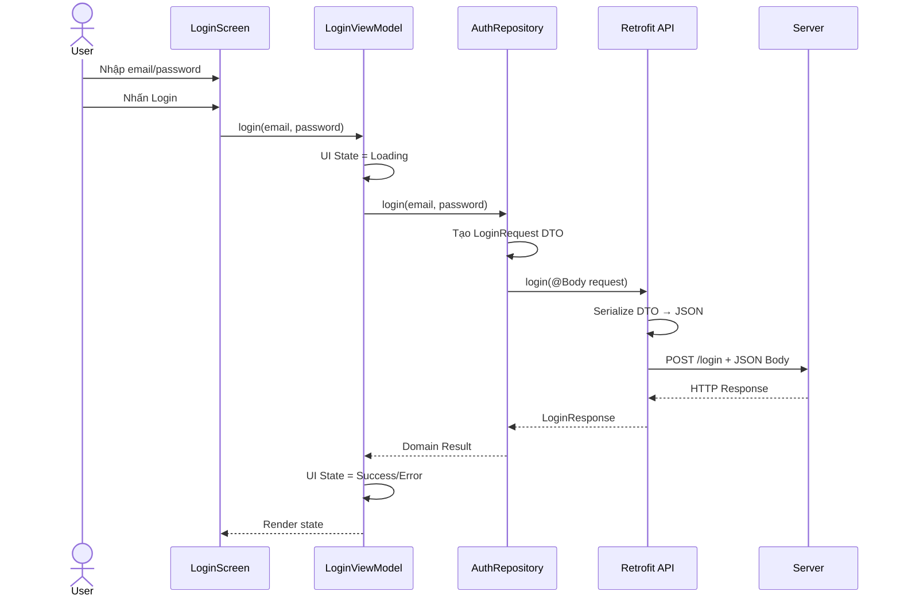
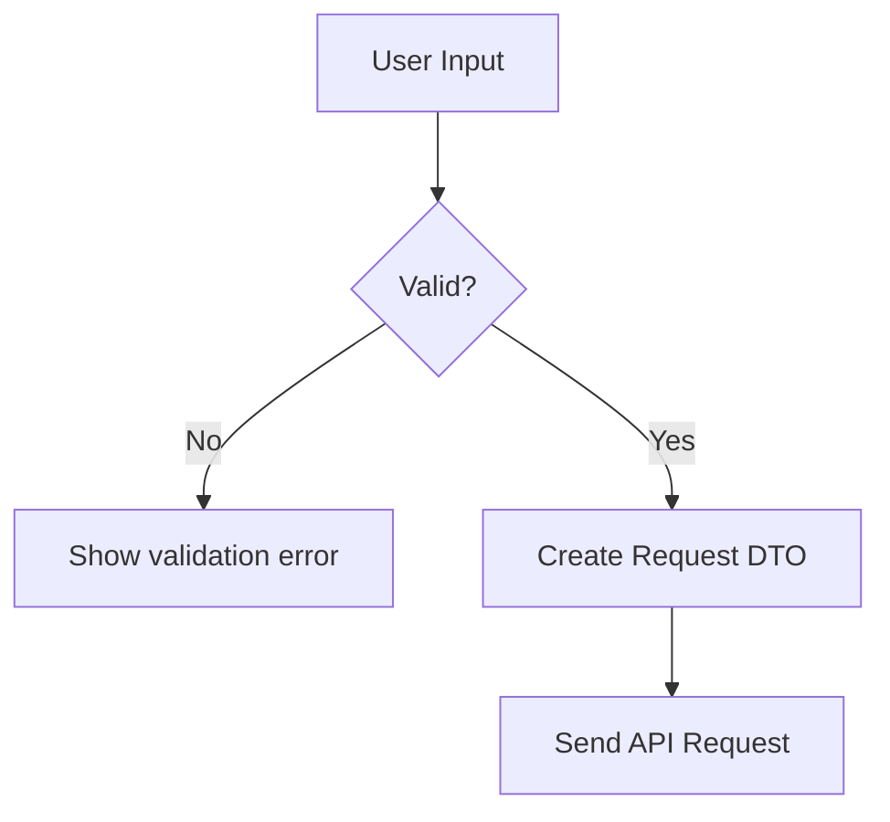
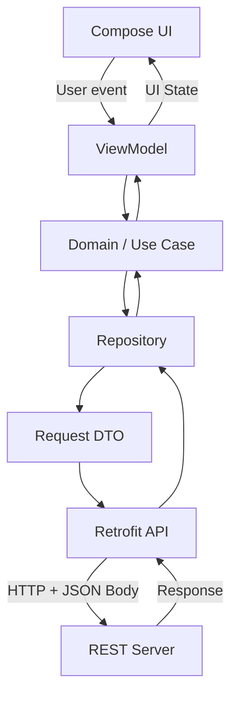

[](https://developer.android.com/codelabs/basic-android-kotlin-compose-getting-data-internet?hl=pt-br&utm_source=chatgpt.com)

# 011 - Request Body trong Retrofit

| Thông tin               | Nội dung                         |
| ----------------------- | -------------------------------- |
| **Học phần**            | 04 - Network, Async and Services |
| **Module**              | Module 07 - Network              |
| **Nhóm nội dung**       | REST with Retrofit               |
| **Nguồn roadmap**       | Network / REST with Retrofit     |
| **Loại bài**            | Network                          |
| **Thứ tự trong module** | 011                              |
| **Thời lượng gợi ý**    | 32 phút                          |

---

## 1. Tóm tắt

**Request Body** là phần dữ liệu được ứng dụng gửi kèm trong một HTTP request đến server. Trong Android với Retrofit, ta thường tạo một **request DTO** dưới dạng Kotlin `data class`, sau đó truyền object đó vào tham số được đánh dấu bằng `@Body`.

Retrofit có khả năng chuyển object thành HTTP request body thông qua converter được cấu hình, chẳng hạn converter cho JSON. Tài liệu chính thức của Retrofit liệt kê **object conversion to request body** là một trong các tính năng cốt lõi của thư viện. ([Square Open Source][1])

Ví dụ:

```kotlin
data class LoginRequest(
    val email: String,
    val password: String
)

interface AuthApi {

    @POST("auth/login")
    suspend fun login(
        @Body request: LoginRequest
    ): LoginResponse
}
```

Khi gọi:

```kotlin
api.login(
    LoginRequest(
        email = "user@example.com",
        password = "123456"
    )
)
```

converter có thể biến object Kotlin thành JSON tương đương:

```json
{
  "email": "user@example.com",
  "password": "123456"
}
```

### Ý tưởng cốt lõi

```text
Kotlin Object
     ↓
   @Body
     ↓
Retrofit Converter
     ↓
JSON / RequestBody
     ↓
HTTP Request
     ↓
   Server
```

Request Body không chỉ là vấn đề cú pháp Retrofit. Trong app production, nó liên quan trực tiếp đến:

* contract giữa mobile app và backend;
* validation dữ liệu;
* authentication;
* error handling;
* UI state;
* retry;
* duplicate request;
* lifecycle;
* security;
* testing;
* khả năng thay đổi API trong tương lai.

---

## 2. Mục tiêu học tập

Sau bài này, bạn nên có khả năng:

* [ ] Giải thích **Request Body** bằng ngôn ngữ của mình.
* [ ] Phân biệt `@Body`, `@Path`, `@Query`, `@Field` và `@Part`.
* [ ] Tạo request DTO cho API.
* [ ] Gửi JSON body bằng Retrofit.
* [ ] Hiểu vai trò của converter.
* [ ] Không dùng trực tiếp UI model làm API request model.
* [ ] Xử lý loading, success và error khi gửi request.
* [ ] Biết Request Body nên nằm ở đâu trong kiến trúc Android.
* [ ] Test được nội dung request gửi tới server.
* [ ] Nhận biết các lỗi production như field sai tên, `null`, duplicate request hoặc gửi dữ liệu nhạy cảm vào log.

---

# 3. Request Body là gì?

Một HTTP request thường có thể hình dung như sau:

```http
POST /users HTTP/1.1
Host: api.example.com
Content-Type: application/json
Authorization: Bearer <token>

{
  "name": "An",
  "email": "an@example.com"
}
```

Các phần chính:

```text
POST
 │
 ├── HTTP Method
 │
/users
 │
 ├── URL / Path
 │
Authorization: ...
Content-Type: ...
 │
 ├── Headers
 │
{
    "name": "An",
    "email": "an@example.com"
}
 │
 └── Request Body
```

**Request Body chính là payload dữ liệu mà client muốn gửi cho server.**

Ví dụ:

* đăng nhập → email + password;
* đăng ký → tên + email + password;
* tạo bài viết → title + content;
* cập nhật profile → name + avatar;
* tạo đơn hàng → danh sách sản phẩm;
* gửi tọa độ → latitude + longitude;
* gửi message → text + conversation ID.

---

# 4. Request Body nằm ở đâu trong Retrofit?

Retrofit định nghĩa API thông qua Kotlin/Java interface.

Ví dụ:

```kotlin
interface UserApi {

    @POST("users")
    suspend fun createUser(
        @Body request: CreateUserRequest
    ): UserResponse
}
```

Trong đó:

```kotlin
@POST("users")
```

xác định:

```text
HTTP Method = POST
Endpoint    = /users
```

Còn:

```kotlin
@Body request: CreateUserRequest
```

xác định dữ liệu được gửi trong **HTTP request body**.

Retrofit sử dụng converter đã cấu hình để chuyển object thành request body phù hợp. Nếu không có converter cho kiểu object đó, Retrofit không thể tự động serialize object tùy ý thành body. ([Square Open Source][2])

---

# 5. Luồng Request Body hoàn chỉnh

Ví dụ người dùng nhấn **Đăng nhập**:



Android khuyến nghị UI không truy cập trực tiếp network data source; dữ liệu nên đi qua data layer/repository để tách nguồn dữ liệu khỏi UI. ([Android Developers][3])

---

# 6. Ví dụ cơ bản với Retrofit

Giả sử backend yêu cầu:

```http
POST /users
Content-Type: application/json
```

Body:

```json
{
  "name": "Khanh",
  "email": "khanh@example.com",
  "age": 23
}
```

## 6.1. Tạo Request DTO

```kotlin
data class CreateUserRequest(
    val name: String,
    val email: String,
    val age: Int
)
```

DTO = **Data Transfer Object**.

Nó đại diện cho cấu trúc dữ liệu mà API mong đợi.

---

## 6.2. Tạo Response DTO

Server trả:

```json
{
  "id": 42,
  "name": "Khanh",
  "email": "khanh@example.com",
  "age": 23
}
```

Ta có:

```kotlin
data class UserResponse(
    val id: Long,
    val name: String,
    val email: String,
    val age: Int
)
```

---

## 6.3. Khai báo Retrofit Interface

```kotlin
interface UserApi {

    @POST("users")
    suspend fun createUser(
        @Body request: CreateUserRequest
    ): UserResponse
}
```

---

## 6.4. Gọi API

```kotlin
val request = CreateUserRequest(
    name = "Khanh",
    email = "khanh@example.com",
    age = 23
)

val user = userApi.createUser(request)
```

Retrofit sẽ xử lý:

```text
CreateUserRequest
       ↓
JSON Converter
       ↓
application/json
       ↓
HTTP Request Body
```

---

# 7. Converter đóng vai trò gì?

`@Body` không tự biết cách biến mọi Kotlin object thành JSON.

Retrofit dựa vào **Converter.Factory**.

Theo tài liệu Retrofit, converter chịu trách nhiệm chuyển một kiểu dữ liệu thành HTTP request body và thực hiện chiều ngược lại cho response khi phù hợp. ([Square Open Source][2])

Ví dụ kiến trúc:

```text
CreateUserRequest
        │
        ▼
┌─────────────────────┐
│ Retrofit            │
│                     │
│ Converter Factory   │
└──────────┬──────────┘
           │
           ▼
     JSON serialization
           │
           ▼
{
  "name": "...",
  "email": "..."
}
```

Một cấu hình Retrofit có dạng khái niệm:

```kotlin
val retrofit = Retrofit.Builder()
    .baseUrl(BASE_URL)
    .addConverterFactory(/* JSON converter */)
    .build()
```

---

# 8. `@Body` và JSON

Đây là trường hợp phổ biến nhất.

```kotlin
data class CreatePostRequest(
    val title: String,
    val content: String
)
```

API:

```kotlin
@POST("posts")
suspend fun createPost(
    @Body request: CreatePostRequest
): PostResponse
```

Request thực tế:

```http
POST /posts
Content-Type: application/json

{
  "title": "Retrofit Request Body",
  "content": "Learning Android networking"
}
```

---

# 9. Request DTO không phải Domain Model

Một lỗi kiến trúc phổ biến:

```kotlin
@Body user: User
```

trong đó `User` lại là model được sử dụng khắp:

```text
UI
Domain
Database
Network
```

Ví dụ không tốt:

```kotlin
data class User(
    val id: Long,
    val displayName: String,
    val avatar: String?,
    val isSelected: Boolean,
    val password: String
)
```

rồi:

```kotlin
@POST("users")
suspend fun createUser(
    @Body user: User
)
```

Lúc này API có thể vô tình nhận:

```json
{
  "id": 0,
  "displayName": "Khanh",
  "avatar": null,
  "isSelected": false,
  "password": "..."
}
```

trong khi backend chỉ cần:

```json
{
  "name": "Khanh",
  "password": "..."
}
```

---

# 10. Cách tốt hơn: Request DTO riêng

```kotlin
data class CreateUserRequest(
    val name: String,
    val password: String
)
```

Domain model:

```kotlin
data class User(
    val id: Long,
    val name: String,
    val avatarUrl: String?
)
```

UI model nếu cần:

```kotlin
data class UserUiModel(
    val displayName: String,
    val avatarUrl: String?,
    val isOnline: Boolean
)
```

Luồng:


Android cũng khuyến nghị data layer đóng vai trò trừu tượng hóa data sources và có thể chuyển đổi dữ liệu từ các nguồn thành model mà phần còn lại của ứng dụng thực sự cần. ([Android Developers][3])

---

# 11. Mapping Domain → Request DTO

Ví dụ domain:

```kotlin
data class Registration(
    val name: String,
    val email: String,
    val password: String
)
```

Request DTO:

```kotlin
data class RegisterRequest(
    val fullName: String,
    val emailAddress: String,
    val password: String
)
```

Mapper:

```kotlin
fun Registration.toRequest(): RegisterRequest {
    return RegisterRequest(
        fullName = name,
        emailAddress = email,
        password = password
    )
}
```

Repository:

```kotlin
class AuthRepository(
    private val api: AuthApi
) {

    suspend fun register(
        registration: Registration
    ): User {

        val response = api.register(
            registration.toRequest()
        )

        return response.toDomain()
    }
}
```

Kiến trúc:

```text
UI
 │
 ▼
ViewModel
 │
 ▼
Domain
 │
 ▼
Repository
 │
 ├── Domain → Request DTO
 │
 ▼
Retrofit
 │
 ├── Request DTO → JSON
 │
 ▼
Server
```

---

# 12. `@Body` khác `@Query` như thế nào?

Giả sử request:

```http
POST /users?notify=true

{
  "name": "Khanh",
  "email": "khanh@example.com"
}
```

Ta có:

```kotlin
@POST("users")
suspend fun createUser(
    @Query("notify") notify: Boolean,
    @Body request: CreateUserRequest
): UserResponse
```

Trong đó:

```text
notify=true
    ↑
Query Parameter
```

Còn:

```json
{
  "name": "Khanh",
  "email": "khanh@example.com"
}
```

là:

```text
Request Body
```

---

# 13. `@Body` khác `@Path`

Request:

```http
PUT /users/42

{
  "name": "New Name"
}
```

Retrofit:

```kotlin
@PUT("users/{id}")
suspend fun updateUser(
    @Path("id") id: Long,
    @Body request: UpdateUserRequest
): UserResponse
```

Phân tích:

```text
/users/42
       ↑
      Path

{
  "name": "New Name"
}
       ↑
      Body
```

---

# 14. `@Body` khác `@Header`

Ví dụ:

```http
POST /orders

Authorization: Bearer abc123
Content-Type: application/json

{
  "productId": 10,
  "quantity": 2
}
```

Retrofit:

```kotlin
@POST("orders")
suspend fun createOrder(
    @Header("Authorization") token: String,
    @Body request: CreateOrderRequest
): OrderResponse
```

Vai trò:

| Thành phần | Nội dung                     |
| ---------- | ---------------------------- |
| `@Header`  | Metadata của request         |
| `@Path`    | Định danh resource trong URL |
| `@Query`   | Tham số URL                  |
| `@Body`    | Payload chính                |

---

# 15. `@Body` khác `@Field`

`@Body` thường dùng khi gửi một object như JSON.

Ví dụ:

```kotlin
@POST("login")
suspend fun login(
    @Body request: LoginRequest
): LoginResponse
```

Body:

```json
{
  "email": "user@example.com",
  "password": "123456"
}
```

Trong khi form encoding thường có dạng:

```text
email=user@example.com&password=123456
```

và Retrofit sử dụng annotation phù hợp với form encoding thay vì `@Body` object JSON.

---

# 16. `@Body` khác `@Part`

`@Part` thường xuất hiện trong **multipart requests**, ví dụ:

```text
Upload avatar
Upload image
Upload video
Upload document
```

Concept:

```text
Request
├── metadata
├── description
└── binary file
```

Trong những tình huống như vậy, multipart phù hợp hơn một JSON `@Body` đơn giản.

Retrofit cũng hỗ trợ multipart request body và file upload bên cạnh object conversion. ([Square Open Source][1])

---

# 17. Khi nào thường sử dụng Request Body?

## POST

Tạo resource:

```http
POST /posts
```

```json
{
  "title": "Hello",
  "content": "..."
}
```

---

## PUT

Thay thế/cập nhật resource:

```http
PUT /users/42
```

```json
{
  "name": "Khanh",
  "email": "..."
}
```

---

## PATCH

Cập nhật một phần:

```http
PATCH /users/42
```

```json
{
  "name": "New name"
}
```

Chú ý: ý nghĩa cụ thể của PUT/PATCH phải tuân theo contract API mà backend cung cấp.

---

# 18. Request Body có thể chứa object lồng nhau

Ví dụ API tạo đơn hàng:

```json
{
  "customerId": 100,
  "shippingAddress": {
    "city": "Ha Noi",
    "district": "Nam Tu Liem"
  },
  "items": [
    {
      "productId": 1,
      "quantity": 2
    },
    {
      "productId": 8,
      "quantity": 1
    }
  ]
}
```

DTO:

```kotlin
data class CreateOrderRequest(
    val customerId: Long,
    val shippingAddress: AddressRequest,
    val items: List<OrderItemRequest>
)

data class AddressRequest(
    val city: String,
    val district: String
)

data class OrderItemRequest(
    val productId: Long,
    val quantity: Int
)
```

Retrofit:

```kotlin
@POST("orders")
suspend fun createOrder(
    @Body request: CreateOrderRequest
): OrderResponse
```

---

# 19. Nullable field trong Request Body

Ví dụ:

```kotlin
data class UpdateProfileRequest(
    val name: String?,
    val bio: String?,
    val avatarUrl: String?
)
```

Cần đặc biệt cẩn thận vì:

```json
{
  "bio": null
}
```

không phải lúc nào cũng có cùng ý nghĩa với:

```json
{}
```

Backend có thể hiểu:

```text
Không gửi field
→ không thay đổi dữ liệu hiện tại

bio = null
→ xóa bio hiện tại
```

Vì vậy API contract phải quy định rõ:

```text
missing ≠ null
```

đặc biệt với PATCH API.

---

# 20. Validation trước khi gửi Request Body

Không nên để mọi dữ liệu sai đều được gửi tới backend mới kiểm tra.

Ví dụ:

```kotlin
data class LoginForm(
    val email: String,
    val password: String
)
```

Validation:

```kotlin
fun validateLogin(
    email: String,
    password: String
): Boolean {
    return email.isNotBlank() &&
        password.length >= 6
}
```

Luồng tốt hơn:



Không cần gửi:

```text
email = ""
password = ""
```

để rồi chờ network round trip mới biết dữ liệu không hợp lệ.

---

# 21. Kiến trúc Android nên đặt Request Body ở đâu?

Một cấu trúc phổ biến:

```text
com.example.app
│
├── data
│   ├── remote
│   │   ├── api
│   │   │   └── UserApi.kt
│   │   │
│   │   └── dto
│   │       ├── CreateUserRequest.kt
│   │       └── UserResponse.kt
│   │
│   ├── mapper
│   │   └── UserMapper.kt
│   │
│   └── repository
│       └── UserRepositoryImpl.kt
│
├── domain
│   ├── model
│   │   └── User.kt
│   │
│   └── repository
│       └── UserRepository.kt
│
└── ui
    └── user
        ├── UserViewModel.kt
        └── UserScreen.kt
```

Android hiện khuyến nghị kiến trúc phân lớp rõ ràng, trong đó UI layer và data layer có trách nhiệm riêng; ViewModel không nên nói chuyện trực tiếp với network data source. ([Android Developers][4])

---

# 22. Repository tạo Request Body

Ví dụ:

```kotlin
class UserRepositoryImpl(
    private val api: UserApi
) : UserRepository {

    override suspend fun createUser(
        name: String,
        email: String
    ): User {

        val request = CreateUserRequest(
            name = name,
            email = email
        )

        return api
            .createUser(request)
            .toDomain()
    }
}
```

Điểm quan trọng:

```text
UI không cần biết:

@POST
@Body
JSON
Retrofit
API endpoint
```

UI chỉ cần biết:

```kotlin
repository.createUser(...)
```

---

# 23. Request Body và UI State

Network request không nên chỉ có:

```text
success
```

mà nên mô hình hóa các trạng thái có ý nghĩa với UI.

Ví dụ:

```kotlin
sealed interface CreateUserUiState {

    data object Idle : CreateUserUiState

    data object Loading : CreateUserUiState

    data class Success(
        val user: User
    ) : CreateUserUiState

    data class Error(
        val message: String
    ) : CreateUserUiState
}
```

Android khuyến nghị state holder xử lý các input/events và tạo ra UI state mà giao diện có thể render; các API bất đồng bộ như coroutine có thể được dùng làm input vào pipeline đó. ([Android Developers][5])

---

# 24. ViewModel hoàn chỉnh

```kotlin
class CreateUserViewModel(
    private val repository: UserRepository
) : ViewModel() {

    private val _uiState =
        MutableStateFlow<CreateUserUiState>(
            CreateUserUiState.Idle
        )

    val uiState =
        _uiState.asStateFlow()

    fun createUser(
        name: String,
        email: String
    ) {
        viewModelScope.launch {

            _uiState.value =
                CreateUserUiState.Loading

            try {

                val user =
                    repository.createUser(
                        name = name,
                        email = email
                    )

                _uiState.value =
                    CreateUserUiState.Success(user)

            } catch (e: Exception) {

                _uiState.value =
                    CreateUserUiState.Error(
                        message = e.message
                            ?: "Đã xảy ra lỗi"
                    )
            }
        }
    }
}
```

---

# 25. UI Compose

```kotlin
@Composable
fun CreateUserScreen(
    viewModel: CreateUserViewModel
) {

    val state by viewModel.uiState.collectAsState()

    when (val current = state) {

        CreateUserUiState.Idle -> {
            CreateUserForm(
                onSubmit = viewModel::createUser
            )
        }

        CreateUserUiState.Loading -> {
            CircularProgressIndicator()
        }

        is CreateUserUiState.Success -> {
            Text(
                text = "Created: ${current.user.name}"
            )
        }

        is CreateUserUiState.Error -> {
            ErrorContent(
                message = current.message,
                onRetry = {
                    // retry request
                }
            )
        }
    }
}
```

Ta có luồng:

```text
┌───────────────┐
│      Idle     │
└───────┬───────┘
        │ submit
        ▼
┌───────────────┐
│    Loading    │
└───────┬───────┘
        │
      API
      ╱ ╲
     ╱   ╲
success  error
   ▼       ▼
┌───────┐ ┌───────┐
│Success│ │ Error │
└───────┘ └───┬───┘
              │ retry
              └──────→ Loading
```

---

# 26. Lifecycle

Một lỗi phổ biến là đặt network request trực tiếp trong `Activity`/`Composable` không đúng scope:

```kotlin
Button(
    onClick = {
        // gọi network và tự giữ toàn bộ state ở UI
    }
)
```

Một cách tốt hơn:

```text
Composable
   │
   │ event
   ▼
ViewModel
   │
   ▼
Repository
   │
   ▼
Retrofit
```

`ViewModel` phù hợp để giữ screen-level state và tồn tại qua configuration changes như xoay màn hình. Android khuyến nghị ViewModel cho trường hợp quản lý screen-level UI state cần truy cập data layer. ([Android Developers][6])

Vì vậy:

```text
Rotate screen
     ↓
Activity/Composable recreated
     ↓
ViewModel vẫn tồn tại
     ↓
UI tiếp tục đọc state
```

thay vì tự động gửi lại request chỉ vì UI được dựng lại.

---

# 27. Tránh gửi Request Body nhiều lần

Ví dụ:

```text
User tap button 5 lần
        ↓
5 POST requests
        ↓
5 orders được tạo
```

Đặc biệt nguy hiểm đối với:

* checkout;
* chuyển tiền;
* đăng ký;
* tạo order;
* tạo bài viết;
* gửi message.

Có thể khóa nút khi loading:

```kotlin
Button(
    enabled = state !is CreateUserUiState.Loading,
    onClick = {
        viewModel.createUser(...)
    }
) {
    Text("Create")
}
```

Luồng:

```text
Idle
 │
 ▼
Submit
 │
 ▼
Loading
 │
 ├── Button disabled
 │
 ▼
Response
 │
 ├── Success
 └── Error
```

Ở các nghiệp vụ quan trọng, backend/API cũng có thể cần cơ chế idempotency riêng; phía Android không nên dựa duy nhất vào việc disable button.

---

# 28. Retry không phải lúc nào cũng an toàn

Giả sử:

```text
POST /payment
```

Client gửi request:

```text
App ───────► Server
```

Server xử lý thành công nhưng response bị mất:

```text
App ───────► Server
                │
                ├── Payment created
                │
Response X ◄────┘
```

App thấy timeout và retry:

```text
App ───────► Server
```

Nếu backend không có cơ chế chống trùng:

```text
Payment 1
Payment 2
```

Do đó với request tạo dữ liệu quan trọng:

```text
Retry ≠ luôn luôn vô hại
```

Cần hiểu semantics của endpoint và phối hợp với backend.

---

# 29. Error Handling

Có ít nhất ba nhóm lỗi:

```text
Network Error
HTTP Error
Parsing / Unexpected Error
```

Ví dụ:

```text
Request
   │
   ├── Không có mạng
   │      ↓
   │   IOException
   │
   ├── Server trả 400/401/500
   │      ↓
   │   HTTP Error
   │
   └── JSON khác schema
          ↓
      Serialization Error
```

Không nên để exception chạy thẳng đến UI.

Thay vào đó:

```text
Retrofit
   ↓
Repository
   ↓
Result
   ├── Success
   └── Failure
           ↓
        ViewModel
           ↓
        UI State
```

---

# 30. Server validation error

Ví dụ body:

```json
{
  "email": "abc"
}
```

Server trả:

```http
400 Bad Request
```

với payload:

```json
{
  "code": "INVALID_EMAIL",
  "message": "Email is invalid"
}
```

Ứng dụng nên map nó thành một lỗi có ý nghĩa thay vì:

```text
HTTP 400
```

hiển thị nguyên xi cho người dùng.

Ví dụ:

```kotlin
sealed interface RegisterError {

    data object InvalidEmail : RegisterError

    data object EmailAlreadyExists : RegisterError

    data object Network : RegisterError

    data object Unknown : RegisterError
}
```

---

# 31. Không gửi field thừa

Không nên:

```kotlin
data class RegisterRequest(
    val email: String,
    val password: String,
    val confirmPassword: String,
    val isPasswordVisible: Boolean,
    val buttonEnabled: Boolean
)
```

`confirmPassword`, `isPasswordVisible` và `buttonEnabled` có thể chỉ là UI state.

Request tốt hơn:

```kotlin
data class RegisterRequest(
    val email: String,
    val password: String
)
```

Nguyên tắc:

```text
Request DTO
=
chỉ dữ liệu API cần
```

---

# 32. Không tin rằng tên Kotlin field luôn giống API

Backend:

```json
{
  "user_name": "khanh"
}
```

Trong app có thể muốn:

```kotlin
data class CreateUserRequest(
    val userName: String
)
```

Khi tên JSON và property Kotlin khác nhau, cần cấu hình serialization phù hợp với converter được sử dụng.

Quan trọng nhất là:

```text
Kotlin naming
≠
API contract
```

Đừng đổi backend contract chỉ vì muốn Kotlin đẹp hơn và cũng đừng để naming của backend lan ra toàn bộ domain/UI layer.

---

# 33. Security

Request body thường chứa dữ liệu nhạy cảm:

```json
{
  "email": "...",
  "password": "...",
  "token": "...",
  "cardNumber": "..."
}
```

Không nên log toàn bộ body một cách vô điều kiện:

```kotlin
Log.d(
    "API",
    request.toString()
)
```

Đặc biệt với:

* password;
* access token;
* refresh token;
* OTP;
* session;
* dữ liệu thanh toán;
* dữ liệu cá nhân.

Nên nghĩ theo nguyên tắc:

```text
Debug usefulness
        ▲
        │
        │ cân bằng
        │
        ▼
Privacy / Security
```

---

# 34. Không hard-code secret vào Request Body

Không:

```kotlin
val request = LoginRequest(
    email = email,
    password = password,
    apiSecret = "super_secret_key"
)
```

Secret ứng dụng được nhúng trong APK không nên được xem là secret an toàn trước người có quyền phân tích app.

---

# 35. Payload size

Request body càng lớn:

```text
Large JSON
   ↓
serialize lâu hơn
   ↓
nhiều bytes hơn
   ↓
network cost tăng
```

Ví dụ không nên nhúng image Base64 rất lớn vào JSON nếu API hỗ trợ upload phù hợp hơn.

```text
Image
  ↓
Multipart upload

thường phù hợp hơn

Image
  ↓
Base64
  ↓
Huge JSON body
```

Thiết kế cụ thể vẫn phụ thuộc contract backend.

---

# 36. Request Body và offline

Ví dụ user tạo note khi không có mạng.

Có hai chiến lược.

### Online-only

```text
User
 ↓
POST
 ↓
No network
 ↓
Error
```

### Offline-first

```text
User
 ↓
Save Local DB
 ↓
Pending Sync
 ↓
Network available
 ↓
Upload
```

Android khuyến nghị local data source làm source of truth trong các thiết kế offline-first. ([Android Developers][3])

Điều này dẫn đến các vấn đề nâng cao:

```text
Pending requests
Retry
Conflict resolution
Idempotency
Sync state
```

---

# 37. Debug Request Body

Khi API trả `400 Bad Request`, hãy kiểm tra theo thứ tự.

### 1. HTTP method

```text
POST?
PUT?
PATCH?
```

### 2. Endpoint

```text
/users
/users/42
/auth/login
```

### 3. Content-Type

Ví dụ API cần:

```http
Content-Type: application/json
```

### 4. JSON structure

Server cần:

```json
{
  "email": "...",
  "password": "..."
}
```

nhưng app gửi:

```json
{
  "emailAddress": "...",
  "pass": "..."
}
```

→ contract không khớp.

### 5. Data type

Server cần:

```json
{
  "age": 23
}
```

nhưng client gửi:

```json
{
  "age": "23"
}
```

### 6. Required field

Server cần:

```json
{
  "name": "...",
  "email": "..."
}
```

nhưng app chỉ gửi:

```json
{
  "name": "..."
}
```

---

# 38. Checklist debug `400 Bad Request`

```text
400 Bad Request
      │
      ▼
Đúng endpoint?
      │
      ▼
Đúng HTTP method?
      │
      ▼
Đúng Content-Type?
      │
      ▼
Đúng JSON key?
      │
      ▼
Đúng data type?
      │
      ▼
Có thiếu required field?
      │
      ▼
null có hợp lệ?
      │
      ▼
Backend validation?
```

---

# 39. Testing Request Body

Request Body là phần rất đáng test vì một thay đổi nhỏ có thể phá contract.

Ví dụ cần xác nhận rằng:

```kotlin
CreateUserRequest(
    name = "Khanh",
    age = 23
)
```

thực sự tạo payload:

```json
{
  "name": "Khanh",
  "age": 23
}
```

---

# 40. Các lớp test nên có

```text
Unit Test
   ↓
Mapper / Repository

Serialization Test
   ↓
DTO → JSON

HTTP Integration Test
   ↓
Retrofit request

UI Test
   ↓
Loading/Error/Success
```

---

# 41. Test Mapper

```kotlin
@Test
fun `domain user maps to create user request`() {

    val domain = Registration(
        name = "Khanh",
        email = "khanh@example.com",
        password = "123456"
    )

    val request = domain.toRequest()

    assertEquals(
        "Khanh",
        request.fullName
    )

    assertEquals(
        "khanh@example.com",
        request.emailAddress
    )
}
```

---

# 42. Test repository

Ta có thể mock API:

```kotlin
class FakeUserApi : UserApi {

    lateinit var lastRequest: CreateUserRequest

    override suspend fun createUser(
        request: CreateUserRequest
    ): UserResponse {

        lastRequest = request

        return UserResponse(
            id = 1,
            name = request.name,
            email = request.email
        )
    }
}
```

Test:

```kotlin
@Test
fun `repository sends correct request`() = runTest {

    val api = FakeUserApi()

    val repository =
        UserRepositoryImpl(api)

    repository.createUser(
        name = "Khanh",
        email = "khanh@example.com"
    )

    assertEquals(
        "Khanh",
        api.lastRequest.name
    )
}
```

---

# 43. Test UI state

Test các case:

```text
Idle
 ↓
submit
 ↓
Loading
 ↓
Success
```

và:

```text
Idle
 ↓
submit
 ↓
Loading
 ↓
Error
 ↓
Retry
```

State production tách khỏi UI giúp logic này dễ test hơn; Android xem khả năng maintain/test tốt hơn là một lợi ích quan trọng của kiến trúc phân lớp. ([Android Developers][4])

---

# 44. Anti-pattern: gọi Retrofit trực tiếp từ Composable

Không nên:

```kotlin
@Composable
fun LoginScreen() {

    Button(
        onClick = {
            api.login(
                LoginRequest(...)
            )
        }
    ) {
        Text("Login")
    }
}
```

Vấn đề:

```text
UI
 │
 ├── biết Retrofit
 ├── biết DTO
 ├── biết endpoint
 ├── biết network
 ├── xử lý exception
 └── xử lý state
```

Coupling quá lớn.

---

# 45. Kiến trúc tốt hơn



Domain layer là tùy chọn và phù hợp khi có business logic đủ phức tạp hoặc logic cần được tái sử dụng giữa nhiều ViewModel. ([Android Developers][7])

Với app nhỏ, có thể đơn giản:

```text
UI
 ↓
ViewModel
 ↓
Repository
 ↓
Retrofit
```

---

# 46. Request Body và UX

Request Body nghe có vẻ hoàn toàn thuộc network layer nhưng lỗi của nó xuất hiện trực tiếp trong UX.

Ví dụ:

```text
Field sai
    ↓
400
    ↓
Create account fail
    ↓
User thấy "Something went wrong"
```

Hoặc:

```text
Submit nhiều lần
     ↓
Multiple POST
     ↓
Duplicate orders
     ↓
UX nghiêm trọng
```

Do đó một Android developer tốt không chỉ hỏi:

> JSON có serialize được không?

mà còn hỏi:

> Nếu request thất bại thì người dùng thấy gì?

---

# 47. Request Body và maintainability

API version 1:

```json
{
  "name": "Khanh"
}
```

API version 2:

```json
{
  "full_name": "Khanh"
}
```

Nếu toàn app dùng API DTO:

```text
UI
Domain
Database
Network
```

thì thay đổi API có thể lan ra khắp dự án.

Nếu tách:

```text
Domain
  ↓
Mapper
  ↓
Request DTO
```

thì phần lớn thay đổi chỉ nằm trong:

```text
data/remote
```

---

# 48. Request Body và release risk

Một thay đổi tưởng rất nhỏ:

```kotlin
val userName: String
```

→

```kotlin
val username: String
```

có thể thay đổi JSON tùy cấu hình serializer.

Server đang đợi:

```json
{
  "user_name": "..."
}
```

App release mới lại gửi:

```json
{
  "username": "..."
}
```

Kết quả:

```text
New release
    ↓
API contract broken
    ↓
Registration failure
    ↓
Production incident
```

Vì vậy serialization/API contract test có giá trị rất lớn.

---

# 49. Production checklist

Trước khi đưa endpoint sử dụng Request Body lên production, hãy kiểm tra:

## Contract

* [ ] HTTP method đúng.
* [ ] Endpoint đúng.
* [ ] Field name đúng.
* [ ] Data type đúng.
* [ ] Required/optional đúng.
* [ ] `null` semantics đã rõ.
* [ ] Content type đúng.
* [ ] API version đúng.

## Architecture

* [ ] Request DTO nằm trong data/network layer.
* [ ] Không tái sử dụng UI state làm request DTO.
* [ ] Repository che giấu Retrofit khỏi UI.
* [ ] Mapping giữa domain và network model rõ ràng.

## UX

* [ ] Có loading state.
* [ ] Có success state.
* [ ] Có error state.
* [ ] Có retry khi phù hợp.
* [ ] Không duplicate submit.
* [ ] Validation lỗi có thông báo dễ hiểu.

## Lifecycle

* [ ] Không vô tình resend POST khi rotate/recompose.
* [ ] Request được chạy trong scope thích hợp.
* [ ] UI có thể phục hồi state sau configuration change.

## Security

* [ ] Không log password/token.
* [ ] Không gửi field nhạy cảm không cần thiết.
* [ ] Không hard-code secret.
* [ ] Debug logging được xem xét cho release build.

## Testing

* [ ] Test mapper.
* [ ] Test serialization.
* [ ] Test request payload.
* [ ] Test HTTP error.
* [ ] Test network error.
* [ ] Test loading/success/error UI.
* [ ] Test duplicate submit nếu nghiệp vụ quan trọng.

---

# 50. Bài thực hành

## Mini Project — Create User API

Xây dựng một màn hình:

```text
┌──────────────────────────┐
│       Create User        │
│                          │
│ Name                     │
│ [____________________]   │
│                          │
│ Email                    │
│ [____________________]   │
│                          │
│       [ Create ]         │
│                          │
└──────────────────────────┘
```

Khi nhấn:

```text
Create
   ↓
Validate
   ↓
CreateUserRequest
   ↓
Retrofit @Body
   ↓
POST /users
```

Request:

```json
{
  "name": "Khanh",
  "email": "khanh@example.com"
}
```

UI cần hỗ trợ:

```text
Idle
Loading
Success
Error
Retry
```

---

# 51. Yêu cầu code

Tạo:

```text
CreateUserRequest.kt
UserResponse.kt
UserApi.kt
UserRepository.kt
CreateUserViewModel.kt
CreateUserScreen.kt
```

Cấu trúc:

```text
data/
├── remote/
│   ├── UserApi.kt
│   └── dto/
│       ├── CreateUserRequest.kt
│       └── UserResponse.kt
│
└── repository/
    └── UserRepositoryImpl.kt

domain/
└── model/
    └── User.kt

ui/
└── createuser/
    ├── CreateUserViewModel.kt
    ├── CreateUserUiState.kt
    └── CreateUserScreen.kt
```

---

# 52. Bài tập mở rộng

### Level 1

Gửi:

```json
{
  "title": "My Post",
  "content": "Hello"
}
```

bằng Retrofit `@Body`.

### Level 2

Thêm:

```text
Loading
Success
Error
```

### Level 3

Thêm validation:

```text
title != empty
content >= 10 characters
```

### Level 4

Thêm retry.

### Level 5

Chặn double submit.

### Level 6

Tạo mapper:

```text
Domain → Request DTO
Response DTO → Domain
```

### Level 7

Viết test xác nhận request body đúng schema.

---

# 53. Artifact cho Portfolio

Có thể tạo một project nhỏ:

## `Retrofit Request Body Demo`

README:

```markdown
# Retrofit Request Body Demo

Android sample demonstrating:

- Retrofit POST requests
- @Body
- Request DTO
- Response DTO
- Repository pattern
- ViewModel
- StateFlow
- Compose UI
- Loading / Success / Error
- Retry
- Request validation
- Unit testing
```

Thêm screenshot:

```text
01-form.png
02-loading.png
03-success.png
04-error.png
```

Và sơ đồ:

```text
Compose UI
    ↓
ViewModel
    ↓
Repository
    ↓
Request DTO
    ↓
Retrofit @Body
    ↓
REST API
```

Artifact này tốt hơn một demo chỉ có:

```kotlin
api.post(...)
```

vì nó cho thấy bạn hiểu cả:

```text
Networking
Architecture
State
Lifecycle
Error Handling
Testing
UX
```

---

# 54. Các câu hỏi phỏng vấn thường gặp

### Request Body là gì?

Phần payload của HTTP request dùng để gửi dữ liệu từ client đến server.

### `@Body` trong Retrofit làm gì?

Đánh dấu một object là nội dung của HTTP request body; Retrofit sử dụng converter phù hợp để chuyển object đó thành request body. ([Square Open Source][8])

### `@Body` khác `@Query`?

`@Query` đưa dữ liệu vào URL:

```text
?page=2
```

`@Body` đưa dữ liệu vào payload:

```json
{
  "name": "Khanh"
}
```

### Vì sao nên tạo Request DTO?

Để network contract không làm ô nhiễm domain/UI model và giảm tác động khi backend thay đổi.

### Request Body có nhất thiết là JSON?

Không. HTTP body có thể chứa nhiều representation khác nhau. Retrofit hỗ trợ converters và cũng hỗ trợ multipart/file upload. ([Square Open Source][9])

### Có nên gọi Retrofit trực tiếp từ UI?

Trong kiến trúc Android khuyến nghị, UI/ViewModel không nên tương tác trực tiếp với data source; repository cung cấp abstraction cho data layer. ([Android Developers][4])

---

# 55. Ghi nhớ nhanh

```text
@Path
→ Resource nào?

@Query
→ Tham số gì?

@Header
→ Metadata gì?

@Body
→ Gửi dữ liệu gì?
```

Và:

```text
UI input
   ↓
Validation
   ↓
Domain
   ↓
Request DTO
   ↓
@Body
   ↓
Converter
   ↓
JSON
   ↓
HTTP
   ↓
Server
```

---

# 56. Công thức tư duy production

Khi gặp một API sử dụng Request Body, đừng chỉ hỏi:

```text
"Viết @Body thế nào?"
```

Hãy hỏi:

```text
1. Server cần schema nào?
        ↓
2. Request DTO nên có field nào?
        ↓
3. Dữ liệu UI được validate ở đâu?
        ↓
4. Domain → DTO được map ở đâu?
        ↓
5. Converter serialize thành gì?
        ↓
6. Network failure xử lý thế nào?
        ↓
7. UI biểu diễn Loading/Error ra sao?
        ↓
8. Rotate/recompose có gửi lại request không?
        ↓
9. Retry có tạo duplicate không?
        ↓
10. Test nào bảo vệ API contract?
```

Đó là khác biệt giữa:

```text
Biết dùng Retrofit
```

và:

```text
Biết xây dựng networking layer
có thể đưa vào production.
```

---

# 57. Checklist hoàn thành bài

* [ ] Giải thích được Request Body.
* [ ] Biết sử dụng Retrofit `@Body`.
* [ ] Biết object được converter serialize trước khi gửi.
* [ ] Biết tạo Request DTO.
* [ ] Phân biệt Request DTO và Domain Model.
* [ ] Phân biệt `@Body`, `@Path`, `@Query`, `@Header`.
* [ ] Biết khi nào multipart phù hợp hơn.
* [ ] Có loading state.
* [ ] Có success state.
* [ ] Có error state.
* [ ] Có retry hợp lý.
* [ ] Biết nguy cơ duplicate POST.
* [ ] Biết ảnh hưởng của lifecycle.
* [ ] Biết cách debug `400 Bad Request`.
* [ ] Không log dữ liệu nhạy cảm.
* [ ] Có ít nhất một test kiểm tra payload.
* [ ] Có một mini project hoặc artifact để đưa vào portfolio.

---

# 58. Tóm tắt cuối bài

**Request Body** là payload mà Android app gửi đến server trong HTTP request.

Trong Retrofit:

```kotlin
@POST("users")
suspend fun createUser(
    @Body request: CreateUserRequest
): UserResponse
```

Luồng đầy đủ:

```text
User Input
    ↓
Validation
    ↓
ViewModel
    ↓
Repository
    ↓
Request DTO
    ↓
Retrofit @Body
    ↓
Converter
    ↓
JSON / HTTP Body
    ↓
REST Server
    ↓
Response
    ↓
Repository
    ↓
UI State
    ↓
Loading / Success / Error
```

Ba nguyên tắc quan trọng nhất:

> **1. Request Body phải tuân theo API contract.**

> **2. Request DTO nên được tách khỏi UI/domain model để hạn chế ảnh hưởng khi API thay đổi.**

> **3. Một network request hoàn chỉnh không kết thúc ở `@Body`; nó phải được thiết kế cùng state, lifecycle, error handling, retry, security và testing.**

Sau khi nắm chắc bài này, bước tiếp theo tự nhiên trong nhóm **REST with Retrofit** là tìm hiểu sâu hơn về **response handling, converters, error body, multipart/file upload và repository-level network patterns**.

[1]: https://square.github.io/retrofit/?utm_source=chatgpt.com "Introduction | Retrofit"
[2]: https://square.github.io/retrofit/2.x/retrofit/index.html?retrofit2%2FConverter.Factory.html=&utm_source=chatgpt.com "Converter.Factory (retrofit API)"
[3]: https://developer.android.com/topic/architecture/data-layer "Data layer  |  App architecture  |  Android Developers"
[4]: https://developer.android.com/topic/architecture/recommendations "Recommendations for Android architecture  |  App architecture  |  Android Developers"
[5]: https://developer.android.com/topic/architecture/ui-layer/state-production "UI State production  |  App architecture  |  Android Developers"
[6]: https://developer.android.com/topic/architecture/ui-layer?utm_source=chatgpt.com "UI layer | App architecture"
[7]: https://developer.android.com/topic/architecture/domain-layer?utm_source=chatgpt.com "Domain layer | App architecture"
[8]: https://square.github.io/retrofit/declarations/?utm_source=chatgpt.com "Declarations | Retrofit"
[9]: https://square.github.io/retrofit/configuration/?utm_source=chatgpt.com "Configuration | Retrofit"
