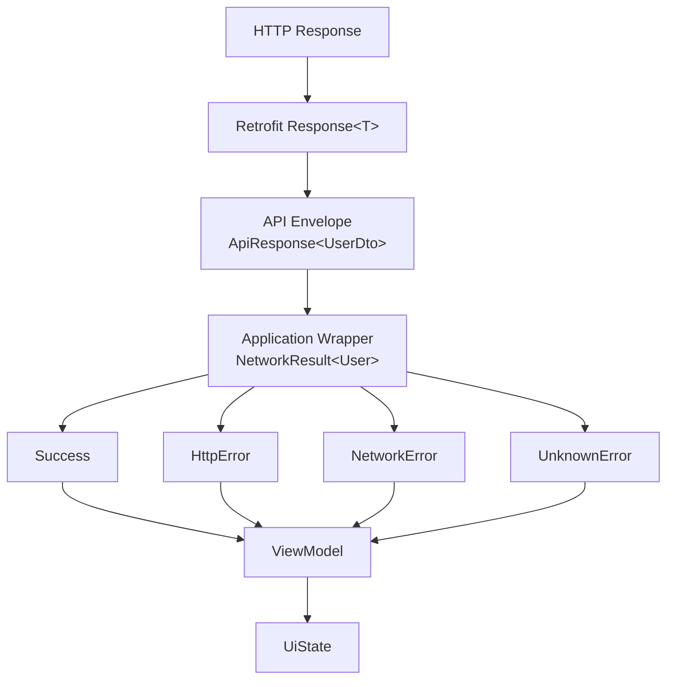
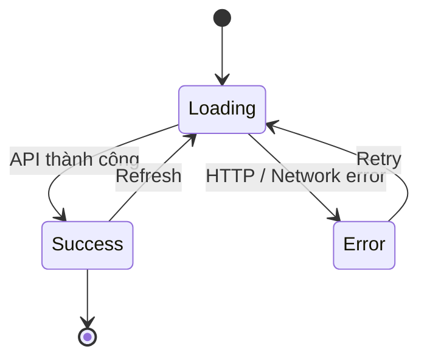
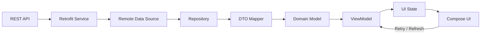

[](https://developer.android.com/topic/architecture?utm_source=chatgpt.com)

# 012 - Response Wrapper

**Học phần:** 04 - Network, Async and Services
**Module:** Module 07 - Network
**Nhóm nội dung:** REST with Retrofit
**Nguồn roadmap:** Network / REST with Retrofit
**Loại bài:** Network
**Thứ tự trong module:** 012
**Thời lượng gợi ý:** 32 phút

---

## 1. Tóm tắt

**Response Wrapper** là kỹ thuật đóng gói kết quả của một thao tác network vào một kiểu dữ liệu có cấu trúc, thay vì để các tầng phía trên phải tự xử lý rời rạc:

* dữ liệu thành công,
* HTTP error,
* lỗi mạng,
* lỗi parse dữ liệu,
* trạng thái loading,
* thông báo lỗi.

Trong Android hiện đại, network/data source nên nằm sau **Repository** thay vì để `Composable`, `Activity`, `Fragment` hay `ViewModel` trực tiếp phụ thuộc vào Retrofit service. Android Architecture Guide cũng khuyến nghị một data layer rõ ràng, repository là entry point của data layer và UI được điều khiển bởi state. ([Android Developers][1])

Một luồng điển hình:

```text
Retrofit
   │
   ▼
Response<DTO>
   │
   ▼
RemoteDataSource / Repository
   │
   ├── Success(data)
   ├── HttpError(...)
   └── NetworkError(...)
   │
   ▼
Domain Model
   │
   ▼
ViewModel
   │
   ▼
UiState
   │
   ├── Loading
   ├── Success
   └── Error
   │
   ▼
Compose UI
```

---

# 2. Mục tiêu học tập

Sau bài này, bạn có thể:

* Giải thích được **Response Wrapper là gì**.
* Phân biệt:

  * Retrofit `Response<T>`;
  * API response envelope;
  * application-level `Result<T>` / `NetworkResult<T>`;
  * `UiState`.
* Đóng gói `success/error` thành kiểu dữ liệu rõ ràng.
* Không để `IOException`, `HttpException` hoặc HTTP status code lan trực tiếp lên UI.
* Map:

```text
DTO → Domain Model → UI Model
```

* Hiển thị đầy đủ:

```text
Loading → Success
        → Error → Retry
```

* Unit test được các trường hợp:

  * HTTP `2xx`;
  * HTTP `4xx`;
  * HTTP `5xx`;
  * mất mạng;
  * response body rỗng;
  * JSON không hợp lệ.

---

# 3. Response Wrapper là gì?

Giả sử API:

```http
GET /users/42
```

trả về:

```json
{
  "id": 42,
  "name": "An",
  "avatar": "https://example.com/avatar.jpg"
}
```

Retrofit interface có thể được khai báo:

```kotlin
interface UserApi {

    @GET("users/{id}")
    suspend fun getUser(
        @Path("id") id: Long
    ): Response<UserDto>
}
```

Retrofit `Response<T>` chứa thông tin HTTP response, nhưng **không nên để toàn bộ ứng dụng phụ thuộc trực tiếp vào kiểu này**.

Ví dụ code không tốt:

```kotlin
viewModelScope.launch {
    try {
        val response = api.getUser(42)

        if (response.isSuccessful) {
            _name.value = response.body()?.name
        } else if (response.code() == 401) {
            // ...
        } else if (response.code() == 404) {
            // ...
        } else if (response.code() == 500) {
            // ...
        }
    } catch (e: Exception) {
        // ...
    }
}
```

Khi có 20 endpoint, code sẽ nhanh chóng trở thành:

```text
ViewModel
 ├── if response.isSuccessful
 ├── if code == 401
 ├── if code == 404
 ├── if code == 500
 ├── catch IOException
 └── catch Exception
```

Response Wrapper giải quyết vấn đề này bằng cách biến nhiều kiểu kết quả network thành **một contract thống nhất**.

Android Architecture Guide cũng đề cập rằng kết quả của data-layer operations có thể được mô hình hóa bằng một `Result<T>` để biểu diễn các lỗi đã biết thay vì chỉ trả `T`. ([Android Developers][2])

---

# 4. Ba khái niệm rất dễ nhầm

## 4.1. Retrofit `Response<T>`

Đây là wrapper do Retrofit cung cấp:

```kotlin
Response<UserDto>
```

Nó đại diện cho HTTP response và cho phép kiểm tra những thông tin như:

```kotlin
response.isSuccessful
response.code()
response.message()
response.body()
response.errorBody()
response.headers()
```

Retrofit là HTTP client ánh xạ REST API thành interface Java/Kotlin thông qua annotations. ([Square Open Source][3])

---

## 4.2. Server Response Envelope

Backend đôi khi trả JSON:

```json
{
  "success": true,
  "message": "OK",
  "data": {
    "id": 42,
    "name": "An"
  }
}
```

Ta có thể model:

```kotlin
data class ApiResponse<T>(
    val success: Boolean,
    val message: String?,
    val data: T?
)
```

Retrofit:

```kotlin
@GET("users/{id}")
suspend fun getUser(
    @Path("id") id: Long
): Response<ApiResponse<UserDto>>
```

Ở đây:

```text
Response<...>
```

là wrapper HTTP của Retrofit.

Còn:

```text
ApiResponse<...>
```

là cấu trúc JSON do **server quy định**.

---

## 4.3. Application Result Wrapper

Đây mới là Response Wrapper mà bài học tập trung vào.

Ví dụ:

```kotlin
sealed interface NetworkResult<out T> {

    data class Success<T>(
        val data: T
    ) : NetworkResult<T>

    data class HttpError(
        val code: Int,
        val message: String?
    ) : NetworkResult<Nothing>

    data class NetworkError(
        val exception: IOException
    ) : NetworkResult<Nothing>

    data class UnknownError(
        val throwable: Throwable
    ) : NetworkResult<Nothing>
}
```

Các tầng phía trên giờ chỉ cần hiểu:

```text
NetworkResult<T>
```

thay vì hiểu toàn bộ Retrofit.

---

# 5. Sơ đồ ba lớp Wrapper



Có thể hiểu:

```text
Retrofit Response
        ↓
      HTTP
        ↓
API Response Envelope
        ↓
   JSON contract
        ↓
NetworkResult
        ↓
application contract
        ↓
UiState
        ↓
screen contract
```

---

# 6. Tại sao Response Wrapper quan trọng?

## Không dùng wrapper

ViewModel có thể phải biết:

```text
Retrofit
Response<T>
HTTP 401
HTTP 403
HTTP 404
HTTP 500
IOException
JSON parsing
```

Dẫn tới coupling:

```text
UI
 ↓
ViewModel
 ↓
Retrofit implementation details
```

---

## Có wrapper

```text
UI
 ↓
ViewModel
 ↓
Repository
 ↓
NetworkResult
 ↓
RemoteDataSource
 ↓
Retrofit
```

Repository trở thành ranh giới bảo vệ phần còn lại của ứng dụng khỏi implementation của network layer.

Điều này phù hợp với hướng dẫn Android: UI/ViewModel không nên truy cập data source trực tiếp; repository nên là entry point của data layer. ([Android Developers][1])

---

# 7. Ví dụ hoàn chỉnh

Ta xây dựng màn hình:

> **User Profile**

API:

```text
GET /users/42
```

---

## 7.1. DTO

```kotlin
data class UserDto(
    val id: Long,
    val name: String,
    val avatar: String?,
    val email: String?
)
```

DTO phản ánh contract của API.

---

# 8. Domain Model

Không nên dùng `UserDto` khắp ứng dụng.

```kotlin
data class User(
    val id: Long,
    val displayName: String,
    val avatarUrl: String?
)
```

Mapper:

```kotlin
fun UserDto.toDomain(): User {
    return User(
        id = id,
        displayName = name,
        avatarUrl = avatar
    )
}
```

Android Architecture Guide khuyến nghị tách model giữa các layer khi điều đó giúp cách ly external data model với kiểu dữ liệu mà app thực sự cần. ([Android Developers][1])

Ví dụ:

```text
API thay đổi:

name
  ↓
full_name
```

Nếu UI dùng trực tiếp DTO:

```text
API change
 ↓
DTO
 ↓
ViewModel
 ↓
Screen A
 ↓
Screen B
 ↓
Screen C
```

Nếu có mapper:

```text
API change
     ↓
UserDto
     ↓
  Mapper
     ↓
   User
     ↓
UI không cần thay đổi
```

---

# 9. Retrofit Interface

```kotlin
interface UserApi {

    @GET("users/{id}")
    suspend fun getUser(
        @Path("id") id: Long
    ): Response<UserDto>
}
```

---

# 10. Tạo Response Wrapper

Một phiên bản đơn giản:

```kotlin
sealed interface NetworkResult<out T> {

    data class Success<T>(
        val data: T
    ) : NetworkResult<T>

    data class HttpError(
        val code: Int,
        val message: String?
    ) : NetworkResult<Nothing>

    data class NetworkError(
        val exception: IOException
    ) : NetworkResult<Nothing>

    data class UnknownError(
        val throwable: Throwable
    ) : NetworkResult<Nothing>
}
```

Điểm quan trọng:

```text
Success<T>
```

có data.

Nhưng:

```text
HttpError
NetworkError
UnknownError
```

không cần `T`.

Vì vậy:

```kotlin
NetworkResult<Nothing>
```

rất phù hợp.

---

# 11. Safe API Call

Thay vì lặp `try/catch` cho mọi endpoint, tạo một helper:

```kotlin
suspend fun <T : Any> safeApiCall(
    call: suspend () -> Response<T>
): NetworkResult<T> {

    return try {

        val response = call()

        if (response.isSuccessful) {

            val body = response.body()

            if (body != null) {
                NetworkResult.Success(body)
            } else {
                NetworkResult.HttpError(
                    code = response.code(),
                    message = "Response body is empty"
                )
            }

        } else {

            NetworkResult.HttpError(
                code = response.code(),
                message = response.message()
            )
        }

    } catch (e: IOException) {

        NetworkResult.NetworkError(e)

    } catch (e: Throwable) {

        NetworkResult.UnknownError(e)
    }
}
```

Giờ một endpoint chỉ cần:

```kotlin
safeApiCall {
    api.getUser(id)
}
```

---

# 12. RemoteDataSource

```kotlin
class UserRemoteDataSource(
    private val api: UserApi
) {

    suspend fun getUser(
        id: Long
    ): NetworkResult<UserDto> {

        return safeApiCall {
            api.getUser(id)
        }
    }
}
```

---

# 13. Repository

Repository không nên để `UserDto` lọt sang UI.

```kotlin
class UserRepository(
    private val remoteDataSource: UserRemoteDataSource
) {

    suspend fun getUser(
        id: Long
    ): NetworkResult<User> {

        return when (
            val result = remoteDataSource.getUser(id)
        ) {

            is NetworkResult.Success -> {
                NetworkResult.Success(
                    result.data.toDomain()
                )
            }

            is NetworkResult.HttpError -> result

            is NetworkResult.NetworkError -> result

            is NetworkResult.UnknownError -> result
        }
    }
}
```

Luồng:

```text
Retrofit

Response<UserDto>
       ↓
RemoteDataSource
       ↓
NetworkResult<UserDto>
       ↓
Repository
       ↓
DTO → Domain mapping
       ↓
NetworkResult<User>
```

Data layer Android được thiết kế để chứa application data/business logic và repository có trách nhiệm abstract các data sources khỏi phần còn lại của app. ([Android Developers][2])

---

# 14. Response Wrapper không phải UI State

Đây là một lỗi thiết kế khá phổ biến.

Không nên:

```kotlin
Composable(
    result: NetworkResult<User>
)
```

UI không cần biết:

```text
HTTP
Retrofit
IOException
response.code()
```

Thay vào đó:

```text
NetworkResult
      ↓
ViewModel
      ↓
UiState
      ↓
Compose
```

Android mô tả UI như hình ảnh trực quan của **UI state**, đồng thời khuyến nghị ViewModel expose state và UI render state đó theo UDF. ([Android Developers][4])

---

# 15. Thiết kế UiState

```kotlin
sealed interface UserUiState {

    data object Loading : UserUiState

    data class Success(
        val user: User
    ) : UserUiState

    data class Error(
        val message: String,
        val canRetry: Boolean
    ) : UserUiState
}
```

Chú ý sự khác biệt:

### NetworkResult

```text
HttpError(404)
NetworkError(IOException)
UnknownError(Throwable)
```

### UiState

```text
Error(
    message = "Không thể kết nối Internet",
    canRetry = true
)
```

UI quan tâm **trải nghiệm người dùng**, không quan tâm implementation của HTTP client.

---

# 16. ViewModel

```kotlin
class UserViewModel(
    private val repository: UserRepository
) : ViewModel() {

    private val _uiState =
        MutableStateFlow<UserUiState>(
            UserUiState.Loading
        )

    val uiState: StateFlow<UserUiState> =
        _uiState.asStateFlow()

    fun loadUser(id: Long) {

        viewModelScope.launch {

            _uiState.value =
                UserUiState.Loading

            when (
                val result =
                    repository.getUser(id)
            ) {

                is NetworkResult.Success -> {

                    _uiState.value =
                        UserUiState.Success(
                            result.data
                        )
                }

                is NetworkResult.HttpError -> {

                    _uiState.value =
                        UserUiState.Error(
                            message =
                                mapHttpError(
                                    result.code
                                ),
                            canRetry =
                                result.code >= 500
                        )
                }

                is NetworkResult.NetworkError -> {

                    _uiState.value =
                        UserUiState.Error(
                            message =
                                "Không thể kết nối mạng.",
                            canRetry = true
                        )
                }

                is NetworkResult.UnknownError -> {

                    _uiState.value =
                        UserUiState.Error(
                            message =
                                "Đã xảy ra lỗi.",
                            canRetry = true
                        )
                }
            }
        }
    }
}
```

Android hiện khuyến nghị ViewModel expose UI state, UDF và lifecycle-aware collection ở phía UI. ([Android Developers][1])

---

# 17. Map HTTP Error → User Message

Không nên:

```kotlin
Text("HTTP ERROR 503")
```

Thông tin đó hữu ích cho developer nhưng rất ít ý nghĩa với user.

Có thể tạo:

```kotlin
fun mapHttpError(
    code: Int
): String {

    return when (code) {

        400 ->
            "Yêu cầu không hợp lệ."

        401 ->
            "Phiên đăng nhập đã hết hạn."

        403 ->
            "Bạn không có quyền thực hiện thao tác này."

        404 ->
            "Không tìm thấy dữ liệu."

        429 ->
            "Bạn thao tác quá nhanh. Hãy thử lại sau."

        in 500..599 ->
            "Máy chủ đang gặp sự cố."

        else ->
            "Không thể tải dữ liệu."
    }
}
```

Tư duy:

```text
Technical Error
      ↓
Error Mapping
      ↓
User Meaning
```

---

# 18. Compose UI

```kotlin
@Composable
fun UserScreen(
    viewModel: UserViewModel
) {

    val uiState by viewModel
        .uiState
        .collectAsStateWithLifecycle()

    when (val state = uiState) {

        UserUiState.Loading -> {

            CircularProgressIndicator()
        }

        is UserUiState.Success -> {

            UserContent(
                user = state.user
            )
        }

        is UserUiState.Error -> {

            ErrorContent(
                message = state.message,
                canRetry = state.canRetry,
                onRetry = {
                    viewModel.loadUser(42)
                }
            )
        }
    }
}
```

`collectAsStateWithLifecycle()` là cách Android hiện khuyến nghị để Compose thu thập UI state theo lifecycle. ([Android Developers][1])

---

# 19. Luồng trạng thái hoàn chỉnh



Về trải nghiệm người dùng:

```text
User mở màn hình
       ↓
     Loading
       ↓
 ┌─────┴────────┐
 ↓              ↓
Success        Error
                 ↓
               Retry
                 ↓
              Loading
```

---

# 20. Phân loại lỗi

Response Wrapper tốt nên giúp bạn phân biệt các failure thay vì gom tất cả thành:

```kotlin
Error("Something went wrong")
```

Một cách phân loại:

| Failure      | Ví dụ                   |               Retry? |
| ------------ | ----------------------- | -------------------: |
| Network      | mất Wi-Fi               |            thường có |
| Timeout      | server phản hồi quá lâu |                   có |
| Unauthorized | HTTP 401                | thường refresh/login |
| Forbidden    | HTTP 403                |                không |
| Not Found    | HTTP 404                |       tùy trường hợp |
| Rate limit   | HTTP 429                |            retry sau |
| Server       | HTTP 500                |                   có |
| Parsing      | JSON sai schema         |         thường không |
| Unknown      | lỗi chưa xác định       |                  tùy |

---

# 21. Wrapper tốt hơn với AppError

Khi project lớn hơn, tránh lưu raw exception trong toàn bộ app:

```kotlin
sealed interface AppError {

    data object NoInternet : AppError

    data object Timeout : AppError

    data object Unauthorized : AppError

    data object Forbidden : AppError

    data object NotFound : AppError

    data object ServerError : AppError

    data object InvalidResponse : AppError

    data class Unknown(
        val cause: Throwable
    ) : AppError
}
```

Wrapper:

```kotlin
sealed interface Result<out T> {

    data class Success<T>(
        val data: T
    ) : Result<T>

    data class Failure(
        val error: AppError
    ) : Result<Nothing>
}
```

Giờ architecture sạch hơn:

```text
HTTP 401
HTTP 403
IOException
SocketTimeoutException
JSON error
       │
       ▼
   Error Mapper
       │
       ▼
    AppError
       │
       ▼
 Result<T>
```

---

# 22. Một kiến trúc production dễ mở rộng



Tương ứng package:

```text
feature/user/

├── data/
│   ├── remote/
│   │   ├── UserApi.kt
│   │   ├── UserDto.kt
│   │   └── UserRemoteDataSource.kt
│   │
│   ├── mapper/
│   │   └── UserMapper.kt
│   │
│   └── UserRepositoryImpl.kt
│
├── domain/
│   ├── User.kt
│   └── UserRepository.kt
│
└── presentation/
    ├── UserViewModel.kt
    ├── UserUiState.kt
    └── UserScreen.kt
```

---

# 23. Lifecycle liên quan như thế nào?

Giả sử user:

```text
Mở Profile
    ↓
API đang chạy
    ↓
xoay màn hình
```

Nếu network call được đặt trực tiếp trong `Activity`:

```text
Activity bị recreate
        ↓
request/state dễ bị quản lý sai
```

Một thiết kế tốt:

```text
Compose
   ↓
ViewModel
   ↓
Repository
```

ViewModel giữ business/UI state ở ngoài Composition, và UI chỉ quan sát state theo lifecycle. Android cũng phân loại nhiều UI-oriented operations là operations gắn với caller lifecycle, chẳng hạn lifecycle của ViewModel. ([Android Developers][2])

---

# 24. Response Wrapper và StateFlow

Một flow điển hình:

```text
Repository
    │
    ▼
Result<User>
    │
    ▼
ViewModel
    │
    ▼
StateFlow<UserUiState>
    │
    ▼
Compose
```

Không cần:

```text
Retrofit Callback
      ↓
Activity
      ↓
setText()
```

Android khuyến nghị dùng coroutines/Flow để giao tiếp giữa các layer và UDF để state đi xuống UI còn events đi ngược về ViewModel. ([Android Developers][1])

---

# 25. Retry

Error UI:

```kotlin
@Composable
fun ErrorContent(
    message: String,
    canRetry: Boolean,
    onRetry: () -> Unit
) {

    Column {

        Text(message)

        if (canRetry) {

            Button(
                onClick = onRetry
            ) {
                Text("Thử lại")
            }
        }
    }
}
```

Flow:

```text
HTTP 500
   ↓
ServerError
   ↓
UiState.Error
   ↓
"Máy chủ đang gặp sự cố"
   ↓
[ Thử lại ]
   ↓
loadUser()
```

---

# 26. Offline

Retry bằng button là mức cơ bản.

Ứng dụng production có thể cần:

```text
Network
   ↓
Repository
  ↙  ↘
Room   Remote API
```

Ví dụ offline-first:

```text
UI
 ↓
Repository
 ↓
Local Database ← Network sync
```

Android hướng dẫn rằng ứng dụng offline-first thường dựa nhiều hơn vào local source of truth, đồng thời WorkManager có thể được sử dụng cho persistent synchronization/retry khi connectivity trở lại. ([Android Developers][5])

---

# 27. Đừng biến Response Wrapper thành "God Wrapper"

Không nên tạo:

```kotlin
data class ApiResult<T>(
    val loading: Boolean,
    val successful: Boolean,
    val code: Int?,
    val data: T?,
    val error: Throwable?,
    val errorMessage: String?,
    val retry: Boolean,
    val empty: Boolean
)
```

Nó cho phép state vô nghĩa:

```text
loading = true
successful = true
error != null
```

Tốt hơn dùng sealed type:

```kotlin
sealed interface Result<out T> {

    data class Success<T>(
        val data: T
    ) : Result<T>

    data class Failure(
        val error: AppError
    ) : Result<Nothing>
}
```

Khi đó compiler giúp loại bỏ nhiều impossible states.

---

# 28. Có nên cho Loading vào NetworkResult?

Có hai lựa chọn.

### Cách A — NetworkResult chỉ chứa kết quả operation

```kotlin
Result<T>
```

chỉ:

```text
Success
Failure
```

Loading thuộc:

```text
UiState
```

Đây thường là lựa chọn sạch hơn cho `suspend` function.

---

### Cách B — Resource<T>

Một số project sử dụng:

```kotlin
sealed interface Resource<out T> {

    data object Loading : Resource<Nothing>

    data class Success<T>(
        val data: T
    ) : Resource<T>

    data class Error(
        val message: String
    ) : Resource<Nothing>
}
```

Có thể hữu ích khi repository expose:

```kotlin
Flow<Resource<T>>
```

Nhưng cần tránh trộn:

```text
network state
+
UI rendering state
+
domain state
```

vào một wrapper duy nhất.

---

# 29. Unit Test

Response Wrapper đặc biệt hữu ích vì logic có contract rõ ràng.

Ví dụ:

```kotlin
@Test
fun `200 response returns Success`() = runTest {

    val result =
        safeApiCall {
            Response.success(
                UserDto(
                    id = 1,
                    name = "An",
                    avatar = null,
                    email = null
                )
            )
        }

    assertTrue(
        result is NetworkResult.Success
    )
}
```

---

## Test HTTP Error

```kotlin
@Test
fun `404 response returns HttpError`() = runTest {

    val errorBody =
        "{}".toResponseBody(
            "application/json".toMediaType()
        )

    val response =
        Response.error<UserDto>(
            404,
            errorBody
        )

    val result =
        safeApiCall {
            response
        }

    assertTrue(
        result is NetworkResult.HttpError
    )
}
```

---

## Test Network Error

```kotlin
@Test
fun `IOException returns NetworkError`() = runTest {

    val result =
        safeApiCall<UserDto> {
            throw IOException(
                "No internet"
            )
        }

    assertTrue(
        result is NetworkResult.NetworkError
    )
}
```

Retrofit cũng cung cấp `retrofit-mock`, với các tiện ích mô phỏng network call và network behavior cho testing. ([Square Open Source][6])

---

# 30. Những trường hợp nên test

```text
                    API call
                       │
         ┌─────────────┼───────────────┐
         ↓             ↓               ↓
       HTTP         Network          Parsing
         │             │               │
   ┌─────┼─────┐   IOException     malformed JSON
   ↓     ↓     ↓
 200   404    500
```

Checklist:

* `200 + body`;
* `200 + empty body`;
* `201`;
* `204 No Content`;
* `400`;
* `401`;
* `403`;
* `404`;
* `429`;
* `500`;
* `503`;
* timeout;
* mất Internet;
* malformed JSON;
* field bị thiếu;
* field nullable ngoài dự kiến.

---

# 31. Debugging

Khi debug, đừng chỉ log:

```text
API failed
```

Nên có đủ context:

```text
GET /users/42

HTTP: 500
RequestId: abc123
Duration: 840 ms
ErrorType: ServerError
```

Nhưng:

> Không log access token, password, refresh token hoặc dữ liệu cá nhân nhạy cảm.

Một Response Wrapper tập trung việc mapping lỗi cũng giúp logging và telemetry nhất quán hơn.

---

# 32. Những anti-pattern phổ biến

## Anti-pattern 1 — Retrofit trong Composable

```kotlin
@Composable
fun Screen() {
    api.getUsers()
}
```

Sai boundary.

---

## Anti-pattern 2 — DTO trực tiếp lên UI

```text
API
 ↓
UserDto
 ↓
Composable
```

Khi backend đổi schema, UI bị ảnh hưởng.

---

## Anti-pattern 3 — Catch Exception mọi nơi

```kotlin
try {
    ...
} catch (e: Exception) {
    ...
}
```

xuất hiện trong:

```text
ViewModel A
ViewModel B
ViewModel C
Repository A
Repository B
```

---

## Anti-pattern 4 — Chỉ có Success/Error

```text
Success
Error
```

nhưng không biết:

```text
No internet?
401?
404?
500?
Parsing?
```

---

## Anti-pattern 5 — Hiển thị exception cho user

Không nên:

```text
java.net.UnknownHostException:
Unable to resolve host...
```

Nên:

```text
Không thể kết nối Internet.
```

---

# 33. Mental Model

Hãy nhớ ba tầng:

```text
┌───────────────────────────────┐
│ Retrofit                     │
│                              │
│ Response<UserDto>            │
└──────────────┬────────────────┘
               │
               ▼
┌───────────────────────────────┐
│ Data / Domain                │
│                              │
│ Result<User>                 │
│ Success / Failure            │
└──────────────┬────────────────┘
               │
               ▼
┌───────────────────────────────┐
│ Presentation                 │
│                              │
│ UserUiState                  │
│ Loading / Success / Error    │
└───────────────────────────────┘
```

Một câu để nhớ:

> **`Response<T>` mô tả HTTP, `Result<T>` mô tả kết quả nghiệp vụ/data operation, còn `UiState` mô tả thứ màn hình phải hiển thị.**

---

# 34. Bài thực hành 32 phút

## Phần 1 — 5 phút

Tạo:

```kotlin
UserDto
User
UserApi
```

---

## Phần 2 — 7 phút

Tạo:

```kotlin
NetworkResult<T>
```

và:

```kotlin
safeApiCall()
```

---

## Phần 3 — 5 phút

Tạo mapper:

```text
UserDto
   ↓
 User
```

---

## Phần 4 — 7 phút

Tạo:

```kotlin
UserUiState
UserViewModel
```

với:

```text
Loading
Success
Error
```

---

## Phần 5 — 5 phút

Compose screen:

```text
Loading → CircularProgressIndicator

Success → UserCard

Error → ErrorMessage + Retry
```

---

## Phần 6 — 3 phút

Test ít nhất:

```text
Success
404
IOException
```

---

# 35. Bài tập

Xây dựng hoặc mock endpoint:

```http
GET /users/{id}
```

Ứng dụng phải hỗ trợ:

```text
Loading
   ↓
API call
   ↓
┌────────────┬────────────┐
↓            ↓            ↓
Success   HTTP Error   Network Error
                           ↓
                         Retry
```

### Yêu cầu

* Không dùng `Response<T>` trực tiếp trong Composable.
* DTO không được truyền trực tiếp sang UI.
* Repository phải map DTO → Domain.
* Network failure phải được model rõ ràng.
* ViewModel phải map network/domain result → `UiState`.
* UI có nút Retry.
* Có ít nhất 3 unit test.

---

# 36. Artifact đưa vào portfolio

Một mini project tốt có thể là:

```text
RetrofitResponseWrapperDemo/
│
├── data/
│   ├── UserApi.kt
│   ├── UserDto.kt
│   ├── UserRemoteDataSource.kt
│   ├── SafeApiCall.kt
│   └── NetworkResult.kt
│
├── domain/
│   └── User.kt
│
├── presentation/
│   ├── UserViewModel.kt
│   ├── UserUiState.kt
│   └── UserScreen.kt
│
└── test/
    └── UserRepositoryTest.kt
```

README có thể mô tả:

```text
REST API
   ↓
Retrofit
   ↓
Response<DTO>
   ↓
NetworkResult<DTO>
   ↓
Repository
   ↓
Domain Model
   ↓
UiState
   ↓
Jetpack Compose
```

Screenshot nên có ba trạng thái:

```text
01_loading.png

02_success.png

03_error_retry.png
```

---

# 37. Checklist hoàn thành

* [ ] Giải thích được Response Wrapper.
* [ ] Phân biệt được `Response<T>` và application `Result<T>`.
* [ ] Phân biệt được API envelope và network result.
* [ ] Không expose Retrofit `Response<T>` lên UI.
* [ ] Có DTO riêng.
* [ ] Có domain model riêng khi cần.
* [ ] Có DTO mapper.
* [ ] Có `Success`.
* [ ] Có HTTP error.
* [ ] Có network error.
* [ ] Có unknown/parsing error strategy.
* [ ] ViewModel expose `UiState`.
* [ ] UI có Loading.
* [ ] UI có Success.
* [ ] UI có Error.
* [ ] UI có Retry.
* [ ] State được collect theo lifecycle.
* [ ] Có test HTTP success.
* [ ] Có test HTTP error.
* [ ] Có test network failure.
* [ ] Không expose raw exception cho người dùng.
* [ ] Không log token hoặc dữ liệu nhạy cảm.
* [ ] Có README/diagram để đưa vào portfolio.

---

# 38. Production Notes

Khi đưa Response Wrapper vào production, nên kiểm tra toàn bộ pipeline:

```text
HTTP
 ↓
Retrofit
 ↓
Parsing
 ↓
DTO
 ↓
Response Wrapper
 ↓
Error Mapping
 ↓
Repository
 ↓
Domain
 ↓
ViewModel
 ↓
UiState
 ↓
User
```

Đặc biệt cần tự hỏi:

```text
HTTP 401
   ↓
Refresh token hay logout?

HTTP 429
   ↓
Có retry ngay không?

HTTP 500
   ↓
Có retry/backoff không?

No Internet
   ↓
Có cache/offline mode không?

JSON thay đổi
   ↓
Mapper có bảo vệ UI không?

Rotate/background
   ↓
State có được giữ đúng không?

Process death
   ↓
Operation có thực sự cần sống tiếp không?
```

Android phân biệt UI-oriented, app-oriented và business-oriented operations; công việc quan trọng cần tồn tại lâu hơn lifecycle màn hình có thể cần chiến lược khác, và persistent work phù hợp có thể được chuyển sang WorkManager. ([Android Developers][2])

---

# 39. Tổng kết

**Response Wrapper** là một boundary giữa chi tiết của HTTP/network và phần còn lại của Android app.

Kiến trúc nên hướng tới:

```text
Retrofit
   ↓
Response<UserDto>
   ↓
Safe API Call
   ↓
Result<UserDto>
   ↓
Repository
   ↓
User
   ↓
ViewModel
   ↓
UserUiState
   ↓
Compose
```

Không nên:

```text
Retrofit
   ↓
Response<T>
   ↓
Composable
```

Mục tiêu cuối cùng không chỉ là "bắt exception", mà là biến một môi trường network đầy bất định:

```text
timeout
404
500
offline
bad JSON
empty body
```

thành một contract rõ ràng:

```kotlin
Result<T>
```

rồi tiếp tục biến nó thành state phù hợp với người dùng:

```kotlin
UiState
```

Đó là lý do Response Wrapper giúp tăng **maintainability, testability, khả năng xử lý lỗi và độ ổn định của ứng dụng**; đồng thời phù hợp với cách Android hiện khuyến nghị phân tách data layer, repository, ViewModel và lifecycle-aware UI state. ([Android Developers][1])

[1]: https://developer.android.com/topic/architecture/recommendations "Recommendations for Android architecture  |  App architecture  |  Android Developers"
[2]: https://developer.android.com/topic/architecture/data-layer "Data layer  |  App architecture  |  Android Developers"
[3]: https://square.github.io/retrofit/2.x/retrofit/retrofit2/package-summary.html?utm_source=chatgpt.com "retrofit2 (retrofit API)"
[4]: https://developer.android.com/topic/architecture/ui-layer "UI layer  |  App architecture  |  Android Developers"
[5]: https://developer.android.com/topic/architecture/data-layer/offline-first "Build an offline-first app  |  App architecture  |  Android Developers"
[6]: https://square.github.io/retrofit/2.x/retrofit-mock/retrofit2/mock/NetworkBehavior.html?utm_source=chatgpt.com "NetworkBehavior (retrofit-mock API)"

---

# Bài luyện tập

## Mục tiêu


## Đề bài


## Yêu cầu hoàn thành

- [ ] 
- [ ] 
- [ ] 

## Kết quả / lời giải


## Ghi chú
