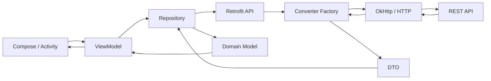

# 013 - Converter Factory

**Học phần:** 04 - Network, Async and Services
**Module:** Module 07 - Network
**Nhóm nội dung:** REST with Retrofit
**Nguồn roadmap:** Network / REST with Retrofit
**Loại bài:** Network
**Thứ tự trong module:** 013
**Thời lượng gợi ý:** 32 phút

[](https://devblog.mobcoder.com/best-android-libraries/?utm_source=chatgpt.com)

> **Ý chính:** `Converter Factory` là thành phần giúp Retrofit chuyển đổi dữ liệu giữa **HTTP body** và **object Kotlin/Java**. Nhờ đó, app không phải tự lấy chuỗi JSON rồi parse thủ công ở từng API call. Retrofit định nghĩa `Converter.Factory` với khả năng cung cấp converter cho request body và response body. ([Square Open Source][1])

---

## 1. Tóm tắt

Khi server trả về:

```json
{
  "id": 1,
  "name": "An Khanh",
  "email": "khanh@example.com"
}
```

Retrofit nhận dữ liệu HTTP thực tế dưới dạng `ResponseBody`.

Nhưng code Android thường muốn làm việc trực tiếp với:

```kotlin
data class UserDto(
    val id: Int,
    val name: String,
    val email: String
)
```

`Converter Factory` chính là lớp trung gian thực hiện:

```text
ResponseBody
     ↓
JSON
     ↓
Converter Factory
     ↓
UserDto
```

Và ở chiều ngược lại:

```text
CreateUserRequest
        ↓
Converter Factory
        ↓
JSON
        ↓
RequestBody
        ↓
HTTP Request
```

Nói ngắn gọn:

> **Converter Factory quyết định cách Retrofit biến dữ liệu mạng thành object mà Kotlin hiểu được và ngược lại.**

---

# 2. Converter Factory nằm ở đâu?

Trong một kiến trúc Android điển hình:



Theo hướng dẫn kiến trúc Android, network source thuộc **data layer**; repository nên là entry point mà UI/domain sử dụng thay vì để UI truy cập trực tiếp network data source. Android cũng khuyến nghị tách network model khỏi model mà những layer phía trên thực sự cần. ([Android Developers][2])

Vì vậy:

```text
Converter Factory
        ↓
Network / Data Layer
```

chứ không phải:

```text
Composable
    ↓
parse JSON
```

---

# 3. Vấn đề khi không có Converter Factory

Giả sử API trả:

```json
{
  "id": 42,
  "title": "Learn Retrofit"
}
```

Nếu không sử dụng converter phù hợp, về lý thuyết code của bạn sẽ phải xử lý kiểu:

```kotlin
val json = responseBody.string()

val jsonObject = JSONObject(json)

val id = jsonObject.getInt("id")
val title = jsonObject.getString("title")
```

Nếu app có:

```text
50 endpoint
×
nhiều field
×
nhiều nested object
```

thì việc parse thủ công nhanh chóng trở nên khó bảo trì.

Converter giúp chuyển trực tiếp:

```json
{
  "id": 42,
  "title": "Learn Retrofit"
}
```

thành:

```kotlin
TodoDto(
    id = 42,
    title = "Learn Retrofit"
)
```

---

# 4. Cơ chế hoạt động

Retrofit có abstraction:

```text
Converter.Factory
```

Một factory có thể cung cấp converter để xử lý các loại dữ liệu khác nhau, bao gồm converter từ object thành request body và converter từ HTTP response body thành object. ([Square Open Source][3])

Có thể hình dung:

```text
              Retrofit
                  │
                  ▼
        ┌────────────────────┐
        │ Converter Factory  │
        └────────────────────┘
             │          │
       Request          Response
             │          │
             ▼          ▼
Object → RequestBody    ResponseBody → Object
```

Ví dụ:

```text
POST /users

CreateUserDto
      ↓
JSON Converter
      ↓
{
  "name": "Khanh"
}
      ↓
HTTP request
```

Response:

```text
HTTP response
      ↓
{
  "id": 7,
  "name": "Khanh"
}
      ↓
JSON Converter
      ↓
UserDto
```

---

# 5. Các Converter Factory thường gặp

Retrofit có các converter riêng cho nhiều kiểu serialization. Tài liệu Retrofit chính thức cung cấp converter cho JSON như Gson và Moshi, text primitive qua Scalars, cũng như Protocol Buffers và Wire. ([Square Open Source][4])

| Converter                      | Dùng cho           | Ví dụ                  |
| ------------------------------ | ------------------ | ---------------------- |
| `GsonConverterFactory`         | JSON               | REST API JSON          |
| `MoshiConverterFactory`        | JSON               | Kotlin/JSON            |
| Kotlin Serialization converter | JSON/serialization | Kotlin `@Serializable` |
| `ScalarsConverterFactory`      | text/plain         | `String`, primitive    |
| `ProtoConverterFactory`        | Protocol Buffers   | Binary API             |
| `WireConverterFactory`         | Protocol Buffers   | Square Wire            |

Trong phần lớn app REST thông thường:

```text
Server
 ↓
JSON
 ↓
Gson / Moshi / Kotlin Serialization
 ↓
DTO
```

là trường hợp quan trọng nhất cần hiểu.

---

# 6. Ví dụ cơ bản với Gson

## 6.1 Dependency

Ví dụ cấu trúc dependency:

```kotlin
dependencies {
    implementation("com.squareup.retrofit2:retrofit:<version>")
    implementation("com.squareup.retrofit2:converter-gson:<version>")
}
```

Repository Retrofit hiện công bố artifact theo group `com.squareup.retrofit2`; nên giữ phiên bản các module Retrofit tương thích với nhau thay vì copy ngẫu nhiên một phiên bản cũ từ tutorial. ([GitHub][5])

---

## 6.2 DTO

```kotlin
data class UserDto(
    val id: Int,
    val name: String,
    val email: String
)
```

Server:

```json
{
  "id": 1,
  "name": "Khanh",
  "email": "khanh@example.com"
}
```

---

## 6.3 Retrofit Interface

```kotlin
interface UserApi {

    @GET("users/{id}")
    suspend fun getUser(
        @Path("id") id: Int
    ): UserDto
}
```

Điểm đáng chú ý:

```kotlin
suspend fun getUser(...): UserDto
```

không hề có:

```kotlin
String
JSONObject
ResponseBody
```

ở code business thông thường.

Converter xử lý bước đó.

---

# 7. Đăng ký Converter Factory

```kotlin
val retrofit = Retrofit.Builder()
    .baseUrl("https://api.example.com/")
    .addConverterFactory(
        GsonConverterFactory.create()
    )
    .build()
```

Điểm quan trọng nhất:

```kotlin
.addConverterFactory(
    GsonConverterFactory.create()
)
```

Có thể đọc nó như:

> “Retrofit, nếu gặp request/response phù hợp thì hãy dùng Gson để serialize hoặc deserialize nó.”

`GsonConverterFactory` là converter dùng Gson cho JSON. ([Square Open Source][6])

---

# 8. Retrofit tạo API implementation

```kotlin
val userApi = retrofit.create(UserApi::class.java)
```

Sau đó:

```kotlin
val user = userApi.getUser(1)
```

Developer nhìn thấy:

```text
getUser()
    ↓
UserDto
```

Nhưng bên dưới thực chất là:

```text
GET /users/1
       ↓
HTTP
       ↓
ResponseBody
       ↓
GsonConverterFactory
       ↓
Gson
       ↓
UserDto
```

---

# 9. Ví dụ với Moshi

Cách sử dụng concept gần như tương tự:

```kotlin
val moshi = Moshi.Builder()
    .build()

val retrofit = Retrofit.Builder()
    .baseUrl(BASE_URL)
    .addConverterFactory(
        MoshiConverterFactory.create(moshi)
    )
    .build()
```

Moshi converter được Retrofit mô tả là converter dùng Moshi cho JSON. ([Square Open Source][4])

Về mặt tư duy:

```text
GsonConverterFactory
MoshiConverterFactory
Kotlin Serialization Converter
```

khác nhau chủ yếu ở:

```text
serialization engine
```

Còn trách nhiệm kiến trúc vẫn là:

```text
HTTP representation
        ↕
Kotlin representation
```

---

# 10. Converter Factory và DTO

Đây là điểm rất dễ nhầm.

Converter:

```text
JSON
 ↓
UserDto
```

nhưng **không có nghĩa `UserDto` nên được đưa trực tiếp ra UI**.

Nên có thêm bước:

```text
JSON
 ↓
Converter
 ↓
UserDto
 ↓
Mapper
 ↓
User
 ↓
UserUiModel
```

Android Architecture Guide khuyến nghị tách model của data source khỏi model mà phần còn lại của ứng dụng sử dụng khi chúng không khớp nhau. Điều này giúp API bên ngoài ít làm rò rỉ cấu trúc vào UI và domain. ([Android Developers][2])

Ví dụ DTO:

```kotlin
data class UserDto(
    val id: Long,
    val first_name: String?,
    val last_name: String?,
    val avatar_url: String?
)
```

Domain model:

```kotlin
data class User(
    val id: Long,
    val fullName: String,
    val avatarUrl: String?
)
```

Mapper:

```kotlin
fun UserDto.toDomain(): User {
    return User(
        id = id,
        fullName = listOfNotNull(
            first_name,
            last_name
        ).joinToString(" "),
        avatarUrl = avatar_url
    )
}
```

Luồng hoàn chỉnh:

```text
Server JSON
    ↓
Converter Factory
    ↓
UserDto
    ↓
Mapper
    ↓
User
```

Đây là hai trách nhiệm khác nhau:

| Thành phần | Chuyển đổi        |
| ---------- | ----------------- |
| Converter  | JSON ↔ DTO        |
| Mapper     | DTO ↔ Domain      |
| UI mapper  | Domain ↔ UI model |

---

# 11. Ví dụ API hoàn chỉnh

Giả sử app lấy danh sách sản phẩm.

Server trả:

```json
[
  {
    "id": 1,
    "title": "Mechanical Keyboard",
    "price": 49.99
  },
  {
    "id": 2,
    "title": "Gaming Mouse",
    "price": 29.99
  }
]
```

DTO:

```kotlin
data class ProductDto(
    val id: Long,
    val title: String,
    val price: Double
)
```

API:

```kotlin
interface ProductApi {

    @GET("products")
    suspend fun getProducts(): List<ProductDto>
}
```

Retrofit:

```kotlin
object NetworkModule {

    private const val BASE_URL =
        "https://api.example.com/"

    val retrofit: Retrofit =
        Retrofit.Builder()
            .baseUrl(BASE_URL)
            .addConverterFactory(
                GsonConverterFactory.create()
            )
            .build()

    val productApi: ProductApi =
        retrofit.create(ProductApi::class.java)
}
```

Khi gọi:

```kotlin
val products = productApi.getProducts()
```

Retrofit nhận:

```json
[
  ...
]
```

và converter biến nó thành:

```kotlin
List<ProductDto>
```

---

# 12. Request Body cũng dùng Converter

Converter Factory không chỉ parse response.

Ví dụ:

```kotlin
data class CreateProductRequest(
    val title: String,
    val price: Double
)
```

Retrofit interface:

```kotlin
interface ProductApi {

    @POST("products")
    suspend fun createProduct(
        @Body request: CreateProductRequest
    ): ProductDto
}
```

Gọi:

```kotlin
api.createProduct(
    CreateProductRequest(
        title = "Keyboard",
        price = 59.99
    )
)
```

Converter thực hiện:

```text
CreateProductRequest
        ↓
Gson
        ↓
{
  "title": "Keyboard",
  "price": 59.99
}
        ↓
RequestBody
```

Response đi chiều ngược lại:

```text
ResponseBody
       ↓
JSON
       ↓
ProductDto
```

---

# 13. Converter Factory không xử lý mọi thứ

Một lỗi tư duy phổ biến là cho rằng:

```text
Retrofit Converter
=
toàn bộ network error handling
```

Không đúng.

Converter chủ yếu chịu trách nhiệm:

```text
serialization
deserialization
```

Ví dụ JSON sai:

```json
{
  "id": "abc"
}
```

trong khi DTO yêu cầu:

```kotlin
val id: Int
```

thì parsing có thể thất bại.

Nhưng các lỗi như:

```text
Không có Internet
DNS fail
Timeout
HTTP 401
HTTP 404
HTTP 500
```

không nên giao hoàn toàn cho converter.

Data/repository layer cần có chiến lược error handling phù hợp. Android Architecture Guide cũng mô tả data layer là nơi có thể hiểu, xử lý hoặc chuyển lỗi thành kiểu lỗi có ý nghĩa hơn cho phía trên. ([Android Developers][2])

---

# 14. Converter + Response Wrapper

Liên hệ với bài **012 - Response Wrapper**:

```text
Retrofit
   ↓
HTTP Response
   ↓
Converter
   ↓
DTO
   ↓
Repository
   ↓
Result Wrapper
```

Ví dụ:

```kotlin
sealed interface ApiResult<out T> {

    data class Success<T>(
        val data: T
    ) : ApiResult<T>

    data class Error(
        val message: String
    ) : ApiResult<Nothing>
}
```

Repository:

```kotlin
class ProductRepository(
    private val api: ProductApi
) {

    suspend fun getProducts(): ApiResult<List<Product>> {
        return try {
            val dto = api.getProducts()

            ApiResult.Success(
                dto.map { it.toDomain() }
            )
        } catch (e: Exception) {
            ApiResult.Error(
                message = e.message ?: "Unknown error"
            )
        }
    }
}
```

Luồng:

```text
JSON
 ↓
Converter
 ↓
DTO
 ↓
Mapper
 ↓
Domain
 ↓
Result
 ↓
UI State
```

---

# 15. Loading, Success, Error

UI không cần biết Gson hay Moshi đang được sử dụng.

```kotlin
sealed interface ProductUiState {

    data object Loading : ProductUiState

    data class Success(
        val products: List<Product>
    ) : ProductUiState

    data class Error(
        val message: String
    ) : ProductUiState
}
```

ViewModel:

```kotlin
class ProductViewModel(
    private val repository: ProductRepository
) : ViewModel() {

    private val _uiState =
        MutableStateFlow<ProductUiState>(
            ProductUiState.Loading
        )

    val uiState =
        _uiState.asStateFlow()

    fun loadProducts() {
        viewModelScope.launch {

            _uiState.value =
                ProductUiState.Loading

            when (
                val result =
                    repository.getProducts()
            ) {
                is ApiResult.Success -> {
                    _uiState.value =
                        ProductUiState.Success(
                            result.data
                        )
                }

                is ApiResult.Error -> {
                    _uiState.value =
                        ProductUiState.Error(
                            result.message
                        )
                }
            }
        }
    }
}
```

Kiến trúc này giữ chi tiết network ở data layer thay vì đưa Retrofit/Gson trực tiếp vào UI. Đây cũng phù hợp với nguyên tắc repository/data source của Android Architecture Guide. ([Android Developers][2])

---

# 16. Compose UI

```kotlin
@Composable
fun ProductScreen(
    state: ProductUiState,
    onRetry: () -> Unit
) {
    when (state) {

        ProductUiState.Loading -> {
            CircularProgressIndicator()
        }

        is ProductUiState.Success -> {
            LazyColumn {
                items(state.products) { product ->
                    Text(product.name)
                }
            }
        }

        is ProductUiState.Error -> {
            Column {
                Text(state.message)

                Button(
                    onClick = onRetry
                ) {
                    Text("Thử lại")
                }
            }
        }
    }
}
```

Converter không xuất hiện ở đây.

Đó chính là dấu hiệu phân tầng tốt:

```text
UI
❌ Gson
❌ JSON
❌ ResponseBody
❌ Retrofit converter

UI
✅ UiState
✅ Domain/UI Model
```

---

# 17. Dùng nhiều Converter Factory

Retrofit cho phép đăng ký nhiều converter factory.

Ví dụ server có:

```text
/api/products → JSON
/api/version  → text/plain
```

Có thể cấu hình:

```kotlin
val retrofit =
    Retrofit.Builder()
        .baseUrl(BASE_URL)
        .addConverterFactory(
            ScalarsConverterFactory.create()
        )
        .addConverterFactory(
            GsonConverterFactory.create()
        )
        .build()
```

`ScalarsConverterFactory` xử lý `String` và các primitive thành `text/plain`. ([Square Open Source][7])

API:

```kotlin
interface AppApi {

    @GET("version")
    suspend fun getVersion(): String

    @GET("products")
    suspend fun getProducts(): List<ProductDto>
}
```

Luồng:

```text
GET /version
     ↓
ScalarsConverter
     ↓
String


GET /products
     ↓
GsonConverter
     ↓
List<ProductDto>
```

---

# 18. Thứ tự Converter rất quan trọng

Ví dụ:

```kotlin
.addConverterFactory(
    ScalarsConverterFactory.create()
)
.addConverterFactory(
    GsonConverterFactory.create()
)
```

Retrofit tìm converter phù hợp từ các factory đã đăng ký.

Một số JSON converter như Gson và Moshi hỗ trợ phạm vi type rất rộng; tài liệu chính thức lưu ý rằng khi trộn chúng với một converter chuyên biệt khác, converter JSON rộng thường nên được thêm sau để converter chuyên biệt có cơ hội xử lý type của nó trước. ([Square Open Source][4])

Có thể nhớ:

```text
Specific converter
       ↓
General converter
```

Ví dụ:

```text
Scalars
   ↓
Gson
```

---

# 19. Sai lầm thường gặp: quên Converter Factory

Code:

```kotlin
Retrofit.Builder()
    .baseUrl(BASE_URL)
    .build()
```

Trong khi API trả object:

```kotlin
suspend fun getUser(): UserDto
```

Retrofit không tự nhiên biết:

```text
JSON → UserDto
```

Bạn cần cung cấp serialization strategy:

```kotlin
.addConverterFactory(
    GsonConverterFactory.create()
)
```

---

# 20. Sai lầm: DTO không khớp JSON

Server:

```json
{
  "user_id": 123,
  "user_name": "Khanh"
}
```

DTO:

```kotlin
data class UserDto(
    val id: Long,
    val name: String
)
```

Tên field không tương ứng.

Với Gson có thể khai báo mapping rõ:

```kotlin
data class UserDto(

    @SerializedName("user_id")
    val id: Long,

    @SerializedName("user_name")
    val name: String
)
```

Tư duy quan trọng:

```text
JSON contract
     ↕
DTO
```

DTO chính là model đại diện cho contract phía network.

---

# 21. Sai lầm: API thay đổi nhưng DTO không đổi

Ban đầu:

```json
{
  "price": 10.5
}
```

Sau này server trả:

```json
{
  "price": null
}
```

Trong khi:

```kotlin
data class ProductDto(
    val price: Double
)
```

có thể dẫn tới parsing/runtime problem tùy serialization library và cấu hình.

Nếu API cho phép null:

```kotlin
data class ProductDto(
    val price: Double?
)
```

Mapper có thể quyết định policy:

```kotlin
fun ProductDto.toDomain() =
    Product(
        price = price ?: 0.0
    )
```

Điểm quan trọng là:

```text
Network uncertainty
       ↓
DTO / Mapper
       ↓
Stable domain model
```

thay vì:

```text
Network uncertainty
       ↓
Composable
```

---

# 22. Converter không thay thế Mapper

Đây là câu hỏi phỏng vấn khá hay.

### Converter

```text
JSON
 ↓
ProductDto
```

### Mapper

```text
ProductDto
 ↓
Product
```

### UI mapper

```text
Product
 ↓
ProductUiModel
```

Ví dụ:

```kotlin
data class ProductDto(
    val id: Long,
    val price: Double,
    val currency: String
)
```

Domain:

```kotlin
data class Product(
    val id: Long,
    val formattedPrice: String
)
```

Mapper:

```kotlin
fun ProductDto.toDomain(): Product {
    return Product(
        id = id,
        formattedPrice =
            "$price $currency"
    )
}
```

Converter không nên chứa business logic kiểu:

```text
format tiền
dịch text
quyết định UI state
lọc business rule
```

---

# 23. Converter Factory và lifecycle

Converter Factory không trực tiếp quản lý:

```text
Activity lifecycle
Fragment lifecycle
Compose lifecycle
```

Nhưng network request chứa converter nằm trong một luồng có lifecycle.

Ví dụ:

```text
Screen
 ↓
ViewModel
 ↓
viewModelScope
 ↓
Repository
 ↓
Retrofit
 ↓
Converter
```

Android phân biệt những network operation chỉ có ý nghĩa khi screen còn tồn tại với operation cần tồn tại lâu hơn screen; scope của operation nên được lựa chọn theo lifecycle phù hợp. ([Android Developers][2])

Do đó không nên:

```kotlin
@Composable
fun Screen() {
    // gọi network tùy tiện mỗi lần recompose
}
```

Mà thường:

```text
Composable
     ↓
ViewModel
     ↓
Repository
```

---

# 24. Rotate màn hình thì sao?

Converter không lưu state.

Nếu Activity recreate:

```text
Activity destroyed
      ↓
Activity recreated
```

UI state nên được quản lý bởi:

```text
ViewModel
StateFlow
SavedStateHandle khi cần
```

chứ không phải Converter Factory.

Có thể hình dung:

```text
Converter
   │
   └── chuyển dữ liệu

ViewModel
   │
   └── giữ screen state

Repository
   │
   └── điều phối dữ liệu
```

---

# 25. Testing Converter

Có ít nhất ba tầng đáng kiểm thử.

## Test 1 — Serialization

Input:

```kotlin
CreateUserRequest(
    name = "Khanh"
)
```

Expected JSON:

```json
{
  "name": "Khanh"
}
```

---

## Test 2 — Deserialization

Input:

```json
{
  "id": 1,
  "name": "Khanh"
}
```

Expected:

```kotlin
UserDto(
    id = 1,
    name = "Khanh"
)
```

---

## Test 3 — Repository

Fake:

```kotlin
FakeUserApi
```

Test:

```text
API DTO
 ↓
Repository
 ↓
Domain Model
```

Android khuyến nghị unit test data layer và fake các dependency đi ra external source như network. ([Android Developers][2])

---

# 26. Những JSON edge case nên test

Một network model tốt nên được thử với:

```json
{}
```

```json
{
  "name": null
}
```

```json
{
  "unknown_field": "value"
}
```

```json
{
  "items": []
}
```

và JSON malformed:

```json
{
  "name":
}
```

Mục tiêu là biết app sẽ phản ứng thế nào trước:

```text
Missing field
Null field
Extra field
Empty collection
Invalid JSON
Wrong data type
```

---

# 27. Debug Converter Error

Khi gặp lỗi parsing, hãy kiểm tra theo chuỗi:

```text
1. HTTP response thực tế
          ↓
2. Content-Type
          ↓
3. JSON structure
          ↓
4. DTO structure
          ↓
5. Nullability
          ↓
6. Field names
          ↓
7. Converter configuration
```

Ví dụ server trả:

```json
{
  "data": {
    "id": 1
  }
}
```

nhưng code lại khai báo:

```kotlin
suspend fun getUser(): UserDto
```

trong khi model đúng phải có wrapper:

```kotlin
data class UserResponse(
    val data: UserDto
)
```

Đây không phải bug của Retrofit.

Đó là:

```text
JSON shape
    ≠
DTO shape
```

---

# 28. Content-Type

Converter hoạt động trong bối cảnh HTTP.

Ví dụ response:

```http
Content-Type: application/json
```

thường tương ứng:

```text
JSON Converter
```

Trong khi:

```http
Content-Type: text/plain
```

có thể phù hợp với:

```text
ScalarsConverterFactory
```

Scalars converter của Retrofit được thiết kế cho `String` và primitive dạng `text/plain`. ([Square Open Source][7])

---

# 29. Custom Converter Factory

Bạn cũng có thể tự viết:

```kotlin
class CustomConverterFactory :
    Converter.Factory() {
}
```

Factory có thể override những điểm như:

```kotlin
requestBodyConverter(...)
```

và:

```kotlin
responseBodyConverter(...)
```

để quyết định liệu factory có xử lý một type nhất định hay không. Đây chính là extension point mà API `Converter.Factory` của Retrofit cung cấp. ([Square Open Source][3])

Concept:

```text
ResponseBody
     ↓
CustomConverterFactory
     ↓
Custom format
     ↓
Object
```

Thường chỉ cần custom converter khi API có format hoặc wrapper đặc biệt mà converter chuẩn không xử lý phù hợp.

---

# 30. Ví dụ Custom Converter về mặt ý tưởng

Server trả:

```text
1|Khanh|khanh@example.com
```

Thay vì JSON.

Bạn muốn:

```kotlin
UserDto(
    id = 1,
    name = "Khanh",
    email = "khanh@example.com"
)
```

Có thể xây converter riêng:

```text
ResponseBody
    ↓
split("|")
    ↓
UserDto
```

Nhưng với REST JSON thông thường:

```text
đừng custom converter nếu Gson/Moshi/Kotlin serialization đã giải quyết được.
```

---

# 31. Quan hệ với các bài trước

Các bài trong nhóm Retrofit liên kết với nhau như sau:

```text
008 Retrofit
      ↓
009 Retrofit Interface
      ↓
010 Path / Query Parameters
      ↓
011 Request Body
      ↓
012 Response Wrapper
      ↓
013 Converter Factory
```

Có thể ghép lại thành một request:

```text
Retrofit Interface
        ↓
@Path / @Query
        ↓
@Body
        ↓
Converter Factory
        ↓
HTTP Request
        ↓
Server
        ↓
HTTP Response
        ↓
Converter Factory
        ↓
DTO / Response
        ↓
Response Wrapper
```

---

# 32. Converter Factory tác động tới UX như thế nào?

Nghe có vẻ đây chỉ là infrastructure nhưng converter sai có thể trực tiếp tạo UX xấu.

Ví dụ:

```text
API trả đúng
     ↓
DTO khai báo sai
     ↓
Converter fail
     ↓
Repository error
     ↓
UI "Something went wrong"
```

User sẽ nghĩ:

```text
"App bị lỗi"
```

mặc dù:

```text
Internet vẫn hoạt động
Server vẫn trả 200
```

Do đó schema/DTO/converter là một phần quan trọng của độ ổn định network layer.

---

# 33. Tác động tới maintainability

### Thiết kế kém

```text
Composable
 ↓
Retrofit
 ↓
Gson
 ↓
JSONObject
 ↓
UI
```

Các layer dính chặt vào nhau.

### Thiết kế tốt hơn

```text
UI
 ↓
ViewModel
 ↓
Repository
 ↓
API
 ↓
Converter
 ↓
HTTP
```

và:

```text
JSON
 ↓
DTO
 ↓
Domain
 ↓
UI Model
```

Đây là cùng tư duy separation of concerns mà Android Architecture Guide áp dụng cho data layer và repository. ([Android Developers][2])

---

# 34. Mental model

Khi học Converter Factory, chỉ cần nhớ:

```text
          NETWORK WORLD
               │
         JSON / XML / Proto
               │
               ▼
      ┌───────────────────┐
      │ Converter Factory │
      └───────────────────┘
               │
               ▼
           Kotlin DTO
               │
               ▼
             Mapper
               │
               ▼
          Domain Model
               │
               ▼
           ViewModel
               │
               ▼
              UI
```

Một câu nhớ nhanh:

> **Converter chuyển format; Mapper chuyển meaning/model.**

---

# 35. Thực hành

## Yêu cầu

Xây một màn hình:

```text
Product List
```

API:

```http
GET /products
```

Response:

```json
[
  {
    "id": 1,
    "title": "Keyboard",
    "price": 59.99
  }
]
```

Bạn cần tạo:

```text
ProductDto
Product
ProductApi
ProductRepository
ProductViewModel
ProductUiState
ProductScreen
```

Converter:

```text
Gson hoặc Moshi
```

Luồng:

```text
GET /products
      ↓
JSON
      ↓
Converter Factory
      ↓
List<ProductDto>
      ↓
Mapper
      ↓
List<Product>
      ↓
Repository
      ↓
ViewModel
      ↓
UI State
```

UI cần có:

```text
Loading
   ↓
Success
   ↓
Error
   ↓
Retry
```

---

# 36. Bài tập

### Bài tập chính

Build hoặc mock API:

```http
GET /users
```

và triển khai bốn trạng thái:

```text
Loading
Success
Error
Retry
```

### Case cần thử

```text
Case A
200 + JSON hợp lệ
→ Success

Case B
200 + JSON sai schema
→ Parsing Error

Case C
500
→ Server Error

Case D
No Internet
→ Network Error

Case E
Retry
→ gọi request lại
```

### Bonus

Thêm endpoint:

```http
GET /version
```

trả:

```text
1.2.0
```

và cấu hình:

```text
ScalarsConverterFactory
+
JSON Converter
```

để hiểu cách nhiều converter cùng tồn tại.

---

# 37. Artifact cho portfolio

Một mini project tốt có thể có cấu trúc:

```text
retrofit-converter-demo/
│
├── data/
│   ├── remote/
│   │   ├── ProductApi.kt
│   │   └── ProductDto.kt
│   │
│   ├── mapper/
│   │   └── ProductMapper.kt
│   │
│   └── repository/
│       └── ProductRepository.kt
│
├── domain/
│   └── Product.kt
│
├── ui/
│   ├── ProductViewModel.kt
│   ├── ProductUiState.kt
│   └── ProductScreen.kt
│
└── README.md
```

README nên có sơ đồ:

```text
REST API
   ↓
Retrofit
   ↓
Converter Factory
   ↓
DTO
   ↓
Mapper
   ↓
Repository
   ↓
ViewModel
   ↓
Compose
```

---

# 38. Câu hỏi tự kiểm tra

1. Converter Factory giải quyết vấn đề gì?
2. Converter khác Mapper như thế nào?
3. `GsonConverterFactory` nằm ở layer nào?
4. Vì sao UI không nên biết Gson?
5. Request body có đi qua converter không?
6. Response body có đi qua converter không?
7. Vì sao thứ tự nhiều converter có thể quan trọng?
8. Khi JSON schema thay đổi, layer nào thường bị ảnh hưởng đầu tiên?
9. Converter có xử lý HTTP `500` không?
10. Vì sao nên tách DTO và domain model?

Nếu trả lời được toàn bộ, bạn đã nắm khá chắc topic này.

---

# 39. Checklist hoàn thành

* [ ] Giải thích được Converter Factory bằng ngôn ngữ của bản thân.
* [ ] Hiểu `ResponseBody → DTO`.
* [ ] Hiểu `DTO/request object → RequestBody`.
* [ ] Biết sử dụng `addConverterFactory()`.
* [ ] Biết ít nhất Gson hoặc Moshi.
* [ ] Hiểu `ScalarsConverterFactory`.
* [ ] Hiểu tại sao thứ tự nhiều converter có thể quan trọng.
* [ ] Phân biệt Converter và Mapper.
* [ ] Không đưa DTO trực tiếp vào UI nếu network model khác model app cần.
* [ ] Có `Loading / Success / Error`.
* [ ] Có nút Retry.
* [ ] Test JSON hợp lệ.
* [ ] Test JSON sai schema.
* [ ] Test null/missing field.
* [ ] Có artifact hoặc README cho portfolio.

---

# 40. Ghi chú production

Khi đưa Retrofit Converter Factory vào production, nên kiểm tra toàn bộ pipeline:

```text
HTTP Contract
      ↓
Converter
      ↓
DTO
      ↓
Mapper
      ↓
Repository
      ↓
Result
      ↓
UI State
```

Đặc biệt chú ý:

| Vấn đề          | Cần kiểm tra                                |
| --------------- | ------------------------------------------- |
| API đổi field   | DTO có còn tương thích?                     |
| Field nullable  | Kotlin model có xử lý?                      |
| JSON malformed  | App có crash không?                         |
| HTTP error      | Có được map thành error state?              |
| No Internet     | Có message/retry phù hợp?                   |
| Nhiều converter | Thứ tự có đúng?                             |
| DTO             | Có leak trực tiếp vào UI?                   |
| Lifecycle       | Request thuộc screen hay app lifecycle?     |
| Logging         | Có đủ thông tin debug nhưng không lộ token? |
| Test            | Có fixture JSON đại diện response thật?     |

Android khuyến nghị repository làm entry point cho data layer, tách model network khi nó không khớp với model mà ứng dụng cần, và fake external data source trong unit test. Đây là ba nguyên tắc đặc biệt hữu ích khi tổ chức Retrofit + converter trong app production. ([Android Developers][2])

---

# 41. Tóm tắt cuối bài

```text
                    Converter Factory
                           │
            ┌──────────────┴──────────────┐
            │                             │
         REQUEST                       RESPONSE
            │                             │
   Kotlin Object                     ResponseBody
            │                             │
            ▼                             ▼
      JSON / Body                     JSON
            │                             │
            ▼                             ▼
         Server                         DTO
                                          │
                                          ▼
                                        Mapper
                                          │
                                          ▼
                                      Domain Model
                                          │
                                          ▼
                                       UI State
```

Công thức cần nhớ:

```text
Converter Factory
=
Network Format ↔ Kotlin Object
```

và:

```text
Converter
JSON ↔ DTO

Mapper
DTO ↔ Domain

ViewModel
Domain → UI State

UI
UI State → Screen
```

**Converter Factory không chỉ giúp code Retrofit ngắn hơn. Nó tạo ra ranh giới rõ ràng giữa dữ liệu HTTP bên ngoài và model Kotlin bên trong ứng dụng — một ranh giới quan trọng để app dễ test, dễ debug và ít bị ảnh hưởng khi API thay đổi.**

[1]: https://square.github.io/retrofit/2.x/retrofit/index-all.html?utm_source=chatgpt.com "Index (retrofit API)"
[2]: https://developer.android.com/topic/architecture/data-layer "Data layer  |  App architecture  |  Android Developers"
[3]: https://square.github.io/retrofit/2.x/retrofit/retrofit2/Converter.Factory.html?utm_source=chatgpt.com "Converter.Factory (retrofit API)"
[4]: https://square.github.io/retrofit/2.x/converter-moshi/index.html?retrofit2%2Fconverter%2Fmoshi%2FMoshiConverterFactory.html=&utm_source=chatgpt.com "MoshiConverterFactory (moshi API)"
[5]: https://github.com/square/retrofit "GitHub - lysine-dev/retrofit: A type-safe HTTP client for Android and the JVM · GitHub"
[6]: https://square.github.io/retrofit/2.x/converter-gson/index.html?retrofit2%2Fconverter%2Fgson%2FGsonConverterFactory.html=&utm_source=chatgpt.com "GsonConverterFactory (gson API)"
[7]: https://square.github.io/retrofit/2.x/converter-scalars/retrofit2/converter/scalars/ScalarsConverterFactory.html?utm_source=chatgpt.com "ScalarsConverterFactory (scalars API)"

---

# Bài luyện tập

## Mục tiêu


## Đề bài


## Yêu cầu hoàn thành

- [ ] 
- [ ] 
- [ ] 

## Kết quả / lời giải


## Ghi chú
