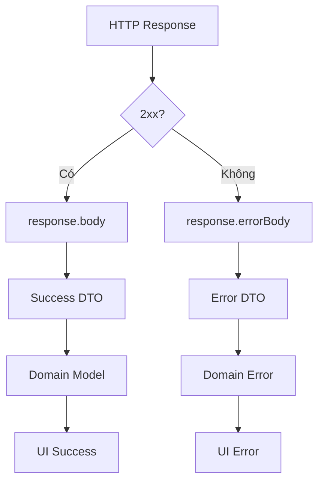
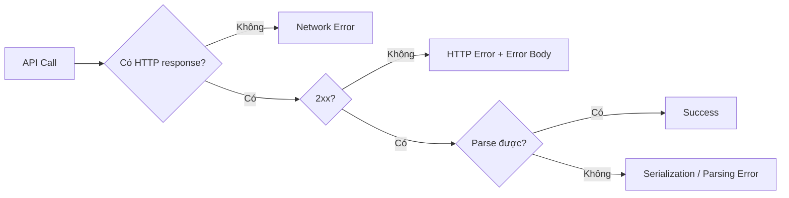
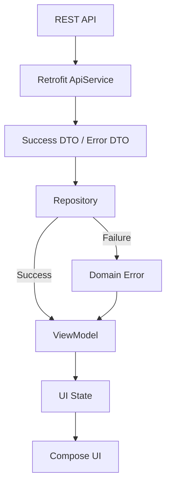
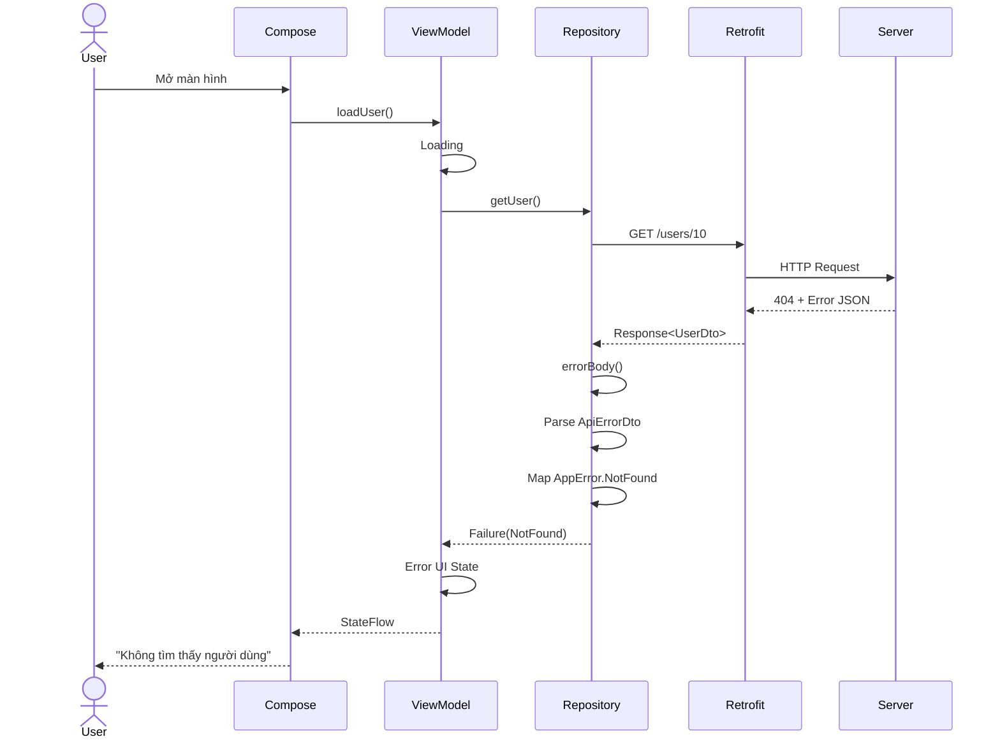
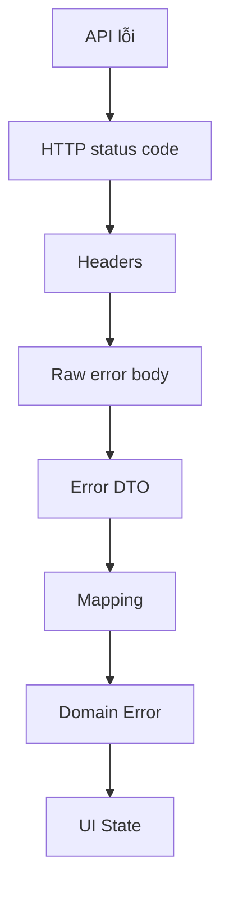
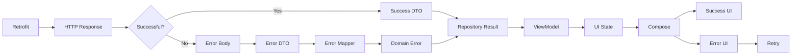

# 014 - Error Body

**Học phần:** 04 - Network, Async and Services
**Module:** Module 07 - Network
**Nhóm nội dung:** REST with Retrofit
**Nguồn roadmap:** Network / REST with Retrofit
**Loại bài:** Network
**Thứ tự trong module:** 014
**Thời lượng gợi ý:** 32 phút

---

## 1. Tóm tắt

Trong Retrofit, **Error Body** là phần nội dung mà server trả về khi HTTP response không thành công, chẳng hạn:

* `400 Bad Request`
* `401 Unauthorized`
* `403 Forbidden`
* `404 Not Found`
* `409 Conflict`
* `422 Unprocessable Content`
* `500 Internal Server Error`

Với `retrofit2.Response<T>`, Retrofit cung cấp `errorBody()` để lấy **raw response body của response không thành công** dưới dạng `okhttp3.ResponseBody`. ([Square Open Source][1])

Ví dụ server trả:

```json
{
  "code": "INVALID_PASSWORD",
  "message": "Mật khẩu không chính xác"
}
```

Không nên đưa trực tiếp chuỗi JSON này lên UI. Một kiến trúc tốt thường chuyển nó qua các bước:

```text
ResponseBody
    ↓
Error DTO
    ↓
Domain Error
    ↓
UI State
    ↓
Thông báo phù hợp cho người dùng
```

Android cũng khuyến nghị UI được điều khiển bằng **UI state**, trong đó lỗi có thể trở thành một phần của state cùng với hành động như `retry`. ([Android Developers][2])

---

## 2. Mục tiêu học tập

Sau bài này, bạn nên có thể:

* Giải thích `errorBody()` là gì.
* Phân biệt **HTTP error**, **network error** và **parsing error**.
* Parse Error Body thành DTO.
* Không để `ResponseBody`, Retrofit hay exception rò rỉ lên UI.
* Map lỗi thành Domain Error/UI State.
* Hiển thị `Loading → Success → Error → Retry`.
* Viết test cho `400`, `401`, `404`, `500`.
* Giải thích ảnh hưởng của error handling tới UX và maintainability.

---

# 3. Error Body là gì?

Giả sử API:

```http
GET /users/999
```

Server trả:

```http
HTTP/1.1 404 Not Found
Content-Type: application/json
```

```json
{
  "code": "USER_NOT_FOUND",
  "message": "User does not exist"
}
```

Nếu Retrofit interface trả về:

```kotlin
@GET("users/{id}")
suspend fun getUser(
    @Path("id") id: Long
): Response<UserDto>
```

ta có thể xử lý:

```kotlin
val response = api.getUser(999)

if (response.isSuccessful) {
    val user = response.body()
} else {
    val error = response.errorBody()
}
```

`Response<T>` chứa cả thông tin HTTP và body đã deserialize; đối với response không thành công, `errorBody()` cho phép truy cập phần body lỗi. ([Square Open Source][1])

---

# 4. Success Body và Error Body

Có thể hình dung:



### Response thành công

```json
{
  "id": 15,
  "name": "An"
}
```

được map vào:

```kotlin
data class UserDto(
    val id: Long,
    val name: String
)
```

### Response lỗi

```json
{
  "code": "USER_NOT_FOUND",
  "message": "User does not exist"
}
```

nên có model riêng:

```kotlin
data class ApiErrorDto(
    val code: String?,
    val message: String?
)
```

> Không nên dùng `UserDto` để parse Error Body vì schema của success response và error response thường là hai contract khác nhau.

---

# 5. Error Body không giống Exception

Đây là phần rất quan trọng.

## Trường hợp 1 — HTTP Error

Server **đã phản hồi**:

```text
Android
   ↓
GET /users/999
   ↓
Server
   ↓
404 + JSON Error Body
```

Ta có:

```kotlin
response.code() == 404
response.errorBody() != null
```

---

## Trường hợp 2 — Network Error

Ví dụ:

```text
No Internet
DNS failure
Connection timeout
Connection refused
```

Khi đó có thể **không tồn tại HTTP response từ server**, nên không có Error Body để đọc.

Luồng:

```text
Request
   ↓
Network failure
   ↓
IOException / network exception
```

---

## Trường hợp 3 — HTTP thành công nhưng parse thất bại

Ví dụ app mong:

```json
{
  "id": 12
}
```

nhưng server lại gửi:

```json
{
  "id": "abc"
}
```

Converter có thể thất bại trong quá trình deserialize.

Vì vậy nên xem network layer có ít nhất ba nhóm failure:



---

# 6. Đừng làm như thế này trong UI

```kotlin
viewModelScope.launch {
    val response = api.getUser(10)

    if (response.isSuccessful) {
        // ...
    } else {
        val error = response.errorBody()?.string()

        _message.value = error
    }
}
```

Có ba vấn đề:

1. ViewModel biết quá nhiều về Retrofit.
2. UI nhận JSON/raw server message.
3. Backend thay schema có thể làm ảnh hưởng trực tiếp UI.

Android Architecture khuyến nghị data layer chứa repository/data source và UI layer tiêu thụ state thay vì để UI xử lý trực tiếp chi tiết data source. ([Android Developers][3])

---

# 7. Kiến trúc nên sử dụng



Cấu trúc package ví dụ:

```text
data/
├── remote/
│   ├── UserApi.kt
│   ├── UserDto.kt
│   └── ApiErrorDto.kt
│
├── repository/
│   └── UserRepository.kt
│
domain/
├── model/
│   └── User.kt
│
└── error/
    └── AppError.kt

ui/
├── UserViewModel.kt
├── UserUiState.kt
└── UserScreen.kt
```

---

# 8. Tạo Error DTO

Giả sử backend chuẩn hóa error:

```json
{
  "code": "USER_NOT_FOUND",
  "message": "Không tìm thấy người dùng"
}
```

Ta tạo:

```kotlin
data class ApiErrorDto(
    val code: String?,
    val message: String?
)
```

Nếu backend có thêm field:

```json
{
  "code": "VALIDATION_ERROR",
  "message": "Dữ liệu không hợp lệ",
  "errors": {
    "email": "Email không hợp lệ"
  }
}
```

có thể sử dụng:

```kotlin
data class ApiErrorDto(
    val code: String?,
    val message: String?,
    val errors: Map<String, String>?
)
```

---

# 9. Đọc Error Body đơn giản

Cách dễ nhất để học:

```kotlin
val errorJson = response.errorBody()?.string()
```

Ví dụ:

```kotlin
if (!response.isSuccessful) {
    val errorJson = response.errorBody()?.string()

    println(errorJson)
}
```

Có thể nhận:

```json
{
  "code": "USER_NOT_FOUND",
  "message": "Không tìm thấy người dùng"
}
```

`ResponseBody` của OkHttp đại diện cho một resource cần được tiêu thụ/quản lý đúng cách; vì vậy trong production không nên đọc cùng một body lặp đi lặp lại ở nhiều tầng khác nhau. ([Square Open Source][4])

---

# 10. Parse Error Body thành DTO

Trong production, tốt hơn nên deserialize nó.

Ví dụ sử dụng Moshi:

```kotlin
class ErrorParser(
    private val moshi: Moshi
) {

    private val adapter =
        moshi.adapter(ApiErrorDto::class.java)

    fun parse(errorBody: ResponseBody?): ApiErrorDto? {
        if (errorBody == null) return null

        return runCatching {
            adapter.fromJson(errorBody.string())
        }.getOrNull()
    }
}
```

Sử dụng:

```kotlin
val response = api.getUser(id)

if (!response.isSuccessful) {
    val errorDto = errorParser.parse(
        response.errorBody()
    )

    println(errorDto?.message)
}
```

---

# 11. Không để Error DTO đi thẳng tới UI

Backend có thể trả:

```text
USER_NOT_FOUND
INVALID_TOKEN
TOKEN_EXPIRED
RATE_LIMITED
INTERNAL_SERVER_ERROR
```

Domain layer nên hiểu thành các lỗi của ứng dụng.

```kotlin
sealed interface AppError {

    data object Unauthorized : AppError

    data object NotFound : AppError

    data object Network : AppError

    data object Server : AppError

    data class Validation(
        val message: String
    ) : AppError

    data object Unknown : AppError
}
```

Sau đó map:

```kotlin
fun ApiErrorDto.toDomainError(): AppError =
    when (code) {

        "USER_NOT_FOUND" ->
            AppError.NotFound

        "TOKEN_EXPIRED",
        "INVALID_TOKEN" ->
            AppError.Unauthorized

        "VALIDATION_ERROR" ->
            AppError.Validation(
                message ?: "Dữ liệu không hợp lệ"
            )

        else ->
            AppError.Unknown
    }
```

---

# 12. Map theo HTTP Status Code

Không phải backend nào cũng có `code`.

Ta vẫn có thể dùng HTTP status:

```kotlin
fun mapHttpError(
    statusCode: Int,
    apiError: ApiErrorDto?
): AppError {

    return when (statusCode) {

        401 ->
            AppError.Unauthorized

        404 ->
            AppError.NotFound

        in 400..499 ->
            AppError.Validation(
                apiError?.message
                    ?: "Yêu cầu không hợp lệ"
            )

        in 500..599 ->
            AppError.Server

        else ->
            AppError.Unknown
    }
}
```

---

# 13. Repository hoàn chỉnh

```kotlin
sealed interface AppResult<out T> {

    data class Success<T>(
        val data: T
    ) : AppResult<T>

    data class Failure(
        val error: AppError
    ) : AppResult<Nothing>
}
```

Repository:

```kotlin
class UserRepository(
    private val api: UserApi,
    private val errorParser: ErrorParser
) {

    suspend fun getUser(
        id: Long
    ): AppResult<User> {

        return try {

            val response = api.getUser(id)

            if (response.isSuccessful) {

                val dto = response.body()
                    ?: return AppResult.Failure(
                        AppError.Unknown
                    )

                AppResult.Success(
                    dto.toDomain()
                )

            } else {

                val apiError = errorParser.parse(
                    response.errorBody()
                )

                AppResult.Failure(
                    mapHttpError(
                        response.code(),
                        apiError
                    )
                )
            }

        } catch (e: IOException) {

            AppResult.Failure(
                AppError.Network
            )

        } catch (e: Exception) {

            AppResult.Failure(
                AppError.Unknown
            )
        }
    }
}
```

Điểm quan trọng:

```text
Retrofit details
      ↓
Repository
      ↓
AppResult<User>
      ↓
ViewModel
```

ViewModel không cần biết:

```text
Response<T>
ResponseBody
HTTP JSON
Retrofit
Moshi
```

---

# 14. UI State

Android khuyến nghị mô hình hóa dữ liệu cần để render màn hình thành UI state và để state holder như `ViewModel` chịu trách nhiệm tạo state đó. ([Android Developers][5])

Ví dụ:

```kotlin
sealed interface UserUiState {

    data object Loading : UserUiState

    data class Success(
        val user: UserUiModel
    ) : UserUiState

    data class Error(
        val message: String,
        val canRetry: Boolean = true
    ) : UserUiState
}
```

---

# 15. ViewModel

```kotlin
class UserViewModel(
    private val repository: UserRepository
) : ViewModel() {

    private val _uiState =
        MutableStateFlow<UserUiState>(
            UserUiState.Loading
        )

    val uiState =
        _uiState.asStateFlow()

    fun loadUser(id: Long) {

        viewModelScope.launch {

            _uiState.value =
                UserUiState.Loading

            when (
                val result =
                    repository.getUser(id)
            ) {

                is AppResult.Success -> {

                    _uiState.value =
                        UserUiState.Success(
                            result.data.toUiModel()
                        )
                }

                is AppResult.Failure -> {

                    _uiState.value =
                        UserUiState.Error(
                            message =
                                result.error.toMessage()
                        )
                }
            }
        }
    }
}
```

---

# 16. Chuyển Domain Error thành thông báo UI

```kotlin
fun AppError.toMessage(): String =
    when (this) {

        AppError.Network ->
            "Không có kết nối mạng."

        AppError.Unauthorized ->
            "Phiên đăng nhập đã hết hạn."

        AppError.NotFound ->
            "Không tìm thấy dữ liệu."

        AppError.Server ->
            "Máy chủ đang gặp sự cố."

        AppError.Unknown ->
            "Đã xảy ra lỗi."

        is AppError.Validation ->
            message
    }
```

Điểm đáng chú ý:

```text
Server:
"java.sql.SQLException..."

        ❌

UI:
"java.sql.SQLException..."


Server:
"INTERNAL_SERVER_ERROR"

        ↓ mapping

UI:
"Máy chủ đang gặp sự cố.
 Vui lòng thử lại sau."

        ✅
```

---

# 17. Compose UI: Loading / Success / Error / Retry

```kotlin
@Composable
fun UserScreen(
    state: UserUiState,
    onRetry: () -> Unit
) {

    when (state) {

        UserUiState.Loading -> {
            CircularProgressIndicator()
        }

        is UserUiState.Success -> {
            UserContent(
                user = state.user
            )
        }

        is UserUiState.Error -> {

            Column {

                Text(
                    text = state.message
                )

                if (state.canRetry) {

                    Button(
                        onClick = onRetry
                    ) {
                        Text("Thử lại")
                    }
                }
            }
        }
    }
}
```

Android Architecture cũng mô tả lỗi UI như một state có thể mang message và action để thực hiện lại thao tác thất bại. ([Android Developers][2])

---

# 18. Luồng hoàn chỉnh



---

# 19. Trường hợp `HttpException`

Có một kiểu Retrofit khác:

```kotlin
@GET("users/{id}")
suspend fun getUser(
    @Path("id") id: Long
): UserDto
```

Thay vì:

```kotlin
suspend fun getUser(
    @Path("id") id: Long
): Response<UserDto>
```

Với kiểu trả trực tiếp body, Retrofit coroutine implementation có thể chuyển response HTTP không thành công thành `HttpException`; source chính thức của Retrofit cho thấy response non-2xx được đưa vào `HttpException(response)`. ([GitHub][6])

Khi đó:

```kotlin
try {

    val user = api.getUser(id)

} catch (e: HttpException) {

    val response = e.response()

    val errorBody =
        response?.errorBody()
}
```

Vì vậy phải biết API interface đang dùng kiểu nào.

### Kiểu A

```kotlin
suspend fun getUser(): Response<UserDto>
```

Thường xử lý:

```text
response.isSuccessful
response.body()
response.errorBody()
```

### Kiểu B

```kotlin
suspend fun getUser(): UserDto
```

HTTP non-2xx:

```text
HttpException
```

---

# 20. Những lỗi thường gặp

### ❌ Hiển thị `errorBody().string()` trực tiếp

```kotlin
Text(response.errorBody()!!.string())
```

UI có thể xuất:

```json
{"code":"E1002","debug":"Database timeout..."}
```

Không thân thiện và có nguy cơ lộ chi tiết backend.

---

### ❌ Chỉ dùng một loại lỗi

```kotlin
catch (e: Exception) {
    showError("Something went wrong")
}
```

Như vậy:

```text
401
404
500
No internet
Timeout
Parsing error
```

đều trở thành cùng một thông báo.

---

### ❌ Parse Error Body ở Composable

```kotlin
@Composable
fun Screen(response: Response<UserDto>) {
    response.errorBody()
}
```

Composable không nên phụ thuộc trực tiếp Retrofit.

---

### ❌ Assume error body luôn tồn tại

Không nên:

```kotlin
response.errorBody()!!.string()
```

Nên:

```kotlin
response.errorBody()
    ?.string()
```

---

# 21. UX nên khác nhau theo lỗi

| Lỗi           | UX phù hợp               |
| ------------- | ------------------------ |
| `400`         | Hiển thị lỗi input       |
| `401`         | Refresh token/login      |
| `403`         | Thông báo không có quyền |
| `404`         | Empty/not found state    |
| `409`         | Giải thích conflict      |
| `429`         | Yêu cầu thử lại sau      |
| `500`         | Retry                    |
| No Internet   | Offline UI               |
| Timeout       | Retry                    |
| Parsing Error | Generic error + logging  |

Ví dụ:

```text
Network Error
"Không có kết nối Internet"
        +
    [Thử lại]

404
"Không tìm thấy người dùng"

401
"Phiên đăng nhập đã hết hạn"
        +
    [Đăng nhập]

500
"Máy chủ đang gặp sự cố"
        +
    [Thử lại]
```

---

# 22. Lifecycle và State

Lỗi network không nên chỉ tồn tại trong một biến cục bộ của Composable.

Sai:

```kotlin
var message = "Network error"
```

Tốt hơn:

```text
Repository
    ↓
ViewModel
    ↓
StateFlow<UserUiState>
    ↓
Compose
```

State holder như `ViewModel` giúp pipeline UI state không bị gắn trực tiếp vào vòng đời của từng Composable/Activity recreation. Android Architecture đặc biệt tách state/logic phụ thuộc UI lifecycle khỏi business state. ([Android Developers][7])

---

# 23. Testing Error Body

Một test quan trọng:

```text
API
 ↓
Mock HTTP 404
 ↓
Error Body
 ↓
ApiErrorDto
 ↓
AppError.NotFound
```

OkHttp cung cấp **MockWebServer** để script HTTP responses và kiểm tra HTTP client/app xử lý chúng thế nào, bao gồm những tình huống như `500` hay response chậm. ([GitHub][8])

Ví dụ ý tưởng:

```kotlin
server.enqueue(
    MockResponse.Builder()
        .code(404)
        .body(
            """
            {
              "code": "USER_NOT_FOUND",
              "message": "User does not exist"
            }
            """.trimIndent()
        )
        .build()
)
```

Sau đó:

```kotlin
val result =
    repository.getUser(999)

assertEquals(
    AppResult.Failure(
        AppError.NotFound
    ),
    result
)
```

---

# 24. Những case nên test

```text
┌───────────────────────────────┐
│ Network Error Test Matrix     │
├───────────────────────────────┤
│ 200 → Success                 │
│ 400 → Validation              │
│ 401 → Unauthorized            │
│ 404 → NotFound                │
│ 500 → Server                  │
│ Empty error body → Unknown    │
│ Invalid JSON → Unknown        │
│ Timeout → Network             │
│ No Internet → Network         │
└───────────────────────────────┘
```

Đây là một artifact khá tốt cho portfolio vì nó chứng minh bạn không chỉ biết gọi API mà còn hiểu **failure path**.

---

# 25. Debugging

Khi API lỗi, kiểm tra theo thứ tự:



Các câu hỏi cần hỏi:

```text
HTTP code có đúng không?

errorBody có null không?

JSON có đúng schema không?

Converter parse thành công không?

Mapper có map đúng error code không?

Repository trả đúng AppError không?

ViewModel tạo đúng UI State không?

UI có action retry phù hợp không?
```

---

# 26. Logging trong production

Có thể log:

```text
HTTP method
Endpoint
Status code
Request ID
Error code
Duration
```

Nhưng tránh ghi trực tiếp các dữ liệu nhạy cảm như:

```text
Password
Authorization token
Refresh token
Cookie
Personal information
```

Ví dụ log hợp lý:

```text
GET /users/123
HTTP 404
errorCode=USER_NOT_FOUND
requestId=7f82...
```

thay vì dump toàn bộ response một cách vô điều kiện.

---

# 27. Bài thực hành 32 phút

## Phần 1 — 5 phút

Tạo endpoint:

```kotlin
@GET("users/{id}")
suspend fun getUser(
    @Path("id") id: Long
): Response<UserDto>
```

---

## Phần 2 — 7 phút

Tạo:

```text
ApiErrorDto
AppError
AppResult
```

---

## Phần 3 — 8 phút

Repository xử lý:

```text
200
404
500
IOException
```

---

## Phần 4 — 7 phút

Tạo UI State:

```text
Loading
Success
Error
```

và nút:

```text
Retry
```

---

## Phần 5 — 5 phút

Mock:

```text
404 USER_NOT_FOUND
```

và kiểm tra UI hiển thị:

```text
"Không tìm thấy người dùng"
```

thay vì:

```json
{"code":"USER_NOT_FOUND"}
```

---

# 28. Artifact cho portfolio

Một project nhỏ có thể có:

```text
retrofit-error-handling/
│
├── data/
│   ├── ApiService.kt
│   ├── ApiErrorDto.kt
│   └── UserRepository.kt
│
├── domain/
│   ├── AppError.kt
│   └── AppResult.kt
│
├── ui/
│   ├── UserUiState.kt
│   ├── UserViewModel.kt
│   └── UserScreen.kt
│
└── test/
    └── UserRepositoryTest.kt
```

README có thể mô tả:

```text
Retrofit
   ↓
Response<T>
   ↓
errorBody()
   ↓
ApiErrorDto
   ↓
AppError
   ↓
UI State
   ↓
Compose Error + Retry
```

Đây thể hiện rõ:

* REST API.
* Retrofit.
* DTO mapping.
* Error handling.
* Repository pattern.
* StateFlow.
* Compose.
* Testing.

---

# 29. Mental Model

Hãy nhớ chuỗi sau:

```text
HTTP Error
   ↓
Error Body
   ↓
Error DTO
   ↓
Domain Error
   ↓
UI State
   ↓
User-friendly Error
```

Không nên là:

```text
HTTP Error
   ↓
JSON String
   ↓
Composable
```

---

# 30. Phân biệt các khái niệm gần nhau

| Khái niệm       | Vai trò                                                       |
| --------------- | ------------------------------------------------------------- |
| `Response<T>`   | HTTP response                                                 |
| `body()`        | Success body đã convert                                       |
| `errorBody()`   | Raw body của unsuccessful response                            |
| `ResponseBody`  | Body thô của OkHttp                                           |
| `ApiErrorDto`   | Model biểu diễn JSON error                                    |
| `HttpException` | Exception đại diện non-2xx trong một số cách sử dụng Retrofit |
| `AppError`      | Error model của domain/app                                    |
| `UiState.Error` | Trạng thái UI                                                 |
| Retry           | User action sau lỗi                                           |

Retrofit mô tả `HttpException` là exception cho một HTTP response non-2xx không mong đợi. ([Square Open Source][9])

---

# 31. Checklist hoàn thành

* [ ] Giải thích được Error Body là gì.
* [ ] Biết `response.errorBody()` dùng khi nào.
* [ ] Phân biệt `body()` và `errorBody()`.
* [ ] Phân biệt HTTP Error và Network Error.
* [ ] Có `ApiErrorDto`.
* [ ] Parse Error Body tại data layer.
* [ ] Không đưa `ResponseBody` lên ViewModel/UI.
* [ ] Map Error DTO → Domain Error.
* [ ] Có `Loading`, `Success`, `Error`.
* [ ] Có Retry khi phù hợp.
* [ ] Xử lý empty/malformed Error Body.
* [ ] Test ít nhất `200`, `404`, `500`.
* [ ] Có ghi chú về offline.
* [ ] Không log token/password.
* [ ] UI không hiển thị raw JSON/backend stack trace.

---

# 32. Ghi chú production

Trong ứng dụng thật, xử lý Error Body tốt không chỉ đơn giản là:

```kotlin
response.errorBody()?.string()
```

Mà nên là:



Mục tiêu cuối cùng không phải là **“đọc được JSON lỗi”**, mà là biến lỗi kỹ thuật từ server thành **state ổn định, có thể test, dễ debug và có UX phù hợp**. Cách tổ chức này phù hợp với hướng kiến trúc Android hiện đại: data layer chịu trách nhiệm dữ liệu, state holder tạo UI state và UI render từ state thay vì xử lý trực tiếp network response. ([Android Developers][3])

> **Câu ghi nhớ:**
> **Error Body thuộc network layer; người dùng chỉ nên nhìn thấy ý nghĩa của lỗi, không phải implementation của backend.**

[1]: https://square.github.io/retrofit/2.x/retrofit/retrofit2/Response.html?utm_source=chatgpt.com "Response (retrofit API)"
[2]: https://developer.android.com/topic/architecture/ui-layer?utm_source=chatgpt.com "UI layer | App architecture"
[3]: https://developer.android.com/topic/architecture/data-layer?utm_source=chatgpt.com "Data layer | App architecture"
[4]: https://square.github.io/okhttp/3.x/okhttp/index.html?okhttp3%2FResponseBody.html=&utm_source=chatgpt.com "ResponseBody (OkHttp 3.14.0 API)"
[5]: https://developer.android.com/topic/architecture/ui-layer/state-production?utm_source=chatgpt.com "UI State production | App architecture"
[6]: https://github.com/square/retrofit/blob/master/retrofit/src/main/java/retrofit2/KotlinExtensions.kt?utm_source=chatgpt.com "retrofit/retrofit/src/main/java/retrofit2/KotlinExtensions.kt ..."
[7]: https://developer.android.com/topic/architecture/ui-layer/stateholders?hl=de&utm_source=chatgpt.com "App architecture - Statusinhaber und UI-Status"
[8]: https://github.com/square/okhttp/blob/master/mockwebserver/README.md?utm_source=chatgpt.com "okhttp/mockwebserver/README.md at main"
[9]: https://square.github.io/retrofit/2.x/retrofit/retrofit2/HttpException.html?utm_source=chatgpt.com "HttpException (retrofit API)"

---

# Bài luyện tập

## Mục tiêu


## Đề bài


## Yêu cầu hoàn thành

- [ ] 
- [ ] 
- [ ] 

## Kết quả / lời giải


## Ghi chú
