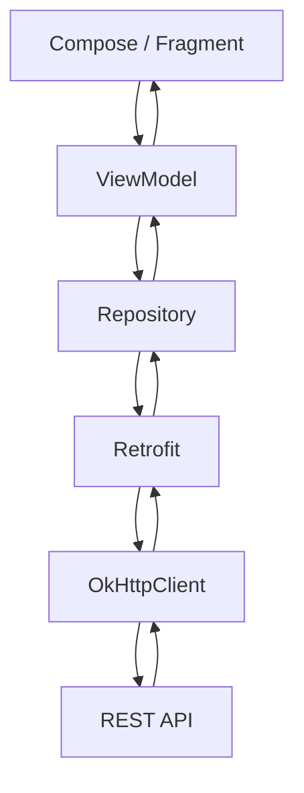
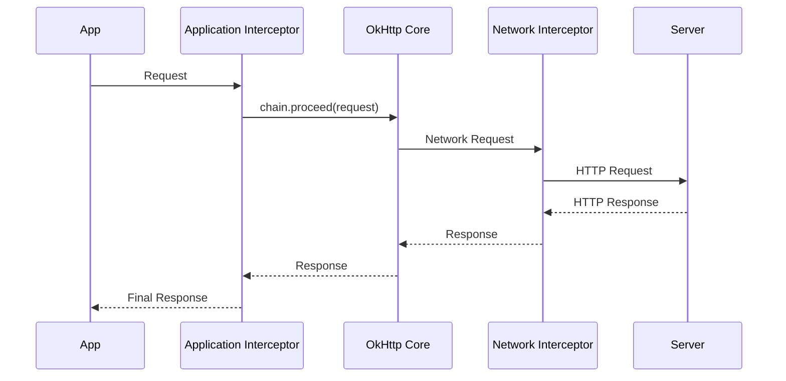
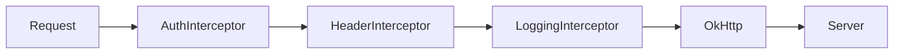
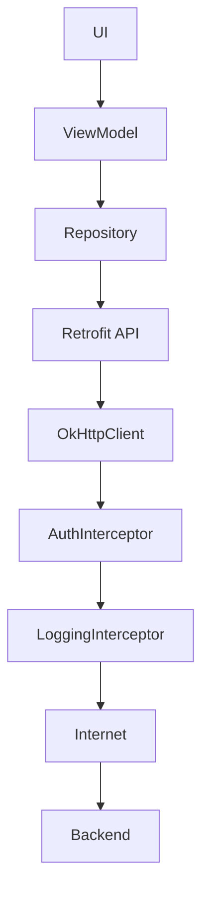
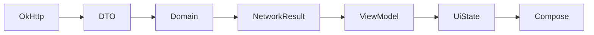
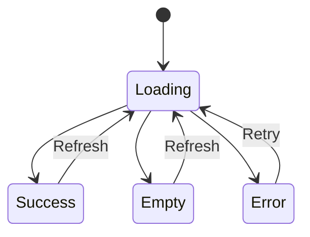
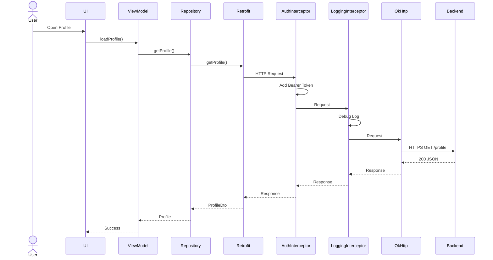
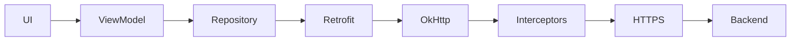

[](https://blog.csdn.net/L644649662/article/details/118567285?utm_source=chatgpt.com)

# 016 - OkHttp

**Học phần:** 04 - Network, Async and Services
**Module:** Module 07 - Network
**Nhóm nội dung:** HTTP Client and GraphQL
**Nguồn roadmap:** Network / HTTP Client and GraphQL
**Loại bài:** Network
**Thứ tự trong module:** 016
**Thời lượng gợi ý:** 32 phút

---

## 1. Tóm tắt

**OkHttp** là HTTP client phổ biến trong hệ sinh thái Android/JVM. Nó chịu trách nhiệm cho phần giao tiếp HTTP ở mức thấp hơn như gửi `Request`, nhận `Response`, quản lý kết nối, interceptor, cache và các chính sách timeout.

Trong kiến trúc Android thường gặp, **Retrofit nằm phía trên OkHttp**: Retrofit giúp biến các endpoint REST thành Kotlin/Java interface, còn request thực tế có thể được thực thi thông qua một `OkHttpClient`. Retrofit cung cấp trực tiếp API để gắn `OkHttpClient` vào client của nó. ([Square Open Source][1])

Mô hình tư duy:

```text
UI
 ↓
ViewModel
 ↓
Repository
 ↓
Retrofit
 ↓
OkHttp
 ↓
HTTP / HTTPS
 ↓
Backend
```

OkHttp đặc biệt quan trọng khi app cần xử lý những vấn đề dùng chung cho toàn bộ request như:

* thêm `Authorization` header;
* logging request/response;
* timeout;
* caching;
* thêm header chung;
* theo dõi request;
* xử lý một số retry/follow-up;
* cấu hình HTTPS;
* tái sử dụng connection.

---

## 2. Mục tiêu học tập

Sau bài này, anh nên có thể:

* Giải thích được **OkHttp là gì** và nằm ở đâu trong Android architecture.
* Phân biệt được **OkHttp và Retrofit**.
* Hiểu luồng `Request → Interceptor → Network → Response`.
* Viết được một `Interceptor`.
* Thêm authentication header cho toàn bộ request.
* Cấu hình `connectTimeout`, `readTimeout`, `writeTimeout`.
* Biết khi nào nên dùng cache.
* Biết tại sao không nên bật logging nhạy cảm trong production.
* Biết cách biến lỗi OkHttp thành `UI State`.
* Tạo được một network layer nhỏ có thể đưa vào portfolio.

---

# 3. OkHttp là gì?

Có thể hiểu ngắn gọn:

> **OkHttp là engine chịu trách nhiệm thực hiện HTTP request.**

Ví dụ một request HTTP:

```http
GET /users/42 HTTP/1.1
Host: api.example.com
Authorization: Bearer abc123
Accept: application/json
```

OkHttp có thể tạo request này, gửi nó đến server và trả về một `Response`.

```kotlin
val request = Request.Builder()
    .url("https://api.example.com/users/42")
    .get()
    .build()
```

Sau đó:

```kotlin
val call = client.newCall(request)
```

`Call` đại diện cho một lần thực thi HTTP.

---

# 4. OkHttp và Retrofit khác nhau thế nào?

Đây là phần rất dễ nhầm.

| Thành phần     | Vai trò                          |
| -------------- | -------------------------------- |
| Retrofit       | Khai báo REST API bằng interface |
| OkHttp         | Thực thi HTTP request thực tế    |
| Converter      | JSON ↔ DTO                       |
| Repository     | Điều phối nguồn dữ liệu          |
| ViewModel      | Chuyển dữ liệu thành UI state    |
| Compose / View | Hiển thị                         |

Ví dụ Retrofit:

```kotlin
interface UserApi {

    @GET("users/{id}")
    suspend fun getUser(
        @Path("id") id: Long
    ): UserDto
}
```

Nhưng phía dưới Retrofit có thể sử dụng:

```kotlin
val client = OkHttpClient()
```

Sau đó gắn vào Retrofit:

```kotlin
val retrofit = Retrofit.Builder()
    .baseUrl("https://api.example.com/")
    .client(client)
    .build()
```

Retrofit hỗ trợ trực tiếp việc cung cấp một `OkHttpClient` cho network stack. ([Square Open Source][1])

### Cách nhớ

```text
Retrofit = "Tôi muốn gọi endpoint nào?"

OkHttp = "HTTP request đó thực sự được gửi như thế nào?"
```

---

# 5. Vị trí của OkHttp trong app Android



Điểm quan trọng:

> UI không nên biết `OkHttpClient`, `Request`, `Response` hay `Interceptor` tồn tại.

Network implementation nên nằm trong **data/network layer**.

---

# 6. Request lifecycle trong OkHttp

Một request đơn giản có thể hình dung:



Interceptor là một trong những tính năng quan trọng nhất của OkHttp. Current OkHttp API vẫn cung cấp `addInterceptor()` và network interceptors để quan sát request/response đi qua client. Network interceptor quan sát từng network request/response và phải tiếp tục chain thông qua `Chain.proceed()`. ([Square Open Source][2])

---

# 7. Interceptor là gì?

**Interceptor** giống middleware trong backend.

Nó đứng giữa:

```text
Application
     ↓
Interceptor
     ↓
HTTP Request
     ↓
Server
```

Và chiều response:

```text
Server
     ↓
HTTP Response
     ↓
Interceptor
     ↓
Application
```

Interceptor có thể:

```text
Request
   ↓
Thêm Authorization
   ↓
Thêm User-Agent
   ↓
Logging
   ↓
Server
```

Sau đó:

```text
Server
   ↓
Response
   ↓
Logging
   ↓
Application
```

---

# 8. Application Interceptor và Network Interceptor

OkHttp có hai vị trí interceptor thường gặp.

## Application Interceptor

Đăng ký bằng:

```kotlin
.addInterceptor(...)
```

Thường phù hợp với logic ở mức ứng dụng:

* authentication header;
* global header;
* request ID;
* logging;
* chỉnh request trước khi OkHttp xử lý tiếp.

---

## Network Interceptor

Đăng ký bằng:

```kotlin
.addNetworkInterceptor(...)
```

Network interceptor quan sát **network request/response thực sự**, thay vì chỉ logical call ở phía application. API hiện tại của OkHttp mô tả chúng là interceptor quan sát một network request và network response. ([Square Open Source][2])

### So sánh

| Application Interceptor | Network Interceptor             |
| ----------------------- | ------------------------------- |
| Gần application hơn     | Gần network hơn                 |
| Auth header             | Quan sát traffic thực           |
| Header chung            | Kiểm tra network-level response |
| Logging app             | Network debugging               |
| Request transformation  | Network-specific behavior       |

Trong app thông thường, anh sẽ sử dụng:

```kotlin
addInterceptor()
```

nhiều hơn.

---

# 9. Cấu trúc một Interceptor

Ví dụ:

```kotlin
class HeaderInterceptor : Interceptor {

    override fun intercept(
        chain: Interceptor.Chain
    ): Response {

        val originalRequest = chain.request()

        val newRequest = originalRequest
            .newBuilder()
            .header(
                "Accept",
                "application/json"
            )
            .build()

        return chain.proceed(newRequest)
    }
}
```

Phần quan trọng nhất:

```kotlin
chain.proceed(newRequest)
```

Có thể hình dung:

```text
intercept()
   │
   ├── đọc Request
   │
   ├── sửa Request
   │
   ├── chain.proceed()
   │        ↓
   │      Server
   │        ↓
   ├── nhận Response
   │
   └── return Response
```

---

# 10. Authentication Interceptor

Một use case cực kỳ phổ biến là thêm access token.

Thay vì:

```kotlin
@GET("profile")
suspend fun getProfile(
    @Header("Authorization") token: String
): ProfileDto
```

cho hàng chục endpoint, ta có thể đưa header vào OkHttp.

```kotlin
class AuthInterceptor(
    private val tokenProvider: () -> String?
) : Interceptor {

    override fun intercept(
        chain: Interceptor.Chain
    ): Response {

        val token = tokenProvider()

        val requestBuilder =
            chain.request()
                .newBuilder()

        if (!token.isNullOrBlank()) {
            requestBuilder.header(
                "Authorization",
                "Bearer $token"
            )
        }

        return chain.proceed(
            requestBuilder.build()
        )
    }
}
```

Sau đó:

```kotlin
val client = OkHttpClient.Builder()
    .addInterceptor(
        AuthInterceptor {
            tokenManager.accessToken
        }
    )
    .build()
```

Kết quả:

```http
GET /profile HTTP/1.1

Authorization: Bearer eyJhbGci...
```

mà Retrofit interface không cần biết token tồn tại.

---

# 11. Interceptor Chain

Điểm mạnh của OkHttp là có thể ghép nhiều interceptor.

```kotlin
val client = OkHttpClient.Builder()
    .addInterceptor(authInterceptor)
    .addInterceptor(headerInterceptor)
    .addInterceptor(loggingInterceptor)
    .build()
```

Luồng:



Response quay ngược lại:

```text
Server
  ↓
OkHttp
  ↓
LoggingInterceptor
  ↓
HeaderInterceptor
  ↓
AuthInterceptor
  ↓
Application
```

Có thể xem đây là biến thể của:

> **Chain of Responsibility Pattern**

---

# 12. Logging Interceptor

Trong development, việc nhìn thấy request rất hữu ích.

Ví dụ dependency:

```kotlin
dependencies {

    implementation(
        "com.squareup.okhttp3:okhttp:<version>"
    )

    implementation(
        "com.squareup.okhttp3:logging-interceptor:<same-version>"
    )
}
```

Nên dùng cùng phiên bản giữa `okhttp` và `logging-interceptor`.

---

## Cấu hình

```kotlin
val loggingInterceptor =
    HttpLoggingInterceptor().apply {

        level =
            if (BuildConfig.DEBUG) {
                HttpLoggingInterceptor.Level.BODY
            } else {
                HttpLoggingInterceptor.Level.NONE
            }

        redactHeader("Authorization")
    }
```

OkHttp logging interceptor hiện cung cấp nhiều mức logging như `BASIC` và API `redactHeader()` để che header nhất định. ([Square Open Source][3])

Ví dụ log:

```text
--> GET https://api.example.com/users
Authorization: ██

<-- 200 OK
Content-Type: application/json

{
    "id": 42,
    "name": "An"
}
```

---

# 13. Không log dữ liệu nhạy cảm trong production

Đây là một lỗi production khá nghiêm trọng.

Không nên log:

```text
Authorization: Bearer abc123
```

hoặc:

```json
{
  "email": "user@gmail.com",
  "password": "123456"
}
```

Android Developers khuyến cáo tránh đưa dữ liệu nhạy cảm vào `logcat`, sanitize log ở non-debug build và hạn chế logging production vì thông tin như credentials hoặc PII có thể bị lộ. ([Android Developers][4])

Vì vậy:

```kotlin
if (BuildConfig.DEBUG) {
    level = HttpLoggingInterceptor.Level.BODY
} else {
    level = HttpLoggingInterceptor.Level.NONE
}
```

là pattern hợp lý cho nhiều app.

> `redactHeader("Authorization")` chỉ che header đó. Nếu token, password hoặc PII nằm trong **body**, anh vẫn phải tránh log body chứa dữ liệu nhạy cảm.

---

# 14. Timeout

Network request không được phép chờ vô hạn.

Ví dụ:

```text
App
 ↓
Request
 ↓
Server không phản hồi
 ↓
?????????
```

Nếu không có policy rõ ràng, UX có thể trở thành:

```text
Loading...
Loading...
Loading...
Loading...
```

OkHttp cung cấp nhiều loại timeout ở client layer.

### Connect timeout

Khoảng thời gian dành cho việc thiết lập kết nối.

```text
Phone ───── X ───── Server
       connect
```

---

### Read timeout

Giới hạn thời gian chờ đọc dữ liệu từ kết nối.

```text
Connected
   ↓
Waiting for response bytes
   ↓
Read timeout
```

---

### Write timeout

Giới hạn quá trình ghi request lên network.

Quan trọng hơn với:

```text
POST
PUT
Upload file
Large request body
```

---

### Call timeout

Giới hạn thời gian tổng thể dành cho call.

Có thể hình dung:

```text
             Call timeout
┌──────────────────────────────────┐

 DNS
  ↓
Connect
  ↓
Write
  ↓
Server
  ↓
Read

└──────────────────────────────────┘
```

---

# 15. Cấu hình OkHttpClient

Ví dụ tương đối thực tế:

```kotlin
val client =
    OkHttpClient.Builder()

        .connectTimeout(
            10,
            TimeUnit.SECONDS
        )

        .readTimeout(
            20,
            TimeUnit.SECONDS
        )

        .writeTimeout(
            20,
            TimeUnit.SECONDS
        )

        .callTimeout(
            30,
            TimeUnit.SECONDS
        )

        .addInterceptor(
            authInterceptor
        )

        .addInterceptor(
            loggingInterceptor
        )

        .build()
```

Không có một bộ timeout phù hợp cho mọi API.

Ví dụ:

```text
API trả JSON nhỏ
→ timeout tương đối ngắn

Upload video
→ write timeout dài hơn

Streaming
→ read timeout cần policy khác
```

---

# 16. Không tạo OkHttpClient cho mỗi request

Không nên làm:

```kotlin
fun getUsers() {

    val client =
        OkHttpClient()

    client.newCall(...)
}
```

rồi lại tạo client mới ở request khác.

Nên có một client dùng chung:

```text
Application

       │
       ▼

┌────────────────────┐
│   OkHttpClient     │
└────────────────────┘

   ↓        ↓       ↓

Request A Request B Request C
```

Lý do kiến trúc là client quản lý các resource network dùng chung như connection/thread infrastructure; việc tái sử dụng client giúp tránh tạo những pool/resource riêng không cần thiết. Đây cũng là pattern lâu đời được tài liệu OkHttp khuyến nghị. ([Square Open Source][5])

Trong project thực tế, thường tạo nó bằng:

```text
Hilt Singleton
```

hoặc:

```text
Application Singleton
```

---

# 17. Ví dụ với Hilt

```kotlin
@Module
@InstallIn(SingletonComponent::class)
object NetworkModule {

    @Provides
    @Singleton
    fun provideOkHttpClient(
        authInterceptor: AuthInterceptor
    ): OkHttpClient {

        return OkHttpClient.Builder()
            .addInterceptor(authInterceptor)
            .connectTimeout(
                10,
                TimeUnit.SECONDS
            )
            .readTimeout(
                20,
                TimeUnit.SECONDS
            )
            .build()
    }
}
```

Sau đó toàn app dùng chung client.

---

# 18. Kết nối OkHttp với Retrofit

```kotlin
@Provides
@Singleton
fun provideRetrofit(
    okHttpClient: OkHttpClient
): Retrofit {

    return Retrofit.Builder()
        .baseUrl(
            "https://api.example.com/"
        )
        .client(okHttpClient)
        .addConverterFactory(
            GsonConverterFactory.create()
        )
        .build()
}
```

Luồng cuối cùng:



---

# 19. OkHttp trực tiếp không cần Retrofit

OkHttp cũng có thể được sử dụng độc lập.

```kotlin
val request =
    Request.Builder()
        .url(
            "https://api.example.com/users"
        )
        .get()
        .build()

client
    .newCall(request)
    .enqueue(
        object : Callback {

            override fun onFailure(
                call: Call,
                e: IOException
            ) {
                // Network error
            }

            override fun onResponse(
                call: Call,
                response: Response
            ) {
                response.use {

                    val body =
                        it.body.string()

                    println(body)
                }
            }
        }
    )
```

Nhưng với REST API lớn:

```text
OkHttp
    +
Retrofit
    +
JSON Converter
```

thường giúp code dễ quản lý hơn nhiều.

---

# 20. Cache trong OkHttp

Không phải dữ liệu nào cũng cần gọi server lại.

Ví dụ:

```text
GET /news
      ↓
Server
      ↓
Response
      ↓
Cache
```

Request tiếp theo có thể tận dụng cache theo HTTP caching policy.

```text
GET /news
      ↓
Cache
      ↓
Response
```

Điều này có thể:

* giảm network traffic;
* giảm latency;
* tiết kiệm dữ liệu;
* cải thiện UX khi dữ liệu phù hợp để cache.

OkHttp có HTTP response cache và hỗ trợ các cơ chế cache dựa trên HTTP semantics. ([Square Open Source][6])

---

## Ví dụ

```kotlin
val cacheSize =
    10L * 1024L * 1024L

val cache =
    Cache(
        File(
            context.cacheDir,
            "http_cache"
        ),
        cacheSize
    )
```

Gắn vào client:

```kotlin
val client =
    OkHttpClient.Builder()
        .cache(cache)
        .build()
```

---

# 21. Cache không giống database

Một nhầm lẫn phổ biến:

```text
OkHttp Cache ≠ Room Database
```

HTTP cache chủ yếu tối ưu network response.

Room phù hợp hơn khi app cần:

```text
Offline-first
   ↓
Persistent data
   ↓
Query local data
   ↓
Sync server
```

Ví dụ:

```text
OkHttp Cache
    │
    └── HTTP optimization

Room
    │
    └── Application data persistence
```

---

# 22. Retry

Retry nghe có vẻ đơn giản:

```text
Request
 ↓
Fail
 ↓
Retry
 ↓
Success
```

Nhưng retry bừa bãi rất nguy hiểm.

Ví dụ:

```http
POST /payments
```

Request timeout không nhất thiết đồng nghĩa server chưa xử lý payment.

Nếu tự động gửi lại:

```text
POST payment
    ↓
Server xử lý thành công

Network response bị mất
    ↓
Client nghĩ fail
    ↓
Retry POST
    ↓
💥 duplicate payment
```

Vì vậy retry policy cần xét:

```text
HTTP method
+
idempotency
+
error type
+
retry count
+
backoff
```

OkHttp bản thân có thể thực hiện follow-up request trong một call cho các trường hợp như authentication challenge, redirect hoặc một số lỗi tầng HTTP/network. ([Square Open Source][7])

Nhưng:

> **Không nên hiểu điều đó là có thể retry toàn bộ business operation một cách vô điều kiện.**

---

# 23. Retry hợp lý

Ví dụ với GET:

```text
GET products
    ↓
IOException
    ↓
Wait
    ↓
Retry
```

Có thể dùng exponential backoff:

```text
Retry 1 → 1 giây

Retry 2 → 2 giây

Retry 3 → 4 giây
```

Không nên:

```text
while (true) {
    retry()
}
```

---

# 24. Authentication: header và refresh token khác nhau

Hai vấn đề này nên tách ra.

## Gắn token

```text
Request
 ↓
AuthInterceptor
 ↓
Authorization: Bearer xxx
```

Đây là nhiệm vụ đơn giản.

---

## Token hết hạn

```text
Request
 ↓
Server
 ↓
401 Unauthorized
 ↓
Refresh Token
 ↓
New Access Token
 ↓
Retry Request
```

Đây là bài toán phức tạp hơn vì nhiều request có thể cùng nhận `401`.

Ví dụ:

```text
Request A ──→ 401
Request B ──→ 401
Request C ──→ 401
```

Không nên để cả ba cùng:

```text
refresh token
refresh token
refresh token
```

Production app thường cần cơ chế synchronization cho token refresh.

---

# 25. Error của OkHttp và UI State

UI không nên nhận:

```text
IOException
SocketTimeoutException
UnknownHostException
```

trực tiếp.

Nên chuyển chúng thành domain/network result.

Ví dụ:

```kotlin
sealed interface NetworkResult<out T> {

    data class Success<T>(
        val data: T
    ) : NetworkResult<T>

    data class Error(
        val message: String
    ) : NetworkResult<Nothing>
}
```

Repository:

```kotlin
suspend fun getUsers():
    NetworkResult<List<User>> {

    return try {

        val dto =
            userApi.getUsers()

        NetworkResult.Success(
            dto.map {
                it.toDomain()
            }
        )

    } catch (e: IOException) {

        NetworkResult.Error(
            "Không thể kết nối mạng"
        )
    }
}
```

---

# 26. UI State

Network result tiếp tục được chuyển thành UI state.

```kotlin
sealed interface UsersUiState {

    data object Loading :
        UsersUiState

    data class Success(
        val users: List<UserUi>
    ) : UsersUiState

    data object Empty :
        UsersUiState

    data class Error(
        val message: String
    ) : UsersUiState
}
```

Luồng:



---

# 27. Loading → Success → Error → Retry

Một feature network tốt không chỉ có success.

Phải nghĩ ít nhất:



### Loading

```text
Đang tải...
```

### Success

```text
User list
```

### Empty

```text
Không có dữ liệu
```

### Error

```text
Không thể tải dữ liệu

[Thử lại]
```

---

# 28. Lifecycle

OkHttp thuộc data/network layer, nhưng request cuối cùng vẫn ảnh hưởng lifecycle của UI.

Ví dụ:

```text
Screen A
 ↓
Start request
 ↓
User back
 ↓
Screen destroyed
 ↓
Response arrives
```

Nếu architecture đúng:

```text
UI
 ↓
ViewModel
 ↓
Coroutine
 ↓
Repository
```

thì lifecycle và cancellation dễ kiểm soát hơn việc để Activity tự tạo callback OkHttp.

Không nên:

```kotlin
class MainActivity : Activity() {

    val client = OkHttpClient()

    fun load() {

        client
            .newCall(...)
            .enqueue(...)
    }
}
```

cho toàn bộ production architecture.

---

# 29. Timeout ảnh hưởng UX như thế nào?

Ví dụ timeout quá dài:

```text
User nhấn Login
 ↓
Loading 60 giây
 ↓
User tưởng app bị treo
```

Timeout quá ngắn:

```text
Network chậm
 ↓
Request fail liên tục
 ↓
User không dùng được app
```

Do đó timeout không chỉ là network configuration.

Nó là:

```text
Network decision
      +
UX decision
      +
Business decision
```

---

# 30. Một cấu hình OkHttp mẫu

```kotlin
object OkHttpProvider {

    fun create(
        context: Context,
        tokenProvider: () -> String?
    ): OkHttpClient {

        val logging =
            HttpLoggingInterceptor().apply {

                redactHeader(
                    "Authorization"
                )

                level =
                    if (BuildConfig.DEBUG) {
                        HttpLoggingInterceptor
                            .Level
                            .BODY
                    } else {
                        HttpLoggingInterceptor
                            .Level
                            .NONE
                    }
            }

        val auth =
            AuthInterceptor(
                tokenProvider
            )

        val cache =
            Cache(
                File(
                    context.cacheDir,
                    "http_cache"
                ),
                10L * 1024L * 1024L
            )

        return OkHttpClient.Builder()

            .cache(cache)

            .connectTimeout(
                10,
                TimeUnit.SECONDS
            )

            .readTimeout(
                20,
                TimeUnit.SECONDS
            )

            .writeTimeout(
                20,
                TimeUnit.SECONDS
            )

            .callTimeout(
                30,
                TimeUnit.SECONDS
            )

            .addInterceptor(auth)

            .addInterceptor(logging)

            .build()
    }
}
```

---

# 31. Một request hoàn chỉnh đi qua hệ thống

Giả sử user mở màn hình profile.



Đây chính là vị trí OkHttp trong một Android app thực tế.

---

# 32. Những lỗi thường gặp

## ❌ Tạo OkHttpClient mỗi request

```kotlin
fun callApi() {
    OkHttpClient()
}
```

Nên dùng client dùng chung.

---

## ❌ Log BODY trong production

```kotlin
HttpLoggingInterceptor.Level.BODY
```

có thể khiến token, email hoặc dữ liệu người dùng xuất hiện trong log. Android khuyến cáo sanitize hoặc loại bỏ logging nhạy cảm khỏi production. ([Android Developers][4])

---

## ❌ Retry tất cả request

Đặc biệt nguy hiểm với:

```text
POST
PATCH
Payment
Order
Upload
```

---

## ❌ Token logic nằm trong mọi API method

```kotlin
@Header("Authorization")
```

lặp lại hàng chục lần.

Nên đưa cross-cutting concern này xuống interceptor.

---

## ❌ Hiển thị exception trực tiếp

Không nên:

```text
java.net.SocketTimeoutException:
failed to connect...
```

UI nên hiện:

```text
Kết nối quá chậm.
Vui lòng thử lại.
```

---

## ❌ Interceptor chứa business logic

Không nên:

```text
Interceptor
 ├── Add token
 ├── Calculate cart
 ├── Update database
 ├── Navigate UI
 └── Show Toast
```

Interceptor nên tập trung vào network concern.

---

# 33. Debugging checklist

Khi API không hoạt động, kiểm tra theo thứ tự:

```text
1. URL đúng chưa?
        ↓
2. HTTP method đúng chưa?
        ↓
3. Header đúng chưa?
        ↓
4. Token có tồn tại?
        ↓
5. Request body đúng?
        ↓
6. Response status?
        ↓
7. Response body?
        ↓
8. Timeout?
        ↓
9. Internet / DNS?
        ↓
10. Certificate / HTTPS?
```

Logging interceptor rất hữu ích cho các bước này trong development, nhưng production logging phải được hạn chế và sanitize. ([Square Open Source][3])

---

# 34. Testing

Network layer không nên chỉ test happy path.

Nên test ít nhất:

| Case           | Expected      |
| -------------- | ------------- |
| HTTP 200       | Success       |
| HTTP 204       | Empty         |
| HTTP 400       | Client error  |
| HTTP 401       | Auth flow     |
| HTTP 404       | Not found     |
| HTTP 500       | Server error  |
| Timeout        | Network error |
| Offline        | Offline UI    |
| Malformed JSON | Parse error   |

---

## MockWebServer

Một project OkHttp/Retrofit production có thể dùng `MockWebServer` để mô phỏng backend.

Ví dụ:

```text
Android Test
     ↓
MockWebServer
     ↓
200
401
500
Timeout
Malformed JSON
```

Điều này cho phép kiểm tra network layer mà không phụ thuộc server thật.

---

# 35. Bài thực hành

## Yêu cầu

Tạo màn hình:

```text
UsersScreen
```

gọi:

```text
GET /users
```

Thông qua:

```text
Retrofit
   ↓
OkHttp
```

---

## Bước 1 — Tạo OkHttpClient

Có:

```text
AuthInterceptor
LoggingInterceptor
Timeout
```

---

## Bước 2 — Tạo Retrofit

```kotlin
Retrofit.Builder()
    .baseUrl(...)
    .client(okHttpClient)
```

---

## Bước 3 — Repository

```text
API
 ↓
DTO
 ↓
Mapper
 ↓
Domain
```

---

## Bước 4 — ViewModel

Quản lý:

```text
Loading
Success
Empty
Error
```

---

## Bước 5 — Retry

UI:

```text
┌──────────────────────────┐
│ Không thể tải dữ liệu    │
│                          │
│       [ Thử lại ]        │
└──────────────────────────┘
```

---

# 36. Bài tập

Xây dựng hoặc mock một API:

```http
GET /products
```

và triển khai:

```text
OkHttpClient
    │
    ├── AuthInterceptor
    │
    ├── LoggingInterceptor
    │
    ├── Timeout
    │
    └── Cache
          ↓
       Retrofit
          ↓
      Repository
          ↓
      ViewModel
          ↓
        UI
```

UI phải có:

```text
Loading
Success
Empty
Error
Retry
```

---

# 37. Artifact cho portfolio

Có thể tạo mini project:

```text
OkHttpNetworkDemo/
│
├── network/
│   ├── AuthInterceptor.kt
│   ├── OkHttpProvider.kt
│   ├── UserApi.kt
│   └── UserDto.kt
│
├── data/
│   └── UserRepository.kt
│
├── domain/
│   └── User.kt
│
├── ui/
│   ├── UsersViewModel.kt
│   └── UsersScreen.kt
│
└── README.md
```

README nên mô tả:

```text
Retrofit
+
OkHttp
+
Interceptor
+
Timeout
+
Error handling
+
UI State
```

---

# 38. Checklist hoàn thành

* [ ] Giải thích được OkHttp là HTTP client.
* [ ] Phân biệt được OkHttp và Retrofit.
* [ ] Biết vị trí của OkHttp trong data/network layer.
* [ ] Tạo được `OkHttpClient`.
* [ ] Viết được application interceptor.
* [ ] Biết `chain.proceed()` làm gì.
* [ ] Thêm được Authorization header.
* [ ] Cấu hình được logging.
* [ ] Không log token/password trong production.
* [ ] Hiểu connect/read/write/call timeout.
* [ ] Biết tại sao nên tái sử dụng một OkHttpClient.
* [ ] Hiểu HTTP caching cơ bản.
* [ ] Không retry business operation một cách mù quáng.
* [ ] Map network error thành UI-friendly state.
* [ ] Có Loading / Success / Empty / Error.
* [ ] Có Retry.
* [ ] Có test cho lỗi network.
* [ ] Có artifact nhỏ đưa vào portfolio.

---

# 39. Ghi chú production

Khi đưa OkHttp vào production, nên tự hỏi:

```text
OkHttpClient có được reuse không?
        ↓
Timeout có phù hợp user flow?
        ↓
Có log token / PII không?
        ↓
401 xử lý thế nào?
        ↓
Retry có tạo duplicate operation?
        ↓
Cache có trả dữ liệu quá cũ?
        ↓
Network error được map ra sao?
        ↓
Request có bị mất khi lifecycle đổi?
        ↓
Có test offline / timeout / 500?
```

Android đặc biệt khuyến cáo không đưa dữ liệu nhạy cảm vào production logs và nên sanitize hoặc loại bỏ các log không cần thiết. ([Android Developers][4])

---

# 40. Tóm tắt nhanh

```text
OkHttp
│
├── HTTP Client
│
├── Request / Response
│
├── Interceptor
│   ├── Authentication
│   ├── Headers
│   └── Logging
│
├── Timeout
│
├── Cache
│
├── Connection management
│
└── Retrofit integration
```

Công thức nên nhớ:

```text
Retrofit
    =
Khai báo API dễ hơn

OkHttp
    =
Thực thi và kiểm soát HTTP

Retrofit + OkHttp
    =
Network stack phổ biến trong Android
```

Và kiến trúc tổng thể:



**Điểm quan trọng nhất của bài 016:** đừng xem OkHttp chỉ là thư viện để "`GET` một URL". Trong Android production, nó là **network infrastructure layer**, nơi anh tập trung những concern dùng chung như authentication, logging, timeout, cache và policy giao tiếp HTTP.

[1]: https://square.github.io/retrofit/2.x/retrofit/index-all.html?utm_source=chatgpt.com "Index (retrofit API)"
[2]: https://square.github.io/okhttp/5.x/okhttp/okhttp3/-ok-http-client/network-interceptors.html?utm_source=chatgpt.com "networkInterceptors"
[3]: https://square.github.io/okhttp/5.x/logging-interceptor/okhttp3.logging/-http-logging-interceptor/-level/-b-a-s-i-c/index.html?utm_source=chatgpt.com "BASIC"
[4]: https://developer.android.com/privacy-and-security/risks/log-info-disclosure "Log Info Disclosure  |  Security  |  Android Developers"
[5]: https://square.github.io/okhttp/4.x/okhttp/okhttp3/-ok-http-client/?utm_source=chatgpt.com "OkHttpClient"
[6]: https://square.github.io/okhttp/5.x/okhttp/okhttp3/-ok-http-client/-builder/network-interceptors.html?utm_source=chatgpt.com "networkInterceptors"
[7]: https://square.github.io/okhttp/features/events/?utm_source=chatgpt.com "Events - OkHttp"
