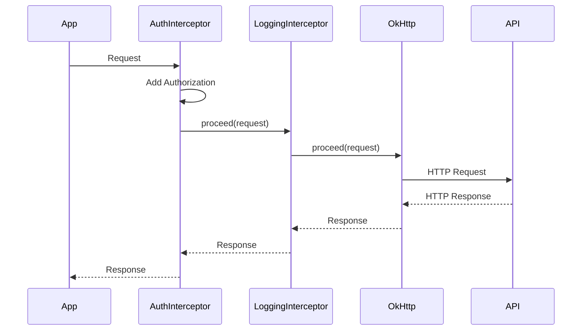
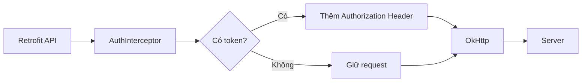
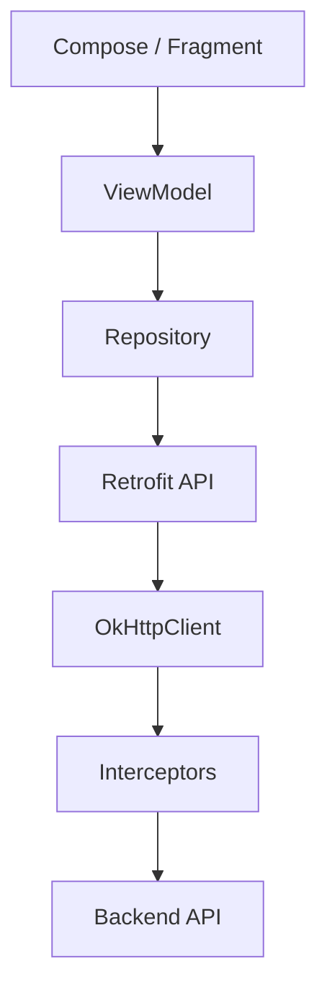
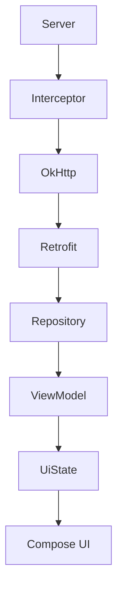
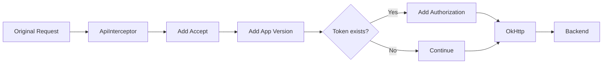
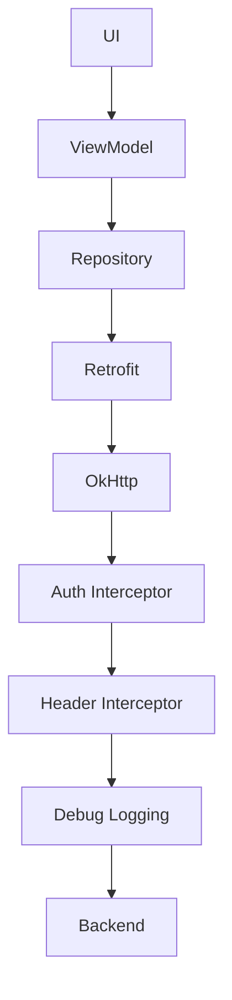
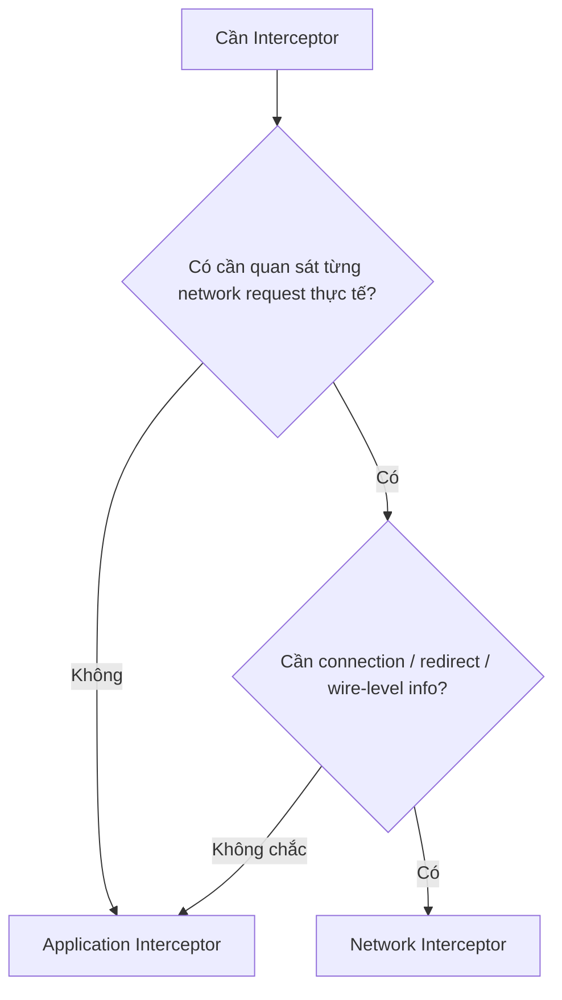
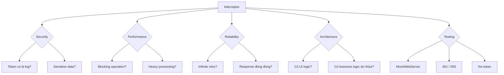

# 017 - Interceptor

**Học phần:** 04 - Network, Async and Services
**Module:** Module 07 - Network
**Nhóm nội dung:** HTTP Client and GraphQL
**Nguồn roadmap:** Network / HTTP Client and GraphQL
**Loại bài:** Network
**Thứ tự trong module:** 017
**Thời lượng gợi ý:** 32 phút

---

## 1. Tóm tắt

**Interceptor** trong OkHttp là một cơ chế cho phép ứng dụng **quan sát, chỉnh sửa hoặc chặn luồng HTTP request/response** trước khi request được gửi đi hoặc trước khi response quay về code ứng dụng. Các use case phổ biến gồm thêm `Authorization` header, thêm metadata chung, logging, đo thời gian request, thay đổi request và xử lý một số chính sách mạng dùng chung. ([Square Open Source][1])

Có thể hình dung Interceptor giống **middleware** nằm giữa ứng dụng và HTTP client:

```text
Android App
    │
    │ API call
    ▼
┌───────────────────────┐
│ Interceptor 1         │
│ Authorization         │
└──────────┬────────────┘
           ▼
┌───────────────────────┐
│ Interceptor 2         │
│ Logging               │
└──────────┬────────────┘
           ▼
┌───────────────────────┐
│      OkHttp Core      │
└──────────┬────────────┘
           ▼
        Internet
           │
           ▼
         Server
```

Response quay về theo chiều ngược lại:

```text
Request
App
 │
 ▼
Interceptor A
 │
 ▼
Interceptor B
 │
 ▼
Server

Response
Server
 │
 ▼
Interceptor B
 │
 ▼
Interceptor A
 │
 ▼
App
```

Đây là điểm rất quan trọng:

> Interceptor không chỉ xử lý **request đi xuống** mà còn có thể xử lý **response đi ngược lên**.

---

# 2. Mục tiêu học tập

Sau bài này, bạn nên có thể:

* Giải thích Interceptor bằng ngôn ngữ của mình.
* Hiểu `Interceptor.Chain`.
* Hiểu vai trò của `chain.proceed(request)`.
* Biết cách sửa HTTP request.
* Biết cách đọc hoặc xử lý HTTP response.
* Thêm header chung cho toàn bộ API.
* Thêm access token.
* Logging request/response trong môi trường debug.
* Phân biệt:

  * **Application Interceptor**
  * **Network Interceptor**
* Hiểu vị trí Interceptor khi dùng cùng Retrofit.
* Nhận biết những logic **không nên** đưa vào Interceptor.
* Viết test cho Interceptor bằng MockWebServer.
* Biết các rủi ro liên quan tới security, performance và release.

---

# 3. Interceptor là gì?

Interface `Interceptor` của OkHttp cho phép quan sát, sửa đổi hoặc thậm chí short-circuit request và response. Một interceptor thường lấy request hiện tại từ `chain.request()`, tạo request mới nếu cần, sau đó gọi `chain.proceed(request)` để chuyển request cho phần tiếp theo trong chuỗi. ([Square Open Source][2])

Cấu trúc cơ bản:

```kotlin
class ExampleInterceptor : Interceptor {

    override fun intercept(chain: Interceptor.Chain): Response {

        val request = chain.request()

        // Có thể chỉnh sửa request tại đây

        val response = chain.proceed(request)

        // Có thể kiểm tra response tại đây

        return response
    }
}
```

Tư duy:

```text
request
   │
   ▼
intercept()
   │
   ├── đọc request
   │
   ├── sửa request
   │
   ▼
chain.proceed()
   │
   ▼
HTTP / Interceptor tiếp theo
   │
   ▼
response
   │
   ├── đọc response
   │
   └── sửa response nếu cần
   ▼
return response
```

---

# 4. `Interceptor.Chain` là gì?

`Chain` đại diện cho **chuỗi xử lý HTTP hiện tại**. Nó cung cấp request hiện tại và phương thức `proceed()` để tiếp tục chuỗi. Với Network Interceptor, chain còn có thể cung cấp thông tin connection; điều này không khả dụng theo cùng cách đối với Application Interceptor. ([Square Open Source][3])

Ba khái niệm quan trọng:

```kotlin
chain.request()
```

Lấy request hiện tại.

```kotlin
chain.proceed(request)
```

Cho request tiếp tục đi qua pipeline.

```kotlin
val response = chain.proceed(request)
```

Nhận response khi request hoàn tất.

---

# 5. Vì sao `chain.proceed()` quan trọng?

Hãy tưởng tượng có ba interceptor:

```text
AuthInterceptor
      ↓
LoggingInterceptor
      ↓
MetricsInterceptor
      ↓
Server
```

Trong `AuthInterceptor`:

```kotlin
override fun intercept(chain: Interceptor.Chain): Response {

    val request = chain.request()

    return chain.proceed(request)
}
```

`proceed()` nghĩa là:

> "Tôi đã xử lý xong phần của mình, hãy chuyển request cho interceptor hoặc transport tiếp theo."

Luồng:



Application Interceptor có thể short-circuit hoặc tự thực hiện nhiều lần `proceed()` trong một số thiết kế, trong khi Network Interceptor phải gọi `proceed()` đúng một lần. ([Square Open Source][1])

---

# 6. Ví dụ 1 - Thêm header cho mọi request

Giả sử backend yêu cầu:

```http
Accept: application/json
X-App-Version: 2.1.0
```

Thay vì thêm ở từng API:

```kotlin
class CommonHeaderInterceptor : Interceptor {

    override fun intercept(chain: Interceptor.Chain): Response {

        val originalRequest = chain.request()

        val newRequest = originalRequest
            .newBuilder()
            .header("Accept", "application/json")
            .header("X-App-Version", "2.1.0")
            .build()

        return chain.proceed(newRequest)
    }
}
```

Đăng ký:

```kotlin
val client = OkHttpClient.Builder()
    .addInterceptor(CommonHeaderInterceptor())
    .build()
```

Từ đây:

```text
GET /users
GET /posts
POST /login
GET /profile
```

đều có thể nhận các header chung này.

### Không có Interceptor

```text
UserApi
   ├── header
   │
PostApi
   ├── header
   │
ProfileApi
   └── header
```

Code bị lặp.

### Có Interceptor

```text
UserApi ──────┐
PostApi ──────┼──► CommonHeaderInterceptor ───► Server
ProfileApi ───┘
```

Đây là một trong những use case tự nhiên nhất của cơ chế request rewriting mà OkHttp cung cấp. ([Square Open Source][1])

---

# 7. Ví dụ 2 - Authorization Interceptor

Một API thường yêu cầu:

```http
Authorization: Bearer <access_token>
```

Ta có thể triển khai:

```kotlin
interface TokenProvider {
    fun getToken(): String?
}
```

Interceptor:

```kotlin
class AuthInterceptor(
    private val tokenProvider: TokenProvider
) : Interceptor {

    override fun intercept(chain: Interceptor.Chain): Response {

        val token = tokenProvider.getToken()

        val request = chain.request()
            .newBuilder()
            .apply {
                if (!token.isNullOrBlank()) {
                    header(
                        "Authorization",
                        "Bearer $token"
                    )
                }
            }
            .build()

        return chain.proceed(request)
    }
}
```

Pipeline:



Điểm tốt ở kiến trúc này là Retrofit service không cần biết cách attach token:

```kotlin
interface UserApi {

    @GET("profile")
    suspend fun getProfile(): ProfileDto
}
```

Thay vì:

```kotlin
@GET("profile")
suspend fun getProfile(
    @Header("Authorization") token: String
): ProfileDto
```

cho hàng chục endpoint.

---

# 8. Interceptor không đồng nghĩa với Authenticator

Cần phân biệt:

```text
Interceptor
    │
    ├── Chủ động chỉnh request
    │
    └── Ví dụ: attach access token
```

và cơ chế authentication challenge:

```text
Server
   │
   ▼
401 Unauthorized
   │
   ▼
Authenticator
   │
   ▼
Tạo request có credential mới
```

OkHttp có `Authenticator` riêng cho các authentication challenge như HTTP `401`. Vì vậy, với hệ thống token phức tạp, có thể dùng Interceptor cho việc **đính kèm credential hiện có**, còn flow phản ứng với `401` cần được thiết kế cẩn thận thay vì nhét toàn bộ logic refresh vào một interceptor đơn giản. ([Square Open Source][4])

---

# 9. Ví dụ 3 - Logging Interceptor

Trong lúc phát triển, developer thường muốn thấy:

```text
GET /users
Authorization: Bearer ***
200 OK
512 ms
```

OkHttp có module `HttpLoggingInterceptor` cho việc log request và response; nó hỗ trợ các mức logging khác nhau, trong đó `HEADERS` bao gồm request/response lines và headers. ([Square Open Source][5])

Ví dụ:

```kotlin
val loggingInterceptor = HttpLoggingInterceptor().apply {
    level = HttpLoggingInterceptor.Level.BODY
}
```

Thêm vào client:

```kotlin
val client = OkHttpClient.Builder()
    .addInterceptor(loggingInterceptor)
    .build()
```

### Production nên cẩn thận

Không nên vô tư log:

```text
Authorization
Cookie
Refresh-Token
Password
Credit card
Personal data
```

`HttpLoggingInterceptor` có cơ chế `redactHeader()` để che giá trị của header nhạy cảm trong log. ([Square Open Source][6])

Ví dụ:

```kotlin
val loggingInterceptor = HttpLoggingInterceptor().apply {

    redactHeader("Authorization")
    redactHeader("Cookie")

    level = HttpLoggingInterceptor.Level.BODY
}
```

Một chiến lược Android thường dùng:

```kotlin
if (BuildConfig.DEBUG) {
    builder.addInterceptor(loggingInterceptor)
}
```

---

# 10. Ví dụ 4 - Đo thời gian request

Ta có thể viết:

```kotlin
class TimingInterceptor : Interceptor {

    override fun intercept(chain: Interceptor.Chain): Response {

        val start = System.nanoTime()

        val response = chain.proceed(chain.request())

        val durationMs =
            (System.nanoTime() - start) / 1_000_000

        println(
            "${chain.request().url} took ${durationMs}ms"
        )

        return response
    }
}
```

Pipeline:

```text
Request
   │
   ▼
start timer
   │
   ▼
chain.proceed()
   │
   ▼
network
   │
   ▼
response
   │
   ▼
stop timer
   │
   ▼
return response
```

Trong hệ thống production cần phân biệt timing interceptor với observability chi tiết hơn ở cấp connection/DNS/TLS; OkHttp cũng có `EventListener` dành cho các call events, nên không phải mọi metric đều nên được nhét vào interceptor. ([Square Open Source][7])

---

# 11. Hai loại Interceptor

OkHttp phân biệt hai nhóm chính:

```text
Interceptor
│
├── Application Interceptor
│
└── Network Interceptor
```

Đây là phần quan trọng nhất của bài.

---

## 11.1 Application Interceptor

Đăng ký bằng:

```kotlin
OkHttpClient.Builder()
    .addInterceptor(...)
```

Application Interceptor quan sát **toàn bộ logical call** của ứng dụng. Theo tài liệu OkHttp, chúng không cần quan tâm trực tiếp tới các intermediate response như redirect/retry, vẫn được gọi khi response được phục vụ từ cache và có thể short-circuit chain. ([Square Open Source][1])

Ví dụ:

```kotlin
val client = OkHttpClient.Builder()
    .addInterceptor(AuthInterceptor(tokenProvider))
    .build()
```

Phù hợp với:

* authorization header;
* common header;
* request metadata;
* high-level logging;
* custom request policy.

---

# 12. Network Interceptor

Đăng ký:

```kotlin
OkHttpClient.Builder()
    .addNetworkInterceptor(...)
```

Network Interceptor hoạt động gần network transport hơn. Nó quan sát từng network request/response thực sự, có khả năng truy cập connection thông qua chain, không chạy khi response hoàn toàn được phục vụ từ cache, và có thể nhìn thấy các request phát sinh bởi redirect ở cấp network. ([Square Open Source][1])

Ví dụ:

```kotlin
class NetworkInfoInterceptor : Interceptor {

    override fun intercept(
        chain: Interceptor.Chain
    ): Response {

        val connection = chain.connection()

        println(connection?.protocol())

        return chain.proceed(chain.request())
    }
}
```

---

# 13. Application vs Network Interceptor

| Tiêu chí               | Application Interceptor      | Network Interceptor              |
| ---------------------- | ---------------------------- | -------------------------------- |
| Đăng ký                | `addInterceptor()`           | `addNetworkInterceptor()`        |
| Mức độ                 | Logical application call     | Network request                  |
| Cache response         | Có thể quan sát              | Không chạy nếu không đi network  |
| Redirect               | Thường thấy logical call     | Có thể thấy từng network request |
| Connection             | Không dùng như network chain | Có thể truy cập                  |
| Header chung           | ⭐ Rất phù hợp                | Có thể nhưng thường không cần    |
| Auth token             | ⭐ Phù hợp                    | Thường không cần                 |
| Wire-level observation | Hạn chế hơn                  | ⭐ Phù hợp                        |

Các khác biệt cốt lõi này được OkHttp mô tả trực tiếp trong tài liệu Interceptors và API của `networkInterceptors`. ([Square Open Source][1])

### Quy tắc học nhanh

Nếu chưa biết nên dùng cái nào:

> **Ưu tiên Application Interceptor.**

Chỉ dùng Network Interceptor khi thực sự cần quan sát hoặc tác động ở mức network request cụ thể.

---

# 14. Vị trí Interceptor khi dùng Retrofit

Kiến trúc Android thường có:



Điều quan trọng:

```text
Retrofit
   ↓
OkHttp
   ↓
Interceptor
   ↓
HTTP
```

Interceptor thuộc **HTTP client layer**, không thuộc UI và cũng không nên chứa business logic giao diện.

---

# 15. Một cấu hình thực tế

Ví dụ project:

```text
network/
├── ApiService.kt
├── RetrofitFactory.kt
│
├── interceptor/
│   ├── AuthInterceptor.kt
│   ├── CommonHeaderInterceptor.kt
│   └── TimingInterceptor.kt
│
└── token/
    └── TokenProvider.kt
```

Client:

```kotlin
fun provideOkHttpClient(
    authInterceptor: AuthInterceptor,
    commonHeaderInterceptor: CommonHeaderInterceptor
): OkHttpClient {

    return OkHttpClient.Builder()
        .addInterceptor(commonHeaderInterceptor)
        .addInterceptor(authInterceptor)
        .build()
}
```

Retrofit:

```kotlin
fun provideRetrofit(
    client: OkHttpClient
): Retrofit {

    return Retrofit.Builder()
        .baseUrl(BASE_URL)
        .client(client)
        .addConverterFactory(
            GsonConverterFactory.create()
        )
        .build()
}
```

---

# 16. Thứ tự Interceptor rất quan trọng

Giả sử:

```kotlin
OkHttpClient.Builder()
    .addInterceptor(A())
    .addInterceptor(B())
    .addInterceptor(C())
```

Request đi:

```text
App
 │
 ▼
 A
 │
 ▼
 B
 │
 ▼
 C
 │
 ▼
Network
```

Response:

```text
Network
 │
 ▼
 C
 │
 ▼
 B
 │
 ▼
 A
 │
 ▼
App
```

Có thể hình dung như nested function:

```text
A(
    B(
        C(
            network()
        )
    )
)
```

Vì mỗi interceptor kiểm soát khi nào gọi `chain.proceed()`, vị trí trong chain có thể ảnh hưởng tới dữ liệu mà interceptor khác quan sát được. Cơ chế chain này là nền tảng trong thiết kế Interceptor của OkHttp. ([Square Open Source][2])

---

# 17. Ví dụ thứ tự gây khác biệt

Giả sử:

```text
Logging
↓
Auth
```

Logging nhìn request **trước khi** Auth thêm token:

```text
GET /profile
```

Nhưng:

```text
Auth
↓
Logging
```

Logging có thể nhìn thấy:

```text
Authorization: Bearer eyJ...
```

Điều này có thể gây:

```text
logcat
   ↓
token bị ghi ra
   ↓
security leak
```

Do đó ordering và redaction cần được coi là một phần của thiết kế security, không chỉ là chuyện "code chạy được". `HttpLoggingInterceptor.redactHeader()` tồn tại chính để che các header nhạy cảm khỏi log. ([Square Open Source][6])

---

# 18. Short-circuit request

Interceptor không nhất thiết luôn phải gửi request xuống network.

Ví dụ minh họa:

```kotlin
class MaintenanceInterceptor : Interceptor {

    override fun intercept(
        chain: Interceptor.Chain
    ): Response {

        if (isMaintenanceMode()) {

            return Response.Builder()
                .request(chain.request())
                .protocol(Protocol.HTTP_1_1)
                .code(503)
                .message("Maintenance")
                .body(
                    """{"error":"maintenance"}"""
                        .toResponseBody(
                            "application/json".toMediaType()
                        )
                )
                .build()
        }

        return chain.proceed(chain.request())
    }
}
```

Application Interceptor được OkHttp cho phép short-circuit chain bằng cách trả response mà không gọi `proceed()`. ([Square Open Source][1])

Tuy vậy, việc tự tạo HTTP response giả nên dùng có chủ đích vì nó có thể khiến tầng phía trên khó phân biệt server response thật và client-generated response.

---

# 19. Không nên nhét mọi thứ vào Interceptor

Một sai lầm phổ biến về kiến trúc là:

```text
Interceptor
├── refresh token
├── parse JSON business error
├── update database
├── navigate login screen
├── show Toast
├── analytics
├── retry
├── offline cache
└── business rule
```

Interceptor dần trở thành:

```text
God Object
```

### Interceptor nên tập trung vào

```text
HTTP concern
```

Ví dụ:

```text
Headers
Authentication metadata
Request transformation
Network logging
HTTP-level policy
```

### Không nên chứa

```text
Compose UI state
Navigation
Toast
Activity
Fragment
ViewModel
Domain business rule
```

---

# 20. Interceptor và UI State

Interceptor có thể gặp:

```text
401
403
404
500
timeout
IOException
```

Nhưng không nên trực tiếp làm:

```kotlin
Toast.makeText(...)
```

hoặc:

```kotlin
navController.navigate(...)
```

Kiến trúc tốt hơn:



Ví dụ:

```text
Server
 ↓
401
 ↓
Network/Data layer
 ↓
AuthExpired
 ↓
ViewModel
 ↓
UiState
 ↓
Login UI
```

Interceptor vẫn giữ vai trò ở HTTP layer.

---

# 21. Interceptor và Lifecycle

Interceptor:

```text
không phải
LifecycleObserver
```

Nó không nên biết:

```text
Activity STARTED?
Fragment RESUMED?
Compose đang visible?
```

Request nên được điều khiển ở các tầng Android phù hợp:

```text
UI
 ↓
ViewModel
 ↓
Coroutine
 ↓
Repository
 ↓
Retrofit
 ↓
OkHttp
 ↓
Interceptor
```

Nếu UI biến mất, lifecycle/coroutine/request owner mới là nơi quyết định request còn cần thiết hay không; interceptor nên tránh phụ thuộc trực tiếp vào Activity hoặc Fragment.

---

# 22. Retry - rất dễ dùng sai

Có thể nghĩ:

```kotlin
if (!response.isSuccessful) {
    return chain.proceed(request)
}
```

Nhưng retry không kiểm soát có thể tạo:

```text
Request
 ↓
Failure
 ↓
Retry
 ↓
Failure
 ↓
Retry
 ↓
Failure
 ...
```

Hoặc tệ hơn với:

```http
POST /payment
POST /order
POST /transfer
```

một retry không đúng chiến lược có thể tạo side effect nhiều lần.

Do đó cần phân biệt:

```text
GET /news
```

với:

```text
POST /payment
```

và xem xét idempotency, backoff và chính sách server trước khi tự xây retry trong interceptor.

---

# 23. Một ví dụ Interceptor hoàn chỉnh hơn

```kotlin
class ApiInterceptor(
    private val tokenProvider: TokenProvider,
    private val appVersion: String
) : Interceptor {

    override fun intercept(
        chain: Interceptor.Chain
    ): Response {

        val originalRequest = chain.request()

        val requestBuilder =
            originalRequest.newBuilder()
                .header(
                    "Accept",
                    "application/json"
                )
                .header(
                    "X-App-Version",
                    appVersion
                )

        tokenProvider
            .getToken()
            ?.takeIf { it.isNotBlank() }
            ?.let { token ->
                requestBuilder.header(
                    "Authorization",
                    "Bearer $token"
                )
            }

        val request = requestBuilder.build()

        return chain.proceed(request)
    }
}
```

Pipeline:



---

# 24. Ví dụ với Retrofit

API:

```kotlin
interface UserApi {

    @GET("users/me")
    suspend fun getMe(): UserDto
}
```

Repository:

```kotlin
class UserRepository(
    private val userApi: UserApi
) {

    suspend fun getMe(): UserDto {
        return userApi.getMe()
    }
}
```

Không thấy token ở đây:

```kotlin
userApi.getMe()
```

Nhưng HTTP request thực tế:

```http
GET /users/me
Accept: application/json
X-App-Version: 1.3.0
Authorization: Bearer ...
```

vì Interceptor đã bổ sung chúng.

---

# 25. Test Interceptor

Interceptor là code rất phù hợp với integration test nhỏ:

```text
Interceptor
      +
Mock HTTP server
```

OkHttp cung cấp **MockWebServer**, một HTTP server có thể được lập trình bằng các response định sẵn, phù hợp để kiểm tra request do client gửi ra và response trả về. ([Square Open Source][8])

Ta muốn test:

```text
Input
GET /profile

Expected request

Authorization: Bearer abc
Accept: application/json
```

---

## Ví dụ test

Concept:

```kotlin
@Test
fun `auth interceptor adds authorization header`() {

    val server = MockWebServer()

    server.enqueue(
        MockResponse()
            .setResponseCode(200)
            .setBody("{}")
    )

    server.start()

    val client = OkHttpClient.Builder()
        .addInterceptor(
            AuthInterceptor(
                tokenProvider = FakeTokenProvider("abc")
            )
        )
        .build()

    val request = Request.Builder()
        .url(server.url("/profile"))
        .build()

    client.newCall(request)
        .execute()
        .use { }

    val recordedRequest =
        server.takeRequest()

    assertEquals(
        "Bearer abc",
        recordedRequest.getHeader("Authorization")
    )

    server.shutdown()
}
```

MockWebServer có thể phát các `MockResponse` đã chuẩn bị trước để test client mà không phụ thuộc backend thật. ([Square Open Source][9])

---

# 26. Những test nên có

### Test 1 - Có token

```text
Token = abc

Expected:

Authorization: Bearer abc
```

### Test 2 - Không có token

```text
Token = null

Expected:

Không có Authorization header
```

### Test 3 - Header chung

```text
Expected:

Accept: application/json
```

### Test 4 - Response error

Mock:

```http
HTTP/1.1 500
```

Kiểm tra interceptor không:

```text
crash
infinite retry
consume response sai
```

### Test 5 - Sensitive logging

Đảm bảo production log không chứa:

```text
Authorization token
Cookie
Personal data
```

---

# 27. Debug Interceptor

Nếu nghi interceptor có vấn đề, kiểm tra pipeline:

```text
API call
  ↓
Interceptor được gọi?
  ↓
Request ban đầu đúng?
  ↓
Header sau khi sửa đúng?
  ↓
chain.proceed() được gọi?
  ↓
Server nhận request?
  ↓
Response code?
```

Android Studio có **Network Inspector** để xem hoạt động network theo thời gian, bao gồm dữ liệu ứng dụng gửi và nhận, nên đây là công cụ hữu ích khi debug HTTP flow. ([Android Developers][10])

---

# 28. Các lỗi thường gặp

## Lỗi 1 - Quên `chain.proceed()`

```kotlin
override fun intercept(
    chain: Interceptor.Chain
): Response {

    val request = chain.request()

    // ???

}
```

Nếu interceptor không short-circuit có chủ đích thì request cần được chuyển tiếp qua chain.

---

## Lỗi 2 - Log token

```text
Authorization:
Bearer eyJhbGci...
```

Nguy hiểm khi:

```text
Crash log
CI log
Analytics
Remote logging
```

Sử dụng redaction hoặc tắt verbose logging ở production. ([Square Open Source][6])

---

## Lỗi 3 - Retry vô hạn

```text
401
 ↓
retry
 ↓
401
 ↓
retry
 ↓
401
 ↓
...
```

Luôn cần exit condition.

---

## Lỗi 4 - Interceptor phụ thuộc Activity

Không nên:

```kotlin
class AuthInterceptor(
    private val activity: MainActivity
)
```

Interceptor thuộc network/data infrastructure và không nên kéo UI lifecycle vào network client.

---

## Lỗi 5 - Business logic trong Interceptor

Không nên:

```text
if response == premium_user
    unlockPremiumFeature()
```

Nên:

```text
HTTP Response
 ↓
Repository
 ↓
Domain
 ↓
ViewModel
 ↓
UI
```

---

# 29. Interceptor ảnh hưởng UX như thế nào?

Interceptor tưởng như chỉ là network infrastructure nhưng có thể tác động trực tiếp tới trải nghiệm người dùng.

### Auth sai

```text
Token không attach
 ↓
401
 ↓
User tưởng bị logout
```

### Retry sai

```text
API chậm
 ↓
retry nhiều lần
 ↓
loading kéo dài
```

### Logging quá nặng

```text
BODY lớn
 ↓
debug overhead
```

### Header sai

```text
API request
 ↓
server reject
 ↓
UI Error
```

Vì vậy một interceptor nhỏ vẫn cần được coi như code production-critical.

---

# 30. Interceptor ảnh hưởng Maintainability

### Không dùng interceptor

```text
ApiA → add token
ApiB → add token
ApiC → add token
ApiD → add token
ApiE → add token
```

### Dùng interceptor

```text
          ┌─────────────────┐
ApiA ─────┤                 │
ApiB ─────┤ AuthInterceptor ├──► Server
ApiC ─────┤                 │
ApiD ─────┤                 │
          └─────────────────┘
```

Cross-cutting HTTP concern được gom về một nơi, nhờ đó thay đổi chính sách header không phải sửa từng endpoint.

---

# 31. Interceptor ảnh hưởng Performance

Cần tránh thực hiện quá nhiều công việc trong:

```kotlin
intercept()
```

Ví dụ không lý tưởng:

```text
Interceptor
 ↓
read database lớn
 ↓
parse file
 ↓
heavy crypto
 ↓
network call khác
 ↓
request chính
```

Interceptor nằm trực tiếp trên call pipeline, do đó công việc blocking hoặc expensive ở đây có thể làm tăng latency của request.

---

# 32. Security Checklist

```text
Interceptor
│
├── Token có bị log?
├── Cookie có bị log?
├── Password có bị log?
├── Response body nhạy cảm có bị log?
├── Debug logger có chạy production?
├── Token có gửi nhầm domain?
└── HTTP có phải HTTPS?
```

Ngoài interceptor, Android còn có **Network Security Configuration** để cấu hình trust anchors, cleartext traffic và các chính sách TLS ở cấp ứng dụng/domain. ([Android Developers][11])

---

# 33. Kiến trúc đề xuất



Hãy nhớ:

```text
UI concern
    ↓
ViewModel

Business concern
    ↓
Domain / Repository

HTTP concern
    ↓
OkHttp / Interceptor
```

---

# 34. Application Interceptor hay Network Interceptor?

Dùng sơ đồ sau:



Các trường hợp thông thường:

```text
Auth header
App version
Language header
Generic metadata
Logging cấp app
```

→ `addInterceptor()`.

---

# 35. Bài thực hành - Mini API Client

## Yêu cầu

Xây dựng:

```text
UserProfile App
```

API:

```http
GET /profile
```

Request phải chứa:

```http
Authorization: Bearer ...
Accept: application/json
X-App-Version: 1.0
```

Architecture:

```text
Compose
   ↓
ViewModel
   ↓
Repository
   ↓
Retrofit
   ↓
OkHttp
   ↓
AuthInterceptor
   ↓
HeaderInterceptor
   ↓
API
```

---

## UI State

```kotlin
sealed interface ProfileUiState {

    data object Loading : ProfileUiState

    data class Success(
        val user: UserUiModel
    ) : ProfileUiState

    data class Error(
        val message: String
    ) : ProfileUiState
}
```

UI:

```text
Loading
   │
   ├── Success → Profile
   │
   └── Error
         │
         └── Retry
```

---

# 36. Bài tập

### Task 1

Viết:

```text
CommonHeaderInterceptor
```

thêm:

```http
Accept: application/json
X-Platform: android
```

---

### Task 2

Viết:

```text
AuthInterceptor
```

thêm:

```http
Authorization: Bearer TOKEN
```

nếu token tồn tại.

---

### Task 3

Dùng MockWebServer kiểm tra:

```text
Authorization header
```

đã thực sự được client gửi đi hay chưa. MockWebServer được thiết kế để replay các canned response và ghi nhận request từ HTTP client, rất phù hợp với bài test kiểu này. ([Square Open Source][12])

---

### Task 4

Thêm:

```text
HttpLoggingInterceptor
```

chỉ ở debug build.

---

### Task 5

Mô phỏng:

```http
500 Internal Server Error
```

UI phải hiển thị:

```text
Something went wrong

[ Retry ]
```

Không crash.

---

# 37. Artifact cho Portfolio

Có thể tạo mini project:

```text
okhttp-interceptor-demo/
│
├── AuthInterceptor.kt
├── CommonHeaderInterceptor.kt
├── NetworkModule.kt
├── UserApi.kt
├── UserRepository.kt
├── ProfileViewModel.kt
│
├── test/
│   └── AuthInterceptorTest.kt
│
└── README.md
```

README nên có:

```text
OkHttp Interceptor Demo

Features:
- Authorization interceptor
- Common header interceptor
- Debug logging
- Retrofit integration
- Loading / Success / Error UI
- MockWebServer tests
```

Sơ đồ:

```text
Retrofit
  │
  ▼
OkHttp
  │
  ▼
AuthInterceptor
  │
  ▼
HeaderInterceptor
  │
  ▼
Server
```

Đây là artifact nhỏ nhưng thể hiện được:

```text
Network architecture
+ Kotlin
+ Retrofit
+ OkHttp
+ Testing
+ Error handling
+ Security awareness
```

---

# 38. Câu hỏi phỏng vấn thường gặp

### Interceptor trong OkHttp là gì?

> Là thành phần nằm trong HTTP call chain, có thể quan sát hoặc chỉnh sửa request/response và chuyển request tiếp tục bằng `chain.proceed()`.

### Interceptor thường dùng để làm gì?

```text
Authentication
Headers
Logging
Metrics
Request transformation
HTTP policy
```

### Application và Network Interceptor khác nhau thế nào?

> Application Interceptor nhìn logical call ở cấp ứng dụng; Network Interceptor nằm gần network hơn, quan sát các network request thực tế và có thể truy cập connection. ([Square Open Source][1])

### `chain.proceed()` có tác dụng gì?

> Chuyển request tới phần tiếp theo của interceptor chain và trả response ngược trở lại.

### Có nên refresh token trực tiếp trong mọi AuthInterceptor không?

> Không nên coi đó là mặc định. Token attachment và xử lý authentication challenge là hai trách nhiệm cần phân biệt; OkHttp có `Authenticator` dành riêng cho HTTP authentication challenge như `401`. ([Square Open Source][4])

---

# 39. Checklist hoàn thành

* [ ] Giải thích được Interceptor là gì.
* [ ] Hiểu request đi qua interceptor chain như thế nào.
* [ ] Hiểu response quay ngược interceptor chain.
* [ ] Biết `chain.request()`.
* [ ] Biết `chain.proceed()`.
* [ ] Viết được `CommonHeaderInterceptor`.
* [ ] Viết được `AuthInterceptor`.
* [ ] Biết sử dụng `HttpLoggingInterceptor`.
* [ ] Không log token hoặc dữ liệu nhạy cảm.
* [ ] Phân biệt Application Interceptor.
* [ ] Phân biệt Network Interceptor.
* [ ] Biết `addInterceptor()`.
* [ ] Biết `addNetworkInterceptor()`.
* [ ] Hiểu ordering của các interceptor.
* [ ] Không đưa UI logic vào interceptor.
* [ ] Không retry vô hạn.
* [ ] Có loading/success/error/retry UI.
* [ ] Test interceptor bằng MockWebServer.
* [ ] Có README hoặc diagram cho portfolio.

---

# 40. Ghi chú sản xuất

Trước khi đưa Interceptor vào production, nên kiểm tra toàn bộ chuỗi:



Điểm cần nhớ nhất của bài:

> **Interceptor là middleware của HTTP layer.**

Và công thức tư duy:

```text
Request
   ↓
Interceptor
   ↓
chain.proceed()
   ↓
Server
   ↓
Response
   ↓
Interceptor
   ↓
Application
```

Nếu chỉ cần nhớ ba ý:

```text
1. Interceptor có thể quan sát và sửa request/response.

2. Application Interceptor phù hợp với phần lớn
   cross-cutting concern như auth/header/logging.

3. Interceptor xử lý HTTP concern,
   không phải nơi xử lý UI hoặc business logic.
```

Tài liệu chính thức OkHttp mô tả Interceptor là cơ chế trung tâm để monitor, rewrite và xử lý call chain; API `Interceptor`, `Chain` và tài liệu phân biệt application/network interceptor là các nguồn nên ưu tiên khi học sâu chủ đề này. ([Square Open Source][1])

[1]: https://square.github.io/okhttp/features/interceptors/?utm_source=chatgpt.com "Interceptors - OkHttp"
[2]: https://square.github.io/okhttp/5.x/okhttp/okhttp3/-interceptor/index.html?utm_source=chatgpt.com "Interceptor"
[3]: https://square.github.io/okhttp/5.x/okhttp/okhttp3/-interceptor/-chain/index.html?utm_source=chatgpt.com "Chain"
[4]: https://square.github.io/okhttp/3.x/okhttp/index.html?okhttp3%2FAuthenticator.html=&utm_source=chatgpt.com "Authenticator (OkHttp 3.14.0 API)"
[5]: https://square.github.io/okhttp/5.x/logging-interceptor/okhttp3.logging/-http-logging-interceptor/-level/index.html?utm_source=chatgpt.com "Level"
[6]: https://square.github.io/okhttp/5.x/logging-interceptor/okhttp3.logging/-http-logging-interceptor/redact-header.html?utm_source=chatgpt.com "redactHeader"
[7]: https://square.github.io/okhttp/5.x/logging-interceptor/okhttp3.logging/-logging-event-listener/index.html?utm_source=chatgpt.com "LoggingEventListener"
[8]: https://square.github.io/okhttp/5.x/mockwebserver/okhttp3.mockwebserver/-mock-web-server/index.html?utm_source=chatgpt.com "MockWebServer"
[9]: https://square.github.io/okhttp/5.x/mockwebserver/okhttp3.mockwebserver/-mock-response/index.html?utm_source=chatgpt.com "MockResponse"
[10]: https://developer.android.com/studio/debug/network-profiler?utm_source=chatgpt.com "Inspect network traffic with the Network Inspector"
[11]: https://developer.android.com/privacy-and-security/security-config?utm_source=chatgpt.com "Network security configuration"
[12]: https://square.github.io/okhttp/5.x/mockwebserver3/mockwebserver3/-mock-web-server/index.html?utm_source=chatgpt.com "MockWebServer"

---

# Bài luyện tập

## Mục tiêu


## Đề bài


## Yêu cầu hoàn thành

- [ ] 
- [ ] 
- [ ] 

## Kết quả / lời giải


## Ghi chú
