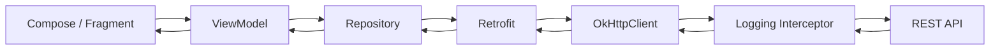
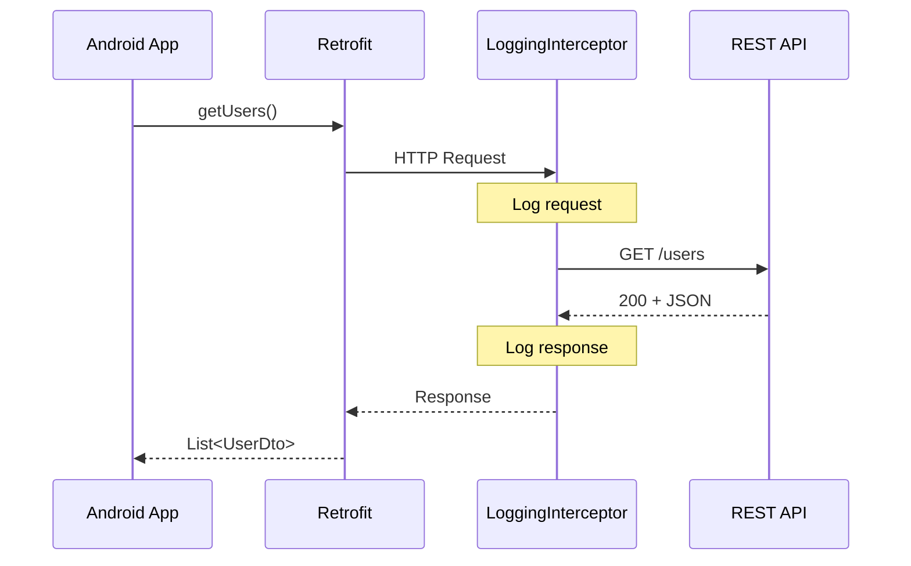
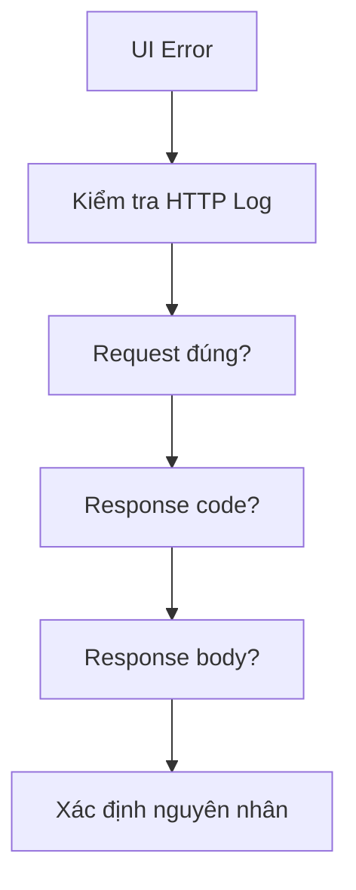
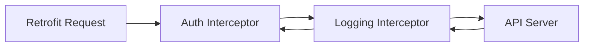

[![\[Android\] OkHttp Interceptor로 서버 Response 변형하기 — MISTART](https://tse2.mm.bing.net/th/id/OIP.8TXZ5FFsI264Iaw1OY9CvAHaGy?r=0\&pid=Api)](https://milab.tistory.com/59?utm_source=chatgpt.com)

# 018 - Logging Interceptor

**Học phần:** 04 - Network, Async and Services
**Module:** Module 07 - Network
**Nhóm nội dung:** HTTP Client and GraphQL
**Nguồn roadmap:** Network / HTTP Client and GraphQL
**Loại bài:** Network
**Thứ tự trong module:** 018
**Thời lượng gợi ý:** 32 phút

---

## 1. Tóm tắt

**Logging Interceptor** thường chỉ `HttpLoggingInterceptor` của OkHttp: một interceptor dùng để ghi lại thông tin **HTTP request và HTTP response**, giúp developer quan sát chính xác app đang gửi gì lên server và nhận gì về. Tài liệu của dự án mô tả nó là interceptor chuyên log request/response và cho phép thay đổi mức log bằng `setLevel()`/`level`. ([GitHub][1])

Trong Android, nó đặc biệt hữu ích khi debug các lỗi như:

* URL bị sai.
* Query parameter không đúng.
* Header thiếu token.
* Server trả `401`, `403`, `404`, `500`.
* JSON response không giống DTO.
* Request body bị serialize sai.
* API phản hồi chậm.
* Retrofit báo lỗi nhưng chưa rõ dữ liệu HTTP thực tế.

Logging Interceptor nằm ở **network/data layer**, không phải UI layer.

---

## 2. Mục tiêu học tập

Sau bài này, anh nên có thể:

* Giải thích Logging Interceptor bằng ngôn ngữ của mình.
* Hiểu Logging Interceptor nằm ở đâu trong Retrofit + OkHttp.
* Phân biệt `NONE`, `BASIC`, `HEADERS`, `BODY`.
* Thêm `HttpLoggingInterceptor` vào `OkHttpClient`.
* Chỉ bật log chi tiết trong debug build.
* Không làm lộ `Authorization`, cookie, token hoặc dữ liệu cá nhân.
* Dùng Logcat để debug request/response.
* Hiểu Logging Interceptor hỗ trợ debugging chứ không nên điều khiển business logic.
* Biết những rủi ro về performance và security khi dùng `BODY`.

---

# 3. Logging Interceptor nằm ở đâu?

Một ứng dụng Android dùng Retrofit thường có luồng:



Interceptor của OkHttp có khả năng quan sát hoặc biến đổi request/response trong quá trình xử lý HTTP. ([Square Open Source][2])

Riêng Logging Interceptor chủ yếu đóng vai trò:

```text
                 REQUEST
Android App --------------------> API
             │
             │ Logging
             ▼
     method / URL / headers
     body / metadata

                 RESPONSE
Android App <-------------------- API
             │
             │ Logging
             ▼
     status code / headers
     body / timing
```

### Điểm quan trọng

Logging Interceptor **không phải** nơi để:

```text
❌ cập nhật UI
❌ lưu database
❌ xử lý navigation
❌ quyết định business rule
❌ retry tùy tiện
❌ refresh token phức tạp
```

Nó chủ yếu phục vụ **observability và debugging**.

---

# 4. `HttpLoggingInterceptor`

Package:

```kotlin
import okhttp3.logging.HttpLoggingInterceptor
```

Cấu trúc cơ bản:

```kotlin
val loggingInterceptor = HttpLoggingInterceptor()

loggingInterceptor.level =
    HttpLoggingInterceptor.Level.BODY

val okHttpClient = OkHttpClient.Builder()
    .addInterceptor(loggingInterceptor)
    .build()
```

Theo tài liệu hiện tại, Logging Interceptor được thêm vào `OkHttpClient` bằng `addInterceptor(...)`. ([GitHub][1])

---

# 5. Các mức Logging

`HttpLoggingInterceptor` có bốn mức chính:

```text
NONE
BASIC
HEADERS
BODY
```

API reference hiện tại của OkHttp liệt kê đầy đủ bốn mức này. ([Square Open Source][3])

| Level     | Log gì?                          | Dùng khi           |
| --------- | -------------------------------- | ------------------ |
| `NONE`    | Không log                        | Production         |
| `BASIC`   | Request/response line            | Debug nhẹ          |
| `HEADERS` | BASIC + headers                  | Debug auth/header  |
| `BODY`    | Request/response + header + body | Debug API chi tiết |

---

## 5.1 `NONE`

```kotlin
loggingInterceptor.level =
    HttpLoggingInterceptor.Level.NONE
```

Không tạo HTTP log. Đây thường là lựa chọn phù hợp cho release build. `NONE` được định nghĩa là không log. ([Square Open Source][3])

---

## 5.2 `BASIC`

Ví dụ:

```text
--> GET https://api.example.com/users
<-- 200 https://api.example.com/users (180ms)
```

Developer có thể nhanh chóng biết:

```text
HTTP method
    +
URL
    +
status code
    +
thời gian
```

Phù hợp nếu anh chỉ muốn xác định:

> API nào được gọi và nó thành công hay thất bại?

---

# 5.3 `HEADERS`

Ví dụ:

```text
--> GET /profile

Accept: application/json
Authorization: Bearer abc123
Content-Type: application/json

<-- 200 OK

Content-Type: application/json
Cache-Control: max-age=60
```

Mức này hữu ích khi debug:

* `Authorization`.
* `Content-Type`.
* Cookie.
* Cache header.
* Custom API header.

Nhưng đây cũng là nơi bắt đầu có **rủi ro bảo mật lớn**.

---

# 5.4 `BODY`

Ví dụ request:

```text
--> POST https://api.example.com/login
Content-Type: application/json

{
    "email": "user@example.com",
    "password": "123456"
}
```

Response:

```text
<-- 200 OK

{
    "accessToken": "eyJhbGciOi...",
    "refreshToken": "..."
}
```

Developer nhìn vào sẽ debug rất dễ.

Nhưng đồng thời nó vừa log:

```text
email
password
accessToken
refreshToken
```

Đó chính là vấn đề.

README của Logging Interceptor cảnh báo rằng mức `HEADERS` và `BODY` có khả năng làm lộ dữ liệu nhạy cảm như `Authorization`, `Cookie` và nội dung request/response body. ([GitHub][1])

---

# 6. Cài Logging Interceptor

Trong `build.gradle.kts`:

```kotlin
dependencies {
    implementation(
        "com.squareup.okhttp3:logging-interceptor:<okhttp-version>"
    )
}
```

Nên để version của `logging-interceptor` phù hợp với version OkHttp đang sử dụng trong project.

Ví dụ sau khi sync Gradle:

```kotlin
import okhttp3.OkHttpClient
import okhttp3.logging.HttpLoggingInterceptor
```

---

# 7. Cấu hình cơ bản

```kotlin
val loggingInterceptor =
    HttpLoggingInterceptor().apply {
        level = HttpLoggingInterceptor.Level.BODY
    }

val okHttpClient =
    OkHttpClient.Builder()
        .addInterceptor(loggingInterceptor)
        .build()
```

Sau đó đưa client cho Retrofit:

```kotlin
val retrofit =
    Retrofit.Builder()
        .baseUrl("https://api.example.com/")
        .client(okHttpClient)
        .addConverterFactory(
            GsonConverterFactory.create()
        )
        .build()
```

Luồng lúc này:



---

# 8. Cách cấu hình phù hợp hơn cho Android

Không nên viết:

```kotlin
loggingInterceptor.level =
    HttpLoggingInterceptor.Level.BODY
```

cho mọi build.

Thay vào đó:

```kotlin
val loggingInterceptor =
    HttpLoggingInterceptor().apply {

        level =
            if (BuildConfig.DEBUG) {
                HttpLoggingInterceptor.Level.BODY
            } else {
                HttpLoggingInterceptor.Level.NONE
            }
    }
```

Kết quả:

```text
DEBUG
  ↓
BODY
  ↓
Log request/response

RELEASE
  ↓
NONE
  ↓
Không log HTTP
```

Android Developers khuyến cáo sanitize log trong non-debug build và hạn chế hoặc loại bỏ logging khỏi production vì log có thể chứa credential hoặc PII. ([Android Developers][4])

---

# 9. Redact dữ liệu nhạy cảm

Nếu cần log header nhưng có:

```http
Authorization: Bearer eyJ...
Cookie: session=abc123
```

có thể redact:

```kotlin
val loggingInterceptor =
    HttpLoggingInterceptor().apply {

        level = HttpLoggingInterceptor.Level.HEADERS

        redactHeader("Authorization")
        redactHeader("Cookie")
    }
```

Log sẽ không hiển thị giá trị thật của những header đã redact.

Logging Interceptor chính thức hỗ trợ `redactHeader()` cho trường hợp này. ([GitHub][1])

### Nên cân nhắc che

```text
Authorization
Cookie
Set-Cookie
X-API-Key
X-Auth-Token
```

Ngoài header, cần đặc biệt cẩn thận nếu body chứa:

```text
password
OTP
access token
refresh token
email
phone
credit card
tọa độ
thông tin sức khỏe
```

Android cũng khuyến cáo không log dữ liệu nhạy cảm và sử dụng redaction/masking nếu bắt buộc phải ghi log. ([Android Developers][4])

---

# 10. Cấu hình thực tế nên dùng

```kotlin
fun createLoggingInterceptor(): HttpLoggingInterceptor {

    return HttpLoggingInterceptor().apply {

        redactHeader("Authorization")
        redactHeader("Cookie")

        level =
            if (BuildConfig.DEBUG) {
                HttpLoggingInterceptor.Level.BODY
            } else {
                HttpLoggingInterceptor.Level.NONE
            }
    }
}
```

Sau đó:

```kotlin
fun createOkHttpClient(): OkHttpClient {

    return OkHttpClient.Builder()
        .addInterceptor(
            createLoggingInterceptor()
        )
        .build()
}
```

Đây là pattern đơn giản nhưng dễ kiểm soát:

```text
Debug build
      │
      ▼
LoggingInterceptor
BODY
      │
      ▼
Logcat


Release build
      │
      ▼
LoggingInterceptor
NONE
      │
      ▼
Không log dữ liệu HTTP
```

---

# 11. Ví dụ với Retrofit API

Giả sử API:

```kotlin
interface UserApi {

    @GET("users/{id}")
    suspend fun getUser(
        @Path("id") id: Long
    ): UserDto
}
```

Repository:

```kotlin
class UserRepository(
    private val api: UserApi
) {

    suspend fun getUser(id: Long): User {
        return api.getUser(id).toDomain()
    }
}
```

Khi gọi:

```kotlin
repository.getUser(10)
```

Logcat có thể xuất hiện:

```text
--> GET https://api.example.com/users/10

<-- 200 OK
Content-Type: application/json

{
    "id": 10,
    "name": "Alex",
    "email": "alex@example.com"
}

<-- END HTTP
```

Developer ngay lập tức biết:

```text
Request có được gửi?
        ↓
URL đúng?
        ↓
HTTP code?
        ↓
Server trả JSON gì?
        ↓
DTO có khớp JSON không?
```

---

# 12. Logging Interceptor giúp debug như thế nào?

Giả sử UI báo:

```text
Không thể tải người dùng
```

Chỉ nhìn UI:

```text
❓ Không biết lỗi ở đâu
```

Bật Logging Interceptor:

```text
GET /users/10
        ↓
HTTP 401
        ↓
Authorization header không tồn tại
```

Developer có thể thu hẹp lỗi:



---

# 13. Ví dụ debug các lỗi thường gặp

## Trường hợp 1 - Sai endpoint

Log:

```text
--> GET /user/123
<-- 404
```

Trong khi API đúng là:

```text
/users/123
```

### Phát hiện

```text
/user/
   ↓
sai endpoint
```

---

## Trường hợp 2 - Không gửi token

Log:

```text
--> GET /profile

Accept: application/json

<-- 401 Unauthorized
```

Không thấy:

```text
Authorization: Bearer ...
```

Có thể kiểm tra lại `AuthInterceptor`.

---

## Trường hợp 3 - JSON không đúng DTO

Server:

```json
{
  "user_id": 10,
  "username": "Alex"
}
```

Android DTO:

```kotlin
data class UserDto(
    val id: Long,
    val name: String
)
```

Nhờ `BODY`, anh có thể nhìn trực tiếp payload và nhận ra schema không khớp.

---

# 14. Logging Interceptor và UX

Logging Interceptor không trực tiếp render UI.

Nhưng nó ảnh hưởng gián tiếp đến chất lượng UX.

```text
Logging
   ↓
Debug API nhanh hơn
   ↓
Phát hiện lỗi sớm hơn
   ↓
Network ổn định hơn
   ↓
UX tốt hơn
```

Ví dụ developer có thể phát hiện:

```text
500 Server Error
timeout
API chậm
response rỗng
401 token
pagination sai
DTO sai
```

trước khi lỗi trở thành vấn đề khó tìm trong production.

---

# 15. Logging Interceptor và Lifecycle

Logging Interceptor bản thân nó **không quản lý Android lifecycle**.

Nó không quan tâm:

```text
Activity
Fragment
Compose lifecycle
configuration change
process recreation
```

Nó chỉ hoạt động khi một OkHttp `Call` đi qua client.

Do đó kiến trúc vẫn nên là:

```text
UI
 ↓
ViewModel
 ↓
Repository
 ↓
Retrofit
 ↓
OkHttp
 ↓
LoggingInterceptor
```

Không nên:

```text
Activity
   ↓
tự tạo OkHttpClient mới
   ↓
tự tạo LoggingInterceptor mới
   ↓
gọi API
```

Thông thường nên quản lý `OkHttpClient` như dependency dùng chung trong network layer thay vì liên tục tạo client mới; việc dùng chung client cũng giúp tận dụng tài nguyên HTTP như connection reuse. ([Square Open Source][5])

---

# 16. Logging Interceptor với Hilt

Một cấu trúc production-friendly:

```kotlin
@Module
@InstallIn(SingletonComponent::class)
object NetworkModule {

    @Provides
    @Singleton
    fun provideLoggingInterceptor():
        HttpLoggingInterceptor {

        return HttpLoggingInterceptor().apply {

            redactHeader("Authorization")
            redactHeader("Cookie")

            level =
                if (BuildConfig.DEBUG) {
                    HttpLoggingInterceptor.Level.BODY
                } else {
                    HttpLoggingInterceptor.Level.NONE
                }
        }
    }

    @Provides
    @Singleton
    fun provideOkHttpClient(
        loggingInterceptor: HttpLoggingInterceptor
    ): OkHttpClient {

        return OkHttpClient.Builder()
            .addInterceptor(loggingInterceptor)
            .build()
    }
}
```

Kiến trúc:

```text
Hilt
 │
 ├── LoggingInterceptor
 │
 └── OkHttpClient
       │
       ▼
    Retrofit
       │
       ▼
   Repository
```

---

# 17. Logging Interceptor và Auth Interceptor

Hai interceptor này có nhiệm vụ khác nhau.

### Auth Interceptor

```kotlin
class AuthInterceptor(
    private val tokenProvider: TokenProvider
) : Interceptor {

    override fun intercept(
        chain: Interceptor.Chain
    ): Response {

        val request =
            chain.request()
                .newBuilder()
                .addHeader(
                    "Authorization",
                    "Bearer ${tokenProvider.token}"
                )
                .build()

        return chain.proceed(request)
    }
}
```

### Logging Interceptor

```kotlin
val logging =
    HttpLoggingInterceptor().apply {
        level = HttpLoggingInterceptor.Level.BODY
    }
```

Có thể hình dung:



Logging giúp anh kiểm tra xem Auth Interceptor có thực sự thêm header hay không.

---

# 18. Không dùng Logging Interceptor cho analytics

Không nên làm:

```text
LoggingInterceptor
      ↓
Đếm số user login
      ↓
Business analytics
```

Hay:

```text
LoggingInterceptor
      ↓
Nếu thấy HTTP 200
      ↓
Navigate sang Home
```

Đó là sai boundary.

Logging nên phục vụ:

```text
debugging
diagnostics
network inspection
development observability
```

Business state vẫn nên đi qua:

```text
Response
  ↓
Repository
  ↓
Result
  ↓
ViewModel
  ↓
UiState
  ↓
Compose
```

---

# 19. Rủi ro của `BODY`

`BODY` rất tiện nhưng không phải lúc nào cũng nên bật.

## 19.1 Security

Ví dụ API login:

```json
{
  "email": "abc@gmail.com",
  "password": "secret"
}
```

Nếu log:

```text
Logcat
  ↓
email
password
token
```

thì log trở thành nơi chứa dữ liệu nhạy cảm.

Android Developers xem việc đưa credential hoặc PII vào device log là một dạng **Log Info Disclosure**. ([Android Developers][4])

---

## 19.2 Performance

Nếu response:

```text
10 KB
```

thì log BODY khá nhỏ.

Nhưng nếu response:

```text
5 MB JSON
```

việc dump toàn bộ nội dung ra Logcat trở nên không cần thiết và gây nhiễu khi debug.

Vì vậy:

```text
Development nhỏ
BODY

Debug lỗi header
HEADERS

Debug thông thường
BASIC

Production
NONE
```

là cách suy nghĩ an toàn hơn.

---

# 20. Logging Interceptor không thay thế Network Inspector

Hai công cụ có thể bổ trợ nhau.

### Logging Interceptor

```text
App
 ↓
OkHttp
 ↓
Logcat
```

Ưu điểm:

* Nằm trực tiếp trong code.
* Dễ bật/tắt theo build.
* Có thể lọc Logcat.
* Dễ xem request/response trong quá trình phát triển.

### Network Inspector

```text
Android Studio
 ↓
App process
 ↓
Network inspection UI
```

Phù hợp khi muốn kiểm tra network qua giao diện trực quan.

Không nhất thiết phải chọn một trong hai.

---

# 21. Thực hành 32 phút

## Phần 1 - Setup — 5 phút

Thêm:

```text
OkHttp
Retrofit
Logging Interceptor
Converter
```

---

## Phần 2 - API — 5 phút

```kotlin
interface PostApi {

    @GET("posts/{id}")
    suspend fun getPost(
        @Path("id") id: Int
    ): PostDto
}
```

---

## Phần 3 - Logging — 5 phút

```kotlin
val logging =
    HttpLoggingInterceptor().apply {

        level =
            if (BuildConfig.DEBUG) {
                HttpLoggingInterceptor.Level.BODY
            } else {
                HttpLoggingInterceptor.Level.NONE
            }
    }
```

---

## Phần 4 - OkHttp — 5 phút

```kotlin
val client =
    OkHttpClient.Builder()
        .addInterceptor(logging)
        .build()
```

---

## Phần 5 - Quan sát Logcat — 5 phút

Tìm:

```text
-->
<--
GET
POST
200
400
401
404
500
```

Quan sát:

```text
method
URL
response code
response time
headers
JSON body
```

---

## Phần 6 - Tạo lỗi — 7 phút

Đổi:

```text
/posts/1
```

thành endpoint sai:

```text
/postssss/1
```

Quan sát:

```text
200
 ↓
404
```

Sau đó sửa lại endpoint.

---

# 22. Bài tập

Xây một màn hình:

```text
┌──────────────────────────┐
│      User Profile        │
├──────────────────────────┤
│                          │
│       Loading...         │
│                          │
└──────────────────────────┘
```

Gọi API:

```http
GET /users/{id}
```

Triển khai bốn state:

```kotlin
sealed interface UserUiState {

    data object Loading : UserUiState

    data class Success(
        val user: User
    ) : UserUiState

    data object Empty : UserUiState

    data class Error(
        val message: String
    ) : UserUiState
}
```

Sau đó dùng Logging Interceptor để quan sát:

```text
Loading
   ↓
GET /users/1
   ↓
200
   ↓
Success
```

và thử endpoint lỗi:

```text
Loading
   ↓
GET /users/999999
   ↓
404
   ↓
Error
   ↓
Retry
```

---

# 23. Artifact cho portfolio

Có thể tạo mini-project:

```text
network-logging-demo/
│
├── data/
│   ├── remote/
│   │   ├── UserApi.kt
│   │   ├── UserDto.kt
│   │   └── NetworkModule.kt
│   │
│   └── UserRepository.kt
│
├── ui/
│   ├── UserViewModel.kt
│   └── UserScreen.kt
│
└── README.md
```

README nên có:

```text
Retrofit
+
OkHttp
+
HttpLoggingInterceptor
+
Debug / Release configuration
+
Sensitive header redaction
+
Loading / Success / Error / Retry
```

Có thể thêm screenshot Logcat:

```text
GET /users/1
200 OK
```

và:

```text
GET /users/999
404 Not Found
```

---

# 24. Checklist hoàn thành

* [ ] Giải thích được Logging Interceptor là gì.
* [ ] Biết nó thuộc network/data layer.
* [ ] Biết cách thêm `HttpLoggingInterceptor` vào `OkHttpClient`.
* [ ] Phân biệt `NONE`, `BASIC`, `HEADERS`, `BODY`.
* [ ] Biết đọc request từ Logcat.
* [ ] Biết đọc HTTP status code.
* [ ] Biết đọc response body.
* [ ] Không bật `BODY` vô điều kiện trong release.
* [ ] Redact `Authorization`.
* [ ] Redact `Cookie`.
* [ ] Không log password/token/OTP.
* [ ] Hiểu Logging Interceptor không quản lý UI state.
* [ ] Hiểu Logging Interceptor không quản lý lifecycle.
* [ ] Có loading/success/error/retry state.
* [ ] Có một screenshot hoặc README làm artifact portfolio.

---

# 25. Ghi chú production

Một cấu hình nên hướng tới:

```kotlin
HttpLoggingInterceptor().apply {

    redactHeader("Authorization")
    redactHeader("Cookie")

    level =
        if (BuildConfig.DEBUG) {
            HttpLoggingInterceptor.Level.BODY
        } else {
            HttpLoggingInterceptor.Level.NONE
        }
}
```

Checklist trước release:

```text
Có BODY logging trong production?
            │
      ┌─────┴─────┐
     Có          Không
      │             │
      ▼             ▼
    Tắt          Kiểm tra
      │          redaction
      ▼             │
Authorization?      ▼
Cookie?          Release
Token?
Password?
PII?
```

Android Developers khuyến cáo tránh ghi dữ liệu nhạy cảm vào log, sanitize log của non-debug build và loại bỏ càng nhiều logging production càng tốt. ([Android Developers][4]) OkHttp cũng cảnh báo trực tiếp rằng `HEADERS` và `BODY` có thể làm lộ `Authorization`, `Cookie` và request/response body. ([GitHub][1])

---

# 26. Tóm tắt ghi nhớ nhanh

> **Logging Interceptor = camera giám sát luồng HTTP của OkHttp trong lúc phát triển.**

```text
Retrofit
   ↓
OkHttp
   ↓
LoggingInterceptor
   ↓
Internet
   ↓
API Server
```

Bốn mức cần nhớ:

```text
NONE
  ↓
Không log

BASIC
  ↓
Method + URL + Status

HEADERS
  ↓
BASIC + Headers

BODY
  ↓
HEADERS + Request/Response Body
```

Quy tắc quan trọng nhất:

```text
DEBUG
  → BODY khi cần

RELEASE
  → NONE

Sensitive headers
  → REDACT
```

Logging Interceptor giúp **tìm lỗi network nhanh hơn**, nhưng nếu cấu hình sai lại có thể trở thành **security/release risk** do làm lộ credential hoặc PII. ([Android Developers][4])

### Tài liệu tham khảo

* OkHttp Logging Interceptor README: cách cấu hình, custom logger, cảnh báo dữ liệu nhạy cảm và `redactHeader()`. ([GitHub][1])
* OkHttp API Reference: các level `NONE`, `BASIC`, `HEADERS`, `BODY`. ([Square Open Source][3])
* Android Developers — Log Info Disclosure: rủi ro credential/PII trong Logcat và hướng dẫn production logging. ([Android Developers][4])

[1]: https://github.com/square/okhttp/blob/master/okhttp-logging-interceptor/README.md "okhttp/okhttp-logging-interceptor/README.md at main · lysine-dev/okhttp · GitHub"
[2]: https://square.github.io/okhttp/3.x/okhttp/okhttp3/Interceptor.html?utm_source=chatgpt.com "Interceptor (OkHttp 3.14.0 API)"
[3]: https://square.github.io/okhttp/5.x/logging-interceptor/okhttp3.logging/-http-logging-interceptor/-level/-n-o-n-e/index.html?utm_source=chatgpt.com "NONE"
[4]: https://developer.android.com/privacy-and-security/risks/log-info-disclosure "Log Info Disclosure  |  Security  |  Android Developers"
[5]: https://square.github.io/okhttp/2.x/okhttp/index.html?com%2Fsquareup%2Fokhttp%2FOkHttpClient.html=&utm_source=chatgpt.com "OkHttpClient (OkHttp 2.7.5 API)"
