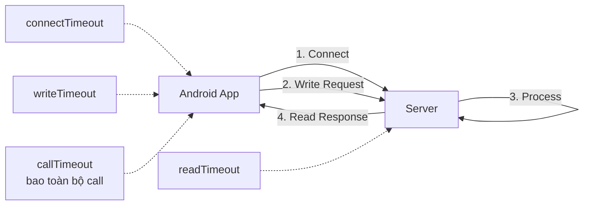
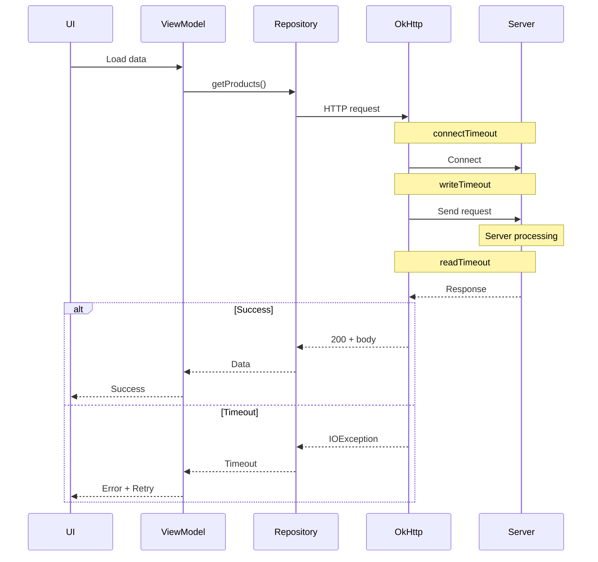
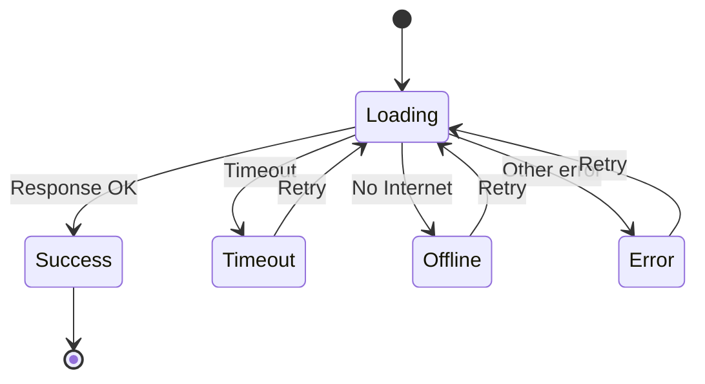
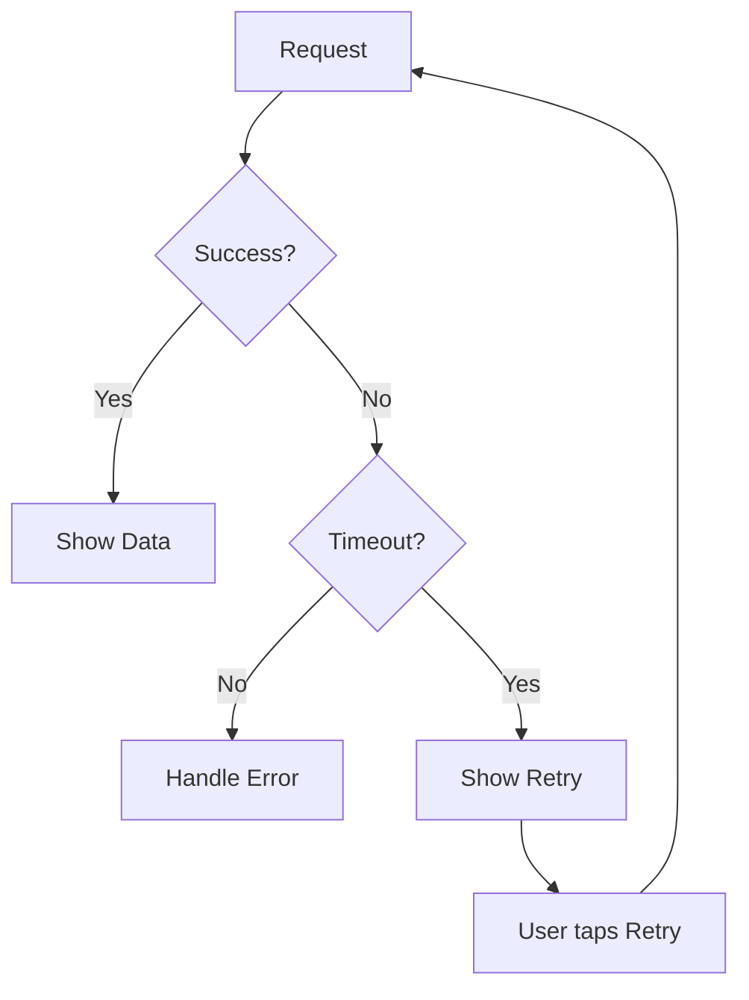
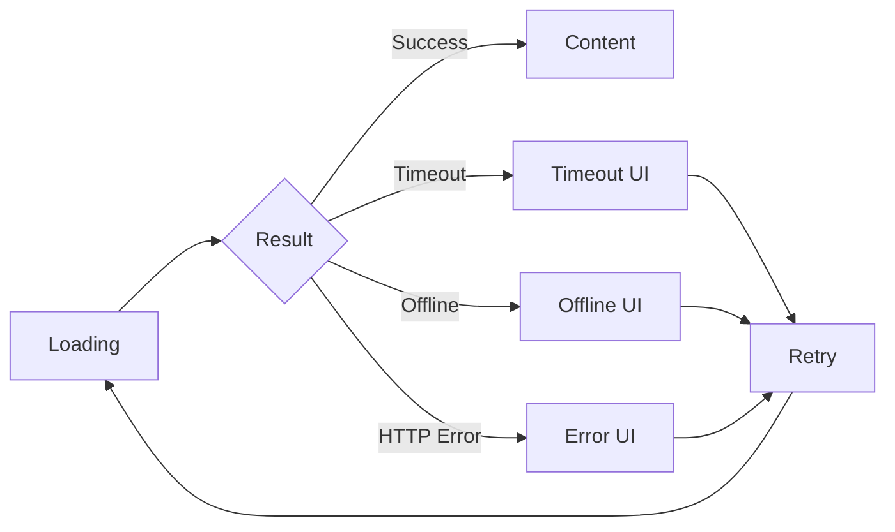
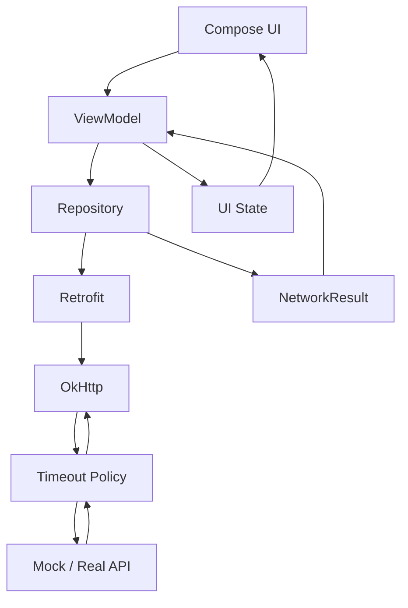

[](https://developer.android.com/studio/debug/network-profiler?utm_source=chatgpt.com)

# 019 - Timeouts

| Thuộc tính              | Nội dung                          |
| ----------------------- | --------------------------------- |
| **Học phần**            | 04 - Network, Async and Services  |
| **Module**              | Module 07 - Network               |
| **Nhóm nội dung**       | HTTP Client and GraphQL           |
| **Nguồn roadmap**       | Network / HTTP Client and GraphQL |
| **Loại bài**            | Network                           |
| **Thứ tự trong module** | 019                               |
| **Thời lượng gợi ý**    | 32 phút                           |

---

## 1. Tóm tắt

**Timeout** là giới hạn thời gian mà HTTP client cho phép một giai đoạn của network request tiếp tục trước khi coi nó là thất bại.

Ví dụ, app gọi:

```text
GET /products
```

nhưng server hoặc mạng không phản hồi. Nếu không có timeout hợp lý, người dùng có thể nhìn thấy loading quá lâu và app giữ tài nguyên cho một request gần như không còn giá trị.

Trong Android sử dụng **OkHttp/Retrofit**, cần đặc biệt phân biệt:

* `connectTimeout`
* `readTimeout`
* `writeTimeout`
* `callTimeout`

OkHttp hỗ trợ timeout cho connect, write, read và toàn bộ HTTP call. ([Square Open Source][1])

> **Ý tưởng quan trọng:** Timeout không làm mạng nhanh hơn. Nó quyết định **app sẵn sàng chờ mạng chậm bao lâu trước khi chuyển sang trạng thái lỗi**.

---

## 2. Mục tiêu học tập

Sau bài này, anh nên có thể:

* [ ] Giải thích timeout là gì và tại sao network request cần timeout.
* [ ] Phân biệt `connectTimeout`, `readTimeout`, `writeTimeout`, `callTimeout`.
* [ ] Cấu hình timeout trong OkHttp.
* [ ] Sử dụng timeout cùng Retrofit.
* [ ] Chuyển timeout thành trạng thái UI rõ ràng thay vì để exception thoát lên UI.
* [ ] Phân biệt client timeout với HTTP `408` và `504`.
* [ ] Thiết kế retry hợp lý.
* [ ] Test được trường hợp mạng/server phản hồi chậm.
* [ ] Debug timeout bằng Logging Interceptor và Network Inspector.
* [ ] Biết timeout ảnh hưởng thế nào tới UX, lifecycle và production.

---

# 3. Timeout là gì?

Giả sử app gửi request:

```text
Android App
    │
    │ GET /profile
    ▼
Internet
    │
    ▼
Server
```

Server bình thường trả response trong khoảng:

```text
200 ms
500 ms
1 s
```

Nhưng có thể xảy ra:

```text
Android App
    │
    │ Request
    ▼
   ???
    │
    │
    │ 10 giây...
    │ 20 giây...
    │ 30 giây...
    │
```

App cần một điểm mà nó quyết định:

```text
Đã chờ quá lâu
      ↓
Dừng request
      ↓
Trả lỗi timeout
      ↓
Cập nhật UI
```

Ví dụ:

```text
Loading...
   ↓
Timeout
   ↓
Không thể kết nối tới máy chủ
   ↓
[ Thử lại ]
```

Trên Android, `SocketTimeoutException` biểu diễn trường hợp timeout xảy ra ở thao tác socket như đọc dữ liệu. ([Android Developers][2])

---

# 4. Bốn loại timeout quan trọng trong OkHttp

Đây là phần quan trọng nhất của bài.



Có thể hiểu nhanh:

| Timeout          | Bảo vệ giai đoạn         | Ví dụ                        |
| ---------------- | ------------------------ | ---------------------------- |
| `connectTimeout` | Kết nối đến server       | Server/IP không thể kết nối  |
| `writeTimeout`   | Gửi request              | Upload request body quá chậm |
| `readTimeout`    | Chờ/đọc dữ liệu response | Server không gửi dữ liệu     |
| `callTimeout`    | Toàn bộ HTTP call        | Tổng request vượt deadline   |

OkHttp hiện đặt mặc định **10 giây** cho connect, read và write timeout. ([Square Open Source][3])

---

# 5. `connectTimeout`

## 5.1 Nó bảo vệ cái gì?

`connectTimeout` giới hạn thời gian client dành cho việc thiết lập kết nối tới server.

Ví dụ:

```text
Phone
  │
  │ connect api.example.com
  │
  │ ...
  │ ...
  │
  X  connectTimeout
```

Nếu app không thể thiết lập connection trong giới hạn cho phép thì request thất bại.

OkHttp hiện có `connectTimeout` mặc định là 10 giây. ([Square Open Source][3])

---

## 5.2 Cấu hình

```kotlin
val client = OkHttpClient.Builder()
    .connectTimeout(10, TimeUnit.SECONDS)
    .build()
```

Import:

```kotlin
import okhttp3.OkHttpClient
import java.util.concurrent.TimeUnit
```

---

## 5.3 Khi nào thường gặp?

Ví dụ:

```text
Không có route tới server
        ↓
Connection không thiết lập được
        ↓
connectTimeout
        ↓
IOException / timeout
```

Một số nguyên nhân thực tế:

* mạng quá yếu;
* server không reachable;
* proxy/VPN có vấn đề;
* route mạng bị lỗi;
* firewall;
* endpoint không hoạt động.

Không nên kết luận đơn giản rằng:

```text
timeout == server chết
```

vì vấn đề có thể nằm ở nhiều lớp khác nhau.

---

# 6. `readTimeout`

`readTimeout` liên quan tới thời gian client chờ dữ liệu được đọc từ kết nối.

OkHttp hiện có read timeout mặc định là 10 giây. ([Square Open Source][4])

Ví dụ:

```text
Android               Server
   │                     │
   │ GET /products       │
   ├────────────────────>│
   │                     │
   │                     │ đang xử lý...
   │                     │
   │       chờ data      │
   │.....................│
   │                     │
   X read timeout        │
```

Cấu hình:

```kotlin
val client = OkHttpClient.Builder()
    .readTimeout(15, TimeUnit.SECONDS)
    .build()
```

---

## Ví dụ thực tế

API:

```text
GET /reports
```

Server cần truy vấn database rất lâu:

```text
Request
   ↓
Database query
   ↓
8 s
   ↓
12 s
   ↓
20 s
```

Nếu read timeout quá ngắn:

```text
readTimeout = 5s
```

thì app có thể thất bại trước khi server gửi dữ liệu.

Nhưng giải pháp cũng **không phải** cứ tăng thành:

```text
readTimeout = 5 phút
```

vì khi đó UX trở thành:

```text
Loading...
Loading...
Loading...
Loading...
```

Timeout phải phản ánh yêu cầu của từng user flow.

---

# 7. `writeTimeout`

`writeTimeout` bảo vệ giai đoạn app **ghi/gửi dữ liệu request** lên network.

OkHttp hiện đặt write timeout mặc định là 10 giây. ([Square Open Source][5])

Ví dụ phổ biến:

```text
POST /upload
```

với:

```text
20 MB image
```

Luồng:

```text
Android
   │
   │█████ 10%
   │██████████ 30%
   │██████████████ 50%
   │
   │ network gần như đứng
   │
   X write timeout
```

Cấu hình:

```kotlin
val client = OkHttpClient.Builder()
    .writeTimeout(30, TimeUnit.SECONDS)
    .build()
```

---

## Khi nào cần chú ý?

Các request body lớn như:

```text
Upload ảnh
Upload video
Upload file
Multipart form
Backup dữ liệu
```

có thể cần timeout khác API JSON nhỏ.

Ví dụ, cấu hình này:

```kotlin
.writeTimeout(5, TimeUnit.SECONDS)
```

có thể hợp lý với một request JSON nhỏ nhưng quá ngắn cho upload file trên mạng di động yếu.

---

# 8. `callTimeout` — timeout tổng thể

Đây là loại rất đáng chú ý.

Ba timeout trước chỉ kiểm soát **các giai đoạn I/O cụ thể**.

Trong khi đó:

```text
callTimeout
```

được dùng làm giới hạn cho **toàn bộ HTTP call**; tài liệu OkHttp mô tả hỗ trợ một "full call timeout" bên cạnh connect/write/read timeout. ([Square Open Source][1])

Có thể hình dung:

```text
              callTimeout
┌────────────────────────────────────────────┐
│                                            │
│ DNS → Connect → Write → Server → Read      │
│                                            │
└────────────────────────────────────────────┘
```

Ví dụ:

```kotlin
val client = OkHttpClient.Builder()
    .connectTimeout(10, TimeUnit.SECONDS)
    .writeTimeout(10, TimeUnit.SECONDS)
    .readTimeout(15, TimeUnit.SECONDS)
    .callTimeout(30, TimeUnit.SECONDS)
    .build()
```

Ở đây:

```text
Connect tối đa        10s
Write                  10s
Read                   15s

nhưng

TOTAL CALL             30s
```

`callTimeout` vì vậy có thể được xem như một **deadline cuối cùng** cho request.

---

# 9. Sơ đồ toàn bộ request



---

# 10. OkHttp + Retrofit

Retrofit thường sử dụng OkHttp làm HTTP client, nên timeout được cấu hình ở `OkHttpClient`. Android Studio Network Inspector cũng hỗ trợ traffic của OkHttp và vì Retrofit có thể sử dụng OkHttp bên dưới nên request Retrofit có thể được inspect tại đây. ([Android Developers][6])

Ví dụ:

```kotlin
val okHttpClient = OkHttpClient.Builder()
    .connectTimeout(10, TimeUnit.SECONDS)
    .readTimeout(15, TimeUnit.SECONDS)
    .writeTimeout(15, TimeUnit.SECONDS)
    .callTimeout(30, TimeUnit.SECONDS)
    .build()

val retrofit = Retrofit.Builder()
    .baseUrl("https://api.example.com/")
    .client(okHttpClient)
    .addConverterFactory(GsonConverterFactory.create())
    .build()
```

Kiến trúc:

```text
Retrofit Interface
       │
       ▼
    Retrofit
       │
       ▼
     OkHttp
       │
       ├── connectTimeout
       ├── writeTimeout
       ├── readTimeout
       └── callTimeout
       │
       ▼
    Internet
       │
       ▼
      API
```

---

# 11. Không bắt exception trong UI

Cách không tốt:

```kotlin
Button(
    onClick = {
        try {
            api.getProducts()
        } catch (e: SocketTimeoutException) {
            // UI xử lý network trực tiếp
        }
    }
)
```

UI đang biết quá nhiều về infrastructure.

Một hướng tốt hơn:

```text
UI
 ↓
ViewModel
 ↓
Repository
 ↓
Retrofit
 ↓
OkHttp
```

Repository chuyển exception thành lỗi thuộc domain/data layer:

```kotlin
sealed interface NetworkResult<out T> {

    data class Success<T>(
        val data: T
    ) : NetworkResult<T>

    data object Timeout : NetworkResult<Nothing>

    data object NoInternet : NetworkResult<Nothing>

    data class HttpError(
        val code: Int
    ) : NetworkResult<Nothing>

    data class UnknownError(
        val throwable: Throwable
    ) : NetworkResult<Nothing>
}
```

Android Architecture hiện vẫn khuyến nghị ViewModel nắm/expose UI state và làm việc với repository/use case để lấy dữ liệu thay vì để UI trực tiếp quản lý data logic. ([Android Developers][7])

---

# 12. Mapping timeout

Repository:

```kotlin
class ProductRepository(
    private val api: ProductApi
) {

    suspend fun getProducts(): NetworkResult<List<ProductDto>> {
        return try {

            val products = api.getProducts()

            NetworkResult.Success(products)

        } catch (e: SocketTimeoutException) {

            NetworkResult.Timeout

        } catch (e: UnknownHostException) {

            NetworkResult.NoInternet

        } catch (e: IOException) {

            NetworkResult.UnknownError(e)

        }
    }
}
```

Android định nghĩa `SocketTimeoutException` là exception biểu diễn socket read/accept bị timeout. ([Android Developers][2])

Import:

```kotlin
import java.net.SocketTimeoutException
import java.net.UnknownHostException
import java.io.IOException
```

---

# 13. Chuyển timeout thành UI state

Ví dụ:

```kotlin
sealed interface ProductUiState {

    data object Loading : ProductUiState

    data class Success(
        val products: List<Product>
    ) : ProductUiState

    data object Timeout : ProductUiState

    data object Offline : ProductUiState

    data class Error(
        val message: String
    ) : ProductUiState
}
```

Luồng:



---

# 14. ViewModel

```kotlin
class ProductViewModel(
    private val repository: ProductRepository
) : ViewModel() {

    private val _uiState =
        MutableStateFlow<ProductUiState>(
            ProductUiState.Loading
        )

    val uiState: StateFlow<ProductUiState> =
        _uiState.asStateFlow()

    fun loadProducts() {

        viewModelScope.launch {

            _uiState.value = ProductUiState.Loading

            _uiState.value =
                when (val result = repository.getProducts()) {

                    is NetworkResult.Success -> {
                        ProductUiState.Success(
                            products = result.data.map {
                                it.toDomain()
                            }
                        )
                    }

                    NetworkResult.Timeout -> {
                        ProductUiState.Timeout
                    }

                    NetworkResult.NoInternet -> {
                        ProductUiState.Offline
                    }

                    else -> {
                        ProductUiState.Error(
                            "Không thể tải dữ liệu"
                        )
                    }
                }
        }
    }
}
```

`viewModelScope` phù hợp cho công việc gắn với ViewModel; coroutine trong scope này tự động bị cancel khi ViewModel bị clear. ViewModel cũng giữ state qua configuration change như xoay màn hình, giúp tránh việc screen phải tải lại dữ liệu chỉ vì configuration change. ([Android Developers][8])

---

# 15. Compose UI

```kotlin
@Composable
fun ProductScreen(
    state: ProductUiState,
    onRetry: () -> Unit
) {

    when (state) {

        ProductUiState.Loading -> {
            CircularProgressIndicator()
        }

        is ProductUiState.Success -> {
            ProductList(state.products)
        }

        ProductUiState.Timeout -> {
            Column {
                Text(
                    "Máy chủ phản hồi quá lâu."
                )

                Button(
                    onClick = onRetry
                ) {
                    Text("Thử lại")
                }
            }
        }

        ProductUiState.Offline -> {
            Text(
                "Không có kết nối mạng."
            )
        }

        is ProductUiState.Error -> {
            Text(state.message)
        }
    }
}
```

Kết quả UX:

```text
        Máy chủ phản hồi quá lâu.

              [ Thử lại ]
```

thay vì:

```text
        Loading...

        Loading...

        Loading...
```

không có điểm kết thúc.

---

# 16. Timeout khác HTTP 408 và 504

Đây là câu hỏi phỏng vấn khá dễ nhầm.

## Client timeout

Ví dụ:

```text
Android
  │
  │ chờ 15 giây
  │
  X timeout
```

Client tự quyết định rằng nó đã chờ quá lâu.

Có thể không nhận được HTTP response nào.

Ví dụ phía app:

```kotlin
SocketTimeoutException
```

---

## HTTP 408 Request Timeout

Đây là **HTTP response status**.

Server gửi:

```http
HTTP/1.1 408 Request Timeout
```

Theo HTTP specification, `408` nghĩa là server không nhận được request hoàn chỉnh trong khoảng thời gian server sẵn sàng chờ. ([RFC Editor][9])

---

## HTTP 504 Gateway Timeout

Ví dụ kiến trúc:

```text
Android
   ↓
API Gateway
   ↓
Backend Service
```

Gateway chờ backend:

```text
Gateway
   │
   │ request
   ▼
Backend

... quá lâu ...
```

Gateway có thể trả:

```http
HTTP/1.1 504 Gateway Timeout
```

`504` biểu diễn gateway/proxy không nhận được phản hồi kịp thời từ upstream server. ([RFC Editor][9])

Vì vậy:

```text
SocketTimeoutException
        ≠
HTTP 408
        ≠
HTTP 504
```

---

# 17. Retry khi timeout

Một thiết kế phổ biến:



Không nên nghĩ:

```text
Timeout
  ↓
Retry vô hạn
```

vì một server đang quá tải có thể nhận:

```text
1000 requests
    ↓
timeout
    ↓
1000 retry
    ↓
timeout
    ↓
1000 retry
```

và tình hình càng xấu hơn.

OkHttp cũng có cơ chế phục hồi/retry một số failure ở tầng connection; mã nguồn hiện tại kiểm tra failure có recoverable hay không, request body có gửi lại được không và còn route khác để thử hay không. ([GitHub][10])

Ở application layer, nên đặc biệt cẩn thận với request có side effect như:

```text
POST /payment
POST /orders
POST /transfer-money
```

vì:

```text
Client timeout
```

**không chứng minh server chưa thực hiện request**.

Ví dụ nguy hiểm:

```text
Client ---- POST payment ----> Server
                              │
                              ├── Payment SUCCESS
                              │
Client <---- response --------┘
       X network timeout

Client nghĩ:
"Thanh toán thất bại"

Retry POST
       ↓
Có nguy cơ xử lý lần 2
```

Với nghiệp vụ như thanh toán hoặc tạo đơn, cần thiết kế idempotency/deduplication từ API chứ không chỉ thêm retry phía Android.

---

# 18. Timeout theo từng loại API

Không nhất thiết toàn bộ API phải dùng cùng một timeout.

Ví dụ:

| API             | Đặc điểm                 | Hướng cấu hình     |
| --------------- | ------------------------ | ------------------ |
| Search          | User đang chờ trực tiếp  | Ngắn               |
| Product list    | Request JSON bình thường | Trung bình         |
| Login           | User đang chờ trực tiếp  | Tương đối ngắn     |
| Upload ảnh      | Request body lớn         | Write dài hơn      |
| Generate report | Backend xử lý lâu        | Call/read dài hơn  |
| Payment         | Nhạy cảm side effect     | Retry rất cẩn thận |

Ví dụ một client riêng cho upload:

```kotlin
val uploadClient =
    baseClient.newBuilder()
        .writeTimeout(
            60,
            TimeUnit.SECONDS
        )
        .callTimeout(
            90,
            TimeUnit.SECONDS
        )
        .build()
```

OkHttp hỗ trợ tạo cấu hình client dựa trên client hiện tại bằng `newBuilder()`, đồng thời giữ cấu hình gốc và cho phép override timeout. ([Square Open Source][11])

---

# 19. Interceptor có thể thay timeout

Điểm này liên kết trực tiếp với bài trước về **Interceptor**.

Một application interceptor có thể thay timeout cho chain:

```kotlin
class LongRequestInterceptor : Interceptor {

    override fun intercept(
        chain: Interceptor.Chain
    ): Response {

        return chain
            .withReadTimeout(
                30,
                TimeUnit.SECONDS
            )
            .proceed(
                chain.request()
            )
    }
}
```

Trong mã nguồn OkHttp hiện tại, `Interceptor.Chain` hỗ trợ các API như:

```text
withConnectTimeout(...)
withReadTimeout(...)
withWriteTimeout(...)
```

để override timeout trong application interceptor chain. ([GitHub][12])

Điều này hữu ích nếu:

```text
API bình thường
readTimeout = 10s

nhưng

/report
readTimeout = 30s
```

Tuy nhiên nếu mỗi interceptor tự thay timeout tùy ý thì network configuration sẽ rất khó debug. Nên có policy rõ ràng.

---

# 20. Timeout và Lifecycle

Timeout và lifecycle giải quyết hai vấn đề khác nhau.

```text
Timeout
    ↓
Request được phép chạy bao lâu?

Lifecycle
    ↓
Request còn cần thiết nữa không?
```

Ví dụ:

```text
Screen A
   ↓
Request API
   ↓
User rời Screen A
```

Nếu operation chỉ còn ý nghĩa khi ViewModel tồn tại, `viewModelScope` giúp hủy coroutine khi ViewModel bị clear. ([Android Developers][8])

Một kiến trúc hợp lý:

```text
Compose
   │
   ▼
ViewModel
   │
   │ viewModelScope
   ▼
Repository
   │
   ▼
Retrofit
   │
   ▼
OkHttp
   │
   ├─ connectTimeout
   ├─ readTimeout
   ├─ writeTimeout
   └─ callTimeout
```

Timeout vì vậy **không thay thế coroutine cancellation**, và cancellation cũng **không thay thế timeout**.

---

# 21. Debug timeout bằng Network Inspector

Android Studio có **Network Inspector**, cho phép xem network activity theo timeline, dữ liệu request/response và thời gian truyền. Timing graph của công cụ có thể giúp xác định nơi request dành nhiều thời gian; công cụ hiện hỗ trợ `HttpsURLConnection` và OkHttp, bao gồm traffic từ những thư viện sử dụng OkHttp như Retrofit. ([Android Developers][6])

Mở:

```text
Android Studio
    ↓
View
    ↓
Tool Windows
    ↓
App Inspection
    ↓
Network Inspector
```

Khi debug, anh nên xem:

```text
Request bắt đầu khi nào?
        ↓
Bao lâu mới gửi xong?
        ↓
Bao lâu mới có response?
        ↓
Response body mất bao lâu?
```

Kết hợp với bài trước:

```text
Logging Interceptor
       +
Network Inspector
       +
Server logs
       ↓
Debug network
```

---

# 22. Testing Timeout

Không nên đợi mạng thật chậm để test.

Một test cần tạo được tình huống:

```text
Client request
      ↓
Mock server
      ↓
Delay response
      ↓
Timeout
```

Pseudo test:

```kotlin
@Test
fun timeout_returns_timeout_result() = runTest {

    // Server cố tình phản hồi chậm.

    val result =
        repository.getProducts()

    assertTrue(
        result is NetworkResult.Timeout
    )
}
```

Test quan trọng hơn là kiểm tra **behavior của app**:

```text
Timeout
   ↓
Repository
   ↓
NetworkResult.Timeout
   ↓
ViewModel
   ↓
ProductUiState.Timeout
   ↓
UI hiện "Thử lại"
```

Thay vì chỉ test:

```text
SocketTimeoutException được throw
```

---

# 23. Những lỗi thường gặp

### ❌ Timeout quá dài

```kotlin
.readTimeout(
    5,
    TimeUnit.MINUTES
)
```

UX:

```text
Loading...
Loading...
Loading...
Loading...
```

User có thể đã thoát app từ lâu.

---

### ❌ Timeout quá ngắn

```kotlin
.readTimeout(
    500,
    TimeUnit.MILLISECONDS
)
```

Mạng di động bình thường cũng có thể fail.

---

### ❌ Một timeout cho mọi endpoint

```text
Search         30s
Upload         30s
Payment        30s
Report         30s
GraphQL Query  30s
```

Không phải flow nào cũng có đặc điểm giống nhau.

---

### ❌ Retry vô hạn

```kotlin
while (true) {
    api.getProducts()
}
```

Đây gần như luôn là design xấu.

---

### ❌ UI biết `SocketTimeoutException`

```text
Composable
   ↓
catch SocketTimeoutException
```

Nên chuyển thành:

```text
Infrastructure exception
        ↓
Domain/Data error
        ↓
UI state
```

---

### ❌ Hiển thị lỗi kỹ thuật cho user

Không nên:

```text
java.net.SocketTimeoutException:
timeout
```

Nên:

```text
Máy chủ phản hồi quá lâu.

[ Thử lại ]
```

---

# 24. Timeout và UX

Timeout cuối cùng vẫn là một quyết định UX.

Một flow tốt:



Người dùng không cần biết:

```text
connectTimeout
readTimeout
SocketTimeoutException
IOException
```

Họ cần biết:

```text
Điều gì xảy ra?
        +
Tôi có thể làm gì tiếp?
```

---

# 25. Mental model cần nhớ

Có thể nhớ Timeouts bằng sơ đồ sau:

```text
                 HTTP CALL
                     │
       ┌─────────────┼─────────────┐
       │             │             │
       ▼             ▼             ▼
    CONNECT         WRITE         READ
       │             │             │
       ▼             ▼             ▼
 connectTimeout  writeTimeout  readTimeout

       └─────────────┬─────────────┘
                     │
                     ▼
                callTimeout
                     │
             giới hạn toàn call
```

Hoặc cực ngắn:

```text
connectTimeout
= kết nối bao lâu?

writeTimeout
= gửi dữ liệu bao lâu?

readTimeout
= chờ/đọc dữ liệu bao lâu?

callTimeout
= toàn request được phép tồn tại bao lâu?
```

---

# 26. Thực hành

## Bài thực hành: Product API

Endpoint:

```text
GET /products
```

Cấu hình:

```kotlin
val client =
    OkHttpClient.Builder()
        .connectTimeout(
            5,
            TimeUnit.SECONDS
        )
        .readTimeout(
            10,
            TimeUnit.SECONDS
        )
        .writeTimeout(
            10,
            TimeUnit.SECONDS
        )
        .callTimeout(
            15,
            TimeUnit.SECONDS
        )
        .build()
```

Tạo các UI state:

```text
Loading
Success
Empty
Timeout
Offline
Error
```

Sau đó mock server chậm hơn `callTimeout`.

Kỳ vọng:

```text
Request
   ↓
Loading
   ↓
Timeout
   ↓
Timeout UI
   ↓
[ Retry ]
```

---

# 27. Bài tập

Xây một màn hình:

```text
Product List
```

có các trạng thái:

```text
Loading
   ↓
Success ───────────────┐
                       │
Timeout → Retry ───────┤
                       ├→ Loading
Offline → Retry ───────┤
                       │
Error → Retry ─────────┘
```

Yêu cầu:

1. Sử dụng Retrofit + OkHttp.
2. Cấu hình đủ 4 loại timeout.
3. Mock API phản hồi chậm.
4. Map timeout thành `NetworkResult.Timeout`.
5. Map tiếp thành `UiState.Timeout`.
6. Hiển thị nút **Thử lại**.
7. Ghi log request trong debug build.
8. Kiểm tra request bằng Network Inspector.
9. Viết ít nhất một test cho timeout.

---

# 28. Artifact cho portfolio

Một project nhỏ rất phù hợp là:

```text
Network Resilience Demo
```

Kiến trúc:



README có thể trình bày:

```text
Features

✓ Retrofit API
✓ OkHttp
✓ Connect Timeout
✓ Read Timeout
✓ Write Timeout
✓ Call Timeout
✓ Explicit NetworkResult
✓ Loading State
✓ Timeout State
✓ Offline State
✓ Retry
✓ Logging
✓ Mock timeout test
✓ Network Inspector debugging
```

Đây tốt hơn nhiều so với một project chỉ chứng minh rằng:

```kotlin
.connectTimeout(10, TimeUnit.SECONDS)
```

vì artifact cho thấy anh hiểu toàn bộ chuỗi:

```text
Network configuration
        ↓
Failure
        ↓
Data layer
        ↓
State
        ↓
Lifecycle
        ↓
UX
        ↓
Testing
```

---

# 29. Checklist hoàn thành

* [ ] Tôi giải thích được timeout bằng ngôn ngữ của mình.
* [ ] Tôi phân biệt được `connectTimeout`.
* [ ] Tôi phân biệt được `readTimeout`.
* [ ] Tôi phân biệt được `writeTimeout`.
* [ ] Tôi hiểu vai trò của `callTimeout`.
* [ ] Tôi biết cấu hình timeout trong `OkHttpClient`.
* [ ] Tôi hiểu Retrofit có thể sử dụng OkHttp phía dưới.
* [ ] Tôi không để network exception đi thẳng tới UI.
* [ ] Tôi có `Timeout` trong network/data result.
* [ ] Tôi có timeout state trong UI.
* [ ] Tôi có retry UI.
* [ ] Tôi không retry vô hạn.
* [ ] Tôi cẩn thận khi retry POST/payment/order.
* [ ] Tôi phân biệt client timeout với HTTP `408`.
* [ ] Tôi phân biệt client timeout với HTTP `504`.
* [ ] Tôi hiểu timeout không thay thế lifecycle cancellation.
* [ ] Tôi biết dùng Network Inspector để debug request.
* [ ] Tôi có test cho server phản hồi chậm.
* [ ] Tôi biết timeout nên phụ thuộc vào đặc điểm endpoint.

---

# 30. Ghi chú sản xuất

Khi đưa timeout vào production, đừng bắt đầu bằng câu hỏi:

```text
Timeout nên là 10 hay 30 giây?
```

Hãy bắt đầu từ:

```text
User đang làm gì?
        ↓
Họ có thể chờ hợp lý bao lâu?
        ↓
Request này có side effect không?
        ↓
Nếu timeout thì server có thể đã xử lý chưa?
        ↓
Có nên retry không?
        ↓
Retry tự động hay để user quyết định?
        ↓
UI state nào xuất hiện?
        ↓
Có log/metric để phát hiện timeout tăng bất thường không?
```

Timeout hợp lý tạo ra một hệ thống:

```text
Network chậm
    ↓
Request không treo vô hạn
    ↓
Failure được phân loại
    ↓
State vẫn rõ ràng
    ↓
UI phản hồi
    ↓
User có hành động tiếp theo
```

Trong Android production, đây mới là mục tiêu thực sự của **Timeouts**: không chỉ cấu hình vài con số trong `OkHttpClient`, mà là biến network failure thành một **luồng có giới hạn, có thể quan sát, có thể test và có UX phục hồi rõ ràng**. ([Square Open Source][1])

[1]: https://square.github.io/okhttp/recipes/?utm_source=chatgpt.com "Recipes - OkHttp"
[2]: https://developer.android.com/reference/java/net/SocketTimeoutException "SocketTimeoutException  |  API reference  |  Android Developers"
[3]: https://square.github.io/okhttp/5.x/okhttp/okhttp3/-ok-http-client/connect-timeout-millis.html?utm_source=chatgpt.com "connectTimeoutMillis"
[4]: https://square.github.io/okhttp/5.x/okhttp/okhttp3/-ok-http-client/read-timeout-millis.html?utm_source=chatgpt.com "readTimeoutMillis"
[5]: https://square.github.io/okhttp/5.x/okhttp/okhttp3/-ok-http-client/write-timeout-millis.html?utm_source=chatgpt.com "writeTimeoutMillis"
[6]: https://developer.android.com/studio/debug/network-profiler "Inspect network traffic with the Network Inspector  |  Android Studio  |  Android Developers"
[7]: https://developer.android.com/topic/architecture/ui-layer?utm_source=chatgpt.com "UI layer | App architecture"
[8]: https://developer.android.com/topic/libraries/architecture/views/coroutines-views?utm_source=chatgpt.com "Use Kotlin coroutines with lifecycle-aware components ..."
[9]: https://www.rfc-editor.org/info/rfc7231/?utm_source=chatgpt.com "RFC 7231: Hypertext Transfer Protocol (HTTP/1.1)"
[10]: https://github.com/square/okhttp/blob/master/okhttp/src/commonJvmAndroid/kotlin/okhttp3/internal/http/RetryAndFollowUpInterceptor.kt?utm_source=chatgpt.com "RetryAndFollowUpInterceptor.kt"
[11]: https://square.github.io/okhttp/5.x/okhttp/okhttp3/-ok-http-client/?utm_source=chatgpt.com "OkHttpClient"
[12]: https://github.com/square/okhttp/blob/master/okhttp/src/commonJvmAndroid/kotlin/okhttp3/internal/http/RealInterceptorChain.kt?utm_source=chatgpt.com "RealInterceptorChain.kt"

---

# Bài luyện tập

## Mục tiêu


## Đề bài


## Yêu cầu hoàn thành

- [ ] 
- [ ] 
- [ ] 

## Kết quả / lời giải


## Ghi chú
