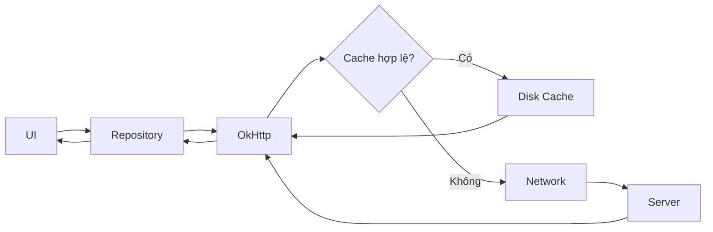
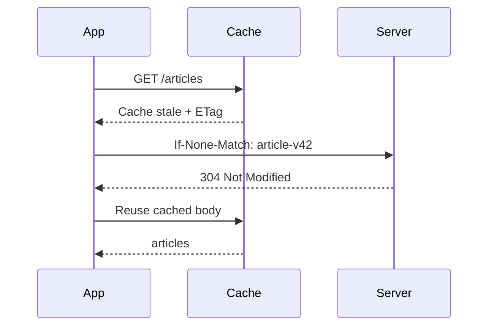
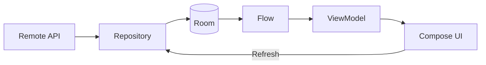
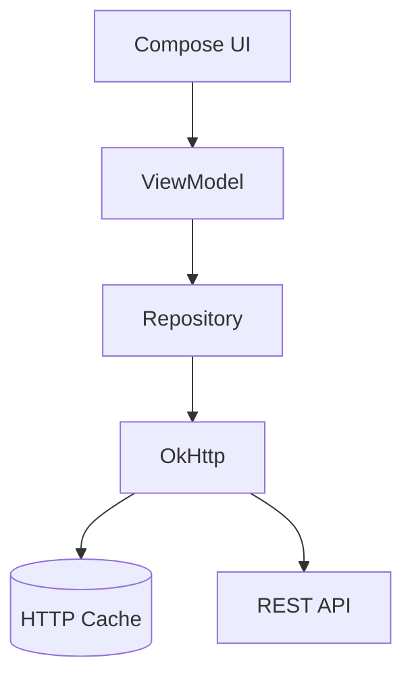
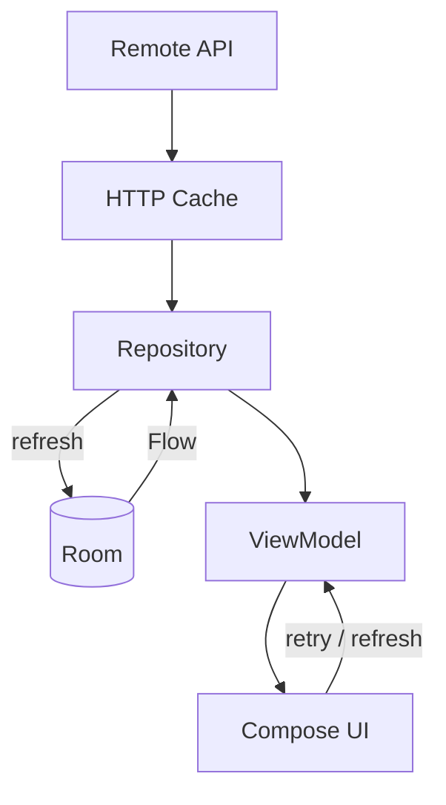

[](https://developer.android.com/topic/architecture/data-layer/offline-first?hl=pt-br&utm_source=chatgpt.com)

# 020 - Caching

**Học phần:** 04 - Network, Async and Services
**Module:** Module 07 - Network
**Nhóm nội dung:** HTTP Client and GraphQL
**Nguồn roadmap:** Network / HTTP Client and GraphQL
**Loại bài:** Network
**Thứ tự trong module:** 020
**Thời lượng gợi ý:** 32 phút

---

## 1. Tóm tắt

**Caching** là kỹ thuật lưu lại dữ liệu đã tải trước đó để lần truy cập tiếp theo không nhất thiết phải gọi lại server.

Trong Android, caching không chỉ đơn giản là:

> "Lưu JSON xuống máy."

Một ứng dụng thực tế có thể đồng thời có nhiều lớp cache:

```text
UI / ViewModel
      │
      ▼
In-memory cache
      │
      ▼
Repository
   ┌──┴───────────┐
   │              │
   ▼              ▼
Room DB       HTTP Client
Local cache      │
                 ▼
             OkHttp Cache
                 │
                 ▼
               API
```

Android khuyến nghị trong các ứng dụng **offline-first** rằng dữ liệu UI nên được đọc từ local data source, trong khi network chủ yếu đồng bộ dữ liệu về local storage. Android cũng lưu ý HTTP cache là một cách giảm những lần tải lại không cần thiết. ([Android Developers][1])

Caching tốt giúp:

* giảm thời gian chờ;
* giảm lượng dữ liệu mạng;
* giảm số request tới backend;
* cải thiện trải nghiệm khi mạng yếu;
* hỗ trợ một phần hoặc toàn bộ chế độ offline;
* giảm việc reload dữ liệu không cần thiết khi Activity/Composable được tạo lại.

Caching sai có thể gây hậu quả ngược lại:

```text
cache quá ngắn
    ↓
request liên tục
    ↓
tốn mạng + chậm

cache quá lâu
    ↓
dữ liệu stale
    ↓
UI hiển thị thông tin cũ
```

---

# 2. Mục tiêu học tập

Sau bài này, bạn nên:

* giải thích được cache là gì và tại sao Android app cần cache;
* phân biệt **memory cache, HTTP cache và database cache**;
* hiểu `Cache-Control`, `max-age`, `no-cache`, `no-store`;
* cấu hình disk cache cho OkHttp;
* hiểu cache hit, cache miss và stale cache;
* biết khi nào nên dùng Room thay cho HTTP cache;
* hiểu chiến lược offline-first;
* xử lý loading, cached content, refresh và error;
* biết cách test caching;
* hiểu caching trong GraphQL khác REST như thế nào;
* xây dựng được một demo caching nhỏ cho portfolio.

---

# 3. Caching là gì?

Giả sử app gọi:

```http
GET /api/articles
```

Server trả:

```json
[
  {
    "id": 1,
    "title": "Android Caching"
  }
]
```

Nếu không cache:

```text
Mở màn hình
    │
    ▼
GET /articles
    │
    ▼
Server
    │
    ▼
Response

Đóng màn hình

Mở lại màn hình
    │
    ▼
GET /articles
    │
    ▼
Server
```

Cùng một dữ liệu có thể được tải lại nhiều lần.

Với cache:

```text
Request
   │
   ▼
Có cache hợp lệ?
   │
 ┌─┴───────┐
 │         │
Có        Không
 │         │
 ▼         ▼
Cache     Network
 │         │
 └────┬────┘
      ▼
     UI
```

Nếu bản cache còn **fresh**, client có thể sử dụng nó mà không phải tải lại response đầy đủ từ server. HTTP caching được chuẩn hóa bởi RFC 9111. ([RFC Editor][2])

---

# 4. Ba lớp cache thường gặp trong Android

Đây là phần rất quan trọng: **không phải cache nào cũng giống nhau**.

| Loại                     | Ví dụ                                 | Tồn tại sau kill app? | Mục đích                      |
| ------------------------ | ------------------------------------- | --------------------: | ----------------------------- |
| Memory cache             | `Map`, ViewModel, Paging `cachedIn()` |                     ❌ | Tăng tốc trong phiên          |
| HTTP cache               | OkHttp `Cache`                        |                     ✅ | Cache HTTP response           |
| Local database           | Room                                  |                     ✅ | Cache/domain data có cấu trúc |
| GraphQL normalized cache | Apollo Kotlin                         |              tùy loại | Cache object GraphQL          |

---

## 4.1. Memory Cache

Ví dụ:

```kotlin
private val userCache = mutableMapOf<Long, User>()
```

Luồng:

```text
API
 │
 ▼
Memory
 │
 ▼
UI
```

Ưu điểm:

* cực nhanh;
* không cần đọc disk;
* đơn giản.

Nhược điểm:

* mất khi process bị kill;
* tiêu tốn RAM;
* không thích hợp để lưu quá nhiều dữ liệu.

Ví dụ phù hợp:

```text
Danh sách vừa tải
        ↓
User mở Detail
        ↓
Quay lại List
        ↓
Không cần tải lại List
```

---

# 5. HTTP Cache

Đây là loại cache liên quan trực tiếp nhất đến **OkHttp**.

OkHttp hỗ trợ gắn một response cache vào `OkHttpClient`; `Cache-Control` quyết định response nào có thể được lưu và khi nào có thể tái sử dụng. ([Square Open Source][3])

Luồng:



---

# 6. Cache Hit và Cache Miss

## Cache Hit

Cache đã có response phù hợp.

```text
Request
   │
   ▼
OkHttp Cache
   │
   ├── HIT
   │
   ▼
Response
```

Không cần tải response mới từ server.

---

## Cache Miss

Không tìm được dữ liệu phù hợp.

```text
Request
   │
   ▼
Cache
   │
   └── MISS
         │
         ▼
      Network
         │
         ▼
       Server
```

Sau khi server trả dữ liệu, response có thể được lưu vào cache nếu policy cho phép.

---

# 7. Fresh và Stale Cache

Cache không thể được tin tưởng mãi mãi.

Giả sử server gửi:

```http
Cache-Control: max-age=300
```

`300` giây = 5 phút.

Theo HTTP caching specification, `max-age` xác định khoảng thời gian response được xem là fresh trước khi trở thành stale. ([RFC Editor][2])

```text
0 phút               5 phút
│────────────────────│
       FRESH

                     │─────────────>
                          STALE
```

### Trong 5 phút

Có thể:

```text
Request
   ↓
Cache
   ↓
Response
```

### Sau 5 phút

Client có thể cần:

```text
Cache
  │
  ▼
Revalidate
  │
  ▼
Server
```

---

# 8. Các `Cache-Control` quan trọng

## `max-age`

Ví dụ:

```http
Cache-Control: max-age=300
```

Có nghĩa là response trở thành stale sau 300 giây. ([RFC Editor][2])

---

## `no-cache`

Tên của directive này khá dễ gây hiểu nhầm.

```http
Cache-Control: no-cache
```

**Không có nghĩa là "không được lưu cache".**

Nó có nghĩa là response không được tái sử dụng cho request khác nếu chưa được xác nhận lại với origin server. ([RFC Editor][2])

```text
Cache có dữ liệu
       │
       ▼
Không dùng ngay
       │
       ▼
Validate với Server
```

---

## `no-store`

```http
Cache-Control: no-store
```

Mới thực sự có nghĩa là:

> Không lưu response vào cache.

RFC 9111 quy định cache không được lưu response có `no-store`. ([RFC Editor][2])

### Ghi nhớ

```text
no-cache
   =
có thể lưu
nhưng phải validate

no-store
   =
không lưu
```

---

## `must-revalidate`

```http
Cache-Control: max-age=300, must-revalidate
```

Sau khi response hết fresh:

```text
STALE
  │
  ▼
phải xác nhận server
```

Cache không được tự ý sử dụng stale response nếu chưa revalidate thành công. ([RFC Editor][2])

---

## `only-if-cached`

Đây là request directive:

```http
Cache-Control: only-if-cached
```

Ý nghĩa:

> Chỉ lấy từ cache, không gọi origin server.

Nếu không có response phù hợp trong cache, HTTP specification cho phép trả `504`. ([RFC Editor][2])

OkHttp cung cấp `CacheControl.FORCE_CACHE` cho trường hợp muốn yêu cầu sử dụng cache. ([Square Open Source][4])

---

# 9. Revalidation với ETag

Cache không phải lúc nào cũng cần tải lại toàn bộ response.

Server có thể trả:

```http
ETag: "article-v42"
```

Client giữ:

```text
JSON
+
ETag
```

Lần sau client gửi conditional request:

```http
If-None-Match: "article-v42"
```

Nếu dữ liệu chưa đổi:

```http
304 Not Modified
```

Luồng:



HTTP caching specification định nghĩa việc revalidate response bằng conditional requests và `304 Not Modified`, nhờ đó client có thể tái sử dụng body đã cache thay vì tải toàn bộ representation mới. ([RFC Editor][2])

---

# 10. Cấu hình Cache trong OkHttp

Ví dụ cơ bản:

```kotlin
import okhttp3.Cache
import okhttp3.OkHttpClient
import java.io.File

fun createOkHttpClient(
    cacheDir: File
): OkHttpClient {

    val cacheSize = 10L * 1024L * 1024L // 10 MB

    val cache = Cache(
        File(cacheDir, "http_cache"),
        cacheSize
    )

    return OkHttpClient.Builder()
        .cache(cache)
        .build()
}
```

OkHttp hiện cung cấp `OkHttpClient.Builder.cache(...)` để gắn response cache được dùng cho cả việc đọc và ghi cached responses. ([Square Open Source][5])

Trong Android:

```kotlin
val client = createOkHttpClient(
    context.cacheDir
)
```

---

# 11. Kết hợp Retrofit + OkHttp Cache

```kotlin
val cache = Cache(
    File(context.cacheDir, "http_cache"),
    10L * 1024L * 1024L
)

val okHttpClient = OkHttpClient.Builder()
    .cache(cache)
    .build()

val retrofit = Retrofit.Builder()
    .baseUrl(BASE_URL)
    .client(okHttpClient)
    .addConverterFactory(
        GsonConverterFactory.create()
    )
    .build()
```

Kiến trúc:

```text
Retrofit
   │
   ▼
OkHttp
   │
   ▼
HTTP Cache
   │
   ├──────── HIT ──────► Response
   │
   └──────── MISS
              │
              ▼
             API
```

Điểm quan trọng là **chỉ thêm `Cache(...)` không đảm bảo mọi response sẽ được cache**. Cache vẫn phải tuân theo HTTP caching policy và các header mà request/response cung cấp. ([Square Open Source][3])

---

# 12. Server nên kiểm soát cache

Ví dụ server trả:

```http
HTTP/1.1 200 OK

Cache-Control: public, max-age=300
Content-Type: application/json
ETag: "articles-123"
```

Đây thường là thiết kế tốt hơn việc Android client tùy tiện biến mọi response thành cacheable.

Client và server cùng thống nhất:

```text
Backend
   │
   │ Cache-Control
   │ ETag
   ▼
OkHttp
   │
   ▼
Cache policy
```

---

# 13. Không nên cache mọi thứ

Ví dụ endpoint:

```http
GET /products
```

Cache 5 phút có thể hợp lý.

Nhưng:

```http
GET /bank-account/balance
```

cache quá lâu có thể khiến user nhìn thấy số dư lỗi thời.

Hoặc:

```http
GET /payment/status
```

dữ liệu stale có thể ảnh hưởng trực tiếp đến luồng nghiệp vụ.

### Quy tắc tư duy

```text
Dữ liệu thay đổi chậm
       ↓
Cache lâu hơn

Dữ liệu thay đổi nhanh
       ↓
Cache ngắn / revalidate

Dữ liệu critical
       ↓
Ưu tiên freshness
```

HTTP cung cấp `must-revalidate` chính xác cho những trường hợp stale response có thể làm ứng dụng hoạt động sai; RFC còn lấy giao dịch tài chính làm ví dụ của loại dữ liệu cần validation đáng tin cậy. ([RFC Editor][2])

---

# 14. HTTP Cache không giống Room Cache

Đây là câu hỏi phỏng vấn Android rất hay gặp.

### OkHttp cache

```text
GET /users
    │
    ▼
HTTP response
    │
    ▼
Disk cache
```

Nó quan tâm đến:

```text
URL
headers
HTTP method
freshness
validators
response
```

### Room

```text
API DTO
   │
   ▼
Mapper
   │
   ▼
UserEntity
   │
   ▼
Room
   │
   ▼
Flow<List<User>>
```

Room là database có cấu trúc. Android khuyến nghị Room thay vì truy cập SQLite trực tiếp và cung cấp compile-time verification cho SQL query cùng hỗ trợ migration. ([Android Developers][6])

---

# 15. Khi nào nên dùng Room?

Ví dụ app tin tức.

Bạn muốn user:

```text
Mở app
   │
   ▼
Thấy tin cũ ngay
   │
   ▼
Network refresh
   │
   ▼
Room updated
   │
   ▼
UI tự update
```

Kiến trúc:



Android's offline-first guidance nêu rõ repository có thể đọc trực tiếp từ local data source và phát thay đổi qua `Flow`; network update được ghi vào local data source trước để các consumer nhận dữ liệu mới. ([Android Developers][1])

---

# 16. Single Source of Truth

Một pattern rất mạnh:

```text
             Network
                │
                ▼
             Repository
                │
                ▼
              Room
                │
           Source of Truth
                │
                ▼
            ViewModel
                │
                ▼
               UI
```

UI **không hiển thị trực tiếp network response**.

Thay vào đó:

```text
Network
   ↓
Room update
   ↓
Flow emit
   ↓
UI update
```

Với Paging 3 + `RemoteMediator`, Android documentation cũng sử dụng database làm **source of truth**: network tải dữ liệu mới vào database, còn UI lấy paged data từ database. ([Android Developers][7])

---

# 17. Ví dụ Repository cache với Room

```kotlin
class ArticleRepository(
    private val api: ArticleApi,
    private val dao: ArticleDao
) {

    fun observeArticles(): Flow<List<Article>> {
        return dao.observeArticles()
            .map { entities ->
                entities.map {
                    it.toDomain()
                }
            }
    }

    suspend fun refresh() {
        val response = api.getArticles()

        dao.replaceAll(
            response.map {
                it.toEntity()
            }
        )
    }
}
```

ViewModel:

```kotlin
class ArticleViewModel(
    private val repository: ArticleRepository
) : ViewModel() {

    val articles =
        repository.observeArticles()
            .stateIn(
                scope = viewModelScope,
                started = SharingStarted.WhileSubscribed(5_000),
                initialValue = emptyList()
            )

    fun refresh() {
        viewModelScope.launch {
            repository.refresh()
        }
    }
}
```

Android's offline-first guidance sử dụng chính hướng `Flow → StateFlow → lifecycle-aware collection` để local changes tự cập nhật UI. ([Android Developers][1])

---

# 18. Cache + UI State

Đừng chỉ nghĩ:

```text
Loading
Success
Error
```

Với cache, trạng thái thực tế có thể là:

```text
LoadingWithoutData
Success
CachedDataRefreshing
CachedDataRefreshFailed
Empty
Error
```

Ví dụ:

```kotlin
sealed interface ArticleUiState {

    data object Loading : ArticleUiState

    data class Success(
        val articles: List<Article>,
        val refreshing: Boolean = false,
        val isOffline: Boolean = false
    ) : ArticleUiState

    data class Error(
        val message: String
    ) : ArticleUiState
}
```

Điều này cho UX tốt hơn.

Thay vì:

```text
Có cache
   +
Network fail
   ↓
ERROR SCREEN ❌
```

Có thể:

```text
Có cache
   +
Network fail
   ↓
Hiển thị cache
   +
"Đang offline" ✅
```

Android cũng gợi ý modeling Loading/Content/Error rõ ràng thay vì để lỗi network hoặc local source tràn trực tiếp lên UI. ([Android Developers][1])

---

# 19. Cache và Lifecycle

Giả sử:

```text
Screen A
   │
   ▼
GET articles
   │
Rotate
   │
Activity recreate
   │
GET articles lần nữa
```

Nếu kiến trúc không tốt, rotation hoặc navigation có thể kích hoạt request không cần thiết.

Với:

```text
Repository
+
ViewModel
+
StateFlow
+
Cache
```

luồng ổn định hơn:

```text
Activity recreate
      │
      ▼
ViewModel / local state
      │
      ▼
Cached data
      │
      ▼
UI restored
```

Trong Compose, Android hiện hướng dẫn đưa stream từ repository thành `StateFlow` trong ViewModel và collect bằng `collectAsStateWithLifecycle()` để subscription tuân theo lifecycle. ([Android Developers][1])

---

# 20. Cache trong Pagination

Caching cực kỳ quan trọng với pagination.

Không cache:

```text
Page 1
Page 2
Page 3

Rotate

Page 1
Page 2
Page 3
```

Tất cả có thể phải tải lại.

Với Paging:

```text
API
 │
 ▼
RemoteMediator
 │
 ▼
Room
 │
 ▼
PagingSource
 │
 ▼
Pager
 │
 ▼
UI
```

Android Paging documentation mô tả `RemoteMediator` tải network data vào Room, sau đó `PagingSource` đọc cache từ database để cung cấp dữ liệu cho UI. ([Android Developers][7])

---

# 21. Offline-first

Caching là nền móng quan trọng cho **offline-first architecture**.

### Network-first

```text
UI
 │
 ▼
Network
 │
 ├── success → UI
 │
 └── fail → Error
```

Mất mạng:

```text
No Internet
   ↓
App gần như unusable
```

---

### Offline-first

```text
                 ┌──── Network
                 │
                 ▼
UI ← Flow ← Room ← Repository
```

Mất mạng:

```text
Room
 ↓
Cached data
 ↓
UI vẫn hoạt động
```

Khi mạng trở lại:

```text
Network restored
      │
      ▼
Synchronization
      │
      ▼
Room updated
      │
      ▼
Flow emit
      │
      ▼
UI updated
```

Android's official offline-first architecture sử dụng local data source làm trung tâm cho read operations và có thể dùng WorkManager/queue để tiếp tục network work khi connectivity trở lại. ([Android Developers][1])

---

# 22. Caching trong GraphQL

GraphQL có thêm một dạng cache rất quan trọng:

> **Normalized Cache**

Giả sử query A:

```graphql
query GetPost {
    post {
        id
        title

        author {
            id
            name
        }
    }
}
```

Response:

```text
Post:1
 ├── title
 └── Author:7
       └── name
```

Query B:

```graphql
query GetAuthor {
    author(id: "7") {
        id
        name
    }
}
```

Normalized cache không nhất thiết lưu toàn bộ hai response độc lập.

Nó có thể chuẩn hóa thành:

```text
Post:1
  title = "Caching"
  author → Author:7

Author:7
  name = "Alex"
```

Apollo Kotlin mô tả normalized cache là việc chia response GraphQL thành các object riêng, cache theo cache ID và deduplicate object xuất hiện trong nhiều operation. ([Apollo GraphQL][8])

---

# 23. HTTP Cache vs GraphQL Normalized Cache

| HTTP Cache                            | Normalized Cache           |
| ------------------------------------- | -------------------------- |
| Cache cả HTTP response                | Cache object               |
| Theo request/response                 | Theo entity/cache ID       |
| Dễ setup                              | Phức tạp hơn               |
| Có thể duplicate object               | Deduplicate object         |
| Không phải domain source of truth tốt | Có thể làm source of truth |
| Phù hợp coarse cache                  | Phù hợp GraphQL state      |

Apollo Kotlin hiện hỗ trợ cả **HTTP cache** và **normalized cache**. Tài liệu Apollo phân biệt HTTP cache là giải pháp đơn giản hơn nhưng có thể duplicate dữ liệu, trong khi normalized cache deduplicate dữ liệu và có thể phản ứng với thay đổi trong cache. ([Apollo GraphQL][9])

Apollo Kotlin hiện có normalized cache dạng memory và persistent cache-backed implementation, tùy cấu hình. ([Apollo GraphQL][8])

---

# 24. Sai lầm phổ biến

### Sai lầm 1 — Nghĩ rằng thêm `Cache()` là xong

```kotlin
OkHttpClient.Builder()
    .cache(cache)
```

không đồng nghĩa:

```text
mọi request
    ↓
đều cache
```

HTTP caching policy vẫn phải được thỏa mãn. ([RFC Editor][2])

---

### Sai lầm 2 — Nhầm `no-cache` với `no-store`

```text
no-cache
≠
không lưu
```

Đây là một trong những lỗi hiểu HTTP caching phổ biến nhất. Theo RFC 9111, `no-cache` yêu cầu validation trước reuse, còn `no-store` mới cấm storage. ([RFC Editor][2])

---

### Sai lầm 3 — Cache dữ liệu quá lâu

Ví dụ:

```text
stock price
payment status
chat messages
inventory
```

TTL quá dài có thể gây stale UI.

---

### Sai lầm 4 — UI chỉ dựa vào network

```kotlin
api.getArticles()
    ↓
UI
```

thì mất mạng đồng nghĩa mất dữ liệu.

Trong app cần offline mạnh hơn:

```text
API
 ↓
Repository
 ↓
Room
 ↓
Flow
 ↓
UI
```

---

### Sai lầm 5 — Biến cache thành một đống `HashMap`

```kotlin
mutableMapOf<String, Any>()
```

Sau một thời gian bạn phải tự giải quyết:

```text
expiration
invalidation
thread safety
memory
persistence
serialization
consistency
```

Hãy chọn cache phù hợp với tầng dữ liệu.

---

# 25. Cache Invalidation

Đây thường là phần khó nhất của caching.

> **Khi nào dữ liệu cache không còn đúng?**

Ví dụ:

```text
GET /profile
      ↓
cache Profile

User đổi tên
      ↓
PUT /profile
```

Cache cũ:

```json
{
  "name": "An"
}
```

Server mới:

```json
{
  "name": "An Khánh"
}
```

Bạn phải có chiến lược:

```text
Mutation
   │
   ├── Update cache
   │
   ├── Invalidate cache
   │
   └── Refresh data
```

Một câu nói rất nổi tiếng trong engineering hoàn toàn đúng với Android:

```text
Caching isn't mainly a storage problem.

It's a freshness
and invalidation problem.
```

---

# 26. Chiến lược Cache phổ biến

### Cache-first

```text
Cache?
 │
 ├── yes → return
 │
 └── no → Network
```

Phù hợp:

```text
ảnh
category
configuration
content thay đổi chậm
```

---

### Network-first

```text
Network
 │
 ├── success → return + cache
 │
 └── fail → cache fallback
```

Phù hợp khi ưu tiên freshness.

---

### Stale-while-refresh

```text
Cache
  │
  ├──────────────► UI ngay
  │
  ▼
Network refresh
  │
  ▼
New cache
  │
  ▼
UI update
```

Đây thường là UX rất tốt cho mobile:

```text
Nhanh
+
vẫn cập nhật dữ liệu mới
```

---

### Offline-first

```text
Local DB
   │
   ▼
UI

Network
   │
   ▼
Synchronization
   │
   ▼
Local DB
```

Phù hợp:

```text
news
notes
task manager
social feed
catalog
messaging
```

---

# 27. Testing Caching

Caching rất dễ "trông có vẻ chạy" nhưng thực tế không cache.

Nên test ít nhất các tình huống sau.

| Test                         | Kỳ vọng                            |
| ---------------------------- | ---------------------------------- |
| Request lần đầu              | Network                            |
| Request lần hai              | Cache nếu còn fresh                |
| Cache expired                | Revalidate/network                 |
| Server trả dữ liệu mới       | Cache được update                  |
| Không có Internet + có cache | Hiển thị cache nếu policy cho phép |
| Không Internet + không cache | Error                              |
| Cache corrupted              | App không crash                    |
| Process restart              | Disk/Room cache vẫn hoạt động      |
| User refresh                 | Có thể lấy dữ liệu mới             |
| Mutation                     | Cache cũ được invalidate/update    |

---

# 28. Debug Caching

Khi debug, hãy kiểm tra:

```text
Request URL
Request Method
Cache-Control request

Response Code
Cache-Control response
Age
ETag
Last-Modified
```

Đặc biệt hãy hỏi:

```text
Request này đến từ:

Network?

hay

Cache?
```

Nếu server trả:

```http
Cache-Control: no-store
```

thì đừng mất hàng giờ debug tại sao OkHttp không lưu response — HTTP policy đang yêu cầu không lưu. ([RFC Editor][2])

---

# 29. Thực hành 32 phút

## Phút 0–5 — API

Tạo:

```kotlin
interface ArticleApi {

    @GET("articles")
    suspend fun getArticles(): List<ArticleDto>
}
```

---

## Phút 5–10 — OkHttp Cache

```kotlin
val cache = Cache(
    File(context.cacheDir, "http"),
    10L * 1024L * 1024L
)

val client = OkHttpClient.Builder()
    .cache(cache)
    .build()
```

---

## Phút 10–15 — Repository

```kotlin
class ArticleRepository(
    private val api: ArticleApi
) {

    suspend fun getArticles(): Result<List<Article>> =
        runCatching {
            api.getArticles()
                .map { it.toDomain() }
        }
}
```

---

## Phút 15–22 — UI State

```kotlin
sealed interface ArticleUiState {

    data object Loading : ArticleUiState

    data class Success(
        val articles: List<Article>
    ) : ArticleUiState

    data class Error(
        val message: String
    ) : ArticleUiState
}
```

---

## Phút 22–27 — Test cache

Thử:

```text
1. Mở app có Internet

2. Load endpoint

3. Đóng màn hình

4. Mở lại

5. Tắt Internet

6. Request lại

7. Quan sát kết quả
```

---

## Phút 27–32 — Ghi README

Viết kiến trúc:



---

# 30. Bài tập nâng cấp

Xây dựng mini app:

```text
Cached News
```

UI:

```text
┌─────────────────────────┐
│ Android News       ↻    │
├─────────────────────────┤
│ Jetpack Compose...      │
│                         │
│ Kotlin 2.x...           │
│                         │
│ Android Architecture... │
├─────────────────────────┤
│ Offline • Cached data   │
└─────────────────────────┘
```

Yêu cầu:

```text
API
 ↓
Retrofit
 ↓
OkHttp
 ↓
Cache
 ↓
Repository
 ↓
ViewModel
 ↓
Compose
```

Sau đó nâng cấp:

```text
API
 ↓
Repository
 ↓
Room
 ↓
Flow
 ↓
UI
```

và dùng network để refresh Room.

---

# 31. Artifact đưa vào Portfolio

Có thể tạo project:

```text
android-caching-demo/
│
├── data/
│   ├── remote/
│   │   ├── ArticleApi.kt
│   │   └── ArticleDto.kt
│   │
│   ├── local/
│   │   ├── ArticleDao.kt
│   │   └── ArticleEntity.kt
│   │
│   └── ArticleRepository.kt
│
├── network/
│   └── NetworkModule.kt
│
├── ui/
│   ├── ArticleScreen.kt
│   └── ArticleViewModel.kt
│
└── README.md
```

README nên có:

```text
Online
  ↓
API
  ↓
cache/update
  ↓
Room
  ↓
UI

Offline
  ↓
Room
  ↓
UI
```

Portfolio sẽ mạnh hơn nếu có screenshot cho hai tình huống:

```text
ONLINE
Fresh data

OFFLINE
Cached data
```

---

# 32. Checklist hoàn thành

* [ ] Giải thích được caching bằng ngôn ngữ của mình.
* [ ] Phân biệt được cache hit và cache miss.
* [ ] Phân biệt fresh và stale data.
* [ ] Biết ý nghĩa của `max-age`.
* [ ] Hiểu `no-cache` không giống `no-store`.
* [ ] Cấu hình được OkHttp `Cache`.
* [ ] Hiểu cache policy chủ yếu dựa trên HTTP headers.
* [ ] Phân biệt HTTP cache với Room.
* [ ] Biết khi nào Room nên làm source of truth.
* [ ] Xử lý được offline + cached data.
* [ ] Không biến network failure thành error screen nếu vẫn có dữ liệu hữu ích.
* [ ] Hiểu cache invalidation.
* [ ] Test cache hit, cache miss và expired cache.
* [ ] Biết normalized cache trong GraphQL là gì.
* [ ] Có diagram kiến trúc trong README.
* [ ] Có demo nhỏ để đưa vào portfolio.

---

# 33. Câu hỏi phỏng vấn thường gặp

### `no-cache` và `no-store` khác nhau thế nào?

```text
no-cache
→ được lưu
→ phải revalidate trước khi reuse

no-store
→ không được lưu
```

([RFC Editor][2])

### HTTP cache và Room khác nhau thế nào?

```text
HTTP Cache
→ cache HTTP responses

Room
→ lưu domain/application data
→ query được
→ observable
→ có thể làm source of truth
```

### Cache hit là gì?

```text
Request
 ↓
Cache có response phù hợp
 ↓
Không cần tải body mới
```

### Cache invalidation là gì?

Là quá trình xác định cached data đã không còn đáng tin và cần update/xóa/revalidate.

### Offline-first khác cache thông thường thế nào?

```text
Caching
→ optimization

Offline-first
→ architectural strategy
```

Một offline-first app thường dùng persistent local data source làm nơi UI đọc dữ liệu, còn network đóng vai trò synchronization. ([Android Developers][1])

---

# 34. Ghi chú sản xuất

Khi đưa caching vào production, đừng bắt đầu bằng câu hỏi:

> "Cache size nên là 10 MB hay 50 MB?"

Hãy bắt đầu bằng:

```text
Dữ liệu nào được cache?
        │
        ▼
Bao lâu thì stale?
        │
        ▼
Ai quyết định freshness?
        │
        ▼
Nếu offline thì sao?
        │
        ▼
Mutation xảy ra thì cache nào invalid?
        │
        ▼
User có được biết đang xem dữ liệu cũ?
```

Một kiến trúc tốt thường nhìn như:



**Ý tưởng quan trọng nhất của bài 020:**

> Cache không chỉ để "app nhanh hơn". Caching là bài toán cân bằng giữa **speed, freshness, consistency và offline resilience**. Với Android app đơn giản, OkHttp HTTP cache có thể đủ; khi dữ liệu trở thành một phần của business state và cần hoạt động offline đáng tin cậy, hãy cân nhắc `Repository + Room + Flow`, còn trong GraphQL có thể tiến thêm một bước với normalized cache. ([Android Developers][1])

### Tài liệu chính

OkHttp cung cấp `Cache`, `CacheControl` và tích hợp response caching trực tiếp trong `OkHttpClient`. ([Square Open Source][3]) Android có hướng dẫn riêng cho offline-first architecture và network + database caching với Paging. ([Android Developers][1]) Quy tắc chuẩn về `max-age`, `no-cache`, `no-store`, validation và stale response nằm trong RFC 9111. ([RFC Editor][2]) Với GraphQL trên Android/Kotlin, Apollo Kotlin cung cấp cả HTTP caching và normalized caching. ([Apollo GraphQL][8])

[1]: https://developer.android.com/topic/architecture/data-layer/offline-first "Build an offline-first app  |  App architecture  |  Android Developers"
[2]: https://www.rfc-editor.org/info/rfc9111/ "RFC 9111: HTTP Caching | RFC Editor"
[3]: https://square.github.io/okhttp/5.x/okhttp/okhttp3/-cache-control/index.html?utm_source=chatgpt.com "CacheControl"
[4]: https://square.github.io/okhttp/5.x/okhttp/okhttp3/-cache-control/-companion/-f-o-r-c-e_-c-a-c-h-e.html?utm_source=chatgpt.com "FORCE_CACHE"
[5]: https://square.github.io/okhttp/5.x/okhttp/okhttp3/-ok-http-client/-builder/cache.html?utm_source=chatgpt.com "cache"
[6]: https://developer.android.com/training/data-storage/room "Save data in a local database using Room  |  App data and files  |  Android Developers"
[7]: https://developer.android.com/topic/libraries/architecture/paging/v3-network-db "Page from network and database  |  App architecture  |  Android Developers"
[8]: https://www.apollographql.com/docs/kotlin/caching/normalized-cache?utm_source=chatgpt.com "Normalized caches in Apollo Kotlin"
[9]: https://www.apollographql.com/docs/kotlin/caching/introduction?utm_source=chatgpt.com "Caching in Apollo Kotlin"

---

# Bài luyện tập

## Mục tiêu


## Đề bài


## Yêu cầu hoàn thành

- [ ] 
- [ ] 
- [ ] 

## Kết quả / lời giải


## Ghi chú
