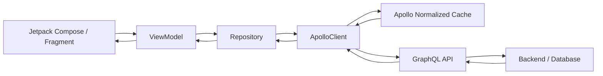
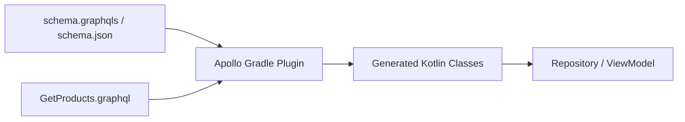
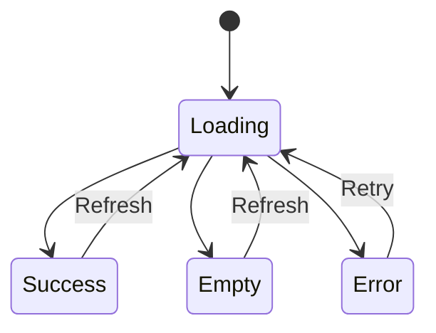
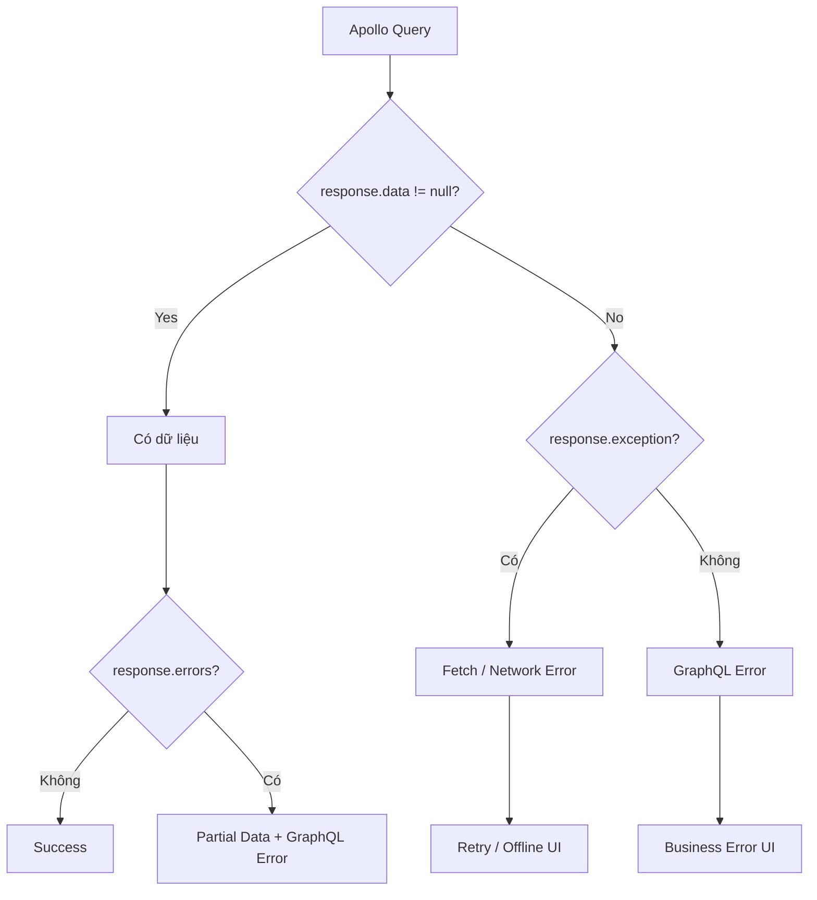
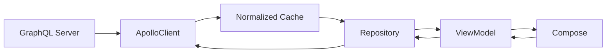

[](https://www.apollographql.com/tutorials/apollo-kotlin-android-part1/01-intro-and-setup?utm_source=chatgpt.com)

# 021 - Apollo Android

**Học phần:** 04 - Network, Async and Services
**Module:** Module 07 - Network
**Nhóm nội dung:** HTTP Client and GraphQL
**Nguồn roadmap:** Network / HTTP Client and GraphQL
**Loại bài:** Network
**Thứ tự trong module:** 021
**Thời lượng gợi ý:** 32 phút

---

## 1. Tóm tắt

**Apollo Android** là tên thường gặp của thư viện GraphQL client dành cho Android. Ở các phiên bản hiện tại, dự án được gọi là **Apollo Kotlin** và hỗ trợ Android, JVM cũng như Kotlin Multiplatform. Apollo Kotlin đọc **GraphQL schema** cùng các file `.graphql`, sau đó sinh ra các model Kotlin type-safe tương ứng với đúng dữ liệu mà query yêu cầu. ([Apollo GraphQL][1])

Tính đến **13/08/2026**, tài liệu chính thức đang đánh dấu **Apollo Kotlin v5** là nhánh mới nhất và phiên bản được tài liệu Getting Started sử dụng là `5.0.1`. ([Apollo GraphQL][1])

Apollo Kotlin phù hợp khi backend sử dụng GraphQL và ứng dụng cần:

* Query dữ liệu.
* Mutation dữ liệu.
* Subscription/realtime.
* Model Kotlin được sinh tự động.
* Xử lý GraphQL errors.
* Normalized cache.
* Pagination.
* Authentication/interceptor.
* Mock response và test network layer.

Apollo Kotlin hiện hỗ trợ cả Query, Mutation, Subscription, normalized cache, HTTP cache, custom scalar, persisted query, batching và nhiều tính năng khác. ([Apollo GraphQL][1])

---

# 2. Mục tiêu học tập

Sau bài này, bạn có thể:

* [ ] Giải thích được Apollo Android/Apollo Kotlin là gì.
* [ ] Phân biệt vai trò của **GraphQL**, **ApolloClient** và **GraphQL server**.
* [ ] Hiểu Apollo sinh Kotlin code từ `.graphql` như thế nào.
* [ ] Thực hiện một GraphQL Query từ Android.
* [ ] Chuyển response thành UI model.
* [ ] Model hóa `Loading`, `Success`, `Empty`, `Error`.
* [ ] Phân biệt **network/fetch error** và **GraphQL error**.
* [ ] Hiểu vai trò của normalized cache.
* [ ] Biết Apollo nên nằm ở đâu trong MVVM/Clean Architecture.
* [ ] Biết cách mock Apollo để test.
* [ ] Tạo được một mini artifact để đưa vào portfolio.

---

# 3. Apollo Android là gì?

Tên hiện tại nên nhớ là:

> **Apollo Kotlin = GraphQL client type-safe cho Kotlin/Android.**

Apollo Kotlin lấy GraphQL operation của ứng dụng và sinh ra các Kotlin model tương ứng. Model sinh ra dựa trên **operation**, không phải đơn thuần tạo toàn bộ model từ schema. Nếu query không yêu cầu một field thì model của query cũng không chứa field đó. ([Apollo GraphQL][2])

Ví dụ backend có:

```graphql
type User {
    id: ID!
    name: String!
    email: String!
    avatar: String
    address: String
}
```

Nhưng app chỉ query:

```graphql
query GetUser($id: ID!) {
    user(id: $id) {
        id
        name
        avatar
    }
}
```

Apollo sẽ tạo model gần tương đương:

```kotlin
data class User(
    val id: String,
    val name: String,
    val avatar: String?
)
```

Không có:

```text
email
address
```

vì app không yêu cầu chúng.

Đây là một trong những khác biệt quan trọng so với cách thường dùng Retrofit + DTO.

---

# 4. GraphQL trước khi học Apollo

GraphQL có ba operation chính:

| Operation      | Mục đích                       | Gần tương đương REST  |
| -------------- | ------------------------------ | --------------------- |
| `query`        | Đọc dữ liệu                    | GET                   |
| `mutation`     | Thay đổi dữ liệu               | POST/PUT/PATCH/DELETE |
| `subscription` | Nhận dữ liệu liên tục/realtime | WebSocket/SSE         |

GraphQL chính thức định nghĩa Query, Mutation và Subscription là ba loại operation chính. Query cho phép client chỉ định chính xác những field cần lấy. ([GraphQL][3])

Ví dụ:

```graphql
query GetProfile {
    me {
        id
        name
        avatar
    }
}
```

Client yêu cầu:

```text
id
name
avatar
```

thì response có thể là:

```json
{
  "data": {
    "me": {
      "id": "42",
      "name": "An",
      "avatar": "/avatar.png"
    }
  }
}
```

---

# 5. Apollo nằm ở đâu trong Android?

Một kiến trúc thông dụng:



Điểm quan trọng:

```text
UI không nên gọi ApolloClient trực tiếp.
```

Nên để:

```text
UI
 ↓
ViewModel
 ↓
Repository
 ↓
ApolloClient
 ↓
GraphQL API
```

Nhờ vậy network implementation không bị rò rỉ lên UI layer.

---

# 6. Apollo code generation hoạt động thế nào?

Đây là phần đặc biệt quan trọng.



Apollo Kotlin cần:

```text
GraphQL Schema
+
GraphQL Operations
```

để tạo:

```text
Generated Kotlin Models
```

Apollo hỗ trợ schema dạng `.graphqls` hoặc `.json`, trong khi các operation thường nằm trong `.graphql`. ([Apollo GraphQL][1])

---

# 7. Cài Apollo Kotlin

Theo tài liệu Apollo Kotlin v5 hiện tại:

```kotlin
plugins {
    id("com.apollographql.apollo") version "5.0.1"
}
```

Dependency:

```kotlin
dependencies {
    implementation("com.apollographql.apollo:apollo-runtime:5.0.1")
}
```

Cấu hình package:

```kotlin
apollo {
    service("service") {
        packageName.set("com.example.app.graphql")
    }
}
```

Đây là cú pháp Getting Started hiện tại của Apollo Kotlin `5.0.1`. ([Apollo GraphQL][1])

> Nếu gặp tutorial cũ dùng `com.apollographql.apollo3`, hãy kiểm tra phiên bản tutorial. API và dependency của Apollo đã thay đổi qua nhiều major version.

---

# 8. Cấu trúc thư mục GraphQL

Ví dụ:

```text
app/
└── src/
    └── main/
        └── graphql/
            ├── schema.graphqls
            ├── GetProducts.graphql
            ├── GetProduct.graphql
            └── UpdateProduct.graphql
```

Apollo mặc định tìm schema và operation trong thư mục GraphQL của module. ([Apollo GraphQL][1])

---

# 9. Tạo GraphQL Query

Ví dụ API có:

```graphql
type Product {
    id: ID!
    name: String!
    price: Float!
    imageUrl: String
}
```

Tạo:

```text
src/main/graphql/GetProducts.graphql
```

```graphql
query GetProducts {
    products {
        id
        name
        price
        imageUrl
    }
}
```

Sau khi build project, Apollo sẽ sinh một class tương tự:

```kotlin
GetProductsQuery
```

Apollo sinh type tương ứng với từng query, giúp response có compile-time type safety. ([Apollo GraphQL][2])

---

# 10. Tạo ApolloClient

```kotlin
import com.apollographql.apollo.ApolloClient

val apolloClient = ApolloClient.Builder()
    .serverUrl("https://api.example.com/graphql")
    .build()
```

Thông thường nên tạo một instance duy nhất thông qua Dependency Injection:

```text
Hilt
 ↓
ApolloClient
 ↓
ProductRepository
 ↓
ProductViewModel
```

Ví dụ Hilt:

```kotlin
@Module
@InstallIn(SingletonComponent::class)
object NetworkModule {

    @Provides
    @Singleton
    fun provideApolloClient(): ApolloClient {
        return ApolloClient.Builder()
            .serverUrl("https://api.example.com/graphql")
            .build()
    }
}
```

---

# 11. Thực thi Query

```kotlin
val response = apolloClient
    .query(GetProductsQuery())
    .execute()
```

Apollo Kotlin thực hiện network I/O trên background dispatcher theo mặc định trên Android/JVM, nên không cần tự bọc network operation bằng `withContext(Dispatchers.IO)` chỉ vì sợ gọi network trên main thread. ([Apollo GraphQL][2])

Response:

```kotlin
response.data
response.errors
response.exception
```

Ba phần này cực kỳ quan trọng khi xử lý lỗi. ([Apollo GraphQL][4])

---

# 12. Không đưa generated model trực tiếp lên UI

Không nên:

```text
Compose
   ↓
GetProductsQuery.Product
```

Nên:

```text
GraphQL Generated Model
          ↓
        Mapper
          ↓
     Domain/UI Model
          ↓
         UI
```

Ví dụ UI model:

```kotlin
data class ProductUiModel(
    val id: String,
    val name: String,
    val priceText: String,
    val imageUrl: String?
)
```

Mapper:

```kotlin
fun GetProductsQuery.Product.toUiModel(): ProductUiModel {
    return ProductUiModel(
        id = id,
        name = name,
        priceText = "$${price}",
        imageUrl = imageUrl
    )
}
```

Lợi ích:

```text
GraphQL schema thay đổi
        ↓
Generated model thay đổi
        ↓
Mapper chịu ảnh hưởng
        ↓
UI ít bị ảnh hưởng
```

---

# 13. Repository hoàn chỉnh

```kotlin
class ProductRepository(
    private val apolloClient: ApolloClient
) {

    suspend fun getProducts(): Result<List<ProductUiModel>> {
        val response = apolloClient
            .query(GetProductsQuery())
            .execute()

        if (response.exception != null) {
            return Result.failure(response.exception!!)
        }

        if (!response.errors.isNullOrEmpty()) {
            return Result.failure(
                Exception(
                    response.errors
                        ?.joinToString { it.message }
                        ?: "GraphQL error"
                )
            )
        }

        val products = response.data
            ?.products
            ?.map { product ->
                ProductUiModel(
                    id = product.id,
                    name = product.name,
                    priceText = "$${product.price}",
                    imageUrl = product.imageUrl
                )
            }
            .orEmpty()

        return Result.success(products)
    }
}
```

---

# 14. Model UI State

Network screen không nên chỉ có:

```text
Success
Error
```

Tối thiểu nên nghĩ đến:



Kotlin:

```kotlin
sealed interface ProductUiState {

    data object Loading : ProductUiState

    data class Success(
        val products: List<ProductUiModel>
    ) : ProductUiState

    data object Empty : ProductUiState

    data class Error(
        val message: String
    ) : ProductUiState
}
```

---

# 15. ViewModel

```kotlin
class ProductViewModel(
    private val repository: ProductRepository
) : ViewModel() {

    private val _uiState =
        MutableStateFlow<ProductUiState>(
            ProductUiState.Loading
        )

    val uiState: StateFlow<ProductUiState> =
        _uiState.asStateFlow()

    init {
        loadProducts()
    }

    fun loadProducts() {
        viewModelScope.launch {

            _uiState.value =
                ProductUiState.Loading

            repository
                .getProducts()
                .onSuccess { products ->

                    _uiState.value =
                        if (products.isEmpty()) {
                            ProductUiState.Empty
                        } else {
                            ProductUiState.Success(products)
                        }
                }
                .onFailure { throwable ->

                    _uiState.value =
                        ProductUiState.Error(
                            throwable.message
                                ?: "Không thể tải dữ liệu"
                        )
                }
        }
    }
}
```

---

# 16. Jetpack Compose UI

```kotlin
@Composable
fun ProductScreen(
    viewModel: ProductViewModel
) {

    val state by viewModel
        .uiState
        .collectAsStateWithLifecycle()

    when (val current = state) {

        ProductUiState.Loading -> {
            CircularProgressIndicator()
        }

        ProductUiState.Empty -> {
            Text("Không có sản phẩm")
        }

        is ProductUiState.Error -> {
            Column {
                Text(current.message)

                Button(
                    onClick = viewModel::loadProducts
                ) {
                    Text("Thử lại")
                }
            }
        }

        is ProductUiState.Success -> {
            LazyColumn {
                items(current.products) { product ->
                    Text(
                        "${product.name} - ${product.priceText}"
                    )
                }
            }
        }
    }
}
```

---

# 17. Error handling trong Apollo Kotlin

Đây là phần rất dễ làm sai.

ApolloResponse hiện có ba thành phần quan trọng:

```text
data
errors
exception
```

([Apollo GraphQL][4])

## 17.1 Fetch error

Ví dụ:

```text
No Internet
DNS failure
SSL failure
Timeout
HTTP 500
Invalid JSON
```

Khi Apollo không lấy được GraphQL response hợp lệ:

```kotlin
response.exception != null
```

([Apollo GraphQL][4])

---

## 17.2 GraphQL error

GraphQL server có thể trả:

```http
HTTP 200
```

nhưng body:

```json
{
  "data": {
    "product": null
  },
  "errors": [
    {
      "message": "Product not found"
    }
  ]
}
```

Lúc này có thể:

```kotlin
response.exception == null
response.errors != null
```

Thậm chí GraphQL response có thể chứa **partial data đồng thời với errors**. ([Apollo GraphQL][4])

Vì vậy không nên suy nghĩ kiểu REST:

```text
HTTP 200 = chắc chắn thành công hoàn toàn
```

---

# 18. Error flow nên thiết kế thế nào?



---

# 19. Mutation

Ví dụ cập nhật favorite:

```graphql
mutation FavoriteProduct($id: ID!) {
    favoriteProduct(id: $id) {
        id
        isFavorite
    }
}
```

Apollo sinh:

```kotlin
FavoriteProductMutation
```

Gọi:

```kotlin
val response = apolloClient
    .mutation(
        FavoriteProductMutation(id)
    )
    .execute()
```

Apollo Kotlin sử dụng cùng cơ chế code generation cho mutation; mutation được gửi bằng `ApolloClient.mutation(...)`. ([Apollo GraphQL][5])

---

# 20. Subscription

Subscription dùng cho dữ liệu realtime như:

```text
Chat
Stock price
Delivery status
Game state
Notification
Live score
```

Ví dụ:

```graphql
subscription ProductUpdated {
    productUpdated {
        id
        name
        price
    }
}
```

Client:

```kotlin
apolloClient
    .subscription(ProductUpdatedSubscription())
    .toFlow()
    .collect { response ->

        val product =
            response.data?.productUpdated

        // update UI
    }
```

Subscription là operation sống lâu và Apollo Kotlin expose dữ liệu dưới dạng `Flow`; thư viện hỗ trợ các transport subscription như WebSocket, và transport phải tương thích với server GraphQL. ([Apollo GraphQL][6])

---

# 21. Apollo Normalized Cache

Apollo không chỉ là HTTP client.

Một tính năng quan trọng là:

```text
Normalized Cache
```

Apollo có thể tách các object trong GraphQL response thành những record riêng, nhận diện chúng bằng cache ID và tránh lưu nhiều bản sao của cùng một object. ([Apollo GraphQL][7])

Ví dụ Query A trả:

```json
{
  "user": {
    "id": "1",
    "name": "An"
  }
}
```

Query B cũng trả:

```json
{
  "post": {
    "author": {
      "id": "1",
      "name": "An"
    }
  }
}
```

Thay vì tưởng tượng cache như:

```text
Query A → User #1

Query B → Author User #1
```

normalized cache hướng tới:

```text
User:1
 ├── Query A
 └── Query B
```

Nhờ vậy các màn hình có thể chia sẻ cùng dữ liệu cache và phản ứng khi cache thay đổi. Apollo mô tả normalized cache như một cơ chế có thể đóng vai trò **single source of truth** cho UI. ([Apollo GraphQL][7])

---

# 22. Memory Cache và SQLite Cache

Apollo Kotlin hiện có normalized cache dạng:

```text
MemoryCache
```

và:

```text
SqlNormalizedCache
```

Memory cache nhanh nhưng mất khi process bị kill.

SQLite cache có thể giữ dữ liệu qua app restart.

Apollo Kotlin cung cấp cả in-memory và SQLite-backed normalized cache. ([Apollo GraphQL][7])

---

# 23. Lifecycle

Apollo không nên gắn trực tiếp network request vào `Activity`:

```kotlin
class MainActivity {
    // Không nên để toàn bộ data logic ở đây.
}
```

Nên:

```text
Activity / Compose
        ↓
ViewModel
        ↓
Repository
        ↓
ApolloClient
```

Khi rotate:

```text
Activity destroyed
        ↓
Activity recreated
```

nhưng:

```text
ViewModel
```

có thể giữ lại UI state qua configuration change.

Điều này giúp tránh việc rotate màn hình rồi vô tình tạo lại request chỉ vì UI component bị recreate.

---

# 24. Authentication

ApolloClient thường được cấu hình để thêm:

```http
Authorization: Bearer <token>
```

Kiến trúc:

```text
TokenStorage
     ↓
Apollo Interceptor
     ↓
ApolloClient
     ↓
GraphQL Server
```

Không nên:

```kotlin
val token = "abc123"
```

hard-code token trong source code.

Nên lấy token từ authentication/session layer và thêm header ở network layer.

---

# 25. Apollo Kotlin vs Retrofit

| Apollo Kotlin                        | Retrofit                         |
| ------------------------------------ | -------------------------------- |
| GraphQL client                       | REST/HTTP client                 |
| `.graphql` operation                 | Kotlin interface annotation      |
| Schema-aware                         | Không bắt buộc schema            |
| Generate models từ GraphQL operation | Thường tự định nghĩa DTO         |
| Query                                | GET thường gặp                   |
| Mutation                             | POST/PUT/PATCH/DELETE thường gặp |
| Subscription                         | Thường cần WebSocket lib riêng   |
| Normalized cache                     | Không có mặc định                |
| GraphQL errors                       | HTTP/API errors                  |
| Một endpoint GraphQL thường gặp      | Nhiều REST endpoints thường gặp  |

Không nên hiểu:

```text
Apollo tốt hơn Retrofit.
```

Chính xác hơn:

```text
Backend REST
   ↓
Retrofit rất phù hợp

Backend GraphQL
   ↓
Apollo Kotlin rất phù hợp
```

---

# 26. Một lỗi kiến trúc phổ biến

## Sai

```kotlin
@Composable
fun ProductScreen() {

    val apolloClient =
        ApolloClient.Builder()
            .serverUrl(API)
            .build()

    LaunchedEffect(Unit) {
        apolloClient
            .query(GetProductsQuery())
            .execute()
    }
}
```

Vấn đề:

```text
UI
 ├── tạo network client
 ├── biết GraphQL
 ├── thực hiện request
 ├── xử lý lỗi
 └── map data
```

Quá nhiều trách nhiệm.

---

## Tốt hơn

```text
Compose
   ↓
ViewModel
   ↓
Repository
   ↓
ApolloClient
```

UI chỉ quan tâm:

```kotlin
ProductUiState
```

---

# 27. Apollo và Single Source of Truth

Một kiến trúc nâng cao:



Apollo normalized cache được thiết kế để cho phép UI quan sát cache và cập nhật khi dữ liệu liên quan thay đổi. ([Apollo GraphQL][7])

---

# 28. Loading, Error, Retry và Offline

UX không nên chỉ:

```text
API lỗi
 ↓
Toast("Error")
```

Nên thiết kế:

### Loading

```text
Skeleton
ProgressIndicator
```

### Empty

```text
Không có sản phẩm.
```

### Network error

```text
Không thể kết nối Internet.

[Thử lại]
```

### GraphQL/business error

```text
Bạn không có quyền xem dữ liệu này.
```

### Cache

```text
Hiện dữ liệu cũ
+
thông báo đang offline
```

---

# 29. Retry

ViewModel:

```kotlin
fun retry() {
    loadProducts()
}
```

Compose:

```kotlin
Button(
    onClick = viewModel::retry
) {
    Text("Thử lại")
}
```

Không nên tự động retry vô hạn:

```text
Request
 ↓
Failure
 ↓
Retry
 ↓
Failure
 ↓
Retry
 ↓
...
```

Production thường cần:

```text
retry limit
+
backoff
+
network awareness
```

---

# 30. Testing Apollo

Apollo Kotlin hiện cung cấp các công cụ test như `MockServer`, test network transports và data builders; một số API test được đánh dấu experimental. ([Apollo GraphQL][8])

Có hai hướng test đáng nhớ.

## Test Repository

```text
Fake Apollo response
        ↓
Repository
        ↓
Expected UI/Domain model
```

Ví dụ cần test:

```text
response success
response empty
GraphQL error
network error
partial data
```

---

## Test ViewModel

```text
FakeRepository
     ↓
ViewModel
     ↓
UiState
```

Kiểm tra:

```text
Loading
 ↓
Success
```

hoặc:

```text
Loading
 ↓
Error
```

---

# 31. Apollo Android Studio Plugin

Apollo cung cấp plugin cho Android Studio/IntelliJ.

Plugin có thể hỗ trợ:

* GraphQL code generation.
* Navigation tới GraphQL definitions.
* GraphQL IDE integration.
* Migration helpers.
* Schema tooling.
* Normalized cache viewer.

Plugin hiện có thể tự chạy code generation khi GraphQL file thay đổi. ([Apollo GraphQL][9])

Cài trong:

```text
Android Studio
→ Settings
→ Plugins
→ Marketplace
→ Apollo GraphQL
```

([Apollo GraphQL][9])

---

# 32. Debug checklist

Nếu Apollo không generate class:

```text
GetProductsQuery
```

kiểm tra:

```text
1. Plugin Apollo đã được apply?
2. Apollo runtime đã có dependency?
3. Có schema?
4. File nằm đúng src/main/graphql?
5. Query syntax đúng?
6. Query có tồn tại trong schema?
7. Package Apollo đã cấu hình?
8. Gradle Sync?
9. Build/Rebuild?
```

Một lỗi GraphQL rất có giá trị là:

```text
Cannot query field "xxx" on type "yyy".
```

Nó thường cho thấy:

```text
query
   ↕
schema
```

không đồng bộ.

---

# 33. Production checklist

Trước khi release một feature dùng Apollo:

* [ ] GraphQL endpoint dùng HTTPS.
* [ ] Token không hard-code.
* [ ] Có handling network/fetch error.
* [ ] Có handling GraphQL error.
* [ ] Có xử lý partial data nếu backend sử dụng.
* [ ] Có Loading state.
* [ ] Có Empty state.
* [ ] Có Error state.
* [ ] Có Retry.
* [ ] Không gọi Apollo trực tiếp từ Composable/Activity.
* [ ] Generated GraphQL model không leak quá sâu vào UI.
* [ ] Query không lấy field không cần thiết.
* [ ] Pagination được xử lý nếu danh sách lớn.
* [ ] Cache policy phù hợp.
* [ ] Subscription được cancel theo lifecycle nếu sử dụng.
* [ ] Có test success.
* [ ] Có test network error.
* [ ] Có test GraphQL error.
* [ ] Không log access token hoặc dữ liệu nhạy cảm.

---

# 34. Bài thực hành

## Mini project: GraphQL Product Browser

Tạo app:

```text
Product Browser
```

UI:

```text
┌─────────────────────────┐
│ Products                │
├─────────────────────────┤
│ MacBook                 │
│ $1299                   │
├─────────────────────────┤
│ Keyboard                │
│ $99                     │
├─────────────────────────┤
│ Mouse                   │
│ $49                     │
└─────────────────────────┘
```

Yêu cầu architecture:

```text
GraphQL API
    ↓
ApolloClient
    ↓
ProductRepository
    ↓
ProductViewModel
    ↓
ProductUiState
    ↓
Jetpack Compose
```

Phải có:

```text
Loading
Success
Empty
Error
Retry
```

---

# 35. Bài tập mở rộng

### Level 1

Thêm:

```graphql
query GetProduct($id: ID!) {
    product(id: $id) {
        id
        name
        description
        price
    }
}
```

Tạo:

```text
ProductListScreen
      ↓
ProductDetailScreen
```

---

### Level 2

Thêm mutation:

```text
Favorite Product
```

---

### Level 3

Thêm:

```text
Normalized Cache
```

và kiểm tra:

```text
List
 ↓
Detail
 ↓
Back
```

dữ liệu có cần tải lại hay không.

---

### Level 4

Mock:

```text
network error
GraphQL error
empty result
success
```

và chụp screenshot bốn trạng thái UI.

---

# 36. Artifact cho portfolio

Một repository tốt có thể có:

```text
apollo-android-demo/
├── app/
├── graphql/
├── data/
│   ├── ProductRepository.kt
│   └── mapper/
├── ui/
│   ├── ProductViewModel.kt
│   └── ProductScreen.kt
└── README.md
```

README nên mô tả:

```text
Apollo Kotlin
GraphQL Query
MVVM
Repository Pattern
StateFlow
Jetpack Compose
Error Handling
Retry
Normalized Cache
Unit Testing
```

Architecture diagram:

```text
┌─────────────────────┐
│ Jetpack Compose UI  │
└──────────┬──────────┘
           │
           ▼
┌─────────────────────┐
│      ViewModel      │
│      StateFlow      │
└──────────┬──────────┘
           │
           ▼
┌─────────────────────┐
│     Repository      │
└──────────┬──────────┘
           │
           ▼
┌─────────────────────┐
│    ApolloClient     │
├─────────────────────┤
│ Normalized Cache    │
└──────────┬──────────┘
           │
           ▼
┌─────────────────────┐
│    GraphQL API      │
└─────────────────────┘
```

---

# 37. Những điểm cần nhớ

```text
Apollo Kotlin
      │
      ├── GraphQL Client
      │
      ├── Schema-aware
      │
      ├── Code Generation
      │
      ├── Type-safe Models
      │
      ├── Query
      │
      ├── Mutation
      │
      ├── Subscription
      │
      ├── Error Handling
      │
      └── Normalized Cache
```

Công thức nên nhớ:

```text
schema
+
.graphql operations
        ↓
Apollo compiler
        ↓
generated Kotlin models
        ↓
ApolloClient
        ↓
Repository
        ↓
ViewModel
        ↓
UI State
        ↓
Compose
```

Apollo Kotlin không thay thế toàn bộ architecture của ứng dụng.

Nó chủ yếu nằm ở:

```text
Data / Network layer
```

và cần được kết hợp với:

```text
Repository
ViewModel
StateFlow
Lifecycle
UI State
Testing
```

---

# 38. Checklist hoàn thành bài 021

* [ ] Giải thích được Apollo Android/Apollo Kotlin.
* [ ] Biết Apollo hiện tập trung vào Kotlin/Android.
* [ ] Biết GraphQL Query, Mutation và Subscription.
* [ ] Biết thêm Apollo Gradle plugin.
* [ ] Biết đặt schema trong `src/main/graphql`.
* [ ] Biết viết `.graphql`.
* [ ] Biết Apollo generate Kotlin class.
* [ ] Biết tạo `ApolloClient`.
* [ ] Biết gọi `query().execute()`.
* [ ] Biết phân biệt `data`, `errors`, `exception`.
* [ ] Biết map GraphQL model → UI/domain model.
* [ ] Biết tạo Repository.
* [ ] Biết tạo ViewModel + StateFlow.
* [ ] Có Loading / Success / Empty / Error.
* [ ] Có Retry.
* [ ] Hiểu normalized cache.
* [ ] Biết Apollo thuộc Data/Network layer.
* [ ] Có ít nhất một test hoặc mock response.
* [ ] Có screenshot hoặc README làm portfolio artifact.

---

# 39. Ghi chú sản xuất

Khi đưa Apollo Kotlin vào production, đừng chỉ hỏi:

> “Query có chạy được không?”

Hãy hỏi toàn bộ flow:

```text
GraphQL Schema thay đổi?
        ↓
Code generation có fail?
        ↓
Repository xử lý partial/error thế nào?
        ↓
Cache có stale không?
        ↓
ViewModel giữ state thế nào?
        ↓
Rotate/background có request thừa không?
        ↓
Offline UI ra sao?
        ↓
Retry có giới hạn không?
        ↓
Token có an toàn không?
        ↓
Test nào phát hiện regression?
```

Một Android developer mạnh không chỉ biết viết:

```kotlin
apolloClient.query(...)
```

mà cần giải thích được **Apollo nằm ở đâu trong kiến trúc, dữ liệu đi qua những layer nào, lỗi GraphQL khác network error ra sao, cache tác động thế nào tới UI và feature được bảo vệ bằng test nào**.

### Tài liệu chính thức dùng cho bài này

Apollo Kotlin hiện là GraphQL client type-safe dành cho Android/JVM/KMP; tài liệu v5 mô tả code generation, Query/Mutation/Subscription, cache và cấu hình hiện hành. ([Apollo GraphQL][1]) Phần error handling dựa trên mô hình `ApolloResponse.data`, `errors` và `exception` của Apollo Kotlin. ([Apollo GraphQL][4]) Phần cache dựa trên tài liệu normalized cache chính thức. ([Apollo GraphQL][7]) Phần testing và IDE tooling dựa trên tài liệu Apollo Testing và Android Studio Plugin. ([Apollo GraphQL][8])

[1]: https://www.apollographql.com/docs/kotlin "Introduction to Apollo Kotlin - Apollo GraphQL Docs"
[2]: https://www.apollographql.com/docs/kotlin/essentials/queries "Queries in Apollo Kotlin - Apollo GraphQL Docs"
[3]: https://graphql.org/learn/queries/ "Queries | GraphQL"
[4]: https://www.apollographql.com/docs/kotlin/essentials/errors "Error handling - Apollo GraphQL Docs"
[5]: https://www.apollographql.com/docs/kotlin/essentials/mutations "Mutations in Apollo Kotlin - Apollo GraphQL Docs"
[6]: https://www.apollographql.com/docs/kotlin/essentials/subscriptions "Subscriptions in Apollo Kotlin - Apollo GraphQL Docs"
[7]: https://www.apollographql.com/docs/kotlin/caching/normalized-cache "Normalized caches in Apollo Kotlin - Apollo GraphQL Docs"
[8]: https://www.apollographql.com/docs/kotlin/testing/overview?utm_source=chatgpt.com "Testing in Apollo Kotlin"
[9]: https://www.apollographql.com/docs/kotlin/testing/android-studio-plugin "Android Studio / IntelliJ plugin - Apollo GraphQL Docs"
