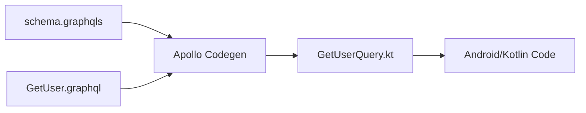
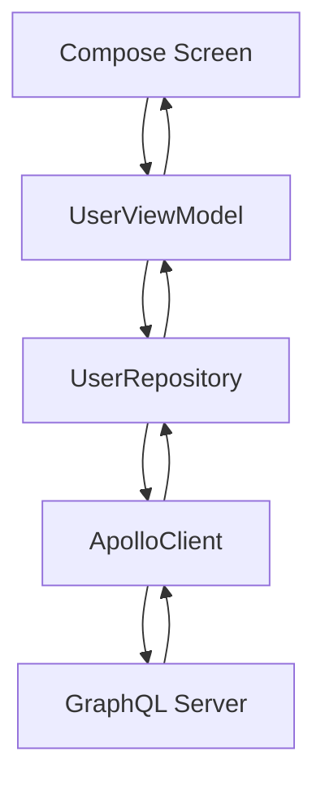
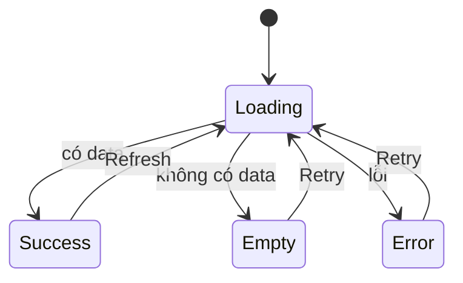
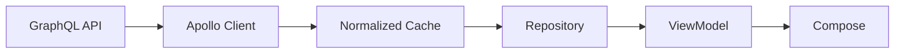

[](https://geekyants.com/blog/hasura-graphql--nextjs-part-1?utm_source=chatgpt.com)

# 022 - GraphQL Query

**Học phần:** 04 - Network, Async and Services
**Module:** Module 07 - Network
**Nhóm nội dung:** HTTP Client and GraphQL
**Nguồn roadmap:** Network / HTTP Client and GraphQL
**Loại bài:** Network
**Thứ tự trong module:** 022
**Thời lượng gợi ý:** 32 phút

---

## 1. Tóm tắt

**GraphQL Query** là thao tác dùng để **đọc dữ liệu** từ GraphQL API. Thay vì client nhận một response cố định do server quyết định, GraphQL cho phép client mô tả chính xác những field mình cần trong một **selection set**. GraphQL có ba nhóm operation chính: `query`, `mutation` và `subscription`; trong đó `query` dùng cho các thao tác đọc dữ liệu. ([GraphQL][1])

Ví dụ màn hình hồ sơ chỉ cần:

* ID.
* Tên.
* Avatar.

Client có thể gửi:

```graphql
query GetUser($id: ID!) {
  user(id: $id) {
    id
    name
    avatarUrl
  }
}
```

Thay vì phải nhận toàn bộ dữ liệu của user như địa chỉ, lịch sử đăng nhập, quyền, cấu hình tài khoản... nếu màn hình không sử dụng chúng.

Trong Android, GraphQL Query thường nằm trong luồng:

```text
Compose / Activity / Fragment
            ↓
        ViewModel
            ↓
        Repository
            ↓
      ApolloClient
            ↓
      GraphQL Server
            ↓
   GraphQL Response
            ↓
Generated Kotlin Model
            ↓
        UI State
```

Với **Apollo Kotlin**, file `.graphql` được kiểm tra với schema và sinh ra các Kotlin model tương ứng với chính operation đó. Vì vậy Android code có thể truy cập response theo kiểu type-safe thay vì tự parse JSON hoặc truyền `Map<String, Any>`. ([Apollo GraphQL][2])

---

# 2. Mục tiêu học tập

Sau bài này, bạn nên:

* [ ] Giải thích được GraphQL Query là gì.
* [ ] Phân biệt `query`, `mutation` và `subscription`.
* [ ] Hiểu selection set.
* [ ] Hiểu field và nested field.
* [ ] Biết sử dụng arguments.
* [ ] Biết khai báo variables.
* [ ] Đọc được GraphQL response.
* [ ] Hiểu trường hợp `data` và `errors` cùng tồn tại.
* [ ] Viết một `.graphql` query trong Android.
* [ ] Chạy query bằng Apollo Kotlin.
* [ ] Map GraphQL model sang domain/UI model.
* [ ] Model hóa `Loading`, `Success`, `Empty`, `Error`.
* [ ] Hiểu query liên quan như thế nào tới lifecycle và coroutine cancellation.
* [ ] Biết các rủi ro production như query quá lớn, lỗi partial data và cache.

---

# 3. GraphQL Query là gì?

Một query có thể hiểu đơn giản là:

> **Client mô tả cấu trúc dữ liệu muốn lấy, server trả về dữ liệu có cấu trúc tương ứng.**

GraphQL yêu cầu query bắt đầu từ root operation type như `Query`, sau đó đi xuống các field cho tới những giá trị lá như scalar hoặc enum. ([GraphQL][1])

Ví dụ:

```graphql
query GetUser {
  user {
    id
    name
  }
}
```

Response có dạng tương ứng:

```json
{
  "data": {
    "user": {
      "id": "42",
      "name": "An"
    }
  }
}
```

Có thể hình dung:

```text
QUERY
│
└── user
    ├── id
    └── name

            ↓ Server

RESPONSE
│
└── data
    └── user
        ├── id
        └── name
```

Đây là đặc điểm rất quan trọng của GraphQL:

```text
Fields được request
        ↓
Fields xuất hiện trong result
```

Với Apollo Kotlin, generated model cũng dựa trên **operation**, không đơn thuần sinh một model chứa toàn bộ schema. Field không được request sẽ không xuất hiện trong generated result của operation đó. ([Apollo GraphQL][3])

---

# 4. Cấu trúc một GraphQL Query

Ví dụ đầy đủ hơn:

```graphql
query GetUser($id: ID!) {
  user(id: $id) {
    id
    name
    email
    avatarUrl

    posts {
      id
      title
    }
  }
}
```

Có thể tách thành:

```text
query
│
├── Operation name
│      GetUser
│
├── Variable
│      $id: ID!
│
└── Selection Set
       │
       └── user(id: $id)
             ├── id
             ├── name
             ├── email
             ├── avatarUrl
             └── posts
                  ├── id
                  └── title
```

---

# 5. Operation Type

Trong:

```graphql
query GetUser {
  ...
}
```

`query` là **operation type**.

GraphQL có ba operation chính. ([GraphQL][1])

| Operation      | Mục đích                             |
| -------------- | ------------------------------------ |
| `query`        | Đọc dữ liệu                          |
| `mutation`     | Thay đổi dữ liệu                     |
| `subscription` | Nhận dữ liệu cập nhật theo thời gian |

Ví dụ:

```graphql
query GetProducts {
  products {
    id
    name
  }
}
```

so với:

```graphql
mutation CreateProduct {
  ...
}
```

---

# 6. Operation Name

Trong:

```graphql
query GetUser {
```

`GetUser` là **operation name**.

Nên đặt tên operation rõ ràng thay vì anonymous query:

```graphql
query GetUserProfile {
  ...
}
```

```graphql
query GetProductList {
  ...
}
```

```graphql
query SearchMovies {
  ...
}
```

Điều này đặc biệt hữu ích với Apollo Kotlin vì mỗi query sẽ được dùng để tạo ra generated class tương ứng. Apollo yêu cầu operation và fragment name trong tập tài liệu GraphQL của project phải duy nhất. ([Apollo GraphQL][3])

---

# 7. Fields và Selection Set

Ví dụ:

```graphql
query GetProduct {
  product {
    id
    name
    price
  }
}
```

Selection set:

```graphql
{
  id
  name
  price
}
```

Client đang yêu cầu ba field.

Server không tự ý quyết định Android cần hiển thị gì; query chính là hợp đồng dữ liệu mà màn hình đang yêu cầu.

Ví dụ màn hình:

```text
┌─────────────────────────────┐
│       Product Detail        │
│                             │
│       [ product image ]     │
│                             │
│       Galaxy S26            │
│       21.990.000 đ          │
│       ⭐ 4.8                 │
│                             │
└─────────────────────────────┘
```

Có thể query:

```graphql
query ProductDetail($id: ID!) {
  product(id: $id) {
    name
    imageUrl
    price
    rating
  }
}
```

Không cần lấy:

```text
supplier
warehouseHistory
adminNotes
internalCost
auditLogs
...
```

nếu UI không sử dụng.

---

# 8. Nested Query

GraphQL cho phép truy vấn quan hệ lồng nhau.

Ví dụ:

```graphql
query GetUser {
  user {
    id
    name

    posts {
      id
      title

      author {
        id
        name
      }
    }
  }
}
```

Cây dữ liệu:

```text
user
│
├── id
├── name
│
└── posts[]
     │
     ├── id
     ├── title
     │
     └── author
          ├── id
          └── name
```

Response có shape tương ứng:

```json
{
  "data": {
    "user": {
      "id": "1",
      "name": "An",
      "posts": [
        {
          "id": "100",
          "title": "GraphQL Android",
          "author": {
            "id": "1",
            "name": "An"
          }
        }
      ]
    }
  }
}
```

---

# 9. Arguments

Field có thể nhận argument.

Ví dụ:

```graphql
query {
  user(id: "42") {
    id
    name
  }
}
```

Hoặc:

```graphql
query {
  products(limit: 20) {
    id
    name
  }
}
```

Pagination:

```graphql
query {
  products(first: 20, after: "cursor_123") {
    ...
  }
}
```

Search:

```graphql
query {
  products(search: "keyboard") {
    ...
  }
}
```

Tuy nhiên trong application thực tế, không nên hard-code dữ liệu thay đổi liên tục vào query.

---

# 10. Variables

Thay vì:

```graphql
query {
  user(id: "42") {
    name
  }
}
```

nên viết:

```graphql
query GetUser($id: ID!) {
  user(id: $id) {
    id
    name
  }
}
```

Variables:

```json
{
  "id": "42"
}
```

GraphQL hỗ trợ variables như một thành phần chính thức của query document. ([GraphQL][1])

Cách này cho phép cùng một operation sử dụng cho:

```text
GetUser(id = 1)
GetUser(id = 2)
GetUser(id = 42)
...
```

---

# 11. `ID!` nghĩa là gì?

Trong:

```graphql
$id: ID!
```

`ID` là GraphQL scalar.

Dấu:

```text
!
```

biểu thị giá trị **non-null**.

Ví dụ:

```graphql
String
```

có thể null.

```graphql
String!
```

không được null.

Apollo tận dụng thông tin nullability từ GraphQL để sinh Kotlin type tương ứng, giúp phát hiện nhiều vấn đề ngay ở compile time. ([Apollo GraphQL][3])

---

# 12. GraphQL Query khác REST như thế nào?

Ví dụ muốn màn hình profile gồm:

```text
User
Posts
Followers
```

Một REST API có thể được thiết kế thành:

```text
GET /users/42

GET /users/42/posts

GET /users/42/followers
```

Một GraphQL schema phù hợp có thể cho phép client mô tả dữ liệu cần lấy bằng một operation:

```graphql
query UserProfile($id: ID!) {
  user(id: $id) {
    id
    name

    posts {
      id
      title
    }

    followers {
      id
      name
    }
  }
}
```

Điểm cần nhớ không phải là:

> GraphQL luôn nhanh hơn REST.

Mà là:

> GraphQL cho client khả năng mô tả selection set phù hợp với use case của mình.

Một query quá sâu hoặc lấy quá nhiều collection vẫn có thể tốn CPU, database I/O, bandwidth và thời gian xử lý.

---

# 13. GraphQL Response

GraphQL response không chỉ đơn giản là:

```json
{
  "data": {}
}
```

Theo GraphQL, response có thể chứa ba top-level key:

```text
data
errors
extensions
```

Và một response có thể đồng thời có **`data` và `errors`**, tức partial response. ([GraphQL][4])

### Success

```json
{
  "data": {
    "user": {
      "id": "42",
      "name": "An"
    }
  }
}
```

### GraphQL error

```json
{
  "data": null,
  "errors": [
    {
      "message": "User not found"
    }
  ]
}
```

### Partial data

```json
{
  "data": {
    "user": {
      "id": "42",
      "name": "An",
      "avatarUrl": null
    }
  },
  "errors": [
    {
      "message": "Cannot load avatar"
    }
  ]
}
```

Đây là một khác biệt quan trọng khi thiết kế Android UI.

Không nên tư duy duy nhất:

```text
Có lỗi
   ↓
Vứt toàn bộ response
```

Có những trường hợp:

```text
User info thành công
       +
Avatar lỗi
       ↓
vẫn có thể hiển thị User info
       +
placeholder avatar
```

GraphQL định nghĩa field execution error có thể đi kèm partial data, trong khi lỗi syntax/validation xảy ra trước khi execution thì sẽ không có `data` result tương ứng. ([GraphQL][4])

---

# 14. Các loại lỗi cần phân biệt

```text
GraphQL Query
     │
     ├── Network Error
     │      ├── mất mạng
     │      ├── DNS
     │      ├── SSL
     │      └── timeout
     │
     ├── HTTP Error
     │
     ├── GraphQL Request Error
     │      ├── syntax
     │      └── validation
     │
     └── GraphQL Field Error
            │
            └── có thể có partial data
```

GraphQL documentation cũng phân biệt network error với GraphQL execution errors; network error có thể ngăn client và server hoàn thành request. ([GraphQL][4])

Đây là lý do:

```kotlin
if (httpCode == 200) {
    // chắc chắn thành công
}
```

không phải một mô hình xử lý GraphQL đủ tốt.

---

# 15. GraphQL Query trong Android với Apollo Kotlin

Một GraphQL client phổ biến cho Kotlin/Android là **Apollo Kotlin**. Nó sinh Kotlin model từ schema và các GraphQL operation, đồng thời hỗ trợ query, mutation, subscription và caching. ([Apollo GraphQL][2])

Luồng build:



Apollo cần schema cùng các operation `.graphql` để generate class tương ứng. ([Apollo GraphQL][3])

---

# 16. Cấu trúc project

Có thể tổ chức:

```text
app/
└── src/
    └── main/
        └── graphql/
            └── com/example/app/
                ├── schema.graphqls
                ├── GetUser.graphql
                ├── GetProducts.graphql
                └── SearchProducts.graphql
```

Apollo Kotlin hỗ trợ schema dạng `.graphqls` hoặc `.json` và executable GraphQL document dạng `.graphql`. ([Apollo GraphQL][2])

---

# 17. Cài Apollo Kotlin

Tại thời điểm tra cứu tháng 8/2026, tài liệu Apollo Kotlin hiện liệt kê nhánh **v5** là phiên bản hiện hành và ví dụ setup chính thức đang sử dụng `5.0.1`. Khi làm project thực tế nên kiểm tra release hiện tại thay vì cố định phiên bản từ một bài học. ([Apollo GraphQL][2])

Ví dụ:

```kotlin
plugins {
    id("com.apollographql.apollo") version "5.0.1"
}
```

Dependency:

```kotlin
dependencies {
    implementation(
        "com.apollographql.apollo:apollo-runtime:5.0.1"
    )
}
```

Cấu hình:

```kotlin
apollo {
    service("service") {
        packageName.set("com.example.shop.graphql")
    }
}
```

---

# 18. Tạo Query

File:

```text
GetUser.graphql
```

Nội dung:

```graphql
query GetUser($id: ID!) {
  user(id: $id) {
    id
    name
    email
    avatarUrl
  }
}
```

Sau khi build, Apollo generate class tương ứng, chẳng hạn:

```text
GetUserQuery
```

Apollo Kotlin chính thức mô tả mỗi query executable bằng một generated class triển khai `Query`, được tạo từ operation và schema. ([Apollo GraphQL][3])

---

# 19. Tạo ApolloClient

```kotlin
val apolloClient = ApolloClient.Builder()
    .serverUrl("https://api.example.com/graphql")
    .build()
```

Nên tạo client dùng chung ở tầng dependency injection:

```text
Application
   │
   └── ApolloClient
          │
          ├── UserRepository
          ├── ProductRepository
          └── SearchRepository
```

Không nên tạo một `ApolloClient` mới mỗi lần Compose recomposition.

---

# 20. Execute Query

Ví dụ cơ bản theo Apollo Kotlin:

```kotlin
val response = apolloClient
    .query(GetUserQuery(id = "42"))
    .execute()

val name = response.data?.user?.name
```

Đây chính là pattern mà Apollo Kotlin hướng dẫn: truyền generated query vào `ApolloClient.query()` rồi gọi `execute()`. ([Apollo GraphQL][2])

Apollo Kotlin thực hiện I/O ở background; trên Android/JVM tài liệu hiện tại sử dụng `Dispatchers.IO` mặc định cho I/O. ([Apollo GraphQL][3])

Do đó không cần:

```kotlin
withContext(Dispatchers.IO) {
    apolloClient.query(...).execute()
}
```

chỉ vì sợ HTTP operation chạy trực tiếp trên main thread.

---

# 21. Không đưa Apollo model thẳng vào UI

Không nên để Compose phụ thuộc trực tiếp vào:

```text
GetUserQuery.Data.User
```

Nên map:

```text
GraphQL Model
      ↓
Domain / UI Model
      ↓
Compose
```

Ví dụ:

```kotlin
data class UserUiModel(
    val id: String,
    val name: String,
    val avatarUrl: String?
)
```

Mapper:

```kotlin
fun GetUserQuery.User.toUiModel(): UserUiModel {
    return UserUiModel(
        id = id,
        name = name,
        avatarUrl = avatarUrl
    )
}
```

Lợi ích về kiến trúc:

```text
GraphQL schema thay đổi
        ↓
Data layer chịu ảnh hưởng
        ↓
Mapper điều chỉnh
        ↓
UI model có thể giữ ổn định
```

---

# 22. Repository

Ví dụ:

```kotlin
class UserRepository(
    private val apolloClient: ApolloClient
) {

    suspend fun getUser(id: String): UserUiModel? {
        val response = apolloClient
            .query(GetUserQuery(id))
            .execute()

        val user = response.data?.user ?: return null

        return UserUiModel(
            id = user.id,
            name = user.name,
            avatarUrl = user.avatarUrl
        )
    }
}
```

Kiến trúc:



---

# 23. UI State

Một network screen không nên chỉ có:

```text
data
```

Nên model rõ:

```kotlin
sealed interface UserUiState {

    data object Loading : UserUiState

    data class Success(
        val user: UserUiModel
    ) : UserUiState

    data object Empty : UserUiState

    data class Error(
        val message: String
    ) : UserUiState
}
```

Flow:



---

# 24. ViewModel

```kotlin
class UserViewModel(
    private val repository: UserRepository
) : ViewModel() {

    private val _uiState =
        MutableStateFlow<UserUiState>(UserUiState.Loading)

    val uiState: StateFlow<UserUiState> =
        _uiState.asStateFlow()

    fun loadUser(id: String) {

        viewModelScope.launch {

            _uiState.value = UserUiState.Loading

            runCatching {
                repository.getUser(id)
            }.onSuccess { user ->

                _uiState.value =
                    if (user == null) {
                        UserUiState.Empty
                    } else {
                        UserUiState.Success(user)
                    }

            }.onFailure { error ->

                _uiState.value =
                    UserUiState.Error(
                        error.message ?: "Đã xảy ra lỗi"
                    )
            }
        }
    }
}
```

---

# 25. Compose UI

```kotlin
@Composable
fun UserScreen(
    state: UserUiState,
    onRetry: () -> Unit
) {

    when (state) {

        UserUiState.Loading -> {
            CircularProgressIndicator()
        }

        UserUiState.Empty -> {
            Text("Không tìm thấy người dùng")
        }

        is UserUiState.Success -> {
            Text(
                text = state.user.name
            )
        }

        is UserUiState.Error -> {
            Column {
                Text(state.message)

                Button(
                    onClick = onRetry
                ) {
                    Text("Thử lại")
                }
            }
        }
    }
}
```

Luồng UX:

```text
Open Screen
    ↓
 Loading
    ↓
 GraphQL Query
 ┌──┼───────────────┐
 ↓  ↓               ↓
Data Empty          Error
 ↓    ↓               ↓
UI  Empty UI        Retry
```

---

# 26. Lifecycle và cancellation

Apollo Kotlin tích hợp với coroutine cancellation: khi `CoroutineScope` chứa operation bị cancel, operation liên quan cũng được cancel. ([Apollo GraphQL][3])

Nếu query được chạy trong:

```kotlin
viewModelScope.launch {
```

thì vòng đời query phù hợp tự nhiên với ViewModel.

Ví dụ:

```text
Screen
  ↓
ViewModel
  ↓
viewModelScope
  ↓
GraphQL Query
```

Khi ViewModel bị clear:

```text
viewModelScope cancel
        ↓
Query đang chạy cancel
```

Đây là một trong các lý do nên đặt network logic ở ViewModel/Repository thay vì trực tiếp trong composable.

---

# 27. Rotate màn hình

Sai:

```text
Composable
   ↓
call API
   ↓
rotation
   ↓
Composable mới
   ↓
call API lại
```

Tốt hơn:

```text
Compose
   ↓
ViewModel
   ↓
StateFlow
   ↓
Repository
```

ViewModel giữ state qua configuration change nên:

```text
Rotate
 ↓
Compose recreate
 ↓
collect state hiện có
```

thay vì buộc UI phải tự quản lý network operation.

---

# 28. Fragment

Nếu nhiều query cần chung một nhóm field:

```graphql
query GetCurrentUser {
  currentUser {
    id
    name
    avatarUrl
  }
}
```

và:

```graphql
query GetPost {
  post(id: "1") {
    author {
      id
      name
      avatarUrl
    }
  }
}
```

có thể sử dụng fragment:

```graphql
fragment UserSummary on User {
  id
  name
  avatarUrl
}
```

Sau đó:

```graphql
query GetCurrentUser {
  currentUser {
    ...UserSummary
  }
}
```

Apollo Kotlin hỗ trợ named fragments để tái sử dụng selection của fields giữa các operation. ([Apollo GraphQL][5])

---

# 29. Query và Cache

GraphQL Query không đồng nghĩa:

```text
mỗi lần query
    =
luôn gọi network
```

Apollo Kotlin hỗ trợ normalized cache. Cache này tách objects trong response thành các entry riêng dựa trên cache ID, nhờ đó cùng một object xuất hiện ở nhiều query có thể được deduplicate và giữ đồng bộ hơn. ([Apollo GraphQL][6])

Ví dụ:

```graphql
GetUser
   ↓
User:42
```

và:

```graphql
GetPost
   ↓
author
   ↓
User:42
```

Normalized cache có thể hình dung:

```text
Cache
│
├── User:42
│     ├── id
│     ├── name
│     └── avatar
│
├── Post:100
│
└── Post:101
```

thay vì lưu hai bản sao hoàn toàn độc lập của user.

Apollo Kotlin hiện hỗ trợ normalized cache trong memory và SQLite-backed cache. ([Apollo GraphQL][6])

> Cache sẽ được học kỹ hơn ở topic riêng; ở bài GraphQL Query chỉ cần hiểu query có thể đọc dữ liệu từ network/cache tùy chiến lược client.

---

# 30. GraphQL Query và Single Source of Truth

Một kiến trúc lớn hơn có thể là:



Apollo mô tả normalized cache có thể hoạt động như source of truth cho UI và cho phép UI phản ứng khi dữ liệu cache thay đổi. ([Apollo GraphQL][6])

---

# 31. Sai lầm thường gặp

## 31.1 Query quá nhiều field

Không tốt:

```graphql
query GetProductList {
  products {
    id
    name
    description
    images
    reviews
    seller
    inventory
    warehouse
    auditLogs
    recommendations
  }
}
```

trong khi list chỉ hiển thị:

```text
image
name
price
```

Nên:

```graphql
query GetProductList {
  products {
    id
    name
    thumbnailUrl
    price
  }
}
```

---

## 31.2 Query quá sâu

Ví dụ:

```text
user
 ↓
posts
 ↓
comments
 ↓
author
 ↓
posts
 ↓
comments
```

Query hợp lệ không có nghĩa là query rẻ.

Phải cân nhắc:

```text
payload size
database work
latency
memory
rendering cost
```

---

## 31.3 Không xử lý partial data

Sai:

```text
errors != empty
      ↓
show full-screen error
```

Trong khi GraphQL có thể trả:

```text
data + errors
```

cùng lúc. ([GraphQL][4])

UX tốt hơn đôi khi là:

```text
Profile data
     ↓
hiển thị

Avatar error
     ↓
placeholder
```

---

## 31.4 Để generated model lan khắp app

Không tốt:

```text
Apollo Model
 ├── ViewModel
 ├── Compose
 ├── Navigation
 └── Domain
```

Tốt hơn:

```text
Apollo Model
      ↓
    Mapper
      ↓
Domain/UI Model
```

---

## 31.5 Query trực tiếp trong Composable

Không nên:

```kotlin
@Composable
fun Screen() {
    apolloClient.query(...)
}
```

vì recomposition không phải nơi thích hợp để điều khiển business/network lifecycle.

---

# 32. Testing

Apollo Kotlin cung cấp tooling cho việc mock HTTP/GraphQL response và tạo fake model phục vụ test. ([Apollo GraphQL][2])

Tối thiểu nên test các case:

```text
1. Query success
        ↓
Success UI

2. data = null
        ↓
Empty UI

3. Network failure
        ↓
Error UI

4. Retry
        ↓
Loading → Success

5. Partial data
        ↓
Data vẫn được xử lý phù hợp

6. ViewModel cleared
        ↓
request bị cancel
```

Ví dụ repository test:

```kotlin
@Test
fun `successful query returns user`() = runTest {

    val user = repository.getUser("42")

    assertEquals(
        "42",
        user?.id
    )
}
```

---

# 33. Debugging checklist

Khi query không chạy, kiểm tra theo thứ tự:

```text
Query fail
   │
   ├── Schema đúng?
   │
   ├── Operation compile?
   │
   ├── Endpoint đúng?
   │
   ├── Internet permission?
   │
   ├── Authorization header?
   │
   ├── Variables đúng type?
   │
   ├── HTTP response?
   │
   ├── GraphQL errors?
   │
   ├── Partial data?
   │
   └── Mapping/UI state?
```

Apollo cũng có plugin Android Studio/IntelliJ hỗ trợ làm việc với GraphQL definitions và generated code. ([Apollo GraphQL][2])

---

# 34. Thực hành mini project

## Yêu cầu

Xây màn hình:

```text
User Profile
```

Hiển thị:

```text
Avatar
Name
Email
```

Có:

```text
Loading
Success
Empty
Error
Retry
```

### Query

```graphql
query GetUser($id: ID!) {
  user(id: $id) {
    id
    name
    email
    avatarUrl
  }
}
```

### Kiến trúc

```text
UserScreen
    ↓
UserViewModel
    ↓
UserRepository
    ↓
ApolloClient
    ↓
GraphQL API
```

### State

```text
            ┌── Success
Loading ────┼── Empty
            └── Error
                 │
                 └── Retry
                       ↓
                    Loading
```

---

# 35. Artifact đưa vào portfolio

Một artifact tốt không chỉ là screenshot.

Repo nên có:

```text
graphql-user-profile/
│
├── README.md
│
├── screenshots/
│   ├── loading.png
│   ├── success.png
│   └── error.png
│
├── architecture.md
│
└── app/
    └── src/main/
        ├── graphql/
        │   └── GetUser.graphql
        │
        └── java/
            ├── data/
            │   ├── UserRepository.kt
            │   └── UserMapper.kt
            │
            └── ui/
                ├── UserViewModel.kt
                └── UserScreen.kt
```

README nên giải thích ngắn:

```text
GraphQL Query
      ↓
Apollo Code Generation
      ↓
Repository
      ↓
StateFlow
      ↓
Jetpack Compose
```

---

# 36. Bài tập

### Bài 1 — Query cơ bản

Viết:

```graphql
query GetProduct($id: ID!) {
  product(id: $id) {
    id
    name
    price
  }
}
```

Hiển thị product trên Android.

---

### Bài 2 — Nested Query

Thêm:

```graphql
reviews {
  id
  rating
  comment
}
```

---

### Bài 3 — UI State

Bắt buộc có:

```text
Loading
Success
Empty
Error
Retry
```

---

### Bài 4 — Mapping

Không đưa Apollo model trực tiếp vào Compose.

Tạo:

```kotlin
ProductUiModel
```

và mapper.

---

### Bài 5 — Production thinking

Trả lời:

> Nếu API trả được `product`, nhưng field `reviews` bị lỗi, UI nên làm gì?

Một đáp án hợp lý:

```text
Product
   ↓
vẫn hiển thị

Reviews
   ↓
"Không thể tải đánh giá"
   ↓
Retry Reviews
```

thay vì làm cả màn hình thất bại.

---

# 37. Checklist hoàn thành

* [ ] Giải thích được GraphQL Query.
* [ ] Biết `query` là operation đọc dữ liệu.
* [ ] Hiểu selection set.
* [ ] Hiểu nested field.
* [ ] Hiểu arguments.
* [ ] Hiểu variables.
* [ ] Hiểu `ID!`.
* [ ] Đọc được response `data`.
* [ ] Biết response có thể chứa `errors`.
* [ ] Biết `data` và `errors` có thể xuất hiện cùng nhau.
* [ ] Tạo được file `.graphql`.
* [ ] Apollo generate được Kotlin class.
* [ ] Execute query bằng `ApolloClient`.
* [ ] Map generated model sang UI/domain model.
* [ ] Có `Loading`.
* [ ] Có `Success`.
* [ ] Có `Empty`.
* [ ] Có `Error`.
* [ ] Có `Retry`.
* [ ] Network logic nằm ngoài Composable.
* [ ] Query gắn với lifecycle/coroutine hợp lý.
* [ ] Có ít nhất một repository test.
* [ ] Có screenshot hoặc README cho portfolio.

---

# 38. Ghi chú sản xuất

Khi đưa GraphQL Query vào production, nên tự hỏi:

```text
Query đang lấy những field nào?
        ↓
Có field thừa không?

Query có quá sâu không?
        ↓
Payload/backend cost có lớn không?

GraphQL trả partial data thì sao?
        ↓
UI có degrade gracefully không?

Network mất?
        ↓
Error + Retry?

User rotate màn hình?
        ↓
State có được giữ?

User thoát màn hình?
        ↓
Request có cancel?

Dữ liệu thay đổi?
        ↓
Cache/refetch strategy?

Schema thay đổi?
        ↓
Compile/codegen có phát hiện?

Release?
        ↓
Có test success/error/partial data?
```

Điểm quan trọng nhất ở production là **không coi GraphQL Query đơn giản là “gửi request rồi lấy JSON”**. Trong Android hiện đại, nó nằm trong cả chuỗi:

```text
Schema
   ↓
GraphQL Operation
   ↓
Apollo Codegen
   ↓
ApolloClient
   ↓
Repository
   ↓
Mapper
   ↓
UI State
   ↓
ViewModel
   ↓
Compose
   ↓
User Experience
```

---

# 39. Ghi nhớ nhanh

```text
GraphQL Query
     │
     ├── dùng để READ data
     │
     ├── client chọn fields
     │
     ├── hỗ trợ variables
     │
     ├── hỗ trợ nested fields
     │
     ├── response có thể:
     │      ├── data
     │      ├── errors
     │      └── extensions
     │
     └── Android
            ↓
       Apollo Kotlin
            ↓
       Generated Models
            ↓
        Repository
            ↓
         UI State
            ↓
         Compose
```

**Một câu để nhớ:**

> **GraphQL Query mô tả chính xác dữ liệu màn hình cần; Apollo Kotlin biến operation đó thành Kotlin model type-safe, còn Repository và ViewModel chịu trách nhiệm biến kết quả network thành state mà UI có thể hiển thị an toàn.** ([GraphQL][1])

[1]: https://graphql.org/learn/queries/ "Queries | GraphQL"
[2]: https://www.apollographql.com/docs/kotlin "Introduction to Apollo Kotlin - Apollo GraphQL Docs"
[3]: https://www.apollographql.com/docs/kotlin/essentials/queries "Queries in Apollo Kotlin - Apollo GraphQL Docs"
[4]: https://graphql.org/learn/response/ "Response | GraphQL"
[5]: https://www.apollographql.com/docs/kotlin/essentials/fragments?utm_source=chatgpt.com "Fragments in Apollo Kotlin"
[6]: https://www.apollographql.com/docs/kotlin/caching/normalized-cache "Normalized caches in Apollo Kotlin - Apollo GraphQL Docs"
