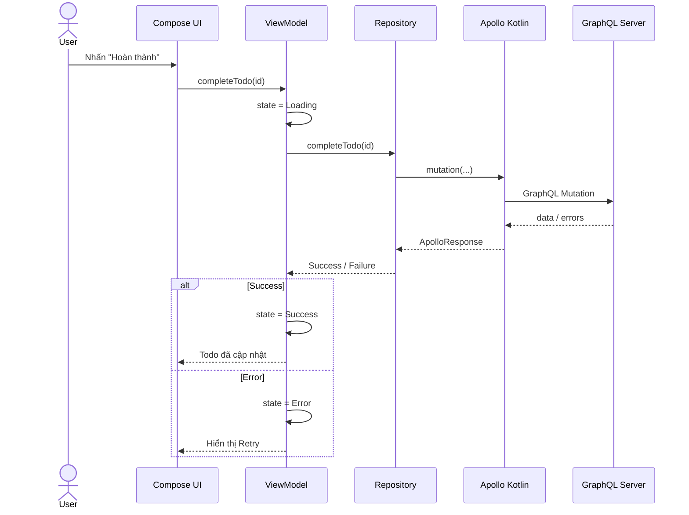
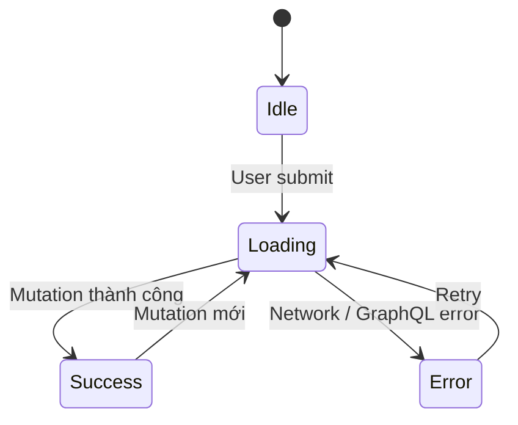
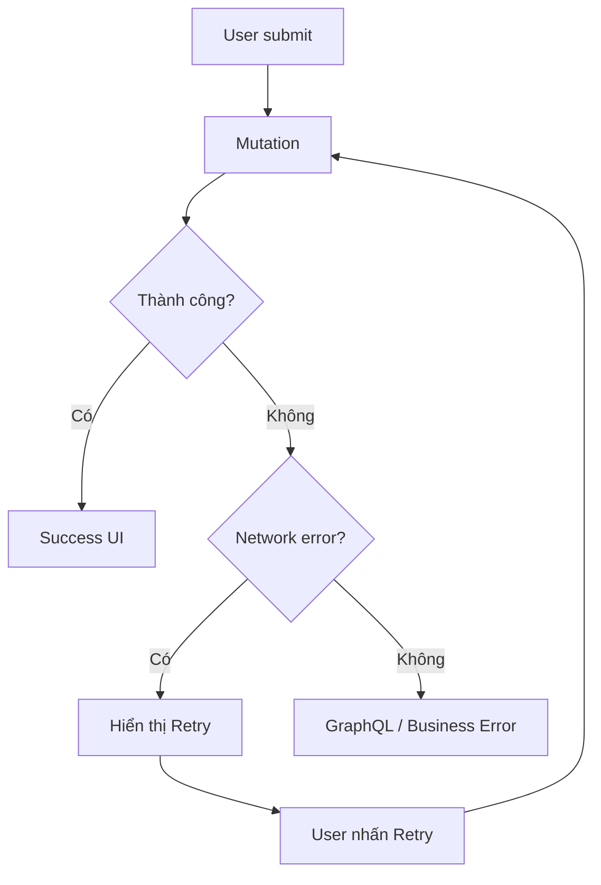
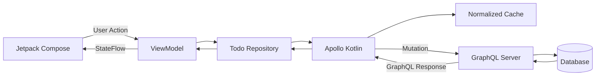

[](https://medium.com/%40theMikhail/launching-apollo-graphql-on-android-40ee0b5789bd?utm_source=chatgpt.com)

# 023 - GraphQL Mutation

| Thuộc tính              | Nội dung                                                     |
| ----------------------- | ------------------------------------------------------------ |
| **Học phần**            | 04 - Network, Async and Services                             |
| **Module**              | Module 07 - Network                                          |
| **Nhóm nội dung**       | HTTP Client and GraphQL                                      |
| **Nguồn roadmap**       | Network / HTTP Client and GraphQL                            |
| **Loại bài**            | Network                                                      |
| **Thứ tự trong module** | 023                                                          |
| **Thời lượng gợi ý**    | 32 phút                                                      |
| **Trọng tâm**           | GraphQL Mutation + Apollo Kotlin + UI State + Error Handling |

---

## 1. Tóm tắt

**GraphQL Mutation** là loại operation dùng để **thay đổi dữ liệu phía server**, chẳng hạn:

* tạo tài khoản;
* cập nhật hồ sơ;
* thêm sản phẩm vào giỏ hàng;
* đánh dấu Todo đã hoàn thành;
* gửi bình luận;
* xoá dữ liệu.

Theo GraphQL, `query` thường đại diện cho thao tác đọc còn `mutation` đại diện cho thao tác ghi. Các side effect theo chuẩn được thực hiện ở các **top-level mutation fields**. ([GraphQL][1])

Trong Android, luồng thường là:

```text
User action
    ↓
Compose / Fragment
    ↓
ViewModel
    ↓
Repository
    ↓
Apollo Kotlin
    ↓
GraphQL Mutation
    ↓
GraphQL Server
    ↓
Response / Error
    ↓
Repository
    ↓
UI State
    ↓
Compose re-render
```

Apollo Kotlin sinh các Kotlin model theo từng GraphQL operation, giúp client làm việc với dữ liệu type-safe thay vì tự parse JSON bằng `Map` hoặc ép kiểu thủ công. ([Apollo GraphQL][2])

---

# 2. Mục tiêu học tập

Sau bài này, bạn nên có thể:

* Giải thích GraphQL Mutation bằng ngôn ngữ của mình.
* Phân biệt `query` và `mutation`.
* Viết một mutation có `variables`.
* Gọi mutation bằng Apollo Kotlin.
* Mapping GraphQL response → model dùng trong UI.
* Biểu diễn các trạng thái:

  * Idle
  * Loading
  * Success
  * Error
* Xử lý:

  * network/fetch error;
  * GraphQL error;
  * partial data;
  * retry.
* Hiểu ảnh hưởng của mutation tới:

  * cache;
  * lifecycle;
  * UX;
  * duplicate request;
  * offline;
  * testing.
* Tạo được một mini project đủ tốt để đưa vào portfolio.

---

# 3. GraphQL Mutation là gì?

Mutation có cú pháp gần giống query, nhưng operation bắt đầu bằng:

```graphql
mutation
```

Ví dụ:

```graphql
mutation UpdateTodo($id: ID!, $completed: Boolean!) {
  updateTodo(
    id: $id
    completed: $completed
  ) {
    id
    title
    completed
  }
}
```

Ở đây:

```text
UpdateTodo
```

là **operation name**.

```graphql
$id
$completed
```

là **variables**.

```graphql
updateTodo
```

là mutation field do GraphQL schema cung cấp.

Còn:

```graphql
id
title
completed
```

là những field mà client muốn server trả về sau khi cập nhật.

GraphQL cho phép mutation field trả về chính dữ liệu vừa được thay đổi, nhờ đó client có thể biết ngay trạng thái mới của entity. ([Apollo GraphQL][3])

---

# 4. Query và Mutation khác nhau thế nào?

| GraphQL Query                   | GraphQL Mutation          |
| ------------------------------- | ------------------------- |
| Chủ yếu đọc dữ liệu             | Thay đổi dữ liệu          |
| `query GetUser`                 | `mutation UpdateUser`     |
| Hiển thị danh sách              | Tạo/sửa/xóa               |
| Thường có thể fetch lại an toàn | Có thể tạo side effect    |
| Retry thường ít nguy hiểm hơn   | Retry cần cẩn thận        |
| `apolloClient.query()`          | `apolloClient.mutation()` |

Ví dụ:

### Query

```graphql
query GetTodo($id: ID!) {
  todo(id: $id) {
    id
    title
    completed
  }
}
```

### Mutation

```graphql
mutation CompleteTodo($id: ID!) {
  completeTodo(id: $id) {
    id
    completed
  }
}
```

---

# 5. Mutation và REST

Nếu dùng REST, bạn có thể có:

```http
PATCH /todos/123
```

Body:

```json
{
  "completed": true
}
```

Trong GraphQL:

```graphql
mutation CompleteTodo($id: ID!) {
  completeTodo(id: $id) {
    id
    completed
  }
}
```

Điểm khác đáng chú ý là GraphQL thường dùng một endpoint GraphQL chung, trong khi operation quyết định hành động cần thực hiện. Khi GraphQL chạy trên HTTP, server phải hỗ trợ `POST` cho mutation; `GET` chỉ được dùng cho `query`, không dùng để thực thi mutation. ([GraphQL][4])

---

# 6. Anatomy của một Mutation

Ví dụ cập nhật profile:

```graphql
mutation UpdateProfile(
  $name: String!
  $bio: String
) {
  updateProfile(
    name: $name
    bio: $bio
  ) {
    id
    name
    bio
    avatarUrl
  }
}
```

Có thể chia thành:

```text
mutation
   │
   ├── Operation name
   │      UpdateProfile
   │
   ├── Variables
   │      $name
   │      $bio
   │
   ├── Mutation field
   │      updateProfile(...)
   │
   └── Selection Set
          id
          name
          bio
          avatarUrl
```

---

# 7. Vì sao nên dùng Variables?

Không nên viết:

```graphql
mutation {
  updateTodo(
    id: "123"
    completed: true
  ) {
    id
  }
}
```

Trong Android app thực tế nên khai báo:

```graphql
mutation UpdateTodo(
  $id: ID!
  $completed: Boolean!
) {
  updateTodo(
    id: $id
    completed: $completed
  ) {
    id
    completed
  }
}
```

Sau đó truyền dữ liệu runtime:

```text
id        = "123"
completed = true
```

GraphQL cũng hỗ trợ `Input Object` để gom nhiều giá trị đầu vào thành một object có cấu trúc. ([GraphQL][1])

Ví dụ:

```graphql
mutation UpdateProfile($input: UpdateProfileInput!) {
  updateProfile(input: $input) {
    id
    name
    bio
  }
}
```

---

# 8. Luồng Mutation trong Android



---

# 9. Cấu hình Apollo Kotlin

Tài liệu Apollo hiện tại sử dụng tên **Apollo Kotlin** và tại thời điểm tra cứu đang minh họa phiên bản `5.0.1`. ([Apollo GraphQL][2])

Ví dụ:

```kotlin
plugins {
    id("com.apollographql.apollo") version "5.0.1"
}

dependencies {
    implementation(
        "com.apollographql.apollo:apollo-runtime:5.0.1"
    )
}
```

Cấu hình code generation:

```kotlin
apollo {
    service("backend") {
        packageName.set("com.example.todo.graphql")
    }
}
```

Apollo đọc các file `.graphql`, validate operation với schema rồi sinh Kotlin class tương ứng. ([Apollo GraphQL][2])

> Khi làm project thực tế, nên kiểm tra phiên bản Apollo Kotlin mới nhất thay vì hard-code phiên bản từ bài học.

---

# 10. Tạo file Mutation

Ví dụ:

```text
src/main/graphql/
├── schema.graphqls
├── GetTodos.graphql
└── UpdateTodo.graphql
```

`UpdateTodo.graphql`:

```graphql
mutation UpdateTodo(
  $id: ID!
  $completed: Boolean!
) {
  updateTodo(
    id: $id
    completed: $completed
  ) {
    id
    title
    completed
  }
}
```

Sau khi build:

```text
UpdateTodo.graphql
       ↓
Apollo Compiler
       ↓
UpdateTodoMutation.kt
```

---

# 11. Gọi Mutation từ Android

Một mutation cơ bản:

```kotlin
val response = apolloClient
    .mutation(
        UpdateTodoMutation(
            id = todoId,
            completed = true
        )
    )
    .execute()
```

Sau đó lấy dữ liệu:

```kotlin
val todo = response.data
    ?.updateTodo
```

Apollo sinh model theo đúng selection set của operation, nên nếu mutation không request một field thì generated result cũng không cung cấp field đó. ([Apollo GraphQL][2])

---

# 12. Không đưa Apollo Response trực tiếp lên UI

Không nên:

```text
Compose
   ↓
ApolloResponse<UpdateTodoMutation.Data>
```

Nên:

```text
GraphQL Model
      ↓
Repository
      ↓
Domain/UI Model
      ↓
ViewModel
      ↓
Compose
```

Ví dụ UI model:

```kotlin
data class TodoUiModel(
    val id: String,
    val title: String,
    val completed: Boolean
)
```

Mapper:

```kotlin
fun UpdateTodoMutation.UpdateTodo.toUiModel() =
    TodoUiModel(
        id = id,
        title = title,
        completed = completed
    )
```

Lợi ích:

```text
GraphQL schema thay đổi
        ↓
Repository / Mapper
        ↓
UI ít bị ảnh hưởng hơn
```

---

# 13. Repository

Ví dụ:

```kotlin
sealed interface UpdateTodoResult {

    data class Success(
        val todo: TodoUiModel
    ) : UpdateTodoResult

    data class Error(
        val message: String
    ) : UpdateTodoResult
}
```

Repository:

```kotlin
class TodoRepository(
    private val apolloClient: ApolloClient
) {

    suspend fun updateTodo(
        id: String,
        completed: Boolean
    ): UpdateTodoResult {

        val response = apolloClient
            .mutation(
                UpdateTodoMutation(
                    id = id,
                    completed = completed
                )
            )
            .execute()

        response.exception?.let {
            return UpdateTodoResult.Error(
                "Không thể kết nối tới máy chủ"
            )
        }

        if (!response.errors.isNullOrEmpty()) {
            return UpdateTodoResult.Error(
                response.errors
                    ?.firstOrNull()
                    ?.message
                    ?: "GraphQL error"
            )
        }

        val todo = response.data
            ?.updateTodo
            ?: return UpdateTodoResult.Error(
                "Không nhận được dữ liệu"
            )

        return UpdateTodoResult.Success(
            todo = todo.toUiModel()
        )
    }
}
```

Trong Apollo Kotlin hiện đại, `ApolloResponse` có ba phần quan trọng là `exception`, `errors` và `data`. `exception` biểu diễn fetch error; `errors` chứa GraphQL errors; còn `data` có thể chứa dữ liệu đầy đủ hoặc một phần. ([Apollo GraphQL][5])

---

# 14. Model UI State

Mutation không nên chỉ có:

```kotlin
Boolean
```

Ví dụ:

```kotlin
var loading: Boolean
```

Không đủ để biểu diễn tất cả trạng thái.

Tốt hơn:

```kotlin
sealed interface MutationUiState {

    data object Idle : MutationUiState

    data object Loading : MutationUiState

    data class Success(
        val todo: TodoUiModel
    ) : MutationUiState

    data class Error(
        val message: String
    ) : MutationUiState
}
```

State machine:



---

# 15. ViewModel

```kotlin
class TodoViewModel(
    private val repository: TodoRepository
) : ViewModel() {

    private val _state =
        MutableStateFlow<MutationUiState>(
            MutationUiState.Idle
        )

    val state: StateFlow<MutationUiState> =
        _state.asStateFlow()

    fun updateTodo(
        id: String,
        completed: Boolean
    ) {
        viewModelScope.launch {

            _state.value =
                MutationUiState.Loading

            when (
                val result =
                    repository.updateTodo(
                        id,
                        completed
                    )
            ) {

                is UpdateTodoResult.Success -> {
                    _state.value =
                        MutationUiState.Success(
                            result.todo
                        )
                }

                is UpdateTodoResult.Error -> {
                    _state.value =
                        MutationUiState.Error(
                            result.message
                        )
                }
            }
        }
    }
}
```

---

# 16. Compose UI

```kotlin
@Composable
fun TodoScreen(
    viewModel: TodoViewModel
) {

    val state by viewModel
        .state
        .collectAsStateWithLifecycle()

    when (val value = state) {

        MutationUiState.Idle -> {
            Text("Sẵn sàng")
        }

        MutationUiState.Loading -> {
            CircularProgressIndicator()
        }

        is MutationUiState.Success -> {
            Text(
                text = "Đã cập nhật: " +
                    value.todo.title
            )
        }

        is MutationUiState.Error -> {

            Column {

                Text(value.message)

                Button(
                    onClick = {
                        viewModel.updateTodo(
                            id = "123",
                            completed = true
                        )
                    }
                ) {
                    Text("Thử lại")
                }
            }
        }
    }
}
```

---

# 17. Error Handling trong GraphQL khác REST ở điểm nào?

Có một chi tiết rất quan trọng:

```text
HTTP 200
```

**không đồng nghĩa mutation chắc chắn thành công hoàn toàn.**

GraphQL response có thể chứa:

```json
{
  "data": {
    "updateProfile": null
  },
  "errors": [
    {
      "message": "Permission denied"
    }
  ]
}
```

GraphQL cho phép response chứa `data`, `errors` và `extensions`; trong trường hợp field error, response có thể chứa đồng thời **partial data + errors**. ([GraphQL][6])

Do đó không nên chỉ kiểm tra:

```kotlin
response.data != null
```

mà cần suy nghĩ về:

```text
Fetch error?
     │
     ├── Yes → Network Error
     │
     └── No
          ↓
GraphQL errors?
     │
     ├── Yes → Business/GraphQL Error
     │
     └── No
          ↓
Data hợp lệ?
     │
     ├── Yes → Success
     │
     └── No → Unexpected Error
```

---

# 18. Ba loại tình huống nên test

## 18.1 Success

```json
{
  "data": {
    "updateTodo": {
      "id": "123",
      "title": "Learn GraphQL",
      "completed": true
    }
  }
}
```

UI:

```text
✓ Đã cập nhật
```

---

## 18.2 GraphQL Error

```json
{
  "data": {
    "updateTodo": null
  },
  "errors": [
    {
      "message": "Todo not found"
    }
  ]
}
```

UI:

```text
Không thể cập nhật Todo.
```

---

## 18.3 Fetch / Network Error

Ví dụ:

```text
No Internet
Timeout
DNS error
HTTP 500
Invalid response
```

Apollo Kotlin đưa fetch error vào `response.exception`; GraphQL errors nằm trong `response.errors`. ([Apollo GraphQL][5])

UI:

```text
Không thể kết nối.
[ Thử lại ]
```

---

# 19. Mutation và Lifecycle

Giả sử:

```text
User nhấn Save
      ↓
Mutation bắt đầu
      ↓
Loading
      ↓
Rotate màn hình
```

Nếu request và state được quản lý trong `ViewModel`:

```text
Activity recreated
      ↓
ViewModel vẫn giữ state
      ↓
UI tiếp tục quan sát
```

Không nên để business mutation trực tiếp trong Composable:

```kotlin
@Composable
fun Screen() {
    // Không nên
    apolloClient
        .mutation(...)
        .execute()
}
```

Vì recomposition không phải tín hiệu phù hợp để thực thi side effect network.

Luồng hợp lý hơn:

```text
UI Event
   ↓
ViewModel
   ↓
Repository
   ↓
Mutation
```

---

# 20. Tránh Double Submit

Ví dụ người dùng nhấn:

```text
[ Thanh toán ]
```

5 lần.

Nếu mỗi lần tạo một mutation:

```text
Mutation #1
Mutation #2
Mutation #3
Mutation #4
Mutation #5
```

thì backend có thể nhận nhiều side effect.

Giải pháp UI:

```kotlin
Button(
    enabled = state !is MutationUiState.Loading,
    onClick = {
        viewModel.updateTodo(...)
    }
)
```

```text
Idle
 ↓
Click
 ↓
Loading
 ↓
Button disabled
```

Với những mutation nhạy cảm như tạo đơn hàng hoặc thanh toán, không nên retry mù quáng. Đây là hệ quả quan trọng của việc mutation có thể tạo side effect phía server; nên phối hợp với backend về cơ chế idempotency nếu nghiệp vụ yêu cầu. ([GraphQL][1])

---

# 21. Mutation và Cache

Một mutation:

```graphql
mutation UpdateTodo($id: ID!) {
  updateTodo(id: $id) {
    id
  }
}
```

chỉ trả:

```text
id
```

Client có thể chưa biết:

```text
completed mới bằng gì?
title thay đổi không?
```

Tốt hơn:

```graphql
mutation UpdateTodo(
  $id: ID!
  $completed: Boolean!
) {
  updateTodo(
    id: $id
    completed: $completed
  ) {
    id
    title
    completed
  }
}
```

Với normalized cache, Apollo Kotlin có thể cập nhật entity cache khi mutation trả về identity và các field đã thay đổi; query watchers liên quan sau đó có thể nhận giá trị mới. ([Apollo GraphQL][7])

```text
Mutation
   ↓
Server
   ↓
Updated entity
   ↓
Apollo Cache
   ↓
Query watcher
   ↓
UI update
```

---

# 22. Optimistic UI

Giả sử người dùng nhấn:

```text
♡
```

để like bài viết.

Cách thông thường:

```text
Click
 ↓
Request
 ↓
300 ms
 ↓
Server response
 ↓
♥
```

Optimistic UI:

```text
Click
 ↓
♥ ngay lập tức
 ↓
Mutation chạy nền
 ↓
Server confirm
```

Nếu server thất bại:

```text
♥
 ↓
ERROR
 ↓
♡ rollback
```

Apollo Kotlin hỗ trợ optimistic updates khi normalized cache được cấu hình cho chức năng này. ([Apollo GraphQL][7])

Phù hợp cho:

* like;
* favorite;
* checkbox;
* reaction;
* một số thao tác UI có kết quả dễ dự đoán.

Không nên sử dụng thiếu cân nhắc cho:

* payment;
* đặt vé;
* chuyển tiền;
* operation có kết quả khó đoán.

---

# 23. Retry và Offline

Một flow đơn giản:



### Cần lưu ý

Với mutation:

```text
Retry ≠ luôn luôn an toàn
```

Ví dụ:

```graphql
mutation CreateOrder
```

Client timeout không nhất thiết có nghĩa server chưa tạo order.

Có thể xảy ra:

```text
Server:
Create Order ✓

        ↓

Network response bị mất

        ↓

Client:
"Request failed"

        ↓

Retry

        ↓

Order thứ hai được tạo
```

Do đó mutation có side effect quan trọng cần được thiết kế cùng backend để tránh duplicate operation.

---

# 24. Testing GraphQL Mutation

Tối thiểu nên có:

| Test             | Mong đợi                             |
| ---------------- | ------------------------------------ |
| Mutation success | UI → Success                         |
| GraphQL error    | UI → Error                           |
| Network error    | UI → Error                           |
| Retry            | Error → Loading → Success            |
| Double click     | Không gửi nhiều request ngoài ý muốn |
| Rotation         | Không tự tạo mutation mới            |
| Cache update     | UI đọc entity mới                    |
| Loading          | Disable button                       |

Apollo cung cấp công cụ test/mocking ở cấp network; ví dụ tài liệu hiện tại mô tả `MockServer` cho các tình huống như response lỗi, header, HTTP status và latency, nhưng API này được đánh dấu experimental. ([Apollo GraphQL][8])

---

# 25. Ví dụ Test ViewModel

Fake repository thường giúp unit test đơn giản hơn việc gọi network thật:

```kotlin
@Test
fun `mutation success updates UI state`() =
    runTest {

        val repository =
            FakeTodoRepository(
                result =
                    UpdateTodoResult.Success(
                        TodoUiModel(
                            id = "1",
                            title = "GraphQL",
                            completed = true
                        )
                    )
            )

        val viewModel =
            TodoViewModel(repository)

        viewModel.updateTodo(
            id = "1",
            completed = true
        )

        advanceUntilIdle()

        assertTrue(
            viewModel.state.value
                is MutationUiState.Success
        )
    }
```

Quan trọng là test:

```text
Input
 ↓
Mutation Result
 ↓
State transition
```

thay vì test chi tiết implementation của Apollo.

---

# 26. Debugging Mutation

Khi mutation lỗi, kiểm tra theo thứ tự:

```text
1. Operation đúng chưa?
        ↓
2. Variables đúng kiểu chưa?
        ↓
3. Authorization?
        ↓
4. HTTP / network?
        ↓
5. response.exception?
        ↓
6. response.errors?
        ↓
7. response.data?
        ↓
8. Cache có được cập nhật?
        ↓
9. ViewModel đã emit state?
        ↓
10. UI có collect state?
```

GraphQL response có thể cung cấp thông tin lỗi trong `errors`, còn `extensions` có thể được server dùng cho metadata bổ sung như telemetry hoặc rate-limit information tùy implementation. ([GraphQL][6])

---

# 27. Kiến trúc đề xuất



---

# 28. UX cần quan tâm

Mutation tác động trực tiếp tới UX.

### Loading

Không để người dùng nghĩ nút không hoạt động:

```text
Save
```

→

```text
Saving...
```

---

### Success

Có feedback:

```text
✓ Đã lưu
```

---

### Error

Không chỉ ghi:

```text
Error
```

Nên:

```text
Không thể lưu thay đổi.
Kiểm tra kết nối và thử lại.

[ Thử lại ]
```

---

### Prevent duplicate

```text
Loading
   ↓
Disable Submit
```

---

# 29. Bài thực hành

## Mini App: Todo Mutation

Yêu cầu màn hình:

```text
┌────────────────────────────┐
│ Todo Detail                │
├────────────────────────────┤
│                            │
│ Learn GraphQL Mutation     │
│                            │
│ [ ] Completed              │
│                            │
│       [ SAVE ]             │
│                            │
└────────────────────────────┘
```

Mutation:

```graphql
mutation UpdateTodo(
  $id: ID!
  $completed: Boolean!
) {
  updateTodo(
    id: $id
    completed: $completed
  ) {
    id
    title
    completed
  }
}
```

Phải demo được bốn trạng thái:

```text
Idle
 ↓
Loading
 ↓
┌───────────┬─────────────┐
│ Success   │ Error       │
└───────────┴─────────────┘
                  ↓
                Retry
```

---

# 30. Bài tập

Xây dựng hoặc mock một API GraphQL có mutation:

```graphql
mutation UpdateProfile
```

hoặc:

```graphql
mutation CompleteTodo
```

Ứng dụng phải có:

```text
Loading
Success
Error
Retry
```

### Bonus

Thêm:

```text
Optimistic update
```

hoặc:

```text
Normalized cache
```

---

# 31. Artifact cho Portfolio

Một repository nhỏ:

```text
graphql-mutation-demo/
│
├── app/
│
├── graphql/
│   └── UpdateTodo.graphql
│
├── data/
│   ├── TodoRepository.kt
│   └── TodoMapper.kt
│
├── ui/
│   ├── TodoViewModel.kt
│   ├── TodoUiState.kt
│   └── TodoScreen.kt
│
└── README.md
```

README nên có:

```text
GraphQL Mutation
      ↓
Apollo Kotlin
      ↓
Repository
      ↓
ViewModel
      ↓
StateFlow
      ↓
Jetpack Compose
```

Kèm screenshot:

```text
01_loading.png
02_success.png
03_error.png
04_retry.png
```

Đây sẽ có giá trị portfolio hơn chỉ đưa một đoạn:

```kotlin
apolloClient.mutation(...).execute()
```

---

# 32. Checklist hoàn thành

* [ ] Giải thích được GraphQL Mutation.
* [ ] Phân biệt được Query và Mutation.
* [ ] Biết mutation có thể tạo side effect.
* [ ] Biết sử dụng GraphQL variables.
* [ ] Có file `.graphql`.
* [ ] Apollo generate Kotlin model thành công.
* [ ] Gọi được `apolloClient.mutation()`.
* [ ] Không đưa GraphQL model thẳng lên UI nếu kiến trúc cần tách lớp.
* [ ] Có Repository.
* [ ] Có ViewModel.
* [ ] Có `StateFlow`.
* [ ] Có `Idle`.
* [ ] Có `Loading`.
* [ ] Có `Success`.
* [ ] Có `Error`.
* [ ] Có Retry.
* [ ] Phân biệt fetch error và GraphQL error.
* [ ] Xử lý hoặc có quyết định rõ ràng về partial data.
* [ ] Không tự gửi lại mutation khi recomposition.
* [ ] Hạn chế double submit.
* [ ] Hiểu tác động của mutation tới cache.
* [ ] Có unit test hoặc mock network.
* [ ] Có screenshot/demo cho portfolio.

---

# 33. Production Notes

Trước khi đưa một GraphQL Mutation vào production, hãy hỏi:

### Lifecycle

```text
Rotate màn hình có gửi mutation lại không?
```

### State

```text
Loading / Success / Error
được giữ ở đâu?
```

### Duplicate request

```text
Double click có tạo dữ liệu hai lần không?
```

### Retry

```text
Mutation này retry có an toàn không?
```

### Error

```text
Đã phân biệt:

Fetch Error
GraphQL Error
Business Error
Partial Data

chưa?
```

### Cache

```text
Mutation trả đủ các field đã thay đổi chưa?
```

Apollo Kotlin có thể dùng dữ liệu mutation trả về để cập nhật normalized cache nếu response cung cấp các field cần thiết và entity có thể được nhận diện đúng. ([Apollo GraphQL][7])

### Security

Không log trực tiếp:

```text
password
access token
refresh token
payment data
personal data
```

### Testing

Ít nhất:

```text
Success
Network Error
GraphQL Error
Retry
Duplicate submit
```

---

# 34. Ghi nhớ nhanh

```text
QUERY
"Cho tôi dữ liệu"

MUTATION
"Hãy thay đổi dữ liệu"
```

Và trên Android:

```text
User Action
    ↓
ViewModel
    ↓
Repository
    ↓
Apollo Kotlin
    ↓
GraphQL Mutation
    ↓
Server
    ↓
ApolloResponse
    ↓
data / errors / exception
    ↓
UI State
    ↓
Compose
```

Điểm quan trọng nhất của bài này không phải chỉ là nhớ:

```kotlin
apolloClient.mutation(...)
```

mà là hiểu cả chuỗi:

> **Mutation → side effect → response → error handling → cache → lifecycle → UI state → retry → testing → production risk.**

GraphQL định nghĩa mutation như cơ chế ghi/thay đổi dữ liệu phía server, còn Apollo Kotlin cung cấp lớp client type-safe để Android thực thi những operation đó và xử lý dữ liệu trả về. ([Apollo GraphQL][3])

[1]: https://graphql.org/learn/mutations/ "Mutations | GraphQL"
[2]: https://www.apollographql.com/docs/kotlin "Introduction to Apollo Kotlin - Apollo GraphQL Docs"
[3]: https://www.apollographql.com/docs/kotlin/essentials/mutations "Mutations in Apollo Kotlin - Apollo GraphQL Docs"
[4]: https://graphql.org/learn/serving-over-http/ "Serving over HTTP | GraphQL"
[5]: https://www.apollographql.com/docs/kotlin/essentials/errors "Error handling - Apollo GraphQL Docs"
[6]: https://graphql.org/learn/response/ "Response | GraphQL"
[7]: https://www.apollographql.com/docs/kotlin/caching/query-watchers "Watching cached data - Apollo GraphQL Docs"
[8]: https://www.apollographql.com/docs/kotlin/testing/mocking-http-responses "Mocking HTTP responses (experimental) - Apollo GraphQL Docs"
